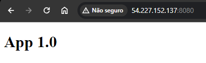
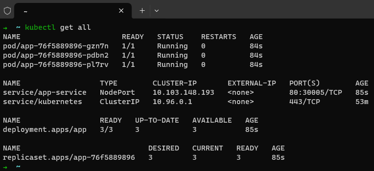
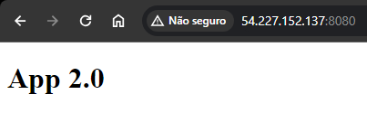
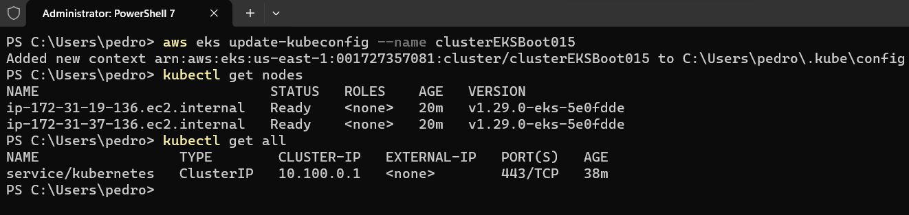
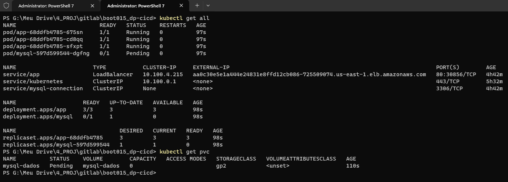
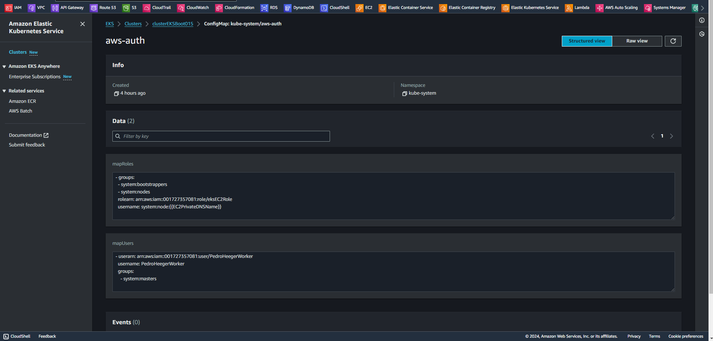
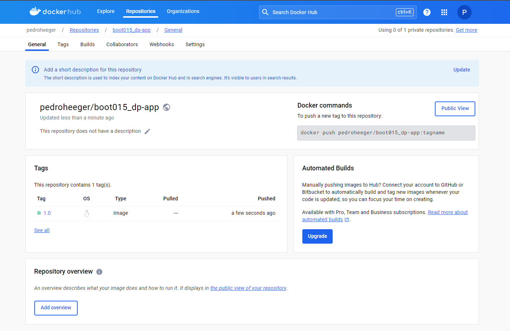
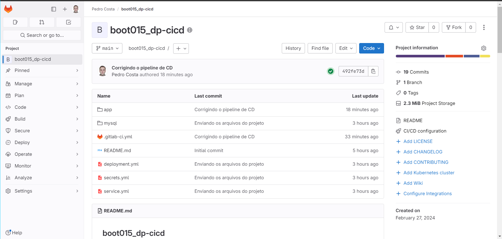
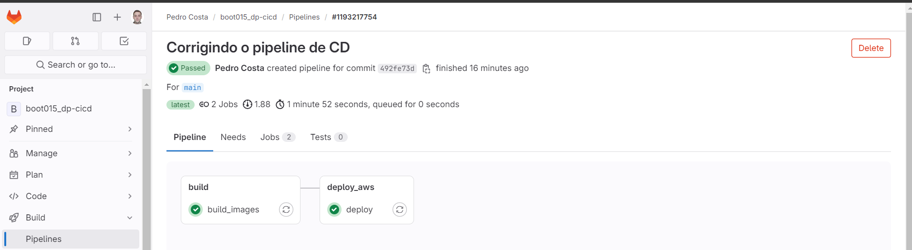
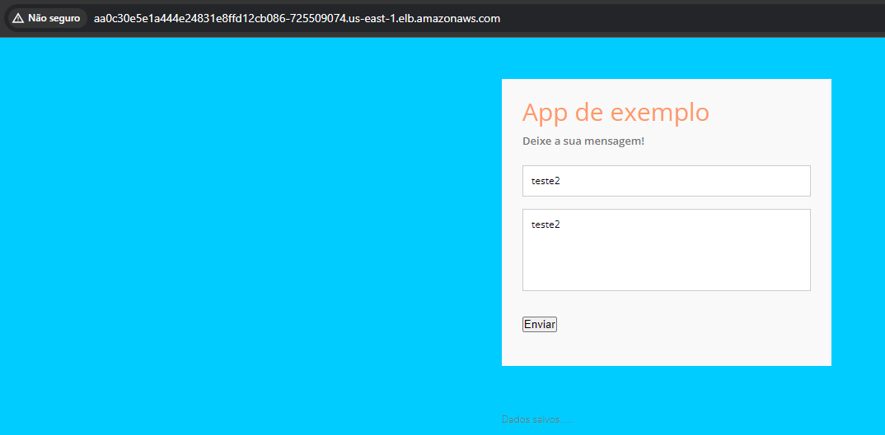

# Formação Kubernetes Fundamentals - Módulo 4   

### Repository: [boot](../../../../)   
### Platform: <a href="../../../">dio   </a>   
### Software/Subject: <a href="../../">kubernetes   </a>
### Bootcamp: <a href="../">boot_015 (Formação Kubernetes Fundamentals)   </a>
### Module: 4. Automatizando Deployments com Kubernetes 

---

This folder refers to Module 4 **Automatizando Deployments com Kubernetes** from bootcamp [**Formação Kubernetes Fundamentals**](../).

### Theme:
- DevOps
- Distributed Computing

### Used Tools:
- Operating System (OS): 
  - Linux   
  - Windows 11   
- Linux Distribution:
  - Ubuntu   
- Cloud:
  - Amazon Web Services (AWS)   
- Cloud Services:
  - Amazon Elastic Compute Cloud (EC2)   
  - Amazon Elastic Kubernetes Service (EKS)   
  - AWS Identity and Access Management (IAM)   
  - Google Drive 
- Containerization: 
  - Docker   
- Cluster Management Software:
  - Kubernetes   
  - MiniKube   
- Language:
  - HTML   
  - Markdown   
  - YAML   
- Integrated Development Environment (IDE) and Text Editor:
  - Nano   
  - Vi   
  - VI iMproved (Vim)   
  - Visual Studio Code (VS Code)   
- Versioning: 
  - Git   
- Repository:
  - GitHub   
  - GitLab   
- Command Line Interpreter (CLI):
  - AWS Command Line Interface (CLI)   
  - Bash e Sh   
  - Kubectl   
  - Oh My Zshell (Oh My ZSh)   
  - Windows PowerShell   
  - ZShell   
- Server and Databases:
  - Apache HTTP Server (httpd)   
  - MySQL Server   
- Database Administration Tool:
  - SQLPro Studio   
- Workflow Management System (WFMS):
  - GitLab CI/CD   
- Tools:
  - Advanced Package Tool (Apt-Get)   
  - Curl   
- Network:
  - OpenSSH   

---

### Bootcamp Module 4 Structure
4. <a name="item4">Automatizando Deployments com Kubernetes</a><br>
  4.1. <a href="#item4.1">Deployment e Roolback em Clusters Kubernetes</a><br>
  4.2. <a href="#item4.2">CI-CD Utilizando Kubernetes</a><br>
  4.3. <a href="#item4.3">Criando um Pipeline de Deploy com GitLab e Kubernetes</a><br>
  4.4. Materiais Complementares: Arquitetura e Deploy de Microsserviços  

---

### Objective:
O objetivo deste módulo do bootcamp foi mostrar como realizar o processo de roolback entre as implantações realizadas e como criar e utilizar o objeto *Secret*. Também foi explicado os conceitos de *Continuous Integration (CI)* e *Continuous Delivery (CD)* que são práticas de desenvolvimento de software bastante utilizadas para acelerar o processo de deploy de um software com alta qualidade.

### Structure:
A estrutura das pastas obedeceu a estruturação do bootcamp, ou seja, conforme foi necessário, sub-pastas foram criadas para os cursos específicos deste módulo. Na imagem 01 é exibida a estruturação das pastas. 

<div align="Center"><figure>
    <br>
    <figcaption>Imagem 01.</figcaption>
</figure></div><br>

### Development:
O desenvolvimento deste módulo do Bootcamp foi dividido em dois cursos. Abaixo é explicado o que foi desenvolvido em cada uma dessas atividades.

<a name="item4.1"><h4>4.1 Deployment e Roolback em Clusters Kubernetes</h4></a>[Back to summary](#item4) | <a href="https://github.com/PedroHeeger/main/blob/main/cert_ti/04-curso/distributed_computing/kubernetes/(24-02-19)_Deployment...Roolback_PH_DIO.pdf">Certificate</a>

No primeiro curso do último módulo, foi explicado sobre o roolback que é quando um deployment implantado em uma versão mais nova precisa voltar para versão anterior. Para que isso ocorresse, ao implantar o deployment ou qualquer outro objeto **Kubernetes** era necessário registrar o comando de implantação. A pasta [rollout](./rollout/) foi construída na instância do EC2 e dentro dela o arquivo [deploy.yml](./rollout/deploy.yml) foi elaborado para exemplificar esta situação. Este arquivo criou um deployment com 3 réplicas, cujo nome dele, da label, do seletor, da label do template e do container foi `httpd`. A imagem utilizada foi a `httpd:2` e a porta onde seria executada o servidor web **Apache HTTP (Httpd)** era a `80`. No diretório do arquivo, com o comando `kubectl apply -f deploy.yml --record` foi utilizado o parâmetro `--record` que registrava os comandos em um histórico.
A visualização desse histórico foi realizada com execução do comando `kubectl rollout history deployment httpd`, conforme imagem 02.

<div align="Center"><figure>
    <br>
    <figcaption>Imagem 02.</figcaption>
</figure></div><br>

Após isso, o mesmo arquivo de deployment foi modificado, alterando a imagem do container para `httpd:latest` e novamente com o comando `kubectl apply -f deploy.yml --record` essa nova implantação foi realizada. Ao consultar o histórico com o comando `kubectl rollout history deployment httpd`, agora existiam dois registros, o primeiro na versão 2 e o segundo na versão `latest` que era a que estava implantada no momento. Novamente, o arquivo de deployment foi alterado, modificando a imagem agora para `httpd:errado` que era uma imagem que não existe, só para provocar o erro. Ao consultar o histórico, conforme imagem 03, agora existem três registros, sendo o terceiro em execução que era o que possuía a imagem incorreta.

<div align="Center"><figure>
    <br>
    <figcaption>Imagem 03.</figcaption>
</figure></div><br>

Com esse histórico foi possível aproveitá-lo para executar o roolback que era justamente voltar para a revisão 2 cujo a imagem era a `latest`. Então foi utilizado o comando `kubectl rollout undo deploy` e com o comando `kubectl describe pod httpd-6d6b866d8f-kgpx8` foi possível verificar que a imagem utilizada era agora a `latest`, evidenciado na imagem 04.

<div align="Center"><figure>
    <br>
    <figcaption>Imagem 04.</figcaption>
</figure></div><br>

No histórico a revisão utilizada era a 3 que tinha a imagem `errada`, quando o roolback foi realizado, retornou para revisão 2, cuja imagem era `latest`, e essa revisão 2 passou a ser a revisão 4, não existindo mais a revisão 2. Isso é mostrado na imagem 05 a seguir. Caso fosse executado novamente o comando de roolback, a revisão iria de 4 para 3, ou seja, a imagem do container alteraria de `latest` para `errada`.

<div align="Center"><figure>
    <br>
    <figcaption>Imagem 05.</figcaption>
</figure></div><br>

Com o comando `kubectl rollout undo deploy --to-revision=1` agora era definido para qual revisão deveria ser retornado ao realizar o roolback. Logo a revisão 1, cuja imagem era `2`, tornou-se revision 5, e a 1 não existia mais. A imagem 06 mostra o histórico de revisões. Enquanto a imagem 07 exibe a imagem do container na revisão atual do deployment. 

<div align="Center"><figure>
    <br>
    <figcaption>Imagem 06.</figcaption>
</figure></div><br>

<div align="Center"><figure>
    <br>
    <figcaption>Imagem 07.</figcaption>
</figure></div><br>

Em todo esse processo, na verdade, o deployment era o mesmo, o que modificava era o replicaset. O replicaset garante que um número específico de réplicas de pod esteja em execução a qualquer momento. Então o que era alterado era o replicaset e cada replicaset tinha seus pods com containers utilizando a imagem determinada.

Para melhor organização com relação ao arquivo de manifesto **YAML** é indicado utilizar um número determinando a revisão, por exemplo `app-html1.0.yml`. Assim quando for listado no histórico os comandos executados (`kubectl rollout history deployment httpd`), cada arquivo vai ter seu nome com um número de revisão que facilitará a identificação. Nesse caso, seria necessário criar cada arquivo individualmente com suas modificações, mesmo que mínimas. Na imagem 08 é mostrado o histórico com os nomes de arquivos com suas respectivas revisões.

<div align="Center"><figure>
    <br>
    <figcaption>Imagem 08.</figcaption>
</figure></div><br>

Nessa próxima etapa foi abordado sobre a *Secret*, que é um objeto do **Kubernetes** que contém uma pequena quantidade de informação sensível, como senhas, tokens ou chaves. Este tipo de informação poderia, em outras circunstâncias, ser colocada diretamente em uma configuração de Pod ou em uma imagem de container. O uso de Secrets evita que seja incluído dados confidenciais no código. Secrets podem ser criados de forma independente dos Pods que os consomem. Isto reduz o risco de que o Secret e seus dados sejam expostos durante o processo de criação, visualização e edição ou atualização de Pods.

Um novo arquivo de manifesto **YAML** de nome [secrets.yml](./rollout/secrets.yml) foi elaborado dentro da pasta `rollout`. Este construíu um objeto secret de nome `my-secret`, definindo o tipo `Opaque` e em `data` um par chave e valor de uma variável de ambiente e seu valor. Nesse caso, foram criadas as variáveis `ROOT_PASSWORD` e `MYSQL_DATABASE` que seriam informadas no arquivo de deployment do banco de dados. Com o comando `kubectl apply -f secrets.yml`, o objeto secrets foi implantado e foi exibido com o comando `kubectl get secret`, conforme imagem 09.

<div align="Center"><figure>
    <br>
    <figcaption>Imagem 09.</figcaption>
</figure></div><br>

Com o secret implatando, um arquivo de deployment de banco de dados **MySQL Server** foi desenvolvido (`kubectl apply -f mysql.yml`). O nome desse arquivo foi [mysql.yml](./rollout/mysql.yml) e o nome do deployment foi `mysql-deployment`. A label, o seletor, a label do template e o nome do container foram definidos como `mysql`. O número de réplicas foi de apenas `1`, a imagem utilizada no container foi `mysql:5:7` e a porta foi a padrão do MySQL (`3306`). A grande mudança foi na forma como as variáveis de ambientes eram definidas, agora com utilização das secrets sem passar informações sensíveis direto no código. Utilizando o comando `kubectl describe pod mysql-deployment-bb9c87b6b-929bm`, perceba que as variáveis não estão referenciadas no pod, conforme comprovado na imagem 10 abaixo.

<div align="Center"><figure>
    <br>
    <figcaption>Imagem 10.</figcaption>
</figure></div><br>

<a name="item4.2"><h4>4.2 CI-CD Utilizando Kubernetes</h4></a>[Back to summary](#item4) | <a href="https://github.com/PedroHeeger/main/blob/main/cert_ti/04-curso/distributed_computing/kubernetes/(24-02-20)_CI-CD...Kubernetes_PH_DIO.pdf">Certificate</a>

A implantação (Deploy) envolve mover o software de um ambiente controlado para outro. Um ambiente é um subconjunto de infraestrutura de TI usado para uma finalidade específica. Com o objetivo de aprimorar e agilizar os processos de deploy, existem práticas de desenvolvimento de software muito utilizadas na metodologia *DevOps*. O *DevOps* é uma metodologia de desenvolvimento de software mais atual que envolve a colaboração entre os desenvolvedores de software e as equipes de operações de infraestrutura, garantindo que as mudanças de software possam ser implantadas de forma segura e eficiente em ambientes de produção. 

O *DevOps* utiliza práticas de desenvolvimento de software como *Continuous Integration (CI)* e *Continuous Delivery (CD)*. A integração contínua é uma prática de desenvolvimento de software em que os desenvolvedores, com frequência, juntam suas alterações de código em um repositório central. Depois disso, criações e testes são executados. Os principais objetivos da integração contínua são encontrar e investigar erros mais rapidamente, melhorar a qualidade do software e reduzir o tempo necessário para validar e lançar novas atualizações de software. Já a entrega contínua é uma prática de desenvolvimento de software em que alterações de código são criadas, testadas e preparadas automaticamente para liberação para produção. Ela expande com base na integração contínua, pela implantação de todas as alterações de código em um ambiente de teste e/ou ambiente de produção, após o estágio de criação. Quando a integração contínua for implementada adequadamente, os desenvolvedores sempre terão um artefato de criação pronto para ser implantado, e que passou por um processo de teste padronizado.

Nesse curso foi apresentada a plataforma **GitLab** que é um gerenciador de repositório de software baseado em **Git**, com suporte a Wiki, gerenciamento de tarefas e CI/CD. **GitLab** é similar ao **GitHub**, mas o **GitLab** permite que os desenvolvedores armazenem o código em seus próprios servidores, ao invés de servidores de terceiros. Como ainda não tinha cadastro nessa plataforma, foi necessário criar um. Também foi preciso criar um *Personal Access Tokens (PAT)* para ser utilizado ao credenciar o **Git** de uma maquina nesta conta do **GitLab**. Para fazer isso foi escolhida a opção `Search or go to...`, que é a lupa, e então uma caixa foi aberta e foi clicada na opção `profile`. Assim a barra lateral alterou para o `User Settings` e então apareceu a opção `Access Tokens` que foi escolhida. Dentro do PAT, foi clicada na opção `Add new Token`, um nome foi definido para esse token e as permissões que ele teria, que no caso foram todas, a data foi mantida em branco, logo foi definido um prazo de 1 ano para expiração. O segredo do token foi copiado e armazenado, era com ele que seria feito o login do **Git** da maquina utilizada no **GitLab**.

Após o cadastro e a criação do token, foi desenvolvido um projeto cujo nome foi `boot015_app-cicd`, o nível de visibilidade foi público e ele já foi iniciado com um arquivo de README. A instância do EC2, onde o cluster do **MiniKube** era executada já vinha com o software **Git** instalado. Então com o comando `git config --global user.email "seu email"` e `git config --global user.name "Pedro Heeger"` foram definidos o nome e email do usuário que estaria executando os comandos Git nesta maquina. Em seguida, o diretório [cicd](./cicd/) foi criado na pasta do usuário na instância. Dentro deste diretório, a sub-pasta [app](./cicd/app/) foi construída e dentro dela, o arquivo [index.html](./cicd/app/index.html) foi elaborado apenas colocando no título e no body a frase `App 1.0` para representar a aplicação na versão 1.0.

Para indicar que a pasta criada seria um repositório, dentro dela foi preciso executar o comando `git init --initial-branch=main`. Em seguida com o comando `git remote add origin https://gitlab.com/pedroheeger1/boot015_app-cicd.git` foi vinculado o repositório local (a pasta) com o repositório remoto no **GitLab**. Eram os mesmos comandos utilizados com o **GitHub**. Para fazer o primeiro push foi executado o comando `git add .` para adicionar os arquivos, no caso o arquivo `index.html`, à área de stagging. Depois o comando `git commit -m "Commit inicial"` para commitar essa alteração e então enviá-la com o comando `git push --set-upstream origin main`. Neste caso, foi solicitado o nome de usuário, que era o email e a senha, sendo passado no lugar dela o secret do PAT. A imagem 11 mostra o arquivo já no repositório do **GitLab**. Enquanto a imagem 12 exibe os comandos executados no terminal.

<div align="Center"><figure>
    <br>
    <figcaption>Imagem 11.</figcaption>
</figure></div><br>

<div align="Center"><figure>
    <br>
    <figcaption>Imagem 12.</figcaption>
</figure></div><br>

Dentro do diretório `app` foi elaborado o arquivo [dockerfile](./cicd/app/dockerfile) para construção da imagem **Docker** da aplicação. Este arquivo utilizou como imagem base a do servidor web **Apache HTTP (Httpd)** (`httpd:latest`), definiu como diretório de trabalho a pasta padrão do Httpd (`/var/www/html/`), copiou o arquivo `index.html` para dentro dela e definiu a exposição da aplicação na porta `80`. Até essa parte, era basicamente o que vinha sendo feito nos cursos anteriores.

Voltando para o diretório `cicd`, foi criado o arquivo CI do **GitLab**, cujo nome era [.gitlab-ci.yml](./cicd/.gitlab-ci.yml), sendo ele um arquivo **YAML**. Antes de explicar sobre o arquivo, no **GitLab**, na opção `Settings`, `CI/CD`, em `Variables` foram cadastradas as variáveis de ambiente `DOCKERHUB_USER` e `DOCKERHUB_PASSWORD` para conexão do **GitLab** a minha conta do **Docker Hub**. Na variável `DOCKERHUB_PASSWORD` foi cadastrado o secret access key ao invés da senha, pois minha conta do **Docker Hub** já possuía a access key de nome `Access_PH_GitHub` destinada para o **GitHub** que foi aproveitada para o **GitLab**. A flag `Protect variable` foi mantida marcada, o `Type` foi `Variable (default)` e `Environments` foi `All (default)`.

Com relação ao arquivo, dois stages foram desenvolvidos. O primeiro stage foi o build que realizou o build e o push da imagem `pedroheeger/boot015_app-cicd:1.0`. Mas para conseguir fazer o build da imagem, esse stage precisou da imagem `docker:20.10.16`, que é uma imagem do **Docker**, e o `service` desse stage utilizou a imagem `docker:20.10.16-dind` que é o daemon do **Docker**. Em `variables` foi preciso especificar onde seria gerado os certificados do **Docker**, então utilizou-se `DOCKER_TLS_CERTDIR: "/certs"`. Antes de executar o script que faria o build e o push, era necessário logar na conta do **Docker Hub** e isso foi realizado em `before_script` com o comando `docker login -u $DOCKERHUB_USER -p $DOCKERHUB_PASSWORD`, justamente passando as variáveis criadas no **GitLab**. Assim, era evitado compartilhar dados sensíveis no arquivo.

Um novo envio para o repositório remoto no **GitLab** foi realizado com os comandos `git add`, `git commit` e `git push`. Dessa forma, o pipeline de CI era iniciado pelo **GitLab** e pôde ser visualizado na opção `Build` em `Pipelines`, conforme mostrado na imagem 13 abaixo. Na imagem 14, o repositório no **Docker Hub** é visualizado.

<div align="Center"><figure>
    <br>
    <figcaption>Imagem 13.</figcaption>
</figure></div><br>

<div align="Center"><figure>
    <br>
    <figcaption>Imagem 14.</figcaption>
</figure></div><br>

Para o segundo stage era necessário o arquivo de deployment, cujo nome foi [deployment.yml](./cicd/deployment.yml). Neste arquivo foi construído um deployment, no qual o nome dele, da sua label, do seletor, da label do template e do container foi `app`. A imagem utilizada foi a enviada para o repositório no **Docker Hub**, `pedroheeger/boot015_app-cicd:1.0` e a porta onde a aplicação rodaria no container foi definida como `80`. Um service do tipo node port também foi desenvolvido, sendo seu nome igual a `app-service`. Um seletor foi definido apontando para o nome do pod do deployment (`app`) e na configuração de porta, a porta `80` foi definida para o service e para o alvo nos containers dos pods e a node port foi determinada em `30005`.

No segundo stage foram passados alguns comandos na opção `script` para serem executados. Aqui teve um ponto delicado, pois o deployment precisava ser implantado em um ambiente com cluster **Kubernetes** e como os comandos eram executados pelo ambiente do **GitLab**, este não tinha um cluster para receber a implantação da aplicação. O ideal seria implantar em um ambiente de nuvem com serviço como o **Amazon Elastic Kubernetes Service (EKS)**, mas isso foi realizado na próxima atividade que era o desafio de projeto. Nessa atividade, foi procurado uma forma de executar no cluster criado pelo **MiniKube** na instância do EC2. A forma encontrada foi realizar conexões SSH do ambiente do **GitLab** com a instância do EC2 e solicitar que ela executasse comandos com o **Kubectl**.

Para utilizar o **OpenSSH** foi preciso passar o valor do arquivo par de chaves para uma variável criada no **GitLab** de nome `KEYPAIR_CONTENT` e então executar os comandos em `script`. O primeiro comando foi o `echo "$KEYPAIR_CONTENT" > key.pem` para trazer o valor da variável construída para o arquivo `key.pem`. Com o comando `chmod 600 key.pem` foi concedida permissões para este arquivo. Então com o comando `ssh -o StrictHostKeyChecking=no -i key.pem ubuntu@54.227.152.137 "kubectl apply -f /home/cicd/deployment.yml"` foi realizado um acesso remoto com **OpenSSH** na instância do EC2 informando o arquivo par de chaves e solicitando que o **Kubectl** da instância executasse a implantação do deployment através do arquivo definido. A opção `-o StrictHostKeyChecking=no` era para que o **OpenSSH** ignorasse a pergunta se o host era conhecido, pois o host era a instância do EC2, então era conhecido. Por fim, com o comando `ssh -o StrictHostKeyChecking=no -i key.pem ubuntu@54.227.152.137 "nohup kubectl port-forward --address 0.0.0.0 service/app-service 8080:80" > /dev/null 2>&1 & disown`, um novo acesso remoto foi realizado, mas agora para execução do port-forward, ou seja, para realizar o encaminhamento de portas entre a porta do host (instância do EC2) que era a porta `8080` com a porta `80` do service da aplicação no cluster. O argumento `--address 0.0.0.0` especificava que a escuta deveria ser feita em todas as interfaces de rede, tornando o serviço acessível de qualquer endereço IP. Assim, como a aplicação era executado na instância do EC2, ela seria acessível pela internet. Contudo, para que de fato fosse possível acessá-la, uma regra de entrada no grupo de segurança liberando a porta `8080` deveria ser realizada.especifica que a escuta deve ser feita em todas as interfaces de rede, tornando o serviço acessível de qualquer endereço IP. Na imagem 15 abaixo foi acessada a aplicação no navegador da maquina física através do IP público da instância do EC2 concatenado com `:` e a porta `8080`, definida no port-forward. Já na imagem 16 são listado os objetos do cluster **Kubernetes** construído na instância do EC2.

<div align="Center"><figure>
    <br>
    <figcaption>Imagem 15.</figcaption>
</figure></div><br>

<div align="Center"><figure>
    <br>
    <figcaption>Imagem 16.</figcaption>
</figure></div><br>

Após isso, foi realizado uma alteração no arquivo `index.html` modificando ele para versão 2.0, alterando a tag da imagem do **Docker** utilizada para `pedroheeger/boot015_app-cicd:2.0` nos arquivos de manifesto e enviando novamente para **GitLab**. Todo o processo de build da imagem e deploy da aplicação era realizado pelos pipelines. A imagem 17 exibe a aplicação containerizada na versão 2.0.

<div align="Center"><figure>
    <br>
    <figcaption>Imagem 17.</figcaption>
</figure></div><br>

Uma observação a ser realizada, foi que durante todo o bootcamp, três instâncias do EC2 diferentes foram utilizadas, mas com a mesma configuração. Não houve interferência nenhuma no processo de execução. A diferença maior foi que os IPs públicos mudaram conforme uma nova instância era criada. No módulo 1 e 2 foi utilizada a primeira instância, no módulo 3 e início do 4 foi utilizada a segunda instância. Já nesse curso (4.2), foi utilizado a instância 2 e a 3. Isso aconteceu, porque as execuções foram realizados em vários dias e para não ficar com a maquina provisionada na cloud **AWS** gerando custo, ao final do dia, a maquina era encerrada e no dia seguinte uma nova instância era provisionada.

<a name="item4.3"><h4>4.3 Criando um Pipeline de Deploy com GitLab e Kubernetes</h4></a>[Back to summary](#item4) | <a href="https://github.com/PedroHeeger/main/blob/main/cert_ti/04-curso/distributed_computing/kubernetes/(24-02-20)...Pipeline...Git_Lab...Kubernetes_PH_DIO.pdf">Certificate</a>

Esse segundo desafio de projeto foi igual ao desafio de projeto do módulo três, cuja pasta foi a [k8s-database-exemplo](../03-expondo_conectando/k8s-database-exemplo/), porém algumas alterações foram realizadas. Ao invés de ser dividido em `back-end`, `front-end` e `database`, foi fragmentado em [app](./dp/app/), que englobava o front e back-end, e [mysql](./dp/mysql/) que era praticamente igual ao `database`. Ambas as pastas estavam dentro do diretório [dp](./dp/). Elas foram copiadas para a pasta `boot015_dp-cicd` dentro do diretório `gitlab`, que ficava fora do repositório `boot` do **GitHub**. Isso porque iria ser criado um repositório específico do **GitLab** para esse projeto e ele seria vinculado a essa pasta na maquina física **Windows**, que se tornaria o repositório local.

O ambiente de execução, que até o momento era o cluster **Kubernetes** criado pelo **MiniKube** na instância do serviço **Amazon Elastic Compute Cloud (EC2)**, agora foi modificado para um cluster construído no serviço **Amazon Elastic Kubernetes Service (EKS)** na cloud da **AWS**. Essa construção foi realizada na aula 3 do primeiro módulo. Com o cluster construído no EKS, foi vinculado o **Kubectl** da maquina física **Windows** para apontar para esse cluster, utilizando o comando `aws eks update-kubeconfig --name clusterEKSBoot015`. A maquina física já possuía o **AWS CLI** instalado e configurado com o usuário do IAM administrador (`PedroHeegerAdmin`) da minha conta na **AWS**. Esse cluster possuía em seu node group, dois nós. A imagem 18 exibe o cluster vinculado ao **Kubectl** da maquina física.

<div align="Center"><figure>
    <br>
    <figcaption>Imagem 18.</figcaption>
</figure></div><br>

No diretório `app` as únicas alterações foram a substituição do arquivo `index.php` por [incluir.php](./dp/app/incluir.php) que era basicamente o mesmo só mudava o insert no banco de dados, pois a tabela tinha a coluna de `email` agora, e a coluna de `mensagens` mudou para `comentario`. A outra alteração foi no arquivo [dockerfile](./dp/app/dockerfile), pois agora, tanto os arquivos de back-end como os de front-end eram copiados para a pasta `/var/www/html/`. Um ponto importante era verificar se a URL do arquivo [js.js](./dp/app/js.js) apontava para o o DNS do service do load balancer, agora na porta `80` ao invés `8080` e acrescentando ao path o arquivo `/incluir.php` para realizar a inserção na tabela de banco de dados. Com relação a construção da tabela, ela também foi alterado no arquivo [sql.sql](./dp/mysql/sql.sql) da pasta [mysql](./dp/mysql/), com adição da coluna `email` e modificação da coluna `mensagens` para `comentario`.

Essas duas pastas (`app` e `mysql`) foram armazenadas no diretório [dp](./dp/) e nele foram criados os arquivos de manifesto **YAML** tanto do **GitLab** como do **Kubernetes**. Os arquivos do **Kubernetes** foram aproveitados do desafio anterior, sendo eles [deployment.yml](./dp/deployment.yml) e [service.yml](./dp/service.yml). No deployment, as alterações foram na imagem do deployment de banco de dados, modificando para `mysql:latest`, tirando o `args` do container do banco de dados e inserindo as variáveis de ambiente por meio de secrets. Também foi alterado os nomes do deployment da aplicação de `php` para `app` e a imagem do container para `pedroheeger/boot015_dp-app:1.0` que foi a imagem construída pelo pipeline de CI. O PVC utilizado foi o elaborado para a cloud **AWS**, os demais PVCs e PVs foram mantidos comentados.

No arquivo de service foi exatamente igual ao desenvolvido no desafio de projeto do módulo 3. O tipo de serviço da aplicação foi load balancer, que quando executado na cloud da **AWS** criava automaticamente um load balancer do tipo *Classic Load Balancer* no serviço **Amazon Elastic Load Balancer (ELB)**, gerando um DNS para acesso ao service da aplicação. Um terceiro arquivo teve que ser criado que foi o [secrects.yml](./dp/secrets.yml) sendo exatamente igual ao desenvolvido no curso 1 deste módulo. Era ele quem iria fornecer os valores das variáveis do banco de dados ao arquivo de deployment.

Já o arquivo de pipeline, cujo nome foi [gitlab-ci.yml] foi bastante parecido com do curso 2 deste módulo. Apenas alterando a imagem **Docker** que seria buildada e enviada para o repositório do **Docker Hub** para `pedroheeger/boot015_dp-app:1.0` no stage de build. No stage de deploy, primeiro foi instalado o **AWS CLI** e o **Kubectl** no ambiente do **GitLab**. Em seguida, foram definidas as credenciais de acesso a minha conta da **AWS** e a configuração de região que foi `us-east-1`, onde o cluster do EKS foi criado. Com relação as credenciais de acesso foi necessário criar duas variáveis para esse repositório, uma de nome `AWS_ACCESS_KEY_ID` e a outra `AWS_SECRET_ACCESS_KEY`, passando os valores da chave de acesso do usuário do IAM worker da minha conta da **AWS** (`PedroHeegerWorker`). Também foi preciso criar duas variáveis para conexão com minha conta no **Docker Hub**, sendo essas variáveis `DOCKERHUB_PASSWORD` e `DOCKERHUB_USER`.

Após isso, foi executado o comando `aws eks --region us-east-1 update-kubeconfig --name clusterEKSBoot015` para atualizar a configuração do arquivo `config` do **Kubectl** do ambiente do **GitLab** vinculando ao cluster construído no EKS. Na sequência, os arquivos de manifestos foram executados na seguinte ordem: `secrets`, `deployment` e `service`, sendo registrado no histórico cada comando com o parâmetro `--record`.

Contudo, antes criar os repositórios e enviar os arquivos para o **GitLab** para ele executar os pipelines de CI e CD. Foi preciso, pela maquina local, executar o comando `kubectl apply -f service.yml` na pasta onde estava o arquivo. Isso porque precisva ser gerado o serviço da aplicação de back-end para conseguir extrair o DNS dele e usá-lo na variável do arquivo de front-end `js.js`, na porta `80` (quando a porta não é espeficiada, é porque a porta `80` é utilizada). Assim, quando fosse preenchido o formulário na aplicação e clicado em enviar, o tráfego seria enviado para o service da aplicação de back-end, que agora era onde rodava o front-end também. Para garantir acesso pelo DNS do service, era necessário verificar se a regra de entrada liberando a porta `80` existia. Na imagem 19, o service da aplicação do cluster **Kubernetes** é exibido.

<div align="Center"><figure>
    <br>
    <figcaption>Imagem 19.</figcaption>
</figure></div><br>

O repositório remoto foi criado no **GitLab** com o nome [boot015_dp-cicd](https://gitlab.com/PedroHeeger/boot015_dp-cicd), mesmo nome utilizado na pasta na maquina física que seria o repositório local. No **GitLab**, esse repositório foi construído no usuário `PedroHeeger`, foi definido o nível de visibilidade como público e foi inicializado um arquivo de README junto com ele. Após essa etapa, o próximo passa foi vincular o repositório local, a pasta `boot015_dp-cicd` com o repositório remoto no **GitLab** e isso foi realizado com o comando `git init --initial-branch=main` para inicializar o repositório local e `git remote add origin https://gitlab.com/PedroHeeger/boot015_dp-cicd.git` para vincular de fato.

Antes de enviar os arquivos, precisava fazer uma alteração com relação a configuração do cluster **Kubernetes** do EKS. O cluster foi construído pela maquina física local, utilizando o **AWS CLI** configurado no usuário do IAM administrador da minha conta da **AWS** (`PedroHeegerAdmin`). Esse usuário está no grupo administrador que tinha a política `AdministratorFullAccess`. Só que foi necessário ter permissão para executar comandos com o **Kubectl** e apenas essa política não era suficiente. Para um usuário ter de fato permissão de administrador no cluster no EKS, foi necessário ir em `ConfigMaps` e em `aws-auth` e criar um `mapUsers` com o usuário determinado. Acontece que o usuário do IAM administrador foi quem construíu o cluster do EKS e ele geralmente obtém automaticamente privilégios de administrador no cluster, independentemente das configurações específicas no `aws-auth` no `ConfigMap`. Isso ocorre porque o usuário que cria o cluster geralmente é atribuído à ele, a mesma role utilizada no cluster que possui permissões administrativas no cluster **Kubernetes**.

O ConfigMap no Amazon EKS é um recurso do **Kubernetes** usado para armazenar configurações de aplicativos, como variáveis de ambiente e parâmetros, separadamente do código da aplicação, facilitando a modificação dinâmica das configurações sem a necessidade de alterar o código-fonte ou recriar os contêineres. Essas configurações podem ser montadas como volumes nos pods ou injetadas como variáveis de ambiente. Sobre essa situação, encontrei a resposta neste [página](https://stackoverflow.com/questions/50791303/kubectl-error-you-must-be-logged-in-to-the-server-unauthorized-when-accessing) do **Stack Overflow** 

Como nas variáveis definidas no **GitLab** para conexão com **AWS** era do usuário do IAM worker (`PedroHeegerWorker`) foi preciso definir esse usuário no `aws-auth` no `ConfigMap` e isso foi realizado pela maquina física executando o comando `kubectl edit -n kube-system configmap/aws-auth` que abria no editor de texto a configuração e o bloco seguinte era adicionado a ela. Para confirmar que este usuário foi inserido, utilizou-se o comando `kubectl describe configmap aws-auth -n kube-system` e foi visualizado no console da **AWS**, conforme imagem 20.

```
mapUsers: |
  - userarn: arn:aws:iam::001727357081:user/PedroHeegerWorker
    username: PedroHeegerWorker
    groups:
      - system:masters
```

<div align="Center"><figure>
    <br>
    <figcaption>Imagem 20.</figcaption>
</figure></div><br>

Após isso, um `git pull origin main` foi utilizado para baixar o arquivo de README que foi criado no repositório remoto. Em seguida, foi o momento de enviar todos os arquivos do projeto para o repositório remoto no **GitLab** e isso foi feito com `git add .`, `git commit -m "Enviando os arquivos do projeto"` e  `git push -u origin main`. Na imagem 21 é mostrado o repositório com a imagem **Docker** no **DockerHub**. Na imagem 22, o repositório visualizado é o do **GitLab** já com os arquivos do projeto. Já na imagem 23 é exibido os pipelines executados e concluídos com sucesso.

<div align="Center"><figure>
    <br>
    <figcaption>Imagem 21.</figcaption>
</figure></div><br>

<div align="Center"><figure>
    <br>
    <figcaption>Imagem 22.</figcaption>
</figure></div><br>

<div align="Center"><figure>
    <br>
    <figcaption>Imagem 23.</figcaption>
</figure></div><br>

Como também adicionei esse cluster ao **Kubectl** da maquina física **Windows**. Com o comando `kubectl get all` todos os objetos do cluster foram listados, conforme imagem 24. Observe que tanto o pod do banco de dados quanto o pvc ficaram como pending, o problema foi a implantação do pvc na cloud **AWS** que infelizmente não consegui e ele quem impede o pod do banco de rodar. Na imagem 25 a aplicação foi acessada pelo navegador da maquina física.

<div align="Center"><figure>
    <br>
    <figcaption>Imagem 24.</figcaption>
</figure></div><br>

<div align="Center"><figure>
    <br>
    <figcaption>Imagem 25.</figcaption>
</figure></div><br>