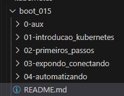

# Formação Kubernetes Fundamentals   

### Repository: [boot](../../../)   
### Platform: <a href="../../">dio   </a>   
### Software/Subject: <a href="../">kubernetes   </a>
### Bootcamp: <a href="./">boot_015 (Formação Kubernetes Fundamentals)   </a>

#### <a href="https://github.com/PedroHeeger/main/blob/main/cert_ti/03-conclu/distributed_computing/kubernetes/(24-02-20)_Formacao_Kubernetes_Fundamentals_PH_DIO.pdf">Certificate</a>

---

### Theme:
- DevOps
- Distributed Computing

### Used Tools:
- Operating System (OS): 
  - Windows 11 
- Cloud Services:
  - Google Drive 
- Language:
  - HTML   
  - Markdown   
- Integrated Development Environment (IDE) and Text Editor:
  - VS Code   
- Versioning: 
  - Git   
- Repository:
  - GitHub   

---

### Bootcamp Structure
1. [Introdução ao Kubernetes](./01-introducao_kubernetes/)   
  1.1. [Kubernetes Overview](https://github.com/PedroHeeger/boot/tree/main/dio/kubernetes/boot_015/01-introducao_kubernetes#item1.1)   
  1.2. [Ambiente de Desenvolvimento Kubernetes](https://github.com/PedroHeeger/boot/tree/main/dio/kubernetes/boot_015/01-introducao_kubernetes#item1.2)   
  1.3. [Cluster Kubernetes em Nuvem](https://github.com/PedroHeeger/boot/tree/main/dio/kubernetes/boot_015/01-introducao_kubernetes#item1.3)   
  1.4. Materiais Complementares: Introdução ao Kubernetes   

2. [Primeiros Passos com o Kubernetes](./02-primeiros_passos/)   
  2.1. [Conceitos Básicos Sobre Pods em Kubernetes](https://github.com/PedroHeeger/boot/tree/main/dio/kubernetes/boot_015/02-primeiros_passos#item2.1)   
  2.2. [Criando Imagens Personalizadas com o Docker](https://github.com/PedroHeeger/boot/tree/main/dio/kubernetes/boot_015/02-primeiros_passos#item2.2)   
  2.3. Materiais Complementares: Primeiros Passos com o Kubernetes      

3. [Expondo e Conectando Aplicações Kubernetes](./03-expondo_conectando/)   
  3.1. [Serviços de Acesso para Kubernetes Pods](https://github.com/PedroHeeger/boot/tree/main/dio/kubernetes/boot_015/03-expondo_conectando#item3.1)   
  3.2. [Persistência de Dados em Clusters Kubernetes](https://github.com/PedroHeeger/boot/tree/main/dio/kubernetes/boot_015/03-expondo_conectando#item3.2)   
  3.3. [Criando um Deploy de uma Aplicação](https://github.com/PedroHeeger/boot/tree/main/dio/kubernetes/boot_015/03-expondo_conectando#item3.3)   
  3.4. Materiais Complementares: Conceitos Avançados: Expondo e Conectando Aplicações    

4. [Automatizando Deployments com Kubernetes](./04-automatizando/)   
  4.1. [Deployment e Roolback em Clusters Kubernetes](https://github.com/PedroHeeger/boot/tree/main/dio/kubernetes/boot_015/04-automatizando#item4.1)   
  4.2. [CI-CD Utilizando Kubernetes](https://github.com/PedroHeeger/boot/tree/main/dio/kubernetes/boot_015/04-automatizando#item4.2)   
  4.3. [Criando um Pipeline de Deploy com GitLab e Kubernetes](https://github.com/PedroHeeger/boot/tree/main/dio/kubernetes/boot_015/04-automatizando#item4.3)   
  4.4. Materiais Complementares: Arquitetura e Deploy de Microsserviços    

---

### Objective:
Segue abaixo o objetivo deste bootcamp, conforme descrito na plataforma da **DIO**.
  
>Kubernetes é uma das tecnologias mais utilizadas no momento e pessoas com habilidades em Kubernetes estão sendo muito requisitadas pelo mercado de tecnologia da informação. Em um mundo onde aplicações estão migrando de arquiteturas monolíticas para microsserviços, o entendimento de como os microsserviços devem ser publicados e principalmente escalados é de vital importância para desenvolvedores e demais profissionais envolvidos em um projeto.

>Durante este curso, você trabalhará com projetos reais e aprenderá as formas de publicar aplicações em um cluster Kubernetes na nuvem ou em um ambiente local de treinamento. Projetos de deploy de aplicações e os conceitos de DevOps de CI/CD estão contemplados na trilha.

### Structure:
- A estrutura do bootcamp da plataforma **DIO** é dividida em módulos e cada módulo contém cursos e desafios, sendo este último podendo ser **Desafio de Projeto** ou **Desafio de Código**. 
- Para melhor organização deste bootcamp, a estruturação das pastas acompanhou a estrutura do bootcamp. Dessa forma, foram criadas sub-pastas para cada módulo ou curso desse bootcamp, sendo que nas sub-pastas dos módulos estão contidas as pastas ou arquivos dos desafios ou cursos realizados.
- Nos arquivos de README de cada módulo ou curso está descrito o que foi realizado em cada um, e podem ser acessado nos links clicáveis na opção **Bootcamp Strucutre**. Os links que não forem clicáveis, são de cursos ou módulos que, na sua maior parte ou inteiramente, foram assuntos teóricos e não possuem materiais.
- Alguns cursos podem ter sido desenvolvidos em outro bootcamp, já que são os mesmos cursos, portanto, a explicação sobre esses cursos e seus respectivos materiais vão está no outro bootcamp e podem ser acessados através dos links do **Bootcamp Structure**.
- A sub-pasta **0-img** foi criada apenas para armazenar imagens auxiliares para a construção dos arquivos de README.md deste bootcamp. A imagem 01 exibe como ficou a estruturação dos arquivos.

<figure>
     
    <figcaption>Imagem 01.</figcaption>
</figure>
 

### Development:
Cada desafio ou cursos tiveram seus desenvolvimentos específicos. Portanto, a explicação sobre cada uma deles está contida no README da sua respectiva pasta, que podem está armazenadas neste bootcamp ou em outro se já tiverem sido realizados anteriormente. Caso haja poucas atividades restantes a serem feitas para conclusão deste bootcamp, o desenvolvimento dessas estará aqui abaixo, não sendo necessário a criação de sub-pastas.

Todo o projeto foi realizado em uma maquina virtual **Linux Ubuntu** para servidor, criada no software **VM Virtual Box**, foi nesta maquina que foi instalado o software **Docker** e executado os containers. Em alguns casos, foram utilizados a maquina física **Windows** como apoio, o ambiente de cloud **AWS** e outras maquinas virtuais criadas no **VM Virtual Box**. Em relação as atividades, cada desafio ou cursos tiveram seus objetivos específicos. Por tanto, a explicação sobre cada uma está contida na sua respectiva pasta, seguindo a estruturação determinada no Bootcamp.