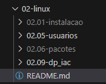
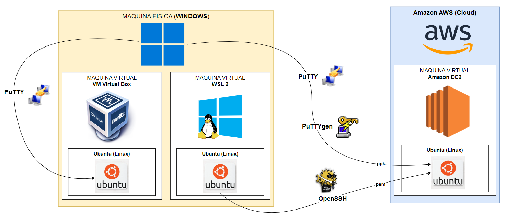

# Linux do Zero - Módulo 2   

### Repository: [boot](../../../../)   
### Platform: <a href="../../../">dio   </a>   
### Software/Subject: <a href="../../">linux   </a>
### Bootcamp: <a href="../">boot_03 (Linux do Zero)   </a>
### Module: 2. Primeiros Passos com o Sistema Operacional Linux

---

This folder refers to Module 2 **Primeiros Passos com o Sistema Operacional Linux** from Bootcamp **Linux do Zero**.

### Theme:
- Operating System (OS)

### Used Tools:
- Operating System (OS): 
  - Linux   
  - Windows 11   
- Linux Distribution: 
  - RedHat   
  - Ubuntu   
- Virtualization: 
  - Oracle VM VirtualBox   
  - WSL   
- Cloud:
  - AWS   
- Cloud Services:
  - Amazon Elastic Compute Cloud (EC2)   
  - Google Drive 
- Language:
  - HTML   
  - Markdown   
- Integrated Development Environment (IDE) and Text Editor:
  - VS Code   
- Versioning: 
  - Git   
- Repository:
  - GitHub   
- Command Line Interpreter (CLI):
  - Bash e Sh   
  - Prompt de Comando (cmd)   
  - Systemctl   
- Network:
  - OpenSSH   
  - PuTTY   
  - PuTTYgen   
- Diagramming Software:
  - Draw.io   

---

### Bootcamp Module 2 Structure
2. <a name="item2">Primeiros Passos com o Sistema Operacional Linux</a><br> 
  2.1. <a href="#item2.1">Introdução ao Sistema Operacional Linux</a><br>
  2.2. <a href="#item2.2">Instalando o Linux</a><br>
  2.3. <a href="#item2.3">Acesso Remoto a Máquinas Linux</a><br>
  2.4. <a href="#item2.4">Manipulando Arquivos no Linux</a><br>
  2.5. <a href="#item2.5">Gerenciando Usuários no Linux</a><br>
  2.6. <a href="#item2.6">Gerenciamento de Pacotes Linux</a><br>
  2.7. <a href="#item2.7">Gerenciamento de Discos Linux</a><br>
  2.8. <a href="#item2.8">Copiando Arquivos e Manipulando Processos</a><br>
  2.9. <a href="#item2.9">Infraestrutura como Código: Script de Criação de Estrutura de Usuários, Diretórios e Permissões</a><br>

---

### Objective:
O objetivo deste módulo do Bootcamp é dar os primeiros passos com o sistema operacional Linux.

### Structure:
A estrutura das pastas obedece a estruturação do Bootcamp, ou seja, conforme foi necessário, sub-pastas foram criadas para os cursos específicos deste módulo. Na imagem 01 é exibido a estruturação das pastas. 

<div align="Center"><figure>
    <br>
    <figcaption>Imagem 01.</figcaption>
</figure></div><br>

### Development:
O desenvolvimento deste módulo do Bootcamp foi dividido em oito cursos e um desafio de projeto. Abaixo é explicado o que foi desenvolvido em cada um desses cursos.

  <a name="item2.1"><h4>2.1. Introdução ao Sistema Operacional Linux:</h4></a>[Back to summary](#item2) | <a href="https://github.com/PedroHeeger/main/blob/main/cert_ti/04-curso/os/linux/(23-07-11)%20Introdu%C3%A7%C3%A3o%20ao%20Sistema%20Operacional%20Linux%20PH%20DIO.pdf">Certificate</a>

  Apenas aulas teóricas sobre introdução ao sistema operacional Linux e maquinas virtuais.
  
  <a name="item2.2"><h4>2.2. Instalando o Linux</h4></a>[Back to summary](#item2) | <a href="https://github.com/PedroHeeger/main/blob/main/cert_ti/04-curso/os/linux/(23-07-12)%20Instalando%20o%20Linux%20PH%20DIO.pdf">Certificate</a>

  Neste curso foi realizado a instalação do sistema operacional Linux em três ambientes diferentes, sendo que em todos eles foram instalados a distribuição **Ubuntu**. O primeiro ambiente utilizado foi o software **VM Virtual Box**, onde através de uma imagem ISO do Ubuntu foi instanciada uma maquina virtual Linux voltada para servidor. Nesta maquina foi realizado uma configuração do adaptador de rede para que posteriormente fosse possível realizar o acesso remoto. O segundo ambiente foi na Cloud da **AWS**, através do serviço **Amazon EC2** foi instanciado uma maquina virtual do Linux Ubuntu. Já o terceiro ambiente foi através do **WSL**, que é um subsistema do Windows para Linux. Este último não foi realizado o processo de instalação, pois o mesmo já existe na maquina física e é o que é utilizado no dia a dia.

  Para o funcionamento do **VM Virtual Box** foi necessário desabilitar o recurso **hypervisorlaunchtype** através do Prompt de Comando do Windows (**cmd**). Já para o **WSL** foi necessário abilitar este recurso além de outros recursos como: **Plataforma de Maquina Virtual**, **Plataforma de Hipervisor do Windows** e **Subsistema do Windows para Linux**.

  <a name="item2.3"><h4>2.3. Acesso Remoto a Máquinas Linux</h4></a>[Back to summary](#item2) | <a href="https://github.com/PedroHeeger/main/blob/main/cert_ti/04-curso/os/linux/(23-07-12)%20Acesso%20Remoto%20a%20Maquinas%20Linux%20PH%20DIO.pdf">Certificate</a>

  Neste curso foi realizado o acesso remoto da maquina virtual (Linux Ubuntu) pela maquina física (Linux e Windows) em diferentes ambientes (Virtual Box, Cloud AWS, WSL) através do protocolo de rede **SSH**. No Windows foi necessário baixar e instalar o software **PuTTY** e **PuTTYgen** para criar esse tipo de conexão. Já no Linux foi necessário apenas instalar o **openSSH** no shell. Em ambos os casos foi necessário descobrir o IP da maquina virtual para realizar o acesso remoto.
       
  Foi realizado o acesso remoto tanto de uma maquina física Linux (no caso, utilizei o WSL) na maquina virtual Linux em um ambiente de Cloud na AWS (Linux dentro de um Windows para Linux na Cloud), e também, de uma maquina física Windows na maquina virtual Linux para os ambientes de Cloud na AWS e através do software de maquina virtual, o VM Virtual Box (Windows para Linux). O diagrama da imagem 02 a seguir, desenvolvido no site **Draw.io**, ilustra o desenvolvimento.

  <div align="Center"><figure>
    <br>
    <figcaption>Imagem 02.</figcaption>
    </figure></div><br>
       
  No ambiente de Cloud, ao criar a instância da maquina virtual Ubuntu no serviço Amazon EC2, foi necessário criar um arquivo de credencial no formato **.pem** para que fosse utilizado no Linux. Já no Windows, precisou do software **PuTTYgen** para abrir este arquivo e salvá-lo como formato **.ppk**, sendo possível criar uma senha para acesso.

  <a name="item2.4"><h4>2.4. Manipulando Arquivos no Linux</h4></a>[Back to summary](#item2) | <a href="https://github.com/PedroHeeger/main/blob/main/cert_ti/04-curso/os/linux/(23-07-13)%20Manipulando%20Arquivos%20no%20Linux%20PH%20DIO.pdf">Certificate</a>

  Neste curso foram realizados os procedimentos básicos de manipulação de arquivos no sistema Linux, utilizando a maquina virtual Linux Ubuntu criada no **VM Virtual Box**. Dentre os procedimentos foram feitos: navegação no sistema de arquivo (`cd` e `pwd`), filtragem e exibição de arquivos (`ls`), localização de arquivos (`find`), criação e exclusão de diretórios (`mkdir` e `rmdir`), criação de arquivos vazios (`touch`), utilização dos comandos de ajuda (`help` e `man`), execução de tarefas administrativas como root (`sudo`), acesso como usuário root (`su`), acesso remoto no Linux como usuário root pelo Windows através do **PuTTY**, exibição do conteúdo de um arquivo (`cat`), utilização de editores de textos (`vi` e `nano`), exibição do histórico de últimos comandos do usuário (`history`), localização de informação (`grep`), entre outros comandos básicos. Os comandos foram executados no interpretador de linha de comando (CLI) do Linux **Ubuntu** (**bash**) via acesso remoto pelo **PuTTY**.

  O acesso remoto como usuário root precisou realizar uma alteração no arquivo do Linux `/etc/ssh/sshd_config` modificando a linha `#PermitRootLogin prohibit-password` retirando o comentário e trocando o **prohibit-password** para **yes**. Em seguida, foi necessário reiniciar o serviço através do comando `systemctl restart sshd` para que a alteração fosse concretizada. Após isso, o procedimento foi o mesmo realizado com usuário criado através do **PuTTY**, a diferença foi trocar as credenciais de acesso para a do usuário root.

  <a name="item2.5"><h4>2.5. Gerenciando Usuários no Linux</h4></a>[Back to summary](#item2) | <a href="https://github.com/PedroHeeger/main/blob/main/cert_ti/04-curso/os/linux/(23-07-27)%20Gerenciando%20Usu%C3%A1rios%20no%20Linux%20PH%20DIO.pdf">Certificate</a>

  Neste curso foram realizados os procedimentos de gerenciamentos de usuários e grupos de usuários no sistema Linux, utilizando a maquina virtual Linux Ubuntu criada no **VM Virtual Box**. Foram utilzados comandos de criação, modificação e exclusão de usuários (`useradd`, `usermod`, `userdel`, `passwd` e `chsh`), juntamente com vários parâmetros como: criação da pasta **home**, adição de senha e comentário, definição do shell do usuário, inserção em um grupo específico e determinação de uma data de expiração para o usuário. Também foram utilizados os comandos `groupadd`, `groupdel` e `gpasswd` para adição e exclusão de grupos e remoção de usuários de um grupo.

  Foi elaborado um arquivo de script em **bash** de nome **criar_user.sh** para criação de vários usuários em lote, no qual o código é exibido abaixo e pode ser acessado na sub-pasta **02-05** deste módulo clicando [aqui](./02.05-usuarios/criar_user.sh). Para que fosse possível executar esse arquivo foi necessário alterar a permissão de execução com o comando `chmod`. Por fim, foram realizadas alterações de permissões de todos os tipos e para todos os grupos de usuários (proprietários, grupos e demais usuários) com o comando `chmod`, e alterações de proprietário e grupo de arquivos e pastas com o comando `chown`.

  ```
  #!/bin/bash

  echo "Criando usuários do sistema..."

  useradd guest10 -c "Usuário convidado" -s /bin/bash -m -p $(openssl passwd -crypt Senha123)
  passwd guest10 -e

  useradd guest11 -c "Usuário convidado" -s /bin/bash -m -p $(openssl passwd -crypt Senha123)
  passwd guest11 -e

  useradd guest12 -c "Usuário convidado" -s /bin/bash -m -p $(openssl passwd -crypt Senha123)
  passwd guest12 -e

  useradd guest13 -c "Usuário convidado" -s /bin/bash -m -p $(openssl passwd -crypt Senha123)
  passwd guest13 -e

  echo "Processo finalizado!"
  ```

  ###### Observação: Na aula, foi utilizado o parâmetro `-crypt` no software OpenSSL, porém para a versão mais atual desse software não funciona. Logo, foi necessário utilizar o parâmetro `-6` que usa o SHA-512 para gerar um hash criptografado da senha utilizada no OpenSSL.
  

  <a name="item2.6"><h4>2.6. Gerenciamento de Pacotes Linux</h4></a>[Back to summary](#item2) | <a href="https://github.com/PedroHeeger/main/blob/main/cert_ti/04-curso/os/linux/(23-07-27)%20Gerenciamento%20de%20Pacotes%20Linux%20PH%20DIO.pdf">Certificate</a>

  Neste curso foi realizado os procedimentos de gerenciamento de pacotes no sistema Linux utilizando a maquina virtual Linux Ubuntu criada no **VM Virtual Box**. Na primeira aula, foram apresentadas as ferramentas mais conhecidas para download de pacotes, instalação, controle e remoção de softwares (`apt` e `apt-get`). Os comandos utilizados foram `update`, `upgrade`, `list`, `search`, `install`, `remove` e `edit`. Também foi exibida a **sources.list**, onde ficam armazenados os links dos repositórios para download dos pacotes, além de alguns softwares básicos como: `wget`, `unzip`, `unrar`, `net-tools`, entre outros.

  Durante o curso, foi desenvolvido a atualização do sistema operacional da maquina virtual. Como esta maquina foi instanciada no **VM Virtual Box**, um screenshot do disco antes da atualização foi criado, para que após a atualização do sistema operacional o processo de reversão da atualização do sistema fosse realizado.

  Já no ambiente de cloud, na **AWS**, foi utilizado o serviço **Amazon EC2** para instanciar uma nova maquina virtual **Linux**, cuja distribuição foi **Red Hat**. Toda a configuração foi realizada com as opções gratuítas e foi necessário criar um par de chave de nome **dio-linux-boot_003-m2.6** com o tipo e formato sendo **RSA** e **.ppk** respectivamente. O arquivo **.ppk** foi baixado na maquina fisica e foi utilizado no software **PuTTY** para realização do acesso remoto a essa maquina na cloud. Nesta maquina, foi utilizado os softwares de gerenciamento de pacotes do **RedHat** (`dnf` e `yum`).

  <a name="item2.7"><h4>2.7. Gerenciamento de Discos no Linux</h4></a>[Back to summary](#item2) | <a href="https://github.com/PedroHeeger/main/blob/main/cert_ti/04-curso/os/linux/(23-07-27)%20Gerenciamento%20de%20Discos%20Linux%20PH%20DIO.pdf">Certificate</a>

  Neste curso foi realizado os procedimentos de gerenciamento de discos no sistema Linux utilizando a maquina virtual Linux Ubuntu criada no **VM Virtual Box**. Foram utilizados os comandos `lsblk` e `fdisk -l` para verificar os discos desta maquina. Em seguida, a maquina foi desligada para que pudesse ser feita a criação de um novo disco. A criação desse disco foi realizado na **VM Virtual Box**, na opção de configurações de armazenamento. As definições realizadas para esse disco foram as mesmas da criação da maquina virtual: tipo de arquivo VDI (VirtualBox Disk Image), armazenamento dinamicamente alocado, o tamanho do arquivo foi definido com 20 GB e a localização foi definida na mesma pasta do disco 1, com nome do arquivo **Linux_Ubuntu_Disk_2.vdi**. Após isso, foi selecionado o disco 2 para atribuir a maquina virtual.

  Com disco criado para utilizá-lo foi preciso fazer o particionamento, indicar o sistema de arquivo que seria utilizado e fazer a montagem do disco. Para o particionamento foi utilizado o software `fdisk`, onde foi criado um particionamento primário de número 1. Em seguida, foi configurado o sistema de arquivo que seria utilizado, através do comando `mkfs.ext4`. Foi realizado a montagem e desmontagem do disco com os comandos `mount` e `umount`. Por último, foi necessário automatizar a montagem do disco, para que ele seja sempre montado quando a maquina fosse ligada. Isso foi realizado através de uma alteração no arquivo `/etc/fstab`, onde foi inserido o comando da montagem desse segundo disco (`/dev/sdb /disk2 ext4 defaults 0 0`) e em seguida, foi executado um `reboot` para reiniciar o sistema.

  <a name="item2.8"><h4>2.8. Copiando Arquivos e Manipulando Processos</h4></a>[Back to summary](#item2) | <a href="https://github.com/PedroHeeger/main/blob/main/cert_ti/04-curso/os/linux/(23-07-28)%20Copiando%20Arquivos%20e%20Manipulando%20Processos%20PH%20DIO.pdf">Certificate</a>

  Neste curso foi realizado os procedimentos de copia, movimentação e renomeação de arquivos e manipulação de processos no sistema Linux, utilizando a maquina virtual Linux Ubuntu criada no **VM Virtual Box**. Os comandos `cp` e `mv` foram utilizados para copiar, alterar arquivos de diretórios e renomeá-los. Na manipulação de processos, foram utilizados os comandos `ps`, `kill`, `w` e `who -a` para verificar os processos, incluindo processos de logon e finalizá-los.

  <a name="item2.9"><h4>2.9. Desafio de Projeto - Infraestrutura como Código: Script de Criação de Estrutura de Usuários, Diretórios e Permissões</h4></a>[Back to summary](#item2) | <a href="https://github.com/PedroHeeger/main/blob/main/cert_ti/04-curso/os/linux/(23-07-31)%20Iac...Cria%C3%A7%C3%A3o...Usu%C3%A1rios%2C%20Diret%C3%B3rios%20e%20Permiss%C3%B5es%20PH%20DIO.pdf">Certificate</a>

  O objetivo desse desafio determinado pela plataforma do bootcamp é descrito abaixo:

  > Neste projeto iremos criar um script onde toda a infraestrutura de usuários, grupos de usuários, diretórios e permissões serão criadas automaticamente. Será realizado o upload do arquivo de script no GitHub para futuras reutilizações do script. Sendo assim, toda nova máquina virtual que for iniciada já estará pronta para uso quando o script for executado.

  Para iniciar esse desafio, conforme solicitado, foi necessário apagar tudo que foi realizado durante as aulas (diretórios, arquivos, grupos e usuários). Este processo foi feito manualmente. Após isso, foi criado um arquivo em **bash** de nome **iac1.sh** salvo na sub-pasta **02.09** deste módulo. Neste arquivo, foi construído um script para criação de diretórios, grupos de usuários e usuários, e também, foram estabelecidas as permissões determinadas para acesso aos diretórios. O código é exbido logo abaixo e pode ser acessado clicando [aqui](./02.09-desafio_projeto/iac1.sh).

  ```
  #!/bin/bash

  echo "Iniciando o processo..."
  echo "Criando os diretórios..."

  mkdir /publico
  mkdir /adm
  mkdir /ven
  mkdir /sec

  echo "Criando os grupos de usuários..."

  groupadd GRP_ADM
  groupadd GRP_VEN
  groupadd GRP_SEC

  echo "Criando os usuários..."

  useradd -m carlos -c "Carlos" -s /bin/bash -p $(openssl passwd -6 Senha123) -G GRP_ADM
  useradd -m maria -c "Maria" -s /bin/bash -p $(openssl passwd -6 Senha123) -G GRP_ADM
  useradd -m joao_ -c "João" -s /bin/bash -p $(openssl passwd -6 Senha123) -G GRP_ADM

  useradd -m debora -c "Débora" -s /bin/bash -p $(openssl passwd -6 Senha123) -G GRP_VEN
  useradd -m sebastiana -c "Sebastiana" -s /bin/bash -p $(openssl passwd -6 Senha123) -G GRP_VEN
  useradd -m roberto -c "Roberto" -s /bin/bash -p $(openssl passwd -6 Senha123) -G GRP_VEN

  useradd -m josefina -c "Josefina" -s /bin/bash -p $(openssl passwd -6 Senha123) -G GRP_SEC
  useradd -m amanda -c "Amanda" -s /bin/bash -p $(openssl passwd -6 Senha123) -G GRP_SEC
  useradd -m rogerio -c "Rogério" -s /bin/bash -p $(openssl passwd -6 Senha123) -G GRP_SEC

  echo "Concedendo permissões..."

  chmod 777 /publico
  chmod 770 /adm
  chmod 770 /ven
  chmod 770 /sec

  chown root:GRP_ADM /adm
  chown root:GRP_VEN /ven
  chown root:GRP_SEC /sec

  echo "Processo finalizado com sucesso!"
  ```