# Linux do Zero - Módulo 3   

### Repository: [course](../../../../)   
### Platform: <a href="../../../">dio   </a>   
### Software/Subject: <a href="../../">linux   </a>
### Bootcamp: <a href="../">boot_03 (Linux do Zero)   </a>
### Module: 3. Configurando Servidores Linux e Introdução ao Docker

---

This folder refers to Module 3 **Configurando Servidores Linux e Introdução ao Docker** from Bootcamp **Linux do Zero**.

### Theme:
- Operating System (OS)

### Used Tools:
- Operating System (OS): 
  - Linux 
  - Windows 11 
- Linux Distribution: 
  - Ubuntu 
- Virtualization: 
  - VM VirtualBox 
  - WSL 
  - Docker 
- Cloud:
  - AWS 
  - Amazon EC2   
- Integrated Development Environment (IDE):
  - VS Code   
- Versioning: 
  - Git   
- Repository:
  - GitHub   
- Command Line Interpreter (CLI):
  - cmd 
  - bash 
- Server:
  - Samba 
  - Apache HTTP Server 
  - MySQL Server 
  - NFS Server 
  - Nginx    
- Linux Tools:
  - Apt e Apt-get (Geranciadores de Pacotes)
  - Unzip (Descompactador)
  - Nano (Editor de Texto)
- Others:
  - Google Drive 
  - PuTTY 
  - DBeaver 
  - Loader.io 

---

### Bootcamp Module 3 Structure
3. <a name="item3">Configurando Servidores Linux e Introdução ao Docker</a><br> 
  3.1. <a href="#item3.1">Servidores Arquivos com Linux</a><br>
  3.2. <a href="#item3.2">Criando um Servidor Web com Linux</a><br>
  3.3. <a href="#item3.3">Servidor de Banco de Dados com Linux</a><br>
  3.4. <a href="#item3.4">Infraestrutura como Código - Script de Provisionamento de um Servidor Web (Apache)</a><br>
  3.5. <a href="#item3.5">Docker: Utilização Prática no Cenário de Microsserviços</a><br>
  3.6. <a href="#item3.6">Mentoria - DevOps: Tudo o que você precisa saber</a><br>

---

### Objective:
O objetivo deste módulo do Bootcamp foi aprender sobre servidores, como criá-los e utilização de infraestrutura como código para construção deles. Além de uma introdução aos conceitos de microserviços e Devops, e utilização do **Docker**.

### Structure:
A estrutura das pastas obedece a estruturação do Bootcamp, ou seja, conforme foi necessário, sub-pastas foram criadas para os cursos específicos deste módulo. Na imagem 01 é exibido a estruturação das pastas. 

<div align="Center"><figure>
    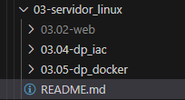<br>
    <figcaption>Imagem 01.</figcaption>
</figure></div><br>

### Development:
O desenvolvimento deste módulo do Bootcamp foi dividido em três cursos, dois desafios de projeto e uma mentoria. Abaixo é explicado o que foi desenvolvido em cada uma dessas atividades.

  <a name="item3.1"><h4>3.1. Servidores Arquivos com Linux</h4></a>[Back to summary](#item3) | <a href="https://github.com/PedroHeeger/main/blob/main/cert_ti/04-curso/os/linux/(23-07-28)%20Servidores%20de%20Arquivos%20com%20Linux%20PH%20DIO.pdf">Certificate</a>

  Neste curso, foi desenvolvido um servidor de arquivos no sistema Linux utilizando a maquina virtual Linux Ubuntu criada no **VM Virtual Box**. Foi necessário utilizar a pasta referente ao **disco2** criado no módulo 2 deste bootcamp e também a instalação do software **Samba** para criação do servidor. No diretório `/disk2`, foi criado uma nova pasta de nome **publica** e concedido a permissão a todos os usuários através do comando `chmod 777 publica`, já dentro da pasta do disco2. Dando sequência, foi aberto o arquivo de configuração do **Samba** com o editor de texto **nano** disponível no diretório `/etc/samba/smb.conf`. 
  
  Neste arquivo, foi preciso verificar se a opção `map to guest` estava marcada como `bad user`, que indica que esta pasta não vai ter restrinção de usuário inicialmente e, ao final do arquivo, especificar as configurações da pasta compartilhada. As configurações determinadas foram: o nome do compartilhamento (`[publica]`), o caminho da pasta compartilhada (`/disk2/publica`), a liberação para gravação nesta pasta (`writeable = yes`), a liberação do acesso de qualquer pessoa a pasta (`guest ok = yes`) e a determinação de que todo mundo que acessá-la seria um convidado (`guest only = yes`), já que é uma pasta pública. Abaixo é exibido esses comandos em conjunto. Em seguida, foi salvo e fechado o arquivo e foi necessário reinicializar o serviço do **Samba** para efetuar as alterações com o comando `systemctl restart smbd`. Também foi utilizado o comando `systemctl enable smbd` para habilitar o serviço para que ele ative automaticamente sempre quando o servidor for reiniciado.

  ```
  [publica]
  /disk2/publica
  writeable = yes
  guest ok = yes
  guest only = yes
  ```

  Com o servidor pronto, foi realizado o acesso pela maquina física **Windows** a esse servidor Linux Ubuntu (maquina virtual instanciada na **VM VirtualBox**) através de um caminho de rede no **explorador de arquivos** do **Windows**. Para realização desse acesso, foi preciso o número de IP da maquina virtual (o servidor em questão), observando que em um cenário corporativo, esse IP deverá ser fixo para que as demais maquinas conheçam e possam acessar o servidor, sem ter que ficar descobrindo o endereço de IP do servidor toda vez que este mudar.

  Para executar o acesso, na barra de endereço do **explorador de arquivos** foi digitado o comando `\\IP\publica`, sendo o **IP** substituido pelo do servidor. Feito isso, foi solicitado as credenciais de acesso, que poderia ser qualquer uma dos usuários desta maquina virtual, que foram criados no desafio de projeto do módulo 2 deste bootcamp. Também foi criado, na maquina física **Windows** em **Este Computador**, um caminho de rede direto para esta pasta compartilhada facilitando o acesso, que pode ser visualizada na imagem 02 abaixo. Em outro computador também **Windows** foi realizado o mesmo acesso, porém com outras credenciais cadastradas. Nos dois acessos executados a essa pasta compartilhada, foram elaborados arquivos **txt** simples apenas para verificar que o compartilhamento estava ocorrendo.

  <div align="Center"><figure>
    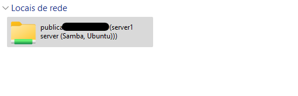<br>
    <figcaption>Imagem 02.</figcaption>
  </figure></div><br>
  
  <a name="item3.2"><h4>3.2. Criando um Servidor Web com Linux</h4></a>[Back to summary](#item3) | <a href="https://github.com/PedroHeeger/main/blob/main/cert_ti/04-curso/os/linux/(23-07-28)%20Criando%20um%20Servidor%20Web%20com%20Linux%20PH%20DIO.pdf">Certificate</a>

  Neste curso, foi desenvolvido um servidor web no sistema Linux utilizando a maquina virtual Linux Ubuntu criada no **VM Virtual Box**. Para criação desse servidor, foi preciso a instalação do software **Apache HTTP Server**. Após instalação e verificação, com o comando `systemctl status apache2`, que o status estava ativo, tornou-se possível acessar o site via número de **IP** da maquina virtual. Para alterar as informações do site, foi necessário ir na pasta `/var/www/html`, onde estava o arquivo `index.html` que correspondia as informações do site. Este arquivo foi excluído e criado um novo arquivo **html** para construção do novo site. O site só podia ser acessado por clientes que estavam na mesma rede.

  Na última aula do curso, foi utilizado o ambiente de cloud na **AWS** para criar um servidor web na internet. No serviço **Amazon EC2** foi instanciada uma nova maquina virtual (**Linux-Ubuntu**), as configurações foram as padrões para a opção gratuíta (**Free Tier**). Um novo par de chaves foi criado de nome **dio-linux-boot_003-m3.2** do tipo **RSA** e formato **.ppk** para acesso remoto pelo **Windows** através do **PuTTY**. Lembrando que esse foi o terceiro par de chaves criado nesse Bootcamp, todas essas chaves foram excluídas após a finalização do projeto.

  Com a instancia criada, foi realizado o acesso remoto pelo **PuTTY**. O nome de usuário para acesso em uma maquina **Ubuntu** na **AWS** é `ubuntu`. Após o acesso, foi feito a configuração da senha do usuário `root` para acessar como **root**. Em seguida, foi realizado o download dos pacotes e atualização do sistema operacional com os comandos `apt update -y` e `apt upgrade -y`. A próxima etapa foi instalar o software **Apache** nesta maquina para criação do servidor web. Após instalado, foi verificado o status do serviço e o local do arquivo **html** que construía o site se estava disponível e continha o arquivo **index.html**.

  Existe uma diferença ao criar um servidor web localmente e em cloud. Em cloud, é disponibilizado um **IP** fixo para este site que pode ser acessado pela Internet, porém toda instância em execução possui uma espécie de **Firewall** para gerenciamento de acesso. Portanto, no ambiente de cloud, foi necessário liberar o protocolo **HTTP**, pois o **Firewall** bloqueia por padrão. Isso foi feito na opção **Editar regras de entrada** no grupo de segurança criado ao criar a maquina virtual. Nesta opção, foi criado uma nova regra para liberar o protocolo **HTTP** (porta **80**) para qualquer lugar do mundo, ou seja, qualquer usuário poderia acessar o site. No ambiente de cloud, o próprio serviço **Amazon EC2** já fornece um **DNS** para acesso ao site.

  Para modificar o site padrão do **Apache HTTP Server**, foi excluído o arquivo **index.html** existente e criado um novo. A construção desse novo site não fez parte do bootcamp, o material foi disponibilizado pelo professor do curso através do repositório no **GitHub** (`https://github.com/denilsonbonatti/linux-site-dio/archive/refs/heads/main.zip`). Esse material foi baixado com o comando `wget` no diretório `tmp` e foi realizado a descompactação dos arquivos com o software **unzip**, que como não tinha instalado, foi necessário instalar com o comando `apt install unzip`. Após a descompactação, foi criado um diretório de mesmo nome do repositório no **GitHub** (**linux-site-dio-main**). De dentro deste diretório foi copiado todos os arquivos para a pasta padrão do **Apache** com o comando `cp -R * /var/www/html/`. Com isso, o novo site ficou disponível para acesso até o encerramento do curso, pois a instancia da maquina virtual no **EC2** foi removida. Abaixo é exibido na imagem 03 como ficou este site e o **DNS** utilizado para acesso ao site.

  <div align="Center"><figure>
    <br>
    <br>
    <figcaption>Imagem 03.</figcaption>
  </figure></div><br>

  <a name="item3.3"><h4>3.3. Servidor de Banco de Dados com Linux</h4></a>[Back to summary](#item3) | <a href="https://github.com/PedroHeeger/main/blob/main/cert_ti/04-curso/os/linux/(23-07-28)%20Servidor%20de%20Banco%20de%20Dados%20com%20Linux%20PH%20DIO.pdf">Certificate</a>

  Neste curso, foi desenvolvido um servidor de banco de dados no sistema Linux utilizando a maquina virtual Linux Ubuntu criada no **VM Virtual Box**. Para execução foi necessário baixar e instalar o software **MySQL Server**. Após instalado, foi realizado o acesso com o usuário **root** do Linux ao **MySQL** com o comando `mysql -u root -p`, e digitado a senha desse usuário. Já no banco foram realizados os seguintes comandos em **SQL**:

  - Listar todos os bancos de dados existentes
    ```
    show databases;
    ```

  - Criar o banco de dados de nome **meubanco**
    ```
    create database meubanco;
    ```

  - Acessar o banco de dados criado
    ```
    use meubanco;
    ```

  - Criar a tabela **Pessoas** com os atributos determinados no **meubanco**
    ```
    create table Pessoas (PessoaID int, Nome varchar(50), Sobrenome varchar(50), Endereco varchar(100), Cidade varchar(50));
    ```

  - Listar todas as tabelas existentes nesse banco
    ```
    show tables;
    ```

  - Selecionar os dados da tabela criada (no momento, estava vazia, pois não tinha sido inserido nada)
    ```
    select * from Pessoas;
    ```

  - Inserir um dado na tabela **Pessoas**
    ```
    insert into Pessoas (PessoaID, Nome, Sobrenome, Endereco, Cidade) values (1, 'Carlos', 'da Silva', 'Av. do Carmo, 500', 'Jaboticabal-SP');
    ```

  - Selecionar os dados novamente (o resultado do output é exibido na imagem 05 abaixo)
    ```
    select * from Pessoas;
    ```
    <div align="Center"><figure>
        <br>
        <figcaption>Imagem 04.</figcaption>
    </figure></div><br>

  <a name="item3.4"><h4>3.4. Infraestrutura como Código - Script de Provisionamento de um Servidor Web (Apache)</h4></a>[Back to summary](#item3) | <a href="https://github.com/PedroHeeger/main/blob/main/cert_ti/04-curso/os/linux/(23-07-31)%20Iac...Servidor%20Web%20(Apache)%20PH%20DIO.pdf">Certificate</a>

  O objetivo desse desafio determinado pela plataforma do bootcamp é descrito abaixo:

  > Neste projeto iremos criar um script onde será provisionado um servidor web automaticamente. Um servidor web é um software e hardware que usa HTTP (Hypertext Transfer Protocol) e outros protocolos para responder a solicitações de clientes feitas pela World Wide Web. O principal trabalho de um servidor da web é exibir o conteúdo do site por meio do armazenamento, processamento e entrega de páginas da web aos usuários.

  Para iniciar o projeto, conforme solicitado, foi necessário desligar a maquina virtual para executar um **snapshot** em um estágio anterior às criações de servidores executadas durante os cursos do módulo 3. Sem os servidores criados na maquina virtual, foi realizado a construção de um novo servidor web, só que com o uso da **infraestrutura como código (IaC)**. A IaC nada mais é que um arquivo de script onde todos os comandos executados para criação do servidor são escritos em sequência, para que todos os comandos sejam executados apenas com a execução do script. 
  
  O script foi criado no editor de texto **nano** e consistiu: na instalação dos pacotes e atualização do sistema, na instalação dos softwares **Apache** e **Unzip**, no download da aplicação do repositório ndo GitHub para dentro da pasta `/tmp`, na descompactação do arquivo baixado e na copia de todos os arquivos da aplicação para a pasta `/var/www/html/`. Em seguida, foi concedida a permissão de execução para esse arquivo de script com o comando `chmod +x iac2.sh` e executado arquivo `./iac.sh`. Dessa forma, o servidor web pôde ser acessado através do IP da maquina virtual (**Linux Ubuntu**) instanciada no software **VM VirtualBox**. Abaixo é exibido o script desenvolvido que pode ser acessado clicando [aqui](./03.04-dp_iac/iac2.sh).

  ```
  #!/bin/bash

  echo "Iniciando o processo..."
  echo "Atualizando o servidor..."

  apt-get update -y
  apt-get upgrade -y

  echo "Instalando o Apache e o Unzip"

  apt-get install apache2 -y
  apt-get instal unzip -y

  echo "Baixando a aplicação do repositório do GitHub..."

  cd /tmp
  wget https://github.com/denilsonbonatti/linux-site-dio/archive/refs/heads/main.zip

  echo "Descompactando o arquivo..."

  unzip main.zip

  echo "Movendo os arquivos da aplicação para o diretório /var/www/html/"

  cd linux-site-dio-main
  cp -R * /var/www/html/

  echo "Processo finalizado, site disponível através do IP da maquina virtual"
  ```

  <a name="item3.5"><h4>3.5. Docker: Utilização Prática no Cenário de Microsserviços</h4></a>[Back to summary](#item3) | <a href="https://github.com/PedroHeeger/main/blob/main/cert_ti/04-curso/os/virtualization/docker/(23-07-31)%20Docker-Utiliza%C3%A7%C3%A3o...Cen%C3%A1rio%20de%20Microsservi%C3%A7os%20PH%20DIO.pdf">Certificate</a>
  
  O objetivo desse desafio determinado pela plataforma do bootcamp é descrito abaixo:

  > A tecnologia de Containers promete mudar a maneira como as operações de TI são realizadas, abstraindo ambientes de desenvolvimento e otimizando o consumo de recursos. Nesse contexto, conheça o Docker, implemente uma estrutura de Microsserviços com as melhores práticas do mercado internacional e ganhe independência entre aplicações e infraestrutura em mais um conteúdo exclusivo por aqui.

  Esse projeto foi realizado em dois cenários, o primeiro cenário com a utilização apenas de uma maquina virtual na cloud da **AWS**. Enquanto para o cenário 2, foram criadas mais duas maquina virtuais na cloud para a construção de um cluster com três maquinas virtuais. Em ambos os cenários, foram criados dois containers **Docker**, um para funcionar como sevidor de banco de dados, sendo desenvolvido apenas no nó master (maquina virtual principal). Já o container para servir com a aplicação web, no primeiro cenário, foi construída apenas para a única maquina existente. Enquanto no cenário 2, esse container foi executado no cluster com dez replicas. A aplicação web consistia em gerar dados aleatórios que fizeram parte de uma inserção em uma tabela no banco de dados que funcionava no outro container. A cada requisição realizada ao site da aplicação, uma nova linha era inserida na tabela com dados gerados aleatoriamente, enquanto no site era exibido uma mensagem de que a requisição foi efetuada.

  A primeira etapa desse projeto foi a criação de uma maquina virtual **Linux Ubuntu** no serviço **Amazon EC2** na cloud da **AWS**. Esta maquina teve as configurações de nível gratuito e após instanciada, foi adicionado uma nova regra no grupo de segurança para a liberação da porta **3306** do protocolo **TCP** para qualquer acesso. Isto contribui para que fosse possível realizar o acesso através do software **Dbeaver** (GUI para banco de dados SQL) ao banco de dados **MySQL** criado em um container **Docker** dentro da maquina virtual instanciada.

  Através do software **PuTTY** e do arquivo de par de chave **dio-linux-boot_003-m3.2.ppk** criado no curso 2 deste módulo, foi realizado o acesso remoto ao Ubuntu da cloud. Nele, em primeiro momento, foi realizado o download dos pacotes e atualização do sistema operacional. Em seguida, foi realizado a instalação do software **Docker** na versão **Community Edition**, cujo o script é exibido a seguir.

  ```
  sudo apt-get update -y
  sudo apt-get install apt-transport-https ca-certificates curl software-properties-common -y
  curl -fsSL https://download.docker.com/linux/ubuntu/gpg | sudo apt-key add -
  sudo add-apt-repository "deb [arch=amd64] https://download.docker.com/linux/ubuntu focal stable"
  sudo apt-get update -y
  apt-cache policy docker-ce
  sudo apt-get install docker-ce -y
  ```
  Através do **Docker**, foi executado um container com base em uma imagem do **MySQL** (banco de dados). O código de criação do container é apresentado abaixo. Neste comando, foi realizado um bind de portas para acesso ao **MySQL** pelo **DBeaver** e uma montagem do diretório do container com o diretório da maquina virtual (`/var/lib/docker/volumes/data/_data`) para que houvesse o compartilhamento de arquivos entre eles. Também foi determinada a senha de acesso do usuário root ao banco de dados.

  `docker run --name mysql-A -v /var/lib/docker/volumes/data/_data:/var/lib/mysql -p 3306:3306 -e MYSQL_ROOT_PASSWORD=Senha123 -d mysql:8.0.34-debian`

  O objetivo dessa maquina virtual foi fornecer um serviço de banco de dados através de um container **Docker**. Com o container em execução, foi realizado o acesso a ele e também executado o download de pacotes e atualização do sistema. Na sequência, instalou-se o software de banco de dados **MySQL**, que foi acessado com o username **root** e a senha determinada na execução do container. Dentro do **MySQL** foi criado um novo banco de dados de nome **meubanco** e a partir daí, foi possível realizar o acesso a esse banco via **DBeaver**. Neste acesso, o **Host** utilizado foi o **IP** da maquina virtual instanciada no **Amazon EC2**, o usuário e senha foram os mesmos utilizados no acesso anterior pelo container. Ainda foi preciso fazer uma alteração na configuração dessa conexão de acesso, alterando para **true** a opção `allowPublicKeyRetrievel` nas propriedades do driver no **Dbeaver**. Com o acesso liberado, foi construído uma nova tabela dentro do banco com o seguinte código armazenado no arquivo **banco.sql**, que pode obtido [aqui](./03.05-dp_docker/banco.sql).

  ```
  CREATE TABLE dados (
    AlunoID int,
    Nome varchar(50),
    Sobrenome varchar(50),
    Endereco varchar(150),
    Cidade varchar(50),
    Host varchar(50)
  );
  ```

  O próximo passo, foi a criação de um servidor HTTP com aplicação web em outro container **Docker** configurado na porta **80** do protocolo **TCP**, nesta mesma maquina virtual. Para isso, foi necessário liberar essa porta lá no grupo de segurança da maquina virtual do serviço **EC2**, criando uma nova regra que permitiu acesso de qualquer lugar, igual foi feito para a porta **3306** para o **MySQL**. Abaixo é apresentado o código de construção do container **Docker** que utilizou uma imagem do **PHP Apache**. Neste container também foi realizado o bind de porta para que fosse possível realizar a requisição **HTTP** através do navegador na maquina física **Windows**, e a montagem do diretório do container com o diretório do Ubuntu (`/var/lib/docker/volumes/app/_data`). Porém antes da montagem, foi preciso cria o volume **app** com o comando `docker volume create app`.
 
  `docker run --name web-server -dt -p 80:80 --mount type=volume,src=app,dst=/app/ webdevops/php-apache:alpine-php7`
  
  Além disso, foi necessário entrar no **MySQL** pelo container **Docker** para alterar a autenticação do usuário do **MySQL** para uma autenticação compatível com o conector do **MySQL** utilizado na aplicação PHP, que foi o **msqli**. O comando a seguir, foi o executado.

  `alter user root identified with mysql_native_password by 'Senha123';`

  Resumidamente, a aplicação web utilizada, a medida que fosse realizada uma requisição HTTP ao IP da maquina virtual na porta **80**, acessava o banco de dados com o mesmo IP da maquina mas na porta **3006** e gerava três dados aleatórios que preencheram os atributos da tabela **dados** criada no banco **meubanco** no **MySQL**. O primeiro dado era um número de ID que preenchia o atributo **AlunoID**, o segundo era uma string que preencheu os atributos **Nome**, **Sobrenome**, **Endereco** e **Cidade**, e o último, outra string que completou o atributo **Host**. Com isso, as informações foram inseridas na tabela toda vez que fosse realizado uma nova requisição (atualização da página). A aplicação web foi elaborada em arquivo de script com linguagem **PHP**, que pode ser acessada clicando [aqui](./03.05-dp_docker/index.php). As imagens 05 e 06 a seguir, ilustram a requisição sendo executada e tabela com dados preenchidos devido as requisições efetuadas. 

  <div align="Center"><figure>
    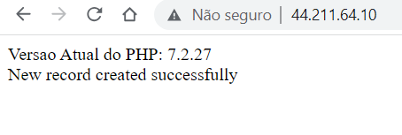<br>
    <figcaption>Imagem 05.</figcaption>
  </figure></div><br>

  <div align="Center"><figure>
    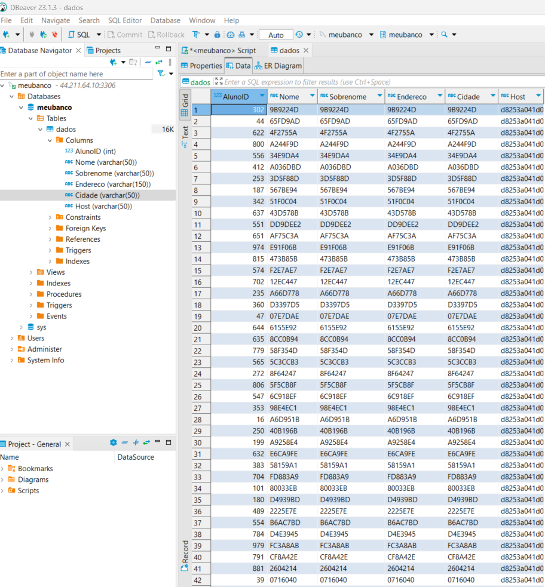<br>
    <figcaption>Imagem 06.</figcaption>
  </figure></div><br>

  A etapa seguinte foi a realização do teste de estresse do container. Isso foi feito através do site **Loader.io**, onde foi passado o IP da maquina virtual, em seguida, foi gerado uma chave que foi copiada. Na maquina virtual, dentro da pasta da aplicação, foi criado um arquivo de extensão **txt** nomeado com a chave copiada **loaderio-f10acfbf961387d5a2022839f9a6953f.txt** e no corpo do arquivo foi escrito a chave copiada. De volta no **Loader** foi realizado um teste de estresse para 250 requisições por minuto que apresentou um tempo de resposta médio de 10 ms. O detalhe desse teste é apresentado na imagem 07.

  <div align="Center"><figure>
    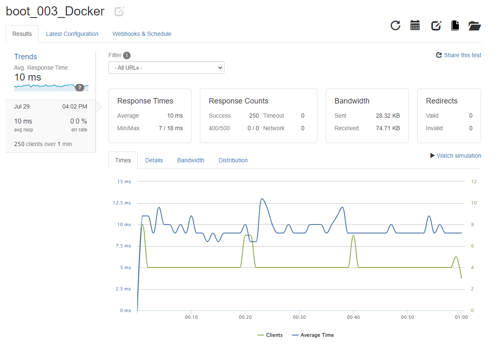<br>
    <figcaption>Imagem 07.</figcaption>
  </figure></div><br>

  Foi observado que em alguns casos o tempo de resposta pode ser muito lento e para esse caso é recomendado que se crie um **Cluster**. Para isso, foi necessário criar mais duas maquinas virtuais no serviço **Amazon EC2** da **AWS** na cloud, conforme mostrado na imagem 08. Essas maquinas funcionaram como workers deste cluster. Em cada uma delas, foi necessário fazer a instalação do **Docker**. Já na primeira maquina virtual (**Linux-Ubuntu-1**) chamada de **master** foi feito a remoção do container da aplicação com o comando `docker rm --force web-server`, permanecendo apenas o container do banco de dados. Em seguida, foi utilizado o comando `docker swarm init` para inicialização do cluster e foi fornecido código abaixo para ser executado em cada um dos nós desse cluster, após a instalação do docker. Porém, antes de executar, foi preciso liberar a porta **2237** no master adicionando uma nova regra no grupo de segurança.

  `docker swarm join --token SWMTKN-1-088vmm06qvq8j79ctj4yly9pnd5aajbuqgq2k34u6bwwgav40s-1o4oe3kgjvc0vvovc5lpqkwim 172.31.89.232:2377`

  <div align="Center"><figure>
    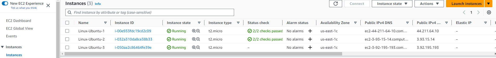<br>
    <figcaption>Imagem 08.</figcaption>
  </figure></div><br>
  
  Com as duas novas maquinas virtuais adicionadas ao cluster como workers, foi verificado no master se as três maquinas estavam realmente no cluster com o comando `docker node ls` e o output do comando é mostrado na imagem 08 a seguir. Foi necessário retirar um nó do cluster e colocá-lo novamente, o comando para remover o nó do cluster foi `docker swarm leave`.

  <div align="Center"><figure>
    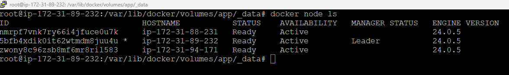<br>
    <figcaption>Imagem 09.</figcaption>
  </figure></div><br>

  Após a adição dos três nós ao cluster, foi executado o comando do **Docker** para criação do container com a aplicação web com a imagem do **PHP Apache**. Só que desta vez para o cluster inteiro, replicando dez vezes entre eles.

  `docker service create --name web-server --replicas 10 -dt -p 80:80 --mount type=volume,src=app,dst=/app/ webdevops/php-apache:alpine-php7`

  O comando `docker service ps web-server` foi utilizado para conferir a distribuição das replicações aos nós. A imagem 10 evidencia esta etapa.

  <div align="Center"><figure>
    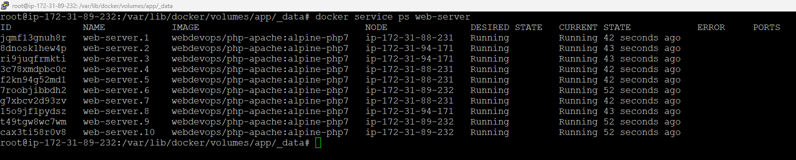<br>
    <figcaption>Imagem 10.</figcaption>
  </figure></div><br>

  Infelizmente, a criação do serviço no cluster não compartilha os arquivos do diretório do master com os workers, para isso foi necessário realizar a montagem do diretório entre esses nós. Primeiro, foi feito a instalação do **NFS Server** com o comando `apt-get install nfs-server -y` no master, e em seguida, a instalação do **NFS Common** nos workers com o comando `apt-get install nfs-common -y`. No nó master, foi aberto o arquivo `/etc/exports` com o editor de texto `nano` e inserido o comando `/var/lib/docker/volumes/app/_data *(rw,sync,subtree_check)`, determinando a pasta deste nó que foi compartilhada com os demais nós e a liberação da permissão de acesso dos nós a essa pasta. Continuando, foi preciso exportar através do comando `exportfs -ar` e verificar, ainda no nó master, se a pasta escolhida foi exportada corretamente com o comando `showmount -e`.

  Nos workers, foi necessário realizar a montagem do diretório compartilhado através do comando abaixo.

  `mount -o v3 172.31.89.232:/var/lib/docker/volumes/app/_data /var/lib/docker/volumes/app/_data`

  Porém, diferente do acontecido com o professor do curso, foi obtido um erro de **Time Out** e que foi necessário realizar uma pesquisa externa para entender um pouco mais afundo. Com as pesquisas, foi percebido que servidor **NFS** utiliza diversas portas para comunicação de seus serviços. Através do comando `rpcinfo -p` foi exibido cinco serviços (**portmapper**, **mountd**, **status**, **nfs** e **nlockmgr**). Os serviços **nfs** e **portmapper** utilizavam portas fixas que já eram conhecidas, que são as portas **2049** e **111** respectivamente, para os protocolos **TCP** e **UDP**. Já os serviços **mountd**, **status** e **nlockmgr** utilizavam diversas portas diferentes, pelo que foi entendido, eles não possuíam uma porta fixa. Logo, essas portas não eram liberadas no grupo de segurança da maquina virtual master na cloud da **AWS**. Abaixo na imagem 11, é visualizado o output do comando `rpcinfo -p` executado no nó master.

  <div align="Center"><figure>
    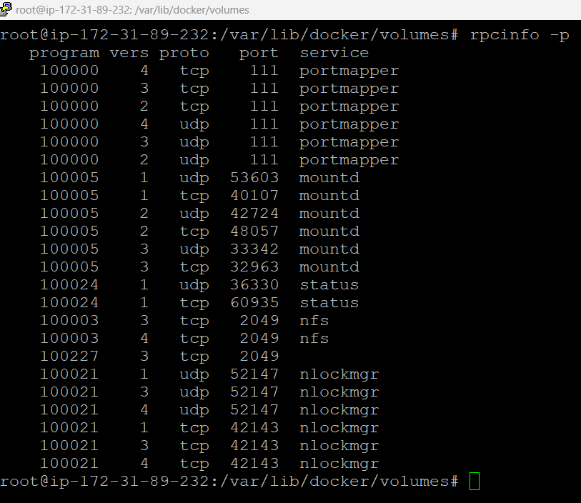<br>
    <figcaption>Imagem 11.</figcaption>
  </figure></div><br>

  Para solucionar essa situação foi feito algumas alterações em arquivos de configuração do **nfs** para fixar as portas desses serviços. Com o comando `nano /etc/default/nfs-common`, foi aberto o editor de texto no arquivo de configuração do nfs para o cliente, foi inserido o comando `STATDOPTS="--port 52159 --outgoing-port 52160"` e anulado a linha existe com uma tralha. Essa configuração definiu a porta de entrada e saída. Com o comando `nano /etc/default/nfs-kernel-server` foi editado o serviço **mountd** (acredito que ele era o responsável por provocar o time out no cliente), que é responsável pelo compartilhamento entre o servidor e o cliente. Neste arquivo, foi alterado a linha `RPCMOUNTDOPTS="--port 885"` e anulado a linha atual. Em seguida, o comando `nano /etc/modprobe.d/options.local` criou o arquivo caso ele não já exista, referente ao serviço **nlockmgr**, onde foi inserida a linha `options loockd nlm_udpport=53204 nlm_tcpport=53204` (Acredito que esta última linha não serviu, pois o **nlockmgr** continou com a porta dinâmica). Após isso, foi necessário abrir o arquivo de configurações de portas com o comando `nano /etc/services` e no final dele inserir o código abaixo. Este código, teoricamente fixaria as portas de todos os três serviços. Porém, como dito anteriormente, a porta do **nlockmgr** não foi fixada, mas isso não afetou a solução do problema de compartilhamento.

  ```
  mountd          885/tcp                         # RPC mountd
  mountd          885/udp                         # RPC mountd
  nlockmgr        53204/tcp                       # RPC nlockmgr
  nlockmgr        53204/udp                       # RPC nlockmgr
  status          52159/tcp                       # RPC statusd
  status          52159/udp                       # RPC statusd
  ```

  Para que as portas fixadas fossem alteradas no nó master foi preciso da um reboot na maquina virtual master. A imagem 12 mostra as portas dos serviços do **nfs** como ficaram depois de fixadas. Já na imagem 13 é apresentado acesso remoto as três maquinas, com o serviço rodando e os arquivos compartilhados nas duas maquinas workers.

  <div align="Center"><figure>
    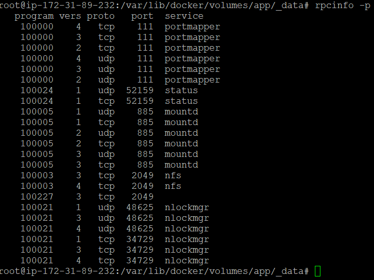<br>
    <figcaption>Imagem 12.</figcaption>
  </figure></div><br>

  <div align="Center"><figure>
    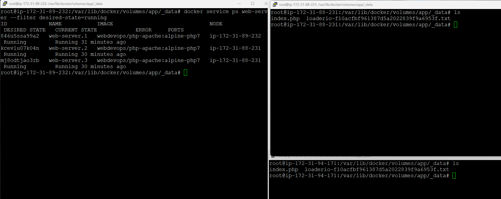<br>
    <figcaption>Imagem 13.</figcaption>
  </figure></div><br>

  Antes de executar novamente, o comando de montagem do diretório nos workers, foi necessário criar as regras de seguraça no **Firewall** da maquina virtual na **AWS**. As únicas portas abertas foram as: **2049** (nfs), **111** (portmapper) e **885** (mountd que foi fixada). As outras duas não foi preciso liberar. Também não foi preciso liberar nenhuma porta do **nfs** nas maquinas workers. Para que a aplicação web funcionasse pelo IP nas maquinas workers foi necessário abrir a porta **80**, assim era possível realizar as requisições. Em relação a porta **3306** referente ao **MySQL** não foi necessário liberá-la nos workers, pois o container do banco de dados estava executando apenas na maquina master que já estava com a porta liberada.

  Criando um Proxy

  Nesta etapa, foi realizado a criação da pasta `proxy` na raíz. Dentro dela, com o editor `nano` foi elaborado o arquivo `nginx.conf`, passando os IPs das três maquinas virtuais desenvolvidas. Além disso, foi desenvolvido um arquivo **dockerfile** que utilizava uma imagem **Docker** do **nginx** para construção de outra imagem, que copiou o arquivo configurado para dentro do container. A seguir, é exibido primeiro o arquivo **nginx.conf** (acesse [aqui](./03.05-dp_docker/nginx.conf)) e depois o **dockerfile** (acesse [aqui](./03.05-dp_docker/dockerfile)) utilizados.

  ```
  http {
   
    upstream all {
        server 172.31.89.232:80;
        server 172.31.88.231:80;
        server 172.31.94.171:80;
    }

    server {
         listen 4500;
         location / {
              proxy_pass http://all/;
         }
    }

  }

  events { }  
  ```

  ```
  FROM nginx
  COPY nginx.conf /etc/nginx/nginx.conf
  ```

  Para criação da imagem de um container a partir de um arquivo **dockerfile** foi utilizado o comando `docker build -t proxy-app .` de dentro da pasta `proxy` criada, onde estavam os arquivos elaborados. Após isso, com o comando `docker container run --name my-proxy-app -dti -p 4500:4500 proxy-app` foi construído um container com base na imagem criada e fazendo um bind de portas na **4500**. Foi necessário liberar a porta **4500**, adicionando uma nova regra ao grupo de segurança da maquina master do cluster na cloud **AWS**. Nas próximas imagens (14 e 15) é detalhado como ficou a configuração de **Firewall** (regras do grupo de segurança) das maquinas virtuais no **Amazon EC2**. A primeira imagem, é o nó master e a segunda é um dos nós workers.

  <div align="Center"><figure>
    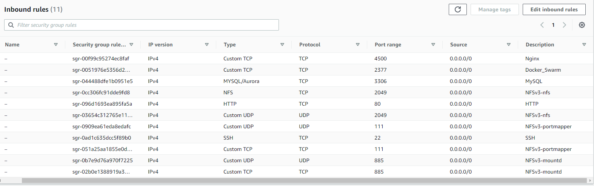<br>
    <figcaption>Imagem 14.</figcaption>
  </figure></div><br>

  <div align="Center"><figure>
    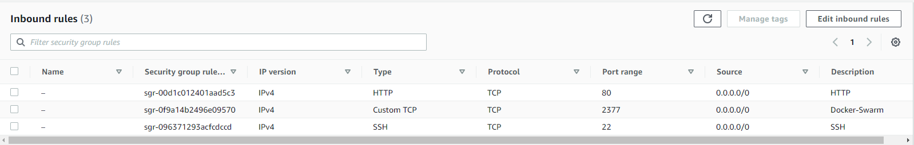<br>
    <figcaption>Imagem 15.</figcaption>
  </figure></div><br>
  
  Este desafio foi finalizado realizando novamente um teste de estresse, só que agora para um cenário de cluster com três maquinas. O procedimento é basicamente o mesmo feito para o cenário de apenas uma maquina. No site **Loader.io** foi excluído o host existente e inserido um novo host (IP da maquina master) com a porta **4500** do **nginx**. Com isso, foi gerado uma chave que foi copiada e colada em um arquivo **txt** criado com o mesmo nome da chave através do comando `nano loaderio-4239feba2515115e3bc17343a76f0afa.txt`, na mesma pasta da aplicação `/var/lib/docker/volumes/app/_data`. Em seguida, foi verificado se o site reconheceu o arquivo criado. Após reconhecido, foi criado um novo teste com 300 requisições por minuto e no path da url foi o arquivo da aplicação web **index.php**. O resultado é apresentado na imagem 16 a seguir. O tempo de resposta médio foi de 2967 ms
  
  <div align="Center"><figure>
    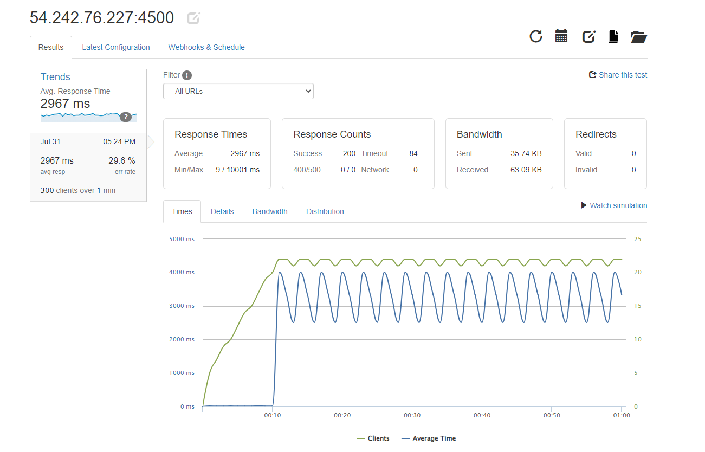<br>
    <figcaption>Imagem 16.</figcaption>
  </figure></div><br>

  Por fim, a imagem 17 ilustra as inserções feitas no banco de dados com diferentes hosts.

  <div align="Center"><figure>
    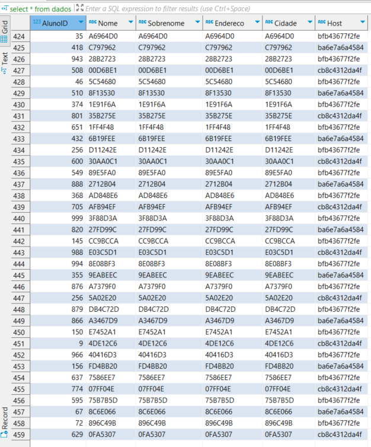<br>
    <figcaption>Imagem 17.</figcaption>
  </figure></div><br>

  <a name="item3.6"><h4>3.6. Mentoria - DevOps: Tudo o que você precisa saber</h4></a>[Back to summary](#item3) | <a href="https://github.com/PedroHeeger/main/blob/main/cert_ti/04-curso/development/devops/(23-08-03)%20DevOps...%20PH%20DIO.pdf">Certificate</a>