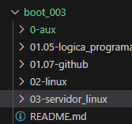

# Linux do Zero   

### Repository: [course](../../../)   
### Platform: <a href="../../">dio   </a>   
### Software/Subject: <a href="../">linux   </a>
### Bootcamp: <a href="./">boot_003 (Linux do Zero)   </a>

#### <a href="https://github.com/PedroHeeger/main/blob/main/cert_ti/03-conclu/os/linux/(23-08-03)%20Cert%20Linux%20do%20Zero%20PH%20DIO.pdf">Certificate</a>

---

### Theme:
- Operating System (OS)

### Used Tools:
- Operating System (OS): 
  - Linux   
  - Windows 11   
- Cloud Services:
  - Google Drive 
- Language:
  - HTML   
  - Markdown   
- Integrated Development Environment (IDE) and Text Editor:
  - VS Code   
- Versioning: 
  - Git   
- Repository:
  - GitHub   

---

### Bootcamp Structure
1. Prepare-se Para a Jornada   
  1.1. Conheça as Oportunidades da DIO   
  1.2. Seja Protagonista Neste Bootcamp   
  1.3. Introdução ao Desenvolvimento Moderno de Software   
  1.4. Trabalhando em Equipes Ágeis   
  1.5. [Introdução à Programação e Pensamento Computacional](./01.05-logica_programacao/)   
  1.6. Como Entregar seu Desafio de Projeto   
  1.7. [Criando seu Primeiro Repositório no GitHub para Compartilhar seu Progresso](./01.07-github)   
  1.8. Linux do Zero-Mentoria   

2. [Primeiros Passos com o Sistema Operacional Linux](./02-linux/)   
  2.1. [Introdução ao Sistema Operacional Linux](https://github.com/PedroHeeger/boot/tree/main/dio/linux/boot_003/02-linux#item2.1)   
  2.2. [Instalando o Linux](https://github.com/PedroHeeger/boot/tree/main/dio/linux/boot_003/02-linux#item2.2)   
  2.3. [Acesso Remoto a Máquinas Linux](https://github.com/PedroHeeger/boot/tree/main/dio/linux/boot_003/02-linux#item2.3)   
  2.4. [Manipulando Arquivos no Linux](https://github.com/PedroHeeger/boot/tree/main/dio/linux/boot_003/02-linux#item2.4)   
  2.5. [Gerenciando Usuários no Linux](https://github.com/PedroHeeger/boot/tree/main/dio/linux/boot_003/02-linux#item2.5)   
  2.6. [Gerenciamento de Pacotes Linux](https://github.com/PedroHeeger/boot/tree/main/dio/linux/boot_003/02-linux#item2.6)   
  2.7. [Gerenciamento de Discos Linux](https://github.com/PedroHeeger/boot/tree/main/dio/linux/boot_003/02-linux#item2.7)   
  2.8. [Copiando Arquivos e Manipulando Processos](https://github.com/PedroHeeger/boot/tree/main/dio/linux/boot_003/02-linux#item2.8)   
  2.9. [Infraestrutura como Código: Script de Criação de Estrutura de Usuários, Diretórios e Permissões](https://github.com/PedroHeeger/boot/tree/main/dio/linux/boot_003/02-linux#item2.9)   

3. [Configurando Servidores Linux e Introdução ao Docker](./03-servidor_linux/)   
  3.1. [Servidores Arquivos com Linux](https://github.com/PedroHeeger/boot/tree/main/dio/linux/boot_003/03-servidor_linux#item3.1)   
  3.2. [Criando um Servidor Web com Linux](https://github.com/PedroHeeger/boot/tree/main/dio/linux/boot_003/03-servidor_linux#item3.2)   
  3.3. [Servidor de Banco de Dados com Linux](https://github.com/PedroHeeger/boot/tree/main/dio/linux/boot_003/03-servidor_linux#item3.3)   
  3.4. [Infraestrutura como Código - Script de Provisionamento de um Servidor Web (Apache)](https://github.com/PedroHeeger/boot/tree/main/dio/linux/boot_003/03-servidor_linux#item3.4)   
  3.5. [Docker: Utilização Prática no Cenário de Microsserviços](https://github.com/PedroHeeger/boot/tree/main/dio/linux/boot_003/03-servidor_linux#item3.5)   
  3.6. [Mentoria - DevOps: Tudo o que você precisa saber](https://github.com/PedroHeeger/boot/tree/main/dio/linux/boot_003/03-servidor_linux#item3.6)   

4. Fortalecendo Seu Perfil Profissional   
  4.1. Deixando Seu Linkedin Atrativo   
  4.2. Turbine Seu Currículo na DIO   
  4.3. Transformando seu Conhecimento em Artigos Técnicos   
  4.4. Se Preparando Para Uma Entrevista   

---

### Objective:
Segue abaixo o objetivo deste bootcamp, conforme descrito na plataforma da **DIO**.
  
>Este programa é para profissionais de tecnologia que querem aperfeiçoar seus conhecimentos no sistema operacional Linux em uma trilha imersiva, rápida e eficiente. O Linux do Zero possui apenas 44 horas, que você pode finalizar em poucos dias, de atividades 100% voltadas para os desafios do mercado de trabalho. Nesse programa você vai aprender a principal vocação do sistema operacional Linux, seus comandos fundamentais e como gerenciar serviços de um servidor.

### Structure:
- A estrutura do bootcamp da plataforma **DIO** é dividida em módulos e cada módulo contém cursos e desafios, sendo este último podendo ser **Desafio de Projeto** ou **Desafio de Código**. 
- Para melhor organização deste bootcamp, a estruturação das pastas acompanhou a estrutura do bootcamp. Dessa forma, foram criadas sub-pastas para cada módulo ou curso desse bootcamp, sendo que nas sub-pastas dos módulos estão contidas as pastas ou arquivos dos Desafios ou Cursos realizados.
- Nos arquivos de README de cada módulo ou curso está descrito o que foi realizado em cada um, e podem ser acessado nos links clicáveis na opção **Bootcamp Strucutre**. Os links que não forem clicáveis, são de cursos ou módulos que, na sua maior parte ou inteiramente, foram assuntos teóricos e não possuem materiais.
- Alguns cursos podem ter sido desenvolvidos em outro bootcamp, já que são os mesmos cursos, portanto, a explicação sobre esses cursos e seus respectivos materiais vão está no outro bootcamp e podem ser acessados através dos links do **Bootcamp Structure**.
- A sub-pasta **0-img** foi criada apenas para armazenar imagens auxiliares para a construção dos arquivos de README.md deste bootcamp. A imagem 01 exibe como ficou a estruturação dos arquivos.

<figure>
     
    <figcaption>Imagem 01.</figcaption>
</figure>
 

### Development:
Em relação ao desenvolvimento, cada desafio ou curso tiveram seus objetivos específicos. Por tanto, a explicação sobre cada um está contida na sua respectiva pasta, seguindo a estruturação determinada no bootcamp.