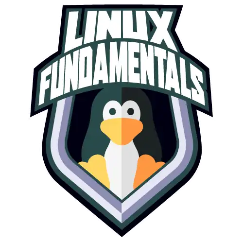

# Formação Linux Fundamentals   

### Repository: [course](../../../)   
### Platform: <a href="../../">dio   </a>   
### Software/Subject: <a href="../">linux   </a>
### Bootcamp: <a href="./">boot_005 (Formação Linux Fundamentals)   </a>

#### <a href="https://github.com/PedroHeeger/main/blob/main/cert_ti/05-particip/data/excel/(23-06-22)%20Cert%20Excel%20PH%20Empowerdata%20(Semana).pdf">Certificate</a>

---

### Theme:
- Operating System (OS)

### Used Tools:
- Operating System (OS): 
  - Linux   
  - Windows 11 
- Linux Distribution: 
  - Ubuntu 
- Virtualization: 
  - VM VirtualBox 
- Integrated Development Environment (IDE):
  - VS Code   
- Versioning: 
  - Git   
- Repository:
  - GitHub   
- Command Line Interpreter (CLI):
  - bash 
- Others:
  - Google Drive 

---

### Bootcamp Structure
1. [Introdução ao Linux](https://github.com/PedroHeeger/boot/tree/main/dio/linux/boot_03/02-linux)   
  1.1. [Introdução ao Sistema Operacional Linux](https://github.com/PedroHeeger/boot/tree/main/dio/linux/boot_03/02-linux#item2.1)    
  1.2. [Instalando o Linux](https://github.com/PedroHeeger/boot/tree/main/dio/linux/boot_03/02-linux#item2.2)   
  1.3. [Acesso Remoto a Máquinas Linux](https://github.com/PedroHeeger/boot/tree/main/dio/linux/boot_03/02-linux#item2.3)   
  1.4. Materiais Complementares - Introdução ao Linux   

2. [Trabalhando com Usuários, Arquivos e Diretórios no Linux](https://github.com/PedroHeeger/boot/tree/main/dio/linux/boot_03/02-linux)    
  2.1. [Manipulando Arquivos no Linux](https://github.com/PedroHeeger/boot/tree/main/dio/linux/boot_03/02-linux#item2.4)   
  2.2. [Gerenciando Usuários no Linux](https://github.com/PedroHeeger/boot/tree/main/dio/linux/boot_03/02-linux#item2.5)   
  2.3. [Infraestrutura como Código: Script de Criação de Estrutura de Usuários, Diretórios e Permissões](https://github.com/PedroHeeger/boot/tree/main/dio/linux/boot_03/02-linux#item2.9)   
  2.4. Materiais Complementares - Linux: Trabalhando como Usuários, Arquivos e Diretórios      

3. [Gerenciamento de Pacotes e Discos no Linux](https://github.com/PedroHeeger/boot/tree/main/dio/linux/boot_03/02-linux)   
  3.1. [Gerenciamento de Pacotes Linux](https://github.com/PedroHeeger/boot/tree/main/dio/linux/boot_03/02-linux#item2.6)   
  3.2. [Gerenciamento de Discos Linux](https://github.com/PedroHeeger/boot/tree/main/dio/linux/boot_03/02-linux#item2.7)   
  3.3. [Copiando Arquivos e Manipulando Processos](https://github.com/PedroHeeger/boot/tree/main/dio/linux/boot_03/02-linux#item2.8)   
  3.4. Materiais Complementares - Gerenciamento de Pacotes e Discos   

4. [Serviços Linux](https://github.com/PedroHeeger/boot/tree/main/dio/linux/boot_03/03-servidor_linux)   
  4.1. [Servidores Arquivos com Linux](https://github.com/PedroHeeger/boot/tree/main/dio/linux/boot_03/03-servidor_linux#item3.1)   
  4.2. [Criando um Servidor Web com Linux](https://github.com/PedroHeeger/boot/tree/main/dio/linux/boot_03/03-servidor_linux#item3.2)   
  4.3. [Servidor de Banco de Dados com Linux](https://github.com/PedroHeeger/boot/tree/main/dio/linux/boot_03/03-servidor_linux#item3.3)   
  4.4. [Infraestrutura como Código - Script de Provisionamento de um Servidor Web (Apache)](https://github.com/PedroHeeger/boot/tree/main/dio/linux/boot_03/03-servidor_linux#item3.4)   
  4.5. Materiais Complementares - Serviços Linux

5. Linux Desktop: Ferramentas Importantes para o Desenvolvedor   
  5.1. <a href="#item5.1">Conhecendo o Linux Desktop</a> 
  5.2. Materiais Complementares - Linux Desktop: Ferramentas Importantes para o Desenvolvedor   
  5.3. Avalie esta Formação Linux Fundamentals

---

### Objective:
Segue abaixo o objetivo deste Bootcamp, conforme descrito na plataforma da **DIO**.
  
>Este programa é para profissionais de tecnologia que querem aperfeiçoar seus conhecimentos no sistema operacional Linux em uma trilha imersiva, rápida e eficiente. O Linux do Zero possui apenas 44 horas, que você pode finalizar em poucos dias, de atividades 100% voltadas para os desafios do mercado de trabalho. Nesse programa você vai aprender a principal vocação do sistema operacional Linux, seus comandos fundamentais e como gerenciar serviços de um servidor.

### Structure:
- A estrutura do Bootcamp da plataforma **DIO** é dividida em módulos e cada módulo contém cursos e desafios, sendo este último podendo ser **Desafio de Projeto** ou **Desafio de Código**. 
- Para melhor organização deste Bootcamp, a estruturação das pastas acompanhou a estrutura do Bootcamp. Dessa forma, foram criadas sub-pastas para cada módulo ou curso desse Bootcamp, sendo que nas sub-pastas dos módulos estão contidas as pastas ou arquivos dos Desafios ou Cursos realizados.
- Nos arquivos de README de cada módulo ou curso está descrito o que foi realizado em cada um, e podem ser acessado nos links clicáveis na opção **Bootcamp Strucutre**. Os links que não forem clicáveis, são de cursos ou módulos que, na sua maior parte ou inteiramente, foram assuntos teóricos e não possuem materiais.
- Alguns cursos podem ter sido desenvolvidos em outro Bootcamp, já que são os mesmos cursos, portanto, a explicação sobre esses cursos e seus respectivos materiais vão está no outro Bootcamp e podem ser acessados através dos links do **Bootcamp Structure**.
- A sub-pasta **0-img** foi criada apenas para armazenar imagens auxiliares para a construção dos arquivos de README.md deste Bootcamp.

### Development:
Em relação ao desenvolvimento, cada desafio ou curso tiveram seus objetivos específicos. Por tanto, a explicação sobre cada um está contida na sua respectiva pasta, seguindo a estruturação determinada no Bootcamp.

  <a name="item5.1"><h4>5.1. Conhecendo o Linux Desktop</h4></a>[Back to summary](#item5) | <a href="https://github.com/PedroHeeger/main/blob/main/cert_ti/04-curso/os/linux/(23-07-28)%20Servidores%20de%20Arquivos%20com%20Linux%20PH%20DIO.pdf">Certificate</a>

  Nesta curso foi criado uma nova maquina virtual no software **VM Virtual Box** com base uma imagem de **Linux Ubuntu** para desktop, ao invés de servidor. Ou seja, essa maquina possuíu interface gráfica. A imagem base para essa maquina foi fornecido pela plataforma do curso. Para a criação, dentro do **VM Virtual Box**, foi selecionada a opção **Importar Appliance**. Na janela aberta foi selecionada a imagem base e mantida as configurações padrões.

  Após criação, foi ligado a maquina e realizado o acesso a área de trabalho. Para redimensionar a tela da maquina virtual para que preenchesse a tela inteira, foi necessário ir na opção *dispositivos* na barra de ferramentas e selecionar a opção *inserir imagem de CD dos Adicionais para Convidado*. Assim, na doca (barra lateral do Ubuntu Desktop) surgiu um ícone de CD que era um pasta que foi acessada. Dentro da pasta, foi aberto o terminal do **Linux** e executado o arquivo `VBoxLinuxAdditions.run`. Após concluído, a maquina foi desligada e novamente ligada. Com a efetuação do login, foi possível, agora, maximizar a tela do **Ubuntu Desktop**. As credenciais de acesso para login vieram configuradas na imagem fornecida pela plataforma do curso.

  Para finalizar o curso, foi explicado alguns ícones dispostos na área de trabalho e na doca do **Ubuntu**. Foi realizado a instalação do software **VS Code** através da loja **Ubuntu Software**.