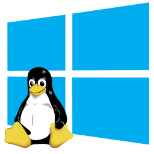
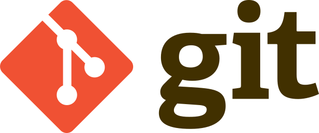
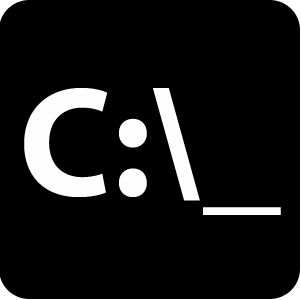
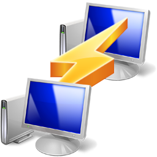
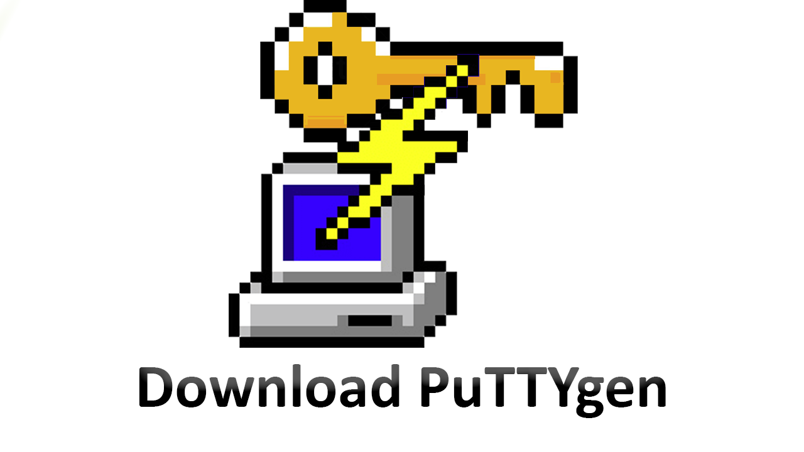
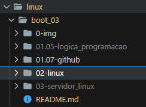

# Linux do Zero - Módulo 2   

#### Repositório: [course](../../../../)   
#### Plataforma: <a href="../../../">dio   </a>   
#### Software/Assunto: <a href="../../">linux   </a>
#### Bootcamp: <a href="../">boot_03 (Linux do Zero)   </a>
#### Módulo: 2) Primeiros Passos com o Sistema Operacional Linux

---

Esta pasta é referente ao Módulo 2 **Primeiros Passos com o Sistema Operacional Linux** do Bootcamp **Linux do Zero**.

#### Tema:
- Sistemas Operacionais

#### Ferramentas Utilizadas:
- Sistema Operacional: 
  - Linux   
- Distribuição Linux: 
  - Ubuntu 
- Ambientes: 
  - VM VirtualBox 
  - AWS 
  - WSL 
- Cloud:
  - Amazon EC2   
- Ambiente de Desenvolvimento (IDE):
  - VS Code   
- Versionamento: 
  - Git   
- Repositório:
  - GitHub   
- Outros:
  - Google Drive 
  - cmd 
  - PuTTY 
  - PuTTYgen 

---

#### Estrutura do Módulo 2 do Bootcamp
2) Primeiros Passos com o Sistema Operacional Linux   
  2.1 Introdução ao Sistema Operacional Linux   
  2.2 Instalando o Linux   
  2.3 Acesso Remoto a Máquinas Linux   
  2.4 Manipulando Arquivos no Linux   
  2.5 Gerenciando Usuários no Linux   
  2.6 Gerenciamento de Pacotes Linux   
  2.7 Gerenciamento de Discos Linux   
  2.8 Copiando Arquivos e Manipulando Processos   
  2.9 Infraestrutura como Código: Script de Criação de Estrutura de Usuários, Diretórios e Permissões   

---

#### Objetivo:
- O objetivo neste módulo do Bootcamp é dar os primeiros passos com o sistema operacional Linux.

#### Estrutura:
- A estrutura das pastas obedece a estruturação do Bootcamp, ou seja, conforme foi necessário, sub-pastas foram criadas para os cursos específicos deste módulo. 

<figure>
     
    <figcaption>Imagem 01.</figcaption>
</figure>
 

#### Desenvolvimento:
O desenvolvimento deste módulo do Bootcamp foi dividido em oito cursos e um desafio de projeto. Abaixo é explicado o que foi desenvolvido em cada um desses cursos.

  ##### 2.1 Introdução ao Sistema Operacional Linux:
  Apenas aulas teóricas sobre introdução ao sistema operacional Linux e maquinas virtuais.
  
  ##### 2.2 Instalando o Linux
  Neste curso foi realizado a instalação do sistema operacional Linux em três ambientes diferentes, sendo que em todos eles foi instalado a distribuição Ubuntu. O primeiro ambiente utilizado foi o software **VM Virtual Box**, onde através de uma imagem ISO do Ubuntu foi instanciado uma maquina virtual Linux voltada para servidor. Nesta maquina foi realizado uma configuração do adaptador de rede para que posteriormente fosse possível realizar o acesso remoto. O segundo ambiente foi na Cloud da **AWS**, através do serviço **Amazon EC2** foi instanciado uma maquina virtual do Linux Ubuntu. Já o terceiro ambiente foi através do **WSL**, que é um subsistema do Windows para Linux. Este último não foi realizado o processo de instalação, pois o mesmo já existe na maquina física e é o que é utilizado no dia a dia.

  Para o funcionamento do **VM Vritual Box** foi necessário desabilitar o **hypervisorlaunchtype** através do Prompt de Comando do Windows (**cmd**). Já para o **WSL** foi necessário abilitar este recurso além de outros recursos como: **Plataforma de Maquina Virtual**, **Plataforma de Hipervisor do Windows** e **Subsistema do Windows para Linux**.

  ##### 2.3 Acesso Remoto a Máquinas Linux
  Neste curso foi realizado o acesso remoto da maquina virtual (Linux Ubuntu) pela maquina física (Linux e Windows) em diferentes ambientes (Virtual Box, Cloud AWS, WSL) através do protocolo de rede **SSH**. No Windows foi necessário baixar e instalar o software **PuTTY** e **PuTTYgen** para criar esse tipo de conexão. Já no Linux foi necessário apenas instalar o **openSSH** no shell. Em ambos os casos foi necessário descobrir o IP da maquina virtual para realizar o acesso remoto.
       
  Foi realizado o acesso remoto tanto de uma maquina física Linux (no caso, utilizei o WSL) na maquina virtual Linux em um ambiente de Cloud na AWS (Linux dentro de um Windows para Linux), e também de uma maquina física Windows na maquina virtual Linux para os ambientes de Cloud na AWS e através do software de maquina virtual, o VM Virtual Box (Windows para Linux). A imagem 02 a seguir, ilustra o desenvolvimento.
       
  No ambiente de Cloud, ao criar a instância da maquina virtual Ubuntu no serviço Amazon EC2 foi necessário criar um arquivo de credencial no formato **.pem**, esse arquivo de credencial é utilizado no Linux. Já no Windows, precisou do software **PuTTYgen** para abrí-lo e salvá-lo como formato **.ppk**, sendo possível criar uma senha para acesso.

  ##### 2.4 Manipulando Arquivos no Linux
  Neste curso foi realizado os procedimentos básicos de manipulação de arquivos no sistema Linux utilizando a maquina virtual Linux Ubuntu criada no VM Virtual Box. Dentre os procedimentos foram feitos: navegação no sistema de arquivo (cd e pwd), filtragem e exibição de arquivos (ls), localização de arquivos (find), criação e exclusão de diretórios (mkdir e rmdir), criação de arquivos vazios (touch), utilização dos comandos de ajuda (help e man), execução de tarefas administrativas como root (sudo), acesso como usuário root (su), acesso remoto no Linux como usuário root pelo Windows através do PuTTY, exibição do conteúdo de um arquivo (cat), utilização de editores de textos (vi e nano), exibição do histórico de últimos comandos do usuário (history), localização de informação (grep), entre outros comandos básicos.

  O acesso remoto como usuário root precisou realizar uma alteração no arquivo do Linux `/etc/ssh/sshd_config` modificando a linha `#PermitRootLogin prohibit-password` retirando o comentário e trocando o **prohibit-password** para **yes**. Em seguida, foi necessário reiniciar o serviço através do comando `systemctl restart sshd` para que a alteração fosse concretizada. Após isso, o procedimento foi o mesmo para o usuário criado com a utilização do **PuTTY**, a diferença foi trocar as credenciais de acesso para a do usuário root.
