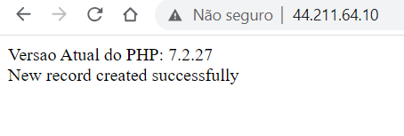

# Linux do Zero - Módulo 3   

### Repository: [course](../../../../)   
### Platform: <a href="../../../">dio   </a>   
### Software/Subject: <a href="../../">linux   </a>
### Bootcamp: <a href="../">boot_03 (Linux do Zero)   </a>
### Module: 3. Configurando Servidores Linux e Introdução ao Docker

---

This folder refers to Module 3 **Configurando Servidores Linux e Introdução ao Docker** from Bootcamp **Linux do Zero**.

### Theme:
- Operating System (OS)

### Used Tools:
- Operating System (OS): 
  - Linux 
  - Windows 11 
- Linux Distribution: 
  - Ubuntu 
- Environment: 
  - VM VirtualBox 
  - AWS 
  - WSL 
- Cloud:
  - Amazon EC2   
- Integrated Development Environment (IDE):
  - VS Code   
- Versioning: 
  - Git   
- Repository:
  - GitHub   
- Command Line Interpreter (CLI):
  - cmd 
  - bash 
- Server:
  - Samba 
  - Apache HTTP Server 
  - MySQL Server 
- Others:
  - Google Drive 
  - PuTTY 
  - PuTTYgen 
  - OpenSSH 

---

### Bootcamp Module 3 Structure
3. <a name="item3">Configurando Servidores Linux e Introdução ao Docker</a><br> 
  3.1. <a href="#item3.1">Servidores Arquivos com Linux</a><br>
  3.2. <a href="#item3.2">Criando um Servidor Web com Linux</a><br>
  3.3. <a href="#item3.3">Servidor de Banco de Dados com Linux</a><br>
  3.4. <a href="#item3.4">Infraestrutura como Código - Script de Provisionamento de um Servidor Web (Apache)</a><br>
  3.5. <a href="#item3.5">Docker: Utilização Prática no Cenário de Microsserviços</a><br>
  3.6. <a href="#item3.6">Mentoria - DevOps: Tudo o que você precisa saber</a><br>

---

### Objective:
O objetivo deste módulo do Bootcamp é dar os primeiros passos com o sistema operacional Linux.

### Structure:
A estrutura das pastas obedece a estruturação do Bootcamp, ou seja, conforme foi necessário, sub-pastas foram criadas para os cursos específicos deste módulo. Na imagem 01 é exibido a estruturação das pastas. 

<div align="Center"><figure>
    <br>
    <figcaption>Imagem 01.</figcaption>
</figure></div><br>

### Development:
O desenvolvimento deste módulo do Bootcamp foi dividido em quatro cursos, um desafio de projeto e uma mentoria. Abaixo é explicado o que foi desenvolvido em cada uma dessas atividades.

  <a name="item3.1"><h4>3.1 Servidores Arquivos com Linux</h4></a>[Back to summary](#item3)

  Neste curso, foi desenvolvido um servidor de arquivos no sistema Linux utilizando a maquina virtual Linux Ubuntu criada no **VM Virtual Box**. Foi necessário utilizar a pasta referente ao **disco2** criado no módulo 2 deste bootcamp e também a instalação do software **Samba** para criação do servidor. No diretório `/disk2`, foi criado uma nova pasta de nome **publica** e concedido a permissão a todos os usuários através do comando `chmod 777 publica`, já dentro da pasta do disco2. Dando sequência, foi aberto o arquivo de configuração do **Samba** com o editor de texto **nano** disponível no diretório `/etc/samba/smb.conf`. 
  
  Neste arquivo, foi preciso verificar se a opção `map to guest` estava marcada como `bad user`, que indica que esta pasta não vai ter restrinção de usuário inicialmente e, ao final do arquivo, especificar as configurações da pasta compartilhada. As configurações determinadas foram: o nome do compartilhamento (`[publica]`), o caminho da pasta compartilhada (`/disk2/publica`), a liberação para gravação nesta pasta (`writeable = yes`), a liberação do acesso de qualquer pessoa a pasta (`guest ok = yes`) e a determinação de que todo mundo que acessá-la seria um convidado (`guest only = yes`), já que é uma pasta pública. Em seguida, foi salvo e fechado o arquivo e foi necessário reinicializar o serviço do **Samba** para efetuar as alterações com o comando `systemctl restart smbd`. Também foi utilizado o comando `systemctl enable smbd` para habilitar o serviço para que ele ative automaticamente sempre quando o servidor for reiniciado.

  Com o servidor pronto, foi realizado o acesso pela maquina física **Windows** a esse servidor Linux Ubuntu (maquina virtual instanciada na **VM VirtualBox**) através de um caminho de rede no **explorador de arquivos** do **Windows**. Para realização desse acesso, foi preciso o número de IP da maquina virtual (o servidor em questão), observando que em um cenário corporativo, esse IP deverá ser fixo para que as demais maquinas conheçam e possam acessar o servidor, sem ter que ficar descobrindo o endereço de IP do servidor toda vez que este mudar.

  Para executar o acesso, na barra de endereço do **explorador de arquivos** foi digitado o comando `\\IP\publica`, sendo o **IP** substituido pelo do servidor. Feito isso, foi solicitado as credenciais de acesso, que poderia ser qualquer uma dos usuários criados no desafio de projeto do módulo 2 deste bootcamp. Também foi criado, na maquina física **Windows** em **Este Computador**, um caminho de rede direto para esta pasta compartilhada facilitando o acesso. Em outro computador também **Windows** foi realizado o mesmo acesso, porém com outras credenciais cadastradas. 
  
  <a name="item3.2"><h4>3.2 Criando um Servidor Web com Linux</h4></a>[Back to summary](#item3)

  Neste curso, foi desenvolvido um servidor web no sistema Linux utilizando a maquina virtual Linux Ubuntu criada no **VM Virtual Box**. Para criação desse servidor, foi preciso a instalação do software **Apache HTTP Server**. Após instalação e verificação, com o comando `systemctl status apache2`, que o status esta ativo, tornou-se possível acessar o site via número de **IP** da maquina virtual. Para alterar as informações do site, foi necessário ir na pasta `/var/www/html`, onde estava o arquivo `index.html` que correspondia as informações do site. Este arquivo foi excluído e criado um novo arquivo para construção do novo site.

  Na última aula do curso, foi utilizado o ambiente de cloud na **AWS** para criar um servidor web na internet. No serviço **Amazon EC2** foi instanciada uma nova maquina virtual (**Linux-Ubuntu**), as configurações foram as padrões para a opção gratuíta. Um novo par de chaves foi criado de nome **dio-linux-boot_003-m3.2** do tipo **RSA** e formato **.ppk** para utilizar no **PuTTY**. Lembrando que esse foi o terceiro par de chaves criado nesse Bootcamp, todas essas chaves foram excluídas após a finalização do projeto.

  Com a instancia criada, foi realizado o acesso remoto pelo **PuTTY**. O nome de usuário para acesso em uma maquina **Ubuntu** na **AWS** é `ubuntu`. Após acesso, foi feito a configuração da senha do usuário `root` para acessar como **root**. Em seguida, foi realizado o download dos pacotes e atualização do sistema operacional com os comandos `apt update -y` e `apt upgrade -y`. A próxima etapa foi instalar o software **Apache** nesta maquina para criação do servidor web. Após instalado, foi verificado o status do serviço e o local do arquivo **html** que constrói o site se estava disponível e continha o arquivo **index.html**.

  Existe uma diferença ao criar um servidor web localmente e em cloud. Em cloud, é disponibilizado um **IP** fixo para este site que pode ser acessado pela Internet, porém toda instância em execução possui uma espécie de **Firewall** para gerenciamento de acesso. Portanto, no ambiente de cloud, foi necessário liberar os protocolos **HTTP**, pois o **Firewall** bloqueia por padrão. Isso foi feito na opção **Editar regras de entrada** no grupo de segurança criado ao criar a maquina virtual. Nesta opção, foi criado uma nova regra para liberar o protocolo **HTTP** (porta **80**) para qualquer lugar do mundo, ou seja, qualquer usuário poderia acessar o site. No ambiente de cloud, o próprio serviço **Amazon EC2** já fornece um **DNS** para acesso ao site.

  Para modificar o site padrão do **Apache HTTP Server**, foi excluído o arquivo **index.html** existente e criado um novo. A construção desse novo site não fez parte do bootcamp, o material foi disponibilizado pelo professor do curso através do repositório no **GitHub** (`https://github.com/denilsonbonatti/linux-site-dio/archive/refs/heads/main.zip`). Esse material foi baixado com o comando `wget` no diretório `tmp` e foi realizado a descompactação dos arquivos com o software **unzip**, que como não tinha instalado, foi necessário instalar com o comando `apt install unzip`. Após a descompactação, foi criado um diretório de mesmo nome do repositório no **GitHub** (**linux-site-dio-main**). De dentro deste diretório foi copiado todos os arquivos para a pasta padrão do **Apache** com o comando `cp -R * /var/www/html/`. Com isso, o novo site ficou disponível para acesso até o encerramento do curso, pois a instancia da maquina virtual no **EC2** foi removida. Abaixo é exibido na imagem 03 como ficou este site e o **DNS** utilizado para acesso ao site.

  <div align="Center"><figure>
    <br>
    <br>
    <figcaption>Imagem 03.</figcaption>
  </figure></div><br>

  <a name="item3.3"><h4>3.3 Servidor de Banco de Dados com Linux</h4></a>[Back to summary](#item3)

  Neste curso, foi desenvolvido um servidor de banco de dados no sistema Linux utilizando a maquina virtual Linux Ubuntu criada no **VM Virtual Box**. Para execução foi necessário baixar e instalar o software **MySQL Server**. Após instalado, foi realizado o acesso com o usuário **root** do Linux ao **MySQL** com o comando `mysql -u root -p`, e digitado a senha desse usuário. Já no banco foram realizados os seguintes comandos em **SQL**:

  - Listar todos os bancos de dados existentes
    ```
    show databases;
    ```

  - Criar o banco de dados de nome **meubanco**
    ```
    create database meubanco;
    ```

  - Acessar o banco de dados criado
    ```
    use meubanco;
    ```

  - Criar a tabela **Pessoas** com os atributos determinados no **meubanco**
    ```
    create table Pessoas (PessoaID int, Nome varchar(50), Sobrenome varchar(50), Endereco varchar(100), Cidade varchar(50));
    ```

  - Listar todas as tabelas existentes nesse banco
    ```
    show tables;
    ```

  - Selecionar os dados da tabela criada (no momento, estava vazia, pois não tinha sido inserido nada)
    ```
    select * from Pessoas;
    ```

  - Inserir um dado na tabela **Pessoas**
    ```
    insert into Pessoas (PessoaID, Nome, Sobrenome, Endereco, Cidade) values (1, 'Carlos', 'da Silva', 'Av. do Carmo, 500', 'Jaboticabal-SP');
    ```

  - Selecionar os dados novamente (o resultado é exibido na imagem 05 abaixo)
    ```
    select * from Pessoas;
    ```
    <div align="Center"><figure>
        <br>
        <figcaption>Imagem 05.</figcaption>
    </figure></div><br>

  <a name="item3.4"><h4>3.4 Infraestrutura como Código - Script de Provisionamento de um Servidor Web (Apache)</h4></a>[Back to summary](#item3)

  O objetivo desse desafio determinado pela plataforma do bootcamp é descrito abaixo:

  > Neste projeto iremos criar um script onde será provisionado um servidor web automaticamente. Um servidor web é um software e hardware que usa HTTP (Hypertext Transfer Protocol) e outros protocolos para responder a solicitações de clientes feitas pela World Wide Web. O principal trabalho de um servidor da web é exibir o conteúdo do site por meio do armazenamento, processamento e entrega de páginas da web aos usuários.

  Para iniciar o projeto, conforme solicitado, foi necessário sair da maquina virtual para executar um **snapshot** em um estágio anterior às criações de servidores executadas durante as aulas. O script foi criado no editor de texto **nano** e consistiu: na instalação dos pacotes e atualização do sistema, na instalação dos softwares **Apache** e **Unzip**, no download da aplicação no repositório do GitHub para dentro da pasta `/tmp`, na descompactação do arquivo baixado e na copia de todos os arquivos da aplicação para a pasta `/var/www/html/`. Em seguida, foi concedida a permissão de execução para esse arquivo com o comando `chmod +x iac2.sh`. Dessa forma, o servidor web pôde ser acessado através do IP da maquina virtual (**Linux Ubuntu**) instanciada no software **VM VirtualBox**. Abaixo é exibido o script desenvolvido que pode ser acessado clicando [aqui](./03.04-dp_iac/iac2.sh).

  ```
  #!/bin/bash

  echo "Iniciando o processo..."
  echo "Atualizando o servidor..."

  apt-get update -y
  apt-get upgrade -y

  echo "Instalando o Apache e o Unzip"

  apt-get install apache2 -y
  apt-get instal unzip -y

  echo "Baixando a aplicação do repositório do GitHub..."

  cd /tmp
  wget https://github.com/denilsonbonatti/linux-site-dio/archive/refs/heads/main.zip

  echo "Descompactando o arquivo..."

  unzip main.zip

  echo "Movendo os arquivos da aplicação para o diretório /var/www/html/"

  cd linux-site-dio-main
  cp -R * /var/www/html/

  echo "Processo finalizado, site disponível através do IP da maquina virtual"
  ```

  <a name="item3.5"><h4>3.5 Docker: Utilização Prática no Cenário de Microsserviços</h4></a>[Back to summary](#item3)

