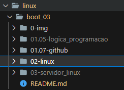

# Linux do Zero   

#### Repositório: [course](../../../)   
#### Plataforma: <a href="../../">dio   </a>   
#### Software/Assunto: <a href="../">linux   </a>
#### Bootcamp: <a href="./">boot_03 (Linux do Zero)   </a>

---

#### Tema:
- Sistemas Operacionais

#### Ferramentas Utilizadas:
- Sistema Operacional: 
  - Linux   
- Ambiente de Desenvolvimento (IDE):
  - VS Code   
- Versionamento: 
  - Git   
- Repositório:
  - GitHub   
- Outros:
  - Google Drive 
  - Excel 
  - ChatGPT 
  - Portugol 

---

#### Estrutura do Bootcamp
1) Prepare-se Para a Jornada   
  1.1 Conheça as Oportunidades da DIO   
  1.2 Seja Protagonista Neste Bootcamp   
  1.3 Introdução ao Desenvolvimento Moderno de Software   
  1.4 Trabalhando em Equipes Ágeis   
  [1.5 Introdução à Programação e Pensamento Computacional](./01.05-logica_programacao/)   
  1.6 Como Entregar seu Desafio de Projeto   
  [1.7 Criando seu Primeiro Repositório no GitHub para Compartilhar seu Progresso](./01.07-github)   
  1.8 Linux do Zero-Mentoria   

2) [Primeiros Passos com o Sistema Operacional Linux](./02-linux/)   
  2.1 Introdução ao Sistema Operacional Linux   
  2.2 Instalando o Linux   
  2.3 Acesso Remoto a Máquinas Linux   
  2.4 Manipulando Arquivos no Linux   
  2.5 Gerenciando Usuários no Linux   
  2.6 Gerenciamento de Pacotes Linux   
  2.7 Gerenciamento de Discos Linux   
  2.8 Copiando Arquivos e Manipulando Processos   
  2.9 Infraestrutura como Código: Script de Criação de Estrutura de Usuários, Diretórios e Permissões   

3) Configurando Servidores Linux e Introdução ao Docker   
  3.1 Servidores Arquivos com Linux   
  3.2 Criando um Servidor Web com Linux   
  3.3 Servidor de Banco de Dados com Linux   
  3.4 Infraestrutura como Código - Script de Provisionamento de um Servidor Web (Apache)   
  3.5 Docker: Utilização Prática no Cenário de Microsserviços   
  3.6 Mentoria - DevOps: Tudo o que você precisa saber   

4) Fortalecendo Seu Perfil Profissional   
  4.1 Deixando Seu Linkedin Atrativo   
  4.2 Turbine Seu Currículo na DIO   
  4.3 Transformando seu Conhecimento em Artigos Técnicos   
  4.4 Se Preparando Para Uma Entrevista   

---

#### Objetivo:
- Segue abaixo o objetivo deste Bootcamp, conforme descrito na plataforma da **DIO**.
  
  >Este programa é para profissionais de tecnologia que querem aperfeiçoar seus conhecimentos no sistema operacional Linux em uma trilha imersiva, rápida e eficiente. O Linux do Zero possui apenas 44 horas, que você pode finalizar em poucos dias, de atividades 100% voltadas para os desafios do mercado de trabalho. Nesse programa você vai aprender a principal vocação do sistema operacional Linux, seus comandos fundamentais e como gerenciar serviços de um servidor.

#### Estrutura:
- A estrutura do Bootcamp da plataforma **DIO** é dividida em módulos e cada módulo contém cursos e desafios, sendo este último podendo ser **Desafio de Projeto** ou **Desafio de Código**. Para melhor organização deste Bootcamp, a estruturação das pastas acompanhou a estrutura do Bootcamp. Dessa forma, foram criadas sub-pastas para cada módulo ou curso desse Bootcamp, sendo que nas sub-pastas dos módulos estão contidas as pastas ou arquivos dos Desafios ou Cursos realizados. A sub-pasta **0-img** foi criada apenas para armazenar imagens auxiliares para a construção dos arquivos de README.md deste Bootcamp. A imagem 01 exibe como ficou a estruturação dos arquivos.

<figure>
     
    <figcaption>Imagem 01.</figcaption>
</figure>
 

#### Desenvolvimento:
Em relação ao desenvolvimento, cada desafio ou curso tiveram seus objetivos específicos. Por tanto, a explicação sobre cada um está contida na sua respectiva pasta, seguindo a estruturação determinada no Bootcamp. Observe que a estruturação do Bootcamp é composta por 4 módulos e em cada módulo alguns cursos e desafios. Os índices que forem clicáveis, direcionará para a pasta referente ao curso ou desafio selecionado e então será exibido as informações do projeto prático realizado. Já os índices não clicáveis, foram apenas cursos teóricos que não houve parte prática realizada.