# Bootcamp AWS re/Start-Cloud Computing - Module 1   

### Repository: [boot](../../../../)   
### Platform: <a href="../../../">edn   </a> 
### Software/Subject: <a href="../../">aws    </a>
### Bootcamp: <a href="../">boot_022 (Bootcamp AWS re/Start-Cloud Computing)   </a>
### Module: 1. Introdução ao Cloud Foundations 

---

This folder refers to Module 1 **Introdução ao Cloud Foundations** from bootcamp [**Bootcamp AWS re/Start-Cloud Computing**](../).

### Theme:
- Cloud Computing

### Used Tools:
- Operating System (OS): 
  - Linux   
  - Windows 11   
- Linux Distribution: 
  - Amazon Linux   
- Virtualization: 
  - Vocareum   
- Cloud:
  - AWS   
- Cloud Services:
  - Amazon Elastic Compute Cloud (EC2)   
  - Amazon Simple Storage Service (S3)   
  - AWS Identity and Access Management (IAM)   
  - Google Drive   
- Language:
  - HTML   
  - Markdown   
- Integrated Development Environment (IDE) and Text Editor:
  - Visual Studio Code (VS Code)   
- Versioning: 
  - Git   
- Repository:
  - GitHub   

---

### Bootcamp Module 3 Structure

1. <a name="item1">Introdução ao Cloud Foundations</a><br>
  1.1. <a href="#item1.1">1-[CF]-Lab - Sandbox Environment</a><br>
  1.2. <a href="#item1.2">Boas-vindas ao AWS re/Start</a><br>
  1.3. <a href="#item1.3">O que é computação em nuvem?</a><br>
  1.4. 5-[CF]-KC - O que é computação em nuvem?<br>
  1.5. <a href="#item1.5">Vantagens da computação em nuvem</a><br>
  1.6. 208-[CF]-KC - Vantagens da computação em nuvem<br>
  1.7. <a href="#item1.7">O que é a AWS?</a><br>
  1.8. 6-[CF]-KC - O que é a Amazon Web Services?<br>
  1.9. <a href="#item1.9">Definição de preços da AWS</a><br>
  1.10. 7-[CF]-KC - Fundamentos da definição de preço da AWS<br>
  1.11. <a href="#item1.11">Visão geral da infraestrutura da AWS</a><br>
  1.12. 8-[CF] -KC — Visão geral da infraestrutura da AWS<br>
  1.13. <a href="#item1.13">Serviços e categorias da AWS</a><br>
  1.14. 209-[CF]- KC - Serviços e categorias da AWS<br>
  1.15. <a href="#item1.15">Modelo de responsabilidade compartilhada da AWS</a><br>
  1.16. 9- [CF] -KC - Modelo de responsabilidade compartilhada<br>
  1.17. <a href="#item1.17">S3 da Amazon</a><br>
  1.18. <a href="#item1.18">Demonstração do S3 da AWS</a><br>
  1.19. 10- [CF] -KC — Introdução ao Amazon S3<br>
  1.20. <a href="#item1.20">Elastic Compute da AWS</a><br>
  1.21. <a href="#item1.21">Demonstração do EC2 da AWS</a><br>
  1.22. <a href="#item1.22">11-[CF]-Lab - Introdução ao Amazon EC2</a><br>
  1.23. 12- [CF] -KC — Introdução ao Amazon EC2<br>
  1.24. <a href="#item1.24">Boas-vindas à família do AWS re/Start! -2</a><br>

---

### Objective:
O objetivo deste módulo do bootcamp foi aprender sobre o conceito de cloud computing e sobre a cloud da AWS. Como ela funciona, sua infraestrutura, noções de redes e armazenamento nesta cloud. Também foram apresentados diversos serviços da cloud, entre eles, os utilizados foram: **Amazon API Gateway**, **Amazon Elastic Compute Cloud (EC2)**, **Amazon DynamoDB**, **AWS Identity and Access Management (IAM)** e **AWS Lambda**. A utilização desses serviços ocorreu de três maneiras diferentes, a primeira pelo **AWS Management Console**, ambiente gráfico da plataforma da AWS. A segunda com uso do framework **Serverless Framework** para criar uma infraestrutura como código no **AWS CloudFormation**. Já a última forma com o uso do **AWS Command Line Interface (CLI)**, executando os comandos AWS.

### Structure:
A estrutura das pastas obedece a estruturação do bootcamp, ou seja, conforme foi necessário, sub-pastas foram criadas para os cursos específicos deste módulo. Na imagem 01 é exibido a estruturação das pastas. 

<div align="Center"><figure>
    <br>
    <figcaption>Imagem 01.</figcaption>
</figure></div><br>

### Development:
O desenvolvimento deste módulo do bootcamp foi dividido em quatorze cursos, nove questionários e um laboratório. Abaixo é explicado o que foi desenvolvido em cada uma dessas atividades.

<a name="item1.1"><h4>1.1 1-[CF]-Lab - Sandbox Environment</h4></a>[Back to summary](#item1) | <a href="">Certificate</a>

Na primeira aula do módulo 1 deste bootcamp foi explicado como funciona a plataforma online **Vocareum**. Esta fornece ambientes de laboratório baseados na nuvem para educação, treinamento e avaliação em áreas como programação. Neste módulo 1, essa foi a plataforma utilizada para criar recursos na AWS. Contudo, existiam alguns limites dos serviços e recursos da **AWS** que podiam ser utilizados. Os serviços e recursos disponíveis foram apresentados nesta aula e basicamente todos os serviços para obtenção da certificação AWS Certified Cloud Practitioner (CLF-C01) estavam disponíveis. Por fim, foi explicado também como realizar o acesso remoto de uma maquina **Windows** em uma instância utilizando o software **PuTTY** e também como acessar remotamente pelo **Mac** ou **Linux** através do software **OpenSSH**. Possuo um curso realizado e versionado aqui no **GitHub** que explica como fazer acesso remoto de diferentes formas, entre diversos sistemas operacionais, tanto para maquina remota ou local, utilizando vários softwares diferentes. Caso queira consultar, o curso é o [curso_092](https://github.com/PedroHeeger/course/tree/main/aws_skill_builder/aws/curso_092).

<div align="Center"><figure>
    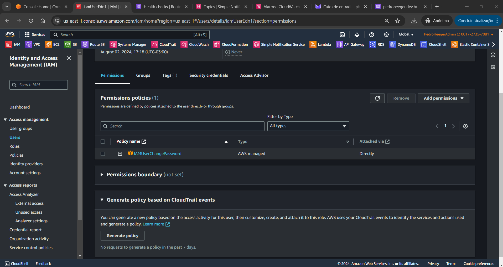<br>
    <figcaption>Imagem 02.</figcaption>
</figure></div><br>

<a name="item1.2"><h4>1.2 Boas-vindas ao AWS re/Start</h4></a>[Back to summary](#item1) | <a href="">Certificate</a>

Nesta aula foi apresentado o objetivo do programa **AWS re/Start** que é a preparação de todos os alunos para o mercado de trabalho em nível básico de TI através do desenvolvimento de conhecimento e competências e da aplicação prática de habilidades técnicas baseadas na nuvem. A abordagem do programa conteve: discussões lideradas por instrutor, atividades de aplicativos, laboratórios práticos, prática de habilidades profissionais e avaliações. Para atender a exigência do programa foi necessário acesso a um computador e a participação e comprometimento com as aulas.

Os tópicos abordados ao longo do programa foram: os princípios básicos de nuvem, que conteplava a introdução aos componentes da nuvem (Terminologia; Computação; Armazenamento; Rede; Segurança; Banco de dados) e a introdução à programação (Conceitos básicos de Python; Conceitos básicos de script do Linux); os principais serviços da AWS, contemplando a  infraestrutura global, os componentes de nuvem mapeados para o serviço da AWS, a operação na AWS, a automação na AWS, o gerenciamento e governança da AWS; e as habilidades profissionais, que abrangia as habilidades de comunicação, a definição de objetivos, o processo do pensamento técnico, o trabalho em equipe e colaboração, a preparação da entrevista e a presença digital. 

<a name="item1.3"><h4>1.3 O que é computação em nuvem?</h4></a>[Back to summary](#item1) | <a href="">Certificate</a>

No terceira aula do módulo 1 foi iniciado o assunto de cloud computing, explicando o seu conceito, apresentando os modelos de computação, os modelos de serviços em nuvem e os modelos de implantação de computação em nuvem. Cloud Computing (Computação em Nuvem) é um modelo de entrega de serviços de computação através da internet, permitindo acesso sob demanda a recursos computacionais, como armazenamento, processamento, redes e aplicativos. Os serviços em nuvem são escaláveis, flexíveis e podem ser provisionados rapidamente, proporcionando benefícios como redução de custos, maior disponibilidade e agilidade no acesso a recursos computacionais. A nuvem é composta por servidores, que são computadores destinados a realizar algum serviço de tecnologia que podem ser usados como componentes para criar uma solução. Estes servidores são armazenados em data centers em diferentes locais pelo mundo. As soluções criadas ajudam aos usuários a atingir suas metas de negócios.

No modelo de computação tradicional, o usuário precisa se preocupar com o gerenciamento do hardware, exigindo tempo e recursos que poderiam ser melhores utilizados no desenvolvimento da arquitetura e do aplicativo. Como o hardware são equipamentos físicos, torna-se necessário o gerenciamento do espaço onde ele será implantado, segurança física desse espaço, planejamento da capacidade necessário desse hardware, resultando em um aumento considerável dos custos. Além disso, a capacidade planejada de hardware em alguns momentos pode não ser atingida, provocando ociosidade desses recursos adquiridos, ou pode ser excedida, ocasionando a falta de recursos, ou ainda se as necessidades mudarem, essa capacidade teria que ser alterada. Portanto, este modelo trabalha com custo fixo de hardware, não sendo possível a variação do custo conforme uso em curto período de tempo.

Já no modelo de computação em nuvem, o custo é variável, pois é possível pensar no hadware como software, já que o usuário não precisa se preocupar com o gerenciamento dele, tornando isso de responsabilidade de um provedor de cloud, como a **AWS**. Dessa forma, o custo é bem menor e é possível ter uma flexibilidade, além de uma série de outros benefícios. A computação em nuvem resolve diversos problemas do modelo de computação tradicional, entre eles, o investimento antecipado em aquisição, provisionamento e manutenção da infraestrutura local para o hardware. Assim é possível implementar uma solução com agilidade e com custos iniciais baixos e também aumentar ou reduzir verticalmente e de forma elástica e automatizada, pagando apenas pelo que for utilizado. 

Os serviços de nuvem são divididos com base no controle e responsabilidade sobre a forma como o serviço é configurado em três categorias principais. A Infraestrutura como Serviço (IaaS) é a que o usuário possui mais controle dos recursos, é necessário o gerenciamento do servidor, podendo ser físico ou virtual, administrando seu sistema operacional, os middlewares, o tempo de execução, além dos dados e da aplicação. O gerenciamento da infraestrutura física ou subjacente, incluindo servidores, armazenamento, rede e a camada de virtualização fica sob responsabilidade da provedora de cloud. Na Plataforma como Serviço (PaaS), o cloud provider gerencia todo o hardware e também os sistemas operacionais subjacentes, enquanto o usuário só se preocupa com a aplicação e os dados. Dessa forma, o PaaS oferece toda estrutura para que o usuário possa desenvolver sua aplicação. Já o Software como Serviço (SaaS), basicamente tudo é gerenciado pelo provedor de cloud, desde a infraestrutura física até a aplicação e os dados. O usuário é responsável apenas pela utilização do software. Esse é o modelo mais fácil, pois o usuário encontra o software pronto para uso, tendo que gerencia apenas os dados dentro do software. 

Além dos modelos de serviços de nuvem, existe também o modelo de implantação de computação em nuvem, que são divididos em três principais e representam os ambientes de nuvem nos quais é possível implantar aplicativos. A nuvem pública é quando os recursos, como armazenamento, servidores e aplicativos, são fornecidos por um provedor de serviços de nuvem e disponibilizados pela internet para uso geral. Isso significa que os recursos são compartilhados entre vários usuários e gerenciados pelo provedor de serviços de nuvem. A nuvem privada, que pode ser local ou hospedada em um provedor, é uma infraestrutura de computação em nuvem sempre dedicada a uma única organização. Os recursos de hardware e software podem ser mantidos internamente pela própria organização ou podem ser fornecidos por terceiros, mas são utilizados exclusivamente pela organização e não compartilhados com outras entidades. Isso proporciona maior controle sobre os recursos e a segurança dos dados, mas também requer investimentos significativos em infraestrutura e gerenciamento.

A nuvem híbrida é uma forma de conectar a infraestrutura e aplicativos entre os recursos existentes na nuvem e fora dela. Este modelo de implantação é usado quando é preciso estender a infraestrutura local de uma organização para a nuvem, conectando os recursos da nuvem a um sistema interno. Enquanto a distinção entre nuvem pública e privada geralmente está associada à disponibilidade para uso geral versus dedicação a uma única organização, a nuvem híbrida foca na localização dos recursos, conectando recursos locais (On-premises), ou seja fora da nuvem, a recursos na nuvem (hospedados em um provedor). Portanto, existe as soluções On-Premises, onde os sistemas de computação e dados são mantidos e gerenciados dentro das instalações físicas de uma organização. Isso inclui servidores físicos, redes, armazenamento de dados e outros recursos que são instalados e mantidos localmente pela própria organização. Nesse modelo, a organização tem total controle sobre seus sistemas e dados, mas também é responsável por todos os custos e tarefas de manutenção.

Resumindo para ficar bem didático, nuvem pública e privada são quando os recursos de TI são fornecidos por uma provedora de cloud através da internet, sendo a primeira para o uso geral e a segunda para uso único de uma organização. Soluções On-Premises é quando esses recursos são totalmente gerenciados localmente pela a empresa, sem utilização de numve. Já a nuvem híbrida é quando parte dos recursos de TI estão dispostos localmente e a outra parte é fornecido pela provedora de cloud. 

- Nuvem (Custo, Escalabilidade, Acessibilidade, Manutenção, Segurança):
    - Não há investimento inicial, só é pago pelo que for utilizado, ou seja, de forma variável.
    - Acesso imediato aos recursos de qualquer lugar. Não é necessário gerenciar o hardware.
    - Redução dos custos contínuos, devido a economia em escala, melhoras contínuas e várias opções de preço.
    - Com a redução dos custos em relação ao hardware, as organizações podem direcionar seus recursos para novos projetos inovadores que expandam seus negócios se concentrando apenas nos aplicativos e não nas operações.
    - Capacidade flexível, ou seja, os recursos são dinâmicos, podendo reduzir ou aumentar quando quiser muito rapidamente. Os custos operacionais são previsíveis.
    - A velocidade e agilidade permite responder as condições de mercado em constante evolução, desenvolvendo e implantando aplicações de forma muito mais ágil.
    - Os recursos são variáveis e infinitos (ilimitados).
    - Sem limitação geográfica, é possível implantar o aplicativo em qualquer região da provedora de cloud ao redor do mundo, com menor latência e por um custo mínimo.
    - A manutenção e atualizações é gerenciadas pelo prevedor de nuvem.
- Soluções On-Premises:
    - Há investimento incial, gerando grandes despesas de capital, ou seja, há um custo fixo.
    - Tem que aguardar a montagem e instalação do hardware para utilização dos recursos.
    - É necessário gerenciar todo o hardware localmente, bem como a infraestrutura local (local físico, segurança, refrigeração e energia).
    - Normalmente é exigido atualizações em ciclo de um, três ou cinco anos.
    - Gasto de tempo com o gerenciamento do hardware, dificultando direcionar mais os recursos para as aplicações.
    - Dificuldade na estimativa das necessidades de capacidade de infraestrutura, ou seja, os recursos são estáticos. Caso seja necessário mais recursos, é preciso toda mobilização novamente.
    - O tempo necessário para adquirir, entregar e executar um servidor se torna caro em uma infraestrutura tradicional.
    - Os recursos são fixos e finitos (limitados).
    - As empresas acabam se concentrando em uma única área geográfica devido as limitações.
    - Tem que realizar a manutenção e atualização, ocasionando custos.

<a name="item1.5"><h4>1.5 Vantagens da computação em nuvem</h4></a>[Back to summary](#item1) | <a href="">Certificate</a>

A computação em nuvem possuí seis grandes vantagens. A primeira delas é **trocar despesas de capital (CapEx) por despesas variáveis**, ou seja, não é necessário investir em infraestrutura de computação para utilizar recursos de computação. Com a nuvem é possível usar recursos de computação fornecidos pela cloud provider e pagar apenas pelo que usar. O Capex são os fundos que uma empresa usa para adquirir, atualizar e manter ativos físicos, como propriedades, edifícios industriais ou equipamentos. Enquanto uma despesa variável é uma despesa que a pessoa que arca com os custos pode alterar ou evitar. 

A segunda vantagem é **beneficiar-se de grandes economias de escala**. A computação em nuvem oferece a vantagem de custos variáveis mais baixos em comparação com o ambiente local. Isso ocorre porque os provedores de nuvem, como a AWS, conseguem consolidar a demanda de centenas de milhares de clientes, permitindo-lhes obter grandes economias de escala com os custos de CapEx. Essas economias são então repassadas aos clientes na forma de preços reduzidos, baseados no modelo de pagamento conforme o uso.

A vantagem três é **parar de adivinhar a capacidade**. Um dos grandes desafios do ambiente on-premises é ter de adivinhar a capacidade de infraestrutura necessária para construção das suas soluções. Mas mesmo assim, em algum momento os recursos, que são caros, ficaram ociosos ou a capacidade será insuficiente, gerando tempo de inatividade. Em ambos os cados, a empresa terá prejuízos. Com a computação em nuvem, é possível acessar a quantidade de recursos necessária e aumentar e reduzir verticalmente, conforme necessário, em apenas alguns minutos.

A quarta vantagem é **aumentar a velocidade e a agilidade**. Na computação em nuvem, como não há a preocupação com o hardware, o tempo necessário para disponibilização dos recursos de computação é mínimo. A agilidade organizacional é um diferencial fundamental no ambiente de negócios em rápida transformação dos dias atuais. Com isso, a organização se beneficia com a agilidade e velocidade na entrega das suas soluções com um custo muito menor.

A vantagem cinco é **parar de gastar dinheiro com a execução e a manutenção de data centers**. A computação em nuvem possibilita as empresas concentrarem em seus negócios, ao invés de se concentrar na infraestrutura. Evitando o gasto com execução e manutenção da infraestrutura e hardware, pois o provedor de cloud que vai prestar o fornecimento desses recursos.

A última vantagem das seis é **Globalização em minutos**. É possível implantar aplicativos em várias Regiões da **AWS** ao redor do mundo com apenas alguns cliques. Como resultado, é possível oferecer latência mais baixa e uma experiência melhor aos clientes com simplicidade e custo mínimo.

<a name="item1.7"><h4>1.7 O que é a AWS?</h4></a>[Back to summary](#item1) | <a href="">Certificate</a>

A AWS oferece em sua nuvem, os três seguintes modelos de serviços de nuvem: infraestrutura como serviço, plataforma como serviço e software como serviço. Na infraestrutura como serviço (IaaS), o usuário gerencia a infraestrutura remotamente, desde servidores, sistema operacional até a aplicação e os dados. Contudo a infraestrutura subjacente, que inclui os servidores, é mantida pela e operada **AWS**, o usuário só configura como ela será utilizada para sua aplicação. Os servidores, mesmo sendo acessados remotamente, podem ser físicos ou virtuais. O servidor físico é quando o usuário tem total controle sobre a maquina fornecida pela **AWS**. Já o servidor virtual, a **AWS** cria uma instância virtual usando tecnologia de virtualização. Dessa forma, o usuário tem uma maquina virtual que funciona de forma independente, mas compartilha recursos do hardware físico com outras instâncias virtuais.

Na plataforma como serviço (PaaS), o provedor de cloud gerencia a infraestrutura subjacente, os servidores e sistema operacional, possibilitando a execução de aplicativos pelos usuário. O PaaS também oferece uma estrutura para desenvolvedores que pode ser usada na construção de aplicativos personalizados. Com o software como serviço (SaaS), o usuário gerencia seus arquivos e o provedor de serviços gerencia todos os data centers, servidores, redes, armazenamento, manutenção e aplicação de patches. Ou seja, o provedor do serviço gerencia tudo e entrega a aplicação pronta para o usuário que apenas precisa saber como usá-la. Este é o modelo mais fácil de compreender, pois é o mais utilizado pela maioria das pessoas.

Para entender computação em nuvem é importante compreender o que são serviços web. Esses são softwares acessíveis via Internet ou redes privadas (intranets) que usam formatos padronizados, como XML ou JSON, para solicitações e respostas de APIs. Eles são independentes de sistemas operacionais e linguagens de programação. Um serviço web é descrito por um arquivo de definição de interface e pode ser detectado automaticamente.

A **AWS** é um provedor de serviços de nuvem seguro que oferece uma ampla gama de serviços para ajudar as empresas a expandirem e crescerem. Esses serviços são disponibilizados via Internet, permitindo acesso sob demanda a recursos de computação, armazenamento, rede, banco de dados e outros recursos de TI essenciais para seus projetos. Além disso, a AWS fornece ferramentas para gerenciar esses recursos. Os serviços da **AWS** se enquadram em diferentes categorias, e cada categoria contém um ou mais serviços. É possível selecionar os serviços que deseja nessas diferentes categorias para criar suas soluções.

Existem três formas de interagir com os recursos e serviços da **AWS**. A primeira delas é pelo **AWS Console Management** que é uma interface gráfica avançada para a maioria dos recursos que a **AWS** oferece e que pode ser acessada por um navegador de internet ou por um aplicativo de celular a qualquer momento, em qualquer lugar. Uma outra forma é através da interface de linha de comando (CLI) da **AWS**. A **AWS Command Line Interface (AWS CLI)** oferece um conjunto de utilitários que podem ser iniciados a partir de um script de comandos no **Linux**, **macOS** ou **Microsoft Windows**. A terceira maneira de interação é com os SDKs ou kits de desenvolvimento de software. A **AWS** oferece pacotes que permitem acessar a cloud em várias linguagens de programação populares. Esses pacotes facilitam o uso da **AWS** em aplicativos existentes. Eles também permitem criar aplicativos que implantam e monitoram sistemas complexos inteiramente por meio de código.

O processo de adoção da nuvem em cada empresa é única. Contudo, para obter êxito na migração dos recursos de TI de uma organização para a nuvem, três elementos (pessoas, processos e tecnologia) devem estar alinhados. O **AWS Cloud Adoption Framework (AWS CAF)** auxilia as organizações a criar planos eficientes e eficazes para a adoção da nuvem. As orientações e práticas recomendadas desta estrutura ajudam a desenvolver uma abordagem abrangente para gerenciar a computação em nuvem em toda a organização e ao longo do ciclo de vida da TI. Essas diretrizes permitem que cada unidade da organização atualize suas habilidades, ajuste processos existentes e introduza novos processos, maximizando assim os benefícios dos serviços de computação em nuvem. O **AWS CAF** facilita o planejamento da migração para a nuvem ao dividir o processo complexo em partes gerenciáveis chamadas de perspectivas. Essas perspectivas cobrem áreas cruciais focadas em pessoas, processos e tecnologia. De maneira geral, as perspectivas de negócios, pessoas e governança se concentram nas capacidades do negócio, enquanto as perspectivas de plataforma, segurança e operações focam nos recursos técnicos.

A AWS disponibiliza uma extensa e detalhada documentação para cada um de seus serviços. Os manuais e as referências de API são organizados por categoria de serviço. Além disso, oferece recursos gerais e tutoriais acessíveis nas páginas de Documentação da AWS. Esses recursos incluem estudos de caso, glossário completo de termos da AWS, documentos técnicos, perguntas frequentes, informações sobre o **AWS Training and Certification**, entre outros. Cada SDK e toolkit também possui sua própria documentação, como a **AWS CLI**, o **AWS SDK for Python** (**Boto**) e muitos outros. A documentação técnica pode ser filtrada por produto, categoria ou setor, permitindo encontrar as informações mais relevantes para suas necessidades específicas.

<a name="item1.9"><h4>1.9 Definição de preços da AWS</h4></a>[Back to summary](#item1) | <a href="">Certificate</a>

No modelo de definição de preços da **AWS** existem os três seguintes fatores fundamentais de custo: computação, armazenamento e transferência de dados de saída. Essas características variam um pouco, dependendo do produto da **AWS** e do modelo de preço escolhidos. Na maioria dos casos, não há cobrança pela transferência de dados de entrada ou pela transferência de dados entre outros serviços da **AWS** na mesma Região da **AWS**, resguardada algumas exceções, portanto, é importante verificar as taxas de transferência de dados antes de começar a usar o serviço da **AWS**. A transferência de dados de saída é agregada entre serviços e, em seguida, cobrada de acordo com a taxa de transferência de dados de saída. Essa cobrança é exibida no relatório mensal como Transferência de dados para fora da **AWS**.

Embora o número e a variedade de serviços oferecidos pela **AWS** tenham aumentado drasticamente ao longo do tempo, a filosofia de preço de pagamento flexível permanece a mesma. Ao final de cada mês, o usuário paga pelo que for utilizado, sendo possível iniciar ou parar de usar um produto a qualquer momento. Este modelo é o principal que é o *Pagamento conforme uso*, no qual não são necessários contratos de longo prazo. Existem outras três formas de pagamento que são elas: Pague menos ao fazer reserva; Pague menos ao usar mais; Pague menos à medida que a **AWS** cresce. Além disso, em projetos de alto volume com requisitos exclusivos também é possível aderir a um modelo de preço personalizado, caso nenhum dos modelos de preço da **AWS** seja adequado para o projeto.

No pagamento conforme uso, como próprio nome já diz, o usuário só paga pelo que for consumido, não há grandes despesas inicias ou despesas com infraestrutura física e hardware, já que a **AWS** provisiona tudo isso para o usuário. Dessa forma, as empresas podem se concentrar no que realmente importa para o seu negócio. Todos os serviços da **AWS** estão disponíveis sob demanda, sem a exigência de contratos de longo prazo nem dependências de licenciamento complexo.

Para serviços específicos, como o **Amazon Elastic Compute Cloud (Amazon EC2)** e o **Amazon Relational Database Service (Amazon RDS)**, é possível investir em capacidade reservada. Com instâncias reservadas, é possível economizar significantemente em relação à capacidade sob demanda equivalente. As instâncias reservadas estão disponíveis em três opções: Instância reservada com pagamento total antecipado (ou AURI); Instância reservada com pagamento antecipado parcial (ou PURI); Instância reservada sem pagamento antecipado (ou NURI). Ao comprar instâncias reservadas, o usuário recebe um desconto maior quando faz um pagamento antecipado maior. Para maximizar suas economias, é possível fazer o pagamento total antecipado e receber o maior desconto. As instâncias reservadas com pagamento antecipado parcial têm descontos menores, mas oferecem a opção de gastar menos inicialmente. Por fim, é possível optar por não gastar nada inicialmente e receber um desconto ainda menor, o que permite reservar capital para gastar em outros projetos. Ao usar a capacidade reservada, a empresa pode minimizar riscos, gerenciar orçamentos de modo mais previsível e cumprir políticas que exigem compromissos de longo prazo.

Com a AWS, é possível obter descontos com base em volume e obter economias substanciais à medida que a utilização aumenta. Para serviços como o **Amazon Simple Storage Service (Amazon S3)**, o modelo de preço é em camadas, o que significa que o usuário paga menos por GB quando utiliza mais. Além disso, não há cobranças pela transferência de entrada de dados. Diversos serviços de armazenamento oferecem custos de armazenamento mais baixos com base nas suas necessidades. Por isso, conforme as necessidades de uso da **AWS** aumentam, o usuário se beneficia das economias de escala, permitindo o aumento do nível de adoção e mantendo os custos sob controle. A medida que as organizações evoluem, a **AWS** também oferece opções de compra de serviços que ajudam a contemplar as necessidades empresariais. Por exemplo, o portfólio de serviços de armazenamento da **AWS** oferece opções para ajudar a diminuir o modelo de preço com base na frequência em que os dados são acessados e o desempenho exigido para recuperá-los. Para otimizar as economias, deve ser escolhida as combinações de soluções de armazenamento certas para ajudar a reduzir custos e, ao mesmo tempo, manter desempenho, segurança e durabilidade.

A **AWS** está constantemente empenhada em reduzir os custos operacionais dos data centers, melhorar a eficiência energética e diminuir os gastos gerais de seus serviços. Essas otimizações, aliadas às economias de escala cada vez maiores, permitem que a **AWS** repasse essas economias para os usuários por meio de preços mais baixos. Desde 2006, a **AWS** reduziu os preços mais de 70 vezes. Além disso, o crescimento da **AWS** significa que os recursos futuros, mais avançados e com melhor desempenho, substituem os atuais sem custo adicional. 

Para ajudar novos clientes da **AWS** a começar a usar a nuvem, a **AWS** oferece um nível gratuito (o Nível gratuito da AWS ou **AWS Free Tier**) para novos clientes por até um ano. O Nível gratuito é aplicável a serviços e opções específicos. Caso seja um novo cliente da **AWS**, poderá executar uma microinstância T2 gratuita do **Amazon Elastic Compute Cloud (Amazon EC2)** por um ano, além de usar um nível gratuito para **Amazon S3**, **Amazon Elastic Block Store (Amazon EBS)**, **Elastic Load Balancing**, transferência de dados da **AWS** e outros serviços da **AWS**.

A **AWS** também oferece vários serviços e recursos sem custo adicional, alguns deles incluem: A **Amazon Virtual Private Cloud (Amazon VPC)** permite provisionar uma seção da nuvem **AWS** isolada logicamente onde é possível executar recursos da **AWS** em uma rede virtual que o usuário define; O **AWS Identity and Access Management (IAM)** controla o acesso dos usuários aos recursos e serviços da **AWS**; O AWS Elastic Beanstalk é uma maneira de implantar e gerenciar rapidamente aplicativos na nuvem **AWS**; O **AWS CloudFormation** oferece aos desenvolvedores e administradores de sistemas uma maneira de criar um grupo de recursos da **AWS** relacionados e provisioná-los de uma forma organizada e previsível; O *Automatic Scaling* (Dimensionamento automático) adiciona ou remove recursos automaticamente de acordo com as condições que o usuário definir. Os recursos utilizados aumentam adequadamente durante picos de demanda para manter o desempenho e diminuem automaticamente durante quedas de demanda para minimizar os custos; **AWS OpsWorks** é um serviço de gerenciamento de aplicativos que facilita a implantação e operação de aplicativos de todos os tipos e tamanhos. Um outro recurso é a *cobrança consolidada* que é um recurso de faturamento no serviço **AWS Organizations** para consolidar o pagamento de várias contas da **AWS**. A cobrança consolidada oferece: Uma única fatura para várias contas; A capacidade de controlar facilmente as cobranças de cada conta; A oportunidade de diminuir as cobranças devido a descontos de preço por volume em uso combinado; Além disso, é possível consolidar todas as contas usando a cobrança consolidada e obter benefícios em camadas. Embora não haja cobrança por esses serviços, pode haver cobranças associadas a outros serviços da **AWS** usados com esses serviços.

A calculadora de preço da **AWS** é uma ferramenta de estimativa de custos da **AWS** que oferece uma maneira conveniente de calcular a fatura mensal. Com ela, o usuário pode adicionar, editar e remover serviços conforme necessário, com a ferramenta recalculando automaticamente as cobranças mensais estimadas. A calculadora abrange uma ampla gama de cálculos de preço para todos os serviços e regiões da **AWS**, fornecendo um detalhamento dos recursos disponíveis em cada serviço e região. Além de estimar os custos mensais, a calculadora ajuda a identificar oportunidades de economia e permite usar modelos para comparar diferentes soluções e serviços de implantação. Ela também oferece exemplos e casos de uso comuns, como recuperação de desastres e backup (Disaster Recovery and Backup) ou aplicativos web (Web Application), para ajudar a entender melhor como os serviços podem ser utilizados.

Com relação aos custos entre os dois modelos de implantação por localização (local e nuvem), a infraestrutura on-premises (local) tende a ser bastante despendiosa devido a vários fatores como: os custos fixos (despesas de capital) associados à infraestrutura tradicional, incluindo instalações, hardware, licenças e equipe de manutenção; o aumento vertical é muito caro e lento; a redução vertical não reduz os custos fixos. Já em uma infraestrutura em nuvem (cloud), o provedor de nuvem é quem constrói a infraestrutura e mantém as despesas de capital, os clientes pagam apenas o que for utilizado. Aumentar ou reduzir verticalmente é bastante simples e os custos são fáceis de estimar, pois dependem da utilização do serviço. 

Para tomar a melhor decisão de qual modelo usar, pode ser utilizado o *custo total de propriedade (TCO)* para comparar soluções de nuvem e no local e identificar a melhor opção. O TCO é uma estimativa financeira destinada a ajudar os compradores e os proprietários a determinar os custos diretos e indiretos de um produto ou de um sistema. Ele inclui o custo de um serviço e as despesas correspondentes. Ao comparar uma solução no local e de nuvem, é importante avaliar com precisão os custos reais das duas opções. Com a nuvem, a maioria dos custos é inicial e pode ser facilmente calculada, não havendo custos diretos, apenas indiretos. Com a tecnologia no local, os custos internos da execução de um servidor incluem: Custos diretos, como energia, espaço físico, armazenamento e operações de TI para gerenciar esses recursos; Custos indiretos, como infraestrutura de rede e armazenamento.

<a name="item1.11"><h4>1.11 Visão geral da infraestrutura da AWS</h4></a>[Back to summary](#item1) | <a href="">Certificate</a>

A infraestrutura global da **AWS** foi projetada e construída para oferecer um ambiente de computação em nuvem flexível, confiável, dimensionável e seguro com desempenho de rede global de alta qualidade. Esta infraestrutura é dividida em três elementos: *Regiões*, *Zonas de Disponibilidade* e *Pontos de presença*. 

Os data centers, que são construídos em clusters em várias Regiões globais, são a base da infraestrutura da **AWS**. Um data center é um local onde os dados físicos reais residem e o processamento de dados ocorre. Os data centers são projetados com segurança e levam em conta vários aspectos: cada local é selecionado cuidadosamente para minimizar riscos ambientais; os data centers possuem um design redundante que prevê e tolera falhas, mantendo sempre os níveis de serviço; a disponibilidade é garantida por meio de backups de componentes essenciais em locais isolados, conhecidos como Zonas de Disponibilidade; a **AWS** monitora constantemente o uso dos serviços para garantir que a infraestrutura atenda aos compromissos e requisitos de disponibilidade; os locais dos data centers são mantidos em sigilo e o acesso é rigorosamente controlado; em caso de falha, processos automatizados redirecionam o tráfego de dados dos clientes para fora da área afetada. Um único data center normalmente abriga de 50.000 a 80.000 servidores físicos. Todos os data centers ficam online e atendem aos clientes, nenhum data center fica inativo. A **AWS** usa equipamentos de rede personalizados originários de vários ODMs, que são fabricantes de design original que projetam e fabricam produtos com base em especificações de uma segunda empresa. Em seguida, a segunda empresa redefine a marca dos produtos para venda.

As *Zonas de Disponibilidade (AZs)* consistem em um ou mais data centers independentes, projetados para isolamento de falhas. Cada AZ é projetada como uma Zona de Disponibilidade de falha independente e possui recursos redundantes de energia, rede e conectividade, todos hospedados em instalações separadas. Essas zonas são conectadas entre si através de redes privadas de alta velocidade. Algumas AZs podem ter até seis data centers, mas nenhum data center faz parte de mais de uma AZ. As AZs são fisicamente separadas dentro de uma mesma região metropolitana, situadas em áreas de baixo risco de inundação, com classificações específicas de zona de inundação variando conforme a região. Além de fontes de alimentação distintas e sistemas de backup no local, elas frequentemente são alimentadas por diferentes redes elétricas de concessionárias independentes, minimizando ainda mais os pontos únicos de falha. Todas as AZs possuem conexões redundantes a múltiplos provedores de trânsito de nível 1 e são interconectadas dentro de uma região por links de baixa latência.

A infraestrutura da nuvem **AWS** é construída ao redor de Regiões e em Zonas de Disponibilidade. Uma *Região* é uma localização geográfica física no mundo na qual a **AWS** tem várias Zonas de Disponibilidade. As Regiões são isoladas umas das outras para obter tolerância a falhas e estabilidade. Os recursos em uma Região não são replicados automaticamente para outras Regiões. Cada Região contém duas ou mais Zonas de Disponibilidade. Em agosto de 2020, a AWS tinha 24 Regiões e 77 Zonas de Disponibilidade ao redor do mundo. Quando os dados são armazenados em uma Região específica, eles não são replicados fora dessa Região. A **AWS** nunca transfere seus dados para fora da Região em que o usuário os coloca, sendo de responsabilidade do usuário replicar os dados entre Regiões, se o negócio exigir. A **AWS** fornece informações sobre o país e, quando aplicável, sobre o estado em que cada Região reside e o usuário é responsável por selecionar a Região para armazenar os dados de acordo com seus requisitos de conformidade e de latência de rede. Optar pela região mais próxima da sede da empresa ou do local onde a aplicação será operada reduzirá a latência e aumentará a agilidade da organização em minutos, com um custo mínimo. Algumas Regiões têm acesso restrito, como é o caso da Região isolada AWS GovCloud (EUA). Esta foi projetada para que agências e clientes do governo dos EUA possam migrar cargas de trabalho confidenciais para a nuvem abordando seus requisitos específicos de conformidade e regulamentares. A **AWS** expande constantemente sua infraestrutura global adicionando mais Regiões. Ao expandir a infraestrutura, a **AWS** ajuda os clientes a obter menor latência e taxa de transferência mais alta, bem como a garantir que os dados residam apenas nos locais desejados.

Ao escolher a Região ou as Regiões ideais para armazenar dados e usar os serviços da **AWS** deve ser levado em conta alguns fatores. Uma consideração essencial é a governança de dados e os requisitos legais, pois as leis locais podem exigir que determinadas informações sejam mantidas em limites geográficos, restringindo assim a oferta de conteúdo ou serviços em algumas Regiões. Se todos os demais fatores permanecerem inalterados, é recomendável executar os aplicativos e armazenar os dados em uma Região que esteja mais próxima possível do usuário e dos sistemas que os acessarão. Lembrendo de que nem todos os serviços estão disponíveis em todas as Regiões. Os custos da execução de alguns serviços pode variar conforme a Região escolhida.

Um *ponto de presença ou Point of Presence (PoP)* é o local em que os usuários finais acessam os serviços da **AWS** por meio do serviço **Amazon CloudFront** ou **Amazon Route 53**, onde esses serviços atendem as solicitações dos pontos de presença. Em agosto de 2020, a infraestrutura global da **AWS** tinha 216 pontos de presença, compostos por 205 locais de borda e 11 caches de borda regional localizados na maioria das principais cidades do mundo. O **Amazon CloudFront** é uma rede de entrega de conteúdo (ou CDN) usada para distribuir conteúdo aos usuários finais para reduzir a latência. O **Amazon Route 53** éum serviço de sistemas de nome de domínio (Domain Name System, DNS). As solicitações enviadas a qualquer um desses serviços serão roteadas automaticamente para o local de borda mais próximo.

Os *locais de bordaou Edge Locations* são os locais físicos onde o conteúdo é armazenado em cache para distribuição ao usuário final. Os *caches de borda ou Regional Edge Caches* são caches intermediários localizados entre os Edge Locations e as regiões **AWS**. Eles ajudam a melhorar a performance e a reduzir a latência ao armazenar conteúdos em cache que são acessados com menos frequência do que aqueles armazenados nas Edge Locations, mas ainda assim precisam ser entregues com baixa latência.

<a name="item1.13"><h4>1.13 Serviços e categorias da AWS</h4></a>[Back to summary](#item1) | <a href="">Certificate</a>

A infraestrutura global da **AWS** suporta uma vasta gama de serviços fornecidos sob demanda. Muitos desses serviços podem ser acessados em segundos e seguem um modelo de pagamento baseado no uso. Esses serviços são sub-divididos na **AWS** nas seguintes categorias: Computação; Armazenamento; Banco de Dados; Migração e Transferência; Rede e Entrega de Conteúdo; Ferramentas de Desenvolvimento; Gerenciamento e Governança; Segurança, Identidade e Conformidade; Análise; Aprendizado de Máquina; Internet das Coisas (IoT); Web de front-end e móvel; Realidade Aumentada e Realidade Virtual (AR & VR); Tecnologia para Jogos; Aplicativos Corporativos; Aplicativos de Negócios; Computação de Usuário Final; Serviços de Mídia; Comunicação e Contato com o Cliente; Robótica; Satélites; Desenvolvimento Sem Servidor; Gerenciamento de custos; Blockchain; Contêineres. No núcleo desses serviços, as categorias de Computação, Rede e Armazenamento são essenciais. 

Na categoria de armazenamento, destacam os serviços:
- O **Amazon Simple Storage Service (Amazon S3)** é uma solução de armazenamento de objetos que proporciona escalabilidade, alta disponibilidade de dados, segurança e desempenho superior. Ideal para armazenar e proteger qualquer volume de dados, seja para sites, aplicativos móveis, backup e restauração, arquivamento, aplicativos empresariais, dispositivos da Internet das Coisas (IoT) e análises de big data.
- O **Amazon Elastic Block Store (Amazon EBS)** é um serviço de armazenamento de alto desempenho desenvolvido para ser utilizado com o **Amazon EC2**, ideal para cargas de trabalho que demandam intensamente transações e altas taxas de transferência. Empregado em várias cargas de trabalho, incluindo bancos de dados relacionais e não relacionais, aplicativos empresariais, aplicativos em contêineres, mecanismos de análise de big data, sistemas de arquivos e fluxos de trabalho de mídia.
- O **Amazon Elastic File System (Amazon EFS)** fornece um sistema de arquivos NFS totalmente gerenciado, escalável e elástico, para uso com serviços na nuvem **AWS** e recursos locais. Projetado para escalar sob demanda até petabytes, ajusta-se automaticamente conforme os arquivos são adicionados ou removidos. Isso elimina a necessidade de provisionar e gerenciar a capacidade para acomodar o crescimento.
- O **Amazon Simple Storage Service Glacier (Amazon S3 Glacier)** é uma classe de armazenamento em nuvem do **Amazon S3**, que oferece segurança, durabilidade e baixo custo para arquivamento e backup de longo prazo. Projetado para proporcionar uma durabilidade de mais de 11 noves (99,99999999999%) e fornecer recursos extensivos de segurança e conformidade, atende às exigências regulatórias mais rigorosas.

Na categoria de computação, destacam os serviços:
- O **Amazon Elastic Compute Cloud (Amazon EC2)** fornece capacidade de computação escalável por meio de máquinas virtuais na nuvem.
- O **Amazon EC2 Auto Scaling** ajusta automaticamente o número de instâncias EC2 com base nas condições predefinidas.
- O **AWS Elastic Beanstalk** é um serviço que facilita a implantação e o dimensionamento de aplicativos e serviços web em servidores conhecidos, como **Apache HTTP Server** e **Microsoft Internet Information Services (IIS)**.
- O **AWS Lambda** permite a execução de código sem necessidade de provisionar ou gerenciar servidores. O pagamento é feito somente pelo tempo de computação utilizado, o que significa que não há cobrança quando o código não está em execução.

Na categoria de contêineres, destacam os serviços:
- O **Amazon Elastic Container Service (Amazon ECS)** é um serviço de orquestração de contêineres altamente escalável e de alto desempenho, compatível com contêineres **Docker**.
- O **Amazon Elastic Container Registry (Amazon ECR)** é um registro de contêineres **Docker** totalmente gerenciado que simplifica o armazenamento, gerenciamento e implantação de imagens de contêineres **Docker** para desenvolvedores.
- O **Amazon Elastic Kubernetes Service (Amazon EKS)** simplifica a implantação, o gerenciamento e o dimensionamento de aplicativos em contêineres que utilizam **Kubernetes** na **AWS**.
- O **AWS Fargate** é um mecanismo de computação para o **Amazon ECS** que possibilita a execução de contêineres sem a necessidade de gerenciar servidores ou clusters.

Na categoria de banco de dados, destacam os serviços:
- O **Amazon Relational Database Service (Amazon RDS)** simplifica a criação, operação e escalabilidade de bancos de dados relacionais na nuvem. Proporciona capacidade ajustável e automatiza tarefas administrativas complexas, como provisionamento de hardware, configuração de banco de dados, aplicação de patches e backups.
- O **Amazon Aurora** é um banco de dados relacional compatível com **MySQL** e **PostgreSQL**. Ele oferece desempenho até cinco vezes superior ao de bancos de dados **MySQL** padrão e até três vezes superior ao de bancos de dados **PostgreSQL** padrão.
- O **Amazon Redshift** permite a execução de consultas analíticas sobre petabytes de dados armazenados no **Amazon Redshift** e também permite consultas diretamente sobre exabytes de dados no **Amazon S3**. Proporciona desempenho rápido em qualquer escala.
- O **Amazon DynamoDB** é um banco de dados de documentos e chave-valor que oferece desempenho com latência de um dígito em milissegundos em qualquer escala. Inclui recursos integrados de segurança, backup e restauração, além de cache na memória.

Na categoria de redes e entrega de conteúdo, destacam os serviços:
- O **Amazon Virtual Private Cloud (Amazon VPC)** permite criar seções logicamente isoladas dentro da **AWS** Cloud.
- O **Amazon Elastic Load Balancing (Amazon ELB)** distribui automaticamente o tráfego de entrada das aplicações entre vários destinos, como instâncias EC2 da Amazon, contêineres, endereços IP e funções Lambda.
- O **Amazon CloudFront** é um serviço de rede de entrega de conteúdo (CDN) rápido que distribui dados, vídeos, aplicativos e APIs com segurança para clientes em todo o mundo, oferecendo baixa latência e alta velocidade de transferência.
- O **AWS Transit Gateway** é um serviço que possibilita a conexão de nuvens virtuais privadas (VPCs) e redes locais a um único gateway.
- O **Amazon Route 53** é um serviço de DNS em nuvem e escalável, projetado para fornecer uma forma confiável de direcionar os usuários finais para aplicativos na Internet. Ele traduz nomes de domínio (como www.example.com) em endereços IP numéricos (como 192.0.2.1) que os computadores utilizam para se conectar.
- O **AWS Direct Connect** proporciona uma conexão de rede privada dedicada entre um data center ou escritório e a **AWS**, o que pode reduzir os custos de rede e aumentar a largura de banda.
- O **AWS VPN** proporciona um túnel privado e seguro que conecta sua rede ou dispositivo à rede global da **AWS**.

Na categoria de segurança, identidade e conformidade, destacam os serviços:
- O **AWS Identity and Access Management (AWS IAM)** permite gerenciar com segurança o acesso aos serviços e recursos da **AWS**. Com o IAM, é possível criar e gerenciar usuários e grupos, e usar permissões para conceder ou restringir o acesso aos recursos da **AWS**.
- O **AWS Organizations** permite controlar quais serviços e ações são permitidos nas contas.
- O **Amazon Cognito** permite adicionar controle de acesso, registro e autenticação de usuários em aplicativos web e móveis.
- O **AWS Artifact** fornece acesso sob demanda a relatórios de segurança e conformidade da **AWS**, além de acordos selecionados online.
- O **AWS Key Management Service (AWS KMS)** possibilita a criação e o gerenciamento de chaves. Ele pode ser utilizado para controlar o uso de criptografia em diversos serviços da **AWS** e em aplicativos.
- O **AWS Shield** é um serviço gerenciado que oferece proteção contra ataques de negação de serviço distribuída (DDoS), protegendo os aplicativos executados na **AWS**.

Na categoria de gerenciamento de custos da **AWS**, destacam os serviços:
- O **AWS Cost and Usage Report** contém o conjunto mais abrangente de dados de custo e uso do **AWS** disponível, incluindo metadados adicionais sobre serviços, modelo de preço e reservas da **AWS**.
- O **AWS Budgets** permite definir orçamentos personalizados e envia alertas quando os custos ou o uso excedem, ou estão previstos para exceder, o valor orçado.
- O **AWS Cost Explorer** oferece uma interface intuitiva que permite visualizar, entender e gerenciar seus custos e uso da **AWS** ao longo do tempo.

Na categoria de gerenciamento e governança, destacam os serviços:
- O **AWS Management Console** fornece uma interface web para acessar e gerenciar a conta da **AWS**.
- O **AWS Config** é um serviço que auxilia no rastreamento do inventário de recursos e das alterações realizadas.
- O **Amazon CloudWatch** permite o monitoramento de recursos e aplicativos.
- O **AWS Auto Scaling** fornece ferramentas para ajustar o tamanho de vários recursos de acordo com a demanda.
- O **AWS Command Line Interface (CLI)** oferece uma ferramenta unificada para gerenciar os serviços da **AWS**.
- O **AWS Trusted Advisor** auxilia na otimização do desempenho e da segurança.
- O **AWS Well-Architected Framework** ajuda na análise e aprimoramento de cargas de trabalho.
- O **AWS CloudTrail** monitora a atividade do usuário e o uso de APIs.

<a name="item1.15"><h4>1.15 Modelo de responsabilidade compartilhada da AWS</h4></a>[Back to summary](#item1) | <a href="">Certificate</a>

A segurança é a principal prioridade na **AWS**. A **AWS** disponibiliza um ambiente de computação em nuvem escalável, desenhado para garantir alta disponibilidade e confiabilidade, além de fornecer ferramentas que permitem a execução de uma ampla gama de aplicativos. Proteger a confidencialidade, integridade e disponibilidade dos sistemas e dados é fundamental para a **AWS**, assim como preservar a confiança e segurança dos clientes. A **AWS** oferece uma abordagem de segurança semelhante à que as empresas utilizam há décadas, permitindo que os clientes se beneficiem da flexibilidade e do baixo custo da computação em nuvem. Não há inconsistência no fornecimento de infraestrutura sob demanda, e a **AWS** proporciona o isolamento de segurança esperado em ambientes privados tradicionais. Quando os clientes começam a utilizar a **AWS**, a Amazon assume uma parte da responsabilidade pela proteção dos dados na nuvem **AWS**, estabelecendo um modelo de responsabilidade compartilhada para a segurança. Este conceito é conhecido como modelo de responsabilidade compartilhada.

A **AWS** é responsável pela segurança da nuvem. Conforme o modelo de responsabilidade compartilhada, a **AWS** opera, gerencia e controla os componentes do sistema operacional host, a camada de virtualização e a segurança física das instalações onde os serviços são executados. Isso implica que a **AWS** é responsável por proteger a infraestrutura global que sustenta todos os serviços oferecidos na nuvem **AWS**, abrangendo Regiões, Zonas de Disponibilidade e locais de borda. A **AWS** cuida da segurança da infraestrutura física que hospeda seus recursos, incluindo:
- Segurança física dos data centers, com acesso controlado e baseado em necessidades; localizados em instalações não identificadas, guardas de segurança 24/7; autenticação de dois fatores; análise e registro em log de acesso; vigilância por vídeo; e desmagnetização e destruição de discos.
- Infraestrutura de hardware, como servidores, serviços de armazenamento e outros recursos essenciais para os serviços da **AWS**.
- Infraestrutura de software, que abriga sistemas operacionais, aplicativos de serviços e software de virtualização.
- Infraestrutura de rede, incluindo roteadores, balanceadores de carga, firewalls e cabeamento. Isso envolve monitoramento quase contínuo da rede em limites externos, pontos de acesso seguros e infraestrutura redundante com detecção de intrusão.
- Infraestrutura de virtualização, assegurando o isolamento de instâncias.

A segurança dessa infraestrutura é a prioridade máxima da **AWS**. Embora não seja possível visitar pessoalmente os data centers ou escritórios da **AWS** para verificar essa segurança, a Amazon disponibiliza vários relatórios de auditores independentes. Esses relatórios confirmam a conformidade da **AWS** com diversas normas e regulamentos de segurança da informação.

Embora a **AWS** proteja e mantenha a infraestrutura de nuvem, a segurança de tudo o que é colocado na nuvem é de responsabilidade dos clientes. Eles são responsáveis pela implementação e segurança dos aplicativos que utilizam na **AWS**. As medidas de segurança que os clientes devem adotar variam conforme os serviços utilizados e a complexidade do sistema. Essas medidas incluem: escolher o sistema operacional da instância, proteger o aplicativo, configurar os security groups e firewalls, e gerenciar a configuração da rede e as contas de usuários.

Quando os clientes utilizam os serviços da **AWS**, os clientes mantêm controle total sobre seu conteúdo. Eles são responsáveis por gerenciar os requisitos essenciais de segurança do conteúdo, incluindo:
- Qual conteúdo escolhem para armazenar na **AWS**;
- Quais serviços da **AWS** são utilizados com o conteúdo;
- Em qual país esse conteúdo é armazenado;
- O formato e a estrutura do conteúdo e se ele é mascarado, anonimizado ou criptografado;
- Quem tem acesso ao conteúdo e como esses direitos de acesso são concedidos, gerenciados e revogados.

Os clientes mantêm o controle sobre a segurança que escolhem implementar para proteger seus próprios dados, ambiente, aplicativos, configurações do **AWS Identity and Access Management (AWS IAM)** e sistemas operacionais. Assim, o modelo de responsabilidade compartilhada varia de acordo com os serviços da AWS utilizados pelo cliente.

Infraestrutura como serviço (IaaS) refere-se a serviços que fornecem os componentes fundamentais para a TI em nuvem. Esses componentes geralmente incluem a configuração de rede, os computadores (virtuais ou em hardware dedicado) e o armazenamento de dados. Os serviços de nuvem classificados como IaaS oferecem ao cliente o mais alto nível de flexibilidade e controle de gerenciamento sobre os recursos de TI. Os serviços de IaaS são semelhantes aos recursos de computação locais com os quais muitos departamentos de TI já estão familiarizados. Serviços da **AWS**, como o **Amazon EC2**, são exemplos de IaaS. Assim, o cliente é responsável por todas as tarefas de configuração e gerenciamento de segurança. Os clientes que implantam instâncias do EC2 devem gerenciar o sistema operacional convidado (incluindo atualizações e patches de segurança), todo o software de aplicativos instalado nas instâncias e a configuração dos security groups fornecidos pela **AWS**.

Plataforma como serviço (PaaS) refere-se a serviços que reduzem a necessidade de o cliente gerenciar a infraestrutura subjacente, como hardware, sistema operacional e outros recursos. Os serviços de PaaS permitem que o cliente se concentre na implantação e no gerenciamento de aplicativos, sem se preocupar com a aquisição de recursos, planejamento de capacidade, manutenção de software ou aplicação de patches. Exemplos de serviços da **AWS** que se encaixam nessa categoria incluem o **AWS Lambda** e o **Amazon RDS**, pois a **AWS** gerencia a camada de infraestrutura, o sistema operacional e as plataformas. Os clientes precisam apenas acessar os endpoints para armazenar e recuperar dados. Com os serviços PaaS, os clientes são responsáveis por gerenciar seus dados, classificar ativos e aplicar as permissões apropriadas. Esses serviços funcionam como serviços gerenciados, com a **AWS** assumindo uma maior parte dos requisitos de segurança. No caso desses serviços, a **AWS** cuida das tarefas básicas de segurança, como aplicação de patches em sistemas operacionais e bancos de dados, configuração de firewalls e recuperação de desastres (DR).

Software como serviço (SaaS) refere-se a serviços que disponibilizam software centralizado, geralmente acessível por meio de um navegador da web, aplicativo móvel ou API. As ofertas de SaaS costumam ser licenciadas por assinatura ou com base no uso. Nesse modelo, os clientes não precisam se preocupar com a gestão da infraestrutura que suporta o serviço. Exemplos de serviços da **AWS** que se encaixam nessa definição incluem o **AWS Trusted Advisor**, **AWS Shield** e **Amazon Chime**. Esses serviços eliminam a necessidade de gerenciamento da infraestrutura, permitindo que os clientes utilizem as funcionalidades diretamente.

O **AWS Trusted Advisor** é uma ferramenta online que examina o ambiente da **AWS** e fornece orientações e recomendações em tempo real para garantir que os recursos sejam provisionados conforme as melhores práticas da **AWS**. Esse serviço faz parte do plano **AWS Support**. Embora algumas das funcionalidades do Trusted Advisor sejam gratuitas para todas as contas, clientes com suporte Business Support e Enterprise Support têm acesso completo a todas as verificações e recomendações oferecidas pela ferramenta.

O **AWS Shield** é um serviço gerenciado que protege contra ataques de negação de serviço distribuída (DDoS) para aplicativos na **AWS**. Ele fornece detecção contínua e mitigação automática para reduzir o tempo de inatividade e a latência dos aplicativos. Assim, os clientes não precisam contratar o **AWS Support** para obter proteção contra DDoS. O **AWS Shield Advanced** está acessível a todos os clientes; no entanto, para entrar em contato com a equipe de resposta a DDoS, é necessário ter o plano Enterprise Support ou Business Support do AWS Support.

O **Amazon Chime** é um serviço de comunicação que facilita a realização de reuniões, chats e chamadas de negócios tanto dentro quanto fora da organização, tudo através de um único aplicativo. Ele opera com um modelo de pagamento por uso, sem taxas iniciais, compromissos ou contratos de longo prazo.

<a name="item1.17"><h4>1.17 S3 da Amazon</h4></a>[Back to summary](#item1) | <a href="">Certificate</a>

O **Amazon Simple Storage Service (Amazon S3)** é uma solução gerenciada de armazenamento na nuvem que permite a armazenar dados como objetos em um bucket. Esses objetos podem ser de diversos tipos, como documentos, imagens ou vídeos. Ao adicionar objetos a um bucket, é necessário atribuir a eles um nome único, chamado de chave do objeto. O **Amazon S3** utiliza um modelo de armazenamento em nível de objeto. Portanto, para modificar parte de um arquivo ou objeto armazenado, é preciso alterar e recarregar o arquivo completo. Os buckets funcionam como contêineres lógicos para objetos e é possível ter múltiplos buckets em uma conta. Para cada bucket, pode-se controlar o acesso, determinando quem tem permissão para criar, excluir e listar objetos. Além disso, é possível visualizar logs de acesso do bucket e de seus objetos, bem como escolher a região geográfica onde o **Amazon S3** armazenará o bucket e seu conteúdo.

Para carregar dados, crie um bucket em uma das Regiões **AWS** e adicione qualquer quantidade de objetos a esse bucket. É possível armazenar praticamente quantos objetos quiser, além de poder gravar, ler e excluir objetos no bucket. Cada objeto pode ter até 5 terabytes (TB). O **Amazon S3** é projetado para dimensionar continuamente, oferecendo mais de 11 noves (99,99999999999%) de durabilidade. Os dados armazenados no **Amazon S3** não estão vinculados a nenhum servidor específico, e não é necessário gerenciar diretamente nenhuma infraestrutura.

Alguns dos principais recursos do **Amazon S3** incluem:
- O **Amazon S3** armazena trilhões de objetos e processa regularmente milhões de solicitações por segundo, permitindo o armazenamento de uma quantidade virtualmente ilimitada de objetos.
- Por padrão, nenhum dado é compartilhado publicamente. É possível criptografar os dados em trânsito e habilitar a criptografia no lado do servidor para os objetos.
- Os dados no **Amazon S3** são armazenados com redundância em várias instalações e diversos dispositivos em cada instalação.
- O **Amazon S3** oferece acesso de baixa latência aos dados pela Internet por meio de HTTP ou HTTPS, permitindo a recuperação de dados a qualquer momento e em qualquer lugar.
- Os nomes de buckets são universais e devem ser únicos entre todos os nomes de buckets existentes no **Amazon S3**.

O **Amazon S3** oferece várias classes de armazenamento no nível do objeto, projetadas para diferentes casos de uso. Essas classes incluem:
- *Amazon S3 Standard*: Projetado para fornecer armazenamento de objetos com alta durabilidade, disponibilidade e desempenho para dados frequentemente acessados. Com baixa latência e alta taxa de transferência, é adequado para uma variedade de aplicações, como aplicativos na nuvem, sites dinâmicos, distribuição de conteúdo, aplicativos móveis e de jogos, e análise de big data.
- *Amazon S3 Intelligent-Tiering*: Esta classe de armazenamento é projetada para otimizar custos, movendo automaticamente os dados para o nível de acesso mais econômico, sem afetar o desempenho ou as despesas operacionais. Por uma pequena taxa mensal de automação e monitoramento por objeto, o **Amazon S3** rastreia os padrões de acesso dos objetos e transfere os que não foram acessados por 30 dias consecutivos para o nível Infrequent Access. Se um objeto no nível de acesso infrequente for acessado, ele é automaticamente movido de volta para o nível de acesso frequente. A classe Intelligent-Tiering não cobra taxas de recuperação quando usada, nem taxas adicionais quando os objetos são transferidos entre níveis de acesso. É ideal para dados de longa duração com padrões de acesso desconhecidos ou imprevisíveis.
- *Amazon S3 Standard-Infrequent Access (Amazon S3 Standard-IA)*: Esta classe de armazenamento é destinada a dados acessados com menos frequência, mas que ainda precisam de acesso rápido quando necessário. Projetada para oferecer a mesma alta durabilidade, taxa de transferência elevada e baixa latência do *Amazon S3 Standard*, a categoria *Amazon S3 Standard-IA* apresenta taxas reduzidas por GB de armazenamento e GB de recuperação. Essa combinação de baixo custo e alto desempenho torna o *Amazon S3 Standard-IA* ideal para armazenamento de longo prazo e backups, além de funcionar como um datastore para arquivos de recuperação de desastres (DR).
- *Amazon S3 One Zone-Infrequent Access (Amazon S3 One Zone-IA)*: Criado para dados acessados esporadicamente, mas que exigem acesso rápido quando necessário, o *Amazon S3 One Zone-IA* difere das outras classes de armazenamento do S3 ao armazenar dados em uma única Zona de Disponibilidade, ao invés de no mínimo três. Isso resulta em um custo menor comparado ao *Amazon S3 Standard-IA*. O *Amazon S3 One Zone-IA* é ideal para quem busca uma opção mais econômica para dados raramente acessados que não precisam da mesma disponibilidade e resiliência do S3 Standard ou S3 Standard-IA. É uma excelente escolha para armazenar cópias de backup secundárias de dados locais ou dados que possam ser facilmente recriados. Também serve como uma opção econômica para dados replicados de outra região da **AWS** utilizando a replicação entre regiões do **Amazon S3**.
- *Amazon Simple Storage Service Glacier*: O *Amazon S3 Glacier* é uma classe de armazenamento segura, durável e econômica para arquivamento de dados. Permite armazenar grandes volumes de dados a um custo competitivo, similar ou inferior a soluções locais. Para manter os custos baixos, mas ainda atender a diferentes necessidades, o *Amazon S3 Glacier* oferece três opções de recuperação, que variam de alguns minutos a várias horas. Objetos podem ser carregados diretamente para o S3 Glacier ou transferidos para ele usando políticas de ciclo de vida do **Amazon S3**, movimentando dados de classes de armazenamento ativas (*Amazon S3 Standard*, *Amazon S3 Intelligent-Tiering*, *Amazon S3 Standard-IA* e *Amazon S3 One Zone-IA*) para o S3 Glacier.
- *Amazon S3 Glacier Deep Archive*: É a classe de armazenamento de menor custo do **Amazon S3**, projetada para retenção de longo prazo e preservação digital de dados que são acessados raramente, talvez uma ou duas vezes por ano. Ideal para clientes em setores altamente regulamentados, como financeiro, saúde e público, que precisam manter conjuntos de dados por sete a dez anos (ou mais) para atender a requisitos de conformidade. Também é adequado para backup e recuperação de desastres, oferecendo uma alternativa econômica e fácil de gerenciar em relação aos sistemas de fita magnética, sejam eles bibliotecas locais ou serviços externos. O *Amazon S3 Glacier Deep Archive* complementa o S3 Glacier, oferecendo a mesma durabilidade de 11 noves. Todos os objetos armazenados são replicados e distribuídos em pelo menos três Zonas de Disponibilidade geograficamente distintas, e podem ser restaurados em até 12 horas.

O **Amazon S3** pode ser acessado pelo console de gerenciamento da **AWS**, pela **AWS Command Line Interface (AWS CLI)** ou pelos Kits de Desenvolvimento de Software (SDKs) da **AWS**. Também é possível acessar os dados nos buckets diretamente via endpoints REST, compatíveis com Hypertext Transfer Protocol (HTTP) ou Secure HTTP (HTTPS).

Na estrutura da URL, o código da Região aparece primeiro, seguido por amazonaws.com e pelo nome do bucket. Por exemplo: `https://s3-ap-northeast-1.amazonaws.com/[nome do bucket]/`. O **Amazon S3** trata os arquivos como objetos. Após criar um bucket, é possível armazenar uma quantidade praticamente ilimitada de objetos. Um objeto é constituído pelos dados e pelos metadados que descrevem o arquivo. Para armazenar um objeto no **Amazon S3**, o arquivo desejado deve ser carregado em um bucket. Durante o upload, é possível definir permissões e metadados nos dados. A URL do arquivo incluirá o nome do objeto ao final, como no exemplo: `https://s3-ap-northeast-1.amazonaws.com/[nome do bucket]/[Preview2.mp4]`.

Ao criar um bucket no **Amazon S3**, ele é vinculado a uma Região específica da **AWS**. Toda vez que dados são armazenados no bucket, eles são replicados de forma redundante em várias instalações da **AWS** dentro da Região selecionada. O **Amazon S3** é projetado para garantir a durabilidade dos dados, mesmo em caso de falhas simultâneas em duas instalações da **AWS**. O serviço gerencia automaticamente o armazenamento por trás do bucket, mesmo com o aumento da quantidade de dados. Isso permite iniciar imediatamente e expandir o armazenamento conforme necessário para o aplicativo. O **Amazon S3** também é capaz de lidar com um alto volume de solicitações sem a necessidade de provisionar armazenamento ou taxa de transferência previamente, cobrando apenas pelo que for utilizado.

A flexibilidade de armazenar uma quantidade praticamente ilimitada de dados e acessar esses dados de qualquer lugar torna o **Amazon S3** ideal para diversos cenários. Entre eles, destacam-se:
- Como local para dados de aplicativos, os buckets do S3 oferecem um espaço compartilhado para armazenar objetos acessíveis por qualquer instância do aplicativo, seja no **Amazon Elastic Compute Cloud (Amazon EC2)** ou em servidores tradicionais. Esse recurso é útil para arquivos de mídia gerados pelo usuário, logs de servidor ou outros arquivos que o aplicativo precise armazenar em um local comum. Além disso, como o conteúdo pode ser obtido diretamente via web, o aplicativo não precisa entregar esse conteúdo, permitindo que os clientes obtenham os dados diretamente no Amazon S3.
- Para hospedagem estática na web, os buckets do S3 podem entregar o conteúdo estático do site, incluindo arquivos **HTML**, **Cascading Style Sheets (CSS)**, **JavaScript** e outros.
- A alta durabilidade do **Amazon S3** faz dele uma excelente opção para armazenar backups de dados. Para obter ainda maior disponibilidade e capacidade de recuperação de desastres, o **Amazon S3** pode ser configurado para compatibilidade com replicação entre regiões, permitindo que dados colocados em um bucket em uma Região sejam replicados automaticamente para outra Região.
- O armazenamento escalável e o desempenho do **Amazon S3** tornam-no adequado para o armazenamento temporário ou de longo prazo de dados que serão analisados usando diversas ferramentas de big data. Como é fácil armazenar e acessar dados com o **Amazon S3**, ele é frequentemente utilizado com outros serviços da **AWS** e para outras partes do aplicativo.

Com o **Amazon S3**, os custos podem variar dependendo da Região e das solicitações realizadas. O pagamento é feito apenas pelo que for utilizado, incluindo gigabytes armazenados por mês, transferência de dados para fora de outras regiões e solicitações como PUT, COPY, POST, LIST e GET. Geralmente, o pagamento é necessário apenas para transferências que excedem o limite da Região. Transferências para o **Amazon S3** e para locais de borda do **Amazon CloudFront** na mesma Região não geram custos adicionais.

Ao estimar os custos do **Amazon S3**, considere os seguintes fatores:
- Classe de Armazenamento: Diferentes classes de armazenamento têm características e custos variados. Por exemplo, o armazenamento padrão oferece alta durabilidade e disponibilidade, enquanto o Standard-Infrequent Access (S-IA) é mais econômico para dados acessados com menor frequência, mantendo uma durabilidade similar, mas com disponibilidade reduzida, com três noves de disponibilidade (99,90%) em um ano específico.
- Quantidade de Armazenamento: O custo é influenciado pelo número e tamanho dos objetos armazenados, bem como pela classe de armazenamento escolhida.
- Solicitações: O custo também depende do número e tipo de solicitações feitas. As solicitações GET, PUT e COPY têm tarifas diferentes:
  - GET: Recupera um objeto do **Amazon S3**, requer acesso de leitura.
  - PUT: Adiciona um objeto a um bucket, requer permissões de gravação.
  - COPY: Cria uma cópia de um objeto existente, equivalente a uma operação GET seguida de um PUT.
- Transferência de Dados: Avalie a quantidade de dados transferidos para fora da Região do **Amazon S3**. Embora a transferência para o S3 seja gratuita, transferências de dados para fora são cobradas.

<a name="item1.18"><h4>1.18 Demonstração do S3 da AWS</h4></a>[Back to summary](#item1) | <a href="">Certificate</a>


<a name="item1.20"><h4>1.20 Elastic Compute da AWS</h4></a>[Back to summary](#item1) | <a href="">Certificate</a>

Independentemente da escolha em construir aplicativos móveis ou executar clusters enormes para o sequenciamento de genoma humano, a construção e a execução do negócio começam com a computação. A **AWS** tem um amplo catálogo de serviços computacionais que oferece de tudo, de serviços de aplicativos simples a servidores virtuais flexíveis e inclusive computação sem servidor. A AWS oferece várias opções de computação para atender a diferentes necessidades. Ao considerar o serviço a usar para um tipo de carga de trabalho específico, é importante conhecer as opções de computação disponíveis. As principais opções de computação em tempo de execução podem ser agrupadas em quatro categorias de modelos de computação em nuvem: máquinas virtuais (VMs), contêineres, plataforma como serviço (PaaS), e sem servidor. Além disso, é possível usar soluções especializadas para abordar casos de uso de computação específicos.

Na categoria de máquinas virtuais, a **AWS** oferece dois serviços principais. O primeiro serviço é o **Amazon Elastic Compute Cloud (Amazon EC2)** que oferece servidores virtuais seguros e redimensionáveis na nuvem. O segundo serviço é o **Amazon Lightsail** que oferece servidores privados virtuais para execução de cargas de trabalho simples de forma econômica. Na categoria de contêineres, a **AWS** oferece o **Amazon Elastic Container Service (Amazon ECS)** que possibilita executar aplicativos de contêiner do **Docker** na **AWS**. A categoria PaaS inclui o **AWS Elastic Beanstalk** que é uma solução que executa aplicativos web e serviços desenvolvidos em linguagens, como **Java**, **.NET**, **PHP**, **Node.js**, **Python**, **Ruby**, **Go** e **Docker**. A categoria sem servidor inclui o **AWS Lambda**, que é uma solução de computação sem servidor que executa código **Java**, **Go**, **PowerShell**, **Node.js**, **C#**, **Python** ou **Ruby**. Essa categoria também inclui o **AWS Fargate**, que oferece uma plataforma de computação sem servidor para contêineres. Para soluções especializadas, o **AWS Outposts** oferece uma maneira de executar a infraestrutura e os serviços da **AWS** no local, e o **AWS Batch** é um serviço que executa trabalhos em batch em qualquer escala.

Ao escolher um ambiente de execução da **AWS** para uma carga de trabalho, considere que máquinas virtuais e serviços baseados em contêiner oferecem maior controle sobre a infraestrutura e permitem uma personalização mais detalhada. Soluções como PaaS e serviços sem servidor facilitam o foco no desenvolvimento do aplicativo em vez de na infraestrutura, proporcionando uma implantação mais ágil. Já os serviços especializados atendem a necessidades específicas, como nuvem híbrida e processamento em batch (lote), oferecendo soluções completamente gerenciadas pela **AWS** para esses casos de uso.

Executar servidores no local pode ser dispendioso, pois envolve a aquisição de hardware com base em projeções, que muitas vezes não correspondem ao uso real. A construção, equipe e manutenção de data centers são caras e requerem a provisão de hardware suficiente para lidar com picos de tráfego e carga de trabalho. Isso pode resultar em capacidade ociosa, representando um desperdício significativo. O **Amazon EC2**, por outro lado, oferece máquinas virtuais que permitem hospedar aplicativos de maneira semelhante aos servidores tradicionais, mas com maior flexibilidade. Ele proporciona capacidade de computação segura e escalável na nuvem. As instâncias do EC2 podem atender a diversas cargas de trabalho, como servidores de aplicativos, web, banco de dados, jogos, e-mail, mídia, catálogos, arquivos, computação e proxy.

O EC2 no **Amazon EC2** representa Elastic Compute Cloud:
- Elastic: Refere-se à capacidade de ajustar automaticamente o número de servidores em resposta às necessidades do aplicativo. Também permite redimensionar o tamanho dos servidores existentes conforme necessário.
- Compute: Relaciona-se ao propósito principal dos servidores, que é hospedar aplicativos e processar dados. Isso envolve recursos de computação, como capacidade de processamento (CPU) e memória (RAM).
- Cloud: Denota que as instâncias do EC2 são hospedadas na nuvem, em vez de em hardware físico local.

O **Amazon EC2** fornece máquinas virtuais na nuvem, oferecendo controle total sobre o sistema operacional **Microsoft Windows** ou **Linux** em execução na instância. É compatível com diversos sistemas operacionais de servidor, incluindo Windows 2008, 2012, 2016 e 2019, além de **Red Hat**, **SuSE**, **Ubuntu** e **Amazon Linux**. O sistema operacional em execução dentro da máquina virtual é conhecido como SO convidado, diferenciando-o do sistema operacional host (hospedeiro). O sistema operacional host é aquele instalado diretamente no hardware físico que hospeda uma ou mais máquinas virtuais.

O **Amazon EC2** permite o lançamento de múltiplas instâncias, de qualquer tamanho, em qualquer Zona de Disponibilidade ao redor do mundo, em questão de minutos. Essas instâncias são baseadas em Imagens de Máquina da Amazon (AMIs), que funcionam como modelos para as máquinas virtuais. O tráfego de entrada e saída das instâncias pode ser gerenciado por meio de grupos de segurança. Além disso, com os servidores operando na nuvem **AWS**, é possível integrar soluções que aproveitam vários serviços da **AWS**.

Na primeira vez que uma instância do EC2 for iniciada, é provável que se utilize o Assistente de Execução de Instância do Console de Gerenciamento da **AWS**. Esse assistente simplifica o processo de inicialização da instância. Ao aceitar as configurações padrão, é possível lançar uma instância do EC2 com apenas alguns cliques, ignorando a maioria das etapas fornecidas. No entanto, para a maioria das implantações, é aconselhável ajustar essas configurações padrão para garantir que os servidores atendam às necessidades específicas. A seguir é apresentado as escolhas essenciais que devem ser feitas ao iniciar uma instância.

##### AMI

Uma Imagem de Máquina da Amazon (AMI) fornece os dados necessários para iniciar uma instância do EC2. Ao iniciar uma instância, deve-se especificar uma AMI de origem. É possível utilizar diferentes AMIs para iniciar vários tipos de instâncias; por exemplo, uma AMI pode ser escolhida para configurar uma instância como servidor web, enquanto outra pode ser usada para iniciar uma instância destinada a um servidor de aplicativos. Além disso, é possível iniciar várias instâncias a partir de uma única AMI.

Uma AMI inclui os seguintes componentes:
- Um modelo para o volume raiz da instância, que geralmente contém o sistema operacional e todos os softwares instalados, como aplicativos e bibliotecas. O **Amazon EC2** copia esse modelo para o volume raiz de uma nova instância e a inicia.
- Permissões de uso que determinam quais contas da **AWS** podem utilizar a AMI.
- Um mapeamento de dispositivo de bloco que especifica quais volumes devem ser anexados à instância quando ela for iniciada.

Diversas opções de AMIs estão disponíveis:
- Início rápido: A **AWS** fornece várias AMIs pré-configuradas para iniciar instâncias rapidamente. Essas AMIs incluem diversas opções para sistemas **Linux** e **Windows**.
- Minhas AMIs: AMIs criadas pelo próprio usuário, que podem ser usadas para iniciar instâncias conforme necessário.
- **AWS Marketplace**: Um catálogo digital com milhares de soluções de software. As AMIs disponíveis aqui são voltadas para casos de uso específicos e ajudam a iniciar rapidamente.
- AMIs da comunidade: Criadas por usuários ao redor do mundo, essas AMIs não passam por verificação da **AWS**. Embora possam oferecer várias soluções, é recomendável usá-las com cautela e evitar sua utilização em ambientes de produção ou corporativos.

Uma AMI contém todas as informações necessárias para iniciar uma instância e oferece vantagens significativas como repetibilidade, reusabilidade e recuperabilidade:
- Repetibilidade: Uma AMI encapsula a configuração completa e o conteúdo de uma instância do EC2. Isso permite iniciar múltiplas instâncias com a mesma configuração de maneira eficiente e precisa.
- Reusabilidade: Instâncias iniciadas a partir da mesma AMI são idênticas entre si. Isso facilita a criação de clusters de instâncias semelhantes ou a replicação de ambientes de computação.
- Recuperabilidade: Em caso de falha de uma instância, uma nova instância pode ser iniciada a partir da mesma AMI que foi utilizada para a instância original, garantindo que a configuração e o estado sejam recuperados. Além disso, as AMIs permitem fazer backup da configuração de uma instância, possibilitando a criação de uma nova instância em caso de problemas.

##### Tipo de Instância

Após selecionar a AMI para iniciar uma instância, é necessário escolher um tipo de instância. O **Amazon EC2** oferece uma variedade de tipos de instância, cada um otimizado para diferentes casos de uso. Esses tipos de instância apresentam combinações variadas de CPU, memória, armazenamento e capacidade de rede, permitindo a escolha da configuração mais adequada para cada aplicativo. Cada tipo de instância disponibiliza vários tamanhos, possibilitando a adaptação dos recursos às necessidades específicas da carga de trabalho. As categorias de tipos de instância incluem vários tipos de instância para atender a diferentes requisitos de desempenho e capacidade.
- Uso Geral: Balanco entre recursos de CPU, memória e armazenamento.
- Otimizadas para Computação: Focadas em alto desempenho de CPU.
- Otimizadas para Memória: Adequadas para aplicativos que requerem alta memória.
- Otimizadas para Armazenamento: Oferecem alta capacidade e desempenho de armazenamento.
- Computação Acelerada: Equipadas com GPUs para tarefas que exigem processamento gráfico ou paralelo.

O nome de um tipo de instância do EC2 é composto por várias partes que indicam suas características. Instâncias de gerações mais altas geralmente oferecem maior desempenho e melhor custo-benefício.
- Família: A primeira parte do nome representa a família da instância, como "T".
- Número de Geração: O número que segue a família indica a geração do tipo de instância. Por exemplo, "3" indica a terceira geração da família T, resultando no tipo t3.
- Tamanho da Instância: Após o número da geração, o tamanho da instância é especificado. O tamanho determina a quantidade de recursos, como vCPUs e memória. Por exemplo, t3.2xlarge oferece o dobro dos recursos em comparação com t3.xlarge, e t3.xlarge tem o dobro dos recursos em relação a t3.large.

Os tipos de instância diferem em diversos aspectos, como: Tipo e quantidade de CPUs ou núcleos; Tipo e capacidade de armazenamento; Quantidade de memória; Desempenho de rede. A escolha de uma instância deve levar em consideração essas variáveis para garantir que atenda adequadamente às necessidades específicas do trabalho. Aqui estão alguns tipos de instância descritos em mais detalhes:
- As instâncias T3 proporcionam desempenho de uso geral com capacidade de impulsionar o desempenho de CPU além do nível básico quando necessário. São adequadas para uma variedade de usos, como sites e aplicativos web, ambientes de desenvolvimento, servidores de compilação, repositórios de código, microsserviços, ambientes de teste e preparação, além de aplicativos empresariais.
- As instâncias C5 são projetadas para tarefas que exigem alta capacidade de computação e oferecem uma excelente relação custo-benefício com uma taxa de preço reduzida por unidade de computação. São ideais para aplicações como modelagem científica, processamento de lotes, veiculação de anúncios, jogos multiplayer altamente escaláveis e codificação de vídeo.
- As instâncias R5 são otimizadas para aplicações que demandam grande quantidade de memória. São adequadas para casos como bancos de dados de alto desempenho, mineração e análise de dados, bancos de dados em memória, caches distribuídos em larga escala, processamento em tempo real de big data não estruturado, clusters **Apache Hadoop** ou **Apache Spark** e outros aplicativos empresariais.

Além de avaliar as necessidades de CPU, memória RAM e armazenamento das cargas de trabalho, é crucial considerar também os requisitos de largura de banda de rede. A largura de banda da rede também está diretamente relacionada ao tamanho da instância do EC2. Para trabalhos que exigem uso intenso da rede, pode ser necessário optar por uma instância com especificações mais altas para atender às demandas. Cada tipo de instância oferece um desempenho de rede específico, que é documentado. Por exemplo, uma instância a1.medium oferece até 10 Gbps, enquanto uma instância p3dn.24xlarge pode fornecer até 100 Gbps. Selecione o tipo de instância que melhor atenda às necessidades de largura de banda.

Quando várias instâncias do EC2 são iniciadas, o **Amazon EC2** distribui essas instâncias pelo hardware subjacente para minimizar o risco de falhas correlacionadas. No entanto, se for necessário especificar critérios de posicionamento, é possível utilizar grupos de posicionamento para direcionar a distribuição de um grupo de instâncias interdependentes conforme as necessidades da carga de trabalho. Por exemplo, é possível configurar para que três instâncias sejam implantadas na mesma Zona de Disponibilidade, garantindo menor latência e maior taxa de transferência entre elas. Diversos tipos de instância também oferecem a possibilidade de configurar redes avançadas para alcançar um desempenho superior em termos de pacotes por segundo (PPS), reduzir a variação de atraso na chegada dos pacotes (variação de rede) e diminuir as latências.

##### Rede

Após selecionar uma AMI e um tipo de instância, é necessário definir a localização da rede onde a instância do EC2 será implantada. Escolha a Região antes de iniciar o Assistente de execução de instância e certifique-se de estar na página da Região correta no console do **Amazon EC2** antes de clicar em "Launch Instance" (Iniciar instância). Quando uma instância é iniciada em uma Virtual Private Cloud (VPC) padrão, um endereço IP público é atribuído automaticamente. Para uma instância em uma VPC personalizada, a sub-rede possui um atributo que define se as instâncias nessa sub-rede recebem um IP público do pool de endereços IPv4. Por padrão, instâncias em sub-redes personalizadas não recebem um IP público automaticamente. O controle sobre a atribuição de IP público pode ser feito de duas maneiras: ajustando o atributo de endereçamento IP público da sub-rede ou configurando a atribuição de IP público durante a inicialização, o que sobrescreve o atributo de endereçamento IP público da sub-rede.

##### Função do IAM (Role) e Perfil de Instância

É comum utilizar instâncias do EC2 para executar aplicativos que necessitam fazer chamadas seguras de API para outros serviços da **AWS**. Para esses cenários, a **AWS** permite a associação de uma função do **AWS Identity and Access Management (AWS IAM)** a uma instância do EC2. Sem essa funcionalidade, pode haver a tentação de armazenar credenciais da **AWS** diretamente na instância para que sejam usadas pelos aplicativos nela. No entanto, armazenar credenciais da **AWS** em uma instância do EC2 é uma prática altamente insegura. Em vez disso, é recomendável anexar uma função do IAM à instância. Essa função do IAM fornece as permissões necessárias para que os aplicativos na instância possam fazer solicitações de API de forma segura.

Um perfil de instância atua como um contêiner para uma função do IAM. Quando uma função do IAM é criada para o **Amazon EC2** por meio do console de gerenciamento da **AWS**, o console gera automaticamente um perfil de instância com o mesmo nome da função. Ao iniciar uma instância usando o console do **Amazon EC2** e atribuir uma função do IAM, o perfil de instância correspondente é selecionado. Na interface do console, a lista disponível para seleção corresponde aos nomes dos perfis de instância.

Uma função do IAM pode ser anexada tanto no momento da criação de uma instância quanto a uma instância do EC2 já em execução. Ao configurar uma função para uma instância do EC2, especifica-se quais contas ou serviços da **AWS** têm permissão para assumir a função e quais ações e recursos da API o aplicativo pode acessar após assumir a função. Caso a função seja alterada, as modificações serão aplicadas automaticamente a todas as instâncias que possuem essa função associada.

##### Script de Dados do Usuário (User Data)

Ao criar instâncias do EC2, é possível fornecer dados do usuário para serem executados quando a instância é iniciada. Esses dados do usuário podem automatizar tarefas como a instalação e configuração de software. Por exemplo, um script de dados do usuário pode ser usado para aplicar patches e atualizar o sistema operacional, instalar chaves de licença ou adicionar software adicional.

Como exemplo, considere um script simples em shell Bash para Linux com três linhas. A primeira linha (`#! /bin/bash`) define que o script deve ser executado pelo shell Bash. A segunda linha (`yum update -y`) usa o utilitário **Yellowdog Updater, Modified (YUM)** para atualizar todos os pacotes instalados para as versões mais recentes disponíveis no repositório configurado. A terceira linha do script (`yum install -y wget`) instala o utilitário **Wget**, que é utilizado para baixar arquivos da web. Para instâncias do **Microsoft Windows**, o script deve ser escrito em um formato compatível com o **Prompt de Comando (Cmd)** (comandos em batch) ou o **Windows PowerShell**.

Quando uma instância do EC2 é criada, o script de dados do usuário é executado com privilégios de administrador durante as fases finais da inicialização. Em instâncias **Linux**, esse script é gerenciado pelo serviço `cloud-init`, enquanto em instâncias **Windows**, é executado pelos utilitários `EC2Config` ou `EC2Launch`. Por padrão, os dados do usuário são processados apenas na primeira inicialização da instância. Para executar o script de dados do usuário em todas as inicializações subsequentes, é necessário criar um script MIME de várias partes, embora essa abordagem não seja comum.

##### Armazenamento

Ao iniciar uma instância do EC2, há várias opções de configuração de armazenamento disponíveis. É possível definir o tamanho do volume raiz onde o sistema operacional da instância é instalado e também adicionar volumes de armazenamento adicionais. Algumas AMIs são configuradas para utilizar múltiplos volumes de armazenamento por padrão, separando o armazenamento do volume raiz. Para cada volume, é possível ajustar o tamanho dos discos, os tipos de volume e definir se o armazenamento deve ser preservado após o encerramento da instância. Além disso, é possível optar por aplicar criptografia aos volumes.

O **Amazon Elastic Block Store (Amazon EBS)** é um serviço de armazenamento em bloco durável e de alto desempenho, ideal para uso com o **Amazon EC2**, especialmente para cargas de trabalho que exigem alta intensidade de transações e taxas de transferência elevadas. O Amazon EBS oferece quatro tipos diferentes de volume, permitindo equilibrar custo e desempenho conforme necessário. É possível modificar os tipos de volume, ajustar o desempenho ou aumentar o tamanho do volume sem precisar interromper aplicativos críticos, garantindo um armazenamento econômico e flexível conforme a demanda.

O *Armazenamento de Instâncias (Instance Store)* do **Amazon EC2** fornece armazenamento temporário em nível de bloco diretamente ligado ao computador host. Este armazenamento é ideal para dados que precisam ser frequentemente alterados, como buffers, caches e outros dados temporários. Também pode ser usado para armazenar dados replicados em múltiplas instâncias, como em um grupo de servidores web com balanceamento de carga. Contudo, se as instâncias forem interrompidas, seja por erro do usuário ou falha do sistema, os dados armazenados serão perdidos. Não é possível parar uma instância com um volume raiz de armazenamento de instâncias com uma chamada da API do **Amazon EC2**. Poderá apenas ser encerrada. Se uma instância for reinicializada, intencionalmente ou não, os dados no armazenamento de instâncias não persistirão. 

O **Amazon Elastic File System (Amazon EFS)** é um sistema de arquivos NFS totalmente gerenciado, simples, dimensionável e elástico, projetado para uso com serviços da nuvem **AWS** e recursos locais. Ele é desenvolvido para escalar automaticamente para petabytes sob demanda, sem interromper os aplicativos. A capacidade do EFS aumenta e diminui automaticamente à medida que arquivos são adicionados ou removidos, eliminando a necessidade de provisionar e gerenciar a capacidade manualmente.

O **Amazon Simple Storage Service (Amazon S3)** é um serviço de armazenamento de objetos que proporciona escalabilidade, alta disponibilidade de dados, segurança e desempenho. Permite armazenar e proteger qualquer volume de dados para uma ampla gama de casos de uso, incluindo sites, aplicativos móveis, backup e restauração, arquivamento, aplicativos empresariais, dispositivos da Internet das Coisas (IoT) e análise de big data.

##### Tags

Uma tag é um rótulo atribuído a um recurso da **AWS**, composto por uma chave e um valor opcional, definidos pelo usuário. As tags permitem categorizar recursos da **AWS** (como instâncias do EC2) de diversas formas. Por exemplo, instâncias podem ser marcadas por objetivo, proprietário ou ambiente. A marcação é útil para anexar metadados a uma instância do EC2.

As chaves e valores de tags diferenciam maiúsculas de minúsculas. Por exemplo, uma tag comum para instâncias do EC2 usa uma chave chamada `Name` e um valor que descreve a instância, como `My Web Server`. A tag `Name` é exibida por padrão na página de Instâncias do console do **Amazon EC2**. No entanto, se uma chave chamada `name` (com n em minúscula) for criada, ela não será exibida na coluna `Name` da lista de instâncias, embora ainda apareça no painel de detalhes da instância na guia Tags. Desenvolver estratégias de marcação é uma prática recomendada. Utilizar um conjunto consistente de chaves de tags facilita o gerenciamento dos recursos. A pesquisa e o filtro de recursos com base nas tags adicionadas se tornam possíveis com essa abordagem.

##### Grupo de Segurança (Security Group)

Um security group funciona como um firewall virtual que regula o tráfego para uma ou mais instâncias. Durante a criação de uma instância, é possível especificar um ou mais security groups; caso contrário, o security group padrão será aplicado. Além disso, listas de controle de acesso à rede (Network ACLs) podem ser empregadas como firewalls para proteger sub-redes em uma VPC.

É possível adicionar regras a cada security group para permitir o tráfego de entrada ou saída das instâncias associadas. As regras de um security group podem ser modificadas a qualquer momento, e essas alterações serão automaticamente aplicadas a todas as instâncias vinculadas ao security group. Ao determinar se o tráfego pode atingir uma instância, a **AWS** avalia todas as regras de todos os security groups associados à instância. Ao iniciar uma instância em uma Virtual Private Cloud (VPC), é necessário criar um novo security group ou usar um existente na VPC. Após o início da instância, é possível alterar os security groups associados a ela.

Ao definir uma regra, é possível especificar a origem permitida para a comunicação de rede (regras de entrada) ou o destino (regras de saída). A origem pode ser um endereço IP, um intervalo de endereços IP, outro security group, um endpoint de VPC de gateway, ou qualquer lugar, indicando que todas as origens são permitidas. Por padrão, um security group inclui uma regra de saída que permite todo o tráfego de saída. É possível remover essa regra e adicionar regras de saída que permitam apenas tráfego específico. Se um security group não tiver regras de saída definidas, nenhum tráfego de saída originado da instância será permitido.

##### Par de Chaves (Key Pairs)

Após definir todas as configurações necessárias para iniciar uma instância do EC2 e personalizar as opções no *Assistente de Execução (Launch Wizard)* de Instância do EC2, será exibida a janela de Revisão da Instância. Ao selecionar "Iniciar", uma caixa de diálogo solicitará a escolha de um par de chaves existente, a opção de prosseguir sem um par de chaves, ou a criação de um novo par de chaves antes de clicar em "Iniciar Instâncias" para criar a instância EC2. O **Amazon EC2** utiliza criptografia de chave pública para proteger e decodificar as informações de login. Nesse processo, uma chave pública é usada para criptografar os dados, enquanto a chave privada é utilizada para decodificá-los. Essas chaves, conhecidas como um par de chaves, possibilitam o acesso seguro às instâncias usando a chave privada em vez de uma senha. Ao iniciar uma instância, deve-se especificar um par de chaves, podendo ser um existente ou um novo criado no momento. Se for criada uma nova chave, é essencial baixá-la e salvá-la em um local seguro, pois essa será a única oportunidade de salvar o arquivo da chave privada.

Para conectar-se a uma instância do **Microsoft Windows**, utilize a chave privada para recuperar a senha de administrador e acesse a área de trabalho da instância EC2 por meio do **Remote Desktop Protocol (RDP)**. Para realizar uma conexão SSH de uma máquina **Windows** para uma instância EC2, empregue uma ferramenta como o **PuTTY**, que também requer a chave privada. No caso das instâncias **Linux**, a chave pública é adicionada à instância durante a inicialização, sendo registrada em `~/.ssh/authorized_keys`. Para acessar a instância **Linux** via SSH, é necessário fornecer a chave privada ao estabelecer a conexão.

Instâncias do EC2 também podem ser iniciadas de forma programática, utilizando a **AWS Command Line Interface (AWS CLI)** ou um dos Kits de Desenvolvimento de Software (SDKs) da AWS.

Uma instância pode estar em um dos seguintes estados:
- Pendente: Quando uma instância é iniciada pela primeira vez a partir de uma AMI ou ao reiniciar uma instância interrompida, ela entra no estado pendente durante o processo de inicialização e implantação em um computador host. O tipo de instância especificado determina o hardware do host.
- Em execução: Quando a instância está completamente inicializada e pronta, ela muda do estado pendente para o estado em execução. A instância pode ser acessada pela Internet neste estado.
- Reinicialização: Em vez de reiniciar o sistema operacional convidado, é recomendado reinicializar a instância através do console do **Amazon EC2**, da **AWS Command Line Interface (AWS CLI)** ou dos Kits de Desenvolvimento de Software (SDKs) da **AWS**. Uma instância reinicializada permanece no mesmo host físico e mantém o mesmo nome de DNS público e endereço IP público. Dados nos volumes de armazenamento de instâncias são preservados.
- Desligando: Este é um estado intermediário entre em execução e encerrada.
- Encerrada: Uma instância encerrada permanece visível no console do **Amazon EC2** por um período antes da exclusão da máquina virtual. No entanto, não é possível se conectar ou recuperar uma instância encerrada.
- Interrupção: Instâncias suportadas pelo **Amazon EBS** podem ser interrompidas, entrando no estado de interrupção antes de se tornarem totalmente interrompidas.
- Interrompida: Uma instância interrompida não gera custos como uma instância em execução. Ao ser iniciada, a instância interrompida retorna ao estado pendente, sendo movida para um novo host.

A Amazon oferece diferentes modelos de preço para instâncias do EC2:
- *Instâncias sob demanda*: Qualificadas para o nível gratuito da **AWS**, essas instâncias têm o menor custo inicial e oferecem a maior flexibilidade, sem compromissos antecipados ou contratos de longo prazo. São ideais para aplicativos com cargas de trabalho de curto prazo, picos ou imprevisíveis.
  - Benefícios: Oferecem baixo custo e flexibilidade.
  - Casos de Uso: Cargas de trabalho de curto prazo, com picos ou imprevisíveis; Desenvolvimento ou testes de aplicativos.
- *Hosts dedicados*: Servidores físicos com capacidade de instância dedicada para uso exclusivo. Permitem o uso de licenças de software existentes por soquete, núcleo ou VM, como para Microsoft Windows ou Microsoft SQL Server.
  - Benefícios: Economizam dinheiro em custos de licenciamento; Ajudam a atender aos requisitos regulamentares e de conformidade.
  - Casos de Uso: Traga a sua própria licença (BYOL); Conformidade e restrições normativas; Rastreamento de uso e licenciamento; Capacidade de controlar o posicionamento da instância.
- *Instâncias dedicadas*: Instâncias que operam em uma VPC em hardware dedicado a um único cliente, isoladas fisicamente das instâncias de outras contas da **AWS** no nível do hardware do host. Tanto as *Instâncias dedicadas* e os *Hosts dedicados*, o hardware da máquina é utilizada apenas por um único cliente, não havendo compartilhamento da mesma máquina com vários clientes diferentes. A diferença entre elas é em relação a quem gerencia o hardware, onde nos *Hosts dedicados*, os clientes escolhem o hardware da sua máquina, eles possuem um certo controle sobre isso, enquanto nas *Instâncias dedicadas*, a **AWS** que gerencia isso para os clientes.
- *Instâncias spot*: Permitem fazer ofertas de preço em instâncias do EC2 não utilizadas, o que pode reduzir os custos. O preço por hora varia com a oferta e a demanda, e a instância spot é executada sempre que a oferta de preço ultrapassa o preço de mercado atual.
  - Benefícios: Usar para cargas de trabalho dinâmicas ede grande escala.
  - Casos de Uso: Aplicativos com horários de início e término flexíveis; Aplicativos que são viáveis apenas com preços de computação muito baixos; Usuários com necessidades de computação urgentes para grandes quantidades de capacidade adicional.
- *Saving Plans*: Permite economias em instâncias EC2 (e outros serviços da **AWS**) com base em um compromisso de uso a longo prazo, sem necessidade de especificar uma instância ou tipo de hardware.
  - Benefícios: Mais flexíveis que as instâncias reservadas; Normalmente oferecem a mesma economia que as instâncias reservadas, mas podem oferecer uma economia superior; Oferecem previsibilidade, o que garante que haja capacidade de computação disponível quando necessário.
- *Instâncias reservadas*: Permitem reservar capacidade de computação por um período de um ou três anos com custos de execução por hora mais baixos. O preço com desconto é fixo enquanto a instância reservada estiver em uso. Ideal para quem espera um uso consistente e intenso, oferecendo grandes economias em comparação às instâncias sob demanda.
  - Benefícios: Oferecem previsibilidade, o que garante que haja capacidade de computação disponível quando necessário.
  - Casos de Uso: Cargas de trabalho de utilização estável ou previsível; Aplicativos que exigem capacidade reservada, incluindo recuperação de desastres (DR); Os usuários podem fazer pagamentos antecipados para reduzir ainda mais o total dos custos de computação.
- *Instâncias reservadas programadas*: Permitem adquirir reservas de capacidade que se repetem diariamente, semanalmente ou mensalmente, por um período de um ano. O pagamento é feito pelo período programado, independentemente do uso. Elas permitem a reserva de capacidade de instâncias de EC2 para períodos específicos do dia ou da semana, ao invés de um compromisso contínuo de 1 a 3 anos. As Instâncias Reservadas Programadas são uma variação das Instâncias Reservadas que oferecem flexibilidade adicional para reservar capacidade apenas durante períodos específicos, em vez de o tempo todo.
  - Casos de Uso: Elas são úteis para cargas de trabalho com padrões previsíveis e cíclicos.
- *Instâncias reservadas conversível*: Permitem trocar a instância reservada por uma instância de outra família, tipo, ou tamanho dentro da mesma região, proporcionando flexibilidade para adaptar-se às mudanças de necessidades. As mudanças podem ser feitas a qualquer momento durante o período de reserva.
- *Instâncias reservadas standard*: Oferecem um preço reduzido em comparação com as instâncias sob demanda em troca de um compromisso de uso por 1 ou 3 anos, mas não permitem mudanças na família, tipo ou tamanho da instância durante o período de reserva.

<a name="item1.21"><h4>1.21 Demonstração do EC2 da AWS</h4></a>[Back to summary](#item1) | <a href="">Certificate</a>


<a name="item1.22"><h4>1.22 11-[CF]-Lab - Introdução ao Amazon EC2</h4></a>[Back to summary](#item1) | <a href="">Certificate</a>

Este laboratório apresentou uma visão geral básica de como executar, redimensionar, gerenciar e monitorar uma instância do **Amazon EC2**. No sandbox **Vocareum**, a primeira tarefa foi criar uma instância do serviço **Amazon Elastic Compute Cloud (EC2)** na cloud da **AWS**, tendo essa instância proteção contra encerramento e o script **Bash** abaixo em user data para instalação e configuração de um servidor web **Apache HTTP (Httpd)**. A proteção contra encerramento impedia que a instância fosse encerrada acidentalmente. Essa instância possuiu a imagem de maquina (AMI) `ami-06efb824bfe850db6` (Amazon Linux 2 Kernel 5.10 AMI 2.0.20240521.0 x86_64 HVM gp2) e o tipo dela foi `t3.micro`. A rede virtual vinculada a essa maquina foi a `Lab VPC`, construída automaticamente ao iniciar o laboratório pelo **AWS CloudFormation**. O armazenamento escolhido foi o padrão do **Amazon Elastic Block Storage (EBS)** que é um volume de `8 Gb` do tipo `gp2`. Também foi adicionada uma tag cuja chave foi `Name` e valor `Web Server`. Um grupo de segurança foi criado sendo o nome `Web Server security group` e a descrição `Security group for my web server`. Não foi necessário criar uma par de chaves, portanto foi procedido sem um par de chaves.

```bash
#!/bin/bash
yum -y install httpd
systemctl enable httpd
systemctl start httpd
echo '<html><h1>Hello From Your Web Server!</h1></html>' > /var/www/html/index.html
```

As duas imagens a seguir mostra algumas configurações da instância e a instância ativa.

<div align="Center"><figure>
    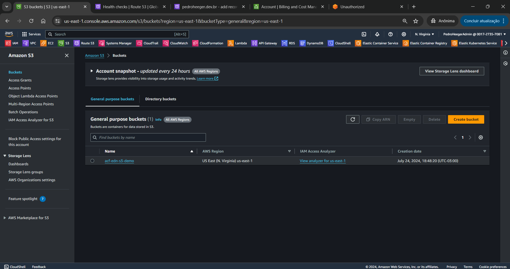<br>
    <figcaption>Imagem 02.</figcaption>
</figure></div><br>

<div align="Center"><figure>
    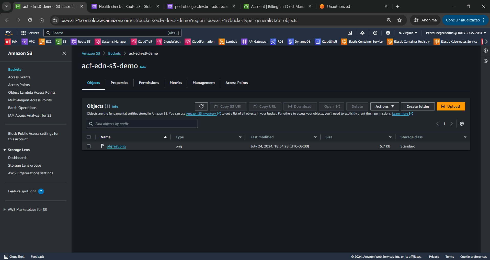<br>
    <figcaption>Imagem 03.</figcaption>
</figure></div><br>

A tarefa 2 consistiu no monitoramento da instância, verificando o status dela e as métricas do **Amazon CloudWatch**, conforme exibido na imagem 04 e 05 a seguir. Também foi utilizado o recurso `Get Instance Screenshot` que pode ser utilizado para identificar algum problema com a instância quando não é possível realizar acessá-la remotamente, apresentado na imagem 06.

<div align="Center"><figure>
    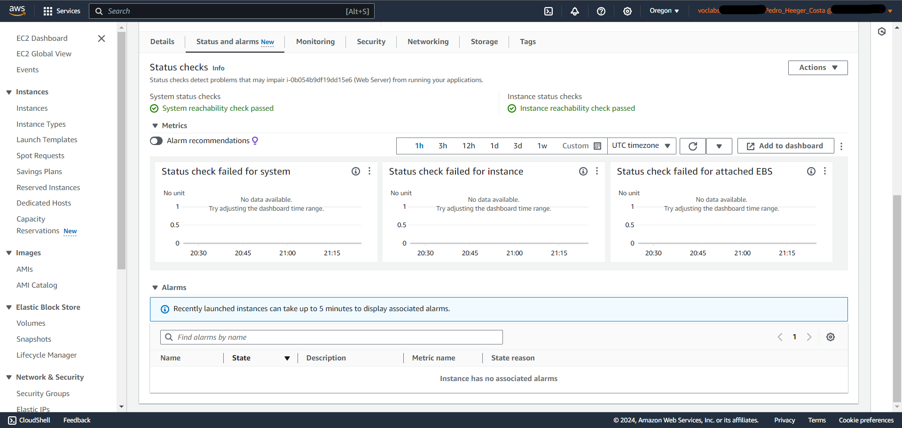<br>
    <figcaption>Imagem 04.</figcaption>
</figure></div><br>

<div align="Center"><figure>
    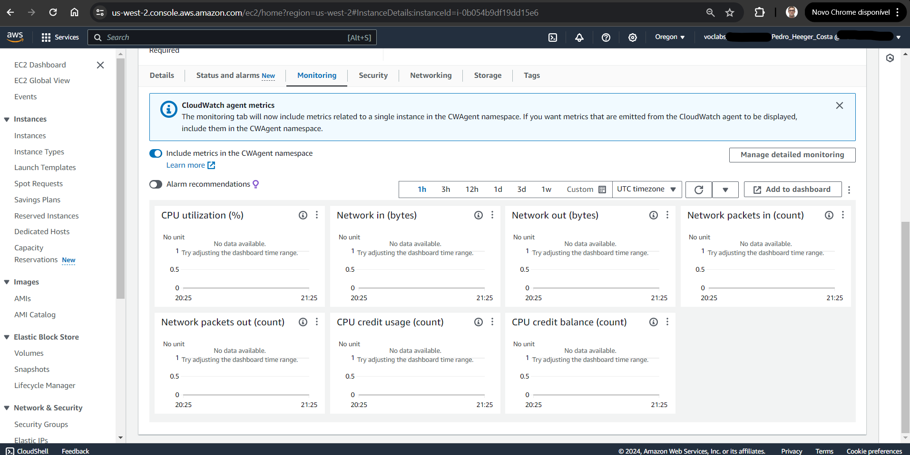<br>
    <figcaption>Imagem 05.</figcaption>
</figure></div><br>

<div align="Center"><figure>
    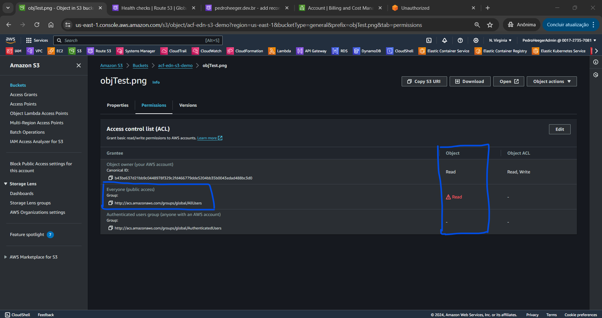<br>
    <figcaption>Imagem 06.</figcaption>
</figure></div><br>

Na tarefa 3, o objetivo foi atualizar o grupo de segurança criando uma nova regra de entrada para liberar o acesso a qualquer faixa de IP `0.0.0.0/0` a porta `80` do protocolo `TCP` que é a porta que o protocolo `HTTP` utiliza para se comunicar. Dessa forma, foi possível visualizar pelo navegador de internet da maquina física **Windows**, a página criada pelo servidor web **Apache HTTP (Httpd)**, conforme ilustrado na imagem 07 abaixo. A imagem 08 mostra a regra de entrada criada no grupo de segurança vinculado a essa instância.

<div align="Center"><figure>
    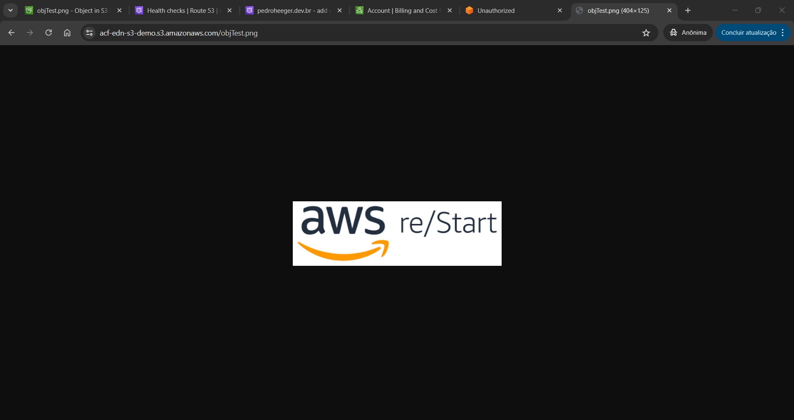<br>
    <figcaption>Imagem 07.</figcaption>
</figure></div><br>

<div align="Center"><figure>
    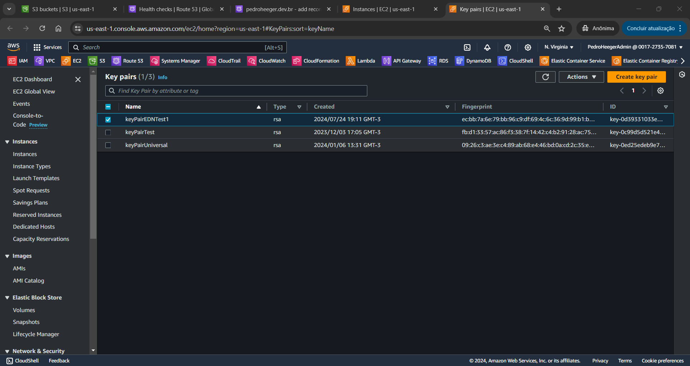<br>
    <figcaption>Imagem 08.</figcaption>
</figure></div><br>

Na tarefa 4 foi realizado o redimensionamento da instância tanto do tipo da instância, alterando de `t3.micro` para `t3.small`, quanto do volume do **Amazon EBS**, modificando para `10 Gb` do mesmo tipo, o `gp2`. Contudo, para realizar essas alterações foi preciso interromper a instância antes e então, fazer as modificações. Após isso, a instância foi iniciada já com as modificações. A imagem 09 mostram as alterações realizadas do tipo da instância e do volume de armazenamento.

<div align="Center"><figure>
    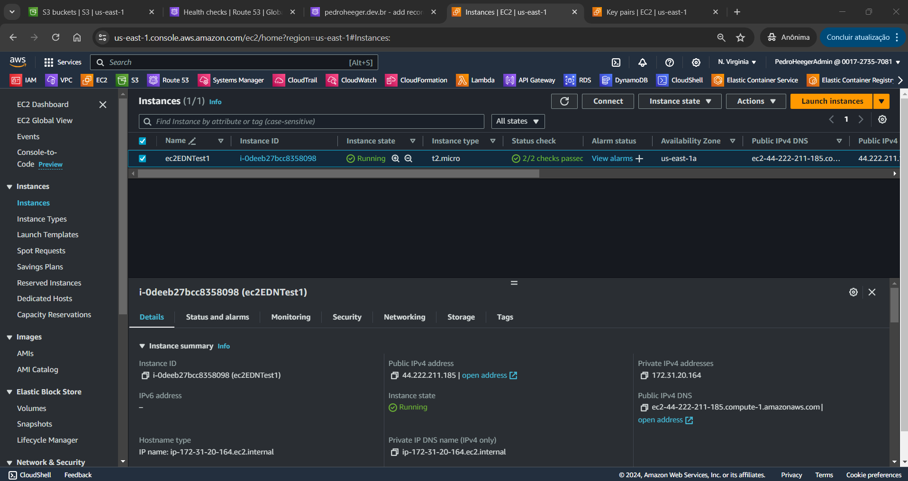<br>
    <figcaption>Imagem 09.</figcaption>
</figure></div><br>

Na tarefa 5, o objetivo foi apenas verificar o limite do número de instâncias que pode ser iniciada na região atual `us-east-2` (Oregon). Por fim, a tarefa 6 foi realizar o encerramento da instância, no qual foi necessário primeiro remover a proteção contra encerramento definada nas configurações, para depois seguir com o encerramento da instância. A imagem 10 mostra a instância em estado de encerramento. Enquanto a imagem 11 exibe a tentativa de encerramento quando havia a proteção contra encerramento. Note que um erro foi mostrado.

<div align="Center"><figure>
    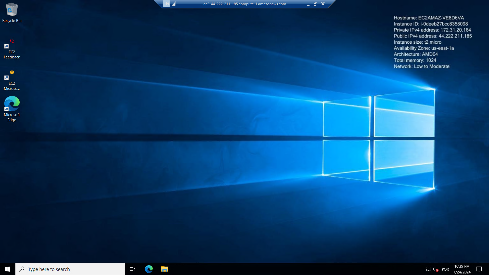<br>
    <figcaption>Imagem 10.</figcaption>
</figure></div><br>

<div align="Center"><figure>
    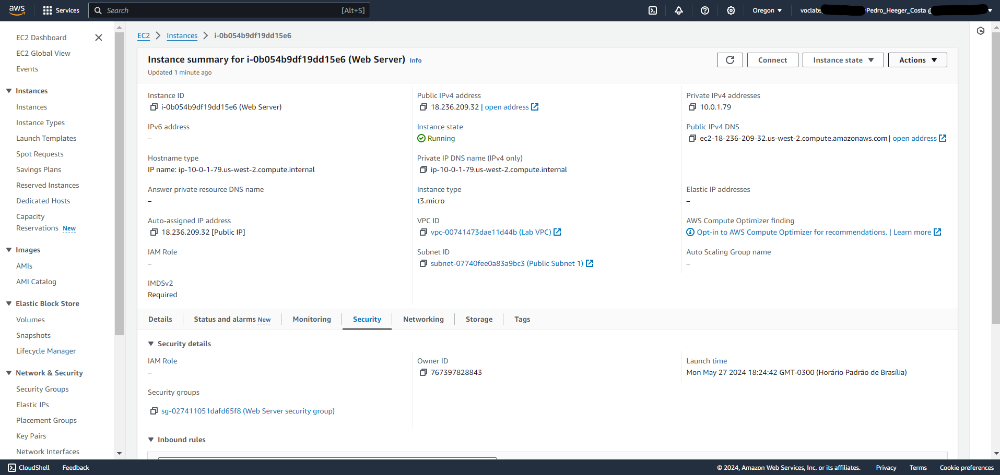<br>
    <figcaption>Imagem 11.</figcaption>
</figure></div><br>