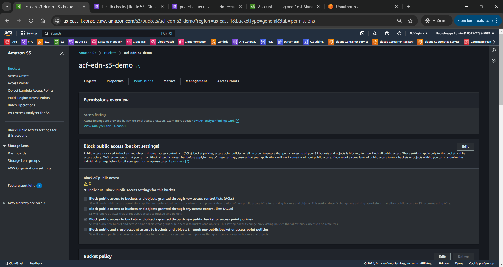
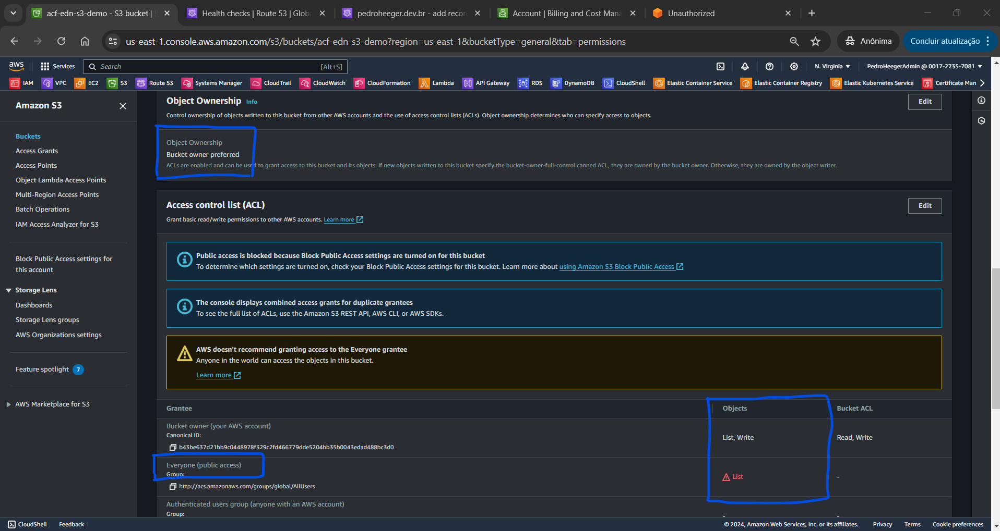

# Bootcamp AWS re/Start-Cloud Computing - Module 1   

### Repository: [boot](../../../../)   
### Platform: <a href="../../../">edn   </a> 
### Software/Subject: <a href="../../">aws    </a>
### Bootcamp: <a href="../">boot_022 (Bootcamp AWS re/Start-Cloud Computing)   </a>
### Module: 1. Introdução ao Cloud Foundations 

---

This folder refers to Module 1 **Introdução ao Cloud Foundations** from bootcamp [**Bootcamp AWS re/Start-Cloud Computing**](../).

### Theme:
- Cloud Computing

### Used Tools:
- Operating System (OS): 
  - Linux   
  - Windows 11   
- Linux Distribution: 
  - Amazon Linux   
- Virtualization: 
  - Vocareum   
- Cloud:
  - AWS   
- Cloud Services:
  - Amazon Elastic Compute Cloud (EC2)   
  - Amazon Simple Storage Service (S3)   
  - AWS Identity and Access Management (IAM)   
  - Google Drive   
- Language:
  - HTML   
  - Markdown   
- Integrated Development Environment (IDE) and Text Editor:
  - Visual Studio Code (VS Code)   
- Versioning: 
  - Git   
- Repository:
  - GitHub   
- Command Line Interpreter (CLI):
  - Bash e Sh   
  - Oh My Zshell (Oh My ZSh)   
  - Windows PowerShell   
  - ZShell   


---

### Bootcamp Module 3 Structure

1. <a name="item1">Introdução ao Cloud Foundations</a><br>
  1.1. <a href="#item1.1">1-[CF]-Lab - Sandbox Environment</a><br>
  1.2. <a href="#item1.2">Boas-vindas ao AWS re/Start</a><br>
  1.3. <a href="#item1.3">O que é computação em nuvem?</a><br>
  1.4. 5-[CF]-KC - O que é computação em nuvem?<br>
  1.5. <a href="#item1.5">Vantagens da computação em nuvem</a><br>
  1.6. 208-[CF]-KC - Vantagens da computação em nuvem<br>
  1.7. <a href="#item1.7">O que é a AWS?</a><br>
  1.8. 6-[CF]-KC - O que é a Amazon Web Services?<br>
  1.9. <a href="#item1.9">Definição de preços da AWS</a><br>
  1.10. 7-[CF]-KC - Fundamentos da definição de preço da AWS<br>
  1.11. <a href="#item1.11">Visão geral da infraestrutura da AWS</a><br>
  1.12. 8-[CF] -KC — Visão geral da infraestrutura da AWS<br>
  1.13. <a href="#item1.13">Serviços e categorias da AWS</a><br>
  1.14. 209-[CF]- KC - Serviços e categorias da AWS<br>
  1.15. <a href="#item1.15">Modelo de responsabilidade compartilhada da AWS</a><br>
  1.16. 9- [CF] -KC - Modelo de responsabilidade compartilhada<br>
  1.17. <a href="#item1.17">S3 da Amazon</a><br>
  1.18. <a href="#item1.18">Demonstração do S3 da AWS</a><br>
  1.19. 10- [CF] -KC — Introdução ao Amazon S3<br>
  1.20. <a href="#item1.20">Elastic Compute da AWS</a><br>
  1.21. <a href="#item1.21">Demonstração do EC2 da AWS</a><br>
  1.22. <a href="#item1.22">11-[CF]-Lab - Introdução ao Amazon EC2</a><br>
  1.23. 12- [CF] -KC — Introdução ao Amazon EC2<br>
  1.24. <a href="#item1.24">Boas-vindas à família do AWS re/Start! -2</a><br>

---

### Objective:
O objetivo deste módulo do bootcamp foi aprender sobre o conceito de cloud computing e sobre a cloud da AWS. Como ela funciona, sua infraestrutura, noções de redes e armazenamento nesta cloud. Também foram apresentados diversos serviços da cloud, entre eles, os utilizados foram: **Amazon API Gateway**, **Amazon Elastic Compute Cloud (EC2)**, **Amazon DynamoDB**, **AWS Identity and Access Management (IAM)** e **AWS Lambda**. A utilização desses serviços ocorreu de três maneiras diferentes, a primeira pelo **AWS Management Console**, ambiente gráfico da plataforma da AWS. A segunda com uso do framework **Serverless Framework** para criar uma infraestrutura como código no **AWS CloudFormation**. Já a última forma com o uso do **AWS Command Line Interface (CLI)**, executando os comandos AWS.

### Structure:
A estrutura das pastas obedece a estruturação do bootcamp, ou seja, conforme foi necessário, sub-pastas foram criadas para os cursos específicos deste módulo. Na imagem 01 é exibido a estruturação das pastas. 

<div align="Center"><figure>
    <br>
    <figcaption>Imagem 01.</figcaption>
</figure></div><br>

### Development:
O desenvolvimento deste módulo do bootcamp foi dividido em onze cursos e um desafio de projeto. Abaixo é explicado o que foi desenvolvido em cada uma dessas atividades.

<a name="item1.1"><h4>1.1 1-[CF]-Lab - Sandbox Environment</h4></a>[Back to summary](#item1) | <a href="">Certificate</a>

Na primeira aula do módulo 1 deste bootcamp foi explicado como funciona a plataforma online **Vocareum**. Esta fornece ambientes de laboratório baseados na nuvem para educação, treinamento e avaliação em áreas como programação. Neste módulo 1, essa foi a plataforma utilizada para criar recursos na AWS. Contudo, existiam alguns limites dos serviços e recursos da **AWS** que podiam ser utilizados. Os serviços e recursos disponíveis foram apresentados nesta aula e basicamente todos os serviços para obtenção da certificação AWS Certified Cloud Practitioner (CLF-C01) estavam disponíveis. Por fim, foi explicado também como realizar o acesso remoto de uma maquina **Windows** em uma instância utilizando o software **PuTTY** e também como acessar remotamente pelo **Mac** ou **Linux** através do software **OpenSSH**. Possuo um curso realizado e versionado aqui no **GitHub** que explica como fazer acesso remoto de diferentes formas, entre diversos sistemas operacionais, tanto para maquina remota ou local, utilizando vários softwares diferentes. Caso queira consultar, o curso é o [curso_092](https://github.com/PedroHeeger/course/tree/main/aws_skill_builder/aws/curso_092).

<div align="Center"><figure>
    <br>
    <figcaption>Imagem 02.</figcaption>
</figure></div><br>

<a name="item1.2"><h4>1.2 Boas-vindas ao AWS re/Start</h4></a>[Back to summary](#item1) | <a href="">Certificate</a>

Nesta aula foi apresentado o objetivo do programa **AWS re/Start** que é a preparação de todos os alunos para o mercado de trabalho em nível básico de TI através do desenvolvimento de conhecimento e competências e da aplicação prática de habilidades técnicas baseadas na nuvem. A abordagem do programa conteve: discussões lideradas por instrutor, atividades de aplicativos, laboratórios práticos, prática de habilidades profissionais e avaliações. Para atender a exigência do programa foi necessário acesso a um computador e a participação e comprometimento com as aulas.

Os tópicos abordados ao longo do programa foram: os princípios básicos de nuvem, que conteplava a introdução aos componentes da nuvem (Terminologia; Computação; Armazenamento; Rede; Segurança; Banco de dados) e a introdução à programação (Conceitos básicos de Python; Conceitos básicos de script do Linux); os principais serviços da AWS, contemplando a  infraestrutura global, os componentes de nuvem mapeados para o serviço da AWS, a operação na AWS, a automação na AWS, o gerenciamento e governança da AWS; e as habilidades profissionais, que abrangia as habilidades de comunicação, a definição de objetivos, o processo do pensamento técnico, o trabalho em equipe e colaboração, a preparação da entrevista e a presença digital. 

<a name="item1.3"><h4>1.3 O que é computação em nuvem?</h4></a>[Back to summary](#item1) | <a href="">Certificate</a>

No terceira aula do módulo 1 foi iniciado o assunto de cloud computing, explicando o seu conceito, apresentando os modelos de computação, os modelos de serviços em nuvem e os modelos de implantação de computação em nuvem. Cloud Computing (Computação em Nuvem) é um modelo de entrega de serviços de computação através da internet, permitindo acesso sob demanda a recursos computacionais, como armazenamento, processamento, redes e aplicativos. Os serviços em nuvem são escaláveis, flexíveis e podem ser provisionados rapidamente, proporcionando benefícios como redução de custos, maior disponibilidade e agilidade no acesso a recursos computacionais. A nuvem é composta por servidores, que são computadores destinados a realizar algum serviço de tecnologia que podem ser usados como componentes para criar uma solução. Estes servidores são armazenados em data centers em diferentes locais pelo mundo. As soluções criadas ajudam aos usuários a atingir suas metas de negócios.

No modelo de computação tradicional, o usuário precisa se preocupar com o gerenciamento do hardware, exigindo tempo e recursos que poderiam ser melhores utilizados no desenvolvimento da arquitetura e do aplicativo. Como o hardware são equipamentos físicos, torna-se necessário o gerenciamento do espaço onde ele será implantado, segurança física desse espaço, planejamento da capacidade necessário desse hardware, resultando em um aumento considerável dos custos. Além disso, a capacidade planejada de hardware em alguns momentos pode não ser atingida, provocando ociosidade desses recursos adquiridos, ou pode ser excedida, ocasionando a falta de recursos, ou ainda se as necessidades mudarem, essa capacidade teria que ser alterada. Portanto, este modelo trabalha com custo fixo de hardware, não sendo possível a variação do custo conforme uso em curto período de tempo.

Já no modelo de computação em nuvem, o custo é variável, pois é possível pensar no hadware como software, já que o usuário não precisa se preocupar com o gerenciamento dele, tornando isso de responsabilidade de um provedor de cloud, como a **AWS**. Dessa forma, o custo é bem menor e é possível ter uma flexibilidade, além de uma série de outros benefícios. A computação em nuvem resolve diversos problemas do modelo de computação tradicional, entre eles, o investimento antecipado em aquisição, provisionamento e manutenção da infraestrutura local para o hardware. Assim é possível implementar uma solução com agilidade e com custos iniciais baixos e também aumentar ou reduzir verticalmente e de forma elástica e automatizada, pagando apenas pelo que for utilizado. 

Os serviços de nuvem são divididos com base no controle e responsabilidade sobre a forma como o serviço é configurado em três categorias principais. A Infraestrutura como Serviço (IaaS) é a que o usuário possui mais controle dos recursos, é necessário o gerenciamento do servidor, podendo ser físico ou virtual, administrando seu sistema operacional, os middlewares, o tempo de execução, além dos dados e da aplicação. O gerenciamento da infraestrutura física ou subjacente, incluindo servidores, armazenamento, rede e a camada de virtualização fica sob responsabilidade da provedora de cloud. Na Plataforma como Serviço (PaaS), o cloud provider gerencia todo o hardware e também os sistemas operacionais subjacentes, enquanto o usuário só se preocupa com a aplicação e os dados. Dessa forma, o PaaS oferece toda estrutura para que o usuário possa desenvolver sua aplicação. Já o Software como Serviço (SaaS), basicamente tudo é gerenciado pelo provedor de cloud, desde a infraestrutura física até a aplicação e os dados. O usuário é responsável apenas pela utilização do software. Esse é o modelo mais fácil, pois o usuário encontra o software pronto para uso, tendo que gerencia apenas os dados dentro do software. 

Além dos modelos de serviços de nuvem, existe também o modelo de implantação de computação em nuvem, que são divididos em três principais e representam os ambientes de nuvem nos quais é possível implantar aplicativos. A nuvem pública é quando os recursos, como armazenamento, servidores e aplicativos, são fornecidos por um provedor de serviços de nuvem e disponibilizados pela internet para uso geral. Isso significa que os recursos são compartilhados entre vários usuários e gerenciados pelo provedor de serviços de nuvem. A nuvem privada, que pode ser local ou hospedada em um provedor, é uma infraestrutura de computação em nuvem sempre dedicada a uma única organização. Os recursos de hardware e software podem ser mantidos internamente pela própria organização ou podem ser fornecidos por terceiros, mas são utilizados exclusivamente pela organização e não compartilhados com outras entidades. Isso proporciona maior controle sobre os recursos e a segurança dos dados, mas também requer investimentos significativos em infraestrutura e gerenciamento.

A nuvem híbrida é uma forma de conectar a infraestrutura e aplicativos entre os recursos existentes na nuvem e fora dela. Este modelo de implantação é usado quando é preciso estender a infraestrutura local de uma organização para a nuvem, conectando os recursos da nuvem a um sistema interno. Enquanto a distinção entre nuvem pública e privada geralmente está associada à disponibilidade para uso geral versus dedicação a uma única organização, a nuvem híbrida foca na localização dos recursos, conectando recursos locais (On-premises), ou seja fora da nuvem, a recursos na nuvem (hospedados em um provedor). Portanto, existe as soluções On-Premises, onde os sistemas de computação e dados são mantidos e gerenciados dentro das instalações físicas de uma organização. Isso inclui servidores físicos, redes, armazenamento de dados e outros recursos que são instalados e mantidos localmente pela própria organização. Nesse modelo, a organização tem total controle sobre seus sistemas e dados, mas também é responsável por todos os custos e tarefas de manutenção.

Resumindo para ficar bem didático, nuvem pública e privada são quando os recursos de TI são fornecidos por uma provedora de cloud através da internet, sendo a primeira para o uso geral e a segunda para uso único de uma organização. Soluções On-Premises é quando esses recursos são totalmente gerenciados localmente pela a empresa, sem utilização de numve. Já a nuvem híbrida é quando parte dos recursos de TI estão dispostos localmente e a outra parte é fornecido pela provedora de cloud. 

- Nuvem (Custo, Escalabilidade, Acessibilidade, Manutenção, Segurança):
    - Não há investimento inicial, só é pago pelo que for utilizado, ou seja, de forma variável.
    - Acesso imediato aos recursos de qualquer lugar. Não é necessário gerenciar o hardware.
    - Redução dos custos contínuos, devido a economia em escala, melhoras contínuas e várias opções de preço.
    - Com a redução dos custos em relação ao hardware, as organizações podem direcionar seus recursos para novos projetos inovadores que expandam seus negócios se concentrando apenas nos aplicativos e não nas operações.
    - Capacidade flexível, ou seja, os recursos são dinâmicos, podendo reduzir ou aumentar quando quiser muito rapidamente. Os custos operacionais são previsíveis.
    - A velocidade e agilidade permite responder as condições de mercado em constante evolução, desenvolvendo e implantando aplicações de forma muito mais ágil.
    - Os recursos são variáveis e infinitos (ilimitados).
    - Sem limitação geográfica, é possível implantar o aplicativo em qualquer região da provedora de cloud ao redor do mundo, com menor latência e por um custo mínimo.
    - A manutenção e atualizações é gerenciadas pelo prevedor de nuvem.
- Soluções On-Premises:
    - Há investimento incial, gerando grandes despesas de capital, ou seja, há um custo fixo.
    - Tem que aguardar a montagem e instalação do hardware para utilização dos recursos.
    - É necessário gerenciar todo o hardware localmente, bem como a infraestrutura local (local físico, segurança, refrigeração e energia).
    - Normalmente é exigido atualizações em ciclo de um, três ou cinco anos.
    - Gasto de tempo com o gerenciamento do hardware, dificultando direcionar mais os recursos para as aplicações.
    - Dificuldade na estimativa das necessidades de capacidade de infraestrutura, ou seja, os recursos são estáticos. Caso seja necessário mais recursos, é preciso toda mobilização novamente.
    - O tempo necessário para adquirir, entregar e executar um servidor se torna caro em uma infraestrutura tradicional.
    - Os recursos são fixos e finitos (limitados).
    - As empresas acabam se concentrando em uma única área geográfica devido as limitações.
    - Tem que realizar a manutenção e atualização, ocasionando custos.

<a name="item1.5"><h4>1.5 Vantagens da computação em nuvem</h4></a>[Back to summary](#item1) | <a href="">Certificate</a>

A computação em nuvem possuí seis grandes vantagens. A primeira delas é **trocar despesas de capital (CapEx) por despesas variáveis**, ou seja, não é necessário investir em infraestrutura de computação para utilizar recursos de computação. Com a nuvem é possível usar recursos de computação fornecidos pela cloud provider e pagar apenas pelo que usar. O Capex são os fundos que uma empresa usa para adquirir, atualizar e manter ativos físicos, como propriedades, edifícios industriais ou equipamentos. Enquanto uma despesa variável é uma despesa que a pessoa que arca com os custos pode alterar ou evitar. 

A segunda vantagem é **beneficiar-se de grandes economias de escala**. A computação em nuvem oferece a vantagem de custos variáveis mais baixos em comparação com o ambiente local. Isso ocorre porque os provedores de nuvem, como a AWS, conseguem consolidar a demanda de centenas de milhares de clientes, permitindo-lhes obter grandes economias de escala com os custos de CapEx. Essas economias são então repassadas aos clientes na forma de preços reduzidos, baseados no modelo de pagamento conforme o uso.

A vantagem três é **parar de adivinhar a capacidade**. Um dos grandes desafios do ambiente on-premises é ter de adivinhar a capacidade de infraestrutura necessária para construção das suas soluções. Mas mesmo assim, em algum momento os recursos, que são caros, ficaram ociosos ou a capacidade será insuficiente, gerando tempo de inatividade. Em ambos os cados, a empresa terá prejuízos. Com a computação em nuvem, é possível acessar a quantidade de recursos necessária e aumentar e reduzir verticalmente, conforme necessário, em apenas alguns minutos.

A quarta vantagem é **aumentar a velocidade e a agilidade**. Na computação em nuvem, como não há a preocupação com o hardware, o tempo necessário para disponibilização dos recursos de computação é mínimo. A agilidade organizacional é um diferencial fundamental no ambiente de negócios em rápida transformação dos dias atuais. Com isso, a organização se beneficia com a agilidade e velocidade na entrega das suas soluções com um custo muito menor.

A vantagem cinco é **parar de gastar dinheiro com a execução e a manutenção de data centers**. A computação em nuvem possibilita as empresas concentrarem em seus negócios, ao invés de se concentrar na infraestrutura. Evitando o gasto com execução e manutenção da infraestrutura e hardware, pois o provedor de cloud que vai prestar o fornecimento desses recursos.

A última vantagem das seis é **Globalização em minutos**. É possível implantar aplicativos em várias Regiões da **AWS** ao redor do mundo com apenas alguns cliques. Como resultado, é possível oferecer latência mais baixa e uma experiência melhor aos clientes com simplicidade e custo mínimo.

<a name="item1.7"><h4>1.7 O que é a AWS?</h4></a>[Back to summary](#item1) | <a href="">Certificate</a>

A AWS oferece em sua nuvem, os três seguintes modelos de serviços de nuvem: infraestrutura como serviço, plataforma como serviço e software como serviço. Na infraestrutura como serviço (IaaS), o usuário gerencia a infraestrutura remotamente, desde servidores, sistema operacional até a aplicação e os dados. Contudo a infraestrutura subjacente, que inclui os servidores, é mantida pela e operada **AWS**, o usuário só configura como ela será utilizada para sua aplicação. Os servidores, mesmo sendo acessados remotamente, podem ser físicos ou virtuais. O servidor físico é quando o usuário tem total controle sobre a maquina fornecida pela **AWS**. Já o servidor virtual, a **AWS** cria uma instância virtual usando tecnologia de virtualização. Dessa forma, o usuário tem uma maquina virtual que funciona de forma independente, mas compartilha recursos do hardware físico com outras instâncias virtuais.

Na plataforma como serviço (PaaS), o provedor de cloud gerencia a infraestrutura subjacente, os servidores e sistema operacional, possibilitando a execução de aplicativos pelos usuário. O PaaS também oferece uma estrutura para desenvolvedores que pode ser usada na construção de aplicativos personalizados. Com o software como serviço (SaaS), o usuário gerencia seus arquivos e o provedor de serviços gerencia todos os data centers, servidores, redes, armazenamento, manutenção e aplicação de patches. Ou seja, o provedor do serviço gerencia tudo e entrega a aplicação pronta para o usuário que apenas precisa saber como usá-la. Este é o modelo mais fácil de compreender, pois é o mais utilizado pela maioria das pessoas.

Para entender computação em nuvem é importante compreender o que são serviços web. Esses são softwares acessíveis via Internet ou redes privadas (intranets) que usam formatos padronizados, como XML ou JSON, para solicitações e respostas de APIs. Eles são independentes de sistemas operacionais e linguagens de programação. Um serviço web é descrito por um arquivo de definição de interface e pode ser detectado automaticamente.

A **AWS** é um provedor de serviços de nuvem seguro que oferece uma ampla gama de serviços para ajudar as empresas a expandirem e crescerem. Esses serviços são disponibilizados via Internet, permitindo acesso sob demanda a recursos de computação, armazenamento, rede, banco de dados e outros recursos de TI essenciais para seus projetos. Além disso, a AWS fornece ferramentas para gerenciar esses recursos. Os serviços da **AWS** se enquadram em diferentes categorias, e cada categoria contém um ou mais serviços. É possível selecionar os serviços que deseja nessas diferentes categorias para criar suas soluções.

Existem três formas de interagir com os recursos e serviços da **AWS**. A primeira delas é pelo **AWS Console Management** que é uma interface gráfica avançada para a maioria dos recursos que a **AWS** oferece e que pode ser acessada por um navegador de internet ou por um aplicativo de celular a qualquer momento, em qualquer lugar. Uma outra forma é através da interface de linha de comando (CLI) da **AWS**. A **AWS Command Line Interface (AWS CLI)** oferece um conjunto de utilitários que podem ser iniciados a partir de um script de comandos no **Linux**, **macOS** ou **Microsoft Windows**. A terceira maneira de interação é com os SDKs ou kits de desenvolvimento de software. A **AWS** oferece pacotes que permitem acessar a cloud em várias linguagens de programação populares. Esses pacotes facilitam o uso da **AWS** em aplicativos existentes. Eles também permitem criar aplicativos que implantam e monitoram sistemas complexos inteiramente por meio de código.

O processo de adoção da nuvem em cada empresa é única. Contudo, para obter êxito na migração dos recursos de TI de uma organização para a nuvem, três elementos (pessoas, processos e tecnologia) devem estar alinhados. O **AWS Cloud Adoption Framework (AWS CAF)** auxilia as organizações a criar planos eficientes e eficazes para a adoção da nuvem. As orientações e práticas recomendadas desta estrutura ajudam a desenvolver uma abordagem abrangente para gerenciar a computação em nuvem em toda a organização e ao longo do ciclo de vida da TI. Essas diretrizes permitem que cada unidade da organização atualize suas habilidades, ajuste processos existentes e introduza novos processos, maximizando assim os benefícios dos serviços de computação em nuvem. O **AWS CAF** facilita o planejamento da migração para a nuvem ao dividir o processo complexo em partes gerenciáveis chamadas de perspectivas. Essas perspectivas cobrem áreas cruciais focadas em pessoas, processos e tecnologia. De maneira geral, as perspectivas de negócios, pessoas e governança se concentram nas capacidades do negócio, enquanto as perspectivas de plataforma, segurança e operações focam nos recursos técnicos.

A AWS disponibiliza uma extensa e detalhada documentação para cada um de seus serviços. Os manuais e as referências de API são organizados por categoria de serviço. Além disso, oferece recursos gerais e tutoriais acessíveis nas páginas de Documentação da AWS. Esses recursos incluem estudos de caso, glossário completo de termos da AWS, documentos técnicos, perguntas frequentes, informações sobre o **AWS Training and Certification**, entre outros. Cada SDK e toolkit também possui sua própria documentação, como a **AWS CLI**, o **AWS SDK for Python** (**Boto**) e muitos outros. A documentação técnica pode ser filtrada por produto, categoria ou setor, permitindo encontrar as informações mais relevantes para suas necessidades específicas.

<a name="item1.9"><h4>1.9 Definição de preços da AWS</h4></a>[Back to summary](#item1) | <a href="">Certificate</a>

No modelo de definição de preços da **AWS** existem os três seguintes fatores fundamentais de custo: computação, armazenamento e transferência de dados de saída. Essas características variam um pouco, dependendo do produto da **AWS** e do modelo de preço escolhidos. Na maioria dos casos, não há cobrança pela transferência de dados de entrada ou pela transferência de dados entre outros serviços da **AWS** na mesma Região da **AWS**, resguardada algumas exceções, portanto, é importante verificar as taxas de transferência de dados antes de começar a usar o serviço da **AWS**. A transferência de dados de saída é agregada entre serviços e, em seguida, cobrada de acordo com a taxa de transferência de dados de saída. Essa cobrança é exibida no relatório mensal como Transferência de dados para fora da **AWS**.

Embora o número e a variedade de serviços oferecidos pela **AWS** tenham aumentado drasticamente ao longo do tempo, a filosofia de preço de pagamento flexível permanece a mesma. Ao final de cada mês, o usuário paga pelo que for utilizado, sendo possível iniciar ou parar de usar um produto a qualquer momento. Este modelo é o principal que é o *Pagamento conforme uso*, no qual não são necessários contratos de longo prazo. Existem outras três formas de pagamento que são elas: Pague menos ao fazer reserva; Pague menos ao usar mais; Pague menos à medida que a **AWS** cresce. Além disso, em projetos de alto volume com requisitos exclusivos também é possível aderir a um modelo de preço personalizado, caso nenhum dos modelos de preço da **AWS** seja adequado para o projeto.

No pagamento conforme uso, como próprio nome já diz, o usuário só paga pelo que for consumido, não há grandes despesas inicias ou despesas com infraestrutura física e hardware, já que a **AWS** provisiona tudo isso para o usuário. Dessa forma, as empresas podem se concentrar no que realmente importa para o seu negócio. Todos os serviços da **AWS** estão disponíveis sob demanda, sem a exigência de contratos de longo prazo nem dependências de licenciamento complexo.

Para serviços específicos, como o **Amazon Elastic Compute Cloud (Amazon EC2)** e o **Amazon Relational Database Service (Amazon RDS)**, é possível investir em capacidade reservada. Com instâncias reservadas, é possível economizar significantemente em relação à capacidade sob demanda equivalente. As instâncias reservadas estão disponíveis em três opções: Instância reservada com pagamento total antecipado (ou AURI); Instância reservada com pagamento antecipado parcial (ou PURI); Instância reservada sem pagamento antecipado (ou NURI). Ao comprar instâncias reservadas, o usuário recebe um desconto maior quando faz um pagamento antecipado maior. Para maximizar suas economias, é possível fazer o pagamento total antecipado e receber o maior desconto. As instâncias reservadas com pagamento antecipado parcial têm descontos menores, mas oferecem a opção de gastar menos inicialmente. Por fim, é possível optar por não gastar nada inicialmente e receber um desconto ainda menor, o que permite reservar capital para gastar em outros projetos. Ao usar a capacidade reservada, a empresa pode minimizar riscos, gerenciar orçamentos de modo mais previsível e cumprir políticas que exigem compromissos de longo prazo.

Com a AWS, é possível obter descontos com base em volume e obter economias substanciais à medida que a utilização aumenta. Para serviços como o **Amazon Simple Storage Service (Amazon S3)**, o modelo de preço é em camadas, o que significa que o usuário paga menos por GB quando utiliza mais. Além disso, não há cobranças pela transferência de entrada de dados. Diversos serviços de armazenamento oferecem custos de armazenamento mais baixos com base nas suas necessidades. Por isso, conforme as necessidades de uso da **AWS** aumentam, o usuário se beneficia das economias de escala, permitindo o aumento do nível de adoção e mantendo os custos sob controle. A medida que as organizações evoluem, a **AWS** também oferece opções de compra de serviços que ajudam a contemplar as necessidades empresariais. Por exemplo, o portfólio de serviços de armazenamento da **AWS** oferece opções para ajudar a diminuir o modelo de preço com base na frequência em que os dados são acessados e o desempenho exigido para recuperá-los. Para otimizar as economias, deve ser escolhida as combinações de soluções de armazenamento certas para ajudar a reduzir custos e, ao mesmo tempo, manter desempenho, segurança e durabilidade.

A **AWS** está constantemente empenhada em reduzir os custos operacionais dos data centers, melhorar a eficiência energética e diminuir os gastos gerais de seus serviços. Essas otimizações, aliadas às economias de escala cada vez maiores, permitem que a **AWS** repasse essas economias para os usuários por meio de preços mais baixos. Desde 2006, a **AWS** reduziu os preços mais de 70 vezes. Além disso, o crescimento da **AWS** significa que os recursos futuros, mais avançados e com melhor desempenho, substituem os atuais sem custo adicional. 

Para ajudar novos clientes da **AWS** a começar a usar a nuvem, a **AWS** oferece um nível gratuito (o Nível gratuito da AWS ou **AWS Free Tier**) para novos clientes por até um ano. O Nível gratuito é aplicável a serviços e opções específicos. Caso seja um novo cliente da **AWS**, poderá executar uma microinstância T2 gratuita do **Amazon Elastic Compute Cloud (Amazon EC2)** por um ano, além de usar um nível gratuito para **Amazon S3**, **Amazon Elastic Block Store (Amazon EBS)**, **Elastic Load Balancing**, transferência de dados da **AWS** e outros serviços da **AWS**.

A **AWS** também oferece vários serviços e recursos sem custo adicional, alguns deles incluem: A **Amazon Virtual Private Cloud (Amazon VPC)** permite provisionar uma seção da nuvem **AWS** isolada logicamente onde é possível executar recursos da **AWS** em uma rede virtual que o usuário define; O **AWS Identity and Access Management (IAM)** controla o acesso dos usuários aos recursos e serviços da **AWS**; O AWS Elastic Beanstalk é uma maneira de implantar e gerenciar rapidamente aplicativos na nuvem **AWS**; O **AWS CloudFormation** oferece aos desenvolvedores e administradores de sistemas uma maneira de criar um grupo de recursos da **AWS** relacionados e provisioná-los de uma forma organizada e previsível; O *Automatic Scaling* (Dimensionamento automático) adiciona ou remove recursos automaticamente de acordo com as condições que o usuário definir. Os recursos utilizados aumentam adequadamente durante picos de demanda para manter o desempenho e diminuem automaticamente durante quedas de demanda para minimizar os custos; **AWS OpsWorks** é um serviço de gerenciamento de aplicativos que facilita a implantação e operação de aplicativos de todos os tipos e tamanhos. Um outro recurso é a *cobrança consolidada* que é um recurso de faturamento no serviço **AWS Organizations** para consolidar o pagamento de várias contas da **AWS**. A cobrança consolidada oferece: Uma única fatura para várias contas; A capacidade de controlar facilmente as cobranças de cada conta; A oportunidade de diminuir as cobranças devido a descontos de preço por volume em uso combinado; Além disso, é possível consolidar todas as contas usando a cobrança consolidada e obter benefícios em camadas. Embora não haja cobrança por esses serviços, pode haver cobranças associadas a outros serviços da **AWS** usados com esses serviços.

A calculadora de preço da **AWS** é uma ferramenta de estimativa de custos da **AWS** que oferece uma maneira conveniente de calcular a fatura mensal. Com ela, o usuário pode adicionar, editar e remover serviços conforme necessário, com a ferramenta recalculando automaticamente as cobranças mensais estimadas. A calculadora abrange uma ampla gama de cálculos de preço para todos os serviços e regiões da **AWS**, fornecendo um detalhamento dos recursos disponíveis em cada serviço e região. Além de estimar os custos mensais, a calculadora ajuda a identificar oportunidades de economia e permite usar modelos para comparar diferentes soluções e serviços de implantação. Ela também oferece exemplos e casos de uso comuns, como recuperação de desastres e backup (Disaster Recovery and Backup) ou aplicativos web (Web Application), para ajudar a entender melhor como os serviços podem ser utilizados.

Com relação aos custos entre os dois modelos de implantação por localização (local e nuvem), a infraestrutura on-premises (local) tende a ser bastante despendiosa devido a vários fatores como: os custos fixos (despesas de capital) associados à infraestrutura tradicional, incluindo instalações, hardware, licenças e equipe de manutenção; o aumento vertical é muito caro e lento; a redução vertical não reduz os custos fixos. Já em uma infraestrutura em nuvem (cloud), o provedor de nuvem é quem constrói a infraestrutura e mantém as despesas de capital, os clientes pagam apenas o que for utilizado. Aumentar ou reduzir verticalmente é bastante simples e os custos são fáceis de estimar, pois dependem da utilização do serviço. 

Para tomar a melhor decisão de qual modelo usar, pode ser utilizado o *custo total de propriedade (TCO)* para comparar soluções de nuvem e no local e identificar a melhor opção. O TCO é uma estimativa financeira destinada a ajudar os compradores e os proprietários a determinar os custos diretos e indiretos de um produto ou de um sistema. Ele inclui o custo de um serviço e as despesas correspondentes. Ao comparar uma solução no local e de nuvem, é importante avaliar com precisão os custos reais das duas opções. Com a nuvem, a maioria dos custos é inicial e pode ser facilmente calculada, não havendo custos diretos, apenas indiretos. Com a tecnologia no local, os custos internos da execução de um servidor incluem: Custos diretos, como energia, espaço físico, armazenamento e operações de TI para gerenciar esses recursos; Custos indiretos, como infraestrutura de rede e armazenamento.

<a name="item1.11"><h4>1.11 Visão geral da infraestrutura da AWS</h4></a>[Back to summary](#item1) | <a href="">Certificate</a>

A infraestrutura global da **AWS** foi projetada e construída para oferecer um ambiente de computação em nuvem flexível, confiável, dimensionável e seguro com desempenho de rede global de alta qualidade. Esta infraestrutura é dividida em três elementos: *Regiões*, *Zonas de Disponibilidade* e *Pontos de presença*. 

Os data centers, que são construídos em clusters em várias Regiões globais, são a base da infraestrutura da **AWS**. Um data center é um local onde os dados físicos reais residem e o processamento de dados ocorre. Os data centers são projetados com segurança e levam em conta vários aspectos: cada local é selecionado cuidadosamente para minimizar riscos ambientais; os data centers possuem um design redundante que prevê e tolera falhas, mantendo sempre os níveis de serviço; a disponibilidade é garantida por meio de backups de componentes essenciais em locais isolados, conhecidos como Zonas de Disponibilidade; a **AWS** monitora constantemente o uso dos serviços para garantir que a infraestrutura atenda aos compromissos e requisitos de disponibilidade; os locais dos data centers são mantidos em sigilo e o acesso é rigorosamente controlado; em caso de falha, processos automatizados redirecionam o tráfego de dados dos clientes para fora da área afetada. Um único data center normalmente abriga de 50.000 a 80.000 servidores físicos. Todos os data centers ficam online e atendem aos clientes, nenhum data center fica inativo. A **AWS** usa equipamentos de rede personalizados originários de vários ODMs, que são fabricantes de design original que projetam e fabricam produtos com base em especificações de uma segunda empresa. Em seguida, a segunda empresa redefine a marca dos produtos para venda.

As *Zonas de Disponibilidade (AZs)* consistem em um ou mais data centers independentes, projetados para isolamento de falhas. Cada AZ é projetada como uma Zona de Disponibilidade de falha independente e possui recursos redundantes de energia, rede e conectividade, todos hospedados em instalações separadas. Essas zonas são conectadas entre si através de redes privadas de alta velocidade. Algumas AZs podem ter até seis data centers, mas nenhum data center faz parte de mais de uma AZ. As AZs são fisicamente separadas dentro de uma mesma região metropolitana, situadas em áreas de baixo risco de inundação, com classificações específicas de zona de inundação variando conforme a região. Além de fontes de alimentação distintas e sistemas de backup no local, elas frequentemente são alimentadas por diferentes redes elétricas de concessionárias independentes, minimizando ainda mais os pontos únicos de falha. Todas as AZs possuem conexões redundantes a múltiplos provedores de trânsito de nível 1 e são interconectadas dentro de uma região por links de baixa latência.

A infraestrutura da nuvem **AWS** é construída ao redor de Regiões e em Zonas de Disponibilidade. Uma *Região* é uma localização geográfica física no mundo na qual a **AWS** tem várias Zonas de Disponibilidade. As Regiões são isoladas umas das outras para obter tolerância a falhas e estabilidade. Os recursos em uma Região não são replicados automaticamente para outras Regiões. Cada Região contém duas ou mais Zonas de Disponibilidade. Em agosto de 2020, a AWS tinha 24 Regiões e 77 Zonas de Disponibilidade ao redor do mundo. Quando os dados são armazenados em uma Região específica, eles não são replicados fora dessa Região. A **AWS** nunca transfere seus dados para fora da Região em que o usuário os coloca, sendo de responsabilidade do usuário replicar os dados entre Regiões, se o negócio exigir. A **AWS** fornece informações sobre o país e, quando aplicável, sobre o estado em que cada Região reside e o usuário é responsável por selecionar a Região para armazenar os dados de acordo com seus requisitos de conformidade e de latência de rede. Optar pela região mais próxima da sede da empresa ou do local onde a aplicação será operada reduzirá a latência e aumentará a agilidade da organização em minutos, com um custo mínimo. Algumas Regiões têm acesso restrito, como é o caso da Região isolada AWS GovCloud (EUA). Esta foi projetada para que agências e clientes do governo dos EUA possam migrar cargas de trabalho confidenciais para a nuvem abordando seus requisitos específicos de conformidade e regulamentares. A **AWS** expande constantemente sua infraestrutura global adicionando mais Regiões. Ao expandir a infraestrutura, a **AWS** ajuda os clientes a obter menor latência e taxa de transferência mais alta, bem como a garantir que os dados residam apenas nos locais desejados.

Ao escolher a Região ou as Regiões ideais para armazenar dados e usar os serviços da **AWS** deve ser levado em conta alguns fatores. Uma consideração essencial é a governança de dados e os requisitos legais, pois as leis locais podem exigir que determinadas informações sejam mantidas em limites geográficos, restringindo assim a oferta de conteúdo ou serviços em algumas Regiões. Se todos os demais fatores permanecerem inalterados, é recomendável executar os aplicativos e armazenar os dados em uma Região que esteja mais próxima possível do usuário e dos sistemas que os acessarão. Lembrendo de que nem todos os serviços estão disponíveis em todas as Regiões. Os custos da execução de alguns serviços pode variar conforme a Região escolhida.

Um *ponto de presença ou Point of Presence (PoP)* é o local em que os usuários finais acessam os serviços da **AWS** por meio do serviço **Amazon CloudFront** ou **Amazon Route 53**, onde esses serviços atendem as solicitações dos pontos de presença. Em agosto de 2020, a infraestrutura global da **AWS** tinha 216 pontos de presença, compostos por 205 locais de borda e 11 caches de borda regional localizados na maioria das principais cidades do mundo. O **Amazon CloudFront** é uma rede de entrega de conteúdo (ou CDN) usada para distribuir conteúdo aos usuários finais para reduzir a latência. O **Amazon Route 53** éum serviço de sistemas de nome de domínio (Domain Name System, DNS). As solicitações enviadas a qualquer um desses serviços serão roteadas automaticamente para o local de borda mais próximo.

Os *locais de bordaou Edge Locations* são os locais físicos onde o conteúdo é armazenado em cache para distribuição ao usuário final. Os *caches de borda ou Regional Edge Caches* são caches intermediários localizados entre os Edge Locations e as regiões **AWS**. Eles ajudam a melhorar a performance e a reduzir a latência ao armazenar conteúdos em cache que são acessados com menos frequência do que aqueles armazenados nas Edge Locations, mas ainda assim precisam ser entregues com baixa latência.

<a name="item1.13"><h4>1.13 Serviços e categorias da AWS</h4></a>[Back to summary](#item1) | <a href="">Certificate</a>


<a name="item1.15"><h4>1.15 Modelo de responsabilidade compartilhada da AWS</h4></a>[Back to summary](#item1) | <a href="">Certificate</a>
<a name="item1.17"><h4>1.17 S3 da Amazon</h4></a>[Back to summary](#item1) | <a href="">Certificate</a>
<a name="item1.18"><h4>1.18 Demonstração do S3 da AWS</h4></a>[Back to summary](#item1) | <a href="">Certificate</a>


<a name="item1.20"><h4>1.20 Elastic Compute da AWS</h4></a>[Back to summary](#item1) | <a href="">Certificate</a>

Independentemente da escolha em construir aplicativos móveis ou executar clusters enormes para o sequenciamento de genoma humano, a construção e a execução do negócio começam com a computação. A **AWS** tem um amplo catálogo de serviços computacionais que oferece de tudo, de serviços de aplicativos simples a servidores virtuais flexíveis e inclusive computação sem servidor. A AWS oferece várias opções de computação para atender a diferentes necessidades. Ao considerar o serviço a usar para um tipo de carga de trabalho específico, é importante conhecer as opções de computação disponíveis. As principais opções de computação em tempo de execução podem ser agrupadas em quatro categorias de modelos de computação em nuvem: máquinas virtuais (VMs), contêineres, plataforma como serviço (PaaS), e sem servidor. Além disso, é possível usar soluções especializadas para abordar casos de uso de computação específicos.

Na categoria de máquinas virtuais, a **AWS** oferece dois serviços principais. O primeiro serviço é o **Amazon Elastic Compute Cloud (Amazon EC2)** que oferece servidores virtuais seguros e redimensionáveis na nuvem. O segundo serviço é o **Amazon Lightsail** que oferece servidores privados virtuais para execução de cargas de trabalho simples de forma econômica. Na categoria de contêineres, a **AWS** oferece o **Amazon Elastic Container Service (Amazon ECS)** que possibilita executar aplicativos de contêiner do **Docker** na **AWS**. A categoria PaaS inclui o **AWS Elastic Beanstalk** que é uma solução que executa aplicativos web e serviços desenvolvidos em linguagens, como **Java**, **.NET**, **PHP**, **Node.js**, **Python**, **Ruby**, **Go** e **Docker**. A categoria sem servidor inclui o **AWS Lambda**, que é uma solução de computação sem servidor que executa código **Java**, **Go**, **PowerShell**, **Node.js**, **C#**, **Python** ou **Ruby**. Essa categoria também inclui o **AWS Fargate**, que oferece uma plataforma de computação sem servidor para contêineres. Para soluções especializadas, o **AWS Outposts** oferece uma maneira de executar a infraestrutura e os serviços da **AWS** no local, e o **AWS Batch** é um serviço que executa trabalhos em batch em qualquer escala.


<a name="item1.21"><h4>1.21 Demonstração do EC2 da AWS</h4></a>[Back to summary](#item1) | <a href="">Certificate</a>


<a name="item1.22"><h4>1.22 11-[CF]-Lab - Introdução ao Amazon EC2</h4></a>[Back to summary](#item1) | <a href="">Certificate</a>

Este laboratório apresentou uma visão geral básica de como executar, redimensionar, gerenciar e monitorar uma instância do **Amazon EC2**. No sandbox **Vocareum**, a primeira tarefa foi criar uma instância do serviço **Amazon Elastic Compute Cloud (EC2)** na cloud da **AWS**, tendo essa instância proteção contra encerramento e o script **Bash** abaixo em user data para instalação e configuração de um servidor web **Apache HTTP (Httpd)**. A proteção contra encerramento impedia que a instância seja encerrada acidentalmente. Essa instância possuiu a imagem de maquina (AMI) `ami-06efb824bfe850db6` (Amazon Linux 2 Kernel 5.10 AMI 2.0.20240521.0 x86_64 HVM gp2) e o tipo dela foi `t3.micro`. A rede virtual vinculada a essa maquina foi a `Lab VPC`, construída automaticamente ao iniciar o laboratório pelo **AWS CloudFormation**. O armazenamento escolhido foi o padrão do **Amazon Elastic Block Storage (EBS)** que é `8 Gb` do tipo `gp2`. Também foi adicionada uma tag cuja chave foi `Name` e valor `Web Server`. Um grupo de segurança foi criado sendo o nome `Web Server security group` e a descrição `Security group for my web server`. Como neste laboratório não houve acesso remoto a instância, não foi necessário criar uma par de chaves, portanto foi procedido sem um par de chaves.

```bash
#!/bin/bash
yum -y install httpd
systemctl enable httpd
systemctl start httpd
echo '<html><h1>Hello From Your Web Server!</h1></html>' > /var/www/html/index.html
```

As duas imagens a seguir mostra algumas configurações da instância e a instância ativa.

<div align="Center"><figure>
    <br>
    <figcaption>Imagem 02.</figcaption>
</figure></div><br>

<div align="Center"><figure>
    <br>
    <figcaption>Imagem 03.</figcaption>
</figure></div><br>

A tarefa 2 consistiu no monitoramento da instância, verificando o status dela e as métricas do **Amazon CloudWatch**, conforme exibido na imagem 04 e 05 a seguir. Também foi utilizado o recurso `Get Instance Screenshot` que pode ser utilizado para identificar algum problema com a instância quando não é possível realizar acessá-la remotamente, apresentado na imagem 06.

<div align="Center"><figure>
    <br>
    <figcaption>Imagem 04.</figcaption>
</figure></div><br>

<div align="Center"><figure>
    <br>
    <figcaption>Imagem 05.</figcaption>
</figure></div><br>

<div align="Center"><figure>
    <br>
    <figcaption>Imagem 06.</figcaption>
</figure></div><br>

Na tarefa 3, o objetivo foi atualizar o grupo de segurança criando uma nova regra de entrada para liberar o acesso a qualquer faixa de IP `0.0.0.0/0` a porta `80` do protocolo `TCP` que é a porta que o protocolo `HTTP` utiliza para se comunicar. Dessa forma, foi possível visualizar pelo navegador de internet da maquina física **Windows**, a página criada pelo servidor web **Apache HTTP (Httpd)**, conforme ilustrado na imagem 07 abaixo. A imagem 08 mostra a regra de entrada criada no grupo de segurança vinculado a essa instância.

<div align="Center"><figure>
    <br>
    <figcaption>Imagem 07.</figcaption>
</figure></div><br>

<div align="Center"><figure>
    <br>
    <figcaption>Imagem 08.</figcaption>
</figure></div><br>

Na tarefa 4 foi realizado o redimensionamento da instância tanto do tipo da instância, alterando de `t3.micro` para `t3.small`, quanto do volume do **Amazon EBS**, modificando para `10 Gb` do mesmo tipo, o `gp2`. Contudo, para realizar essas alterações foi preciso interromper a instância antes e então, fazer as modificações. Após isso, a instância foi iniciada já com as modificações. A imagem 09 mostram as alterações realizadas do tipo da instância e do volume de armazenamento.

<div align="Center"><figure>
    <br>
    <figcaption>Imagem 09.</figcaption>
</figure></div><br>

Na tarefa 5, o objetivo foi apenas verificar o limite do número de instâncias que pode ser iniciada na região atual `us-east-2` (Oregon). Por fim, a tarefa 6 foi realizar o encerramento da instância, no qual foi necessário primeiro remover a proteção contra encerramento definada nas configurações, para depois seguir com o encerramento da instância. A imagem 10 mostra a instância em estado de encerramento. Enquanto a imagem 11 exibe a tentativa de encerramento quando havia a proteção contra encerramento. Note que um erro foi mostrado.

<div align="Center"><figure>
    <br>
    <figcaption>Imagem 10.</figcaption>
</figure></div><br>

<div align="Center"><figure>
    <br>
    <figcaption>Imagem 11.</figcaption>
</figure></div><br>