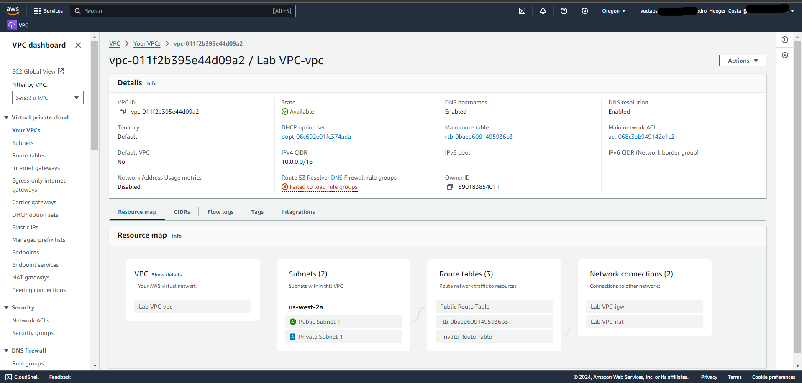
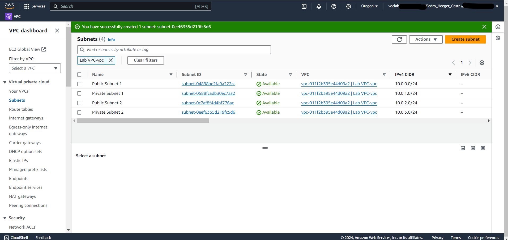
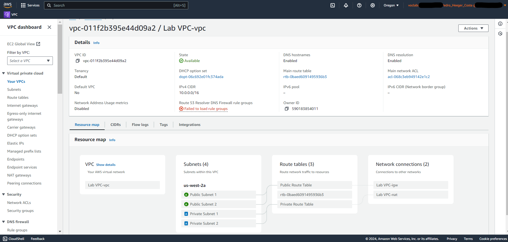
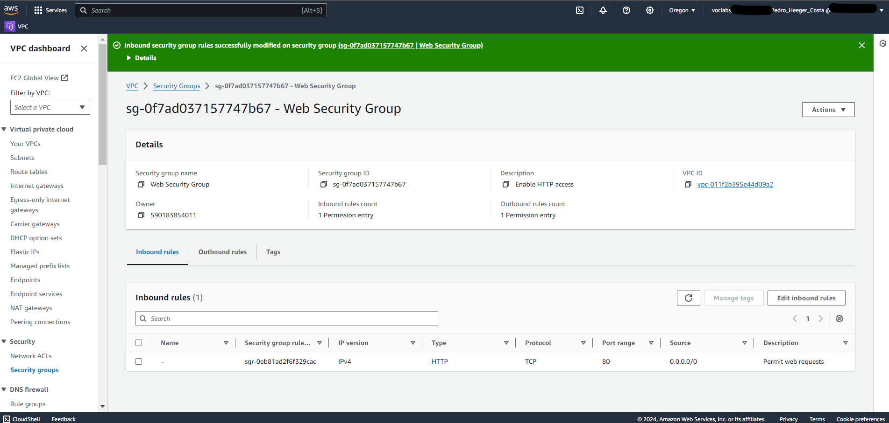
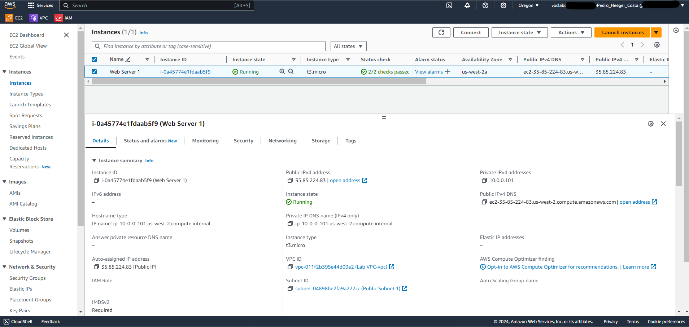
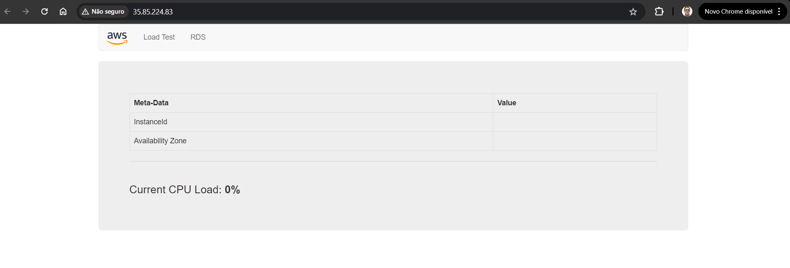

# Bootcamp AWS re/Start-Cloud Computing - Module 2   

### Repository: [boot](../../../../)   
### Platform: <a href="../../../">edn   </a> 
### Software/Subject: <a href="../../">aws    </a>
### Bootcamp: <a href="../">boot_022 (Bootcamp AWS re/Start-Cloud Computing)   </a>
### Module: 2. Redes 

---

This folder refers to Module 2 **Redes** from bootcamp [**Bootcamp AWS re/Start-Cloud Computing**](../).

### Theme:
- Cloud Computing

### Used Tools:
- Operating System (OS): 
  - Linux   
  - Windows 11   
- Linux Distribution: 
  - Amazon Linux   
- Virtualization: 
  - Vocareum   
- Cloud:
  - AWS   
- Cloud Services:
  - Amazon Elastic Compute Cloud (EC2)   
  - Amazon Virtual Private Cloud (VPC)   
  - Google Drive   
- Language:
  - HTML   
  - Markdown   
- Integrated Development Environment (IDE) and Text Editor:
  - Visual Studio Code (VS Code)   
- Versioning: 
  - Git   
- Repository:
  - GitHub   

---

### Bootcamp Module 2 Structure

2. <a name="item2">Redes</a><br>
  2.1. <a href="#item2.1">Redes na Nuvem AWS</a><br>
  2.2. <a href="#item2.2">267-[NF]-Lab - Criar a sua VPC e iniciar um servidor Web</a><br>

---

### Objective:
O objetivo deste módulo do bootcamp foi aprender sobre como funciona as redes na cloud da **AWS**, apresentando o serviço voltado para isso que é o **Amazon Virtual Private Cloud (Amazon VPC)**. Também foi ensinado como construir uma VPC com sub-redes pública e privada, gateway de internet e NAT gateway, tabela de rotas, grupo de segurança e provisionar uma instância do **Amazon Elastic Compute Cloud (Amazon EC2)** nesta VPC, acessando ela posteriormente.

### Structure:
A estrutura das pastas obedece a estruturação do bootcamp, ou seja, conforme foi necessário, sub-pastas foram criadas para os cursos específicos deste módulo. Na imagem 01 é exibido a estruturação das pastas. 

<div align="Center"><figure>
    <br>
    <figcaption>Imagem 01.</figcaption>
</figure></div><br>

### Development:
O desenvolvimento deste módulo do bootcamp foi dividido em um curso e um laboratório. Abaixo é explicado o que foi desenvolvido em cada uma dessas atividades.

<a name="item2.1"><h4>2.1 Redes na Nuvem AWS</h4></a>[Back to summary](#item2) | <a href="">Certificate</a>

O **Amazon Virtual Private Cloud (Amazon VPC)**, chamado também de nuvem privada virtual, é o serviço que pode ser usado para provisionar uma seção logicamente isolada da nuvem **AWS**. Com uma **Amazon VPC**, é possível iniciar recursos da **AWS** em uma rede virtual construída. Uma VPC fornece controle sobre seus recursos de rede virtual, incluindo: seleção do intervalo de endereços IP, criação de sub-redes, configuração de tabelas de rotas e gateways de rede; permite personalizar a configuração da rede; permite usar várias camadas de segurança. A utilização da **Amazon VPC** para criação de uma rede virtual possibilita uma maior economia do que construir essa rede fisicamente em um data center, pagando somente o que for utilizado. Além disso, ela contribui com a segurança, é dimensionável e confiável, e funciona com vários serviços inovadores da AWS e de terceiros. Uma VPC está logicamente isolada de outras VPCs, pertence a uma única Região **AWS** e pode abranger várias Zonas de Disponibilidade.

Ao criar uma VPC, deve ser especificado o intervalo de endereços IPv4 escolhendo um bloco CIDR, como `10.0.0.0/16`. O intervalo de endereços de uma **Amazon VPC** pode ser tão grande quanto /16 (65.536 endereços) ou tão pequeno quanto /28 (16 endereços). Os intervalos de IPs privados devem ser usados de acordo com o guia *RFC 1918*, 10.0.0.0 à 10.255.255.255, 172.16.0.0 à 172.31.255.255 e 192.168.0.0 à 192.168.255.255. O menor tamanho de bloco permitido é /28 e o maior é /16. Embora seja possível usar um bloco CIDR publicamente roteável fora do intervalo privado, isso não é recomendado. Essa prática pode gerar problemas se você estiver utilizando recursos que são roteáveis publicamente na internet.

Conceitos importantes de uma VPC: Bloco CIDR: defina um intervalo privado de /16 a /28; Sub-redes: aloque um intervalo de endereços IP na sua VPC; Tabela de rota: regras (também conhecidas como rotas) que a VPC utiliza para rotear tráfego;  Endpoint de VPC: uma conexão privada entre serviços da AWS sem necessidade da internet.

Os componentes a seguir podem ser utilizados para configurar redes em uma **Amazon VPC**: VPC; Gateway de internet; Gateway de conversão de endereços de rede (NAT); Tabela de rota; Sub-redes pública e privada; Grupos de segurança; ACLs de rede. Um *gateway de internet* permite a comunicação da VPC com a internet. Este pode ser dimensionado horizontalmente para atender às necessidades de tráfego, ser redundante e ser altamente disponível. Em um gateway de internet, a sub-rede pública associada a uma tabela de rota tem uma rota para este gateway. A rota será `0.0.0.0/0` e o alvo `IGW-xxxxx`. Um *endereço de IP público* é necessário para que as instâncias se comuniquem pela internet, devendo elas terem um endereço IPv4 público ou um endereço IP elástico. 

Um *gateway NAT* permite que instâncias na sub-rede privada se conectem a recursos fora da VPC. Contudo, nada de fora da VPC consegue iniciar uma conexão. Se uma tentativa de conexão externa for feita, o gateway NAT enviará um sinalizador RESET para indicar que a conexão foi recusada. O gateway NAT recebe um endereço IP elástico, que é um endereço IP público e está localizado na sub-rede pública. Na tabela de rota associada para a sub-rede privada, a rota será `0.0.0.0/0` e o alvo será `nat-xxxxx`. Devido ao gateway NAT, as instâncias na sub-rede privada não precisam de um endereço IP público.

A tabela de rotas contém rotas e alvos que direcionam o tráfego de rede na VPC, associando as sub-redes aos gateways. O destino é um endereço IP e intervalo CIDR (por exemplo, 0.0.0.0/0, que é a internet). Já o alvo é um gateway ou uma interface de rede que direciona o tráfego para o destino especificado. Cada tabela de rota deve ser associada a uma sub-rede.

Uma sub-rede é um intervalo de endereços IP dentro da VPC. Há uma sub-rede por Zona de Disponibilidade porque uma sub-rede não pode abranger várias zonas. Na sub-rede pública, o tráfego é direcionado a um gateway de internet ao ter uma tabela de rota associada a um gateway de internet como uma rota. Já na sub-rede privada, o tráfego não é direcionado para a internet. Se mais de uma sub-rede for criada em uma VPC, os blocos CIDR das sub-redes não poderão se sobrepor.

O grupo de segurança é um firewall na instância do **Amazon EC2** que controla o tráfego de entrada. Os grupos de segurança por padrão são stateful, o que significa que se as solicitações da instância forem enviadas, o tráfego de resposta poderá voltar sem a necessidade de permissão, independentemente das regras de entrada. Um grupo de segurança bloqueia todo tráfego por padrão, para liberar um tráfego é necessário permitir o protocolo, o intervalo de portas, o tipo de ICMP (Internet Control Message Protocol) e a origem ou o destino.

A lista de controle de acesso à rede, ou ACL de rede, atua como um firewall na sub-rede. Por padrão, ela é stateless, no qual o tráfego de saída deve ser permitido de volta. Uma ACL padrão permite todo tráfego, mas é possível criar regras para permitir ou negar tráfego. Já uma ACL personalizada nega todo tráfego, ou seja, bloqueia ou nega todo tráfego (de entrada e saída) até adicionar regras. As ACL de rede têm regras de entrada e saída separadas e cada regra pode permitir ou negar tráfego em incrementos de 10 ou 100.

<a name="item2.2"><h4>2.2 267-[NF]-Lab - Criar a sua VPC e iniciar um servidor Web</h4></a>[Back to summary](#item2) | <a href="">Certificate</a>

Neste laboratório realizado no sandbox **Vocareum**, foi utilizado a **Amazon Virtual Private Cloud (Amazon VPC)** para criar uma VPC e adicionar componentes adicionais a ela para produzir uma rede personalizada para um cliente fictício Fortune 100. Também foi um criado grupo de segurança dentro dessa rede para a instância do **Amazon EC2**. Em seguida, foi configurado e personalizado essa instância do EC2 para executar um servidor web e iniciar na VPC construída.

A tarefa inicial foi criar a VPC com duas sub-redes na mesma zona de disponibilidade, sendo uma pública e outra privada, um gateway de internet e um NAT gateway. A VPC criada possuía o IPv4 CIDR como `10.0.0.0/16` e não tinha nenhum bloco CIDR IPv6. O tenancy escolhido foi o padrão, o numéro de Zonas de Disponibilidade foi uma que foi `us-west-2a` (Oregon) para as duas sub-redes, o número de sub-rede pública e privada também foi uma nesse primeiro momento, sendo o CIDR da sub-rede pública `10.0.0.0/24` e o CIDR da sub-rede privada `10.0.1.0/24`. Também foi definido o gateway NAT como um e não foi escolhido endpoint da VPC.

A tag de nome da VPC foi `Lab VPC`, a sub-rede pública foi chamada de `Public Subnet 1`, enquanto a privada de `Private Subnet 1`. Nas tabelas de rota, duas tabelas de rotas foram elaboradas uma para cada sub-rede, tendo os seguintes nomes: `Public Route Table` e `Private Route Table`. Após isso, a VPC foi criada e a imagem 02 abaixo evidencia essa construção. Talvez seja preciso criar a VPC com as sub-redes e tabelas de rotas primeiro, para depois alterar as tags de nome desses recursos.

<div align="Center"><figure>
    <br>
    <figcaption>Imagem 02.</figcaption>
</figure></div><br>

Na segunda tarefa deste laboratório, duas sub-redes adicionais foram criadas em uma outra Zona de Disponibilidade, também sendo uma pública e outra privada. A segunda sub-rede pública foi criada vinculada a VPC já construída, o nome dela foi `Public Subnet 2`, o CIDR IPv4 foi `10.0.2.0/24` e não houve preferência da AZ, ou seja, foi decidido automaticamente. A segunda sub-rede privada teve as mesmas características, só alterando o nome para `Private Subnet 2` e o CIDR IPv4 para `10.0.3.0/24`. A imagem 03 a seguir ilustra a construção dessas sub-redes adicionais.

<div align="Center"><figure>
    <br>
    <figcaption>Imagem 03.</figcaption>
</figure></div><br>

Na tarefa de número 3 foi realizado a associação dessas sub-redes adicionais aos gateways incluindo nas duas tabela de rotas existentes. A sub-rede pública na tabela de rota `Public Route Table` e a sub-rede privada na tabela de rota `Private Route Table`. Neste momento a VPC tinha sub-redes públicas e privadas configuradas em duas Zonas de Disponibilidade. A imagem 04 exibe as tabelas de rotas com sub-redes públicas e privadas para cada tabela.

<div align="Center"><figure>
    <br>
    <figcaption>Imagem 04.</figcaption>
</figure></div><br>

Na quarta tarefa, o objetivo foi criar um grupo de segurança dessa VPC que serviria de firewall para a instância do EC2 que seria provisionada. O nome do grupo de segurança foi `Web Security Group`, a descrição foi `Enable HTTP access` e este foi vinculado a VPC `Lab VPC`. Uma regra de entrada foi elaborada sendo do tipo `HTTP`, a origem de qualquer endereço de IP (`0.0.0.0/0`), a descrição foi `Permit web requests`. Na imagem 05 o grupo de segurança com sua respectiva regra é apresentado.

<div align="Center"><figure>
    <br>
    <figcaption>Imagem 05.</figcaption>
</figure></div><br>

Por fim, na última tarefa, o propósito foi construir uma instância do **Amazon EC2** que utilizaria o grupo de segurança e uma sub-rede pública dessa VPC. A tag de nome foi `Web Server 1`, a imagem de maquina (AMI) foi `ami-06efb824bfe850db6` (Amazon Linux 2 Kernel 5.10 AMI 2.0.20240521.0 x86_64 HVM gp2), o tipo de instância foi `t3.micro` e o par de chaves foi escolhido o `vockey`, que provavelmente deve ter sido criado automaticamente ao iniciar o laboratório. Nas configurações de rede a VPC `Lab VPC` foi selecionada, a sub-rede escolhida poderia ser qualquer uma das duas públicas, a opção de atribuir IP automaticamente foi habilitada e o grupo de segurança escolhido foi o `Web Security Group`. Em user data foi passado o script **Bash** abaixo para instalar o servidor web **Apache HTTP (Httpd)** e baixar a página **HTML** que substituiria a padrão do servidor Apache.

```bash
#!/bin/bash
#Install Apache Web Server and PHP
yum install -y httpd mysql php
#Download Lab files
wget https://aws-tc-largeobjects.s3.us-west-2.amazonaws.com/CUR-TF-100-RESTRT-1/267-lab-NF-build-vpc-web-server/s3/lab-app.zip
unzip lab-app.zip -d /var/www/html/
#Turn on web server
chkconfig httpd on
service httpd start
```

Após isso, a instância foi iniciada e foi aguardado até que a verificação de status fosse concluída, conforme mostrado na imagem 06. Em seguida, o IP ou DNS público dessa instância foi copiado e utilizado em um navegador da web na maquina física **Windows** para acessar a aplicação. Caso ainda não consiga visualizar a aplicação no navegador, o tráfego pode ter sido direcionado para a porta `443`,que é onde opera o protocolo `HTTPS`, portanto tire o `S` do `HTTPS` para forçar o navegador a acessar a aplicação na porta `80`, onde opera o protocolo `HTTP`, que foi este o liberado no grupo de segurança vinculado a instância. O HTTPS é a versão segura do Hypertext Transfer Protocol (HTTP) e utiliza a criptografia para proteger a comunicação entre o navegador e o servidor. Então ao acessar a aplicação pela porta `80` não há segurança na comunicação, com isso o fornecimento de dados sensiveis deve ser sempre evitado. A imagem 07 exibe a aplicação sendo acessada pelo navegador da maquina física.

<div align="Center"><figure>
    <br>
    <figcaption>Imagem 06.</figcaption>
</figure></div><br>

<div align="Center"><figure>
    <br>
    <figcaption>Imagem 07.</figcaption>
</figure></div><br>