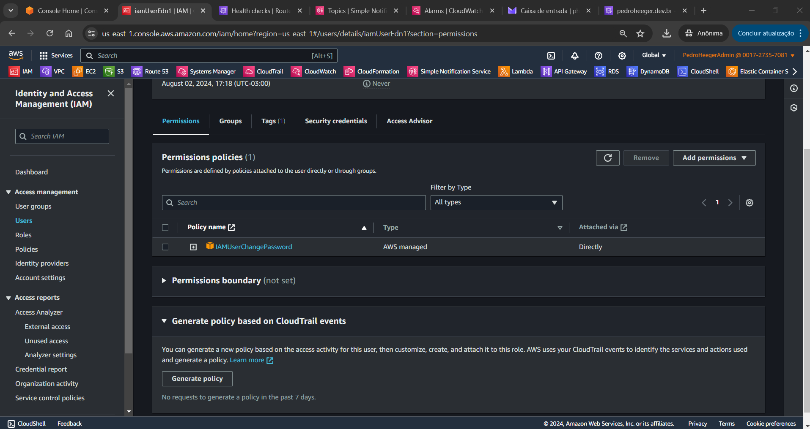

# Bootcamp AWS re/Start-Cloud Computing - Module 3   

### Repository: [boot](../../../../)   
### Platform: <a href="../../../">edn   </a> 
### Software/Subject: <a href="../../">aws    </a>
### Bootcamp: <a href="../">boot_022 (Bootcamp AWS re/Start-Cloud Computing)   </a>
### Module: 3. Redes 

---

This folder refers to Module 3 **Redes** from bootcamp [**Bootcamp AWS re/Start-Cloud Computing**](../).

### Theme:
- Cloud Computing

### Used Tools:
- Operating System (OS): 
  - Linux   
  - Windows 11   
- Linux Distribution: 
  - Amazon Linux   
- Virtualization: 
  - Vocareum   
- Cloud:
  - AWS   
- Cloud Services:
  - Amazon Elastic Compute Cloud (EC2)   
  - Amazon Virtual Private Cloud (VPC)   
  - Google Drive   
- Language:
  - HTML   
  - Markdown   
- Integrated Development Environment (IDE) and Text Editor:
  - Visual Studio Code (VS Code)   
- Versioning: 
  - Git   
- Repository:
  - GitHub   

---

### Bootcamp Module 3 Structure

3. <a name="item2">Introdução à segurança</a> 
  3.1. <a href="#item3.1">Introdução à segurança</a> 
  3.2. 282-[SF]-KC - Introdução à segurança 
  3.3. <a href="#item3.3">Security groups da AWS</a> 
  3.4. <a href="#item3.4">AWS IAM</a> 
  3.5. <a href="#item3.5">279-[SF]-Lab - Introdução ao gerenciamento de identidade e acesso (IAM)</a> 
  3.6. 288-[SF]-KC - Prevenção: Gerenciamento de identidades 

---

### Objective:
O objetivo deste módulo do bootcamp foi aprender sobre como funciona as redes na cloud da **AWS**, apresentando o serviço voltado para isso que é o **Amazon Virtual Private Cloud**. Também foi ensinado como construir uma VPC com sub-redes pública e privada, gateway de internet e NAT gateway, tabela de rotas, grupo de segurança e provisionar uma instância do **Amazon Elastic Compute Cloud (EC2)** nesta VPC, acessando ela posteriormente.

### Structure:
A estrutura das pastas obedece a estruturação do bootcamp, ou seja, conforme foi necessário, sub-pastas foram criadas para os cursos específicos deste módulo. Na imagem 01 é exibido a estruturação das pastas. 

<figure>
     
    <figcaption>Imagem 01.</figcaption>
</figure>
 

### Development:
O desenvolvimento deste módulo do bootcamp foi dividido em um curso e um laboratório. Abaixo é explicado o que foi desenvolvido em cada uma dessas atividades.

<a name="item3.1"><h4>3.1 Introdução à segurança</h4></a>[Back to summary](#item3) | <a href="">Certificate</a>

Ao avaliar a segurança da informação, é importante considerar as três perspectivas a seguir: Confidencialidade, que é quando os dados privados estão protegidos para impedir o acesso não autorizado; Integridade, que ocorre quando existem medidas para garantir que os dados não tenham sido adulterados e sejam corretos e autênticos; Disponibilidade, que é quando os usuários autorizados conseguem acessar os dados quando precisam deles. Esta três perspectivas formam a tríade CIA.

A segurança de TI, ou segurança cibernética, tem como objetivo proteger computadores, redes, programas e dados contra acessos, alterações ou destruições acidentais ou maliciosas. Além disso, a segurança cibernética busca assegurar que as funções empresariais e tarefas pessoais possam ser realizadas com mínima interferência e mantendo uma taxa de produção adequada. A falta de segurança deixa a equipe e as organizações abertas para os seguintes riscos de segurança: roubo de identidade, roubo de dados, perda de serviços e recursos de rede, perda ou danos à reputação comercial, sabotagem ou espionagem corporativa.

O roubo de identidade é um evento tem como alvo informações de identificação pessoal (PII), como: nome, data de nascimento, senhas, conta bancária e números de cartão de crédito. O roubo de dados acontece quando um ladrão rouba dados confidenciais da empresa ou propriedade intelectual (IP) e tenta vender os dados ou pedir um resgate para devolvê-los ao proprietário. A perda de serviços ou recursos de rede ocorre quando os eventos têm como alvo serviços de rede. Se esses serviços forem interrompidos, isso poderá afetar a capacidade de uma organização de conduzir negócios. Já sabotagem ou espionagem corporativa acontece quando uma empresa rival realiza espionagem para obter uma vantagem sobre a concorrência. Um funcionário insatisfeito pode lançar um evento de dentro da empresa para tentar sabotá-la. A perda ou danos à reputação comercial pode acontecer em qualquer um desses eventos. Se a capacidade da empresa de fornecer seus serviços for interrompida, os clientes poderão levar seus negócios para outro lugar. O roubo de propriedade intelectual pode prejudicar a capacidade da empresa de adquirir participação de mercado. Ou uma empresa pode perder dados de clientes, fazendo com que seus clientes fiquem sujeitos a roubo de identidade.

A segurança apropriada ajuda a mitigar os seguintes tipos de ameaças: Malware; Eventos de senha (dicionário, força bruta); Negação de serviço distribuída (DDoS); Man-in-the-middle (MitM); Phishing; Engenharia social; Drive-by. Malware é um software projetado para prejudicar, danificar ou obter acesso não autorizado a um sistema de computador. Os eventos de senha referem-se aos processos de recuperação de senhas de dados que foram armazenados ou transmitidos por um sistema de computador. Negação de serviço distribuído (DDoS) ocorre quando vários sistemas comprometidos são usados para comprometer um único sistema. Man-in-the-middle é quando uma parte externa transmite secretamente a comunicação entre duas partes, que acreditam que estão se comunicando diretamente entre si. O Phishing acontece quando uma parte externa envia mensagens de e-mail que fingem ser uma empresa legítima para obter informações pessoais, como senhas ou números de cartão de crédito. A Engenharia social é um evento que usa a interação humana para manipular uma pessoa a fim de violar procedimentos de segurança, obter acesso a detalhes de segurança e invadir sistemas. Drive by é quando os cibercriminosos usam sites não seguros para plantar códigos maliciosos que são baixados automaticamente para os computadores dos usuários. Já o Ataque ao Dicionário utiliza uma lista de palavras predefinidas, como senhas comuns ou palavras do dicionário, para tentar fazer login em um sistema. Esses ataques tentam todas as palavras da lista até encontrar a senha correta.

A segurança pode ser dividida em algumas áreas específicas como: Segurança do sistema, Segurança de infraestrutura, Gerenciamento de acesso, Gerenciamento de identidades, Segurança de dados, Segurança de software, Segurança física, Segurança administrativa. A segurança do sistema envolve proteger sistemas e dispositivos contra ameaças, vulnerabilidades e acessos não autorizados para garantir a integridade, confidencialidade e disponibilidade dos dados. A segurança da infraestrutura envolve proteger os componentes físicos e virtuais de uma rede, incluindo servidores, dispositivos, data centers e sistemas de rede, contra acessos não autorizados, ataques e desastres. O gerenciamento de acesso consiste em controlar quem tem acesso aos recursos, garantindo que apenas indivíduos autorizados possam acessar o ambiente, aumentando assim a segurança (Autorização). O gerenciamento de identidades envolve a administração de informações de usuário e suas autenticações para assegurar que somente pessoas autorizadas acessem os recursos apropriados (Autenticação). A segurança dos dados envolve implementar medidas e práticas para proteger dados contra acessos não autorizados, corrupção, roubo e perda, garantindo sua confidencialidade, integridade e disponibilidade. A segurança de software envolve o desenvolvimento e a implementação de medidas para proteger aplicativos e programas contra vulnerabilidades, ataques maliciosos e falhas, garantindo a integridade e a confiabilidade do software. A segurança física envolve controlar o acesso físico aos recursos para prevenir acessos mais amplos ou inadvertidos. A segurança administrativa abrange políticas, procedimentos e controles que visam proteger os recursos de uma organização, descrevendo como configurar e gerenciar todas as estratégias de segurança, garantindo que apenas indivíduos autorizados tenham acesso a informações sensíveis e privilegiadas, e que as operações sejam realizadas de maneira segura e eficiente.

Os controles de segurança são categorizados em três tipos: preventivo, detectivo e corretivo, correspondendo cada um deles a diferentes fases do ciclo de vida da segurança. Cada tipo de controle envolve a implementação de medidas de segurança física, técnica e administrativa para garantir a confidencialidade, integridade e disponibilidade (CIA) das informações. O ciclo de vida da segurança envolve várias etapas: Prevenção (identificação de propriedades, avaliação de riscos e implementação de contramedidas), Detecção (monitoramento e identificação de problemas de segurança), Resposta (ação sobre problemas e atualização de planos) e Análise (gestão e correção de problemas). 

Os Frameworks de conformidade, que são conjuntos de diretrizes e melhores práticas para garantir a conformidade com requisitos regulatórios e de segurança, incorporam uma variedade de regulamentos, incluindo os normativos (baseados em país ou setor) e contratuais (como SLAs e PLAs). Esses regulamentos, que exigem a implementação de controles de segurança específicos, são parte integrante dos frameworks de conformidade. Os frameworks fornecem uma estrutura para o desenvolvimento e implementação de políticas e controles de segurança alinhados com os objetivos de conformidade da organização. Dessa forma, os frameworks de conformidade auxiliam as organizações na garantia de conformidade com as leis e regulamentos aplicáveis, reduzindo os riscos de violações de segurança. O Acordo de Nível de Serviço (SLA) especifica os termos e condições de prestação de um serviço entre fornecedor e cliente, enquanto o Acordo de Trabalho do Projeto (PLA) define as responsabilidades, entregas e cronogramas para um projeto específico.

A seguir, estão algumas organizações dedicadas à elaboração de padrões visando assegurar a conformidade com os requisitos de segurança cibernética e a adoção de melhores práticas para proteger sistemas e dados contra ameaças: National Institute of Standards and Technology (NIST), Agência da União Europeia para a Segurança Cibernética (ENISA), European Telecommunications Standards Institute (ETSI), International Organization for Standardization (ISO), Internet Engineering Task Force (IETF), Institute of Electrical and Electronics Engineers (IEEE), Committee of Sponsoring Organizations (COSO). Existem outras organizações que também se dedicam à elaboração de padrões visando a segurança, não especificamente segurança cibernética, mas voltada a dados e informações, alguns desses padrões de conformidade são: setor de cartões de pagamento (PCI); Regulamento Geral de Proteção de Dados (RGPD) ou General Data Protection Regulation (GDPR), que é um conjunto de regulamentos criados para fornecer aos cidadãos da União Europeia (UE) um controle mais aprimorado sobre sua privacidade e segurança de dados; Lei de portabilidade e responsabilidade do seguro de saúde nos EUA, a HIPAA, elaborada em 1996, ela modernizou o manuseio de informações de saúde, estipulando como as informações de identificação pessoal devem ser protegidas; Lei federal russa sobre dados pessoais; Lei de segurança cibernética da República Popular da China; além de outros padrões.

A conformidade é exigida pelo governo e leis, acarretando punições civis, criminais ou financeiras em caso de não cumprimento. Nos padrões abertos, a conformidade é necessária para participação, podendo resultar em punições financeiras ou negação de participação. Por outro lado, para as práticas recomendadas, a conformidade é opcional, mas o não cumprimento pode levar à perda de clientes, parceiros ou receita. Em todas essas instâncias, relatórios adequados são essenciais para demonstrar a conformidade.

<a name="item3.3"><h4>3.3 Security groups da AWS</h4></a>[Back to summary](#item3) | <a href="">Certificate</a>

Na **AWS**, os *security groups* atuam como um firewall para instâncias associadas do **Amazon Elastic Compute Cloud (EC2)**, controlando tanto os tráfegos de entrada como os de saída no nível da instância. Com esses security groups, o usuário tem controle total sobre o nível de acesso das suas instâncias. No nível mais básico, um security group é apenas outro método de filtrar o tráfego direcionado às instâncias, fornecendo controle sobre qual tráfego permitir ou negar. Para determinar quem tem acesso às instâncias, é necessário configurar uma regra de security group, que podem variar, desde manter a instância totalmente privada até totalmente pública. Por outro lado, as network access control lists (NACLs), ou *listas de controles de acesso à rede (ACLs de rede)*, atuam como um firewall para sub-redes associadas, controlando o tráfego de entrada e de saída no nível da sub-rede. 

Os security groups são stateful, mas as ACLs de rede são stateless. Stateful significa que o computador rastreia o estado da interação, geralmente definindo valores em uma configuração de armazenamento designada para essa finalidade, logo só é necessário a permissão quando o tráfego entra, pois ao sair o computador já conhece esse tráfego. Stateless significa que nenhuma informação é retida pelo remetente ou pelo destinatário. Cada solicitação de interação deve ser tratada inteiramente com base nas informações que a acompanham. Dessa forma, o tráfego tem que ser permitido quando entra e também quando saí.

O **Amazon EC2** utiliza criptografia de chave pública para criptografar e descriptografar as informações de login. Nesse método, uma chave pública criptografa os dados, e o destinatário usa uma chave privada correspondente para descriptografá-los. Esse par de chaves consiste em uma chave pública e uma chave privada. Para acessar uma instância, é necessário criar um par de chaves e especificá-lo ao iniciar a instância pela primeira vez, em seguida, fornecer chave privada para se conectar à instância. Em instâncias **Linux**, não há senha, então é utilizado um par de chaves para fazer login usando o *Secure Shell (SSH)*. Em instâncias **Microsoft Windows** o par de chaves é necessário para obter a senha do administrador e fazer login via *Remote Desktop Protocol (RDP)*.

<a name="item3.4"><h4>3.4 AWS IAM</h4></a>[Back to summary](#item3) | <a href="">Certificate</a>

O **AWS Identity and Access Management (IAM)** permite gerenciar o acesso aos serviços e recursos da **AWS** com segurança. Ao usar o IAM, é possível criar e gerenciar usuários e grupos da **AWS** (para auxiliar na autenticação) e usar permissões para permitir e negar acesso aos recursos da **AWS** (para auxiliar na autorização). O IAM usa conceitos de controle de acesso, como usuários, grupos e permissões, para que seja possível especificar quais usuários podem acessar serviços específicos. O IAM é utilizado para configurar a autenticação, que é a primeira etapa, e por aplicativos e outros serviços da **AWS** para acesso. Na autenticação, ele verifica quem pode acessar os recursos da **AWS**. O IAM também configura a autorização baseada no usuário. A autorização, definida através de políticas, determina quais recursos os usuários podem acessar e o que podem fazer com esses recursos. Uma política é um objeto na **AWS** que define permissões quando associado a uma identidade ou recurso.

O IAM reduz a necessidade de compartilhar senhas ou chaves de acesso ao conceder direitos de acesso a outras pessoas ou sistemas. Isso também facilita a ativação ou a desativação do acesso de um usuário. O IAM permite a gestão centralizada do acesso, controlando quem pode iniciar, configurar, gerenciar e finalizar recursos. Além disso, fornece controle granular sobre as permissões de acesso a usuários, sistemas ou outros aplicativos que podem fazer chamadas programáticas para outros recursos da **AWS**. 

Ao criar uma conta da **AWS** pela primeira vez, é definido uma identidade de login único. Essa entidade tem acesso completo a todos os serviços e recursos da **AWS** na conta e é chamada de usuário raiz (root user) da conta da **AWS**. Cada conta da **AWS** tem um usuário raiz de conta atribuído. O usuário raiz da conta é acessado ao fazer login com o endereço de e-mail e a senha usados para criar a conta, e este usuário possui o endereço de e-mail atribuído para fins de comunicação e recuperação da conta. Não é possível controlar as permissões das credenciais de usuário raiz da conta da **AWS** e é por isso que a **AWS** recomenda enfaticamente que não seja utilizada as credenciais de usuário raiz da conta da **AWS** para interações do dia a dia com a **AWS**. Em vez disso, siga as práticas recomendadas de uso do usuário raiz da conta e apenas o utilize para criar o primeiro usuário do IAM. Depois, bloqueie com segurança as credenciais de usuário raiz da conta. Apenas utilize o usuário raiz da conta quando precisar executar as poucas tarefas de gerenciamento de contas e serviços que não podem ser realizadas de outras maneiras.

O princípio do privilégio mínimo é um conceito importante na segurança do computador, pois ele define que primeiro deve ser determinado o que os usuários e funções precisam fazer para então depois criar as políticas que permitam que eles executem apenas essas tarefas. Deve ser concedido o mínimo de permissões e conforme necessário permissões adicionais serão concedidas. Isso é uma prática mais segura do que começar com permissões que são muito lenientes e tentar restringi-las posteriormente.

Alguns tipos de credenciais de segurança são: endereço de e-mail e senha, estes são associados à conta raiz da **AWS**; nome de usuário e senha do IAM, utilizados para acessar o console de gerenciamento da **AWS**; chaves de acesso e chaves de acesso secretas, estas são utilizadas normalmente com a **AWS Command Line Interface (AWS CLI)** e solicitações programáticas, como interfaces de programação de aplicativo (APIs) e Kits de Desenvolvimento de Software (SDKs); Multi-Factor Authentication (MFA), é uma camada extra de segurança, que pode ser ativada para usuários raiz da conta da **AWS** e usuários do IAM; pares de chaves, este são usados apenas para serviços da **AWS** específicos, como o **Amazon EC2**.

<a name="item3.5"><h4>3.5 Demonstração do AWS IAM</h4></a>[Back to summary](#item3) | <a href="">Certificate</a>

<a name="item3.6"><h4>3.6 279-[SF]-Lab - Introdução ao gerenciamento de identidade e acesso (IAM)</h4></a>[Back to summary](#item3) | <a href="">Certificate</a>

<a name="item3.8"><h4>3.8 AWS Cloudtrail</h4></a>[Back to summary](#item3) | <a href="">Certificate</a>

O **AWS CloudTrail** é um serviço da web que registra chamadas da interface de programação de aplicativo (API) da **AWS** para a conta do usuário e entrega a ele arquivos de log. O CloudTrail é uma ferramenta crucial para simplificar a governança, a conformidade e a auditoria de riscos. Tudo na **AWS** é uma chamada de API. O CloudTrail registra as chamadas de API feitas em uma conta da **AWS** entre as regiões **AWS**. Ele faz isso se essa ação foi executada usando a **AWS Console Management**, **AWS Command Line Interface (AWS CLI)**, **AWS Software Development Kit (SDK)** ou diretamente por meio de uma API. Os logs de serviço incluem ações como: Iniciar e interromper instâncias; Criar ou modificar bancos de dados do **Amazon Relational Database Service (AmazonRDS)**; Fazer upload de um arquivo para o **Amazon Simple Storage Service (S3)**. Esses registros acelera a análise de problemas operacionais e de segurança ao disponibilizar visibilidade sobre as ações na conta da **AWS**.

Os benefícios do **AWS CloudTrail** são diversos, alguns dos principais são: aumento da visibilidade da atividade de usuários e recursos. Com essa visibilidade, o usuário pode identificar quem fez o quê e quando em sua conta da **AWS**; As auditorias de conformidade são simplificadas porque as atividades são registradas e armazenadas automaticamente nos logs de eventos. O registro de atividades permite pesquisar dados de log, identificar ações que não estão em conformidade, acelerar investigações sobre incidentes e, então, agilizar uma resposta; Como o usuário é capaz de capturar um histórico abrangente de alterações feitas em sua conta, é possível analisar e solucionar problemas operacionais relacionados a ela.

O **AWS CloudTrail** funciona da seguinte forma, primeiro uma atividade acontece na conta. Em seguida, o CloudTrail captura e registra essa atividade, que é chamada de evento do CloudTrail. O evento contém detalhes sobre o seguinte: Quem realizou a solicitação; Data e horário da solicitação; Endereço IP (Protocolode Internet) de origem; Como a solicitação foi feita; Ação executada; Região onde a ação foi realizada; Resposta. Por padrão, os logs são armazenados por 7 dias. O usuário pode enviar o log de atividades para outros serviços da **AWS**. Portanto, é possível reter o histórico de atividades pelo tempo que quiser.

Algumas das práticas recomendadas do **AWS CloudTrail** são: ativar a validação de arquivos de log do CloudTrail para validar a integridade dos arquivos de log detectando se eles foram alterados ou excluídos após o envio ao bucket do S3; agregar arquivos de log a um único bucket do S3; certificar de que o CloudTrail esteja ativado globalmente na **AWS**, assim uma configuração que se aplique a todas as regiões significa que todas as configurações serão aplicadas de modo consistente em todas as regiões atuais e recém-criadas; restingir o acesso aos buckets do S3 do CloudTrail, habilitando a autenticação multifator (MFA) para excluir um bucket do CloudTrail; integrar com o **Amazon CloudWatch**.

A integração do CloudTrail ao **Amazon CloudWatch** permite definir ações a serem executadas quando o CloudTrail registrar eventos específicos. O CloudWatch é um serviço de monitoramento para recursos da nuvem **AWS**, que pode ser utilizado para coletar e monitorar métricas, coletar e monitorar arquivos de log, definir alarmes e reagir automaticamente a alterações nos recursos da **AWS**. A integração do CloudTrail ao CloudWatch também fornece um histórico de eventos abrangente, seguro e pesquisável das atividades. Essas atividades podem ser originadas do console, dos AWS SDKs, das ferramentas de linha de comando e de outros serviços da **AWS**.

<a name="item3.10"><h4>3.10 AWS Config</h4></a>[Back to summary](#item3) | <a href="">Certificate</a>

O **AWS Config** é um serviço totalmente gerenciado que permite avaliar, analisar e fazer auditoria da configuração dos recursos da **AWS**. Ele fornece monitoramento quase contínuo, avaliação quase contínua, gerenciamento de alterações e solução de problemas operacionais. Os benefícios do **AWS Config** são: fornecer um inventário de recursos da **AWS**, histórico de configuração e notificações de alteração de configuração para proporcionar segurança e governança; fornecer detalhes sobre todas as alterações de configuração; combinar-se com o **AWS CloudTrail**. Com o **AWS Config**, é possível: descobrir os recursos existentes da **AWS**; exportar um inventário completo dos recursos da **AWS** com todos os detalhes de configuração; determinar como um recurso foi configurado em qualquer momento.

Esses benefícios permitem auditoria de conformidade, análise de segurança, rastreamento de alteração de recursos e solução de problemas. Os aspectos específicos de destaque incluem na Detecção: implementação de controles de detecção para identificar e analisar anomalias. Na Conformidade: criação de regras para avaliar a conformidade dos recursos e auxiliar na obtenção de certificações SOC; revisar as alterações nas configurações e nas relações entre os recursos da **AWS**. No controle de acesso: criar funções do IAM que concedam permissões do **AWS Config** para acessar recursos como buckets do S3; criar funções vinculadas ao serviço ligadas ao **AWS Config** que incluam todas as permissões que o Config exige para chamar outros serviços em nome do usuário. Na Criptografia/Dados em repouso: o **AWS Config** cria um item de configuração sempre que detecta uma alteração em um tipo de recurso que está registrando. Os componentes de um item de configuração incluem metadados, atributos, relações, configuração atual e eventos relacionados.

O **AWS Config** funciona da seguinte forma: ocorre uma alteração em um dos recursos da **AWS** e então o mecanismo do **AWS Config** registra e normaliza essa alteração em um formato consistente. O registro da alteração é entregue a um bucket do **Amazon Simple Storage Service (S3)**, onde pode ser acessado por meio das interfaces de programação de aplicativo (APIs) do **AWS Config**. A alteração também pode ser enviada por meio de um serviço de notificação, como o **Amazon Simple Notification Service (SNS)**. Se uma regra do **AWS Config** tiver sido definida para o recurso afetado, o **AWS Config** verificará se a alteração não viola a regra. O **AWS Config** exibe o resultado da avaliação em um painel e este resultado também pode ser enviado ao **Amazon SNS**.

O **AWS Config** também monitora e registra de forma quase contínua as configurações de recursos da **AWS**., sendo possível automatizar a avaliação das configurações registradas em relação às configurações desejadas. Com o **AWS Config**, o usuário pode realizar as seguintes tarefas: recuperar um inventário de recursos da **AWS**; descobrir recursos novos e excluídos; registrar as alterações de configuração de forma quase contínua, determinando a conformidade geral em relação às configurações especificadas pelas diretrizes internas; ser notificado quando as configurações mudarem e analisar os históricos detalhados de configuração de recursos. Todos esses recursos permitem simplificar a auditoria de conformidade, a análise de segurança, o gerenciamento de mudanças e a solução de problemas operacionais.

O **AWS Config** fornece um sistema de regras, onde pode ser usadas as regras existentes da **AWS** e de parceiros da **AWS**. Também é possível definir suas próprias regras personalizadas usando o **AWS Lambda**, que é um serviço da web que permite executar código sem provisionar ou gerenciar servidores. Existe a possibilidade de direcionar regras a recursos específicos, tipos específicos de recursos ou a recursos marcados de uma forma particular. As regras são executadas automaticamente quando esses recursos são criados ou alterados e também podem ser avaliadas periodicamente (por hora, diariamente e assim por diante), uma avaliação quase contínua. É possível configurar regras para verificar se as alterações de configuração são gravadas. Depois de configurar o **AWS Config**, ele fornece um painel para visualizar a conformidade, no qual pode ser utilizado também o painel para identificar alterações nos recursos que possam ser preocupantes. As regras podem procurar qualquer condição desejável ou indesejável. Por exemplo, pode ser definida regras que garantam que: Os volumes do Amazon Elastic Block Store (Amazon EBS) sejam criptografados; As instâncias estejam sendo criadas apenas de imagens de máquina da Amazon (AMIs) aprovadas; Os endereços IP elásticos estão anexados a instâncias; As instâncias do Amazon EC2 estejam sendo marcadas corretamente.

<a name="item3.12"><h4>3.12 AWS Trusted Advisor</h4></a>[Back to summary](#item3) | <a href="">Certificate</a>

<figure>
     
    <figcaption>Imagem 02.</figcaption>
</figure>
 

