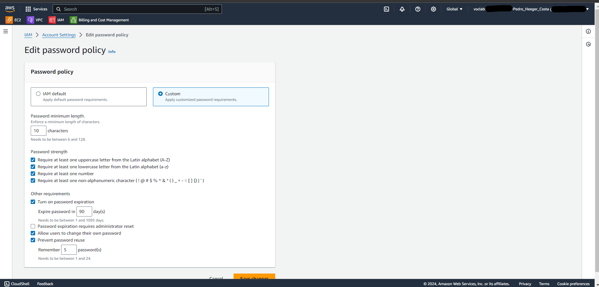
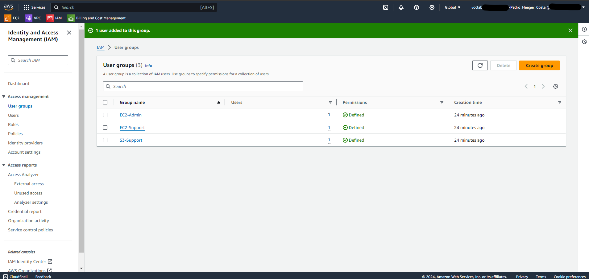
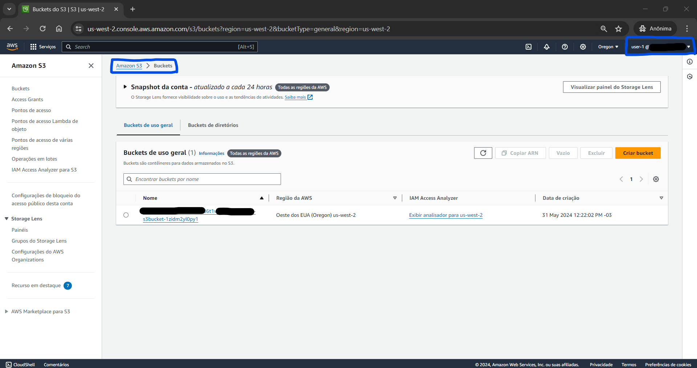

# Bootcamp AWS re/Start-Cloud Computing - Module 3   

### Repository: [boot](../../../../)   
### Platform: <a href="../../../">edn   </a> 
### Software/Subject: <a href="../../">aws    </a>
### Bootcamp: <a href="../">boot_022 (Bootcamp AWS re/Start-Cloud Computing)   </a>
### Module: 3. Introdução à segurança 

---

This folder refers to Module 3 **Introdução à segurança** from bootcamp [**Bootcamp AWS re/Start-Cloud Computing**](../).

### Theme:
- Cloud Computing

### Used Tools:
- Operating System (OS): 
  - Windows 11   
- Virtualization: 
  - Vocareum   
- Cloud:
  - AWS   
- Cloud Services:
  - Amazon Virtual Private Cloud (VPC)   
  - AWS CloudTrail   
  - AWS Config   
  - AWS Identity and Access Management (IAM)   
  - AWS Trusted Advisor   
  - Google Drive   
- Language:
  - HTML   
  - Markdown   
- Integrated Development Environment (IDE) and Text Editor:
  - Visual Studio Code (VS Code)   
- Versioning: 
  - Git   
- Repository:
  - GitHub   

---

### Bootcamp Module 3 Structure

3. <a name="item3">Introdução à segurança</a> 
  3.1. <a href="#item3.1">Introdução à segurança</a> 
  3.2. 282-[SF]-KC - Introdução à segurança 
  3.3. <a href="#item3.3">Security groups da AWS</a> 
  3.4. <a href="#item3.4">AWS IAM</a> 
  3.5. <a href="#item3.5">Demonstração do AWS IAM</a> 
  3.6. <a href="#item3.6">279-[SF]-Lab - Introdução ao gerenciamento de identidade e acesso (IAM)</a> 
  3.7. 288-[SF]-KC - Prevenção: Gerenciamento de identidades 
  3.8. <a href="#item3.8">AWS Cloudtrail</a> 
  3.9. 291-[SF]-KC - AWS CloudTrail 
  3.10. <a href="#item3.10">AWS Config</a> 
  3.11. 292-[SF]-KC - AWS Config 
  3.12. <a href="#item3.12">AWS Trusted Advisor</a> 
  3.13. 295-[SF]-KC - Trusted Advisor 
  3.14. <a href="#item3.14">Práticas recomendadas de segurança</a> 
  3.15. 296-[SF]-KC - Práticas recomendadas de segurança para a criação de conta 
  3.16. <a href="#item3.16">Conformidade de segurança da AWS</a> 
  3.17. <a href="#item3.17">Recursos de segurança da AWS</a> 
  3.18. 297-[SF]-KC - Programa de conformidade de segurança da AWS 
  3.19. 298-[SF]-KC - Recursos de segurança da AWS 

---

### Objective:
O objetivo deste módulo do bootcamp foi introduzir os assuntos de conformidade e segurança na **AWS**, apresentandos serviços como **AWS Identity Access Management (AWS IAM)**, **AWS CloudTrail**, **AWS Config** e **AWS Trusted Advisor**. Também foi ensinado como gerenciar usuários, grupos e políticas através do **AWS IAM**. 

### Structure:
A estrutura das pastas obedece a estruturação do bootcamp, ou seja, conforme foi necessário, sub-pastas foram criadas para os cursos específicos deste módulo. Na imagem 01 é exibido a estruturação das pastas. 

<figure>
     
    <figcaption>Imagem 01.</figcaption>
</figure>
 

### Development:
O desenvolvimento deste módulo do bootcamp foi dividido em dez cursos, um laboratório e oito questionários. Abaixo é explicado o que foi desenvolvido em cada uma dessas atividades.

<a name="item3.1"><h4>3.1 Introdução à segurança</h4></a>[Back to summary](#item3) | <a href="">Certificate</a>

Ao avaliar a segurança da informação, é importante considerar as três perspectivas a seguir: Confidencialidade, que é quando os dados privados estão protegidos para impedir o acesso não autorizado; Integridade, que ocorre quando existem medidas para garantir que os dados não tenham sido adulterados e sejam corretos e autênticos; Disponibilidade, que é quando os usuários autorizados conseguem acessar os dados quando precisam deles. Esta três perspectivas formam a tríade CIA.

A segurança de TI, ou segurança cibernética, tem como objetivo proteger computadores, redes, programas e dados contra acessos, alterações ou destruições acidentais ou maliciosas. Além disso, a segurança cibernética busca assegurar que as funções empresariais e tarefas pessoais possam ser realizadas com mínima interferência e mantendo uma taxa de produção adequada. A falta de segurança deixa a equipe e as organizações abertas para os seguintes riscos de segurança: roubo de identidade, roubo de dados, perda de serviços e recursos de rede, perda ou danos à reputação comercial, sabotagem ou espionagem corporativa.

O roubo de identidade é um evento tem como alvo informações de identificação pessoal (PII), como: nome, data de nascimento, senhas, conta bancária e números de cartão de crédito. O roubo de dados acontece quando um ladrão rouba dados confidenciais da empresa ou propriedade intelectual (IP) e tenta vender os dados ou pedir um resgate para devolvê-los ao proprietário. A perda de serviços ou recursos de rede ocorre quando os eventos têm como alvo serviços de rede. Se esses serviços forem interrompidos, isso poderá afetar a capacidade de uma organização de conduzir negócios. Já sabotagem ou espionagem corporativa acontece quando uma empresa rival realiza espionagem para obter uma vantagem sobre a concorrência. Um funcionário insatisfeito pode lançar um evento de dentro da empresa para tentar sabotá-la. A perda ou danos à reputação comercial pode acontecer em qualquer um desses eventos. Se a capacidade da empresa de fornecer seus serviços for interrompida, os clientes poderão levar seus negócios para outro lugar. O roubo de propriedade intelectual pode prejudicar a capacidade da empresa de adquirir participação de mercado. Ou uma empresa pode perder dados de clientes, fazendo com que seus clientes fiquem sujeitos a roubo de identidade.

A segurança apropriada ajuda a mitigar os seguintes tipos de ameaças: Malware; Eventos de senha (dicionário, força bruta); Negação de serviço distribuída (DDoS); Man-in-the-middle (MitM); Phishing; Engenharia social; Drive-by. Malware é um software projetado para prejudicar, danificar ou obter acesso não autorizado a um sistema de computador. Os eventos de senha referem-se aos processos de recuperação de senhas de dados que foram armazenados ou transmitidos por um sistema de computador. Negação de serviço distribuído (DDoS) ocorre quando vários sistemas comprometidos são usados para comprometer um único sistema. Man-in-the-middle é quando uma parte externa transmite secretamente a comunicação entre duas partes, que acreditam que estão se comunicando diretamente entre si. O Phishing acontece quando uma parte externa envia mensagens de e-mail que fingem ser uma empresa legítima para obter informações pessoais, como senhas ou números de cartão de crédito. A Engenharia social é um evento que usa a interação humana para manipular uma pessoa a fim de violar procedimentos de segurança, obter acesso a detalhes de segurança e invadir sistemas. Drive by é quando os cibercriminosos usam sites não seguros para plantar códigos maliciosos que são baixados automaticamente para os computadores dos usuários. Já o Ataque ao Dicionário utiliza uma lista de palavras predefinidas, como senhas comuns ou palavras do dicionário, para tentar fazer login em um sistema. Esses ataques tentam todas as palavras da lista até encontrar a senha correta.

A segurança pode ser dividida em algumas áreas específicas como: Segurança do sistema, Segurança de infraestrutura, Gerenciamento de acesso, Gerenciamento de identidades, Segurança de dados, Segurança de software, Segurança física, Segurança administrativa. A segurança do sistema envolve proteger sistemas e dispositivos contra ameaças, vulnerabilidades e acessos não autorizados para garantir a integridade, confidencialidade e disponibilidade dos dados. A segurança da infraestrutura envolve proteger os componentes físicos e virtuais de uma rede, incluindo servidores, dispositivos, data centers e sistemas de rede, contra acessos não autorizados, ataques e desastres. O gerenciamento de acesso consiste em controlar quem tem acesso aos recursos, garantindo que apenas indivíduos autorizados possam acessar o ambiente, aumentando assim a segurança (Autorização). O gerenciamento de identidades envolve a administração de informações de usuário e suas autenticações para assegurar que somente pessoas autorizadas acessem os recursos apropriados (Autenticação). A segurança dos dados envolve implementar medidas e práticas para proteger dados contra acessos não autorizados, corrupção, roubo e perda, garantindo sua confidencialidade, integridade e disponibilidade. A segurança de software envolve o desenvolvimento e a implementação de medidas para proteger aplicativos e programas contra vulnerabilidades, ataques maliciosos e falhas, garantindo a integridade e a confiabilidade do software. A segurança física envolve controlar o acesso físico aos recursos para prevenir acessos mais amplos ou inadvertidos. A segurança administrativa abrange políticas, procedimentos e controles que visam proteger os recursos de uma organização, descrevendo como configurar e gerenciar todas as estratégias de segurança, garantindo que apenas indivíduos autorizados tenham acesso a informações sensíveis e privilegiadas, e que as operações sejam realizadas de maneira segura e eficiente.

Os controles de segurança são categorizados em três tipos: preventivo, detectivo e corretivo, correspondendo cada um deles a diferentes fases do ciclo de vida da segurança. Cada tipo de controle envolve a implementação de medidas de segurança física, técnica e administrativa para garantir a confidencialidade, integridade e disponibilidade (CIA) das informações. O ciclo de vida da segurança envolve várias etapas: Prevenção (identificação de propriedades, avaliação de riscos e implementação de contramedidas), Detecção (monitoramento e identificação de problemas de segurança), Resposta (ação sobre problemas e atualização de planos) e Análise (gestão e correção de problemas). 

Os Frameworks de conformidade, que são conjuntos de diretrizes e melhores práticas para garantir a conformidade com requisitos regulatórios e de segurança, incorporam uma variedade de regulamentos, incluindo os normativos (baseados em país ou setor) e contratuais (como SLAs e PLAs). Esses regulamentos, que exigem a implementação de controles de segurança específicos, são parte integrante dos frameworks de conformidade. Os frameworks fornecem uma estrutura para o desenvolvimento e implementação de políticas e controles de segurança alinhados com os objetivos de conformidade da organização. Dessa forma, os frameworks de conformidade auxiliam as organizações na garantia de conformidade com as leis e regulamentos aplicáveis, reduzindo os riscos de violações de segurança. O Acordo de Nível de Serviço (SLA) especifica os termos e condições de prestação de um serviço entre fornecedor e cliente, enquanto o Acordo de Trabalho do Projeto (PLA) define as responsabilidades, entregas e cronogramas para um projeto específico.

A seguir, estão algumas organizações dedicadas à elaboração de padrões visando assegurar a conformidade com os requisitos de segurança cibernética e a adoção de melhores práticas para proteger sistemas e dados contra ameaças: National Institute of Standards and Technology (NIST), Agência da União Europeia para a Segurança Cibernética (ENISA), European Telecommunications Standards Institute (ETSI), International Organization for Standardization (ISO), Internet Engineering Task Force (IETF), Institute of Electrical and Electronics Engineers (IEEE), Committee of Sponsoring Organizations (COSO). Existem outras organizações que também se dedicam à elaboração de padrões visando a segurança, não especificamente segurança cibernética, mas voltada a dados e informações, alguns desses padrões de conformidade são: setor de cartões de pagamento (PCI); Regulamento Geral de Proteção de Dados (RGPD) ou General Data Protection Regulation (GDPR), que é um conjunto de regulamentos criados para fornecer aos cidadãos da União Europeia (UE) um controle mais aprimorado sobre sua privacidade e segurança de dados; Lei de portabilidade e responsabilidade do seguro de saúde nos EUA, a HIPAA, elaborada em 1996, ela modernizou o manuseio de informações de saúde, estipulando como as informações de identificação pessoal devem ser protegidas; Lei federal russa sobre dados pessoais; Lei de segurança cibernética da República Popular da China; além de outros padrões.

A conformidade é exigida pelo governo e leis, acarretando punições civis, criminais ou financeiras em caso de não cumprimento. Nos padrões abertos, a conformidade é necessária para participação, podendo resultar em punições financeiras ou negação de participação. Por outro lado, para as práticas recomendadas, a conformidade é opcional, mas o não cumprimento pode levar à perda de clientes, parceiros ou receita. Em todas essas instâncias, relatórios adequados são essenciais para demonstrar a conformidade.

<a name="item3.3"><h4>3.3 Security groups da AWS</h4></a>[Back to summary](#item3) | <a href="">Certificate</a>

Na **AWS**, os *security groups* atuam como um firewall para instâncias associadas do **Amazon Elastic Compute Cloud (Amazon EC2)**, controlando tanto os tráfegos de entrada como os de saída no nível da instância. Com esses security groups, o usuário tem controle total sobre o nível de acesso das suas instâncias. No nível mais básico, um security group é apenas outro método de filtrar o tráfego direcionado às instâncias, fornecendo controle sobre qual tráfego permitir ou negar. Para determinar quem tem acesso às instâncias, é necessário configurar uma regra de security group, que pode variar, desde manter a instância totalmente privada até totalmente pública. Por outro lado, as network access control lists (NACLs), ou *listas de controles de acesso à rede (ACLs de rede)*, atuam como um firewall para sub-redes associadas, controlando o tráfego de entrada e de saída no nível da sub-rede. 

Os security groups são stateful, mas as ACLs de rede são stateless. Stateful significa que o computador rastreia o estado da interação, geralmente definindo valores em uma configuração de armazenamento designada para essa finalidade, logo só é necessário a permissão quando o tráfego entra, pois ao sair o computador já conhece esse tráfego. Stateless significa que nenhuma informação é retida pelo remetente ou pelo destinatário. Cada solicitação de interação deve ser tratada inteiramente com base nas informações que a acompanham. Dessa forma, o tráfego tem que ser permitido quando entra e também quando saí.

O **Amazon EC2** utiliza criptografia de chave pública para criptografar e descriptografar as informações de login. Nesse método, uma chave pública criptografa os dados, e o destinatário usa uma chave privada correspondente para descriptografá-los. Esse par de chaves consiste em uma chave pública e uma chave privada. Para acessar uma instância, é necessário criar um par de chaves e especificá-lo ao iniciar a instância pela primeira vez, em seguida, fornecer a chave privada para se conectar à instância. Em instâncias **Linux**, não há senha, então é utilizado um par de chaves para fazer login usando o *Secure Shell (SSH)*. Em instâncias **Microsoft Windows** o par de chaves é necessário para obter a senha do administrador e fazer login via *Remote Desktop Protocol (RDP)*.

<a name="item3.4"><h4>3.4 AWS IAM</h4></a>[Back to summary](#item3) | <a href="">Certificate</a>

O **AWS Identity and Access Management (AWS IAM)** possibilita a gestão segura do acesso aos serviços e recursos da **AWS**. Por meio do IAM, é viável criar e administrar usuários e grupos da **AWS** para autenticação, e utilizar permissões para conceder ou negar acesso aos recursos da **AWS** para autorização. O IAM se baseia em conceitos de controle de acesso, como usuários, grupos e permissões, permitindo especificar quais usuários podem acessar quais serviços específicos. Ele é empregado para configurar a autenticação de usuário, a qual verifica quem pode acessar os recursos da **AWS**, sendo a primeira etapa desse processo, e também para configurar a autenticação de aplicativos e outros serviços da **AWS**. Além disso, o IAM estabelece a autorização com base no usuário, definindo, por meio de políticas, quais recursos os usuários podem acessar e quais ações podem executar sobre esses recursos. As políticas são objetos na **AWS** que definem permissões quando associadas a uma identidade ou recurso.

O IAM é um serviço global e não regional, ou seja, se aplica a todas as regiões da **AWS**. O IAM elimina a necessidade de compartilhar senhas ou chaves de acesso, ao conceder direitos de acesso a outras pessoas ou sistemas. Isso simplifica a ativação ou desativação do acesso de um usuário. Com o IAM, é possível gerenciar centralizadamente o acesso, controlando quem pode iniciar, configurar, gerenciar e encerrar recursos. Além disso, ele oferece controle granular sobre as permissões de acesso para usuários, sistemas ou outros aplicativos que realizam chamadas programáticas para outros recursos da **AWS**.

Ao criar uma conta na **AWS** pela primeira vez, é automaticamente estabelecida uma identidade de login única, conhecida como usuário raiz (root user) da conta da **AWS**. Este usuário raiz possui acesso total a todos os serviços e recursos da conta. Cada conta na **AWS** tem seu próprio usuário raiz designado, o qual é acessado utilizando o endereço de e-mail e senha utilizados durante a criação da conta. O endereço de e-mail associado ao usuário raiz é utilizado também para comunicação e recuperação da conta.

No entanto, não é possível gerenciar as permissões do usuário raiz da conta da **AWS**. Portanto, a **AWS** recomenda enfaticamente que as credenciais do usuário raiz não sejam usadas para interações diárias com a plataforma. Em vez disso, é recomendável seguir as melhores práticas e utilizar o usuário raiz apenas para criar o primeiro usuário do IAM. Após esta etapa, é importante bloquear de forma segura as credenciais do usuário raiz e reservar seu uso apenas para tarefas específicas de gerenciamento de contas e serviços que não podem ser realizadas de outra maneira.

O princípio do privilégio mínimo é um conceito fundamental na segurança da computação. Ele estabelece que, antes de tudo, é necessário determinar quais ações usuários e funções precisam realizar e, em seguida, criar políticas que permitam apenas essas atividades. Deve-se conceder o menor número de permissões possível, adicionando permissões adicionais conforme necessário. Esse método é mais seguro do que começar com permissões excessivas e tentar restringi-las posteriormente.

Existem vários tipos de credenciais de segurança na **AWS**:
- Endereço de e-mail e senha: Associados à conta raiz da **AWS**.
- Nome de usuário e senha do IAM: Utilizados para acessar o console de gerenciamento da **AWS**.
- Chaves de acesso e chaves de acesso secretas: Usadas geralmente com a **AWS Command Line Interface (AWS CLI)** e solicitações programáticas, como APIs e SDKs.
- Multi-Factor Authentication (MFA): Uma camada extra de segurança que pode ser ativada para usuários raiz da conta da **AWS** e usuários do IAM.
- Pares de chaves: Usados apenas para serviços específicos da **AWS**, como o **Amazon EC2**.

Após a autenticação de um usuário, é necessário autorizá-lo a acessar os serviços da **AWS**. Para atribuir permissões a um usuário, grupo ou função, é necessário criar uma política do IAM. Essa política é um documento que lista explicitamente as permissões concedidas. Não há permissões padrão, ou seja, todas as ações são negadas por padrão (negação implícita), a menos que sejam explicitamente permitidas. Qualquer ação que não seja explicitamente permitida é automaticamente negada. Além disso, todas as ações explicitamente negadas permanecerão negadas.

Para reforçar a segurança, a **AWS** recomenda ativar a MFA (Autenticação de Multi-Fator). Com a MFA, tanto usuários quanto sistemas precisam passar por um processo de autenticação adicional para acessar os serviços e recursos da **AWS**. Existem duas opções para dispositivos de autenticação: dispositivos de hardware e aplicativos virtuais compatíveis com MFA, como o **Google Authenticator** ou o **Authy**. Outra alternativa de autenticação é o Serviço de Mensagens Curtas (SMS), no qual um dispositivo móvel pode receber mensagens SMS contendo códigos de autenticação. Além disso, o **AWS Security Token Service (AWS STS)** é um serviço da web que possibilita solicitar credenciais temporárias com permissões limitadas para usuários do IAM ou usuários autenticados.

Um usuário do IAM, ou *IAM User*, é uma entidade criada na **AWS** para permitir interações com seus serviços. Ele fornece identidades principalmente aos indivíduos, possibilitando o acesso ao console e a solicitação de serviços da **AWS**. Usuários recém-criados do IAM não possuem credenciais padrão para autenticação e acesso aos recursos da **AWS**. Primeiramente, é necessário atribuir credenciais de segurança aos usuários para autenticação. Em seguida, são anexadas permissões que autorizam os usuários a executar ações ou acessar recursos da **AWS**. As credenciais criadas para os usuários são utilizadas para sua identificação exclusiva na **AWS**.

Um usuário do IAM é uma identidade com permissões associadas. Ele pode ser criado para representar um aplicativo que necessita de credenciais para acessar recursos da **AWS**. Assim como processos têm suas próprias identidades e permissões em sistemas operacionais como **Microsoft Windows** ou **Linux**, um aplicativo pode ter sua própria identidade e conjunto de permissões em uma conta da **AWS**. Uma prática recomendada é criar uma conta de usuário do IAM separada com permissões administrativas, em vez de utilizar o usuário raiz da conta, para garantir uma melhor segurança e controle.

Um grupo no IAM, ou *IAM Group*, é um conjunto de usuários com permissões específicas. Eles facilitam o gerenciamento das permissões para vários usuários, permitindo a atribuição de permissões em massa. Por exemplo, um grupo chamado "Desenvolvedores" pode ter as permissões típicas necessárias para essa função. Qualquer usuário adicionado a esse grupo receberá automaticamente as permissões atribuídas a ele. Entre as características importantes dos grupos, destacam-se: Um grupo pode conter vários usuários, e um usuário pode pertencer a vários grupos; Os grupos não podem ser aninhados. Eles podem conter apenas usuários, não outros grupos; Não há um grupo padrão que inclua automaticamente todos os usuários na conta da **AWS**. Se desejar ter um grupo padrão, é preciso criá-lo e atribuir cada novo usuário a ele.

Uma função, ou *role*, na **AWS**, é uma ferramenta que permite conceder acesso temporário aos recursos da conta da **AWS**. Ao contrário das permissões que são atribuídas a usuários ou grupos do IAM, as funções permitem que aplicativos ou serviços da **AWS** assumam uma função de forma programática durante a execução. Quando uma função é assumida, a **AWS** gera credenciais de segurança temporárias que o usuário ou aplicativo pode utilizar para realizar solicitações programáticas à **AWS**. Isso elimina a necessidade de compartilhar credenciais de segurança de longo prazo, como criar um usuário do IAM, para cada entidade que requer acesso a um recurso. Entre os casos de uso das funções, um exemplo comum é com usuários federados. Esses usuários não possuem uma identidade permanente em uma conta da **AWS** como os usuários do IAM. Para atribuir permissões a um usuário federado, pode-se criar uma função específica para essa finalidade.

Um usuário federado é um usuário externo, não nativo da **AWS**, que recebe acesso temporário aos recursos da **AWS** por meio de uma relação de confiança estabelecida entre a **AWS** e um provedor de identidade (IdP) externo, como o **Google**, **Facebook** ou um sistema de autenticação federada corporativo. Essa autenticação federada permite que os usuários federados usem suas credenciais existentes para acessar recursos na **AWS**, sem a necessidade de criar ou gerenciar contas de usuário separadas na **AWS**. A plataforma utilizada por esse bootcamp, que é o **Canvas**, atua como um provedor de identidade externo. Através do Canvas, os alunos obtém acesso temporário aos recursos da **AWS** hospedados no sandbox **Vocareum** para realizar os laboratórios, sem a necessidade de criar uma conta separada na **AWS** ou de ter suas próprias credenciais de acesso à **AWS**, criando usuários do IAM. Dessa forma, os alunos desse bootcamp são usuários federados ao acessar os recursos da **AWS**.

Ao criar uma função na conta da **AWS** para conceder acesso aos recursos desejados, é necessário especificar duas políticas. A primeira delas é a política de confiança, conhecida como *Trust Policy*, que determina quem tem permissão para assumir a função, como o principal ou a entidade confiável. A segunda é a política de acesso (*Access Policy*), também chamada de política permissões (*Permissions Policy*), que define as ações e recursos aos quais o principal tem permissão para acessar. O principal pode ser um dos seguintes: Conta da **AWS**, Serviço da **AWS** (como **Amazon Elastic Compute Cloud (Amazon EC2)**), Provedor de Security Assertion Markup Language (SAML), Provedor de identidade (IdP) que pode incluir Login with **Amazon**, **Facebook** ou **Google**. Além disso, o principal também pode ser um usuário, grupo ou função do IAM de outras contas da **AWS**, inclusive aquelas que não são de propriedade da mesma conta da **AWS**.

Com o uso de políticas, é possível ajustar as permissões concedidas a usuários, grupos e funções do IAM. Essas políticas são armazenadas no formato JavaScript Object Notation (JSON), permitindo o uso com sistemas de controle de versão. Uma prática recomendada é definir o acesso com privilégio mínimo para cada usuário, grupo ou função, personalizando o acesso a recursos específicos usando uma política de autorização. Ao determinar se as permissões são concedidas, o IAM segue uma ordem de prioridade. Primeiro, verifica-se se há uma política de negação explícita (Deny), ou seja, uma política que negue acesso a algum recurso. Se não houver, o IAM verifica a existência de uma política de permissão explícita (Allow), ou seja, que permita o acesso a algum recurso. Caso nenhuma política explícita seja encontrada, o IAM segue a negação implícita como padrão, que não permite acesso a nenhum recurso. A política de negação explícita pode parecer redundante em um cenário simples, mas é uma prática recomendada de segurança para proteger contra mudanças inadvertidas e garantir conformidade rigorosa. Ela age como uma segunda linha de defesa, garantindo que o acesso aos recursos permaneça estritamente controlado.

Uma política do IAM é uma declaração formal de uma ou mais permissões. Essas políticas podem ser anexadas a qualquer entidade do IAM, como usuário, grupo, função ou recurso. Por exemplo, é possível anexar uma política aos recursos da **AWS** para bloquear todas as solicitações que não provenham de uma categoria de endereços IP aprovada. Uma mesma pode ser atribuída a um usuário do IAM, um grupo do IAM e a funções do IAM, possibilitando a reutilização e reduzindo a necessidade de recriar a mesma política para identidades diferentes. As políticas especificam quais ações são permitidas, em quais recursos essas ações são permitidas e qual será o efeito quando o usuário solicitar acesso aos recursos. A ordem em que as políticas são avaliadas não afeta o resultado da avaliação. Todas as políticas são avaliadas e o resultado é sempre uma permissão ou negação. Em caso de conflito, a política mais restritiva prevalece.

Existem dois tipos principais de políticas no IAM: políticas baseadas em identidade e políticas baseadas em recursos. As políticas baseadas em identidade são aquelas que podem ser anexadas a um principal ou uma identidade, como usuário, função ou grupo do IAM. Elas controlam as ações que essa identidade pode realizar, em quais recursos e sob quais condições. As políticas baseadas em identidade podem ser categorizadas como políticas gerenciadas e políticas em linha. As políticas gerenciadas são independentes e podem ser anexadas a vários usuários, grupos e funções na conta da **AWS**. Já as políticas em linha são criadas e gerenciadas pelo usuário, incorporadas diretamente em um único usuário, grupo ou função.

Por outro lado, as políticas baseadas em recursos são documentos de política JSON anexados a um recurso específico, como um bucket do Amazon Simple Storage Service (Amazon S3). Essas políticas controlam as ações que uma entidade principal pode realizar nesse recurso e em quais condições. É importante notar que as políticas baseadas em recursos são sempre políticas em linha, não havendo políticas gerenciadas baseadas em recursos. Ao anexar a mesma política a vários usuários do IAM, coloque os usuários em um grupo e anexe a política ao grupo. Além disso, é possível utilizar o simulador de políticas do IAM para testar e solucionar problemas do IAM e políticas baseadas em recursos.

<a name="item3.5"><h4>3.5 Demonstração do AWS IAM</h4></a>[Back to summary](#item3) | <a href="">Certificate</a>

<a name="item3.6"><h4>3.6 279-[SF]-Lab - Introdução ao gerenciamento de identidade e acesso (IAM)</h4></a>[Back to summary](#item3) | <a href="">Certificate</a>

Neste laboratório foi utilizado o serviço **AWS Identity Access Management** para verificar os usuários e grupos já construídos pelo lab, para criar uma política de senha para os usuários, para inserir os usuários aos seus respectivos grupos e posteriormente verificar o acesso de cada usuário aos serviços permitidos e não permitidos. Na primeira tarefa, a política de senha para a conta da **AWS** foi editada, aplicando-se ao usuário raiz da conta, que era um usuário federado, e todos os usuários do IAM desta mesma conta. Essa política de senha possuía um comprimento mínimo para a senha de 10 caracteres, a caixa de expiração da senha requer redefinição do administrador foi desmarcada e todas as outras marcadas, a expiração da senha foi mantida o padrão de 90 dias, e em evitar o reuso de senha foi mantida a opção padrão de 5 senhas. Na imagem 02 abaixo é mostrada a política de senha criada.

<figure>
     
    <figcaption>Imagem 02.</figcaption>
</figure>
 

Na tarefa 2, o objetivo foi investigar detalhadamente os usuários e grupos do IAM criados pelo laboratório, analisando as políticas atreladas a esses usuários e grupos. Os usuários criados foram: `user-1`, `user-2` e `user-3`. Todos esses não tinham nenhuma política anexada e não faziam parte de nenhum grupo. Os grupos construídos foram: `EC2-Admin`, `EC2-Support` e `S3-Support`, que possuíam as respectivas políticas, `EC2-Admin-Policy`, `AmazonEC2ReadOnlyAccess` e `AmazonS3ReadOnlyAccess`. A primeira política era uma política customer inline (incorporada ao cliente), que é uma política atribuída a apenas um usuário ou grupo e é normalmente usada para aplicar permissões em situações pontuais. Esta permitia execução dos recursos do **Amazon Elastic Compute Cloud (Amazon EC)**. Já as outras duas eram políticas gerenciadas que permitiam apenas leitura dos recursos dos serviços **Amazon EC2** e **Amazon Simple Storage Service (Amazon S3)**. Nesta tarefa, essas políticas foram analisadas para verificar suas permissões e estrutura do JSON. As imagens 03 e 04 a seguir mostram a lista de usuários e grupos, respectivamente.

<figure>
     
    <figcaption>Imagem 03.</figcaption>
</figure>
 

<figure>
     
    <figcaption>Imagem 04.</figcaption>
</figure>
 

Na terceira tarefa, os usuários foram adicionados aos seus respectivos grupos de usuários. Então o `user-1` foi adicionado ao grupo `S3-Support`, o `user-2` ao grupo `EC2-Support` e o `user-3` ao grupo `EC2-Admin`. A imagem 05 evidencia os grupos cada um com um usuário.

<figure>
     
    <figcaption>Imagem 05.</figcaption>
</figure>
 

Por fim, nesta última tarefa, foi acessado a conta de cada usuário do IAM através do link de login ou informando o ID do usuário raiz da conta. Em seguida, o nome do usuário do IAM e a senha de acesso desse usuário deveria ser informada. A senha de acesso de cada usuário foi fornecida pela plataforma do bootcamp, pois neste laboratório os usuários ja haviam sido criados. Esse procedimento foi feito em uma janela anônima do navegador, pois a janela normal já estava logada no usuário raiz da conta da **AWS** pela sandbox **Vocareum**. O primeiro acesso foi realizado com o usuário `user-1`, que possuía acesso de leitura ao serviço S3 e não possuía acesso ao serviço EC2, conforme apresentado nas imagens 06 e 07.

<figure>
     
    <figcaption>Imagem 06.</figcaption>
</figure>
 

<figure>
     
    <figcaption>Imagem 07.</figcaption>
</figure>
 

Acessando com o `user-2`, o mesmo procedimento foi executado, porém este possuía acesso de leitura ao serviço EC2 e não possuía acesso ao serviço S3. As imagens 08 e 09 ilustram essa etapa. Neste caso, apesar de visualizar a instância do EC2, não foi possível interrompe-la, pois a permissão era de apenas leitura.

<figure>
     
    <figcaption>Imagem 08.</figcaption>
</figure>
 

<figure>
     
    <figcaption>Imagem 09.</figcaption>
</figure>
 

Já com o `user-3`, este possuía permissão de execução do EC2 e não possuía acesso ao S3, conforme evidenciado nas imagens 10 e 11. Aqui foi possível interromper a instâncias, pois havia permissão de execução.

<figure>
     
    <figcaption>Imagem 10.</figcaption>
</figure>
 

<figure>
     
    <figcaption>Imagem 11.</figcaption>
</figure>
 

<a name="item3.8"><h4>3.8 AWS Cloudtrail</h4></a>[Back to summary](#item3) | <a href="">Certificate</a>

O **AWS CloudTrail** é um serviço web que registra as chamadas de interface de programação de aplicativos (API) realizadas na conta do usuário na **AWS** e entrega esses registros em forma de arquivos de log. O CloudTrail é essencial para facilitar a governança, garantir conformidade e realizar auditorias de riscos. Na **AWS**, praticamente tudo é uma chamada de API. O CloudTrail registra as chamadas de API realizadas em uma conta da **AWS** em diferentes regiões **AWS**. Isso inclui ações executadas através do **AWS Console Management**, **AWS Command Line Interface (AWS CLI)**, **AWS Software Development Kit (AWS SDK)** ou diretamente via API. Os logs de serviço registram atividades como: Iniciar e parar instâncias; Criar ou modificar bancos de dados no **Amazon Relational Database Service (Amazon RDS)**; Fazer upload de arquivos para o **Amazon Simple Storage Service (Amazon S3)**. Esses registros facilitam a análise de problemas operacionais e de segurança, proporcionando uma visão clara das ações realizadas na conta da **AWS**.

Os benefícios do **AWS CloudTrail** são numerosos, destacando-se entre eles o aumento da visibilidade das atividades de usuários e recursos. Com essa visibilidade, o usuário pode identificar quem realizou cada ação e quando, dentro de sua conta da **AWS**. As auditorias de conformidade tornam-se mais simples, pois as atividades são automaticamente registradas e armazenadas nos logs de eventos. Esse registro permite a busca de dados de log, a identificação de ações não conformes, a aceleração de investigações de incidentes e, consequentemente, a resposta mais ágil a esses incidentes. Além disso, é possível capturar um histórico detalhado de todas as alterações feitas em na conta, facilitando a análise e a resolução de problemas operacionais relacionados.

O **AWS CloudTrail** opera da seguinte maneira: primeiramente, uma atividade ocorre na conta. Em seguida, o CloudTrail captura e registra essa atividade, criando um evento do CloudTrail. Esse evento inclui detalhes como: quem fez a solicitação; data e hora da solicitação; endereço IP (Protocolo de Internet) de origem; como a solicitação foi realizada; ação executada; região onde a ação ocorreu; e a resposta. Por padrão, os logs são armazenados por 7 dias. No entanto, o usuário pode enviar esses logs de atividades para outros serviços da **AWS**, permitindo a retenção do histórico de atividades pelo tempo desejado.

Algumas das práticas recomendadas para o **AWS CloudTrail** incluem: ativar a validação dos arquivos de log do CloudTrail para garantir a integridade, detectando alterações ou exclusões após o envio ao bucket do S3; centralizar os arquivos de log em um único bucket do S3; garantir que o CloudTrail esteja ativado globalmente na **AWS** para que as configurações sejam aplicadas de forma consistente em todas as regiões, tanto nas atuais quanto nas recém-criadas; restringir o acesso aos buckets do S3 usados pelo CloudTrail, ativando a autenticação multifator (MFA) para a exclusão de um bucket do **Amazon S3** com as informações do CloudTrail; e integrar com o **Amazon CloudWatch**.

A integração do CloudTrail com o **Amazon CloudWatch** permite definir ações automáticas quando o CloudTrail registra eventos específicos. O CloudWatch é um serviço de monitoramento para recursos da nuvem **AWS**, utilizado para coletar e monitorar métricas, gerenciar arquivos de log, definir alarmes e reagir automaticamente a alterações nos recursos da **AWS**. Com essa integração, o CloudTrail e o CloudWatch proporcionam um histórico abrangente, seguro e pesquisável das atividades. Essas atividades podem ser geradas a partir do console, dos AWS SDKs, de ferramentas de linha de comando e de outros serviços da **AWS**.

<a name="item3.10"><h4>3.10 AWS Config</h4></a>[Back to summary](#item3) | <a href="">Certificate</a>

O **AWS Config** é um serviço totalmente gerenciado que permite avaliar, auditar e analisar a configuração dos recursos da **AWS**. Ele oferece monitoramento quase contínuo, avaliação quase contínua, gerenciamento de alterações e solução de problemas operacionais. Os benefícios do **AWS Config** incluem: fornecer um inventário dos recursos da **AWS**, histórico de configuração e notificações de alterações de configuração para melhorar a segurança e a governança; fornecer detalhes sobre todas as mudanças de configuração; e integrar-se com o **AWS CloudTrail**. Com o **AWS Config**, é possível descobrir os recursos existentes na **AWS**, exportar um inventário completo desses recursos com todos os detalhes de configuração e verificar como um recurso estava configurado em qualquer momento específico.

Esses benefícios possibilitam auditorias de conformidade, análise de segurança, rastreamento de alterações de recursos e resolução de problemas. Pontos específicos de destaque incluem:
- Detecção: Implementação de controles de detecção para identificar e analisar anomalias.
- Conformidade: Criação de regras para avaliar a conformidade dos recursos e auxiliar na obtenção de certificações SOC; Revisão das alterações nas configurações e nas relações entre os recursos da **AWS**.
- Controle de acesso: Criação de funções do IAM que concedem permissões ao **AWS Config** para acessar recursos como buckets do S3; Criação de funções vinculadas ao serviço que incluem todas as permissões necessárias para o **AWS Config** chamar outros serviços em nome do usuário.
- Criptografia/Dados em repouso: O **AWS Config** cria um item de configuração sempre que detecta uma alteração em um tipo de recurso que está registrando. Os componentes de um item de configuração incluem metadados, atributos, relações, configuração atual e eventos relacionados.

O **AWS Config** funciona da seguinte maneira: quando ocorre uma alteração em um dos recursos da **AWS**, o mecanismo do **AWS Config** registra e normaliza essa alteração em um formato consistente. Esse registro é então enviado para um bucket do **Amazon Simple Storage Service (Amazon S3)**, onde pode ser acessado através das interfaces de programação de aplicativo (APIs) do **AWS Config**. A alteração também pode ser enviada por meio de um serviço de notificação, como o **Amazon Simple Notification Service (Amazon SNS)**. Se houver uma regra do **AWS Config** definida para o recurso afetado, o **AWS Config** verificará se a alteração está em conformidade com a regra. O resultado da avaliação é exibido em um painel e pode ser enviado ao **Amazon SNS**.

O **AWS Config** também monitora e registra de forma quase contínua as configurações dos recursos da **AWS**, permitindo a automatização da avaliação das configurações registradas em comparação com as configurações desejadas. Com o **AWS Config**, o usuário pode recuperar um inventário de recursos da **AWS**; descobrir recursos novos e excluídos; registrar as alterações de configuração de forma quase contínua, determinando a conformidade geral com as diretrizes internas especificadas; ser notificado quando as configurações mudarem e analisar os históricos detalhados de configuração dos recursos. Esses recursos simplificam a auditoria de conformidade, a análise de segurança, o gerenciamento de mudanças e a resolução de problemas operacionais.

O **AWS Config** oferece um sistema de regras que permite usar tanto as regras padrão da **AWS** quanto as de parceiros. Além disso, é possível criar regras personalizadas utilizando o **AWS Lambda**, um serviço web que executa código sem a necessidade de provisionar ou gerenciar servidores. Essas regras podem ser direcionadas para recursos específicos, tipos de recursos ou recursos marcados de maneira particular. Elas são automaticamente acionadas quando esses recursos são criados ou modificados e podem ser avaliadas periodicamente (por exemplo, por hora, diariamente, etc.), proporcionando uma avaliação quase contínua. É possível configurar as regras para verificar se as alterações de configuração estão em conformidade.

Após a configuração do **AWS Config**, ele disponibiliza um painel para visualização da conformidade, onde também é possível identificar alterações nos recursos que possam gerar preocupação. As regras podem procurar por qualquer condição desejada ou indesejada. Por exemplo, é possível definir regras para garantir que os volumes do **Amazon Elastic Block Store (Amazon EBS)** sejam criptografados; que as instâncias sejam criadas apenas a partir de imagens de máquina da Amazon (AMIs) aprovadas; que os endereços IP elásticos estejam anexados a instâncias; e que as instâncias do **Amazon EC2** estejam marcadas corretamente.

<a name="item3.12"><h4>3.12 AWS Trusted Advisor</h4></a>[Back to summary](#item3) | <a href="">Certificate</a>

O **AWS Trusted Advisor** é uma ferramenta online que auxilia na redução de custos, no aumento de desempenho e na melhoria da segurança ao otimizar o ambiente da **AWS**. Ele fornece recomendações práticas, ou verificações, em cinco categorias:
- Otimização de custos: sugere maneiras de economizar dinheiro na AWS, reduzindo recursos não utilizados e ociosos ou adotando compromissos de capacidade reservada.
- Desempenho: melhora o desempenho do serviço ao verificar os limites de serviço, garantir a utilização adequada da taxa de transferência provisionada e monitorar instâncias com uso excessivo.
- Segurança: aumenta a segurança do aplicativo ao eliminar vulnerabilidades, ativar diversos recursos de segurança da **AWS** e analisar permissões.
- Tolerância a falhas: eleva a disponibilidade e a redundância do aplicativo na **AWS** utilizando auto scaling, verificações de integridade, múltiplas zonas de disponibilidade e recursos de backup.
- Limites de serviço: monitora o uso do serviço, alertando quando o consumo atinge 80% do limite.

O status da verificação é exibido usando codificação colorida na página do painel: Vermelho (ponto de exclamação vermelho), recomenda-se uma ação; Amarelo (ponto de exclamação amarelo), recomenda-se uma investigação; Verde (marca de seleção verde), nenhum problema foi detectado.

O **AWS Trusted Advisor** oferece recomendações populares de desempenho e segurança para todos os clientes da **AWS**. As seguintes verificações do Trusted Advisor estão disponíveis gratuitamente para todos os usuários: Limites de serviço; Security groups com portas específicas sem restrição; Uso do **AWS Identity and Access Management (AWS IAM)**; Autenticação multifator (MFA) na conta raiz; Snapshots públicos do **Amazon Elastic Block Store (Amazon EBS)**; Snapshots públicos do **Amazon Relational Database Service (Amazon RDS)**. O conjunto completo de verificações e orientações está disponível nos planos de suporte Business e Enterprise. O **AWS Trusted Advisor** auxilia os usuários a provisionar seus recursos de acordo com as melhores práticas, permitindo melhorar o desempenho e a confiabilidade do sistema, aumentar a segurança e identificar oportunidades de economia.

O **AWS Trusted Advisor** oferece um conjunto de recursos para personalizar recomendações e monitorar os recursos da **AWS** de forma proativa.
- Notificações do Trusted Advisor: Mantenha-se atualizado com a implantação de recursos da **AWS**. Notificações são enviadas por e-mail semanalmente ao optar por este serviço.
- AWS Identity and Access Management (IAM): Controle o acesso a verificações ou categorias de verificações específicas.
- Interface de programação de aplicativo (API) do AWS Support: Recupere e atualize os resultados do Trusted Advisor de forma programática.
- Links de ação: Hiperlinks sobre itens em um relatório do Trusted Advisor que levam diretamente ao console. No console, é possível implementar as recomendações do Trusted Advisor.
- Alterações recentes: Monitore as alterações recentes do status da verificação no painel do console. As alterações mais recentes aparecem na parte superior da lista para chamar a atenção.
- Exclusão de itens: Personalize o relatório do Trusted Advisor. É possível excluir itens do resultado da verificação se eles não forem relevantes.
- Atualizar tudo: Atualize verificações individuais ou todas as verificações de uma só vez selecionando "Atualizar Tudo" no canto superior direito do painel de resumo. Uma verificação pode ser atualizada 5 minutos após a última atualização.

<a name="item3.14"><h4>3.14 Práticas recomendadas de segurança</h4></a>[Back to summary](#item3) | <a href="">Certificate</a>

A **AWS** recomenda algumas práticas de segurança ao criar uma conta da **AWS**. A primeira delas é não utilizar o usuário raiz da conta da **AWS**, caso esteja usando, deve-se parar de utilizar o quanto antes. Para fazer isso, as instrunções são as seguintes: Com o usuário raiz da conta, crie um usuário do **AWS Identity and Access Management (AWS IAM)**, ou usuário do IAM, para utilizar no lugar do root user como administrador da conta. Em seguida, crie um grupo do IAM, concedendo ao grupo permissões totais de administrador, e adicionando o usuário do IAM ao grupo. Após isso, faça login com as credenciais de usuário do IAM, e deixe guardada as credenciais de usuário raiz da conta em um local seguro. Se, por acaso, tiver chaves de acesso de usuário raiz da conta, desative-as e remova-as. Contudo, antes de remover as chaves de acesso, confirme se elas não estão sendo usadas em nenhum lugar dos aplicativos.

Uma outra recomendação é exigir o MFA para o usuário raiz da conta da **AWS**, bem como para todos os usuários do IAM. O MFA deve ser utilizado para controlar o acesso às interfaces de programação de aplicativo (APIs) de serviços da **AWS**. Os MFAs podem ser divididos em MFAs de software: MFA virtual da **AWS**, **Google Authenticator**, **Authy Authenticator** (aplicativo móvel do **Windows**), Notificação do serviço de mensagens curtas (SMS). Ou MFAs de hardware: Chave de segurança ou cartão de exibição da Gemalto.

A ativação do **AWS CloudTrail** é também uma prática recomendada. O CloudTrail registra todas as solicitações da interface de programação de aplicativo (API) para recursos na conta. Para ativar o CloudTrail, as etapas são as seguintes: Criar uma trilha, nomeando ela e aplicando a todas as regiões. Também deve ser dado um nome para o novo bucket do **Amazon Simple Storage Service (Amazon S3)** no qual os logs serão armazenados. Após isso, certificar de que o bucket do **Amazon S3** utilizado para o CloudTrail tenha seu acesso restrito apenas àqueles que precisam de acesso, como administradores.

Uma última prática é ativar um relatório de faturamento, como o **AWS Cost and Usage Report**. Os relatórios de faturamento oferecem informações sobre o uso dos recursos da **AWS** e os custos estimados para esse uso, por hora ou por dia. A **AWS** fornece os relatórios para um bucket do S3 especificado pelo usuário e atualiza os relatórios pelo menos uma vez por dia.

<a name="item3.16"><h4>3.16 Conformidade de segurança da AWS</h4></a>[Back to summary](#item3) | <a href="">Certificate</a>

De acordo com o modelo de responsabilidade compartilhada para segurança, tanto a **AWS** quanto seus clientes dividem o controle sobre o ambiente de TI. Isso implica que ambas as partes têm a responsabilidade conjunta de gerenciar esse ambiente. No âmbito desse modelo, a **AWS** é responsável por fornecer serviços dentro de um ambiente altamente seguro e controlado, além de disponibilizar diversos recursos de segurança para os clientes. Por sua vez, os clientes são responsáveis por configurar seus ambientes de TI de maneira segura e adequada às suas necessidades.

A **AWS** comunica informações sobre seu ambiente de segurança e controle aos clientes de várias maneiras. A **AWS** obtém atestados independentes de terceiros e certificações do setor; publica informações sobre suas práticas de segurança e controle em whitepapers e no conteúdo do site; e fornece certificados, relatórios e outras documentações diretamente aos clientes da **AWS** sob acordos de confidencialidade (NDAs), conforme necessário. A **AWS** contrata órgãos de certificação externos e auditores independentes para fornecer aos clientes informações sobre as políticas, os processos e os controles estabelecidos e operados pela **AWS**.

As certificações e atestados de conformidade da **AWS** são avaliados por auditores externos independentes, resultando em certificações, relatórios de auditoria ou atestados de conformidade. No que diz respeito às leis, regulamentações e privacidade, os clientes da **AWS** são responsáveis por garantir a conformidade com as leis e regulamentos de conformidade aplicáveis. A **AWS** oferece funcionalidades para auxiliar na conformidade do cliente, incluindo recursos de segurança, ferramentas de suporte e contratos legais, como o Acordo de Processamento de Dados da **AWS** e o Adendo de Associado Comercial. Os alinhamentos e frameworks de conformidade da **AWS** abrangem requisitos de segurança ou conformidade publicados para funções ou setores específicos. A **AWS** oferece funcionalidades como recursos de segurança e disponibiliza manuais de conformidade, documentos de mapeamento e whitepapers para apoiar esses programas.

A **AWS** fornece informações sobre seu programa de conformidade e gestão de riscos para que os clientes possam integrar os controles da **AWS** em sua própria estrutura de governança. Essas informações auxiliam os clientes a documentar um framework completo de controle e governança, incluindo a **AWS** como um componente essencial. O programa de conformidade e riscos da **AWS** é composto por três elementos principais: Gerenciamento de riscos empresariais, Ambiente de controle e automação, e Segurança da informação.

A **AWS** desenvolve um plano estratégico de negócios que inclui a identificação de riscos e a implementação de controles para mitigar ou gerenciar esses riscos. Esse plano estratégico é reavaliado pelo menos semestralmente. Os clientes da **AWS** são responsáveis por gerenciar esse processo em suas próprias áreas, identificando riscos e implementando medidas adequadas para mitigá-los. O ambiente de controle da **AWS** também passa por várias avaliações de risco internas e externas. A equipe de conformidade e segurança da **AWS** estabelece um framework e políticas de segurança da informação com base em padrões governamentais como COBIT (Control Objectives for Information and related Technology), AICPA (American Institute of Certified Public Accountants) e NIST (National Institute of Standards and Technology).

A **AWS** mantém uma política de segurança robusta, oferece treinamento de segurança para seus funcionários e realiza análises de segurança de aplicativos. Essas análises avaliam a confidencialidade, integridade e disponibilidade dos dados, além de verificar a conformidade com a política de segurança da informação (SI). A segurança da **AWS** realiza verificações regulares de vulnerabilidades em todos os endereços IP públicos de endpoints de serviço, mas não nas interfaces de instância do Amazon EC2 dos clientes. Quando vulnerabilidades são identificadas, as partes apropriadas são notificadas para corrigi-las. Avaliações externas de ameaças e vulnerabilidades também são realizadas regularmente por empresas de segurança independentes, e os resultados são categorizados e apresentados à liderança da **AWS**. Essas verificações visam validar a integridade e viabilidade da infraestrutura da **AWS**, não substituindo as verificações de vulnerabilidades que os clientes devem realizar para atender aos seus próprios requisitos de conformidade. Os clientes podem solicitar permissão para realizar verificações de segurança em sua infraestrutura de nuvem, desde que essas verificações sejam limitadas às suas próprias instâncias e não violem a política de uso aceitável da **AWS**.

A **AWS** gerencia um ambiente de controle abrangente que inclui políticas, processos e atividades de controle, utilizando diversos aspectos do ambiente de controle geral da Amazon. Esse ambiente de controle é fundamental para a entrega segura dos serviços da **AWS**, abrangendo as pessoas, os processos e a tecnologia necessários para garantir a eficácia operacional do framework de controle da **AWS**. A **AWS** integra controles específicos da nuvem, identificados pelos principais órgãos do setor de computação em nuvem, ao seu framework de controle. Além disso, a **AWS** monitora continuamente esses grupos do setor para incorporar práticas líderes e ajudar os clientes a gerenciar seus próprios ambientes de controle. 
A **AWS** possui um programa formal de segurança da informação destinado a proteger a confidencialidade, integridade e disponibilidade dos sistemas e dados dos clientes. A **AWS** tem publicado um documento técnico de segurança que explica como ela auxilia os clientes na proteção de seus dados.

Os clientes da **AWS** devem manter uma governança adequada em todo o ambiente de controle de TI, independentemente da forma como a TI é implementada. Isso envolve entender os objetivos e requisitos de conformidade exigidos, provenientes de fontes relevantes, e estabelecer um ambiente de controle que atenda a esses objetivos e requisitos. Além disso, é essencial compreender a validação necessária com base na tolerância ao risco da organização e verificar a eficácia operacional do ambiente de controle. A implantação na nuvem **AWS** oferece às empresas diversas opções para aplicar diferentes tipos de controles e métodos de verificação. Uma abordagem rigorosa de governança e conformidade por parte do cliente pode incluir os seguintes passos:
- Analisar as informações da **AWS** juntamente com outras informações para obter uma compreensão abrangente de todo o ambiente de TI.
- Documentar todos os requisitos de conformidade identificados durante a análise.
- Projetar e implementar objetivos de controle destinados a cumprir os requisitos de conformidade empresarial.
- Identificar e documentar os controles de terceiros relevantes para o ambiente.
- Verificar se todos os objetivos de controle foram atendidos e se os controles principais foram projetados e estão funcionando efetivamente.

Essas práticas ajudam a garantir que a governança e a conformidade sejam mantidas de forma consistente e eficiente em todo o ambiente de TI da organização. 

<a name="item3.17"><h4>3.17 Recursos de segurança da AWS</h4></a>[Back to summary](#item3) | <a href="">Certificate</a>

A **AWS** comunica seu ambiente de segurança e controle relevante para os clientes ao: realizar atestados de terceiros independentes e certificações do setor; fornecer informações sobre práticas de segurança e controle em whitepapers e conteúdo da web; e disponibilizar certificados, relatórios e outras documentações diretamente aos clientes da **AWS** sob NDA.

As equipes de conta da **AWS** representam um recurso de segurança vital, oferecendo orientação inicial e apontando para os recursos adequados para resolver quaisquer problemas de segurança encontrados durante a implantação e implementação. Por outro lado, o **AWS Enterprise Support** proporciona um suporte empresarial abrangente, com um tempo de resposta rápido de menos de 15 minutos para situações críticas de negócios inativas. Disponível 24 horas por dia, por telefone, chat ou e-mail, este serviço inclui também um gerente de contas técnico, ou technical account manager (TAM), dedicado. Esse serviço de assistência garante uma resolução rápida e eficaz dos problemas do cliente. 

A Rede de Parceiros da **AWS**, ou **AWS Partner Network (AWS APN)**, é uma comunidade de fornecedores de software e serviços em nuvem com centenas de parceiros certificados em todo o mundo. Esses parceiros da APN estão capacitados para auxiliar os clientes em suas necessidades de segurança e conformidade, fornecendo suporte na implementação e gestão da nuvem **AWS**, desenvolvendo políticas de segurança e garantindo a conformidade com os requisitos regulatórios. Dentre os parceiros da APN incluem integradores de sistemas e provedores de serviços gerenciados. Já os parceiros de tecnologia da APN, formados por provedores independentesde software (ISVs) e provedores de software como serviço (SaaS), fornecem ferramentas de software e serviços hospedados ou executados na **AWS**.

O **AWS Professional Services** e a Rede de Parceiros da **AWS** (APN), também são um recurso de segurança oferecido pela **AWS**. Estes trabalham em conjunto para auxiliar os clientes no desenvolvimento de políticas e procedimentos de segurança fundamentados em projetos comprovados. Além disso, ajudam a assegurar que os projetos de segurança dos clientes atendam aos requisitos de conformidade tanto internos quanto externos. Por meio de consultorias e boletins informativos, que é um outro recurso de segurança, a **AWS** oferece recomendações relativas a vulnerabilidades e ameaças atuais. Isso possibilita que os clientes colaborem com especialistas em segurança da **AWS** para abordar questões como relatórios de abuso, identificação de vulnerabilidades e realização de testes de penetração. 

Entretanto, para profissionais que desempenham funções de auditoria, conformidade ou legais, a **AWS** oferece um caminho de aprendizado destinado a fornecer uma compreensão mais profunda de como as operações internas podem demonstrar conformidade utilizando os serviços da **AWS**. Esse caminho inclui acesso a treinamentos recomendados, laboratórios autogerenciados e recursos de auditoria disponíveis no site de conformidade. Caso não saiba por onde começar com as práticas de conformidade ou precise acessar recursos e processos comumente utilizados, é possível explorar o Guia de Soluções de Conformidade da **AWS**. Esse guia apresenta diversas soluções de conformidade disponíveis, tais como: compreensão do modelo de responsabilidade compartilhada, solicitação de relatórios de conformidade e preenchimento de questionários de segurança. Outros recursos relacionados à conformidade e segurança da **AWS** incluem: informações sobre serviços no escopo, detalhando quais serviços estão atualmente dentro do escopo e quais estão em desenvolvimento; o Blog de Segurança da **AWS**, que é uma fonte valiosa para atualizações sobre os programas de segurança da **AWS**; e estudos de caso que oferecem insights sobre experiências reais de clientes da **AWS** com a segurança.