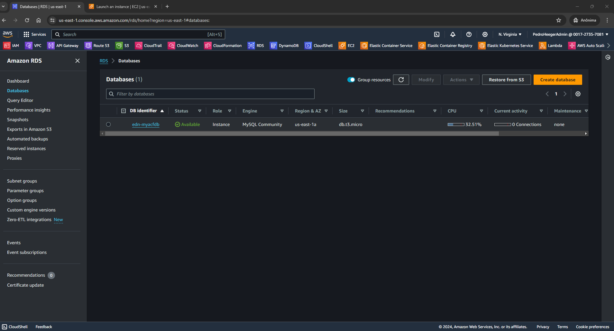
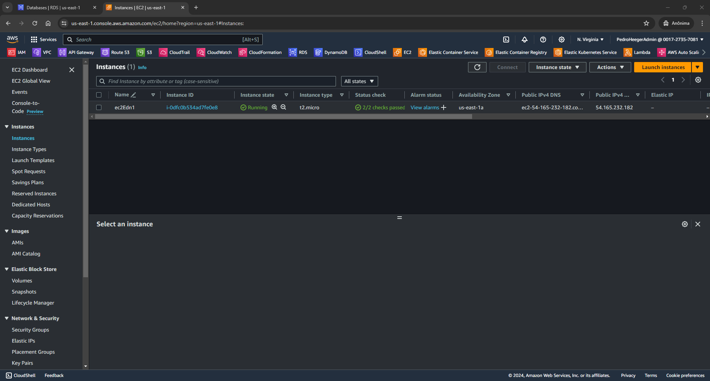
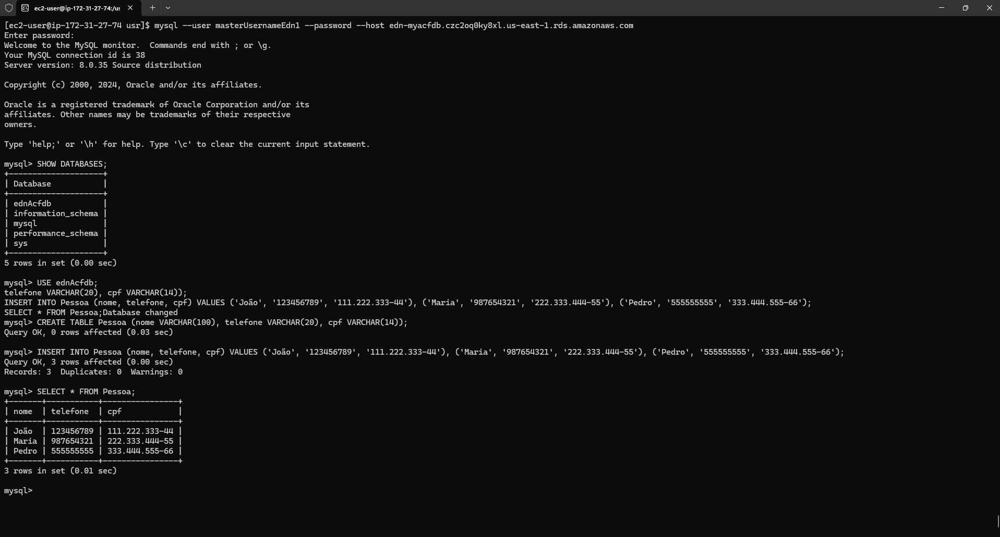
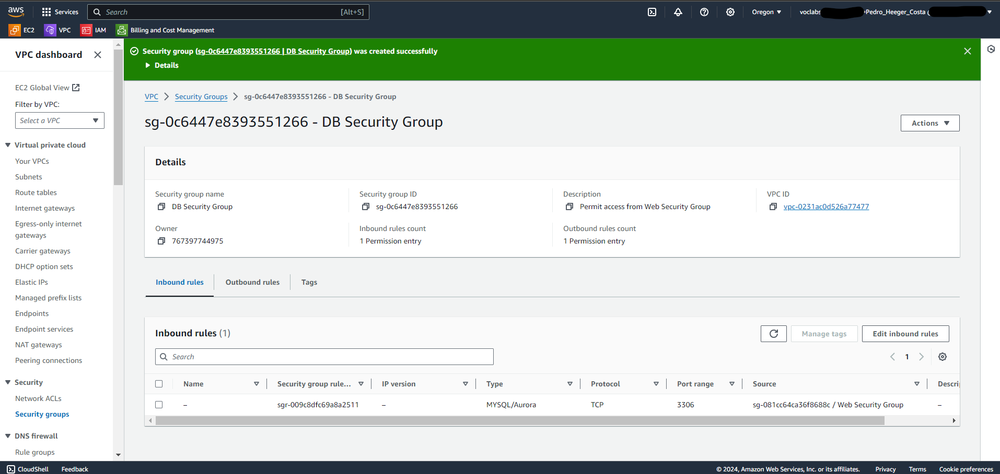
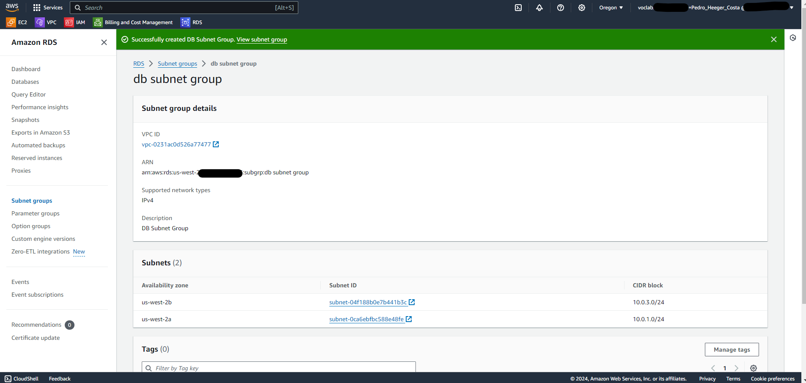
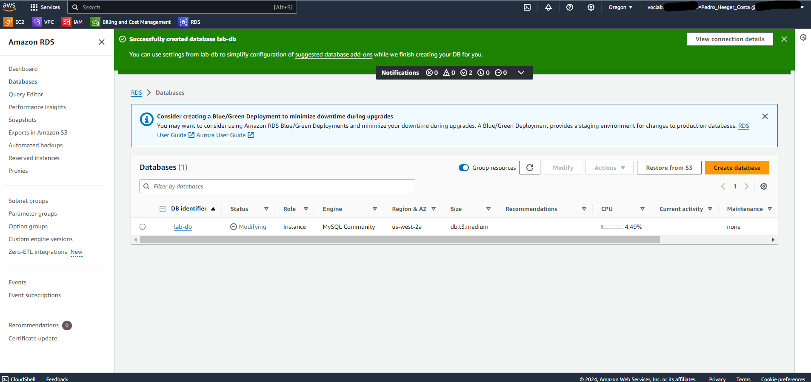
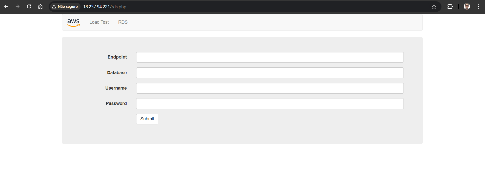
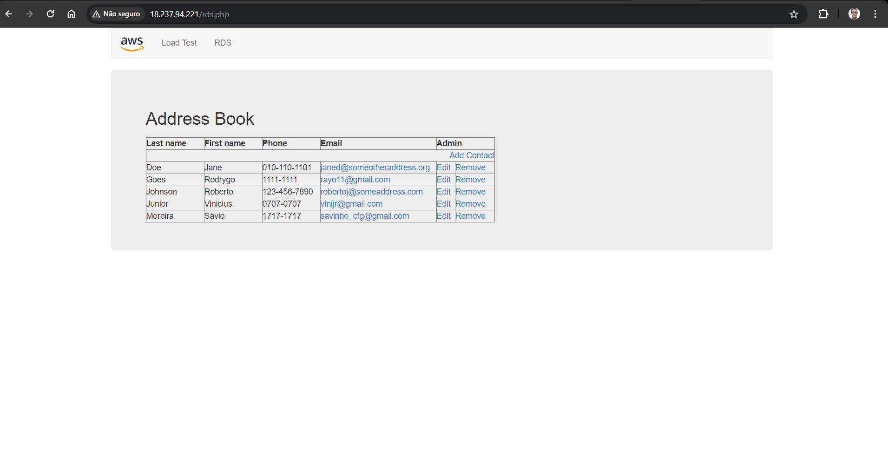
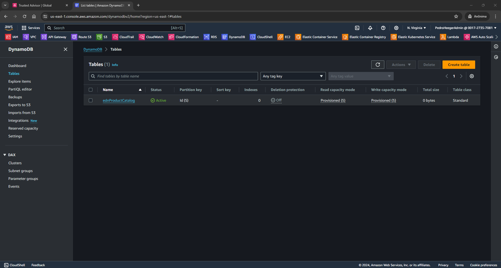
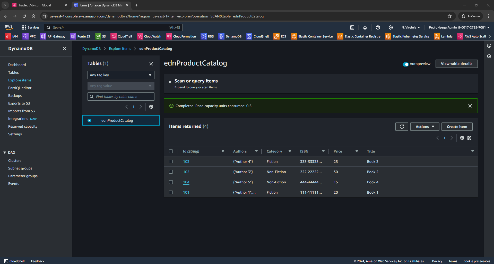

# Bootcamp AWS re/Start-Cloud Computing - Module 4   

### Repository: [boot](../../../../)   
### Platform: <a href="../../../">edn   </a> 
### Software/Subject: <a href="../../">aws    </a>
### Bootcamp: <a href="../">boot_022 (Bootcamp AWS re/Start-Cloud Computing)   </a>
### Module: 4. Bases 

---

This folder refers to Module 4 **Bases** from bootcamp [**Bootcamp AWS re/Start-Cloud Computing**](../).

### Theme:
- Cloud Computing

### Used Tools:
- Operating System (OS): 
  - Linux   
  - Windows 11   
- Linux Distribution: 
  - Amazon Linux   
- Virtualization: 
  - Vocareum   
- Cloud:
  - AWS   
- Cloud Services:
  - Amazon DynamoDB   
  - Amazon Elastic Compute Cloud (EC2)   
  - Amazon Relational Database Service (RDS)   
  - Amazon Virtual Private Cloud (VPC)   
  - Google Drive   
- Language:
  - HTML   
  - Markdown   
- Integrated Development Environment (IDE) and Text Editor:
  - Visual Studio Code (VS Code)   
- Versioning: 
  - Git   
- Repository:
  - GitHub   
- Command Line Interpreter (CLI):
  - AWS Command Line Interface (CLI)   
  - Bash e Sh   
  - Windows PowerShell   
- Server and Databases:
  - MySQL Server   

---

### Bootcamp Module 4 Structure

4. <a name="item4">Bases</a><br>
  4.1. <a href="#item4.1">Amazon RDS</a><br>
  4.2. <a href="#item4.2">Demonstração do Amazon RDS</a><br>
  4.3. <a href="#item4.3">160-[DF]-Lab - Crie seu servidor de banco de dados e interaja com seu banco de dados usando um aplicativo</a><br>
  4.4. <a href="#item4.4">Amazon DynamoDB</a><br>
  4.5. <a href="#item4.5">Demonstração do Dynamo DB</a><br>
  4.6. 309-[DF]-KC - Amazon DynamoDB<br>
  4.7. 308-[DF]-KC - Amazon RDS<br>

---

### Objective:
O objetivo deste módulo do bootcamp foi apresentar os dois principais serviços de banco de dados gerenciados da **AWS**. O **Amazon Relational Database Service (Amazon RDS)** é um serviço de banco de dados gerenciado que configura e opera um banco de dados relacional na nuvem. Enquanto o **Amazon DynamoDB** é um serviço de banco de dados NoSQL totalmente gerenciado. Também tiveram apresentações práticas de como criar um banco de dados nesses serviços e utilizá-los.

### Structure:
A estrutura das pastas obedece a estruturação do bootcamp, ou seja, conforme foi necessário, sub-pastas foram criadas para os cursos específicos deste módulo. Na imagem 01 é exibido a estruturação das pastas. 

<div align="Center"><figure>
    <br>
    <figcaption>Imagem 01.</figcaption>
</figure></div><br>

### Development:
O desenvolvimento deste módulo do bootcamp foi dividido em quatro cursos, dois questionários e um laboratório. Abaixo é explicado o que foi desenvolvido em cada uma dessas atividades.

<a name="item4.1"><h4>4.1 Amazon RDS</h4></a>[Back to summary](#item4) | <a href="">Certificate</a>

O **Amazon Relational Database Service (Amazon RDS)** é um serviço de banco de dados gerenciado que configura e opera um banco de dados relacional na nuvem. Executar um banco de dados relacional de forma independente e sem gerenciamento pode consumir muito tempo e ter alcance limitado. Para enfrentar esses desafios, a **AWS** oferece um serviço que configura, opera e dimensiona o banco de dados relacional sem necessidade de administração contínua. O **Amazon RDS** proporciona capacidade econômica e escalável e automatização de tarefas administrativas demoradas. Com o **Amazon RDS**, há mais tempo disponível para se concentrar em oferecer desempenho, alta disponibilidade, segurança e compatibilidade necessários para os aplicativos. O **Amazon RDS** prioriza os dados e a otimização do aplicativo.

A maneira mais simples de criar uma instância de banco de dados é utilizar o console de gerenciamento da **AWS**. Em seguida, é possível usar utilitários padrão do **MySQL**, como o **MySQL Workbench**, ou outras ferramentas de administração de banco de dados, para se conectar ao banco de dados na instância criada. Dependendo da classe da instância de banco de dados e da quantidade de armazenamento, a nova instância pode levar até 20 minutos para ficar disponível.

Como o **Amazon RDS** é um serviço totalmente gerenciado, uma das tarefas que ele realiza automaticamente é o backup periódico de uma instância de banco de dados. O backup completo da instância é realizado em um snapshot do volume de armazenamento durante uma janela de backup especificada. Esse backup é mantido conforme o período de retenção de backup determinado. O primeiro snapshot de uma instância de banco de dados inclui todos os dados, enquanto os snapshots subsequentes são incrementais e contêm apenas os dados modificados desde o último snapshot. Caso prefira, também é possível fazer backup de uma instância de banco de dados manualmente criando um snapshot.

O elemento fundamental do **Amazon RDS** é a instância de banco de dados. Uma instância de banco de dados é um ambiente de banco de dados isolado que pode conter vários bancos de dados criados pelo usuário e ser acessada com as mesmas ferramentas e aplicativos utilizados para uma instância de banco de dados independente. Os recursos de uma instância de banco de dados são determinados por sua classe (CPU, Memória e Desempenho de rede), e o tipo de armazenamento é definido pelo tipo dos discos (Magnetic, Uso geral SSD e IOPS provisionado). As instâncias de banco de dados e o armazenamento apresentam diferentes características de desempenho e preços, permitindo ajustar o desempenho e o custo de acordo com as necessidades do seu banco de dados. Ao criar uma instância de banco de dados, é necessário especificar o mecanismo de banco de dados que será utilizado. O Amazon RDS é compatível com seis bancos de dados: **MySQL**, **Amazon Aurora**, **Microsoft SQL Server**, **PostgreSQL**, **MariaDB** e **Oracle**.

Um dos principais recursos do **Amazon RDS** é a capacidade de configurar uma instância de banco de dados com alta disponibilidade utilizando uma implantação Multi-AZ. Essa configuração cria automaticamente uma cópia em espera da instância de banco de dados em outra zona de disponibilidade dentro da mesma nuvem virtual privada (VPC). Após a cópia inicial completa, as transações são replicadas de forma síncrona para a cópia em espera. Caso a instância primária de banco de dados falhe, o **Amazon RDS** coloca automaticamente a instância de banco de dados em espera online como a nova instância primária e as solicitações dos aplicativos são redirecionadas para a nova instância primária, usando o endpoint do sistema de nomes de domínio (DNS) do **Amazon RDS**. Isso permite que o failover ocorra sem necessidade de alterar o código do aplicativo e sem perda de dados, graças à replicação síncrona. Executar um banco de dados em várias zonas de disponibilidade pode aumentar a disponibilidade durante a manutenção planejada do sistema, ajudando a evitar falhas no banco de dados e interrupções nas zonas de disponibilidade.

Além de uma configuração de alta disponibilidade, o **Amazon RDS** oferece diversas formas de escalabilidade. É possível criar réplicas de leitura para **MySQL**, **MariaDB**, **PostgreSQL** e **Amazon Aurora**. As atualizações feitas na instância de banco de dados de origem são copiadas de forma assíncrona para a instância de réplica de leitura. Assim, a carga da instância de banco de dados de origem pode ser reduzida ao direcionar as consultas de leitura dos aplicativos para a réplica de leitura. As réplicas de leitura também podem aumentar a capacidade além das limitações de uma única instância de banco de dados para cargas de trabalho intensivas em leitura. Essas réplicas podem ser promovidas a instâncias primárias de banco de dados, embora isso exija uma ação manual devido à replicação assíncrona. Além disso, as réplicas de leitura podem ser criadas em uma região diferente da instância primária, ajudando a atender aos requisitos de recuperação de desastres ou a reduzir a latência ao direcionar as leituras para uma réplica de leitura mais próxima do usuário.

Também é possível aumentar a capacidade de um servidor de banco de dados alterando sua classe de instância ou a capacidade de armazenamento. Alterar a classe de instância permite aumentar a CPU e a memória disponíveis para a instância. No entanto, a alteração da classe de instância requer tempo de inatividade. Modificar o armazenamento alocado permite aumentar a capacidade de armazenamento sem necessidade de tempo de inatividade. 

O **Amazon RDS** pode ser utilizado em situações que o aplicativo exigir transações ou consultas complexas ou alta durabilidade. Contudo, não é recomendado utilizar o RDS quando o aplicativo exigir: solicitações GET ou PUT simples e consultas que um banco de dados NoSQL pode processar, ou personalização do sistema de gerenciamento de banco de dados relacional (RDBMS). Neste caso, é possível usar uma solução de banco de dados NoSQL, como o **Amazon DynamoDB**. Outra alternativa ao **Amazon RDS** é executar o mecanismo de banco de dados relacional em instâncias do **Amazon EC2**, o que oferece mais opções para personalizar o banco de dados. As seguintes práticas também são recomendadas para o RDS: Habilitar os backups automáticos e definir a janela para realização dos backups durante um período com o mínimo de operações de gravação no banco de dados; Se utilizar uma implantação multi-AZ, teste o failover da instância de banco de dados para saber quanto tempo demora para realizar a transferência e verifique se o aplicativo pode acessar a nova instância primária de banco de dados.

O **Amazon RDS** é ideal para aplicativos web e móveis que necessitam de um banco de dados com alta taxa de transferência, escalabilidade massiva de armazenamento e alta disponibilidade. Como o **Amazon RDS** não tem restrições de licenciamento, ele é perfeito para padrões de uso variáveis desses aplicativos. Para pequenas e grandes empresas de comércio eletrônico, o **Amazon RDS** oferece uma solução de banco de dados flexível, segura e econômica para vendas e varejo online. Jogos online e para dispositivos móveis, que exigem alta taxa de transferência e disponibilidade, se beneficiam da plataforma, já que o **Amazon RDS** gerencia a infraestrutura do banco de dados, liberando os desenvolvedores de jogos da preocupação com provisionamento, dimensionamento ou monitoramento de servidores de banco de dados.

<a name="item4.2"><h4>4.2 Demonstração do Amazon RDS</h4></a>[Back to summary](#item4) | <a href="">Certificate</a>

Como já foi visto no curso anterior, o **Amazon RDS** facilita a configuração, operação e dimensionamento de um banco de dados relacional na nuvem. Ele oferece capacidade redimensionável e econômica e também automatiza tarefas administrativas demoradas, como provisionamento de hardware, configuração de banco de dados, patches e backups. Com o RDS, é possível se concetrar nos aplicativos para que tenham um rápido desempenho, alta disponibilidade, segurança e compatibilidade de que precisa.

O **Amazon RDS** está disponível em vários tipos de instâncias de banco de dados: otimizados para memória, desempenho ou E/S. Ele também oferece seis mecanismos de banco de dados familiares, incluindo **Amazon Aurora**, **PostgreSQL**, **MySQL**, **MariaDB**, **Microsoft SQL Server** e **Oracle**. Também é possível utilizar o **AWS Database Migration Service** para migrar ou replicar facilmente os bancos de dados existentes no **Amazon RDS**.

Nesta demonstração foi construído um banco de dados **MySQL** no **Amazon RDS** pelo **AWS Management Console** e criada uma instância **Amazon Linux** no **Amazon EC2** com um cliente do **MySQL** para interagir com o banco de dados. Como nas demonstrações não tem ambiente de laboratório, optei por fazer na minha conta da **AWS** com meu usuário administrador `PedroHeegerAdmin` através arquivos de scripts em **PowerShell** com comandos do **AWS Command Line Interface (AWS CLI)**. Na maquina física **Windows** já possuía o **AWS CLI** instalado e vinculado a esse usuário administrador da conta da **AWS**. Dessa forma, só foi necessário executar os arquivos de scripts para construção dos dois serviços: uma instância do RDS e uma instância do EC2. 

Os arquivos de scripts possuíam um script para criação da infraestrutura e outro para exclusão, sempre precedidos de uma estrutura de condição que aguardava a confirmação do usuário para executar o bloco de código. O primeiro arquivo executado foi o [rds.ps1](./resource/rds.ps1) que construíu a instância de banco de dados. Diferentemente do professor deste curso, o template escolhido foi o `Free tier` para não haver custos com esse provisionamento, o professor selecionou `Dev/Test` e foi configurando cada item individualmente para não ter custos. Dessa forma, em ambos os casos não foi configurado implantação em múltiplas AZs. Isso geralmente é reservado para ambiente de produção, onde há uma instância primária e uma instância em espera recebenedo alterações e cópias do que foi alterado na instância primária de uma maneira síncrona, ou seja, o mais rápido possível. 

O tipo de instância escolhido pelo professor foi `db.t2.micro`, como não havia mais disponível essa opção, foi selecionada a `db.t3.micro`, seguindo o free tier. O armazenamento foi mantido o padrão que é `20 Gb` para o tipo `gp2` e definido esse mesmo valor como o máximo de armazenamento alocado, assim foi desabilitado o dimensionamento de armazenamento automático que por padrão é configurado. O nome da instância de banco de dados foi `edn-myacfdb`, o nome do usuário root do banco de dados foi `masterUsernameEdn1` e a senha foi `masterPasswordEdn1`. Nas configurações de rede, o professor utilizou uma VPC construída e definiu que não havia preferência de AZ, mas neste caso foi usado a VPC padrão da região `us-east-1`, selecionando a sub-rede da AZ `us-east-1a`. O grupo de segurança também foi o padrão dessa VPC, enquanto o professor construíu um grupo específico. O acesso público foi mantido o padrão de desabilitado, ou seja, só as maquinas dessa mesma VPC conseguiriam se conectar a instância de banco de dados.

O nome do banco de dados foi definido como `ednAcfdb` e a porta foi mantida a padrão do **MySQL**, `3306`. A autenticação do banco de dados foi definida como `Password authentication`, que é a opção padrão, mas caso queira garantir a escolha dessa opção deve desabilitar a autenticação por IAM com parâmetro `--no-enable-iam-database-authentication`. Para desabilitar a criptografia utilizou o parâmetro `--no-storage-encrypted`, que também por padrão já vem desabiitada. Já o período de backup foi selecionado `0 dias`. Também foi definido que não seria copiado as tags do snapshot com adição do parâmetro `--no-copy-tags-to-snapshot`, mas por padrão ela já vem definida como não copiar. Para desabilitar o monitoramento, o parâmetro `--no-enable-performance-insights` foi utilizado e para exportar logs, o parâmetro seria o `--enable-cloudwatch-logs-exports` informando os tipos de logs que seriam exportados, mas neste caso nenhum log foi exportado, logo este parâmetro não foi utilizado. Por fim, foi desabilitado o dimensionamento automático de versões secundárias com o parâmetro `--no-auto-minor-version-upgrade`, que por padrão vem habilitado, e a proteção de exclusão com o parâmetro `--no-deletion-protection`, mas esse já vem desabilitado por padrão. Em todos os casos em que por padrão a configuração já vier desabilitada, não é necessário escrever o parâmetro, só escrevi para ficar mais didático o comando.

O provisinamento da instância de banco de dados demorou alguns minutos até ficar totalmente pronta. Assim que o provisionamento foi concluído, um endpoint foi gerado e ele seria utilizado como host para conectar o cliente do **MySQL** ao banco de dados dessa instância. As outras informações necessárias para conexão, foram definidas na configuração dessa instância do **Amazon RDS**, como nome e senha do usuário master e nome do banco de dados. A imagem 02 abaixo mostra a instância de banco de dados construída e em execução.

<div align="Center"><figure>
    <br>
    <figcaption>Imagem 02.</figcaption>
</figure></div><br>

O próximo passo foi construir a instância do **Amazon EC2**, que foi realizado através do arquivo de script em **PowerShell** [ec2Instance.ps1](./resource/ec2Instance.ps1). A instância provisionada foi do tipo `t2.micro` e utilizou a imagem de maquina (AMI) `ami-00beae93a2d981137` (Amazon Linux 2023 AMI 2023.4.20240528.0 x86_64 HVM kernel-6.1). A VPC escolhida foi a padrão da região `us-east-1` e a sub-rede selecionada foi a mesma da instância do RDS, localizada na AZ `us-east-1a`. O grupo de segurança foi o padrão desta VPC. Já o armazenamento foi o padrão, um volume do **Amazon Elastic Block Storage** foi construído com `8 Gb` de memória cujo tipo foi `gp2`, sendo o nome do dispositivo `/dev/xvda`. O par de chaves utilizado foi o `keyPairUniversal`, que é um par de chaves já criado anteriormente e utilizado como padrão nos meus projetos. Uma tag de nome foi criada, cujo valor foi `ec2Edn1`. Também foi passado um arquivo de script em **Bash** como user data para instalar alguns softwares básicos como: **Nano**, **Vim**, **Curl**, **Wget**, **Unzip**, **Zip** e **Git**, e instalar também o client do **MySQL**, pois com ele seria realizado acesso ao banco de dados na instância do RDS. A imagem 03 exibe a instância do **Amazon EC2** criada.

<div align="Center"><figure>
    <br>
    <figcaption>Imagem 03.</figcaption>
</figure></div><br>

Um acesso remoto foi realizado foi feito da maquina física **Windows** a instância EC2 através do software **OpenSSH** executado no **Windows PowerShell** no software **Windows Terminal**. Com o comando `ssh -i "G:\Meu Drive\4_PROJ\scripts\scripts_model\.default\secrets\awsKeyPair\keyPairUniversal.pem" ec2-user@54.165.232.182`, onde o IP público dessa maquina foi especificado, a instância foi acessa pela maquina física. Dentro dela foi executado o comando `mysql --user masterUsernameEdn1 --password --host edn-myacfdb.czc2oq0ky8xl.us-east-1.rds.amazonaws.com`, informando como host o endpoint da instância do **Amazon RDS** e a senha configurada para o usuário master, que foi `masterPasswordEdn1`. Assim, a instância de RDS foi acessada pela maquina do EC2 e ao executar o comando `SHOW DATABASES;`, os bancos de dados dessa instância foram listados. Também foi possível usar esse banco, criar uma tabela e adicionar dados a essa tabela. Com os comandos em SQL abaixo foi realizado esse processo e visualizado conforme evidenciado na imagem 04.

```SQL
USE ednAcfdb;
CREATE TABLE Pessoa (nome VARCHAR(100), telefone VARCHAR(20), cpf VARCHAR(14));
INSERT INTO Pessoa (nome, telefone, cpf) VALUES ('João', '123456789', '111.222.333-44'), ('Maria', '987654321', '222.333.444-55'), ('Pedro', '555555555', '333.444.555-66');
SELECT * FROM Pessoa;
```

<div align="Center"><figure>
    <br>
    <figcaption>Imagem 04.</figcaption>
</figure></div><br>

Ao tentar acessar o banco de dados na instância do RDS através de um software de administração de banco de dados da maquina física **Windows** não foi possível, pois a instância do RDS esta na VPC que é uma rede virtual gerenciada pela **AWS**. No grupo de segurança desta VPC não há liberação da porta `3306` para acesso público, logo só é possível acessar com maquinas que fazem parte da mesma rede. Caso queira acessar pela maquina física, tem que criar uma regra de entrada liberando o tráfego na porta `3306` do protocolo `TCP` para todas as faixas de IP ou para o IP público específico de sua maquina. Não é uma boa prática liberar portas do grupo de segurança para acesso público, portanto é importante ter cautela na criação desse tipo de regra.

<a name="item4.3"><h4>4.3 160-[DF]-Lab - Crie seu servidor de banco de dados e interaja com seu banco de dados usando um aplicativo</h4></a>[Back to summary](#item4) | <a href="">Certificate</a>

O laboratório deste módulo 4 teve como objetivo a construção de um servidor de banco de dados no **Amazon Relational Database Service (Amazon RDS)** e a interação com este banco através de um aplicativo. Toda infraestrutura de rede, bem como, uma instância do **Amazon EC2** onde a aplicação rodava, foram criadas automaticamente ao criar o laboratório. Para o laboratório foi necessário: criar a instância RDS de banco de dados e o grupo de segurança que essa instância utilizaria, agrupar as sub-redes privadas já existentes para serem utilizadas pela a instância RDS, acessar e conectar a aplicação a instância de banco de dados e interagir com este banco de dados construído.

A primeira tarefa foi provisionar o grupo de segurança que seria utilizado pela instância do **Amazon RDS**. O nome desse grupo de segurança foi definido como `DB Security Group`, a descrição foi `Permit access from Web Security Group` e ele foi vinculado a VPC já existente `Lab VPC`. Dentro deste grupo foi elaborado uma regra de entrada permitindo o tráfego da instância EC2 com a instância RDS. O tipo de regra foi `MySQL/Aurora`, que usa o protocolo `TCP` na porta `3306`, que é a porta padrão do **MySQL**, e em origem foi selecionado o grupo de segurança da instância EC2, `Web Security Group`. A imagem 05 a seguir mostra o grupo de segurança criado com sua respectiva regra.

<div align="Center"><figure>
    <br>
    <figcaption>Imagem 05.</figcaption>
</figure></div><br>

Na tarefa 2, foi criado um grupo de sub-redes já existentes para informar a instância RDS quais sub-redes ela poderia utilizar. Cada grupo de sub-redes de banco de dados requer sub-redes em pelo menos duas Zonas de Disponibilidade (AZs). Portanto, foram agrupadas as sub-redes privadas (`Private subnet 1`, cujo CIDR era `10.0.1.0/24` e `Private subnet e`, cujo CIDR era `10.0.3.0/24`) da VPC do laboratório. Este grupo de sub-redes foi nomeado de `DB Subnet Group`, sua descrição foi `DB Subnet Group` e ele foi vinculado a VPC `Lab VPC`, que era a VPC do laboratório. A imagem 06 ilustra o agrupramento dessas sub-redes privadas.

<div align="Center"><figure>
    <br>
    <figcaption>Imagem 06.</figcaption>
</figure></div><br>

Na terceira tarefa foi provisionada a instância de banco de dados multi-AZ do **Amazon RDS** para o **MySQL**. As implantações multi-AZ do **Amazon RDS** proporcionam disponibilidade e durabilidade melhores para instâncias de banco de dados, o que as torna a solução ideal para cargas de trabalho de banco de dados de produção. Quando uma instância de banco de dados multi-AZ é provisionada, o **Amazon RDS** cria automaticamente uma instância de banco de dados primário e replica sincronicamente os dados para uma instância de espera em uma Zona de Disponibilidade (AZ) diferente.

O tipo de criação escolhida foi a padrão (`Standard create`), enquanto o tipo de mecanismo foi **MySQL** e a versão foi a mais recente. Em modelos, foi selecionado `Dev/Test`. Em disponibilidade e durabilidade foi selecionado instância de banco de dados multi-AZ (`Multi-AZ DB instance`), pois seria criado em duas AZs diferentes. O identificador do banco de dados foi `lab-db`, o nome do usuário principal foi `main` e foi selecionada a opção `Self managed` em gerenciamento de credenciais, para criar uma senha para este usuário, que foi `lab-password`.

Nas configurações da instância, foi definida a classe com capacidade de intermitência, que incluía classes t (`Burstable classes (includes t classes)`), e foi selecionada a classe de instância `db.t3.medium`. Em armazenamento foi configurado o tipo como finalidade geral (SSD) (`General Purpose SSD (gp3)`) e mantido o armazenamento alocado como `200 GiB`. Em conectividade, a VPC do laboratório, `Lab VPC`, foi selecionada e o grupo de sub-redes elaborado foi selecionado. Já em grupo de segurança foi escolhido o grupo construído, o `DB Security Group`. Em monitoramento, foi habilitado o monitoramento avançado. Nas configurações adicionais, foi definido o nome do banco de dados como `lab` e em backup foi desmarcada opção de habilitar backups automatizados. As demais configurações foi mantida o padrão que já vinham. A imagem 07 evidencia o provisionamento dessa instância de banco de dados.

<div align="Center"><figure>
    <br>
    <figcaption>Imagem 07.</figcaption>
</figure></div><br>

A última tarefa foi conectar a aplicação que era executada na instância do **Amazon EC2** com o banco de dados **MySQL** configurado na instância do **Amazon RDS** e interagir. Para isso, primeiro foi necessário acessar a instância, no navegador da maquina física **Windows**, através do seu IP ou DNS público. Como o grupo de segurança da instância EC2 foi desenvolvido pelo próprio laboratório, uma regra liberando a porta `80` (`HTTP`) ou `443` (`HTTPS`) para qualquer faixa de IP já deveria ter sido criada para que o a aplicação web, executada nesta instância, pudesse ser acessada pelo navegador. Na página inicial da aplicação web, foi selecionada a opção `RDS` que direcionou para uma outra página, com campos de um formulário para preencher. Um dos campos era o endpoint da instância do RDS, que pode ser copiada ao acessar a instância RDS (`lab-db.c98yg6isyeh0.us-west-2.rds.amazonaws.com`). O nome do banco de dados foi `lab`, o nome do usuário principal foi `main` e a senha `lab-password`. Com o formulário pronto, foi clicado em enviar para mandar as informações para aplicação web que executaria a conexão com o banco de dados da instância RDS. Uma mensagem de aviso foi exibida explicando que o aplicativo estava executando um comando para copiar informações para o banco de dados. Após alguns segundos, a aplicação web exibiu o `Address Book` que utilizava o banco de dados RDS para armazenar as informações criadas nele. A imagem 08 mostra a aplicação antes da conexão com o banco de dados. Já a imagem 09 exibe a aplicação conectada ao banco e com alguns dados preenchidos.

<div align="Center"><figure>
    <br>
    <figcaption>Imagem 08.</figcaption>
</figure></div><br>

<div align="Center"><figure>
    <br>
    <figcaption>Imagem 09.</figcaption>
</figure></div><br>

<a name="item4.4"><h4>4.4 Amazon DynamoDB</h4></a>[Back to summary](#item4) | <a href="">Certificate</a>

O **Amazon DynamoDB** é um serviço de banco de dados NoSQL rápido e flexível, compatível com os modelos de armazenamento de documentos e chave-valor, totalmente gerenciado pela **Amazon**, que cuida de toda a infraestrutura subjacente a esse serviço. Ele armazena dados de maneira redundante em várias instalações dentro de uma região, como parte de sua arquitetura tolerante a falhas. Com o DynamoDB, é possível criar tabelas e itens, além de adicionar itens às tabelas. O serviço particiona automaticamente os dados e fornece armazenamento de tabelas para atender às necessidades de carga de trabalho.

Dentre os seus benefícios, destacam-se: serviço totalmente gerenciado, consultas de baixa latência, controle de acesso refinado e flexibilidade. Ao criar uma tabela de banco de dados e definir a utilização de destino para dimensionamento automático, o serviço assume automaticamente as tarefas de gerenciamento do banco de dados. Isso inclui provisionamento, configuração e inicialização de hardware e software, aplicação de patches, operação de um cluster de banco de dados distribuído e particionamento de dados em várias instâncias conforme necessário. O DynamoDB também proporciona recuperação pontual, além de backup e restauração para todas as tabelas.

A latência média do serviço para executar uma consulta geralmente é de milissegundos de um dígito. À medida que os volumes de dados aumentam e as demandas de desempenho dos aplicativos crescem, o DynamoDB se ajusta para atender a essas necessidades. Utilizando tecnologias de particionamento automático e SSD, ele atende aos requisitos de taxa de transferência e mantém baixas latências em qualquer escala. É possível utilizar o DynamoDB com o **AWS Identity and Access Management (AWS IAM)** para obter um controle de acesso refinado dos usuários da organização, atribuindo credenciais de segurança únicas para cada usuário e controlando o acesso a serviços e recursos.

Tratando de flexibilidade, o DynamoDB é compatível com armazenamento, consulta e atualização de dados na forma de documentos **Java Script Object Notation (JSON)**. Isso o torna ideal para armazenar dados semiestruturados e manipulá-los usando consultas JSON. Além disso, o **Amazon DynamoDB** se integra ao **Amazon CloudWatch** para visualização de estatísticas de solicitações de taxa de transferência e latência.

Com o DynamoDB, não há um limite prático para a quantidade de itens que podem ser armazenados em uma tabela. Por exemplo, alguns clientes possuem tabelas de produção contendo bilhões de itens. Uma das vantagens de um banco de dados NoSQL é que os itens na mesma tabela podem ter atributos diferentes, proporcionando flexibilidade para adicionar novos atributos conforme o aplicativo evolui. Itens com formatos mais novos podem coexistir com itens antigos na mesma tabela, sem necessidade de migrações de esquema. À medida que o aplicativo ganha popularidade e os usuários interagem mais, o armazenamento pode aumentar conforme as necessidades do aplicativo. Todos os dados no DynamoDB são armazenados em SSDs, e a linguagem de consulta simples garante um desempenho consistente de consultas com baixa latência.

Além de dimensionar o armazenamento, o DynamoDB permite provisionar a quantidade necessária de taxa de transferência de leitura/gravação para tabelas. À medida que o número de usuários do aplicativo cresce, as tabelas do DynamoDB podem ser dimensionadas para lidar com o aumento das solicitações de leitura/gravação com provisionamento manual. Alternativamente, é possível habilitar o dimensionamento automático, permitindo que o DynamoDB monitore a carga na tabela e ajuste automaticamente a taxa de transferência provisionada, aumentando ou diminuindo conforme necessário. Alguns recursos principais adicionais de diferenciação incluem tabelas globais que permitem a replicação automática entre regiões **AWS**, criptografia de dados ociosos e a TTL (vida útil) do item.

Semelhante a outros sistemas de banco de dados, o DynamoDB armazena dados em tabelas. Uma tabela é uma coleção de dados. Cada tabela contém zero ou mais itens, que é um grupo de atributos identificável exclusivamente entre todos os outros itens. Cada item é composto de um ou mais atributos, onde o atributo é um elemento de dados fundamental, algo que não precisa de divisão adicional. 

O recurso de tabelas globais do DynamoDB proporciona alta disponibilidade e escalabilidade entre regiões. Uma tabela global consiste em uma coleção de uma ou mais tabelas do DynamoDB, todas pertencentes a uma única conta da **AWS**. As tabelas nessa coleção são chamadas de tabelas-réplica. Uma tabela-réplica (ou réplica) é uma tabela única do DynamoDB que faz parte de uma tabela global, armazenando o mesmo conjunto de itens de dados. Qualquer tabela global específica pode ter apenas uma tabela-réplica por região. Todas as réplicas possuem o mesmo nome de tabela e a mesma definição de chave primária.

Ao criar uma tabela global, é necessário especificar as regiões da **AWS** nas quais a tabela deve estar disponível. O DynamoDB executa todas as tarefas necessárias para criar tabelas idênticas nessas regiões e propaga continuamente as alterações de dados a todas elas. As tabelas globais do DynamoDB são ideais para aplicativos de grande escala com usuários espalhados pelo mundo. Nesse contexto, os usuários esperam um desempenho rápido, acessando a réplica mais próxima. Além disso, se uma das regiões da **AWS** ficar temporariamente indisponível, os usuários ainda poderão acessar os mesmos dados em outras regiões.

O **Amazon DynamoDB** é compatível com dois tipos diferentes de chaves primárias: Chaves de partição, e Chaves de partição e classificação. As chaves primárias identificam exclusivamente cada item na tabela para que nenhum item tenha a mesma chave. A chave de partição, que é conhecida também como o atributo de hash, é uma chave primária simples, que é composta por um atributo chamado chave de partição. O DynamoDB cria um índice não ordenado nesse atributo de chave primária e cada item da tabela é identificado exclusivamente por seu valor de chave de partição. Já a chave de partição e classificação é conhecida como chave primária composta, pois são compostas por dois atributos, onde um deles é a chave de partição e o outro a chave de classificação. Uma chave de classificação pode ser definida para armazenar todos os itens com o mesmo valor de chave de partição em proximidade física. Ela permite ordenar esses itens pelo valor da chave de classificação dentro da partição. Essa configuração representa uma relação de um para muitos com base na chave de partição e possibilita consultas no atributo da chave de classificação. O DynamoDB cria um índice não ordenado no atributo de chave de partição e um índice classificado no atributo de chave de classificação. Cada item na tabela é identificado exclusivamente pela combinação dos valores de chave de partição e classificação.

Para entender como o **Amazon DynamoDB** distribui dados, é essencial analisar como os dados são armazenados, gravados e recuperados de uma tabela. O **Amazon DynamoDB** armazena dados em partições, que são alocações de armazenamento de uma tabela, baseadas em unidades de estado sólido (SSDs) e replicadas automaticamente em várias zonas de disponibilidade em uma região **AWS**. Se a tabela tiver uma chave primária (apenas uma chave de partição), o DynamoDB armazenará e recuperará cada item com base no valor da chave de partição. Para gravar um item na tabela, o DynamoDB usa o valor da chave de partição como entrada para uma função de hash interna, cujo resultado determina a partição onde o item será armazenado. Para ler um item na tabela, deve-se especificar o valor da chave de partição do item. O DynamoDB utiliza esse valor como entrada para sua função de hash, identificando a partição onde o item está armazenado.

À medida que os dados aumentam, a tabela é particionada e indexada pela chave primária. Existem duas maneiras diferentes de recuperar dados de uma tabela do DynamoDB. No primeiro método, a operação de consulta utiliza o particionamento da tabela para localizar itens de forma eficaz usando a chave primária. O segundo método é uma varredura, que permite localizar itens na tabela correspondendo a condições em atributos que não são chave. O segundo método oferece a flexibilidade para localizar itens usando outros atributos. Entretanto, a operação é menos eficiente, pois o DynamoDB lê todos os itens da tabela para encontrar aqueles que correspondem aos seus critérios.

<a name="item4.5"><h4>4.5 Demonstração do Dynamo DB</h4></a>[Back to summary](#item4) | <a href="">Certificate</a>

Nesta demonstração foi construída uma tabela vazia no **Amazon DynamoDB**, cujo nome foi `ednProductName` e a partition key foi `Id` cujo tipo foi `S` de string. Isso foi executado através do arquivo de script em **PowerShell** [dynamodb.ps1](./resource/dynamodb.ps1) que possuía um script para criação e outro para exclusão, precedidos por uma estrutura de condição que aguardava uma entrada do usuário para executar o código. A imagem 10 exibe a tabela criada.

<div align="Center"><figure>
    <br>
    <figcaption>Imagem 10.</figcaption>
</figure></div><br>

Após isso, foi utilizado um arquivo **JSON** ([productCatalog.json](./resource/productCatalog.json)) para inserir os dados dessa tabela através do comando **AWS CLI** executado no **PowerShell** da maquina física **Windows**: `aws dynamodb batch-write-item --request-items file://"G:/Meu Drive/4_PROJ/boot/edn/aws/boot_022/04-bases/resource/productCatalog.json"`. Esse arquivo **JSON** foi um arquivo aleatório criado pelo **ChatGPT** só para simular a inserção de dados na tabela. O professor do curso usou um outro arquivo. A imagem 11 evidencia os dados inseridos na tabela do **Amazon DynamoDB**.

<div align="Center"><figure>
    <br>
    <figcaption>Imagem 11.</figcaption>
</figure></div><br>