# Bootcamp AWS re/Start-Cloud Computing - Module 5   

### Repository: [boot](../../../../)   
### Platform: <a href="../../../">edn   </a> 
### Software/Subject: <a href="../../">aws    </a>
### Bootcamp: <a href="../">boot_022 (Bootcamp AWS re/Start-Cloud Computing)   </a>
### Module: 5. Redes 

---

This folder refers to Module 5 **Redes** from bootcamp [**Bootcamp AWS re/Start-Cloud Computing**](../).

### Theme:
- Cloud Computing

### Used Tools:
- Operating System (OS): 
  - Linux   
  - Windows 11   
- Linux Distribution: 
  - Amazon Linux   
- Virtualization: 
  - Vocareum   
- Cloud:
  - AWS   
- Cloud Services:
  - Amazon Elastic Compute Cloud (EC2)   
  - Amazon Virtual Private Cloud (VPC)   
  - Google Drive   
- Language:
  - HTML   
  - Markdown   
- Integrated Development Environment (IDE) and Text Editor:
  - Visual Studio Code (VS Code)   
- Versioning: 
  - Git   
- Repository:
  - GitHub   

---

### Bootcamp Module 5 Structure

5. <a name="item5">Jumpstart na AWS</a><br>
  5.1. <a href="#item5.1">AWS Cloud Adoption Framework</a><br>
  5.2. <a href="#item5.2">AWS Well Architected Framework</a><br>

---

### Objective:
O objetivo deste módulo do bootcamp foi aprender sobre como funciona as redes na cloud da **AWS**, apresentando o serviço voltado para isso que é o **Amazon Virtual Private Cloud (Amazon VPC)**. Também foi ensinado como construir uma VPC com sub-redes pública e privada, gateway de internet e NAT gateway, tabela de rotas, grupo de segurança e provisionar uma instância do **Amazon Elastic Compute Cloud (Amazon EC2)** nesta VPC, acessando ela posteriormente.

### Structure:
A estrutura das pastas obedece a estruturação do bootcamp, ou seja, conforme foi necessário, sub-pastas foram criadas para os cursos específicos deste módulo. Na imagem 01 é exibido a estruturação das pastas. 

<div align="Center"><figure>
    <br>
    <figcaption>Imagem 01.</figcaption>
</figure></div><br>

### Development:
O desenvolvimento deste módulo do bootcamp foi dividido em um curso e um laboratório. Abaixo é explicado o que foi desenvolvido em cada uma dessas atividades.

<a name="item5.1"><h4>5.1 AWS Cloud Adoption Framework</h4></a>[Back to summary](#item5) | <a href="">Certificate</a>

A jornada de cada organização na adoção da nuvem é única. No entanto, para que uma organização migre com sucesso seu portfólio de TI para a nuvem, é essencial que três elementos ( pessoas, processos e tecnologia) estejam alinhados. Os líderes de negócios e tecnologia precisam entender o estado atual da organização, o estado desejado e a transição necessária para atingir esse estado, a fim de definir metas e criar processos para a equipe. O **AWS Cloud Adoption Framework (AWS CAF)** auxilia as organizações a desenvolver planos eficientes e eficazes para a adoção da nuvem. As práticas recomendadas e orientações oferecidas pelo framework ajudam a criar uma abordagem abrangente para gerenciar a computação em nuvem na organização e em todo o ciclo de vida da TI.

O **AWS CAF** simplifica o complexo processo de planejamento de migração para a nuvem, ao dividí-lo em seis partes gerenciáveis, chamadas perspectivas. Essas perspectivas cobrem áreas essenciais focadas em pessoas, processos e tecnologia. As habilidades dentro de cada perspectiva identificam as áreas da organização que precisam de atenção. Com base nisso, as ações são organizadas em fluxos de trabalho prescritivos que apoiam uma migração bem-sucedida para a nuvem. Cada perspectiva cobre responsabilidades específicas, gerenciadas por stakeholders que têm funções relacionadas. As perspectivas de negócios, pessoas e governança se concentram nas capacidades de negócios, enquanto as perspectivas de plataforma, segurança e operações se concentram em recursos técnicos.

Os stakeholders da perspectiva de negócios (gerentes de negócios, gerentes financeiros, proprietários de orçamento e responsáveis pela estratégia) podem usar o **AWS CAF** para criar um caso de negócio sólido para a adoção da nuvem e priorizar iniciativas de migração. Eles devem assegurar que as estratégias e metas de negócios da organização estejam alinhadas com suas estratégias e objetivos de TI. Entre os principais recursos dessa perspectiva estão: Finanças de TI, Estratégia de TI, Realização de benefícios e Gerenciamento de riscos empresariais. Os stakeholders da perspectiva de pessoas (recursos humanos, equipes e gerentes de pessoas) podem usar o **AWS CAF** para avaliar estruturas e funções organizacionais, bem como novos requisitos de habilidades e processos, identificando possíveis lacunas. Realizar uma análise de necessidades e lacunas pode ajudar a priorizar o treinamento, a equipe e as mudanças organizacionais para criar uma organização mais ágil. Seus principais recursos incluem: Gerenciamento de recursos, Gerenciamento de incentivos, Gerenciamento de carreiras, Gerenciamento de treinamento e Gerenciamento de mudanças organizacionais. Já os stakeholders da perspectiva de governança (Chief Information Officer ou CIO, gerentes de programas, arquitetos empresariais, analistas de negócios e gerentes de portfólio) podem usar o **AWS CAF** para focar nas habilidades e processos necessários para alinhar a estratégia e as metas de TI com a estratégia e as metas empresariais. Esse enfoque ajuda a organização a maximizar o valor comercial de seu investimento em TI e a minimizar os riscos empresariais. Seus recursos principais são: Gerenciamento de portfólio, Gerenciamento de programas e projetos, Medição de desempenho dos negócios e Gerenciamento de licenças.

Os stakeholders da perspectiva de plataforma (diretor de tecnologia ou CTO, gerentes de TI e arquitetos de soluções) utilizam diversas dimensões e modelos de arquitetura para compreender e comunicar a natureza dos sistemas de TI e suas interrelações. Eles devem ser capazes de descrever detalhadamente a arquitetura do ambiente de destino. O **AWS CAF** inclui princípios e padrões para a implementação de novas soluções na nuvem e para a migração de cargas de trabalho locais para a nuvem. Seus principais recursos incluem: Provisionamento de computação, Provisionamento de rede, Provisionamento de armazenamento, Provisionamento de banco de dados, Arquitetura de sistemas e soluções, e Desenvolvimento de aplicativos. Os stakeholders da perspectiva de segurança (diretor de segurança da informação ou CISO, gerentes de segurança de TI e analistas de segurança de TI) devem assegurar que a organização atenda aos objetivos de segurança, como visibilidade, auditoria, controle e agilidade. Eles podem usar o **AWS CAF** para estruturar a seleção e a implementação de controles de segurança que atendam às necessidades da organização. Seus principais recursos incluem: Gerenciamento de identidade e acesso, Controle de detecção, Segurança de infraestrutura, Proteção de dados e Resposta a incidentes. Por fim, os stakeholders da perspectiva de operações (gerentes de operações de TI e gerentes de suporte de TI) definem como as atividades diárias, trimestrais e anuais são conduzidas. Eles se alinham e apoiam as operações da empresa. O **AWS CAF** auxilia esses stakeholders a definir os procedimentos operacionais atuais, bem como a identificar os treinamentos e mudanças processuais necessários para uma adoção bem-sucedida da nuvem. Seus principais recursos incluem: Monitoramento de serviços, Monitoramento de desempenho de aplicativos, Gerenciamento de inventário de recursos, Gerenciamento de versões ou mudanças, Relatórios e análise, Continuidade dos negócios ou recuperação de desastres (DR), e Catálogo de serviços de TI.

<a name="item5.2"><h4>5.2 AWS Well Architected Framework</h4></a>[Back to summary](#item5) | <a href="">Certificate</a>

Arquitetura é tanto uma arte quanto uma ciência que envolve projetar e criar grandes estruturas. Devido ao seu tamanho e complexidade, grandes sistemas exigem a expertise de arquitetos para serem gerenciados. Arquitetos de nuvem colaboram com tomadores de decisão para identificar objetivos de negócios, alinhar resultados tecnológicos com essas metas e trabalhar com as equipes de implementação para desenvolver as soluções adequadas. O **AWS Well-Architected Framework** documenta um conjunto de perguntas essenciais que ajudam a avaliar como uma arquitetura específica se alinha às melhores práticas da nuvem. Este framework oferece uma abordagem consistente para avaliar sistemas com base nas qualidades esperadas de sistemas modernos baseados na nuvem, além das melhorias necessárias para alcançar essas qualidades. O **AWS Well-Architected Framework** auxilia os arquitetos de nuvem na avaliação e aprimoramento de suas arquiteturas, proporcionando uma compreensão mais profunda de como as decisões de design podem impactar os negócios. Ele oferece um conjunto de perguntas elaboradas por especialistas da **AWS** para ajudar os clientes a refletirem cuidadosamente sobre suas arquiteturas. À medida que as tecnologias de nuvem evoluem e a **AWS** adquire mais conhecimento através de seu trabalho com clientes, a definição de uma arquitetura bem projetada é continuamente refinada e aprimorada.

O **AWS Well-Architected Framework** não fornece detalhes sobre a implementação ou padrões de arquitetura específicos. No entanto, ele oferece um conjunto de perguntas essenciais que ajudam a entender como uma arquitetura particular se alinha às melhores práticas da nuvem. Além disso, o framework inclui informações sobre serviços e soluções relevantes para cada pergunta, bem como referências a recursos úteis. O **AWS Well-Architected Framework** auxilia na concepção da arquitetura, abordando cinco perspectivas fundamentais, também conhecidas como pilares. Esses pilares são excelência operacional, segurança, confiabilidade, eficiência de desempenho e otimização de custos.

O primeiro pilar é excelência operacional, cujo foco é a execução e o monitoramento de sistemas para entregar valor comercial e aprimorar continuamente os processos e procedimentos. Os principais tópicos incluem: gerenciamento e automação de alterações, resposta a eventos e definição de padrões para gerenciar com êxito as operações diárias. Existem seis princípios de design para a excelência operacional na nuvem: Executar operações como código; Anotar a documentação; Fazer alterações frequentes, pequenas e reversíveis; Refinar os procedimentos de operações com frequência; Prever falhas; Aprender com todos os eventos e falhas operacionais.
- Executar operações como código implica em definir toda a carga de trabalho (ou seja, aplicativos e infraestrutura) como código e atualizá-la através de códigos. Procedimentos operacionais são implementados como código e configurados para serem acionados automaticamente em resposta a eventos. Ao adotar a prática de executar operações como código, ocorre a minimização do erro humano e a garantia de respostas consistentes a eventos.
- Anotar a documentação envolve automatizar a criação de documentação anotada após cada compilação. Essa documentação anotada pode ser utilizada tanto por pessoas quanto por sistemas. As anotações podem servir como entrada para o código de operações.
- Fazer alterações frequentes, em pequena escala e reversíveis é fundamental. Programe as cargas de trabalho de forma a possibilitar atualizações regulares dos componentes. Execute as mudanças em incrementos pequenos, facilitando a reversão em caso de falha (preferencialmente sem impactar os clientes).
- Refinar os procedimentos operacionais regularmente é essencial. Esteja atento a oportunidades para aprimorá-los conforme suas cargas de trabalho evoluem. Realize simulações periódicas para revisar todos os procedimentos, validar sua eficácia e garantir que as equipes estejam bem familiarizadas com eles.
- Prever falhas é crucial. Identifique as potenciais fontes de falha para eliminá-las ou reduzir seu impacto. Realize testes de cenários de falha para compreender melhor seu impacto. Verifique a eficácia de seus procedimentos de resposta por meio de testes e assegure-se de que as equipes estejam familiarizadas com sua execução. Estabeleça simulações periódicas para avaliar tanto as cargas de trabalho quanto as respostas da equipe a eventos simulados.
- Aprenda com todas as falhas operacionais. Incentive a melhoria contínua através das lições aprendidas em cada evento e falha operacional. Compartilhe esses insights com as equipes e toda a organização para promover uma cultura de aprendizado e aprimoramento.

O pilar da segurança aborda a necessidade de monitorar e proteger informações, sistemas e ativos, enquanto se entrega valor comercial através de avaliações de riscos e estratégias de mitigação. Os principais aspectos incluem: proteger a confidencialidade e integridade dos dados, gerenciar identidades e permissões de acesso (gestão de privilégios), fortalecer a segurança dos sistemas e estabelecer controles para detecção de eventos de segurança. É fundamental adotar princípios de design específicos para reforçar a segurança, tais como: Aplicar a segurança em todas as camadas; Habilitar a rastreabilidade; Implementar o princípio do menor privilégio; Proteger o sistema; Automatizar as práticas recomendadas de segurança.
- Aplicar a segurança em todas as camadas é fundamental para garantir múltiplas defesas. É essencial proteger a infraestrutura em todos os lugares e em cada nível. Em um data center físico, a segurança geralmente é concentrada apenas no perímetro. Porém, com a **AWS**, é possível estabelecer segurança tanto no perímetro quanto entre os recursos, garantindo a proteção não apenas do ambiente como um todo, mas também de componentes específicos uns dos outros.
- Habilitar a rastreabilidade é essencial. Ative o registro em log e a auditoria de todas as ações ou alterações no ambiente para garantir uma trilha de auditoria completa.
- Implementar o princípio do menor privilégio é crucial. Certifique-se de que as autorizações no ambiente sejam adequadas, implementando controles de acesso lógico sólidos nos recursos da **AWS** para conceder as permissões mínimas necessárias para atender aos requisitos empresariais.
- Proteger o sistema é primordial. Com o modelo de responsabilidade compartilhada da **AWS**, é possível focar precisamente na segurança de aplicativos, dados e sistemas operacionais. A **AWS** disponibiliza infraestrutura e serviços seguros, permitindo uma abordagem robusta à proteção.
- Automatizar as práticas recomendadas de segurança é essencial. Os mecanismos de segurança baseados em software aprimoram a capacidade de dimensionar com segurança, rapidez e eficiência. Por exemplo, é possível criar e armazenar automaticamente uma imagem fortalecida e corrigida de um servidor virtual, permitindo a criação instantânea de uma nova instância quando necessário. Além disso, automatizar a resposta a eventos de segurança habituais e anômalos é outra prática recomendada importante.

O pilar da confiabilidade concentra-se na capacidade de um sistema se recuperar de falhas de infraestrutura ou serviço, adquirir recursos de computação dinamicamente para atender à demanda e mitigar interrupções, como configurações incorretas e problemas de rede temporários. A confiabilidade é fundamental para a recuperação de falhas e o atendimento à demanda. Na nuvem, a confiabilidade é composta por três áreas principais: fundamentos, gerenciamento de alterações e gerenciamento de falhas. Uma avaliação cuidadosa de cada uma dessas áreas permite prever, responder e evitar falhas.
- Fudamentos: Na base da confiabilidade está a necessidade de uma arquitetura e sistema bem planejados, capazes de lidar com alterações na demanda e requisitos, além de detectar e corrigir falhas automaticamente. É crucial examinar cuidadosamente essa base antes de projetar qualquer tipo de estrutura ou sistema, garantindo a implementação adequada dos requisitos fundamentais que influenciam a confiabilidade.
- Gerenciamento de alterações: No gerenciamento de alterações, é crucial compreender plenamente como as mudanças podem impactar o sistema. Ao planejar de forma proativa e monitorar constantemente o sistema, torna-se possível acomodar e adaptar-se rapidamente e de forma confiável às mudanças.
- Gerenciamento de falhas: Para garantir a confiabilidade da arquitetura, é essencial antecipar, detectar e responder a falhas, além de implementar medidas para prevenir sua ocorrência. Na nuvem, a automação pode ser empregada para monitorar, substituir sistemas no ambiente e, em seguida, solucionar problemas em sistemas com falhas, tudo isso de forma econômica e mantendo uma alta confiabilidade.

Além disso, há vários princípios de design que podem aumentar a confiabilidade: Testar procedimentos de recuperação; Recuperar-se de falhas automaticamente; Dimensionar a escala horizontalmente para aumentar a disponibilidade agregada do sistema; Parar de tentar adivinhar a capacidade; Gerenciar alterações na automação.
- Testar procedimentos de recuperação é essencial na nuvem. Os usuários têm a capacidade de simular falhas nos sistemas e validar seus procedimentos de recuperação. Isso permite que identifiquem e resolvam possíveis problemas antes que impactem de fato suas operações.
- Recuperar-se de falhas automaticamente é uma característica-chave na nuvem da AWS. Os usuários podem configurar respostas automatizadas para serem acionadas quando os limites são ultrapassados, permitindo antecipar e corrigir falhas antes mesmo que elas aconteçam.
- Dimensionar a escala horizontalmente para aumentar a disponibilidade agregada do sistema é fundamental. Ao substituir um recurso grande por vários recursos menores, o impacto de um ponto único de falha no sistema geral é reduzido. O objetivo é distribuir os requisitos entre múltiplos recursos menores, escalando horizontalmente para garantir maior disponibilidade e resiliência.
- Parar de tentar adivinhar a capacidade no ambiente de nuvem. Monitorando constantemente a demanda e a utilização do sistema, é possível automatizar a adição ou remoção de recursos conforme necessário. Isso garante que o nível ideal para atender à demanda seja mantido, evitando tanto o excesso quanto a escassez de provisionamento.
- Gerenciar alterações de forma automatizada na arquitetura e infraestrutura. Ao adotar essa abordagem, o foco será apenas no gerenciamento das alterações na automação, sem a necessidade de lidar com todos os sistemas ou recursos individualmente.

O pilar de eficiência de desempenho envolve a utilização eficiente dos recursos de computação para atender aos requisitos do sistema. É crucial manter essa eficiência diante das mudanças na demanda e da evolução tecnológica. Alguns dos fatores que impactam a eficiência de desempenho na nuvem incluem: Selecionar; Revisar; Monitorar; Compensações.
- Selecionar a solução mais adequada é importante para otimizar a arquitetura. As opções variam de acordo com o tipo de carga de trabalho existente, e a **AWS** oferece recursos para personalizar as soluções de várias maneiras, com diferentes configurações.
- Após a implementação da arquitetura, é fundamental monitorar o desempenho para identificar e corrigir eventuais problemas antes que afetem os clientes. Utilizando ferramentas como **Amazon CloudWatch**, **Amazon Kinesis**, **Amazon Simple Queue Service (Amazon SQS)** e **AWS Lambda**, é possível automatizar a monitorização da arquitetura na **AWS**.
- Compensações são fundamentais para garantir uma abordagem otimizada. Um exemplo disso é o equilíbrio entre consistência, durabilidade e uso de espaço em troca de tempo ou latência, visando aprimorar o desempenho geral do sistema.

Adicionalmente, diversos princípios de design podem contribuir para alcançar eficiência de desempenho: democratizar o acesso a tecnologias avançadas; obter alcance global em minutos; adotar uma arquitetura sem servidor; realizar experimentações com maior frequência; e estabelecer afinidade mecânica.
- Comece por democratizar as tecnologias avançadas. Ao transferir o conhecimento e a complexidade para os provedores de nuvem, as tecnologias que são difíceis de implementar podem se tornar mais acessíveis e simples de utilizar. Em vez de exigir que a equipe de TI aprenda a hospedar e operar uma nova tecnologia, ela pode consumi-la como um serviço.
- Em segundo lugar, busque uma presença global em questão de minutos. Através da **AWS**, é possível implantar o sistema rapidamente em diversas regiões ao redor do mundo, proporcionando baixa latência e uma experiência aprimorada aos clientes, tudo isso com custo mínimo.
- Terceiro, opte por uma arquitetura sem servidor. A computação sem servidor é um modelo de execução de computação em nuvem no qual o provedor de nuvem gerencia dinamicamente a alocação de recursos de máquina. Os custos são baseados na quantidade real de recursos consumidos por um aplicativo, em vez de em unidades de capacidade compradas antecipadamente. Na nuvem, a computação sem servidor permite reduzir a necessidade de manter servidores tradicionais para tarefas de computação, eliminando a sobrecarga operacional e possivelmente reduzindo os custos transacionais.
- Quarto, experimente com maior frequência. Através da virtualização, é possível realizar testes de maneira rápida, o que contribui para aumentar a eficiência do processo.
- Por último, tenha afinidade mecânica. Esse princípio sugere que seja adotada uma abordagem tecnológica que melhor se alinhe aos objetivos.

A otimização de custos diz respeito à capacidade de evitar ou eliminar gastos e recursos desnecessários. As quatro áreas que compõem esse pilar visam utilizar recursos que ofereçam custo-benefício, equiparação da oferta com a demanda, maior conscientização sobre despesas e otimização ao longo do tempo.
- Um sistema completamente otimizado para custos aproveitará todos os recursos disponíveis para alcançar o melhor resultado pelo menor preço possível, mantendo-se alinhado com os requisitos funcionais. Assegurar que os sistemas estejam utilizando os produtos, recursos e configurações adequados é fundamental para reduzir os custos. Como usuário, é essencial focar em detalhes como provisionamento, dimensionamento, opções de compra e outros aspectos específicos para garantir a melhor arquitetura para as necessidades.
- Um outro aspecto importante da otimização de custos é alinhar a oferta com a demanda. Por meio da **AWS**, é possível aproveitar a elasticidade da arquitetura em nuvem para atender às demandas conforme elas variam. Isso significa que é viável escalar e ser alertado por outros serviços para ajustar a oferta conforme a demanda se altera.
- Depois, vem a conscientização sobre despesas. Estar plenamente ciente dos fatores que geram custos e gastos na empresa é essencial. Aprimorar a otimização de custos da arquitetura na nuvem é possível quando se consegue visualizar, compreender e detalhar os custos atuais, prever os custos futuros e planejar adequadamente.
- Por fim, na **AWS**, é possível otimizar ao longo do tempo. Com todas essas ferramentas e abordagens distintas, é viável medir, monitorar e aprimorar a arquitetura utilizando os dados coletados por meio da **AWS**.

Além disso, os seguintes princípios de design podem contribuir para a otimização dos custos: Adotar um modelo de consumo; Medir a eficiência geral; Reduzir os gastos com operações de data center; Analisar e atribuir despesas; Usar serviços gerenciados.
- Adotar um modelo de consumo implica pagar apenas pelos recursos de computação efetivamente utilizados. Isso permite ajustar os recursos conforme as necessidades empresariais variam, seja aumentando ou diminuindo a capacidade.
- Medir a eficiência geral é crucial para avaliar a produtividade dos sistemas e os custos associados à entrega. Essa análise permite identificar oportunidades para aumentar a produção e reduzir os custos, garantindo um melhor retorno sobre o investimento.
- Ao migrar para a AWS, a necessidade de lidar com tarefas operacionais pesadas em data centers, como montagem de racks e configuração de servidores, é eliminada. Com essa responsabilidade transferida para a AWS, os recursos podem ser direcionados para atender melhor os clientes e focar em iniciativas de negócios, sem se preocupar com a gestão da infraestrutura de TI.
- Analisar e atribuir despesas na nuvem simplifica a identificação precisa do uso e dos custos dos sistemas. Isso permite que os clientes meçam o retorno sobre o investimento, possibilitando a otimização de recursos e a redução de custos.
- Utilize serviços gerenciados para diminuir o custo de propriedade. A nuvem disponibiliza diversos serviços gerenciados para eliminar a sobrecarga operacional da manutenção de servidores, como envio de e-mails ou administração de bancos de dados. Como essas tarefas são realizadas em escala de nuvem, os provedores de serviços de nuvem podem oferecer um custo menor por transação ou serviço.

<a name="item5.4"><h4>5.4 Design do Well-Architected</h4></a>[Back to summary](#item5) | <a href="">Certificate</a>

O **AWS Well-Architected Framework** destaca um conjunto de princípios gerais de design para facilitar a criação de projetos de alta qualidade na nuvem. Alguns desses princípios incluem: parar de prever as necessidades de capacidade, testar sistemas em escala de produção, automatizar para facilitar experimentos de arquitetura, permitir que as arquiteturas evoluam, impulsionar arquiteturas orientadas por dados e aprimorar por meio de simulações.
- Parar de prever necessidades de capacidade: Em um ambiente tradicional, decidir sobre a capacidade antes de implantar um sistema pode levar à superestimativa (desperdício) ou à subestimativa (problemas de desempenho) dos recursos necessários. Na nuvem, não é necessário prever a necessidade de capacidade de infraestrutura. É possível começar com a capacidade mínima ou máxima necessária e ajustar verticalmente de maneira automática conforme as necessidades mudam. Para isso, é importante monitorar a demanda e o uso do sistema, além de automatizar a adição ou remoção de recursos para manter um nível ideal que atenda à demanda.
- Testar os sistemas em escala de produção: Em ambientes tradicionais fora da nuvem, criar um ambiente duplicado apenas para testes costuma ser proibitivamente caro, o que impede testes em níveis reais de demanda de produção. Na nuvem, é possível criar um ambiente duplicado sob demanda, realizar os testes e desativar os recursos. Como o pagamento é feito apenas pelo tempo de execução do ambiente de teste, é viável simular o ambiente de produção por uma fração do custo dos testes locais.
- Automatizar para facilitar experimentos de arquitetura: Os ambientes locais têm estruturas e componentes separados que exigem mais trabalho para automatizar quando não há uma interface de programação de aplicativo (API) comum para todas as partes da infraestrutura. A automação permite que seja criado e replicado os sistemas por um baixo custo e pouco esforço manual. É possível monitorar as alterações na automação, auditar o impacto e reverter para parâmetros anteriores quando necessário.
- Permitir que as arquiteturas evoluam: Em ambientes tradicionais, decisões de arquitetura são implementadas como eventos estáticos e únicos, resultando em poucas versões principais ao longo da vida útil do sistema. Decisões iniciais podem limitar a capacidade do sistema de atender a novos requisitos empresariais à medida que a empresa e seu contexto mudam. Na nuvem, a capacidade de automatizar e testar sob demanda reduz o risco de impactos negativos decorrentes de alterações no projeto. Isso permite que os sistemas evoluam continuamente, permitindo que as empresas incorporem inovações recentes como prática padrão.
- Impulsionar arquiteturas orientadas por dados: Em ambientes tradicionais, decisões arquitetônicas são frequentemente baseadas em padrões organizacionais, não em abordagens orientadas por dados, dificultando a geração de conjuntos de dados para decisões fundamentadas. Modelos e suposições são comumente usados para dimensionar a arquitetura. Na nuvem, é possível coletar dados sobre o impacto das opções arquitetônicas no comportamento das cargas de trabalho, permitindo decisões baseadas em fatos para melhorar a carga de trabalho. Com a infraestrutura de nuvem tratada como código, esses dados podem embasar escolhas e aprimoramentos arquitetônicos contínuos.
- Aprimorar por meio de simulações: Em ambientes tradicionais, o runbook é utilizado apenas quando ocorrem problemas na produção. Na nuvem, é possível testar a operação da arquitetura e dos processos programando testes aleatórios para simular eventos de produção. Esse processo ajuda a identificar onde são necessárias melhorias e a desenvolver a experiência organizacional na gestão de eventos.

Um runbook é um documento ou uma coleção de documentos que detalha os procedimentos e operações necessários para manter e solucionar problemas em sistemas de TI. Ele serve como um guia passo a passo para administradores e operadores de TI para realizar tarefas operacionais e resolver incidentes de maneira eficiente e consistente. Runbooks geralmente incluem instruções para: Monitoramento e Diagnóstico; Procedimentos de Manutenção; Soluções de Problemas Comuns; Respostas a Incidentes; Escalonamento.

<a name="item5.5"><h4>5.5 Confiabilidade e alta disponibilidade</h4></a>[Back to summary](#item5) | <a href="">Certificate</a>

A confiabilidade refere-se à probabilidade de que um sistema completo, incluindo hardware, firmware e software, opere de forma satisfatória por um determinado período. Ela representa a medida do tempo em que um item desempenha sua função prevista. Existem duas métricas comuns para avaliar a confiabilidade. A primeira é o tempo médio entre falhas (MTBF), calculado como o tempo total em serviço dividido pelo número de falhas. A segunda é a taxa de falhas, que representa o número de falhas dividido pelo tempo total em serviço. Confiabilidade e disponibilidade estão intrinsecamente ligadas. Enquanto a confiabilidade mede o tempo em que um recurso executa sua função pretendida, a disponibilidade representa a porcentagem de tempo em que os recursos permanecem operacionais.

Quando se trata dos serviços da **AWS**, é comum encontrar números como 99,99% ou 99,999% de disponibilidade. Esses valores representam a porcentagem do tempo em que um sistema ou aplicativo opera corretamente, realizando as operações esperadas. O termo "5 noves" é uma abreviação comum para 99,999% de disponibilidade. Para exemplificar melhor os cálculos das métricas de confiabilidade, tempo médio entre falhas (MTBF) e taxa de falhas, um cenário hipotético é utilizado. Neste cenário, um sistema de armazenamento de dados em nuvem é utilizado por uma empresa para armazenar e processar informações importantes. Este sistema está em operação por um ano e durante esse período, ocorreram 4 falhas que exigiram intervenção humana para restaurar o serviço. Logo, o tempo total em serviço seria de 1 ano que equivale a 365 dias e o número de falhas foram 4. Para calcular o MTBF, dividi-se o tempo total em serviço, 365 dias, pelo número de falhas nesse período, 4, resultando um MTBF de 91,25 dias/falha. Isso significa que, em média, o sistema opera por aproximadamente 91,25 dias antes de ocorrer uma falha. Já a taxa de falhas é calculada dividindo o número de falhas no período, 4, pelo tempo total de serviço, 365 dias, em seguida, multiplicado por 100% para encontrar a porcentagem. Logo, 4 dividido por 365, resulta em aproximadamente 0,011 que multiplicado por 100%, obtém uma taxa de falhas de 1,1%. Isso significa que, em média, o sistema experimenta uma taxa de falhas de aproximadamente 1,1% por dia.

A disponibilidade se refere ao tempo em que um sistema permanece em operação, indicado como 100% menos o tempo de inatividade do sistema. Alta disponibilidade (HA) significa minimizar o tempo de inatividade de um aplicativo sem a necessidade de intervenção humana. Isso não significa simplesmente replicar componentes físicos, mas sim compartilhar recursos em todo o sistema para garantir serviços essenciais. A HA combina software e hardware de padrão aberto para minimizar o tempo de inatividade, restaurando rapidamente os serviços essenciais quando um componente falha, geralmente em menos de um minuto. Embora eventos disruptivos sejam imprevisíveis, existem maneiras de aumentar a disponibilidade, contudo isso possa implicar custos mais elevados. Portanto, é essencial ponderar o custo da melhoria em relação ao benefício para os usuários ao considerar aprimorar a disponibilidade do ambiente.

Alta Disponibilidade é um conceito que abrange todo o sistema, visando assegurar que os sistemas estejam continuamente operacionais e acessíveis, com o mínimo de tempo de inatividade, sem depender de intervenção humana. Através da nuvem **AWS**, os usuários têm a capacidade de construir sistemas e arquiteturas altamente disponíveis e resilientes a falhas. Esses sistemas podem ser desenvolvidos com pouca intervenção humana e sem necessidade de grandes investimentos financeiros antecipados. Além disso, tudo pode ser personalizado de acordo com as necessidades específicas de cada usuário. A tolerância a falhas, a capacidade de recuperação e a escalabilidade são três fatores principais que determinam a disponibilidade geral de um aplicativo.

É comum confundir tolerância a falhas com alta disponibilidade. No entanto, a tolerância a falhas diz respeito à redundância integrada dos componentes de um aplicativo e à sua capacidade de continuar operando mesmo que alguns desses componentes falhem. Esse conceito depende de hardware especializado para detectar falhas e, instantaneamente, mudar para um componente redundante, seja um processador, placa de memória, fonte de alimentação, subsistema de E/S ou subsistema de armazenamento. Vale ressaltar que o modelo de tolerância a falhas não aborda falhas de software, que são, de longe, a causa mais comum de tempo de inatividade. A escalabilidade refere-se à capacidade da infraestrutura de um aplicativo de expandir rapidamente para atender à demanda por mais recursos, garantindo assim que o aplicativo permaneça disponível conforme os requisitos de desempenho estabelecidos. Embora não garanta disponibilidade por si só, a escalabilidade desempenha um papel crucial na manutenção da disponibilidade do aplicativo.

Com frequência, a capacidade de recuperação é subestimada como um elemento da disponibilidade. Se um desastre natural afetasse um ou mais componentes ou destruísse a fonte principal dos dados, seria possível restaurar o serviço de forma rápida e sem perda de dados? Esses critérios não funcionais geralmente determinam a arquitetura da infraestrutura. Embora um ambiente altamente disponível e resistente a falhas possa abranger várias Zonas de Disponibilidade e Regiões da **AWS**, esse design envolve custos que precisam ser equilibrados com os requisitos de disponibilidade.

Para compreender as distinções entre as soluções de disponibilidade em ambientes locais e na nuvem, uma comparação direta é útil. Normalmente, os custos associados à garantia de alta disponibilidade (HA) em data centers locais podem ser significativos. Geralmente, a HA é reservada apenas para aplicativos críticos para a operação. No entanto, na **AWS**, é possível ampliar a disponibilidade e a capacidade de recuperação entre os servidores selecionados. Isso pode ser alcançado por meio de: múltiplos servidores; data centers redundantes e isolados em cada Zona de Disponibilidade; a presença de várias Zonas de Disponibilidade dentro de cada Região; a expansão para várias Regiões em todo o mundo; e o uso de serviços projetados para serem tolerantes a falhas.

<a name="item5.6"><h4>5.6 Transição de um data center para a nuvem</h4></a>[Back to summary](#item5) | <a href="">Certificate</a>

Neste curso foi exemplicado um cenário hipotético de transição de um data center on-premises para a nuvem da **AWS**, substituindo os serviços utilizados localmente por serviços da **AWS**. No cenário apresentado, o ambiente local possuía uma arquitetura cliente-servidor de três níveis. O nível inferior, responsável pela lógica de banco de dados, era composta por servidores de banco de dados com dispositivos de backup em fita anexados. No nível intermediário atuavam os servidores de aplicativos. Um servidor de aplicativos é um produto baseado em componentes que opera na camada intermediária de uma arquitetura centrada em servidor. Ele oferece serviços de middleware para garantir segurança, manutenção de estado, além de acesso e persistência de dados. Além disso, os servidores de aplicativos incorporam a lógica de negócios. A camada intermediária também incluía armazenamento conectado à rede (NAS). Os dispositivos NAS são servidores de arquivos que oferecem um local centralizado para os usuários de uma rede armazenarem, acessarem, editarem e compartilharem arquivos. Os servidores web estão localizados no nível superior da arquitetura e são responsáveis pela lógica de apresentação. Eles são acompanhados por balanceadores de carga, que são responsáveis por distribuir com eficiência o tráfego de rede de entrada em um grupo de servidores de back-end. 

O servidor **Microsoft Active Directoryou Lightweight Directory Access Protocol (LDAP)**, que era um outro serviço da camada superior, funcionava como uma lista telefônica que permitia que qualquer pessoa localizasse organizações, indivíduos e outros recursos (como arquivos e dispositivos em uma rede), seja na Internet pública ou em uma intranet corporativa. Já o quadro denominado SAN, que inclui discos externos conectados, referia-se ao armazenamento localizado fora do data center corporativo. Uma rede de área de armazenamento (SAN) é uma rede especializada de alta velocidade que fornece acesso ao armazenamento em nível de bloco. As SANs são frequentemente usadas para melhorar a disponibilidade dos aplicativos (por exemplo, por meio de múltiplos caminhos de dados) e para aumentar o desempenho dos aplicativos (por exemplo, descarregando funções de armazenamento, segregando redes, etc.).

Transferindo essa arquitetura para a cloud da **AWS**, os servidores, como os servidores web locais e os de aplicativos, poderiam ser substituídos por instâncias do **Amazon Elastic Compute Cloud (Amazon EC2)** que executam o mesmo software. Como as instâncias do EC2 podem executar uma variedade de sistemas operacionais **Microsoft Windows Server**, **RedHat**, **SuSE**, **Ubuntu** ou **Amazon Linux**, muitos aplicativos de servidor podem ser executados em instâncias do EC2. O servidor LDAP poderia ser substituído pelo **AWS Directory Service**, que comporta a autenticação LDAP. O **AWS Directory Service** permite que seja configurado e executado facilmente o **Microsoft Active Directory** na nuvem ou conectado os recursos da **AWS** ao **Microsoft Active Directory** local existente. Os balanceadores de carga baseados em software poderiam ser substituídos pelos balanceadores de cargo do **Amazon Elastic Load Balancing (Amazon ELB)**. O ELB é uma solução de balanceamento de carga totalmente gerenciada que é dimensionada automaticamente conforme a necessidade. Ele pode realizar verificações de integridade em recursos anexados e redistribuir a carga de recursos não íntegros, conforme necessário.

O **Amazon Elastic Block Store (Amazon EBS)** é um serviço de armazenamento que poderia ser utilizado com o **Amazon Elastic Compute Cloud (Amazon EC2)**. As soluções SAN podem ser substituídas por volumes do **Amazon Elastic Block Store (Amazon EBS)**. Esses volumes podem ser anexados aos servidores de aplicativos para armazenar dados a longo prazo e compartilhá-los entre instâncias. O **Amazon Elastic File System (Amazon EFS)** poderia ser usado para substituir o servidor de arquivos NAS. O **Amazon EFS** é um serviço de armazenamento de arquivos projetado para instâncias do **Amazon EC2**. Ele oferece uma interface simples para criar e configurar sistemas de arquivos. Além disso, o **Amazon EFS** ajusta automaticamente o armazenamento conforme necessário, aumentando ou diminuindo conforme seja adicionado ou removido arquivos, garantindo que seja utilizada apenas a quantidade necessária de armazenamento. Outra opção seria implementar uma solução NAS em uma instância do EC2. Existem várias soluções NAS disponíveis no **AWS Marketplace**. 

O **Amazon Simple Storage Service (Amazon S3)** fornece armazenamento de objetos por meio de uma interface de serviço da Web. Os objetos podem ter até 5 GB e podem ser versionados. Por fim, os servidores de bancos de dados poderiam ser substituídos pelo **Amazon Relational Database Service (Amazon RDS)**. Esse serviço permite que seja executado o **Amazon Aurora**, **PostgreSQL**, **MySQL**, **MariaDB**, **Oracle** e **Microsoft SQL Server** em uma plataforma gerenciada pela **AWS**. Por fim, é possível fazer backup automático das instâncias do RDS para o Amazon Simple Storage Service (AmazonS3). O uso do Amazon S3 elimina a necessidade de hardware de backup de banco de dados local.

<a name="item5.7"><h4>5.7 AWS Identity and Access Management</h4></a>[Back to summary](#item5) | <a href="">Certificate</a>

O AWS Identity and Access Management (IAM) é um serviço essencial para o controle seguro do acesso aos recursos da **AWS**. Ele permite a gestão dos recursos que podem ser acessados e das ações que podem ser realizadas. As credenciais necessárias devem ser definidas conforme o contexto, respondendo a perguntas como: Quem tem permissão para acessar determinado serviço da **AWS**?; Que ações o usuário ou sistema está autorizado a realizar com o serviço? O IAM é utilizado para configurar a autenticação, a primeira etapa no controle de acesso aos recursos da **AWS**, e a autorização. A autorização controla quais recursos os usuários podem acessar e quais ações podem realizar com esses recursos. Além disso, o IAM pode ser utilizado, por exemplo, por aplicativos e outros serviços da **AWS**, como EC2, Lambda, S3 e RDS, para obter acesso a outros recursos de forma segura.

O IAM reduz a necessidade de compartilhar senhas ou chaves de acesso ao conceder direitos de acesso. Ele também facilita a ativação ou desativação do acesso de um usuário ao longo do tempo, conforme necessário. O IAM deve ser visto como uma ferramenta centralizada para gerenciar o acesso, que pode iniciar, configurar, gerenciar e remover recursos. Ele fornece controle granular sobre permissões de acesso, tanto para pessoas quanto para sistemas ou outros aplicativos que realizam chamadas programáticas para recursos da AWS. Uma entidade principal é uma pessoa ou aplicativo que pode fazer uma solicitação para uma ação ou operação em um recurso da **AWS**.

Ao criar usuários do IAM, é possível decidir quais métodos eles poderão usar para acessar os serviços da **AWS**. Pode-se conceder acesso programático, acesso ao Console de Gerenciamento da **AWS** ou ambos. Para fornecer acesso programático, é necessário criar um ID de chave de acesso e uma chave de acesso secreta, e fornecê-los ao usuário. Com essas credenciais, o usuário terá acesso às Interfaces de Programação de Aplicativos (APIs) da **AWS**, à Interface de Linha de Comando da **AWS** (**AWS CLI**) e aos Kits de Desenvolvimento de Software (SDKs) da **AWS**. Para fornecer acesso ao Console de Gerenciamento da **AWS**, atribua ao usuário um nome de usuário e uma senha. O Console de Gerenciamento da **AWS** oferece uma interface web para a **AWS**. Caso a conta de usuário do IAM tenha a Autenticação Multifator (MFA) ativada, o que é recomendado pela **AWS** para aumentar a segurança, o usuário será solicitado a fornecer um código de autenticação adicional após inserir o nome de usuário e a senha.

Cada conta da **AWS** possui um usuário raiz associado à conta principal do usuário. Este usuário raiz tem um endereço de e-mail atribuído para recuperação e comunicação da conta. No entanto, a **AWS** recomenda não utilizar o usuário raiz para tarefas diárias, inclusive administrativas. Em vez disso, as melhores práticas sugerem usar o usuário raiz apenas para criar um usuário do IAM inicialmente. Depois disso, é aconselhável armazenar as credenciais do usuário raiz de forma segura e utilizá-las somente para executar as poucas tarefas de gerenciamento de contas e serviços que não podem ser realizadas de outras maneiras.

As credenciais de segurança de nome de usuário e senha do IAM são utilizadas para acessar o Console de Gerenciamento da AWS, também conhecido como console. As chaves de acesso, quando geradas para um usuário, podem ser usadas para acesso programático. Para aumentar a segurança, a AWS recomenda a aplicação da Autenticação Multifator (MFA) tanto no usuário raiz da conta quanto em qualquer usuário do IAM definido.

Os quatro tipos de política, que definem as permissões atribuídas aos usuários, são listados aqui em ordem de popularidade.
- Baseada em identidade: As políticas baseadas em identidade permitem anexar políticas gerenciadas e em linha a identidades do IAM, como usuários ou grupos aos quais os usuários pertencem. Também é possível anexar essas políticas a funções.
- Baseadas em recursos: As políticas baseadas em recursos permitem anexar políticas em linha diretamente aos recursos. Exemplos comuns incluem as políticas de bucket do **Amazon Simple Storage Service (Amazon S3)** e as políticas de confiança de função do IAM. Essas políticas são documentos de política em formato **JavaScript Object Notation (JSON)**. 
- Controle de Serviço: As Políticas de Controle de Serviço (SCPs) do **AWS Organizations** impõem limites de permissões ao **AWS Organizations** ou a unidades organizacionais (UOs).
- ACLs: As Listas de Controle de Acesso (ACLs) também servem para controlar quais entidades, como usuários ou recursos, podem acessar um determinado recurso. Embora semelhantes às políticas baseadas em recurso, as ACLs diferem por não adotarem a estrutura de documento de política em JSON.

As permissões em nível de recurso estão disponíveis em alguns serviços e recursos selecionados da **AWS**, oferecendo um controle de acesso detalhado sobre objetos específicos dentro de um serviço da **AWS**. Por exemplo, uma política de permissões de função pode listar instâncias específicas do EC2 e volumes específicos do **Amazon Elastic Block Store (Amazon EBS)**. No entanto, as permissões no nível do recurso nem sempre concedem acesso a todas as ações. Para instâncias do EC2, ações como Reiniciar, Iniciar, Parar e Terminar podem ser especificadas, mas ações como Run Instances não podem ser, pois o ID da instância não é conhecido antes da execução da chamada Run Instances. Portanto, Run Instances se aplica ao Amazon EC2 como um serviço completo, não como um recurso específico.

As políticas seguem o seguinte raciocínio de avaliação: Verificar a autenticação do usuário principal; Analisar o contexto da solicitação (Ambiente; Recursos envolvidos; Ações solicitadas; Recursos em questão; Usuário principal); Examinar as políticas com base em (Tipo de política; Categoria da política); Decidir se a solicitação é permitida ou negada. A ordem em que as políticas são avaliadas não afeta o resultado final.

Uma função estabelece as permissões para recursos. Quando essa função é atribuída a um usuário, ele adquire as permissões definidas na função. As funções são projetadas para conceder permissões com base na identidade (ou baseadas em usuário). No entanto, é importante notar que também é possível criar permissões com base nos recursos. Esses tipos de permissões são vinculados a um recurso específico e determinam quem pode acessá-lo e quais ações podem ser realizadas sobre ele.

Existem três formas de utilizar uma função: de forma interativa na seção IAM do Console de Gerenciamento da **AWS**; de maneira programática com a **AWS CLI**; ou através dos **AWS SDKs** (usando chamadas de API). Um aplicativo ou serviço, como o **Amazon EC2**, pode assumir uma função solicitando credenciais de segurança temporárias para a função em questão, que podem ser utilizadas para fazer solicitações programáticas à **AWS**. As funções do IAM também suportam soluções de Logon Único (SSO). Por exemplo, um administrador do IAM pode configurar a federação Security Assertion Markup Language (SAML) 2.0, ao invés de criar usuários do IAM dentro de uma conta da **AWS**. Com um provedor de identidade, as identidades dos usuários podem ser gerenciadas fora da **AWS**. Estas identidades externas podem então receber permissões para acessar recursos dentro da conta da **AWS**.

A **AWS** destaca algumas práticas recomendadas em relação ao **AWS IAM**:
- Evite utilizar as credenciais do usuário raiz da conta para atividades administrativas diárias: Em vez disso, ao configurar uma nova conta da **AWS**, é recomendado criar pelo menos um novo usuário do IAM. Em seguida, conceda acesso a esse usuário para que ele possa realizar a maioria das atividades diárias utilizando as credenciais do usuário do IAM.
- Delegue funções administrativas seguindo o princípio do menor privilégio: Conceda acesso apenas aos serviços necessários e limite as permissões nesses serviços apenas ao mínimo necessário. Direitos adicionais podem ser concedidos conforme necessário ao longo do tempo.
- Utilize funções do IAM para fornecer acesso entre contas: As funções do IAM permitem que uma conta conceda acesso a outra conta de forma segura e controlada, facilitando a colaboração e o acesso a recursos entre diferentes partes da organização na AWS.
- Implemente a MFA para fornecer um nível adicional de segurança da conta: É uma prática recomendada implantar a MFA para reforçar a segurança da conta.

<a name="item5.8"><h4>5.8 AWS Command Line Interface</h4></a>[Back to summary](#item5) | <a href="">Certificate</a>

Os serviços da **AWS** podem ser acessados de três maneiras principais: através do Console de Gerenciamento da AWS (**AWS Console Management**), que oferece uma interface gráfica avançada; pela **AWS Command Line Interface (AWS CLI)**, um conjunto de utilitários executados via linha de comando em sistemas operacionais como **Linux**, **macOS** ou **Microsoft Windows**; e pelos Kits de Desenvolvimento de Software (SDKs), que permitem acesso aos serviços da **AWS** por meio de linguagens de programação como **Python**, **Ruby**, **.NET** ou **Java**. Os SDKs simplificam o uso da **AWS** em aplicativos existentes e permitem o desenvolvimento de sistemas complexos inteiramente por meio de código. Todas as três opções são criadas em uma interface de programação de aplicativos (API) comum, semelhante ao REST, que serve como base da **AWS**.

A **AWS CLI** e os SDKs proporcionam flexibilidade, permitindo que os usuários criem ferramentas específicas para seus negócios e personalizem os recursos da **AWS**. A **AWS CLI** oferece automação e repetição na implantação de recursos, independentemente de uma linguagem de programação específica, como por meio de scripts de shell do **Linux** ou arquivos em lote do **Windows**. Todos os três modos de acesso são intercambiáveis. Por exemplo, um servidor **Amazon EC2** criado com o SDK da **AWS** pode ser descrito usando a chamada de comando apropriada da **AWS CLI** (`aws ec2 describe-instances`). Essa instância do EC2 pode ser posteriormente encerrada no Console de Gerenciamento da **AWS**. Mudanças feitas através da **AWS CLI** ou da API podem levar alguns segundos ou minutos para serem refletidas no Console de Gerenciamento da AWS.

A **AWS CLI** está disponível para **Linux**, **Microsoft Windows** e **macOS**, sendo possível instalá-la também em instâncias EC2 dessas plataformas. No **Amazon Linux**, ela já vem instalada por padrão. Após a instalação, pode-se usar o comando `aws configure` para definir configurações padrão para todos os comandos da **AWS CLI**. Essas configurações incluem o ID da chave de acesso e a chave de acesso secreta associados à conta do IAM utilizada para acessar recursos da **AWS**, além da especificação de uma região padrão. O formato de saída padrão é **JSON**, ideal para tratamento programático de dados. O **JSON** é um padrão amplamente utilizado na Internet, sendo facilmente compreensível por humanos e processável por máquinas. A maioria das principais linguagens de programação e estruturas oferecem métodos para converter respostas **JSON** em objetos ou arrays associativos.

No entanto, a **AWS CLI** também suporta dois outros formatos de saída. A Tabela formatada em ASCII exibe os dados de forma tabular, facilitando a leitura humana. O comando correspondente é: `export AWS_DEFAULT_OUTPUT="table"`. Por outro lado, o Texto delimitado por tabulação apresenta os dados em linhas de texto separadas por tabulação, adequado para ferramentas de processamento de texto Unix, como scripts do **PowerShell**. O comando correspondente é: `output=text`.

A estrutura da linha de comando pode ser dividida em várias partes, cada uma especificando uma ação a ser executada. Primeiramente, utiliza-se o comando `aws` como base para a chamada de linha de comando da **AWS**. Em seguida, são especificadas as ações adicionais a serem realizadas. Isso inclui identificar o serviço de alto nível a ser acessado, como, por exemplo, o **Amazon EC2**, através do comando `ec2`. Posteriormente, define-se a operação a ser executada no serviço, como `stop-instances` ou `run-instances`. Em seguida, são especificados os parâmetros necessários para a operação. Por fim, são definidas as opções adicionais, como a opção `--output`, que permite especificar o formato da resposta, após chamar `aws ec2 stop-instances`.

Parâmetros são detalhes ou argumentos utilizados para realizar uma operação. Algumas operações exigem parâmetros obrigatórios, enquanto outras não têm essa exigência. Além disso, a maioria das operações disponibiliza parâmetros opcionais. Por exemplo, na operação `stop-instances`, é necessário fornecer o parâmetro `instance-id` para identificar as instâncias que devem ser interrompidas. Os parâmetros são identificados pelos nomes precedidos por dois traços (--). Por exemplo, ao executar a operação `run-instances` do **Amazon EC2**, diversos parâmetros necessários (e possivelmente alguns opcionais) são especificados. Entre os parâmetros obrigatórios está o ID da Amazon Machine Image (AMI) utilizado para criar a instância.

Todos os comandos na **AWS CLI** incluem exemplos de sintaxe e comandos que podem ser acessados usando o comando `help`. Os resultados dos comandos da **AWS CLI** são retornados em formato JSON, onde cada elemento da matriz pode desencadear outra matriz ou conter uma propriedade retornada como pares nome-valor entre aspas, separados por dois pontos. A opção `--query` pode ser usada na maioria dos comandos para limitar os resultados retornados, filtrando-os no lado do cliente. As consultas devem ser formatadas de acordo com a especificação JMESPath, que define uma sintaxe para pesquisar documentos JSON. As consultas são criadas designando a subseção da resposta desejada, especificando o caminho completo a partir do elemento mais alto da resposta. Elementos de array podem ser referenciados usando indexação baseada em zero. Por exemplo, para descrever apenas a primeira instância retornada pela operação `describe-instances` do **Amazon EC2**, use o caminho `Reservations[0].Instances[0]`, que indica "Para a primeira reserva, retorne os detalhes sobre a primeira instância". É possível visualizar apenas atributos específicos dessa instância, como seu estado operacional atual. Para visualizar informações de todos os elementos de uma matriz, curingas podem ser usados em vez de índices. A sintaxe `*` pode ser usada em qualquer array para especificar que deseja visualizar a propriedade especificada ou o elemento filho para todos os membros desse array. 

A opção `--filter`, diferentemente da opção `--query`, é usada para restringir o conjunto de resultados que é filtrado no lado do servidor. As opções de consulta (`--query`) e filtro (`--filter`) podem ser utilizadas juntas. Outra opção da CLI é a `--dry-run`, utilizada para fins de teste. Essa opção verifica se as permissões necessárias para a ação estão presentes sem realmente executar a solicitação. Normalmente, ela fornece uma resposta de erro: se as permissões necessárias estiverem presentes, a resposta de erro será `DryRunOperation`; se as permissões não estiverem presentes, o comando falharia sem a opção `--dry-run`, retornando a resposta de erro `UnauthorizedOperation`.

<a name="item5.9"><h4>5.9 AWS Systems Manager</h4></a>[Back to summary](#item5) | <a href="">Certificate</a>

O **AWS Systems Manager** é um serviço de gerenciamento que auxilia na coleta de inventário de software, aplicação de patches no sistema operacional, criação de imagens do sistema e configuração dos sistemas operacionais **Microsoft Windows** e **Linux**. Projetado com foco na automação, o Systems Manager permite configurar e gerenciar sistemas tanto no local quanto na **AWS**. Com ele, é possível selecionar as instâncias a serem gerenciadas e definir as tarefas de gerenciamento desejadas. O Systems Manager oferece diversos recursos e benefícios úteis para especialistas em operações de sistemas (SysOps). Alguns dos seus incluem: Automação, Documentos, Patch Manager, Parameter Store, Inventory, Maintenance Windows, State Manager e Run Command.

O recurso de automação no Systems Manager (*Systems Manager Automation*) permite definir tarefas comuns de TI como uma coleção de etapas em um documento do **AWS Systems Manager** (documento SSM). Esse recurso pode executar todas as etapas do documento em uma coleção inteira de recursos da **AWS**. Por exemplo, é possível definir uma automação para corrigir instâncias inacessíveis, criar imagens de máquina da Amazon (AMIs) douradas ou aplicar patches em instâncias. Automações personalizadas também podem ser criadas em **JavaScript Object Notation (JSON)**. O *Amazon CloudWatch Events* pode ser configurado para acionar automações do Systems Manager. Uma abordagem sugerida para desenvolver e testar uma automação do Systems Manager inclui:
- Criar um documento de automação, ou usar um modelo de automação existente, que inclua etapas e parâmetros sequenciais executados pelo Systems Manager.
- Executar a automação usando o Systems Manager, possibilitando ações como: iniciar uma instância, fazer um snapshot, marcar instâncias, excluir imagens antigas e encerrar uma instância.
- Monitorar o fluxo de trabalho de automação, por exemplo, utilizando o console de gerenciamento da **AWS**.
- Após a conclusão da automação, confirmar se os resultados esperados foram obtidos, como executar uma instância de teste a partir de uma AMI atualizada pela automação do Systems Manager para verificar se ela possui as características desejadas.

O *Run Command* do Systems Manager oferece uma maneira simples de executar comandos predefinidos em instâncias do EC2. Utilizar o *Run Command* reduz a sobrecarga de gerenciamento, permitindo gerenciar instâncias sem a necessidade de configurar hosts bastion ou gerenciar chaves e certificados Secure Shell (SSH). A integração com o **AWS Identity and Access Management (AWS IAM)** permite aplicar permissões granulares para controlar as ações que podem ser executadas nas instâncias. Todas as ações realizadas com o Systems Manager podem ser registradas pelo **AWS CloudTrail**, permitindo auditoria das alterações em todo o ambiente.

O recurso *Session Manager* no Systems Manager permite o gerenciamento de instâncias do EC2 por meio de um shell interativo baseado no navegador, disponível no Console de gerenciamento da **AWS**. O *Session Manager* oferece uma maneira segura e auditável de gerenciar instâncias sem a necessidade de abrir portas de entrada nos grupos de segurança, manter instâncias bastion em sub-redes do EC2 ou gerenciar chaves SSH (Secure Shell). Além disso, o *Session Manager* facilita a conformidade com políticas corporativas que exigem acesso controlado a instâncias, práticas rigorosas de segurança e logs auditáveis com detalhes de acesso às instâncias. Esses benefícios são proporcionados enquanto ainda se oferece acesso às instâncias do EC2 aos usuários finais.

Diversos desafios podem surgir na aplicação de patches em servidores e instâncias, como o tempo necessário para corrigir várias instâncias do EC2 ou máquinas locais, a natureza repetitiva da tarefa, os erros que podem causar tempo de inatividade e problemas de compatibilidade. Para automatizar a aplicação de patches em grandes grupos de instâncias do **Amazon Elastic Compute Cloud (Amazon EC2)** ou máquinas locais, utilize o Systems Manager *Patch Manager*. Para isso, crie uma linha de base de patch com regras para aprovação ou rejeição automática de patches, defina uma janela de manutenção, agrupe instâncias para aplicação de patches, aplique os patches durante a janela de manutenção e reinicie todas as instâncias no grupo de patches. Após o processo, analise os resultados e detalhes de conformidade dos patches.

O recurso *Maintenance Windows* do Systems Manager permite agendar tarefas regulares, como patches, para execução automática. É possível definir limites para execuções simultâneas de tarefas e taxas de erro permitidas. As etapas para implementar uma janela de manutenção incluem: criar uma janela de manutenção, atribuir destinos e definir tarefas a serem executadas nesses destinos. Os tipos de tarefas que podem ser executadas incluem comandos do *Run Command* do Systems Manager, fluxos de trabalho do *Systems Manager Automation*, fluxos de trabalho do *AWS Step Functions* e funções do **AWS Lambda**. Após a conclusão das tarefas, revise o status delas.

O *State Manager* do **AWS Systems Manager** é um serviço seguro e escalável de gerenciamento de configuração que automatiza a manutenção da infraestrutura, tanto híbrida quanto do EC2, mantendo-a em um estado definido. Ele permite instalar software ao criar instâncias do EC2, baixar e atualizar agentes, definir configurações de rede, ingressar em um domínio do **Windows**, aplicar patches e executar scripts em instâncias gerenciadas do **Linux** e do **Windows**. Primeiro, crie ou identifique um documento do **AWS Systems Manager (AWS SSM)** que define as ações a serem executadas nas instâncias gerenciadas. Esses documentos, em JSON ou YAML, incluem etapas e parâmetros especificados. Depois, associe as instâncias gerenciadas ao documento do SSM, definindo a frequência com que o estado configurado será aplicado. Por fim, é possível optar por gravar a saída dos comandos em um bucket do **Amazon S3** ao criar uma associação.

Em vez de armazenar dados confidenciais em arquivos de configuração ou codificá-los no código-fonte, é possível usar o *Parameter Store* do Systems Manager para guardar esses parâmetros. Esses dados podem ser referenciados em aplicativos ou scripts. O *Parameter Store* é ideal para armazenar informações de configuração, como senhas, chaves, códigos de licença e strings de banco de dados. Ele se integra ao IAM para controlar o acesso aos parâmetros e permite criptografar as informações armazenadas com o **AWS Key Management Service (AWS KMS)**. Atualmente, os documentos SSM não suportam referências a parâmetros de cadeia de caracteres seguros, portanto, para usar esses parâmetros com comandos como o Executar comando, é necessário recuperar o valor do parâmetro antes de passá-lo para o comando.

O recurso *Inventory* do Systems Manager coleta informações detalhadas sobre instâncias do EC2 e o software instalado nelas, incluindo dados de aplicativos, configurações de rede, funções do servidor, arquivos, atualizações, serviços do **Windows** e propriedades do sistema. Esse recurso proporciona uma visão abrangente das configurações do sistema e dos aplicativos em várias instâncias, sem necessidade de login individual em cada uma. Os dados coletados são úteis para gerenciamento de ativos de aplicativos, rastreamento de licenças, monitoramento da integridade dos arquivos, e descoberta de aplicativos não instalados por métodos tradicionais, entre outros.

O recurso *Insights* integrados do *AWS Systems Manager* agrega e exibe dados operacionais de cada grupo de recursos em um painel central. Esse painel elimina a necessidade de navegar por vários consoles de serviço da **AWS** para visualizar dados operacionais. É possível visualizar chamadas de API do CloudTrail, alterações na configuração de recursos do **AWS Config**, inventário de software e status de conformidade de patch por grupo de recursos. Além disso, os painéis do **Amazon CloudWatch**, notificações do Trusted Advisor e alertas do Personal Health Dashboard podem ser integrados ao painel do *Insights*.

<a name="item5.10"><h4>5.10 169- [JAWS] -Laboratório: Usar o AWS Systems Manager</h4></a>[Back to summary](#item5) | <a href="">Certificate</a>

Neste laboratório, quatro tarefas foram realizadas, onde em cada uma foi explorado um dos seguintes recursos do **AWS System Manager (AWS SSM)**: *Inventory*, *Run Command*, *Parameter Store* e *Session Manager*. Na primeira tarefa foi utilizado o recurso *Fleet Manager* do **AWS System Manager (AWS SSM)** para visualizar as informações de uma frota de instâncias, que no caso só era uma instância do EC2. O recurso *Fleet Manager* do **AWS Systems Manager (AWS SSM)** é uma ferramenta integrada de gerenciamento de servidores que permite aos administradores monitorar e gerenciar a frota de instâncias **Amazon EC2** e servidores on-premises. Ele consegue coletar informações do sistema operacional e de aplicações, além de metadados de instâncias do EC2, possibilitando entender rapidamente quais instâncias estão executando o software e as configurações exigidas pela política de software e quais instâncias precisam ser atualizadas. 

No *Fleet Manager*, as instâncias são listadas como um nó da frota, sendo possível gerenciar toda a frota de instâncias. Ao selecionar a única instância existente, diversas informações foram exibidas, divididas em dois campos: ferramentas, que inclui alguns recursos do **AWS SSM** que pode ser utilizado na instância, e propriedades, que são as propriedades da instância, onde inclui o recurso *Inventory*. Para criar um inventário pelo *Fleet Manager*, foi selecionada a opção `Settings` e em seguida `Set up inventory`. O inventário também poderia ser construído direto no recurso *Inventory*. O invetário possuío o nome `Inventory-Association`, na opção destino foram selecionadas as opções selecionar instâncias manualmente (`Manually selecting instances`) e a única instância gerenciada foi selecionada, as demais opções foram mantidas como padrão. Após isso, foi selecionada a opção configurar inventário e uma mensagem informando que o invetário tinha sido construído com sucesso foi exibida. Com isso, o *inventory* faria a partir de agora o inventário regularmente dessa instância para as propriedades selecionadas. Para visualizar o invetário, foi selecionado o nó da frota de instâncias que direcionou para uma visão geral do nó. Ao selecionar a guia inventário, todas as aplicações na instância foram listadas, conforme evidenciado na imagem 02 a seguir. Também era possível visualizar as algumas informações de inventário direto pelo recurso *Inventory*.

<div align="Center"><figure>
    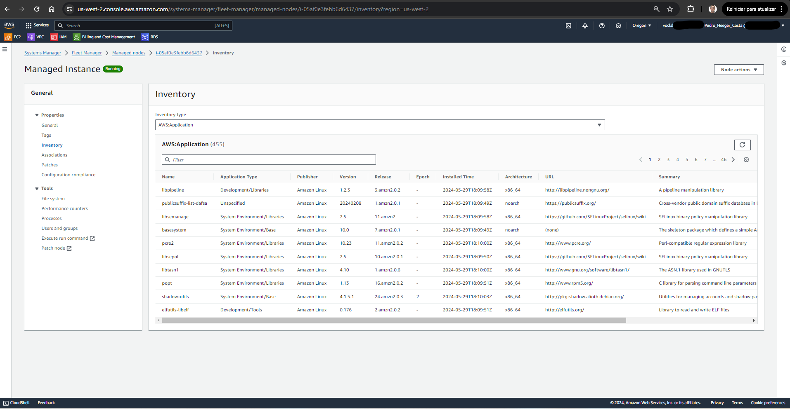<br>
    <figcaption>Imagem 02.</figcaption>
</figure></div><br>

A tarefa 2 utilizou o recurso *Run Command* do **AWS SSM** para instalar uma aplicação personalizada através de um script na instância do **Amazon EC2**. Esse script instalaria um servidor **Apache HTTP (Httpd)**, o **PHP**, o **AWS SDK** e o aplicativo web (`Widget Manufacturing Dashboard`). Ao selecionar o *Run Command* foi exibida uma lista de documentos pré-configurados para execução de comandos comuns. Contudo foi realizado um filtro na busca, onde foi definida a opção `Owner` como `Owned by me`, ou seja, de minha propriedade. Então o documento que era exibido foi selecionado e a opção da versão do documento foi mantido como 1 (padrão). Esse documento foi criado automaticamente ao iniciar o laboratório pelo **AWS CloudFormation**, juntamente com outros serviços e recursos necessários para este laboratório. Um documento do recurso *Run Command* do **AWS SSM** é chamado de SSM Document. Esses documentos são usados para definir as ações que o **AWS Systems Manager (AWS SSM)** deve executar em uma ou mais instâncias gerenciadas. Essas ações são, normalmente, comandos **Bash** executados direto na instância do **Amazon EC2**. A seguir é mostrado o documento do SSM utilizado, em **JSON**. Observe que foram instalados os softwares mencionados anteriormente e também foi configurado a aplicação web. Além dos comandos do *Run Command*, alguns metadados são definidos no arquivo SSM Document.

```json
{
  "schemaVersion": "2.2",
  "description": "Install Dashboard App",
  "mainSteps": [
    {
      "inputs": {
        "runCommand": [
          " #!/bin/sh",
          " # Install Apache Web Server and PHP",
          " yum install -y httpd",
          " amazon-linux-extras install -y php7.2",
          " # Turn on web server",
          " systemctl enable httpd.service",
          " systemctl start  httpd.service",
          " # Download and install the AWS SDK for PHP",
          " wget https://github.com/aws/aws-sdk-php/releases/download/3.62.3/aws.zip",
          " unzip aws -d /var/www/html",
          " # Download Application files",
          " #wget https://aws-tc-largeobjects.s3.amazonaws.com/CUR-TF-100-RESTRT-1/169-lab-%5BJAWS%5D-systems-manager/scripts/widget-app.zip",
          " wget https://aws-tc-largeobjects.s3.us-west-2.amazonaws.com/CUR-TF-100-RSJAWS-1-23732/169-lab-JAWS-systems-manager/s3/widget-app.zip",
          " unzip widget-app.zip -d /var/www/html/"
        ]
      },
      "name": "InstallDashboardApp",
      "action": "aws:runShellScript"
    }
  ]
}
```

Com o SSM Document escolhido na configuração do *Run Command*, o próximo passo foi definir o destino (`target`). No target foi escolhida a opção de selecionar as instâncias manualmente (`Choose instances manually`) e foi escolhida a instância gerenciada. Essa instância gerenciada possuía o agente do Systems Manager instalado. Dessa forma, o agente inscreveu a instância no serviço, o que permitiu que ela fosse selecionada para o recurso *Run Command*, ou qualquer outro recurso do **AWS System Manager (AWS SSM)**. Já nas opções de saída, foi desmarcado habilitar um bucket do S3 (`Enable an S3 bucket`). A seção de comando da **AWS CLI** foi expandida e nela era exibida o comando da **AWS CLI** que executava o recurso *Run Command*. O comando que ela executava é exibido abaixo, onde o SSM Document, mostrado anteriormente, é indicado pelo seu nome. Este comando poderia ser copiado para ser utilizado no futuro em um script em vez de usar no console de gerenciamento da **AWS**, desde que houvesse o documento do SSM de nome especificado. Ao selecionar executar, o comando foi executado com êxito. Cada comando executado no *Run Command* ficava armazenado como histórico e era possível abrir cada comando individualmente para verificar as informações, conforme mostrado na imagem 03. Contudo, caso o status geral não mudasse para êxito, era necessário clicar no ícone de atualização para que o status do comando fosse atualizado.

```
aws ssm send-command --document-name "c121184a2913379l6867098t1w851725497037-InstallDashboardApp-0Uw4GGYPAvmP" --document-version "1" --targets '[{"Key":"InstanceIds","Values":["i-05af0e3febb6d6437"]}]' --parameters '{}' --timeout-seconds 600 --max-concurrency "50" --max-errors "0" --region us-west-2
```

<div align="Center"><figure>
    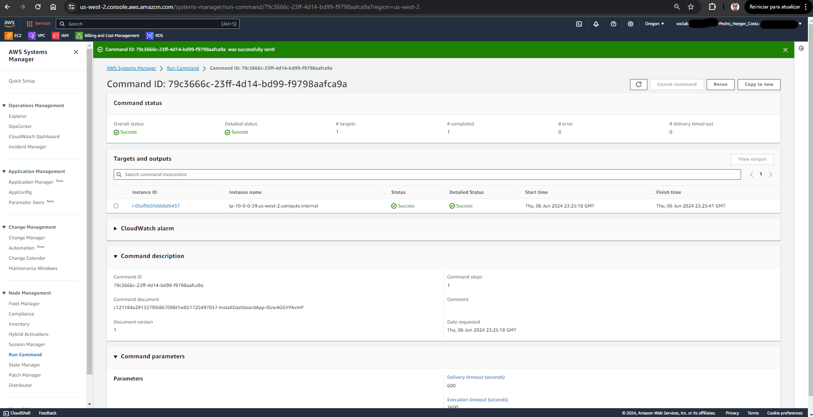<br>
    <figcaption>Imagem 03.</figcaption>
</figure></div><br>

No sandbox **Vocareum** foi copiado o IP público do servidor (instância do **Amazon EC2**) para utilizar em uma nova aba do navegador web da maquina física **Windows** para acessar a aplicação `Widget Manufacturing Dashboard`. Esse IP era visualizado na opção `Detalhes` do **Vocareum**, mas o IP era o mesmo do visualizado na instância do serviço **Amazon EC2**. A imagem 04 exibe a aplicação sendo acessada pelo navegador web.

<div align="Center"><figure>
    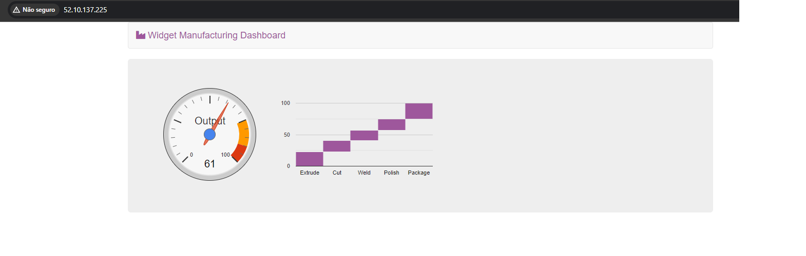<br>
    <figcaption>Imagem 04.</figcaption>
</figure></div><br>

Na terceira tarefa, foi utilizado o recurso *Parameter Store* para armazenar um parâmetro que foi utilizado para ativar um recurso na aplicação. Voltando para aba aberta no console da **AWS** pelo **Vocareum**, foi selecionado o recurso citado para criar o parâmetro. Nas configurações foi definido em nome `/dashboard/show-beta-features`, em descrição `Display beta features`, em nível e em tipo as opções padrões foram mantidas, e em valor foi definido como `True`. Após criar o parâmetro, uma mensagem informava que o mesmo foi criado com sucesso. Para verificar, foi preciso voltar na aba do navegador da maquina física onde a aplicação estava aberta e atualizar a página. Observe que agora três grafos foram exibidos ao invés de dois como anteriormente, conforme mostrado na imagem 05. O código da aplicação estava conferindo o armazenamento de parâmetros para determinar se o grafo adicional (que ainda está em beta) deveria ser exibido. Como a condição `show-beta-features` foi definida como `True`, o terceiro grafo foi exibido. É comum configurar as aplicações para exibirem “recursos ocultos” que estão instalados, mas ainda não ativados. Opcionalmente, esse parâmetro foi excluído e, depois, a página da aplicação foi atualizada. Note, na imagem 06, que o terceiro grafo desapareceu novamente.

<div align="Center"><figure>
    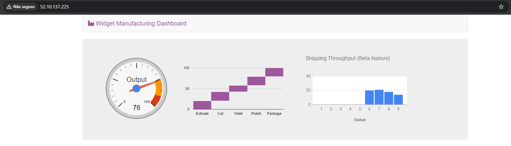<br>
    <figcaption>Imagem 05.</figcaption>
</figure></div><br>

<div align="Center"><figure>
    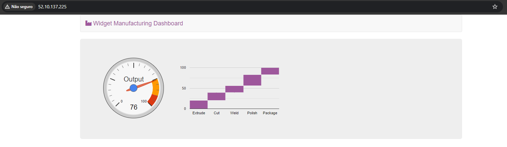<br>
    <figcaption>Imagem 06.</figcaption>
</figure></div><br>

Na última tarefa, o recurso utilizado foi o *Session Manager* para acessar a instância do **Amazon EC2** sem precisar se conectar à instância usando SSH. O *Session Manager* é uma das formas seguras de acessar a instância. No console de gerenciamento da **AWS** aberto pelo **Vocareum**, foi selecionado este recurso e escolhida a opção de inciar sessão, selecionando a instância gerenciada que seria acessada. Uma nova sessão foi aberta no navegador da maquina física **Windows** em um terminal SSH. Então o comando `ls /var/www/html` foi executado para listar os arquivos da aplicação web. Ainda na janela da sessão foram executados os dois comandos abaixo. O primeiro obtinha a zona de disponibilidade (AZ) através de uma solicitação GET ao serviço de metadados da instância, cuja URL específica utilizava o IP link-local `169.254.169.254` para retornar a AZ na qual a instância estava sendo executada. Já o segundo removia o último caractere da string armazenada na variável `AZ` para obter a região e definir essa região na variável de ambiente que era utilizada pelo **AWS CLI**. O **AWS CLI** já vinha instalado na instância do EC2, pois ela era um **Amazon Linux**. Em seguida, o comando `aws ec2 describe-instances` foi executado para listar os detalhes das intâncias do EC2 criadas, conforme mostrado na imagem 07.

```
AZ=`curl -s http://169.254.169.254/latest/meta-data/placement/availability-zone`
export AWS_DEFAULT_REGION=${AZ::-1}
```

<div align="Center"><figure>
    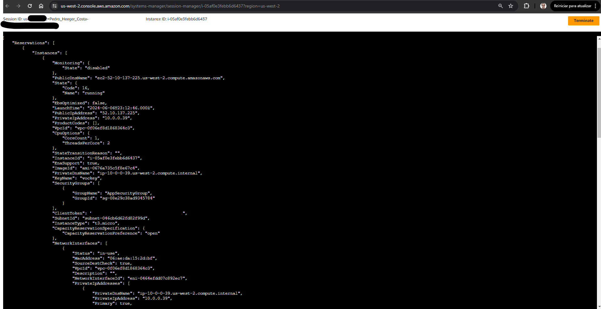<br>
    <figcaption>Imagem 07.</figcaption>
</figure></div><br>

<a name="item5.11"><h4>5.11 Ferramentas de administração e desenvolvimento</h4></a>[Back to summary](#item5) | <a href="">Certificate</a>

O **AWS Tools for PowerShell** permite criar scripts para operações nos recursos da **AWS** por meio da linha de comando do **PowerShell**. Com essas ferramentas, é possível realizar muitas das mesmas ações disponíveis no **AWS SDK for .NET**. Através da linha de comando do **PowerShell**, é possível realizar tarefas rápidas como criar e configurar grupos de segurança, iniciar instâncias, criar e excluir buckets do **Amazon S3**, e executar tarefas do IAM, como atribuir uma função a um usuário. O **AWS Tools for PowerShell** fornece um conjunto de cmdlets, comandos usados no ambiente do **Microsoft Windows PowerShell** para executar ações, e oferece suporte ao mesmo conjunto de serviços e regiões compatíveis com os SDKs da **AWS**. Neste curso foi apresentado alguns comandos básicos para interagir com alguns dos principais serviços da **AWS**.

O conceito de infraestrutura como código (IaC) é essencial para a computação em nuvem e distingue a nuvem dos ambientes de TI tradicionais. Os SDKs e APIs da **AWS** oferecem ferramentas para gerenciar recursos na **AWS** com uma abordagem IaC. A **AWS** fornece SDKs específicos para várias linguagens de programação (**Python**, **Java**, **JavaScript**, **Golang**, **Ruby**, **.NET**, **PHP**, **Node.js**, **C++**), contendo APIs para essas linguagens. Isso permite que desenvolvedores integrem a conectividade e funcionalidade dos diversos serviços da **AWS** em seus códigos sem precisar escrever funções do zero. Os **AWS SDKs** vêm com ampla documentação, incluindo guias de início, guias do desenvolvedor, referências de API e fóruns da comunidade ou blogs de desenvolvedores.

O **AWS CloudFormation** é uma ferramenta útil que permite criar, atualizar ou excluir implantações completas de infraestrutura da **AWS** de maneira previsível e repetida. Com o **AWS CloudFormation**, toda a infraestrutura pode ser modelada em um único arquivo de texto escrito em **JSON** ou **YAML**. Esse modelo define todos os recursos da **AWS** necessários para uma pilha, que é um conjunto de recursos gerenciado como uma unidade única. Recursos na pilha podem incluir instâncias do EC2, **Amazon RDS**, VPCs, entre outros serviços da **AWS**. O **AWS CloudFormation** permite visualizar como as alterações propostas afetarão os recursos existentes antes de aplicá-las, garantindo que apenas mudanças aprovadas sejam executadas.

Outro recurso do **AWS CloudFormation** é a detecção de desvios. Ao executar uma operação de detecção de desvio em uma pilha, é possível determinar se a configuração real da pilha se desviou da configuração esperada definida no modelo. Um recurso é considerado desviado se algum de seus valores de propriedade reais for diferente dos esperados ou se a propriedade ou recurso tiver sido excluído. Uma pilha é considerada desviada se um ou mais de seus recursos tiverem se desviado. Se o recurso na pilha for compatível com a detecção de desvios, a operação fornecerá informações detalhadas sobre o status do desvio desse recurso. O **AWS CloudFormation** também suporta extensões personalizadas para modelos de pilha que podem ser criadas utilizando o **AWS Lambda**. É possível desenvolver provisionamento personalizado em uma função do Lambda e configurar uma pilha do **AWS CloudFormation** para acionar essa função ao ser criada. Por exemplo, pode-se escrever uma lógica de provisionamento personalizada para tarefas como buscar os IDs mais recentes da imagem de máquina da Amazon (AMI) para utilização nas pilhas.

O **AWS OpsWorks** é um serviço de gerenciamento de configuração que oferece instâncias gerenciadas do **Chef** e do **Puppet**. Essas plataformas de automação permitem usar código para automatizar as configurações de servidores. Com o **AWS OpsWorks**, **Chef** e **Puppet** podem ser utilizados para automatizar a configuração, implantação e gerenciamento de servidores nas instâncias do EC2 ou em ambientes locais. O **AWS OpsWorks** inclui três opções: *AWS OpsWorks for Chef Automate*, *AWS OpsWorks for Puppet Enterprise* e *AWS OpsWorks Stacks*.

<a name="item5.12"><h4>5.12 Hospedar um site estático no S3 da AWS</h4></a>[Back to summary](#item5) | <a href="">Certificate</a>

O **Amazon Simple Storage Service (Amazon S3)** oferece armazenamento de objetos com diversas aplicações práticas. Uma delas é a hospedagem de sites estáticos. Utilizando o **Amazon S3** para essa finalidade, é possível evitar a necessidade de configurar uma infraestrutura de tempo de execução complexa ou custosa. Em um site estático, as páginas da web são construídas utilizando linguagens simples como **HTML**, **CSS** ou **JavaScript**. Por contraste, um site dinâmico depende do processamento realizado no servidor, incluindo scripts do lado do servidor como **PHP**, **JSP** ou **ASP.NET**.

Para hospedar um site estático no **Amazon S3**, siga estas etapas simples: Primeiramente, crie um bucket no **Amazon S3** para armazenar o conteúdo do site. Em seguida, configure o bucket do S3 para habilitar a hospedagem de sites e conceder permissões públicas de leitura para o conteúdo. Por fim, carregue o conteúdo do site para o bucket usando o Console de Gerenciamento da **AWS** ou a **AWS Command Line Interface (AWS CLI)**. Para acessar o site, utilize a URL do endpoint que o **Amazon S3** atribui a ele. A URL do endpoint inclui o nome do bucket e o nome da região que o contém. Dependendo da região em que o bucket foi criado, o formato da URL do endpoint pode variar no separador antes do nome da região: um ponto (.) para algumas regiões, como UE (Frankfurt), e um traço (-) para outras regiões, como Oeste dos EUA (Oregon). Ao carregar conteúdo para hospedagem de um site estático no **Amazon S3**, organize-o em uma estrutura de pastas que reflita a hierarquia do site. Além disso, ao habilitar um bucket para hospedagem de sites, é necessário especificar um documento de índice. Esse documento serve como a página padrão que o **Amazon S3** retorna quando uma solicitação é feita para o diretório raiz do site ou para suas subpastas. Certifique-se de incluir esse documento de índice no nível apropriado da hierarquia de pastas do conteúdo web que está sendo carregado para o **Amazon S3**.

Em vez de acessar um site estático através do seu endereço URL direto no **Amazon S3**, é possível usar o **Amazon Route 53** para associar um nome de domínio personalizado ao endpoint do **Amazon S3**. Por exemplo, um usuário pode vincular o nome de domínio mompopcafe.com ou um subdomínio como www.mompopcafe.com. Neste cenário, tanto o domínio principal (mompopcafe.com) quanto o subdomínio (www.mompopcafe.com) são utilizados para acessar o site. Para implementar essa configuração, são criados dois buckets no **Amazon S3**: um para o nome de domínio principal e outro para o subdomínio. O bucket do domínio principal armazena o conteúdo do site, enquanto o bucket do subdomínio pode redirecionar as solicitações para o bucket principal, se necessário. Os nomes dos buckets devem corresponder exatamente aos nomes dos domínios correspondentes. Além disso, são configurados registros de alias no **Amazon Route 53** para mapear os nomes de domínio e subdomínio aos endpoints dos buckets do S3 correspondentes.

<a name="item5.13"><h4>5.13 170-[JAWS]-Visão geral da atividade do café: crie um site no S3</h4></a>[Back to summary](#item5) | <a href="">Certificate</a>

Neste laboratório, o objetivo foi criar um site estático simples de uma cafeteria e padaria em um bucket no serviço **Amazon Simple Storage Service (Amazon S3)**, fazendo upload dos arquivos do site para o bucket. Também foi criado um novo usuário do IAM que tinha acesso total ao S3 e um arquivo de lote para atualizar o site estático quando algum dos arquivos do site fossem alterados localmente. O laboratório foi dividido em etapas, cada etapa correspondia a uma tarefa a ser realizada, totalizando nove tarefas, sendo a última opcional. Algumas dessas etapas foram realizadas pelo **AWS CLI** instalado em uma instância do **Amazon Elastic Compute Cloud (Amazon EC2)** que foi acessada utilizando o recurso *Session Manager* do **AWS System Manager (AWS SSM)**.

A primeira tarefa consistiu em conectar-se a instância EC2 utilizando o recurso *Session Manager* do **AWS System Manager (AWS SSM)**. Esta instância era uma **Amazon Linux** que foi provisionada automaticamente ao iniciar o laboratório. A instância foi selecionada e o valor da propriedade `InstanceSessionUrl` foi copiada e colada no navegador da maquina física **Windows** para estabelecer a conexão com a instância utilizando o SSM. Um prompt foi exbido no navegador. Este era um terminal SSH onde era possível executar comandos dentro da instância, que possuía um shell aberto com o usuário `ssm-user`. Com o comando `sudo su -l ec2-user` foi iniciada uma noova sessão do shell com o login completo para `ec2-user`, carregando o ambiente e arquivos de configuração do usuário `ec2-user`. Em seguida, com o comando `pwd` foi exibido o nome de usuário desta sessão e o diretório corrente, conforme mostrado na imagem 08.

<div align="Center"><figure>
    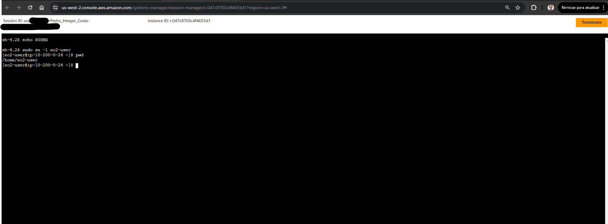<br>
    <figcaption>Imagem 08.</figcaption>
</figure></div><br>

Na tarefa 2, não foi necessário instalar a **AWS CLI**, pois a mesma já vinha instalada em instâncias do **Amazon Linux**. Portanto, foi preciso apenas configurar o usuário da conta **AWS** que utilizaria a CLI, que neste caso foi . Então o ID e secret da chave de acesso foi informado. Também foi solicitado a definição de uma região padrão que a **AWS CLI** utilizaria, que foi `us-west-2` (Oregon), e o formato de saída dos dados, que foi definido como `json`. Essas duas configurações finais são opcionais, caso não sejam definidas, a **AWS CLI** define o padrão que é `us-east-1` (Virgínia do Norte) e `json`. A imagem 09 abaixo exibe o usuário fulano configurado na **AWS CLI** da instância do **Amazon EC2**.

<div align="Center"><figure>
    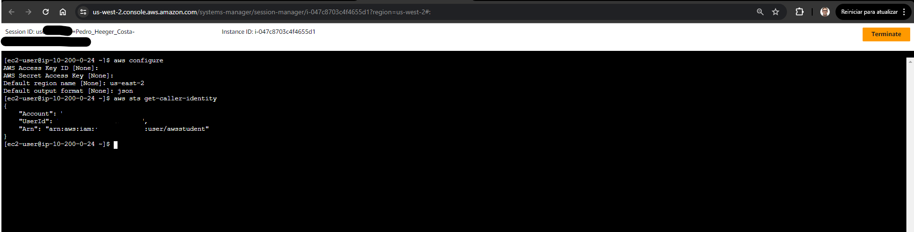<br>
    <figcaption>Imagem 09.</figcaption>
</figure></div><br>

A terceira tarefa foi a criação de um bucket no **Amazon S3** utilizando a **AWS CLI** configurada. No shell da instância EC2 conectada pelo navegador através do *Session Manager** foi executado o comando `aws s3api create-bucket --bucket pheeger5988 --region us-west-2 --create-bucket-configuration LocationConstraint=us-west-2`. Com o comando `aws s3 ls`, todos os buckets criados em qualquer região da **AWS** foram listados. Na imagem 10 é exibido apenas o nome do bucket criado que seria utilizado para construção do site estático.

<div align="Center"><figure>
    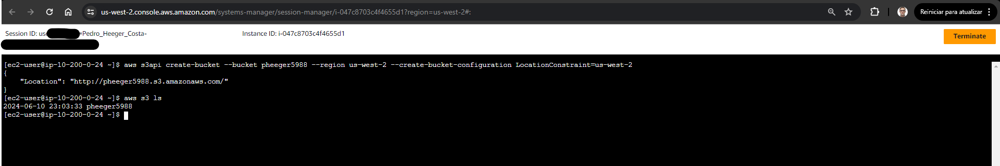<br>
    <figcaption>Imagem 10.</figcaption>
</figure></div><br>

Na tarefa 4 foi criado um usuário do IAM no **AWS IAM** que teria acesso total ao **Amazon S3**. Com o comando `aws iam create-user --user-name awsS3user` executado na **AWS CLI** na instância EC2 aberta no navegador da maquina física **Windows**, o usuário `awsS3user` foi criado. Em seguida, com o comando `aws iam create-login-profile --user-name awsS3user --password Training123!`, um perfil de login foi elaborado para esse usuário, define uma senha para acesso a plataforma da **AWS**. Após isso, foi realizado o acesso a plataforma da **AWS** com esse usuário pelo **AWS Console Management**. Contudo isso foi realizado dentro do sandbox **Vocareum**. Como ao abrir a página da **AWS** pelo **Vocareum** já vem logado em um usuário federado, a opção `Sair` foi selecionada para sair da conta desse usuário e acessar com o usuário do IAM criado. Entretanto, foi necessário copiar o ID da conta da raíz da **AWS** desse usuário federado, pois o usuário do IAM construído foi desse usuário federado. Ao acessar o console de gerenciamento da **AWS**, foi escolhida a opção de fazer login com o usuário do IAM, portanto foi necessário colar o ID da conta copiado, eliminando qualquer caractere de traço, mantendo só os números. Em seguida, foi solicitada o nome do usuário do IAM, que era `awsS3user`, e a senha, que era `Training123!`. Então o login foi concluído e foi possível acessar o console da **AWS** com este usuário.

<div align="Center"><figure>
    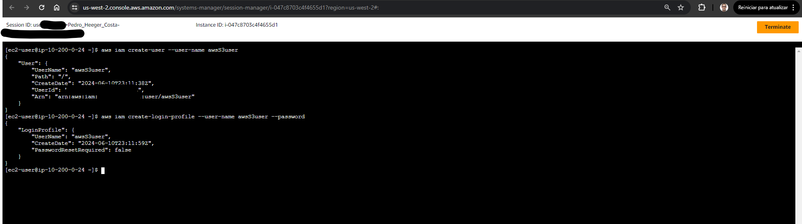<br>
    <figcaption>Imagem 11.</figcaption>
</figure></div><br>

Dando continuidade, o serviço **Amazon S3** foi aberto, porém este usuário não possuía permissões vinculadas ao S3, logo ocorreu um erro como mostrado na imagem 12. De volta a aba do navegador conectado na instância do **Amazon EC2**, foi executado o comando `aws iam list-policies --query "Policies[?contains(PolicyName,'S3')]"` com **AWS CLI** para encontrar todas as políticas que continham em seu nome a palavra `S3`. Uma lista foi exibida e foi necessário procurar a política que permitia acesso total ao S3. Após encontrá-la, foi executado o comando `aws iam attach-user-policy --policy-arn arn:aws:iam::aws:policy/AmazonS3FullAccess --user-name awsS3user`, informando a parte final do seu ARN, que era o seu próprio nome. Assim, o usuário do IAM criado possuiria acesso total ao **Amazon S3**. Então, para verificar essa condição, a aba do navegador aberta no **AWS Console Management** no serviço do S3 foi atualizado e conforme evidenciado na imagem 13, o erro não apareceu e o bucket construído anteriormente foi listado, pois agora o usuário possuía as permissões necessárias.

<div align="Center"><figure>
    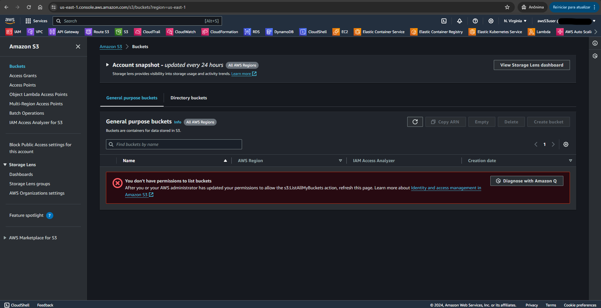<br>
    <figcaption>Imagem 12.</figcaption>
</figure></div><br>

<div align="Center"><figure>
    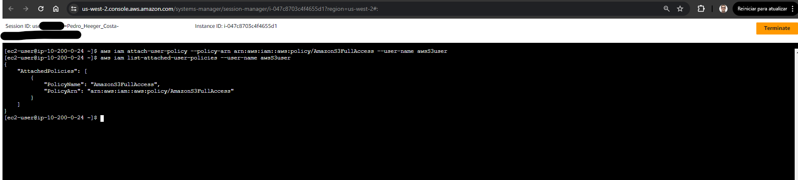<br>
    <figcaption>Imagem 13.</figcaption>
</figure></div><br>

Na quinta tarefa, com o usuário do IAM acessando pelo console de gerenciamento da **AWS** o serviço S3, o bucket foi selecionado para alterar as suas próprias permissões, desmarcando a opção `Bloquear todo acesso ao público`. Também foi alterado em `permissions` as configurações de ACLs para o bucket determinado, concedendo permissões básicas de leitura/gravação. Contudo, para alterar isso era preciso modificar a propriedade de contoles (`Ownership Controls`), alterando de proprietário do bucket aplicado (`Bucket Owner Enforced`) para proprietário do bucket preferencial (`Bucket Owner Preferred`), habilitando as ACLs. Ao realizar isso, uma configuração padrão das ACLs era definida e caso precissasse modificar as confifurações, era só editar. A imagem 14 mostra essas configurações realizadas.

<div align="Center"><figure>
    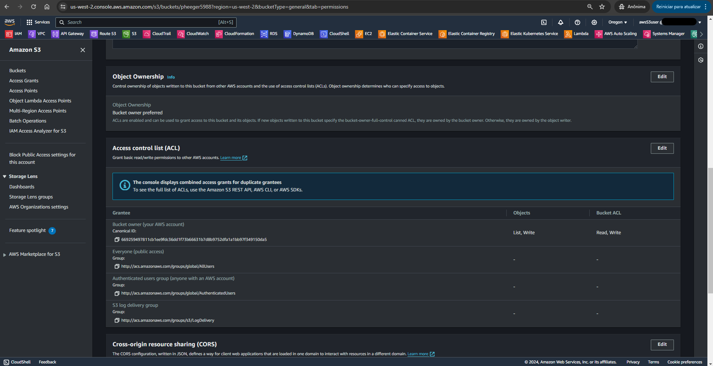<br>
    <figcaption>Imagem 14.</figcaption>
</figure></div><br>

Na tarefa 6, na aba do navegador conectada a instância do EC2 via *Session Manager*, os arquivos necessários para construção do site estático foram extraídos com os seguintes comandos: `cd ~/sysops-activity-files`, `tar xvzf static-website-v2.tar.gz` e `cd static-website`. Esses arquivos já estavam presentes na instância do EC2 que foi provisionada automaticamente ao iniciar o laboratório. Na imagem 15, utilizando o comando `ls` de dentro da pasta `static-website` que foi extraída, os arquivos que formariam o site foram listados.

<div align="Center"><figure>
    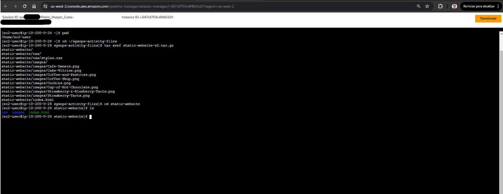<br>
    <figcaption>Imagem 15.</figcaption>
</figure></div><br>

Na sétima tarefa, o objetivo foi fazer o upload desses arquivos da pasta `static-website` para o bucket construído na **AWS**. Entretanto, antes de enviar os arquivos, foi preciso executar o comando `aws s3 website s3://pheeger5988/ --index-document index.html` para garantir que o arquivo `index.html` fosse conhecido como o documento de índice, ou seja, página raiz do site. Para executar o upload dos arquivos foi executado o comando `aws s3 cp /home/ec2-user/sysops-activity-files/static-website/ s3://pheeger5988/ --recursive --acl public-read`. Observe que o comando upload inclui um parâmetro de lista de controle de acesso (ACL). Esse parâmetro especificava que os arquivos carregados tivessem acesso público de leitura. Ele também inclui o parâmetro `--recursive`, que indicava que era necessário fazer upload de todos os arquivos no diretório atual na máquina. Para confirmar que o upload dos arquivos foi realizado corretamente, foi utilizado o comando `aws s3 ls pheeger5988`, que listava todos os arquivos no bucket construído. A imagem 16 evidencia os arquivos no bucket.

<div align="Center"><figure>
    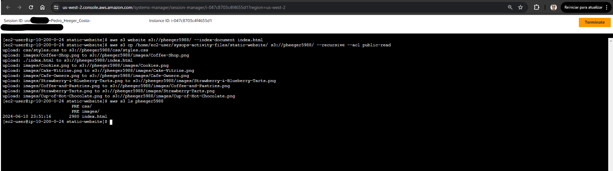<br>
    <figcaption>Imagem 16.</figcaption>
</figure></div><br>

Pelo console de gerenciamento da **AWS**, ao selecionar o bucket e as propriedades é possível visualizar que a hospedagem de site estático está habilitada, conforme imagem 17. Para abrir o site estático criado, foi copiado a URL do endpoint do bucket e colado em uma outra aba do navegador da maquina física. A imagem 18 exibe o site estático sendo acesso pelo navegador da maquina física **Windows**.

<div align="Center"><figure>
    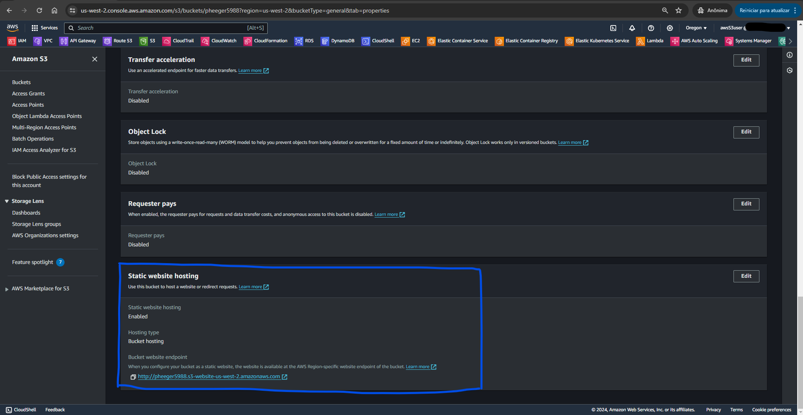<br>
    <figcaption>Imagem 17.</figcaption>
</figure></div><br>

<div align="Center"><figure>
    <br>
    <figcaption>Imagem 18.</figcaption>
</figure></div><br>

Na tarefa 8 foi criado um arquivo em lote para tornar a atualização do site repetível. Na aba aberta na instância do EC2, foi executado no shell o comando `history` para extrair o histórico de comandos recentes. Em seguida, foi procurado o comando que foi executado a copia dos arquivos e copiada essa linha. Com o comando `cd ~` foi alterado o diretório corrente para a pasta do usuário e lá foi criado um arquivo vazio com o comando `touch update-website.sh`. Com o comando `vi update-website.sh` foi aberto o arquivo no editor de código **VI**. Para entrar no modo de edição do **VI** foi utilizado a tecla `i`. Em seguida, foi inserida essas duas linhas `#!/bin/bash` e `aws s3 cp /home/ec2-user/sysops-activity-files/static-website/ s3://pheeger5988/ --recursive --acl public-read`, sendo a primeira padrão de um arquivo **Bash** e a segunda a linha que copiava os arquivos para o bucket. Para gravar as alterações e sair do arquivo, foi pressionado a tecla `Esc`, e inserido o comando `:wq` e pressionado a tecla `Enter`. Com o comando `chmod +x update-website.sh`, esse arquivo foi transformado em um arquivo de lote executável. 

Agora foi necessário apenas fazer uma alteração nos arquivos do site, localmente. Isso foi realizado abrindo com o editor **VI** o arquivo **HTML** `vi sysops-activity-files/static-website/index.html`. Algumas alterações foram realizadas nesse arquivo. As duas linhas onde tinham `bgcolor="aquamarine"` foram modificadas para `bgcolor="gainsboro"`. A linha onde tinha `bgcolor="orange"` foi modificada para `bgcolor="cornsilk"`. Após confirmar as alterações e fechar o arquivo, o arquivo em lote foi executado com o comando `./update-website.sh`, realizando as substituições de todos os arquivos existentes no bucket por novos arquivos, conforme mostrado na imagem 19. Para conferir as alterações, foi só atualizar a página do site que estava aberta em uma das abas do navegador da maquina física. Note na imagem 20 que algumas cores foram alteradas.

<div align="Center"><figure>
    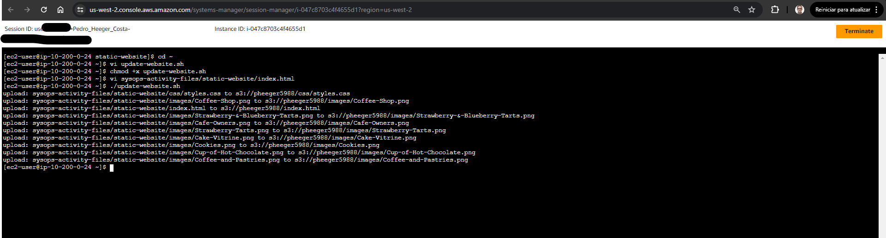<br>
    <figcaption>Imagem 19.</figcaption>
</figure></div><br>

<div align="Center"><figure>
    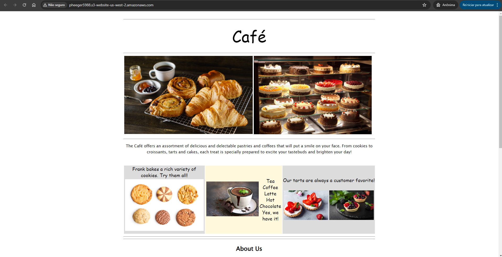<br>
    <figcaption>Imagem 20.</figcaption>
</figure></div><br>

Por fim, o desafio opcional foi basicamente a mesma tarefa anterior, apenas realizou uma otimização do arquivo de script em lote . A diferença é que no arquivo de lote, o comando inserido foi `aws s3 cp /home/ec2-user/sysops-activity-files/static-website/ s3://pheeger5988/ --recursive --acl public-read`. Este comando copiava todos os arquivos para o bucket, inclusive os arquivos que não tinham sido alterados, sobescrevendo os existentes no bucket. Neste desafio, a ideia foi alterar esse comando para o comando `aws s3 sync /home/ec2-user/sysops-activity-files/static-website/<s3://<my-bucket>/ --acl public-read`, que ao invés de copiar tudo, comparava os arquivos e atualizava apenas os arquivos que foram modificados.

<a name="item5.14"><h4>5.14 Visão geral da computação (servidores)</h4></a>[Back to summary](#item5) | <a href="">Certificate</a>

NSA

<a name="item5.15"><h4>5.15 Computação na AWS</h4></a>[Back to summary](#item5) | <a href="">Certificate</a>

As instâncias EC2 operam como máquinas virtuais em computadores host situados nas zonas de disponibilidade da **AWS**. Cada uma dessas máquinas virtuais roda um sistema operacional (SO), como **Amazon Linux** ou **Microsoft Windows**. É possível instalar e rodar aplicativos no sistema operacional de cada máquina virtual, ou até mesmo executar aplicativos empresariais que utilizam várias máquinas virtuais. As máquinas virtuais funcionam sobre uma camada de hipervisor, que é gerenciada pela **AWS**. O hipervisor atua como a camada de plataforma operacional que oferece às instâncias EC2 acesso ao hardware físico necessário para a sua operação, incluindo processadores, memória e armazenamento. Cada instância EC2 recebe um número específico de CPUs virtuais para processamento e uma quantidade determinada de memória ou RAM.

Algumas instâncias do EC2 utilizam armazenamento de instância, também conhecido como armazenamento temporário. Este tipo de armazenamento está fisicamente ligado ao servidor host e oferece espaço de armazenamento temporário em nível de bloco para a instância. Os dados armazenados neste tipo de armazenamento só permanecem enquanto a instância estiver ativa. Se a instância for reiniciada, os dados persistem, mas se for interrompida ou encerrada, os dados serão perdidos permanentemente. Muitas instâncias do EC2 preferem usar o **Amazon Elastic Block Store (Amazon EBS)** para o disco de inicialização e outras necessidades de armazenamento. O **Amazon EBS** fornece volumes de armazenamento em bloco persistentes, garantindo que os dados permaneçam mesmo quando a instância do EC2 é interrompida. As instâncias otimizadas para o **Amazon EBS** são projetadas para reduzir a contenção de entrada/saída (E/S) entre o **Amazon EBS** e outros tipos de tráfego da instância, proporcionando um desempenho mais consistente. A contenção de E/S ocorre quando várias máquinas virtuais competem por recursos de armazenamento, devido à largura de banda limitada.

As instâncias do EC2 podem se conectar a outros recursos de rede, como outras instâncias EC2, armazenamento de objetos no **Amazon Simple Storage Service (Amazon S3)** e a Internet. O nível de acesso à rede pode ser configurado para atender a diferentes necessidades, equilibrando acessibilidade e segurança. Vários tipos de instâncias oferecem diferentes níveis de desempenho de rede.

Os tipos de instâncias referem-se à variedade de opções disponíveis para executar cargas de trabalho específicas no EC2. Existem diversos tipos de instâncias, desde aquelas de uso geral até as projetadas para oferecer recursos adicionais de CPU, memória RAM ou desempenho de rede. Cada tipo de instância se enquadra em uma categoria e família específica, com variações para diferentes necessidades. Para escolher a instância mais adequada e econômica, é essencial conhecer os requisitos da carga de trabalho que será executada. Por exemplo, a instância t3.nano pertence à categoria de Uso Geral e à família de instâncias T3. O tipo t3.nano oferece 2 vCPUs, 0,5 GB de memória e até 5 Gbps de desempenho de rede, com o sistema operacional inicializado no armazenamento **Amazon EBS**. Em contraste, a instância x1.32xlarge é otimizada para memória, ideal para bancos de dados de alto desempenho e aplicativos empresariais que exigem muita memória. Ela oferece 128 vCPUs, 3.904 GB de memória, 14.000 Mbps de largura de banda dedicada do **Amazon EBS**, desempenho de rede de 25 gigabits e 3.840 GB de armazenamento SSD.

No processo de provisionamento de instâncias EC2, o ponto de partida é uma Imagem de Máquina da Amazon (AMI), que serve como o modelo utilizado pelo **Amazon EC2** para iniciar uma instância. A **AWS** disponibiliza várias AMIs, enquanto outras são oferecidas por terceiros através do **AWS Marketplace**. Também é possível criar uma AMI personalizada a partir de uma instância EC2 já existente. Para iniciar uma instância, é necessário especificar diversos detalhes além da escolha da AMI. Isso inclui o posicionamento da instância e o endereçamento de rede, conforme necessário para proteger e acessar a instância adequadamente. Todas as instâncias são implementadas em uma rede, seja no EC2-Classic ou em uma Virtual Private Cloud (VPC). É possível escolher entre atribuir um endereço IP público ou um endereço Domain Name System (DNS) à instância. O sistema operacional (SO) da instância pode ser inicializado a partir de um armazenamento temporário ou de um volume do Amazon EBS. Volumes de armazenamento em bloco adicionais também podem ser anexados à instância. É necessário configurar um novo security group ou utilizar um existente. O security group define quais portas de rede são permitidas para o tráfego. Além disso, geralmente é especificado um par de chaves para a instância, utilizado para conexões Secure Shell (SSH) ou para acesso via Remote Desktop Protocol (RDP). Durante a execução de uma instância, também é possível fornecer dados do usuário. Esses dados permitem a automação de instalações e configurações na máquina virtual ao ser iniciada, oferecendo uma forma poderosa e simples de gerenciar a configuração inicial da instância.

Uma Imagem de Máquina da Amazon (AMI) contém todas as informações necessárias para iniciar uma instância EC2. Ao iniciar uma instância, uma AMI de origem deve ser especificada. É possível executar múltiplas instâncias a partir de uma única AMI, permitindo a criação de várias instâncias com a mesma configuração. Para diferentes configurações, diferentes AMIs podem ser utilizadas. Uma nova AMI pode ser criada a partir de uma instância a qualquer momento. Por exemplo, ao executar três instâncias a partir da mesma AMI, cada uma pode ser modificada de maneiras distintas, como alterar configurações ou instalar software adicional. Depois, cada instância modificada pode ser capturada como uma nova AMI, resultando em três AMIs distintas. As modificações realizadas em cada instância são salvas como novos modelos para futuras instâncias.

Uma AMI inclui um modelo para o volume raiz da instância, contendo um sistema operacional e, possivelmente, um servidor de aplicativos e outros softwares. Além disso, a AMI inclui permissões de execução, que determinam quais contas **AWS** podem usar a AMI para iniciar instâncias, e permitem disponibilizar a AMI publicamente. A AMI também especifica mapeamentos de dispositivos de blocos, indicando volumes de armazenamento adicionais a serem anexados à instância no momento da execução. Pode-se escolher uma AMI fornecida pela **AWS**, criada por outros usuários da comunidade, disponível no **AWS Marketplace**, ou uma AMI própria.

Ao iniciar uma instância do EC2, ela é lançada dentro de um ambiente de rede VPC (Virtual Private Cloud). Geralmente, isso envolve o uso do **Amazon Virtual Private Cloud (Amazon VPC)** para criar uma VPC, que é uma rede virtual configurada em uma área logicamente isolada dentro da **AWS**. Após criar a VPC, é possível executar recursos da **AWS**, como instâncias EC2, dentro dessa rede virtual. A VPC funciona de maneira semelhante a uma rede tradicional operada em um datacenter próprio. Uma conexão entre duas ou mais VPCs é conhecida como conexão de emparelhamento. Dentro da VPC, são definidas uma ou mais sub-redes, que são segmentos de rede lógicos. Cada sub-rede está associada a uma única zona de disponibilidade, facilitando a organização e a distribuição de recursos dentro da VPC.

Outro aspecto crucial da configuração de rede é o gateway da Internet. Este componente, dimensionado horizontalmente, redundante e altamente disponível na VPC, facilita a comunicação entre as instâncias dentro da VPC e a internet. Adicionalmente, existe o gateway privado virtual, que é um componente opcional projetado para conexões VPN. Localizado no lado da Amazon da conexão VPN, este gateway é criado e anexado à VPC para estabelecer a conexão VPN desejada. No lado do cliente da conexão VPN, está presente o gateway do cliente, que pode ser um dispositivo físico ou um aplicativo de software.

Um security group define conjuntos de regras de firewall para as instâncias, determinando quais tipos de tráfego podem entrar e sair. Os security groups operam no nível da instância, não na subnet. Isso significa que cada instância em uma sub-rede da VPC pode ser associada a diferentes security groups. Caso não seja especificado um grupo específico durante a execução, a instância será automaticamente associada ao security group padrão da VPC.

Existem três tipos principais de endereços IP relacionados às instâncias do EC2. O endereço IP privado é sempre atribuído a cada instância quando ela é iniciada, vindo de um pool de endereços IP privados disponíveis na sub-rede. Esses endereços permitem a comunicação entre as instâncias do EC2 dentro da VPC. O endereço IP público é opcional e pode ser atribuído a uma instância do EC2, gerado dinamicamente a partir de um conjunto de endereços IP públicos disponíveis da **AWS**. Clientes podem usar esse endereço para conectar-se à instância pela Internet. Se uma instância for interrompida e iniciada novamente, um novo endereço IP público é gerado. No entanto, se a instância for reinicializada, ela mantém o mesmo endereço IP público. Por fim, o endereço IP elástico é um endereço IP público, também alocado a partir de um grupo de endereços IP públicos da **AWS**, e pode ser provisionado e atribuído opcionalmente a uma instância do EC2. O endereço IP elástico é estático, permitindo sua reatribuição a outra instância a qualquer momento

Cada instância do EC2 deve ter pelo menos um security group associado. Os security groups funcionam como firewalls com estado que cercam uma ou mais instâncias do EC2, oferecendo controle sobre o tráfego de rede. Um firewall com estado monitora o estado completo das conexões de rede ativas, permitindo controle sobre o tráfego de protocolos como Internet Control Message Protocol (ICMP), do Transmission Control Protocol (TCP) e do User Datagram Protocol (UDP) que podem acessar a instância. Os security groups são aplicados diretamente às instâncias específicas, não ao ponto de entrada da rede. Além de restringir as portas pelas quais o tráfego pode fluir, é possível também controlar de quais endereços IP o tráfego pode se originar. Se o intervalo de endereços IP de origem for configurado como 0.0.0.0/0, qualquer origem poderá acessar essa porta específica. No entanto, é possível especificar um endereço IP específico, um intervalo CIDR (Classless Inter-Domain Routing) ou permitir apenas fontes na Nuvem **AWS** que possuam um security group específico atribuído. É possível atribuir vários security groups a uma única instância ou aplicar um único security group a várias instâncias. Dessa forma, os security groups são muito flexíveis.

Os security groups são projetados para operar na **Amazon VPC** ou no EC2-Classic, sendo impossível usar um security group do EC2-Classic com uma instância em execução em uma VPC. Os security groups do EC2-Classic podem ter regras que se aplicam apenas ao tráfego de entrada, enquanto os security groups da VPC podem controlar tanto o tráfego de entrada quanto o de saída. Por padrão, ao criar um novo security group em uma VPC, todo o tráfego de saída é permitido. Além disso, é possível adicionar ou modificar associações de security groups enquanto uma instância está em execução dentro de uma VPC.

Pode ser vantajoso conceder direitos de acesso específicos para serviços da conta da **AWS** a aplicativos em execução em uma instância do EC2. Alternativamente, pode ser desejável conceder acesso específico a usuários conectados a uma instância do EC2. Para isso, é possível atribuir um perfil de instância à instância. Um perfil de instância serve como um contêiner para uma função do **AWS Identity and Access Management (AWS IAM)**, que por sua vez pode ter uma ou mais políticas do IAM associadas. Essas políticas concedem acesso temporário aos recursos da conta conforme necessário. A utilização de perfis de instância permite conceder acesso a recursos específicos da conta sem a necessidade de armazenar credenciais de chave de acesso e chave de acesso secreta diretamente nas instâncias do EC2. Evitar o armazenamento de credenciais permanentes nas instâncias do EC2 é crucial para a segurança, uma vez que tais credenciais podem ser comprometidas se não forem gerenciadas adequadamente.

Os usuários da conta da **AWS** podem utilizar um perfil de instância para conceder permissões a instâncias do EC2, permitindo que elas acessem os buckets do S3 onde os dados do aplicativo são armazenados. Para isso, é necessário definir uma função do IAM que habilite o serviço do EC2 a usar essa função. A função do IAM deve ter uma política anexada que conceda o nível adequado de acesso ao **Amazon S3**. Posteriormente, essa função do IAM é atribuída à instância quando ela é iniciada ou em um momento posterior. O perfil de instância que contém a função do IAM é criado como um contêiner e então associado à instância. Esse exemplo demonstra uma abordagem arquitetônica muito útil, na qual dados críticos são armazenados no **Amazon S3** em vez de localmente na instância, aumentando a disponibilidade global dos dados e proporcionando maior flexibilidade para acesso e utilização.

Uma outra funcionalidade útil ao iniciar uma instância a partir de uma AMI é o parâmetro de dados do usuário. Os dados do usuário são uma ferramenta poderosa que facilita a implantação automatizada e repetível de instâncias do EC2. Com os dados do usuário, é possível fornecer um script para uma instância do **Linux** ou **Windows**. Durante a inicialização da instância, esse script é executado como uma sequência de comandos. Nos sistemas **Linux**, os scripts são escritos em shell, enquanto em sistemas **Windows**, podem ser scripts em lote ou PowerShell. Ao utilizar os dados do usuário, é viável automatizar a configuração de uma nova instância sem a necessidade de interação manual.

Os scripts de dados do usuário podem delegar tarefas adicionais. Por exemplo, um script pode baixar e executar um script mais extenso armazenado em um bucket do **Amazon S3**. Também é possível baixar e instalar sistemas de gerenciamento de configuração como **Chef** ou **Puppet**, e então iniciar a execução de uma receita ou módulo de inicialização. Além disso, é possível incorporar comandos da **AWS Command Line Interface (AWS CLI)** nos scripts, presumindo que tenha incluído instruções para instalar a **AWS CLI** previamente no script. Essas etapas seriam dispensáveis se a instância já possuir a **AWS CLI** pré-instalada, como é o caso das instâncias do **Amazon Linux**.

Os scripts de dados do usuário são executados pelo serviço cloud-init em instâncias do **Linux** e pelo serviço EC2Launch em instâncias do **Windows**. Por padrão, esses scripts e diretivas cloud-init são executados apenas durante o primeiro ciclo de inicialização de uma instância. No entanto, é possível configurá-los para serem executados sempre que a instância for reiniciada a partir de um estado interrompido.

No **Linux**, os dados do usuário podem ser configurados de duas maneiras distintas. Na primeira abordagem, o script inicia com a invocação de um interpretador bash incorporado do **Linux**. É possível usar qualquer interpretador que suporte a sintaxe Unix `#!` (sha-bang) e esteja instalado na AMI base do **Linux**. Interpretadores de linguagens de software populares, como **Perl** e **Ruby**, geralmente estão pré-instaladas em imagens recentes de AMI do **Linux**. Na segunda abordagem, a diretiva cloud-config é especificada na primeira linha. O exemplo #cloud-config segue o formato compatível com o serviço cloud-init do sistema operacional **Linux**. O cloud-config permite a instalação de software durante a inicialização inicial da instância, garantindo que o software esteja pronto para uso imediatamente após a inicialização. Essa abordagem pode prolongar o tempo inicial de inicialização do sistema.

Para passar dados do usuário para uma instância do **Windows**, existem duas abordagens distintas: utilizando um conjunto de comandos em lote (Batch) do **Windows** ou um script do **PowerShell**. No método que utiliza um arquivo em batch, são feitas chamadas simples para o utilitário **winrm**, configurando a instância para habilitar a administração remota através do serviço Gerenciamento Remoto do Windows. Por outro lado, o script do **PowerShell** utiliza comandos nativos do **PowerShell** para configurar a instância do **Microsoft Windows** como um servidor Web executando os **Serviços de Informações da Internet (IIS)**. Independentemente da abordagem escolhida, esses scripts podem realizar instalações e configurações sem a necessidade de login direto na instância.

Os metadados de uma instância em execução podem ser acessados internamente durante a execução da instância. Esses metadados são úteis para configurar e gerenciar a instância. Eles estão disponíveis no endereço IP `169.254.169.254`. Ao usar **Curl** para acessar `http://169.254.169.254/latest/meta-data/` a partir de uma instância conectada, é possível obter uma lista dos metadados disponíveis, que incluem informações como: ami-id, ami-launch-index, ami-manifest-path, block-device-mapping/, events/, hostname, iam/, instance-action, instance-id, instance-type, local-hostname, local-ipv4, mac, metrics/, network/, placement/, profile, public-hostname, public-ipv4, public-keys/, reservation-id, security-groups e services/.

Um exemplo de aplicação dos metadados da instância do EC2 está em um script de dados do usuário. Nele, é possível referenciar propriedades da instância do EC2, como IDs de instância, que não são conhecidas até o momento da inicialização. Ao definir variáveis no script de dados do usuário, é possível consultar o serviço de metadados da instância. Para acessar os dados do usuário de uma instância em execução, utiliza-se o seguinte URL `http://169.254.169.254/latest/user-data` ou através do comando do **AWS CLI** `aws ec2 describe-instance-attribute --instance-id i-1234567890abcdef0--attribute userData --output text --query "UserData.Value" | base64 –decode`, decodificando o conteúdo.

O **Amazon EC2** recomenda o uso de criptografia de chave pública para proteger informações de login. Nesse método, uma chave pública é usada para criptografar dados, como senhas, e o destinatário usa uma chave privada correspondente para descriptografar os dados. Essas chaves formam um par de chaves. Para acessar uma instância, é necessário um par de chaves registrado nas configurações do Secure Shell (SSH) do sistema operacional ao qual está conectando. Geralmente, o nome desse par de chaves é especificado ao iniciar a instância pela primeira vez. É possível criar um novo par de chaves durante o processo de inicialização da instância ou usar um par de chaves existente. A **AWS** configura automaticamente a instância para aceitar o par de chaves especificado. Depois que a instância é inicializada, a chave privada correspondente é usada para se conectar a ela.

As configurações padrão de SSH em instâncias do **Linux** não solicitam senha. A autenticação somente por senha é desabilitada por padrão no **Linux**. Em vez disso, espera-se que os usuários utilizem um par de chaves para fazer login, embora seja possível configurar este processo em AMIs personalizadas. Em instâncias do **Windows**, geralmente um par de chaves é usado para descriptografar a senha de administrador, após o qual o login é realizado através do **Remote Desktop Protocol (RDP)**.

A senha de usuário Administrador padrão para instâncias do **Microsoft Windows** e o ec2-user (ou outra senha de usuário padrão) em instâncias do **Linux** são pontos de partida. É responsabilidade definir a própria segurança no nível da instância e decidir como concederá e revogará permissões para acesso à instância à medida que pessoas ingressarem e saírem da organização. Para instâncias do **Microsoft Windows**, o **AWS Directory Service** é usado para conceder e revogar acesso a máquinas com base em usuários e grupos existentes do **Windows**. Para instâncias do **Linux**, várias opções de segurança estão disponíveis. Muitos administradores de sistemas optam por usar o **Kerberos**, um protocolo de autenticação de rede que usa criptografia de chave secreta para fornecer autenticação entre clientes e servidores. O **Kerberos** pode ser parte de uma solução de Autenticação única (SSO). Outros administradores de sistemas **Linux** preferem utilizar ferramentas como o ssh-keygen para gerar seus próprios pares de chaves públicas/privadas para usuários que precisam acessar instâncias do EC2. Quando essa opção é escolhida, os detalhes da chave pública são configurados no arquivo `.ssh/authorized_keys` do usuário e a chave privada é distribuída ao usuário.

É responsabilidade do cliente da **AWS** desenvolver uma estratégia para gerenciar adições e remoções de permissões em uma infraestrutura de instâncias em execução. Uma abordagem é criar AMIs que incluam todos os usuários atuais da empresa, porém essa prática pode ser rígida e desafiadora de gerenciar, especialmente em certas AMIs. Ferramentas de gerenciamento de configuração, como **Chef**, **Puppet** e **Ansible**, podem simplificar significativamente o processo de conceder e revogar acesso em um grande número de máquinas, muitas vezes reduzindo-o a apenas alguns comandos.

<a name="item5.16"><h4>5.16 Gerenciar instâncias da AWS</h4></a>[Back to summary](#item5) | <a href="">Certificate</a>

As instâncias podem passar por diferentes estados. Uma instância entra no estado "Pendente" quando é iniciada ou lançada pela primeira vez. Após o sistema operacional da instância ser inicializado, ela passa por verificações de status do sistema e da própria instância. Em seguida, a instância entra no estado "Em Execução". A partir desse estado, uma instância pode ser interrompida. No entanto, as instâncias que usam armazenamento de instâncias, não um volume persistente do **Amazon Elastic Block Store (Amazon EBS)** para seu volume raiz, só podem ser encerradas, não interrompidas. Instâncias com um volume raiz EBS podem ser interrompidas ou encerradas. Durante o processo de encerramento, a instância é primeiro interrompida e depois encerrada. Uma instância também pode ser reiniciada, seja do estado interrompido ou do estado em execução.

Assim que uma instância entra no estado "Em Execução", começa o processo de faturamento por essa instância. Instâncias **Linux** que são executadas sob demanda, reservadas ou no modelo spot são cobradas em incrementos de 1 segundo. Outros tipos de instância são cobrados por hora completa. Uma instância pode ser reiniciada sem afetar o ciclo de faturamento. No entanto, se uma instância for interrompida e reiniciada, um novo ciclo de faturamento por hora começará imediatamente após o reinício.

Se uma instância com um endereço IP público atribuído for interrompida e iniciada novamente, receberá um novo endereço IP público ao reiniciar. Por outro lado, ao reinicializar apenas a instância, o endereço IP público atual será mantido. Endereços IP elásticos permanecem associados à instância mesmo após uma interrupção, mas são desassociados quando a instância é encerrada.

Certos tipos de instância suportam o recurso de hibernação, como as séries M, R e C que executam o Amazon Linux 1 e 2. Quando uma instância é colocada em hibernação, o sistema operacional convidado preserva os dados na memória, salvando-os no disco. Todos os volumes do EBS permanecem conectados à instância. Ao reiniciar, a instância é restaurada ao estado anterior, recarregando o conteúdo da RAM e retomando os processos anteriores. Similar à interrupção e reinício de uma instância, o endereço IPv4 público original é liberado e um novo é atribuído durante a reinicialização. Da mesma forma, se a instância estiver em hibernação, ela manterá qualquer endereço IP elástico associado. Não há cobrança pelo uso de uma instância em hibernação quando está no estado interrompido. No entanto, o armazenamento em todos os volumes do EBS, incluindo o armazenamento do conteúdo da memória persistente no disco, será cobrado. Volumes de armazenamento de instância não podem ser interrompidos ou colocados em hibernação.

Para habilitar a hibernação, é necessário configurá-la durante a inicialização usando o Console de Gerenciamento da **AWS** ou a **AWS Command Line Interface (AWS CLI)**. Não é possível habilitar a hibernação em uma instância existente que esteja em execução ou parada. O volume raiz da instância deve ser um volume do EBS. Esse volume precisa ter capacidade suficiente para armazenar os dados da RAM e atender ao uso esperado do sistema operacional ou dos aplicativos. Quando a hibernação é ativada, um espaço no volume raiz é reservado na inicialização para armazenar os dados da RAM. Além disso, o volume raiz do EBS deve ser criptografado para garantir a segurança dos dados confidenciais na memória. Durante a transferência dos dados da RAM para o volume raiz do EBS, eles são sempre criptografados. A criptografia do volume raiz é aplicada durante a execução da instância. Para garantir que o volume raiz seja criptografado com o **Amazon EBS**, a AMI usada para iniciar a instância deve ser criptografada. O recurso de hibernação está disponível apenas para instâncias sob demanda, instâncias spot e instâncias reservadas.

É uma prática recomendada considerar instâncias do EC2 como recursos temporários, prontos para serem criados, desativados e recriados conforme necessário. Muitas situações na nuvem demandam a criação de um novo servidor a partir do zero, incluindo:
- Escalonamento automático: Soluções que precisam implantar novas instâncias sem intervenção humana.
- Economia de custos: Decisões de não manter uma instância atualmente, mas ainda precisar da capacidade de recriá-la rapidamente. Casos de uso de processamento em lote frequentemente se enquadram aqui.
- Downgrade: Redução do tipo de instância para economia de custos, como migrar de hardware dedicado para compartilhado ou reduzir o tamanho da instância.
- Reparo de instâncias comprometidas: Substituição de instâncias quando o hardware subjacente falha, garantindo uma nova infraestrutura saudável.
- Atualização: Necessidade de executar novas instâncias para atualizar o sistema operacional ou tipo de imagem da arquitetura.

À medida que as necessidades mudarem, pode-se descobrir que a instância está: sobrecarregada se o tipo de instância for muito pequeno (a carga de trabalho na instância fica sem memória, CPU ou espaço em disco); subutilizada se o tipo de instância for muito grande (a carga de trabalho na instância não utiliza toda a memória, CPU ou espaço em disco alocado). Se uma dessas situações ocorrer, o tamanho da instância pode ser modificado. Por exemplo, se uma instância t2.micro for inadequada para a carga de trabalho, pode-se alterá-la para uma instância m3.medium seguindo estes passos: interromper a instância, modificar o tipo e iniciar a instância. Ao atualizar o tipo de instância, o novo tipo deve ser compatível com a mesma arquitetura. Por exemplo, uma instância com arquitetura de 64 bits só pode ser atualizada para um tipo de instância que também tenha arquitetura de 64 bits. Se o dispositivo raiz for um volume do EBS, é possível simplesmente alterar o tamanho da instância após interrompê-la temporariamente. Se o dispositivo raiz da instância for um volume de armazenamento de instâncias, será necessário migrar o aplicativo para uma nova instância que tenha o tipo de instância desejado.

A **AWS** oferece AMIs gerenciadas que abrangem várias versões e configurações do **Microsoft Windows Server**. Para garantir que os clientes recebam as atualizações de segurança mais recentes automaticamente, a **AWS** mantém as AMIs do **Microsoft Windows** disponíveis por até 3 meses. Após esse período, as AMIs do **Windows** com mais de três meses são tornadas privadas. Uma vez privadas, elas não são mais visíveis no console, mas ainda é possível recuperar o ID da AMI usando a **AWS CLI** ou um SDK da **AWS**. Por outro lado, as AMIs do **Amazon Linux** têm uma disponibilidade prolongada. Ao iniciar uma instância, as AMIs mais recentes do **Amazon Linux** e do *Amazon Linux 2* estão disponíveis na seção "Início rápido" do console de gerenciamento da **AWS**. Também é possível verificar a AMI mais recente do **Amazon Linux** utilizando a **AWS CLI**.

Embora muitas instâncias possam operar por períodos curtos, algumas são mantidas por semanas ou até meses em ambientes como desenvolvimento, teste ou servidores de banco de dados, onde a estabilidade contínua é crucial. É recomendável manter essas instâncias atualizadas regularmente para garantir que tenham as últimas atualizações de segurança. No modelo de responsabilidade compartilhada, cabe ao usuário manter suas instâncias atualizadas. As atualizações automáticas do **Microsoft Windows** podem ser ativadas através do **Windows Update**, mas também é possível optar por desativá-las e aplicar as atualizações manualmente para verificar qualquer impacto nos aplicativos em execução no servidor. Para instâncias do **Amazon Linux**, a **AWS** gerencia um repositório **YUM** próprio, permitindo que o **YUM** instale todas as atualizações mais recentes disponíveis para os aplicativos instalados no servidor. Além disso, o **YUM** pode ser utilizado para atualizar pacotes individualmente, se necessário. Serviços como **AWS Systems Manager** e **AWS OpsWorks** simplificam o processo de atualização das instâncias do EC2, enquanto existem também ferramentas de gerenciamento de configuração de terceiros disponíveis para essa finalidade.

<a name="item5.17"><h4>5.17 Visão geral do laboratório: Instâncias do EC2</h4></a>[Back to summary](#item5) | <a href="">Certificate</a>

Este curso forneceu uma visão geral do laboratório que seria realizado no item <a href="#item5.2">5.20 172- [JAWS] -Laboratório: [Desafio] Exercício de instância do EC2</a><br>. Como isso seria explicado no próprio laboratório, esse curso foi pulado.

<a name="item5.18"><h4>5.18 171- [JAWS] -Lab - Criando instâncias do Amazon EC2</h4></a>[Back to summary](#item5) | <a href="">Certificate</a>

Neste laboratório, o objetivo foi criar uma instância que funcionasse como um servidor web. Contudo, essa instância seria criada pelo **AWS CLI** configurado em uma outra instância criada pelo **AWS Console Management**, que seria utilizada como host bastion e conectada via **SSH** pelo *EC2 Instance Connect*. Um host bastion é um servidor de segurança intermediário utilizado para gerenciar o acesso a uma rede privada, proporcionando um ponto de controle seguro para os administradores se conectarem a outros servidores na rede. Ele atua como uma espécie de "porta de entrada" que protege contra acessos não autorizados, oferecendo uma camada adicional de segurança.

A primeira tarefa foi o provisionamento da instância host bastion pelo console de gerenciamento da **AWS**. Uma tag de nome foi definida para essa instância cujo valor foi `host bastion`. A Amazon Machine Image (AMI) utilizada foi a `ami-0b20a6f09484773af` (Amazon Linux 2023 AMI 2023.4.20240611.0 x86_64 HVM kernel-6.1). O tipo de instância escolhido foi `t3.micro`. Como a conexão com essa instância seria via EC2 Instance Connect, não foi necessário configurar um par de chaves. Nas configurações de rede, a VPC utilizada foi a que já vinha criada automaticamente pelo **AWS CloudFormation** ao iniciar o laboratório, `Lab VPC`. A sub-rede pública dessa VPC já estava definida e foi mantida. Também foi mantido a opção de habilitar IP público para a instância, pois era preciso um IP público para acessá-la. Já no grupo de segurança, foi criado um security group de nome `Bastion security group` e a descrição desse grupo foi `Permit SSH connections`. A regra de entrada permitindo conexão no protocolo `TCP` na porta `22` para todos os IPs (`0.0.0.0/0`) foi mantida, pois era preciso dela para realizar conexão **SSH**. O armazenamento foi definido como o padrão de inicialização de uma instância, que é um volume do **Amazon Elastic Block Storage (EBS)** com `8 GiB` do tipo `gp3`. Por fim, em detalhes avançados o perfil de instância `Bastion-Role` que continha uma role com políticas de permissões, todos esses construídos pelo CloudFormation ao iniciar o laboratório, foi selecionado. As permissões concedia a essa instância `host bastion` fazer solicitações ao serviço do **Amazon EC2**. A imagem 21 mostra a instância provisionada.

<div align="Center"><figure>
    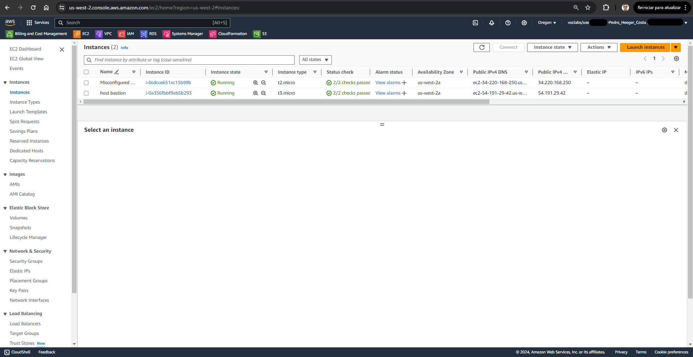<br>
    <figcaption>Imagem 21.</figcaption>
</figure></div><br>

Na tarefa 2, para realizar o acesso a instância `host bastion`, ela foi selecionada e na opção `Connect`, em `EC2 Instance Connect` foi escolhida a opção `Connect`, mantendo o username como `ec2-user`, que é o usuário padrão do **Amazon Linux**. Assim, um terminal shell era aberto no navegador da maquina física **Windows** conectado a instância do EC2. Essa conexão poderia ser realizada através de um cliente SSH como o **OpenSSH** ou o **PuTTY**, se um arquivo par de chaves fosse criado para autenticação do usuário. A imagem 22 comprova o acesso remoto realizado com sucesso.

<div align="Center"><figure>
    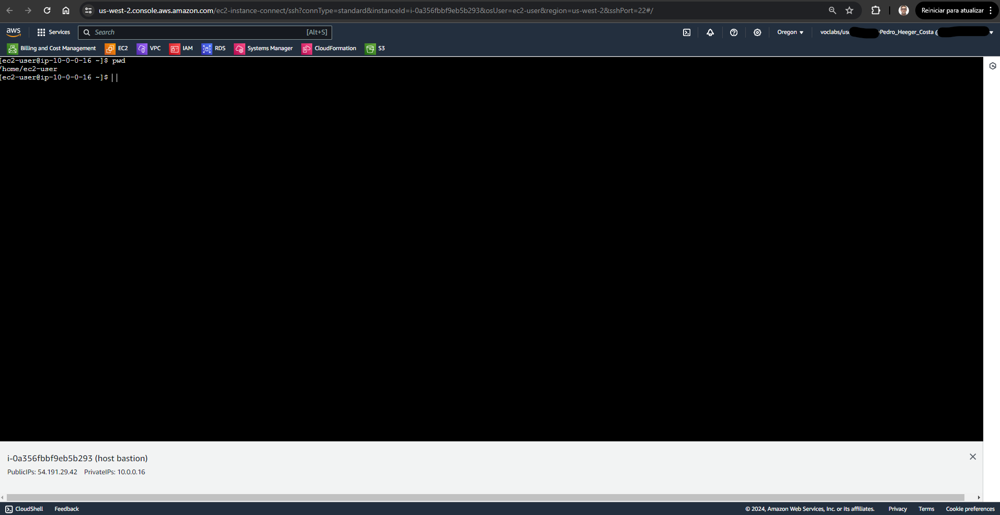<br>
    <figcaption>Imagem 22.</figcaption>
</figure></div><br>

A terceira tarefa consistiu em utilizar o **AWS CLI** nessa instância `host bastion` para recuperar algumas configurações dessa instância e utilizá-las em outro comando para criar uma nova instância que seria o servidor web com a aplicação. De dentro do acesso remoto realizado na instância `host bastion` foi executado o script abaixo. Esse comando definia uma variável `AZ` que era extraída dos metadados da instância, através do IP `169.254.169.254`, a zona de disponibilidade da instância. Essa variável era exportada para uma variável de ambiente na seção do terminal. A segunda parte do script recuperava a AMI da instância através de um comando do recurso **Parameter Store** do **AWS Session Manager** e armazenava em uma variável que era impressa posteriormente.

```
#Set the Region
AZ=`curl -s http://169.254.169.254/latest/meta-data/placement/availability-zone`
export AWS_DEFAULT_REGION=${AZ::-1}
#Retrieve latest Linux AMI
AMI=$(aws ssm get-parameters --names /aws/service/ami-amazon-linux-latest/amzn2-ami-hvm-x86_64-gp2 --query 'Parameters[0].[Value]' --output text)
echo $AMI
```
Para recuperar o Id da subnet utilizada foi executado o comando `SUBNET=$(aws ec2 describe-subnets --filters 'Name=tag:Name,Values=Public Subnet' --query Subnets[].SubnetId --output text)` e em seguida o `echo $SUBNET`. Com os comandos `SG=$(aws ec2 describe-security-groups --filters Name=group-name,Values=WebSecurityGroup --query SecurityGroups[].GroupId --output text)` e `echo $SG` foi extraído o Id do grupo de segurança. Já o comando <!-- `wget https://aws-tc-largeobjects.s3.us-west-2.amazonaws.com/CUR-TF-100-RSJAWS-1-23732/171-lab-JAWS-create-ec2/s3/UserData.txt` --> baixava na instância do `host bastion` o arquivo de dados do usuário que seria utilizado. Para conferi-lo foi utilizado o comando `cat UserData.txt`. Com todas as informações necessárias foi provisionada a instância do servidor web pelo **AWS CLI** executado na instância do `host bastion` com o comando abaixo.

```
INSTANCE=$(aws ec2 run-instances --image-id $AMI --subnet-id $SUBNET --security-group-ids $SG --user-data file:///home/ec2-user/UserData.txt --instance-type t3.micro --tag-specifications 'ResourceType=instance,Tags=[{Key=Name,Value=Web Server}]' --query 'Instances[*].InstanceId' --output text )
echo $INSTANCE
```

Com o comando `aws ec2 describe-instances --instance-ids $INSTANCE` era possível visualizar todas as informações dessa nova instância construída. Já com o comando `aws ec2 describe-instances --instance-ids $INSTANCE --query 'Reservations[].Instances[].State.Name' --output text` foi possível verificar o status do servidor web. Na imagem 23 é evidenciada pela **AWS CLI** o provisionamento da instância.

<div align="Center"><figure>
    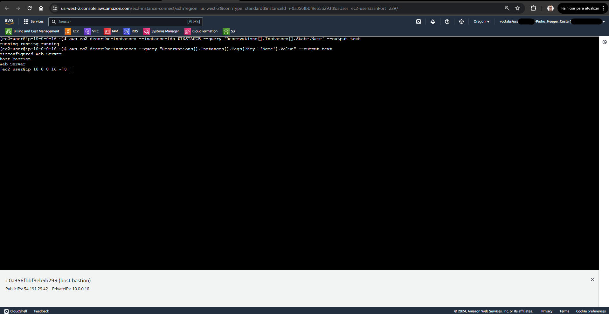<br>
    <figcaption>Imagem 23.</figcaption>
</figure></div><br>

Agora foi preciso capturar o DNS ou IP público dessa instância e isso foi realizado com o comando `aws ec2 describe-instances --instance-ids $INSTANCE --query Reservations[].Instances[].PublicDnsName --output text` que extraíu o DNS. Este DNS foi utilizado em outra aba do navegador da maquina física para acessar a aplicação, conforme mostrado na imagem 24. Como a instância servidor web possuía em seu grupo de segurança uma regra que permitia acesso ao protocolo `HTTP` na porta `80` para qualquer IP (`0.0.0.0/0`) foi possível acessar a aplicação.

<div align="Center"><figure>
    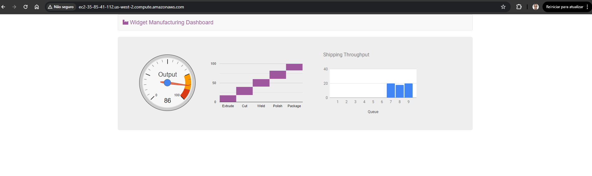<br>
    <figcaption>Imagem 24.</figcaption>
</figure></div><br>

No primeiro desafio opcional, o objetivo foi se conectar a uma instância cuja tag de nome possuía o valor `Misconfigured Web Server`, identificando qual o problema que não possibilitava a conexão. O problema era que o grupo de segurança vinculado a essa instância não tinha uma regra de entrada permitindo conexões **SSH**, portanto uma regra foi adicionada liberando a porta `22` do protocolo `TCP` para todas as faixas de IP (`0.0.0.0/0`). A imagem 25 mostra a conexão feita com sucesso a essa instância do EC2.

<div align="Center"><figure>
    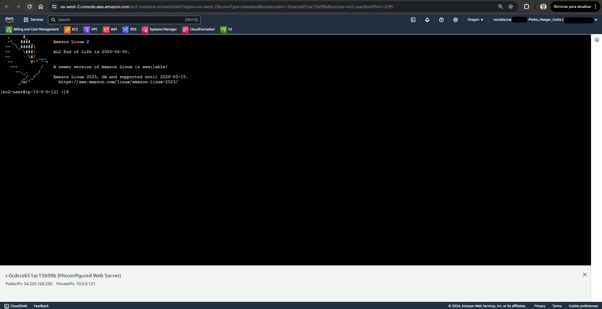<br>
    <figcaption>Imagem 25.</figcaption>
</figure></div><br>

No segundo desafio opcional, o objetivo foi recuperar o IP ou DNS público da instância anterior e acessá-la pelo navegador da web, identificando o porque não era possível acessar a aplicação. O problema nesse caso era porque os arquivos da aplicação não foram baixados e o servidor web **Apache HTTP (Httpd)** não tinha sido configurado. Portanto, foi necessário baixar o script de user data com este comando <!-- `wget https://aws-tc-largeobjects.s3.us-west-2.amazonaws.com/CUR-TF-100-RSJAWS-1-23732/171-lab-JAWS-create-ec2/s3/UserData.txt` --> e executá-lo adicionando o sudo aos comandos para garantir permissão, conforme mostrado abaixo. A imagem 26 ilustra a aplicação sendo acessada com sucesso.

<!-- ```bash
#!/bin/bash
# Install Apache Web Server
sudo yum install -y httpd

# Turn on web server
sudo systemctl enable httpd.service
sudo systemctl start  httpd.service

# Download App files
wget https://aws-tc-largeobjects.s3.amazonaws.com/CUR-TF-100-RESTRT-1/171-lab-%5BJAWS%5D-create-ec2/dashboard-app.zip
sudo unzip dashboard-app.zip -d /var/www/html/
``` -->

<div align="Center"><figure>
    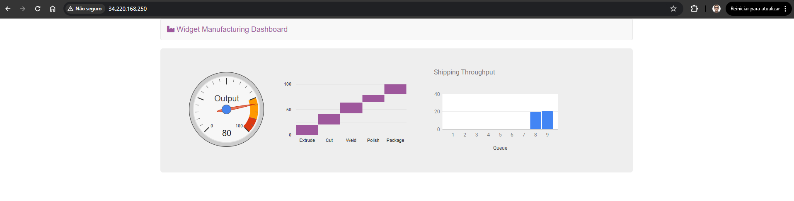<br>
    <figcaption>Imagem 26.</figcaption>
</figure></div><br>

<a name="item5.19"><h4>5.19 Demonstração do AWS IAM-2</h4></a>[Back to summary](#item5) | <a href="">Certificate</a>

Nesta demonstração foi explicado como criar um usuário do IAM, criar um grupo de usuários, adicionar uma política de permissão ao grupo e inseri o usuário do IAM criado neste grupo para que ele herdasse as permissões. O professor realizou isso totalmente pelo **AWS Console Management**, porém fiz diferente. Como as demonstrações não utilizam o sandbox do **Vocareum**, foi preciso utilizar minha própria conta da **AWS**. Portanto, foi utilizado o **PowerShell** no **Windows Terminal** da maquina física **Windows**, que já possuía instalada a **AWS CLI** e configurada com o usuário administrador da minha conta da **AWS** (`PedroHeegerAdmin`). Assim, foi criado o usuário e o grupo através de arquivos de scripts **PowerShell**. Após isso, o console de gerenciamento da **AWS** foi acessado, logando com esse novo usuário. Como este usuário já tinha permissões de acesso total ao serviço do **Amazon S3**, o bucket foi criado.

O usuário do IAM desenvolvido foi o `iamUserEdn` através do arquivo [iamUser.ps1](./resource/iamUser.ps1). O professor selecionou a opção de exigir que a senha do usuário fosse resetada ao iniciar, mas preferir não realizar isso. Um tag de chava `Role` e valor `Demo Account` foi definida. Como o usuário precisaria de acesso pelo console de gerenciamento da **AWS**, no próprio script criação do usuário foi também construído um perfil de login para ele, definido a senha de acesso. A imagem 27 mostra esse usuário do IAM criado.

<div align="Center"><figure>
    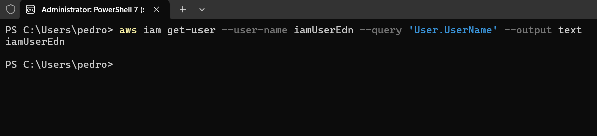<br>
    <figcaption>Imagem 27.</figcaption>
</figure></div><br>

O grupo de usuário foi construído com o arquivo [iamGroup.ps1](./resource/iamGroup.ps1) e teve o nome de `iamGroupEdn`. O usuário `iamUserEdn` foi adicionado ao grupo com o arquivo [iamUserGroup.ps1](./resource/iamUserGroup.ps1). Já com o arquivo [iamGroupPolicy.ps1](./resource/iamGroupPolicy.ps1), a política `AmazonS3FullAcces`, que concedia acesso total ao serviço **Amazon S3** foi adicionada. A imagem 28 exibe o usuário e a política adicionadas ao grupo desenvolvido.

<div align="Center"><figure>
    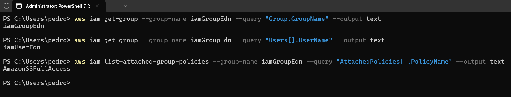<br>
    <figcaption>Imagem 28.</figcaption>
</figure></div><br>

Agora, o **AWS Console Management** foi acesso com o novo usuário que criou um bucket por lá mesmo, de nome `iamuserednbucket`, só para verificar que este usuário tinha permissão de acesso total ao serviço **Amazon S3**. A imagem 29 evidencia essa etapa.

<div align="Center"><figure>
    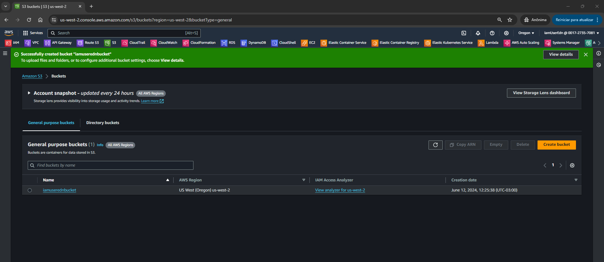<br>
    <figcaption>Imagem 29.</figcaption>
</figure></div><br>

Após isso, o bucket foi deletado por esse usuário e o logout foi realizado. Com os mesmos arquivos de scripts que realizaram as criações, foram realizadas as exclusões, pois estes possuía sempre dois scripts, um para criar e outro para excluir, sempre precedidos por uma estrutura de condição que aguardava uma resposta do usuário.

<a name="item5.20"><h4>5.20 172- [JAWS] -Laboratório: [Desafio] Exercício de instância do EC2</h4></a>[Back to summary](#item5) | <a href="">Certificate</a>

Neste laboratório de desafio, realizado dentro do sandbox **Vocareum**, o objetivo foi configurar a VPC de nome `Lab VPC`, criando uma sub-rede pública, um gateway de internet e configurando corretamente a tabela de rotas. Também foi provisionado uma instância do **Amazon EC2** nesta VPC, tornando ela um servidor web.

A primeira etapa foi construir a VPC `Lab VPC` com apenas duas sub-redes, uma pública e outra privada, ambas em uma única zona de disponibilidade que foi `us-west-2a` (Oregon).
A VPC possuía o IPv4 CIDR como `10.0.0.0/16` e não tinha nenhum bloco CIDR IPv6. O CIDR das sub-redes foram mantidas o padrão com base no CIDR da VPC. O tenancy escolhido foi o padrão. Um internet gateway e um NAT gateway também foram criados nessa VPC, sendo um para sub-rede pública e outro para a privada, definidos nas duas rotas da tabela de rotas. A imagem 30 mostra como ficou a VPC.

<div align="Center"><figure>
    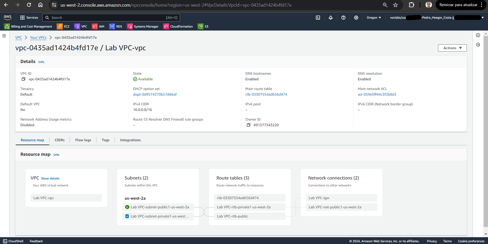<br>
    <figcaption>Imagem 30.</figcaption>
</figure></div><br>

Com a VPC pronta, foi instanciada uma maquina **Amazon Linux** no serviço **Amazon EC2**, cuja AMI foi `ami-0b20a6f09484773af` (Amazon Linux 2023 AMI 2023.4.20240611.0 x86_64 HVM kernel-6.1) e o tipo de instância foi `t3.micro`. A tag de nome teve seu valor como `Web Server` para identificar a instância. Nas configurações de rede, foram escolhidas a VPC configurada, bem como, a sub-rede pública dela. Foi habilitado a opção de alocar um IP elástico para a instância, ou seja, um IP público estático. O grupo de segurança foi utilizado o padrão desta VPC, definindo a regra de entrada liberando a porta `22` do protocolo `TCP` para conexões `SSH` para qualquer faixa de IP (`0.0.0.0/0`), e uma regra na porta `80` do protocolo `TCP` para permitir o acesso a aplicação web. O armazenamento foi mantido o padrão de inicialização, que foi um volume no **Amazon EBS** com `8 GiB` do tipo `gp2`. O par de chaves não foi solicitado criar, pois a conexão remota seria feito direto pelo console de gerenciamento da **AWS** na opção `EC2 Instance Connect`, mas caso preferisse poderia criar um par de chaves para ser utilizado por um software como o **OpenSSH** ou o **PuTTY** para autenticar ao acessar remotamente a instância. A última definição antes de executar a instância foi passar o arquivo user data para instalar o servidor web **Apache HTTP (Httpd)** e iniciá-lo, e conceder permissão de gravação ao diretório raiz do documento do servidor web (`/var/www/html`). O arquivo de script em **Bash** abaixo foi passado como user data. A imagem 31 exibe a instância em operação.

```bash
#!/bin/bash
yum install -y httpd

systemctl enable httpd.service
systemctl start  httpd.service

chmod +666 /var/www/html
```

<div align="Center"><figure>
    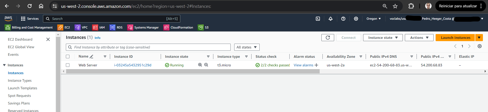<br>
    <figcaption>Imagem 31.</figcaption>
</figure></div><br>

A etapa seguinte foi realizar o acesso remoto pelo `EC2 Instance Connect` do próprio console de gerenciamento da **AWS** para acessar a instância sem precisar de par de chaves, pois a própria **AWS** autenticava o usuário `ec2-user`. Um terminal shell conectado na instância criada foi aberto em outra aba do navegador da maquina física **Windows**. Então, o diretório corrente foi alterado com o comando `cd /var/www/html` e o arquivo `index.html` foi alterado com o código abaixo. Após isso, foi copiado o IP ou DNS público da instância e utilizado em outra aba do navegador para acessar a aplicação, conforme mostrado na imagem 32.

```html
<!DOCTYPE html>
<html>
  <body>
    <h1>Pedro Heeger's re/Start Project Work</h1>
    <p>EC2 Instance Challenge Lab</p>
  </body>
</html>
```

<div align="Center"><figure>
    <br>
    <figcaption>Imagem 32.</figcaption>
</figure></div><br>

<a name="item5.22"><h4>5.22 AWS Elastic Beanstalk</h4></a>[Back to summary](#item5) | <a href="">Certificate</a>

O **Amazon Elastic Beanstalk** é um serviço de computação que simplifica a implementação e a escalabilidade de aplicativos e serviços web. Esse serviço suporta aplicativos desenvolvidos em várias linguagens, como **Java**, **.NET**, **PHP**, **Node.js**, **Python**, **Ruby**, **Go** e **Docker**, e pode ser executado em servidores conhecidos como **Apache**, **NGINX**, **Passenger** e **Microsoft Internet Information Services (Microsoft IIS)**. Ao enviar o código para o Elastic Beanstalk, ele automaticamente gerencia a implantação, incluindo o provisionamento de capacidade, balanceamento de carga, escalabilidade automática e monitoramento da integridade dos aplicativos. Apesar dessa automação, é possível manter total controle sobre os recursos da **AWS** que suportam o aplicativo e acessar esses recursos conforme necessário. 

Sendo uma plataforma como serviço (PaaS), o Elastic Beanstalk facilita a rápida implantação, escalabilidade e gerenciamento de aplicativos. O controle permanece nas mãos do usuário. Toda a plataforma já está configurada, bastando fazer o upload do código. É possível escolher o tipo de instância e o banco de dados, configurar e ajustar o Amazon EC2 Auto Scaling, atualizar o aplicativo, acessar arquivos de log do servidor e habilitar o HTTP seguro (HTTPS) no balanceador de carga.

O Elastic Beanstalk é compatível com diversas plataformas, incluindo Packer Builder, contêiner único, múltiplos contêineres ou **Docker** pré-configurado, **Go**, **JavaSE**, **Java** com **Tomcat**, **.NET** no **Microsoft Windows Server** com **Microsoft IIS**, **Node.js**, **PHP**, **Python** e **Ruby**. É possível desenvolver o aplicativo conforme suas necessidades e implantá-lo no Elastic Beanstalk. O serviço é gratuito, os custos incidem apenas sobre os serviços subjacentes utilizados.

O Elastic Beanstalk oferece todos os recursos necessários para hospedar o aplicativo sem complicações. Basta desenvolver o código e carregá-lo utilizando o console de gerenciamento da **AWS**, um repositório **Git**, ou uma IDE como **Apache Eclipse** ou **Microsoft Visual Studio**. O Elastic Beanstalk cuida automaticamente da implantação, dimensionamento, balanceamento de carga e monitoramento da saúde do aplicativo.

Utilizando o Elastic Beanstalk, é possível concentrar-se na codificação em vez de lidar com a gestão e configuração de servidores, bancos de dados, balanceadores de carga, firewalls e redes. O Elastic Beanstalk automatiza o provisionamento e operação da infraestrutura, gerenciando a pilha de aplicativos (plataforma) para manter a plataforma subjacente atualizada com os patches e atualizações mais recentes. Esta abordagem permite que o aplicativo gerencie eficazmente picos de carga de trabalho ou tráfego enquanto minimiza custos, escalando automaticamente para cima ou para baixo conforme as necessidades usando configurações ajustáveis do **Amazon EC2 Auto Scaling**. Por exemplo, métricas de utilização da CPU podem ser utilizadas para acionar ações de Auto Scaling. Para atualizar o aplicativo após a implantação, basta carregar o novo código.

<a name="item5.23"><h4>5.23 173- [JAWS] -Atividade: Solucionar problemas para criar uma instância</h4></a>[Back to summary](#item5) | <a href="">Certificate</a>

Nesta laboratório atividade, realizado no sandbox **Vocareum**, o objetivo foi criar uma instância do **Amazon Elastic Compute Cloud (Amazon EC2)** através do **AWS Command Line Interface (AWS CLI)** configurado em uma outra instância EC2 que foi conectada via EC2 Instance Connect. A nova instância provisionada funcionaria como servidor web de uma cafeteria hipotética. Para sua construção, na outra instância, que já vinha provisionada automaticamente ao iniciar o laboratório, existiam dois arquivos de scripts, sendo um com comandos **AWS CLI** e o outro com o user data que essa nova instância utilizaria. O arquivo user data instalaria um servidor web **Apache HTTP (Httpd)**, um banco de dados relacional **MariaDB** (um fork do banco de dados relacional **MySQL**) e **PHP** em execução. Juntos, esses pacotes de software instalados em uma única máquina geralmente são chamados de pilha LAMP (**Linux**, servidor web Apache, **MySQL** e **PHP**). Usar uma pilha LAMP é uma forma comum de criar um site com um back-end de banco de dados em uma única máquina.

Contudo, ao criar a instância de servidor web, os arquivos de scripts apresentaram erros, cuja intenção era essa mesma, para que análises dos arquivos fossem realizadas com intuito de identificar e solucionar os problemas.

O primeiro passo foi se conectar a instância do EC2 que já existia utilizando a opção `EC2 Instance Connect` do próprio console de gerenciamento da **AWS**. Com essa opção, a própria **AWS** faz a autenticação do usuário, que no caso era `ec2-user`, pois era uma maquina **Amazon Linux**. Dessa forma, não era preciso fornecer chave privada para autenticação do usuário. Como padrão, um terminal shell conectado a instância foi aberto em uma outra aba do navegador da maquina física **Windows**. A imagem 33 mostra o acesso remoto realizado na instância do EC2.

<div align="Center"><figure>
    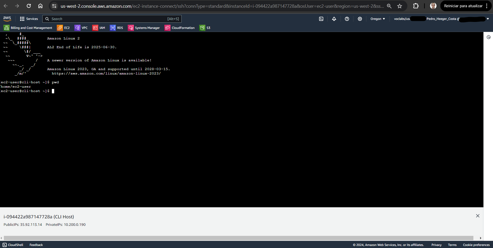<br>
    <figcaption>Imagem 33.</figcaption>
</figure></div><br>

Na sequência, foi necessário configurar a **AWS CLI**, que já vem instalada em instâncias **Amazon Linux**, com as informações fornecidas na opção detalhes do sandbox **Vocareum**. A região definida na configuração da **AWS CLI** foi a mesma que vinha no laboratório, `us-west-2` (Oregon), e o formato de saída dos dados era o padrão (`json`). O **AWS CLI** dessa maquina estava sendo configurado no usuário do IAM `awsstudent`, usuário este que era automaticamente criado ao iniciar o laboratório.

Na etapa seguinte, o objetivo foi analisar os arquivos de scripts. Para isso, o diretório corrente foi alterado com o comando `cd ~/sysops-activity-files/starters` e com comando `cp create-lamp-instance-v2.sh create-lamp-instance.backup` uma cópia do arquivo que provisionava a nova instância na **AWS** foi feita como backup. Ao tentar executar esse arquivo, ele apresentava alguns erros e não era executado. O arquivo foi aberto com o **VI** através do comando `vi create-lamp-instance-v2.sh` e foi utilizado o comando do **VI** `:set number` para exibir os números da linha para melhor visualização do arquivo.

O primeiro erro era que não identificava AMI. Basicamente, todas as informações configurações como Id dos recursos que a instância utilizaria foram extraídos de comandos **AWS CLI** que esse arquivo executava procurando na outra instância, para utilizar os mesmos recursos. Entretanto, a AMI não foi identificada, por causa da região. Se observar no arquivo, na linha 160, o parâmetro `--region` do comando `aws ec2 run-instances` tem o valor de `us-east-1` quando na verdade deveria ser a variável `region`, pois o valor dela é `us-west-2` que é a região utilizada no laboratório. Provalvemente a AMI que é extraída, não existe na região `us-east-1`. A imagem 34 exibe o arquivo de script executado com sucesso, provisionando a instância. Durante sua execução foi questionado se desejava excluir recursos já existentes, como ele tinha sido rodado antes e tinha dado erro, o grupo de segurança foi criado, pois o erro não afetava o security group. Então, era só confirmar a exclusão que o novo grupo exatamente igual seria construído.

<div align="Center"><figure>
    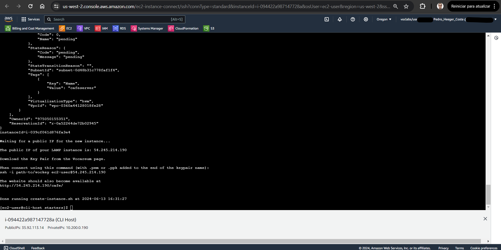<br>
    <figcaption>Imagem 34.</figcaption>
</figure></div><br>

O segundo erro não teve haver com esse arquivo de script e nem com o arquivo de user data, cujo nome era `create-lamp-instance-userdata-v2.txt`. Logo, ao solucionar o problema anterior e executar o arquivo, o servidor web foi provisionado normalmente. Contudo, ao tentar acessar o IP ou DNS público da instância para verificar a aplicação rodando, o segundo erro surgia. De cara, foi possível identificar que o erro era no grupo de segurança que não tinha um regra de entrada permitindo acesso a porta `80` do protocolo `TCP` para todas as faixas de IP (`0.0.0.0/0`). No grupo de segurança tinha uma regra liberando a porta `8080`, mas o servidor web **Apache HTTP (Httpd)** opera na porta `80`. A liberação pública de uma porta do grupo de segurança não é recomendada e deve-se ter muito cuidado ao realizar isso, como aqui foi para fins didáticos não houve problema. Uma outra forma de solucionar, foi necessário acessar remotamente a instância da mesma forma de acesso realizado na instância anterior. Dentro dela, foi necessário instalar o software **Nmap**, que é uma ferramenta de verificação de portas, com o comando `sudo yum install -y nmap`. Com o **Nmap** foi executado o comando `nmap -Pn 54.245.214.190`, informando o IP público dessa instância. A saída desse comando mostrou quais portas estavam acessíveis.

Após correção dos erros, em uma aba do navegador da maquina física **Windows** a aplicação web foi acessada pelo IP público da instância adicionando no path o `/cafe`, conforme imagem 35. Ao selecionar a aba menu do site, uma nova página era carregada, e nela foi possível selecionar sobremesas para pedir e confirmá-los em enviar pedido, evidenciado na imagem 36. Assim, a página de confirmação do pedido foi exibida, com detalhes dos pedidos escolhidos. Outros pedidos foram realizados para interagir com a aplicação. No fim, a página de histórico de pedidos foi selecionada para conferir o histórico dos pedidos, conforme imagem 37.

<div align="Center"><figure>
    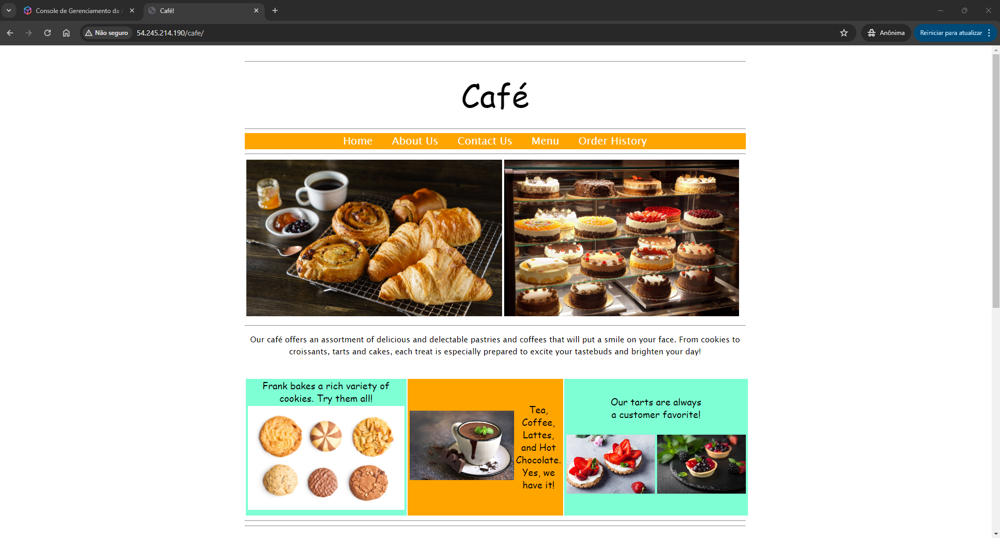<br>
    <figcaption>Imagem 35.</figcaption>
</figure></div><br>

<div align="Center"><figure>
    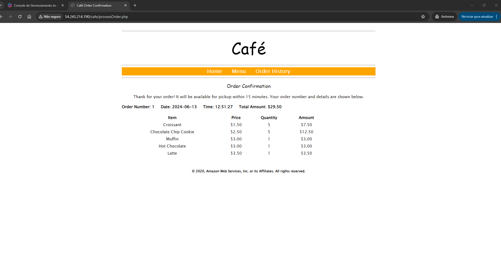<br>
    <figcaption>Imagem 36.</figcaption>
</figure></div><br>

<div align="Center"><figure>
    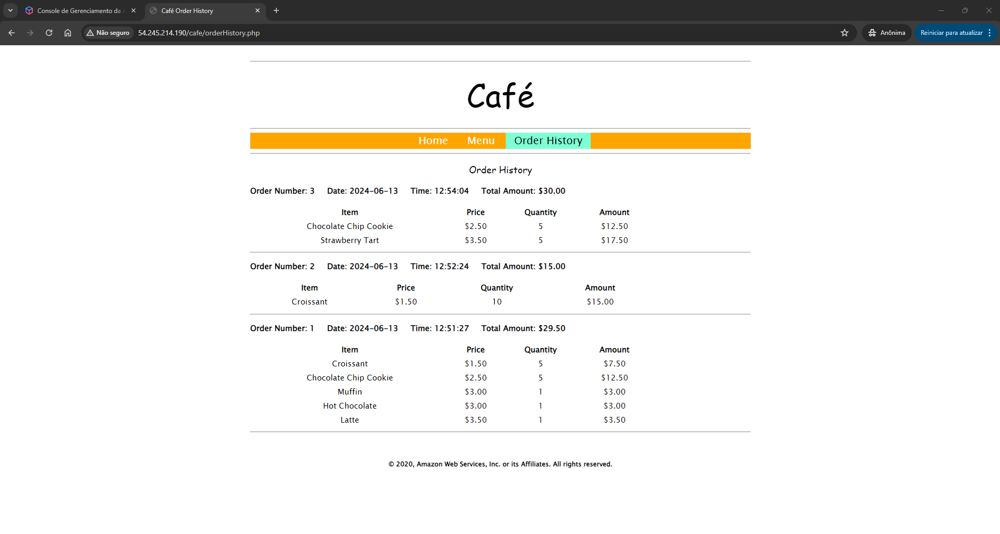<br>
    <figcaption>Imagem 37.</figcaption>
</figure></div><br>

<a name="item5.24"><h4>5.24 Visão geral de escalabilidade e resolução de nomes</h4></a>[Back to summary](#item5) | <a href="">Certificate</a>

NSA

<a name="item5.25"><h4>5.25 Elastic Load Balancing</h4></a>[Back to summary](#item5) | <a href="">Certificate</a>

Os sites modernos de alto tráfego precisam responder a centenas de milhares, ou até milhões, de solicitações simultâneas de usuários ou clientes. Eles devem entregar texto, imagens, vídeos ou dados de aplicativos de maneira rápida e confiável. Para escalar economicamente e atender a esses grandes volumes, é comum adicionar mais servidores, conforme as práticas recomendadas de computação moderna. Um balanceador de carga atua como um diretor de tráfego, posicionando-se na frente dos servidores e distribuindo as solicitações dos clientes. Ele direciona as solicitações entre os servidores capazes de atendê-las, maximizando a velocidade e a utilização da capacidade. Isso garante que nenhum servidor fique sobrecarregado, o que poderia comprometer o desempenho. Se um servidor falhar, o balanceador de carga redireciona o tráfego para os servidores restantes que estão online. Esses servidores podem incluir instâncias do **Amazon Elastic Compute Cloud (Amazon EC2)**, contêineres e endereços IP. Quando um novo servidor é adicionado ao grupo, o balanceador de carga automaticamente começa a enviar solicitações para ele. Os balanceadores de carga do ELB podem ser configurados na área de serviço do **Amazon EC2** no console de gerenciamento da **AWS**. Alternativamente, o serviço pode ser acionado via **AWS Command Line Interface (AWS CLI)** ou kits de desenvolvimento de software (SDKs). Existem três tipos de balanceadores de carga do ELB, todos oferecendo alta disponibilidade, dimensionamento automático e segurança robusta, essenciais para tornar os aplicativos tolerantes a falhas.

Algumas das principais características do **Amazon Elastic Load Balancing (Amazon ELB)** são as seguintes:
- Alta disponibilidade (HA): Os balanceadores de carga do ELB distribuem tráfego entre vários destinos, incluindo instâncias do EC2, contêineres e endereços IP, em uma única zona de disponibilidade ou em várias zonas de disponibilidade.
- Verificações de integridade: Os balanceadores de carga do ELB podem ser configurados para detectar destinos não íntegros, interromper o envio de tráfego para eles e distribuir a carga entre os destinos íntegros restantes.
- Segurança: É possível criar e gerenciar grupos de segurança associados aos balanceadores de carga, além de configurar um balanceador de carga interno (não voltado para a internet).
- Terminação do Transport Layer Security (TLS): Os balanceadores de carga oferecem gerenciamento integrado de certificados e descriptografia com Secure Sockets Layer (SSL), permitindo a gestão centralizada das configurações de SSL e descarregando o trabalho intensivo da CPU dos aplicativos.
- Balanceamento de carga da camada 7: É possível balancear a carga de aplicativos Hypertext Transfer Protocol (HTTP) e Secure HTTP (HTTPS) para funcionalidades específicas da camada 7, que é a camada do aplicativo no modelo OSI (Open Systems Interconnection).
- Balanceamento de carga da camada 4: Também é possível optar pelo balanceamento de carga da camada 4 para aplicativos que dependem exclusivamente do TCP, que é a camada de transporte no modelo OSI.
- Monitoramento operacional: Os balanceadores de carga do ELB trabalham com métricas do **Amazon CloudWatch** e rastreamento de solicitações, permitindo o monitoramento do desempenho do aplicativo em tempo real.

O primeiro tipo de balanceador de carga é o *Application Load Balancer (ALB)*, que opera no nível do aplicativo. Ele suporta roteamento baseado em conteúdo e é adequado para aplicativos que rodam em contêineres. O ALB é compatível com protocolos abertos padrão (WebSocket e HTTP/2) e oferece maior visibilidade sobre a integridade das instâncias e contêineres de destino. Os Application Load Balancers oferecem roteamento avançado de solicitações, ideal para arquiteturas modernas de aplicativos, como microsserviços e aplicações baseadas em contêineres. Eles são recomendados para diversos casos de uso no **Amazon Virtual Private Cloud (Amazon VPC)**. Sites e aplicativos móveis que operam em contêineres ou instâncias do EC2 podem tirar proveito dos Application Load Balancers.

O próximo balanceador de carga é o *Network Load Balancer (NLB)*, projetado para lidar com dezenas de milhões de solicitações por segundo, mantendo alta taxa de transferência com baixa latência. Os NLBs são eficazes para balanceamento de carga de tráfego baseado no protocolo Transmission Control Protocol (TCP). A mesma interface de programação de aplicativos (API) pode ser usada para controlar programaticamente tanto os Network Load Balancers quanto os Application Load Balancers. A API oferece controle programático completo sobre grupos-alvo e destinos. O Network Load Balancer é ideal para balancear carga de tráfego TCP, sendo otimizado para lidar com padrões de tráfego repentinos e voláteis, utilizando um único endereço IP estático por zona de disponibilidade. Os NLBs são recomendados para balanceamento de carga de tráfego TCP em uma VPC.

Por fim, o *Classic Load Balancer (CLB)* oferece balanceamento de carga básico entre várias instâncias do **Amazon EC2**. Ele opera tanto no nível de solicitação quanto no nível de conexão. Os Classic Load Balancers são adequados para aplicativos desenvolvidos na rede EC2 Classic. São recomendados para redes clássicas e também para diversos outros casos de uso na **Amazon VPC**.

Um balanceador de carga pode ser utilizado por diversos motivos, como: Proteger o acesso aos servidores web através de um único ponto de acesso exposto; Desacoplar o ambiente utilizando balanceadores de carga públicos e internos; Prover alta disponibilidade e tolerância a falhas ao distribuir o tráfego entre várias zonas de disponibilidade; Aumentar a elasticidade e escalabilidade com o mínimo de sobrecarga.

O ALB oferece a maioria dos recursos presentes no Classic Load Balancer, mas adiciona funcionalidades e aprimoramentos importantes, tornando-o adequado para casos de uso específicos. Esses recursos incluem roteamento baseado em caminho e host, suporte nativo a IPv6, portas dinâmicas e suporte a protocolos adicionais de solicitação. Além disso, o ALB proporciona proteção contra exclusão, rastreamento de solicitações, métricas aprimoradas, logs de acesso e verificações de integridade direcionadas. Na prática, o ALB permite roteamento e organização eficientes dos destinos de back-end. Ao configurar ouvintes para o balanceador de carga, regras são criadas para determinar como as solicitações recebidas são encaminhadas aos destinos de back-end. Para registrar esses destinos e configurar verificações de integridade, são formados grupos de destino, nos quais os alvos podem ser membros de vários grupos.

Os Network Load Balancers são projetados para lidar com padrões de tráfego repentinos e voláteis, utilizando um único endereço IP estático por zona de disponibilidade. Capazes de gerenciar milhões de solicitações por segundo enquanto mantêm latências ultrabaixas, os Network Load Balancers são ideais para aplicativos que demandam desempenho extremo.

O ELB gera várias métricas automaticamente. Essas métricas permitem monitorar as respostas HTTP e o status de integridade dos hosts por trás do balanceador de carga, verificando se estão funcionando corretamente. Isso é feito através de tentativas de conexão às instâncias do EC2 para determinar sua disponibilidade. Esses testes são conhecidos como verificações de integridade. Além disso, é possível filtrar essas métricas por zona de disponibilidade das instâncias de back-end ou pelo próprio balanceador de carga em uso.

<a name="item5.26"><h4>5.26 Listeners do Elastic Load Balancer</h4></a>[Back to summary](#item5) | <a href="">Certificate</a>

Antes de começar a utilizar o Application Load Balancer, é necessário adicionar um ou mais ouvintes. Um ouvinte (*Listener*) é responsável por verificar se há solicitações de conexão de clientes para uma instância usando o protocolo e a porta especificados. As regras associadas ao ouvinte determinam como o tráfego de conexão dos clientes será roteado pelo balanceador de carga para um ou mais destinos ou grupos de destino. Cada regra inclui uma prioridade, uma ou mais ações e uma ou mais condições. Quando as condições de uma regra são cumpridas, suas ações são executadas. Para cada ouvinte, é necessário definir uma regra padrão e é opcional definir regras adicionais.

Ao criar cada regra do ouvinte, especifica-se um grupo de destino e condições. Os destinos são organizados em grupos de destino. Cada grupo de destino é utilizado para rotear solicitações para um ou mais destinos registrados, como instâncias do EC2 ou instâncias de contêiner do ECS. O load balancer pode distribuir o tráfego de entrada do aplicativo em vários destinos. Também é possível configurar verificações de integridade por grupo de destino. Quando a regra do balanceador de carga especifica um grupo de destino, as verificações de integridade são realizadas em todos os destinos registrados nesse grupo de destino.

<a name="item5.27"><h4>5.27 Auto Scaling do Amazon EC2</h4></a>[Back to summary](#item5) | <a href="">Certificate</a>

O **Amazon EC2 Auto Scaling** ajuda a garantir a disponibilidade contínua dos aplicativos, permitindo adicionar ou remover automaticamente instâncias do Amazon Elastic Compute Cloud (**Amazon EC2**) conforme configurado. Por exemplo, é possível definir o Auto Scaling para encerrar instâncias do EC2 que não passam nas verificações de saúde e, em seguida, iniciar novas instâncias para substituí-las. Políticas personalizadas podem ser criadas utilizando o **Amazon CloudWatch** para acionar a adição ou remoção de instâncias do EC2 com base em condições como o uso médio da CPU da frota do EC2. Se há variações previsíveis na carga de trabalho, é possível programar atividades de escalabilidade através do Auto Scaling do **Amazon EC2**. Este recurso não só oferece capacidade de expansão para atender à demanda como também permite ajustar a escala para otimizar custos. Embora seja possível criar um grupo de escalabilidade usando uma configuração de execução, a **AWS** enfatiza o uso de modelos de execução como prática recomendada.

O Amazon EC2 Auto Scaling Group assegura a manutenção do número apropriado de instâncias do EC2 conforme definido pelo modelo de execução que melhor se adequa às necessidades específicas. Este modelo especifica a configuração detalhada da instância do EC2, incluindo imagem da máquina Amazon, grupos de segurança, VPC, armazenamento, tipo de instância, pares de chaves e funções do IAM. Os modelos de inicialização permitem a especificação de uma opção de rede e podem ser utilizados para criar instâncias individuais ou grupos de escalonamento automático. Adicionalmente, é possível criar diversas versões do modelo para diferentes configurações.

Para configurar o **Amazon EC2 Auto Scaling**, é necessário primeiro criar um modelo de execução e, em seguida, estabelecer um grupo de Auto Scaling. O grupo de escalabilidade deve utilizar a VPC e o grupo de segurança especificados no modelo de execução. É possível selecionar uma ou várias sub-redes para o grupo, sendo que a escolha de múltiplas sub-redes em diferentes zonas de disponibilidade garante alta disponibilidade. O balanceador de carga é responsável por distribuir o tráfego entre as diversas instâncias do EC2, com base na carga de trabalho e na integridade das instâncias. O monitoramento proporciona maior visibilidade ao coletar métricas relevantes. O tamanho do grupo determina a capacidade mínima e máxima permitida. Conforme a demanda aumenta, o grupo expande para incluir mais instâncias, enquanto reduz o número quando a demanda diminui, encerrando as instâncias não utilizadas. O Auto Scaling também verifica constantemente a integridade das instâncias, utilizando informações fornecidas pelas instâncias do EC2, pelo balanceador de carga ou por verificações de integridade personalizadas, substituindo qualquer instância que não esteja funcionando corretamente.

Já dimensionamento automático pode ser definido de três maneiras:
- Estabelecer uma política de escalabilidade baseada em alarmes do **Amazon CloudWatch**. Por exemplo, um alarme pode ser configurado para disparar quando a utilização média da CPU ultrapassar 50% por 2 minutos, ativando uma política de Auto Scaling do EC2. Essa política pode aumentar ou diminuir um número fixo de instâncias (dimensionamento simples) ou ajustar o número de instâncias em execução como uma porcentagem da capacidade desejada para o grupo do **Amazon EC2 Auto Scaling** (dimensionamento por etapas).
- Implementar uma Política de rastreamento de destino, onde uma métrica como a utilização média da CPU é avaliada em relação a um valor desejado. Por exemplo, manter a utilização média da CPU do grupo de Auto Scaling em 50%.
- Definir uma ação agendada para ajustar o valor de capacidade desejado em um horário específico. Pode-se programar a execução de ações únicas em datas e horários precisos, ou criar ações recorrentes para ocorrerem em momentos específicos ao longo de semanas, meses ou anos. As ações agendadas são especialmente úteis para preparar antecipadamente a capacidade em resposta a previsões de picos de tráfego.

O **Amazon EC2 Auto Scaling** monitora o estado de integridade das instâncias e encerra aquelas que são identificadas como não íntegras. Isso ajuda a garantir que todas as instâncias no grupo de Auto Scaling estejam operando adequadamente. Por padrão, o **Amazon EC2 Auto Scaling** utiliza verificações de status das instâncias do EC2. Se um grupo de Auto Scaling estiver configurado com um balanceador de carga, as verificações de integridade podem ser feitas através do balanceador de carga ou das próprias verificações das instâncias do EC2. As verificações de integridade do grupo de destino permitem testar a disponibilidade do aplicativo em caminhos, protocolos ou portas específicos. Essas verificações possibilitam que os grupos de Auto Scaling tomem decisões mais informadas ao determinar a integridade das instâncias e as substituições necessárias.

Com cada grupo de Auto Scaling, é possível controlar quando são adicionadas instâncias (escalonamento horizontal) ou removidas (dimensionamento) da arquitetura de rede. O tamanho do grupo pode ser ajustado manualmente pela adição ou remoção de instâncias, ou automatizado por meio de políticas de dimensionamento. A política padrão de encerramento é projetada para garantir que as instâncias sejam distribuídas uniformemente entre as Zonas de Disponibilidade para manter alta disponibilidade. Normalmente, essa política é suficiente para a maioria dos casos. No entanto, existe a opção de substituí-la por uma política personalizada. Por exemplo, uma política personalizada de encerramento pode determinar quais instâncias serão encerradas primeiro durante a redução do grupo. Ao personalizar essa política, se uma Zona de Disponibilidade tiver mais instâncias do que outras, ela será aplicada às instâncias nessa Zona específica. Se todas as Zonas de Disponibilidade estiverem equilibradas, a política de encerramento será aplicada uniformemente em todo o grupo.

O **Amazon EC2 Auto Scaling** suporta políticas de encerramento personalizadas, incluindo as seguintes:
- OldestInstance: Encerra a instância mais antiga do grupo. Essa opção é útil ao atualizar as instâncias no grupo de Auto Scaling para um novo tipo de instância do EC2, permitindo a substituição gradual das instâncias antigas pelas novas.
- NewestInstance: Encerra a instância mais recente no grupo. Essa política é útil ao testar um novo modelo de execução, sem a intenção de mantê-lo em produção.
- OldestLaunchTemplate: Encerra instâncias que utilizam o modelo de execução mais antigo. Essa opção é vantajosa ao atualizar um grupo e remover as instâncias configuradas com o modelo anterior.
- ClosestToNextInstanceHour: Encerra instâncias mais próximas da hora de faturamento seguinte. Essa abordagem é eficaz para maximizar o uso das instâncias e gerenciar os custos do **Amazon EC2**.

As verificações de integridade do **Amazon EC2 Auto Scaling** permitem criar um grupo de estado estável que assegura que sempre haja uma instância em execução. Por exemplo, suponha que exista um servidor de Conversão de endereços de rede (NAT) que não deve ser um único ponto de falha em uma arquitetura de sub-rede público-privada padrão. Um grupo de estado estacionário é útil para essa instância. Para criar um grupo de estado fixo para uma instância, é necessário: criar um modelo de execução que gere a instância; criar um grupo do **Amazon EC2 Auto Scaling** com tamanho mínimo, máximo e desejado de 1. Quando uma dessas instâncias é marcada como não íntegra, pode ser devido a uma falha na verificação de instância ou um script externo pode marcar a instância como não íntegra. O grupo do **Amazon EC2 Auto Scaling** encerrará a instância existente e criará uma nova instância a partir do modelo de execução do grupo. Vale notar que, em casos como a implantação de uma instância NAT, o NAT ainda é um ponto de falha único, podendo haver um tempo de inatividade significativo enquanto uma instância NAT com falha está sendo substituída.

O dimensionamento com base em um cronograma permite ajustar a capacidade do aplicativo em resposta a variações de carga previsíveis. Por exemplo, se o tráfego para a aplicação Web aumenta toda semana a partir de quarta-feira, permanece elevado na quinta-feira e começa a diminuir na sexta-feira, é possível planejar as atividades de escalabilidade com base nesses padrões de tráfego. Para configurar um grupo de Auto Scaling para escalar conforme uma programação: crie uma ação programada que instrua o Auto Scaling do **Amazon EC2** a executar uma ação de escalabilidade em horários específicos; defina o horário de início em que a ação de escalabilidade deve ser aplicada, juntamente com os novos tamanhos mínimo, máximo e desejado para o grupo; no horário especificado, o **Amazon EC2 Auto Scaling** atualiza o grupo ajustando os valores de tamanho mínimo, máximo e desejado conforme especificado pela ação de dimensionamento.

O dimensionamento automático pode ser configurado de forma dinâmica. Por exemplo, imagine um aplicativo da Web que atualmente opera em duas instâncias. A utilização da CPU do grupo de Auto Scaling não deve exceder 70% por mais de 2 minutos. É possível configurar o grupo de Auto Scaling para ajustar automaticamente a capacidade conforme essa necessidade. O tipo de política define como a ação de escalabilidade será realizada. O Auto Scaling do **Amazon EC2** oferece suporte aos seguintes tipos de políticas de escalabilidade:
- Dimensionamento de monitoramento de objetivo (rastreamento de destino): Ajusta a capacidade atual do grupo com base em um valor de alvo para uma métrica específica. Esse tipo de dimensionamento é similar ao funcionamento de um termostato, que mantém a temperatura da casa conforme a configuração escolhida. No caso do **Amazon EC2**, define-se a métrica para que o **Amazon EC2 Auto Scaling** a monitore, e o Auto Scaling cuida do restante.
- Dimensionamento de etapas: Ajusta a capacidade atual do grupo com base em um conjunto de ajustes de escala, conhecidos como ajustes de etapa. Esses ajustes de dimensionamento variam de acordo com a magnitude da violação do alarme. O Auto Scaling do **Amazon EC2** não suporta desaquecimentos para políticas de escalabilidade em etapas, o que significa que não é possível especificar um período de recarga para essas políticas, e o período de recarga padrão do grupo não se aplica.
- Dimensionamento simples: Ajusta a capacidade atual do grupo com base em um único ajuste de escala.

A **AWS** também oferece a escalabilidade preditiva, que utiliza modelos de aprendizado de máquina para prever o tráfego esperado e o uso do **Amazon EC2**, considerando padrões diários e semanais. Essas previsões são baseadas em dados reais de uso do **Amazon EC2** e pontos de dados específicos das próprias observações do usuário. O modelo precisa de pelo menos um dia de dados históricos para iniciar as previsões. A cada 24 horas, o modelo é reavaliado para criar previsões para as próximas 48 horas. A escalabilidade preditiva prevê o tráfego futuro com base em tendências diárias e semanais, incluindo picos regulares, e provisiona o número correto de instâncias do EC2 antes das mudanças previstas. Essa abordagem elimina a necessidade de ajustes manuais nos parâmetros do Auto Scaling, simplificando a configuração e o uso do Auto Scaling.

Pode-se utilizar a escalabilidade preditiva, a escalabilidade dinâmica, ou uma combinação de ambas. A escalabilidade preditiva antecipa a carga e define a capacidade mínima, enquanto a escalabilidade dinâmica ajusta uma métrica específica do CloudWatch para um valor desejado por meio do rastreamento de destino. Ambos os modelos operam bem em conjunto, aproveitando a capacidade mínima já definida pelo dimensionamento preditivo. O dimensionamento preditivo é ideal para sites e aplicativos que enfrentam picos de tráfego regulares e periódicos, mas não é adequado para cenários onde os picos de carga são irregulares ou imprevisíveis.

<a name="item5.28"><h4>5.28 Visão geral do laboratório: Auto Scaling do EC2</h4></a>[Back to summary](#item5) | <a href="">Certificate</a>

NSA

<a name="item5.29"><h4>5.29 174- [JAWS] -Laboratório: Dimensionar e balancear a carga da arquitetura</h4></a>[Back to summary](#item5) | <a href="">Certificate</a>

Neste laboratório desenvolvido no sandbox **Vocareum**, o objetivo foi construir uma arquitetura para uma aplicação web utilizando os serviços **Amazon Elastic Load Balancer (Amazon ELB)**, para balancear a carga, e o serviço **Amazon EC2 Auto Scaling**, para escalar a aplicação quando necessário. O servidores web criados pelo grupo de auto scaling utilizariam a AMI criada a partir de uma outra instância provisionada anteriormente para servir de modelo de servidor web. O recursos de rede construídos no **Amazon VPC** foram provisionadados pelo **AWS CloudFormation** ao iniciar o laboratório. A aplicação web consistiu em um teste de estresse, que ao clicar para iniciar o estresse, a porcentagem de utilização de CPU da maquina, onde o tráfego era direcionado naquela requisição pelo load balancer, aumentava bastante para simular uma alta carga de trabalho e verificar a política de escalabilidade atuando no grupo de auto scaling. Todo esse laboratório foi realizado pelo **AWS Console Management**.

A primeira tarefa foi construir uma imagem de maquina Amazon (AMI) da instância `Web Server 1` que já vinha provisionada automaticamente pelo laboratório. Essa instância já possuía a aplicação web configurada. Para criar a AMI bastava selecionar a instância e configurar a criação de imagem dela. O nome da imagem foi definida como `Web Server AMI` e a descrição foi definida como `Lab AMI for Web Server`. A opção `No reboot` foi mantida padrão, desabilitada, ou seja, a instância iria reiniciar antes de criar a AMI. O volume da instância foi mantido o padrão. A imagem 38 abaixo mostra a AMI construída.

<div align="Center"><figure>
    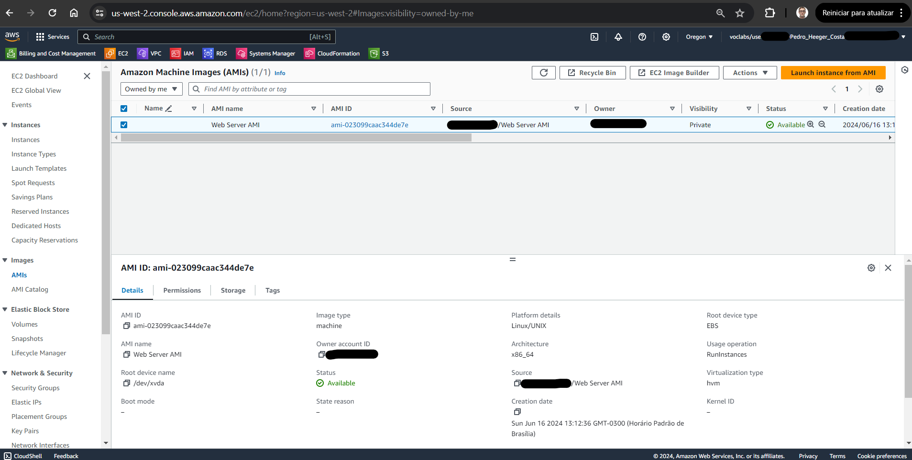<br>
    <figcaption>Imagem 38.</figcaption>
</figure></div><br>

Na tarefa 2 foi provisionado um balanceador de carga no **Amazon ELB** do tipo *Application Load Balancer (ALB)* já que era para uma aplicação web. Contudo, ao criar um ALB, seria preciso criar um target group (grupo de destino). Então para adiantar, foi criado primeiro o target group indo direto no recurso. Em target group, o tipo de destino foi definido como `instances` e o nome do grupo foi `lab-target-group`. O protocolo e porta foram mantidos os padrões `HTTP` e `80`, já que era uma aplicação web. O tipo de endereço de IP foi mantido o `IPv4` e a versão do protocolo foi mantida `HTTP1`. A VPC do laboratório `Lab VPC` foi selecionada. Na verificação de integridade, o protocolo de health check foi mantido como `HTTP` e o caminho (`Health check path`) foi definido como `/`, que era a página raiz do site. A imagem 39 exibe o grupo de destino provisionado.

<div align="Center"><figure>
    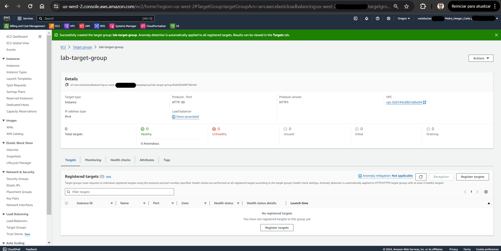<br>
    <figcaption>Imagem 39.</figcaption>
</figure></div><br>

De volta a configuração do ALB, o load balancer criado teve o nome `LabELB` e nas configurações de rede foi selecionada a VPC do laboratório e suas duas sub-redes públicas, cada uma em uma AZ. O grupo de segurança escolhido foi um já existente, cujo nome era `Web Security Group`. Este já possuía uma regra de entrada liberando a porta `80` no protocolo `TCP` para todos os IPs (`0.0.0.0/0`). Lembrando que a VPC e toda configuração de rede foi construída pelo **AWS CloudFormation** ao iniciar o laboratório. Em listeners e roteamento, um listener foi criado para rotear o tráfego do protocolo `HTTP` e porta `80` para o target group criado, cujo nome era `lab-target-group`. Após isso, o load balancer estava criado e era só esperar ele ficar em execução, conforme evidenciado na imagem 40. O DNS do load balancer foi copiado e aberto em outra aba do navegador. Por enquanto ele não funcionaria, pois o tráfego ainda não estava chegando nas instâncias de servidor web já que elas ainda não tinham sido construídas.

<div align="Center"><figure>
    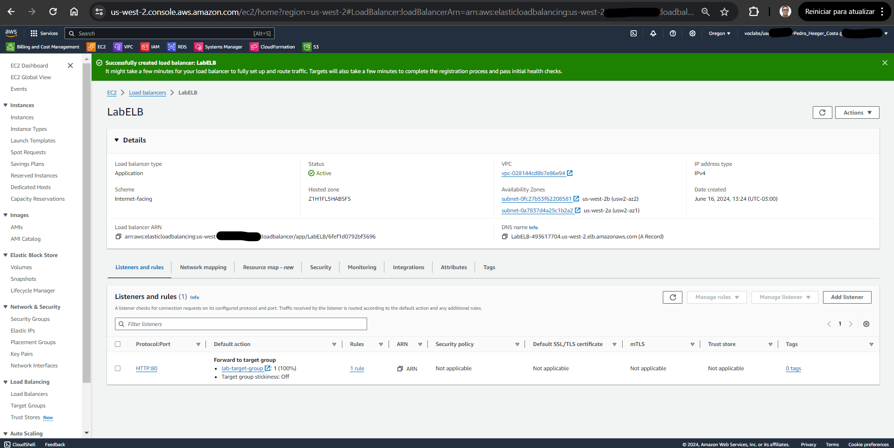<br>
    <figcaption>Imagem 40.</figcaption>
</figure></div><br>

Na terceira tarefa, o objetivo foi criar um modelo de execução (*launch template*). Um modelo de execução é o que um grupo do Auto Scaling usa para iniciar instâncias do EC2. O nome do modelo de execução foi `lab-app-launch-template` e a descrição foi definida como `A web server for the load test app`. Em seguida, foi selecionada a opção para fornecer ajuda para configurar um modelo para ser utilizado pelo **Amazon EC2 Auto Scaling**. Em imagem de maquina Amazon, se a AMI construída (`WebServerAMI`) não já tivesse selecionada, ela tinha que ser selecionada. O tipo de instância foi `t3.micro` e não foi criado ou definido par de chaves. Nas configurações de rede, o grupo de segurança `HTTPAccess` foi escolhido. Não foi necessário passar o arquivo de user data configurando o servidor web, pois isso já tinha sido feito na instância modelo de nome `Web Server 1` e como a imagem utilizada era dela, tudo já estava instalado. A imagem 41 mostra o launch template criado com sucesso.

<div align="Center"><figure>
    <br>
    <figcaption>Imagem 41.</figcaption>
</figure></div><br>

A tarefa 4 consistiu na criação do auto scaling group a partir desse modelo de execução elaborado. Portanto, foi selecionado o modelo `lab-app-launch-template` e o nome do deste grupo foi definido como `Lab Auto Scaling Group`. Nas configurações de rede foi selecionada a VPC do laboratório e as duas sub-redes privadas, pois as instâncias do grupo de auto scaling estariam na sub-rede privada. Em configurações avançadas, em balanceador de carga, foi anexado a este grupo o load balancer criado e o grupo de destino (target group) construído `lab-target-group | HTTP` foi vinculado. As verificações de integridade adicionais do **Amazon ELB** foram ativadas, mantendo intervalo da verificação em `300` segundos. Nas configurações da política de escalabilidade, foi definido o tamanho do grupo, informando a capacidade desejada em `2`, a capacidade mínima em `2` e a capacidade máxima em `4`. A política de escalabilidade escolhida foi de rastreamento de deestino, cujo tipo de métrica foi definido com `média de utilização de CPU` e o valor de destino em `50`. Essa alteração informava ao Auto Scaling para manter uma utilização média da CPU em todas as instâncias em 50%. O Auto Scaling adicionaria ou removeria automaticamente a capacidade conforme necessário para manter a métrica no valor de destino especificado ou próxima dele. Uma tag de nome foi criada, cujo valor foi `Lab Instance`, que seria utilizada pelas instâncias desse grupo de auto scaling. A imagem 42 evidencia o auto scaling group desenvolvido com duas instâncias, pois a quantidade desejada foram duas.

<div align="Center"><figure>
    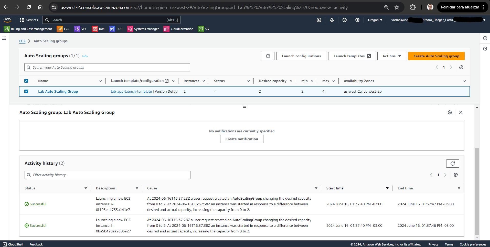<br>
    <figcaption>Imagem 42.</figcaption>
</figure></div><br>

Na quinta tarefa, o objetivo foi verificar se essas duas instâncias desse grupo de auto scaling estavam no target group (grupo de destino) do load balancer. Observe na imagem 43, que as instâncias estavam no target group e a verificação de integridade (health check) estava marcando como íntegro. Assim, a aplicação web já poderia ser acessada pelo DNS do load balancer, pois ele já estava direcionando o tráfego para essas instâncias do auto scaling group que eram os servidores web. A imagem 44 exibe a aplicação web sendo acessada pelo DNS do load balancer em uma aba do navegador da máquina física **Windows**.

<div align="Center"><figure>
    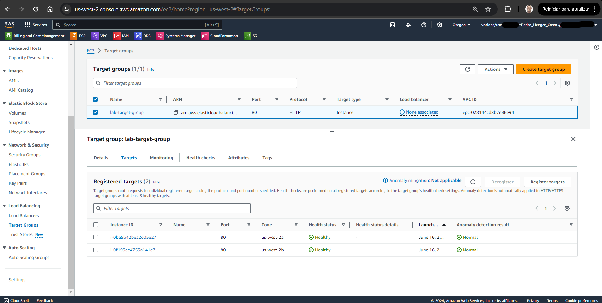<br>
    <figcaption>Imagem 43.</figcaption>
</figure></div><br>

<div align="Center"><figure>
    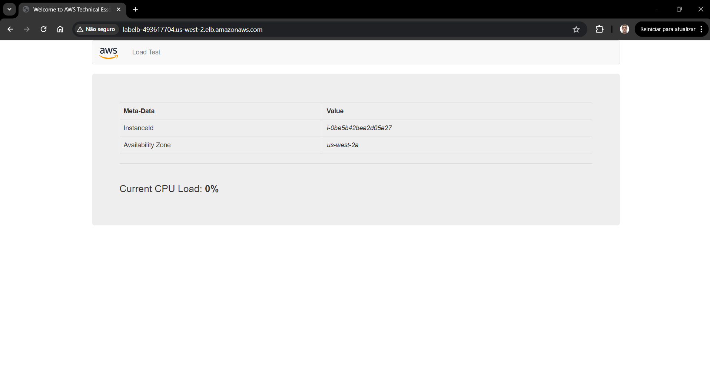<br>
    <figcaption>Imagem 44.</figcaption>
</figure></div><br>

A tarefa 6 constituiu-se da realização do teste de carga nos servidores web para verificar a atuação da política de escalabilidade do grupo de auto scaling. A política de escalabilidade criou automaticamente dois alarmes no **Amazon CloudWatch**, conforme mostrado na imagem 45. Esses alarmes mantinham automaticamente a carga média da CPU próxima a 50%, permanecendo também dentro da limitação do auto scaling group de ter duas a quatro instâncias. Um dos alarmes teve o nome de `AlarmHigh` e estava no estado OK. O estado OK indica que o alarme não foi iniciado. É o alarme para utilização de CPU > 50, que adicionaria instâncias quando a utilização da CPU média estivesse alta. 

<div align="Center"><figure>
    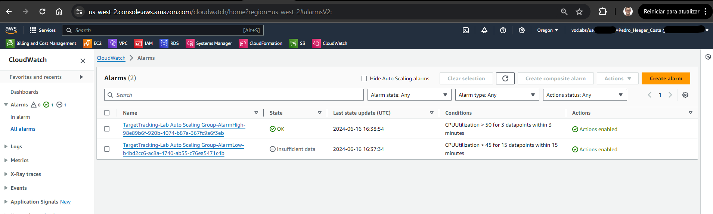<br>
    <figcaption>Imagem 45.</figcaption>
</figure></div><br>

A aplicação web aberta em uma aba do navegador da web da maquina física, possuía um teste de carga que ao ser acionado gerava cargas elevadas para aplicação, consumindo bastante a utilização de CPU. A página do navegador foi atualizada automaticamente para que todas as instâncias no grupo do Auto Scaling gerassem as cargas. Observando no **Amazon CloudWatch**, o alarme `AlarmLow` modificou para OK, enquanto o alarme `AlarmHigh` alterou para em alarme, o que significava que a utilização de CPU média entre as instâncias do auto scaling group ultrapassou os 50% estabelecido na política de escalabilidade. Assim, o CloudWatch acionou o **Amazon EC2 Auto Scaling** que prontamente iniciou o processo de provisionamento da terceira instância do grupo com intuito de conter as cargas. A imagem 46 exibe os alarmes do **Amazon CloudWatch**, enquanto a imagem 47 evidencia a criação automática da terceira instância. É bem provável que o tempo de provisionamento da nova instância seja maior do que o tempo em que o alarme do CloudWatch analisa a métrica novamente. Se isso ocorrer, ele vai constatar que a utilização média de CPU continua maior que 50% e pode ser que provisione uma quarta instância.

<div align="Center"><figure>
    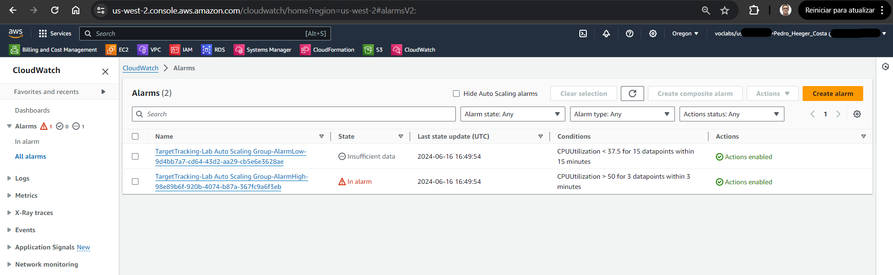<br>
    <figcaption>Imagem 46.</figcaption>
</figure></div><br>

<div align="Center"><figure>
    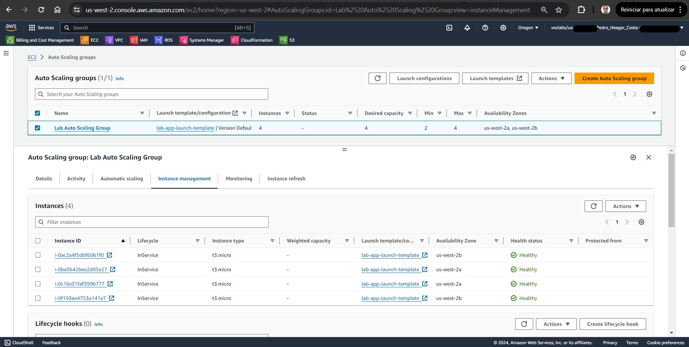<br>
    <figcaption>Imagem 47.</figcaption>
</figure></div><br>

A última tarefa foi apenas encerrar a instância `Web Server 1` que serviu para criação da AMI utilizadas pelas instâncias do auto scaling group. Já a tarefa opcional consistiu em criar a AMI dessa instância `Web Server 1` por comandos **AWS CLI** executados de uma outra instância, ao invés de realizar essa etapa pelo console de gerenciamento da **AWS**. No laboratório seguinte, que era exatamente igual a esse, apenas essa parte da construção da AMI era feita pelo **AWS CLI**, optei por construir toda a arquitetura pelo **AWS CLI** com um único arquivo de script. Para consultá-lo, clique em <a href="#item5.30">5.30 175-[JAWS]-Laboratório: Usar o Auto Scaling na AWS (Linux)</a><br>.

<a name="item5.30"><h4>5.30 175-[JAWS]-Laboratório: Usar o Auto Scaling na AWS (Linux)</h4></a>[Back to summary](#item5) | <a href="">Certificate</a>

Esta laboratório foi exatamente igual ao anterior (<a href="#item5.29">5.29 174- [JAWS] -Laboratório: Dimensionar e balancear a carga da arquitetura</a><br>), apenas a parte da construção da AMI era feita pela **AWS CLI** executado de uma outra instância. Contudo, para diferenciar um pouco, optei por construir toda a arquitetura pelo **AWS CLI** com um único arquivo de script.

Para executar a **AWS CLI**, foi realizado um acesso remoto, pela opção `EC2 Instance Connect` no console de gerenciamento da **AWS**, à instância `Command Host` que foi provisionada automaticamente pelo **AWS CloudFormation** ao iniciar o laboratório. Com essa forma de acesso remoto, não era preciso configurar um par de chaves para autenticar o usuário `ec2-user` na instância. Após isso, um terminal shell conectado na instância foi aberto em uma outra aba do navegador da maquina física. Foi necessário configurar o **AWS CLI** instalado nesse instância com o comando `aws configure` e definir as configurações. Com o comando `curl http://169.254.169.254/latest/dynamic/instance-identity/document | grep region` foi acessado os metadados da própria instância (`Command Host`) para descobrir qual região ela estava usando e se era a região definida no console de gerenciamento da **AWS**, `us-west-2` (Oregon). Nas configurações da CLI da instância, o ID e Secret Access Key foram mantidos os que já estavam configurados, logo foi pressionado `Enter` para confirmar. A região foi a do laboratório `us-west-2` e o fomarto de saída dos dados foi `json`. Na sequência, o diretório corrente foi alterado para a pasta do usuário com o comando `cd /home/ec2-user/`. Os arquivos de scripts que seriam utilizados para criar a segunda instância, que seria modelo de servidor web para arquitetura, foram listados na imagem 48. No laboratório anterior, estava instância já veio provisionada e configurada como servidor web.

<div align="Center"><figure>
    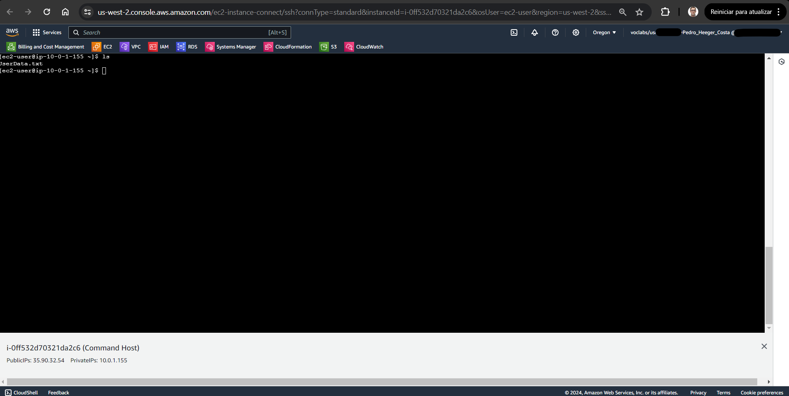<br>
    <figcaption>Imagem 48.</figcaption>
</figure></div><br>

Para inspecionar o arquivo de user data foi executado o comando `more UserData.txt`. Esse arquivo executava várias tarefas de inicialização, incluindo a atualização de todos os softwares instalados na caixa e a instalação de um aplicativo web PHP pequeno que seria utilizado para simular uma alta carga de CPU nas instâncias da arquitetura. Basicamente o arquivo de user data transformava essa instância em um servidor web, construindo a aplicação web que ela executaria. Uma parte dessa aplicação web era um teste de carga que seria utilizado mais a frente para estressar as instâncias fazendo com que elas consumissem bastante CPU e assim, a política de escalabilidade aplicada atuasse.

Na opção `Details` nas instruções do sandbox **Vocareum**, foi copiado os valores de algumas configurações que foram utilizadas no comando abaixo para provisionar a instância modelo de servidor web. 

```bash
aws ec2 run-instances --key-name KEYNAME --instance-type t3.micro --image-id AMIID --user-data file:///home/ec2-user/UserData.txt --security-group-ids HTTPACCESS --subnet-id SUBNETID --associate-public-ip-address --tag-specifications 'ResourceType=instance,Tags=[{Key=Name,Value=WebServer}]' --output text --query 'Instances[*].InstanceId'
```

Ao executar o comando, a instância de modelo de servidor web foi provisionada e no output do comando foi fornecido o Id dessa nova instância. Esse valor foi copiado, pois seria utilizado nos próximos comandos. Com o comando `aws ec2 wait instance-running --instance-ids NEW-INSTANCE-ID` e o Id da instância, foi monitorado o status dela até que ficasse em execução. Ainda utilizando Id da instância no comando `aws ec2 describe-instances --instance-id NEW-INSTANCE-ID --query 'Reservations[0].Instances[0].NetworkInterfaces[0].Association.PublicDnsName'` foi obtido o DNS público para acessar a aplicação desse servidor web modelo. A aplicação foi acessada em outra aba do navegador da maquina física **Windows** com o link `http://PUBLIC-DNS-ADDRESS/index.php`, informando o IP da instância. A imagem 49 exibe a página da aplicação sendo acessada.

<div align="Center"><figure>
    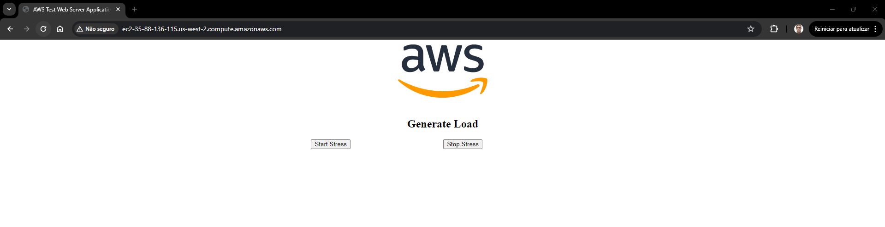<br>
    <figcaption>Imagem 49.</figcaption>
</figure></div><br>

Se tudo estivesse certo, significava que o servidor web modelo estava funcionando e uma AMI da instância poderia ser criada. Com o comando `aws ec2 create-image --name WebServerAMI --instance-id NEW-INSTANCE-ID` e passando o ID da instância `Web Server`, imagem de maquina Amazon foi criada. Por padrão, este comando reiniciava a instância atual antes de criar a AMI para garantir a integridade da imagem no sistema de arquivos. A imagem 50 exibe a AMI construída.

<div align="Center"><figure>
    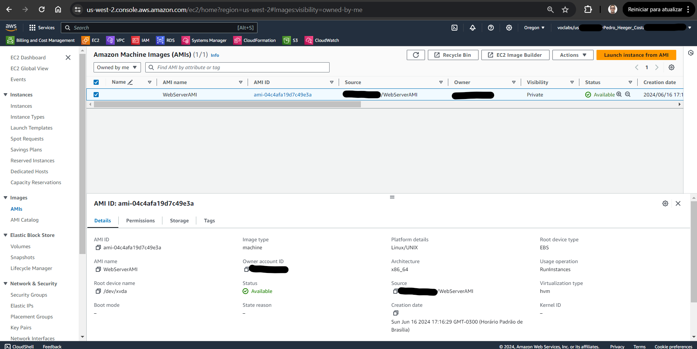<br>
    <figcaption>Imagem 50.</figcaption>
</figure></div><br>

A partir daí, o laboratório indicava para realizar pelo **AWS Console Management**, mas como essa parte foi realizada exatamente igual no laboratório passado, optei por continuar com **AWS CLI** e executar a construção da arquitetura toda com ele. Isso foi realizado criando um arquivo de script do zero, indicando todos os recursos que teriam que ser provisionados. Os recursos foram os mesmos do laboratório anterior: um *Application Load Balancer (ALB)*, um target group, um listener, um launch template, um auto scaling group e duas políticas de escalabilidade com alarmes do **Amazon CloudWatch**. Aqui não entrarei muito em detalhes, pois isso foi realizado no laboratório anterior. As únicas diferenças entre os laboratórios, foram os nomes ou tag de nomes, cujos valores foram diferentes.
- target group (grupo de destino): `webserver-app`.
- *Application Load Balancer (ALB)*: `WebServerELB`.
- Launch template (modelo de execução): `web-app-launch-template`.
- Auto scaling group (grupo de escalabilidade): `Web App Auto Scaling Group`.


A segunda tarefa contemplou na criação de um ambiente de auto scaling, provisionando um balanceador de carga no **Amazon ELB** e um grupo de escalabilidade no **Amazon EC2 Auto Scaling**. Esta tarefa foi realizada direto pelo **AWS Console Management**, pois eram serviços novos até o momento deste bootcamp. A primeira etapa foi criar o load balancer no **Amazon ELB**, que foi do tipo *Application Load Balancer (ALB)* já que era para uma aplicação web. Contudo, ao criar um ALB pelo console, seria preciso criar um target group (grupo de destino). Então para adiantar, criei primeiro o target group indo direto no recurso. Em target group, o tipo de destino foi definido como `instances` e o nome do grupo foi . Na verificação de integridade, o tipo foi definido como `/index.php`, que era a página raiz do site. A imagem 40 exibe o grupo de destino provisionado.

<div align="Center"><figure>
    <br>
    <figcaption>Imagem 40.</figcaption>
</figure></div><br>

De volta ao ALB, o load balancer criado teve o nome `WebServerELB` e nas configurações de rede foi selecionada a VPC do laboratório e suas duas sub-redes públicas. O grupo de segurança escolhido foi um já existente, cujo nome era `HTTPAccess`. Este já possuía uma regra de entrada liberando a porta `80` no protocolo `TCP` para todos os IPs (`0.0.0.0/0`). Lembrando que a VPC e toda configuração de rede foi construída pelo **AWS CloudFormation** ao iniciar o laboratório. Em listeners e roteamento, a ação padrão foi encaminhar e foi escolhido o target group criado, cujo nome era `webserver-app`. Após isso, o load balancer estava criado e era só esperar ele ficar em execução, conforme evidenciado na imagem 41. O DNS do load balancer foi copiado e aberto em outra aba do navegador. Por enquanto ele não funcionaria, pois o tráfego ainda não estava chegando nas instâncias de servidor web.

<div align="Center"><figure>
    <br>
    <figcaption>Imagem 41.</figcaption>
</figure></div><br>

Na etapa 2 da segunda tarefa foi construído um modelo de execução (*launch template*). Um modelo de execução é o que um grupo do Auto Scaling usa para iniciar instâncias do EC2. O nome do modelo de execução foi `web-app-launch-template` e a descrição foi definida como `A web server for the load test app`. Em seguida, foi selecionada a opção para fornecer ajuda para configurar um modelo para ser utilizado pelo **Amazon EC2 Auto Scaling**. Em imagem de maquina Amazon, se a AMI construída não já tivesse selecionada, ela tinha que ser selecionada. O tipo de instância foi `t3.micro` e não foi criado ou definido par de chaves. Nas configurações de rede, o grupo de segurança `HTTPAccess` foi escolhido. Não foi necessário para arquivo de user data configurando o servidor web, pois isso já tinha sido feito na instância modelo de nome `WebServer` e como a imagem utilizada era dela, tudo já estava instalado. A imagem 42 mostra o launch template criado com sucesso.

<div align="Center"><figure>
    <br>
    <figcaption>Imagem 42.</figcaption>
</figure></div><br>

A etapa 3 consistiu na criação do auto scaling group a partir desse modelo de execução elaborado. Portanto, foi selecionado o modelo `web-app-launch-template` e o nome do deste grupo foi definido como `Web App Auto Scaling Group`. Nas configurações de rede foi selecionada a VPC do laboratório e as duas sub-redes privadas, pois as instâncias do grupo de auto scaling estaria na sub-rede privada. Em configurações avançadas, em balanceador de carga, foi anexado a este grupo o load balancer criado e o grupo de destino (target group) construído ` webserver-app | HTTP` foi vinculado. As verificações de integridade adicionais do **Amazon ELB** foram ativadas. Nas configurações da política de escalabilidade, foi definido o tamanho do grupo, informando a capacidade desejada em 2, a capacidade mínima em 2 e a capacidade máxima em 4. A política de escalabilidade escolhida foi de rastreamento de deestino, cujo tipo de métrica foi definido com `média de utilização de CPU` e o valor de destino em `50`. Essa alteração informava ao Auto Scaling para manter uma utilização média da CPU em todas as instâncias em 50%. O Auto Scaling adicionaria ou removeria automaticamente a capacidade conforme necessário para manter a métrica no valor de destino especificado ou próxima dele. Uma tag de nome foi criada, cujo valor foi `WebApp`, que seria utilizada pelas instâncias desse grupo de auto scaling. A imagem 43 evidencia o auto scaling group desenvolvido com duas instâncias, pois a quantidade desejada foram duas.

<div align="Center"><figure>
    <br>
    <figcaption>Imagem 43.</figcaption>
</figure></div><br>

A tarefa três teve como objetivo verificar se essas duas instâncias desse grupo de auto scaling estavam no target group (grupo de destino) do load balancer. Observe na imagem 44, que as instâncias estavam no target group e a verificação de integridade estava marcando como íntegro. Assim, a aplicação web já poderia ser acessada pelo DNS do load balancer, pois ele já estava direcionando o tráfego para essas instâncias que eram servidores web.

<div align="Center"><figure>
    <br>
    <figcaption>Imagem 44.</figcaption>
</figure></div><br>

A última tarefa foi estressar as instâncias clicando na opção `Iniciar stress` dentro da aplicação que era aberta no navegador da maquina física **Windows** através do DNS do load balancer. Essa ação chamará a aplicação stress em segundo plano, fazendo com que a utilização da CPU na instância que atendeu a essa solicitação aumente para 100%. Após realizar isso, era só monitorar os gráficos do auto scaling group, quando a quantidade de CPU utilizada deste grupo, no caso a média entre as duas instâncias, passasse de 50%, o **Amazon CloudWatch** acionaria o **Amazon EC2 Auto Scaling** para provisionar uma nova instância para este grupo com o objetivo de atender a carga. A imagem 45 exibe o **Amazon CloudWatch** acionando o auto scaling e a imagem 46 evidencia a criação de uma nova instância.

<div align="Center"><figure>
    <br>
    <figcaption>Imagem 45.</figcaption>
</figure></div><br>

<div align="Center"><figure>
    <br>
    <figcaption>Imagem 46.</figcaption>
</figure></div><br>


<a name="item5.31"><h4>5.31 Desafio de previsão de Auto Scaling</h4></a>[Back to summary](#item5) | <a href="">Certificate</a>

Decidiu-se implementar uma política de escalonamento automático do **Amazon EC2** para escalonamento em etapas para um grupo específico. Os parâmetros configurados são os seguintes: Capacidade máxima: 20; Capacidade desejada: 10; Capacidade mínima: 5. No entanto, não há certeza sobre como o número de instâncias do **Amazon Elastic Compute Cloud (Amazon EC2)** será ajustado com base nas políticas atuais que controlam esses comportamentos. Para testar esses comportamentos, é importante prever o número esperado de instâncias a qualquer momento, levando em conta as políticas e os alarmes correspondentes.

Imagine ter decidido criar uma política de escalonamento automático do **Amazon EC2** para escalonamento gradual. Os alarmes configurados para controlar o comportamento de aumento e redução da quantidade de instâncias são fundamentais. Os alarmes do CloudWatch são ajustados para reduzir o tamanho do grupo em uma instância quando a carga média da CPU se mantiver entre 20% e 40% por mais de 2 minutos. Se a carga média da CPU for inferior a 20% por mais de 2 minutos, serão removidas duas instâncias. Por outro lado, se a utilização da CPU se situar entre 60% e 80% por mais de 2 minutos, uma instância será adicionada. Se exceder 80% por mais de 2 minutos, serão adicionadas duas instâncias. Observe agora o que ocorrerá em diferentes cenários.

A utilização média da CPU tem sido consistente entre 63% e 70% por mais de 2 minutos. O período de aquecimento da instância foi configurado para 5 minutos. Nesta situação, a política adiciona uma instância ao grupo do Auto Scaling, mas essa nova instância não será contada como parte da contagem total até que seu período de aquecimento (por exemplo, 5 minutos) seja concluído. A pressão na CPU continua aumentando e permanece no intervalo de 60% a 80%. A condição 1 ocorreu há dois minutos. Portanto, outro alarme para aumentar a quantidade de instâncias em uma unidade é disparado, mas nenhuma instância adicional é acrescida porque o período de aquecimento da instância ainda não terminou. A condição 1 foi atendida há menos de 5 minutos, mas agora a utilização da CPU está em 85%. Neste caso, a política para adicionar duas instâncias é acionada. Como uma instância já está em processo de aquecimento, apenas uma instância adicional é iniciada. Mais tempo se passou e a primeira das duas instâncias adicionadas agora está totalmente aquecida e processando parte da carga, enquanto a segunda ainda está em processo de aquecimento. No entanto, a pressão de utilização da CPU está diminuindo. A utilização média caiu para menos de 60%, embora ainda esteja acima de 40%. Portanto, nenhum alarme é acionado e nenhuma ação adicional é tomada.

Agora, com 12 instâncias no grupo e possivelmente uma demanda reduzida na implantação do aplicativo associado a esse grupo, a utilização da CPU caiu abaixo do limite de 40%. Em resposta, após permanecer abaixo desse limite por 2 minutos, um dos alarmes para redução de instâncias é acionado, o que ativa a política para remover uma instância. Posteriormente, a utilização da CPU continua diminuindo e agora está em torno de 17%. Como resultado, duas instâncias são removidas pelo Auto Scaling. Agora, o grupo está operando com apenas nove instâncias.

Sobrecarga é uma situação na qual a memória virtual de um computador é excessivamente utilizada, levando-o a não conseguir mais atender às demandas dos aplicativos em execução. Ao configurar o autoscaling, é crucial evitar a sobrecarga. Isso pode ocorrer se as instâncias forem adicionadas ou removidas em sequência muito rapidamente. Uma estratégia eficaz para evitar a sobrecarga é configurar alarmes que respondam apenas a mudanças de estado que são sustentadas ao longo do tempo. Estabeleça gatilhos para alterações de estado que persistem por um período adequado antes de acionar ações automáticas.

O período de cooldown do **Amazon EC2 Auto Scaling** é uma configuração ajustável que assegura que novas instâncias não sejam iniciadas ou encerradas antes que a ação de escalabilidade anterior entre em vigor. Ao escalar manualmente o grupo do Auto Scaling do **Amazon EC2**, por padrão, o período de cooldown não é observado. No entanto, é possível substituir esse padrão para seguir o período de cooldown estabelecido. Importante notar que, se uma instância se tornar não íntegra, o **Amazon EC2 Auto Scaling** não aguardará o fim do período de cooldown para substituir essa instância. O **Amazon EC2 Auto Scaling** suporta períodos de cooldown padrão e períodos de cooldown específicos para cada tipo de escalabilidade. Os períodos de cooldown são aplicáveis quando se utiliza políticas simples de escalabilidade, mas não se aplicam a políticas de monitoramento de objetivo, políticas de escalabilidade com etapas ou escalabilidade programada.

Além disso, nas políticas de escalabilidade com etapas, é possível definir o tempo em segundos necessário para que uma instância recém-iniciada complete o seu aquecimento. Durante esse período de aquecimento especificado, a instância não será incluída nas métricas agregadas do grupo do Auto Scaling pela **AWS**. Ao aumentar a capacidade, as instâncias em aquecimento também não são consideradas parte da capacidade atual do grupo. Portanto, múltiplas violações de alarme que ocorrem dentro do mesmo período de ajuste com etapas resultam em apenas uma ação de escalabilidade. Esse mecanismo assegura que o **Amazon EC2 Auto Scaling** não adiciona mais instâncias do que o necessário. Por exemplo, se o aquecimento leva 5 minutos.

Em certas situações, pode ser necessário intervir antes que uma ação do **Amazon EC2 Auto Scaling** adicione ou remova instâncias do seu grupo do **Amazon EC2 Auto Scaling**. Os ganchos de ciclo de vida do grupo do **Amazon EC2 Auto Scaling** oferecem essa flexibilidade. Por exemplo, durante um evento de aumento de capacidade, o **Amazon EC2 Auto Scaling** poderia iniciar uma instância, enviar uma notificação predefinida para uma pessoa ou aplicativo, e então não realizar mais nenhuma ação. Nesse cenário, cabe ao destinatário da notificação realizar uma ação na instância, como instalar software, e em seguida adicioná-la ao grupo do **Amazon EC2 Auto Scaling**. Alternativamente, durante um evento de redução de capacidade, um gancho de ciclo de vida do **Amazon EC2 Auto Scaling** poderia ser utilizado para remover uma instância do grupo do Auto Scaling e, em seguida, enviar uma notificação. Ao receber a notificação, o usuário ou ação programada poderia realizar alguma ação na instância, como recuperar logs, antes de finalizar sua execução.

<a name="item5.32"><h4>5.32 Amazon Route 53</h4></a>[Back to summary](#item5) | <a href="">Certificate</a>

O Elastic Load Balancing e o Auto Scaling do EC2 permitem a criação de arquiteturas altamente flexíveis, escaláveis e resilientes. No entanto, como proceder quando há necessidade de distribuir o tráfego entre regiões da **Amazon Web Services (AWS)**? Há várias razões para se desejar essa distribuição, como recuperação de desastres em caso de falhas generalizadas e redução da latência ao fornecer serviços mais próximos dos usuários. O **Amazon Route 53** é um serviço de Domain Name System (DNS) na nuvem, altamente disponível e escalável, que atende a essa necessidade. Projetado para oferecer uma forma confiável e econômica de direcionar usuários finais a aplicativos na Internet, o **Amazon Route 53** converte URLs (por exemplo, www.example.com) em endereços IP numéricos (como 192.0.2.1), permitindo que os computadores se conectem entre si.

O **Amazon Route 53** direciona solicitações de usuários para a infraestrutura que está em execução na **AWS**, como instâncias do **Amazon Elastic Compute Cloud (Amazon EC2)**, balanceadores de carga do ELB ou buckets do **Amazon Simple Storage Service (Amazon S3)**. Além disso, também é possível rotear usuários para infraestruturas localizadas fora da **AWS**. O **Amazon Route 53** permite a configuração de verificações de integridade do DNS, possibilitando o roteamento do tráfego para pontos de extremidade íntegros ou o monitoramento independente da integridade do aplicativo e dos seus pontos de extremidade.

O **Amazon Route 53** facilita o gerenciamento global do tráfego através de diversos tipos de roteamento, incluindo roteamento baseado em latência, geoproximidade ou geolocalização e weighted round robin. Esses métodos de roteamento podem ser combinados com failover de DNS para criar arquiteturas de baixa latência e alta tolerância a falhas. Além disso, o **Amazon Route 53** oferece serviços de registro de nomes de domínio, permitindo a compra e gestão de domínios, como example.com, com configuração automática das definições de DNS para esses domínios.

Um load balancer do ELB distribui cargas de trabalho entre vários recursos de computação, como servidores virtuais, aumentando a disponibilidade e a tolerância a falhas dos aplicativos. Ao criar um balanceador de carga do ELB, ele recebe um nome DNS padrão, mas é possível associar um nome DNS personalizado, gerenciado pelo Route 53. Por exemplo, é possível registrar um nome de domínio, como example.com, para um site ou aplicativo da web, e rotear o tráfego da Internet para os recursos na conta da **AWS**. Um registro CNAME pode redirecionar consultas DNS para qualquer outro registro DNS, como apex.example.com para acme.example.com ou acme.example.org. Um registro de alias, por outro lado, só pode redirecionar consultas para recursos específicos da **AWS**, como buckets do S3, distribuições do **Amazon CloudFront** ou outro registro na zona hospedada do Route 53 onde o alias foi criado.

O Amazon Route 53 oferece suporte a sete diferentes políticas de roteamento:
- Política de roteamento simples: Usada para um único recurso que realiza uma função específica para um domínio, como um servidor web que fornece conteúdo para o site example.com.
- Política de roteamento ponderado: Direciona o tráfego para vários recursos nas proporções especificadas.
- Política de roteamento de latência: Ideal para quando há recursos em várias regiões da **AWS** e deseja-se direcionar o tráfego para a região com a menor latência.
- Política de roteamento de failover: Configura o failover ativo/passivo.
- Política de roteamento de geolocalização: Direciona o tráfego com base na localização dos usuários.
- Política de roteamento de geoproximidade: Roteia o tráfego com base na localização dos recursos e pode opcionalmente desviar o tráfego de uma localização para outra.
- Roteamento de resposta com valores múltiplos: Permite que o Route 53 responda a consultas DNS com até oito registros íntegros selecionados aleatoriamente.

Imagine uma situação onde a arquitetura de implantação precisa ser distribuída entre várias regiões globais para garantir tempos de resposta mais rápidos aos usuários. A região geograficamente mais próxima do usuário geralmente proporciona o menor tempo de resposta, mas isso não é uma regra fixa. Para otimizar o desempenho, o Route 53 pode ser configurado para usar roteamento baseado em latência (Latency-based Routing (LBR)). Esse tipo de roteamento permite usar o DNS para direcionar as solicitações dos usuários para a região da **AWS** que oferecerá a resposta mais rápida. Por exemplo, se houver balanceadores de carga nas regiões Oeste dos EUA (Oregon) e Ásia-Pacífico (Sydney), será possível criar registros de recursos de latência no **Amazon Route 53** para cada balanceador de carga. Quando um usuário em Barcelona, Espanha, digitar o nome do domínio em um navegador, a solicitação DNS será encaminhada para um servidor de nomes do Route 53. O Route 53 analisará os dados de latência entre as diferentes regiões e direcionará a solicitação conforme necessário. Na maioria das vezes, isso significa que a solicitação será roteada para a localização geográfica mais próxima, como Austrália para um usuário na Nova Zelândia ou Oregon para um usuário no Canadá.

Uma implantação azul/verde é uma estratégia que minimiza o risco de indisponibilidade do site ou aplicativo ao operar dois ambientes de produção simultâneos. Um desses ambientes é chamado de azul, e o outro, de verde. Em um cenário com dois ambientes paralelos, cada um possui seu próprio balanceador de carga do ELB e configuração do **Amazon EC2 Auto Scaling**. Utilizando o recurso de roteamento ponderado do Route 53, é possível redirecionar gradualmente os usuários do ambiente atual (azul) para o novo ambiente (verde). Esse procedimento facilita a migração de usuários para um ambiente atualizado ou totalmente novo. Ferramentas como **Amazon CloudWatch** e *Amazon CloudWatch Logs* são essenciais para monitorar o ambiente verde. Se surgirem problemas no novo ambiente, o roteamento ponderado do Route 53 permite retornar os usuários ao ambiente azul. Assim que o ambiente verde estiver estável e funcionando corretamente, o ambiente azul pode ser desativado gradualmente. Devido à possível latência dos registros DNS, a desativação completa do ambiente azul pode levar de um dia a uma semana.

É sempre recomendável testar implantações de escalabilidade usando testes de carga para simular o tráfego. Como profissional de SysOps, é essencial ter certeza de que a escalabilidade no projeto de implantação funciona conforme o esperado. Identificar problemas antes da entrada em produção é crucial. Diversas ferramentas de código aberto podem ser utilizadas para simular testes de carga, incluindo as seguintes: **TheGrinder**, **Apache Jmeter** e **Bees with Machine Guns** (um script de teste de carga específico para o **Amazon EC2**).

<a name="item5.33"><h4>5.33 Demonstração do Amazon Route 53-2</h4></a>[Back to summary](#item5) | <a href="">Certificate</a>


<a name="item5.34"><h4>5.34 Amazon CloudFront</h4></a>[Back to summary](#item5) | <a href="">Certificate</a>

O **Amazon CloudFront** é um serviço web que acelera a distribuição de conteúdo estático e dinâmico, como arquivos .html, .css, .js e imagens, para os usuários. Ele faz isso utilizando uma rede global de datacenters conhecidos como pontos de presença. Utilizando o CloudFront, o conteúdo é entregue a partir de vários locais ao redor do mundo, resultando em menor latência para os usuários. Esse uso de uma CDN permite interações mais rápidas com o aplicativo, economizando dinheiro e melhorando o desempenho dos aplicativos.

O Amazon CloudFront oferece diversos benefícios, tais como:
- Infraestrutura Global Expansiva: Baseado na crescente infraestrutura global da **AWS**, com uma rede de pontos de presença que assegura alta disponibilidade, escalabilidade e desempenho dos aplicativos.
- Segurança: Projetado para ser seguro, proporcionando proteção tanto de rede quanto de nível de aplicativo.
- Programabilidade: Permite a execução de código em locais da **AWS** ao redor do mundo, respondendo aos usuários com a menor latência possível.
- Otimização: Otimizado para baixa latência e alta velocidade de transferência de dados.
- Custo-Efetividade: Cobra apenas pela transferência de dados e solicitações utilizadas para entrega de conteúdo aos clientes, sem necessidade de pagamentos antecipados, taxas fixas de plataforma, compromissos de longo prazo, taxas adicionais para conteúdo dinâmico ou serviços profissionais para começar a usar. Ao utilizar origens da **AWS**, como o **Amazon S3** ou o Elastic Load Balancing, apenas os custos de armazenamento são pagos, e não pelos dados transferidos entre esses serviços e o CloudFront.
- Integração com Outros Serviços **AWS**: Funciona em conjunto com outros serviços da **AWS** para distribuir conteúdo aos usuários finais com baixa latência, altas velocidades de transferência de dados e sem compromissos mínimos exigidos.

Ao estimar o custo do **Amazon CloudFront**, é importante considerar a distribuição de tráfego, o número de solicitações e a transferência de dados para fora. Os custos de transferência de dados e solicitações variam entre diferentes regiões geográficas, e os preços são determinados pelo ponto de presença de onde o conteúdo é entregue. Fatores como o número e o tipo de solicitações (HTTP ou HTTPS), a região geográfica das solicitações e a quantidade de dados transferidos para fora dos pontos de presença do CloudFront também influenciam os custos.

<a name="item5.35"><h4>5.35 176-[JAWS]-Atividade: Roteamento de failover do Route 53</h4></a>[Back to summary](#item5) | <a href="">Certificate</a>

<a name="item5.37"><h4>5.37 AWS Lambda</h4></a>[Back to summary](#item5) | <a href="">Certificate</a>
<a name="item5.38"><h4>5.38 178- [JAWS] -Atividade: Trabalhar com o AWS Lambda</h4></a>[Back to summary](#item5) | <a href="">Certificate</a>
<a name="item5.39"><h4>5.39 APIs e REST da Amazon</h4></a>[Back to summary](#item5) | <a href="">Certificate</a>


<a name="item5.40"><h4>5.40 Amazon API Gateway</h4></a>[Back to summary](#item5) | <a href="">Certificate</a>
<a name="item5.41"><h4>5.41 Contêineres na AWS</h4></a>[Back to summary](#item5) | <a href="">Certificate</a>


<a name="item5.43"><h4>5.43 Funções do AWS Step</h4></a>[Back to summary](#item5) | <a href="">Certificate</a>
<a name="item5.44"><h4>5.44 Visão geral dos bancos de dados</h4></a>[Back to summary](#item5) | <a href="">Certificate</a>
<a name="item5.45"><h4>5.45 Amazon Redshift</h4></a>[Back to summary](#item5) | <a href="">Certificate</a>
<a name="item5.46"><h4>5.46 Amazon Aurora</h4></a>[Back to summary](#item5) | <a href="">Certificate</a>
<a name="item5.47"><h4>5.47 Migração de banco de dados da Amazon</h4></a>[Back to summary](#item5) | <a href="">Certificate</a>
<a name="item5.48"><h4>5.48 179- [JAWS] -Atividade: Migrar para o Amazon RDS</h4></a>[Back to summary](#item5) | <a href="">Certificate</a>


<a name="item5.50"><h4>5.50 Visão geral das redes da AWS</h4></a>[Back to summary](#item5) | <a href="">Certificate</a>
<a name="item5.51"><h4>5.51 Amazon VPC</h4></a>[Back to summary](#item5) | <a href="">Certificate</a>
<a name="item5.52"><h4>5.52 Opções de conectividade da Amazon VPC</h4></a>[Back to summary](#item5) | <a href="">Certificate</a>
<a name="item5.53"><h4>5.53 Segurança e solução de problemas da rede</h4></a>[Back to summary](#item5) | <a href="">Certificate</a>
<a name="item5.54"><h4>5.54 Visão geral do laboratório: Configurar uma Amazon VPC</h4></a>[Back to summary](#item5) | <a href="">Certificate</a>
<a name="item5.55"><h4>5.55 180- [JAWS] -Laboratório: Configurar uma Amazon VPC</h4></a>[Back to summary](#item5) | <a href="">Certificate</a>
<a name="item5.56"><h4>5.56 181- [JAWS] -Atividade: Solucionar problemas de uma VPC</h4></a>[Back to summary](#item5) | <a href="">Certificate</a>

<a name="item5.58"><h4>5.58 Visão geral do Cloud Storage</h4></a>[Back to summary](#item5) | <a href="">Certificate</a>
<a name="item5.59"><h4>5.59 Amazon EBS</h4></a>[Back to summary](#item5) | <a href="">Certificate</a>


<a name="item5.60"><h4>5.60 Demonstração do Amazon EBS-2</h4></a>[Back to summary](#item5) | <a href="">Certificate</a>
<a name="item5.61"><h4>5.61 182- [JAWS] -Laboratório: Trabalhar com o Amazon EBS</h4></a>[Back to summary](#item5) | <a href="">Certificate</a>
<a name="item5.62"><h4>5.62 O armazenamento de instâncias do EC2</h4></a>[Back to summary](#item5) | <a href="">Certificate</a>
<a name="item5.63"><h4>5.63 Elastic File System</h4></a>[Back to summary](#item5) | <a href="">Certificate</a>
<a name="item5.64"><h4>5.64 Demonstração do Elastic File System-2</h4></a>[Back to summary](#item5) | <a href="">Certificate</a>
<a name="item5.65"><h4>5.65 Amazon Glacier</h4></a>[Back to summary](#item5) | <a href="">Certificate</a>
<a name="item5.66"><h4>5.66 Demonstração do S3 Glacier-2</h4></a>[Back to summary](#item5) | <a href="">Certificate</a>
<a name="item5.67"><h4>5.67 Amazon S3 e a CLI da AWS</h4></a>[Back to summary](#item5) | <a href="">Certificate</a>
<a name="item5.68"><h4>5.68 183- [JAWS] -Laboratório: Gerenciar o armazenamento</h4></a>[Back to summary](#item5) | <a href="">Certificate</a>
<a name="item5.69"><h4>5.69 Amazon Storage Gateway</h4></a>[Back to summary](#item5) | <a href="">Certificate</a>


<a name="item5.70"><h4>5.70 184- [JAWS] -Laboratório: [Desafio] Exercício de S3</h4></a>[Back to summary](#item5) | <a href="">Certificate</a>
<a name="item5.71"><h4>5.71 185- [JAWS] -Atividade: Trabalhar com o Amazon S3</h4></a>[Back to summary](#item5) | <a href="">Certificate</a>


<a name="item5.73"><h4>5.73 Esperamos que seu Jumpstart na AWS esteja indo bem!</h4></a>[Back to summary](#item5) | <a href="">Certificate</a>


<div align="Center"><figure>
    <br>
    <figcaption>Imagem 02.</figcaption>
</figure></div><br>


