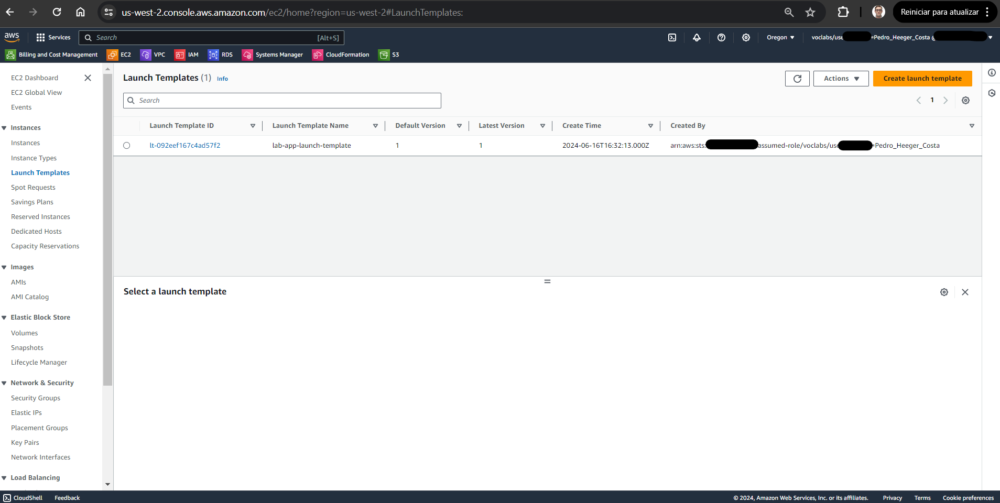
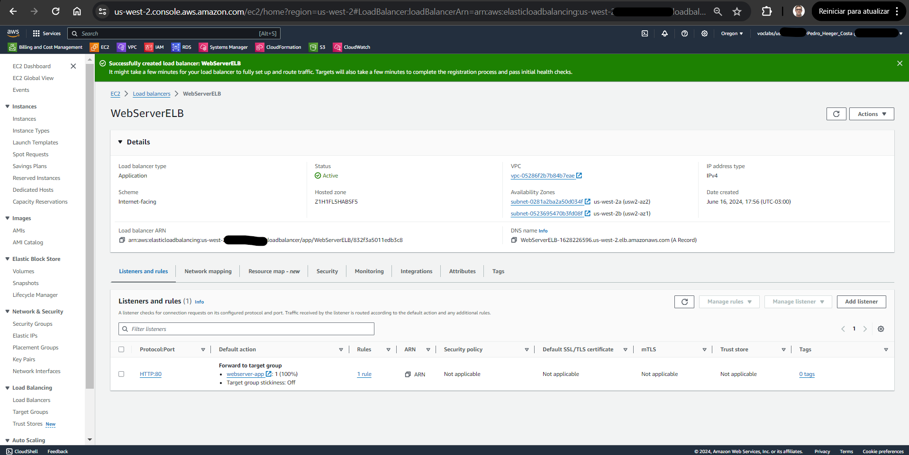
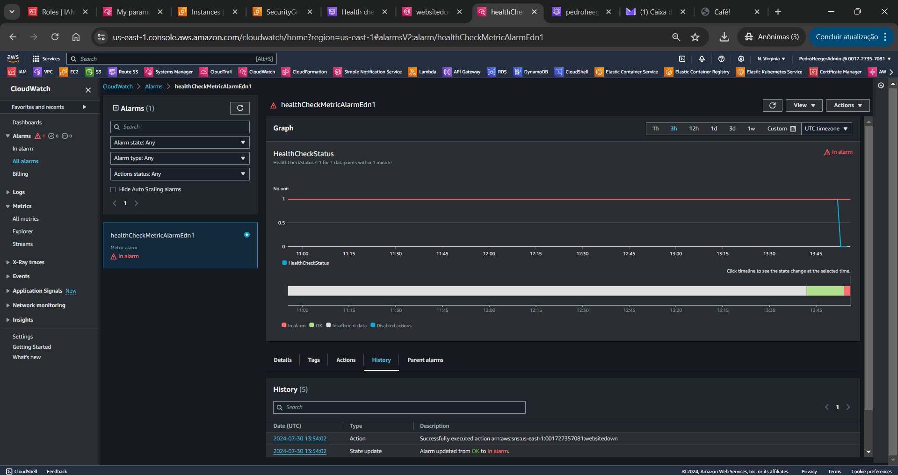
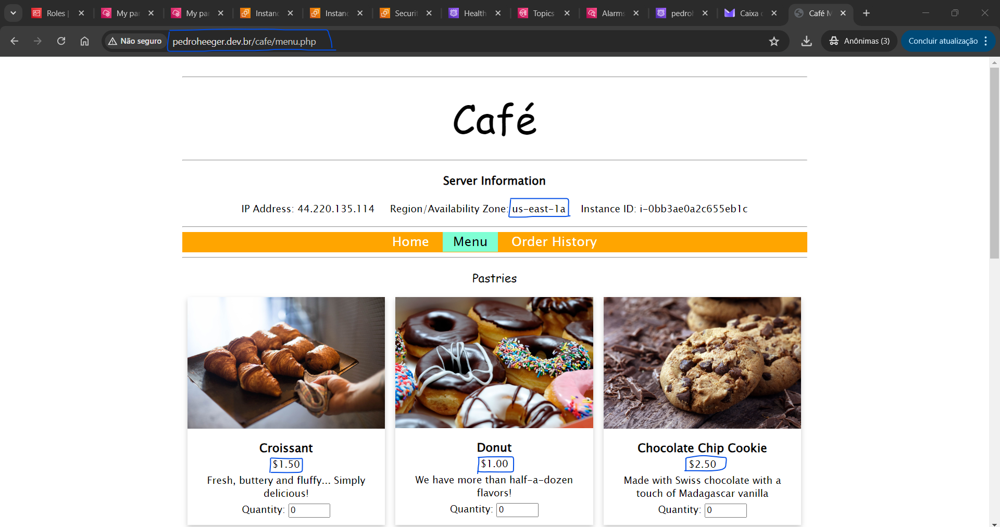

# Bootcamp AWS re/Start-Cloud Computing - Module 5   

### Repository: [boot](../../../../)   
### Platform: <a href="../../../">edn   </a> 
### Software/Subject: <a href="../../">aws    </a>
### Bootcamp: <a href="../">boot_022 (Bootcamp AWS re/Start-Cloud Computing)   </a>
### Module: 5. Jumpstart na AWS 

---

This folder refers to Module 5 **Jumpstart na AWS** from bootcamp [**Bootcamp AWS re/Start-Cloud Computing**](../).

### Theme:
- Cloud Computing

### Used Tools:
- Operating System (OS): 
  - Linux   
  - Windows 11   
- Linux Distribution: 
  - Amazon Linux   
- Virtualization: 
  - Vocareum   
- Cloud:
  - AWS   
- Cloud Services:
  - Amazon EC2 Auto Scaling   
  - Amazon EC2 Systems Manager   
  - Amazon Elastic Compute Cloud (EC2)   
  - Amazon Rekognition   
  - Amazon Relational Database Service (RDS)   
  - Amazon Route 53   
  - Amazon Simple Notification Service (SNS)   
  - Amazon Virtual Private Cloud (VPC)   
  - Google Drive   
- Language:
  - HTML   
  - Markdown   
  - PHP   
  - Python   
- Integrated Development Environment (IDE) and Text Editor:
  - Visual Studio Code (VS Code)   
- Versioning: 
  - Git   
- Repository:
  - GitHub   
- Command Line Interpreter (CLI):
  - AWS Command Line Interface (CLI)   
  - Bash e Sh   
  - MySQL Shell 
  - Prompt de Comando (cmd)   
  - Systemctl   
  - Windows PowerShell   
- Server and Databases:
  - Apache HTTP Server (httpd)   
  - MySQL Server   
- Database Administration Tool:
  - DBeaver   
  - SQLPro Studio   

---

### Bootcamp Module 5 Structure

5. <a name="item5">Jumpstart na AWS</a><br>
  5.1. <a href="#item5.1">AWS Cloud Adoption Framework</a><br>
  5.2. <a href="#item5.2">AWS Well Architected Framework</a><br>
  5.3. 167-[JAWS]-KC - Well-Architected Framework<br>
  5.4. <a href="#item5.4">Design do Well-Architected</a><br>
  5.5. <a href="#item5.5">Confiabilidade e alta disponibilidade</a><br>
  5.6. <a href="#item5.6">Transição de um data center para a nuvem</a><br>
  5.7. <a href="#item5.7">AWS Identity and Access Management</a><br>
  5.8. <a href="#item5.8">AWS Command Line Interface</a><br>
  5.9. <a href="#item5.9">AWS Systems Manager</a><br>
  5.10. <a href="#item5.10">169- [JAWS] -Laboratório: Usar o AWS Systems Manager</a><br>
  5.11. <a href="#item5.11">Ferramentas de administração e desenvolvimento</a><br>
  5.12. <a href="#item5.12">Hospedar um site estático no S3 da AWS</a><br>
  5.13. <a href="#item5.13">170-[JAWS]-Visão geral da atividade do café: crie um site no S3</a><br>
  5.14. Visão geral da computação (servidores)<br>
  5.15. <a href="#item5.15">Computação na AWS</a><br>
  5.16. <a href="#item5.16">Gerenciar instâncias da AWS</a><br>
  5.17. Visão geral do laboratório: Instâncias do EC2<br>
  5.18. <a href="#item5.18">171- [JAWS] -Lab - Criando instâncias do Amazon EC2</a><br>
  5.19. <a href="#item5.19">Demonstração do AWS IAM-2</a><br>
  5.20. <a href="#item5.20">172- [JAWS] -Laboratório: [Desafio] Exercício de instância do EC2</a><br>
  5.21. 212- [JAWS] -KC - Computação (servidores)<br>
  5.22. <a href="#item5.22">AWS Elastic Beanstalk</a><br>
  5.23. <a href="#item5.23">173- [JAWS] -Atividade: Solucionar problemas para criar uma instância</a><br>
  5.24. Visão geral de escalabilidade e resolução de nomes<br>
  5.25. <a href="#item5.25">Elastic Load Balancing</a><br>
  5.26. <a href="#item5.26">Listeners do Elastic Load Balancer</a><br>
  5.27. <a href="#item5.27">Auto Scaling do Amazon EC2</a><br>
  5.28. Visão geral do laboratório: Auto Scaling do EC2<br>
  5.29. <a href="#item5.29">174- [JAWS] -Laboratório: Dimensionar e balancear a carga da arquitetura</a><br>
  5.30. <a href="#item5.30">175-[JAWS]-Laboratório: Usar o Auto Scaling na AWS (Linux)</a><br>
  5.31. <a href="#item5.31">Desafio de previsão de Auto Scaling</a><br>
  5.32. <a href="#item5.32">Amazon Route 53</a><br>
  5.33. <a href="#item5.33">Demonstração do Amazon Route 53-2</a><br>
  5.34. <a href="#item5.34">Amazon CloudFront</a><br>
  5.35. <a href="#item5.35">176-[JAWS]-Atividade: Roteamento de failover do Route 53</a><br>
  5.36. 213- [JAWS] -KC - Computação (dimensionamento e resolução de nomes)<br>
  5.37. <a href="#item5.37">AWS Lambda</a><br>
  5.38. <a href="#item5.38">178- [JAWS] -Atividade: Trabalhar com o AWS Lambda</a><br>
  5.39. <a href="#item5.39">APIs e REST da Amazon</a><br>
  5.40. <a href="#item5.40">Amazon API Gateway</a><br>
  5.41. <a href="#item5.41">Contêineres na AWS</a><br>
  5.42. 214- [JAWS] -KC - Computação (contêineres)<br>
  5.43. <a href="#item5.43">Funções do AWS Step</a><br>
  5.44. <a href="#item5.44">Visão geral dos bancos de dados</a><br>
  5.45. <a href="#item5.45">Amazon Redshift</a><br>
  5.46. <a href="#item5.46">Amazon Aurora</a><br>
  5.47. <a href="#item5.47">Migração de banco de dados da Amazon</a><br>
  5.48. <a href="#item5.48">179- [JAWS] -Atividade: Migrar para o Amazon RDS</a><br>
  5.49. 215- [JAWS] -KC - Computação (bancos de dados)<br>
  5.50. Visão geral das redes da AWS<br>
  5.51. <a href="#item5.51">Amazon VPC</a><br>
  5.52. <a href="#item5.52">Opções de conectividade da Amazon VPC</a><br>
  5.53. <a href="#item5.53">Segurança e solução de problemas da rede</a><br>
  5.54. Visão geral do laboratório: Configurar uma Amazon VPC<br>
  5.55. <a href="#item5.55">180- [JAWS] -Laboratório: Configurar uma Amazon VPC</a><br>
  5.56. <a href="#item5.56">181- [JAWS] -Atividade: Solucionar problemas de uma VPC</a><br>
  5.57. 216- [JAWS] -KC - Rede<br>
  5.58. <a href="#item5.58">Visão geral do Cloud Storage</a><br>
  5.59. <a href="#item5.59">Amazon EBS</a><br>
  5.60. <a href="#item5.60">Demonstração do Amazon EBS-2</a><br>
  5.61. <a href="#item5.61">182- [JAWS] -Laboratório: Trabalhar com o Amazon EBS</a><br>
  5.62. <a href="#item5.62">O armazenamento de instâncias do EC2</a><br>
  5.63. <a href="#item5.63">Elastic File System</a><br>
  5.64. <a href="#item5.64">Demonstração do Elastic File System-2</a><br>
  5.65. <a href="#item5.65">Amazon Glacier</a><br>
  5.66. <a href="#item5.66">Demonstração do S3 Glacier-2</a><br>
  5.67. <a href="#item5.67">Amazon S3 e a CLI da AWS</a><br>
  5.68. <a href="#item5.68">183- [JAWS] -Laboratório: Gerenciar o armazenamento</a><br>
  5.69. <a href="#item5.69">Amazon Storage Gateway</a><br>
  5.70. <a href="#item5.70">184- [JAWS] -Laboratório: [Desafio] Exercício de S3</a><br>
  5.71. <a href="#item5.71">185- [JAWS] -Atividade: Trabalhar com o Amazon S3</a><br>
  5.72. 217- [JAWS] -KC - Armazenamento e arquivamento<br>
  5.73. <a href="#item5.73">Esperamos que seu Jumpstart na AWS esteja indo bem!</a><br>

---

### Objective:
O objetivo deste módulo do bootcamp foi explicar diversos serviços da **AWS** necessários para realização do exame de certificação **AWS Certified Cloud Practitioner (CLF-C01)**.

### Structure:
A estrutura das pastas obedece a estruturação do bootcamp, ou seja, conforme foi necessário, sub-pastas foram criadas para os cursos específicos deste módulo. Na imagem 01 é exibido a estruturação das pastas. 

<div align="Center"><figure>
    <br>
    <figcaption>Imagem 01.</figcaption>
</figure></div><br>

### Development:
O desenvolvimento deste módulo do bootcamp foi dividido em um curso e um laboratório. Abaixo é explicado o que foi desenvolvido em cada uma dessas atividades.

<a name="item5.1"><h4>5.1 AWS Cloud Adoption Framework</h4></a>[Back to summary](#item5) | <a href="">Certificate</a>

A jornada de cada organização na adoção da nuvem é única. No entanto, para que uma organização migre com sucesso seu portfólio de TI para a nuvem, é essencial que três elementos ( pessoas, processos e tecnologia) estejam alinhados. Os líderes de negócios e tecnologia precisam entender o estado atual da organização, o estado desejado e a transição necessária para atingir esse estado, a fim de definir metas e criar processos para a equipe. O **AWS Cloud Adoption Framework (AWS CAF)** auxilia as organizações a desenvolver planos eficientes e eficazes para a adoção da nuvem. As práticas recomendadas e orientações oferecidas pelo framework ajudam a criar uma abordagem abrangente para gerenciar a computação em nuvem na organização e em todo o ciclo de vida da TI.

O **AWS CAF** simplifica o complexo processo de planejamento de migração para a nuvem, ao dividí-lo em seis partes gerenciáveis, chamadas perspectivas. Essas perspectivas cobrem áreas essenciais focadas em pessoas, processos e tecnologia. As habilidades dentro de cada perspectiva identificam as áreas da organização que precisam de atenção. Com base nisso, as ações são organizadas em fluxos de trabalho prescritivos que apoiam uma migração bem-sucedida para a nuvem. Cada perspectiva cobre responsabilidades específicas, gerenciadas por stakeholders que têm funções relacionadas. As perspectivas de negócios, pessoas e governança se concentram nas capacidades de negócios, enquanto as perspectivas de plataforma, segurança e operações se concentram em recursos técnicos.

Os stakeholders da perspectiva de negócios (gerentes de negócios, gerentes financeiros, proprietários de orçamento e responsáveis pela estratégia) podem usar o **AWS CAF** para criar um caso de negócio sólido para a adoção da nuvem e priorizar iniciativas de migração. Eles devem assegurar que as estratégias e metas de negócios da organização estejam alinhadas com suas estratégias e objetivos de TI. Entre os principais recursos dessa perspectiva estão: Finanças de TI, Estratégia de TI, Realização de benefícios e Gerenciamento de riscos empresariais. Os stakeholders da perspectiva de pessoas (recursos humanos, equipes e gerentes de pessoas) podem usar o **AWS CAF** para avaliar estruturas e funções organizacionais, bem como novos requisitos de habilidades e processos, identificando possíveis lacunas. Realizar uma análise de necessidades e lacunas pode ajudar a priorizar o treinamento, a equipe e as mudanças organizacionais para criar uma organização mais ágil. Seus principais recursos incluem: Gerenciamento de recursos, Gerenciamento de incentivos, Gerenciamento de carreiras, Gerenciamento de treinamento e Gerenciamento de mudanças organizacionais. Já os stakeholders da perspectiva de governança (Chief Information Officer ou CIO, gerentes de programas, arquitetos empresariais, analistas de negócios e gerentes de portfólio) podem usar o **AWS CAF** para focar nas habilidades e processos necessários para alinhar a estratégia e as metas de TI com a estratégia e as metas empresariais. Esse enfoque ajuda a organização a maximizar o valor comercial de seu investimento em TI e a minimizar os riscos empresariais. Seus recursos principais são: Gerenciamento de portfólio, Gerenciamento de programas e projetos, Medição de desempenho dos negócios e Gerenciamento de licenças.

Os stakeholders da perspectiva de plataforma (diretor de tecnologia ou CTO, gerentes de TI e arquitetos de soluções) utilizam diversas dimensões e modelos de arquitetura para compreender e comunicar a natureza dos sistemas de TI e suas interrelações. Eles devem ser capazes de descrever detalhadamente a arquitetura do ambiente de destino. O **AWS CAF** inclui princípios e padrões para a implementação de novas soluções na nuvem e para a migração de cargas de trabalho locais para a nuvem. Seus principais recursos incluem: Provisionamento de computação, Provisionamento de rede, Provisionamento de armazenamento, Provisionamento de banco de dados, Arquitetura de sistemas e soluções, e Desenvolvimento de aplicativos. Os stakeholders da perspectiva de segurança (diretor de segurança da informação ou CISO, gerentes de segurança de TI e analistas de segurança de TI) devem assegurar que a organização atenda aos objetivos de segurança, como visibilidade, auditoria, controle e agilidade. Eles podem usar o **AWS CAF** para estruturar a seleção e a implementação de controles de segurança que atendam às necessidades da organização. Seus principais recursos incluem: Gerenciamento de identidade e acesso, Controle de detecção, Segurança de infraestrutura, Proteção de dados e Resposta a incidentes. Por fim, os stakeholders da perspectiva de operações (gerentes de operações de TI e gerentes de suporte de TI) definem como as atividades diárias, trimestrais e anuais são conduzidas. Eles se alinham e apoiam as operações da empresa. O **AWS CAF** auxilia esses stakeholders a definir os procedimentos operacionais atuais, bem como a identificar os treinamentos e mudanças processuais necessários para uma adoção bem-sucedida da nuvem. Seus principais recursos incluem: Monitoramento de serviços, Monitoramento de desempenho de aplicativos, Gerenciamento de inventário de recursos, Gerenciamento de versões ou mudanças, Relatórios e análise, Continuidade dos negócios ou recuperação de desastres (DR), e Catálogo de serviços de TI.

<a name="item5.2"><h4>5.2 AWS Well Architected Framework</h4></a>[Back to summary](#item5) | <a href="">Certificate</a>

Arquitetura é tanto uma arte quanto uma ciência que envolve projetar e criar grandes estruturas. Devido ao seu tamanho e complexidade, grandes sistemas exigem a expertise de arquitetos para serem gerenciados. Arquitetos de nuvem colaboram com tomadores de decisão para identificar objetivos de negócios, alinhar resultados tecnológicos com essas metas e trabalhar com as equipes de implementação para desenvolver as soluções adequadas. O **AWS Well-Architected Framework** documenta um conjunto de perguntas essenciais que ajudam a avaliar como uma arquitetura específica se alinha às melhores práticas da nuvem. Este framework oferece uma abordagem consistente para avaliar sistemas com base nas qualidades esperadas de sistemas modernos baseados na nuvem, além das melhorias necessárias para alcançar essas qualidades. O **AWS Well-Architected Framework** auxilia os arquitetos de nuvem na avaliação e aprimoramento de suas arquiteturas, proporcionando uma compreensão mais profunda de como as decisões de design podem impactar os negócios. Ele oferece um conjunto de perguntas elaboradas por especialistas da **AWS** para ajudar os clientes a refletirem cuidadosamente sobre suas arquiteturas. À medida que as tecnologias de nuvem evoluem e a **AWS** adquire mais conhecimento através de seu trabalho com clientes, a definição de uma arquitetura bem projetada é continuamente refinada e aprimorada.

O **AWS Well-Architected Framework** não fornece detalhes sobre a implementação ou padrões de arquitetura específicos. No entanto, ele oferece um conjunto de perguntas essenciais que ajudam a entender como uma arquitetura particular se alinha às melhores práticas da nuvem. Além disso, o framework inclui informações sobre serviços e soluções relevantes para cada pergunta, bem como referências a recursos úteis. O **AWS Well-Architected Framework** auxilia na concepção da arquitetura, abordando cinco perspectivas fundamentais, também conhecidas como pilares. Esses pilares são excelência operacional, segurança, confiabilidade, eficiência de desempenho e otimização de custos.

O primeiro pilar é excelência operacional, cujo foco é a execução e o monitoramento de sistemas para entregar valor comercial e aprimorar continuamente os processos e procedimentos. Os principais tópicos incluem: gerenciamento e automação de alterações, resposta a eventos e definição de padrões para gerenciar com êxito as operações diárias. Existem seis princípios de design para a excelência operacional na nuvem: Executar operações como código; Anotar a documentação; Fazer alterações frequentes, pequenas e reversíveis; Refinar os procedimentos de operações com frequência; Prever falhas; Aprender com todos os eventos e falhas operacionais.
- Executar operações como código implica em definir toda a carga de trabalho (ou seja, aplicativos e infraestrutura) como código e atualizá-la através de códigos. Procedimentos operacionais são implementados como código e configurados para serem acionados automaticamente em resposta a eventos. Ao adotar a prática de executar operações como código, ocorre a minimização do erro humano e a garantia de respostas consistentes a eventos.
- Anotar a documentação envolve automatizar a criação de documentação anotada após cada compilação. Essa documentação anotada pode ser utilizada tanto por pessoas quanto por sistemas. As anotações podem servir como entrada para o código de operações.
- Fazer alterações frequentes, em pequena escala e reversíveis é fundamental. Programe as cargas de trabalho de forma a possibilitar atualizações regulares dos componentes. Execute as mudanças em incrementos pequenos, facilitando a reversão em caso de falha (preferencialmente sem impactar os clientes).
- Refinar os procedimentos operacionais regularmente é essencial. Esteja atento a oportunidades para aprimorá-los conforme suas cargas de trabalho evoluem. Realize simulações periódicas para revisar todos os procedimentos, validar sua eficácia e garantir que as equipes estejam bem familiarizadas com eles.
- Prever falhas é crucial. Identifique as potenciais fontes de falha para eliminá-las ou reduzir seu impacto. Realize testes de cenários de falha para compreender melhor seu impacto. Verifique a eficácia de seus procedimentos de resposta por meio de testes e assegure-se de que as equipes estejam familiarizadas com sua execução. Estabeleça simulações periódicas para avaliar tanto as cargas de trabalho quanto as respostas da equipe a eventos simulados.
- Aprenda com todas as falhas operacionais. Incentive a melhoria contínua através das lições aprendidas em cada evento e falha operacional. Compartilhe esses insights com as equipes e toda a organização para promover uma cultura de aprendizado e aprimoramento.

O pilar da segurança aborda a necessidade de monitorar e proteger informações, sistemas e ativos, enquanto se entrega valor comercial através de avaliações de riscos e estratégias de mitigação. Os principais aspectos incluem: proteger a confidencialidade e integridade dos dados, gerenciar identidades e permissões de acesso (gestão de privilégios), fortalecer a segurança dos sistemas e estabelecer controles para detecção de eventos de segurança. É fundamental adotar princípios de design específicos para reforçar a segurança, tais como: Aplicar a segurança em todas as camadas; Habilitar a rastreabilidade; Implementar o princípio do menor privilégio; Proteger o sistema; Automatizar as práticas recomendadas de segurança.
- Aplicar a segurança em todas as camadas é fundamental para garantir múltiplas defesas. É essencial proteger a infraestrutura em todos os lugares e em cada nível. Em um data center físico, a segurança geralmente é concentrada apenas no perímetro. Porém, com a **AWS**, é possível estabelecer segurança tanto no perímetro quanto entre os recursos, garantindo a proteção não apenas do ambiente como um todo, mas também de componentes específicos uns dos outros.
- Habilitar a rastreabilidade é essencial. Ative o registro em log e a auditoria de todas as ações ou alterações no ambiente para garantir uma trilha de auditoria completa.
- Implementar o princípio do menor privilégio é crucial. Certifique-se de que as autorizações no ambiente sejam adequadas, implementando controles de acesso lógico sólidos nos recursos da **AWS** para conceder as permissões mínimas necessárias para atender aos requisitos empresariais.
- Proteger o sistema é primordial. Com o modelo de responsabilidade compartilhada da **AWS**, é possível focar precisamente na segurança de aplicativos, dados e sistemas operacionais. A **AWS** disponibiliza infraestrutura e serviços seguros, permitindo uma abordagem robusta à proteção.
- Automatizar as práticas recomendadas de segurança é essencial. Os mecanismos de segurança baseados em software aprimoram a capacidade de dimensionar com segurança, rapidez e eficiência. Por exemplo, é possível criar e armazenar automaticamente uma imagem fortalecida e corrigida de um servidor virtual, permitindo a criação instantânea de uma nova instância quando necessário. Além disso, automatizar a resposta a eventos de segurança habituais e anômalos é outra prática recomendada importante.

O pilar da confiabilidade concentra-se na capacidade de um sistema se recuperar de falhas de infraestrutura ou serviço, adquirir recursos de computação dinamicamente para atender à demanda e mitigar interrupções, como configurações incorretas e problemas de rede temporários. A confiabilidade é fundamental para a recuperação de falhas e o atendimento à demanda. Na nuvem, a confiabilidade é composta por três áreas principais: fundamentos, gerenciamento de alterações e gerenciamento de falhas. Uma avaliação cuidadosa de cada uma dessas áreas permite prever, responder e evitar falhas.
- Fudamentos: Na base da confiabilidade está a necessidade de uma arquitetura e sistema bem planejados, capazes de lidar com alterações na demanda e requisitos, além de detectar e corrigir falhas automaticamente. É crucial examinar cuidadosamente essa base antes de projetar qualquer tipo de estrutura ou sistema, garantindo a implementação adequada dos requisitos fundamentais que influenciam a confiabilidade.
- Gerenciamento de alterações: No gerenciamento de alterações, é crucial compreender plenamente como as mudanças podem impactar o sistema. Ao planejar de forma proativa e monitorar constantemente o sistema, torna-se possível acomodar e adaptar-se rapidamente e de forma confiável às mudanças.
- Gerenciamento de falhas: Para garantir a confiabilidade da arquitetura, é essencial antecipar, detectar e responder a falhas, além de implementar medidas para prevenir sua ocorrência. Na nuvem, a automação pode ser empregada para monitorar, substituir sistemas no ambiente e, em seguida, solucionar problemas em sistemas com falhas, tudo isso de forma econômica e mantendo uma alta confiabilidade.

Além disso, há vários princípios de design que podem aumentar a confiabilidade: Testar procedimentos de recuperação; Recuperar-se de falhas automaticamente; Dimensionar a escala horizontalmente para aumentar a disponibilidade agregada do sistema; Parar de tentar adivinhar a capacidade; Gerenciar alterações na automação.
- Testar procedimentos de recuperação é essencial na nuvem. Os usuários têm a capacidade de simular falhas nos sistemas e validar seus procedimentos de recuperação. Isso permite que identifiquem e resolvam possíveis problemas antes que impactem de fato suas operações.
- Recuperar-se de falhas automaticamente é uma característica-chave na nuvem da AWS. Os usuários podem configurar respostas automatizadas para serem acionadas quando os limites são ultrapassados, permitindo antecipar e corrigir falhas antes mesmo que elas aconteçam.
- Dimensionar a escala horizontalmente para aumentar a disponibilidade agregada do sistema é fundamental. Ao substituir um recurso grande por vários recursos menores, o impacto de um ponto único de falha no sistema geral é reduzido. O objetivo é distribuir os requisitos entre múltiplos recursos menores, escalando horizontalmente para garantir maior disponibilidade e resiliência.
- Parar de tentar adivinhar a capacidade no ambiente de nuvem. Monitorando constantemente a demanda e a utilização do sistema, é possível automatizar a adição ou remoção de recursos conforme necessário. Isso garante que o nível ideal para atender à demanda seja mantido, evitando tanto o excesso quanto a escassez de provisionamento.
- Gerenciar alterações de forma automatizada na arquitetura e infraestrutura. Ao adotar essa abordagem, o foco será apenas no gerenciamento das alterações na automação, sem a necessidade de lidar com todos os sistemas ou recursos individualmente.

O pilar de eficiência de desempenho envolve a utilização eficiente dos recursos de computação para atender aos requisitos do sistema. É crucial manter essa eficiência diante das mudanças na demanda e da evolução tecnológica. Alguns dos fatores que impactam a eficiência de desempenho na nuvem incluem: Selecionar; Revisar; Monitorar; Compensações.
- Selecionar a solução mais adequada é importante para otimizar a arquitetura. As opções variam de acordo com o tipo de carga de trabalho existente, e a **AWS** oferece recursos para personalizar as soluções de várias maneiras, com diferentes configurações.
- Após a implementação da arquitetura, é fundamental monitorar o desempenho para identificar e corrigir eventuais problemas antes que afetem os clientes. Utilizando ferramentas como **Amazon CloudWatch**, **Amazon Kinesis**, **Amazon Simple Queue Service (Amazon SQS)** e **AWS Lambda**, é possível automatizar a monitorização da arquitetura na **AWS**.
- Compensações são fundamentais para garantir uma abordagem otimizada. Um exemplo disso é o equilíbrio entre consistência, durabilidade e uso de espaço em troca de tempo ou latência, visando aprimorar o desempenho geral do sistema.

Adicionalmente, diversos princípios de design podem contribuir para alcançar eficiência de desempenho: democratizar o acesso a tecnologias avançadas; obter alcance global em minutos; adotar uma arquitetura sem servidor; realizar experimentações com maior frequência; e estabelecer afinidade mecânica.
- Comece por democratizar as tecnologias avançadas. Ao transferir o conhecimento e a complexidade para os provedores de nuvem, as tecnologias que são difíceis de implementar podem se tornar mais acessíveis e simples de utilizar. Em vez de exigir que a equipe de TI aprenda a hospedar e operar uma nova tecnologia, ela pode consumi-la como um serviço.
- Em segundo lugar, busque uma presença global em questão de minutos. Através da **AWS**, é possível implantar o sistema rapidamente em diversas regiões ao redor do mundo, proporcionando baixa latência e uma experiência aprimorada aos clientes, tudo isso com custo mínimo.
- Terceiro, opte por uma arquitetura sem servidor. A computação sem servidor é um modelo de execução de computação em nuvem no qual o provedor de nuvem gerencia dinamicamente a alocação de recursos de máquina. Os custos são baseados na quantidade real de recursos consumidos por um aplicativo, em vez de em unidades de capacidade compradas antecipadamente. Na nuvem, a computação sem servidor permite reduzir a necessidade de manter servidores tradicionais para tarefas de computação, eliminando a sobrecarga operacional e possivelmente reduzindo os custos transacionais.
- Quarto, experimente com maior frequência. Através da virtualização, é possível realizar testes de maneira rápida, o que contribui para aumentar a eficiência do processo.
- Por último, tenha afinidade mecânica. Esse princípio sugere que seja adotada uma abordagem tecnológica que melhor se alinhe aos objetivos.

A otimização de custos diz respeito à capacidade de evitar ou eliminar gastos e recursos desnecessários. As quatro áreas que compõem esse pilar visam utilizar recursos que ofereçam custo-benefício, equiparação da oferta com a demanda, maior conscientização sobre despesas e otimização ao longo do tempo.
- Um sistema completamente otimizado para custos aproveitará todos os recursos disponíveis para alcançar o melhor resultado pelo menor preço possível, mantendo-se alinhado com os requisitos funcionais. Assegurar que os sistemas estejam utilizando os produtos, recursos e configurações adequados é fundamental para reduzir os custos. Como usuário, é essencial focar em detalhes como provisionamento, dimensionamento, opções de compra e outros aspectos específicos para garantir a melhor arquitetura para as necessidades.
- Um outro aspecto importante da otimização de custos é alinhar a oferta com a demanda. Por meio da **AWS**, é possível aproveitar a elasticidade da arquitetura em nuvem para atender às demandas conforme elas variam. Isso significa que é viável escalar e ser alertado por outros serviços para ajustar a oferta conforme a demanda se altera.
- Depois, vem a conscientização sobre despesas. Estar plenamente ciente dos fatores que geram custos e gastos na empresa é essencial. Aprimorar a otimização de custos da arquitetura na nuvem é possível quando se consegue visualizar, compreender e detalhar os custos atuais, prever os custos futuros e planejar adequadamente.
- Por fim, na **AWS**, é possível otimizar ao longo do tempo. Com todas essas ferramentas e abordagens distintas, é viável medir, monitorar e aprimorar a arquitetura utilizando os dados coletados por meio da **AWS**.

Além disso, os seguintes princípios de design podem contribuir para a otimização dos custos: Adotar um modelo de consumo; Medir a eficiência geral; Reduzir os gastos com operações de data center; Analisar e atribuir despesas; Usar serviços gerenciados.
- Adotar um modelo de consumo implica pagar apenas pelos recursos de computação efetivamente utilizados. Isso permite ajustar os recursos conforme as necessidades empresariais variam, seja aumentando ou diminuindo a capacidade.
- Medir a eficiência geral é crucial para avaliar a produtividade dos sistemas e os custos associados à entrega. Essa análise permite identificar oportunidades para aumentar a produção e reduzir os custos, garantindo um melhor retorno sobre o investimento.
- Ao migrar para a AWS, a necessidade de lidar com tarefas operacionais pesadas em data centers, como montagem de racks e configuração de servidores, é eliminada. Com essa responsabilidade transferida para a AWS, os recursos podem ser direcionados para atender melhor os clientes e focar em iniciativas de negócios, sem se preocupar com a gestão da infraestrutura de TI.
- Analisar e atribuir despesas na nuvem simplifica a identificação precisa do uso e dos custos dos sistemas. Isso permite que os clientes meçam o retorno sobre o investimento, possibilitando a otimização de recursos e a redução de custos.
- Utilize serviços gerenciados para diminuir o custo de propriedade. A nuvem disponibiliza diversos serviços gerenciados para eliminar a sobrecarga operacional da manutenção de servidores, como envio de e-mails ou administração de bancos de dados. Como essas tarefas são realizadas em escala de nuvem, os provedores de serviços de nuvem podem oferecer um custo menor por transação ou serviço.

<a name="item5.4"><h4>5.4 Design do Well-Architected</h4></a>[Back to summary](#item5) | <a href="">Certificate</a>

O **AWS Well-Architected Framework** destaca um conjunto de princípios gerais de design para facilitar a criação de projetos de alta qualidade na nuvem. Alguns desses princípios incluem: parar de prever as necessidades de capacidade, testar sistemas em escala de produção, automatizar para facilitar experimentos de arquitetura, permitir que as arquiteturas evoluam, impulsionar arquiteturas orientadas por dados e aprimorar por meio de simulações.
- Parar de prever necessidades de capacidade: Em um ambiente tradicional, decidir sobre a capacidade antes de implantar um sistema pode levar à superestimativa (desperdício) ou à subestimativa (problemas de desempenho) dos recursos necessários. Na nuvem, não é necessário prever a necessidade de capacidade de infraestrutura. É possível começar com a capacidade mínima ou máxima necessária e ajustar verticalmente de maneira automática conforme as necessidades mudam. Para isso, é importante monitorar a demanda e o uso do sistema, além de automatizar a adição ou remoção de recursos para manter um nível ideal que atenda à demanda.
- Testar os sistemas em escala de produção: Em ambientes tradicionais fora da nuvem, criar um ambiente duplicado apenas para testes costuma ser proibitivamente caro, o que impede testes em níveis reais de demanda de produção. Na nuvem, é possível criar um ambiente duplicado sob demanda, realizar os testes e desativar os recursos. Como o pagamento é feito apenas pelo tempo de execução do ambiente de teste, é viável simular o ambiente de produção por uma fração do custo dos testes locais.
- Automatizar para facilitar experimentos de arquitetura: Os ambientes locais têm estruturas e componentes separados que exigem mais trabalho para automatizar quando não há uma interface de programação de aplicativo (API) comum para todas as partes da infraestrutura. A automação permite que seja criado e replicado os sistemas por um baixo custo e pouco esforço manual. É possível monitorar as alterações na automação, auditar o impacto e reverter para parâmetros anteriores quando necessário.
- Permitir que as arquiteturas evoluam: Em ambientes tradicionais, decisões de arquitetura são implementadas como eventos estáticos e únicos, resultando em poucas versões principais ao longo da vida útil do sistema. Decisões iniciais podem limitar a capacidade do sistema de atender a novos requisitos empresariais à medida que a empresa e seu contexto mudam. Na nuvem, a capacidade de automatizar e testar sob demanda reduz o risco de impactos negativos decorrentes de alterações no projeto. Isso permite que os sistemas evoluam continuamente, permitindo que as empresas incorporem inovações recentes como prática padrão.
- Impulsionar arquiteturas orientadas por dados: Em ambientes tradicionais, decisões arquitetônicas são frequentemente baseadas em padrões organizacionais, não em abordagens orientadas por dados, dificultando a geração de conjuntos de dados para decisões fundamentadas. Modelos e suposições são comumente usados para dimensionar a arquitetura. Na nuvem, é possível coletar dados sobre o impacto das opções arquitetônicas no comportamento das cargas de trabalho, permitindo decisões baseadas em fatos para melhorar a carga de trabalho. Com a infraestrutura de nuvem tratada como código, esses dados podem embasar escolhas e aprimoramentos arquitetônicos contínuos.
- Aprimorar por meio de simulações: Em ambientes tradicionais, o runbook é utilizado apenas quando ocorrem problemas na produção. Na nuvem, é possível testar a operação da arquitetura e dos processos programando testes aleatórios para simular eventos de produção. Esse processo ajuda a identificar onde são necessárias melhorias e a desenvolver a experiência organizacional na gestão de eventos.

Um runbook é um documento ou uma coleção de documentos que detalha os procedimentos e operações necessários para manter e solucionar problemas em sistemas de TI. Ele serve como um guia passo a passo para administradores e operadores de TI para realizar tarefas operacionais e resolver incidentes de maneira eficiente e consistente. Runbooks geralmente incluem instruções para: Monitoramento e Diagnóstico; Procedimentos de Manutenção; Soluções de Problemas Comuns; Respostas a Incidentes; Escalonamento.

<a name="item5.5"><h4>5.5 Confiabilidade e alta disponibilidade</h4></a>[Back to summary](#item5) | <a href="">Certificate</a>

A confiabilidade refere-se à probabilidade de que um sistema completo, incluindo hardware, firmware e software, opere de forma satisfatória por um determinado período. Ela representa a medida do tempo em que um item desempenha sua função prevista. Existem duas métricas comuns para avaliar a confiabilidade. A primeira é o tempo médio entre falhas (MTBF), calculado como o tempo total em serviço dividido pelo número de falhas. A segunda é a taxa de falhas, que representa o número de falhas dividido pelo tempo total em serviço. Confiabilidade e disponibilidade estão intrinsecamente ligadas. Enquanto a confiabilidade mede o tempo em que um recurso executa sua função pretendida, a disponibilidade representa a porcentagem de tempo em que os recursos permanecem operacionais.

Quando se trata dos serviços da **AWS**, é comum encontrar números como 99,99% ou 99,999% de disponibilidade. Esses valores representam a porcentagem do tempo em que um sistema ou aplicativo opera corretamente, realizando as operações esperadas. O termo "5 noves" é uma abreviação comum para 99,999% de disponibilidade. Para exemplificar melhor os cálculos das métricas de confiabilidade, tempo médio entre falhas (MTBF) e taxa de falhas, um cenário hipotético é utilizado. Neste cenário, um sistema de armazenamento de dados em nuvem é utilizado por uma empresa para armazenar e processar informações importantes. Este sistema está em operação por um ano e durante esse período, ocorreram 4 falhas que exigiram intervenção humana para restaurar o serviço. Logo, o tempo total em serviço seria de 1 ano que equivale a 365 dias e o número de falhas foram 4. Para calcular o MTBF, dividi-se o tempo total em serviço, 365 dias, pelo número de falhas nesse período, 4, resultando um MTBF de 91,25 dias/falha. Isso significa que, em média, o sistema opera por aproximadamente 91,25 dias antes de ocorrer uma falha. Já a taxa de falhas é calculada dividindo o número de falhas no período, 4, pelo tempo total de serviço, 365 dias, em seguida, multiplicado por 100% para encontrar a porcentagem. Logo, 4 dividido por 365, resulta em aproximadamente 0,011 que multiplicado por 100%, obtém uma taxa de falhas de 1,1%. Isso significa que, em média, o sistema experimenta uma taxa de falhas de aproximadamente 1,1% por dia.

A disponibilidade se refere ao tempo em que um sistema permanece em operação, indicado como 100% menos o tempo de inatividade do sistema. Alta disponibilidade (HA) significa minimizar o tempo de inatividade de um aplicativo sem a necessidade de intervenção humana. Isso não significa simplesmente replicar componentes físicos, mas sim compartilhar recursos em todo o sistema para garantir serviços essenciais. A HA combina software e hardware de padrão aberto para minimizar o tempo de inatividade, restaurando rapidamente os serviços essenciais quando um componente falha, geralmente em menos de um minuto. Embora eventos disruptivos sejam imprevisíveis, existem maneiras de aumentar a disponibilidade, contudo isso possa implicar custos mais elevados. Portanto, é essencial ponderar o custo da melhoria em relação ao benefício para os usuários ao considerar aprimorar a disponibilidade do ambiente.

Alta Disponibilidade é um conceito que abrange todo o sistema, visando assegurar que os sistemas estejam continuamente operacionais e acessíveis, com o mínimo de tempo de inatividade, sem depender de intervenção humana. Através da nuvem **AWS**, os usuários têm a capacidade de construir sistemas e arquiteturas altamente disponíveis e resilientes a falhas. Esses sistemas podem ser desenvolvidos com pouca intervenção humana e sem necessidade de grandes investimentos financeiros antecipados. Além disso, tudo pode ser personalizado de acordo com as necessidades específicas de cada usuário. A tolerância a falhas, a capacidade de recuperação e a escalabilidade são três fatores principais que determinam a disponibilidade geral de um aplicativo.

É comum confundir tolerância a falhas com alta disponibilidade. No entanto, a tolerância a falhas diz respeito à redundância integrada dos componentes de um aplicativo e à sua capacidade de continuar operando mesmo que alguns desses componentes falhem. Esse conceito depende de hardware especializado para detectar falhas e, instantaneamente, mudar para um componente redundante, seja um processador, placa de memória, fonte de alimentação, subsistema de E/S ou subsistema de armazenamento. Vale ressaltar que o modelo de tolerância a falhas não aborda falhas de software, que são, de longe, a causa mais comum de tempo de inatividade. A escalabilidade refere-se à capacidade da infraestrutura de um aplicativo de expandir rapidamente para atender à demanda por mais recursos, garantindo assim que o aplicativo permaneça disponível conforme os requisitos de desempenho estabelecidos. Embora não garanta disponibilidade por si só, a escalabilidade desempenha um papel crucial na manutenção da disponibilidade do aplicativo.

Com frequência, a capacidade de recuperação é subestimada como um elemento da disponibilidade. Se um desastre natural afetasse um ou mais componentes ou destruísse a fonte principal dos dados, seria possível restaurar o serviço de forma rápida e sem perda de dados? Esses critérios não funcionais geralmente determinam a arquitetura da infraestrutura. Embora um ambiente altamente disponível e resistente a falhas possa abranger várias Zonas de Disponibilidade e Regiões da **AWS**, esse design envolve custos que precisam ser equilibrados com os requisitos de disponibilidade.

Para compreender as distinções entre as soluções de disponibilidade em ambientes locais e na nuvem, uma comparação direta é útil. Normalmente, os custos associados à garantia de alta disponibilidade (HA) em data centers locais podem ser significativos. Geralmente, a HA é reservada apenas para aplicativos críticos para a operação. No entanto, na **AWS**, é possível ampliar a disponibilidade e a capacidade de recuperação entre os servidores selecionados. Isso pode ser alcançado por meio de: múltiplos servidores; data centers redundantes e isolados em cada Zona de Disponibilidade; a presença de várias Zonas de Disponibilidade dentro de cada Região; a expansão para várias Regiões em todo o mundo; e o uso de serviços projetados para serem tolerantes a falhas.

<a name="item5.6"><h4>5.6 Transição de um data center para a nuvem</h4></a>[Back to summary](#item5) | <a href="">Certificate</a>

Neste curso foi exemplicado um cenário hipotético de transição de um data center on-premises para a nuvem da **AWS**, substituindo os serviços utilizados localmente por serviços da **AWS**. No cenário apresentado, o ambiente local possuía uma arquitetura cliente-servidor de três níveis. O nível inferior, responsável pela lógica de banco de dados, era composta por servidores de banco de dados com dispositivos de backup em fita anexados. No nível intermediário atuavam os servidores de aplicativos. Um servidor de aplicativos é um produto baseado em componentes que opera na camada intermediária de uma arquitetura centrada em servidor. Ele oferece serviços de middleware para garantir segurança, manutenção de estado, além de acesso e persistência de dados. Além disso, os servidores de aplicativos incorporam a lógica de negócios. A camada intermediária também incluía armazenamento conectado à rede (NAS). Os dispositivos NAS são servidores de arquivos que oferecem um local centralizado para os usuários de uma rede armazenarem, acessarem, editarem e compartilharem arquivos. Os servidores web estão localizados no nível superior da arquitetura e são responsáveis pela lógica de apresentação. Eles são acompanhados por balanceadores de carga, que são responsáveis por distribuir com eficiência o tráfego de rede de entrada em um grupo de servidores de back-end. 

O servidor **Microsoft Active Directoryou Lightweight Directory Access Protocol (LDAP)**, que era um outro serviço da camada superior, funcionava como uma lista telefônica que permitia que qualquer pessoa localizasse organizações, indivíduos e outros recursos (como arquivos e dispositivos em uma rede), seja na Internet pública ou em uma intranet corporativa. Já o quadro denominado SAN, que inclui discos externos conectados, referia-se ao armazenamento localizado fora do data center corporativo. Uma rede de área de armazenamento (SAN) é uma rede especializada de alta velocidade que fornece acesso ao armazenamento em nível de bloco. As SANs são frequentemente usadas para melhorar a disponibilidade dos aplicativos (por exemplo, por meio de múltiplos caminhos de dados) e para aumentar o desempenho dos aplicativos (por exemplo, descarregando funções de armazenamento, segregando redes, etc.).

Transferindo essa arquitetura para a cloud da **AWS**, os servidores, como os servidores web locais e os de aplicativos, poderiam ser substituídos por instâncias do **Amazon Elastic Compute Cloud (Amazon EC2)** que executam o mesmo software. Como as instâncias do EC2 podem executar uma variedade de sistemas operacionais **Microsoft Windows Server**, **RedHat**, **SuSE**, **Ubuntu** ou **Amazon Linux**, muitos aplicativos de servidor podem ser executados em instâncias do EC2. O servidor LDAP poderia ser substituído pelo **AWS Directory Service**, que comporta a autenticação LDAP. O **AWS Directory Service** permite que seja configurado e executado facilmente o **Microsoft Active Directory** na nuvem ou conectado os recursos da **AWS** ao **Microsoft Active Directory** local existente. Os balanceadores de carga baseados em software poderiam ser substituídos pelos balanceadores de cargo do **Amazon Elastic Load Balancing (Amazon ELB)**. O ELB é uma solução de balanceamento de carga totalmente gerenciada que é dimensionada automaticamente conforme a necessidade. Ele pode realizar verificações de integridade em recursos anexados e redistribuir a carga de recursos não íntegros, conforme necessário.

O **Amazon Elastic Block Store (Amazon EBS)** é um serviço de armazenamento que poderia ser utilizado com o **Amazon Elastic Compute Cloud (Amazon EC2)**. As soluções SAN podem ser substituídas por volumes do **Amazon Elastic Block Store (Amazon EBS)**. Esses volumes podem ser anexados aos servidores de aplicativos para armazenar dados a longo prazo e compartilhá-los entre instâncias. O **Amazon Elastic File System (Amazon EFS)** poderia ser usado para substituir o servidor de arquivos NAS. O **Amazon EFS** é um serviço de armazenamento de arquivos projetado para instâncias do **Amazon EC2**. Ele oferece uma interface simples para criar e configurar sistemas de arquivos. Além disso, o **Amazon EFS** ajusta automaticamente o armazenamento conforme necessário, aumentando ou diminuindo conforme seja adicionado ou removido arquivos, garantindo que seja utilizada apenas a quantidade necessária de armazenamento. Outra opção seria implementar uma solução NAS em uma instância do EC2. Existem várias soluções NAS disponíveis no **AWS Marketplace**. 

O **Amazon Simple Storage Service (Amazon S3)** fornece armazenamento de objetos por meio de uma interface de serviço da Web. Os objetos podem ter até 5 GB e podem ser versionados. Por fim, os servidores de bancos de dados poderiam ser substituídos pelo **Amazon Relational Database Service (Amazon RDS)**. Esse serviço permite que seja executado o **Amazon Aurora**, **PostgreSQL**, **MySQL**, **MariaDB**, **Oracle** e **Microsoft SQL Server** em uma plataforma gerenciada pela **AWS**. Por fim, é possível fazer backup automático das instâncias do RDS para o Amazon Simple Storage Service (AmazonS3). O uso do Amazon S3 elimina a necessidade de hardware de backup de banco de dados local.

<a name="item5.7"><h4>5.7 AWS Identity and Access Management</h4></a>[Back to summary](#item5) | <a href="">Certificate</a>

O AWS Identity and Access Management (IAM) é um serviço essencial para o controle seguro do acesso aos recursos da **AWS**. Ele permite a gestão dos recursos que podem ser acessados e das ações que podem ser realizadas. As credenciais necessárias devem ser definidas conforme o contexto, respondendo a perguntas como: Quem tem permissão para acessar determinado serviço da **AWS**?; Que ações o usuário ou sistema está autorizado a realizar com o serviço? O IAM é utilizado para configurar a autenticação, a primeira etapa no controle de acesso aos recursos da **AWS**, e a autorização. A autorização controla quais recursos os usuários podem acessar e quais ações podem realizar com esses recursos. Além disso, o IAM pode ser utilizado, por exemplo, por aplicativos e outros serviços da **AWS**, como EC2, Lambda, S3 e RDS, para obter acesso a outros recursos de forma segura.

O IAM reduz a necessidade de compartilhar senhas ou chaves de acesso ao conceder direitos de acesso. Ele também facilita a ativação ou desativação do acesso de um usuário ao longo do tempo, conforme necessário. O IAM deve ser visto como uma ferramenta centralizada para gerenciar o acesso, que pode iniciar, configurar, gerenciar e remover recursos. Ele fornece controle granular sobre permissões de acesso, tanto para pessoas quanto para sistemas ou outros aplicativos que realizam chamadas programáticas para recursos da AWS. Uma entidade principal é uma pessoa ou aplicativo que pode fazer uma solicitação para uma ação ou operação em um recurso da **AWS**.

Ao criar usuários do IAM, é possível decidir quais métodos eles poderão usar para acessar os serviços da **AWS**. Pode-se conceder acesso programático, acesso ao Console de Gerenciamento da **AWS** ou ambos. Para fornecer acesso programático, é necessário criar um ID de chave de acesso e uma chave de acesso secreta, e fornecê-los ao usuário. Com essas credenciais, o usuário terá acesso às Interfaces de Programação de Aplicativos (APIs) da **AWS**, à Interface de Linha de Comando da **AWS** (**AWS CLI**) e aos Kits de Desenvolvimento de Software (SDKs) da **AWS**. Para fornecer acesso ao Console de Gerenciamento da **AWS**, atribua ao usuário um nome de usuário e uma senha. O Console de Gerenciamento da **AWS** oferece uma interface web para a **AWS**. Caso a conta de usuário do IAM tenha a Autenticação Multifator (MFA) ativada, o que é recomendado pela **AWS** para aumentar a segurança, o usuário será solicitado a fornecer um código de autenticação adicional após inserir o nome de usuário e a senha.

Cada conta da **AWS** possui um usuário raiz associado à conta principal do usuário. Este usuário raiz tem um endereço de e-mail atribuído para recuperação e comunicação da conta. No entanto, a **AWS** recomenda não utilizar o usuário raiz para tarefas diárias, inclusive administrativas. Em vez disso, as melhores práticas sugerem usar o usuário raiz apenas para criar um usuário do IAM inicialmente. Depois disso, é aconselhável armazenar as credenciais do usuário raiz de forma segura e utilizá-las somente para executar as poucas tarefas de gerenciamento de contas e serviços que não podem ser realizadas de outras maneiras.

As credenciais de segurança de nome de usuário e senha do IAM são utilizadas para acessar o Console de Gerenciamento da AWS, também conhecido como console. As chaves de acesso, quando geradas para um usuário, podem ser usadas para acesso programático. Para aumentar a segurança, a AWS recomenda a aplicação da Autenticação Multifator (MFA) tanto no usuário raiz da conta quanto em qualquer usuário do IAM definido.

Os quatro tipos de política, que definem as permissões atribuídas aos usuários, são listados aqui em ordem de popularidade.
- Baseada em identidade: As políticas baseadas em identidade permitem anexar políticas gerenciadas e em linha a identidades do IAM, como usuários ou grupos aos quais os usuários pertencem. Também é possível anexar essas políticas a funções.
- Baseadas em recursos: As políticas baseadas em recursos permitem anexar políticas em linha diretamente aos recursos. Exemplos comuns incluem as políticas de bucket do **Amazon Simple Storage Service (Amazon S3)** e as políticas de confiança de função do IAM. Essas políticas são documentos de política em formato **JavaScript Object Notation (JSON)**. 
- Controle de Serviço: As Políticas de Controle de Serviço (SCPs) do **AWS Organizations** impõem limites de permissões ao **AWS Organizations** ou a unidades organizacionais (UOs).
- ACLs: As Listas de Controle de Acesso (ACLs) também servem para controlar quais entidades, como usuários ou recursos, podem acessar um determinado recurso. Embora semelhantes às políticas baseadas em recurso, as ACLs diferem por não adotarem a estrutura de documento de política em JSON.

As permissões em nível de recurso estão disponíveis em alguns serviços e recursos selecionados da **AWS**, oferecendo um controle de acesso detalhado sobre objetos específicos dentro de um serviço da **AWS**. Por exemplo, uma política de permissões de função pode listar instâncias específicas do EC2 e volumes específicos do **Amazon Elastic Block Store (Amazon EBS)**. No entanto, as permissões no nível do recurso nem sempre concedem acesso a todas as ações. Para instâncias do EC2, ações como Reiniciar, Iniciar, Parar e Terminar podem ser especificadas, mas ações como Run Instances não podem ser, pois o ID da instância não é conhecido antes da execução da chamada Run Instances. Portanto, Run Instances se aplica ao Amazon EC2 como um serviço completo, não como um recurso específico.

As políticas seguem o seguinte raciocínio de avaliação: Verificar a autenticação do usuário principal; Analisar o contexto da solicitação (Ambiente; Recursos envolvidos; Ações solicitadas; Recursos em questão; Usuário principal); Examinar as políticas com base em (Tipo de política; Categoria da política); Decidir se a solicitação é permitida ou negada. A ordem em que as políticas são avaliadas não afeta o resultado final.

Uma função estabelece as permissões para recursos. Quando essa função é atribuída a um usuário, ele adquire as permissões definidas na função. As funções são projetadas para conceder permissões com base na identidade (ou baseadas em usuário). No entanto, é importante notar que também é possível criar permissões com base nos recursos. Esses tipos de permissões são vinculados a um recurso específico e determinam quem pode acessá-lo e quais ações podem ser realizadas sobre ele.

Existem três formas de utilizar uma função: de forma interativa na seção IAM do Console de Gerenciamento da **AWS**; de maneira programática com a **AWS CLI**; ou através dos **AWS SDKs** (usando chamadas de API). Um aplicativo ou serviço, como o **Amazon EC2**, pode assumir uma função solicitando credenciais de segurança temporárias para a função em questão, que podem ser utilizadas para fazer solicitações programáticas à **AWS**. As funções do IAM também suportam soluções de Logon Único (SSO). Por exemplo, um administrador do IAM pode configurar a federação Security Assertion Markup Language (SAML) 2.0, ao invés de criar usuários do IAM dentro de uma conta da **AWS**. Com um provedor de identidade, as identidades dos usuários podem ser gerenciadas fora da **AWS**. Estas identidades externas podem então receber permissões para acessar recursos dentro da conta da **AWS**.

A **AWS** destaca algumas práticas recomendadas em relação ao **AWS IAM**:
- Evite utilizar as credenciais do usuário raiz da conta para atividades administrativas diárias: Em vez disso, ao configurar uma nova conta da **AWS**, é recomendado criar pelo menos um novo usuário do IAM. Em seguida, conceda acesso a esse usuário para que ele possa realizar a maioria das atividades diárias utilizando as credenciais do usuário do IAM.
- Delegue funções administrativas seguindo o princípio do menor privilégio: Conceda acesso apenas aos serviços necessários e limite as permissões nesses serviços apenas ao mínimo necessário. Direitos adicionais podem ser concedidos conforme necessário ao longo do tempo.
- Utilize funções do IAM para fornecer acesso entre contas: As funções do IAM permitem que uma conta conceda acesso a outra conta de forma segura e controlada, facilitando a colaboração e o acesso a recursos entre diferentes partes da organização na AWS.
- Implemente a MFA para fornecer um nível adicional de segurança da conta: É uma prática recomendada implantar a MFA para reforçar a segurança da conta.

<a name="item5.8"><h4>5.8 AWS Command Line Interface</h4></a>[Back to summary](#item5) | <a href="">Certificate</a>

Os serviços da **AWS** podem ser acessados de três maneiras principais: através do Console de Gerenciamento da AWS (**AWS Console Management**), que oferece uma interface gráfica avançada; pela **AWS Command Line Interface (AWS CLI)**, um conjunto de utilitários executados via linha de comando em sistemas operacionais como **Linux**, **macOS** ou **Microsoft Windows**; e pelos Kits de Desenvolvimento de Software (SDKs), que permitem acesso aos serviços da **AWS** por meio de linguagens de programação como **Python**, **Ruby**, **.NET** ou **Java**. Os SDKs simplificam o uso da **AWS** em aplicativos existentes e permitem o desenvolvimento de sistemas complexos inteiramente por meio de código. Todas as três opções são criadas em uma interface de programação de aplicativos (API) comum, semelhante ao REST, que serve como base da **AWS**.

A **AWS CLI** e os SDKs proporcionam flexibilidade, permitindo que os usuários criem ferramentas específicas para seus negócios e personalizem os recursos da **AWS**. A **AWS CLI** oferece automação e repetição na implantação de recursos, independentemente de uma linguagem de programação específica, como por meio de scripts de shell do **Linux** ou arquivos em lote do **Windows**. Todos os três modos de acesso são intercambiáveis. Por exemplo, um servidor **Amazon EC2** criado com o SDK da **AWS** pode ser descrito usando a chamada de comando apropriada da **AWS CLI** (`aws ec2 describe-instances`). Essa instância do EC2 pode ser posteriormente encerrada no Console de Gerenciamento da **AWS**. Mudanças feitas através da **AWS CLI** ou da API podem levar alguns segundos ou minutos para serem refletidas no Console de Gerenciamento da AWS.

A **AWS CLI** está disponível para **Linux**, **Microsoft Windows** e **macOS**, sendo possível instalá-la também em instâncias EC2 dessas plataformas. No **Amazon Linux**, ela já vem instalada por padrão. Após a instalação, pode-se usar o comando `aws configure` para definir configurações padrão para todos os comandos da **AWS CLI**. Essas configurações incluem o ID da chave de acesso e a chave de acesso secreta associados à conta do IAM utilizada para acessar recursos da **AWS**, além da especificação de uma região padrão. O formato de saída padrão é **JSON**, ideal para tratamento programático de dados. O **JSON** é um padrão amplamente utilizado na Internet, sendo facilmente compreensível por humanos e processável por máquinas. A maioria das principais linguagens de programação e estruturas oferecem métodos para converter respostas **JSON** em objetos ou arrays associativos.

No entanto, a **AWS CLI** também suporta dois outros formatos de saída. A Tabela formatada em ASCII exibe os dados de forma tabular, facilitando a leitura humana. O comando correspondente é: `export AWS_DEFAULT_OUTPUT="table"`. Por outro lado, o Texto delimitado por tabulação apresenta os dados em linhas de texto separadas por tabulação, adequado para ferramentas de processamento de texto Unix, como scripts do **PowerShell**. O comando correspondente é: `output=text`.

A estrutura da linha de comando pode ser dividida em várias partes, cada uma especificando uma ação a ser executada. Primeiramente, utiliza-se o comando `aws` como base para a chamada de linha de comando da **AWS**. Em seguida, são especificadas as ações adicionais a serem realizadas. Isso inclui identificar o serviço de alto nível a ser acessado, como, por exemplo, o **Amazon EC2**, através do comando `ec2`. Posteriormente, define-se a operação a ser executada no serviço, como `stop-instances` ou `run-instances`. Em seguida, são especificados os parâmetros necessários para a operação. Por fim, são definidas as opções adicionais, como a opção `--output`, que permite especificar o formato da resposta, após chamar `aws ec2 stop-instances`.

Parâmetros são detalhes ou argumentos utilizados para realizar uma operação. Algumas operações exigem parâmetros obrigatórios, enquanto outras não têm essa exigência. Além disso, a maioria das operações disponibiliza parâmetros opcionais. Por exemplo, na operação `stop-instances`, é necessário fornecer o parâmetro `instance-id` para identificar as instâncias que devem ser interrompidas. Os parâmetros são identificados pelos nomes precedidos por dois traços (--). Por exemplo, ao executar a operação `run-instances` do **Amazon EC2**, diversos parâmetros necessários (e possivelmente alguns opcionais) são especificados. Entre os parâmetros obrigatórios está o ID da Amazon Machine Image (AMI) utilizado para criar a instância.

Todos os comandos na **AWS CLI** incluem exemplos de sintaxe e comandos que podem ser acessados usando o comando `help`. Os resultados dos comandos da **AWS CLI** são retornados em formato JSON, onde cada elemento da matriz pode desencadear outra matriz ou conter uma propriedade retornada como pares nome-valor entre aspas, separados por dois pontos. A opção `--query` pode ser usada na maioria dos comandos para limitar os resultados retornados, filtrando-os no lado do cliente. As consultas devem ser formatadas de acordo com a especificação JMESPath, que define uma sintaxe para pesquisar documentos JSON. As consultas são criadas designando a subseção da resposta desejada, especificando o caminho completo a partir do elemento mais alto da resposta. Elementos de array podem ser referenciados usando indexação baseada em zero. Por exemplo, para descrever apenas a primeira instância retornada pela operação `describe-instances` do **Amazon EC2**, use o caminho `Reservations[0].Instances[0]`, que indica "Para a primeira reserva, retorne os detalhes sobre a primeira instância". É possível visualizar apenas atributos específicos dessa instância, como seu estado operacional atual. Para visualizar informações de todos os elementos de uma matriz, curingas podem ser usados em vez de índices. A sintaxe `*` pode ser usada em qualquer array para especificar que deseja visualizar a propriedade especificada ou o elemento filho para todos os membros desse array. 

A opção `--filter`, diferentemente da opção `--query`, é usada para restringir o conjunto de resultados que é filtrado no lado do servidor. As opções de consulta (`--query`) e filtro (`--filter`) podem ser utilizadas juntas. Outra opção da CLI é a `--dry-run`, utilizada para fins de teste. Essa opção verifica se as permissões necessárias para a ação estão presentes sem realmente executar a solicitação. Normalmente, ela fornece uma resposta de erro: se as permissões necessárias estiverem presentes, a resposta de erro será `DryRunOperation`; se as permissões não estiverem presentes, o comando falharia sem a opção `--dry-run`, retornando a resposta de erro `UnauthorizedOperation`.

<a name="item5.9"><h4>5.9 AWS Systems Manager</h4></a>[Back to summary](#item5) | <a href="">Certificate</a>

O **AWS Systems Manager** é um serviço de gerenciamento que auxilia na coleta de inventário de software, aplicação de patches no sistema operacional, criação de imagens do sistema e configuração dos sistemas operacionais **Microsoft Windows** e **Linux**. Projetado com foco na automação, o Systems Manager permite configurar e gerenciar sistemas tanto no local quanto na **AWS**. Com ele, é possível selecionar as instâncias a serem gerenciadas e definir as tarefas de gerenciamento desejadas. O Systems Manager oferece diversos recursos e benefícios úteis para especialistas em operações de sistemas (SysOps). Alguns dos seus incluem: Automação, Documentos, Patch Manager, Parameter Store, Inventory, Maintenance Windows, State Manager e Run Command.

O recurso de automação no Systems Manager (*Systems Manager Automation*) permite definir tarefas comuns de TI como uma coleção de etapas em um documento do **AWS Systems Manager** (documento SSM). Esse recurso pode executar todas as etapas do documento em uma coleção inteira de recursos da **AWS**. Por exemplo, é possível definir uma automação para corrigir instâncias inacessíveis, criar imagens de máquina da Amazon (AMIs) douradas ou aplicar patches em instâncias. Automações personalizadas também podem ser criadas em **JavaScript Object Notation (JSON)**. O *Amazon CloudWatch Events* pode ser configurado para acionar automações do Systems Manager. Uma abordagem sugerida para desenvolver e testar uma automação do Systems Manager inclui:
- Criar um documento de automação, ou usar um modelo de automação existente, que inclua etapas e parâmetros sequenciais executados pelo Systems Manager.
- Executar a automação usando o Systems Manager, possibilitando ações como: iniciar uma instância, fazer um snapshot, marcar instâncias, excluir imagens antigas e encerrar uma instância.
- Monitorar o fluxo de trabalho de automação, por exemplo, utilizando o console de gerenciamento da **AWS**.
- Após a conclusão da automação, confirmar se os resultados esperados foram obtidos, como executar uma instância de teste a partir de uma AMI atualizada pela automação do Systems Manager para verificar se ela possui as características desejadas.

O *Run Command* do Systems Manager oferece uma maneira simples de executar comandos predefinidos em instâncias do EC2. Utilizar o *Run Command* reduz a sobrecarga de gerenciamento, permitindo gerenciar instâncias sem a necessidade de configurar hosts bastion ou gerenciar chaves e certificados Secure Shell (SSH). A integração com o **AWS Identity and Access Management (AWS IAM)** permite aplicar permissões granulares para controlar as ações que podem ser executadas nas instâncias. Todas as ações realizadas com o Systems Manager podem ser registradas pelo **AWS CloudTrail**, permitindo auditoria das alterações em todo o ambiente.

O recurso *Session Manager* no Systems Manager permite o gerenciamento de instâncias do EC2 por meio de um shell interativo baseado no navegador, disponível no Console de gerenciamento da **AWS**. O *Session Manager* oferece uma maneira segura e auditável de gerenciar instâncias sem a necessidade de abrir portas de entrada nos grupos de segurança, manter instâncias bastion em sub-redes do EC2 ou gerenciar chaves SSH (Secure Shell). Além disso, o *Session Manager* facilita a conformidade com políticas corporativas que exigem acesso controlado a instâncias, práticas rigorosas de segurança e logs auditáveis com detalhes de acesso às instâncias. Esses benefícios são proporcionados enquanto ainda se oferece acesso às instâncias do EC2 aos usuários finais.

Diversos desafios podem surgir na aplicação de patches em servidores e instâncias, como o tempo necessário para corrigir várias instâncias do EC2 ou máquinas locais, a natureza repetitiva da tarefa, os erros que podem causar tempo de inatividade e problemas de compatibilidade. Para automatizar a aplicação de patches em grandes grupos de instâncias do **Amazon Elastic Compute Cloud (Amazon EC2)** ou máquinas locais, utilize o Systems Manager *Patch Manager*. Para isso, crie uma linha de base de patch com regras para aprovação ou rejeição automática de patches, defina uma janela de manutenção, agrupe instâncias para aplicação de patches, aplique os patches durante a janela de manutenção e reinicie todas as instâncias no grupo de patches. Após o processo, analise os resultados e detalhes de conformidade dos patches.

O recurso *Maintenance Windows* do Systems Manager permite agendar tarefas regulares, como patches, para execução automática. É possível definir limites para execuções simultâneas de tarefas e taxas de erro permitidas. As etapas para implementar uma janela de manutenção incluem: criar uma janela de manutenção, atribuir destinos e definir tarefas a serem executadas nesses destinos. Os tipos de tarefas que podem ser executadas incluem comandos do *Run Command* do Systems Manager, fluxos de trabalho do *Systems Manager Automation*, fluxos de trabalho do *AWS Step Functions* e funções do **AWS Lambda**. Após a conclusão das tarefas, revise o status delas.

O *State Manager* do **AWS Systems Manager** é um serviço seguro e escalável de gerenciamento de configuração que automatiza a manutenção da infraestrutura, tanto híbrida quanto do EC2, mantendo-a em um estado definido. Ele permite instalar software ao criar instâncias do EC2, baixar e atualizar agentes, definir configurações de rede, ingressar em um domínio do **Windows**, aplicar patches e executar scripts em instâncias gerenciadas do **Linux** e do **Windows**. Primeiro, crie ou identifique um documento do **AWS Systems Manager (AWS SSM)** que define as ações a serem executadas nas instâncias gerenciadas. Esses documentos, em JSON ou YAML, incluem etapas e parâmetros especificados. Depois, associe as instâncias gerenciadas ao documento do SSM, definindo a frequência com que o estado configurado será aplicado. Por fim, é possível optar por gravar a saída dos comandos em um bucket do **Amazon S3** ao criar uma associação.

Em vez de armazenar dados confidenciais em arquivos de configuração ou codificá-los no código-fonte, é possível usar o *Parameter Store* do Systems Manager para guardar esses parâmetros. Esses dados podem ser referenciados em aplicativos ou scripts. O *Parameter Store* é ideal para armazenar informações de configuração, como senhas, chaves, códigos de licença e strings de banco de dados. Ele se integra ao IAM para controlar o acesso aos parâmetros e permite criptografar as informações armazenadas com o **AWS Key Management Service (AWS KMS)**. Atualmente, os documentos SSM não suportam referências a parâmetros de cadeia de caracteres seguros, portanto, para usar esses parâmetros com comandos como o Executar comando, é necessário recuperar o valor do parâmetro antes de passá-lo para o comando.

O recurso *Inventory* do Systems Manager coleta informações detalhadas sobre instâncias do EC2 e o software instalado nelas, incluindo dados de aplicativos, configurações de rede, funções do servidor, arquivos, atualizações, serviços do **Windows** e propriedades do sistema. Esse recurso proporciona uma visão abrangente das configurações do sistema e dos aplicativos em várias instâncias, sem necessidade de login individual em cada uma. Os dados coletados são úteis para gerenciamento de ativos de aplicativos, rastreamento de licenças, monitoramento da integridade dos arquivos, e descoberta de aplicativos não instalados por métodos tradicionais, entre outros.

O recurso *Insights* integrados do *AWS Systems Manager* agrega e exibe dados operacionais de cada grupo de recursos em um painel central. Esse painel elimina a necessidade de navegar por vários consoles de serviço da **AWS** para visualizar dados operacionais. É possível visualizar chamadas de API do CloudTrail, alterações na configuração de recursos do **AWS Config**, inventário de software e status de conformidade de patch por grupo de recursos. Além disso, os painéis do **Amazon CloudWatch**, notificações do Trusted Advisor e alertas do Personal Health Dashboard podem ser integrados ao painel do *Insights*.

<a name="item5.10"><h4>5.10 169- [JAWS] -Laboratório: Usar o AWS Systems Manager</h4></a>[Back to summary](#item5) | <a href="">Certificate</a>

Neste laboratório, quatro tarefas foram realizadas, onde em cada uma foi explorado um dos seguintes recursos do **AWS System Manager (AWS SSM)**: *Inventory*, *Run Command*, *Parameter Store* e *Session Manager*. Na primeira tarefa foi utilizado o recurso *Fleet Manager* do **AWS System Manager (AWS SSM)** para visualizar as informações de uma frota de instâncias, que no caso só era uma instância do EC2. O recurso *Fleet Manager* do **AWS Systems Manager (AWS SSM)** é uma ferramenta integrada de gerenciamento de servidores que permite aos administradores monitorar e gerenciar a frota de instâncias **Amazon EC2** e servidores on-premises. Ele consegue coletar informações do sistema operacional e de aplicações, além de metadados de instâncias do EC2, possibilitando entender rapidamente quais instâncias estão executando o software e as configurações exigidas pela política de software e quais instâncias precisam ser atualizadas. 

No *Fleet Manager*, as instâncias são listadas como um nó da frota, sendo possível gerenciar toda a frota de instâncias. Ao selecionar a única instância existente, diversas informações foram exibidas, divididas em dois campos: ferramentas, que inclui alguns recursos do **AWS SSM** que pode ser utilizado na instância, e propriedades, que são as propriedades da instância, onde inclui o recurso *Inventory*. Para criar um inventário pelo *Fleet Manager*, foi selecionada a opção `Settings` e em seguida `Set up inventory`. O inventário também poderia ser construído direto no recurso *Inventory*. O invetário possuío o nome `Inventory-Association`, na opção destino foram selecionadas as opções selecionar instâncias manualmente (`Manually selecting instances`) e a única instância gerenciada foi selecionada, as demais opções foram mantidas como padrão. Após isso, foi selecionada a opção configurar inventário e uma mensagem informando que o invetário tinha sido construído com sucesso foi exibida. Com isso, o *inventory* faria a partir de agora o inventário regularmente dessa instância para as propriedades selecionadas. Para visualizar o invetário, foi selecionado o nó da frota de instâncias que direcionou para uma visão geral do nó. Ao selecionar a guia inventário, todas as aplicações na instância foram listadas, conforme evidenciado na imagem 02 a seguir. Também era possível visualizar as algumas informações de inventário direto pelo recurso *Inventory*.

<div align="Center"><figure>
    <br>
    <figcaption>Imagem 02.</figcaption>
</figure></div><br>

A tarefa 2 utilizou o recurso *Run Command* do **AWS SSM** para instalar uma aplicação personalizada através de um script na instância do **Amazon EC2**. Esse script instalaria um servidor **Apache HTTP (Httpd)**, o **PHP**, o **AWS SDK** e o aplicativo web (`Widget Manufacturing Dashboard`). Ao selecionar o *Run Command* foi exibida uma lista de documentos pré-configurados para execução de comandos comuns. Contudo foi realizado um filtro na busca, onde foi definida a opção `Owner` como `Owned by me`, ou seja, de minha propriedade. Então o documento que era exibido foi selecionado e a opção da versão do documento foi mantido como 1 (padrão). Esse documento foi criado automaticamente ao iniciar o laboratório pelo **AWS CloudFormation**, juntamente com outros serviços e recursos necessários para este laboratório. Um documento do recurso *Run Command* do **AWS SSM** é chamado de SSM Document. Esses documentos são usados para definir as ações que o **AWS Systems Manager (AWS SSM)** deve executar em uma ou mais instâncias gerenciadas. Essas ações são, normalmente, comandos **Bash** executados direto na instância do **Amazon EC2**. A seguir é mostrado o documento do SSM utilizado, em **JSON**. Observe que foram instalados os softwares mencionados anteriormente e também foi configurado a aplicação web. Além dos comandos do *Run Command*, alguns metadados são definidos no arquivo SSM Document.

```json
{
  "schemaVersion": "2.2",
  "description": "Install Dashboard App",
  "mainSteps": [
    {
      "inputs": {
        "runCommand": [
          " #!/bin/sh",
          " # Install Apache Web Server and PHP",
          " yum install -y httpd",
          " amazon-linux-extras install -y php7.2",
          " # Turn on web server",
          " systemctl enable httpd.service",
          " systemctl start  httpd.service",
          " # Download and install the AWS SDK for PHP",
          " wget https://github.com/aws/aws-sdk-php/releases/download/3.62.3/aws.zip",
          " unzip aws -d /var/www/html",
          " # Download Application files",
          " #wget https://aws-tc-largeobjects.s3.amazonaws.com/CUR-TF-100-RESTRT-1/169-lab-%5BJAWS%5D-systems-manager/scripts/widget-app.zip",
          " wget https://aws-tc-largeobjects.s3.us-west-2.amazonaws.com/CUR-TF-100-RSJAWS-1-23732/169-lab-JAWS-systems-manager/s3/widget-app.zip",
          " unzip widget-app.zip -d /var/www/html/"
        ]
      },
      "name": "InstallDashboardApp",
      "action": "aws:runShellScript"
    }
  ]
}
```

Com o SSM Document escolhido na configuração do *Run Command*, o próximo passo foi definir o destino (`target`). No target foi escolhida a opção de selecionar as instâncias manualmente (`Choose instances manually`) e foi escolhida a instância gerenciada. Essa instância gerenciada possuía o agente do Systems Manager instalado. Dessa forma, o agente inscreveu a instância no serviço, o que permitiu que ela fosse selecionada para o recurso *Run Command*, ou qualquer outro recurso do **AWS System Manager (AWS SSM)**. Já nas opções de saída, foi desmarcado habilitar um bucket do S3 (`Enable an S3 bucket`). A seção de comando da **AWS CLI** foi expandida e nela era exibida o comando da **AWS CLI** que executava o recurso *Run Command*. O comando que ela executava é exibido abaixo, onde o SSM Document, mostrado anteriormente, é indicado pelo seu nome. Este comando poderia ser copiado para ser utilizado no futuro em um script em vez de usar no console de gerenciamento da **AWS**, desde que houvesse o documento do SSM de nome especificado. Ao selecionar executar, o comando foi executado com êxito. Cada comando executado no *Run Command* ficava armazenado como histórico e era possível abrir cada comando individualmente para verificar as informações, conforme mostrado na imagem 03. Contudo, caso o status geral não mudasse para êxito, era necessário clicar no ícone de atualização para que o status do comando fosse atualizado.

```
aws ssm send-command --document-name "c121184a2913379l6867098t1w851725497037-InstallDashboardApp-0Uw4GGYPAvmP" --document-version "1" --targets '[{"Key":"InstanceIds","Values":["i-05af0e3febb6d6437"]}]' --parameters '{}' --timeout-seconds 600 --max-concurrency "50" --max-errors "0" --region us-west-2
```

<div align="Center"><figure>
    <br>
    <figcaption>Imagem 03.</figcaption>
</figure></div><br>

No sandbox **Vocareum** foi copiado o IP público do servidor (instância do **Amazon EC2**) para utilizar em uma nova aba do navegador web da maquina física **Windows** para acessar a aplicação `Widget Manufacturing Dashboard`. Esse IP era visualizado na opção `Detalhes` do **Vocareum**, mas o IP era o mesmo do visualizado na instância do serviço **Amazon EC2**. A imagem 04 exibe a aplicação sendo acessada pelo navegador web.

<div align="Center"><figure>
    <br>
    <figcaption>Imagem 04.</figcaption>
</figure></div><br>

Na terceira tarefa, foi utilizado o recurso *Parameter Store* para armazenar um parâmetro que foi utilizado para ativar um recurso na aplicação. Voltando para aba aberta no console da **AWS** pelo **Vocareum**, foi selecionado o recurso citado para criar o parâmetro. Nas configurações foi definido em nome `/dashboard/show-beta-features`, em descrição `Display beta features`, em nível e em tipo as opções padrões foram mantidas, e em valor foi definido como `True`. Após criar o parâmetro, uma mensagem informava que o mesmo foi criado com sucesso. Para verificar, foi preciso voltar na aba do navegador da maquina física onde a aplicação estava aberta e atualizar a página. Observe que agora três grafos foram exibidos ao invés de dois como anteriormente, conforme mostrado na imagem 05. O código da aplicação estava conferindo o armazenamento de parâmetros para determinar se o grafo adicional (que ainda está em beta) deveria ser exibido. Como a condição `show-beta-features` foi definida como `True`, o terceiro grafo foi exibido. É comum configurar as aplicações para exibirem “recursos ocultos” que estão instalados, mas ainda não ativados. Opcionalmente, esse parâmetro foi excluído e, depois, a página da aplicação foi atualizada. Note, na imagem 06, que o terceiro grafo desapareceu novamente.

<div align="Center"><figure>
    <br>
    <figcaption>Imagem 05.</figcaption>
</figure></div><br>

<div align="Center"><figure>
    <br>
    <figcaption>Imagem 06.</figcaption>
</figure></div><br>

Na última tarefa, o recurso utilizado foi o *Session Manager* para acessar a instância do **Amazon EC2** sem precisar se conectar à instância usando SSH. O *Session Manager* é uma das formas seguras de acessar a instância. No console de gerenciamento da **AWS** aberto pelo **Vocareum**, foi selecionado este recurso e escolhida a opção de inciar sessão, selecionando a instância gerenciada que seria acessada. Uma nova sessão foi aberta no navegador da maquina física **Windows** em um terminal SSH. Então o comando `ls /var/www/html` foi executado para listar os arquivos da aplicação web. Ainda na janela da sessão foram executados os dois comandos abaixo. O primeiro obtinha a zona de disponibilidade (AZ) através de uma solicitação GET ao serviço de metadados da instância, cuja URL específica utilizava o IP link-local `169.254.169.254` para retornar a AZ na qual a instância estava sendo executada. Já o segundo removia o último caractere da string armazenada na variável `AZ` para obter a região e definir essa região na variável de ambiente que era utilizada pelo **AWS CLI**. O **AWS CLI** já vinha instalado na instância do EC2, pois ela era um **Amazon Linux**. Em seguida, o comando `aws ec2 describe-instances` foi executado para listar os detalhes das intâncias do EC2 criadas, conforme mostrado na imagem 07.

```
AZ=`curl -s http://169.254.169.254/latest/meta-data/placement/availability-zone`
export AWS_DEFAULT_REGION=${AZ::-1}
```

<div align="Center"><figure>
    <br>
    <figcaption>Imagem 07.</figcaption>
</figure></div><br>

<a name="item5.11"><h4>5.11 Ferramentas de administração e desenvolvimento</h4></a>[Back to summary](#item5) | <a href="">Certificate</a>

O **AWS Tools for PowerShell** permite criar scripts para operações nos recursos da **AWS** por meio da linha de comando do **PowerShell**. Com essas ferramentas, é possível realizar muitas das mesmas ações disponíveis no **AWS SDK for .NET**. Através da linha de comando do **PowerShell**, é possível realizar tarefas rápidas como criar e configurar grupos de segurança, iniciar instâncias, criar e excluir buckets do **Amazon S3**, e executar tarefas do IAM, como atribuir uma função a um usuário. O **AWS Tools for PowerShell** fornece um conjunto de cmdlets, comandos usados no ambiente do **Microsoft Windows PowerShell** para executar ações, e oferece suporte ao mesmo conjunto de serviços e regiões compatíveis com os SDKs da **AWS**. Neste curso foi apresentado alguns comandos básicos para interagir com alguns dos principais serviços da **AWS**.

O conceito de infraestrutura como código (IaC) é essencial para a computação em nuvem e distingue a nuvem dos ambientes de TI tradicionais. Os SDKs e APIs da **AWS** oferecem ferramentas para gerenciar recursos na **AWS** com uma abordagem IaC. A **AWS** fornece SDKs específicos para várias linguagens de programação (**Python**, **Java**, **JavaScript**, **Golang**, **Ruby**, **.NET**, **PHP**, **Node.js**, **C++**), contendo APIs para essas linguagens. Isso permite que desenvolvedores integrem a conectividade e funcionalidade dos diversos serviços da **AWS** em seus códigos sem precisar escrever funções do zero. Os **AWS SDKs** vêm com ampla documentação, incluindo guias de início, guias do desenvolvedor, referências de API e fóruns da comunidade ou blogs de desenvolvedores.

O **AWS CloudFormation** é uma ferramenta útil que permite criar, atualizar ou excluir implantações completas de infraestrutura da **AWS** de maneira previsível e repetida. Com o **AWS CloudFormation**, toda a infraestrutura pode ser modelada em um único arquivo de texto escrito em **JSON** ou **YAML**. Esse modelo define todos os recursos da **AWS** necessários para uma pilha, que é um conjunto de recursos gerenciado como uma unidade única. Recursos na pilha podem incluir instâncias do EC2, **Amazon RDS**, VPCs, entre outros serviços da **AWS**. O **AWS CloudFormation** permite visualizar como as alterações propostas afetarão os recursos existentes antes de aplicá-las, garantindo que apenas mudanças aprovadas sejam executadas.

Outro recurso do **AWS CloudFormation** é a detecção de desvios. Ao executar uma operação de detecção de desvio em uma pilha, é possível determinar se a configuração real da pilha se desviou da configuração esperada definida no modelo. Um recurso é considerado desviado se algum de seus valores de propriedade reais for diferente dos esperados ou se a propriedade ou recurso tiver sido excluído. Uma pilha é considerada desviada se um ou mais de seus recursos tiverem se desviado. Se o recurso na pilha for compatível com a detecção de desvios, a operação fornecerá informações detalhadas sobre o status do desvio desse recurso. O **AWS CloudFormation** também suporta extensões personalizadas para modelos de pilha que podem ser criadas utilizando o **AWS Lambda**. É possível desenvolver provisionamento personalizado em uma função do Lambda e configurar uma pilha do **AWS CloudFormation** para acionar essa função ao ser criada. Por exemplo, pode-se escrever uma lógica de provisionamento personalizada para tarefas como buscar os IDs mais recentes da imagem de máquina da Amazon (AMI) para utilização nas pilhas.

O **AWS OpsWorks** é um serviço de gerenciamento de configuração que oferece instâncias gerenciadas do **Chef** e do **Puppet**. Essas plataformas de automação permitem usar código para automatizar as configurações de servidores. Com o **AWS OpsWorks**, **Chef** e **Puppet** podem ser utilizados para automatizar a configuração, implantação e gerenciamento de servidores nas instâncias do EC2 ou em ambientes locais. O **AWS OpsWorks** inclui três opções: *AWS OpsWorks for Chef Automate*, *AWS OpsWorks for Puppet Enterprise* e *AWS OpsWorks Stacks*.

<a name="item5.12"><h4>5.12 Hospedar um site estático no S3 da AWS</h4></a>[Back to summary](#item5) | <a href="">Certificate</a>

O **Amazon Simple Storage Service (Amazon S3)** oferece armazenamento de objetos com diversas aplicações práticas. Uma delas é a hospedagem de sites estáticos. Utilizando o **Amazon S3** para essa finalidade, é possível evitar a necessidade de configurar uma infraestrutura de tempo de execução complexa ou custosa. Em um site estático, as páginas da web são construídas utilizando linguagens simples como **HTML**, **CSS** ou **JavaScript**. Por contraste, um site dinâmico depende do processamento realizado no servidor, incluindo scripts do lado do servidor como **PHP**, **JSP** ou **ASP.NET**.

Para hospedar um site estático no **Amazon S3**, siga estas etapas simples: Primeiramente, crie um bucket no **Amazon S3** para armazenar o conteúdo do site. Em seguida, configure o bucket do S3 para habilitar a hospedagem de sites e conceder permissões públicas de leitura para o conteúdo. Por fim, carregue o conteúdo do site para o bucket usando o Console de Gerenciamento da **AWS** ou a **AWS Command Line Interface (AWS CLI)**. Para acessar o site, utilize a URL do endpoint que o **Amazon S3** atribui a ele. A URL do endpoint inclui o nome do bucket e o nome da região que o contém. Dependendo da região em que o bucket foi criado, o formato da URL do endpoint pode variar no separador antes do nome da região: um ponto (.) para algumas regiões, como UE (Frankfurt), e um traço (-) para outras regiões, como Oeste dos EUA (Oregon). Ao carregar conteúdo para hospedagem de um site estático no **Amazon S3**, organize-o em uma estrutura de pastas que reflita a hierarquia do site. Além disso, ao habilitar um bucket para hospedagem de sites, é necessário especificar um documento de índice. Esse documento serve como a página padrão que o **Amazon S3** retorna quando uma solicitação é feita para o diretório raiz do site ou para suas subpastas. Certifique-se de incluir esse documento de índice no nível apropriado da hierarquia de pastas do conteúdo web que está sendo carregado para o **Amazon S3**.

Em vez de acessar um site estático através do seu endereço URL direto no **Amazon S3**, é possível usar o **Amazon Route 53** para associar um nome de domínio personalizado ao endpoint do **Amazon S3**. Por exemplo, um usuário pode vincular o nome de domínio mompopcafe.com ou um subdomínio como www.mompopcafe.com. Neste cenário, tanto o domínio principal (mompopcafe.com) quanto o subdomínio (www.mompopcafe.com) são utilizados para acessar o site. Para implementar essa configuração, são criados dois buckets no **Amazon S3**: um para o nome de domínio principal e outro para o subdomínio. O bucket do domínio principal armazena o conteúdo do site, enquanto o bucket do subdomínio pode redirecionar as solicitações para o bucket principal, se necessário. Os nomes dos buckets devem corresponder exatamente aos nomes dos domínios correspondentes. Além disso, são configurados registros de alias no **Amazon Route 53** para mapear os nomes de domínio e subdomínio aos endpoints dos buckets do S3 correspondentes.

<a name="item5.13"><h4>5.13 170-[JAWS]-Visão geral da atividade do café: crie um site no S3</h4></a>[Back to summary](#item5) | <a href="">Certificate</a>

Neste laboratório, o objetivo foi criar um site estático simples de uma cafeteria e padaria em um bucket no serviço **Amazon Simple Storage Service (Amazon S3)**, fazendo upload dos arquivos do site para o bucket. Também foi criado um novo usuário do IAM que tinha acesso total ao S3 e um arquivo de lote para atualizar o site estático quando algum dos arquivos do site fossem alterados localmente. O laboratório foi dividido em etapas, cada etapa correspondia a uma tarefa a ser realizada, totalizando nove tarefas, sendo a última opcional. Algumas dessas etapas foram realizadas pelo **AWS CLI** instalado em uma instância do **Amazon Elastic Compute Cloud (Amazon EC2)** que foi acessada utilizando o recurso *Session Manager* do **AWS System Manager (AWS SSM)**.

A primeira tarefa consistiu em conectar-se a instância EC2 utilizando o recurso *Session Manager* do **AWS System Manager (AWS SSM)**. Esta instância era uma **Amazon Linux** que foi provisionada automaticamente ao iniciar o laboratório. A instância foi selecionada e o valor da propriedade `InstanceSessionUrl` foi copiada e colada no navegador da maquina física **Windows** para estabelecer a conexão com a instância utilizando o SSM. Um prompt foi exbido no navegador. Este era um terminal SSH onde era possível executar comandos dentro da instância, que possuía um shell aberto com o usuário `ssm-user`. Com o comando `sudo su -l ec2-user` foi iniciada uma noova sessão do shell com o login completo para `ec2-user`, carregando o ambiente e arquivos de configuração do usuário `ec2-user`. Em seguida, com o comando `pwd` foi exibido o nome de usuário desta sessão e o diretório corrente, conforme mostrado na imagem 08.

<div align="Center"><figure>
    <br>
    <figcaption>Imagem 08.</figcaption>
</figure></div><br>

Na tarefa 2, não foi necessário instalar a **AWS CLI**, pois a mesma já vinha instalada em instâncias do **Amazon Linux**. Portanto, foi preciso apenas configurar o usuário da conta **AWS** que utilizaria a CLI, que neste caso foi . Então o ID e secret da chave de acesso foi informado. Também foi solicitado a definição de uma região padrão que a **AWS CLI** utilizaria, que foi `us-west-2` (Oregon), e o formato de saída dos dados, que foi definido como `json`. Essas duas configurações finais são opcionais, caso não sejam definidas, a **AWS CLI** define o padrão que é `us-east-1` (Virgínia do Norte) e `json`. A imagem 09 abaixo exibe o usuário fulano configurado na **AWS CLI** da instância do **Amazon EC2**.

<div align="Center"><figure>
    <br>
    <figcaption>Imagem 09.</figcaption>
</figure></div><br>

A terceira tarefa foi a criação de um bucket no **Amazon S3** utilizando a **AWS CLI** configurada. No shell da instância EC2 conectada pelo navegador através do *Session Manager** foi executado o comando `aws s3api create-bucket --bucket pheeger5988 --region us-west-2 --create-bucket-configuration LocationConstraint=us-west-2`. Com o comando `aws s3 ls`, todos os buckets criados em qualquer região da **AWS** foram listados. Na imagem 10 é exibido apenas o nome do bucket criado que seria utilizado para construção do site estático.

<div align="Center"><figure>
    <br>
    <figcaption>Imagem 10.</figcaption>
</figure></div><br>

Na tarefa 4 foi criado um usuário do IAM no **AWS IAM** que teria acesso total ao **Amazon S3**. Com o comando `aws iam create-user --user-name awsS3user` executado na **AWS CLI** na instância EC2 aberta no navegador da maquina física **Windows**, o usuário `awsS3user` foi criado. Em seguida, com o comando `aws iam create-login-profile --user-name awsS3user --password Training123!`, um perfil de login foi elaborado para esse usuário, define uma senha para acesso a plataforma da **AWS**. Após isso, foi realizado o acesso a plataforma da **AWS** com esse usuário pelo **AWS Console Management**. Contudo isso foi realizado dentro do sandbox **Vocareum**. Como ao abrir a página da **AWS** pelo **Vocareum** já vem logado em um usuário federado, a opção `Sair` foi selecionada para sair da conta desse usuário e acessar com o usuário do IAM criado. Entretanto, foi necessário copiar o ID da conta da raíz da **AWS** desse usuário federado, pois o usuário do IAM construído foi desse usuário federado. Ao acessar o console de gerenciamento da **AWS**, foi escolhida a opção de fazer login com o usuário do IAM, portanto foi necessário colar o ID da conta copiado, eliminando qualquer caractere de traço, mantendo só os números. Em seguida, foi solicitada o nome do usuário do IAM, que era `awsS3user`, e a senha, que era `Training123!`. Então o login foi concluído e foi possível acessar o console da **AWS** com este usuário.

<div align="Center"><figure>
    <br>
    <figcaption>Imagem 11.</figcaption>
</figure></div><br>

Dando continuidade, o serviço **Amazon S3** foi aberto, porém este usuário não possuía permissões vinculadas ao S3, logo ocorreu um erro como mostrado na imagem 12. De volta a aba do navegador conectado na instância do **Amazon EC2**, foi executado o comando `aws iam list-policies --query "Policies[?contains(PolicyName,'S3')]"` com **AWS CLI** para encontrar todas as políticas que continham em seu nome a palavra `S3`. Uma lista foi exibida e foi necessário procurar a política que permitia acesso total ao S3. Após encontrá-la, foi executado o comando `aws iam attach-user-policy --policy-arn arn:aws:iam::aws:policy/AmazonS3FullAccess --user-name awsS3user`, informando a parte final do seu ARN, que era o seu próprio nome. Assim, o usuário do IAM criado possuiria acesso total ao **Amazon S3**. Então, para verificar essa condição, a aba do navegador aberta no **AWS Console Management** no serviço do S3 foi atualizado e conforme evidenciado na imagem 13, o erro não apareceu e o bucket construído anteriormente foi listado, pois agora o usuário possuía as permissões necessárias.

<div align="Center"><figure>
    <br>
    <figcaption>Imagem 12.</figcaption>
</figure></div><br>

<div align="Center"><figure>
    <br>
    <figcaption>Imagem 13.</figcaption>
</figure></div><br>

Na quinta tarefa, com o usuário do IAM acessando pelo console de gerenciamento da **AWS** o serviço S3, o bucket foi selecionado para alterar as suas próprias permissões, desmarcando a opção `Bloquear todo acesso ao público`. Também foi alterado em `permissions` as configurações de ACLs para o bucket determinado, concedendo permissões básicas de leitura/gravação. Contudo, para alterar isso era preciso modificar a propriedade de contoles (`Ownership Controls`), alterando de proprietário do bucket aplicado (`Bucket Owner Enforced`) para proprietário do bucket preferencial (`Bucket Owner Preferred`), habilitando as ACLs. Ao realizar isso, uma configuração padrão das ACLs era definida e caso precissasse modificar as confifurações, era só editar. A imagem 14 mostra essas configurações realizadas.

<div align="Center"><figure>
    <br>
    <figcaption>Imagem 14.</figcaption>
</figure></div><br>

Na tarefa 6, na aba do navegador conectada a instância do EC2 via *Session Manager*, os arquivos necessários para construção do site estático foram extraídos com os seguintes comandos: `cd ~/sysops-activity-files`, `tar xvzf static-website-v2.tar.gz` e `cd static-website`. Esses arquivos já estavam presentes na instância do EC2 que foi provisionada automaticamente ao iniciar o laboratório. Na imagem 15, utilizando o comando `ls` de dentro da pasta `static-website` que foi extraída, os arquivos que formariam o site foram listados.

<div align="Center"><figure>
    <br>
    <figcaption>Imagem 15.</figcaption>
</figure></div><br>

Na sétima tarefa, o objetivo foi fazer o upload desses arquivos da pasta `static-website` para o bucket construído na **AWS**. Entretanto, antes de enviar os arquivos, foi preciso executar o comando `aws s3 website s3://pheeger5988/ --index-document index.html` para garantir que o arquivo `index.html` fosse conhecido como o documento de índice, ou seja, página raiz do site. Para executar o upload dos arquivos foi executado o comando `aws s3 cp /home/ec2-user/sysops-activity-files/static-website/ s3://pheeger5988/ --recursive --acl public-read`. Observe que o comando upload inclui um parâmetro de lista de controle de acesso (ACL). Esse parâmetro especificava que os arquivos carregados tivessem acesso público de leitura. Ele também inclui o parâmetro `--recursive`, que indicava que era necessário fazer upload de todos os arquivos no diretório atual na máquina. Para confirmar que o upload dos arquivos foi realizado corretamente, foi utilizado o comando `aws s3 ls pheeger5988`, que listava todos os arquivos no bucket construído. A imagem 16 evidencia os arquivos no bucket.

<div align="Center"><figure>
    <br>
    <figcaption>Imagem 16.</figcaption>
</figure></div><br>

Pelo console de gerenciamento da **AWS**, ao selecionar o bucket e as propriedades é possível visualizar que a hospedagem de site estático está habilitada, conforme imagem 17. Para abrir o site estático criado, foi copiado a URL do endpoint do bucket e colado em uma outra aba do navegador da maquina física. A imagem 18 exibe o site estático sendo acesso pelo navegador da maquina física **Windows**.

<div align="Center"><figure>
    <br>
    <figcaption>Imagem 17.</figcaption>
</figure></div><br>

<div align="Center"><figure>
    <br>
    <figcaption>Imagem 18.</figcaption>
</figure></div><br>

Na tarefa 8 foi criado um arquivo em lote para tornar a atualização do site repetível. Na aba aberta na instância do EC2, foi executado no shell o comando `history` para extrair o histórico de comandos recentes. Em seguida, foi procurado o comando que foi executado a copia dos arquivos e copiada essa linha. Com o comando `cd ~` foi alterado o diretório corrente para a pasta do usuário e lá foi criado um arquivo vazio com o comando `touch update-website.sh`. Com o comando `vi update-website.sh` foi aberto o arquivo no editor de código **VI**. Para entrar no modo de edição do **VI** foi utilizado a tecla `i`. Em seguida, foi inserida essas duas linhas `#!/bin/bash` e `aws s3 cp /home/ec2-user/sysops-activity-files/static-website/ s3://pheeger5988/ --recursive --acl public-read`, sendo a primeira padrão de um arquivo **Bash** e a segunda a linha que copiava os arquivos para o bucket. Para gravar as alterações e sair do arquivo, foi pressionado a tecla `Esc`, e inserido o comando `:wq` e pressionado a tecla `Enter`. Com o comando `chmod +x update-website.sh`, esse arquivo foi transformado em um arquivo de lote executável. 

Agora foi necessário apenas fazer uma alteração nos arquivos do site, localmente. Isso foi realizado abrindo com o editor **VI** o arquivo **HTML** `vi sysops-activity-files/static-website/index.html`. Algumas alterações foram realizadas nesse arquivo. As duas linhas onde tinham `bgcolor="aquamarine"` foram modificadas para `bgcolor="gainsboro"`. A linha onde tinha `bgcolor="orange"` foi modificada para `bgcolor="cornsilk"`. Após confirmar as alterações e fechar o arquivo, o arquivo em lote foi executado com o comando `./update-website.sh`, realizando as substituições de todos os arquivos existentes no bucket por novos arquivos, conforme mostrado na imagem 19. Para conferir as alterações, foi só atualizar a página do site que estava aberta em uma das abas do navegador da maquina física. Note na imagem 20 que algumas cores foram alteradas.

<div align="Center"><figure>
    <br>
    <figcaption>Imagem 19.</figcaption>
</figure></div><br>

<div align="Center"><figure>
    <br>
    <figcaption>Imagem 20.</figcaption>
</figure></div><br>

Por fim, o desafio opcional foi basicamente a mesma tarefa anterior, apenas realizou uma otimização do arquivo de script em lote . A diferença é que no arquivo de lote, o comando inserido foi `aws s3 cp /home/ec2-user/sysops-activity-files/static-website/ s3://pheeger5988/ --recursive --acl public-read`. Este comando copiava todos os arquivos para o bucket, inclusive os arquivos que não tinham sido alterados, sobescrevendo os existentes no bucket. Neste desafio, a ideia foi alterar esse comando para o comando `aws s3 sync /home/ec2-user/sysops-activity-files/static-website/<s3://<my-bucket>/ --acl public-read`, que ao invés de copiar tudo, comparava os arquivos e atualizava apenas os arquivos que foram modificados.

<a name="item5.15"><h4>5.15 Computação na AWS</h4></a>[Back to summary](#item5) | <a href="">Certificate</a>

As instâncias EC2 operam como máquinas virtuais em computadores host situados nas zonas de disponibilidade da **AWS**. Cada uma dessas máquinas virtuais roda um sistema operacional (SO), como **Amazon Linux** ou **Microsoft Windows**. É possível instalar e rodar aplicativos no sistema operacional de cada máquina virtual, ou até mesmo executar aplicativos empresariais que utilizam várias máquinas virtuais. As máquinas virtuais funcionam sobre uma camada de hipervisor, que é gerenciada pela **AWS**. O hipervisor atua como a camada de plataforma operacional que oferece às instâncias EC2 acesso ao hardware físico necessário para a sua operação, incluindo processadores, memória e armazenamento. Cada instância EC2 recebe um número específico de CPUs virtuais para processamento e uma quantidade determinada de memória ou RAM.

Algumas instâncias do EC2 utilizam armazenamento de instância, também conhecido como armazenamento temporário. Este tipo de armazenamento está fisicamente ligado ao servidor host e oferece espaço de armazenamento temporário em nível de bloco para a instância. Os dados armazenados neste tipo de armazenamento só permanecem enquanto a instância estiver ativa. Se a instância for reiniciada, os dados persistem, mas se for interrompida ou encerrada, os dados serão perdidos permanentemente. Muitas instâncias do EC2 preferem usar o **Amazon Elastic Block Store (Amazon EBS)** para o disco de inicialização e outras necessidades de armazenamento. O **Amazon EBS** fornece volumes de armazenamento em bloco persistentes, garantindo que os dados permaneçam mesmo quando a instância do EC2 é interrompida. As instâncias otimizadas para o **Amazon EBS** são projetadas para reduzir a contenção de entrada/saída (E/S) entre o **Amazon EBS** e outros tipos de tráfego da instância, proporcionando um desempenho mais consistente. A contenção de E/S ocorre quando várias máquinas virtuais competem por recursos de armazenamento, devido à largura de banda limitada.

As instâncias do EC2 podem se conectar a outros recursos de rede, como outras instâncias EC2, armazenamento de objetos no **Amazon Simple Storage Service (Amazon S3)** e a Internet. O nível de acesso à rede pode ser configurado para atender a diferentes necessidades, equilibrando acessibilidade e segurança. Vários tipos de instâncias oferecem diferentes níveis de desempenho de rede.

Os tipos de instâncias referem-se à variedade de opções disponíveis para executar cargas de trabalho específicas no EC2. Existem diversos tipos de instâncias, desde aquelas de uso geral até as projetadas para oferecer recursos adicionais de CPU, memória RAM ou desempenho de rede. Cada tipo de instância se enquadra em uma categoria e família específica, com variações para diferentes necessidades. Para escolher a instância mais adequada e econômica, é essencial conhecer os requisitos da carga de trabalho que será executada. Por exemplo, a instância t3.nano pertence à categoria de Uso Geral e à família de instâncias T3. O tipo t3.nano oferece 2 vCPUs, 0,5 GB de memória e até 5 Gbps de desempenho de rede, com o sistema operacional inicializado no armazenamento **Amazon EBS**. Em contraste, a instância x1.32xlarge é otimizada para memória, ideal para bancos de dados de alto desempenho e aplicativos empresariais que exigem muita memória. Ela oferece 128 vCPUs, 3.904 GB de memória, 14.000 Mbps de largura de banda dedicada do **Amazon EBS**, desempenho de rede de 25 gigabits e 3.840 GB de armazenamento SSD.

No processo de provisionamento de instâncias EC2, o ponto de partida é uma Imagem de Máquina da Amazon (AMI), que serve como o modelo utilizado pelo **Amazon EC2** para iniciar uma instância. A **AWS** disponibiliza várias AMIs, enquanto outras são oferecidas por terceiros através do **AWS Marketplace**. Também é possível criar uma AMI personalizada a partir de uma instância EC2 já existente. Para iniciar uma instância, é necessário especificar diversos detalhes além da escolha da AMI. Isso inclui o posicionamento da instância e o endereçamento de rede, conforme necessário para proteger e acessar a instância adequadamente. Todas as instâncias são implementadas em uma rede, seja no EC2-Classic ou em uma Virtual Private Cloud (VPC). É possível escolher entre atribuir um endereço IP público ou um endereço Domain Name System (DNS) à instância. O sistema operacional (SO) da instância pode ser inicializado a partir de um armazenamento temporário ou de um volume do Amazon EBS. Volumes de armazenamento em bloco adicionais também podem ser anexados à instância. É necessário configurar um novo security group ou utilizar um existente. O security group define quais portas de rede são permitidas para o tráfego. Além disso, geralmente é especificado um par de chaves para a instância, utilizado para conexões Secure Shell (SSH) ou para acesso via Remote Desktop Protocol (RDP). Durante a execução de uma instância, também é possível fornecer dados do usuário. Esses dados permitem a automação de instalações e configurações na máquina virtual ao ser iniciada, oferecendo uma forma poderosa e simples de gerenciar a configuração inicial da instância.

Uma Imagem de Máquina da Amazon (AMI) contém todas as informações necessárias para iniciar uma instância EC2. Ao iniciar uma instância, uma AMI de origem deve ser especificada. É possível executar múltiplas instâncias a partir de uma única AMI, permitindo a criação de várias instâncias com a mesma configuração. Para diferentes configurações, diferentes AMIs podem ser utilizadas. Uma nova AMI pode ser criada a partir de uma instância a qualquer momento. Por exemplo, ao executar três instâncias a partir da mesma AMI, cada uma pode ser modificada de maneiras distintas, como alterar configurações ou instalar software adicional. Depois, cada instância modificada pode ser capturada como uma nova AMI, resultando em três AMIs distintas. As modificações realizadas em cada instância são salvas como novos modelos para futuras instâncias.

Uma AMI inclui um modelo para o volume raiz da instância, contendo um sistema operacional e, possivelmente, um servidor de aplicativos e outros softwares. Além disso, a AMI inclui permissões de execução, que determinam quais contas **AWS** podem usar a AMI para iniciar instâncias, e permitem disponibilizar a AMI publicamente. A AMI também especifica mapeamentos de dispositivos de blocos, indicando volumes de armazenamento adicionais a serem anexados à instância no momento da execução. Pode-se escolher uma AMI fornecida pela **AWS**, criada por outros usuários da comunidade, disponível no **AWS Marketplace**, ou uma AMI própria.

Ao iniciar uma instância do EC2, ela é lançada dentro de um ambiente de rede VPC (Virtual Private Cloud). Geralmente, isso envolve o uso do **Amazon Virtual Private Cloud (Amazon VPC)** para criar uma VPC, que é uma rede virtual configurada em uma área logicamente isolada dentro da **AWS**. Após criar a VPC, é possível executar recursos da **AWS**, como instâncias EC2, dentro dessa rede virtual. A VPC funciona de maneira semelhante a uma rede tradicional operada em um datacenter próprio. Uma conexão entre duas ou mais VPCs é conhecida como conexão de emparelhamento. Dentro da VPC, são definidas uma ou mais sub-redes, que são segmentos de rede lógicos. Cada sub-rede está associada a uma única zona de disponibilidade, facilitando a organização e a distribuição de recursos dentro da VPC.

Outro aspecto crucial da configuração de rede é o gateway da Internet. Este componente, dimensionado horizontalmente, redundante e altamente disponível na VPC, facilita a comunicação entre as instâncias dentro da VPC e a internet. Adicionalmente, existe o gateway privado virtual, que é um componente opcional projetado para conexões VPN. Localizado no lado da Amazon da conexão VPN, este gateway é criado e anexado à VPC para estabelecer a conexão VPN desejada. No lado do cliente da conexão VPN, está presente o gateway do cliente, que pode ser um dispositivo físico ou um aplicativo de software.

Um security group define conjuntos de regras de firewall para as instâncias, determinando quais tipos de tráfego podem entrar e sair. Os security groups operam no nível da instância, não na subnet. Isso significa que cada instância em uma sub-rede da VPC pode ser associada a diferentes security groups. Caso não seja especificado um grupo específico durante a execução, a instância será automaticamente associada ao security group padrão da VPC.

Existem três tipos principais de endereços IP relacionados às instâncias do EC2. O endereço IP privado é sempre atribuído a cada instância quando ela é iniciada, vindo de um pool de endereços IP privados disponíveis na sub-rede. Esses endereços permitem a comunicação entre as instâncias do EC2 dentro da VPC. O endereço IP público é opcional e pode ser atribuído a uma instância do EC2, gerado dinamicamente a partir de um conjunto de endereços IP públicos disponíveis da **AWS**. Clientes podem usar esse endereço para conectar-se à instância pela Internet. Se uma instância for interrompida e iniciada novamente, um novo endereço IP público é gerado. No entanto, se a instância for reinicializada, ela mantém o mesmo endereço IP público. Por fim, o endereço IP elástico é um endereço IP público, também alocado a partir de um grupo de endereços IP públicos da **AWS**, e pode ser provisionado e atribuído opcionalmente a uma instância do EC2. O endereço IP elástico é estático, permitindo sua reatribuição a outra instância a qualquer momento

Cada instância do EC2 deve ter pelo menos um security group associado. Os security groups funcionam como firewalls com estado que cercam uma ou mais instâncias do EC2, oferecendo controle sobre o tráfego de rede. Um firewall com estado monitora o estado completo das conexões de rede ativas, permitindo controle sobre o tráfego de protocolos como Internet Control Message Protocol (ICMP), do Transmission Control Protocol (TCP) e do User Datagram Protocol (UDP) que podem acessar a instância. Os security groups são aplicados diretamente às instâncias específicas, não ao ponto de entrada da rede. Além de restringir as portas pelas quais o tráfego pode fluir, é possível também controlar de quais endereços IP o tráfego pode se originar. Se o intervalo de endereços IP de origem for configurado como 0.0.0.0/0, qualquer origem poderá acessar essa porta específica. No entanto, é possível especificar um endereço IP específico, um intervalo CIDR (Classless Inter-Domain Routing) ou permitir apenas fontes na Nuvem **AWS** que possuam um security group específico atribuído. É possível atribuir vários security groups a uma única instância ou aplicar um único security group a várias instâncias. Dessa forma, os security groups são muito flexíveis.

Os security groups são projetados para operar na **Amazon VPC** ou no EC2-Classic, sendo impossível usar um security group do EC2-Classic com uma instância em execução em uma VPC. Os security groups do EC2-Classic podem ter regras que se aplicam apenas ao tráfego de entrada, enquanto os security groups da VPC podem controlar tanto o tráfego de entrada quanto o de saída. Por padrão, ao criar um novo security group em uma VPC, todo o tráfego de saída é permitido. Além disso, é possível adicionar ou modificar associações de security groups enquanto uma instância está em execução dentro de uma VPC.

Pode ser vantajoso conceder direitos de acesso específicos para serviços da conta da **AWS** a aplicativos em execução em uma instância do EC2. Alternativamente, pode ser desejável conceder acesso específico a usuários conectados a uma instância do EC2. Para isso, é possível atribuir um perfil de instância à instância. Um perfil de instância serve como um contêiner para uma função do **AWS Identity and Access Management (AWS IAM)**, que por sua vez pode ter uma ou mais políticas do IAM associadas. Essas políticas concedem acesso temporário aos recursos da conta conforme necessário. A utilização de perfis de instância permite conceder acesso a recursos específicos da conta sem a necessidade de armazenar credenciais de chave de acesso e chave de acesso secreta diretamente nas instâncias do EC2. Evitar o armazenamento de credenciais permanentes nas instâncias do EC2 é crucial para a segurança, uma vez que tais credenciais podem ser comprometidas se não forem gerenciadas adequadamente.

Os usuários da conta da **AWS** podem utilizar um perfil de instância para conceder permissões a instâncias do EC2, permitindo que elas acessem os buckets do S3 onde os dados do aplicativo são armazenados. Para isso, é necessário definir uma função do IAM que habilite o serviço do EC2 a usar essa função. A função do IAM deve ter uma política anexada que conceda o nível adequado de acesso ao **Amazon S3**. Posteriormente, essa função do IAM é atribuída à instância quando ela é iniciada ou em um momento posterior. O perfil de instância que contém a função do IAM é criado como um contêiner e então associado à instância. Esse exemplo demonstra uma abordagem arquitetônica muito útil, na qual dados críticos são armazenados no **Amazon S3** em vez de localmente na instância, aumentando a disponibilidade global dos dados e proporcionando maior flexibilidade para acesso e utilização.

Uma outra funcionalidade útil ao iniciar uma instância a partir de uma AMI é o parâmetro de dados do usuário. Os dados do usuário são uma ferramenta poderosa que facilita a implantação automatizada e repetível de instâncias do EC2. Com os dados do usuário, é possível fornecer um script para uma instância do **Linux** ou **Windows**. Durante a inicialização da instância, esse script é executado como uma sequência de comandos. Nos sistemas **Linux**, os scripts são escritos em shell, enquanto em sistemas **Windows**, podem ser scripts em lote ou PowerShell. Ao utilizar os dados do usuário, é viável automatizar a configuração de uma nova instância sem a necessidade de interação manual.

Os scripts de dados do usuário podem delegar tarefas adicionais. Por exemplo, um script pode baixar e executar um script mais extenso armazenado em um bucket do **Amazon S3**. Também é possível baixar e instalar sistemas de gerenciamento de configuração como **Chef** ou **Puppet**, e então iniciar a execução de uma receita ou módulo de inicialização. Além disso, é possível incorporar comandos da **AWS Command Line Interface (AWS CLI)** nos scripts, presumindo que tenha incluído instruções para instalar a **AWS CLI** previamente no script. Essas etapas seriam dispensáveis se a instância já possuir a **AWS CLI** pré-instalada, como é o caso das instâncias do **Amazon Linux**.

Os scripts de dados do usuário são executados pelo serviço cloud-init em instâncias do **Linux** e pelo serviço EC2Launch em instâncias do **Windows**. Por padrão, esses scripts e diretivas cloud-init são executados apenas durante o primeiro ciclo de inicialização de uma instância. No entanto, é possível configurá-los para serem executados sempre que a instância for reiniciada a partir de um estado interrompido.

No **Linux**, os dados do usuário podem ser configurados de duas maneiras distintas. Na primeira abordagem, o script inicia com a invocação de um interpretador bash incorporado do **Linux**. É possível usar qualquer interpretador que suporte a sintaxe Unix `#!` (sha-bang) e esteja instalado na AMI base do **Linux**. Interpretadores de linguagens de software populares, como **Perl** e **Ruby**, geralmente estão pré-instaladas em imagens recentes de AMI do **Linux**. Na segunda abordagem, a diretiva cloud-config é especificada na primeira linha. O exemplo #cloud-config segue o formato compatível com o serviço cloud-init do sistema operacional **Linux**. O cloud-config permite a instalação de software durante a inicialização inicial da instância, garantindo que o software esteja pronto para uso imediatamente após a inicialização. Essa abordagem pode prolongar o tempo inicial de inicialização do sistema.

Para passar dados do usuário para uma instância do **Windows**, existem duas abordagens distintas: utilizando um conjunto de comandos em lote (Batch) do **Windows** ou um script do **PowerShell**. No método que utiliza um arquivo em batch, são feitas chamadas simples para o utilitário **winrm**, configurando a instância para habilitar a administração remota através do serviço Gerenciamento Remoto do Windows. Por outro lado, o script do **PowerShell** utiliza comandos nativos do **PowerShell** para configurar a instância do **Microsoft Windows** como um servidor Web executando os **Serviços de Informações da Internet (IIS)**. Independentemente da abordagem escolhida, esses scripts podem realizar instalações e configurações sem a necessidade de login direto na instância.

Os metadados de uma instância em execução podem ser acessados internamente durante a execução da instância. Esses metadados são úteis para configurar e gerenciar a instância. Eles estão disponíveis no endereço IP `169.254.169.254`. Ao usar **Curl** para acessar `http://169.254.169.254/latest/meta-data/` a partir de uma instância conectada, é possível obter uma lista dos metadados disponíveis, que incluem informações como: ami-id, ami-launch-index, ami-manifest-path, block-device-mapping/, events/, hostname, iam/, instance-action, instance-id, instance-type, local-hostname, local-ipv4, mac, metrics/, network/, placement/, profile, public-hostname, public-ipv4, public-keys/, reservation-id, security-groups e services/.

Um exemplo de aplicação dos metadados da instância do EC2 está em um script de dados do usuário. Nele, é possível referenciar propriedades da instância do EC2, como IDs de instância, que não são conhecidas até o momento da inicialização. Ao definir variáveis no script de dados do usuário, é possível consultar o serviço de metadados da instância. Para acessar os dados do usuário de uma instância em execução, utiliza-se o seguinte URL `http://169.254.169.254/latest/user-data` ou através do comando do **AWS CLI** `aws ec2 describe-instance-attribute --instance-id i-1234567890abcdef0--attribute userData --output text --query "UserData.Value" | base64 –decode`, decodificando o conteúdo.

O **Amazon EC2** recomenda o uso de criptografia de chave pública para proteger informações de login. Nesse método, uma chave pública é usada para criptografar dados, como senhas, e o destinatário usa uma chave privada correspondente para descriptografar os dados. Essas chaves formam um par de chaves. Para acessar uma instância, é necessário um par de chaves registrado nas configurações do Secure Shell (SSH) do sistema operacional ao qual está conectando. Geralmente, o nome desse par de chaves é especificado ao iniciar a instância pela primeira vez. É possível criar um novo par de chaves durante o processo de inicialização da instância ou usar um par de chaves existente. A **AWS** configura automaticamente a instância para aceitar o par de chaves especificado. Depois que a instância é inicializada, a chave privada correspondente é usada para se conectar a ela.

As configurações padrão de SSH em instâncias do **Linux** não solicitam senha. A autenticação somente por senha é desabilitada por padrão no **Linux**. Em vez disso, espera-se que os usuários utilizem um par de chaves para fazer login, embora seja possível configurar este processo em AMIs personalizadas. Em instâncias do **Windows**, geralmente um par de chaves é usado para descriptografar a senha de administrador, após o qual o login é realizado através do **Remote Desktop Protocol (RDP)**.

A senha de usuário Administrador padrão para instâncias do **Microsoft Windows** e o ec2-user (ou outra senha de usuário padrão) em instâncias do **Linux** são pontos de partida. É responsabilidade definir a própria segurança no nível da instância e decidir como concederá e revogará permissões para acesso à instância à medida que pessoas ingressarem e saírem da organização. Para instâncias do **Microsoft Windows**, o **AWS Directory Service** é usado para conceder e revogar acesso a máquinas com base em usuários e grupos existentes do **Windows**. Para instâncias do **Linux**, várias opções de segurança estão disponíveis. Muitos administradores de sistemas optam por usar o **Kerberos**, um protocolo de autenticação de rede que usa criptografia de chave secreta para fornecer autenticação entre clientes e servidores. O **Kerberos** pode ser parte de uma solução de Autenticação única (SSO). Outros administradores de sistemas **Linux** preferem utilizar ferramentas como o ssh-keygen para gerar seus próprios pares de chaves públicas/privadas para usuários que precisam acessar instâncias do EC2. Quando essa opção é escolhida, os detalhes da chave pública são configurados no arquivo `.ssh/authorized_keys` do usuário e a chave privada é distribuída ao usuário.

É responsabilidade do cliente da **AWS** desenvolver uma estratégia para gerenciar adições e remoções de permissões em uma infraestrutura de instâncias em execução. Uma abordagem é criar AMIs que incluam todos os usuários atuais da empresa, porém essa prática pode ser rígida e desafiadora de gerenciar, especialmente em certas AMIs. Ferramentas de gerenciamento de configuração, como **Chef**, **Puppet** e **Ansible**, podem simplificar significativamente o processo de conceder e revogar acesso em um grande número de máquinas, muitas vezes reduzindo-o a apenas alguns comandos.

<a name="item5.16"><h4>5.16 Gerenciar instâncias da AWS</h4></a>[Back to summary](#item5) | <a href="">Certificate</a>

As instâncias podem passar por diferentes estados. Uma instância entra no estado "Pendente" quando é iniciada ou lançada pela primeira vez. Após o sistema operacional da instância ser inicializado, ela passa por verificações de status do sistema e da própria instância. Em seguida, a instância entra no estado "Em Execução". A partir desse estado, uma instância pode ser interrompida. No entanto, as instâncias que usam armazenamento de instâncias, não um volume persistente do **Amazon Elastic Block Store (Amazon EBS)** para seu volume raiz, só podem ser encerradas, não interrompidas. Instâncias com um volume raiz EBS podem ser interrompidas ou encerradas. Durante o processo de encerramento, a instância é primeiro interrompida e depois encerrada. Uma instância também pode ser reiniciada, seja do estado interrompido ou do estado em execução.

Assim que uma instância entra no estado "Em Execução", começa o processo de faturamento por essa instância. Instâncias **Linux** que são executadas sob demanda, reservadas ou no modelo spot são cobradas em incrementos de 1 segundo. Outros tipos de instância são cobrados por hora completa. Uma instância pode ser reiniciada sem afetar o ciclo de faturamento. No entanto, se uma instância for interrompida e reiniciada, um novo ciclo de faturamento por hora começará imediatamente após o reinício.

Se uma instância com um endereço IP público atribuído for interrompida e iniciada novamente, receberá um novo endereço IP público ao reiniciar. Por outro lado, ao reinicializar apenas a instância, o endereço IP público atual será mantido. Endereços IP elásticos permanecem associados à instância mesmo após uma interrupção, mas são desassociados quando a instância é encerrada.

Certos tipos de instância suportam o recurso de hibernação, como as séries M, R e C que executam o Amazon Linux 1 e 2. Quando uma instância é colocada em hibernação, o sistema operacional convidado preserva os dados na memória, salvando-os no disco. Todos os volumes do EBS permanecem conectados à instância. Ao reiniciar, a instância é restaurada ao estado anterior, recarregando o conteúdo da RAM e retomando os processos anteriores. Similar à interrupção e reinício de uma instância, o endereço IPv4 público original é liberado e um novo é atribuído durante a reinicialização. Da mesma forma, se a instância estiver em hibernação, ela manterá qualquer endereço IP elástico associado. Não há cobrança pelo uso de uma instância em hibernação quando está no estado interrompido. No entanto, o armazenamento em todos os volumes do EBS, incluindo o armazenamento do conteúdo da memória persistente no disco, será cobrado. Volumes de armazenamento de instância não podem ser interrompidos ou colocados em hibernação.

Para habilitar a hibernação, é necessário configurá-la durante a inicialização usando o Console de Gerenciamento da **AWS** ou a **AWS Command Line Interface (AWS CLI)**. Não é possível habilitar a hibernação em uma instância existente que esteja em execução ou parada. O volume raiz da instância deve ser um volume do EBS. Esse volume precisa ter capacidade suficiente para armazenar os dados da RAM e atender ao uso esperado do sistema operacional ou dos aplicativos. Quando a hibernação é ativada, um espaço no volume raiz é reservado na inicialização para armazenar os dados da RAM. Além disso, o volume raiz do EBS deve ser criptografado para garantir a segurança dos dados confidenciais na memória. Durante a transferência dos dados da RAM para o volume raiz do EBS, eles são sempre criptografados. A criptografia do volume raiz é aplicada durante a execução da instância. Para garantir que o volume raiz seja criptografado com o **Amazon EBS**, a AMI usada para iniciar a instância deve ser criptografada. O recurso de hibernação está disponível apenas para instâncias sob demanda, instâncias spot e instâncias reservadas.

É uma prática recomendada considerar instâncias do EC2 como recursos temporários, prontos para serem criados, desativados e recriados conforme necessário. Muitas situações na nuvem demandam a criação de um novo servidor a partir do zero, incluindo:
- Escalonamento automático: Soluções que precisam implantar novas instâncias sem intervenção humana.
- Economia de custos: Decisões de não manter uma instância atualmente, mas ainda precisar da capacidade de recriá-la rapidamente. Casos de uso de processamento em lote frequentemente se enquadram aqui.
- Downgrade: Redução do tipo de instância para economia de custos, como migrar de hardware dedicado para compartilhado ou reduzir o tamanho da instância.
- Reparo de instâncias comprometidas: Substituição de instâncias quando o hardware subjacente falha, garantindo uma nova infraestrutura saudável.
- Atualização: Necessidade de executar novas instâncias para atualizar o sistema operacional ou tipo de imagem da arquitetura.

À medida que as necessidades mudarem, pode-se descobrir que a instância está: sobrecarregada se o tipo de instância for muito pequeno (a carga de trabalho na instância fica sem memória, CPU ou espaço em disco); subutilizada se o tipo de instância for muito grande (a carga de trabalho na instância não utiliza toda a memória, CPU ou espaço em disco alocado). Se uma dessas situações ocorrer, o tamanho da instância pode ser modificado. Por exemplo, se uma instância t2.micro for inadequada para a carga de trabalho, pode-se alterá-la para uma instância m3.medium seguindo estes passos: interromper a instância, modificar o tipo e iniciar a instância. Ao atualizar o tipo de instância, o novo tipo deve ser compatível com a mesma arquitetura. Por exemplo, uma instância com arquitetura de 64 bits só pode ser atualizada para um tipo de instância que também tenha arquitetura de 64 bits. Se o dispositivo raiz for um volume do EBS, é possível simplesmente alterar o tamanho da instância após interrompê-la temporariamente. Se o dispositivo raiz da instância for um volume de armazenamento de instâncias, será necessário migrar o aplicativo para uma nova instância que tenha o tipo de instância desejado.

A **AWS** oferece AMIs gerenciadas que abrangem várias versões e configurações do **Microsoft Windows Server**. Para garantir que os clientes recebam as atualizações de segurança mais recentes automaticamente, a **AWS** mantém as AMIs do **Microsoft Windows** disponíveis por até 3 meses. Após esse período, as AMIs do **Windows** com mais de três meses são tornadas privadas. Uma vez privadas, elas não são mais visíveis no console, mas ainda é possível recuperar o ID da AMI usando a **AWS CLI** ou um SDK da **AWS**. Por outro lado, as AMIs do **Amazon Linux** têm uma disponibilidade prolongada. Ao iniciar uma instância, as AMIs mais recentes do **Amazon Linux** e do *Amazon Linux 2* estão disponíveis na seção "Início rápido" do console de gerenciamento da **AWS**. Também é possível verificar a AMI mais recente do **Amazon Linux** utilizando a **AWS CLI**.

Embora muitas instâncias possam operar por períodos curtos, algumas são mantidas por semanas ou até meses em ambientes como desenvolvimento, teste ou servidores de banco de dados, onde a estabilidade contínua é crucial. É recomendável manter essas instâncias atualizadas regularmente para garantir que tenham as últimas atualizações de segurança. No modelo de responsabilidade compartilhada, cabe ao usuário manter suas instâncias atualizadas. As atualizações automáticas do **Microsoft Windows** podem ser ativadas através do **Windows Update**, mas também é possível optar por desativá-las e aplicar as atualizações manualmente para verificar qualquer impacto nos aplicativos em execução no servidor. Para instâncias do **Amazon Linux**, a **AWS** gerencia um repositório **YUM** próprio, permitindo que o **YUM** instale todas as atualizações mais recentes disponíveis para os aplicativos instalados no servidor. Além disso, o **YUM** pode ser utilizado para atualizar pacotes individualmente, se necessário. Serviços como **AWS Systems Manager** e **AWS OpsWorks** simplificam o processo de atualização das instâncias do EC2, enquanto existem também ferramentas de gerenciamento de configuração de terceiros disponíveis para essa finalidade.

<a name="item5.18"><h4>5.18 171- [JAWS] -Lab - Criando instâncias do Amazon EC2</h4></a>[Back to summary](#item5) | <a href="">Certificate</a>

Neste laboratório, o objetivo foi criar uma instância que funcionasse como um servidor web. Contudo, essa instância seria criada pelo **AWS CLI** configurado em uma outra instância criada pelo **AWS Console Management**, que seria utilizada como host bastion e conectada via **SSH** pelo *EC2 Instance Connect*. Um host bastion é um servidor de segurança intermediário utilizado para gerenciar o acesso a uma rede privada, proporcionando um ponto de controle seguro para os administradores se conectarem a outros servidores na rede. Ele atua como uma espécie de "porta de entrada" que protege contra acessos não autorizados, oferecendo uma camada adicional de segurança.

A primeira tarefa foi o provisionamento da instância host bastion pelo console de gerenciamento da **AWS**. Uma tag de nome foi definida para essa instância cujo valor foi `host bastion`. A Amazon Machine Image (AMI) utilizada foi a `ami-0b20a6f09484773af` (Amazon Linux 2023 AMI 2023.4.20240611.0 x86_64 HVM kernel-6.1). O tipo de instância escolhido foi `t3.micro`. Como a conexão com essa instância seria via EC2 Instance Connect, não foi necessário configurar um par de chaves. Nas configurações de rede, a VPC utilizada foi a que já vinha criada automaticamente pelo **AWS CloudFormation** ao iniciar o laboratório, `Lab VPC`. A sub-rede pública dessa VPC já estava definida e foi mantida. Também foi mantido a opção de habilitar IP público para a instância, pois era preciso um IP público para acessá-la. Já no grupo de segurança, foi criado um security group de nome `Bastion security group` e a descrição desse grupo foi `Permit SSH connections`. A regra de entrada permitindo conexão no protocolo `TCP` na porta `22` para todos os IPs (`0.0.0.0/0`) foi mantida, pois era preciso dela para realizar conexão **SSH**. O armazenamento foi definido como o padrão de inicialização de uma instância, que é um volume do **Amazon Elastic Block Storage (EBS)** com `8 GiB` do tipo `gp3`. Por fim, em detalhes avançados o perfil de instância `Bastion-Role` que continha uma role com políticas de permissões, todos esses construídos pelo CloudFormation ao iniciar o laboratório, foi selecionado. As permissões concedia a essa instância `host bastion` fazer solicitações ao serviço do **Amazon EC2**. A imagem 21 mostra a instância provisionada.

<div align="Center"><figure>
    <br>
    <figcaption>Imagem 21.</figcaption>
</figure></div><br>

Na tarefa 2, para realizar o acesso a instância `host bastion`, ela foi selecionada e na opção `Connect`, em `EC2 Instance Connect` foi escolhida a opção `Connect`, mantendo o username como `ec2-user`, que é o usuário padrão do **Amazon Linux**. Assim, um terminal shell era aberto no navegador da maquina física **Windows** conectado a instância do EC2. Essa conexão poderia ser realizada através de um cliente SSH como o **OpenSSH** ou o **PuTTY**, se um arquivo par de chaves fosse criado para autenticação do usuário. A imagem 22 comprova o acesso remoto realizado com sucesso.

<div align="Center"><figure>
    <br>
    <figcaption>Imagem 22.</figcaption>
</figure></div><br>

A terceira tarefa consistiu em utilizar o **AWS CLI** nessa instância `host bastion` para recuperar algumas configurações dessa instância e utilizá-las em outro comando para criar uma nova instância que seria o servidor web com a aplicação. De dentro do acesso remoto realizado na instância `host bastion` foi executado o script abaixo. Esse comando definia uma variável `AZ` que era extraída dos metadados da instância, através do IP `169.254.169.254`, a zona de disponibilidade da instância. Essa variável era exportada para uma variável de ambiente na seção do terminal. A segunda parte do script recuperava a AMI da instância através de um comando do recurso **Parameter Store** do **AWS Session Manager** e armazenava em uma variável que era impressa posteriormente.

```
#Set the Region
AZ=`curl -s http://169.254.169.254/latest/meta-data/placement/availability-zone`
export AWS_DEFAULT_REGION=${AZ::-1}
#Retrieve latest Linux AMI
AMI=$(aws ssm get-parameters --names /aws/service/ami-amazon-linux-latest/amzn2-ami-hvm-x86_64-gp2 --query 'Parameters[0].[Value]' --output text)
echo $AMI
```
Para recuperar o Id da subnet utilizada foi executado o comando `SUBNET=$(aws ec2 describe-subnets --filters 'Name=tag:Name,Values=Public Subnet' --query Subnets[].SubnetId --output text)` e em seguida o `echo $SUBNET`. Com os comandos `SG=$(aws ec2 describe-security-groups --filters Name=group-name,Values=WebSecurityGroup --query SecurityGroups[].GroupId --output text)` e `echo $SG` foi extraído o Id do grupo de segurança. Já o comando <!-- `wget https://aws-tc-largeobjects.s3.us-west-2.amazonaws.com/CUR-TF-100-RSJAWS-1-23732/171-lab-JAWS-create-ec2/s3/UserData.txt` --> baixava na instância do `host bastion` o arquivo de dados do usuário que seria utilizado. Para conferi-lo foi utilizado o comando `cat UserData.txt`. Com todas as informações necessárias foi provisionada a instância do servidor web pelo **AWS CLI** executado na instância do `host bastion` com o comando abaixo.

```
INSTANCE=$(aws ec2 run-instances --image-id $AMI --subnet-id $SUBNET --security-group-ids $SG --user-data file:///home/ec2-user/UserData.txt --instance-type t3.micro --tag-specifications 'ResourceType=instance,Tags=[{Key=Name,Value=Web Server}]' --query 'Instances[*].InstanceId' --output text )
echo $INSTANCE
```

Com o comando `aws ec2 describe-instances --instance-ids $INSTANCE` era possível visualizar todas as informações dessa nova instância construída. Já com o comando `aws ec2 describe-instances --instance-ids $INSTANCE --query 'Reservations[].Instances[].State.Name' --output text` foi possível verificar o status do servidor web. Na imagem 23 é evidenciada pela **AWS CLI** o provisionamento da instância.

<div align="Center"><figure>
    <br>
    <figcaption>Imagem 23.</figcaption>
</figure></div><br>

Agora foi preciso capturar o DNS ou IP público dessa instância e isso foi realizado com o comando `aws ec2 describe-instances --instance-ids $INSTANCE --query Reservations[].Instances[].PublicDnsName --output text` que extraíu o DNS. Este DNS foi utilizado em outra aba do navegador da maquina física para acessar a aplicação, conforme mostrado na imagem 24. Como a instância servidor web possuía em seu grupo de segurança uma regra que permitia acesso ao protocolo `HTTP` na porta `80` para qualquer IP (`0.0.0.0/0`) foi possível acessar a aplicação.

<div align="Center"><figure>
    <br>
    <figcaption>Imagem 24.</figcaption>
</figure></div><br>

No primeiro desafio opcional, o objetivo foi se conectar a uma instância cuja tag de nome possuía o valor `Misconfigured Web Server`, identificando qual o problema que não possibilitava a conexão. O problema era que o grupo de segurança vinculado a essa instância não tinha uma regra de entrada permitindo conexões **SSH**, portanto uma regra foi adicionada liberando a porta `22` do protocolo `TCP` para todas as faixas de IP (`0.0.0.0/0`). A imagem 25 mostra a conexão feita com sucesso a essa instância do EC2.

<div align="Center"><figure>
    <br>
    <figcaption>Imagem 25.</figcaption>
</figure></div><br>

No segundo desafio opcional, o objetivo foi recuperar o IP ou DNS público da instância anterior e acessá-la pelo navegador da web, identificando o porque não era possível acessar a aplicação. O problema nesse caso era porque os arquivos da aplicação não foram baixados e o servidor web **Apache HTTP (Httpd)** não tinha sido configurado. Portanto, foi necessário baixar o script de user data com este comando <!-- `wget https://aws-tc-largeobjects.s3.us-west-2.amazonaws.com/CUR-TF-100-RSJAWS-1-23732/171-lab-JAWS-create-ec2/s3/UserData.txt` --> e executá-lo adicionando o sudo aos comandos para garantir permissão, conforme mostrado abaixo. A imagem 26 ilustra a aplicação sendo acessada com sucesso.

<!-- ```bash
#!/bin/bash
# Install Apache Web Server
sudo yum install -y httpd

# Turn on web server
sudo systemctl enable httpd.service
sudo systemctl start  httpd.service

# Download App files
wget https://aws-tc-largeobjects.s3.amazonaws.com/CUR-TF-100-RESTRT-1/171-lab-%5BJAWS%5D-create-ec2/dashboard-app.zip
sudo unzip dashboard-app.zip -d /var/www/html/
``` -->

<div align="Center"><figure>
    <br>
    <figcaption>Imagem 26.</figcaption>
</figure></div><br>

<a name="item5.19"><h4>5.19 Demonstração do AWS IAM-2</h4></a>[Back to summary](#item5) | <a href="">Certificate</a>

Nesta demonstração foi explicado como criar um usuário do IAM, criar um grupo de usuários, adicionar uma política de permissão ao grupo e inserir o usuário do IAM criado neste grupo para que ele herdasse as permissões. O professor realizou isso totalmente pelo **AWS Console Management**, porém fiz diferente. Como as demonstrações não utilizavam o sandbox do **Vocareum**, foi preciso utilizar minha própria conta da **AWS**. Portanto, foi utilizado o **PowerShell** no **Windows Terminal** da maquina física **Windows**, que já possuía instalada a **AWS CLI** e configurada com o usuário administrador da minha conta da **AWS** (`PedroHeegerAdmin`). Assim, foi criado o usuário e o grupo através de arquivos de scripts **PowerShell**. Após isso, o console de gerenciamento da **AWS** foi acessado, logando com esse novo usuário. Como este usuário já tinha permissões de acesso total ao serviço do **Amazon S3**, o bucket foi criado.

O usuário do IAM desenvolvido foi o `iamUserEdn` através do arquivo [iamUser.ps1](./resource/5.19-iam/iamUser.ps1). O professor selecionou a opção de exigir que a senha do usuário fosse resetada ao iniciar, mas preferir não realizar isso. Um tag de chava `Role` e valor `Demo Account` foi definida. Como o usuário precisaria de acesso pelo console de gerenciamento da **AWS**, no próprio script criação do usuário foi também construído um perfil de login para ele, definido a senha de acesso. A imagem 27 mostra esse usuário do IAM criado.

<div align="Center"><figure>
    <br>
    <figcaption>Imagem 27.</figcaption>
</figure></div><br>

O grupo de usuário foi construído com o arquivo [iamGroup.ps1](./resource/5.19-iam/iamGroup.ps1) e teve o nome de `iamGroupEdn`. O usuário `iamUserEdn` foi adicionado ao grupo com o arquivo [iamUserGroup.ps1](./resource/5.19-iam/iamUserGroup.ps1). Já com o arquivo [iamGroupPolicy.ps1](./resource/5.19-iam/iamGroupPolicy.ps1), a política `AmazonS3FullAcces`, que concedia acesso total ao serviço **Amazon S3** foi adicionada. A imagem 28 exibe o usuário e a política adicionadas ao grupo desenvolvido.

<div align="Center"><figure>
    <br>
    <figcaption>Imagem 28.</figcaption>
</figure></div><br>

Agora, o **AWS Console Management** foi acesso com o novo usuário que criou um bucket por lá mesmo, de nome `iamuserednbucket`, só para verificar que este usuário tinha permissão de acesso total ao serviço **Amazon S3**. A imagem 29 evidencia essa etapa.

<div align="Center"><figure>
    <br>
    <figcaption>Imagem 29.</figcaption>
</figure></div><br>

Após isso, o bucket foi deletado por esse usuário e o logout foi realizado. Com os mesmos arquivos de scripts que realizaram as criações, foram realizadas as exclusões, pois estes possuía sempre dois scripts, um para criar e outro para excluir, sempre precedidos por uma estrutura de condição que aguardava uma resposta do usuário.

<a name="item5.20"><h4>5.20 172- [JAWS] -Laboratório: [Desafio] Exercício de instância do EC2</h4></a>[Back to summary](#item5) | <a href="">Certificate</a>

Neste laboratório de desafio, realizado dentro do sandbox **Vocareum**, o objetivo foi configurar a VPC de nome `Lab VPC`, criando uma sub-rede pública, um gateway de internet e configurando corretamente a tabela de rotas. Também foi provisionado uma instância do **Amazon EC2** nesta VPC, tornando ela um servidor web.

A primeira etapa foi construir a VPC `Lab VPC` com apenas duas sub-redes, uma pública e outra privada, ambas em uma única zona de disponibilidade que foi `us-west-2a` (Oregon).
A VPC possuía o IPv4 CIDR como `10.0.0.0/16` e não tinha nenhum bloco CIDR IPv6. O CIDR das sub-redes foram mantidas o padrão com base no CIDR da VPC. O tenancy escolhido foi o padrão. Um internet gateway e um NAT gateway também foram criados nessa VPC, sendo um para sub-rede pública e outro para a privada, definidos nas duas rotas da tabela de rotas. A imagem 30 mostra como ficou a VPC.

<div align="Center"><figure>
    <br>
    <figcaption>Imagem 30.</figcaption>
</figure></div><br>

Com a VPC pronta, foi instanciada uma maquina **Amazon Linux** no serviço **Amazon EC2**, cuja AMI foi `ami-0b20a6f09484773af` (Amazon Linux 2023 AMI 2023.4.20240611.0 x86_64 HVM kernel-6.1) e o tipo de instância foi `t3.micro`. A tag de nome teve seu valor como `Web Server` para identificar a instância. Nas configurações de rede, foram escolhidas a VPC configurada, bem como, a sub-rede pública dela. Foi habilitado a opção de alocar um IP elástico para a instância, ou seja, um IP público estático. O grupo de segurança foi utilizado o padrão desta VPC, definindo a regra de entrada liberando a porta `22` do protocolo `TCP` para conexões `SSH` para qualquer faixa de IP (`0.0.0.0/0`), e uma regra na porta `80` do protocolo `TCP` para permitir o acesso a aplicação web. O armazenamento foi mantido o padrão de inicialização, que foi um volume no **Amazon EBS** com `8 GiB` do tipo `gp2`. O par de chaves não foi solicitado criar, pois a conexão remota seria feito direto pelo console de gerenciamento da **AWS** na opção `EC2 Instance Connect`, mas caso preferisse poderia criar um par de chaves para ser utilizado por um software como o **OpenSSH** ou o **PuTTY** para autenticar ao acessar remotamente a instância. A última definição antes de executar a instância foi passar o arquivo user data para instalar o servidor web **Apache HTTP (Httpd)** e iniciá-lo, e conceder permissão de gravação ao diretório raiz do documento do servidor web (`/var/www/html`). O arquivo de script em **Bash** abaixo foi passado como user data. A imagem 31 exibe a instância em operação.

```bash
#!/bin/bash
yum install -y httpd

systemctl enable httpd.service
systemctl start  httpd.service

chmod +666 /var/www/html
```

<div align="Center"><figure>
    <br>
    <figcaption>Imagem 31.</figcaption>
</figure></div><br>

A etapa seguinte foi realizar o acesso remoto pelo `EC2 Instance Connect` do próprio console de gerenciamento da **AWS** para acessar a instância sem precisar de par de chaves, pois a própria **AWS** autenticava o usuário `ec2-user`. Um terminal shell conectado na instância criada foi aberto em outra aba do navegador da maquina física **Windows**. Então, o diretório corrente foi alterado com o comando `cd /var/www/html` e o arquivo `index.html` foi alterado com o código abaixo. Após isso, foi copiado o IP ou DNS público da instância e utilizado em outra aba do navegador para acessar a aplicação, conforme mostrado na imagem 32.

```html
<!DOCTYPE html>
<html>
  <body>
    <h1>Pedro Heeger's re/Start Project Work</h1>
    <p>EC2 Instance Challenge Lab</p>
  </body>
</html>
```

<div align="Center"><figure>
    <br>
    <figcaption>Imagem 32.</figcaption>
</figure></div><br>

<a name="item5.22"><h4>5.22 AWS Elastic Beanstalk</h4></a>[Back to summary](#item5) | <a href="">Certificate</a>

O **Amazon Elastic Beanstalk** é um serviço de computação que simplifica a implementação e a escalabilidade de aplicativos e serviços web. Esse serviço suporta aplicativos desenvolvidos em várias linguagens, como **Java**, **.NET**, **PHP**, **Node.js**, **Python**, **Ruby**, **Go** e **Docker**, e pode ser executado em servidores conhecidos como **Apache**, **NGINX**, **Passenger** e **Microsoft Internet Information Services (Microsoft IIS)**. Ao enviar o código para o Elastic Beanstalk, ele automaticamente gerencia a implantação, incluindo o provisionamento de capacidade, balanceamento de carga, escalabilidade automática e monitoramento da integridade dos aplicativos. Apesar dessa automação, é possível manter total controle sobre os recursos da **AWS** que suportam o aplicativo e acessar esses recursos conforme necessário. 

Sendo uma plataforma como serviço (PaaS), o Elastic Beanstalk facilita a rápida implantação, escalabilidade e gerenciamento de aplicativos. O controle permanece nas mãos do usuário. Toda a plataforma já está configurada, bastando fazer o upload do código. É possível escolher o tipo de instância e o banco de dados, configurar e ajustar o Amazon EC2 Auto Scaling, atualizar o aplicativo, acessar arquivos de log do servidor e habilitar o HTTP seguro (HTTPS) no balanceador de carga.

O Elastic Beanstalk é compatível com diversas plataformas, incluindo Packer Builder, contêiner único, múltiplos contêineres ou **Docker** pré-configurado, **Go**, **JavaSE**, **Java** com **Tomcat**, **.NET** no **Microsoft Windows Server** com **Microsoft IIS**, **Node.js**, **PHP**, **Python** e **Ruby**. É possível desenvolver o aplicativo conforme suas necessidades e implantá-lo no Elastic Beanstalk. O serviço é gratuito, os custos incidem apenas sobre os serviços subjacentes utilizados.

O Elastic Beanstalk oferece todos os recursos necessários para hospedar o aplicativo sem complicações. Basta desenvolver o código e carregá-lo utilizando o console de gerenciamento da **AWS**, um repositório **Git**, ou uma IDE como **Apache Eclipse** ou **Microsoft Visual Studio**. O Elastic Beanstalk cuida automaticamente da implantação, dimensionamento, balanceamento de carga e monitoramento da saúde do aplicativo.

Utilizando o Elastic Beanstalk, é possível concentrar-se na codificação em vez de lidar com a gestão e configuração de servidores, bancos de dados, balanceadores de carga, firewalls e redes. O Elastic Beanstalk automatiza o provisionamento e operação da infraestrutura, gerenciando a pilha de aplicativos (plataforma) para manter a plataforma subjacente atualizada com os patches e atualizações mais recentes. Esta abordagem permite que o aplicativo gerencie eficazmente picos de carga de trabalho ou tráfego enquanto minimiza custos, escalando automaticamente para cima ou para baixo conforme as necessidades usando configurações ajustáveis do **Amazon EC2 Auto Scaling**. Por exemplo, métricas de utilização da CPU podem ser utilizadas para acionar ações de Auto Scaling. Para atualizar o aplicativo após a implantação, basta carregar o novo código.

<a name="item5.23"><h4>5.23 173- [JAWS] -Atividade: Solucionar problemas para criar uma instância</h4></a>[Back to summary](#item5) | <a href="">Certificate</a>

Nesta laboratório atividade, realizado no sandbox **Vocareum**, o objetivo foi criar uma instância do **Amazon Elastic Compute Cloud (Amazon EC2)** através do **AWS Command Line Interface (AWS CLI)** configurado em uma outra instância EC2 que foi conectada via EC2 Instance Connect. A nova instância provisionada funcionaria como servidor web de uma cafeteria hipotética. Para sua construção, na outra instância, que já vinha provisionada automaticamente ao iniciar o laboratório, existiam dois arquivos de scripts, sendo um com comandos **AWS CLI** e o outro com o user data que essa nova instância utilizaria. O arquivo user data instalaria um servidor web **Apache HTTP (Httpd)**, um banco de dados relacional **MariaDB** (um fork do banco de dados relacional **MySQL**) e **PHP** em execução. Juntos, esses pacotes de software instalados em uma única máquina geralmente são chamados de pilha LAMP (**Linux**, servidor web Apache, **MySQL** e **PHP**). Usar uma pilha LAMP é uma forma comum de criar um site com um back-end de banco de dados em uma única máquina.

Contudo, ao criar a instância de servidor web, os arquivos de scripts apresentaram erros, cuja intenção era essa mesma, para que análises dos arquivos fossem realizadas com intuito de identificar e solucionar os problemas.

O primeiro passo foi se conectar a instância do EC2 que já existia utilizando a opção `EC2 Instance Connect` do próprio console de gerenciamento da **AWS**. Com essa opção, a própria **AWS** faz a autenticação do usuário, que no caso era `ec2-user`, pois era uma maquina **Amazon Linux**. Dessa forma, não era preciso fornecer chave privada para autenticação do usuário. Como padrão, um terminal shell conectado a instância foi aberto em uma outra aba do navegador da maquina física **Windows**. A imagem 33 mostra o acesso remoto realizado na instância do EC2.

<div align="Center"><figure>
    <br>
    <figcaption>Imagem 33.</figcaption>
</figure></div><br>

Na sequência, foi necessário configurar a **AWS CLI**, que já vem instalada em instâncias **Amazon Linux**, com as informações fornecidas na opção detalhes do sandbox **Vocareum**. A região definida na configuração da **AWS CLI** foi a mesma que vinha no laboratório, `us-west-2` (Oregon), e o formato de saída dos dados era o padrão (`json`). O **AWS CLI** dessa maquina estava sendo configurado no usuário do IAM `awsstudent`, usuário este que era automaticamente criado ao iniciar o laboratório.

Na etapa seguinte, o objetivo foi analisar os arquivos de scripts. Para isso, o diretório corrente foi alterado com o comando `cd ~/sysops-activity-files/starters` e com comando `cp create-lamp-instance-v2.sh create-lamp-instance.backup` uma cópia do arquivo que provisionava a nova instância na **AWS** foi feita como backup. Ao tentar executar esse arquivo, ele apresentava alguns erros e não era executado. O arquivo foi aberto com o **VI** através do comando `vi create-lamp-instance-v2.sh` e foi utilizado o comando do **VI** `:set number` para exibir os números da linha para melhor visualização do arquivo.

O primeiro erro era que não identificava AMI. Basicamente, todas as informações configurações como Id dos recursos que a instância utilizaria foram extraídos de comandos **AWS CLI** que esse arquivo executava procurando na outra instância, para utilizar os mesmos recursos. Entretanto, a AMI não foi identificada, por causa da região. Se observar no arquivo, na linha 160, o parâmetro `--region` do comando `aws ec2 run-instances` tem o valor de `us-east-1` quando na verdade deveria ser a variável `region`, pois o valor dela é `us-west-2` que é a região utilizada no laboratório. Provalvemente a AMI que é extraída, não existe na região `us-east-1`. A imagem 34 exibe o arquivo de script executado com sucesso, provisionando a instância. Durante sua execução foi questionado se desejava excluir recursos já existentes, como ele tinha sido rodado antes e tinha dado erro, o grupo de segurança foi criado, pois o erro não afetava o security group. Então, era só confirmar a exclusão que o novo grupo exatamente igual seria construído.

<div align="Center"><figure>
    <br>
    <figcaption>Imagem 34.</figcaption>
</figure></div><br>

O segundo erro não teve haver com esse arquivo de script e nem com o arquivo de user data, cujo nome era `create-lamp-instance-userdata-v2.txt`. Logo, ao solucionar o problema anterior e executar o arquivo, o servidor web foi provisionado normalmente. Contudo, ao tentar acessar o IP ou DNS público da instância para verificar a aplicação rodando, o segundo erro surgia. De cara, foi possível identificar que o erro era no grupo de segurança que não tinha um regra de entrada permitindo acesso a porta `80` do protocolo `TCP` para todas as faixas de IP (`0.0.0.0/0`). No grupo de segurança tinha uma regra liberando a porta `8080`, mas o servidor web **Apache HTTP (Httpd)** opera na porta `80`. A liberação pública de uma porta do grupo de segurança não é recomendada e deve-se ter muito cuidado ao realizar isso, como aqui foi para fins didáticos não houve problema. Uma outra forma de solucionar, foi necessário acessar remotamente a instância da mesma forma de acesso realizado na instância anterior. Dentro dela, foi necessário instalar o software **Nmap**, que é uma ferramenta de verificação de portas, com o comando `sudo yum install -y nmap`. Com o **Nmap** foi executado o comando `nmap -Pn 54.245.214.190`, informando o IP público dessa instância. A saída desse comando mostrou quais portas estavam acessíveis.

Após correção dos erros, em uma aba do navegador da maquina física **Windows** a aplicação web foi acessada pelo IP público da instância adicionando no path o `/cafe`, conforme imagem 35. Ao selecionar a aba menu do site, uma nova página era carregada, e nela foi possível selecionar sobremesas para pedir e confirmá-los em enviar pedido, evidenciado na imagem 36. Assim, a página de confirmação do pedido foi exibida, com detalhes dos pedidos escolhidos. Outros pedidos foram realizados para interagir com a aplicação. No fim, a página de histórico de pedidos foi selecionada para conferir o histórico dos pedidos, conforme imagem 37.

<div align="Center"><figure>
    <br>
    <figcaption>Imagem 35.</figcaption>
</figure></div><br>

<div align="Center"><figure>
    <br>
    <figcaption>Imagem 36.</figcaption>
</figure></div><br>

<div align="Center"><figure>
    <br>
    <figcaption>Imagem 37.</figcaption>
</figure></div><br>

<a name="item5.25"><h4>5.25 Elastic Load Balancing</h4></a>[Back to summary](#item5) | <a href="">Certificate</a>

Os sites modernos de alto tráfego precisam responder a centenas de milhares, ou até milhões, de solicitações simultâneas de usuários ou clientes. Eles devem entregar texto, imagens, vídeos ou dados de aplicativos de maneira rápida e confiável. Para escalar economicamente e atender a esses grandes volumes, é comum adicionar mais servidores, conforme as práticas recomendadas de computação moderna. Um balanceador de carga atua como um diretor de tráfego, posicionando-se na frente dos servidores e distribuindo as solicitações dos clientes. Ele direciona as solicitações entre os servidores capazes de atendê-las, maximizando a velocidade e a utilização da capacidade. Isso garante que nenhum servidor fique sobrecarregado, o que poderia comprometer o desempenho. Se um servidor falhar, o balanceador de carga redireciona o tráfego para os servidores restantes que estão online. Esses servidores podem incluir instâncias do **Amazon Elastic Compute Cloud (Amazon EC2)**, contêineres e endereços IP. Quando um novo servidor é adicionado ao grupo, o balanceador de carga automaticamente começa a enviar solicitações para ele. Os balanceadores de carga do ELB podem ser configurados na área de serviço do **Amazon EC2** no console de gerenciamento da **AWS**. Alternativamente, o serviço pode ser acionado via **AWS Command Line Interface (AWS CLI)** ou kits de desenvolvimento de software (SDKs). Existem três tipos de balanceadores de carga do ELB, todos oferecendo alta disponibilidade, dimensionamento automático e segurança robusta, essenciais para tornar os aplicativos tolerantes a falhas.

Algumas das principais características do **Amazon Elastic Load Balancing (Amazon ELB)** são as seguintes:
- Alta disponibilidade (HA): Os balanceadores de carga do ELB distribuem tráfego entre vários destinos, incluindo instâncias do EC2, contêineres e endereços IP, em uma única zona de disponibilidade ou em várias zonas de disponibilidade.
- Verificações de integridade: Os balanceadores de carga do ELB podem ser configurados para detectar destinos não íntegros, interromper o envio de tráfego para eles e distribuir a carga entre os destinos íntegros restantes.
- Segurança: É possível criar e gerenciar grupos de segurança associados aos balanceadores de carga, além de configurar um balanceador de carga interno (não voltado para a internet).
- Terminação do Transport Layer Security (TLS): Os balanceadores de carga oferecem gerenciamento integrado de certificados e descriptografia com Secure Sockets Layer (SSL), permitindo a gestão centralizada das configurações de SSL e descarregando o trabalho intensivo da CPU dos aplicativos.
- Balanceamento de carga da camada 7: É possível balancear a carga de aplicativos Hypertext Transfer Protocol (HTTP) e Secure HTTP (HTTPS) para funcionalidades específicas da camada 7, que é a camada do aplicativo no modelo OSI (Open Systems Interconnection).
- Balanceamento de carga da camada 4: Também é possível optar pelo balanceamento de carga da camada 4 para aplicativos que dependem exclusivamente do TCP, que é a camada de transporte no modelo OSI.
- Monitoramento operacional: Os balanceadores de carga do ELB trabalham com métricas do **Amazon CloudWatch** e rastreamento de solicitações, permitindo o monitoramento do desempenho do aplicativo em tempo real.

O primeiro tipo de balanceador de carga é o *Application Load Balancer (ALB)*, que opera no nível do aplicativo. Ele suporta roteamento baseado em conteúdo e é adequado para aplicativos que rodam em contêineres. O ALB é compatível com protocolos abertos padrão (WebSocket e HTTP/2) e oferece maior visibilidade sobre a integridade das instâncias e contêineres de destino. Os Application Load Balancers oferecem roteamento avançado de solicitações, ideal para arquiteturas modernas de aplicativos, como microsserviços e aplicações baseadas em contêineres. Eles são recomendados para diversos casos de uso no **Amazon Virtual Private Cloud (Amazon VPC)**. Sites e aplicativos móveis que operam em contêineres ou instâncias do EC2 podem tirar proveito dos Application Load Balancers.

O próximo balanceador de carga é o *Network Load Balancer (NLB)*, projetado para lidar com dezenas de milhões de solicitações por segundo, mantendo alta taxa de transferência com baixa latência. Os NLBs são eficazes para balanceamento de carga de tráfego baseado no protocolo Transmission Control Protocol (TCP). A mesma interface de programação de aplicativos (API) pode ser usada para controlar programaticamente tanto os Network Load Balancers quanto os Application Load Balancers. A API oferece controle programático completo sobre grupos-alvo e destinos. O Network Load Balancer é ideal para balancear carga de tráfego TCP, sendo otimizado para lidar com padrões de tráfego repentinos e voláteis, utilizando um único endereço IP estático por zona de disponibilidade. Os NLBs são recomendados para balanceamento de carga de tráfego TCP em uma VPC.

Por fim, o *Classic Load Balancer (CLB)* oferece balanceamento de carga básico entre várias instâncias do **Amazon EC2**. Ele opera tanto no nível de solicitação quanto no nível de conexão. Os Classic Load Balancers são adequados para aplicativos desenvolvidos na rede EC2 Classic. São recomendados para redes clássicas e também para diversos outros casos de uso na **Amazon VPC**.

Um balanceador de carga pode ser utilizado por diversos motivos, como: Proteger o acesso aos servidores web através de um único ponto de acesso exposto; Desacoplar o ambiente utilizando balanceadores de carga públicos e internos; Prover alta disponibilidade e tolerância a falhas ao distribuir o tráfego entre várias zonas de disponibilidade; Aumentar a elasticidade e escalabilidade com o mínimo de sobrecarga.

O ALB oferece a maioria dos recursos presentes no Classic Load Balancer, mas adiciona funcionalidades e aprimoramentos importantes, tornando-o adequado para casos de uso específicos. Esses recursos incluem roteamento baseado em caminho e host, suporte nativo a IPv6, portas dinâmicas e suporte a protocolos adicionais de solicitação. Além disso, o ALB proporciona proteção contra exclusão, rastreamento de solicitações, métricas aprimoradas, logs de acesso e verificações de integridade direcionadas. Na prática, o ALB permite roteamento e organização eficientes dos destinos de back-end. Ao configurar ouvintes para o balanceador de carga, regras são criadas para determinar como as solicitações recebidas são encaminhadas aos destinos de back-end. Para registrar esses destinos e configurar verificações de integridade, são formados grupos de destino, nos quais os alvos podem ser membros de vários grupos.

Os Network Load Balancers são projetados para lidar com padrões de tráfego repentinos e voláteis, utilizando um único endereço IP estático por zona de disponibilidade. Capazes de gerenciar milhões de solicitações por segundo enquanto mantêm latências ultrabaixas, os Network Load Balancers são ideais para aplicativos que demandam desempenho extremo.

O ELB gera várias métricas automaticamente. Essas métricas permitem monitorar as respostas HTTP e o status de integridade dos hosts por trás do balanceador de carga, verificando se estão funcionando corretamente. Isso é feito através de tentativas de conexão às instâncias do EC2 para determinar sua disponibilidade. Esses testes são conhecidos como verificações de integridade. Além disso, é possível filtrar essas métricas por zona de disponibilidade das instâncias de back-end ou pelo próprio balanceador de carga em uso.

<a name="item5.26"><h4>5.26 Listeners do Elastic Load Balancer</h4></a>[Back to summary](#item5) | <a href="">Certificate</a>

Antes de começar a utilizar o Application Load Balancer, é necessário adicionar um ou mais ouvintes. Um ouvinte (*Listener*) é responsável por verificar se há solicitações de conexão de clientes para uma instância usando o protocolo e a porta especificados. As regras associadas ao ouvinte determinam como o tráfego de conexão dos clientes será roteado pelo balanceador de carga para um ou mais destinos ou grupos de destino. Cada regra inclui uma prioridade, uma ou mais ações e uma ou mais condições. Quando as condições de uma regra são cumpridas, suas ações são executadas. Para cada ouvinte, é necessário definir uma regra padrão e é opcional definir regras adicionais.

Ao criar cada regra do ouvinte, especifica-se um grupo de destino e condições. Os destinos são organizados em grupos de destino. Cada grupo de destino é utilizado para rotear solicitações para um ou mais destinos registrados, como instâncias do EC2 ou instâncias de contêiner do ECS. O load balancer pode distribuir o tráfego de entrada do aplicativo em vários destinos. Também é possível configurar verificações de integridade por grupo de destino. Quando a regra do balanceador de carga especifica um grupo de destino, as verificações de integridade são realizadas em todos os destinos registrados nesse grupo de destino.

<a name="item5.27"><h4>5.27 Auto Scaling do Amazon EC2</h4></a>[Back to summary](#item5) | <a href="">Certificate</a>

O **Amazon EC2 Auto Scaling** ajuda a garantir a disponibilidade contínua dos aplicativos, permitindo adicionar ou remover automaticamente instâncias do Amazon Elastic Compute Cloud (**Amazon EC2**) conforme configurado. Por exemplo, é possível definir o Auto Scaling para encerrar instâncias do EC2 que não passam nas verificações de saúde e, em seguida, iniciar novas instâncias para substituí-las. Políticas personalizadas podem ser criadas utilizando o **Amazon CloudWatch** para acionar a adição ou remoção de instâncias do EC2 com base em condições como o uso médio da CPU da frota do EC2. Se há variações previsíveis na carga de trabalho, é possível programar atividades de escalabilidade através do Auto Scaling do **Amazon EC2**. Este recurso não só oferece capacidade de expansão para atender à demanda como também permite ajustar a escala para otimizar custos. Embora seja possível criar um grupo de escalabilidade usando uma configuração de execução, a **AWS** enfatiza o uso de modelos de execução como prática recomendada.

O Amazon EC2 Auto Scaling Group assegura a manutenção do número apropriado de instâncias do EC2 conforme definido pelo modelo de execução que melhor se adequa às necessidades específicas. Este modelo especifica a configuração detalhada da instância do EC2, incluindo imagem da máquina Amazon, grupos de segurança, VPC, armazenamento, tipo de instância, pares de chaves e funções do IAM. Os modelos de inicialização permitem a especificação de uma opção de rede e podem ser utilizados para criar instâncias individuais ou grupos de escalonamento automático. Adicionalmente, é possível criar diversas versões do modelo para diferentes configurações.

Para configurar o **Amazon EC2 Auto Scaling**, é necessário primeiro criar um modelo de execução e, em seguida, estabelecer um grupo de Auto Scaling. O grupo de escalabilidade deve utilizar a VPC e o grupo de segurança especificados no modelo de execução. É possível selecionar uma ou várias sub-redes para o grupo, sendo que a escolha de múltiplas sub-redes em diferentes zonas de disponibilidade garante alta disponibilidade. O balanceador de carga é responsável por distribuir o tráfego entre as diversas instâncias do EC2, com base na carga de trabalho e na integridade das instâncias. O monitoramento proporciona maior visibilidade ao coletar métricas relevantes. O tamanho do grupo determina a capacidade mínima e máxima permitida. Conforme a demanda aumenta, o grupo expande para incluir mais instâncias, enquanto reduz o número quando a demanda diminui, encerrando as instâncias não utilizadas. O Auto Scaling também verifica constantemente a integridade das instâncias, utilizando informações fornecidas pelas instâncias do EC2, pelo balanceador de carga ou por verificações de integridade personalizadas, substituindo qualquer instância que não esteja funcionando corretamente.

Já dimensionamento automático pode ser definido de três maneiras:
- Estabelecer uma política de escalabilidade baseada em alarmes do **Amazon CloudWatch**. Por exemplo, um alarme pode ser configurado para disparar quando a utilização média da CPU ultrapassar 50% por 2 minutos, ativando uma política de Auto Scaling do EC2. Essa política pode aumentar ou diminuir um número fixo de instâncias (dimensionamento simples) ou ajustar o número de instâncias em execução como uma porcentagem da capacidade desejada para o grupo do **Amazon EC2 Auto Scaling** (dimensionamento por etapas).
- Implementar uma Política de rastreamento de destino, onde uma métrica como a utilização média da CPU é avaliada em relação a um valor desejado. Por exemplo, manter a utilização média da CPU do grupo de Auto Scaling em 50%.
- Definir uma ação agendada para ajustar o valor de capacidade desejado em um horário específico. Pode-se programar a execução de ações únicas em datas e horários precisos, ou criar ações recorrentes para ocorrerem em momentos específicos ao longo de semanas, meses ou anos. As ações agendadas são especialmente úteis para preparar antecipadamente a capacidade em resposta a previsões de picos de tráfego.

O **Amazon EC2 Auto Scaling** monitora o estado de integridade das instâncias e encerra aquelas que são identificadas como não íntegras. Isso ajuda a garantir que todas as instâncias no grupo de Auto Scaling estejam operando adequadamente. Por padrão, o **Amazon EC2 Auto Scaling** utiliza verificações de status das instâncias do EC2. Se um grupo de Auto Scaling estiver configurado com um balanceador de carga, as verificações de integridade podem ser feitas através do balanceador de carga ou das próprias verificações das instâncias do EC2. As verificações de integridade do grupo de destino permitem testar a disponibilidade do aplicativo em caminhos, protocolos ou portas específicos. Essas verificações possibilitam que os grupos de Auto Scaling tomem decisões mais informadas ao determinar a integridade das instâncias e as substituições necessárias.

Com cada grupo de Auto Scaling, é possível controlar quando são adicionadas instâncias (escalonamento horizontal) ou removidas (dimensionamento) da arquitetura de rede. O tamanho do grupo pode ser ajustado manualmente pela adição ou remoção de instâncias, ou automatizado por meio de políticas de dimensionamento. A política padrão de encerramento é projetada para garantir que as instâncias sejam distribuídas uniformemente entre as Zonas de Disponibilidade para manter alta disponibilidade. Normalmente, essa política é suficiente para a maioria dos casos. No entanto, existe a opção de substituí-la por uma política personalizada. Por exemplo, uma política personalizada de encerramento pode determinar quais instâncias serão encerradas primeiro durante a redução do grupo. Ao personalizar essa política, se uma Zona de Disponibilidade tiver mais instâncias do que outras, ela será aplicada às instâncias nessa Zona específica. Se todas as Zonas de Disponibilidade estiverem equilibradas, a política de encerramento será aplicada uniformemente em todo o grupo.

O **Amazon EC2 Auto Scaling** suporta políticas de encerramento personalizadas, incluindo as seguintes:
- OldestInstance: Encerra a instância mais antiga do grupo. Essa opção é útil ao atualizar as instâncias no grupo de Auto Scaling para um novo tipo de instância do EC2, permitindo a substituição gradual das instâncias antigas pelas novas.
- NewestInstance: Encerra a instância mais recente no grupo. Essa política é útil ao testar um novo modelo de execução, sem a intenção de mantê-lo em produção.
- OldestLaunchTemplate: Encerra instâncias que utilizam o modelo de execução mais antigo. Essa opção é vantajosa ao atualizar um grupo e remover as instâncias configuradas com o modelo anterior.
- ClosestToNextInstanceHour: Encerra instâncias mais próximas da hora de faturamento seguinte. Essa abordagem é eficaz para maximizar o uso das instâncias e gerenciar os custos do **Amazon EC2**.

As verificações de integridade do **Amazon EC2 Auto Scaling** permitem criar um grupo de estado estável que assegura que sempre haja uma instância em execução. Por exemplo, suponha que exista um servidor de Conversão de endereços de rede (NAT) que não deve ser um único ponto de falha em uma arquitetura de sub-rede público-privada padrão. Um grupo de estado estacionário é útil para essa instância. Para criar um grupo de estado fixo para uma instância, é necessário: criar um modelo de execução que gere a instância; criar um grupo do **Amazon EC2 Auto Scaling** com tamanho mínimo, máximo e desejado de 1. Quando uma dessas instâncias é marcada como não íntegra, pode ser devido a uma falha na verificação de instância ou um script externo pode marcar a instância como não íntegra. O grupo do **Amazon EC2 Auto Scaling** encerrará a instância existente e criará uma nova instância a partir do modelo de execução do grupo. Vale notar que, em casos como a implantação de uma instância NAT, o NAT ainda é um ponto de falha único, podendo haver um tempo de inatividade significativo enquanto uma instância NAT com falha está sendo substituída.

O dimensionamento com base em um cronograma permite ajustar a capacidade do aplicativo em resposta a variações de carga previsíveis. Por exemplo, se o tráfego para a aplicação Web aumenta toda semana a partir de quarta-feira, permanece elevado na quinta-feira e começa a diminuir na sexta-feira, é possível planejar as atividades de escalabilidade com base nesses padrões de tráfego. Para configurar um grupo de Auto Scaling para escalar conforme uma programação: crie uma ação programada que instrua o Auto Scaling do **Amazon EC2** a executar uma ação de escalabilidade em horários específicos; defina o horário de início em que a ação de escalabilidade deve ser aplicada, juntamente com os novos tamanhos mínimo, máximo e desejado para o grupo; no horário especificado, o **Amazon EC2 Auto Scaling** atualiza o grupo ajustando os valores de tamanho mínimo, máximo e desejado conforme especificado pela ação de dimensionamento.

O dimensionamento automático pode ser configurado de forma dinâmica. Por exemplo, imagine um aplicativo da Web que atualmente opera em duas instâncias. A utilização da CPU do grupo de Auto Scaling não deve exceder 70% por mais de 2 minutos. É possível configurar o grupo de Auto Scaling para ajustar automaticamente a capacidade conforme essa necessidade. O tipo de política define como a ação de escalabilidade será realizada. O Auto Scaling do **Amazon EC2** oferece suporte aos seguintes tipos de políticas de escalabilidade:
- Dimensionamento de monitoramento de objetivo (rastreamento de destino): Ajusta a capacidade atual do grupo com base em um valor de alvo para uma métrica específica. Esse tipo de dimensionamento é similar ao funcionamento de um termostato, que mantém a temperatura da casa conforme a configuração escolhida. No caso do **Amazon EC2**, define-se a métrica para que o **Amazon EC2 Auto Scaling** a monitore, e o Auto Scaling cuida do restante.
- Dimensionamento de etapas: Ajusta a capacidade atual do grupo com base em um conjunto de ajustes de escala, conhecidos como ajustes de etapa. Esses ajustes de dimensionamento variam de acordo com a magnitude da violação do alarme. O Auto Scaling do **Amazon EC2** não suporta desaquecimentos para políticas de escalabilidade em etapas, o que significa que não é possível especificar um período de recarga para essas políticas, e o período de recarga padrão do grupo não se aplica.
- Dimensionamento simples: Ajusta a capacidade atual do grupo com base em um único ajuste de escala.

A **AWS** também oferece a escalabilidade preditiva, que utiliza modelos de aprendizado de máquina para prever o tráfego esperado e o uso do **Amazon EC2**, considerando padrões diários e semanais. Essas previsões são baseadas em dados reais de uso do **Amazon EC2** e pontos de dados específicos das próprias observações do usuário. O modelo precisa de pelo menos um dia de dados históricos para iniciar as previsões. A cada 24 horas, o modelo é reavaliado para criar previsões para as próximas 48 horas. A escalabilidade preditiva prevê o tráfego futuro com base em tendências diárias e semanais, incluindo picos regulares, e provisiona o número correto de instâncias do EC2 antes das mudanças previstas. Essa abordagem elimina a necessidade de ajustes manuais nos parâmetros do Auto Scaling, simplificando a configuração e o uso do Auto Scaling.

Pode-se utilizar a escalabilidade preditiva, a escalabilidade dinâmica, ou uma combinação de ambas. A escalabilidade preditiva antecipa a carga e define a capacidade mínima, enquanto a escalabilidade dinâmica ajusta uma métrica específica do CloudWatch para um valor desejado por meio do rastreamento de destino. Ambos os modelos operam bem em conjunto, aproveitando a capacidade mínima já definida pelo dimensionamento preditivo. O dimensionamento preditivo é ideal para sites e aplicativos que enfrentam picos de tráfego regulares e periódicos, mas não é adequado para cenários onde os picos de carga são irregulares ou imprevisíveis.

<a name="item5.29"><h4>5.29 174- [JAWS] -Laboratório: Dimensionar e balancear a carga da arquitetura</h4></a>[Back to summary](#item5) | <a href="">Certificate</a>

Neste laboratório desenvolvido no sandbox **Vocareum**, o objetivo foi construir uma arquitetura para uma aplicação web utilizando os serviços **Amazon Elastic Load Balancer (Amazon ELB)**, para balancear a carga, e o serviço **Amazon EC2 Auto Scaling**, para escalar a aplicação quando necessário. O servidores web criados pelo grupo de auto scaling utilizariam a AMI criada a partir de uma outra instância provisionada anteriormente para servir de modelo de servidor web. O recursos de rede construídos no **Amazon VPC** foram provisionadados pelo **AWS CloudFormation** ao iniciar o laboratório. A aplicação web consistiu em um teste de estresse, que ao clicar para iniciar o estresse, a porcentagem de utilização de CPU da maquina, onde o tráfego era direcionado naquela requisição pelo load balancer, aumentava bastante para simular uma alta carga de trabalho e verificar a política de escalabilidade atuando no grupo de auto scaling. Todo esse laboratório foi realizado pelo **AWS Console Management**.

A primeira tarefa foi construir uma imagem de maquina Amazon (AMI) da instância `Web Server 1` que já vinha provisionada automaticamente pelo laboratório. Essa instância já possuía a aplicação web configurada. Para criar a AMI bastava selecionar a instância e configurar a criação de imagem dela. O nome da imagem foi definida como `Web Server AMI` e a descrição foi definida como `Lab AMI for Web Server`. A opção `No reboot` foi mantida padrão, desabilitada, ou seja, a instância iria reiniciar antes de criar a AMI. O volume da instância foi mantido o padrão. A imagem 38 abaixo mostra a AMI construída.

<div align="Center"><figure>
    <br>
    <figcaption>Imagem 38.</figcaption>
</figure></div><br>

Na tarefa 2 foi provisionado um balanceador de carga no **Amazon ELB** do tipo *Application Load Balancer (ALB)* já que era para uma aplicação web. Contudo, ao criar um ALB, seria preciso criar um target group (grupo de destino). Então para adiantar, foi criado primeiro o target group indo direto no recurso. Em target group, o tipo de destino foi definido como `instances` e o nome do grupo foi `lab-target-group`. O protocolo e porta foram mantidos os padrões `HTTP` e `80`, já que era uma aplicação web. O tipo de endereço de IP foi mantido o `IPv4` e a versão do protocolo foi mantida `HTTP1`. A VPC do laboratório `Lab VPC` foi selecionada. Na verificação de integridade, o protocolo de health check foi mantido como `HTTP` e o caminho (`Health check path`) foi definido como `/`, que era a página raiz do site. A imagem 39 exibe o grupo de destino provisionado.

<div align="Center"><figure>
    <br>
    <figcaption>Imagem 39.</figcaption>
</figure></div><br>

De volta a configuração do ALB, o load balancer criado teve o nome `LabELB` e nas configurações de rede foi selecionada a VPC do laboratório e suas duas sub-redes públicas, cada uma em uma AZ. O grupo de segurança escolhido foi um já existente, cujo nome era `Web Security Group`. Este já possuía uma regra de entrada liberando a porta `80` no protocolo `TCP` para todos os IPs (`0.0.0.0/0`). Lembrando que a VPC e toda configuração de rede foi construída pelo **AWS CloudFormation** ao iniciar o laboratório. Em listeners e roteamento, um listener foi criado para rotear o tráfego do protocolo `HTTP` e porta `80` para o target group criado, cujo nome era `lab-target-group`. Após isso, o load balancer estava criado e era só esperar ele ficar em execução, conforme evidenciado na imagem 40. O DNS do load balancer foi copiado e aberto em outra aba do navegador. Por enquanto ele não funcionaria, pois o tráfego ainda não estava chegando nas instâncias de servidor web já que elas ainda não tinham sido construídas.

<div align="Center"><figure>
    <br>
    <figcaption>Imagem 40.</figcaption>
</figure></div><br>

Na terceira tarefa, o objetivo foi criar um modelo de execução (*launch template*). Um modelo de execução é o que um grupo do Auto Scaling usa para iniciar instâncias do EC2. O nome do modelo de execução foi `lab-app-launch-template` e a descrição foi definida como `A web server for the load test app`. Em seguida, foi selecionada a opção para fornecer ajuda para configurar um modelo para ser utilizado pelo **Amazon EC2 Auto Scaling**. Em imagem de maquina Amazon, se a AMI construída (`WebServerAMI`) não já tivesse selecionada, ela tinha que ser selecionada. O tipo de instância foi `t3.micro` e não foi criado ou definido par de chaves. Nas configurações de rede, o grupo de segurança `HTTPAccess` foi escolhido. Não foi necessário passar o arquivo de user data configurando o servidor web, pois isso já tinha sido feito na instância modelo de nome `Web Server 1` e como a imagem utilizada era dela, tudo já estava instalado. A imagem 41 mostra o launch template criado com sucesso.

<div align="Center"><figure>
    <br>
    <figcaption>Imagem 41.</figcaption>
</figure></div><br>

A tarefa 4 consistiu na criação do auto scaling group a partir desse modelo de execução elaborado. Portanto, foi selecionado o modelo `lab-app-launch-template` e o nome do deste grupo foi definido como `Lab Auto Scaling Group`. Nas configurações de rede foi selecionada a VPC do laboratório e as duas sub-redes privadas, pois as instâncias do grupo de auto scaling estariam na sub-rede privada. Em configurações avançadas, em balanceador de carga, foi anexado a este grupo o load balancer criado e o grupo de destino (target group) construído `lab-target-group | HTTP` foi vinculado. As verificações de integridade adicionais do **Amazon ELB** foram ativadas, mantendo intervalo da verificação em `300` segundos. Nas configurações da política de escalabilidade, foi definido o tamanho do grupo, informando a capacidade desejada em `2`, a capacidade mínima em `2` e a capacidade máxima em `4`. A política de escalabilidade escolhida foi de rastreamento de deestino, cujo tipo de métrica foi definido com `média de utilização de CPU` e o valor de destino em `50`. Essa alteração informava ao Auto Scaling para manter uma utilização média da CPU em todas as instâncias em 50%. O Auto Scaling adicionaria ou removeria automaticamente a capacidade conforme necessário para manter a métrica no valor de destino especificado ou próxima dele. Uma tag de nome foi criada, cujo valor foi `Lab Instance`, que seria utilizada pelas instâncias desse grupo de auto scaling. A imagem 42 evidencia o auto scaling group desenvolvido com duas instâncias, pois a quantidade desejada foram duas.

<div align="Center"><figure>
    <br>
    <figcaption>Imagem 42.</figcaption>
</figure></div><br>

Na quinta tarefa, o objetivo foi verificar se essas duas instâncias desse grupo de auto scaling estavam no target group (grupo de destino) do load balancer. Observe na imagem 43, que as instâncias estavam no target group e a verificação de integridade (health check) estava marcando como íntegro. Assim, a aplicação web já poderia ser acessada pelo DNS do load balancer, pois ele já estava direcionando o tráfego para essas instâncias do auto scaling group que eram os servidores web. A imagem 44 exibe a aplicação web sendo acessada pelo DNS do load balancer em uma aba do navegador da máquina física **Windows**.

<div align="Center"><figure>
    <br>
    <figcaption>Imagem 43.</figcaption>
</figure></div><br>

<div align="Center"><figure>
    <br>
    <figcaption>Imagem 44.</figcaption>
</figure></div><br>

A tarefa 6 constituiu-se da realização do teste de carga nos servidores web para verificar a atuação da política de escalabilidade do grupo de auto scaling. A política de escalabilidade criou automaticamente dois alarmes no **Amazon CloudWatch**, conforme mostrado na imagem 45. Esses alarmes mantinham automaticamente a carga média da CPU próxima a 50%, permanecendo também dentro da limitação do auto scaling group de ter duas a quatro instâncias. Um dos alarmes teve o nome de `AlarmHigh` e estava no estado OK. O estado OK indica que o alarme não foi iniciado. É o alarme para utilização de CPU > 50, que adicionaria instâncias quando a utilização da CPU média estivesse alta. 

<div align="Center"><figure>
    <br>
    <figcaption>Imagem 45.</figcaption>
</figure></div><br>

A aplicação web aberta em uma aba do navegador da web da maquina física, possuía um teste de carga que ao ser acionado gerava cargas elevadas para aplicação, consumindo bastante a utilização de CPU. A página do navegador foi atualizada automaticamente para que todas as instâncias no grupo do Auto Scaling gerassem as cargas. Observando no **Amazon CloudWatch**, o alarme `AlarmLow` modificou para OK, enquanto o alarme `AlarmHigh` alterou para em alarme, o que significava que a utilização de CPU média entre as instâncias do auto scaling group ultrapassou os 50% estabelecido na política de escalabilidade. Assim, o CloudWatch acionou o **Amazon EC2 Auto Scaling** que prontamente iniciou o processo de provisionamento da terceira instância do grupo com intuito de conter as cargas. A imagem 46 exibe os alarmes do **Amazon CloudWatch**, enquanto a imagem 47 evidencia a criação automática da terceira instância. É bem provável que o tempo de provisionamento da nova instância seja maior do que o tempo em que o alarme do CloudWatch analisa a métrica novamente. Se isso ocorrer, ele vai constatar que a utilização média de CPU continua maior que 50% e pode ser que provisione uma quarta instância.

<div align="Center"><figure>
    <br>
    <figcaption>Imagem 46.</figcaption>
</figure></div><br>

<div align="Center"><figure>
    <br>
    <figcaption>Imagem 47.</figcaption>
</figure></div><br>

A última tarefa foi apenas encerrar a instância `Web Server 1` que serviu para criação da AMI utilizadas pelas instâncias do auto scaling group. Já a tarefa opcional consistiu em criar a AMI dessa instância `Web Server 1` por comandos **AWS CLI** executados de uma outra instância, ao invés de realizar essa etapa pelo console de gerenciamento da **AWS**. No laboratório seguinte, que era exatamente igual a esse, apenas essa parte da construção da AMI era feita pelo **AWS CLI**, optei por construir toda a arquitetura pelo **AWS CLI** com um único arquivo de script. Para consultá-lo, clique em <a href="#item5.30">5.30 175-[JAWS]-Laboratório: Usar o Auto Scaling na AWS (Linux)</a><br>.

<a name="item5.30"><h4>5.30 175-[JAWS]-Laboratório: Usar o Auto Scaling na AWS (Linux)</h4></a>[Back to summary](#item5) | <a href="">Certificate</a>

Esta laboratório foi exatamente igual ao anterior (<a href="#item5.29">5.29 174- [JAWS] -Laboratório: Dimensionar e balancear a carga da arquitetura</a><br>), apenas a parte da construção da AMI era feita pela **AWS CLI** executado de uma outra instância. Contudo, para diferenciar um pouco, optei por construir toda a arquitetura pelo **AWS CLI** com um único arquivo de script.

Para executar a **AWS CLI**, foi realizado um acesso remoto, pela opção `EC2 Instance Connect` no console de gerenciamento da **AWS**, à instância `Command Host` que foi provisionada automaticamente pelo **AWS CloudFormation** ao iniciar o laboratório. Com essa forma de acesso remoto, não era preciso configurar um par de chaves para autenticar o usuário `ec2-user` na instância. Após isso, um terminal shell conectado na instância foi aberto em uma outra aba do navegador da maquina física. Foi necessário configurar o **AWS CLI** instalado nesse instância com o comando `aws configure` e definir as configurações. Com o comando `curl http://169.254.169.254/latest/dynamic/instance-identity/document | grep region` foi acessado os metadados da própria instância (`Command Host`) para descobrir qual região ela estava usando e se era a região definida no console de gerenciamento da **AWS**, `us-west-2` (Oregon). Nas configurações da CLI da instância, o ID e Secret Access Key foram mantidos os que já estavam configurados, logo foi pressionado `Enter` para confirmar. A região foi a do laboratório `us-west-2` e o fomarto de saída dos dados foi `json`. Na sequência, o diretório corrente foi alterado para a pasta do usuário com o comando `cd /home/ec2-user/`. Os arquivos de scripts que seriam utilizados para criar a segunda instância, que seria modelo de servidor web para arquitetura, foram listados na imagem 48. No laboratório anterior, esta instância já veio provisionada e configurada como servidor web.

<div align="Center"><figure>
    <br>
    <figcaption>Imagem 48.</figcaption>
</figure></div><br>

Para inspecionar o arquivo de user data foi executado o comando `more UserData.txt`. Esse arquivo executava várias tarefas de inicialização, incluindo a atualização de todos os softwares instalados na caixa e a instalação de um aplicativo web PHP pequeno que seria utilizado para simular uma alta carga de CPU nas instâncias da arquitetura. Basicamente o arquivo de user data transformava essa instância em um servidor web, construindo a aplicação web que ela executaria. Uma parte dessa aplicação web era um teste de carga que seria utilizado mais a frente para estressar as instâncias fazendo com que elas consumissem bastante CPU e assim, a política de escalabilidade aplicada atuasse.

Na opção `Details` nas instruções do sandbox **Vocareum**, foi copiado os valores de algumas configurações que foram utilizadas no comando abaixo para provisionar a instância modelo de servidor web. 

```bash
aws ec2 run-instances --key-name vockey --instance-type t3.micro --image-id ami-0acb9a8339ab465bd --user-data file:///home/ec2-user/UserData.txt --security-group-ids sg-0618e0e65c7083c81 --subnet-id subnet-099491d980ba25731 --associate-public-ip-address --tag-specifications 'ResourceType=instance,Tags=[{Key=Name,Value=WebServer}]' --output text --query 'Instances[*].InstanceId'
```

Ao executar o comando, a instância de modelo de servidor web foi provisionada e no output do comando foi fornecido o Id dessa nova instância. Esse valor foi copiado, pois seria utilizado nos próximos comandos. Com o comando `aws ec2 wait instance-running --instance-ids i-0b55e2e216628088f` e o Id da instância, foi monitorado o status dela até que ficasse em execução. Ainda utilizando Id da instância no comando `aws ec2 describe-instances --instance-id i-0b55e2e216628088f --query 'Reservations[0].Instances[0].NetworkInterfaces[0].Association.PublicDnsName'` foi obtido o DNS público para acessar a aplicação desse servidor web modelo. A aplicação foi acessada em outra aba do navegador da maquina física **Windows** com o link `http://PUBLIC-DNS-ADDRESS/index.php`, informando o IP da instância. A imagem 49 exibe a página da aplicação sendo acessada.

<div align="Center"><figure>
    <br>
    <figcaption>Imagem 49.</figcaption>
</figure></div><br>

Se tudo estivesse certo, significava que o servidor web modelo estava funcionando e uma AMI da instância poderia ser criada. Com o comando `aws ec2 create-image --name WebServerAMI --instance-id i-0b55e2e216628088f` e passando o ID da instância `WebServer`, imagem de maquina Amazon foi criada. Por padrão, este comando reiniciava a instância atual antes de criar a AMI para garantir a integridade da imagem no sistema de arquivos. A imagem 50 exibe a AMI construída.

<div align="Center"><figure>
    <br>
    <figcaption>Imagem 50.</figcaption>
</figure></div><br>

A partir daí, o laboratório indicava para realizar pelo **AWS Console Management**, mas como essa parte foi realizada exatamente igual no laboratório passado, optei por continuar com **AWS CLI** e executar a construção da arquitetura toda com ele. Isso foi realizado criando arquivos de script, indicando todos os recursos que teriam que ser provisionados. Os recursos foram os mesmos do laboratório anterior: um *Application Load Balancer (ALB)*, um target group, um listener, um launch template, um auto scaling group e duas políticas de escalabilidade com alarmes do **Amazon CloudWatch**. Aqui não entrarei muito em detalhes, pois isso foi realizado no laboratório anterior. As únicas diferenças entre os laboratórios, foram os nomes ou tag de nomes, cujos valores foram diferentes, conforme mostrados abaixo.
- Target group (grupo de destino): `webserver-app`.
- Health check path do target group: `/index.php`.
- *Application Load Balancer (ALB)*: `WebServerELB`.
- Security Group: `HTTPAccess`.
- Launch template (modelo de execução): `web-app-launch-template`.
- Auto scaling group (grupo de escalabilidade): `Web App Auto Scaling Group`.
- Tag de nome: `WebApp`
- VPC: `Lab VPC`.

Todos os arquivos de scripts utilizados estão armazenados na pasta [resource/asg](./resource/asg/). Esses arquivos foram construídos em **Bash** já que seriam utilizados na instância **Amazon Linux**. Para utilizá-los, eles foram copiados e colados durante o acesso remoto à instância `Web Server`, sendo armazenados no diretório do usuário `/home/ec2-user`. A ordem de execução foi a seguinte: [elbTg.sh](./resource/asg/elbTg.sh) para criar o target group (grupo de destino) do load balancer; [elbAlb.sh](./resource/asg/elbAlb.sh) para construir o load balancer do tipo *Application Load Balancer*; [elbListener.sh](./resource/asg/elbListener.sh) para criar o listener desse load balancer, que direcionaria o tráfego para o grupo de destino; [asLaunchTemp1.sh](./resource/asg/asLaunchTemp1.sh) para construir o modelo de execução do grupo de auto scaling; [asGroup1.sh](./resource/asg/asGroup1.sh) para provisionar o grupo de auto scaling; [asttScalingPolicy.sh](./resource/asg/asttScalingPolicy.sh) para criar uma política de rastreamento de meta para o grupo do auto scaling. 

Infelizmente, a ideia de executar tudo pelo **AWS CLI** não deu certo, pois o usuário configurado na **AWS CLI** era role do IAM, e determinados recursos quando criados na **AWS CLI** precisavam de algumas permissões que role não tinha. Como não era possível criar um usuário do IAM com permissões ou adicionar permissões na role, a execução com **AWS CLI** foi abortada, sendo executado novamente pelo console como no laboratório anterior. 

A imagem 51 mostra o load balancer ALB provisionado já com o listener indicando o target group construído. A imagem 52 exibe o launch template elaborado. Já a imagem 53 evidencia o grupo de auto scaling construído já com as duas instâncias e a política de rastreamento de destino.

<div align="Center"><figure>
    <br>
    <figcaption>Imagem 51.</figcaption>
</figure></div><br>

<div align="Center"><figure>
    <br>
    <figcaption>Imagem 52.</figcaption>
</figure></div><br>

<div align="Center"><figure>
    <br>
    <figcaption>Imagem 53.</figcaption>
</figure></div><br>

Após conseguir acessar a aplicação pelo DNS do load balancer no navegador da maquina física **Windows**, conforme imagem 54, foi realizado o teste de estresse na aplicação dos servidores web. Esse teste de estresse era parte da aplicação que quando acionado chamava a aplicação stress em segundo plano, fazendo com que a utilização da CPU na instância que atendeu a essa solicitação aumentasse para 100%. Depois de realizar isso, era só monitorar os gráficos do auto scaling group, quando a quantidade de CPU utilizada deste grupo, no caso a média entre as duas instâncias, passasse de 50%, um dos alarmes criados do **Amazon CloudWatch** acionaria o **Amazon EC2 Auto Scaling** para provisionar uma nova instância para este grupo com o objetivo de atender a demanda de carga. A imagem 55 exibe o alarme do **Amazon CloudWatch** acionando o auto scaling e a imagem 56 evidencia a criação de uma nova instância.

<div align="Center"><figure>
    <br>
    <figcaption>Imagem 54.</figcaption>
</figure></div><br>

<div align="Center"><figure>
    <br>
    <figcaption>Imagem 55.</figcaption>
</figure></div><br>

<div align="Center"><figure>
    <br>
    <figcaption>Imagem 56.</figcaption>
</figure></div><br>

<a name="item5.31"><h4>5.31 Desafio de previsão de Auto Scaling</h4></a>[Back to summary](#item5) | <a href="">Certificate</a>

Decidiu-se implementar uma política de escalonamento automático do **Amazon EC2** para escalonamento em etapas para um grupo específico. Os parâmetros configurados são os seguintes: Capacidade máxima: 20; Capacidade desejada: 10; Capacidade mínima: 5. No entanto, não há certeza sobre como o número de instâncias do **Amazon Elastic Compute Cloud (Amazon EC2)** será ajustado com base nas políticas atuais que controlam esses comportamentos. Para testar esses comportamentos, é importante prever o número esperado de instâncias a qualquer momento, levando em conta as políticas e os alarmes correspondentes.

Imagine ter decidido criar uma política de escalonamento automático do **Amazon EC2** para escalonamento gradual. Os alarmes configurados para controlar o comportamento de aumento e redução da quantidade de instâncias são fundamentais. Os alarmes do CloudWatch são ajustados para reduzir o tamanho do grupo em uma instância quando a carga média da CPU se mantiver entre 20% e 40% por mais de 2 minutos. Se a carga média da CPU for inferior a 20% por mais de 2 minutos, serão removidas duas instâncias. Por outro lado, se a utilização da CPU se situar entre 60% e 80% por mais de 2 minutos, uma instância será adicionada. Se exceder 80% por mais de 2 minutos, serão adicionadas duas instâncias. Observe agora o que ocorrerá em diferentes cenários.

A utilização média da CPU tem sido consistente entre 63% e 70% por mais de 2 minutos. O período de aquecimento da instância foi configurado para 5 minutos. Nesta situação, a política adiciona uma instância ao grupo do Auto Scaling, mas essa nova instância não será contada como parte da contagem total até que seu período de aquecimento (por exemplo, 5 minutos) seja concluído. A pressão na CPU continua aumentando e permanece no intervalo de 60% a 80%. A condição 1 ocorreu há dois minutos. Portanto, outro alarme para aumentar a quantidade de instâncias em uma unidade é disparado, mas nenhuma instância adicional é acrescida porque o período de aquecimento da instância ainda não terminou. A condição 1 foi atendida há menos de 5 minutos, mas agora a utilização da CPU está em 85%. Neste caso, a política para adicionar duas instâncias é acionada. Como uma instância já está em processo de aquecimento, apenas uma instância adicional é iniciada. Mais tempo se passou e a primeira das duas instâncias adicionadas agora está totalmente aquecida e processando parte da carga, enquanto a segunda ainda está em processo de aquecimento. No entanto, a pressão de utilização da CPU está diminuindo. A utilização média caiu para menos de 60%, embora ainda esteja acima de 40%. Portanto, nenhum alarme é acionado e nenhuma ação adicional é tomada.

Agora, com 12 instâncias no grupo e possivelmente uma demanda reduzida na implantação do aplicativo associado a esse grupo, a utilização da CPU caiu abaixo do limite de 40%. Em resposta, após permanecer abaixo desse limite por 2 minutos, um dos alarmes para redução de instâncias é acionado, o que ativa a política para remover uma instância. Posteriormente, a utilização da CPU continua diminuindo e agora está em torno de 17%. Como resultado, duas instâncias são removidas pelo Auto Scaling. Agora, o grupo está operando com apenas nove instâncias.

Sobrecarga é uma situação na qual a memória virtual de um computador é excessivamente utilizada, levando-o a não conseguir mais atender às demandas dos aplicativos em execução. Ao configurar o autoscaling, é crucial evitar a sobrecarga. Isso pode ocorrer se as instâncias forem adicionadas ou removidas em sequência muito rapidamente. Uma estratégia eficaz para evitar a sobrecarga é configurar alarmes que respondam apenas a mudanças de estado que são sustentadas ao longo do tempo. Estabeleça gatilhos para alterações de estado que persistem por um período adequado antes de acionar ações automáticas.

O período de cooldown do **Amazon EC2 Auto Scaling** é uma configuração ajustável que assegura que novas instâncias não sejam iniciadas ou encerradas antes que a ação de escalabilidade anterior entre em vigor. Ao escalar manualmente o grupo do Auto Scaling do **Amazon EC2**, por padrão, o período de cooldown não é observado. No entanto, é possível substituir esse padrão para seguir o período de cooldown estabelecido. Importante notar que, se uma instância se tornar não íntegra, o **Amazon EC2 Auto Scaling** não aguardará o fim do período de cooldown para substituir essa instância. O **Amazon EC2 Auto Scaling** suporta períodos de cooldown padrão e períodos de cooldown específicos para cada tipo de escalabilidade. Os períodos de cooldown são aplicáveis quando se utiliza políticas simples de escalabilidade, mas não se aplicam a políticas de monitoramento de objetivo, políticas de escalabilidade com etapas ou escalabilidade programada.

Além disso, nas políticas de escalabilidade com etapas, é possível definir o tempo em segundos necessário para que uma instância recém-iniciada complete o seu aquecimento. Durante esse período de aquecimento especificado, a instância não será incluída nas métricas agregadas do grupo do Auto Scaling pela **AWS**. Ao aumentar a capacidade, as instâncias em aquecimento também não são consideradas parte da capacidade atual do grupo. Portanto, múltiplas violações de alarme que ocorrem dentro do mesmo período de ajuste com etapas resultam em apenas uma ação de escalabilidade. Esse mecanismo assegura que o **Amazon EC2 Auto Scaling** não adiciona mais instâncias do que o necessário. Por exemplo, se o aquecimento leva 5 minutos.

Em certas situações, pode ser necessário intervir antes que uma ação do **Amazon EC2 Auto Scaling** adicione ou remova instâncias do seu grupo do **Amazon EC2 Auto Scaling**. Os ganchos de ciclo de vida do grupo do **Amazon EC2 Auto Scaling** oferecem essa flexibilidade. Por exemplo, durante um evento de aumento de capacidade, o **Amazon EC2 Auto Scaling** poderia iniciar uma instância, enviar uma notificação predefinida para uma pessoa ou aplicativo, e então não realizar mais nenhuma ação. Nesse cenário, cabe ao destinatário da notificação realizar uma ação na instância, como instalar software, e em seguida adicioná-la ao grupo do **Amazon EC2 Auto Scaling**. Alternativamente, durante um evento de redução de capacidade, um gancho de ciclo de vida do **Amazon EC2 Auto Scaling** poderia ser utilizado para remover uma instância do grupo do Auto Scaling e, em seguida, enviar uma notificação. Ao receber a notificação, o usuário ou ação programada poderia realizar alguma ação na instância, como recuperar logs, antes de finalizar sua execução.

<a name="item5.32"><h4>5.32 Amazon Route 53</h4></a>[Back to summary](#item5) | <a href="">Certificate</a>

O Elastic Load Balancing e o Auto Scaling do EC2 permitem a criação de arquiteturas altamente flexíveis, escaláveis e resilientes. No entanto, como proceder quando há necessidade de distribuir o tráfego entre regiões da **Amazon Web Services (AWS)**? Há várias razões para se desejar essa distribuição, como recuperação de desastres em caso de falhas generalizadas e redução da latência ao fornecer serviços mais próximos dos usuários. O **Amazon Route 53** é um serviço de Domain Name System (DNS) na nuvem, altamente disponível e escalável, que atende a essa necessidade. Projetado para oferecer uma forma confiável e econômica de direcionar usuários finais a aplicativos na Internet, o **Amazon Route 53** converte URLs (por exemplo, www.example.com) em endereços IP numéricos (como 192.0.2.1), permitindo que os computadores se conectem entre si.

O **Amazon Route 53** direciona solicitações de usuários para a infraestrutura que está em execução na **AWS**, como instâncias do **Amazon Elastic Compute Cloud (Amazon EC2)**, balanceadores de carga do ELB ou buckets do **Amazon Simple Storage Service (Amazon S3)**. Além disso, também é possível rotear usuários para infraestruturas localizadas fora da **AWS**. O **Amazon Route 53** permite a configuração de verificações de integridade do DNS, possibilitando o roteamento do tráfego para pontos de extremidade íntegros ou o monitoramento independente da integridade do aplicativo e dos seus pontos de extremidade.

O **Amazon Route 53** facilita o gerenciamento global do tráfego através de diversos tipos de roteamento, incluindo roteamento baseado em latência, geoproximidade ou geolocalização e weighted round robin. Esses métodos de roteamento podem ser combinados com failover de DNS para criar arquiteturas de baixa latência e alta tolerância a falhas. Além disso, o **Amazon Route 53** oferece serviços de registro de nomes de domínio, permitindo a compra e gestão de domínios, como example.com, com configuração automática das definições de DNS para esses domínios.

Um load balancer do ELB distribui cargas de trabalho entre vários recursos de computação, como servidores virtuais, aumentando a disponibilidade e a tolerância a falhas dos aplicativos. Ao criar um balanceador de carga do ELB, ele recebe um nome DNS padrão, mas é possível associar um nome DNS personalizado, gerenciado pelo Route 53. Por exemplo, é possível registrar um nome de domínio, como example.com, para um site ou aplicativo da web, e rotear o tráfego da Internet para os recursos na conta da **AWS**. Um registro CNAME pode redirecionar consultas DNS para qualquer outro registro DNS, como apex.example.com para acme.example.com ou acme.example.org. Um registro de alias, por outro lado, só pode redirecionar consultas para recursos específicos da **AWS**, como buckets do S3, distribuições do **Amazon CloudFront** ou outro registro na zona hospedada do Route 53 onde o alias foi criado.

O Amazon Route 53 oferece suporte a sete diferentes políticas de roteamento:
- Política de roteamento simples: Usada para um único recurso que realiza uma função específica para um domínio, como um servidor web que fornece conteúdo para o site example.com.
- Política de roteamento ponderado: Direciona o tráfego para vários recursos nas proporções especificadas.
- Política de roteamento de latência: Ideal para quando há recursos em várias regiões da **AWS** e deseja-se direcionar o tráfego para a região com a menor latência.
- Política de roteamento de failover: Configura o failover ativo/passivo.
- Política de roteamento de geolocalização: Direciona o tráfego com base na localização dos usuários.
- Política de roteamento de geoproximidade: Roteia o tráfego com base na localização dos recursos e pode opcionalmente desviar o tráfego de uma localização para outra.
- Roteamento de resposta com valores múltiplos: Permite que o Route 53 responda a consultas DNS com até oito registros íntegros selecionados aleatoriamente.

Imagine uma situação onde a arquitetura de implantação precisa ser distribuída entre várias regiões globais para garantir tempos de resposta mais rápidos aos usuários. A região geograficamente mais próxima do usuário geralmente proporciona o menor tempo de resposta, mas isso não é uma regra fixa. Para otimizar o desempenho, o Route 53 pode ser configurado para usar roteamento baseado em latência (Latency-based Routing (LBR)). Esse tipo de roteamento permite usar o DNS para direcionar as solicitações dos usuários para a região da **AWS** que oferecerá a resposta mais rápida. Por exemplo, se houver balanceadores de carga nas regiões Oeste dos EUA (Oregon) e Ásia-Pacífico (Sydney), será possível criar registros de recursos de latência no **Amazon Route 53** para cada balanceador de carga. Quando um usuário em Barcelona, Espanha, digitar o nome do domínio em um navegador, a solicitação DNS será encaminhada para um servidor de nomes do Route 53. O Route 53 analisará os dados de latência entre as diferentes regiões e direcionará a solicitação conforme necessário. Na maioria das vezes, isso significa que a solicitação será roteada para a localização geográfica mais próxima, como Austrália para um usuário na Nova Zelândia ou Oregon para um usuário no Canadá.

Uma implantação azul/verde é uma estratégia que minimiza o risco de indisponibilidade do site ou aplicativo ao operar dois ambientes de produção simultâneos. Um desses ambientes é chamado de azul, e o outro, de verde. Em um cenário com dois ambientes paralelos, cada um possui seu próprio balanceador de carga do ELB e configuração do **Amazon EC2 Auto Scaling**. Utilizando o recurso de roteamento ponderado do Route 53, é possível redirecionar gradualmente os usuários do ambiente atual (azul) para o novo ambiente (verde). Esse procedimento facilita a migração de usuários para um ambiente atualizado ou totalmente novo. Ferramentas como **Amazon CloudWatch** e *Amazon CloudWatch Logs* são essenciais para monitorar o ambiente verde. Se surgirem problemas no novo ambiente, o roteamento ponderado do Route 53 permite retornar os usuários ao ambiente azul. Assim que o ambiente verde estiver estável e funcionando corretamente, o ambiente azul pode ser desativado gradualmente. Devido à possível latência dos registros DNS, a desativação completa do ambiente azul pode levar de um dia a uma semana.

É sempre recomendável testar implantações de escalabilidade usando testes de carga para simular o tráfego. Como profissional de SysOps, é essencial ter certeza de que a escalabilidade no projeto de implantação funciona conforme o esperado. Identificar problemas antes da entrada em produção é crucial. Diversas ferramentas de código aberto podem ser utilizadas para simular testes de carga, incluindo as seguintes: **TheGrinder**, **Apache Jmeter** e **Bees with Machine Guns** (um script de teste de carga específico para o **Amazon EC2**).

<a name="item5.33"><h4>5.33 Demonstração do Amazon Route 53-2</h4></a>[Back to summary](#item5) | <a href="">Certificate</a>

Nesta demonstração foi provisionado duas instâncias do **Amazon EC2** que seriam os servidores web de uma aplicação de estudo da **AWS** que simulava uma cafeteria. O objetivo foi criar registros em uma zona hospedada (*hosted zone*) no **Amazon Route 53** para testar três diferentes tipos de roteamento: Simple routing (roteamento simples), Failover (Roteamento Failover) e Geolocation (Roteamento de geolocalização). Como as demonstrações não utilizavam o sandbox do **Vocareum**, foi preciso utilizar minha própria conta da **AWS**. Portanto, foi utilizado o **PowerShell** no **Windows Terminal** da maquina física **Windows**, que já possuía instalada a **AWS CLI** e configurada com o usuário administrador da minha conta da **AWS** (`PedroHeegerAdmin`). Assim, arquivos de scripts **PowerShell** com comandos **AWS CLI** foram executados para provisionar os serviços e recursos. Cada arquivo possuía dois scripts, um para a construção e outro para remoção, ambos precedidos de uma estrutura de condição que aguardava uma entrada do usuário para decidir se executava ou não o código.

Primeiro foi utilizado o arquivo [ec2DoulbeInstance.ps1](./resource/5.33-route53/ec2DoubleInstance.ps1) para provisionar duas instâncias do **Amazon EC2** idênticas, apenas se diferenciando na tag de nome e na zona de disponibilidade onde cada uma estava. A tag de nome uma possuía o valor `cafeserver1` e a outra `cafeserver2`. Enquanto a AZ da sub-rede da instância 1 era `us-east-1a` e da instância 2 era `us-east-1b`, ambas na mesma VPC da mesma região. O grupo de segurança foi utilizado o padrão da VPC padrão da região. Logo, foi necessário criar uma regra de entrada liberando acesso na porta `80` e `443` do protocolo `TCP` para todos os IPs (`0.0.0.0/0`), sendo isso realizado com o arquivo [vpcSgRule.ps1](./resource/5.33-route53/vpcSgRule.ps1). A imagem de maquina utilizada foi `a` (Amazon Linux) e o tipo de instância foi `t2.micro`. O armazenamento selecionado foi o padrão de inicialização de uma EC2, que era um volume do **Amazon Elastic Block Store (Amazon EBS)**, cujo nome do device é `/dev/xvda` com `8` GiB do tipo `gp2`. O par de chaves de nome `keyPairUniversal` que é o par de chaves universal que utilizo nos meu projetos foi escolhido. Por fim, um arquivo de user data, criado pela própria **AWS**, foi utilizado para instalar os softwares necessários para aplicação (**Apache HTTP (Httpd)**, **MariaDB**, **PHP**), baixar os arquivos da aplicação, configurar o servidor web, o banco de dados e a aplicação. A imagem 57 mostra a aplicação web, executada em uma das instâncias, sendo acessada pelo navegador da maquina física **Windows** através do IP público da instância acrescido do path `/cafe`.

<div align="Center"><figure>
    <br>
    <figcaption>Imagem 57.</figcaption>
</figure></div><br>

Com os servidores web prontos, a etapa seguinte foi criar os registros em uma zona hospedada e testá-los. Cada registro (record) construído tinha uma das três políticas de roteamento que iriam ser usadas. Após o teste, o registro era removido para criação de um novo com outra política de roteamento. A hosted zone não precisou ser provisionada, pois foi utilizada uma zona hospedada já criada em minha conta da **AWS**. Essa hosted zone já era configurada com domínio que foi criado no **Registro.BR**, cujo nome deste era `pedroheeger.dev.br`. Então os servidores DNS deste hosted zone, que são os quatro valores definidos no registro NS (Name Server), já estavam definidos na configuração de DNS deste domínio no **Registro.BR**. Essa configuração quando realizada leva um tempo para propagar que pode levar até 48 horas, por isso, isto já fica configurado na minha conta da **AWS**. Então qualquer projeto que queira expor através de um domínio criado, utilizo este domínio (`pedroheeger.dev.br`) e esta zona de hospedagem. 

Além do record NS que contém os servidores DNS autoritativos, o record SOA (Start of Authority) também já vem criado ao construir uma zona de hospedagem. Ele é um tipo fundamental de registro DNS, pois contém informações essenciais sobre a zona DNS, incluindo detalhes sobre o servidor de DNS primário, a pessoa responsável pela zona, e diversos parâmetros de tempo que controlam a propagação de dados entre servidores de DNS. Um terceiro record, que não era criado ao provisionar a hosted zone, também já existia nessa zona. Este era um registro CNAME (Canonical Name) que é um tipo de registro DNS que mapeia um nome de domínio (o alias) para outro nome de domínio (o nome canônico). Este tipo de registro é usado para criar um alias para um domínio existente, permitindo que vários nomes de domínio apontem para o mesmo destino, facilitando a gestão de mudanças no endereço do servidor ou serviços associados a esses domínios. Neste caso, ele tinha sido utilizado com o **AWS Certificate Manager (AWS ACM)** para validar a propriedade de um domínio quando um certificado SSL/TLS fosse solicitado. Esse certificado também já havia sido criado no **AWS ACM**.

Após essa introdução sobre a hosted zone, foi construído o primeiro record, cujo subdomínio foi `www`. O tipo de registro foi `A`, ou seja, para rotear tráfego para um endereço de IPv4 e para recursos da **AWS**. Nos valores foi passado o IP público das duas instâncias. O TTL (Time-to-Live), que indica por quanto tempo um resolvedor DNS ou um cache de DNS deve armazenar as informações desse registro antes de descartá-las e solicitar uma nova cópia atualizada dos servidores de DNS autoritativos, foi de `15` segundos. Por fim, a política selecionada foi `Simple routing` (Rotamento simples). Após isso, era possível acessar a aplicação pelo domínio criado, no caso o `pedroheeger.dev.br`, acrescentando o path `/cafe` para ir para página raiz do site. A imagem 58 evidencia o acesso a aplicação por este domínio através do navegador da maquina física **Windows**. Observe que ao atualizar a página várias vezes, a instância que recebe o tráfego era alterada, consequentemente a zona de disponibilidade também era outra.

<div align="Center"><figure>
    <br>
    <figcaption>Imagem 58.</figcaption>
</figure></div><br>

Para testar uma outra política de roteamento, agora a Failover, foi necessário excluir o record criado anteriormente e construir dois novos registros. Na política Failover, uma instância é estabelecida como primária, no caso foi a instância de tag `cafeserver1`, e a outra instância é a secundária. O tráfego de dados era direcionado apenas para a instância primária, a instância secundária só receberia o tráfego caso a primária caísse. Isso é chamado de Failover, que é a capacidade de um sistema, geralmente em redes ou servidores, de transferir automaticamente suas operações para um sistema secundário ou de reserva em caso de falha, garantindo assim a continuidade dos serviços sem interrupções significativas.

Antes criar os dois novos registros foi preciso definir um health check (verificação de integridade) no **Amazon Route 53**, para que ele verificasse a saúde das instâncias. Assim ele conseguiria monitorar quando uma instância não fosse íntegra e acionar o Failover. O nome do health check foi definido como `londres-website-status` e foi selecionado que o monitoramento seria em `Endpoint` (ponto de extremidade). Nas especificações de endpoint foi selecionado `IP address`, cujo protocolo foi `HTTP`, a porta `80`, que era onde rodava a aplicação web, o IP público da instância primária foi inserido, o host name foi mantindo em branco, e o path foi `/cafe`. Em configurações avançadas só foi alterado o intervalo de requisição para `Fast (10 seconds)` e o limite de falha (`Failure threshold`) para `2`. Também foi configurado para receber uma notificação quando a verificação de integridade apresentar falha, criando um alarme e um novo tópico no **Amazon Simple Notification Server (Amazon SNS)**, cujo nome do tópico foi `websitedown` e o endereço de email que receberia a mensagem era o meu. Ao realizar isso, um email foi enviado solicitando que confirmasse a assinatura para receber as mensagens futuras. O health check levava um tempo para calcular e determinar um status, pois ele precisava verificar se a instância respondia as solicitações. A imagem 59 exibe o health check provisionado mostrando que a instância primária está íntegra.

<div align="Center"><figure>
    <br>
    <figcaption>Imagem 59.</figcaption>
</figure></div><br>

De volta a hosted zone, agora foi criado o primeiro registro, cujo subdomínio foi `www` e o tipo continuo sendo `A` que era para endereços de IPv4. O nome de um record é a união do subdomínio com o domínio, logo resultando em `www.pedroheeger.dev.br`. O IP público apenas da primeira instância foi passado (`cafeserver1`). O TTL foi mantido com `15` segundos e a política de roteamento escolhida foi `Failover`. Ao selecionar failover, era preciso escolher um health check pelo seu ID e o escolhido foi o criado anteriormente (`londres-website-status`). Também foi definido o tipo de registro Failover como `Primary` (primário), já que era o IP público da instância primária, e o ID de registro (Record ID) foi definido como `wwww.Primary`, utilizado para identificar cada registro com política de Failover. O segundo record construído era basicamente igual a esse, alterando apenas o value para o IP público da segunda instância (`cafeserver2`), o health check era mantido em branco, pois não foi criado uma verificação de integridade para instância secundária, o tipo de registro de Failover foi `Secondary`, já que era a segunda instância, e o ID de registro foi definido como `www.Secondary`. A imagem 60 mostra os dois novos registros elaborados juntos com os três já existentes.

<div align="Center"><figure>
    <br>
    <figcaption>Imagem 60.</figcaption>
</figure></div><br>

Ao acessar a aplicação nesse momento pelo domínio construído no **Registro.BR**, a instância que recebia o tráfego era a primária (`cafeserver1`). Para testar o Failover foi preciso interromper essa instância e isso foi realizado manualmente pelo **AWS Console Management**. Assim, o health check verificou que a instância primária não estava mas íntegra, conforme exibido na imagem 61, e como ele era o gatilho para acionar o record da política de roteamento Failover, o tráfego foi redirecionado agora para segunda instância. Como um tópico no **Amazon SNS** foi configurado, um email avisando que a instância primária não era íntegra foi enviado, conforme evidencaido na imagem 62.

<div align="Center"><figure>
    <br>
    <figcaption>Imagem 61.</figcaption>
</figure></div><br>

<div align="Center"><figure>
    <br>
    <figcaption>Imagem 62.</figcaption>
</figure></div><br>

Nesta última etapa foi configurada e testada a política de roteamento de geolocalização (Geolocation). O roteamento de localização geográfica permite que seja escolhido os recursos que atendem o tráfego em função da localização geográfica dos utilizadores, ou seja, a localização no que as consultas DNS se originam. Esta configuração foi um pouco mais complexa, pois foi preciso além de remover os dois registros criados anteriormente, excluir também as duas instâncias, pois agora elas precisavam ser provisionadas em regiões diferentes.


?????????????????????????????


<div align="Center"><figure>
    <br>
    <figcaption>Imagem 57.</figcaption>
</figure></div><br>


<a name="item5.34"><h4>5.34 Amazon CloudFront</h4></a>[Back to summary](#item5) | <a href="">Certificate</a>

O **Amazon CloudFront** é um serviço web que acelera a distribuição de conteúdo estático e dinâmico, como arquivos .html, .css, .js e imagens, para os usuários. Ele faz isso utilizando uma rede global de datacenters conhecidos como pontos de presença. Utilizando o CloudFront, o conteúdo é entregue a partir de vários locais ao redor do mundo, resultando em menor latência para os usuários. Esse uso de uma CDN permite interações mais rápidas com o aplicativo, economizando dinheiro e melhorando o desempenho dos aplicativos.

O Amazon CloudFront oferece diversos benefícios, tais como:
- Infraestrutura Global Expansiva: Baseado na crescente infraestrutura global da **AWS**, com uma rede de pontos de presença que assegura alta disponibilidade, escalabilidade e desempenho dos aplicativos.
- Segurança: Projetado para ser seguro, proporcionando proteção tanto de rede quanto de nível de aplicativo.
- Programabilidade: Permite a execução de código em locais da **AWS** ao redor do mundo, respondendo aos usuários com a menor latência possível.
- Otimização: Otimizado para baixa latência e alta velocidade de transferência de dados.
- Custo-Efetividade: Cobra apenas pela transferência de dados e solicitações utilizadas para entrega de conteúdo aos clientes, sem necessidade de pagamentos antecipados, taxas fixas de plataforma, compromissos de longo prazo, taxas adicionais para conteúdo dinâmico ou serviços profissionais para começar a usar. Ao utilizar origens da **AWS**, como o **Amazon S3** ou o Elastic Load Balancing, apenas os custos de armazenamento são pagos, e não pelos dados transferidos entre esses serviços e o CloudFront.
- Integração com Outros Serviços **AWS**: Funciona em conjunto com outros serviços da **AWS** para distribuir conteúdo aos usuários finais com baixa latência, altas velocidades de transferência de dados e sem compromissos mínimos exigidos.

Ao estimar o custo do **Amazon CloudFront**, é importante considerar a distribuição de tráfego, o número de solicitações e a transferência de dados para fora. Os custos de transferência de dados e solicitações variam entre diferentes regiões geográficas, e os preços são determinados pelo ponto de presença de onde o conteúdo é entregue. Fatores como o número e o tipo de solicitações (HTTP ou HTTPS), a região geográfica das solicitações e a quantidade de dados transferidos para fora dos pontos de presença do CloudFront também influenciam os custos.

<a name="item5.35"><h4>5.35 176-[JAWS]-Atividade: Roteamento de failover do Route 53</h4></a>[Back to summary](#item5) | <a href="">Certificate</a>

Neste laboratório atividade, desenvolvido no sandbox **Vocareum**, o objetivo foi configurar um roteamento de failover para uma aplicação web no **Amazon Route 53**. O ambiente que já era construído automaticamente pelo **AWS CloudFormation** ao iniciar o laboratório, era composto por duas instâncias do **Amazon EC2** que funcionavam como servidor web, cada uma em uma zona de disponibilidade diferente, sendo ambas na mesma VPC da região `us-west-2` (Oregon). Cada uma das instâncias possuía a pilha LAMP completa instalada e o site de uma cafeteria implantado e em execução. Para testar o failover, a instância principal iria ser interrompida forçadamente e a instância secundária assumiria o tráfego da aplicação. Também foi configurado no **Amazon Route 53** uma verificação de integridade (health check) para quando as instâncias não fossem íntegras, um email fosse enviado e o failover fosse acionado.

A primeira tarefa deste laboratório consistiu em verificar se os sites dos servidores web, no caso as instâncias do EC2, estavam em execução. No sandbox **Vocareu** em detalhes, era fornecido os IPs públicos das instâncias, que também podiam ser visualizados pelo console de gerenciamento da **AWS**, e o IP público com o path para acessar a página raiz do site. Acessando o IP público das instâncias em uma aba do navegador da maquina física **Windows** era possível verificar que essas instâncias eram um servidores web, porém para visualizar a aplicação web em execução nas duas instâncias foi preciso adicionar o path `/cafe` a URL, conforme imagens 67 e 68. Perceba que na parte superior do site foi exibido o número de IP e o ID da instância que estava executando a aplicação web, assim como a zona de disponibilidade em que ela estava situada.

<div align="Center"><figure>
    <br>
    <figcaption>Imagem 67.</figcaption>
</figure></div><br>

<div align="Center"><figure>
    <br>
    <figcaption>Imagem 68.</figcaption>
</figure></div><br>

Na tarefa 2 foi configurado a verificação de integridade (health check) no **Amazon Route 53**, pois ela era necessária para configurar o failover. Nas configurações de health check, o nome foi definido como `Primary-Website-Health`, o `Endpoint` foi escolhido para ser monitorado, indicando que ele seria o endereço de IP (`IP Address`) e inserindo o endereço de IPv4 da instância primária. No `path` (caminho) foi definido como `cafe`. Nas configurações avançadas, o intervalo de solicitações foi selecionado como rápido (10 segundos), `Fast (10 seconds)`, e o limite de falha como `2`. Essas opções faziam com que a health check respondesse mais rapidamente. As demais opções foram mantidas padrão, inclusive o hostname que ficou em branco. Na opção de ser notificado se uma verificação de integridade falhar, foi criado um alarme e as notificações foram determinadas que fossem enviadas para um novo tópico do **Amazon Simple Notification Service (Amazon SNS)**. Esse novo tópico teve o nome de `Primary-Website-Health` e meu endereço de email foi indicado. A imagem 69 evidencia a configuração do health check.

<div align="Center"><figure>
    <br>
    <figcaption>Imagem 69.</figcaption>
</figure></div><br>

A terceira tarefa teve como objetivo configurar os registros (record) do **Amazon Route 53** para uma zona hospedada (hosted zone). Uma zona hospedada é um conjunto de registros DNS para um domínio específico. Esses registros mapeiam nomes de domínio para endereços IP e outros recursos, permitindo que os usuários encontrem seus serviços na internet. No caso do laboratório, uma hosted zone já era criada automaticamente pelo **AWS CloudFormation** ao iniciar o laboratório. Essa zona hospedada possuía um domínio raiz já criado no seguinte padrão `XXXXXX_XXXXXXXXXX.vocareum.training`, onde as letras X eram dígitos exclusivos da conta da **AWS**, ou seja, era o número da conta acessada durante o laboratório. Além do domínio raiz que era necessário para criar uma hosted zone, dois registros também eram criados quando esse domínio era registrado no **Amazon Route 53**. O registro NS, ou o registro de servidor de nomes, listava os quatro servidores de nomes que eram os servidores de nomes autoritativos da zona hospedada na coluna Valor/rotear tráfego para. Não era necessário adicionar, alterar nem excluir servidores de nomes desse registro. O SOA, ou início do registro de autoridade, identificava as informações do sistema de nome de domínio (DNS) sobre o domínio na coluna Valor/rotear tráfego para. Ele também foi criado quando o domínio foi registrado no Route 53.

Um novo record foi elaborado, cujo nome dele foi `www`, o tipo foi `A` que é para IPv4, e o endereço de IP público da instância primária foi indicado. O TTL foi definido em `15` segundos, a política de roteamento foi `failover` e o tipo de registro de failover foi `Primary`. No ID da verificação de integridade foi selecionado integridade do site principal e no ID do registro foi definido como `FailoverPrimary`. Um segundo registro foi criado, cujo nome também foi `www`, o tipo foi `A`, mas o endereço de IP público foi da instância secundária. O TTL também foi de `15` segundos, a política de roteamento foi `failover`, sendo o tipo de registro de failover agora como `Secondary`. O ID da verificação de integridade foi mantido em branco e o ID do registro foi definido como `FailoverSecondary`. A imagem 70 a seguir mostra os dois novos registros construídos, totalizando quatro registros nessa zona de hospedagem.

<div align="Center"><figure>
    <br>
    <figcaption>Imagem 70.</figcaption>
</figure></div><br>

Na tarefa de número 4 foi o momento de verificar o DNS do **Amazon Route 53**. Um dos dois record criados foi selecionado e o nome do registro A foi copiado e utilizado em uma outra aba do navegador da maquina física **Windows** adicionando no caminho o `/cafe`. Os dois registros possuíam o mesmo nome de record, então daria no mesmo copiar de qualquer um dos dois. Assim, o site principal da cafeteria deveria ser acessado, o site principal neste momento correspondia a instância primária. A URL deverá ser algo parecido com isso `http://www.XXXXXX_XXXXXXXXXX.vocareum.training/cafe/`, onde os Xs são o número da conta da **AWS** acessada durante o laboratório. A imagem 71 exibe o site sendo acessado pelo navegador, onde mostra que a instância que está servido esse site é a primária como deveria ser, que estava localizada na AZ `us-west-2a`.

<div align="Center"><figure>
    <br>
    <figcaption>Imagem 71.</figcaption>
</figure></div><br>

Na última tarefa, o objetivo foi testar o failover. Para isso foi necessário simular uma falha no servidor principal e isso foi realizado interrompendo a instância pelo console. Observando o monitoramento do health check do **Amazon Route 53** do site principal, conforme imagem 72, note que a verificação de integridade para instância primária falha, pois ela foi interrompida. Após um tempo, o stauts de integridade diz que ela está não íntegra, foi neste momento que o failover foi acionado, alterando o tráfego para instância secundária e com o **Amazon SNS** um email foi enviado para conta determinada.

<div align="Center"><figure>
    <br>
    <figcaption>Imagem 72.</figcaption>
</figure></div><br>

Ao voltar para aplicação web no navegador da maquina física, perceba que a zona de disponibilidade agora era outra, logo, a instância também era outra. A imagem 73 evidencia esse fato. Já na imagem 74 é mostrado a mensagem que é enviada para o email cadastrado. Contudo, antes de receber essa mensagem, uma outra foi enviada pedindo a confirmação do email para receber as mensagens futuras de alerta.

<div align="Center"><figure>
    <br>
    <figcaption>Imagem 73.</figcaption>
</figure></div><br>

<div align="Center"><figure>
    <br>
    <figcaption>Imagem 74.</figcaption>
</figure></div><br>

<a name="item5.37"><h4>5.37 AWS Lambda</h4></a>[Back to summary](#item5) | <a href="">Certificate</a>

A **Amazon Web Services (AWS)** disponibiliza diversos serviços de computação. A primeira opção é o **Amazon Elastic Compute Cloud (Amazon EC2)**, que oferece máquinas virtuais. Outra alternativa é uma solução de contêiner, como o **Amazon Elastic Container Service (Amazon ECS)**. Entretanto, existe também uma terceira abordagem de computação que não requer a provisão nem o gerenciamento de servidores. Essa terceira abordagem é geralmente conhecida como computação sem servidor (serverless). A computação sem servidor possibilita a criação e execução de aplicativos e serviços sem a necessidade de se preocupar com servidores. Os aplicativos sem servidor não exigem a provisão, o dimensionamento ou o gerenciamento de nenhum servidor.

A AWS oferece computação sem servidor através do serviço **AWS Lambda**. Funções do Lambda podem ser criadas para praticamente qualquer tipo de aplicativo ou serviço de back-end. Tudo o que é necessário para executar e dimensionar o aplicativo com alta disponibilidade é gerenciado pela **AWS**. O Lambda proporciona serviços computacionais sem servidor totalmente gerenciados, executando o código apenas quando necessário e escalando automaticamente para milhares de solicitações por segundo. Com o Lambda, é possível executar código para praticamente qualquer tipo de aplicativo ou serviço de back-end, tudo isso com o mínimo de administração. Basta fazer upload do código, e o Lambda cuidará de todos os aspectos necessários para executá-lo e escalá-lo com alta disponibilidade. O código pode ser configurado para ser acionado automaticamente por meio de outros serviços da **AWS** ou chamado diretamente por qualquer aplicativo web ou móvel. O tempo de execução de uma função do Lambda é limitado a no máximo 15 minutos. Com o **AWS Lambda**, não há novas linguagens, ferramentas ou frameworks para aprender. Qualquer biblioteca de terceiros pode ser usada, incluindo as nativas. O **AWS Lambda** suporta **Java**, **Node.js**, **C#**, **Python** e **Ruby**. O pagamento é realizado pelo tempo de computação consumido. Não há cobrança quando o código não está em execução.

Um exemplo de uso do Lambda é em um aplicativo de reconhecimento de imagem. Primeiro, os usuários capturam uma imagem de sua propriedade usando um aplicativo móvel. Depois, o aplicativo móvel faz o upload da nova imagem para o **Amazon S3**. A adição dessa imagem ao **Amazon S3** aciona uma função do Lambda e chama o **Amazon Rekognition**. O **Amazon Rekognition** pode identificar objetos, pessoas, textos, cenas e atividades, além de fornecer análise e reconhecimento facial. O Lambda recupera a imagem do **Amazon S3** e retorna rótulos para a propriedade e suas comodidades. Outros usos do Lambda incluem: backups automatizados, processamento de objetos carregados no **Amazon S3**, análise de log orientada por eventos, transformações orientadas por eventos, Internet das Coisas (IoT) e operação de sites sem servidor.

No processo de desenvolvimento e implantação de uma função do **AWS Lambda** com dependências, comece definindo uma classe de manipulador do Lambda em seu código. O manipulador permite especificar onde o **AWS Lambda** deve iniciar a execução do código. Em seguida, crie a função do **AWS Lambda**, que pode ser vista como o código que será executado, incluindo o código em si, informações de configuração e requisitos de recursos. Configure o acesso a recursos utilizando o **AWS Identity and Access Management (AWS IAM)** e funções do IAM. Security groups e listas de controle de acesso à rede (ACLs de rede) podem ser usados para fornecer às funções acesso aos recursos. Faça o upload do código, teste a função, verifique os resultados e analise os logs. Monitore as funções do Lambda e as métricas de relatórios por meio do **Amazon CloudWatch**. Exemplos de itens que podem ser monitorados incluem o número de solicitações, a latência e o número de solicitações que resultam em erros.

Considere um exemplo de situação em que é necessário reduzir o uso do serviço **Amazon Elastic Compute Cloud (Amazon EC2)**. A decisão é interromper instâncias em um horário predefinido. Pode ser desejável interromper as instâncias do EC2 durante a noite (quando há menor necessidade de capacidade) e reiniciá-las pela manhã (antes do início do dia de trabalho). Nessa situação, é possível configurar o **AWS Lambda** e o *Amazon CloudWatch Events* para realizar essas ações automaticamente. Um evento do *Amazon CloudWatch Events* pode ser programado para executar uma função do Lambda que interrompe as instâncias do EC2 às 22h00 do Horário Coordenado Universal (UTC), por exemplo. A função do Lambda é acionada e executada com a função do IAM que concede permissões para interromper as instâncias do EC2. O Lambda pode lidar com até 1.000 invocações de função simultâneas em uma única região. As instâncias do EC2 entram no estado interrompido. Mais tarde, às 5h00 UTC (por exemplo), um evento do CloudWatch Events é agendado para executar uma função do Lambda que inicia as instâncias do EC2. A função do Lambda é acionada e executada com a função do IAM que concede permissão para iniciar as instâncias do EC2. As instâncias do EC2 entram no estado de execução.

É possível configurar a função do Lambda para incluir código adicional e conteúdo em forma de camadas. Uma camada é um arquivo zip que contém bibliotecas, um tempo de execução personalizado ou outras dependências. Com camadas, as bibliotecas podem ser utilizadas na função sem a necessidade de incluí-las no pacote de implantação. As camadas ajudam a manter o pacote de implantação pequeno, facilitando o desenvolvimento. Possíveis erros ao instalar e empacotar as dependências podem ser evitados utilizando o código da função. Para funções em **Node.js**, **Python** e **Ruby**, o código da função pode ser desenvolvido diretamente no console do Lambda, desde que o pacote de implantação permaneça abaixo de 3 MB. Uma função pode utilizar até cinco camadas simultaneamente. O tamanho total descompactado da função e de todas as camadas não pode ultrapassar o limite de 250 MB do pacote de implantação descompactado. Para adicionar camadas a uma função, os desenvolvedores utilizam o comando update-function-configuration.

O **AWS Lambda** impõe restrições à quantidade de recursos de computação e armazenamento que podem ser utilizados para executar e armazenar funções. Por exemplo, atualmente, a alocação máxima de memória para uma única função do Lambda é de 3 GB. O Lambda também possui limites de simultaneidade e tamanho de pacote, que é de 250 MB no momento. Ao solucionar problemas de implantação do Lambda, é importante ter esses limites em mente.

<a name="item5.38"><h4>5.38 178- [JAWS] -Atividade: Trabalhar com o AWS Lambda</h4></a>[Back to summary](#item5) | <a href="">Certificate</a>

Este laboratório, realizado no sandbox **Vocareum**, teve como objetivo a implantação e configuração de uma solução de computação sem servidor com a utilização do serviço **AWS Lambda**. A função do Lambda criada geraria um relatório de análise de vendas, extraindo dados de um banco de dados e enviando os resultados diariamente. Também foi utilizado o *Parameter Store*, um recurso do **AWS Systems Manager (AWS SSM)**, para armazenar as informações de conexão com o banco de dados, que era executado em uma instância do **Linux** no **Amazon Elastic Compute Cloud (Amazon EC2)**. Esta instância, que foi provisionada automaticamente ao iniciar o laboratório pelo **AWS CloudFormation**, também era onde a aplicação web rodava através de um conjunto de softwares: **Apache HTTP (Httpd)**, **MySQL** e **PHP** (LAMP). As funções Lambda foram elaboradas em código **Python**, sendo fornecidas pela plataforma do bootcamp. O foco era se concentrar nas tarefas de SysOps de implantação, configuração e teste dos componentes da solução sem servidor.

Cada função que fosse construída exigiria permissões para acessar determinados recursos da nuvem **AWS**. Portanto, a primeira tarefa foi verificar as roles do IAM e as permissões que elas concediam as duas funções que seria criadas posteriormente: `salesAnalysisReport` e `salesAnalysisReportDataExtractor`. Para a função `salesAnalysisReport` existia a role `salesAnalysisReportRole` cujas políticas de permissões (Permissions Policies) eram: `AmazonSNSFullAccess`, que concedia acesso total aos recursos do **Amazon SNS**; `AmazonSSMReadOnlyAccess`, que concedia acesso somente leitura aos recursos do **AWS Systems Manager (AWS SSM)**, pois era necessário já que as informações do banco de dados estavam no *Parameter Store*; `AWSLambdaBasicRunRole`, que concedia permissões de gravação para o *Amazon CloudWatch Logs* (exigidas por cada função do Lambda); `AWSLambdaRole`, que oferecia a uma função do Lambda a capacidade de invocar outra função do Lambda. A imagem 74 exibe essas políticas vinculada a role mencionada.

<div align="Center"><figure>
    <br>
    <figcaption>Imagem 75.</figcaption>
</figure></div><br>

Já a função `salesAnalysisReportDataExtractor` teria vinculada a ela a role `salesAnalysisReportDERole`, onde esta possuía as seguintes políticas de permissões: `AWSLambdaBasicRunRole`, que concedia permissões de gravação para o CloudWatch Logs; `AWSLambdaVPCAccessRunRole`, que concedia permissões para gerenciar interfaces de rede elástica para conectar uma função a uma nuvem privada virtual (VPC). A imagem 76 exibe esta role com suas respectivas políticas de permissão. Ambas as roles possuía `lambda.amazonaws.com` como entidade confiável em sua política de confiança (Trust Policy). Este tipo de política define quais entidades têm permissão para assumir uma determinada função IAM, que neste caso a entidade era o **AWS Lambda**.

<div align="Center"><figure>
    <br>
    <figcaption>Imagem 76.</figcaption>
</figure></div><br>

Na segunda tarefa, o objetivo foi criar uma camada (Layer) do Lambda chamada `pymysqlLibrary` e fazer o upload da biblioteca do cliente nela para que possa ser usada por qualquer função que a exija. As camadas do Lambda oferecem um mecanismo flexível para reutilizar o código entre funções, de modo que o código não precise ser incluído no pacote de implantação de cada função. Portanto, foi preciso baixar os arquivos `pymysql-v3.zip` e `salesAnalysisReportDataExtractor-v3.zip` da página principal do sandbox para maquina local para depois enviar esses arquivos para o Lambda. O arquivo `salesAnalysisReportDataExtractor-v3.zip` era uma implementação em **Python** de uma função do Lambda que usava a biblioteca do cliente de código aberto **PyMySQL** para acessar o banco de dados **MySQL** da cafeteria, que era a aplicação web. Essa biblioteca foi embalada no `pymysql-v3.zip` que, depois, foi carregada na camada do Lambda. Além do nome `pymysqlLibrary`, a camada construída possuíu as seguintes configurações: a descrição foi definida como `PyMySQL library modules`, o upload do arquivo `pymysql-v3.zip` foi efetuado e em Runtimes compatíveis foi escolhido `Python 3.9`. Após isso, a layer estava criada na versão `1`. Uma observação importante é que o recurso de camadas do Lambda requer que o arquivo .zip que contém o código ou a biblioteca esteja em conformidade com uma estrutura de pastas específica. Neste caso, o arquivo `pymysqlLibrary.zip` usado neste laboratório foi compactado usando a seguinte estrutura de pastas: pymysql-v3.zip -> python -> pymysql;  PyMySQL-1.0.2.dist-info. A imagem 77 evidencia a layer do Lambda construída.

<div align="Center"><figure>
    <br>
    <figcaption>Imagem 77.</figcaption>
</figure></div><br>

Ainda na tarefa 2, o próximo passo foi criar a função extratora de dados. Então foi construída uma função do zero cujo nome foi `salesAnalysisReportDataExtractor` e o tempo de execução foi `Python 3.9`. Na opção de alterar a role de execução padrão foi configurado em role de execução para usar uma role existente que foi `salesAnalysisReportDERole`. Em seguida, a layer personalizada do Lambda construída anteriormente (`pymysqlLibrary`) na versão `1` foi adicionada a esta função. Na sequência foi realizado a importação do código da função extratora de dados. Ao selecionar a função `salesAnalysisReportDataExtractor`, no painel de configuração de runtime foi selecionado editar e em manipulador (handler) foi inserido `salesAnalysisReportDataExtractor.lambda_handler`. Já no painel de origem do código (code source) foi selecionado fazer upload, selecionado arquivo .zip e escolhido o arquivo baixado anteriormente `salesAnalysisReportDataExtractor-v3.zip`. Após isso, o código foi importato e pôde ser visualizado no editor de código da função. Se o código não for visualizado, atualize o console para que seja exibido. Ao revisar o código em **Python**, observe que a função esperava receber as informações de conexão de banco de dados (dbURL, dbName, dbUser e dbPassword) no parâmetro de entrada de evento.

A última etapa desta tarefa foi definir as configurações de rede para esta função, pois esta função requeria acesso à rede ao banco de dados da cafeteria que era executado em uma instância LAMP do EC2. Portanto, foi necessário especificar as informações da VPC, da sub-rede e do grupo de segurança da instância na configuração da função. Em VPC foi selecionada a VPC da cafeteria, que era a deste laboratório. A sub-rede pública 1 (`Cafe Public Subnet 1`) dessa VPC também foi selecionada. Caso seja recomendado escolher duas sub-redes, pode ser ignorado o aviso, pois esta situação é para alta disponibilidade que não era o foco agora. No grupo de segurança foi escolhido o `CafeSecurityGroup` que já possuía as regras de entrada definidas para este laboratório. A imagem 78 evidencia toda a construção dessa função.

<div align="Center"><figure>
    <br>
    <figcaption>Imagem 78.</figcaption>
</figure></div><br>

Na tarefa seguinte, a terceira, foi executado o teste desta função. Para invocá-la, era necessário fornecer valores para os parâmetros de conexão de banco de dados da cafeteria. Lembre-se de que eles eram arquivados no armazenamento de parâmetros. Portanto foi necessário ir em *Parameter Store* no serviço **AWS System Manager (AWS SSM)** e copiar os valores de cada um dos parâmetros existentes. De volta ao serviço do Lambda, ao selecionar testar para testar a função foi configurado o painel de eventos de teste. Em ação de evento de teste foi criado um novo evento cujo nome foi `SARDETestEvent`, o modelo foi `hello-world` e no painel do JSON do evento foi substituído o JSON existente pelo abaixo. Cada valor das chaves desse documento foi o mesmo valor dos parâmetros armazenados em *Parameter Store*. Em seguida foi só salvar esse evento de teste e executá-lo. A imagem 79 mostra o resultado do teste que apresentou falha.

```json
{
  "dbUrl": "ec2-34-220-52-107.us-west-2.compute.amazonaws.com",
  "dbName": "cafe_db",
  "dbUser": "root",
  "dbPassword": "Re:Start!9"
}
```

<div align="Center"><figure>
    <br>
    <figcaption>Imagem 79.</figcaption>
</figure></div><br>

A próxima etapa dessa tarefa foi solucionar este problema. Para isso em resultado da execução foi selecionado detalhes para obter mais informações. Observe que o objeto de erro exibiu uma mensagem semelhante a mensagem abaixo, após a execução da função. Essa mensagem indicava que o tempo da função expirou após três segundos. A seção resultado de saída do log incluía linhas que começam com as seguintes palavras-chave: START (Início) indicava que a função iniciou a execução; END (Término) indicava que a execução da função terminou; REPORT (Relatório) fornecia um resumo da estatística de desempenho e utilização de recursos associado à execução da função.

```json
{
"errorMessage": "2019-02-14T04:14:15.282Z ff0c3e8f-1985-44a3-8022-519f883c8412 Task timed out after 3.00 seconds"
}
```

O problema era que não existia uma regra liberando a porta que o **MySQL** utilizava. Portanto, foi necessário criar uma regra de entrada liberando a porta `3306` do protocolo `TCP` no grupo de segurança vinculado a função. Após solucionar o problema, foi realizado novamente o teste do mesmo evento de teste que já tinha sido criado (`SARDETestEvent`). Observe na imagem 80 que o código de status deu 200, o que significava que a execução da função foi bem-sucedida. O campo corpo, que continha os dados do relatório extraídos pela função, estava vazio. Isso ocorreu porque não havia ainda dados de pedidos no banco de dados. Era preciso cadastrar pedidos através da aplicação web.

<div align="Center"><figure>
    <br>
    <figcaption>Imagem 80.</figcaption>
</figure></div><br>

A última etapa dessa tarefa consistiu em acessar novamente a aplicação web pelo navegador da maquina física **Windows** e realizar pedidos na aba de `Menu`. Lembrando que a URL para acessar a aplicação precisa acrescentar o path `/cafe` ao IP ou DNS público da instância. Após realizar os pedidos foi executado um novo teste da função Lambda que além de mostrar o status 200, no corpo vieram as informações dos pedidos realizados. A imagem 81 evidencia a execução do teste desta função `salesAnalysisReportDataExtractor`.

<div align="Center"><figure>
    <br>
    <figcaption>Imagem 81.</figcaption>
</figure></div><br>

Na tarefa 4, o objetivo foi configurar notificações criando um tópico do **Amazon Simple Notification Service (Amazon SNS)**. Este tópico iria conter as informações do relatório de análise de vendas e um email de destino para que esse relatório fosse enviado. O tipo do tópico construído foi o padrão, o nome foi `salesAnalysisReportTopic` e o nome de exibição foi `SARTopic`. Em seguida, foi preciso assinar este tópico criando uma assinatura cujo protocolo foi `E-mail` e o endpoint foi meu endereço de email. Após criar a assinatura, ela ficava como pendente até que fosse realizado a confirmação de assinatura com um email que era enviado para o endereço registrado, no caso meu email. Ao confirmar a assinatura, uma outra aba do navegador era aberta confirmando a assinatura. A imagem 83 exibe o tópico criado no SNS com a assinatura cadastrada já confirmada.

<div align="Center"><figure>
    <br>
    <figcaption>Imagem 82.</figcaption>
</figure></div><br>

A última tarefa foi criar a segunda função, cujo nome era `salesAnalysisReport`, para automatizar todo o processo: extrair os valores dos parâmetros do *Parameter Store*, utilizá-los para criar um evento de teste para a função `salesAnalysisReportDataExtractor`, invocar esta função, extrair o corpo do resultado desta função, que é o relatório de análise de vendes, formatá-lo e publicá-lo no tópico do SNS para que seja entregue aos assinantes, no caso, para o email cadastrado. Esta execução foi toda realizada pelo **AWS CLI** instalado em uma outra instância de tag de nome `CLI Host`. Portanto, primeiramente foi preciso realizar um acesso remoto a instância através do recurso `EC2 Instance Connect` e configurar a CLI da **AWS** com o comando `aws configure`. Os valores do access key (chave de acesso) e secret acess key (segredo da chave de acesso) foram fornecidos na página principal do sandbox **Vocareum** na opção de detalhes. A região definida na configuração da CLI foi a mesma utilizada no laboratório, `us-west-2` (Oregon). Já o formato de saída dos dados foi definido como `json`.

Com a CLI configurada, foi necessário confirmar se o arquivo para esta nova função já estava baixado na instância `CLI Host`, sendo feito através dos comandos `cd activity-files` e `ls`. Também foi preciso recuperar o ARN da role `salesAnalysisReportRole`, pois esta era vinculada a função `salesAnalysisReport`. Em seguida com o comando **AWS CLI** abaixo foi criada a nova função. A região foi substituída pela região utilizada no laboratório, `us-west-2` (Oregon), e a role pelo ARN da role recuperado anteriormente. A imagem 83 evidencia essa função criada.

```
aws lambda create-function --function-name salesAnalysisReport --runtime python3.9 --zip-file fileb://salesAnalysisReport-v2.zip --handler salesAnalysisReport.lambda_handler --region us-west-2 --role arn:aws:iam::744188927919:role/salesAnalysisReportRole<salesAnalysisReportRoleARN>
```

<div align="Center"><figure>
    <br>
    <figcaption>Imagem 83.</figcaption>
</figure></div><br>

A próxima etapa foi verificar o código da função e criar o evento de teste desta função pelo console de gerenciamento da **AWS**. Contudo, este código utilizava uma variável de nome `topicARN` que era o ARN de um tópico criado no **Amazon SNS**. Então essa variável precisou ser definida no painel de variáveis. A chave dessa variável foi estabelecida como `topicARN` e o valor foi a ARN do tópico construído anteriormente, cujo nome era `salesAnalysisReportTopic`. Após isso, foi criado um evento de teste para esta função, cujo nome foi `SARTestEvent`, o modelo foi `hello-world` e  como a função não exigia parâmetros de entrada, as linhas do JSON foram mantidas em branco. Em seguida, o teste foi executado e o resultado bem-sucedido, conforme imagem 84. No corpo de resultado foi exibida a mensagem `Sale Analysis Report sent`, ou seja, o relatório foi enviado. Caso receba um erro de tempo limite, selecione o botão testar novamente. Às vezes, quando uma função é executada pela primeira vez, ela demora um pouco mais para ser inicializada e o valor de tempo limite padrão do Lambda (três segundos) é excedido. Normalmente, executar a função novamente faz com que o erro desapareça. Como alternativa, é possível aumentar o valor de tempo limite em configuração, configuração geral, editar, ajustar o tempo limite conforme necessário e salvar. 

<div align="Center"><figure>
    <br>
    <figcaption>Imagem 84.</figcaption>
</figure></div><br>

A imagem 85 evidencia o envio do email com o relátorio de análise de vendas realizado pelo tópico do **Amazon SNS**. É possível fazer mais pedidos no site da aplicação web e depois executar a função novamente para enviar o relatório atualizado.

<div align="Center"><figure>
    <br>
    <figcaption>Imagem 85.</figcaption>
</figure></div><br>

Na última etapa desta tarefa, o objetivo foi adicionar um gatilho à esta função Lambda para que o relatório fosse enviado em um intervalo de dias determinado em um horário específico. Ao acessar o serviço **Amazon CloudWatch** e selecionar a opção rule em envents foi direcionado para outro serviço o **Amazon EventBridge**. Neste, na opção barramento, uma regra de nome `salesAnalysisReportDailyTrigger` foi elaborada com a seguinte descrição `Initiates report generation on a daily basis`. O tipo da regra foi definido como `Expressão de programação` (Programação) e foi especificada a programação desejada usando uma *expressão Cron*. A sintaxe geral de uma *expressão Cron* requer seis campos separados por espaços, da seguinte forma: `cron(Minutes Hours Day-of-month Month Day-of-week Year)`. Além disso, todos os horários em uma *expressão Cron* se baseiam no fuso horário UTC. Portanto foi definida a expressão cron: `cron(45 00 ? * MON-SAT *)`, como eram 00:45 no horário UTC, foi programado que o trigger fosse acionado de segunda a sábado todo dia às 00:45. Também foi definido um serviço da **AWS** que fosse acionado, que neste caso foi a função lambda `salesAnalysisReport`. A imagem 86 exibe essa regra configurada no EventBridge.

<div align="Center"><figure>
    <br>
    <figcaption>Imagem 86.</figcaption>
</figure></div><br>

Enquanto o gatilho não era acionado, foi realizado pedidos na aplicação web para que o relatório viesse atualizado. Após chegar no horário UTC 00:10, o novo email foi enviado para o destino, que era meu email, com o relatório de análise de vendas atualizado, conforme imagem 87.

<div align="Center"><figure>
    <br>
    <figcaption>Imagem 87.</figcaption>
</figure></div><br>

<a name="item5.39"><h4>5.39 APIs e REST da Amazon</h4></a>[Back to summary](#item5) | <a href="">Certificate</a>

A maioria das pessoas que usa software de computador está familiarizada com o uso de uma interface gráfica de usuário (GUI) para interagir com o software. O console de gerenciamento da **AWS** é uma GUI para interagir com os serviços da **AWS**. As APIs tornam o software de computador acessível aos desenvolvedores por meio de códigos, permitindo a criação de programas de software que interagem com outros programas ou infraestruturas de computador. As APIs funcionam como intermediárias para que os aplicativos possam se comunicar entre si. Essa comunicação é iniciada com uma chamada de API, que é uma mensagem enviada a outro servidor como solicitação e, em seguida, retornada como resposta ao solicitante. Programas de software e dispositivos podem ser usados por meio de uma GUI. Da mesma forma, alguns programas de software permitem realizar as mesmas ações, menos ações ou até mais ações utilizando uma API. A **AWS Command Line Interface (AWS CLI)** é uma ferramenta que fornece acesso direto às APIs públicas dos serviços da **AWS**.

Algumas APIs seguem os princípios de transferência de estado representacional (REST). As APIs REST se comunicam por meio de HTTP. As APIs baseadas na web que seguem os princípios de design REST são chamadas de RESTful. REST é um design de API amplamente conhecido que substituiu o Simple Object Access Protocol (SOAP) como padrão para serviços da web. O REST segue os seis seguintes princípios de design:
- O cliente deve ter uma interface simples e uniforme para acessar o servidor. Uma solicitação deve ser feita para um único endpoint ou Uniform Resource Identifier (URI) ao interagir com cada recurso diferente que faz parte do serviço. A interface não define a estrutura do que é retornado quando o cliente faz uma solicitação.
- Os serviços RESTful são também stateless. Stateless significa que o servidor não monitora quais solicitações o cliente fez ao longo do tempo e não acompanha quais etapas o cliente pode ter concluído em relação a uma série de ações. Todas as informações da sessão sobre o cliente são conhecidas apenas pelo próprio cliente.
- O servidor não conhece o estado do cliente, e o cliente não conhece o estado do servidor.
- Os clientes REST devem poder armazenar em cache as respostas recebidas do servidor REST.
- Os serviços RESTful suportam sistemas em camadas, permitindo que o cliente se conecte a um servidor intermediário. Esse design permite que o servidor REST seja distribuído, facilitando o balanceamento de carga.
- Opcionalmente, os serviços RESTful podem suportar código sob demanda. Código sob demanda significa que o servidor pode passar um código executável para o cliente, como JavaScript. Esse recurso estende a funcionalidade do cliente REST. O uso de código sob demanda não é amplamente adotado entre os desenvolvedores e ainda é um componente opcional do desenvolvimento de APIs.

Uma solicitação REST inclui vários componentes:
- Um endpoint: Para fazer uma solicitação a um servidor REST, é necessário conhecer o endpoint. O formato do endpoint é um URL, que permite ao cliente informar ao servidor sobre os recursos com os quais deseja interagir.
- Um método: Cada recurso exposto na API REST comporta um ou mais métodos, que incluem:
  - GET: solicita ao servidor a recuperação de um recurso;
  - POST: solicita ao servidor a criação de um novo recurso;
  - PUT: solicita ao servidor a edição ou atualização de um recurso existente;
  - DELETE: solicita ao servidor a exclusão de um recurso.
- Um cabeçalho: Contém os metadados da solicitação.
- Um corpo da solicitação: São os dados que o cliente envia ao servidor. Uma solicitação POST ou PUT normalmente contém um corpo. Por exemplo, ao invocar um método PUT, é provável que seja necessário incluir detalhes na solicitação indicando como um recurso existente deve ser atualizado. No entanto, as solicitações GET raramente incluem um corpo.

O **cliente URL (cURL)** é uma ferramenta de linha de comando conhecida que pode ser usada para obter ou enviar arquivos via HTTP ou HTTPS. Essa ferramenta é útil para testar o acesso à API REST. Uma solicitação também deve fornecer as credenciais para a autenticação no cabeçalho da solicitação.

Um código de status HTTP é incluído nas respostas da API REST e é útil para entender se a solicitação foi bem-sucedida ou se ocorreram erros. Compreender os códigos de status, especialmente os de erro, pode ser valioso ao solucionar problemas com as solicitações de API REST. Os códigos de status são agrupados de forma que o primeiro dos três dígitos indique a natureza geral do status. Abaixo estão alguns códigos de status HTTP comuns:
- 200: Indica êxito. O servidor recebeu e aceitou a solicitação.
- 401: Indica um erro do cliente, Não autorizado. A autenticação é necessária, mas as credenciais fornecidas não foram aceitas ou nenhuma credencial foi fornecida na solicitação.
- 403: Indica um erro do cliente, Proibido. A solicitação foi feita corretamente, mas o servidor não a permite.
- 404: Indica um erro do cliente, Não encontrado. O recurso está indisponível ou não pôde ser acessado.
- 500: Indica um erro de servidor interno não específico.
- 503: Indica que o serviço está temporariamente indisponível.

<a name="item5.40"><h4>5.40 Amazon API Gateway</h4></a>[Back to summary](#item5) | <a href="">Certificate</a>

O **Amazon API Gateway** é um serviço da **Amazon Web Services (AWS)** que permite aos desenvolvedores criar, publicar, manter, monitorar e proteger interfaces de programação de aplicativo (APIs) em qualquer escala. É possível criar APIs que acessem serviços da **AWS** ou outros serviços da web, bem como dados armazenados na nuvem **AWS**. O API Gateway processa todas as tarefas envolvidas na aceitação e no processamento de chamadas de API simultâneas em grande escala, incluindo gerenciamento de tráfego, controle de autorização e acesso, monitoramento e gerenciamento de versão de APIs. A cobrança é feita apenas pelas chamadas de API recebidas e pela quantidade de dados transferidos na saída.

O **Amazon API Gateway** fornece um painel para monitoramento visual das chamadas de serviço e visualização das métricas de desempenho. Ele funciona em conjunto com o **AWS Lambda** para permitir a criação de APIs sem servidor. Primeiramente, é possível criar APIs REST com o **Amazon API Gateway**. Em seguida, aplicativos web e móveis podem utilizar essas APIs para chamar serviços da **AWS** acessíveis por meio do código executado no **AWS Lambda**. Com o **Amazon API Gateway**, é possível criar APIs baseadas em recursos RESTful e utilizar recursos de transformação de dados para gerar solicitações no idioma esperado pelos serviços de destino. É possível criar APIs para diversos aplicativos, como aplicativos web e móveis, dispositivos da Internet das Coisas (IoT) e outros aplicativos que utilizam o API Gateway. Essas APIs podem se integrar a outros aplicativos sem servidor da **AWS**. O API Gateway é um exemplo de aplicativo web sem servidor. O **Amazon API Gateway** também funciona com o **Amazon CloudFront**. Com o uso do CloudFront, é possível utilizar locais de borda que fornecem aos usuários a latência mais baixa para solicitações e respostas de API.

O funcionamento do **Amazon API Gateway** é o seguinte: os aplicativos cliente obtêm acesso programático aos serviços da **AWS** (ou a um site na Internet) por meio de uma ou mais APIs, que são disponibilizadas pelo API Gateway. As interfaces da API desenvolvidas possuem um front-end e um back-end. O cliente utiliza os aplicativos front-end para fazer solicitações. As partes da implementação da API que se comunicam com outros serviços da **AWS** são conhecidas como back-end. No **Amazon API Gateway**, o front-end é encapsulado por solicitações e respostas de método, enquanto o back-end é encapsulado por solicitações e respostas que interagem com outros serviços da **AWS**, fornecendo a funcionalidade que a API expõe e agindo de forma correspondente.

<a name="item5.41"><h4>5.41 Contêineres na AWS</h4></a>[Back to summary](#item5) | <a href="">Certificate</a>

Assim como as máquinas virtuais virtualizam o hardware, os contêineres virtualizam um sistema operacional. Enquanto o **Amazon Elastic Compute Cloud (Amazon EC2)** executa máquinas virtuais com sistemas operacionais completos, como **Linux** ou **Microsoft Windows**, os contêineres são mais leves e não incluem um sistema operacional completo. Em vez disso, eles compartilham um sistema operacional virtualizado e são executados como processos isolados de recursos, garantindo implantações rápidas, confiáveis e consistentes. Os contêineres contêm tudo o que o software precisa para ser executado, incluindo bibliotecas, ferramentas do sistema, código e tempo de execução.

Os contêineres proporcionam consistência ambiental porque empacotam código, configurações e dependências do aplicativo em um único objeto. Eles funcionam como um componente básico que pode ser implantado em qualquer recurso de computação, independentemente das configurações de software, sistema operacional ou hardware. Além disso, os contêineres oferecem isolamento de processos, garantindo que cada contêiner seja independente um do outro, sem dependências compartilhadas ou incompatibilidades. Tudo o que é empacotado localmente como um contêiner será implantado e executado de maneira consistente, seja em testes ou em produção.

O isolamento de processos proporciona eficiência operacional, permitindo executar múltiplos aplicativos na mesma instância com especificações precisas de memória, espaço em disco e CPU para cada contêiner. Os contêineres inicializam rapidamente devido ao seu tamanho reduzido, facilitando a criação e o encerramento ágeis de aplicativos ou tarefas encapsulados. Esses recursos possibilitam escalar verticalmente aplicativos com rapidez. Além disso, os contêineres aumentam a produtividade do desenvolvedor ao eliminar dependências e conflitos entre serviços. Cada componente de aplicativo pode ser dividido em contêineres diferentes que executam microsserviços distintos, todos isolados uns dos outros. Isso significa que os desenvolvedores podem atualizar cada serviço de forma independente, sem conflitos entre bibliotecas. Os contêineres permitem controlar as versões do código de aplicativo e suas dependências através de imagens de contêiner do **Docker**, que incluem um arquivo manifesto (Dockerfile). Isso facilita a manutenção e o monitoramento das versões, a inspeção de diferenças entre versões e a reversão para versões anteriores conforme necessário.

O **Docker** é uma plataforma de software que empacota programas de software, como aplicativos, em unidades chamadas contêineres. Essa plataforma agiliza a criação, o teste e a implantação de aplicativos, pois os contêineres encapsulam tudo o que o software precisa para funcionar. O **Docker** é instalado em cada servidor que hospeda os contêineres e oferece comandos simples para criar, iniciar ou interromper contêineres. Os contêineres do **Docker** são projetados para incluir apenas os elementos necessários para a execução de um aplicativo, o que facilita a movimentação dos aplicativos entre diferentes ambientes com rapidez e facilidade. O **Docker** é especialmente útil em cenários onde é necessário padronizar ambientes, reduzir conflitos entre pilhas de linguagem e versões, usar contêineres como serviço, realizar implantações de microsserviços com código padronizado e garantir a portabilidade para o processamento de dados.

O **Amazon Elastic Container Registry (Amazon ECR)** é um registro de contêiner do **Docker** totalmente gerenciado. Com o **Amazon ECR**, os desenvolvedores podem armazenar, gerenciar e implantar facilmente imagens de contêiner do **Docker**. Integrado ao **Amazon ECS**, permite armazenar, executar e gerenciar imagens de contêiner para aplicativos que rodam no **Amazon ECS**. Ao especificar o repositório do **Amazon ECR** na definição de tarefa, o **Amazon ECS** recupera automaticamente as imagens necessárias para seus aplicativos. O **Amazon ECR** é compatível com a API HTTP do **Docker Registry** versão 2, permitindo interações através de comandos da CLI do **Docker** ou outras ferramentas **Docker** preferidas, o que mantém seu fluxo de trabalho de desenvolvimento atualizado. Além disso, o **Amazon ECR** é acessível de qualquer ambiente do **Docker**, seja na nuvem, em instalações locais ou em máquinas locais dos desenvolvedores.

O **Amazon ECR** armazena imagens de contêiner no **Amazon Simple Storage Service (Amazon S3)** para aproveitar sua alta disponibilidade e durabilidade. Os repositórios no **Amazon ECR** podem ser organizados usando namespaces, permitindo uma estrutura baseada nos fluxos de trabalho da equipe. É possível definir permissões de API para controlar as ações que outros usuários podem executar nos repositórios, facilitando o compartilhamento com diferentes contas da **AWS**. O controle de acesso é gerenciado pelo **AWS Identity and Access Management (AWS IAM)**, que permite definir políticas precisas sobre quem (por exemplo, instâncias do EC2) pode acessar as imagens de contêiner. As transferências de imagens de contêiner entre o **Amazon ECR** e o **Amazon ECS** ocorrem via HTTPS para garantir a segurança durante o tráfego de dados. As imagens são automaticamente criptografadas em repouso usando a criptografia do lado do servidor do **Amazon S3**, proporcionando segurança adicional aos dados armazenados. Além disso, o **Amazon ECR** oferece suporte a integrações de terceiros, ampliando as opções para trabalhar com outras ferramentas e serviços dentro e fora do ecossistema da **AWS**.

O **Amazon Elastic Container Service (Amazon ECS)** é um serviço altamente escalável e de alto desempenho para gerenciar contêineres compatíveis com **Docker**. Ele permite a execução de aplicativos em clusters gerenciados de instâncias do EC2. O **Amazon ECS** oferece flexibilidade na programação, suportando um planejador integrado ou integrando-se a planejadores de terceiros, como o **Apache Mesos**. É possível programar tarefas, serviços ou daemons conforme necessário. As APIs do **Amazon ECS** facilitam a integração com soluções de terceiros, como planejadores, e suportam o processo de entrega contínua de software.

O **Amazon ECS** executa contêineres em sua própria Virtual Private Cloud (VPC), permitindo o uso de security groups e ACLs de rede da sua VPC. Não há compartilhamento de recursos de computação com outros clientes. É possível atribuir permissões granulares de acesso a cada contêiner, utilizando o **AWS Identity and Access Management (AWS IAM)** para controlar o acesso a serviços e configurar os recursos acessíveis por cada contêiner. Esses recursos de isolamento configuráveis do **Amazon ECS** são projetados para auxiliar na criação de aplicativos seguros e confiáveis.

O **Amazon ECS** utiliza uma tecnologia desenvolvida com base em vários anos de experiência na execução de serviços altamente escaláveis. Pode-se iniciar dezenas (ou até dezenas de milhares) de contêineres do **Docker** em segundos, sem complicações adicionais. As tarefas do **Amazon ECS** são definidas através de um modelo declarativo em **JavaScript Object Notation (JSON)** chamado definição de tarefa (*task definition*). Com esse modelo, é possível especificar um ou mais contêineres necessários para sua tarefa, incluindo o repositório e a imagem do **Docker**, requisitos de memória e CPU, volumes de dados compartilhados e como os contêineres estão interligados entre si. É possível executar quantas tarefas forem necessárias com base em uma única definição de tarefa, que é registrada com o serviço.

O **Kubernetes** é um software de orquestração de contêineres de código aberto. Ele permite implantar e gerenciar aplicativos conteinerizados em escala. Com o **Kubernetes**, é possível executar qualquer tipo de aplicativo conteinerizado usando o mesmo conjunto de ferramentas no local e na nuvem. Ele funciona gerenciando um cluster de instâncias de computação, realizando o agendamento de contêineres com base na disponibilidade de recursos computacionais. Esse agendamento considera os requisitos de recursos de cada contêiner para atender aos aplicativos. Os contêineres são executados em agrupamentos lógicos denominados pods, onde é possível executar e dimensionar um ou vários contêineres simultaneamente como um pod.

O software de plano de controle do **Kubernetes** decide quando e onde executar os pods. Ele gerencia o roteamento de tráfego e dimensiona os pods com base na utilização ou em outras métricas definidas. O **Kubernetes** inicia automaticamente os pods em seu cluster de acordo com os requisitos de recurso especificados. Além disso, ele reiniciará automaticamente os pods se eles ou as instâncias em que estão hospedados falharem. Cada pod recebe um endereço IP e um único sistema de nomes de domínio (DNS). O **Kubernetes** utiliza esse nome para conectar serviços entre si e com o tráfego externo.

O **Kubernetes** permite definir aplicativos conteinerizados complexos e executá-los em escala em um cluster de servidores. Os aplicativos podem ser movidos de forma transparente de máquinas locais de desenvolvimento para implantações de produção na nuvem usando as mesmas ferramentas operacionais. Uma das principais vantagens do **Kubernetes** é a capacidade de executar aplicativos baseados em contêiner em qualquer lugar, sem necessidade de modificar as ferramentas operacionais. Como é um projeto de código aberto, é fácil adicionar novas funcionalidades ao **Kubernetes**. Uma vasta comunidade de desenvolvedores e empresas contribui com extensões, integrações e plugins que ajudam os usuários do **Kubernetes** a ampliar suas capacidades.

É possível executar o **Kubernetes** nas contas da AWS. Uma opção é gerenciar a infraestrutura do **Kubernetes** por conta própria, executando-o em instâncias do EC2. Outra alternativa é utilizar um plano de controle do **Kubernetes** provisionado e gerenciado automaticamente com o **Amazon EKS**. O **Amazon EKS** facilita a implantação, o gerenciamento e o dimensionamento de aplicativos conteinerizados por meio do **Kubernetes**. A infraestrutura de gerenciamento do **Kubernetes** é executada em várias Zonas de Disponibilidade da **AWS** para eliminar pontos únicos de falha. O **Amazon EKS** também certifica o **Kubernetes**, permitindo o uso de todos os plugins e ferramentas existentes de parceiros da **AWS** e da comunidade do **Kubernetes**. Os aplicativos que funcionam em qualquer ambiente padrão do **Kubernetes** são totalmente compatíveis e podem ser migrados para o **Amazon EKS**.

O **AWS Fargate** é uma tecnologia para o **Amazon ECS** que permite a execução de contêineres sem a necessidade de gerenciar servidores ou clusters. O **Amazon ECS** utiliza contêineres provisionados pelo Fargate para dimensionar, balancear a carga e gerenciar automaticamente o agendamento dos contêineres, garantindo alta disponibilidade. Esse método simplifica a criação e operação de aplicativos conteinerizados ao eliminar a escolha de tipos de servidor, decisões sobre escalabilidade de clusters e otimização de agrupamentos de clusters. Todos os clusters do **Amazon ECS** são heterogêneos, permitindo a execução de tarefas do Fargate e do **Amazon ECS** no mesmo ambiente. Os recursos do Fargate são integrados nativamente ao **Amazon ECS**.

O Fargate oferece 50 combinações diferentes de CPU e memória para atender às diversas necessidades dos aplicativos. É possível escolher entre 2 GB por vCPU ou até 8 GB por vCPU, dependendo da configuração que melhor se adapta aos requisitos de carga de trabalho, computação ou otimização de memória. O modelo de precificação é baseado no tamanho da tarefa e no tempo de uso dos recursos. Os custos de CPU e memória são cobrados por segundo, com uma cobrança mínima de um minuto.

O **Amazon ECS** oferece dois modos de inicialização: o tipo de inicialização do EC2 e o tipo de inicialização do **AWS Fargate**. No modo de inicialização do Fargate, as tarefas são simplificadas. Basta empacotar o aplicativo em contêineres, especificar os requisitos de CPU e memória, definir políticas de IAM e de rede, e iniciar o aplicativo. O Fargate gerencia o escalonamento e a infraestrutura necessária para executar os contêineres de forma altamente disponível. A escolha entre executar contêineres no Fargate ou no **Amazon EC2** dependerá dos requisitos específicos de tempo de execução. Não é necessário nenhum plugin adicional para executar os contêineres no Fargate.

Considerando as várias vantagens oferecidas pelos contêineres, esses benefícios também apresentam alguns desafios, como o aumento rápido do uso de contêineres, a expansão descontrolada quando o número de contêineres na infraestrutura cresce significativamente e não é gerenciada adequadamente, a dificuldade de monitorar diferenças de versão entre contêineres e a gestão da propriedade dos contêineres.

O **Amazon ECS** permite controlar a colocação de tarefas em diferentes instâncias de contêiner por meio da construção de clusters e execuções direcionadas. Essa estrutura oferece controle de versão e propriedade sobre tarefas específicas. A utilização de um repositório do **Amazon Elastic Container Registry (Amazon ECR)** nas definições de tarefas permite associar uma role às instâncias. Dessa forma, o **Amazon EC2** pode recuperar as imagens apropriadas para os aplicativos que são gerenciados com repositórios do **Amazon ECR**, onde os proprietários e o controle de versões são mantidos.

Alguns outros desafios incluem problemas de empacotamento do contêiner quando há pouco espaço disponível nos hosts onde os contêineres podem ser executados. É crucial escolher a melhor colocação para cada contêiner para maximizar o desempenho do aplicativo. Além disso, ocasionalmente pode-se lidar com contêineres que não são mais necessários, muitas vezes chamados de contêineres zumbis. Um contêiner zumbi é um contêiner do Docker que se recusa a parar quando um comando é emitido, os contêineres normais são encerrados normalmente ao receberem um comando de parada da console ou API. Também pode ocorrer o problema de contêineres que estão configurados corretamente, mas não estão mais em execução, conhecidos como contêineres que desaparecem.

<a name="item5.43"><h4>5.43 Funções do AWS Step</h4></a>[Back to summary](#item5) | <a href="">Certificate</a>

Com o **AWS Step Functions**, é possível coordenar diversos serviços da **AWS** em fluxos de trabalho sem servidor para criar e atualizar aplicativos de maneira ágil. Por exemplo, é viável projetar e executar fluxos de trabalho que integrem serviços como o **AWS Lambda** e o **Amazon ECS** em aplicativos com múltiplos recursos. Os fluxos de trabalho são compostos por uma série de etapas, onde a saída de uma etapa serve como entrada para a seguinte. O Step Functions transforma o fluxo de trabalho em um diagrama de máquina de estado fácil de entender, explicar e modificar. A máquina de estado é uma série de etapas e transições entre cada uma no **AWS Step Functions**. Cada etapa do tempo de execução pode ser monitorada conforme ocorre, permitindo identificar e corrigir problemas rapidamente. O Step Functions aciona e monitora cada etapa automaticamente, realizando novas tentativas em caso de erros, para que o aplicativo seja executado na ordem e conforme o esperado.

Com relação à produtividade, mais tempo pode ser dedicado a inovar a lógica de negócios que torna o aplicativo exclusivo. Os aplicativos podem se tornar mais fáceis de operar e manter. Na questão da agilidade, o Step Functions registra um histórico toda vez que é executado, permitindo revisar todos os eventos em sequência em um único local. É possível dimensionar de um tempo de execução para milhares de tempos de execução simultâneos, especialmente quando usado com outros recursos sem servidor da **AWS**. Alguns exemplos de recursos incluem o **AWS Lambda**, o **Amazon Simple Storage Service (Amazon S3)** e o **Amazon DynamoDB**. Com o Step Functions, o pagamento é feito apenas pelo uso efetivo. Quanto à resiliência, o Step Functions suporta o tratamento automático de erros para oferecer saídas normais. Ele opera em escala, sem necessidade de configurar ou gerenciar recursos subjacentes.

O **AWS Step Functions** opera através de fluxos de trabalho configurados que são definidos pelo usuário. Ele coordena tarefas específicas expressando o fluxo de trabalho como uma máquina de estado. Estados específicos tomam decisões com base nos dados de entrada, executam ações e transmitem os dados de saída para outros estados. O console do Step Functions fornece uma representação gráfica dessa máquina de estado para ajudar a visualizar a lógica do aplicativo. Os estados podem desempenhar funções diversas. Por exemplo, podem realizar algum trabalho (executar uma tarefa) ou escolher qual ramificação no fluxo de trabalho deve prosseguir. As tarefas são configuradas para invocar código hospedado em uma função, contêiner ou instância. O código pode então ser executado quantas vezes forem necessárias por um período de um ano. À medida que os fluxos de trabalho evoluem, as tarefas ou a ordem das etapas podem ser alteradas, ou novas tarefas podem ser adicionadas ou excluídas, sem necessidade de modificar nenhum código.

No ciclo de vida do Step Functions, esses elementos são chamados de estados e transições de estado. Em um exemplo hipotético, uma máquina de estado simples é definida com comandos simples em **JavaScript Object Notation (JSON)**. Ao iniciar uma máquina de estado, a entrada é fornecida em formato JSON. Cada estado modifica ou complementa a saída JSON, que se torna a entrada do próximo estado. O console do Step Functions oferece uma visualização que pode ser usada para obter informações quase em tempo real durante a execução da máquina de estado.

O console do Step Functions pode ser utilizado para acessar diferentes tipos de informações. A maioria dos recursos da console pode ser acessada por meio da interface de programação de aplicativo (API) do **AWS Step Functions**, exceto o grafo. No canto superior esquerdo, é possível alternar entre as guias Graph (Grafo) e Code (Código) JSON. O grafo é codificado por cores para mostrar estados concluídos com êxito, o progresso do estado atual, estados com falha ou estados que não foram passados durante o tempo de execução. No painel superior direito, estão disponíveis detalhes sobre o tempo de execução, incluindo informações gerais, a entrada de execução (pares de chave-valor JSON) e a saída final. O botão de alternância Step Details (Detalhes da etapa) na parte inferior permite inspecionar estados específicos. É possível ver a entrada e a saída por estado, o que é útil para depuração. A parte inferior exibe um histórico passo a passo completo do tempo de execução, com carimbos de data/hora. Essa visualização pode ser acessada pela API do **AWS Step Functions** e pela console.

O **AWS Step Functions** auxilia a maioria dos processos de negócios que exigem uma série de etapas. Ele também é útil para criar fluxos de trabalho completos para gerenciar tarefas com interdependências. Alguns casos de uso são os seguintes:
- Processamento de dados: consolida dados de vários bancos de dados em relatórios unificados;
- DevOps e automação de TI: cria ferramentas para integração e implantação contínuas;
- Comércio eletrônico: automatiza o atendimento de pedidos e o monitoramento de inventário;
- Aplicativos web: gerencia processos de registro de usuários e autenticação de logon.

<a name="item5.44"><h4>5.44 Visão geral dos bancos de dados</h4></a>[Back to summary](#item5) | <a href="">Certificate</a>

Ao gerenciar um banco de dados relacional próprio, várias responsabilidades administrativas precisam ser assumidas, como a manutenção do servidor, o consumo de energia, a instalação de software e a aplicação de atualizações. Essas responsabilidades também incluem a realização de backups do banco de dados, a garantia de alta disponibilidade, o planejamento para escalabilidade, a segurança dos dados e a aplicação de patches no sistema operacional (SO). Todas essas atividades consomem recursos que poderiam ser alocados a outras tarefas e exigem conhecimento em diversas áreas. Algumas das vantagens dos bancos de dados oferecidos pela **AWS** são listadas abaixo:
- Com propósito específico: Os 15 tipos de mecanismos de banco de dados incluem bancos de dados relacionais, de chave-valor, de documentos, em memória, gráficos, de séries temporais e de livros contábeis.
- Performance em grande escala: Os serviços de banco de dados relacional são projetados para oferecer alto desempenho.
- Totalmente gerenciados: O monitoramento quase contínuo dos clusters mantém as cargas de trabalho funcionando de forma eficiente, com armazenamento de recuperação automática e dimensionamento automático.
- Desenvolvidos para cargas de trabalho críticas para negócios: Eles são projetados para garantir alta disponibilidade, confiabilidade e segurança.

Selecionar o serviço de banco de dados adequado exige uma compreensão clara dos recursos oferecidos pelo serviço e das necessidades específicas do aplicativo. Por exemplo, alguns mecanismos de banco de dados utilizam o modelo relacional e são ideais para aplicativos transacionais. Outros mecanismos seguem o modelo NoSQL e são voltados para aplicativos em escala da Internet. Além disso, certos mecanismos são especialmente eficazes para cargas de trabalho em tempo real que requerem armazenamento de dados em memória, como para caching. Portanto, é crucial alinhar os requisitos da carga de trabalho do aplicativo com os recursos do serviço de banco de dados. As principais características da carga de trabalho a serem consideradas incluem a forma dos dados, seu tamanho, os requisitos computacionais, bem como os padrões de acesso e necessidades de desempenho. Esses fatores são fundamentais para encontrar o banco de dados mais adequado para as necessidades.

A **AWS** disponibiliza diversos serviços de banco de dados totalmente gerenciados para atender às necessidades de diferentes tipos de aplicativos. Na categoria SQL, o **Amazon Relational Database Service (Amazon RDS)** oferece soluções gerenciadas para bancos de dados relacionais. Já o **Amazon Redshift** fornece soluções gerenciadas para armazenamento de dados. O **Amazon RDS** permite a escolha entre seis mecanismos de banco de dados populares, como **MySQL** e **Oracle Database**, sendo ideal para aplicativos transacionais. O **Amazon Redshift**, por sua vez, é projetado para cargas de trabalho de análise de dados, oferecendo uma solução de data warehousing rápida, escalável e econômica.

A AWS também oferece serviços NoSQL, como **Amazon DynamoDB**, **Amazon Neptune** e **Amazon ElastiCache**, para atender a diferentes necessidades de aplicativos. O **Amazon DynamoDB** é ideal para cargas de trabalho transacionais, suportando modelos de armazenamento de chave-valor e documentos. O **Amazon Neptune** é um serviço de banco de dados gráfico, adequado para aplicativos que lidam com conjuntos de dados altamente conectados. Seus principais recursos incluem backup quase contínuo para o **Amazon Simple Storage Service (Amazon S3)** e recuperação point-in-time com replicação entre Zonas de Disponibilidade. Por outro lado, o **Amazon ElastiCache** é destinado a aplicativos que exigem armazenamento em cache na memória, oferecendo suporte aos mecanismos de código aberto **Redis** e **Memcached**. Entre seus principais recursos estão a facilidade de configurar e executar nós de cache por meio do Console de Gerenciamento da **AWS** e a compatibilidade com **Memcached** e **Redis**.

Um banco de dados SQL segue o modelo relacional, onde os dados são organizados em linhas e colunas. As linhas armazenam informações completas sobre cada registro, enquanto as colunas representam os atributos que dividem os pontos de dados. O esquema de um banco de dados SQL é rígido: as colunas precisam ser definidas antes da inserção dos dados. Modificações no esquema são possíveis, mas geralmente requerem a interrupção e a alteração completa do banco de dados. A linguagem SQL é usada para consultar dados, permitindo consultas complexas. A escalabilidade dos bancos de dados SQL é alcançada verticalmente, aumentando a capacidade do hardware.

Os bancos de dados NoSQL não seguem o modelo relacional e utilizam diversos modelos de armazenamento, como pares de chave-valor, documentos e gráficos. Inicialmente, o termo NoSQL se referia a bancos de dados que não utilizavam SQL ou eram não relacionais. Atualmente, o termo significa "não apenas SQL", já que alguns servidores NoSQL também podem suportar consultas baseadas em SQL. Os esquemas NoSQL são flexíveis, permitindo a adição rápida de informações, sem a necessidade de que cada linha contenha dados para todas as colunas. As consultas em bancos de dados NoSQL se concentram em coleções de documentos. A escalabilidade dos bancos de dados NoSQL é horizontal, alcançada através da adição de mais servidores.

As soluções da AWS geralmente se dividem em duas categorias: "não gerenciadas" ou "gerenciadas". Os serviços não gerenciados são provisionados em partes separadas, conforme especificações determinadas. Eles exigem a gestão de como o serviço responde a alterações de carga, erros e situações de indisponibilidade de recursos. Por exemplo, ao executar um servidor Web em uma instância do **Amazon Elastic Compute Cloud (Amazon EC2)**, é importante notar que o **Amazon EC2** é uma solução não gerenciada. Isso significa que o servidor Web não será dimensionado automaticamente para lidar com o aumento de tráfego ou substituir instâncias com problemas por instâncias saudáveis. Para lidar com essas situações, é necessário configurar uma solução de escalabilidade, como o **AWS Auto Scaling**. No entanto, um serviço não gerenciado oferece certos benefícios, incluindo um controle mais preciso sobre como a solução responde a mudanças de carga, erros e indisponibilidade de recursos.

Já os serviços gerenciados exigem alguma configuração inicial, como a criação de um bucket no S3 e a definição de suas permissões. No entanto, esses serviços geralmente necessitam de menos configuração em comparação com os não gerenciados. Por exemplo, ao hospedar um site estático em uma solução de armazenamento em nuvem, como o **Amazon S3**, não é necessário um servidor Web. Sendo o **Amazon S3** uma solução gerenciada, ele lida automaticamente com os recursos necessários, incluindo escalabilidade, tolerância a falhas e disponibilidade.

Com o **Amazon RDS**, a administração da otimização de aplicativos é simplificada. A **AWS** cuida da instalação e aplicação de patches do sistema operacional (SO), do software de banco de dados, dos backups automáticos e da garantia de alta disponibilidade. Além disso, a **AWS** cobre aspectos como escalabilidade de recursos, gerenciamento de energia e servidores, e execução de manutenção. Ao transferir essas operações para o serviço gerenciado do **Amazon RDS**, há uma redução significativa da carga operacional e dos custos associados ao banco de dados relacional.

Um serviço não gerenciado local ocorre quando o banco de dados está fisicamente presente no local. Nesse cenário, o administrador do banco de dados assume todas as responsabilidades, desde a otimização de aplicativos e consultas até a configuração do hardware. Essas responsabilidades também incluem a manutenção do hardware, configuração da rede, gestão de energia e controle do sistema de climatização. Ao migrar para um banco de dados executado em uma instância do EC2, a gestão do hardware subjacente e das operações do data center não é mais necessária. No entanto, permanece a responsabilidade de aplicar patches no sistema operacional e gerenciar todas as operações de software e backup. Optando por configurar o banco de dados no **Amazon RDS** ou **Amazon Aurora**, as responsabilidades administrativas são reduzidas significativamente. A migração para a nuvem permite escalonamento automático do banco de dados, alta disponibilidade, gestão de backups e aplicação de patches automatizados. Isso permite concentrar esforços na otimização do aplicativo, que é o foco principal.

A principal vantagem é que a **AWS** oferece uma ampla gama de bancos de dados projetados especificamente para atender a diferentes casos de uso de aplicativos. Esses serviços de banco de dados totalmente gerenciados incluem opções para bancos de dados relacionais, ideais para aplicativos transacionais; bancos de dados não relacionais, adequados para escalabilidade na Internet; e um data warehouse para análise de dados. Além disso, oferecem armazenamento de dados na memória para caching e cargas de trabalho em tempo real, além de um banco de dados gráfico para aplicativos que lidam com dados altamente interconectados. Abaixo é listado os principais casos de usos para os serviços de banco de dados presentes na **AWS**:
- **Amazon RDS** ou **Amazon Aurora**: Utilizados em aplicativos transacionais como ERP, CRM e comércio eletrônico, para registrar transações e armazenar dados estruturados. O **Amazon Aurora** se destaca pelo seu desempenho elevado, baixo custo e suporte a código aberto.
- **Amazon ElastiCache**: Ideal para aplicativos em tempo real que demandam baixa latência, como tabelas de classificação de jogos, sistemas de bate-papo, streaming e Internet das Coisas (IoT).
- **Amazon Neptune**: Indicado para aplicativos que necessitam navegar por dados altamente conectados, como feeds de notícias sociais, sistemas de recomendação e detecção de fraudes.
- **Amazon DynamoDB**: Utilizado em aplicativos de escala Internet, como hospitalidade, serviços de encontros e compartilhamento de caronas, que precisam fornecer conteúdo e armazenar dados estruturados e não estruturados.

<a name="item5.45"><h4>5.45 Amazon Redshift</h4></a>[Back to summary](#item5) | <a href="">Certificate</a>

O **Amazon Redshift** é um serviço de data warehouse totalmente gerenciado na nuvem, escalável para petabytes de dados. Um petabyte é de 10 elevado a 15 bytes de informação, ou seja, é aproximadamente igual a 1.000 terabytes (TB), onde 1 TB é aproximadamente igual a 1.000 gigabytes (GB). Já um data warehouse serve como um repositório central de informações estruturadas, utilizado para análise e tomada de decisões estratégicas. Ele impulsiona relatórios, painéis e ferramentas analíticas, permitindo consultas rápidas e simultâneas para centenas ou milhares de usuários. Um data warehouse pode conter múltiplos bancos de dados, onde os dados são organizados em tabelas e colunas. Cada coluna pode ser definida com um tipo de dado específico, como números inteiros, campos de data ou sequências. As tabelas podem ser agrupadas em esquemas, que podem ser comparados a pastas organizacionais para facilitar a gestão dos dados.

Um data warehouse oferece uma série de benefícios significativos, como: suporte à tomada de decisões eficazes, consolidação de dados de diversas fontes, análise de dados históricos, garantia de qualidade, consistência e precisão dos dados, além da separação do processamento analítico dos bancos de dados transacionais para melhorar o desempenho de ambos os sistemas. Sua arquitetura é estruturada em camadas: o cliente de front-end na camada superior apresenta resultados através de ferramentas de relatórios, análise e mineração de dados; a camada intermediária abriga o mecanismo de análise responsável pelo acesso e análise dos dados; e na camada inferior, o servidor de banco de dados onde os dados são carregados e armazenados.

Normalmente, empresas utilizam uma combinação de banco de dados, data lake e data warehouse para armazenar e analisar dados. Os dados são armazenados inicialmente em um banco de dados ou data lake, preparados para análise, selecionados e movidos para um data warehouse para execução de relatórios. Um data lake funciona como um repositório centralizado que permite armazenar todos os tipos de dados, estruturados e não estruturados, em qualquer escala. Os dados podem ser armazenados sem a necessidade de estruturação prévia e suportam uma variedade de análises, desde painéis e visualizações até processamento de big data, análise em tempo real e aprendizado de máquina, facilitando a tomada de decisões estratégicas.

Análises são cruciais para empresas modernas, porém a construção de um data warehouse pode ser complexa e dispendiosa. A implementação da maioria dos data warehouses pode levar meses e envolver altos custos com software, hardware e configuração inicial. O **Amazon Redshift** é uma solução de data warehouse totalmente gerenciada, rápida, poderosa, econômica e simples de configurar, usar e expandir. Ele permite a execução de consultas analíticas complexas em petabytes de dados estruturados, utilizando otimização avançada de consultas, armazenamento colunar em discos locais de alto desempenho e processamento de consultas massivamente paralelo. A maioria dos resultados pode ser obtida em apenas alguns segundos.

Este serviço de data warehouse automatiza a maioria das tarefas administrativas comuns para gerenciar, monitorar e escalar o cluster do **Amazon Redshift**. Essa automação permite focar nos dados e nas operações do negócio. A escalabilidade é uma característica fundamental do **Amazon Redshift**, permitindo expansão do cluster conforme necessário com apenas alguns cliques no console. A segurança é uma prioridade máxima na **AWS**, e o **Amazon Redshift** oferece integração e criptografia robusta tanto para dados em repouso quanto em trânsito. Além disso, o **Amazon Redshift** é compatível com ferramentas padrão, suportando linguagem SQL para consultas estruturadas e oferecendo conectores de alto desempenho para **Java Database Connectivity (JDBC)** e **Open Database Connectivity (ODBC)**. Esses conectores possibilitam o uso de clientes SQL e ferramentas de business intelligence (BI) que preferir.

Processamento paralelo é uma técnica computacional na qual dois ou mais microprocessadores trabalham simultaneamente para desmembrar programas e executar tarefas de forma concorrente. Cada microprocessador, também conhecido como unidade central de processamento (CPU), atua como o cérebro do computador, processando instruções de maneira coordenada para aumentar a eficiência e o desempenho computacional.

No funcionamento do **Amazon Redshift**, o nó líder coordena a comunicação com programas cliente e todos os nós de computação. Ele analisa e elabora planos de execução para realizar operações no banco de dados, especialmente para consultas complexas. O nó líder compila o código dos elementos individuais do plano de execução e distribui o código para os nós de computação individuais. Os nós de computação executam o código compilado e enviam resultados intermediários de volta ao nó líder para agregação final. Assim como outros serviços da **AWS**, o **Amazon Redshift** opera sob o modelo de pagamento conforme o uso. É possível iniciar com custos a partir de 25 centavos por hora. Em termos de escala, o **Amazon Redshift** oferece armazenamento e processamento por aproximadamente USD 1.000 dólares por terabyte ao ano. O *Amazon Redshift Spectrum* é um recurso adicional que permite realizar consultas diretamente em exabytes de dados armazenados no **Amazon Simple Storage Service (Amazon S3)**.

Alguns dos principais casos de uso do **Amazon Redshift** são os seguintes:
- Data warehouse corporativo (EDW): Muitos clientes migram seus data warehouses empresariais tradicionais para o **Amazon Redshift** visando maior agilidade. Eles podem iniciar em qualquer escala desejada e explorar seus dados sem grandes custos iniciais ou compromissos. Isso elimina a dependência de processos complexos com departamentos de TI para aquisição e preparação de software.
- Big data: Clientes com grandes volumes de dados enfrentam desafios financeiros e técnicos significativos ao operar sistemas próprios. Com o **Amazon Redshift**, eles podem manter um data warehouse operacional a um custo comparativamente baixo, concentrando-se mais nos dados e menos na administração do banco de dados. A facilidade de implantação e manutenção também é um benefício crucial.
- Software como serviço (SaaS): Empresas de SaaS são atraídas pela escalabilidade e facilidade de gestão oferecidas pelo **Amazon Redshift**. Algumas usam a plataforma para integrar recursos analíticos em seus aplicativos, enquanto outras implantam clusters dedicados por cliente para simplificar gestão de contratos de nível de serviço (SLAs) e faturamento. O **Amazon Redshift** possibilita uma redução significativa nos custos de hardware e software.

Big Data refere-se aos desafios de gerenciamento de dados que surgem devido ao crescimento exponencial em volume, velocidade e variedade dos dados, desafiando os limites dos bancos de dados tradicionais. Embora existam várias definições para Big Data, a maioria incorpora o conceito dos "três Vs":
- Volume: Quantidades massivas de dados, variando de terabytes a petabytes.
- Variedade: Diversidade de dados provenientes de múltiplas fontes e em diversos formatos, como logs da web, interações em redes sociais, transações de comércio eletrônico, transações bancárias, entre outros.
- Velocidade: Exigência crescente de processamento rápido, desde a captura dos dados até a entrega de insights práticos aos usuários. Isso inclui desde análises diárias até operações em tempo real.

Portanto, Big Data envolve a coleta, armazenamento, processamento e análise ágil desses dados para suportar decisões informadas e estratégicas em organizações de diversos setores.

<a name="item5.46"><h4>5.46 Amazon Aurora</h4></a>[Back to summary](#item5) | <a href="">Certificate</a>

O **Amazon Aurora** é um mecanismo de banco de dados relacional totalmente gerenciado, altamente disponível, eficiente e econômico, compatível com **MySQL** e **PostgreSQL**. Ele oferece a performance e disponibilidade de bancos de dados comerciais avançados, aliadas à simplicidade e economia dos bancos de dados de código aberto. Algumas das características do Aurora incluem:
- Amazon Aurora é um banco de dados relacional criado para a nuvem.
- É até cinco vezes mais rápido que bancos de dados MySQL padrão. O Aurora pode fornecer até cinco vezes a taxa de transferência do **MySQL** padrão e até três vezes a taxa de transferência do **PostgreSQL** padrão em execução no mesmo hardware.
- É um serviço distribuído e tolerante a falhas.
- É tambem um sistema de armazenamento autorrecuperável que se dimensiona automaticamente conforme necessário.
- Os mecanismos de banco de dados são personalizados para aproveitar o armazenamento rápido e distribuído.
- É composto por clusters.
- Ele automatiza e padroniza o clustering e a replicação de bancos de dados, facilitando a configuração e administração do banco de dados.

O **Amazon Aurora** é simples de configurar e utiliza consultas de linguagem SQL. Compatível com **MySQL** v5.6, ele utiliza o mecanismo de armazenamento InnoDB. Este serviço opera no modelo de pagamento conforme o uso, garantindo que os custos sejam apenas pelos serviços e recursos utilizados. Totalmente gerenciado, o Aurora integra-se com ferramentas como **AWS Database Migration Service (AWS DMS)** e **AWS Schema Conversion Tool (AWS SCT)**, facilitando a migração de conjuntos de dados. O Aurora é tolerante a falhas e oferece armazenamento autorrecuperável, com replicação de seis cópias dos dados em três Zonas de Disponibilidade, e backups contínuos no **Amazon S3**. A escolha pelo **Amazon Aurora**, em comparação com o SQL no **Amazon RDS**, pode ser justificada por sua alta disponibilidade e design resiliente.

Ao criar uma instância do **Amazon Aurora**, é criado um cluster de banco de dados (DB). Um cluster de banco de dados do Aurora é composto por uma ou mais instâncias de banco de dados e um volume de cluster que gerencia os dados dessas instâncias. Existem dois tipos de clusters de banco de dados do **Amazon Aurora**: a instância primária e a réplica do Aurora. A instância primária realiza operações de leitura e gravação, realizando todas as modificações de dados no volume do cluster. Cada cluster de banco de dados do Aurora possui uma instância primária. Uma réplica do Aurora realiza operações apenas de leitura. Cada cluster de banco de dados do Aurora pode ter até 15 réplicas do Aurora, além da instância primária. Múltiplas réplicas distribuem a carga de trabalho de leitura e, se estiverem localizadas em Zonas de Disponibilidade separadas, podem aumentar a disponibilidade do banco de dados. O volume de cluster do Aurora é um volume de armazenamento de banco de dados virtual que abrange várias Zonas de Disponibilidade. Cada Zona de Disponibilidade possui uma cópia dos dados do cluster. Os volumes de armazenamento do Aurora usados para criar grupos de proteção são de 10 GB.

Ao contrário de outros bancos de dados, após uma falha, o **Amazon Aurora** não precisa reproduzir o Redo Log a partir do último ponto de verificação do banco de dados. Isso reduz o tempo de reinicialização após uma falha de banco de dados para menos de 60 segundos na maioria dos casos.

Os principais casos de uso do **Amazon Aurora** são listados a seguir:
- Aplicativos corporativos: Em comparação com bancos de dados comerciais, o Aurora pode reduzir os custos de banco de dados em até 90% ou mais, enquanto melhora a confiabilidade e a disponibilidade.
- Aplicativos de software como serviço (SaaS): O Aurora fornece recursos em uma oferta de banco de dados gerenciado, permitindo que empresas SaaS se concentrem na criação de aplicativos de alta qualidade sem preocupações com o banco de dados subjacente.
- Jogos na web e em dispositivos móveis: Jogos para web e dispositivos móveis, que operam em grande escala, necessitam de um banco de dados com alta taxa de transferência e grande escalabilidade de armazenamento. O Aurora oferece o espaço necessário para crescimento futuro.

<a name="item5.47"><h4>5.47 Migração de banco de dados da Amazon</h4></a>[Back to summary](#item5) | <a href="">Certificate</a>

O **AWS Database Migration Service (AWS DMS)** facilita a migração de bancos de dados para a **AWS** de forma rápida e segura. Esse serviço permite transferir dados entre os bancos de dados comerciais e de código aberto mais utilizados, como **Oracle**, **PostgreSQL**, **MySQL** e **Amazon Aurora**. O **AWS DMS** suporta tanto migrações homogêneas (por exemplo, de **Oracle** para **Oracle**) quanto migrações heterogêneas entre diferentes plataformas de banco de dados (como de **Oracle** para **MySQL** ou de **MySQL** para **Amazon Aurora**). Além disso, é possível migrar bancos de dados locais para bancos de dados em execução em instâncias do **Amazon Elastic Compute Cloud (Amazon EC2)**. Durante a migração com o **AWS DMS**, o banco de dados de origem permanece totalmente operacional, minimizando o tempo de inatividade dos aplicativos dependentes.

O **AWS DMS** oferece a capacidade de replicar dados quase em tempo real e é utilizado com alta disponibilidade. Caso necessário, o **AWS DMS** facilita a consolidação de bancos de dados em um data warehouse de escala de petabytes utilizando outros serviços da Amazon, como o **Amazon Redshift** e o **Amazon S3**. O **AWS DMS** é capaz de migrar entre bancos de dados SQL e NoSQL. Por exemplo, ele permite migrações de: SQL para SQL, NoSQL para SQL, SQL para NoSQL e NoSQL para NoSQL. Um exemplo é migrar do **Amazon S3** como uma fonte NoSQL para o **Amazon Relational Database Service (Amazon RDS)** como um destino SQL. As migrações podem ser tanto homogêneas quanto heterogêneas.

Nas migrações homogêneas de banco de dados, onde a estrutura do esquema, os tipos de dados e o código do banco de dados são compatíveis entre as origens e os destinos, o processo consiste em uma única etapa. O banco de dados de origem pode estar localizado em um campus corporativo, localmente fora da **AWS**, executado em uma instância do **Amazon Elastic Compute Cloud (Amazon EC2)** ou ser um banco de dados do RDS. O destino pode ser um banco de dados no **Amazon EC2** ou **Amazon RDS**. Em migrações heterogêneas, os mecanismos de banco de dados de origem e destino são diferentes. Exemplos incluem migrações de **Oracle** para **Amazon Aurora** ou de **Microsoft SQL Server** para **MySQL**. Nesses casos, a estrutura do esquema, os tipos de dados e o código do banco de dados podem ser muito diferentes, exigindo uma transformação de esquema e código antes da migração de dados. Neste caso, duas etapas são necessárias para realizar a migração. A primeira etapa utiliza a **AWS Schema Conversion Tool (AWS SCT)** para converter o esquema e o código do banco de dados de origem, tornando-os compatíveis com o banco de dados de destino. A segunda etapa envolve o uso do **AWS Database Migration Service (AWS DMS)** para migrar os dados do banco de dados de origem para o banco de dados de destino.

Ao utilizar o **AWS DMS**, as seguintes ações são executadas: criar um servidor de replicação (instância); definir pontos de extremidade de origem e destino com informações de conexão sobre os datastores; e criar uma ou mais tarefas de migração para transferir os dados entre os datastores de origem e destino. Uma tarefa de migração pode incluir três fases principais: carga total de dados existentes, aplicação de alterações em cache e replicação contínua.

A maioria das migrações de banco de dados envolve duas etapas: converter o esquema usando a **AWS Schema Conversion Tool (AWS SCT)** e migrar os dados usando o **AWS DMS**. A **AWS SCT** simplifica migrações de bancos de dados heterogêneos, convertendo automaticamente o esquema do banco de dados de origem e a maioria dos objetos de código do banco de dados, como exibições, procedimentos armazenados e funções, para um formato compatível com o banco de dados de destino. Objetos que não puderem ser convertidos automaticamente, como algumas funções escalares específicas do banco de dados, serão claramente marcados para conversão manual, facilitando a conclusão da migração.

O **AWS DMS** é projetado tanto para migrações únicas de dados para bancos de dados no **Amazon RDS** e **Amazon EC2** quanto para replicação de dados quase contínua. A replicação de banco de dados quase contínua permite replicar dados de acordo com uma programação específica, como um trabalho noturno, ou quase em tempo real. Essa replicação pode ser feita do data center para bancos de dados na **AWS** ou na direção inversa, replicando de um banco de dados na **AWS** para um banco de dados no data center. A replicação quase que contínua de dados, disponível tanto para bancos de dados homogêneos quanto heterogêneos, permite que a origem e o destino sejam qualquer combinação dos bancos de dados suportados, desde que uma extremidade da migração esteja na Nuvem **AWS**. Os bancos de dados de origem e destino podem estar localizados fora da **AWS**, instalados em uma instância do EC2 ou no **Amazon RDS** dentro da Nuvem **AWS**. A replicação contínua de dados pode ser útil para recuperação de desastres e distribuição de bancos de dados geográficos.

O **AWS DMS** também oferece a funcionalidade de consolidação de dados para bancos de dados homogêneos e heterogêneos. Os bancos de dados de origem podem estar localizados fora da **AWS**, instalados em uma instância do EC2 ou no **Amazon RDS** dentro da Nuvem **AWS**. Os bancos de dados de destino podem ser instalados em uma instância do EC2 ou no **Amazon RDS**. Nas consolidações de banco de dados, várias fontes são combinadas em um único banco de dados.

A arquitetura do **AWS DMS** é composta por quatro componentes principais: Instância de replicação, Tarefa, Origem e Destino. A Instância de replicação é uma instância do EC2 que executa as tarefas necessárias para o processo de migração. Para iniciar o uso do **AWS DMS**, é necessário configurar uma instância de replicação para executar as tarefas de migração. Uma instância de replicação do AWS DMS proporciona alta disponibilidade e suporta failover através de uma implantação multi-AZ. Nesse tipo de implantação, o AWS DMS automaticamente provisiona e mantém uma réplica em espera síncrona da instância de replicação em uma zona de disponibilidade alternativa. Isso garante que, em caso de falha na zona de disponibilidade principal, a instância de replicação possa continuar operando de forma confiável na zona de disponibilidade secundária, minimizando interrupções no processo de migração ou replicação de dados. A instância de replicação principal é replicada de forma síncrona entre as zonas de disponibilidade para uma réplica em espera. Essa abordagem fornece redundância de dados, reduz congelamentos de E/S e minimiza picos de latência. A Tarefa é o processo que realiza o trabalho de migração de dados. A Origem é o ponto de extremidade do banco de dados de origem, que pode estar localizado no local, no **Amazon RDS** ou no **Amazon EC2**. O Destino é o ponto de extremidade do banco de dados de destino, que também pode estar localizado no local, no **Amazon RDS** ou no **Amazon EC2**.

A instância de replicação do **AWS DMS** é executada em uma Virtual Private Cloud (VPC) e é responsável pela replicação dos dados entre os bancos de dados. Ela é projetada para alta disponibilidade usando implantação Multi-AZ, onde a instância primária é replicada de forma síncrona para uma réplica em espera em diferentes zonas de disponibilidade, garantindo redundância dos dados. Além disso, a instância de replicação pode ser configurada com armazenamento criptografado para garantir segurança adicional. O **AWS DMS** utiliza uma chave mestra no **AWS Key Management Service (AWS KMS)** ou uma chave mestra do cliente (CMK) para essa criptografia. Uma tarefa no **AWS DMS** se refere ao processo de replicação específico. Ela pode ser configurada para migrar apenas dados existentes, migrar dados existentes e replicar mudanças contínuas, ou replicar apenas alterações de dados. Para utilizar o **AWS DMS**, o processo envolve primeiro criar uma instância de replicação, em seguida, especificar endpoints de origem e destino com informações de conexão aos armazenamentos de dados, e finalmente criar uma ou mais tarefas na instância de replicação para mover dados entre os armazenamentos de origem e destino.

<a name="item5.48"><h4>5.48 179- [JAWS] -Atividade: Migrar para o Amazon RDS</h4></a>[Back to summary](#item5) | <a href="">Certificate</a>

Nesta laboratório, desenvolvido no sandbox **Vocareum**, foi realizado a migração de um banco de dados que rodava na mesma instância do **Amazon EC2**, onde era executada a aplicação web de uma cafeteria, para uma instância do **Amazon RDS** cujo mecanismo de execução era o **MariaDB**. Para executar esse processo foi necessário configurar previamente o ambiente que o RDS seria provisionado, construíndo duas sub-redes privadas em diferentes zonas de disponibilidade e criando um grupo de segurança e um grupo de sub-redes, com as duas sub-redes privadas construídas, para essa instância RDS. Por fim, após a migração, foi realizado o monitoramento dessa instância analisando as métricas do **Amazon CloudWatch**. Os provisionamentos dos serviços da **AWS** foram executados através de comandos **AWS CLI** em uma instância de tag de nome `CLI Host` criada automaticamente pelo **AWS CloudFormation** ao iniciar o laboratório. Já o processo de migração do banco de dados foi realizado na própria instância onde era executado o banco de dados inicialmente, cuja a tag de nome era `CafeInstance` e que também tinha sido provisionada pelo **AWS CloudFormation** ao iniciar o laboratório, através do software **MySQLDump**

A primeira tarefa deste laboratório foi acessar aplicação web que rodava na instância através do navegador da maquina física **Windows** para interagir com a aplicação, realizando pedidos na aba `Menu` do site da cafeteria. Um único pedido foi realizado com uma unidade de cada item que tinha no cardápio. Para acessar a aplicação pelo navegador foi utilizado o IP ou DNS público da instância acrescido do path do site, que era `/cafe`. Para confirmar que o pedido foi realizado, foi acessado a aba `Order History`, onde estava registrado o único pedido, conforme mostrado na imagem 88.

<div align="Center"><figure>
    <br>
    <figcaption>Imagem 88.</figcaption>
</figure></div><br>

Na tarefa de número 2, o objetivo foi criar a instância do **Amazon RDS** pelo **AWS CLI**. Dessa forma, primeiro foi necessário se conectar a instância `CLI Host`, pois era nela que os comandos da **AWS CLI** seriam executados. Essa conexão foi realizada através do recurso `EC2 Instance Connect` no próprio console de gerenciamento da **AWS**. O usuário utilizado na conexão foi o padrão desse tipo de instância que era o **Amazon Linux**, cujo usuário era `ec2-user`. Com o recurso `EC2 Instance Connect` a autenticação do usuário é realizada pela própria **AWS**, sem a necessidade de criação de par de chaves. Esse tipo de instância, por padrão, já vem com a **AWS CLI** instalada, só era necessário configurar o usuário da conta da **AWS** que iria utilizá-la. Com o comando `aws configure`, as quatro informações de configuração foram passadas, sendo a chave de acesso (key acess) e a chave de acesso secreta (secret key acess) informadas no campo detalhes na página principal do sandbox **Vocareum**. A **AWS CLI** foi configurada no caso com o usuário do IAM de nome `awsstudent`, que era criado automaticamente pelo CloudFormation ao iniciar o laboratório e já possuía as políticas de permissões necessárias para interagir com os serviços do laboratório. A região definida foi a padrão do laboratório, `us-west-2` (Oregon) e o formato de saída dos dados foi `json`.

Com a **AWS CLI** configurada já era possível executar os comandos para provisionamento dos serviços na **AWS**. Primeiro seriam construídos os serviços de rede para depois provisionar a instância do RDS. Assim sendo, com o comando `aws ec2 create-security-group --group-name CafeDatabaseSG --description "Security group for Cafe database" --vpc-id vpc-0c542b1e9a81354b3` foi criado o security group de nome `CafeDataBaseSG` que era utilizado para proteger a instância do RDS. O ID da VPC foi substituído pelo ID da VPC do laboratório. Com ID deste grupo de segurança e o comando `aws ec2 authorize-security-group-ingress --group-id sg-0ca9018dcff5730f1 --protocol tcp --port 3306 --source-group sg-096ebcd4874d607ae` foi definida uma regra de entrada nele, permitindo acesso na porta `3306` do protocolo `TCP`, onde o **MariaDB** operava, apenas de um outro security group, que era o grupo de segurança da instância da aplicação web, cujo nome era `CafeSecurityGroup`. Para confirmar que a regra de entrada foi criada de forma correta, foi executado o comando `aws ec2 describe-security-groups --query "SecurityGroups[*].[GroupName,GroupId,IpPermissions]" --filters "Name=group-name,Values='CafeDatabaseSG'"` que mostrou a respectiva regra neste grupo, conforme evidenciado pela imagem 89.

<div align="Center"><figure>
    <br>
    <figcaption>Imagem 89.</figcaption>
</figure></div><br>

Ainda nesta tarefa, a próxima etapa foi provisionar das duas sub-redes privadas, cujos nomes eram `sub-rede privada 1 CafeDB` e `sub-rede privada 2 CafeDB`. A sub-rede privada 1 ficou localizada na mesma zona de disponibilidade da instância da aplicação web, `us-west-2a`. Já a sub-rede privada 2 poderia ser executada em qualquer zona de disponibilidade que não fosse da anterior. O objetivo disso era mostrar a alta disponibilidade, trabalhando com o RDS em mais de uma AZ. Ambas as sub-redes privadas foram criadas na mesma VPC da sub-rede pública, onde estava a instância da aplicação web. Portanto, foi preciso se atentar para não sobrepor os blocos CIDR entre as sub-redes e a VPC. O bloco CIDR da VPC era `10.200.0.0/20` e da sub-rede pública era `10.200.0.0/24`, logo foi definido o bloco CIDR das sub-redes privadas como `10.200.2.0/23` e `10.200.10.0/23`. Com os comandos `aws ec2 create-subnet --vpc-id vpc-0c542b1e9a81354b3 --cidr-block 10.200.2.0/23 --availability-zone us-west-2a` e `aws ec2 create-subnet --vpc-id vpc-0c542b1e9a81354b3 --cidr-block 10.200.10.0/23 --availability-zone us-west-2b` foram provisionadas as duas sub-redes privadas. A imagem 90 mostra essa construção.

<div align="Center"><figure>
    <br>
    <figcaption>Imagem 90.</figcaption>
</figure></div><br>

Com os IDs dessas duas sub-redes privadas foi construído o grupo de sub-redes no **Amazon RDS** com o comando `aws rds create-db-subnet-group --db-subnet-group-name "CafeDB Subnet Group" --db-subnet-group-description "DB subnet group for Cafe" --subnet-ids subnet-0073df12cbe553962 subnet-0f152862cb23b693e --tags "Key=Name,Value= CafeDatabaseSubnetGroup"`, conforme mostrado na imagem 91.

<div align="Center"><figure>
    <br>
    <figcaption>Imagem 91.</figcaption>
</figure></div><br>

Finalizando essa tarefa, foi construído de fato a instância de banco de dados no **Amazon RDS**, cuja opção de mecanismo foi **MariaDB** na versão `10.5.13` (alterado para `10.11.8`), o identificador da instância foi `CafeDBInstance`, a classe da instância foi `db.t3.micro`, o armazenamento alocado foi de `20` GB, a zona de disponibilidade foi `a`, o grupo de sub-rede foi `CafeDB Subnet Group` e o security group foi `CafeDatabaseSG`. A acessibilidade pública foi definida como não, o nome do usuário master foi `root` e a senha foi `Re:Start!9`. O comando abaixo executou esse provisionamento.

```
aws rds create-db-instance --db-instance-identifier CafeDBInstance --engine mariadb --engine-version 10.11.8 --db-instance-class db.t3.micro --allocated-storage 20 --availability-zone us-west-2a --db-subnet-group-name "CafeDB Subnet Group" --vpc-security-group-ids sg-0ca9018dcff5730f1 --no-publicly-accessible --master-username root --master-user-password 'Re:Start!9'
```

Após isso, levou um tempo até que a instância fosse provisionada e ficasse disponível. Com o comando `aws rds describe-db-instances --db-instance-identifier CafeDBInstance --query "DBInstances[*].[Endpoint.Address,AvailabilityZone,PreferredBackupWindow,BackupRetentionPeriod,DBInstanceStatus]"` era possível ir verificando o status da instância. Com relação aos backups, eles ocorrem diariamente durante a janela de backup preferencial e são retidos pela duração especificada pelo período de retenção de backup. Observe o valor 1 para o período de retenção de backup, que indica que, por padrão, os backups diários são retidos por apenas um dia. Além disso, a janela de backup preferencial é definida como um intervalo de trinta minutos por padrão. É possível modificar essas configurações para corresponder à política de backup desejada. O atributo de status mostrará inicialmente o valor criando e depois mudará para modificando. Assim que a instância ficou disponível, como mostrado na imagem 92, foi copiado o endpoint dela para ser utilizado adiante.

<div align="Center"><figure>
    <br>
    <figcaption>Imagem 92.</figcaption>
</figure></div><br>

A terceira tarefa foi de fato a realização da migração do banco de dados da instância da aplicação no **Amazon EC2** para instância provisionada do **Amazon RDS**. Para isso foi preciso abrir uma conexão com a instância da aplicação web com o recurso `EC2 Instance Connect` e utilizar o software **MySQLDump** para fazer o backup do banco de dados no momento atual. Lembrando que essa instância da aplicação web conseguia se comunicar com a instância do RDS, através dos seus respectivos grupos de segurança, onde o security group do RDS liberava acesso na porta `3306` para o grupo de segurança da instância da aplicação web. Após conectar a instância, no terminal que foi aberto, o comando `mysqldump --user=root --password='Re:Start!9' --databases cafe_db --add-drop-database > cafedb-backup.sql` foi executado. Esse comando gerou declarações SQL em um arquivo chamado `cafedb-backup.sql`, que podia ser executadas para reproduzir o esquema e os dados do banco de dados `cafe_db original`, que era o banco de dados que rodava na aplicação. Para visualizar esse arquivo ele foi aberto em um editor de texto ou visualizado com o comando `less cafedb-backup.sql` no terminal. Observe os vários comandos SQL para criar o banco de dados, criar tabelas e índices e preencher o banco de dados com os dados originais. 

Fechando a visualização desse arquivo com o comando `q` e voltando para o terminal, foi executado `mysql --user=root --password='Re:Start!9' --host=cafedbinstance.c84aly6rt99h.us-west-2.rds.amazonaws.com < cafedb-backup.sql`, onde foi passado o endereço de endpoit da instância RDS que executaria o banco de dados. Esse comando criava uma conexão **MySQL** com a instância do **Amazon RDS** e executava as declarações SQL do arquivo cafedb-backup.sql. Como o **MariaDB** é um fork do **MySQL** é possível utilizar comandos do **MySQL** para acessar um banco de dados do **MariaDB**. Para visualizar o banco de dados do **Amazon RDS** pela instância do **Amazon EC2** foi utilizado o comando `mysql --user=root --password='Re:Start!9' --host=cafedbinstance.c84aly6rt99h.us-west-2.rds.amazonaws.com cafe_db`. Uma conexão era realizada, permitindo interagir com o banco de dados do RDS pela instância do EC2. A imagem 93 exibe a execução do comando `select * from order`, que listava todas linhas da tabela `product`. Essa tabela armazenava todos os pedidos realizados na aplicação web, neste caso, apenas uma linha foi exibida, pois só havia sido feito um único pedido no início deste laboratório. Para sair do **MySQL** foi utilizado o comando `exit`. A conexão com essa instância ainda foi mantida aberta para uso futuro.

<div align="Center"><figure>
    <br>
    <figcaption>Imagem 93.</figcaption>
</figure></div><br>

Até este momento, o banco de dados da aplicação web já tinha sido migrado para instância do **Amazon RDS**, contudo a aplicação web ainda apontava para o banco de dados na instância do **Amazon EC2**. Ou seja, se um novo pedido fosse realizado, não iria ser inserido no banco do RDS e sim no banco do EC2. Portanto, era preciso alterar na aplicação web, o host do banco de dados para apontar para o endereço de endpoint do RDS. Esta tarefa foi facilitada, pois a aplicação web quando construída durante a criação da pilha do **AWS CloudFormation** que utilizou o armazenamento de parâmetros no **AWS System Manager (AWS SSM)**. No *Parameter Store* foi criado um parâmetro de nome `/cafe/dbUrl` que continha como valor a URL do banco de dados (`ec2-35-86-130-112.us-west-2.compute.amazonaws.com`). Dessa forma, foi só editar esse parâmetro trocando o valor para o endereço de endpoint do RDS. Assim, o parâmetro `dbUrl` agora fazia referência à instância de banco de dados do RDS em vez do banco de dados local. Para testar isso, a aplicação web foi novamente aberta no navegador da maquina física **Windows** e um novo pedido foi realizado na aba `Menu`. A imagem 94 exibe a aba `Order History` com agora dois pedidos. Já a imagem 95 mostra a execução novamente do comando `select * from order` no terminal da instância da aplicação, antes conectando ao banco de dados com o comando `mysql --user=root --password='Re:Start!9' --host=cafedbinstance.c84aly6rt99h.us-west-2.rds.amazonaws.com cafe_db`. Observe que em ambos, agora tem dois pedidos.

<div align="Center"><figure>
    <br>
    <figcaption>Imagem 94.</figcaption>
</figure></div><br>

<div align="Center"><figure>
    <br>
    <figcaption>Imagem 95.</figcaption>
</figure></div><br>

A última tarefa deste laboratório foi monitorar a instância do **Amazon RDS** através das métricas que o mesmo enviava para o **Amazon CloudWatch**. Pelo console de gerenciamento da **AWS** foi acessado o serviço RDS e selecionada a instância provisionada. Na guia monitoramento, várias métricas foram exibidas através de gráficos. A lista de métricas exibidas incluía o seguinte: 
- CPUUtilization: a porcentagem de utilização da CPU; 
- DatabaseConnections: o número de conexões de banco de dados em uso; 
- FreeStorageSpace: a quantidade de espaço de armazenamento disponível;
- FreeableMemory: a quantidade de memória (RAM) disponível na instância do Amazon RDS; 
- WriteIOPS: o número médio de operações de E/S de gravação no disco por segundo; 
- ReadIOPS: número médio de operações de E/S de leitura no disco por segundo.

A métrica analisada neste laboratório foi a `DatabaseConnections` que possuía registra uma conexão de banco de dados em uso, que foi a conexão realizada pela instância da aplicação web para conferir a tabela `order`. Essa conexão não tinha sido encerrada, portanto era mostrado uma conexão, conforme imagem 96. De volta ao terminal da instância da aplicação foi executado o comando `exit` para fechar e encerrar a conexão **MySQL**. Observe agora na imagem 97 que o número de conexões caiu para zero, pois não havia nenhuma conexão neste momento. Caso não seja alterado de imediato, aguarde um momento e atualiza o grafo.

<div align="Center"><figure>
    <br>
    <figcaption>Imagem 96.</figcaption>
</figure></div><br>

<div align="Center"><figure>
    <br>
    <figcaption>Imagem 97.</figcaption>
</figure></div><br>

<a name="item5.51"><h4>5.51 Amazon VPC</h4></a>[Back to summary](#item5) | <a href="">Certificate</a>

Uma rede baseada em nuvem, em sua essência, é um espaço de endereço IP privado onde recursos de computação podem ser implantados. Na **Amazon Web Services (AWS)**, a Virtual Private Cloud (VPC) proporciona esse espaço de rede privado. Com uma VPC, é possível definir uma rede virtual em uma área logicamente isolada dentro da Nuvem **AWS**. Dentro dessa rede virtual, é viável implantar recursos de computação da **AWS**, como instâncias do **Amazon Elastic Compute Cloud (Amazon EC2)** ou do **Amazon Relational Database Service (Amazon RDS)**. Também é possível determinar como e se o espaço de rede privada se conecta a endpoints na topologia de rede.

Uma VPC pode abranger várias zonas de disponibilidade, e seus principais componentes incluem:
- Sub-redes (Subnets): Segmentos de rede lógicos dentro da VPC, permitindo subdivisões da rede em partes menores dentro de uma única zona de disponibilidade. Uma sub-rede é pública se conectada a um gateway da Internet ou privada se não estiver. É necessária para a implantação de uma instância em uma VPC.
- Grupo de segurança (Security Group): Conjunto de regras de firewall que protegem instâncias, permitindo ou bloqueando o tráfego de entrada e saída (com estado). Se um grupo específico não for especificado durante a execução, a instância será automaticamente atribuída ao grupo de segurança padrão da VPC. Um grupo de segurança está associado a uma instância.
- Interface de rede elástica (Interface de rede primária): Interface de rede virtual (NIC) que conecta uma instância à rede. Cada instância em uma VPC possui uma interface de rede padrão, a interface de rede primária, que não pode ser desanexada da instância.
- Roteador: Componente que roteia o tráfego dentro da VPC.
- Gateway da Internet: Componente da VPC que permite a comunicação entre instâncias na VPC e a Internet.
- Gateway privado virtual: Componente no lado da **AWS** de uma conexão de rede privada virtual (VPN). Uma conexão VPN fornece um túnel seguro e criptografado entre dois endpoints de rede.
- Gateway do cliente: Dispositivo físico ou aplicativo de software definido no lado do cliente de uma conexão VPN.

Uma VPC é uma parte isolada da Nuvem **AWS**, provisionada para a implantação de serviços de infraestrutura da **AWS**. Trata-se de uma rede virtual que suporta várias sub-redes, roteamento e mecanismos de segurança avançados. Ao criar uma VPC, define-se o intervalo de endereços IP, as sub-redes e as tabelas de rotas. Opcionalmente, é possível utilizar gateways de rede ou soluções VPN de hardware para conectar a VPC com segurança a redes corporativas locais.

Ao criar uma VPC, é necessário especificar o intervalo permitido de endereços IP. Esse intervalo representa endereços IPv4 e é expresso como um bloco Classless Inter-Domain Routing (CIDR), conhecido como o bloco CIDR principal da VPC. Após a criação da VPC, é possível adicionar até quatro blocos CIDR secundários. As VPCs podem ser definidas com blocos CIDR de /16 a /28, o que significa que uma VPC pode conter de 16 a 65.536 endereços IP. Como prática recomendada, restrinja o intervalo aos endereços especificados no documento de padrões Request for Comment (RFC) 1918, que define os intervalos de endereços que as redes privadas podem usar, evitando colisões de IP entre recursos na rede privada e recursos públicos disponíveis na Internet. Também é recomendável não usar um intervalo que se sobreponha aos endereços de outras VPCs para evitar problemas de conexão entre essas VPCs por meio de uma conexão VPN de hardware. Opcionalmente, um bloco CIDR IPv6 pode ser atribuído à VPC. Esse bloco CIDR usa um comprimento de prefixo fixo de /56 e é fornecido pela **AWS**, que atribui o bloco à VPC a partir do pool de endereços IPv6 da **AWS**.

O formato CIDR (Classless Inter-Domain Routing) é utilizado para especificar intervalos de endereço IP ao criar uma VPC ou uma sub-rede. Ele define um bloco de endereços IP no formato x.x.x.x/n, onde:
- x.x.x.x representa um endereço IP. Um endereço IP IPv4 é um número de 32 bits, representado por quatro números separados por pontos. Cada "x" é um número de 8 bits (um byte) que pode variar de 0 a 255. O endereço IP é dividido em um prefixo de rede e um identificador de host, que identificam a rede e o host dentro da rede, respectivamente.
- /n especifica o comprimento em bits da parte do prefixo de rede do endereço IP (começando do bit mais à esquerda). Para um endereço IP IPv4, o valor de n pode variar de 0 a 32. Em uma VPC, o valor de n é restrito a 16-28. Em geral, quanto maior o valor de n, menor é o tamanho do intervalo, resultando em um número menor de endereços IP utilizáveis.

Os primeiros quatro endereços IP e o último endereço IP de cada bloco CIDR de sub-rede não estão disponíveis para uso. Eles são endereços IP reservados pela **AWS**. Por exemplo, em uma sub-rede com o bloco CIDR 10.0.0.0/24, o endereço IP 10.0.0.0 é o endereço de rede; o endereço 10.0.0.1 é reservado pela **AWS** para o endereço do roteador da VPC; o endereço 10.0.0.2 é o endereço IP do servidor DNS (Domain Name Server), que é sempre a base do intervalo de rede VPC mais dois. Além disso, a VPC reserva a base de cada intervalo de sub-rede mais dois: o endereço IP 10.0.0.3, reservado para uso futuro, e o endereço 10.0.0.255, que é o endereço de transmissão de rede. A **AWS** não oferece suporte à transmissão em uma VPC, portanto, esse endereço é reservado. Em VPCs com múltiplos blocos CIDR, o endereço IP do servidor DNS está no CIDR primário.

As VPCs podem abranger várias Zonas de Disponibilidade dentro de uma região da **AWS**. Elas possuem um roteador implícito que gerencia todo o tráfego na VPC. Além disso, as VPCs incluem uma tabela de rotas padrão que especifica as rotas permitidas para fora da VPC. Por padrão, essa tabela define uma rota que permite que todo o tráfego do intervalo de endereços IP CIDR seja roteado localmente. Por exemplo, se a VPC tiver um intervalo de endereços de 10.0.0.0/16, sua tabela de rotas padrão terá uma regra para rotear todo o tráfego destinado a esse intervalo por meio da rota local.

As sub-redes são utilizadas para segmentar ainda mais o intervalo de endereços da VPC e fornecer agrupamentos lógicos aos recursos. Por exemplo, é possível criar sub-redes distintas para diferentes tipos de recursos, como instâncias e instâncias de banco de dados do **Amazon Elastic Compute Cloud (Amazon EC2)** ou recursos com visibilidade diferente (pública ou privada). Outro exemplo é usar sub-redes para dividir recursos por equipe ou departamento. Cada VPC pode ter até 200 sub-redes. Para IPv4, o tamanho mínimo de uma sub-rede é /28 (ou 16 endereços IP). Para IPv6, o tamanho da sub-rede é fixado em /64, e apenas um bloco CIDR IPv6 pode ser alocado para uma sub-rede.

As sub-redes podem existir em uma (e apenas uma) Zona de Disponibilidade. O tráfego de e para cada sub-rede flui por meio do roteador implícito da VPC. Em uma sub-rede, o intervalo de endereços do bloco CIDR deve ser um subconjunto do intervalo de endereços da VPC. Por exemplo, o bloco CIDR para a sub-rede na Zona de Disponibilidade A suporta endereços IP 10.0.10.0 — 10.0.10.255. O bloco CIDR na Zona de Disponibilidade B suporta endereços IP 10.0.20.0 — 10.0.20.255. Ambos os intervalos são subconjuntos do intervalo de endereços da VPC, que suporta endereços IP 10.0.0.0 — 10.0.255.255. Os blocos CIDR de sub-rede dentro de uma VPC não devem se sobrepor. É importante usar apenas /16 ou menor dos intervalos privados listados. Por exemplo, podem ser utilizados os seguintes intervalos: 10.0.0.0 — 10.0.255.255 (10.0.0.0/16 — 65534 hosts utilizáveis); 10.1.0.0 — 10.1.255.255 (10.1.0.0/16 — 65534 hosts utilizáveis); 172.16.0.0 — 172.16.255.255 (172.16.0.0/16 — 65534 hosts utilizáveis); 172.17.0.0 — 172.17.255.255 (172.17.0.0/16 — 65534 hosts utilizáveis); 192.168.0.0 — 192.168.127.255 (192.168.0.0/17 — 32766 hosts utilizáveis); 192.168.128.0 — 192.168.255.255 (192.168.128.0/17 — 32766 hosts utilizáveis).

Após criar uma sub-rede, é possível definir se as novas instâncias do EC2 iniciadas nela receberão automaticamente um endereço IP público. Esse recurso é valioso para sub-redes públicas destinadas a hospedar instâncias do EC2 acessíveis pela Internet. Para que uma instância seja acessível publicamente, ela deve possuir um endereço IP público atribuído. Ao ativar essa configuração na sub-rede, automatiza-se a atribuição de um endereço IPv4 ou IPv6 às instâncias que estão em execução nela. É importante notar que o endereço IP atribuído não é elástico e será liberado quando a instância for parada ou encerrada. Em contraste, um endereço IP elástico é um endereço IPv4 estático que pode ser associado e desassociado de instâncias conforme necessário, permanecendo acessível pela Internet.

Cada VPC inclui um roteador implícito responsável por encaminhar o tráfego entre os recursos dentro de cada sub-rede e para fora delas. Esse roteador utiliza tabelas de rotas para determinar os destinos IP válidos de uma sub-rede e como alcançá-los. Uma tabela de rotas é um mecanismo que define as regras para rotear o tráfego originado de uma sub-rede específica dentro de uma VPC. Ela consiste em um conjunto de rotas que indicam para onde o tráfego deve ser encaminhado. Cada rota na tabela especifica um destino e um caminho a seguir: "Qualquer tráfego destinado a este destino deve ser encaminhado por meio deste caminho". O destino pode ser identificado por um ID de instância específico, um ID de interface de rede elástica, um gateway de Internet ou um gateway privado virtual. Quando uma VPC é criada, uma tabela de rotas padrão também é criada automaticamente. Essa tabela padrão inclui uma regra que roteia o tráfego local para qualquer endereço dentro do intervalo de endereços IP da VPC. É possível adicionar rotas adicionais a esta tabela padrão conforme necessário. Ao criar uma sub-rede, ela é automaticamente associada à tabela de rotas padrão da VPC. No entanto, se preferir utilizar uma tabela de rotas personalizada, é possível criá-la e associá-la explicitamente à sub-rede correspondente.

Cada VPC pode ser equipada com um gateway da Internet associado a ela. Esse gateway é um serviço que facilita o roteamento do tráfego da VPC para a Internet. Quando um gateway da Internet está conectado a uma VPC, as tabelas de rotas das sub-redes públicas podem utilizá-lo para encaminhar o tráfego com destino à Internet.

Uma interface de rede elástica, também conhecida como NIC (Network Interface Card), é uma interface virtual de rede conectada a uma instância do EC2. Essa interface proporciona o ponto de conexão necessário para a comunicação da instância com a rede. Cada interface de rede possui um endereço IP primário e pode ter endereços IP secundários adicionais. Além disso, cada interface possui seu próprio endereço de controle de acesso de mídia (MAC) e está associada a grupos de segurança específicos. Toda instância dentro de uma VPC é equipada com uma NIC padrão, chamada de interface de rede primária, que recebe um endereço IPv4 privado dentro do intervalo de endereços IPv4 da VPC. Não é possível desanexar a interface de rede primária de uma instância. É possível criar e anexar NICs adicionais a uma instância, e o número máximo de NICs que podem ser anexadas varia conforme o tipo de instância. Uma NIC adicional pode ser movida de uma instância para outra, mantendo seus atributos intactos. Quando uma NIC é transferida de uma instância para outra, o tráfego de rede é redirecionado para a nova instância.

Os cenários de uso para múltiplas NICs em uma instância incluem:
- Implementação de dispositivos de rede e segurança na VPC: Certos dispositivos como balanceadores de carga, servidores NAT (Network Address Translation) e servidores proxy são mais eficazes quando configurados com várias NICs. É possível criar e anexar NICs secundárias a instâncias na VPC que executam esses tipos de aplicativos. Em seguida, configura-se as interfaces adicionais com seus próprios endereços IP públicos e privados, bem como grupos de segurança específicos.
- Estabelecimento de uma interface de rede exclusiva para gerenciamento: Para garantir que a largura de banda da interface voltada para clientes não seja afetada por atividades administrativas como uploads de software ou downloads de logs, uma NIC separada é utilizada exclusivamente para tarefas de gerenciamento.

Quando uma conta é criada na **AWS**, uma VPC padrão é automaticamente configurada com um bloco CIDR de 172.31.0.0/16. Essa VPC oferece até 65.536 endereços IPv4 privados, variando de 172.31.0.0 a 172.31.255.255. A VPC padrão permite o uso imediato dos recursos de rede na **AWS**. Além disso, são criados automaticamente os seguintes componentes dentro dessa VPC:
- Um gateway de internet para permitir a comunicação com a internet.
- Uma tabela de rotas padrão com regras para rotear tráfego para endereços IP dentro do intervalo da VPC através de uma rota local. Também encaminha todo o outro tráfego para o gateway de internet.
- Uma sub-rede pública em cada zona de disponibilidade, cada uma com tamanho /20, fornecendo até 4.096 endereços IP. A opção de atribuição automática de IPs públicos está ativada para essas sub-redes. Qualquer instância lançada na VPC padrão recebe automaticamente um endereço IP público. Essas sub-redes são consideradas públicas porque estão associadas à tabela de rotas padrão, que encaminha o tráfego através do gateway de internet.

Quando uma VPC é criada, a **AWS** atribui automaticamente um servidor DNS (anteriormente conhecido como resolvedor do **Amazon Route 53**) para resolver nomes de host DNS dentro dela. Esse servidor DNS resolve nomes de domínio internos diretamente e realiza pesquisas recursivas em servidores de nomes públicos para todos os outros nomes de domínio. Se desejar utilizar um servidor DNS diferente para uma VPC, há duas opções disponíveis:
- Utilizar seu próprio servidor DNS, o que requer a configuração de um conjunto especial de opções do Dynamic Host Configuration Protocol (DHCP).
- Utilizar uma zona hospedada privada do **Amazon Route 53**. Uma zona hospedada é um contêiner que contém informações sobre como o **Amazon Route 53** roteia o tráfego para domínios dentro de uma VPC. Enquanto uma zona hospedada pública permite que o **Amazon Route 53** roteie tráfego da Internet para recursos dentro da VPC, uma zona hospedada privada roteia tráfego dentro de uma ou mais VPCs sem expor recursos à Internet.

Um caso comum de uso para criar um DNS de zona hospedada privada é conhecido como DNS com split-view (omissão de rotas). Neste cenário, um DNS de zona hospedada privada é emparelhado com um DNS de zona hospedada pública. Com essa configuração, um nome de host DNS pode ter resoluções diferentes dependendo se a consulta vem de dentro ou de fora da VPC. Quando a pesquisa é feita de dentro da VPC, o nome de host DNS resolve para um endereço IP específico. No entanto, quando a pesquisa é feita fora da VPC, o mesmo nome de host DNS resolve para um endereço IP diferente. Um exemplo prático de uso do DNS com split-view é quando é necessário manter versões internas e externas do mesmo site. Dessa forma, o DNS com split-view permite acessar a versão interna do site usando o mesmo nome de domínio utilizado para o site público.

<a name="item5.52"><h4>5.52 Opções de conectividade da Amazon VPC</h4></a>[Back to summary](#item5) | <a href="">Certificate</a>

A **Amazon Web Services (AWS)** disponibiliza diversas alternativas para conectar uma **Amazon VPC** a outras VPCs, endpoints externos e serviços da **AWS**. Abaixo estão listados alguns cenários comuns de conectividade de VPC, destacando o serviço ou componente de rede da **AWS** recomendado para implementar cada solução correspondente. As soluções são agrupadas em categorias gerais, como conectividade de instância do EC2, conectividade de **Amazon VPC** para **Amazon VPC** ou conectividade de rede para **Amazon VPC**, que indicam suas aplicações específicas. Essas categorias demonstram os casos de uso dessas soluções. Quando pertinente, essas soluções também são diferenciadas com base no uso de conectividade por meio de Virtual Private Network (VPN) ou endpoints da VPC.
- Conexão de uma sub-rede privada à internet: NAT Gateway; Instância NAT. Conectividade da instância do **Amazon Elastic Compute Cloud (Amazon EC2)**.
- Conexão de uma VPC a outra VPC: VPC peering. **Amazon VPC** para **Amazon VPC**.
- Conexão de uma VPC a uma rede externa: *AWS Site-to-Site VPN*; *AWS Direct Connect plus VPN*; **AWS VPN CloudHub**. Rede para a **Amazon VPC**; Conectividade da VPN.
- Conexão de uma VPC aos serviços da **AWS** sem sair da rede da **AWS**: **AWS PrivateLink**; Endpoint do gateway da VPC. **Amazon VPC** para **Amazon VPC**; Endpoint do gateway da VPC.
- Conexão de uma VPC a várias VPCs e redes externas: **AWS Transit Gateway**. Rede para a **Amazon VPC**; **Amazon VPC** para **Amazon VPC**.

Considere a situação em que uma instância com um banco de dados autônomo é executada em uma sub-rede privada. É necessário aplicar um patch de software ao banco de dados, mas a sub-rede privada impede o acesso à Internet para fazer o download do patch. Colocar a instância em uma sub-rede pública não é uma opção, pois isso permitiria que clientes da Internet se conectassem a ela. No entanto, é preciso encontrar uma maneira de conectar a instância à Internet. Um dispositivo NAT pode ser utilizado para habilitar uma instância em uma sub-rede privada a se conectar à Internet ou a outros serviços da **AWS**, sem permitir que a Internet inicie conexões com a instância. O dispositivo NAT encaminha o tráfego da instância na sub-rede privada para a Internet ou outros serviços da **AWS**, e em seguida, envia a resposta de volta para a instância. Quando a solicitação é enviada para a Internet, o endereço IP de origem é substituído pelo endereço do dispositivo NAT. Quando a resposta é enviada para a instância, o dispositivo NAT converte o endereço de volta para o endereço IP privado da instância.

A **AWS** disponibiliza tanto o gateway NAT quanto a instância NAT (geralmente uma instância do EC2 que executa software NAT). Os gateways NAT são recomendados por oferecerem maior disponibilidade e largura de banda em comparação às instâncias NAT. Além disso, o *NAT Gateway* é um serviço gerenciado pela **AWS**, não requerendo administração manual. Um gateway NAT é criado em uma zona de disponibilidade específica e é implementado com redundância dentro dessa zona. Ele necessita de um endereço IP elástico (endereço IPv4 estático) e suporta os seguintes protocolos: Transmission Control Protocol (TCP), User Datagram Protocol (UDP) e Internet Control Message Protocol (ICMP).

Para criar um gateway NAT, siga estes passos: especifique a sub-rede na qual deseja criá-lo e selecione o ID de alocação de um endereço IP elástico para associar ao gateway NAT. Em seguida, atualize as tabelas de rotas das sub-redes privadas para direcionar o tráfego da Internet para o gateway NAT. Isso permitirá que as instâncias nessas sub-redes se comuniquem com a Internet. O gateway NAT, então, encaminha o tráfego para o gateway da Internet, usando o endereço IP elástico do gateway NAT como o endereço IP de origem. Como melhor prática, se estiver utilizando várias zonas de disponibilidade, hospede um gateway NAT em cada zona para garantir a máxima disponibilidade.

Por padrão, as VPCs são segmentos de rede isolados na Nuvem **AWS**. Caso seja necessário conectar duas VPCs para trocar tráfego ou dados, é possível criar uma conexão de emparelhamento de VPC. Uma conexão de emparelhamento de VPC (VPC Peering) é uma ligação de rede entre duas VPCs que permite o direcionamento de tráfego entre elas utilizando endereços IP privados. As VPCs podem estar na mesma região, em regiões diferentes ou até mesmo em contas distintas da **AWS**. Os dados trocados transitam privadamente pela infraestrutura da **AWS**, não sendo necessário um gateway para o funcionamento do emparelhamento. A conexão é controlada pelas tabelas de rotas, que fazem referência à conexão de emparelhamento como um destino para as rotas. Isso resulta em uma conexão sem ponto único de falha ou gargalos de largura de banda.

Um exemplo de uso do emparelhamento de VPC é permitir que outras VPCs acessem recursos localizados em uma outra VPC. Por exemplo, uma conexão de emparelhamento de VPC pode ser estabelecida entre duas VPCs em contas diferentes da **AWS**: Conta 1 e Conta 2. Essa conexão permite que os recursos da Conta 1 se comuniquem com os recursos da Conta 2 utilizando o intervalo de endereços IP da VPC da Conta 2. Da mesma forma, os recursos da Conta 2 podem se comunicar com os recursos da Conta 1 utilizando o intervalo de endereços IP da VPC da Conta 1. Os recursos nas VPCs podem se comunicar entre si como se estivessem na mesma rede. Outro caso de uso para o emparelhamento de VPC é facilitar a transferência de dados. Por exemplo, ao possuir várias contas da **AWS**, é possível emparelhar as VPCs entre essas contas para criar uma rede de compartilhamento de arquivos.

É possível criar uma conexão de emparelhamento de VPC utilizando o Console de Gerenciamento da **AWS**. O emparelhamento de VPC envolve a criação de uma conexão bidirecional que ambas as partes devem iniciar e aceitar. Além disso, os proprietários de ambas as VPCs precisam configurar rotas que permitam o tráfego entre as redes. Essa configuração de roteamento implica que as duas redes não devem ter espaços de endereço sobrepostos. Para estabelecer uma conexão de emparelhamento de VPC, siga estas etapas: O proprietário da VPC solicitante envia um pedido ao proprietário da VPC receptora para criar uma conexão de emparelhamento de VPC. O proprietário da VPC receptora aceita a conexão de emparelhamento de VPC, ativando-a. Em seguida, o proprietário de cada VPC adiciona uma rota a uma ou mais de suas tabelas de rotas da VPC. Essa rota aponta para o intervalo de endereços IP da outra VPC, conhecida como VPC de mesmo nível, permitindo o fluxo de tráfego entre as VPCs usando endereços IP privados. Se necessário, é possível atualizar as regras do grupo de segurança associadas a instâncias em cada VPC para garantir que o tráfego de e para a conexão de emparelhamento de VPC não seja restrito. Se ambas as VPCs estiverem na mesma região, é possível referenciar um grupo de segurança comum como a origem ou o destino das regras do grupo de segurança. Opcionalmente, é possível habilitar a resolução de nome de host DNS para a conexão de VPC. Suponha que as instâncias em ambos os lados da conexão de emparelhamento de VPC usem um nome de host DNS público, que é o comportamento padrão. No entanto, se for necessário que o nome do host seja resolvido para o endereço IP privado da instância em vez do endereço IP público, a opção de resolução de nome de host DNS será necessária.

As seguintes restrições se aplicam ao emparelhamento de VPC:
- Sem sobreposição de intervalos de endereços IP privados: por exemplo, uma VPC com espaço de endereço IP privado 10.2.0.0/16 não pode emparelhar com uma VPC com espaço de endereço IP privado 10.2.2.0/24.
- Sem emparelhamento transitivo: se a VPC A estiver emparelhada à VPC B e a VPC B estiver emparelhada à VPC C, os recursos na VPC A não têm uma rota direta para os recursos na VPC C, e vice-versa.
- Sem roteamento transitivo de borda por meio do **AWS Direct Connect**: por exemplo, se a VPC A e a VPC B estiverem emparelhadas e a VPC A também estiver conectada ao data center por meio do **AWS Direct Connect**, o data center não poderá se comunicar diretamente com os recursos na VPC B.
- Sem acesso transitivo ao gateway da Internet: se a VPC A e a VPC B estiverem emparelhadas, a VPC B não terá acesso ao gateway da Internet da VPC A. A VPC B deverá definir sua própria rota para a Internet.
- Sem roteamento NAT entre VPCs: a VPC A não pode rotear o tráfego por meio do servidor NAT na VPC B.
- Não é possível resolver endereços IP privados: se estiver na VPC A e for realizada uma pesquisa de DNS de um endereço privado na VPC B, ela não será resolvida.
- Nenhuma referência cruzada de grupos de segurança entre regiões: não é possível referenciar o grupo de segurança de uma VPC de mesmo nível que esteja em uma região diferente. Em vez disso, utilize o bloco CIDR (Classless Inter-Domain Routing) da VPC de emparelhamento no campo de origem ou de destino da regra do grupo de segurança.

Ao utilizar o **AWS Direct Connect**, é possível estabelecer uma conexão física entre o data center e a **AWS**. Essa conexão cria um ponto de extremidade seguro e dedicado entre as redes internas e a rede na nuvem. Uma extremidade do cabo é conectada ao roteador do data center, enquanto a outra extremidade é conectada a um roteador do **AWS Direct Connect** em um local do **AWS Direct Connect**. Com essa conexão estabelecida, são criadas interfaces virtuais para acessar diretamente serviços públicos da **AWS** ou VPCs, evitando os provedores de serviços de Internet no caminho de rede. Uma interface virtual pública permite o acesso a serviços voltados para o público, como o **Amazon Simple Storage Service (Amazon S3)**. Uma interface virtual privada permite o acesso a uma VPC e é anexada a um gateway privado virtual. Ao combinar uma conexão do **AWS Direct Connect** com a **AWS Site-to-Site VPN**, é adicionada criptografia IPsec à conexão.

A maioria das empresas não realiza uma transição imediata para a nuvem e não abandona seus próprios centros de dados físicos da noite para o dia. Uma empresa já estabelecida pode continuar utilizando seu centro de dados para certas operações, ampliando seus recursos ao hospedar aplicativos e serviços específicos na **AWS**. Para atender a essa necessidade, a **AWS** oferece diversas soluções de conectividade de rede para a **Amazon VPC**. Algumas das principais opções para estabelecer uma conexão VPN entre a VPC e redes externas incluem: **AWS Site-to-Site VPN (AWS VPN)**; **AWS Direct Connect plus VPN**; **AWS VPN CloudHub**.

Se houver múltiplos requisitos de conexão VPN entre a VPC e um site remoto, considerar a implementação do modelo **AWS VPN CloudHub** pode ser conveniente e econômico. O **AWS VPN CloudHub** opera em um modelo de hub-and-spoke (hub e satélites) simples e pode integrar conexões do **AWS Site-to-Site VPN (AWS VPN)** e do **AWS Direct Connect plus VPN**. Esse modelo facilita a comunicação entre os sites remotos e a VPC, bem como entre os próprios sites. Ele pode conectar várias sites remotos, que podem ser filias de uma empresa, à mesma VPC da **AWS** usando um único ponto central (hub), que é o **AWS VPN CloudHub**. Cada filial (site remoto) se conecta ao hub central através de conexões VPN, facilitando a comunicação entre todas as redes remotas e a VPC centralizada na **AWS**. Para configurar o **AWS VPN CloudHub**, estabeleça um gateway privado virtual com vários gateways de clientes. Cada gateway de cliente é configurado para anunciar suas rotas usando o Protocolo de Gateway de Borda (BGP) por meio da conexão **AWS Site-to-Site VPN (AWS VPN)**. Esses anúncios de roteamento são recebidos e redistribuídos para cada par BGP. Assim, cada site pode trocar dados com os outros sites e com a VPC. Por exemplo, a sede corporativa em Nova York possui uma conexão **AWS Direct Connect** com a VPC, enquanto as filiais em Los Angeles e Miami estão conectadas à VPC via VPN local para local. Usando o **AWS VPN CloudHub**, as filiais podem se comunicar entre si e com a sede corporativa, e todos os sites estão configurados para utilizar o **AWS VPN CloudHub**.

Uma **AWS Site-to-Site VPN (AWS VPN)** é uma conexão que atravessa a Internet, ligando a VPC à a rede remota com segurança IPsec. Para estabelecer essa conexão, são necessários dois componentes principais: um gateway privado virtual (gateway VPN) do lado da **AWS** e um gateway do cliente do lado remoto. O **AWS Direct Connect plus VPN** combina as funcionalidades do **AWS Direct Connect** com as da **AWS Site-to-Site VPN (AWS VPN)**. O **AWS Direct Connect** é um serviço que cria uma conexão privada dedicada do seu data center para suas VPCs, usando cabos de fibra óptica Ethernet padrão, sem passar pela Internet, garantindo privacidade e alta largura de banda. Ao combinar essas soluções, obtém-se uma conexão segura baseada em IPSec usando um link de rede dedicado direto.

Um ponto de extremidade de VPC permite conectar de forma privada a VPC a serviços compatíveis da **AWS** e a serviços de ponto de extremidade de VPC desenvolvidos pelo **AWS PrivateLink**. Este método elimina a necessidade de um gateway de Internet, dispositivo NAT, conexão VPN ou **AWS Direct Connect**. As instâncias na VPC não precisam conhecer o endereço IP público dos recursos aos quais desejam se comunicar. O tráfego entre a VPC e o serviço da **AWS** permanece dentro da rede da Amazon. Existem dois tipos de ponto de extremidade de VPC disponíveis:
- Ponto de extremidade da interface: Funciona como um componente virtual que permite acesso a serviços expostos via **AWS PrivateLink**. Ele é uma interface de rede elástica, equivalente a uma interface de rede virtual (NIC), que pode ser conectada a uma instância do **Amazon EC2**. Esta interface possui um endereço IP privado que serve como ponto de entrada para o tráfego destinado ao serviço desejado. Muitos serviços da **AWS** são acessíveis através do **AWS PrivateLink**. Também é possível configurar o próprio aplicativo como um serviço disponibilizado pelo **AWS PrivateLink**, conhecido como serviço de ponto de extremidade de VPC.
- Ponto de extremidade do gateway: Fornece acesso direto a recursos no **Amazon S3** e **Amazon DynamoDB** sem necessidade de tráfego pela Internet. É usado como destino em tabelas de roteamento para direcionar tráfego para os recursos específicos que se deseja acessar.

Uma instância em execução na VPC do consumidor de serviço deseja conectar-se a um serviço personalizado na VPC do provedor de serviços sem sair da rede da **AWS**. Com o **AWS PrivateLink**, o serviço é implementado como um ponto de extremidade de VPC. Um ponto de extremidade da interface é criado na VPC do consumidor e conectado à instância para facilitar a conexão com o serviço. Além disso, a mesma instância precisa acessar recursos no **Amazon S3** e **Amazon DynamoDB** sem passar pela Internet. Para cada serviço, são criados endpoints de gateway que roteiam o tráfego diretamente para o serviço correspondente na nuvem privada da **AWS**.

O **AWS PrivateLink** facilita a conexão segura de VPCs a serviços da **AWS** compatíveis, serviços de terceiros disponíveis no **AWS Marketplace** e seus próprios serviços na **AWS**. O tráfego entre a VPC e o serviço de destino utiliza endereços IP privados e permanece inteiramente dentro da rede da **AWS**. Para acessar um serviço por meio do **AWS PrivateLink**, é estabelecido um ponto de extremidade da interface na VPC do consumidor do serviço. Esse ponto de extremidade cria uma interface de rede (NIC) na sub-rede do consumidor de serviços, equipada com um endereço IP privado que funciona como entrada para o tráfego destinado ao serviço. Os serviços disponíveis via **AWS PrivateLink** aparecem como interfaces de rede elásticas nas sub-redes da VPC, cada uma com seu próprio endereço IP privado. A lista de serviços da **AWS** que podem ser acessados usando endpoints de interface inclui **Amazon EC2**, **Elastic Load Balancing** e **AWS Systems Manager**.

O **AWS Transit Gateway** permite a conexão de VPCs e redes locais a um único gateway. Com o aumento do número de VPCs no ambiente da Nuvem **AWS**, a necessidade de interconexão torna-se um desafio crescente. Uma solução inicial pode ser conectar pares de VPCs por meio do emparelhamento, mas essa abordagem resulta em uma rede que cresce exponencialmente com cada nova VPC adicionada. Além disso, o gerenciamento da conectividade ponto a ponto entre várias VPCs pode ser dispendioso e complexo em termos operacionais. Para a conectividade no local, seria necessário anexar a VPN da **AWS** a cada VPC individualmente, o que pode ser demorado e difícil de gerenciar quando o número de VPCs atinge centenas.

O **AWS Transit Gateway** oferece uma solução mais eficiente. Com ele, é necessário criar e gerenciar apenas uma única conexão que vai do gateway central para cada **Amazon VPC**, data center local ou escritório remoto na rede. O **AWS Transit Gateway** atua como um hub, controlando o roteamento do tráfego entre todas as redes conectadas, que funcionam como spokes. Este modelo de hub-and-spoke simplifica significativamente o gerenciamento e reduz os custos operacionais, pois cada rede precisa se conectar apenas ao gateway de trânsito, em vez de a todas as outras redes. Qualquer nova VPC pode ser conectada ao gateway de trânsito, tornando-se automaticamente disponível para todas as outras redes também conectadas ao gateway de trânsito.

O **AWS Transit Gateway** roteia pacotes IPv4 e IPv6 entre anexos utilizando tabelas de rotas do gateway de trânsito. As rotas determinam o próximo salto com base no endereço IP de destino do pacote. É possível configurar as VPCs e conexões VPN anexadas para propagarem suas tabelas de rotas para as tabelas de rotas do gateway. Quando um pacote é originado de um anexo, ele é roteado para outro anexo utilizando a tabela de rotas correspondente ao endereço IP de destino. Uma conexão de gateway de trânsito serve como origem e destino dos pacotes. É possível anexar uma ou mais VPCs e uma ou mais conexões VPN a um gateway de trânsito, desde que estejam na mesma região que o gateway de trânsito.

<a name="item5.53"><h4>5.53 Segurança e solução de problemas da rede</h4></a>[Back to summary](#item5) | <a href="">Certificate</a>

A rede virtual pode e deve ser protegida em vários níveis diferentes:
- Nível de Tabela de Rotas: O nível de segurança mais amplo está na tabela de rotas. Ter uma sub-rede privada sem acesso direto à Internet é uma das melhores formas de proteger recursos de computação internos contra acessos não autorizados.
- ACLs de Rede: As listas de controle de acesso à rede (ACLs de rede) permitem definir comportamentos de segurança padrão para sub-redes. A segurança da VPC ou da sub-rede geralmente é gerenciada pela equipe de segurança de rede.
- Grupos de Segurança: Os security groups controlam o comportamento de segurança no nível de instâncias ou interfaces de rede elástica.
- Software de Detecção Baseado em Host: É possível usar software de detecção de terceiros baseado em host para monitorar instâncias individuais do **Amazon Elastic Compute Cloud (Amazon EC2)** em busca de ameaças específicas, como invasão de malware, bugs conhecidos do sistema operacional e auditoria de segurança.

Os security groups são utilizados para restringir o tráfego de entrada e saída das interfaces de rede (NICs) associadas a eles. Eles geralmente são configurados com a colaboração da equipe de desenvolvimento de aplicativos, pois essa equipe compreende quais protocolos e números de porta são usados pelos aplicativos. Alguns aspectos importantes sobre os security groups incluem:
- Uma VPC possui um security group padrão que permite todo o tráfego de saída, mas nega todo o tráfego de entrada.
- Quando uma instância é executada em uma VPC sem um security group especificado, ela é automaticamente atribuída ao security group padrão.
- As regras são definidas em duas tabelas separadas: uma para entrada e outra para saída.
- É possível especificar apenas regras de permissão, não regras de negação.
- Todas as regras são avaliadas antes de decidir se o tráfego deve ser permitido.
- Todo o tráfego de saída em resposta a uma solicitação de entrada é permitido, devido ao comportamento stateful (com estado).

As listas de controle de acesso à rede (Network ACLs, ACLs de rede ou NACLs) estão associadas a sub-redes em uma VPC. Elas estabelecem regras que permitem ou negam o tráfego de entrada e saída na sub-rede. Como são sem estado (stateless), as regras de entrada e saída são independentes entre si. Se um tipo de tráfego de solicitação é permitido para entrada, é necessário definir explicitamente uma regra de saída correspondente para permitir o tráfego de resposta.

As regras são configuradas como entradas numeradas em duas tabelas separadas: uma para regras de entrada e outra para regras de saída. Ao decidir se permitem o tráfego, as regras em uma tabela são avaliadas em ordem crescente de número. Um número de regra especial, representado por um asterisco (*), é avaliado por último e serve como um catchall se nenhuma correspondência com regras anteriores for encontrada. As regras de entrada e saída incluem: especificar o tipo de regra (por exemplo, TCP personalizado), fornecer um número de regra, definir o intervalo de portas a ser permitido ou negado para entrada ou saída e especificar o endereço IP ou intervalo de origem ou destino a ser permitido ou negado para entrada ou saída. Depois de definidas, as network ACLs podem ser associadas a uma ou mais sub-redes dentro de uma VPC. Geralmente, as network ACLs são gerenciadas pela equipe de segurança de rede ou de administração de rede.

Um bastion host serve como um ponto de entrada da Internet pública para as instâncias do **Amazon Elastic Compute Cloud (Amazon EC2**) e outros recursos em uma sub-rede privada. Com um bastion host, é possível acessar recursos privados por meio da Internet, minimizando a superfície de ataque da sub-rede privada. Os usuários precisam ter chaves válidas tanto para o bastion host quanto para as instâncias privadas. A **AWS** recomenda enfaticamente o uso de diferentes pares de chaves públicas/privadas para o bastion host e para os recursos na sub-rede privada. As chaves para os recursos da sub-rede privada não devem ser armazenadas no bastion host, pois qualquer acesso não autorizado ao bastion host poderia comprometer os recursos na sub-rede privada.

Para instâncias Linux, a maioria dos clientes Secure Shell (SSH) suporta o encaminhamento de agente. Esse recurso permite que o programa SSH local, como **PuTTY**, passe a chave privada do cliente através da conexão SSH com o bastion host e, em seguida, para a conexão SSH com os recursos da rede privada. Para instâncias **Microsoft Windows**, é possível usar o console do **Amazon EC2** para gerar uma senha de login usando a chave privada. Depois, utilize o programa cliente de área de trabalho remota (RDP) para fazer login na instância privada com a senha gerada.

Para configurar o security group de forma que o bastion host possa acessar uma instância na sub-rede privada, primeiro configure o bastion host para permitir apenas conexões vindas da rede corporativa. Isso impede que qualquer pessoa fora da organização acesse o bastion host. Em seguida, crie uma regra no security group da instância privada que permita apenas o tráfego de entrada das instâncias pertencentes ao security group do bastion host. Por exemplo, se o bastion host tiver um security group chamado sg-192d536a, configure a instância na sub-rede privada para permitir conexões de entrada apenas do bastion host. Isso pode ser feito adicionando uma regra para permitir conexões SSH de instâncias no security group sg-192d536a. Também é possível restringir as conexões de entrada ao endereço IP do bastion host, mas especificar um security group é mais flexível e reutilizável.

Se estão sendo usadas instâncias do **Microsoft Windows** no **Amazon EC2**, geralmente o acesso remoto é gerenciado através do RDP. Para controlar quais endereços IP têm permissão para se conectar à porta RDP da instância EC2 (porta TCP 3389), é necessário configurar as regras no security group da instância. Ao configurar esses security groups, é recomendável aplicar o princípio do menor privilégio. Isso significa permitir apenas conexões para a porta RDP a partir dos endereços IP específicos usados pelos administradores, enquanto se nega acesso de todos os outros. Em cenários onde um administrador pode precisar se conectar de qualquer lugar na Internet, pode ser desafiador determinar quais endereços IP devem ser permitidos. Como resultado, é comum ver clientes configurando security groups para acesso RDP que permitem todos os endereços IP (0.0.0.0/0), o que não adere ao princípio do menor privilégio na camada de rede.

A seguir é listado alguns problemas de rede que podem ser ocasionados e formas de como resolvê-los:
- Conexões de instâncias: Primeiramente, verifique o status de execução da instância. Em seguida, confirme se o security group permite conexões através das portas às quais está tentando acessar. Por exemplo, para conexões SSH, verifique se a porta 22 está aberta. Para acessar um servidor web, verifique se as portas 80 ou 443 (ou ambas) estão abertas, conforme necessário. Outro aspecto crucial a ser verificado é se houve alteração no endereço IP público da instância. Ao interromper e iniciar uma instância, ela geralmente recebe um novo endereço IP público, a menos que um endereço IP elástico esteja associado a ela. Além disso, verifique se as configurações do gateway da Internet e da tabela de rotas estão corretas. Assegure-se de que a tabela de rotas da sub-rede da instância contenha uma rota para o destino 0.0.0.0/0 através do gateway da Internet apropriado.
- Conexões SSH: Às vezes, os usuários tentam fazer login em uma instância do EC2 usando uma combinação incorreta de nome de usuário e senha. Muitas instâncias do EC2 têm um usuário ec2 configurado no sistema operacional, mas não todas. Além disso, ao tentar se conectar via SSH, verifique se está utilizando a chave privada correta e se as permissões de acesso configuradas na chave estão corretas. O utilitário de **ping** é uma ferramenta de rede comumente utilizada para testar a conectividade com um host em uma rede IP. Ele está disponível como uma ferramenta de linha de comando tanto no **Microsoft Windows** quanto no **Linux**.
- NAT: Após configurar um gateway NAT ou uma instância NAT, é necessário atualizar a tabela de rotas associada à sub-rede da instância privada. Essa tabela deve direcionar o tráfego destinado à Internet para o gateway NAT ou a instância NAT. Essa configuração habilita a comunicação da instância privada com a Internet. Na Instância NAT ou gateway NAT, verifique se a tabela de rotas contém uma rota para a instância NAT ou o gateway NAT. Para uma instância NAT, certifique-se de que a verificação de Origem/Destino esteja desativada; reinicie a instância NAT, se necessário; e verifique as regras do security group de entrada. Os administradores de sistema não precisam resolver problemas nas instâncias NAT fornecidas pela **AWS** ao optarem pelo uso de instâncias NAT em vez do tipo de gateway NAT. Esta consideração é crucial para empresas que personalizam instâncias NAT para atender às suas próprias regras ou procedimentos de segurança.
- Peering de VPC: Caso não seja possível acessar recursos em uma rede emparelhada, verifique se a solicitação de emparelhamento foi aprovada. Além disso, certifique-se de que os intervalos de blocos CIDR estão configurados para permitir o acesso entre as VPCs. Verifique também se as ACLs de rede estão configuradas para negar todo o tráfego externo.

<a name="item5.55"><h4>5.55 180- [JAWS] -Laboratório: Configurar uma Amazon VPC</h4></a>[Back to summary](#item5) | <a href="">Certificate</a>

Este laboratório, desenvolvido no sandbox **Vocareum**, teve como objetivo o provisionamento de uma VPC com todos seus recursos necessários para que em seguida fosse criadas instâncias no **Amazon EC2** dentro dessa VPC, em cada sub-rede. A VPC possuíu duas sub-redes, uma pública e uma privada, cada uma com sua rota na tabela de rotas, um Gateway de Internet e um NAT Gateway. Ao fim, foi realizado acesso remoto na instância da sub-rede pública e utilizando ela como bastion host, foi realizado um outro acesso remoto para conectar-se na instância da sub-rede privada.

A primeira tarefa foi criar de fato a VPC no **Amazon VPC**, cuja tag de nome dela foi `Lab VPC`. A região utilizada para provisionamento desta VPC era a região do laboratório, `us-west-2` (Oregon). Ao criar a VPC foi escolhido em recursos a serem criados somente VPC. Aqui era possível criar alguns recursos da VPC ao provisioná-la, mas isso seria realizado de forma separada. O bloco CIDR IPv4 foi definido manualmente como `10.0.0.0/16`, enquanto o bloco CIDR IPv6 não foi utilizado. O tenancy foi mantido como padrão (`default`) e as tags sugeridas para esta VPC foram mantidas. A imagem 98 exibe a VPC criada com sucesso.

<div align="Center"><figure>
    <br>
    <figcaption>Imagem 98.</figcaption>
</figure></div><br>

Com a VPC construída, ela foi editada para alterar as configurações de DNS, selecionando habilitar nomes de host DNS (`Enable DNS hostnames`). As instâncias do EC2 iniciadas na VPC agora receberiam automaticamente um nome de host do sistema de nomes de domínio (DNS) IPv4 público.

Na tarefa 2, foi provisionada as duas sub-redes. A primeira foi a sub-rede pública, ou seja, que teria acesso por meio da Internet. Já a segunda foi a sub-rede privada, que não conseguiria ser acessada diretamente pela internet, mas seria possível realizar conexões de saída para a internet. Neste caso, o tráfego de saída para a internet era permitido, assim como as respostas desse tráfego, mas qualquer tentativa de conexão de entrada iniciada da internet não era possível. As duas sub-redes eram vinculadas a VPC construída anteriormente. A sub-rede pública foi nomeada de `Public Subnet`, localizava-se na zona de disponibilidade `us-west-2a` e possuíu no bloco CIDR IPv4 `10.0.0.0/24`. Também foi habilitado a atribuição de endereço de IPv4 público automaticamente (`Enable auto-assign public IPv4 address`).

Já a sub-rede privada teve como nome `Private Subnet`, localizou-se na AZ `us-west-2b` e possuíu o bloco CIDR IPv4 igual a `10.0.2.0/23`. O bloco CIDR `10.0.2.0/23` incluía todos os endereços IP que começam com 10.0.2.x e 10.0.3.x. Essa faixa é duas vezes maior que a sub-rede pública porque a maioria dos recursos devem ser mantidos em sub-redes privadas, a menos que precisem especificamente estar acessíveis pela internet. A imagem 99 exibe as duas sub-redes provisionadas.

<div align="Center"><figure>
    <br>
    <figcaption>Imagem 99.</figcaption>
</figure></div><br>

Na terceira tarefa foi construído um *Internet Gateway* para estabelecer conectividade externa. Esse gateway possuíu a seguinte tag de nome `Lab IGW` e foi associado a VPC. A imagem 100 ilustra isso.

<div align="Center"><figure>
    <br>
    <figcaption>Imagem 100.</figcaption>
</figure></div><br>

Na tarefa seguinte foi criado uma tabela de rotas desta VPC, onde uma rota também construída direcionava o tráfego da sub-rede pública para o *Internet Gateway*, permitindo então a comunicação com a internet. Ao criar uma tabela de rota, uma rota já vinha definida por padrão, que mostrava que todo o tráfego destinado a 10.0.0/16 (que é o intervalo de Lab VPC) era roteado localmente, ou seja, essa opção permitia que todas as sub-redes na VPC se comunicassem entre sí. A tabela de rota criada teve o nome `Public Route Table` e foi vinculado a VPC `Lab VPC`. Em seguida foi adicionada uma rota a ela, cujo destino (`destination`) era `0.0.0.0/0`, ou seja, qualquer endereço de IP que não tenha sido estabelecido em nenhuma outra rota, e o alvo (`target`) era o *Internet Gateway* provisionado anteriormente. Pode ser um pouco confuso isso, mas para facilitar entenda que o destino (`destination`) não é o local físico para onde o tráfego vai, mas sim o critério usado para determinar qual rota será aplicada ao tráfego. É o intervalo de endereços IP que utilizam essa rota para direcionar o tráfego para o alvo (`target`). Após isso, foi preciso associar a sub-rede pública a essa tabela de rotas. Assim, a sub-rede pública se tornou realmente púlica, pois era possível ser acessada através da internet. A imagem 101 evidencia a construção desta tabela de rota.

<div align="Center"><figure>
    <br>
    <figcaption>Imagem 101.</figcaption>
</figure></div><br>

A quinta tarefa teve como objetivo construir um servidor bastion na sub-rede pública provisionando ele no **Amazon EC2**. Um servidor bastion (também conhecido como “jump box”) é uma instância do EC2 em uma sub-rede pública configurada com segurança para fornecer acesso a recursos em uma sub-rede privada. Os operadores de sistemas podem se conectar ao servidor bastion, depois acessar os recursos da sub-rede privada. Esse acesso só é possível pois tanto a sub-rede pública como a privada estão na mesma VPC e possuí uma tabela de rotas com uma rota que comunica toda a VPC internamente.

A instância provisionada possuía as seguintes configurações: valor da tag de nome igual a `Bastion Server`, a Amazon Machine Image (AMI) escolhida foi `ami-0604d81f2fd264c7b` (Amazon Linux 2023 AMI 2023.5.20240701.0 x86_64 HVM kernel-6.1), o tipo de instância foi `t3.micro`, nenhum par de chaves foi criado ou vinculado a essa instância. Nas configurações de rede, foi escolhida a VPC do laboratório `Lab VPC` e a sub-rede pública, a atribuição automática de IP público foi habilitada, e um security group foi criado cujo nome foi `Bastion Security Group` e a descrição `Allow SSH`. Uma regra de entrada foi elaborada nesse grupo de segurança permitindo acesso na porta `22` do protocolo `TCP`, que era onde o protocolo `SSH` operava, para qualquer faixa de IP (`0.0.0.0/0`). A configuração de armazenamento foi mantida o padrão, que é um volume do **Amazon Elastic Block Store (Amazon EBS)**, cujo nome do device é `/dev/xvda`, com `8` Gib de memória do tipo `gp3`. A imagem 102 exibe essa instância provisionada.

<div align="Center"><figure>
    <br>
    <figcaption>Imagem 102.</figcaption>
</figure></div><br>

Na tarefa de número 6 foi criado um *NAT Gateway* na sub-rede pública e configurado uma tabela de rota privada com uma rota que direcionava o tráfego da sub-rede privada para o *NAT Gateway*. Dessa forma, a sub-rede privada tinha acesso a internet, mas não era possível acessá-la. O nome do gateway NAT foi `Lab NAT gateway` e a sub-rede pública foi escolhida. A opção alocar IP elástico foi marcada, assim um IP elástico era criado para esse *NAT Gateway*. A imagem 103 exibe essa configuração.

<div align="Center"><figure>
    <br>
    <figcaption>Imagem 103.</figcaption>
</figure></div><br>

A tabela de rota privada já veio construída ao criar a VPC. Com isso, uma nova rota foi adicionada cujo destino foi `0.0.0.0/0` e o alvo (`target`) o *NAT Gateway* criado. Os recursos na sub-rede privada que desejam se comunicar com a internet agora possuíam seu tráfego de rede direcionado para o gateway NAT, que encaminhava a solicitação para a internet. As respostas fluem pelo gateway NAT de volta para a sub-rede privada, mas o acesso a sub-rede privada não era permitido. A imagem 104 é mostrado o fluxo final da VPC.

<div align="Center"><figure>
    <br>
    <figcaption>Imagem 104.</figcaption>
</figure></div><br>

No primeiro desafio opcional deste laboratório, o objetivo foi testar a sub-rede privada. Para isso foi provisionada uma outra instância do EC2, exatamente igual a anterior, mas na sub-rede privada. A tag de nome dessa instância foi `Private Instance`. Em redes, além da alteração de sub-rede, a atribuição de IP público automaticamente foi mantida desabilitada, e um novo security group foi construído cujo nome foi `Private Instance SG` e a descrição `Allow SSH from Bastion`. A regra de entrada deste security group permitia acesso na porta `22` do protocolo `TCP`, apenas para tráfegos partindo da origem `10.0.0.0/16`, que era o IP da VPC criada, ou seja, apenas comunicação interna. Ainda nessa instância foi definido em user data um script em **Bash** para ser executado na instância. Esse script permitia o login usando uma senha, ao invês de ter que configurar um par de chaves. Ele foi incluído para ajudar a encurtar as etapas do laboratório, mas não é recomendado para implementações normais de instâncias. A imagem 105 exibe a instância construída na sub-rede privada.

```bash
#!/bin/bash
# Turn on password authentication for lab challenge
echo 'lab-password' | passwd ec2-user --stdin
sed -i 's|[#]*PasswordAuthentication no|PasswordAuthentication yes|g' /etc/ssh/sshd_config
systemctl restart sshd.service
```

<div align="Center"><figure>
    <br>
    <figcaption>Imagem 105.</figcaption>
</figure></div><br>

O segundo desafio opcional foi realizar o login no servidor bastion. A instância provisionada estava na sub-rede privada, por isso não era possível fazer login diretamente nela. Em vez disso, primeiro foi preciso realizar o login no servidor bastion na sub-rede pública, depois fazer o login na instância privada pelo servidor bastion. Para se conectar a instância `Bastion Server` foi utilizado o recurso `EC2 Instance Connect`, acesso com usuário padrão `ec2-user`. Neste caso, não era preciso par de chaves, pois como era realizado pelo **AWS Console Management**, a própria **AWS** realizava a autenticação do usuário. Com a conexão bem sucedida, uma nova aba da **AWS** era aberto no navegador da maquina física **Windows** com um terminal já conectado na instância da sub-rede pública.

No desafio opcional seguinte, foi realizado o acesso remoto agora da instância `Bastion Server`, que estava na sub-rede pública, a instância `Private Instance`, que estava na sub-rede privada. Para isso foi necessário copiar o endereço de IP privado da instância que desejava-se conectar. Observe que aqui o IP era privado, pois o acesso remoto era interno, ou seja, entre maquinas da mesma rede, sem acesso externo via internet. De volta a aba com terminal aberto foi executado o comando `ssh 10.0.2.100`. Na primeira vez executado, uma mensagem solicitando confirmação era exibida e foi confirmada digitando `yes`. Nesta conexão, foi solicitado a senha pois não havia par de chaves configurado, portanto a senha `lab-password` foi informada. A imagem 106 exibiu o acesso remoto interno realizado entre as duas instâncias do **Amazon EC2**.

<div align="Center"><figure>
    <br>
    <figcaption>Imagem 106.</figcaption>
</figure></div><br>

O último desafio opcional foi verificar que a instância na sub-rede privada tinha acesso a internet através do *NAT Gateway* provisionado. Ainda com a conexão remota interna aberta, foi executado o comando `ping -c 3 amazon.com` que utilizou o software **Ping** para checar o envio dos pacotes. O output do comando é mostrado na imagem 107 abaixo, comprovando que a instância na sub-rede privada tinha acesso a internet.

<div align="Center"><figure>
    <br>
    <figcaption>Imagem 107.</figcaption>
</figure></div><br>

<a name="item5.56"><h4>5.56 181- [JAWS] -Atividade: Solucionar problemas de uma VPC</h4></a>[Back to summary](#item5) | <a href="">Certificate</a>

Nesta laboratório, desenvolvido no sandbox **Vocareum**, o objetivo foi solucionar problemas de configurações no **Amazon VPC** e analisar os logs de fluxo da VPC. Um bucket no **Amazon S3** foi provisionado para armazenar dados de log do fluxo da VPC, que foi criado para capturar todo o tráfego IP que passava pelas interfaces de rede da VPC. Os dados desse log de fluxo foram baixados e analisados.

Como alguns comandos seriam executados pela **AWS CLI**, uma instância, cuja tag de nome era `CLI Host` e que foi provisionada pela pilha do **AWS CloudFormation** ao iniciar o laboratório, foi utilizada. Para conectar-se a essa instância foi utilizado o recurso `EC2 Instance Connect` acessando através do usuário `ec2-user`. Não foi necessário configurar par de chaves, pois a autenticação era realizada pela própria **AWS**, já que esse recurso era executado no **AWS Console Management**. Como de costume, visto nos outros laboratórios, ao utilizar uma instância `CLI Host`, foi preciso configurar a **AWS CLI**. A linha de comando da **AWS** vem instalada por padrão em instâncias **Amazon Linux**, mas não vem configurada. A **AWS CLI** precisava ser configurada com alguma entidade, seja uma role ou um usuário do IAM. Essa configuração, nos laboratórios anteriores era realizada com o comando `aws configure`, informando a acess key e secret acess key, além da região padrão utilizada pela CLI, que no caso era a região do laboratório, `us-west-2` (Oregon), e o formato de saída dos dados, que foi definido como `json`. As credenciais eram fornecidas pela opção detalhes na página principal do sandbox **Vocareum**. 

Contudo, neste laboratório, foi um pouco diferente, pois as credenciais eram fornecidas de forma diferente, através do arquivo `credentials` que ficava armazenado na pasta `.aws`. Essa pasta é sempre gerada ao executar o comando `aws configure` e informar as configurações do **AWS CLI**. Nela, as credenciais são mantidas no arquivo `credentials` e  as demais configurações (região e formato de dados) no arquivo `config`. Ao invés de executar o comando `aws configure` é possível criar essa pasta e os arquivos manualmente. Então foi copiado o arquivo `credentials` na página principal do sandbox e criado este arquivo na pasta `.aws` no diretório do usuário da instância conectada. A entidade vinculada a **AWS CLI** neste caso era a role de nome `voclabs` que foi criada pelo laboratório. Ainda tinha a opção de utilizar o arquivo par de chaves privada `.pem` e `.ppk` para conectar a instância através da maquina física **Windows**. Esses arquivos podiam ser baixados na página principal do sandbox e configuraria a **AWS CLI** nesta mesma role.

Na segunda tarefa foi construído primeiramente um bucket do **Amazon S3** para armazenar os dados de logs de fluxo da VPC. Em seguida, foi elaborado os logs de fluxo da VPC `VPC1` para capturar informações sobre o tráfego IP entre as interfaces de rede da `VPC1`. Para provisionar o bucket foi utilizado no terminal shell conectado na instância `CLI Host` o comando `aws s3api create-bucket --bucket flowlog598824 --region 'us-west-2' --create-bucket-configuration LocationConstraint='us-west-2'`, substituindo os seis hashs por números aleatórios. A saída em formato JSON, semelhante `http://flowlog598824.s3.amazonaws.com`, mostrava o local de um bucket, onde `flowlog598824` era o nome do bucket criado que seria utilizado na etapa posterior. Se por acaso já existir um bucket do S3 da **AWS** em algum lugar do mundo com esse nome, será preciso colocar um nome diferente. A imagem 108 exibe o bucket provisionado.

<div align="Center"><figure>
    <br>
    <figcaption>Imagem 108.</figcaption>
</figure></div><br>

Para obter o ID da VPC `VPC1` foi utilizado o comando `aws ec2 describe-vpcs --query "Vpcs[*].[VpcId,Tags[?Key=='Name'].Value,CidrBlock]" --filters "Name=tag:Name,Values='VPC1'"`. Com esse ID e nome do bucket construído, foi criado o log de fluxo da VPC com o comando `aws ec2 create-flow-logs --resource-type VPC --resource-ids vpc-090035f06dcb42976 --traffic-type ALL --log-destination-type s3 --log-destination arn:aws:s3:::flowlog598824`. A saída do comando retornou FlowLogIds e um ClientToken. Para confirmar se o log de fluxo foi criado, executou-se o seguinte comando `aws ec2 describe-flow-logs`, conforme imagem 109. A saída do comando mostrou que um único log de fluxo foi criado com um `FlowLogStatus` `ACTIVE` (ATIVO) e um destino de log que apontava para o bucket do S3.

<div align="Center"><figure>
    <br>
    <figcaption>Imagem 109.</figcaption>
</figure></div><br>

A tarefa 3 teve como objetivo solucionar problemas de configuração da VPC para permitir acesso aos recursos. Primeramente, foi verificado o acesso ao servidor web executado em uma outra instância do EC2, que operava na sub-rede pública. Para isso, o IP ou DNS público dessa instância foi copiado e utilizado no navegador da maquina física **Windows**. Como observado, a página não era carregada e uma mensagem indicando que o site não podia ser acessado ou que a conexão expirou foi exibida. No terminal conectado na instância `CLI Host` foi executado o comando `aws ec2 describe-instances --filter "Name=ip-address,Values='54.202.16.100'"` com o IP público do servidor web para visualizar detalhes da instância da aplicação web. Com muitas informações eram exibidas, o mesmo comando foi executado filtrando apenas as informações necessárias (`aws ec2 describe-instances --filter "Name=ip-address,Values='54.202.16.100'" --query 'Reservations[*].Instances[*].[State,PrivateIpAddress,InstanceId,SecurityGroups,SubnetId,KeyName]'`). Este comando retornava apenas o estado da instância, o endereço IP privado, o ID da instância, os grupos de segurança aplicados a ela, a sub-rede na qual ela era executada e o nome do par de chaves associado a ela. Os resultados do comando, apresentados na imagem 110, indicava que a instância estava em execução e retornava informações adicionais que poderiam ser usadas posteriormente. 

<div align="Center"><figure>
    <br>
    <figcaption>Imagem 110.</figcaption>
</figure></div><br>

Em seguida, foi realizado uma tentativa de estabelecer uma conexão SSH com a instância do servidor web, cuja tag de nome era `Café Web Server`, usando o `EC2 Instance Connect`. Perceba que após alguns segundos a tentativa de conexão falhou e uma mensagem indicando falha ao tentar conectar com a instância foi exibida. A investigação desse problema foi realizado no terminal da instância `CLI Host`. Primeiro foi utilizado o software **Nmap** para verificar quais portas estavam abertas na instância do EC2 do servidor web. Contudo, foi preciso baixar o software com o comando `sudo yum install -y nmap` e depois executar o comando `nmap 54.202.16.100` informando o IP público do servidor web. Se o **Nmap** não puder encontrar portas abertas, pode haver algo mais bloqueando o acesso à instância. A imagem 111 mostra o uso do **Nmap**.

<div align="Center"><figure>
    <br>
    <figcaption>Imagem 111.</figcaption>
</figure></div><br>

Com o comando `aws ec2 describe-security-groups --group-ids 'sg-002984b3594d2d86c'` foi verificado os detalhes do security group que era vinculado a instância. As configurações do grupo de segurança aplicadas à instância do EC2 do servidor web possuía uma regra de entrada que permitia a conectividade com a porta 22. Então foi verificado as configurações da tabela de rota associada à sub-rede em que o servidor web estava em execução, que era a sub-rede pública. Com o comando `aws ec2 describe-route-tables  --route-table-ids 'rtb-061ddb99f1aa68109' --filter "Name=association.subnet-id,Values='subnet-0bd4e59d6b38c8bcf'"` e o ID dessa sub-rede e da sua tabela de rota, foi exibido apenas as informações filtradas dessa tabela de rota. Note que não há uma rota direcionando o tráfego para o *Internet Gateway*, portanto foi preciso criar essa rota utilizando o comando `aws ec2 create-route --route-table-id 'rtb-061ddb99f1aa68109' --gateway-id  'igw-090e52b83dec24305' --destination-cidr-block '0.0.0.0/0'`, substituindo o ID da tabela de rota e do gateway de internet. Este último pôde ser consultado com o comando `aws ec2 describe-internet-gateways` ou através da opção detalhes da página principal do sandbox **Vocareum**, onde tem todos os valores dos recursos utilizados no laboratório. A imagem 112 evidencia estas verificações e correção.

<div align="Center"><figure>
    <br>
    <figcaption>Imagem 112.</figcaption>
</figure></div><br>

Para checar, foi preciso carregar a aba do navegador da maquina física **Windows** que estava aberta na aplicação web. Agora foi possível visualizar a mensagem “Hello From Your Web Server!", significando que o acesso ao servidor web foi realizado com sucesso, conforme imagem 113.

<div align="Center"><figure>
    <br>
    <figcaption>Imagem 113.</figcaption>
</figure></div><br>

Ao resolver o primeiro problema, um segundo problema permanecia. Ao tentar conectar-se a instância do servidor web via `EC2 Instance Connect`, ainda apresentava falha de conexão. No terminal da instância `CLI Host` foi verificado as configurações da lista de controle de acesso de rede (ACL de rede; NACL) que estava associada à sub-rede na qual a instância estava sendo executada, que era a sub-rede pública. Com o comando `aws ec2 describe-network-acls --filter "Name=association.subnet-id,Values='subnet-0bd4e59d6b38c8bcf'" --query 'NetworkAcls[*].[NetworkAclId,Entries]'` e informando o ID da VPC `VPC1` foi visualizado as informações. Alguns registros da NACL estavam causando problemas, mas especificamente a regra de número `40`. Então, com o comando `aws ec2 delete-network-acl-entry --network-acl-id 'acl-00a02118a70a0c151' --ingress --rule-number 40` e informando o ID da NACL foi excluído essa regra. Ao concluir isso, foi realizado uma nova tentativa de conexão à instância `Café Web Server` e dessa vez foi bem sucedida, como mostrado na imagem 114.

<div align="Center"><figure>
    <br>
    <figcaption>Imagem 114.</figcaption>
</figure></div><br>

Os dois problemas de rede foram resolvidos e ao fazer isso foram criado alguns registros úteis nos logs de fluxo da VPC que foi provisionado anteriormente. Nesta última tarefa, esses registros foram consultados para observar as atividades que eles capturaram. De volta ao terminal conectado na instância `CLI Host`, foi criado um diretório na pasta do usuário `ec2-user` com o comando `mkdir flowlogs`. Em seguida, essa pasta foi acessada com o comando `cd flowlogs`. Para listar os buckets do S3 foi utilizado o comando `aws s3 ls` e para baixar os logs de fluxo foi utilizado o comando `aws s3 cp s3://flowlog598824/ . --recursive`. Se o comando for bem-sucedido, muitos arquivos serão baixados para um subdiretório semelhante ao seguinte: `AWSLogs/AccountID/vpcflowlogs/us-west-2/yyyy/mm/dd/`. Em seguida, desça na estrutura de pastas até o subdiretório em que os arquivos foram baixados ou execute o comando `cd <AWSLogs/AccountID/vpcflowlogs/us-west-2/yyyy/mm/dd/` para ir direto para o subdiretório. Com o comando `ls` todos os arquivos de logs baixados foram listados. Todos os nomes de arquivos terminam com log.gz, o que indicava que eles estavam compactados como arquivos GNU .zip. Para extrair os logs foi executado o comando `gunzip *.gz` e executado `ls` novamente. A imagem 115 exibe os arquivos extraídos.

<div align="Center"><figure>
    <br>
    <figcaption>Imagem 115.</figcaption>
</figure></div><br>

A próxima etapa dessa última tarefa foi analisar os logs de fluxo da VPC para verificar se as tentativas de conexão SSH com falha foram capturadas nos logs. Para isso, foi copiado o nome de um dos arquivos extraídos anteriormente e utilizado no comando `head <file name>`. A linha do cabeçalho indica o tipo de dados que cada registro de log continha. Cada registro continha informações, como o endereço IP da origem do evento (na quarta coluna), a porta de destino (sétima coluna), carimbos de data/hora de início e término (no formato de carimbo de data/hora do Unix) e a ação resultante (ACCEPT (Aceitar) ou REJECT (Rejeitar)). Para pesquisar cada arquivo de log no diretório atual e retornar as linhas que continha a palavra REJECT (Rejeitar), foi executado o comando `grep -rn REJECT`. Esse comando retornou um conjunto de dados grande porque incluía todos os eventos em que as configurações da VPC rejeitaram a solicitação. Para saber quantos registros foram retornados, foi executado o comando `grep -rn REJECT . | wc -l`. Os resultados mostram o número de linhas no conjunto de resultados. Para refinar a pesquisa procurando apenas linhas que continham 22 (que era o número da porta em que tentou-se conectar ao servidor web quando o acesso foi bloqueado), foi execute o comando `grep -rn 22 . | grep REJECT`. Esse comando retornou um número menor de resultados. Para isolar o conjunto de resultados para que ele exibisse apenas os registros de log que correspondesse às tentativas de conexão SSH com falha que foi feita, foi filtrado ainda mais os resultados. Lembre-se de que as tentativas malsucedidas de usar SSH para conectar o servidor web foram iniciadas na instância `CLI Host`.

Na etapa seguinte, foi determinado o endereço IP pelo qual a máquina física **Windows** podia ser endereçada pela internet. Para fazer isso foi preciso ir no grupo de segurança vinculado a instância de servidor web e adicionar uma nova regra. Nesta regra, em origem foi selecionado `Meu IP` e esse mesmo endereço de IP foi copiado, ele terminava com `/32`, mas não era preciso copiar essa máscara, apenas o IP. Ao invés de criar de fato a regra, ela foi cancelada, o objetivo foi só obter o endereço de IP da maquina física na internet. Isso poderia ser realizado acessando site on-lines que mostram o IP público da maquina física. De volta ao terminal conectado na instância `CLI Host` foi executado uma consulta refinada nos logs de fluxo com o comando `grep -rn 22 . | grep REJECT | grep <ip-address>45.226.85.120` passando esse endereço de IP copiado. O número de linhas do conjunto de resultados agora deve corresponder ao número de vezes que foi realizado a tentativa malsucedida de conexão SSH a instância do servidor web. Observe que o ID da interface de rede elástica estava em cada um dos registros de log que foram retornados pela consulta. Para confirmar se o ID da interface de rede registrado no log de fluxo corresponde à interface de rede atribuída à instância do servidor web (como parte da interface de rede), foi executado o comando `aws ec2 describe-network-interfaces --filters "Name=association.public-ip,Values='54.202.16.100'" --query 'NetworkInterfaces[*].[NetworkInterfaceId,Association.PublicIp]'`, substituindo o endereço de IP pelo endereço IP da instância de servidor web. Depois, foi convertido os carimbos de data/hora em um formato legível. Observe os dois números grandes que apareceu no final de cada registro de log, antes do termo REJECT (Rejeitar). Esses números eram carimbos de data/hora em formato Unix. O primeiro carimbo de data/hora indica a hora de início de cada evento que foi capturado. O segundo indica a hora de término. É possível convertê-los em um formato legível usando o utilitário date da linha de comando do **Linux**. Por exemplo, se o carimbo de data/hora for 1719960588, seria executado o comando `date -d @1719960588`, conforme imagem 116. 

<div align="Center"><figure>
    <br>
    <figcaption>Imagem 116.</figcaption>
</figure></div><br>

Para converter um dos carimbos de data/hora em um formato legível por humanos, foi executado o comando `date -d @` para um dos carimbos de data/hora capturados de um dos resultados filtrados de REJECT (Rejeitar). Ele deve indicar um horário a partir de hoje que corresponda ao momento em que este laboratório estava em execução. Para comparar o resultado com o horário atual, foi executado o comando `date`. O uso de grep é uma maneira excelente, ainda que básica, de extrair dados significativos dos arquivos de log de fluxo da VPC. O mercado oferece muitas ferramentas para executar relatórios ou gerar painéis de analytics usando logs. Uma solução seria usar o serviço **Amazon Athena**. É possível utilizar o Athena para ingerir logs para que eles se tornem dados em uma tabela de banco de dados. Depois, é possível executar consultas SQL para extrair informações significativas dos logs. 

<a name="item5.58"><h4>5.58 Visão geral do Cloud Storage</h4></a>[Back to summary](#item5) | <a href="">Certificate</a>

O armazenamento em nuvem é um modelo de computação na nuvem que guarda dados na Internet através de um provedor de serviços em nuvem, o qual administra e opera o armazenamento de dados como um serviço. O armazenamento em nuvem é obtido de um provedor terceirizado de nuvem, que detém e gerencia a capacidade de armazenamento de dados, entregando-os pela Internet em um modelo de pagamento conforme o uso. Esses provedores de armazenamento em nuvem cuidam da capacidade, segurança e durabilidade para garantir que os dados sejam acessíveis aos aplicativos em todo o mundo.

O armazenamento na nuvem desempenha um papel crucial na computação em nuvem, sendo fundamental para o armazenamento e uso de informações por aplicativos. Serviços como análise de big data, data warehouses, Internet das Coisas (IoT), bancos de dados, e aplicativos de backup e arquivamento dependem de diferentes arquiteturas de armazenamento de dados. A **AWS** disponibiliza uma ampla gama de serviços de armazenamento na nuvem para atender a essas diversas necessidades de forma abrangente. Os principais serviços de armazenamento na nuvem da **AWS** estão agrupados em quatro categorias distintas:
- Armazenamento em bloco: O **Amazon Elastic Block Store (Amazon EBS)** oferece recursos de armazenamento em bloco altamente disponíveis e de baixa latência, ideal para cargas de trabalho que demandam armazenamento persistente acessível a partir de instâncias do **Amazon Elastic Compute Cloud (Amazon EC2)**.
- Armazenamento de objetos: Esta categoria inclui dois serviços principais. O **Amazon Simple Storage Service (Amazon S3)** foi desenvolvido para armazenar objetos de maneira segura, durável e escalável, garantindo acesso pela Internet. O **Amazon Simple Storage Service Glacier (Amazon S3 Glacier)** oferece um armazenamento de objetos de baixo custo e altamente durável para backup e arquivamento de longo prazo de diversos tipos de dados.
- Armazenamento de arquivos: Nesta categoria, dois serviços são destacados. O **Amazon Elastic File System (Amazon EFS)** proporciona um sistema de arquivos simples, escalável e elástico para cargas de trabalho baseadas em **Linux**. O **Amazon FSx for Windows File Server (Amazon FSx)** oferece um sistema de arquivos nativo do **Microsoft Windows** totalmente gerenciado, ideal para suportar aplicativos **Windows** executados na **AWS**.
- Armazenamento na nuvem híbrida: O **AWS Storage Gateway** estabelece uma conexão resiliente e eficiente entre seu ambiente local e os serviços de armazenamento na nuvem da **AWS**, proporcionando uma solução integrada para ambientes de armazenamento híbrido.

Com relação aos casos de uso desses principais serviços:
- **Amazon EBS**: Utilizado como armazenamento em bloco persistente para instâncias do **Amazon EC2**, adequado para bancos de dados e aplicativos que exigem armazenamento durável e de baixa latência.
- **Amazon S3**: Plataforma escalável e durável que facilita o acesso a dados de qualquer lugar da Internet. Ideal para armazenamento de conteúdo gerado pelo usuário, arquivamento ativo, computação sem servidor, armazenamento de big data e backup e recuperação.
- **Amazon S3 Glacier**: Serviço de armazenamento na nuvem de custo extremamente baixo e altamente durável para arquivamento de dados e backup de longo prazo.
- **Amazon EFS**: Sistema de arquivos NFS simples e escalável para cargas de trabalho do **Linux** que utilizam serviços na nuvem **AWS** e recursos locais.
- **Amazon FSx**: Fornece sistemas de arquivos otimizados para várias cargas de trabalho, como armazenamento para aplicativos **Windows**, aprendizado de máquina, automação de projeto eletrônico e computação de alto desempenho.
- **AWS Storage Gateway**: Expande ambientes locais com armazenamento na nuvem **AWS**, adequado para recuperação de desastres (DR), estratificação de dados ou migração.

<a name="item5.59"><h4>5.59 Amazon EBS</h4></a>[Back to summary](#item5) | <a href="">Certificate</a>

O armazenamento é outra categoria de serviço fundamental da **AWS**. Ele se divide em três grandes categorias: armazenamento de instâncias (ou armazenamento temporário), **Amazon Elastic Block Store (Amazon EBS)** (armazenamento em bloco) e **Amazon Simple Storage Service (Amazon S3)** (armazenamento de objetos). O armazenamento de instâncias, ou armazenamento temporário, é um tipo de armazenamento temporário adicionado à instância do **Amazon Elastic Compute Cloud (Amazon EC2)**. O **Amazon EBS** é um armazenamento persistente e montável. Um volume do EBS pode ser montado como um dispositivo para uma instância do EC2, mas apenas se ambos estiverem na mesma zona de disponibilidade. De maneira semelhante ao **Amazon EBS**, o **Amazon S3** é um armazenamento persistente. No entanto, pode ser acessado de qualquer lugar.

A principal diferença entre o armazenamento em bloco e o armazenamento de objetos é que, no armazenamento em bloco, apenas o bloco contendo a alteração precisa ser modificado. Já no armazenamento de objetos, todo o arquivo deve ser atualizado. Para compreender as diferenças entre alguns tipos de armazenamento, é crucial saber se oferecem armazenamento em nível de bloco ou em nível de objeto. Essa distinção impacta significativamente a taxa de transferência, a latência e o custo da solução de armazenamento. Em geral, as soluções de armazenamento em bloco são mais rápidas e utilizam menos largura de banda, porém são mais caras do que o armazenamento em nível de objeto.

O **Amazon EBS** é um sistema de armazenamento em bloco fornecido pela **AWS**, ideal para armazenar dados persistentes. O **Amazon EBS** oferece volumes de armazenamento em nível de bloco altamente disponíveis para utilização com instâncias do EC2. O armazenamento persistente refere-se a qualquer dispositivo de armazenamento de dados que mantém os dados após a alimentação ser desligada, também conhecido como armazenamento não volátil. Cada volume do EBS é automaticamente replicado na Zona de disponibilidade para protegê-lo contra falhas de componentes, garantindo alta disponibilidade e durabilidade. Os volumes do EBS proporcionam desempenho consistente e baixa latência, essenciais para a execução de cargas de trabalho. Com o **Amazon EBS**, é possível escalar o uso para cima ou para baixo em minutos, pagando apenas pelos recursos provisionados.

O **Amazon EBS** permite a criação de volumes de armazenamento individuais que podem ser anexados a uma instância do EC2. O **Amazon EBS** oferece armazenamento em nível de bloco com volumes replicados automaticamente dentro da zona de disponibilidade, proporcionando armazenamento durável e destacável, semelhante a um disco rígido externo, para as instâncias do EC2. Os volumes são diretamente conectados às instâncias, fornecendo baixa latência entre o local onde os dados são armazenados e onde podem ser utilizados na instância. Por essa razão, eles podem ser utilizados para executar um banco de dados em uma instância do EC2. Os volumes do EBS também podem ser utilizados para fazer backup das instâncias em Amazon Machine Images (AMIs), que são armazenadas no Amazon Simple Storage Service (Amazon S3) e podem ser reutilizadas para criar novas instâncias do EC2 posteriormente. Os usos incluem: Volumes de inicialização e armazenamento para instâncias do EC2; Armazenamento de dados com um sistema de arquivos; Hosts de banco de dados; Aplicações empresariais. 

Para aumentar ainda mais a durabilidade dos dados, o Amazon EBS permite a criação de snapshots pontuais dos volumes. É possível recriar um novo volume a partir de um snapshot a qualquer momento. Os snapshots podem ser compartilhados ou até copiados para diferentes regiões da **AWS**, oferecendo uma proteção adicional para recuperação de desastres (DR). Por exemplo, é possível criptografar e compartilhar snapshots da Virgínia, EUA, para Tóquio, Japão. O Amazon EBS também oferece a capacidade de fazer backup dos snapshots dos dados no **Amazon S3** para recuperação durável. Caso opte pelos snapshots do **Amazon EBS**, o custo adicional será calculado por GB por mês de dados armazenados.

Também é possível obter volumes criptografados do **Amazon EBS** sem custo adicional. A criptografia ocorre no lado do **Amazon EC2**. Os dados que se movem entre a instância do EC2 e o volume do EBS dentro dos data centers da **AWS** são criptografados em trânsito. Os volumes do EBS podem aumentar a capacidade e mudar para diferentes tipos. É possível trocar de uma unidade de disco rígido (HDD) para uma unidade de estado sólido (SSD) ou aumentar de um volume de 50 GB para um volume de 16 TB. Por exemplo, essa operação de redimensionamento pode ser realizada dinamicamente, sem interromper as instâncias.

Ao estimar o custo do **Amazon EBS**, é importante considerar o seguinte:
- Volumes: O armazenamento de volume para todos os tipos de volume do EBS é cobrado pelo valor provisionado em GB por mês, até que o armazenamento seja liberado.
- IOPS: As operações de entrada/saída (E/S) por segundo (IOPS) medem o desempenho dos dispositivos de armazenamento. Um IOPS mais alto significa que um dispositivo de armazenamento pode lidar com mais operações de entrada e saída (ou seja, gravação e leitura). Para o **Amazon EBS**, a E/S está incluída no preço dos volumes de uso geral (SSD), enquanto para volumes magnéticos do **Amazon EBS**, a E/S é cobrada pelo número de solicitações feitas ao volume. Com os volumes de IOPS provisionadas (SSD), também há uma cobrança pelo valor provisionado em IOPS (multiplicado pela porcentagem de dias provisionados para o mês).

O **Amazon EBS** oferece diferentes tipos de volumes com características de desempenho e preços variados para corresponder às necessidades de diversas aplicações. Esses tipos são designados por nomes de três caracteres, como `io1` e `st1`, e se dividem em duas categorias principais: unidades de estado sólido (SSD), ideais para cargas de trabalho que demandam alta taxa de IOPS, e unidades de disco rígido (HDD), adequadas para cargas de trabalho com alta taxa de transferência em MB/s. Escolher a tecnologia adequada para a carga de trabalho é fundamental para otimizar os custos de armazenamento. Os volumes do EBS com suporte para unidades de estado sólido (SSD) de IOPS provisionadas proporcionam o máximo desempenho possível. No entanto, se o aplicativo não requer ou utiliza um desempenho tão alto, pode ser mais vantajoso considerar uma opção de custo mais baixo. Abaixo estão listados os quatro tipos de volumes:
- SSD de IOPS provisionadas (io1) ou Provisioned IOPS SSD (io1): Utiliza unidades de estado sólido (SSDs) e é a opção de armazenamento de maior desempenho no **Amazon EBS**. Características: Tamanho máximo do volume de 16 TiB; até 32.000 IOPS por volume; até 500 MiB/s de taxa de transferência por volume. Casos de uso: Cargas de trabalho intensivas de E/S, bancos de dados relacionais, bancos de dados NoSQL.
- SSD de uso geral (gp2) ou General Purpose SSD (gp2): Tipo padrão de volume do EBS para instâncias do EC2. Características: Tamanho máximo do volume de 16 TiB; até 10.000 IOPS por volume; até 160 MiB/s de taxa de transferência por volume. Casos de uso: Maioria das cargas de trabalho, volumes de inicialização do sistema, desktops virtuais, aplicações interativas de baixa latência, ambientes de teste e desenvolvimento.
- HDD otimizado para taxa de transferência (st1) ou Throughput Optimized HDD (st1): Suportado por unidades de disco rígido (HDDs) e ideal para cargas de trabalho com necessidade intensiva de taxa de transferência e acesso frequente, grandes conjuntos de dados e grandes tamanhos de E/S. Características: Tamanho máximo do volume de 16 TiB; até 500 IOPS por volume; até 500 MiB/s de taxa de transferência por volume. Casos de uso: Cargas de trabalho de streaming que exigem throughput rápido e consistente a um custo acessível, big data, data warehouses, processamento de logs.
- HDD inativo (sc1) ou Cold HDD (sc1): Utiliza unidades de disco rígido (HDDs) e oferece o menor custo por GB entre todos os tipos de volume do EBS. Ideal para cargas de trabalho com acesso menos frequente, grandes conjuntos de dados inativos. Características: Tamanho máximo do volume de 16 TiB; até 250 IOPS por volume; até 250 MiB/s de taxa de transferência por volume. Casos de uso: Armazenamento orientado para taxa de transferência para grandes volumes de dados acessados com pouca frequência, cenários onde o custo de armazenamento é crucial.

A taxa de transferência máxima de um dispositivo (por exemplo, 500 MiB/s) é a velocidade máxima na qual ele pode mover dados entre o dispositivo de armazenamento e o sistema que o acessa. Quando um dispositivo suporta até 500 IOPS, significa que ele pode executar até 500 operações de leitura ou gravação por segundo. A velocidade máxima de transferência só é atingida para 1 IOPs se ele tiver um tamanho maior ou igual. Quando múltiplas operações de IOPS estão ocorrendo simultaneamente (por exemplo, os 500 IOPS), a taxa de transferência total do dispositivo pode ser distribuída entre essas operações. Isso significa que a taxa de transferência disponível para cada operação individual pode ser menor do que a taxa máxima do dispositivo, especialmente se todas as operações estiverem ocorrendo ao mesmo tempo.

É possível utilizar o Console de gerenciamento da **AWS** ou a Interface de linha de comando da **AWS** (**AWS CLI**) para provisionar um volume. Durante a criação de um volume do EBS, é necessário indicar a Zona de disponibilidade onde ele será alocado. Caso a intenção seja anexá-lo a uma instância existente do EC2, é crucial que o volume seja criado na mesma Zona de disponibilidade em que a instância do EC2 está situada.

É possível realizar backups dos dados de um volume do EBS utilizando snapshots. É essencial capturar snapshots regularmente de todos os dados em ambientes de desenvolvimento, teste ou produção. O **Amazon EBS** oferece a capacidade de criar snapshots de volumes, permitindo restaurá-los em casos de falha do hardware subjacente que suporta o volume ou exclusão acidental do volume. Os snapshots copiam dados em formato de bloco para a infraestrutura do **Amazon S3**, onde são armazenados de forma redundante, suportando a perda simultânea de dados em duas instalações. Quando é dito que os snapshots suportam a perda simultânea de dados em duas instalações, significa que os dados são replicados e armazenados de forma redundante em diferentes locais físicos ou centros de dados da **AWS** na mesma AZ. O primeiro snapshot captura o estado completo do disco no momento da criação. Snapshots subsequentes registram apenas as diferenças em relação ao snapshot anterior, conhecidas como deltas. Se novos dados são adicionados ao volume após a criação do primeiro snapshot e um segundo snapshot é criado, apenas os blocos modificados são copiados para o **Amazon S3**. O segundo snapshot incluirá uma fórmula para restaurar o volume, composta pelos blocos do primeiro snapshot e pelos blocos adicionais. Os snapshots são incrementais, o que significa que são baseados em deltas, copiando apenas as alterações desde os snapshots anteriores. Ao atualizar blocos no volume do EBS e criar um terceiro snapshot, somente os blocos alterados são copiados para o **Amazon S3**, formando uma nova fórmula para restauração.

É possível utilizar o comando create-snapshot da **AWS CLI** para criar um snapshot de um volume do EBS. Os snapshots são processados de forma assíncrona. O snapshot inicial é criado imediatamente, mas o status permanece pendente até que todo o processo de snapshot seja concluído, o que inclui a transferência de todos os blocos modificados para o **Amazon S3**. É possível criar um snapshot de um volume que está sendo utilizado. Contudo, o snapshot registra apenas os dados gravados no volume do EBS no exato momento em que o comando de snapshot é emitido. Durante o processo de conclusão, o snapshot não é influenciado por operações contínuas de leitura e gravação no volume. Isso pode resultar em um snapshot que não inclui dados armazenados em cache por aplicativos ou pelo sistema operacional. Para evitar essa situação, é recomendável pausar todas as operações de gravação no volume ou parar a instância antes de realizar o snapshot. Se não for possível interromper todas as operações de gravação, desmonte o volume de dentro da instância. Especialmente ao criar um snapshot de um volume do EBS usado como dispositivo raiz, é essencial interromper a instância antes de iniciar o snapshot.

Os snapshots têm escopo regional e são visíveis apenas dentro da região em que são criados. Se desejar utilizar um snapshot em uma região diferente ou fazer uma cópia na mesma região, é possível usar o comando copy-snapshot da **AWS CLI** para realizar essa operação. Durante a cópia, os dados do snapshot são protegidos em trânsito por criptografia do lado do servidor (256 bits AES) do **Amazon S3**. A cópia do snapshot recebe um ID diferente do snapshot original. Embora os snapshots sejam armazenados no **Amazon S3**, não são diretamente acessíveis através dos utilitários do **Amazon S3**. Para restaurar um snapshot, deve-se utilizar o comando create-volume da **AWS CLI**. Os blocos de armazenamento em volumes restaurados a partir de snapshots precisam ser inicializados (carregados do **Amazon S3** e gravados no volume) antes de serem acessados. Essa operação inicial pode aumentar significativamente a latência de operações de E/S na primeira vez que cada bloco é acessado. Por essa razão, a **AWS** recomenda a prática de aquecimento do volume para evitar essa penalidade, especialmente em ambientes de produção. Esse aquecimento pode ser realizado lendo todos os blocos que contêm dados antes de utilizar o volume.

Pode-se utilizar o **Amazon Data Lifecycle Manager (Amazon DLM)** para automatizar a criação, retenção e exclusão de snapshots utilizados para fazer backup dos volumes do EBS. A automação do gerenciamento de snapshots auxilia em várias áreas: assegurando a proteção de dados valiosos através de backups regulares; mantendo backups conforme exigências de auditores ou regras de conformidade interna; e reduzindo custos ao eliminar backups obsoletos. Para utilizar o **Amazon DLM**, é necessário marcar o volume do EBS e criar uma política de ciclo de vida que defina o comportamento desejado para backup e retenção. A política de ciclo de vida, elaborada através de um arquivo **JavaScript Object Notation (JSON)**, inclui configurações essenciais como:
- Tipo de recurso: O recurso da **AWS** gerenciado pela política (neste caso, volumes do EBS);
- Tag de destino: A tag que deve ser associada a um volume do EBS para ser gerenciado pela política;
- Programação: Define a frequência de criação de snapshots e o número máximo de snapshots a serem mantidos. A criação de um snapshot é iniciada em até uma hora após o horário de início especificado. Caso a criação de um novo snapshot exceda o número máximo definido para o volume, o snapshot mais antigo será excluído.

<a name="item5.60"><h4>5.60 Demonstração do Amazon EBS-2</h4></a>[Back to summary](#item5) | <a href="">Certificate</a>

criar uma instância do EC2 com um volume do EBS como volume de inicialização (padrão gp2)
criar um volume do EBS para um disco rígido externo de uma instância do EC2 existente.
    - gp2
    - 10 GiB
    - IOPS 100/3000
    - AZ da instância
    - tag: Nome - EBSVolEDN1
anexar o volume do EBS a instância e determinar o nome do device (/dev/sdf)
conectar a instância linux
    - df -h: listar todos os volumes
    - sudo mkfs -t ext3 /dev/sdf : criando um sistema de arquivos no device do volume do EBS e nomeando de ext3
    - sudo mkdir /mnt/data-store : criar o diretorio para deifnir o local para montar o volume específico.
    - sudo mount /dev/sdf /mnt/data-store : montando o volume
    - df -h
criar um snapshot do volume do EBS:
    - volume, descrição ("EBS2"), tag (Nome - EBS2)
criar um novo volume com o snapshot
    - gp2
    - 15 GiB
    - IOPS 100/3000
    - AZ da instância
    - tag: Nome - EBSRestVolEDN1
anexar o novo volume a instância e determinar o nome do device (/dev/sdg)
conectar a instância linux
    - lsblk : mostra todos os volumes
    - df -h
    - sudo resize2fs /dev/nvme2n1 : redimensiona a usabilidade real desse volume específico para o tamanho correspondete
    - df -h
    - ls /mt/data-store2/
    - cat /mnt/data-store2/file.txt


<a name="item5.61"><h4>5.61 182- [JAWS] -Laboratório: Trabalhar com o Amazon EBS</h4></a>[Back to summary](#item5) | <a href="">Certificate</a>

Nesta laboratório, desenvolvido no sandbox **Vocareum**, 


<a name="item5.62"><h4>5.62 O armazenamento de instâncias do EC2</h4></a>[Back to summary](#item5) | <a href="">Certificate</a>

Alguns tipos de instâncias do **Amazon Elastic Compute Cloud (Amazon EC2)** incluem armazenamento diretamente anexado em forma de dispositivos em bloco, conhecido como armazenamento de instâncias. Esse tipo de armazenamento oferece temporariamente espaço em bloco para a instância, utilizando discos fisicamente conectados ao host do computador. O armazenamento de instâncias é ideal para necessidades temporárias de armazenamento. No entanto, não deve ser usado para dados valiosos ou de longo prazo. Para esses casos, é recomendado utilizar armazenamentos mais duráveis, como **Amazon S3**, **Amazon EBS** ou **Amazon EFS**. As instâncias que utilizam armazenamento de instâncias não podem ser pausadas, apenas encerradas. Os dados são perdidos ao encerrar a instância, mas são preservados em reinicializações.

Esse armazenamento está fisicamente ligado ao host da instância do EC2. Consiste em volumes de armazenamento de instâncias, também conhecidos como unidades temporárias que operam em blocos de dados. O armazenamento de instâncias é dedicado a uma instância específica do EC2, oferecendo alta velocidade e baixa latência. Os volumes de armazenamento de instâncias não possuem uma API própria de gerenciamento. Em vez disso, são configurados através do mapeamento de dispositivos de blocos na API do **Amazon EC2** e no Console de gerenciamento da **AWS**. Não é possível criar ou excluir volumes de armazenamento de instâncias, mas é possível controlar sua exposição à instância do **Amazon EC2** e o nome do dispositivo utilizado.

Alguns tipos de instância não suportam volumes de armazenamento de instâncias. Para os tipos de instância que são compatíveis com eles, a quantidade e o tamanho dos volumes de armazenamento de instâncias disponíveis variam conforme o tipo de instância. Os tipos de instância que utilizam unidades de estado sólido (SSD) baseadas em NVMe (Non-Volatile Memory Express) ou Serial Advanced Technology Attachment (SATA) proporcionam alto desempenho de E/S aleatórias. O NVMe pode executar milhares de comandos simultaneamente e é uma interface para acessar a memória. Esses tipos de instância são ideais quando é necessário armazenamento com baixa latência, mas os dados não precisam persistir após o encerramento da instância.

Ao executar uma instância, é necessário especificar os volumes de armazenamento de instâncias desejados (exceto os volumes NVMe, que são automaticamente disponibilizados). Não é possível adicionar volumes de armazenamento de instâncias após a execução da instância. Uma vez que a instância esteja em execução, os volumes de armazenamento de instâncias estão disponíveis para ela, porém não podem ser acessados até que sejam montados. Para instâncias do **Microsoft Windows**, o serviço *EC2Launch* realiza a montagem dos volumes de armazenamento de instâncias. No caso de instâncias do **Linux**, o tipo de instância determina quais volumes de armazenamento de instâncias são montados automaticamente e quais requerem montagem manual pelo usuário.

Os volumes de armazenamento de instâncias da **AWS** são ideais para armazenar temporariamente informações em constante mudança, como buffers, caches, dados temporários e outros conteúdos transitórios. Eles também são adequados para armazenar dados replicados entre uma frota de instâncias, como em um pool de servidores web com balanceamento de carga.

<a name="item5.63"><h4>5.63 Elastic File System</h4></a>[Back to summary](#item5) | <a href="">Certificate</a>

O **Amazon EFS** oferece armazenamento NFS (Network File System) que é simples, escalável, totalmente gerenciado e elástico. Um sistema de arquivos de rede (NFS) possibilita armazenar e recuperar dados através de uma rede. O **Amazon EFS** pode ser utilizado com serviços de nuvem da **AWS** e recursos locais. É fácil de usar e apresenta uma interface simples para a criação e configuração rápida de sistemas de arquivos. Entre os recursos do **Amazon EFS** estão: sistema de arquivos com escala de petabytes e baixa latência; capacidade elástica; suporte a NFS; compatibilidade com todas as imagens de máquina da Amazon (AMIs) baseadas em **Linux** para o **Amazon Elastic Compute Cloud (Amazon EC2)**.

O armazenamento do **Amazon EFS** é simples, escalável e elástico. Foi projetado para escalar elasticamente sob demanda, sem interromper os aplicativos. Os sistemas de arquivos do **Amazon EFS** crescem e diminuem automaticamente conforme arquivos são adicionados ou removidos, garantindo que os aplicativos tenham o armazenamento necessário, quando necessário. Sendo um serviço gerenciado, o **Amazon EFS** facilita a configuração e o dimensionamento de armazenamento de arquivos na nuvem da **AWS**. É uma solução prática para criar sistemas de arquivos para big data e análise, fluxos de trabalho de processamento de mídia, gerenciamento de conteúdo, veiculação na web e diretórios iniciais.

Para oferecer suporte a uma variedade de cargas de trabalho de armazenamento na nuvem, o **Amazon EFS** disponibiliza atributos que permitem controlar o desempenho do sistema de arquivos. Esses atributos de desempenho incluem modo de desempenho, classe de armazenamento e modo de taxa de transferência. É possível selecionar entre dois modos de desempenho ao criar um sistema de arquivos: uso geral e E/S máxima. Caso nenhum modo de desempenho seja escolhido ao criar o sistema de arquivos, o **Amazon EFS** selecionará automaticamente o modo de uso geral por padrão. Observe que não é possível alterar o modo de desempenho de um sistema de arquivos após a sua criação.
- Uso geral: O modo de desempenho de uso geral é recomendado para a maioria dos sistemas de arquivos do **Amazon EFS**. Funciona bem para casos de uso sensíveis à latência, como ambientes de serviço web, sistemas de gerenciamento de conteúdo, diretórios iniciais e serviço geral de arquivos.
- E/S máxima: Os sistemas de arquivos no modo E/S máxima podem ser dimensionados para níveis mais altos de taxa de transferência agregada e operações por segundo, com uma compensação de latências ligeiramente mais altas para operações de arquivos. Aplicativos e cargas de trabalho altamente paralelizados, como análise de big data e processamento de mídia, podem se beneficiar desse modo.

O **Amazon EFS** oferece duas classes de armazenamento: Standard e Acesso Pouco Frequente. A classe de armazenamento Standard é projetada para cargas de trabalho ativas e é adequada para armazenar arquivos acessados com frequência. A classe Acesso Pouco Frequente é uma opção de baixo custo, otimizada para armazenar arquivos de longa duração que são acessados esporadicamente. Existem dois modos de taxa de transferência disponíveis para o sistema de arquivos: Taxa de Transferência Intermitente e Taxa de Transferência Provisionada. No modo Taxa de Transferência Intermitente, a taxa de transferência do **Amazon EFS** aumenta conforme o tamanho do sistema de arquivos na classe de armazenamento Standard cresce, sendo essa a configuração padrão. No modo Taxa de Transferência Provisionada, é possível provisionar instantaneamente a taxa de transferência do sistema de arquivos (em mebibytes por segundo ou MiB/s), independentemente da quantidade de dados armazenados. Esse modo permite superar os limites impostos pela Taxa de Transferência Intermitente.

O **Amazon EFS** oferece armazenamento de arquivos na nuvem, permitindo a criação de um sistema de arquivos que pode ser montado em uma instância do EC2 para leitura e gravação de dados. Um sistema de arquivos do **Amazon EFS** pode ser montado na VPC através do protocolo Network File System versões 4.0 e 4.1 (NFSv4), permitindo o acesso simultâneo de instâncias do EC2 na Amazon VPC, facilitando a escalabilidade de aplicativos além de uma única conexão. Instâncias do EC2 em várias zonas de disponibilidade dentro da mesma região da **AWS** podem acessar o sistema de arquivos, permitindo que múltiplos usuários compartilhem uma fonte de dados comum. Recomenda-se acessar o sistema de arquivos a partir de um destino de montagem na mesma zona de disponibilidade.

Passos para configurar um sistema de arquivos do **Amazon EFS** e torná-lo acessível a uma instância do EC2:
- Criar o sistema de arquivos do **Amazon EFS**, observando que ele possui um escopo no nível da região.
- Criar um destino de montagem na Virtual Private Cloud (VPC) da instância, fornecendo um endereço IP para um ponto de extremidade NFSv4 onde o sistema de arquivos pode ser montado.
- Montar o sistema de arquivos no destino de montagem.
- Conectar a instância do EC2 ao destino de montagem.

No **Amazon EFS**, o principal recurso é o sistema de arquivos, que possui propriedades como ID, token de criação, hora de criação, tamanho em bytes, número de destinos de montagem criados e estado atual. Além do sistema de arquivos, o **Amazon EFS** suporta outros recursos para configuração, como destinos de montagem e tags. Para acessar o sistema de arquivos, é necessário criar destinos de montagem na VPC. Cada destino de montagem possui propriedades específicas: ID do destino de montagem, ID da sub-rede onde foi criado, ID do sistema de arquivos associado, endereço IP onde o sistema de arquivos pode ser montado e estado do destino de montagem. O endereço IP ou o nome Domain Name System (DNS) pode ser usado no comando de montagem. Tags podem ser atribuídas aos sistemas de arquivos para organizar seus próprios metadados, funcionando como pares de chave/valor. Destinos de montagem e tags são considerados sub-recursos, existindo apenas se associados a um sistema de arquivos.

Os principais casos de uso incluem:
- Sistema de arquivos para aplicativos corporativos: O Amazon EFS fornece escalabilidade, elasticidade, disponibilidade e durabilidade para ser o armazenamento de arquivos para aplicativos corporativos e para aplicativos entregues como um serviço. A interface padrão do sistema de arquivos, as permissões do sistema de arquivos e a hierarquia de diretórios facilitam a migração de aplicativos corporativos de ambientes locais para a Nuvem AWS.
- Teste e desenvolvimento de aplicativos: O Amazon EFS fornece aos seus ambientes de desenvolvimento um repositório de armazenamento comum. Com um sistema de arquivos do Amazon EFS, você pode compartilhar código e outros arquivos de forma segura e organizada. O Amazon EFS oferece uma solução escalável e altamente disponível que funciona bem para cargas de trabalho de teste e desenvolvimento.
- Backups de bancode dados: O Amazon EFS apresenta um sistema de arquivos padrão que pode ser facilmente montado com o NFSv4 a partir de servidores de banco de dados. Ele fornece uma maneira de criar backups de banco de dados portáteis com ferramentas de aplicativos nativos ou aplicativos de backup corporativos.
- Serviços da Web e gerenciamento de conteúdo: O Amazon EFS fornece um sistema de arquivos durável e de alta taxa de transferência para sistemas de gerenciamento de conteúdo que armazenam e veiculam informações para uma variedade de aplicativos, como sites, publicações on-line e arquivos.
- Análise de Big Data: O Amazon EFS fornece escala e desempenho para aplicativos de big data que exigem alta taxa de transferência para nós de computação. Ele também fornece consistência de leitura após gravação e operações de arquivo de baixa latência.
- Fluxos de trabalho de mídia (como edição de vídeo, produção em estúdio, processamento de transmissão, design de som e renderização): geralmente dependem do armazenamento compartilhado para manipular arquivos grandes. Um modelo de consistência de dados robusto com alta taxa de transferência e acesso a arquivos compartilhados pode reduzir o tempo necessário para realizar esses trabalhos. Ele também pode consolidar vários repositórios de arquivos locais em um único local para todos os usuários.

<a name="item5.64"><h4>5.64 Demonstração do Elastic File System-2</h4></a>[Back to summary](#item5) | <a href="">Certificate</a>

- criar duas instância do EC2 em diferentes AZs
- criar um EFS
    - vpc da instância
    - criar o mount targets (Destinos de montagem)
        - 2 Azs diferentes cada uma com uma sub-rede pública com o mesmo sg
        - criar uma tag de nome Demo EFS
        - escolher o modo de desempenho como General Purpose (default)
        - Não habilitar criptografia
    - aguardar o mount targets serem criados (life cycle state como Available)
- selecionar o as instruções de montagem do Amazon EC2 (Amazon EC2 mount instructions)
    - isso abre uma lista de itens diferentes que precisa ser verificado antes de montar o sistema de EFS em uma instância do EC2
        - criar um sg para as duas instâncias e para o sistema de arquivos do EFS, para as instâncias do EC2 acessarem o sistema de arquivos do EFS e vice-versa
            - criar regra de entrada permitindo tráfego de 2049 para o outro sg referente
    - realizar um acesso remoto SSH na instância do EC2
        - verificar se todos os utilitários do NFS foram instalados (sudo yum istall -y nfs-utils ou sudo apt-get install nfs-common)
    - montar o sistema de arquivos:
        - criar o diretório de montagem (sudo mkdir /mnt/efs)
        - montar o sistema de arquivos usando o nome de DNS (sudo mount -t nfs4 - nfsvers=4.1,resize=1048576,wsize=1048576,hard,timeo=600,retrans=2 dns name /mnt/efs)
        - verificar com o comando df -h


<a name="item5.65"><h4>5.65 Amazon Glacier</h4></a>[Back to summary](#item5) | <a href="">Certificate</a>


O **Amazon S3 Glacier** é uma classe de armazenamento segura, durável e extremamente econômica do **Amazon S3**, destinada ao arquivamento de dados e backup de longo prazo. A precificação do **Amazon S3 Glacier** varia conforme a região. Seu design de baixo custo é ideal para arquivamentos de longo prazo, oferecendo durabilidade de 11 9s para objetos. Alguns conceitos são essenciais para entender o **Amazon S3 Glacier**:
- Arquivo: qualquer objeto (como foto, vídeo, arquivo ou documento) armazenado no **Amazon S3 Glacier**. É a unidade básica de armazenamento. Cada arquivo possui um ID exclusivo e pode ter uma descrição.
- Cofre: um contêiner para armazenamento de arquivos. Ao criar um cofre, é especificado o nome do cofre e a região onde ele será localizado. Um exemplo de URI: https://glacier.us-west-2.amazonaws.com/111122223333/vaults/examplevault.
- Política de acesso ao cofre: define quem pode acessar os dados armazenados no cofre e quais operações podem ser realizadas. Cada cofre pode ter uma política de permissões de acesso para gerenciar essas permissões. Além disso, é possível utilizar uma política de bloqueio de cofre para garantir que um cofre não possa ser alterado. Cada cofre pode ter uma política de acesso e uma política de bloqueio anexadas a ele.
- Trabalho: trabalhos no **Amazon S3 Glacier** podem executar uma consulta específica em um arquivo, recuperar um arquivo ou obter um inventário de um cofre. Ao executar uma consulta em um arquivo, um trabalho é iniciado fornecendo uma consulta de linguagem de consulta estruturada (SQL) e uma lista de objetos de arquivamento do **Amazon S3 Glacier**.

Ao arquivar dados com o **Amazon S3 Glacier**, é possível armazenar informações a um custo reduzido, mesmo em comparação com o **Amazon S3**. No entanto, a recuperação dos dados armazenados no **Amazon S3 Glacier** não é imediata, levando várias horas, o que torna este serviço adequado para arquivamento. Para armazenar e acessar dados no **Amazon S3 Glacier**, o Console de Gerenciamento da **AWS** pode ser utilizado. Contudo, apenas algumas operações, como criar ou excluir cofres e criar ou gerenciar políticas de arquivamento, estão disponíveis no console. A maioria das outras operações requer o uso da interface de programação de aplicativo (API) REST do **Amazon S3 Glacier** ou dos Kits de Desenvolvimento de Software (SDK) Java ou .NET da **AWS**. O uso dessas ferramentas permite a interação com o **Amazon S3 Glacier** através da **AWS Command Line Interface (AWS CLI)**. Também é possível arquivar dados no **Amazon S3 Glacier** utilizando políticas de ciclo de vida.

Para manter os custos baixos e atender a diferentes necessidades de recuperação, o **Amazon S3 Glacier** oferece três opções de acesso a arquivos, variando de alguns minutos a várias horas. São elas:
- Acelerado ou Expressa: as recuperações aceleradas permitem acesso rápido aos dados quando há uma solicitação urgente ocasional de um subconjunto de arquivos. Exceto para arquivos maiores (mais de 250 MB), os dados acessados por meio de recuperações expressas costumam estar disponíveis entre 1 e 5 minutos. Existem dois tipos de recuperações aceleradas: Capacidade sob demanda e Capacidade provisionada. As solicitações sob demanda são semelhantes às instâncias sob demanda do **Amazon EC2** e estão disponíveis na maioria das vezes. As solicitações de capacidade provisionada são garantidas quando necessário.
- Padrão: as recuperações padrão permitem acesso a qualquer arquivo em várias horas, geralmente entre 3 e 5 horas. Essa é a opção padrão para solicitações de recuperação que não especificam outra opção.
- Em massa: recuperações em massa são a opção de menor custo para o **Amazon S3 Glacier**, sendo adequadas para recuperar grandes quantidades de dados, até mesmo petabytes, de forma econômica em um dia. Geralmente, as recuperações em massa são concluídas entre 5 e 12 horas.

Um objeto individual arquivado no **Amazon S3 Glacier**, como um documento, vídeo ou qualquer outro tipo de arquivo, é denominado arquivamento. Cada arquivamento possui um ID exclusivo atribuído pela **AWS**. Os arquivamentos são armazenados em cofres. Um cofre é identificado por seu nome exclusivo, atribuído pelo criador. Uma conta da **AWS** pode criar até 1.000 cofres no **Amazon S3 Glacier**. Os arquivos no **Amazon S3 Glacier** são referenciados por um URL que aponta para o **Amazon S3 Glacier**. O URL contém os seguintes componentes: o ID da conta da **AWS** proprietária, o nome do cofre e o ID do arquivamento individual. Há duas maneiras de interagir com objetos no **Amazon S3 Glacier**: utilizando uma política de ciclo de vida do **Amazon S3** ou utilizando a API do **Amazon S3 Glacier** (por meio de código personalizado ou da **AWS CLI**).

Uma política de ciclo de vida do **Amazon S3** permite mover um objeto para o **Amazon S3 Glacier** automaticamente, especificando uma ação de transição para alterar sua classe de armazenamento para GLACIER. Os dados armazenados no **Amazon S3 Glacier** pelo **Amazon S3** não podem ser recuperados diretamente por meio da API do **Amazon S3 Glacier**. Esses dados são gerenciados pelo **Amazon S3** em nome do usuário e não aparecerão como um cofre ou um conjunto de arquivos se a API do **Amazon S3 Glacier** for usada com as credenciais da conta. Os arquivos arquivados do **Amazon S3** podem ser restaurados usando o console do **Amazon S3** ou a API do **Amazon S3**. Também é possível fazer upload, recuperar e gerenciar arquivos no **Amazon S3 Glacier** usando a API do **Amazon S3 Glacier**. Os arquivos adicionados diretamente ao **Amazon S3 Glacier** com a API do **Amazon S3 Glacier** também podem ser recuperados por meio da API. A recuperação de um arquivo do **Amazon S3 Glacier** é uma operação assíncrona, onde primeiro se inicia um trabalho e, em seguida, se baixa a saída após a conclusão do trabalho. Para iniciar um trabalho de recuperação de arquivo, usa-se a operação de API Initiate Job (POST jobs) ou o equivalente na **AWS CLI** ou nos Kits de Desenvolvimento de Software (SDK) da **AWS**. Uma solicitação de recuperação pode recuperar um único arquivo com um ID de arquivamento, vários arquivos especificando um intervalo de datas de criação ou um subconjunto de um arquivo especificando um intervalo de bytes.

Os usuários podem verificar a conclusão de um trabalho usando a operação de API Describe Job (GET JobID). As notificações de conclusão do **Amazon S3 Glacier** também podem ser enviadas via **Amazon SNS**. Quando um trabalho do **Amazon S3 Glacier** for concluído, será possível solicitar o download dos dados descongelados. Além disso, o **Amazon S3 Glacier** oferece uma função de consulta no local, chamada Glacier Select, que permite executar análises diretamente nos dados de arquivamento em repouso. Para utilizá-la, é necessário especificar a operação SELECT ao iniciar uma solicitação de trabalho. Com o *Glacier Select*, é possível realizar consultas e análises personalizadas nos dados armazenados no **Amazon S3 Glacier** sem precisar restaurá-los para o **Amazon S3**.

Utilizando políticas de ciclo de vida, é possível alternar dados regularmente entre diferentes tipos de armazenamento do **Amazon S3**, reduzindo os custos gerais, pois os dados menos importantes ao longo do tempo custam menos. Além de definir regras de ciclo de vida por objeto, é possível também defini-las por bucket. Um exemplo de política de ciclo de vida pode mover dados do *Amazon S3 Standard* para o *Amazon S3 Standard — Acesso pouco frequente*, e, finalmente, para o **Amazon S3 Glacier** antes de serem excluídos. Suponha que um usuário envie um vídeo para o aplicativo. O aplicativo gera uma visualização em miniatura do vídeo, que é armazenada no Amazon S3 Standard, pois é provável que o usuário queira acessá-la imediatamente. Dados de uso indicam que, após 30 dias, a maior parte das visualizações de miniatura não é acessada. Portanto, a política de ciclo de vida moverá essas visualizações para o *Amazon S3 — Acesso pouco frequente* após 30 dias. Após mais 30 dias, é improvável que a pré-visualização seja acessada novamente. Em seguida, ela é transferida para o **Amazon S3 Glacier**, onde permanece por 1 ano. Após 1 ano, a pré-visualização é excluída. O importante é que a política de ciclo de vida gerencia todo esse movimento automaticamente.

Outra diferença importante entre o **Amazon S3** e o **Amazon S3 Glacier** é como os dados são criptografados. A criptografia do lado do servidor protege os dados em repouso. Com ambas as soluções, é possível transferir dados com segurança por HTTP seguro (HTTPS). Todos os dados arquivados no **Amazon S3 Glacier** são criptografados por padrão. Já com o **Amazon S3**, o aplicativo deve iniciar a criptografia no lado do servidor. Esse tipo de criptografia pode ser realizado de várias maneiras:
- Criptografia do lado do servidor com chaves de criptografia gerenciadas pelo **Amazon S3** (SSE-S3): emprega criptografia multifator forte. O **Amazon S3** criptografa cada objeto com uma chave exclusiva. Como proteção adicional, a própria chave é criptografada com uma chave mestra que é alterada regularmente. A criptografia no lado do servidor do **Amazon S3** usa uma das cifras de bloco mais fortes disponíveis, o padrão de criptografia avançada de 256 bits (AES-256), para criptografar os dados.
- **AWS Key Management Service (AWS KMS)**: um serviço que combina hardware e software seguros e altamente disponíveis para fornecer um sistema de gerenciamento de chaves dimensionado para a nuvem. O **AWS KMS** usa chaves mestras do cliente (CMKs) para criptografar objetos do **Amazon S3**. O **AWS KMS** pode ser utilizado por meio da seção Chaves de criptografia no console do **AWS Identity and Access Management (AWS IAM)** ou por meio de APIs do **AWS KMS**. É possível criar chaves de criptografia centralmente, definir políticas que controlam como as chaves podem ser usadas e auditar o uso da chave para garantir seu uso correto. Essas chaves podem ser usadas para proteger dados em buckets do **Amazon S3**.
- Criptografia do lado do servidor com chaves de criptografia fornecidas pelo cliente (SS-EC): permite definir as próprias chaves de criptografia. Com a chave de criptografia fornecida como parte da solicitação, o **Amazon S3** gerencia a criptografia ao gravar em discos e a descriptografia ao acessar os objetos.

Por padrão, apenas o proprietário pode acessar seus dados. É possível habilitar e controlar o acesso aos dados no **Amazon S3 Glacier** utilizando o **AWS Identity and Access Management (AWS IAM)**. Configura-se uma política do IAM que especifica o acesso do usuário. Embora o Amazon S3 e o **Amazon S3 Glacier** sejam soluções de armazenamento de objetos que permitem armazenar uma quantidade praticamente ilimitada de dados, existem algumas diferenças críticas entre eles.
- É importante tomar cuidado ao decidir qual é a solução de armazenamento correta para as necessidades específicas. Esses serviços são distintos e atendem a diferentes necessidades de armazenamento. O **Amazon S3** foi projetado para acesso frequente e de baixa latência aos dados. Em contraste, o **Amazon S3 Glacier** foi concebido para armazenamento de baixo custo e longo prazo de dados acessados com pouca frequência.
- O tamanho máximo do item no **Amazon S3** é de 5 TB, enquanto o **Amazon S3 Glacier** pode armazenar itens de até 40 TB.
- Como o **Amazon S3** oferece acesso mais rápido aos dados, o custo de armazenamento por gigabyte é maior do que o custo do armazenamento no **Amazon S3 Glacier**.
- Embora ambos os serviços tenham cobranças por solicitação, o **Amazon S3** cobra pelas operações PUT, COPY, POST, LIST e GET. Em contrapartida, o **Amazon S3 Glacier** cobra pelas operações de UPLOAD e recuperação.
- Como o **Amazon S3 Glacier** foi projetado para acesso menos frequente aos dados, ele custa mais para cada solicitação de recuperação do que a recuperação no **Amazon S3**. Tanto o custo por recuperação quanto o custo por gigabyte são maiores para o **Amazon S3 Glacier**.

<a name="item5.66"><h4>5.66 Demonstração do S3 Glacier-2</h4></a>[Back to summary](#item5) | <a href="">Certificate</a>

criar um cofre (Vault) no Amazon S3 Glacier
     - região e nome do vault (vaultEDN1)
     - não ativar notificações


<a name="item5.67"><h4>5.67 Amazon S3 e a CLI da AWS</h4></a>[Back to summary](#item5) | <a href="">Certificate</a>

O **Amazon S3** é utilizado para armazenar e recuperar qualquer quantidade de dados (objetos), a qualquer momento, de qualquer lugar na Web. Oferece uma variedade de classes de armazenamento projetadas para diferentes casos de uso e requisitos de desempenho de acesso:
- Amazon S3 Standard: Para armazenamento de uso geral de dados acessados com frequência.
- Amazon S3 Intelligent-Tiering: Para dados com padrões de acesso desconhecidos ou inconstantes.
- Amazon S3 Standard-Infrequent Access (S3 Standard-IA) e Amazon S3 One Zone-Infrequent Access (S3 One Zone-IA): Para dados de longa duração, mas acessados com menos frequência.
- Amazon S3 Glacier (S3 Glacier) e Amazon S3 Glacier Deep Archive: Para arquivamento e preservação digital de longo prazo.

Todo o conteúdo armazenado no **Amazon S3** é acessível pela web. Cada objeto recebe automaticamente uma URL exclusiva que inclui o nome do bucket e uma chave única do objeto. No entanto, por padrão, todos os objetos são configurados como privados e protegidos por permissões para evitar exposição pública. O **Amazon S3** é conhecido pela sua durabilidade e alta disponibilidade: ele replica automaticamente o conteúdo em vários dispositivos dentro de uma região e pode replicar entre regiões diferentes. Por exemplo, sua durabilidade de "onze 9s" significa que, em média, perderia um objeto a cada 10.000.000 anos se armazenasse 10.000 objetos no **Amazon S3**. Em termos de disponibilidade, seus "quatro 9s" indicam que o **Amazon S3** é projetado para ser acessível quase o tempo todo. Além disso, é possível armazenar virtualmente qualquer quantidade de objetos em um bucket do S3, e cada objeto pode conter até 5 TB de dados.

Um bucket no **Amazon S3** é um recipiente que armazena objetos. Cada objeto é armazenado dentro de um bucket específico. Por exemplo, se um objeto chamado photos/puppy.jpg está armazenado no bucket `awsexamplebucket1` na região Oeste dos EUA (Oregon), ele pode ser acessado através do seguinte URL: `https://awsexamplebucket1.s3.us-west-2.amazonaws.com/photos/puppy.jpg`. Os objetos são as entidades fundamentais armazenadas no **Amazon S3** e consistem em metadados e dados do objeto. A parte dos dados do objeto é opaca para o **Amazon S3** e não é transparente.

Por padrão, todos os recursos no **Amazon S3**, incluindo buckets, objetos e outros recursos relacionados, são privados, o que significa que apenas o proprietário do recurso, que é a conta da **AWS** que o criou, pode acessá-lo. Os metadados são conjuntos de pares de nome e valor que descrevem o objeto. Existem dois tipos de metadados no **Amazon S3**: os metadados definidos pelo sistema, que são atribuídos automaticamente pelo S3, e os metadados definidos pelo usuário, que são adicionados pelo próprio usuário para fornecer informações adicionais sobre o objeto. No **Amazon S3**, além dos metadados definidos pelo usuário, o serviço também atribui automaticamente metadados do sistema aos objetos para gerenciamento interno. Esses metadados incluem informações como data e hora de criação do objeto, tamanho e outras características que são utilizadas pelo **Amazon S3** para operações internas de gerenciamento. Quando você faz o upload de um objeto para o S3, pode também fornecer metadados adicionais opcionais, especificados como pares de nome e valor (chave-valor). Cada objeto dentro de um bucket do **Amazon S3** é identificado de forma exclusiva por uma chave (nome) e, se estiver habilitado o versionamento, por um ID de versão.

No **Amazon S3**, uma chave é de fato o identificador único de um objeto dentro de um bucket específico. Cada objeto em um bucket tem exatamente uma chave, que o distingue dos demais. A combinação do nome do bucket, da chave e, se aplicável, do ID de versão forma uma identificação única para cada objeto armazenado. Essa estrutura permite acessar diretamente um objeto por meio de URLs, como exemplificado no URL: `https://DOC-EXAMPLE-BUCKET.s3.amazonaws.com/2006-03-01/AmazonS3.wsdl`, onde `DOC-EXAMPLE-BUCKET` é o nome do bucket e `2006-03-01/AmazonS3.wsdl` é a chave que identifica o objeto.

Além disso, uma região no **Amazon S3** é uma área geográfica da infraestrutura da **AWS** onde os buckets e objetos são armazenados. Os dados armazenados em uma região não são transferidos automaticamente para outras regiões da **AWS**, a menos que explicitamente configurado para tal. Isso significa que a escolha da região ao criar um bucket determina onde fisicamente os dados serão armazenados, influenciando aspectos como latência e conformidade regulatória.

No **Amazon S3**, as vantagens incluem:
- Criação de buckets: É possível criar e nomear buckets para armazenar dados. Os buckets são os contêineres fundamentais para o armazenamento no **Amazon S3**.
- Armazenamento de dados: Permite armazenar uma quantidade praticamente ilimitada de dados em um bucket. Cada objeto pode conter até 5 TB de dados e é acessado usando uma chave exclusiva atribuída pelo desenvolvedor.
- Download de dados: Permite fazer o download dos dados armazenados a qualquer momento, além de permitir que outras pessoas façam o mesmo.
- Permissões: Oferece controle granular sobre quem pode fazer upload e download de dados do bucket do S3. Permite conceder ou negar acesso a diferentes tipos de usuários e utiliza mecanismos de autenticação para garantir a proteção contra acesso não autorizado.
- Interfaces padrão: Utiliza interfaces REST e SOAP baseadas em padrões, projetadas para compatibilidade com diversos kits de ferramentas de desenvolvimento da Internet.

O **Amazon S3** inclui um recurso de controle de versão para proteger objetos contra alterações ou exclusões acidentais. Esse recurso permite recuperar dados de ações não intencionais de usuários ou falhas de aplicativos. É possível ativar o controle de versão no nível do bucket. Cada objeto em um bucket possui um ID de versão, que é nulo quando o controle de versão está desativado. Ao ativar o controle de versão, o **Amazon S3** cria uma nova versão do objeto com um ID de versão exclusivo a cada modificação. Importante notar que, uma vez ativado, o controle de versão não pode ser desativado, apenas suspenso temporariamente. Um bucket do S3 pode estar em um dos três estados de versionamento: desativado, ativado ou suspenso.
- Versionamento desativado: Esta é a configuração padrão. Se um objeto for enviado a um bucket com a mesma chave, ele substituirá a versão anterior. Se um objeto for excluído, ele será removido permanentemente sem possibilidade de recuperação.
- Versionamento ativado: Quando ativado, se um objeto for enviado com a mesma chave, o **Amazon S3** manterá o objeto anterior e criará uma nova versão com um novo ID. Se um objeto for excluído, será marcado como excluído logicamente, mas a versão anterior ainda poderá ser recuperada através do seu ID de versão.
- Versionamento suspenso: Neste estado, as versões dos objetos existentes são mantidas, mas o bucket temporariamente opera como se o versionamento estivesse desativado. Novos uploads substituirão o objeto existente sem criar novas versões, e a exclusão de objetos os removerá permanentemente.

A classe de armazenamento *Amazon S3 Intelligent-Tiering* foi desenvolvida para otimizar custos ao mover automaticamente dados para o nível de acesso mais econômico, minimizando o impacto no desempenho e na operação geral. Ela opera com dois níveis de acesso: um otimizado para acesso frequente e outro de custo mais baixo, ideal para acesso infrequente. O *Amazon S3 Intelligent-Tiering* é adequado para dados que possuem padrões de acesso desconhecidos ou imprevisíveis ao longo do tempo. Os objetos inicialmente são armazenados na camada de Acesso frequente. O serviço monitora os padrões de acesso e, após 30 dias consecutivos sem acesso, move os objetos para a camada de Acesso infrequente. Uma vez ativados, os níveis de arquivamento movem objetos para camadas adicionais: após 90 dias sem acesso, para a camada de Arquivamento, e após 180 dias, para a camada de Arquivamento profundo. Se um objeto é acessado após 180 dias, ele retorna à camada de Acesso frequente.

Por padrão, novos buckets e objetos no **Amazon S3** não permitem acesso público, mas as políticas do bucket ou permissões de objeto podem ser modificadas para viabilizar esse acesso. Para bloquear o efeito dessas políticas baseadas em recursos, o **Amazon S3** fornece configurações de bloqueio de acesso público para buckets e contas, auxiliando na gestão do acesso público aos recursos do **Amazon S3**. O bloqueio de acesso público do **Amazon S3** oferece configurações que substituem políticas e permissões baseadas em recursos, permitindo limitar o acesso público aos recursos. Com essa funcionalidade, administradores de contas e proprietários de bucket podem configurar controles centralizados para restringir o acesso público aos recursos do **Amazon S3**. Esses controles são aplicados independentemente de como os recursos são criados. Como melhor prática, o acesso público deve ser usado apenas para hospedagem na Web no **Amazon S3**. O recurso de bloqueio de acesso público do **Amazon S3** pode ser acessado pelo console do **Amazon S3**, pela **AWS CLI**, pela interface de programação de aplicativos (API) do **Amazon S3** e pelos modelos do **AWS CloudFormation**.

O Acesso público ao bloco do **Amazon S3** oferece as seguintes configurações:
- Bloquear novas ACLs públicas e fazer upload de objetos públicos: Essa opção impede o uso de novas listas de controle de acesso (ACLs) de bucket público ou de objetos. Futuras solicitações PUT que incluam novas ACLs públicas de bucket ou objeto falharão. Essa configuração não afeta os buckets ou objetos existentes e é usada para proteger contra futuras tentativas de tornar buckets ou objetos públicos por meio de ACLs. Se um aplicativo tentar fazer upload de um objeto com uma ACL pública ou se um administrador tentar aplicar uma configuração de acesso público ao bucket, a ação será bloqueada.
- Remover o acesso público concedido por meio de ACLs públicas: Essa opção instrui o **Amazon S3** a não considerar nenhuma ACL pública ao autorizar uma solicitação, impedindo que buckets ou objetos sejam tornados públicos por meio de ACLs. Essa configuração substitui todas as configurações de acesso público atuais ou futuras para objetos atuais e futuros no bucket. Se um aplicativo existente fizer upload de objetos com ACLs públicas para o bucket, essa configuração bloqueará a ação.
- Bloquear novas políticas de bucket público: Essa opção impede o uso de novas políticas de bucket público, fazendo com que futuras solicitações PUT que incluam essas novas políticas de bucket falhem. Novamente, essa opção não afeta os buckets ou objetos existentes e ajuda a garantir que uma política de bucket não possa ser atualizada para conceder acesso público.
- Bloquear o acesso público e entre contas para buckets que têm políticas públicas: Quando essa opção está definida, o acesso aos buckets que são publicamente acessíveis é limitado ao proprietário do bucket e aos serviços da **AWS**. Essa configuração pode ser usada para proteger os buckets que têm políticas públicas enquanto se trabalha para removê-las, garantindo que as informações armazenadas em um bucket por um serviço da **AWS** não se tornem acessíveis publicamente.

O bloqueio de objetos do **Amazon S3** permite armazenar objetos usando o modelo write once, read many (WORM - gravar uma vez, ler várias). Com essa funcionalidade, é possível impedir que um objeto seja excluído ou substituído, seja por um período fixo ou indefinidamente. O bloqueio de objetos do **Amazon S3** é útil para atender aos requisitos normativos que exigem armazenamento WORM, além de adicionar uma camada extra de proteção contra alterações e exclusão de objetos. Existem duas maneiras de gerenciar a retenção de objetos: períodos de retenção e retenções legais.
- Período de Retenção: Especifica um período fixo em que um objeto permanece bloqueado. Durante esse tempo, o objeto estará protegido pelo modelo WORM, não podendo ser sobrescrito ou excluído.
- Retenção Legal: Oferece a mesma proteção que um período de retenção, mas sem data de expiração. Em vez disso, a retenção legal permanece em vigor até ser removida explicitamente. As retenções legais são independentes dos períodos de retenção, permitindo que uma versão de objeto tenha um período de retenção, uma retenção legal, ambos ou nenhum dos dois.

Além disso, é possível aplicar um modo de retenção a um objeto protegido por bloqueio de objetos para fornecer um nível adicional de proteção. Os valores permitidos são Governança e Conformidade.
- Conformidade: No modo de Conformidade, uma versão do objeto protegida não pode ser substituída nem excluída por qualquer usuário, inclusive o usuário raiz na conta da **AWS**. Depois que um objeto é bloqueado no modo Conformidade, seu modo de retenção não pode ser alterado e seu período de retenção não pode ser reduzido. Esse modo garante que uma versão do objeto não possa ser substituída ou excluída durante o período de retenção.
- Governança: No modo de Governança, os usuários não podem substituir ou excluir uma versão de objeto, nem alterar suas configurações de bloqueio, a menos que tenham permissões especiais. Esse modo permite proteger objetos contra exclusão pela maioria dos usuários, mas ainda permite conceder permissões a alguns usuários para que possam alterar as configurações de retenção ou excluir o objeto, se necessário. O modo de Governança também pode ser utilizado para testar as configurações do período de retenção antes de criar um período de retenção no modo de Conformidade.

O recurso de notificação de eventos do **Amazon S3** permite configurar um bucket para que sejam emitidas notificações quando um novo objeto for adicionado ou excluído do bucket, ou quando um objeto existente for substituído. As notificações podem ser enviadas para o **Amazon Simple Queue Service (Amazon SQS)**, o **Amazon Simple Notification Service (Amazon SNS)** ou o **AWS Lambda**. É possível configurar as notificações para serem filtradas pelo prefixo e pelo sufixo do nome da chave dos objetos. Por exemplo, é possível configurar uma notificação para ser emitida apenas quando arquivos de imagem com a extensão .jpg forem adicionados a um bucket. Também é possível configurar uma notificação para ser entregue a um tópico do SNS quando um objeto com o prefixo images/ for adicionado ao bucket. A mesma configuração pode entregar notificações para objetos no mesmo bucket que têm o prefixo logs/ para uma função do **AWS Lambda**.

O Console de gerenciamento da **AWS**, a **AWS CLI** ou as APIs do **AWS SDK** podem ser usados para criar, configurar e gerenciar buckets do S3. Como regra sintática geral, utiliza-se o prefixo de URI `s3://` para endereçar um objeto em um bucket de um comando. Embora o comando aws s3 funcione bem para casos de uso simples, ele não expõe o conjunto completo de recursos do **Amazon S3**. Para obter acesso a recursos avançados, utilize o comando `aws s3api`. O s3api oferece suporte à manipulação de toda a gama de dados e metadados associados a buckets e objetos do S3, incluindo políticas de bucket, ACLs, multipart uploads e versionamento.

Alguns recursos adicionais do S3 incluem:
- Gerenciamento do ciclo de vida de objetos: Este recurso permite o gerenciamento de objetos para que sejam armazenados de maneira econômica durante todo o ciclo de vida. Ao criar uma configuração de ciclo de vida, é possível definir regras que especifiquem as ações que o **Amazon S3** aplicará automaticamente a um grupo de objetos. Suporta dois tipos de ações:
    - Ações de transição definem quando os objetos fazem a transição para outra classe de armazenamento. Por exemplo, é possível optar por fazer a transição de objetos para a classe de armazenamento STANDARD_IA 30 dias após a criação. Ou arquivar objetos na classe de armazenamento GLACIER um ano após a criação.
    - Ações de expiração definem quando os objetos expiram. O **Amazon S3** exclui os objetos expirados automaticamente.
- URL de objeto pré-assinada: Por padrão, um objeto é privado e apenas o proprietário tem permissão para acessá-lo. Caso seja necessário compartilhar o objeto com um usuário que não tenha credenciais ou permissões de segurança da **AWS**, é possível gerar uma URL pré-assinada. A URL pré-assinada permite que um destinatário acesse o objeto por uma duração especificada. É possível gerar uma URL pré-assinada programaticamente usando o **AWS SDK** para **Java** ou o **AWS SDK** para **.NET**.
- Compartilhamento de recursos de origem cruzada (CORS): Se um bucket do S3 for utilizado para hospedar um site estático, é possível usar o recurso de compartilhamento de recursos de origem cruzada (CORS). Esse recurso permite que um aplicativo da Web acesse um recurso de um domínio diferente do domínio do ponto de extremidade do bucket. Por padrão, os navegadores bloqueiam essas solicitações para impor uma política de origem do mesmo domínio. O CORS define uma maneira para que aplicações Web clientes carregadas em um domínio interajam com recursos em um domínio diferente. Para configurar um bucket para permitir solicitações de origem cruzada, é necessário criar uma configuração CORS. Essa configuração é um documento XML com regras que identificam as origens permitidas para acessar o bucket, as operações permitidas (métodos HTTP) para cada origem e outras informações específicas da operação.

<a name="item5.68"><h4>5.68 183- [JAWS] -Laboratório: Gerenciar o armazenamento</h4></a>[Back to summary](#item5) | <a href="">Certificate</a>


<a name="item5.69"><h4>5.69 Amazon Storage Gateway</h4></a>[Back to summary](#item5) | <a href="">Certificate</a>

O **Amazon Storage Gateway** é um serviço de armazenamento híbrido que permite que aplicativos locais utilizem o armazenamento na nuvem da **AWS**. Esse serviço pode ser usado para backup e arquivamento, recuperação de desastres (DR), processamento de dados na nuvem, armazenamento em camadas e migração. O Storage Gateway oferece um conjunto padrão de protocolos de armazenamento, como Internet Small Computer Systems Interface (iSCSI), Server Message Block (SMB) e Network File System (NFS). Esses protocolos permitem o uso do armazenamento da **AWS** sem a necessidade de reescrever os aplicativos existentes.

Considere o conceito de ponte. Uma ponte pode transportar uma pessoa de um local para outro dentro de uma cidade. De forma semelhante, o Storage Gateway funciona como uma ponte, preenchendo a lacuna entre a infraestrutura local e os serviços na nuvem de um aplicativo. Por exemplo, suponha que um aplicativo precise permanecer no local por motivos de desempenho ou conformidade, ou que seja muito complexo migrá-lo totalmente para a nuvem. Nesse caso, o Storage Gateway pode ser utilizado como uma ponte entre o aplicativo e a nuvem. Os aplicativos se conectam ao serviço por meio de uma máquina virtual (VM) ou dispositivo de gateway de hardware, utilizando protocolos de armazenamento padrão, como Network File System (NFS), Server Message Block (SMB) e Internal Small Computer Interface (iSCSI). O gateway se conecta a serviços de armazenamento da **AWS**, como A**mazon Simple Storage Service (Amazon S3)**, **Amazon Simple Storage Service Glacier (Amazon S3 Glacier)** e **Amazon Elastic Block Store (Amazon EBS)**.

O Storage Gateway fornece armazenamento para arquivos, volumes e fitas virtuais na **AWS**, oferecendo três tipos de interface: gateway de arquivos, gateway de volume e gateway de fita. O serviço inclui um mecanismo de transferência de dados altamente otimizado, com gerenciamento de largura de banda, resiliência de rede automatizada e transferência de dados eficiente. Também fornece um cache local para acesso de baixa latência aos dados mais ativos. O Storage Gateway simplifica a adoção local do armazenamento da **AWS**. As três interfaces que ele suporta (arquivo, volume (bloco) e fita) oferecem técnicas diferentes para acessar o armazenamento baseado na nuvem da **AWS**, permitindo que os usuários estendam o armazenamento local para a nuvem.

A seguir é explicado sobre cada um dos três tipos de interface, apresentando suas características principais. Em relação à implantação local, todas as soluções de gateway são implementadas em um ambiente local como uma máquina virtual (VM) que pode ser executada em **VMware ESXi**, **Microsoft Hyper-V** e **Kernel-based Virtual Machine (KVM)** no **Linux**.
- Gateway de arquivos: com esse tipo de gateway, as informações são armazenadas e recuperadas como objetos no **Amazon S3**, com um cache local para o usuário. A interface de arquivos do Storage Gateway permite armazenar e recuperar objetos no **Amazon S3** utilizando o protocolo NFS ou SMB. Após a transferência dos arquivos para o **Amazon S3**, eles são armazenados como objetos e acessados por meio de um ponto de montagem NFS, podendo ser gerenciados como objetos nativos do **Amazon S3**. Como objetos do S3, os arquivos se beneficiam de recursos como versionamento, gerenciamento do ciclo de vida (incluindo arquivamento no **Amazon S3 Glacier**) e replicação entre regiões.
    - Objetivo: Fornecer armazenamento de arquivos com suporte na nuvem. 
    - Serviços de Armazenamento da **AWS**: **Amazon S3** e **Amazon S3 Glacier**.
    - Protocolos: NFS e SMB.
- Gateway de volumes: se os sistemas locais utilizarem iSCSI (Internet Small Computer Systems Interface), os gateways de volume oferecem um mecanismo de acesso ao **Amazon S3** para armazenamento. A interface de volume do Storage Gateway apresenta às aplicações os volumes de disco de armazenamento em bloco, que podem ser acessados usando o protocolo iSCSI. Os dados nesses volumes são copiados como snapshots pontuais do **Amazon EBS**, permitindo acessar os dados por meio do **Amazon Elastic Compute Cloud (Amazon EC2)**, se necessário. Ao se conectar com essa interface de bloco, é possível executar o gateway em dois modos diferentes: armazenado em cache ou armazenado. No modo armazenado em cache, os dados principais são armazenados no **Amazon S3**, enquanto os dados acessados com frequência são mantidos localmente, resultando em uma economia substancial de custos para o armazenamento principal e minimizando a necessidade de dimensionar o armazenamento local, mantendo o acesso de baixa latência aos dados mais utilizados. No modo armazenado, todos os dados são armazenados localmente, enquanto backups assíncronos desses dados são realizados no **Amazon S3**. Esse modo oferece backups externos duráveis e baratos que podem ser recuperados localmente ou a partir do **Amazon EC2**.
    - Objetivo: Fornecer volumes de armazenamento com suporte na nuvem.
    - Serviços de Armazenamento da **AWS**: **Amazon S3** e Snapshots do **Amazon EBS**.
    - Protocolos: iSCSI.
- Gateway de fita: os gateways de fita oferecem um método para estender as bibliotecas locais de backup em fita para a nuvem com suporte do **Amazon S3**. A interface de fita apresenta o Storage Gateway ao o aplicativo de backup existente como uma biblioteca de fitas virtuais, que consiste em um trocador de mídia virtual e unidades de fita virtuais. É possível continuar usando seus aplicativos de backup atuais enquanto grava em um conjunto praticamente ilimitado de fitas virtuais. Cada fita virtual é armazenada no A**mazon S3**. Quando não for mais necessário acessar os dados em fitas virtuais, seu aplicativo de backup pode arquivá-los da biblioteca de fitas virtuais para o **Amazon S3 Glacier**, reduzindo ainda mais os custos de armazenamento.
    - Objetivo: Fornecer armazenamento em fita virtual com suporte na nuvem.
    - Serviços de Armazenamento da **AWS**: **Amazon S3**, **Amazon S3 Glacier** e *Amazon S3 Glacier Deep Archive*. 
    - Protocolos: iSCSI.

O Storage Gateway suporta três principais casos de uso de nuvem híbrida:
- Mova backups e arquivos para a nuvem: Permite transferir backups e arquivos para o armazenamento na nuvem da **AWS**.
- Reduza o armazenamento local com compartilhamentos de arquivos com suporte na nuvem: Facilita a redução da necessidade de armazenamento local ao utilizar compartilhamentos de arquivos armazenados na nuvem.
- Forneça aos aplicativos locais acesso de baixa latência aos dados armazenados na **AWS**: Oferece acesso rápido e de baixa latência aos dados armazenados na **AWS** para aplicativos que permanecem localmente.

<a name="item5.70"><h4>5.70 184- [JAWS] -Laboratório: [Desafio] Exercício de S3</h4></a>[Back to summary](#item5) | <a href="">Certificate</a>


<a name="item5.71"><h4>5.71 185- [JAWS] -Atividade: Trabalhar com o Amazon S3</h4></a>[Back to summary](#item5) | <a href="">Certificate</a>


