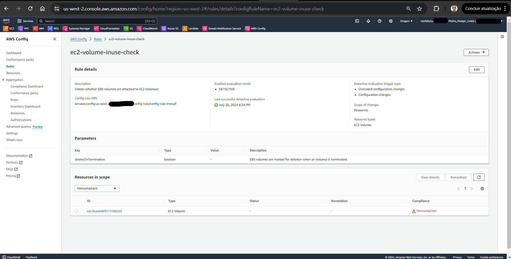

# Bootcamp AWS re/Start-Cloud Computing - Module 6   

### Repository: [boot](../../../../)   
### Platform: <a href="../../../">edn   </a> 
### Software/Subject: <a href="../../">aws    </a>
### Bootcamp: <a href="../">boot_022 (Bootcamp AWS re/Start-Cloud Computing)   </a>
### Module: 6. Jumpstart no AWS Advanced 

---

This folder refers to Module 6 **Jumpstart no AWS Advanced** from bootcamp [**Bootcamp AWS re/Start-Cloud Computing**](../).

### Theme:
- Cloud Computing

### Used Tools:
- Operating System (OS): 
  - Linux   
  - Windows 11   
- Linux Distribution: 
  - Amazon Linux   
- Virtualization: 
  - Vocareum   
- Cloud:
  - AWS   
- Cloud Services:
  - Amazon Elastic Compute Cloud (EC2)   
  - Amazon Virtual Private Cloud (VPC)   
  - Google Drive   
- Language:
  - HTML   
  - Markdown   
- Integrated Development Environment (IDE) and Text Editor:
  - Visual Studio Code (VS Code)   
- Versioning: 
  - Git   
- Repository:
  - GitHub   

---

### Bootcamp Module 6 Structure

6. <a name="item6">Jumpstart no AWS Advanced</a><br>
  6.1. <a href="#item6.1">Amazon CloudWatch</a><br>
  6.2. <a href="#item6.2">Mergulhe fundo: Amazon CloudWatch</a><br>
  6.3. <a href="#item6.3">186- [JAWS] -Laboratório: Monitorar a infraestrutura</a><br>
  6.4. <a href="#item6.4">AWS CloudTrail</a><br>
  6.5. <a href="#item6.5">Integração do serviço da AWS com o Athena</a><br>
  6.6. <a href="#item6.6">187- [JAWS] -Atividade: Trabalhar com o AWS CloudTrail</a><br>
  6.7. 218- [JAWS] -KC - Monitoramento e segurança<br>
  6.8. <a href="#item6.8">AWS Organizations</a><br>
  6.9. <a href="#item6.9">Marcação</a><br>
  6.10. <a href="#item6.10">188- [JAWS] -Laboratório: Gerenciar recursos com marcação</a><br>
  6.11. <a href="#item6.11">Gerenciamento de custos da AWS e práticas recomendadas</a><br>
  6.12. <a href="#item6.12">Demonstração do painel de faturamento da AWS-2</a><br>
  6.13. 219- [JAWS] -KC - Gerenciando o consumo de recursos<br>
  6.14. <a href="#item6.14">189- [JAWS] -Atividade: Otimizar a utilização</a><br>
  6.15. <a href="#item6.15">Estratégia de construção da AMI</a><br>
  6.16. <a href="#item6.16">Modelos de inicialização do Amazon EC2</a><br>
  6.16. <a href="#item6.17">Demonstração do modelo de lançamento EC2-2</a><br>
  6.18. <a href="#item6.18">Infraestrutura como código</a><br>
  6.19. <a href="#item6.19">Introdução ao JSON e ao YAML</a><br>
  6.20. <a href="#item6.20">AWS CloudFormation</a><br>
  6.21. <a href="#item6.21">Automatizar implantações com o AWS CloudFormation</a><br>
  6.22. <a href="#item6.22">190- [JAWS] -Laboratório: Automatização de implantações com o AWS CloudFormation</a><br>
  6.23. <a href="#item6.23">Solucionar problemas do AWS CloudFormation</a><br>
  6.24. <a href="#item6.24">191- [JAWS] - Atividade do café: Solucionar problemas de implantações do AWS CloudFormation</a><br>
  6.25. 220- [JAWS] -KC - Criando implantações repetíveis automatizadas<br>

---

### Objective:
O objetivo deste módulo do bootcamp foi aprender sobre como funciona as redes na cloud da **AWS**, apresentando o serviço voltado para isso que é o **Amazon Virtual Private Cloud (Amazon VPC)**. Também foi ensinado como construir uma VPC com sub-redes pública e privada, gateway de internet e NAT gateway, tabela de rotas, grupo de segurança e provisionar uma instância do **Amazon Elastic Compute Cloud (Amazon EC2)** nesta VPC, acessando ela posteriormente.

### Structure:
A estrutura das pastas obedece a estruturação do bootcamp, ou seja, conforme foi necessário, sub-pastas foram criadas para os cursos específicos deste módulo. Na imagem 01 é exibido a estruturação das pastas. 

<div align="Center"><figure>
    <br>
    <figcaption>Imagem 01.</figcaption>
</figure></div><br>

### Development:
O desenvolvimento deste módulo do bootcamp foi dividido em um curso e um laboratório. Abaixo é explicado o que foi desenvolvido em cada uma dessas atividades.

<a name="item6.1"><h4>6.1 Amazon CloudWatch</h4></a>[Back to summary](#item6) | <a href="">Certificate</a>

Para utilizar os recursos de forma eficiente, é necessário obter insights sobre eles. Deve-se compreender: como identificar o momento adequado para executar mais instâncias do **Amazon Elastic Compute Cloud (Amazon EC2)**; se o desempenho ou a disponibilidade do aplicativo estão sendo afetados devido à capacidade insuficiente; e qual a quantidade real de infraestrutura que está sendo utilizada. Essas informações podem ser capturadas com o **Amazon CloudWatch**.

Ao executar aplicativos em instâncias do EC2, é essencial monitorar o desempenho da carga de trabalho usando o **Amazon CloudWatch**. Durante esse monitoramento, é importante considerar duas questões críticas: como garantir que a carga de trabalho tenha recursos suficientes do EC2 para atender a requisitos flutuantes de desempenho e como automatizar o provisionamento de recursos do **Amazon EC2** sob demanda. O CloudWatch auxilia no monitoramento de desempenho, mas não adiciona nem remove instâncias do EC2 por conta própria. Para isso, o **Amazon EC2 Auto Scaling** pode ser utilizado, ajudando a manter a integridade e a disponibilidade da frota, além de dimensionar dinamicamente as instâncias do EC2 para atender às demandas durante picos e períodos de baixa demanda.

A principal função do **Amazon CloudWatch** é monitorar o desempenho e a integridade dos recursos e aplicativos da **AWS**. O CloudWatch também coleta e monitora arquivos de log de instâncias do EC2, **AWS CloudTrail**, **Amazon Route 53** e outras fontes. Sendo um sistema distribuído de coleta de estatísticas, ele coleta e monitora as métricas dos aplicativos. Além disso, é possível criar e usar métricas personalizadas e receber notificações quando um alarme é disparado. O CloudWatch oferece duas opções de monitoramento:
- Monitoramento básico para instâncias do **Amazon EC2**: Inclui sete métricas pré-selecionadas com uma frequência de 5 minutos e três métricas de verificação de status com uma frequência de 1 minuto, sem custo adicional.
- Monitoramento detalhado para instâncias do **Amazon EC2**: Abrange todas as métricas disponíveis no Monitoramento básico, mas com uma frequência de 1 minuto, por um custo adicional. As instâncias com monitoramento detalhado habilitado fornecem agregação de dados pelo **Amazon EC2**, ID da Amazon Machine Image (AMI) e tipo de instância.

O CloudWatch retém métricas por 15 meses sem custo adicional. As métricas são compatíveis com três programações de retenção: pontos de dados de 1 minuto estão disponíveis por 15 dias, pontos de dados de cinco minutos por 63 dias, e pontos de dados de uma hora por 455 dias.

É possível criar um alarme do CloudWatch que monitora uma métrica específica ou o resultado de uma expressão matemática baseada em várias métricas. O alarme executa ações com base no valor da métrica ou na expressão em relação a um limite por alguns períodos. Um alarme pode estar em três estados: OK – a métrica está dentro do limite definido; ALARM – a métrica está fora do limite definido; INSUFFICIENT_DATA – o alarme foi acionado recentemente, a métrica não está disponível ou não há dados suficientes para determinar o estado do alarme. "ALARM" é apenas um nome para o estado e não necessariamente indica uma condição de emergência. Por exemplo, pode-se definir um alarme que notifica quando o CPUCreditBalance de uma instância T2 está baixo, permitindo suspender um trabalho intensivo em CPU até que o saldo de créditos T2 se recupere.

Em um exemplo fictício, uma instância do EC2 possui um agente do CloudWatch instalado e o monitoramento detalhado habilitado. Duas das métricas enviadas pelo agente são mostradas. A primeira é a métrica de utilização da CPU, uma métrica padrão disponível no CloudWatch e facilmente coletada. No entanto, a utilização de memória em uma instância do EC2, que não é visível no nível do hipervisor, requer uma métrica personalizada para monitorar a utilização de memória do serviço httpd. Um alarme do CloudWatch é configurado para ser acionado sempre que a utilização da CPU exceder x por cento. Quando o alarme é acionado, uma mensagem é enviada usando o **Amazon SNS**, gerando uma notificação por e-mail. Um sistema de paginação ou rastreamento de terceiros recebe o alerta, acionando outras ações, como a notificação de funcionários de TI de plantão. O mesmo alarme do CloudWatch também envia uma mensagem a um tópico do **Amazon SQS**, gerando um item de trabalho.

Em outro exemplo, o limite do alarme do CloudWatch é definido como 3, com a condição de violação mínima de 3 períodos consecutivos. Ou seja, o alarme aciona sua ação somente quando o limite é violado por três períodos seguidos. Isso ocorre do terceiro ao quinto períodos, e o estado do alarme é definido como `ALARM`. No sexto período, o valor cai abaixo do limite e o estado é revertido para `OK`. Posteriormente, no nono período, o limite é violado novamente, mas não por três períodos consecutivos, portanto, o estado do alarme permanece como `OK`.

As métricas são os conceitos fundamentais no CloudWatch. Uma métrica representa um conjunto ordenado de pontos de dados publicados no CloudWatch, funcionando como uma variável a ser monitorada, com pontos de dados que representam os valores dessa variável ao longo do tempo. Por exemplo, o uso da CPU de uma instância específica do EC2 é uma métrica fornecida pelo **Amazon EC2**. Os pontos de dados podem vir de qualquer aplicativo ou atividade de negócios de onde se coleta dados. As métricas são definidas exclusivamente por um nome, um namespace e zero ou mais dimensões. Cada ponto de dados possui um carimbo de data/hora e, opcionalmente, uma unidade de medida. Quando são solicitadas estatísticas, o stream de dados retornado é identificado por namespace, nome da métrica, dimensão e (opcionalmente) a unidade. As métricas existem apenas na região onde são criadas.

Um namespace é um contêiner para as métricas do CloudWatch. As métricas em namespaces diferentes são isoladas, garantindo que as métricas de aplicativos distintos não sejam agregadas incorretamente nas mesmas estatísticas. Os namespaces da **AWS** seguem a convenção de nomenclatura `AWS/<service>`. Por exemplo, o **Amazon EC2** usa o namespace `AWS/EC2`. Uma dimensão é um par de nome-valor que identifica uma métrica de forma exclusiva, podendo-se atribuir até 10 dimensões a uma métrica. Cada métrica tem características específicas que a descrevem, e as dimensões podem ser vistas como categorias para essas características. As dimensões auxiliam na projeção de uma estrutura para o plano de estatísticas e podem ser usadas para filtrar os resultados retornados pelo CloudWatch. Por exemplo, ao pesquisar métricas, é possível obter estatísticas para uma determinada instância do EC2, especificando a dimensão InstanceId. Um período é o tempo associado a uma estatística específica do CloudWatch, definido pela contagem de segundos, podendo variar de 1 segundo até 1 dia (86.400 segundos).

O CloudWatch oferece métricas padrão e personalizadas. As métricas padrão são agrupadas por serviço. Por exemplo, ao acessar o Console de gerenciamento da **AWS** e abrir o serviço do CloudWatch, é possível visualizar todas as métricas do **Amazon EC2** através de links específicos, com gráficos que permitem comparações. Usando a **AWS CLI**, o comando `list-metrics` lista as métricas disponíveis; por exemplo, `aws cloudwatch list-metrics --namespace AWS/S3` mostra todas as métricas padrão do **Amazon S3**. Métricas não podem ser excluídas, mas expiram automaticamente após 15 meses se não receberem novos dados. Dados mais antigos que 15 meses são removidos conforme novos dados são adicionados. 
Os serviços da **AWS** enviam métricas ao CloudWatch. Além disso, é possível publicar métricas personalizadas no CloudWatch utilizando a **AWS CLI**, uma API ou um agente do CloudWatch. Essas métricas personalizadas são organizadas pelo namespace definido no momento da criação.

Um uso comum do **Amazon CloudWatch** é monitorar recursos da conta para identificar atividades suspeitas. Por exemplo, configurar alertas baseados em dados de faturamento pode ajudar a detectar possíveis violações de segurança na conta da **AWS**. Alguns clientes só descobrem que suas credenciais ou chaves de acesso do A**WS Identity and Access Management (AWS IAM)** foram comprometidas ao receber faturas inesperadas com valores altos. Para detectar tais problemas proativamente, é possível ativar alertas de pagamento nas preferências da conta e configurar alarmes no CloudWatch para notificar caso as cobranças estimadas para o mês ultrapassem um limite definido. Também é viável monitorar picos incomuns e prolongados no uso de serviços, como CPU, atividades de disco e **Amazon RDS**.

Os painéis do **Amazon CloudWatch** são páginas de início personalizáveis no console do CloudWatch, permitindo monitorar os recursos em uma única visualização. É possível criar visualizações personalizadas das métricas e alarmes para os recursos da **AWS**. Os painéis automáticos do CloudWatch fornecem uma visão agregada da integridade e desempenho de todos os recursos da **AWS**, com visualizações dinâmicas de métricas e alarmes baseados em contas e recursos. Eles ajudam a identificar a causa raiz de problemas de desempenho, seguindo as melhores práticas recomendadas para os serviços da **AWS** e atualizando-se dinamicamente para refletir o estado mais recente das métricas importantes.

Por padrão, as instâncias do EC2 têm o monitoramento básico do CloudWatch ativado, com dados disponíveis em incrementos de 5 minutos, como parte do nível gratuito da **AWS**. É possível, no entanto, habilitar o monitoramento detalhado, que tem um custo adicional. Com o monitoramento detalhado ativado, os dados são disponibilizados em incrementos de 1 minuto.

<a name="item6.2"><h4>6.2 Mergulhe fundo: Amazon CloudWatch</h4></a>[Back to summary](#item6) | <a href="">Certificate</a>

O *Amazon CloudWatch Events* fornece um streaming (fluxo) quase em tempo real de eventos do sistema que relatam alterações nos recursos da **AWS**. Com regras configuráveis, é possível direcionar eventos para um ou mais destinos, como streams ou funções. O CloudWatch Events detecta mudanças operacionais e reage a elas enviando mensagens, ativando funções e capturando informações de estado. É possível usar o CloudWatch Events para programar ações automatizadas com base em expressões cron ou rate. Antes de utilizar o CloudWatch Events, é necessário entender os seguintes conceitos:
- Um evento representa uma alteração no ambiente da **AWS**, ocorrendo quando o estado de um recurso muda. Por exemplo, o **Amazon EC2** gera um evento quando o estado de uma instância muda de pendente para em execução. Também é possível criar eventos personalizados no nível do aplicativo e publicá-los no CloudWatch Events, bem como configurar eventos programados para serem gerados periodicamente.
- Um destino é responsável por processar eventos. Exemplos de destinos incluem instâncias do EC2, funções do **AWS Lambda**, tópicos do **Amazon Simple Notification Service (Amazon SNS)** e filas do **Amazon Simple Queue Service (Amazon SQS)**.
- Uma regra associa eventos de entrada aos destinos para processamento. Uma única regra pode encaminhar eventos para vários destinos simultaneamente, permitindo que diferentes partes de uma organização recebam e processem os eventos conforme suas necessidades.

O *Amazon CloudWatch Logs* permite monitorar, armazenar e acessar arquivos de log de instâncias do **Amazon EC2**, **AWS CloudTrail**, **Amazon Route 53** e outras fontes. Com o CloudWatch Logs, é possível recuperar dados de log, monitorá-los em quase tempo real em busca de frases, valores ou padrões específicos. Por exemplo, é possível configurar um alarme para o número de erros registrados nos logs do sistema em instâncias do EC2 ou visualizar gráficos sobre a latência de solicitações de logs de aplicativos em instâncias do EC2. Os dados de log podem ser armazenados indefinidamente e também podem ser armazenados externamente em instâncias do EC2, evitando a preocupação com o preenchimento de discos rígidos. O processo de análise de logs pode ser dividido em três fases distintas:
- Configurar: Determine quais informações devem ser capturadas nos logs e defina onde e como essas informações serão armazenadas.
- Coletar: Com a criação e remoção de instâncias em um ambiente de nuvem, é essencial ter uma estratégia para fazer upload periódico dos arquivos de log, garantindo que dados valiosos não sejam perdidos quando uma instância é encerrada.
- Analisar: Após a coleta dos dados, é o momento de análise. A análise dos logs oferece uma visão detalhada da integridade diária dos sistemas, revela tendências futuras no comportamento dos clientes e fornece insights sobre como os clientes estão interagindo com o sistema no momento.

O CloudWatch Logs permite a coleta automática de logs de serviços compatíveis, como instâncias do **Amazon EC2**. Para isso, é necessário instalar o novo agente unificado do CloudWatch (ou o agente mais antigo do CloudWatch Logs) nas instâncias do EC2 das quais se deseja coletar dados de log. Após a instalação, é possível agregar dados de múltiplas instâncias em grupos de logs, cada um representando um tipo específico de log com um formato definido. O agente em cada instância coleta os dados do log especificado (como logs de aplicativos) e os envia para o grupo de logs correspondente. Os administradores podem criar filtros de métrica em um grupo de logs para buscar strings ou padrões específicos, com cada correspondência gerando um valor numérico que incrementa uma métrica personalizada do CloudWatch. Essa métrica pode ser utilizada para criar alarmes ou enviar notificações, como qualquer outra métrica personalizada do CloudWatch.

O *CloudWatch Logs Insights* é uma funcionalidade do CloudWatch que oferece uma linguagem de consulta especializada para análise de logs. Com comandos simples, porém poderosos, ele facilita a execução de consultas e a análise de dados. A ferramenta inclui exemplos de consultas, descrições de comandos, preenchimento automático e descoberta de campos de log para agilizar o início do uso. Exemplos de consultas estão disponíveis para vários tipos de logs de serviços da **AWS**.

Os alarmes do CloudWatch podem ser usados para identificar condições fora dos limites em arquivos de log. Por exemplo, considere um grupo de logs chamado HttpAccessLog, que contém dados de log agregados coletados por agentes do CloudWatch instalados em instâncias do EC2. Um administrador pode criar um filtro personalizado no grupo de logs para buscar mensagens de erro HTTP 404 (página não encontrada). Cada ocorrência dessa mensagem aumenta uma métrica personalizada chamada 404Count. Quando essa métrica ultrapassa um valor especificado, o alarme do CloudWatch é acionado, e uma notificação é enviada para a equipe de suporte de TI.

Os logs de aplicativos costumam gerar dados em formatos padronizados. Para analisar efetivamente esses dados, é necessário compreender o formato do log. Por exemplo, um arquivo de log de acesso gerado pelo servidor web **Apache HTTP (Httpd)** geralmente está localizado em `/var/log/httpd/access_log` na instância do EC2 onde o servidor está instalado. Cada vez que o servidor web recebe uma solicitação HTTP, uma nova linha é adicionada ao log de acesso.

Logs do **Apache HTTP (Httpd)** configurados com uma string de substituição no arquivo `httpd.conf` seguem o formato de registro padrão: `%h %l %u %t "%r" %>s %b`. Esse formato é delimitado por espaços e fornece informações sobre cada solicitação HTTP(S). Por exemplo: `127.0.0.1 - marcia [10/Oct/2000:13:55:36 -0700] "GET /apache_pb.gif HTTP/1.0" 200 2326`. Neste exemplo, cada entrada de log inclui o seguinte:
- %h: Representa o endereço IP da máquina que fez a solicitação HTTP.
- %l: Indica a identidade da máquina do cliente, que geralmente não está disponível e é representada por um traço (-) no exemplo.
- %u: Refere-se ao ID do usuário que fez a solicitação. Se o site não requer login, essas informações não estarão disponíveis. No exemplo, o usuário é marcia.
- %t: Mostra o horário em que a solicitação foi recebida.
- %r: Contém a linha de solicitação, que inclui o tipo de requisição HTTP (como GET) e o recurso solicitado, como uma página HTML, um arquivo gráfico ou uma folha de estilo.
- %s: Indica o código de status HTTP com o qual o servidor respondeu. No exemplo, o código é 200, que significa sucesso, mas outros códigos, como 404 (recurso não encontrado), podem aparecer.
- %b: Registra o tamanho do objeto retornado ao cliente solicitante.

Para criar um filtro de métrica no Amazon CloudWatch, é necessário definir um padrão de filtro que esteja em conformidade com a sintaxe estabelecida, lembrando que a diferenciação entre maiúsculas e minúsculas é considerada. Um padrão de filtro pode incluir vários termos, mas para que haja uma correspondência, todos os termos devem estar presentes em um único evento de log. Por exemplo, um padrão de filtro como "Exceção de ERRO" só corresponderá aos registros de log que contenham ambas as palavras "ERRO" e "Exceção". Para criar uma métrica com base em um padrão de filtro, defina um padrão que procure por strings específicas e códigos de status HTTP. Exemplo: Crie uma métrica para todos os resultados que contenham a string "html" em qualquer lugar da solicitação e qualquer erro HTTP da série 400 (erro do cliente). O padrão de filtro seria algo como: `[ip, user, username, timestamp, request = *html*, status_code = 4*, bytes]`.

<a name="item6.3"><h4>6.3 186- [JAWS] -Laboratório: Monitorar a infraestrutura</h4></a>[Back to summary](#item6) | <a href="">Certificate</a>

Neste laboratório, desenvolvido no sandbox **Voccareum**, foi explicado como realizar monitoramentos das aplicações e infraestrutura dos serviços da **AWS** utilizando três recursos do serviço **Amazon CloudWatch** (*Amazon CloudWatch Logs*, *Amazon CloudWatch Events* e *Amazon CloudWatch Agent*) e o serviço **AWS Config**. Outros serviços da **AWS** como **AWS System Manager (AWS SSM)** e **Amazon Simple Notification Service (Amazon SNS)** também foram utilizados integrando com os serviços anteriores. O monitoramento dos logs da aplicação foi realizado pelo *Amazon CloudWatch Agent* e *Amazon CloudWatch Logs*. Enquanto o monitoramento da infraestrutura dos serviços da **AWS** foi executado pelo *Amazon CloudWatch Agent* e as próprias métricas do **Amazon CloudWatch**, sendo a infraestrutura analisada neste caso, uma instância do **Amazon EC2** que funcionava como servidor web, onde a aplicação era executada. Com o *Amazon CloudWatch Events* foi realizado um monitoramento em tempo real com envio de notificações através do **Amazon SNS**. Por fim, com o **AWS Config** foi realizada a verificação de conformidade da infraestrutura.

A primeira tarefa do laboratório consistiu em instalar e configurar o *Amazon CloudWatch Agent* dentro da instância do **Amazon EC2** para coletar métricas internas da instância e da aplicação que ela executava. A instalação e configuração foi toda realizada através dos recursos *Parameter Store* e *Run Command* do **AWS SSM**, não sendo necessário acessar remotamente a instância. A instância do EC2 foi provisionada automaticamente pelo **AWS CloudFormation** ao iniciar o laboratório. Já os Command documents (Documentos de comando) utilizados no *Run Command* eram gerenciados pela **AWS**. O primeiro comando executado na instância foi do Command document `AWS-ConfigureAWSPackage`, configurando na seção parâmetros de comando (Command parameters), a ação como instalar, o nome do pacote que seria instalado que no caso foi o `AmazonCloudWatchAgent` e a versão como `latest`. Na seção seleção de destino (Target selection) foi optado por escolher as instâncias manualmente, sendo selecionada a instância do EC2 de tag de nome igual a `Web Server`. As demais configurações foram mantidas como padrão. A imagem 02 mostra o comando executado com êxito.

<div align="Center"><figure>
    <br>
    <figcaption>Imagem 02.</figcaption>
</figure></div><br>

O comando definido pelo Command document `AWS-ConfigureAWSPackage` é usado para gerenciar a instalação e configuração de pacotes de software em instâncias EC2 ou servidores gerenciados. Ele fornece uma maneira automatizada de instalar e configurar pacotes de software, incluindo a possibilidade de instalar pacotes específicos para a sua distribuição **Linux** ou **Windows**. Um dos pacotes em que ele instala e que foi instalado nessa instância foi o *Amazon CloudWatch Agent*. Outros pacotes poderiam ser instalados mas seria necessário indicar o nome deles na seção de Command parameters.

Em destinos e saídas (Targets and outputs) foi possível verificar as saídas do comando e ver que em uma das etapas o agente do **Amazon CloudWatch** foi instalado na instância com sucesso. Uma das etapas do comando não foi executada devido a pré-condições que não foram satisfeitas, portanto ela foi ignorada, mas não comprometeu a execução. Nesta etapa era necessário que o sistema operacional da instância fosse **Windows**, mas neste caso era uma máquina **Amazon Linux**. A imagem 03 exibe os outputs do comando.

<div align="Center"><figure>
    <br>
    <figcaption>Imagem 03.</figcaption>
</figure></div><br>

Com o CloudWatch Agent instalado na instância foi preciso configurá-lo para que ele coletasse as informações de log desejada. Neste caso, as informações eram os logs do servidor web onde a aplicação rodava e as métricas gerais do sistema utilizados para realizar o monitoramento da aplicação e da infraestrutura respectivamente. Para isso foi construído um parâmetro no recurso *Parameter Store* do **AWS SSM**, cujo nome dele foi `Monitor-Web-Server`, a descrição foi `Collect web logs and system metrics` e em valor foi passado o JSON abaixo.

```json
{
  "logs": {
    "logs_collected": {
      "files": {
        "collect_list": [
          {
            "log_group_name": "HttpAccessLog",
            "file_path": "/var/log/httpd/access_log",
            "log_stream_name": "{instance_id}",
            "timestamp_format": "%b %d %H:%M:%S"
          },
          {
            "log_group_name": "HttpErrorLog",
            "file_path": "/var/log/httpd/error_log",
            "log_stream_name": "{instance_id}",
            "timestamp_format": "%b %d %H:%M:%S"
          }
        ]
      }
    }
  },
  "metrics": {
    "metrics_collected": {
      "cpu": {
        "measurement": [
          "cpu_usage_idle",
          "cpu_usage_iowait",
          "cpu_usage_user",
          "cpu_usage_system"
        ],
        "metrics_collection_interval": 10,
        "totalcpu": false
      },
      "disk": {
        "measurement": [
          "used_percent",
          "inodes_free"
        ],
        "metrics_collection_interval": 10,
        "resources": [
          "*"
        ]
      },
      "diskio": {
        "measurement": [
          "io_time"
        ],
        "metrics_collection_interval": 10,
        "resources": [
          "*"
        ]
      },
      "mem": {
        "measurement": [
          "mem_used_percent"
        ],
        "metrics_collection_interval": 10
      },
      "swap": {
        "measurement": [
          "swap_used_percent"
        ],
        "metrics_collection_interval": 10
      }
    }
  }
}
```

Esse JSON criava no **Amazon CloudWatch** dois grupos de log (Log Group) de nomes `HttpAccessLog` e `HttpErrorLog`, ambos relativo ao servidor web **Apache HTTP (Httpd)** que executava a aplicação na instância do EC2. Os logs eram extraídos das pastas `access_log` e `error_log` armazenadas no diretório `/var/log/httpd/` dentro da instância do EC2. Então qualquer log do servidor web Apache que fosse gerado nessas pastas seriam extraídos para o log group correspondente do CloudWatch, sendo possível visualizá-los pelo console do próprio CloudWatch. O log stream (fluxo de registro) é uma subdivisão dentro de cada log group para armazenar os logs, onde neste caso teve como nome o próprio ID da instância. Isso seria extremamente útil se fosse uma frota de instância, pois separaria os logs de cada instância pelo seu ID.

Ainda no JSON, além dos logs coletados para o monitoramento da aplicação, também foram coletadas métricas do sistema da instância EC2, como: cpu, disk, diskio, mem e swap. Abaixo é informado quais métricas exatamente foram coletadas de cada um. A imagem 04 ilustra o parâmetro construído.
- cpu:
  - cpu_usage_idle: porcentagem do tempo em que a CPU está ociosa e não está executando nenhum processo.
  - cpu_usage_iowait: porcentagem do tempo em que a CPU está esperando por operações de entrada/saída (I/O), como leitura ou gravação em disco.
  - cpu_usage_user: porcentagem do tempo em que a CPU está executando processos de usuários, ou seja, tarefas e aplicativos iniciados pelo usuário.
  - cpu_usage_system: porcentagem do tempo em que a CPU está executando processos do sistema ou do kernel, como gerenciamento de recursos e tarefas internas do sistema operacional.
- disk
  - used_percent: porcentagem do espaço utilizado em um sistema de arquivos ou disco.
  - inodes_free: o número de inodes livres em um sistema de arquivos. Inodes são estruturas de dados usadas pelo sistema de arquivos para armazenar informações sobre arquivos e diretórios, como permissões, proprietário, tamanho, e localização dos dados.
- diskio
  - io_time: tempo total que o disco ou dispositivo de armazenamento está ocupado realizando operações de entrada/saída (I/O).
- mem:
  - mem_used_percent: porcentagem da memória física (RAM) que está atualmente em uso.
- swap:
  - swap_used_percent: porcentagem da memória swap que está atualmente em uso. Swap é uma área no disco usada como memória virtual quando a RAM está totalmente ocupada.

<div align="Center"><figure>
    <br>
    <figcaption>Imagem 04.</figcaption>
</figure></div><br>

Este parâmetro foi utilizado ao executar um outro comando no *Run Command* para configurar ao agente do CloudWatch já instalado na instância, indicando quais informações deveriam ser coletadas. O command document utilizado dessa vez foi o `AmazonCloudWatch-ManageAgent`. Cada command document tem várias informações e entre elas um script que é executado dentro da instância. O script desse command document fazia referência ao parâmetro construído no *Parameter Store*. Assim, caso quisesse modificar as métricas coletadas era só alterar o valor do parâmetro que é o arquivo JSON, especificar as métricas e então executar um comando com este command document. Na seção parâmetros de comando (Command parameters) foram feitas as seguintes configurações: em ação foi definido configurar, em modo foi selecionado ec2, em origem da configuração foi selecionado ssm, em local de configuração foi definido `Monitor-Web-Server` e o reinício foi definido como sim. Isso determinava que o agente do CloudWatch utilizasse a configuração estabelecida pelo parâmetro no **AWS SSM**. Na seção de destinos (Target selection), novamente foi escolhida manualmente a instância de tag de nome `Web Server`. A imagem 05 mostra que o comando foi executado com êxito.

<div align="Center"><figure>
    <br>
    <figcaption>Imagem 05.</figcaption>
</figure></div><br>

A tarefa de número 2 teve como objetivo gerar dados de logs da aplicação executada no servidor web Apache dentro da instância do EC2 e em seguida monitorá-los através do **Amazon CloudWatch**. Para isso foi necessário acessar a aplicação que era executada na instância. Dessa forma, foi copiado o IP ou DNS público da instância e acessado pelo navegador da máquina física **Windows**. A requisição era direcionada para a página de teste do servidor web Apache executado na instância. Nesta mesma URL foi acrescentado o path `/start` que era uma pasta que não existia dentro do servidor web. Uma mensagem de erro aparecia indicando que a página não foi encontrada. A finalidade aqui era gerar dados de log tentando acessar uma aplicação que não existia. A imagem 06 exibe a tentativa de acesso a página da aplicação que não existia.

<div align="Center"><figure>
    <br>
    <figcaption>Imagem 06.</figcaption>
</figure></div><br>

Para confirmar os logs gerado, no console da **AWS** foi acessado o CloudWatch e escolhido o recurso grupos de log. Dois grupos de logs apareciam que foram os grupos criados pelo JSON armazenado no *Parameter Store*. O primeiro acessado foi `HttpAccessLog` que extraía logs da pasta `/var/log/httpd/access_log` da instância do EC2. Ao acessá-lo, apenas um log stream (fluxo de log) aparecia que era o ID da única instância. Ao acessar este log stream foi possível visualizar os logs oriundos da pasta `access_log` que eram os logs de acesso do servidor web, ou seja, solicitações GET que foram enviadas ao servidor da web. Também foi possível visualizar informações adicionais selecionando para expandir as linhas. Os dados de log incluíam informações sobre o computador e o navegador que fez a solicitação. Observe na imagem 07, uma linha com a solicitação feita ao path `/start` com um código de 404, o que significava que a página não foi encontrada.

<div align="Center"><figure>
    <br>
    <figcaption>Imagem 07.</figcaption>
</figure></div><br>

Ainda nesta tarefa foi construído um filtro de métrica no *Amazon CloudWatch Logs* para identificar erros 404 no arquivo de log. Esse erro normalmente seria uma indicação de que o servidor web estava gerando links inválidos os quais os usuários estavam escolhendo. Voltando para os grupos de logs e selecionando `HttpAccessLog`, foi criado um filtro de métrica para esse log group. Na caixa padrão de filtro foi colada a seguinte linha `[ip, id, user, timestamp, request, status_code=404, size]`. Essa linha informava ao CloudWatch Logs como interpretar os campos nos dados de log e definia um filtro para encontrar apenas linhas com `status_code=404`, que indicava que uma página não foi encontrada. O ID da instância `Web Server` foi selecionada na seção padrão de teste (Test pattern) e era possível testar o padrão do filtro de métrica que estava sendo criado. Ao testar os resultados que possuíam código de status 404 foram exibidos, inclusive a solicitação feita ao path `/start`. Em seguida, o nome do filtro de métrica foi definido como `404Errors`. Na seção detalhes da métrica (Metric details) foram realizadas as seguintes configurações: o namespace da métrica foi definido como `LogMetrics`, o nome da métrica foi definido como `404Errors`, e o valor da métrica como `1`. A imagem 08 evidência a construção do filtro de métrica.

<div align="Center"><figure>
    <br>
    <figcaption>Imagem 08.</figcaption>
</figure></div><br>

Após isso foi criado um alarme, utilizando este filtro de métrica, para enviar notificações quando muitos erros 404 fossem recebidos. Para isso, o filtro de métrica foi selecionado e então foi configurado o alarme. Assim como logs e metrics, os alarms são um outro recurso do **Amazon CloudWatch**. Na construção do alarme, na seção métricas (Metric), o período foi definido com 30 segundos. Na seção condições foi determinado que sempre que o erro `404Errors` fosse maior ou igual a `5`. Na seção notificações (Notification), um tópico do **Amazon SNS** foi elaborado e meu email foi definido para receber a notificação. O nome do tópico foi mantido o sugerido (`Default_CloudWatch_Alarms_Topic`) e também foi utilizado em outra tarefa desse laboratório. Lembrando que sempre que o SNS é utilizado com email, é necessário aceitar a subscrição através do primeiro email que é recebido para que os emails futuros possam ser entregues. O nome do alarme foi definido como `404 Errors` e a descrição como `Alert when too many 404s detected on an instance`. Após isso, o alarme apareceu laranja indicando que havia dados insuficientes, conforme imagem 09.

<div align="Center"><figure>
    <br>
    <figcaption>Imagem 09.</figcaption>
</figure></div><br>

O alarme coletava os dados de 30 em 30 segundos como configurado. Se nesse intervalo de tempo nenhuma requisição com código de status 404 tivesse sido realizada, o status do alarme seria de dados insuficiente, pois ele não tinha dados para contabilizar. Se o número de requisições com código de status 404 fosse entre 1 e 4, o status do alarme seria OK. Mas se 5 ou mais requisições de código de status 404 tivesse sido realizada, o alarme seria acionado, pois foi a configuração estabelecida. A cada intervalo de 30 segundos, o número de requisições era zerado, sendo necessário cinco requisições dentro do mesmo intervalo para acionar o alarme. A imagem 10 mostra o alarme como OK, após apenas uma requisição. Para gerar dados de log que ressultassem em erros, era necessário enviar uma requisição para o servidor web executado na instância do EC2. Como servidor web do Apache funcionava na porta `80` era só enviar uma requisição para o IP ou DNS público da instância, sendo opcional acrescentar a porta `80`, pois ela já é a porta padrão quando nenhuma porta é especificada. Também era preciso adicionar um path inexistente dentro do servidor web a URL, o path utilizado dessa vez foi o `/start2`. Uma das formas de fazer uma requisição é simplesmente acessando um site através de um navegador da web e isso foi feito pelo navegador da máquina física **Windows**.

<div align="Center"><figure>
    <br>
    <figcaption>Imagem 10.</figcaption>
</figure></div><br>

Após o alarme ficar com status OK, foi realizado cinco requisições dentro do intervalo de 30 segundos para acionar o alarme, modificando seu status para In Alarm. A imagem 11 exibe a visualização dentro do alarme, onde é possível ver um gráfico monitorando o alarme e evidenciando que ele foi acionado. Na imagem 12, a notificação que foi enviada para o email conforme determinado é visualizada.

<div align="Center"><figure>
    <br>
    <figcaption>Imagem 11.</figcaption>
</figure></div><br>

<div align="Center"><figure>
    <br>
    <figcaption>Imagem 12.</figcaption>
</figure></div><br>

A terceira tarefa consistiu na realização do monitoramento da infraestrutura através das métricas coletadas pelo agente do CloudWatch dentro da instância. Dessa forma, o console do **Amazon EC2** foi aberto e a instância `Web Server` foi selecionada alterando a guia para monitoramento para visualizar as métricas, conforme imagem 13. O **Amazon CloudWatch** consegue coletar algumas métricas que visualizam a instância "por fora" como uma máquina virtual, mas não fornecem informações sobre o que está sendo executado "dentro" da instância, como medir memória livre ou espaço livre em disco. Por isso que foi utilizado o agente do CloudWatch para conseguir visualizar informações de dentro da instância. 

<div align="Center"><figure>
    <br>
    <figcaption>Imagem 13.</figcaption>
</figure></div><br>

O console foi alterado agora para o **Amazon CloudWatch** e o recurso métricas foi selecionado, expandido a visualização para todas as métricas. A metade inferior da página exibia as várias métricas coletadas pelo CloudWatch, separadas por namespaces. A **AWS** gera automaticamente algumas dessas métricas, o agente do CloudWatch coleta outras e ainda é possível criar métricas personalizadas. As métricas no CloudWatch são agrupadas por namespaces, sendo possível criar namespaces para agrupar métricas específicas. Neste caso, na parte superior da página, existiam dois namespaces que foram construídos durante este laboratório. O namespace `CWAgent` foi criado pelo agente do CloudWatch, enquanto o `LogMetrics` foi o namespace criado ao criar um filtro de métrica no recurso de logs do **Amazon CloudWatch**. Quando um filtro de métrica é elaborado no CloudWatch Logs, uma métrica também é criada dentro de um namespace determinado. Neste caso a métrica `404Erros` foi criada dentro do namespace `LogMetrics`.

Dentro do namespace `CWAgent`, as métricas coletadas pelo agente do CloudWatch estavam sub-divididas em `device, fstype, host, path`, `host, name` e `host`. Ao escolher a opção `device, fstype, host, path`, era possível visualizar as métricas coletada pelo agente do CloudWatch, conforme apresentado na imagem 14.

<div align="Center"><figure>
    <br>
    <figcaption>Imagem 14.</figcaption>
</figure></div><br>

Na tarefa 4 foi criado notificações em tempo real através do *Amazon CloudWatch Events* que informava quando uma instância fosse interrompida ou encerrada. Portanto, no console do CloudWatch, o recurso Events foi escolhido e seleciona regras (Rules). Imediatamente o console direcionava para o serviço **Amazon EventBridge**, logo a regra teve que ser criada neste serviço. Na configuração da regra, na seção detalhes da regra (Rule Detail), o nome da regra foi definido como `Instance_Stopped_Terminated` e as demais configurações não foram alteradas. Na etapa de configuração Construir padrão de evento (Build event pattern), na seção Event pattern (Padrão de evento), a fonte do evento (Event source) foi definida como `AWS services`, o serviço escolhido foi o `EC2`, o tipo de evento foi `EC2 Instance State-change Notification` e nas caixas de especificação do tipo de evento (Event Type Specification) foi escolhido dois estados específicos que foram `stopped` e `terminated`, e mantido a seleção de qualquer instância (Any instance). Na seção destinos (Target), um destino foi adicionado com as seguintes configurações: SNS e em tópico foi escolhido `Default_CloudWatch_Alarms_Topic`. Este tópico foi criado na tarefa 2 que já possuía meu email como assinante. A imagem 15 evidência a regra de evento construída.

<div align="Center"><figure>
    <br>
    <figcaption>Imagem 15.</figcaption>
</figure></div><br>

Agora foi o momento de testar, a instância `Web Server` foi interrompida e assim que o processo de interrupção foi concluído, um mensagem foi enviada para meu email contendo detalhes em JSON sobre a instância que foi interrompida, conforme mostrado na imagem 16.

<div align="Center"><figure>
    <br>
    <figcaption>Imagem 16.</figcaption>
</figure></div><br>

Na última tarefa foi executado o monitoramento da conformidade da infraestrutura com o **AWS Config**, ativando duas regras dele para garantir a conformidade de marcação (tags) e dos volumes do **Amazon Elastic Block Store (Amazon EBS)**. Ao abrir o **AWS Config** no console foi selecionado comece a usar e avançado até o fim, mantendo as configurações padrão. Isso configurava o **AWS Config** para uso inicial. Uma janela de Bem-vindo ao **AWS Config** foi exibida, mas pôde ser fechada. O recurso regras (Rules) foi selecionado e a regra `required-tags`, que é gerenciada pela **AWS**, foi adicionada. Essa regra exigia um código de projeto para cada recurso, ou seja, uma tag. Na página de configurar regra (Configure rule), em parâmetros, o valor de `tag1Key` foi definida como `project`. Essa regra agora procurava recursos que não tinham uma tag projeto. A imagem 17 mostra recursos que não atendiam essa regra. Pode ser que leve um tempo até o Config terminar de verificar os recursos.

<div align="Center"><figure>
    <br>
    <figcaption>Imagem 17.</figcaption>
</figure></div><br>

A segunda regra criada foi uma regra que procurava volumes do EBS que não estevam anexados às instâncias do EC2. O volume da instância `Web Server` ainda não tinha sido excluído, portanto não estava anexado a nenhuma instância, já que a instância tinha sido interrompida anteriormente. Esta também foi uma regra gerenciada pela **AWS**, sendo o nome dela `ec2-volume-inuse-check` e nenhuma configuração adicional realizada nela. O resultado dessa regra é exibido na imagem 18 abaixo.

<div align="Center"><figure>
    <br>
    <figcaption>Imagem 18.</figcaption>
</figure></div><br>

<a name="item6.4"><h4>6.4 AWS CloudTrail</h4></a>[Back to summary](#item6) | <a href="">Certificate</a>

O **AWS CloudTrail** é um serviço que registra chamadas para a interface de programação de aplicativos (API) da **AWS**. Como a API da **AWS** é a base da **AWS Command Line Interface (AWS CLI)** e do Console de gerenciamento da **AWS**, o CloudTrail pode registrar todas as atividades relacionadas aos serviços que monitora. Este serviço é essencial para governança, conformidade, auditoria operacional e auditoria de riscos das contas da **AWS**. Atualmente, um número crescente de serviços da **AWS** é compatível com o CloudTrail.

Após a configuração do CloudTrail, ele envia os logs de auditoria para o **Amazon Simple Storage Service (Amazon S3)**. Embora o CloudTrail forneça uma visão abrangente, ele não rastreia eventos que ocorrem dentro de uma instância do **Amazon Elastic Compute Cloud (Amazon EC2)**. Por exemplo, o CloudTrail não registra ações como o desligamento manual de uma instância por meio de uma conexão de sessão Secure Shell (SSH), onde um comando como `sudo shutdown -h now` pode ser executado.

Usando o CloudTrail, é possível armazenar logs sobre o uso da API em um bucket do S3. Esses logs podem ser analisados para responder a várias perguntas, como:
- Por que uma instância de longa execução foi encerrada e quem a encerrou? As respostas podem ajudar na rastreabilidade e prestação de contas organizacionais.
- Quem alterou a configuração de um grupo de segurança? As equipes de auditoria de prestação de contas e segurança podem precisar dessas informações.
- Há alguma atividade proveniente de um intervalo de endereços IP desconhecido? Isso pode indicar um possível ataque externo, uma preocupação de segurança.
- Quais atividades foram negadas devido à falta de permissões? Tais atividades podem sinalizar tentativas de ataque internas ou externas.

Por padrão, ao acessar o histórico de eventos do CloudTrail para uma região, o CloudTrail exibe os resultados dos últimos 90 dias. Esses eventos são limitados aos eventos de gerenciamento que envolvem chamadas de APIs para criar, modificar e excluir recursos, além da atividade da conta. Para obter um registro completo da atividade da conta, incluindo todos os eventos de gerenciamento, eventos de dados e todas as atividades somente leitura, é necessário configurar uma trilha do CloudTrail. É possível criar uma trilha usando o console do CloudTrail ou a **AWS CLI**. As seguintes opções podem ser configuradas:
- Crie um bucket do S3 ou especifique um bucket existente para armazenar os arquivos de log.
- Configure a trilha para registrar eventos somente leitura, somente gravação ou todos os eventos de gerenciamento e dados. Por padrão, as trilhas registram todos os eventos de gerenciamento.
- Crie um tópico do **Amazon Simple Notification Service (Amazon SNS)** para receber notificações quando os arquivos de log forem entregues.
- Opcionalmente, configure o *Amazon CloudWatch Logs* para receber logs do CloudTrail, permitindo a monitorização de eventos de log específicos.
- Opcionalmente, ative a criptografia de arquivos de log para maior segurança.
- Como opção, adicione tags (pares de chave-valor personalizados) à trilha.

Cada arquivo de log do CloudTrail formatado no JavaScript Object Notation (JSON) pode conter uma ou mais entradas de log. Cada entrada de log representa uma única solicitação de qualquer fonte e inclui informações sobre a ação de solicitação e a resposta. A seção `requestParameters` de uma entrada de log inclui parâmetros como:
- `userIdentity`: Quem (ou qual aplicativo) realizou a ação;
- `eventTime`: A data e a hora em que a ação ocorreu;
- `eventSource`: Indica se a ação foi realizada por meio do console, da **AWS CLI** ou de uma chamada de API.

Parâmetros adicionais também podem ser incluídos nas entradas de log. A lista específica de parâmetros varia de acordo com o tipo de ação registrada. As entradas de log não seguem uma ordem específica e não representam um rastreamento de pilha de chamadas de API.

Ao monitorar a atividade na conta e proteger recursos e dados, os recursos do CloudWatch e do CloudTrail são complementares. O uso conjunto de ambos os serviços é recomendado. Por exemplo, é possível examinar os logs do CloudWatch Logs e do CloudTrail para detectar potenciais usos não autorizados. Outros exemplos de uso desses serviços incluem:
- Monitorar tentativas de login falhadas no Console de gerenciamento da **AWS**, especialmente de endereços IP suspeitos.
- Detectar acesso não autorizado a serviços por meio de chamadas de API.
- Identificar lançamentos suspeitos de recursos da **AWS**.

<a name="item6.5"><h4>6.5 Integração do serviço da AWS com o Athena</h4></a>[Back to summary](#item6) | <a href="">Certificate</a>

O **Amazon Athena** é um serviço de consulta interativa que permite a análise de dados diretamente no **Amazon Simple Storage Service (Amazon S3)** usando **SQL** padrão. Para utilizar o **Amazon Athena**, basta apontar para os dados armazenados no **Amazon S3**, definir o esquema e iniciar consultas com **SQL** padrão. A maioria dos resultados é entregue em segundos. Com o Athena, não são necessários trabalhos ETL complexos para preparar os dados para análise, facilitando para qualquer pessoa com habilidades em **SQL** analisar conjuntos de dados em grande escala de forma rápida e eficiente. O Athena suporta diversos formatos de dados padrão, incluindo **CSV**, **JSON**, **Optimized Row Columnar (ORC)**, Apache Avro e Apache Parquet. Embora seja ideal para consultas rápidas e ad hoc, o Athena também é capaz de lidar com análises complexas, como grandes junções e matrizes. Utilizando o **Amazon S3** como datastore subjacente, o Athena garante alta disponibilidade e durabilidade dos dados.

O Athena é um serviço sem necessidade de servidor (serverless), eliminando a necessidade de gerenciar infraestrutura. O pagamento é baseado apenas nas consultas executadas. Permite consultar dados rapidamente no **Amazon S3** sem a necessidade de configurar e gerenciar servidores ou processos complexos de ETL. O Athena proporciona desempenho rápido e interativo para consultas. Ele executa consultas automaticamente em paralelo, o que permite que a maioria dos resultados seja retornada em segundos.

Para utilizar o Athena, aponte para os dados no **Amazon S3**, defina o esquema e inicie consultas usando o editor de consultas integrado. Acesse o serviço **Amazon Athena** no Console de gerenciamento da **AWS** e selecione "Começar a usar". O *Athena Query Editor* será aberto, exibindo bancos de dados e tabelas na coluna esquerda. Crie um banco de dados com um comando como `CREATE DATABASE mydatabase;` e, em seguida, crie uma tabela que define o esquema dos dados. As definições de tabela do Athena são semelhantes às de bancos de dados relacionais e terminam com uma instrução `LOCATION`, que aponta para o bucket do S3 onde os dados estão armazenados. Após definir a tabela, execute consultas SQL padrão no Editor de consultas do Athena, como `SELECT * FROM tableName WHERE columnName='value';`. Os resultados aparecerão no *Athena Query Editor*, e também é possível baixar os resultados em arquivos **CSV**. Além disso, é possível criar um cliente para acessar o Athena e executar consultas **SQL** programaticamente.

É possível consultar dados de diversos serviços da **AWS** no Athena, incluindo aqueles que monitoram e protegem a conta. Exemplos incluem:
- Logs do CloudTrail: O Athena pode ser usado para analisar a atividade dos serviços da **AWS** através dos logs do CloudTrail. Tabelas podem ser criadas automaticamente para consultar os logs diretamente do console do CloudTrail. Consultas podem identificar tendências e isolar atividades por atributos como endereço IP de origem ou usuário.
- Logs do *Application Load Balancer*: Consultar logs do *Application Load Balancer* no Athena permite visualizar a origem do tráfego, latência e bytes transferidos para e a partir de instâncias do **Amazon Elastic Load Balancing (Amazon ELB)** e aplicativos de back-end.
- Logs de Fluxo do **Amazon VPC**: Os logs de fluxo do **Amazon Virtual Private Cloud (Amazon VPC)** capturam informações sobre o tráfego IP para e de interfaces de rede em uma VPC. Consultar esses logs no Athena ajuda a investigar padrões de tráfego e identificar ameaças e riscos em toda a rede do **Amazon VPC**.

<a name="item6.6"><h4>6.6 187- [JAWS] -Atividade: Trabalhar com o AWS CloudTrail</h4></a>[Back to summary](#item6) | <a href="">Certificate</a>

Neste laboratório, desenvolvido no sandbox **Voccareum**, foi construído uma trilha do **AWS CloudTrail** que fazia auditoria das ações executadas na conta da **AWS**. O objetivo foi realizar uma investigação para descobrir quem era o hacker que tinha causado um problema no site da cafeteria Café. Esse site era uma aplicação executado em um servidor web dentro da instância do **Amazon EC2**, cuja tag de nome era `Cafe Web Server`. Essa instância, cujo sistema operacional era **Amazon Linux**, tinha sido provisionada automaticamente pelo **AWS CloudFormation** ao iniciar o laboratório. A investigação foi realizada em três abordagens diferentes. A primeira delas, com uso do software **Grep** dentro da instância para filtrar os logs gerados pelo CloudTrail. A segunda forma, também dentro da instância, foi utilizando comandos **AWS CLI** do CloudTrail também para filtrar os logs. Já a terceira abordagem foi utilizando o serviço **Amazon Athena** para filtrar os logs através de consultas **SQL**, simplificando bastante a execução. Após descobrir a causa do problema, as devidas correções foram aplicadas e ações para que minimizasse a chance desse problema ocorrer novamente também foram executadas.

Na primeira tarefa foi adicionado uma segunda regra ao grupo de segurança que era vinculado a essa instância do EC2. Esta regra liberada a porta `22` do protocolo `TCP` apenas para o IP `My IP`, que era o IP público que a máquina física **Windows** utilizava no momento. Assim, conexões SSH entre a máquina física **Windows** e a instância podiam ser estabelecidas. Além disso, foi visualizado o site da cafeteria através do IP ou DNS público da instância concatenado com o path `/cafe` para verificar se havia alguma irregularidade. Neste momento o site aparentava normal, conforme mostrado na imagem 19.

<div align="Center"><figure>
    <br>
    <figcaption>Imagem 19.</figcaption>
</figure></div><br>

A tarefa 2 consistiu na elaboração de uma trilha do **AWS CloudTrail**. Esta trilha possuíu o nome `monitor` e foi indicado para que um bucket do **Amazon S3** fosse construído para armazenar os logs dessa trilha, teve como nome o seguinte padrão `monitoring5988`, onde os caracteres de hash (#) eram números aleatórios. Na opção alias do AWS KMS foi definido como `ph-KMS`. As demais configurações foram mantidas como padrão. A imagem 20 exibe a trilha construída.

<div align="Center"><figure>
    <br>
    <figcaption>Imagem 20.</figcaption>
</figure></div><br>

Logo após a criação da trilha, o site foi invadido. Aparentemente isso já estava programado para acontecer pelo laboratório se o nome da trilha fosse `monitor`. Ao tentar visualizar o site da cafeteria neste momento, foi possível perceber que o site tinha sido invadido pois uma imagem estranha foi inserido nele. A imagem 21 mostra o site com a imagem incorreta. Analisando o security group vinculado a essa instância foi indentificado que uma regra de entrada extra tinha sido criada permitindo conexões SSH de qualquer IP a instância do EC2, conforme apresentado na imagem 22.

<div align="Center"><figure>
    <br>
    <figcaption>Imagem 21.</figcaption>
</figure></div><br>

<div align="Center"><figure>
    <br>
    <figcaption>Imagem 22.</figcaption>
</figure></div><br>

Na terceira tarefa, foi utilizado o software **Grep** do **Linux** para analisar os logs gerados no **AWS CloudTrail** e descobrir quem realizou essas alterações. Para utilizar o **Grep** foi preciso executar um acesso remoto na instância do **Amazon EC2** onde a aplicação era executada. Diferetemente dos outros laboratórios, onde essa conexão era realizada pelo recurso `EC2 Instance Connect`, dessa vez foi executada através de softwares na própria máquina física **Windows**. Este laboratório indicava para utilizar o software **PuTTY** se a máquina física fosse **Windows**, que era o caso, mas optei por utilizar o **OpenSSH** que já estava instalado na máquina. Nesta forma de acesso remoto, foi necessário um par de chaves vinculado a instância do EC2 para autenticar o usuário durante a conexão. Esse par de chaves já tinha sido criado e vinculado a instância, o nome dele era `vockey`. O arquivo de chave privada podia ser baixado através da página inicial do sandbox **Voccareum** na opção de detalhes. Com o comando `ssh -i "C:\Users\pedro\Downloads\labsuser.pem" ec2-user@34.212.234.193` executado no **PowerShell** do **Windows Terminal** da máquina física e informando o caminho para o arquivo de chave privada, o nome do usuário, no caso `ec2-user` já que era uma instância **Amazon Linux**, e o IP ou DNS público da instância, a conexão foi estabelecida. A imagem 23 evidencia esse acesso remoto.

<div align="Center"><figure>
    <br>
    <figcaption>Imagem 23.</figcaption>
</figure></div><br>

Dentro da instância foi criado um diretório para armazenar os arquivos de log do CloudTrail com o comando `mkdir ctraillogs`. Em seguida a pasta corrente foi alterada para esse diretório com o comando `cd ctraillogs`. Como essa instância já tinha o **AWS CLI** instalado e configurado, foi executado o comando `aws s3 ls` para listar todos os buckets existentes da conta **AWS**. Com o comando `aws s3 cp s3://monitoring5988/ . --recursive` e passando o nome do bucket que armazenava os logs do CloudTrail, esses logs foram baixados para instância do EC2. Lembrando que o **AWS CloudTrail** publica os logs no **Amazon S3** a cada cinco minutos. Após os logs serem baixados, foi necessário percorrer os diretórios até a última ramificação da pasta `ctraillogs` para encontrar os arquivos de log. A ramificação da pasta de logs segue essa estrutura: `AWSLogs/<account-num>/CloudTrail/<Region>/<yyyy>/<mm>/<dd>`. Com o comando `gunzip *.gz` os arquivos de log foram extraídos. Com comando `ls` foi possível listar os logs, conforme imagem 24.

<div align="Center"><figure>
    <br>
    <figcaption>Imagem 24.</figcaption>
</figure></div><br>

Após isso, foi utilizado o software **Grep** para filtrar os logs. Com o comando `cat` e o nome dos arquivos foi possível verificar que os logs estavam em uma estrutura **JSON**. Com o comando `cat <filename.json> | python -m json.tool` e informando o nome dos arquivos, o **Python** era utilizado para formatar a saída dos dados em um formato mais legível. Observe que cada registro continha os mesmos campos padrão, incluindo `awsRegion`, `eventName`, `eventSource`, `eventTime`, `requestParameters`, `sourceIPAddress`, `userIdentity`, etc. Para iniciar a investigação de quem violou a instância foi filtrado o campo `sourceIPAddress` quando ele fosse igual ao IP da instância do EC2. Portanto, uma variável com o IP da instância foi criada com o comando `ip=34.212.234.193`. Em seguida, o comando `for i in $(ls); do echo $i && cat $i | python -m json.tool | grep sourceIPAddress ; done` foi executado. Este criava um loop for que incluía os nomes dos arquivos no diretório atual e durante cada iteração do loop para, ele ecoava o nome do arquivo e, em seguida, imprimia o conteúdo do arquivo no formato **JSON**. Somente as linhas de **JSON** que continham a tag `sourceIPAddress` eram impressas. Observe que havia vários registros de log na trilha em que `sourceIPAddress` era a instância `Café Web Server`. Um outro comando que segue a mesma lógica foi executado, mas, desta vez, ele filtrava os registros de log para o `eventName` (`for i in $(ls); do echo $i && cat $i | python -m json.tool | grep eventTime ; done`). Os resultados do comando anterior continham detalhes diferentes. Muitas ações describe e list foram registradas e elas pareciam relativamente inofensivas. No entanto, ao percorrer a lista, foi verificado que ações update ocasionais também foram gravadas. Neste caso, era possível utilizar um editor de texto como o **VI** para abrir um log que continha um evento gravado sobre o qual desejava-se saber mais, procurá-lo e examinar os detalhes. A imagem 25 evidência esse primeiro processo de investigação. 

<div align="Center"><figure>
    <br>
    <figcaption>Imagem 25.</figcaption>
</figure></div><br>

Uma outra abordagem para analisar os logs do **AWS CloudTrail** seria utilizar seus próprios comandos da **AWS CLI**. O comando `lookup-events` permitia pesquisar eventos com base em um dos oito atributos diferentes, incluindo a chave de acesso da **AWS**, o nome do evento, o nome de usuário e outros. Com o comando `aws cloudtrail lookup-events --lookup-attributes AttributeKey=EventName,AttributeValue=ConsoleLogin`, a trilha do CloudTrail era filtrada pelo login realizado no console da **AWS**. Os resultados indicavam que não houve eventos de login no console ou que o único usuário que fez login no console era o mesmo usuário que estava sendo utilizado para se conectar ao console. No entanto, existiam outras maneiras de modificar recursos na **AWS** em vez de usando o console. O hacker poderia ter utilizado uma abordagem diferente. O comando `aws cloudtrail lookup-events --lookup-attributes AttributeKey=ResourceType,AttributeValue=AWS::EC2::SecurityGroup --output text` foi utilizado para encontrar todas as ações que foram executadas nos grupos de segurança da conta da **AWS**. Contudo, como a quantidade de resultados eram muitos poderia ser difícil de identificar o problema. O melhor seria restringir mais os resultados da pesquisa para obter apenas os resultados relacionados ao grupo de segurança usado pela instância do servidor web. Para isso, primeiro, foi preciso executar os comandos abaixo para capturar a região utilizada por essa instância do **Amazon EC2** através dos seus metadados, em seguida descobrir o ID do grupo de segurança que ela utilizava e armazená-lo em uma variável.

```
region=$(curl http://169.254.169.254/latest/dynamic/instance-identity/document|grep region | cut -d '"' -f4)
sgId=$(aws ec2 describe-instances --filters "Name=tag:Name,Values='Cafe Web Server'" --query 'Reservations[*].Instances[*].SecurityGroups[*].[GroupId]' --region $region --output text)
echo $sgId 
```

Com o ID do security group, uma nova pesquisa foi realizada filtrando mais os resultados, o comando utilizado foi o `aws cloudtrail lookup-events --lookup-attributes AttributeKey=ResourceType,AttributeValue=AWS::EC2::SecurityGroup --region $region --output text | grep $sgId`. A imagem 26 exibe os logs filtrados.

<div align="Center"><figure>
    <br>
    <figcaption>Imagem 26.</figcaption>
</figure></div><br>

Essas duas abordagens apresentadas até o momento poderiam ser um tanto quanto difícil para identificar o problema específico dentro de um conjunto de dados muito grande. Uma forma mais simples e eficaz para essa execução é utilizar o serviço **Amazon Athena**. Com o **Amazon Athena** é possível realizar consultas estruturadas **SQL** nas trilhas do CloudTrail para procurar registros de logs específicos. Embora o Athena seja muito utilizado com o **Amazon S3** para consultas interativas que facilita a análise de dados, ele também pode ser utilizado com outros serviços da **AWS**, e um desses serviços é o **AWS CloudTrail**.

Na quarta tarefa, na página de histórico de eventos no CloudTrail foi selecionado para criar uma tabela no Athena, indicando como local de armazenamento um bucket do **Amazon S3**, que neste caso foi o bucket criado anteriormente de nome `monitoring5988`. Assim, o próprio Athena gerava uma declaração `CREATE TABLE` para criação do esquema de banco de dados. Nesta declaração, ela criava uma coluna de banco de dados para cada um dos pares de nome-valor padrão em cada registro de log do CloudTrail formatado em JSON. Na parte inferior da declaração, o comando `LOCATION` indicava o local do **Amazon S3** em que os dados da tabela estavam armazenados. Nesse caso, os dados já estavam lá. A tabela foi criada com nome padrão `cloudtrail_logs_monitoring5988`, que incluía o nome do bucket do S3, conforme mostrado na imagem 27.

<div align="Center"><figure>
    <br>
    <figcaption>Imagem 27.</figcaption>
</figure></div><br>

Em seguida, o console do **Amazon Athena** foi aberto e o editor de consultas foi exibido. Observe no painel esquerdo do Editor de consultas do Athena, a tabela `cloudtrail_logs_monitoring5988`. Ao escolher a opção `+` ao lado da tabela, os nomes das colunas foram revelados. Note como cada elemento secundário padrão que existia em um registro de log do CloudTrail em formato JSON tinha um nome de coluna correspondente nesse banco de dados. A coluna do banco de dados `useridentity` era um tipo `struct`, porque continha mais do que um único par de nome e valor. Da mesma forma, a coluna resources do banco de dados era uma matriz (`array`). A imagem 28 exibe essa visualização do Athena.

<div align="Center"><figure>
    <br>
    <figcaption>Imagem 28.</figcaption>
</figure></div><br>

Para começar a utilizar o Athena, o local `s3://monitoring5988/results/` foi configurado para os resultados das consultas realizadas. Após isso, a consulta `SELECT * FROM cloudtrail_logs_monitoring5988 LIMIT 5` foi executada. Esta retornava cinco linhas de dados. Observe o conjunto de resultados (role para a direita no painel Resultados para ver dados adicionais da coluna). Concentre-se nas colunas `useridentity`, `eventtime`, `eventsource`, `eventname` e `requestparameters`, que continham as informações mais valiosas para ajudar a encontrar a origem do invasor. A coluna `useridentity` tinha muitos detalhes que dificultam a leitura. Portanto, a consulta `SELECT useridentity.userName, eventtime, eventsource, eventname, requestparameters FROM cloudtrail_logs_monitoring5988 LIMIT 30` foi realizada. Esta retornava apenas os dados das colunas indicadas, sendo na coluna `useridentity` apenas o nome do usuário dessa coluna. A imagem 29 exibe a execução dessa última consulta no Athena.

<div align="Center"><figure>
    <br>
    <figcaption>Imagem 29.</figcaption>
</figure></div><br>

A tarefa seguinte foi um desafio, cujo objetivo foi de fato descobrir o registro de log que incluía as informações essenciais sobre quem invadiu o site. Uma segunda guia de consulta foi aberta, preservando a guia inicial. Esta segunda guia foi utilizada para testar consultas para descobrir as informações necessárias. Era preciso indentificar o nome do usuário da **AWS** que criou a regra extra no grupo de segurança, a hora exata em que essa violação foi realizada e o endereço de IP utilizado para violação. A imagem 30 exibe a consulta (`SELECT useridentity.userName, eventtime, eventsource, eventname, requestparameters FROM cloudtrail_logs_monitoring5988 WHERE eventsource = 'ec2.amazonaws.com';`) que criei para achar todos os eventos relacionados ao **Amazon EC2** e procurar algum evento que alterou o security group dessa instância. Observe vários eventos que o usuário `chaos` executou relacionado ao EC2 e grupo de segurança. Mas nenhum desses eventos alterava o security group, apenas exibia as informações. O mesmo acontecia se executasse query indicada pelo laboratório (`SELECT DISTINCT useridentity.userName, eventName, eventSource FROM cloudtrail_logs_monitoring5988 WHERE from_iso8601_timestamp(eventtime) > date_add('day', -1, now()) ORDER BY eventSource;`). O evento que deveria ser encontrado era o `AuthorizeSecurityGroupIngress` executado pelo usuário `caos` que tinha ocorrido às `17:08:12`. Acontece que a tabela no **Amazon Athena** utilizava os logs armazenados no **Amazon S3** pela trilha gerada pelo CloudTrail, porém só eram extraídos dados de eventos a partir do horário `17:08:55` para frente, não contemplado o passado.

<div align="Center"><figure>
    <br>
    <figcaption>Imagem 30.</figcaption>
</figure></div><br>

Na última tarefa foi analisado ainda mais a invasão a fim de melhorar a segurança. Na primera etapa desta tarefa, o terminal conectado na instância EC2 servidor web foi executado o seguinte comando `sudo aureport --auth` para descobrir quem tinha feito login recentemente nesse sistema operacional (SO). Foi identificado que além do usuário `ec2-user`, que era o usuário utilizado na conexão SSH, um outro usuário de nome `chaos-user` também fez login. Com o comando `who` foi verificado quais usuários estavam conectados no sistema nesse momento, e o usuário `chaos-user` estava conectado por meio de uma outra instância do **Amazon EC2**. Ao tentar remover o usuário com o comando `sudo userdel -r chaos-user` não funcionou, pois ele estava conectado no momento, ao invés disso o número do processo (PID) que permitia a conexão dele foi exibido. Dessa forma, foi executado o comando `sudo kill -9 3982` indicando o número do processo que precisava ser removido. Após remover o processo, com o comando `who` novamente foi verificado se esse usuário ainda estava conectado, como ele não estava mais, o usuário pôde ser removido com o comando `sudo userdel -r chaos-user`. Com o comando `sudo cat /etc/passwd | grep -v nologin` foi verificado se nenhum outro usuário suspeito do sistema operacional poderia fazer login. Observe que a parte `grep` do comando, filtrava os usuários do sistema operacional que não tinham um login. Os usuários `root`, `sync`, `shutdown` e `halt` eram todos padrão do sistema operacional no **Amazon Linux**, portanto, não havia outros logins de usuário relativos nessa instância. A imagem 31 exibe a execução dessa primeira etapa.

<div align="Center"><figure>
    <br>
    <figcaption>Imagem 31.</figcaption>
</figure></div><br>

A segunda etapa foi analisar as configurações de SSH na instância do EC2. Com o comando `sudo ls -l /etc/ssh/sshd_config` foi notado o carimbo de data/hora da última modificação do arquivo. Esse arquivo foi modificado hoje, o que tornava preocupante. Com software **VI** e executando o comando `sudo vi /etc/ssh/sshd_config` foi possível editar o arquivo de configuração SSH. No arquivo foi executado o comando `:set number` para ver os números das linhas dele. Na linha 61, a autenticação de senha estava ativada. Essa definitivamente não é uma prática recomendada de segurança. Isso significava que qualquer pessoa que soubesse ou pudesse adivinhar corretamente a combinação de nome de usuário e senha de um usuário do sistema operacional poderia acessar remotamente essa instância, sem usar um par de chaves SSH. Essa configuração precisava ser corrigida. Assim, a linha de `PasswordAuthentication yes` foi comentada com `#` e a linha de `#PasswordAuthentication no` foi descomentada tirando a `#`. Para entrar no modo de edição no **VI** utilize a tecla `insert` e para sair a tecla `esc`. Após corrigir o arquivo, o modo de edição foi encerrado e o arquivo foi salvo com o comando `:wq`. Para que as alterações fossem efetuadas era necessário reiniciar o serviço SSH com o comando `sudo service sshd restart`. Contudo como a conexão SSH seria encerrada, a imagem 32 mostrou a alteração do arquivo. Ainda na etapa 2, a regra extra criada no grupo de segurança vinculado a instância foi removida, permitindo conexões SSH apenas pelo endereço `My IP`. A imagem 33 exibe como estava o security group.

<div align="Center"><figure>
    <br>
    <figcaption>Imagem 32.</figcaption>
</figure></div><br>

<div align="Center"><figure>
    <br>
    <figcaption>Imagem 33.</figcaption>
</figure></div><br>

Na etapa 3 dessa última tarefa, o objetivo foi consertar o site. Portanto, o acesso remoto com a instância foi novamente estabelecido. Caso ele não tivesse sido encerrado, era só utilizá-lo. Em seguida, os comandos `cd /var/www/html/cafe/images/` e `ls -l` foram executados para visualizar todas as imagens da aplicação. Aqui era indicado que o hacker tinha criado um backup do arquivo original. Com o comando `sudo mv Coffee-and-Pastries.backup Coffee-and-Pastries.jpg` o gráfico original do site foi restaurado. O site foi acessado mais uma vez pelo navegador da máquina física **Windows**, sendo possível visualizá-lo corretamente agora, conforme mostrado na imagem 34.

<div align="Center"><figure>
    <br>
    <figcaption>Imagem 34.</figcaption>
</figure></div><br>

Por fim, a última etapa foi excluir o hacker de vez da conta **AWS**. Então no **AWS IAM** em usuários, foi identificado o usuário `chaos` e excluído. A imagem 35 exibe o usuário `chaos` antes de ser excluído.

<div align="Center"><figure>
    <br>
    <figcaption>Imagem 35.</figcaption>
</figure></div><br>

<a name="item6.8"><h4>6.8 AWS Organizations</h4></a>[Back to summary](#item6) | <a href="">Certificate</a>

O **AWS Organizations** é um serviço que facilita o gerenciamento de várias contas **AWS** de forma centralizada. Ele permite consolidar contas em uma organização única, oferecendo recursos de faturamento consolidado e gerenciamento de contas para atender melhor às necessidades orçamentárias, de segurança e de conformidade da empresa. Em uma organização básica, pode-se ter uma raiz que contém várias unidades organizacionais (UOs). Cada UO funciona como um contêiner para várias contas e pode incluir outras UOs, formando uma hierarquia semelhante a uma árvore invertida. Nesta estrutura, a raiz está no topo, com os galhos representando as UOs que se estendem para baixo e terminam em contas, que são as folhas da árvore.

Quando uma política é anexada a um nó na hierarquia do **AWS Organizations**, ela se propaga para baixo, afetando todas as ramificações e folhas subordinadas. Além disso, a organização pode ter várias políticas associadas a UOs específicas ou diretamente a contas individuais. Uma Unidade Organizacional (UO) pode ter apenas um nó pai, e cada conta pode pertencer a exatamente uma UO. Cada conta, por sua vez, é uma conta padrão da **AWS** que contém seus próprios recursos. É possível anexar uma política diretamente a uma conta para aplicar controles específicos apenas a essa conta.

Os principais benefícios do **AWS Organizations** são:
- Gerenciamento baseado em políticas: Permite a criação de Políticas de Controle de Serviço (SCPs) que controlam centralmente o acesso aos serviços da **AWS** em várias contas.
- Gerenciamento de contas do grupo: Facilita a criação de grupos de contas e a aplicação de políticas a esses grupos.
- Gerenciamento de contas por meio de APIs: Oferece a capacidade de automatizar a criação e o gerenciamento de novas contas da **AWS**.
- Faturamento consolidado: Proporciona uma visão integrada das cobranças acumuladas por todas as contas na organização.

O **AWS Organizations** não substitui as políticas do **AWS Identity and Access Management (AWS IAM)** aplicadas a usuários, grupos e funções em uma conta da **AWS**. As políticas do IAM são usadas para conceder ou negar acesso a serviços da **AWS**, como **Amazon Simple Storage Service (Amazon S3)**, e a recursos específicos da **AWS**, como um bucket do S3, ou a operações individuais da API, como `s3:CreateBucket`. Essas políticas podem ser aplicadas apenas a usuários, grupos ou funções do IAM e não afetam o usuário raiz da conta da **AWS**. Por outro lado, o **AWS Organizations** utiliza *Políticas de Controle de Serviço (SCPs)* para gerenciar o acesso a determinados serviços da **AWS** para contas individuais ou grupos de contas em uma *Unidade Organizacional (UO)*. As ações especificadas em uma SCP afetam todos os usuários, grupos e funções do IAM dentro da conta, incluindo o usuário raiz.

Para criar e configurar uma organização no **AWS Organizations**, siga estas etapas:
- Criação da Organização: Crie a organização com a conta da **AWS** atual como a conta de gerenciamento. É necessário ter permissões de administrador na conta atual para realizar essa ação. Após a criação da organização, é possível adicionar contas a ela, seja criando novas contas ou convidando contas existentes para ingressar usando a conta de gerenciamento.
- Criação de *Unidades Organizacionais (UOs)*: Crie *Unidades Organizacionais (UOs)* na nova organização e mova as contas de membro para essas UOs.
- Criação de *Políticas de Controle de Serviço (SCPs)*: Crie políticas de controle de serviço (SCPs) para aplicar restrições sobre quais ações podem ser delegadas a usuários e funções nas contas-membro. SCPs são um tipo de política de controle da organização.
- Teste das Políticas: Teste as políticas da organização entrando como usuário para cada função em suas UOs e verifique como as políticas de controle de serviço afetam o acesso à conta. Alternativamente, use o simulador de políticas do IAM para testar e solucionar problemas de IAM e políticas baseadas em recursos anexadas a usuários, grupos ou funções do IAM em sua conta da **AWS**.

Ao criar nomes nas organizações da **AWS**, incluindo nomes de contas, UOs, raízes e políticas, deve-se seguir certas regras:
- Os nomes devem ser compostos de caracteres Unicode e podem ter até 250 caracteres de comprimento.
- Número de contas da **AWS**: 4 (um convite enviado para uma conta é contabilizado para esse número).
- Número de raízes: 1.
- Número de políticas: 1.000.
- Tamanho máximo de um documento de políticas de controle de serviço: 5.120 bytes.
- Aninhamento máximo de UO em uma raiz: 5 níveis de UOs profundamente abaixo de uma raiz.
- Convites enviados por dia: 20.
- Número de contas de membros que podem ser criadas simultaneamente: Até cinco podem estar em andamento ao mesmo tempo.
- Número de entidades às quais se pode associar uma política: Ilimitado.

O **AWS Organizations** está disponível para todos os clientes da **AWS** sem custos adicionais e pode ser gerenciado por meio de diferentes interfaces:
- Console de gerenciamento da **AWS**: Interface baseada em navegador para gerenciar a organização e os recursos da **AWS**, permitindo a execução de qualquer tarefa de gerenciamento.
- **AWS Command Line Interface (AWS CLI)**: Permite emitir comandos para executar tarefas no **AWS Organizations** e **AWS**, oferecendo uma alternativa mais rápida e conveniente ao console.
- SDKs da **AWS**: Facilitam o gerenciamento de tarefas com suporte a assinatura criptográfica de solicitações, gerenciamento de erros e tentativas automáticas. Disponível para várias linguagens de programação e plataformas, como **Java**, **Python**, **Ruby**, **.NET**, **iOS** e **Android**.
- API de consulta HTTPS do **AWS Organizations**: Oferece acesso programático ao **AWS Organizations**, permitindo emitir solicitações HTTPS diretamente para o serviço e requer o código para assinatura digital das solicitações usando as credenciais.

<a name="item6.9"><h4>6.9 Marcação</h4></a>[Back to summary](#item6) | <a href="">Certificate</a>

Tag é um rótulo atribuído a um recurso da **AWS** que permite identificá-lo ou categorizá-lo de forma significativa. Uma tag consiste em uma chave e um valor, ambos definidos conforme necessário. Por exemplo, se houver duas instâncias do **Amazon Elastic Compute Cloud (Amazon EC2)** em um ambiente de desenvolvimento, pode-se atribuir a ambas uma tag com uma chave de Nome (essencialmente, uma tag de nome). Em seguida, é possível atribuir um valor a cada chave, como `CommandHost` para a primeira instância e `DatabaseServer` para a segunda instância. Com essas tags, a identificação rápida de cada instância e sua finalidade torna-se mais fácil, em comparação com o uso apenas das IDs de instância. Além disso, se foram criadas instâncias semelhantes em outro ambiente, como Teste, pode-se atribuir outra tag a cada instância com uma chave de Ambiente, e então um valor de `Desenvolvimento` ou `Teste`, facilitando a distinção e categorização por ambiente.

As tags possuem várias características importantes, incluindo:
- Atribuição de tags a um recurso somente após sua criação.
- Diferenciação entre maiúsculas e minúsculas em chaves e valores de tags, sendo recomendável usar um formato consistente e padronizado.
- Impossibilidade de editar ou excluir chaves ou valores de tag com o prefixo `aws:`, pois são reservadas e atribuídas pela **AWS** para uso específico, como a tag `aws:createdBy`, gerada automaticamente para fins de alocação de custos, ou a tag `aws:cloudformation:<stack-name>` atribuída pelo **AWS CloudFormation** para identificar o nome da pilha.
-Herança ou propagação de tags em alguns serviços. Por exemplo, serviços como o **AWS CloudFormation** e o ***Amazon Elastic Beanstalk*** podem criar outros recursos, que herdam tags com referência ao serviço criador, como instâncias do **Amazon Relational Database (Amazon RDS)** ou do EC2 criadas como parte de uma pilha do **AWS CloudFormation** herdam automaticamente a tag `aws:cloudformation:<stack-name>`.
- Criação de até 50 tags por recurso, sem contar as tags com o prefixo `aws:`.

As tags devem representar dimensões relevantes organizacionalmente. Essas tags ajudam a gerenciar o inventário de recursos, controlar o acesso, rastrear custos, automatizar processos e organizar recursos. Exemplos de tags significativas incluem: Ambiente (produção, teste); Aplicativo; Proprietário; Departamento; Centro de custos; Objetivo; Pilha.

O **AWS Config** fornece regras gerenciadas da **AWS**, que são predefinidas e personalizáveis para avaliar se as configurações de recursos da **AWS** estão em conformidade com as práticas recomendadas. É possível personalizar o comportamento de uma regra gerenciada para atender às necessidades específicas. Por exemplo, a regra gerenciada `required-tags` pode ser usada para avaliar rapidamente se uma tag específica é aplicada aos recursos. Essa regra permite especificar a chave da tag necessária e, opcionalmente, seu valor. Após a ativação da regra, o **AWS Config** compara os recursos com as condições definidas e relata quaisquer recursos não conformes. A avaliação de uma regra gerenciada pode ocorrer quando um recurso é alterado ou periodicamente.

Dois casos de uso comuns para marcação incluem o uso de uma tag para encerrar e reiniciar todas as instâncias que têm uma tag específica e a verificação de conformidade. O primeiro caso envolve marcar todas as instâncias com um atributo que indica o ambiente em que são executadas, como Desenvolvimento, Teste ou Produção. Para economizar custos, pode-se criar um script que desliga automaticamente as instâncias de desenvolvimento nos fins de semana e as reinicia no início da semana.

Em um exemplo que reflete este cenário, uma empresa ou divisão emite um conjunto de políticas sobre quais tags devem ser colocadas em recursos em execução. Um script examina periodicamente todas as instâncias executadas em uma conta da **AWS** e verifica se as tags necessárias existem. Se uma instância não tiver as tags necessárias, a instância será encerrada por não ser compatível. Na prática, empresas que implementam essa estratégia geralmente escalam a implantação ao longo de várias semanas. Na Fase 1, as máquinas não são desligadas imediatamente. Em vez disso, o script da tag ou encerrar é configurado para enviar uma mensagem de e-mail ao usuário do IAM que criou a instância. A mensagem avisa o usuário do IAM de que sua instância pode ser encerrada em breve porque ela não está em conformidade com as políticas corporativas. Na fase 2 da implantação, as instâncias são realmente desativadas, e uma explicação do desligamento é enviada ao usuário do IAM que criou o recurso. 

Depois que as instâncias recebem as tags adequadas para descrever seu papel e função dentro de uma organização, é possível desenvolver outros processos automatizados que implementem estratégias de redução de custos em toda a empresa. As tags também podem ser utilizadas para estruturar relatórios de faturamento que representem a organização interna dos custos, possibilitando obter relatórios mais precisos para a alocação de despesas.

Também é possível criar políticas de IAM que exijam o uso de tags específicas. Por exemplo, ao criar um recurso, uma política do IAM pode ser configurada para obrigar a utilização das tags "departamento" e "centro de custo", ajudando a obter relatórios mais precisos para alocação de custos. Além disso, políticas do IAM podem ser criadas para:
- Impedir a exclusão de tags exigidas pelos padrões corporativos;
- Proibir a criação de novas tags para determinados recursos já existentes;
- Exigir o uso de criptografia para qualquer volume do EBS criado com um valor de tag específico.

Esses requisitos de marcação são especificados em uma política do IAM utilizando o elemento Condição. Em um exemplo de política do IAM, os requisitos são aplicados ao processar uma solicitação para criar um volume do EBS: A solicitação deve incluir apenas as tags "centro de custos" e "departamento", conforme indicado pelo modificador `ForAllValues`. Além disso, os valores das tags "centro de custos" e "departamento" na solicitação devem ser "115" e "Contabilidade", respectivamente, expressos nas chaves `aws:RequestTag/costcenter` e `aws:RequestTag/department`. O efeito dessa política é garantir que todos os volumes do EBS recém-criados sejam marcados com uma tag de "centro de custos" e uma tag de "departamento", com os valores "115" e "Contabilidade", respectivamente.

Aqui estão algumas práticas recomendadas para desenvolver uma estratégia eficaz de atribuição de tags:
- Utilizar ferramentas automatizadas para gerenciar tags de recursos, como a API de marcação de grupos de recursos. Essa API permite o controle programático das tags, facilitando a gestão, pesquisa e filtragem de tags e recursos de forma automática. Exemplos de tarefas que podem ser realizadas com a API incluem: aplicar e remover tags de recursos compatíveis; buscar recursos com base em filtros de tags; listar todas as chaves de tags existentes; e listar todos os valores para chaves específicas.
- Desenvolva agrupamentos de tags que sejam relevantes para o negócio, organizando recursos com base em dimensões técnicas, comerciais e de segurança.
- Prefira usar um número maior de tags, em vez de poucas tags, para uma organização mais detalhada dos recursos.
- Adote um formato padronizado para as tags, com diferenciação entre maiúsculas e minúsculas, e implemente esse padrão de forma consistente em todos os tipos de recursos.
- Implemente ferramentas automatizadas para auxiliar na gestão das tags de recursos, como a API Resource Groups Tagging.

<a name="item6.10"><h4>6.10 188- [JAWS] -Laboratório: Gerenciar recursos com marcação</h4></a>[Back to summary](#item6) | <a href="">Certificate</a>

Neste laboratório, desenvolvido no sandbox **Voccareum**, o objetivo foi gerenciar recursos da nuvem **AWS** com marcações de tags. Para isso foi utilizado o **AWS CLI** instalado em uma instância do **Amazon EC2** para inspecionar as tags atribuídas a várias instâncias do **Amazon EC2** e alterar algumas dessas tags. Em seguida, a partir dessas tags, utilizando scripts pré-fornecidos com SDKs da **AWS**, várias dessas instâncias foram desligadas e iniciadas simultaneamente. Também foi realizado o encerramento de instâncias que não implementavam tags específicas. Alguns recursos da **AWS** já vinham provisionados automaticamente pelo **AWS CloudFormation** ao iniciar o laboratório, dentre eles, 8 Instâncias **Linux** do **Amazon EC2**. As instâncias privadas tinham três tags personalizadas aplicadas a elas, as tags eram: 
- Projeto: O projeto ao qual a instância pertence. As instâncias neste laboratório pertenciam a um dos seguintes projetos: `ERPSystem` ou `Experiment1`.
- Versão: A versão do projeto ao qual esta instância pertence. Todas as tags de Versão estavam definidas como 1.0.
- Ambiente: Um dos três valores a seguir: `development`, `staging` ou `production`.

Na primeira tarefa foi realizado um acesso remoto a instância do EC2 de tag de nome `Command Host` pela máquina física **Windows**. Com a **AWS CLI** já instalada e configurada na instância, alguns comandos foram executados para encontrar um conjunto de recursos de acordo com suas tags e alterar o valor de uma das tags. Na primeira etapa foi realizado o acesso remoto a instância pela máquina física. Como no laboratório passado, o 187, foi utilizado o software **OpenSSH** para essa conexão, para executar diferente, dessa vez foi utilizado o **PuTTY**. O **PuTTY** pode ser utilizado tanto pela interface gráfica dele como em um terminal. Neste caso, ele foi utilizado no **PowerShell** aberto no **Windows Terminal**. Para a autenticação do usuário que acessaria a instância, no caso o usuário `ec2-user` já que era uma instância **Amazon Linux**, era necessário um par de chaves configurado na instância. O par de chaves `vockey` era um dos recursos criados pela pilha do CloudFormation e o arquivo de chave privada estava disponível para ser baixado na página principal desse sandbox **Voccareum**, na opção de detalhes. Perceba que existem dois arquivos, um no formato `.pem` que é o utilizado pelo **OpenSSH** e outro no formato `.ppk` que é o utilizado pelo **PuTTY**. Portanto o arquivo de chave privada no formato `.ppk` foi baixado para a pasta de downloads da máquina física. O comando do **PuTTY** é muito similar o do **OpenSSH**: `plink -i "C:\Users\pedro\Downloads\labsuser.ppk" -ssh ec2-user@34.209.153.53`. Nele teve que ser informado os mesmos parâmetros: o caminho para o arquivo de chave privada, o usuário que faria a conexão (`ec2-user`) e o IP ou DNS público da instância. Talvez o **PuTTY** encerre as sessões caso não haja interação, mas isso pode ser configurado tanto na interface gráfica como na linha de comando para aumentar o tempo em que a sessão é aberta. No **OpenSSH** isso já estava configurado. Como sempre, na primeira tentiva de conexão, durante a autenticação do usuário, deve ser confirmado com `y` para que o IP da máquina que executava o acesso fosse adicionado na lista de hosts conhecidos pelo servidor SSH da instância. A imagem 36 mostra a conexão realizada pelo **PuTTY** executado no **PowerShell** da máquina física. Lembrando que uma regra de entrada no grupo de segurança tinha que permitir conexões SSH, cuja porta é `22` e o protocolo é `TCP` para o endereço de IP que deseja acessar a instância.

<div align="Center"><figure>
    <br>
    <figcaption>Imagem 36.</figcaption>
</figure></div><br>

Com acesso realizado com sucesso, foi possível utilizar os comandos **AWS CLI** para encontrar os recursos na sub-rede privada que pertenciam ao projeto `ERPSystem` e que estavam no ambiente chamado `development`. O parâmetro `--query` da **AWS CLI** também foi usado para produzir resultados com formatação avançada. O primeiro comando executado foi `aws ec2 describe-instances --filter "Name=tag:Project,Values=ERPSystem"` que filtrava no servidor as instâncias cuja tag `Project` tinha o valor `ERPSystem`. Acontece que sete das oito instâncias possuía essa tag, logo todas foram exibidas. Com o comando seguinte `aws ec2 describe-instances --filter "Name=tag:Project,Values=ERPSystem" --query 'Reservations[*].Instances[*].InstanceId'`, a mesma ação era realizada, porém agora existia um filtro também no cliente com o parâmetro `--query`, onde exibia apenas o ID das instâncias. O comando `--query` usado neste exemplo utilizava a sintaxe curinga `JMESPath` para especificar que o comando deveria iterar por todas as reservas e todas as instâncias e retornar o InstanceId de cada instância nos resultados. O comando `aws ec2 describe-instances --filter "Name=tag:Project,Values=ERPSystem" --query 'Reservations[*].Instances[*].{ID:InstanceId,AZ:Placement.AvailabilityZone}'`, fazia a mesma ação do anterior, só que ao exibir, ele exibia o ID e também a zona de disponibilidade das instâncias. O uso de chaves é utilizado quando uma consulta com várias propriedades precisa ser exibida, podendo informar um alias antes de cada propriedade para deixar em um formato melhor. A imagem 37 mostra as execuções dos comandos até o momento.

<div align="Center"><figure>
    <br>
    <figcaption>Imagem 37.</figcaption>
</figure></div><br>

Ainda seguindo na etapa 2 dessa tarefa, foi executado o comando `aws ec2 describe-instances --filter "Name=tag:Project,Values=ERPSystem" --query "Reservations[*].Instances[*].{ID:InstanceId,AZ:Placement.AvailabilityZone,Project:Tags[?Key=='Project'] | [0].Value}"`. Esse comando se diferenciava do anterior, porque agora mais uma propriedade era exibida, que neste caso o primeiro valor da tag de chave `Project` encontrado. Com o comando `aws ec2 describe-instances --filter "Name=tag:Project,Values=ERPSystem" --query "Reservations[*].Instances[*].{ID:InstanceId,AZ:Placement.AvailabilityZone,Project:Tags[?Key=='Project'] | [0].Value,Environment:Tags[?Key=='Environment'] | [0].Value,Version:Tags[?Key=='Version'] | [0].Value}"`, as propriedades foram aumentadas, exibindo agora o primeiro valor das três tags (`Project`, `Environment` e `Version`), ou seja, as três primeiras instâncias de cada tag. Por fim, o comando `aws ec2 describe-instances --filter "Name=tag:Project,Values=ERPSystem" "Name=tag:Environment,Values=development" --query "Reservations[*].Instances[*].{ID:InstanceId,AZ:Placement.AvailabilityZone,Project:Tags[?Key=='Project'] | [0].Value,Environment:Tags[?Key=='Environment'] | [0].Value,Version:Tags[?Key=='Version'] | [0].Value}"` foi executado. Este incluíu no filtro do servidor uma segunda tag, que era a de chave `Environment` que tivesse valor `development`. Neste caso, apenas duas instâncias foram retornadas. A imagem 38 exibe essa execução.

<div align="Center"><figure>
    <br>
    <figcaption>Imagem 38.</figcaption>
</figure></div><br>

Na terceira etapa, a tag de chave `Version`, para as instâncias que possuíam tag de chave `Environment` com valor igual a `Development` e a tag de chave `Project` com valor igual a `ERPSystem`, foi alterada. Isso poderia ser realizado em cada instância individualmente, mas foi optado por realizar de forma automatizada utilizando scripts em **Bash**. Portanto, o arquivo `change-resource-tags.sh` localizado na pasta do usuário `ec2-user` foi aberto com editor de texto **Nano** (`nano change-resource-tags.sh`). Esse script usava primeiro o comando `aws ec2 describe-instances` para retornar apenas uma lista de IDs de instância para as máquinas de desenvolvimento que pertenciam ao projeto `ERPSystem`. Depois, ele passava esses valores para o comando `aws ec2 create-tags`, que criava uma tag ou nesse caso substituía uma tag existente. Observe como o primeiro comando utilizava a opção `--output text` para manipular os resultados de retorno como texto em vez do formato **JSON**. Usar esse comando em vez de **JSON** em um resultado de retorno simples (nesse caso, uma lista de IDs) pode facilitar a manipulação do resultado de retorno e passá-lo para outros comandos. Após visualizar o arquivo, o editor de texto foi fechado e o arquivo foi executado com o comando `./change-resource-tags.sh`. Para verificar se o número da versão nessas instâncias foi modificada corretamente e nas outras instâncias continuou o antigo, foi executado o comando `aws ec2 describe-instances --filter "Name=tag:Project,Values=ERPSystem" --query "Reservations[*].Instances[*].{ID:InstanceId, AZ:Placement.AvailabilityZone, Project:Tags[?Key=='Project'] |[0].Value,Environment:Tags[?Key=='Environment'] | [0].Value,Version:Tags[?Key=='Version'] | [0].Value}"`. A imagem 39 evidência a alteração da tag `Version`.

<div align="Center"><figure>
    <br>
    <figcaption>Imagem 39.</figcaption>
</figure></div><br>

Na tarefa de número 2, o objetivo consistiu em interromper e iniciar recursos das instâncias marcadas como instâncias de desenvolvimento. Para isso, o script `Stopinator` foi examinado. Com o comando `cd aws-tools` foi acessado o diretório que o arquivo estava e com o comando `nano stopinator.php`, ele foi aberto no editor **Nano**. O script `stopinator.php` era um script simples que usava o **AWS SDK** para **PHP** a fim de interromper e reiniciar instâncias com base em um conjunto de tags. Isso permite cenários como desligar servidores de ambiente de desenvolvimento no final do dia e reiniciá-los na manhã seguinte. O script procurava em todas as regiões **AWS** por instâncias que correspondessem às tags especificadas. Ele usa os seguintes argumentos:
- O -t: um conjunto de tags no formato name=value;name=value. O script convertia essas tags no formato esperado pela chamada `Ec2::DescribeInstance()` do **AWS PHP**. Se esse parâmetro opcional estivesse ausente, o script identificava e encerrava todas as instâncias do **Amazon EC2** em execução na conta.
- O -s: um parâmetro booliano; nenhum argumento é necessário. Quando esse parâmetro estava presente, as instâncias identificadas por -t eram iniciadas em vez de interrompidas.

O **Nano** foi fechado e o arquivo foi executado com o comando `./stopinator.php -t"Project=ERPSystem;Environment=development"`. A saída indicava que duas instâncias seriam interrompidas na Região atual da **AWS**. O resultado poderia ser diferente dependendo da região do laboratório. A imagem 40 mostra o output do arquivo. Já na imagem 41 é exibido as instâncias interrompidas pelo console da **AWS**.

<div align="Center"><figure>
    <br>
    <figcaption>Imagem 40.</figcaption>
</figure></div><br>

<div align="Center"><figure>
    <br>
    <figcaption>Imagem 41.</figcaption>
</figure></div><br>

Agora, o mesmo arquivo foi executado novamente passando o parâmetro `-s`: `./stopinator.php -t"Project=ERPSystem;Environment=development" -s`. Assim as instâncias após interrompidas seriam reiniciadas. A imagem 42 mostra as instâncias reiniciando.

<div align="Center"><figure>
    <br>
    <figcaption>Imagem 42.</figcaption>
</figure></div><br>

Na última tarefa que foi de desafio, foram encerradas as instâncias que não estavam em conformidade. Neste caso, foi preciso localizar todas as instâncias em sub-rede privada que não implementavam a tag `Environment`. Para isso foi aberto o arquivo de script `terminate-instances.php` com o editor de texto **Nano** (`nano terminate-instances.php`). Observe que eram necessários dois argumentos: a Região (region) atual em que estava sendo executado e o ID de uma sub-rede (subnetid). O código usava o argumento subnetid para determinar onde procurar instâncias não compatíveis. Um dos blocos de código utilizava o método `describeInstances()`, um filtro para localizar todas as instâncias que tinham a tag `Environment` definida, independentemente do valor da tag. Ele armazenava todas as IDs de instância que encontrava em uma tabela de hash. Em seguida, em um outro bloco, o código examinava todas as instâncias dentro da sub-rede e as comparava à lista de instâncias marcadas com a tag `Environment`. Se uma instância não estivesse na lista de tags, seu ID de instância seria adicionado a uma lista de instâncias a serem encerradas. Na última seção do script, as linhas usavam a lista de IDs de instância não compatíveis como um argumento para o método `terminateInstances`. 

Antes de executar de fato o script, era preciso configurar o ambiente para que houvesse instâncias com essas definições. Ou seja, foi preciso remover a tag `Environment` em instâncias que tivessem na sub-rede privada. Isso foi realizado em duas instâncias, copiando os seus valores de ID da sub-rede privada e a região. Em seguida, o comando `./terminate-instances.php -region us-west-2 -subnetid subnet-0051a4bd74192d544` foi executado, indicando os valores copiados. Assim, as instâncias foram encerradas, conforme mostrado na imagem 43.

<div align="Center"><figure>
    <br>
    <figcaption>Imagem 43.</figcaption>
</figure></div><br>

<a name="item6.11"><h4>6.11 Gerenciamento de custos da AWS e práticas recomendadas</h4></a>[Back to summary](#item6) | <a href="">Certificate</a>

Um dos benefícios fundamentais da computação em nuvem é pagar apenas pelo que é necessário, quando necessário. Com base nesse princípio, é possível buscar maneiras de usar os recursos de nuvem de forma eficiente e reduzir custos. Diversas estratégias podem ser adotadas para atingir esse objetivo, incluindo:
- Criação de scripts ou modelos que podem iniciar e encerrar facilmente ambientes inteiros.
- Desativação de recursos não utilizados. Por exemplo:
  - Ambientes de desenvolvimento ou de teste podem ser desligados no encerramento do projeto;
  - Serviços específicos podem ser encerrados após o horário comercial e durante os feriados;
  - Ambientes de recuperação de desastres (DR) podem permanecer inativos até que sejam necessários;
  - Instâncias temporárias, marcadas como tal, podem ser desativadas após um período especificado.

As ferramentas e serviços de gerenciamento de custos da **AWS** permitem acessar, organizar, compreender, controlar e otimizar os custos e o uso da **AWS**. Exemplos incluem:
- **AWS Cost Management**: Acesse o status geral dos custos e uso da **AWS** no painel de faturamento da **AWS**. O painel fornece uma página de Contas (**AWS Billing**) com as informações mais atualizadas sobre custos e uso, incluindo a fatura mensal e um detalhamento dos serviços da **AWS** utilizados. A página de Relatórios de custos e uso da **AWS** (**AWS Cost and Usage Report**) permite gerar um relatório detalhado dos custos e uso da **AWS**, ajudando a analisar e entender melhor os custos e as ofertas de produtos específicos.
- **AWS Cost Explorer**: Realize uma análise detalhada dos dados de custos e uso. O **AWS Cost Explorer** permite identificar tendências, determinar os fatores de custos e detectar anomalias. Com uma interface intuitiva, é possível criar rapidamente relatórios personalizados, incluindo gráficos e dados tabulares, para analisar dados de custo e uso tanto em alto nível quanto para solicitações específicas.
- **AWS Budgets**: Permite definir metas de custos e orçamentos de uso personalizados. O serviço envia alertas quando esses limites são excedidos.
- **Amazon CloudWatch**: Monitora as cobranças de uso, permitindo a criação de alarmes para notificação quando as cobranças excedem um limite especificado.

O painel de faturamento da **AWS** (**AWS Billing and Cost Management**) permite visualizar o status das despesas acumuladas no mês e identificar os serviços que representam a maior parte das despesas gerais. Esse painel também oferece uma visão de alto nível de como os custos estão aumentando. Um dos gráficos presentes no painel é o *Spend Summary* (Resumo de gastos), que mostra quanto foi gasto no mês passado, o custo do uso da **AWS** no mês até o momento e uma previsão de quanto provavelmente será gasto no mês. Outro gráfico disponível é o *Month-to-Date Spend by Service* (Gastos acumulados no mês por serviço), que exibe os principais serviços utilizados e a proporção dos custos atribuídos a cada serviço. No painel de faturamento, diversas ferramentas de gerenciamento de custos estão disponíveis para estimar e planejar os custos da **AWS**, incluindo contas da **AWS**, o **AWS Cost Explorer**, os **AWS Budgets** e os relatórios de custo e uso da **AWS** (**AWS Cost and Usage Report**).

A página **AWS Bills** lista os custos incorridos no último mês para cada serviço da **AWS**, incluindo um detalhamento adicional por região da **AWS** e conta vinculada. Essa ferramenta oferece acesso às informações mais atualizadas sobre custos e uso, incluindo a fatura mensal e uma análise detalhada dos serviços da **AWS** utilizados.

O **AWS Cost Explorer** permite visualizar e analisar custos e uso para identificar tendências. É possível filtrar e agrupar dados em várias dimensões, como serviço, tipo de instância e tag. O Cost Explorer oferece dois tipos de relatórios padrão:
- Relatórios de custo e uso (**AWS Cost and Usage Report (AWS CUR)**): Permitem entender os custos e o uso de todos os serviços. Por exemplo, o relatório "Custos mensais por serviço" mostra os custos dos últimos três meses, agrupados por serviço. Os cinco principais serviços são exibidos individualmente, enquanto os demais são agrupados em uma barra rotulada como "Outros".
- *Relatórios de Instância Reservada (IRS)*: Específicos para o uso de Instâncias Reservadas, esses relatórios fornecem uma compreensão dos custos de utilização comparativos para instâncias reservadas em relação às instâncias sob demanda. É possível visualizar dados dos últimos 13 meses, prever gastos para os próximos três meses e obter recomendações sobre quais instâncias reservadas comprar.

Se houver várias contas e o faturamento consolidado estiver habilitado no **AWS Organizations**, o **AWS Cost Explorer** permite visualizar os custos de todas as contas vinculadas. Além disso, é possível monitorar os gastos diários e mensais individuais de cada conta vinculada.

O **AWS Budgets** permite definir orçamentos personalizados que enviam alertas quando o uso ou os custos excedem (ou têm previsão de exceder) o valor orçado. Utilizando a visualização de custos fornecida pelo Cost Explorer, o **AWS Budgets** mostra o status dos orçamentos e fornece previsões dos custos estimados. É possível criar notificações quando os valores previstos ultrapassam o orçamento ou quando os custos previstos superam os orçamentos. Os orçamentos podem ser rastreados em níveis mensal, trimestral ou anual, com datas de início e término personalizáveis. Os alertas de orçamento podem ser enviados por e-mail ou por meio de um tópico do **Amazon Simple Notification Service (Amazon SNS)**. Por exemplo, uma notificação de alerta pode ser gerada pelo **AWS Budgets** quando um limite de orçamento é excedido, como quando os custos reais ultrapassam 80% do orçamento, resultando na notificação de uma pessoa responsável.

A página **AWS Cost and Usage Reports** é um local central para acessar informações detalhadas sobre os custos e o uso da **AWS**. É possível gerar relatórios que contenham itens de linha para cada combinação exclusiva de produtos da **AWS**, tipo de uso e operação utilizados na conta da **AWS**. Os relatórios gerados podem ser personalizados para agregar informações por hora ou por dia. Além disso, é possível publicar os relatórios de faturamento da **AWS** em um bucket do **Amazon Simple Storage Service (Amazon S3)**, sendo que a **AWS** atualiza os relatórios no bucket uma vez por dia.

As cobranças estimadas da **AWS** podem ser monitoradas usando o **Amazon CloudWatch**, que gera um alerta quando os custos excedem um limite especificado. Ao habilitar o monitoramento de estimativas de cobrança para uma conta da **AWS**, as estimativas de cobrança são calculadas e enviadas várias vezes por dia para o CloudWatch como dados de métrica. Esses dados são armazenados na região Leste dos EUA (Virgínia do Norte) e representam cobranças globais. Incluem as estimativas de cobrança para cada serviço da **AWS** utilizado, além do total geral estimado das cobranças. O alarme é acionado quando o faturamento da conta excede o limite especificado e não usa projeções baseadas no uso durante o mês. Se um alerta de faturamento for criado após as cobranças já terem excedido o limite, o alarme mudará para o estado de ALARME imediatamente. As notificações de alarme são enviadas para um endereço de e-mail por meio de um tópico do SNS.

Com o auxílio de ferramentas de gerenciamento de custos, é possível desenvolver uma estratégia eficaz para a redução de despesas com serviços da **AWS**. Uma estratégia sólida de otimização de custos inclui os seguintes princípios:
- Defina orçamentos personalizados de custos e uso: Essa prática ajuda a seguir o princípio de pagar apenas pelo que for necessário, quando necessário, característico da computação em nuvem.
- Escolha o tamanho adequado das instâncias:
  - Avalie o uso de instâncias T2 ou T3 para cargas de trabalho que exigem desempenho intermitente. Essas instâncias são projetadas para oferecer um desempenho de CPU base com a capacidade de aumentar temporariamente conforme a demanda. As instâncias T3, equipadas com os mais recentes processadores Intel Xeon Scalable, proporcionam até 30% mais desempenho por um preço mais baixo em comparação com as instâncias T2.
  - Considere a aquisição de instâncias reservadas para grupos de instâncias que operam por períodos prolongados.
  - Utilize instâncias spot para tarefas de processamento em lote, aproveitando a melhor relação custo-benefício. Ajuste suas solicitações com base em relatórios históricos de preços das instâncias spot para otimizar o custo.
- Considere o uso do **AWS Lambda**: O modelo sem servidor permite a execução de código sem a necessidade de provisionar ou gerenciar servidores, cobrando apenas pelo tempo efetivo de computação. Não há custos quando o código não está em execução.
- Utilize serviços gerenciados: Serviços gerenciados, como **Amazon S3** e **Amazon Relational Database Service (Amazon RDS)**, reduzem a carga operacional ao eliminar a necessidade de manter servidores e operar em grande escala. Além disso, geralmente oferecem um custo menor por transação ou serviço.
- Aproveite o **AWS Trusted Advisor**: Utilize o **AWS Trusted Advisor** para obter recomendações específicas sobre como reduzir custos e otimizar seus recursos.

Uma técnica eficaz para reduzir custos é identificar e eliminar desperdícios. Por exemplo, a criação de recursos pode resultar na manutenção de recursos desnecessários em operação. Métricas e alarmes do **Amazon CloudWatch** podem ser utilizados para localizar instâncias ociosas ou pouco usadas e desligá-las. Gráficos de utilização no CloudWatch podem ajudar a identificar essas instâncias. Além disso, o **AWS Cost Explorer** pode ser usado para analisar os custos associados a projetos ou iniciativas inteiras. Essa ferramenta auxilia na identificação dos projetos mais caros, permitindo priorizar a revisão e a busca por oportunidades de economia.

Criar e utilizar um script stopinator é uma técnica eficaz para automatizar o desligamento de instâncias. O termo "stopinator" refere-se a qualquer script ou aplicativo na **AWS** que identifica e interrompe instâncias não utilizadas. Esses scripts são geralmente configurados para rodar durante a noite e nos fins de semana. Utilizar um stopinator pode resultar em economias significativas, liberando orçamento para novos projetos. Além disso, um stopinator é um script utilitário de função dupla útil, pois pode também iniciar recursos quando necessário, por exemplo, no início do expediente. Não é necessário criar ou usar uma instância do **Amazon EC2** para rodar um stopinator. Uma abordagem eficiente é usar uma combinação de uma função do **AWS Lambda** e um evento do *Amazon CloudWatch Events* em uma solução sem servidor. A lógica para parar e iniciar instâncias é implementada na função Lambda, que é acionada por um evento do CloudWatch Events de acordo com a programação desejada.

O **AWS Trusted Advisor** é uma ferramenta online projetada para ajudar a otimizar o ambiente da **AWS**, reduzindo custos, melhorando a performance e fortalecendo a segurança. O Trusted Advisor analisa o ambiente **AWS** e fornece recomendações em cinco áreas principais:
- Otimização de custos: Sugestões para economizar, eliminando recursos não utilizados e ociosos ou optando por capacidade reservada.
- Desempenho: Recomendações para aprimorar o desempenho, verificando limites de serviço, garantindo o uso adequado da taxa de transferência provisionada e monitorando instâncias sobrecarregadas.
- Segurança: Orientações para melhorar a segurança dos aplicativos, preenchendo lacunas, ativando recursos de segurança da **AWS** e revisando permissões.
- Tolerância a falhas: Dicas para aumentar a disponibilidade e redundância dos aplicativos **AWS**, utilizando escalabilidade automática, verificações de integridade, implantação multi-AZ e recursos de backup.
- Limites de serviço: Avisos sobre serviços cujo uso ultrapassa 80% do limite estabelecido.

O **AWS Trusted Advisor** pode ser utilizado para identificar recursos ociosos, como instâncias do EC2, balanceadores de carga, volumes subutilizados e endereços IP elásticos não utilizados. Essa ferramenta também é eficaz para otimização de custos, oferecendo verificações e recomendações que auxiliam na redução de despesas. O **AWS Trusted Advisor** disponibiliza planos de suporte avançado, Business Support e Enterprise Support, que fornecem verificações e recomendações adicionais. Ele analisa o ambiente da **AWS** e oferece orientações sobre as melhores práticas, incluindo links para ações diretas. A orientação em tempo real do **AWS Trusted Advisor** facilita o provisionamento de recursos de acordo com as recomendações da **AWS**.

<a name="item6.12"><h4>6.12 Demonstração do painel de faturamento da AWS-2</h4></a>[Back to summary](#item6) | <a href="">Certificate</a>

Nesta demonstração seria criado um relatório de custo e uso da **AWS**, o **AWS Cost and Usage Reports (AWS CUR)**, porém esse serviço da **AWS** apesar de ainda existir já se encontrava depreciado, sendo substituído pelo serviço **AWS Data Exports**. No **AWS Data Exports** é possível criar os três seguintes tipos de exportação de dados: `Standard data export`, `Cost and usage dashboard powered by QuickSight` e `Legacy CUR export`, sendo esse último o serviço CUR que foi depreciado. Infelizmente, como ainda não estudei mais profundo o serviço **AWS Data Exports** e os tipos de exportação, e também não tinha conhecimento sobre o CUR ainda, optei por realizar a construção de outro relatório. No serviço **AWS Cost Explorer** é possível criar relatórios que ficam salvos no recurso *Cost Explorer Saved Reports*, sendo realizado apenas pelo console da **AWS**. Não há comandos **AWS CLI** para geração desses reports. Dessa forma, nessa demonstração foi elaborado um relatório do Cost Explorer e um orçamento no **AWS Budgets**, sendo este último via **AWS CLI**. 

Sendo assim, o **AWS Console Management** foi acesso e autenticado com o usuário do IAM administrador da minha conta **AWS**. Este usuário pertencia ao grupo de usuários do IAM `AdminGroup`, cuja política de permissões `AdministratorAccess` era vinculada. Essa política `AdministratorAccess` concedia acesso a praticamente todos os serviços da nuvem **AWS**. Contudo, a **AWS** tem um recurso que protege os serviços de faturamento e custo, impedindo que mesmo que uma política de permissão seja atribuída a uma entidade do IAM, essas entidade não conseguem ter acesso a esses serviços. Este recurso se chama `IAM user and role access to Billing information` que por padrão vem desativado, mas é possível ativá-lo através do usuário raiz da conta. Assim, o usuário do IAM administrador da minha conta **AWS** (`PedroHeegerAdmin`) tinha acesso aos serviços de faturamento e custo.

Com esse usuário, o serviço **AWS Cost Explorer** foi aberto e foi possível visualizar as informações. Um ponto importante observar é que há algum tempo a **AWS** agregou vários serviços de custos em um serviço maior chamado **AWS Billing and Cost Management**. Então serviços de custos como **AWS Cost Explorer**, **AWS Bills**, **AWS Cost and Usage Reports (AWS CUR)**, **AWS Budgets**, **AWS Pricing Calculator**, **AWS Free Tier**, **AWS Data Exports**, entre outros, ficam organizados dentro do **AWS Billing and Cost Management**, podendo ser considerado um recurso deste último. 

No Cost Explorer, um gráfico de custo e uso (`Cost and usage graph`) foi exibido, onde era possível realizar diversos tipos de filtros, sendo muito similar a um software de BI. Logo abaixo desse gráfico, aparecia uma tabela de análise dos dados de custo e uso (`Cost and usage breakdown`), ou seja, uma tabela referente ao gráfico. Neste caso, foi realizado um filtro no campo de data passando um intervalo de 01/12/23 até a data atual, 08/03/24, que era mais ou menos o período de criação desta conta **AWS** até o dia de hoje. A granulometira dos dados foi definida como mensal e mais nenhum outro filtro foi definido. O custo total desse período foi de $6.94, tendo uma média de custo mensal de $0.77 e a quantidade de serviços que resultavam em gastos foram 21, embora muitos desses tiveram o custo $0.00, pois foram utilizados dentro do plano Free Tier da **AWS**. Em seguida, um relatório foi gerado com esses dados, sendo nomeado de `report-cost-aws-ph`. Após isso, a opção `Cost Explorer Saved Reports` foi acessada para visualizar todos os relatórios existentes, conforme mostrado na imagem 44. Com exceção do report construído, todos os outros relatórios foram gerados pela própria **AWS** e não podem ser removidos. Ao selecionar o report elaborado, o mesmo era aberto de volta no Cost Explorer, conforme evidenciado na imagem 45. Observe na imagem 44, o tipo do report, isso mostrava de qual serviço ou recurso o relatório tinha sido gerado, logo esse seria o serviço ou recurso que iria abrí-lo caso selecionado o report referente.

<div align="Center"><figure>
    <br>
    <figcaption>Imagem 44.</figcaption>
</figure></div><br>

<div align="Center"><figure>
    <br>
    <figcaption>Imagem 45.</figcaption>
</figure></div><br>

O próximo passo seria visualizar os orçamentos criados no **AWS Budgets**. Ao selecioná-lo, dois orçamentos já existiam na minha conta da **AWS** para controlar os gastos. Então, com o arquivo [budget.ps1](./resource/budget.ps1), um novo orçamento foi elaborado, cujo nome era `Gastos acima de 1.5 dolares`. Nele foi definido para que o orçamento fosse de custo de $1.5 dólares por mês, sendo especificado os parâmetros: `Amount` como `1.5`, `Unit` como `USD`, `TimeMonthly` como `MONTHLY`, `BudgetType` como `COST`. Isso apenas criava o orçamento, sendo necessário um outro comando, que foi realizado na sequência, para configurar o envio de alertas para meu email pessoal quando o custo mensal fosse maior que o limite de 70% do orçamento, que no caso era de $1.5 dólares, logo resultando em $0.70 dólares. Os parâmetros definidos foram: `NotificationType` como `ACTUAL`, `ComparisonOperator` como `GREATER_THAN`, `Threshold` como `70`, `ThresholdType` como `PERCENTAGE`, `NotificationState` como `ALARM`, `SubscriptionType` como `EMAIL` e `Address` como meu email pessoal. A imagem 46 ilustra o orçamento criado junto dos dois já existentes.

<div align="Center"><figure>
    <br>
    <figcaption>Imagem 46.</figcaption>
</figure></div><br>

<a name="item6.14"><h4>6.14 189- [JAWS] -Atividade: Otimizar a utilização</h4></a>[Back to summary](#item6) | <a href="">Certificate</a>

Neste laboratório, desenvolvido no sandbox **Voccareum**, 


<div align="Center"><figure>
    <br>
    <figcaption>Imagem 47.</figcaption>
</figure></div><br>


<div align="Center"><figure>
    <br>
    <figcaption>Imagem 51.</figcaption>
</figure></div><br>


<a name="item6.15"><h4>6.15 Estratégia de construção da AMI</h4></a>[Back to summary](#item6) | <a href="">Certificate</a>

Suponha que uma organização tenha solicitado que todas as instâncias do EC2 executadas na Nuvem **AWS** tenham um conjunto básico de software pré-instalado. Isso pode incluir utilitários desenvolvidos pela organização, ferramentas internas para utilizar os serviços da **AWS** e software avançado para atividades em escala corporativa, como monitoramento e detecção de intrusões. Considerando esses requisitos, pode-se desenvolver uma ou mais AMIs personalizadas como configuração básica. Para realizar essa tarefa, siga estas etapas: Execute uma instância do EC2 a partir de uma AMI padrão; Pré-configure todo o software exigido pela organização em uma instância do **Amazon EC2**; Crie uma AMI personalizada a partir dessa instância. A nova AMI personalizada se torna a AMI utilizada para criar todas as novas instâncias na organização. Para impor a política de que todas as novas instâncias sejam executadas apenas a partir da nova AMI base, adote os seguintes passos: Crie processos que examinem as instâncias do **Amazon EC2** em execução na conta; Encerre todas as instâncias que não estiverem utilizando as AMIs padrão.

Outra opção é configurar as instâncias no momento da inicialização. Por exemplo, é possível usar a opção de dados do usuário (user data) para executar um script ao iniciar uma instância do EC2. Essa abordagem pode ser combinada com a criação de AMIs personalizadas. Muitas empresas adotam um método híbrido, onde algumas configurações são incluídas em uma AMI de base personalizada e outras são ajustadas dinamicamente no lançamento. A melhor abordagem geralmente é definida ao equilibrar simplicidade e flexibilidade. Considere os seguintes pontos:
- Tempo de compilação: Uma AMI com pré-requisitos e configurações pré-instaladas pode aumentar o tempo necessário para gerar uma compilação.
- Tempo de inicialização: Uma AMI contendo apenas a configuração do sistema operacional (SO) pode demorar mais para inicializar uma nova instância. Incluir pré-requisitos em uma AMI personalizada pode reduzir os tempos de inicialização.
- Vida útil: Quanto mais pré-requisitos uma AMI tem, maior é o risco de vulnerabilidade se não for atualizada frequentemente com correções de segurança ou atualizações de aplicativos. Avalie o impacto que as atualizações de dependências podem ter no aplicativo.

Em resumo, cada abordagem oferece vantagens distintas:
- AMI completa: Todos os aplicativos e suas dependências são pré-instalados, o que diminui o tempo de inicialização, mas aumenta o tempo de compilação. As AMIs completas geralmente têm uma vida útil mais curta, portanto, considere sua estratégia de reversão.
- AMIs parcialmente configuradas: Apenas o software e os utilitários necessários são pré-instalados, resultando em uma vida útil mais longa para a AMI. Essa abordagem equilibra a velocidade de inicialização e o tempo de compilação, facilitando as reversões.
- AMI apenas com o sistema operacional: Essa opção é altamente configurável e atualizável ao longo do tempo, reduzindo o tempo de compilação. No entanto, torna as instâncias do EC2 mais lentas para iniciar, pois todas as instalações e configurações necessárias são feitas durante a inicialização.

Para criar uma AMI, é possível utilizar as seguintes ferramentas: Console de Gerenciamento da **AWS**, **AWS Command Line Interface (AWS CLI)** ou a Interface de Programação de Aplicativos (API) da **AWS**. Alguns pontos importantes a serem observados:
- AMI restrita à região atual: A AMI criada estará disponível apenas na região atual da **AWS**. Por exemplo, se a AMI for criada a partir de uma instância do EC2 na região eu-west-2, ela existirá apenas nessa região. Para iniciar uma nova instância a partir dessa AMI em outra região, como us-east-1, será necessário copiar a AMI para a nova região primeiro.
- Reinicialização automática da instância: Por padrão, a instância será reinicializada durante o processo de criação da AMI para garantir a consistência. Esse comportamento pode ser alterado, mas, ao fazer isso, a **AWS** não garantirá a integridade do sistema de arquivos da imagem criada.
- AMIs com volumes EBS anexados: Se a AMI for criada a partir de uma instância do EC2 que possui volumes adicionais anexados, esses volumes serão incluídos no processo de criação da AMI.

Uma AMI está vinculada a uma região específica. Portanto, para executar uma instância do EC2 a partir de uma AMI criada em outra região, é necessário copiar a AMI para a região desejada primeiro. Para copiar uma AMI para outra região da **AWS**, é possível utilizar um dos seguintes métodos: Console de Gerenciamento da **AWS**, **AWS CLI** ou a API do **Amazon EC2**. É possível copiar tanto AMIs baseadas no **Amazon EBS** quanto AMIs com armazenamento de instâncias, além de AMIs criptografadas e AMIs que possuem snapshots criptografados.

Snapshots criptografados permitem a criptografia usando a chave mestra de cliente (CMK) padrão do **AWS Key Management Service (AWS KMS)** ou uma chave personalizada especificada. É necessário ter permissão para utilizar a chave selecionada. Para uma AMI com snapshots criptografados, é possível recriptografá-los com uma chave diferente durante a ação CopyImage. A CopyImage aceita apenas uma chave por vez e criptografa todos os snapshots de uma imagem (seja raiz ou dados) com essa chave. No entanto, é possível criar manualmente uma AMI com snapshots criptografados utilizando várias chaves. É importante notar que uma cópia pode falhar se a **AWS** não conseguir localizar uma imagem correspondente do *Amazon Kernel (AKI)* na região de destino.

Ao criar uma AMI, o **Amazon EC2** gera snapshots do volume raiz da instância e de quaisquer volumes do EBS anexados à instância. Os snapshots gerados serão cobrados até que a AMI seja cancelada e os snapshots excluídos. Para criar uma AMI do **Linux** baseada no **Amazon EBS**, comece a partir de uma instância executada de uma AMI do **Linux** baseada no **Amazon EBS** existente. Essa AMI pode ser obtida do **AWS Marketplace**, importada ou qualquer outra AMI acessível. Também é possível criar AMIs do **Linux** diretamente a partir do snapshot do volume raiz da instância do EC2.

A ferramenta **Microsoft System Preparation (Sysprep)** facilita a duplicação de uma instalação personalizada do **Windows**. É aconselhável usar o Sysprep para criar uma AMI padronizada, a partir da qual novas instâncias do **Amazon EC2** para **Windows** podem ser criadas. Além disso, é recomendado executar o Sysprep junto com o *EC2Launch* (para **Windows Server 2016** e versões posteriores) ou o serviço *EC2Config* (para versões anteriores ao **Windows Server 2016**).

O serviço E*C2Launch* inicia quando a instância é inicializada, executando tarefas diversas durante o processo. Essas tarefas incluem definir o nome do computador, enviar informações da instância para o console do EC2 e definir uma senha aleatória para a conta de administrador do **Windows**, entre outras. Para *Windows Server 2012 R2* e versões anteriores, as AMIs do **Microsoft Windows** incluem um serviço opcional chamado *EC2Config* (EC2Config.exe). Esse serviço é ativado ao iniciar a instância e executa tarefas tanto na inicialização quanto ao interromper ou reiniciar a instância. Além disso, o *EC2Config* pode executar tarefas sob demanda, algumas ativadas automaticamente e outras manualmente. Embora opcional, o *EC2Config* oferece acesso a recursos avançados não disponíveis de outra forma.

Entretanto, evitar o uso do Sysprep para criar um backup de instância do EC2 é recomendável, pois ele remove informações específicas do sistema. A remoção dessas informações pode causar consequências indesejadas em um backup de instância. O Sysprep é adequado para preparar uma imagem do EC2 para a criação de AMIs, pois remove ferramentas específicas da imagem, configurações e identificações de usuários no sistema **Windows**.

O Sysprep é executado em três fases distintas:
- Generalizar: A ferramenta remove informações e configurações específicas da imagem, como o identificador de segurança (SID), o nome do computador, os logs de evento e os drivers específicos. Após essa fase, o sistema operacional (SO) estará pronto para a criação da AMI.
- Especializar: O Plug and Play verifica o computador e instala drivers para todos os dispositivos detectados. Durante essa fase, a ferramenta gera requisitos do sistema operacional, como o nome do computador e o SID, permitindo a execução de comandos personalizados.
- Out-of-Box Experience (OOBE): O sistema realiza uma configuração abreviada do **Windows**, solicitando ao usuário informações como o idioma do sistema, o fuso horário e a organização registrada. Quando o Sysprep é executado com o EC2Config, um arquivo de resposta automatiza essa fase.

<a name="item6.16"><h4>6.16 Modelos de inicialização do Amazon EC2</h4></a>[Back to summary](#item6) | <a href="">Certificate</a>

As instâncias podem ser iniciadas através de diversos métodos, entre os quais os modelos de inicialização são uma opção. Outros métodos incluem o assistente, o uso de uma AMI ou um modelo do CloudFormation. Os modelos de inicialização permitem a criação de templates para as solicitações de lançamento de instâncias. Ao configurar um modelo de inicialização, é possível definir as seguintes configurações: tipo de instância, sub-rede para iniciar a instância, par de chaves e grupo de segurança. Os parâmetros de inicialização podem ser salvos para evitar a necessidade de especificá-los a cada execução de uma instância.

Ao configurar um modelo de inicialização (launch template), são escolhidas as opções que serão incluídas no template. Além disso, esses modelos oferecem os seguintes recursos: possibilitam a pré-seleção das opções de inicialização do EC2 e suportam versionamento. Os modelos de inicialização proporcionam os seguintes benefícios:
- Simplificam e agilizam o processo de lançamento para EC2 Auto Scaling, Spot Fleet, Instâncias Spot e Instâncias Sob Demanda.
- Diminuem o número de etapas necessárias para criar uma instância, consolidando todos os parâmetros de inicialização em um único recurso.
- Facilitam a aplicação de padrões e melhores práticas, resultando nos seguintes benefícios adicionais: ajudam a controlar os custos, aumentam a segurança e reduzem o risco de erros durante a implantação.

Para cada modelo de inicialização, é possível criar várias versões numeradas, cada uma com parâmetros de inicialização distintos. Ao iniciar uma instância a partir de um modelo de inicialização, é possível escolher qualquer versão disponível. Caso nenhuma versão seja especificada, a versão padrão será utilizada. A versão padrão pode ser configurada conforme necessário, sendo que, por padrão, é a primeira versão do modelo de inicialização.

<a name="item6.17"><h4>6.17 Demonstração do modelo de lançamento EC2-2</h4></a>[Back to summary](#item6) | <a href="">Certificate</a>

Nesta demonstração, o objetivo foi mostrar como criar um modelo de implantação (launch template) de instâncias do **Amazon EC2**. O modelo de implantação, como próprio nome já diz, consiste em um modelo onde várias configurações de implantação de uma instância podem ser pré-configurados, e posteriormente utilizado para provisionar de forma mais rápidas as instâncias. Após criar o launch template, um grupo de auto scaling foi provisionado no serviço **Amazon EC2 AutoScaling** com apenas uma instância utilizando como base o modelo de implatanção construído. As execuções desta demonstração foram realizadas através de comandos da **AWS CLI** indicados em arquivos de script em **PowerShell**. Esses arquivos foram executados na máquina física **Windows**, sendo cada um deles divididos em dois scripts, um para criação e outro para exclusão do recurso na nuvem, mas ambos precedidos de uma condicional que aguardava uma entrada do usuário para determinar se o script seria executado. A **AWS CLI** já estava instalada na máquina física e configurada com o usuário do IAM administrador da minha conta da **AWS** (`PedroHeegerAdmin`).

O primeiro arquivo executado foi o [launchTemp1.ps1](./resource/launchTemp1.ps1). Praticamente todas as configurações realizadas na instância poderiam ser já definidas neste arquivo. O nome do modelo foi definido como `launchTempEdn1` e a versão como `My version 1`. A AMI que a instância utilizaria seria `ami-0c7217cdde317cfec` (Canonical, Ubuntu, 22.04 LTS, amd64 jammy image build on 2023-12-07), que era de um **Linux** **Ubuntu**. O tipo de instância foi definido como `t2.micro`. O par de chaves universal da minha conta da **AWS** foi indicado (`keyPairUniversal`). O perfil de instância `instanceProfileEdn1`, utilizado em outra demonstração, foi vinculado a instância. O grupo de segurança que a instância utilizaria foi determinado como o padrão (default) da VPC padrão da região `us-east-1` (Norte Virginia). Um volume padrão de inicialização do **Amazon EBS** foi indicado, cujo nome do dispositivo era `/dev/xvda` com `8` Gib de armazenamento do tipo `gp2` (Uso geral). Um arquivo de user data qualquer foi também declarado, só para mostrar o funcionamento, pois no modelo de implantação um arquivo de user data tinha que ser convertido em **Base64**. Base64 é um esquema de codificação que converte dados binários em ASCII. A imagem 52 mostra o modelo de implantação desenvolvido na versão 1.

<div align="Center"><figure>
    <br>
    <figcaption>Imagem 52.</figcaption>
</figure></div><br>

Com o modelo de implatanção desenvolvido, foi construído um auto scaling group com o arquivo [asGroup1.ps1](./resource/asGroup1.ps1), cujo nome deste grupo foi `asgEdn1`. Neste arquivo foi indicado o lauch template criado anteriormente na versão `1`. O tamanho mínimo, máximo e desejado do grupo foi de `1`, `2` e `1`, respectivamente. O período de espera após o escalonamento foi definido como `300` segundos, o tipo de health check utilizada pelo grupo foi das instâncias EC2 e o período de carência do health check também foi de `300` segundos. Duas sub-redes foram indicadas, localizadas nas AZs `us-east-1` e `us-east-2`. Uma tag de nome para as instâncias que seriam provisionadas por esse auto scaling foi definida com o valor de `ec2Edn`. O comando subsequente habilitou que diversas métricas do auto scaling group fossem coletadas pelo **Amazon CloudWatch** com granulometria de um minuto. A imagem 53 exibe o grupo de auto scaling construído e a instância que ele provisionou é evidenciada na imagem 54.

<div align="Center"><figure>
    <br>
    <figcaption>Imagem 53.</figcaption>
</figure></div><br>

<div align="Center"><figure>
    <br>
    <figcaption>Imagem 54.</figcaption>
</figure></div><br>

<a name="item6.18"><h4>6.18 Infraestrutura como código</h4></a>[Back to summary](#item6) | <a href="">Certificate</a>

A criação de recursos de infraestrutura requer consistência e confiabilidade. A infraestrutura como código (IaC) fornece uma estrutura para implementar essas disciplinas. O **AWS CloudFormation** é um serviço que permite a criação de infraestrutura por meio de código. Aqui estão alguns cenários onde a implantação repetitiva e consistente é essencial:
- Criação de ambientes de réplica para testar novos serviços, realizar testes em uma infraestrutura espelhada da produção ou implantar rapidamente ambientes de recuperação em caso de desastres.
- Estabelecimento de ambientes temporários para demonstrações. Normalmente, serviços são demonstrados usando infraestrutura que não reflete um ambiente real. Com a IaC, uma cópia da produção pode ser rapidamente implantada e utilizada para a demonstração.
- Para reduzir custos, os ambientes de desenvolvimento para programadores podem ser criados conforme necessário e removidos quando não forem mais necessários. Essa flexibilidade não apenas economiza dinheiro, mas também garante que os desenvolvedores estejam criando software compatível com os sistemas de produção atuais.

Após provisionar os recursos de infraestrutura e a infraestrutura estar ativa e operante, é necessário atender às necessidades contínuas de gerenciamento de configuração do ambiente. Considere as seguintes situações:
- Um gerenciador de versões precisa implantar uma nova versão de um aplicativo em um grupo de servidores. Em caso de problemas, é essencial poder reverter para uma versão anterior que esteja funcionando.
- Um administrador de sistemas recebe uma solicitação para instalar um novo pacote do sistema operacional em ambientes de desenvolvimento, mantendo os outros ambientes inalterados.
- Um administrador de aplicativos precisa atualizar periodicamente um arquivo de configuração em todos os servidores que hospedam um determinado aplicativo.

Uma maneira de lidar com essas situações é voltar ao estágio de provisionamento, criar novos recursos com as modificações necessárias e descartar os recursos antigos. Essa abordagem, conhecida como imutabilidade da infraestrutura, assegura que os recursos provisionados sejam sempre criados a partir da linha de base do código cada vez que uma alteração é implementada. Esse processo minimiza o desvio de configuração, onde a configuração real dos recursos difere ou se afasta da configuração esperada.

Em certos casos, pode ser desejável adotar uma abordagem diferente. Alguns ambientes possuem altos níveis de durabilidade, onde transações ou dados são armazenados permanentemente. Assim, as alterações confirmadas em um banco de dados podem ser recuperadas ou reconstruídas completamente. Nesses ambientes, pode ser mais vantajoso implementar alterações incrementais nos recursos existentes em vez de reprovisioná-los. Essas alterações podem ser gerenciadas utilizando o **AWS Systems Manager (AWS SSM)** e o **AWS OpsWorks for Chef Automate**.

O **AWS Systems Manager (AWS SSM)** fornece aos engenheiros uma visão detalhada da infraestrutura existente na **AWS**. Ele permite automatizar várias tarefas repetitivas e diminui o tempo necessário para identificar problemas operacionais. Além disso, o Systems Manager possui recursos de automação que aumentam a precisão e a eficiência das tarefas de manutenção. De maneira semelhante, o **AWS OpsWorks for Chef Automate** auxilia na automação e na eficiência de diversas tarefas, oferecendo um servidor **Chef** gerenciado e ferramentas para implantações, testes, segurança, além de fornecer visibilidade e status dos recursos no ambiente de nuvem.

<a name="item6.19"><h4>6.19 Introdução ao JSON e ao YAML</h4></a>[Back to summary](#item6) | <a href="">Certificate</a>


<a name="item6.20"><h4>6.20 AWS CloudFormation</h4></a>[Back to summary](#item6) | <a href="">Certificate</a>


<a name="item6.22"><h4>6.22 190- [JAWS] -Laboratório: Automatização de implantações com o AWS CloudFormation</h4></a>[Back to summary](#item6) | <a href="">Certificate</a>


<a name="item6.23"><h4>6.23 Solucionar problemas do AWS CloudFormation</h4></a>[Back to summary](#item6) | <a href="">Certificate</a>

Caso o **AWS CloudFormation** encontre dificuldades para criar, atualizar ou excluir uma pilha, é possível verificar mensagens de erro ou logs para obter mais detalhes sobre o problema. O Guia de solução de problemas do **AWS CloudFormation** é um excelente ponto de partida, oferecendo orientações que vão do geral ao específico. Uma das primeiras ações recomendadas é buscar mensagens de erro no console do **AWS CloudFormation**. Se os erros estiverem relacionados a uma instância do **Amazon Elastic Compute Cloud (Amazon EC2)**, é possível acessar a instância e examinar os arquivos de log `cloud-init` e `cfn` para obter mais informações.

É comum armazenar modelos do **AWS CloudFormation** no **Amazon Simple Storage Service (Amazon S3)**. Posteriormente, o local do **Amazon S3** é especificado ao selecionar um modelo para executar uma pilha. Caso ocorra um erro indicando que o TemplateURL deve referenciar um bucket válido do **Amazon S3**, é importante verificar se o bucket realmente existe e se há permissão para acessá-lo.

Ao tentar criar uma pilha do **AWS CloudFormation** a partir de um modelo e receber uma mensagem de erro indicando que um dos recursos falhou na criação, existem algumas áreas que podem ser investigadas. Primeiramente, verifique se o usuário possui permissões adequadas para criar esse tipo de recurso. Revise as permissões na política do **AWS Identity and Access Management (AWS IAM)** e o nível de acesso do usuário para o serviço **AWS** relacionado ao recurso. Em segundo lugar, assegure-se de que o tipo de recurso especificado tenha todos os parâmetros necessários. Para isso, examine a seção de código **JavaScript Object Notation (JSON)** ou **YAML Ain't Markup Language (YAML)** no modelo que especifica o recurso e compare com um código conhecido que cria o mesmo tipo de recurso corretamente. Adicionalmente, consulte a seção do Guia do usuário do **AWS CloudFormation** que descreve a sintaxe correta para a criação do tipo de recurso em questão. Por exemplo, a página AWS::EC2::Instance descreve a sintaxe para criar um recurso de instância do EC2.

Tenha em mente que WaitConditions são frequentemente usadas quando um recurso de instância do EC2 é criado. Se uma WaitCondition expirar ou retornar um erro durante a criação da pilha do **AWS CloudFormation**, isso indica um problema no código `CloudFormation::Init`. Caso a instância do EC2 ainda esteja acessível após o erro, examine os arquivos `cfn-init.log` e `cfn-wire.log` para obter mais detalhes. Configurar o *Amazon CloudWatch Logs* para coletar os logs da instância pode ser útil. Outra opção é tentar novamente o comando de criação da pilha, desta vez especificando `--on-failure DO_NOTHING`, para evitar que a instância seja revertida, permitindo assim fazer login e verificar os logs. O erro mais comum ocorre quando os arquivos referenciados pelo código `CloudFormation::Init`, como scripts, arquivos MSI (Microsoft Installer) e outros, retornam erros HTTP 403 ou 404, indicando que os recursos não podem ser acessados a partir da instância.

Se o **AWS CloudFormation** enfrentar dificuldades para criar, atualizar ou excluir uma pilha, é possível consultar mensagens de erro ou logs para obter mais informações sobre o problema. Erros relacionados à criação de modelos e recursos são exibidos tanto no console do **AWS CloudFormation** quanto no stdout. No console, é possível monitorar o status da pilha e acessar uma lista de eventos enquanto a pilha está sendo criada, atualizada ou excluída. Caso ocorra um erro durante a execução da pilha, identifique o evento de pilha que falhou e expanda os detalhes para obter informações sobre a causa do erro. O motivo do status pode incluir mensagens de erro do **AWS CloudFormation** ou de um serviço específico, que podem auxiliar na resolução do problema.

Para resolver problemas com o **Amazon EC2**, é recomendável conectar-se à instância, se possível, e verificar os logs `cloud-init` e `cfn`. Esses logs são gerados na própria instância do EC2: em instâncias **Linux**, eles estão localizados no diretório `/var/log/`, enquanto em instâncias **Windows**, encontram-se no diretório `C:\cfn`. Esses registros capturam os processos e saídas dos comandos executados enquanto o **AWS CloudFormation** configura a instância. No **Windows**, também é possível acessar o serviço *EC2Config* e os logs `cfn` nos diretórios `%ProgramFiles%\Amazon\EC2ConfigService` e `C:\cfn\log`. Além disso, é possível configurar o modelo do **AWS CloudFormation** para que os logs sejam enviados ao **Amazon CloudWatch**, permitindo a visualização dos logs diretamente no console de gerenciamento da **AWS**, sem a necessidade de conexão direta à instância do EC2.

<a name="item6.24"><h4>6.24 191- [JAWS] - Atividade do café: Solucionar problemas de implantações do AWS CloudFormation</h4></a>[Back to summary](#item6) | <a href="">Certificate</a>


