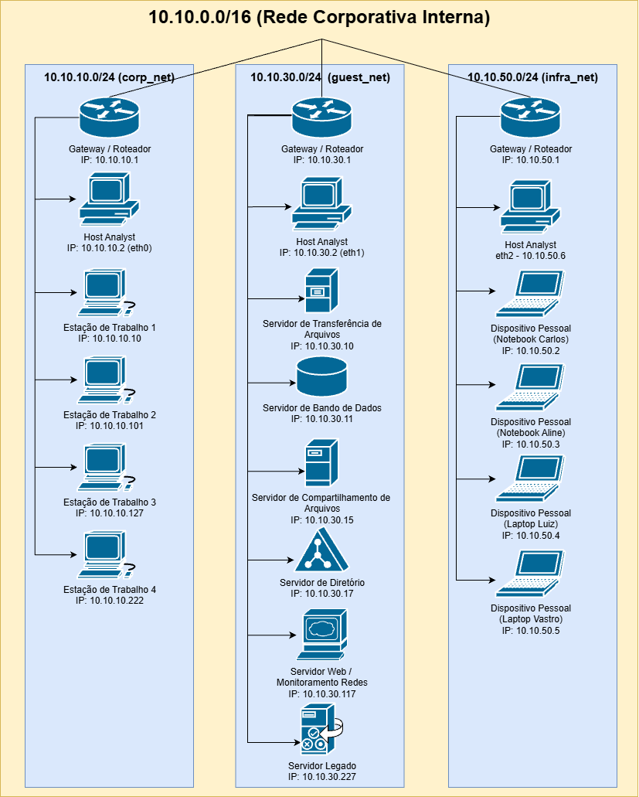

# Relatório Técnico – Rede Corporativa da Empresa

**Autor:** Pedro Heeger Costa  
**Data:** 25/07/25  
**Versão:** 1.0

## Sumário Executivo

A rede analisada possui diversos computadores e serviços que se comunicam entre si para manter o funcionamento do ambiente. Alguns desses serviços estão configurados de forma segura, mas outros apresentam vulnerabilidades que podem facilitar ataques por pessoas mal-intencionadas. Os principais problemas identificados foram:
- Alguns acessos importantes estão liberados para muitas pessoas ou usam senhas fáceis, o que pode permitir invasões.
- Um protocolo antigo chamado FTP está em uso, e ele envia informações como senhas sem proteção, correndo risco de serem capturadas.
- Um serviço que organiza informações da rede (LDAP) está aberto para consultas sem muita proteção, o que facilita o mapeamento da rede por quem quer atacar.
- O sistema de monitoramento da rede está protegido, mas precisa garantir que toda comunicação seja segura e que só pessoas autorizadas tenham acesso.

Para melhorar a segurança da rede, recomenda-se:
- Restringir os acessos, permitindo que só pessoas e computadores confiáveis possam entrar.
- Substituir o protocolo FTP por alternativas seguras que utilizam criptografia.
- Garantir que todos os acessos e comunicações importantes estejam protegidos com senhas fortes e criptografia, tornando os dados ilegíveis para quem não tem autorização.
- Manter os sistemas atualizados para evitar a exploração de vulnerabilidades conhecidas.
- Monitorar continuamente a rede a fim de identificar e responder rapidamente a tentativas de acesso indevido.

A adoção dessas medidas fortalece a segurança da rede de forma eficiente, reduzindo significativamente os riscos com um esforço relativamente baixo

## Objetivo

Realizar uma análise técnica da rede interna segmentada da empresa, com foco na detecção das sub-redes existentes e avaliação da segmentação entre elas, identificação dos hosts ativos em cada sub-rede, mapeamento dos endereços IP atribuídos, descoberta das portas abertas e dos serviços ativos em cada host, bem como a avaliação da exposição desses serviços, visando à proposição de medidas de mitigação para redução dos riscos e melhoria da segurança do ambiente.

## Escopo

Este trabalho abrange exclusivamente a análise da infraestrutura de rede interna segmentada de um ambiente corporativo. Estão incluídas as seguintes atividades:
- Levantamento das sub-redes existentes;
- Avaliação da segmentação lógica entre as sub-redes;
- Identificação dos hosts ativos e seus respectivos endereços IP;
- Descoberta de portas abertas e serviços em execução em cada host;
- Classificação funcional dos dispositivos identificados (estações, servidores, etc.);
- Avaliação da exposição dos serviços e potenciais riscos associados;
- Geração de documentação técnica com inventário de ativos, topologia da rede, diagnóstico e recomendações de segurança.

Estão fora do escopo deste trabalho:
- Análises externas (ex.: perímetro de internet);
- Testes de intrusão (pentest) ou exploração de vulnerabilidades;
- Reconfiguração de dispositivos ou aplicação de correções.

## Metodologia

A análise foi conduzida utilizando uma estação de trabalho com acesso à rede interna corporativa, executando o sistema operacional Kali Linux, equipado com ferramentas especializadas para detecção e varredura de redes. O processo foi dividido em etapas manuais e sistemáticas, baseadas em coleta ativa de dados. Foram aplicadas ferramentas para mapear a infraestrutura, identificar dispositivos ativos, inspecionar portas e serviços expostos e levantar possíveis pontos de vulnerabilidade. As evidências coletadas ao longo do processo foram registradas e organizadas de forma estruturada para compor este relatório técnico.

- **Reconhecimento Técnico da Infraestrutura**
    - **Identificação de Interfaces e Sub-redes:** Foi realizado o levantamento das interfaces de rede disponíveis no ambiente de análise, permitindo identificar os endereços IP locais atribuídos a cada interface. A partir dessas informações, foi possível inferir a existência de múltiplas sub-redes corporativas conectadas ao host de análise.
    - **Descoberta de Hosts Ativos por Sub-rede:** Para cada sub-rede detectada, foram aplicadas técnicas de varredura baseadas em protocolos ARP e ICMP, com ferramentas especializadas, para mapear os hosts ativos, identificando seus endereços IP, nomes de host (quando disponíveis) e endereços MAC.
- **Análise de Serviços e Exposição de Ativos**
    - **Varredura de Portas e Identificação de Serviços:** Foi realizada uma varredura minuciosa utilizando ferramentas específicas para identificar portas abertas, serviços em execução, suas versões e, quando possível, o sistema operacional dos dispositivos detectados.
    - **Enumeração de Serviços Específicos:** Nos hosts que apresentaram serviços expostos em portas sensíveis, foram empregadas técnicas de enumeração avançada para coletar informações adicionais, avaliando potenciais vulnerabilidades como acesso anônimo, banners informativos, falhas de configuração e exposição de aplicações web.
- **Avaliação de Riscos e Exposição**
    - Esta etapa consistiu na análise da exposição dos serviços identificados, verificando aspectos como ausência de criptografia, permissões indevidas, interfaces administrativas acessíveis e potenciais falhas na segmentação entre as sub-redes.
- **Inventário Técnico e Classificação dos Ativos de Rede**
    - Com base nos resultados das varreduras, foi elaborado um inventário composto por três grupos de tabelas. O primeiro grupo contém uma única tabela que relaciona as interfaces de rede e seus respectivos IPs, associando-os aos IPs e nomes das sub-redes identificadas. O segundo grupo, formado por três tabelas (uma para cada sub-rede), apresenta os IPs dos hosts ativos, vinculando-os aos nomes dos hosts, serviços (função?) em execução e sistemas operacionais detectados. Por fim, o terceiro grupo, também com três tabelas, detalha os hosts com portas abertas em cada sub-rede, especificando a porta, o protocolo utilizado, o serviço em execução, o risco identificado e a evidência coletada.    
- **Diagnóstico e Recomendações**
    - Com base na análise dos riscos, exposições e inventário técnico, foi realizado um diagnóstico aprofundado das vulnerabilidades, avaliando impacto e criticidade, que serviu de base para a formulação de recomendações específicas de mitigação. A partir dessas recomendações, foi elaborado um plano de ação focado, seguindo o princípio 80/20, para otimizar os esforços e fortalecer a segurança da infraestrutura.
- **Documentação Técnica**
    - Elaboração deste relatório técnico, contendo: sumário executivo, objetivo, escopo, metodologia, diagrama da topologia da rede, inventário técnico, diagnósticos, recomendações, plano de ação baseado na priorização 80/20, conclusão e anexos utilizados.

## Diagrama de Rede

O diagrama abaixo representa a topologia da rede analisada durante a execução dos testes. Ele ilustra a disposição dos principais ativos, a segmentação em sub-redes, os dispositivos de interconexão e a máquina de análise utilizada na varredura. Esse mapeamento visual foi fundamental para compreender a arquitetura do ambiente, identificar os pontos de exposição e orientar as atividades de enumeração e diagnóstico.

## Inventário Técnico

### Sub-redes Identificadas

A máquina Analyst possui três interfaces de rede conectadas a sub-redes distintas da rede corporativa interna (corp_net, guest_net e infra_net), permitindo a coleta de informações e o levantamento dos ativos presentes em cada segmento da rede.

    <table border="1" style="border-collapse: collapse; text-align: center;">
        <thead>
            <tr>
                <th style="padding: 5px; text-align: center;">Interface</th>
                <th style="padding: 5px; text-align: center;">IP Máquina Analyst</th>
                <th style="padding: 5px; text-align: center;">Sub-rede</th>
                <th style="padding: 5px; text-align: center;">Nome da rede</th>
            </tr>
        </thead>
        <tbody>
            <tr>
                <td>
eth0
</td>
                <td>
10.10.10.2
</td>
                <td>
10.10.10.0/24
</td>
                <td>
corp_net
</td>
            </tr>
            <tr>
                <td>
eth2
</td>
                <td>
10.10.30.2
</td>
                <td>
10.10.30.0/24
</td>
                <td>
guest_net
</td>
            </tr>
            <tr>
                <td>
eth1
</td>
                <td>
10.10.50.5
</td>
                <td>
10.10.50.0/24
</td>
                <td>
infra_net
</td>
            </tr>
        </tbody>
    </table>

### Hosts Ativos Identificados por Sub-redes

A seguir, estão listados os hosts ativos detectados em cada sub-rede da rede corporativa interna, com suas respectivas funções e sistemas operacionais, quando identificados. Essa catalogação auxilia na compreensão da infraestrutura e no planejamento de análises posteriores.

    <h4>Sub-rede 10.10.10.0/24 (corp_net)</h4>
    <table border="1" style="border-collapse: collapse; text-align: center;">
        <thead>
            <tr>
                <th style="padding: 5px; text-align: center;">IP</th>
                <th style="padding: 5px; text-align: center;">Host</th>
                <th style="padding: 5px; text-align: center;">Função</th>
                <th style="padding: 5px; text-align: center;">SO</th>
            </tr>
        </thead>
        <tbody align="center">
            <tr><td>10.10.10.1</td><td>ip-10-10-10-1.ec2.internal</td><td>Gateway / Roteador da Sub-rede</td><td>Linux 4.15-5.19 (Ubuntu) / OpenWrt 21.02 (Linux 5.4)</td></tr>
            <tr><td>10.10.10.2</td><td>81961e6c169a</td><td>Máquina de Análise de Rede</td><td>Kali GNU/Linux</td></tr>
            <tr><td>10.10.10.10</td><td>WS_001.projeto_final_opcao_1_corp_net</td><td>Estação de Trabalho 1</td><td>-</td></tr>
            <tr><td>10.10.10.101</td><td>WS_002.projeto_final_opcao_1_corp_net</td><td>Estação de Trabalho 2</td><td>-</td></tr>
            <tr><td>10.10.10.127</td><td>WS_003.projeto_final_opcao_1_corp_net</td><td>Estação de Trabalho 3</td><td>-</td></tr>
            <tr><td>10.10.10.222</td><td>WS_004.projeto_final_opcao_1_corp_net</td><td>Estação de Trabalho 4</td><td>-</td></tr>
        </tbody>
    </table>

    <h4>Sub-rede 10.10.30.0/24 (guest_net)</h4>
    <table border="1" style="border-collapse: collapse; text-align: center;">
        <thead>
            <tr>
                <th style="padding: 5px; text-align: center;">IP</th>
                <th style="padding: 5px; text-align: center;">Host</th>
                <th style="padding: 5px; text-align: center;">Função</th>
                <th style="padding: 5px; text-align: center;">SO</th>
            </tr>
        </thead>
        <tbody align="center">
            <tr><td>10.10.30.1
</td><td>ip-10-10-30-1.ec2.internal</td><td>Gateway / Roteador da Sub-rede</td><td>Linux 4.15-5.19 (Ubuntu) / MikroTik RouterOS 7.2-7.5 (Linux 5.6.3) / OpenWrt 21.02 (Linux 5.4)</td></tr>
            <tr><td>10.10.30.2
</td><td>81961e6c169a</td><td>Máquina de Análise de Rede</td><td>Kali GNU/Linux</td></tr>
            <tr><td>10.10.30.10
</td><td>ftp-server.projeto_final_opcao_1_infra_net</td><td>Servidor de Transferência de Arquivos</td><td>Linux 4.15-5.19 / MikroTik RouterOS 7.2-7.5 (Linux 5.6.3) / OpenWrt 21.02 (Linux 5.4)</td></tr>
            <tr><td>10.10.30.11
</td><td>mysql-server.projeto_final_opcao_1_infra_net</td><td>Servidor de Banco de Dados</td><td>Linux 4.15-5.19 / OpenWrt 21.02 (Linux 5.4)</td></tr>
            <tr><td>10.10.30.15
</td><td>samba-server.projeto_final_opcao_1_infra_net</td><td>Servidor de Compartilhamento de Arquivos</td><td>Linux 4.15-5.19 / OpenWrt 21.02 (Linux 5.4)</td></tr>
            <tr><td>10.10.30.17
</td><td>openldap.projeto_final_opcao_1_infra_net</td><td>Servidor de Diretório</td><td>Linux 4.15-5.19 / MikroTik RouterOS 7.2-7.5 (Linux 5.6.3) / OpenWrt 21.02 (Linux 5.4)</td></tr>
            <tr><td>10.10.30.117
</td><td>zabbix-server.projeto_final_opcao_1_infra_net</td><td>Servidor Web / Servidor de Monitoramento de Redes</td><td>Linux 4.15-5.19 / MikroTik RouterOS 7.2-7.5 (Linux 5.6.3) / OpenWrt 21.02 (Linux 5.4)</td></tr>
            <tr><td>10.10.30.227
</td><td>legacy-server.projeto_final_opcao_1_infra_net</td><td>Servidor Legado</td><td>-</td></tr>
        </tbody>
    </table>

    <h4>Sub-rede 10.10.50.0/24 (infra_net)</h4>
    <table border="1" style="border-collapse: collapse; text-align: center;">
        <thead>
            <tr>
                <th style="padding: 5px; text-align: center;">IP</th>
                <th style="padding: 5px; text-align: center;">Host</th>
                <th style="padding: 5px; text-align: center;">Função</th>
                <th style="padding: 5px; text-align: center;">SO</th>
            </tr>
        </thead>
        <tbody align="center">
            <tr><td>10.10.50.1</td><td>ip-10-10-50-1.ec2.internal</td><td>Gateway / Roteador da Sub-rede</td><td>Linux 4.15-5.19 (Ubuntu) / MikroTik RouterOS 7.2-7.5 (Linux 5.6.3) / OpenWrt 21.02 (Linux 5.4)</td></tr>
            <tr><td>10.10.50.2</td><td>notebook-carlos.projeto_final_opcao_1_guest_net</td><td>Dispositivo Pessoal (Notebook de Carlos)</td><td>-</td></tr>
            <tr><td>10.10.50.3</td><td>macbook-aline.projeto_final_opcao_1_guest_net</td><td>Dispositivo Pessoal (Macbook de Aline)</td><td>-</td></tr>
            <tr><td>10.10.50.4</td><td>laptop-luiz.projeto_final_opcao_1_guest_net</td><td>Dispositivo Pessoal (Laptop de Luiz)</td><td>-</td></tr>
            <tr><td>10.10.50.5</td><td>laptop-vastro.projeto_final_opcao_1_guest_net</td><td>Dispositivo Pessoal (Laptop Vastro)</td><td>-</td></tr>
            <tr><td>10.10.50.6</td><td>81961e6c169a</td><td>Máquina de Análise de Rede</td><td>Kali GNU/Linux</td></tr>
        </tbody>
    </table>

### Portas Abertas e Riscos Identificadas

O levantamento a seguir apresenta as portas abertas identificadas em cada sub-rede da infraestrutura, os serviços correspondentes e os respectivos níveis de risco associados. A categorização de risco foi baseada em boas práticas de segurança, considerando a exposição dos serviços, presença de autenticação, e possibilidades de exploração. Evidências adicionais foram incluídas quando aplicável.

    <h4>Sub-rede 10.10.10.0/24 (corp_net)</h4>
    <table border="1" style="border-collapse: collapse; text-align: center;">
        <thead>
            <tr>
                <th style="padding: 5px; text-align: center;">IP</th>
                <th style="padding: 5px; text-align: center;">Porta</th>
                <th style="padding: 5px; text-align: center;">Protocolo</th>
                <th style="padding: 5px; text-align: center;">Serviço</th>
                <th style="padding: 5px; text-align: center; white-space: nowrap;">Nível de Risco</th>
                <th style="padding: 5px; text-align: center;">Evidência</th>
            </tr>
        </thead>
        <tbody align="center">
            <tr><td>10.10.10.1</td><td>22</td><td>SSH</td><td>OpenSSH 9.6</td><td>🟠 Médio</td><td><a href="./outputs/portas/porta22.txt">porta22.txt</a></td></tr>
            <tr><td>10.10.10.2</td><td>37820; 40754; 45072; 56622; 59102</td><td>Portas Efêmeras/Dinâmicas</td><td>Nmap / Rustscan</td><td>🟢 Baixo</td><td>-</td></tr>
        </tbody>
    </table>

    <h4>Sub-rede 10.10.30.0/24 (guest_net)</h4>
    <table border="1" style="border-collapse: collapse; text-align: center;">
        <thead>
            <tr>
                <th style="padding: 5px; text-align: center;">IP</th>
                <th style="padding: 5px; text-align: center;">Porta</th>
                <th style="padding: 5px; text-align: center;">Protocolo</th>
                <th style="padding: 5px; text-align: center;">Serviço</th>
                <th style="padding: 5px; text-align: center; white-space: nowrap;">Nível de risco</th>
                <th style="padding: 5px; text-align: center;">Evidência</th>
            </tr>
        </thead>
        <tbody align="center">
            <tr><td>10.10.30.1</td><td>22</td><td>SSH</td><td>OpenSSH 9.6</td><td>🟠&nbsp;Médio</td><td><a href="./outputs/portas/porta22.txt">porta22.txt</a></td></tr>
            <tr><td>10.10.30.2</td><td>37820; 40754; 45072; 56622; 59102</td><td>Portas Efêmeras/Dinâmicas</td><td>Nmap / Rustscan</td><td>🟢 Baixo</td><td>-</td></tr>
            <tr><td>10.10.30.10</td><td>21</td><td>FTP</td><td>Pure-FTPd</td><td>🔴 Alto</td><td><a href="./outputs/portas/guest_net_servico_ftp-anon.txt">guest_net_servico_ftp-anon.txt</a></td></tr>
            <tr><td>10.10.30.11</td><td>3306</td><td>MySQL</td><td>MySQL 8.0.43</td><td>🔴 Alto</td><td><a href="./outputs/portas/guest_net_servico_mysql-info.txt">guest_net_servico_mysql-info.txt</a></td></tr>
            <tr><td>10.10.30.15</td><td>139</td><td>SMB via NetBIOS</td><td>Samba smbd 4</td><td>🔴 Alto</td><td><a href="./outputs/portas/guest_net_servico_smb.txt">guest_net_servico_smb.txt</a></td></tr>
            <tr><td>10.10.30.15</td><td>445</td><td>SMB via TCP</td><td>Samba smbd 4</td><td>🔴 Alto</td><td><a href="./outputs/portas/guest_net_servico_smb.txt">guest_net_servico_smb.txt</a></td></tr>
            <tr><td>10.10.30.17</td><td>389</td><td>LDAP (Lightweight Directory Access Protocol)</td><td>LDAP</td><td>🔴 Alto</td><td><a href="./outputs/portas/guest_net_servico_ldap-rootdse.txt">guest_net_servico_ldap-rootdse.txt</a></td></tr>
            <tr><td>10.10.30.17</td><td>636</td><td>LDAP via SSL/TLS (LDAP seguro)</td><td>LDAPS</td><td>🟢 Baixo</td><td>-</a></td></tr>
            <tr><td>10.10.30.117</td><td>80</td><td>HTTP</td><td>Nginx</td><td>🟠&nbsp;Médio</td><td><a href="./outputs/portas/guest_net_servico_webserver.txt">guest_net_servico_webserver.txt</a></td></tr>
            <tr><td>10.10.30.117</td><td>10051</td><td>Zabbix</td><td>Zabbix Server</td><td>🟠&nbsp;Médio</td><td><a href="./outputs/portas/guest_net_servico_zabbix.txt">guest_net_servico_zabbix.txt</a></td></tr>
            <tr><td>10.10.30.117</td><td>10052</td><td>Zabbix</td><td>Zabbix Proxy</td><td>🟠&nbsp;Médio</td><td><a href="./outputs/portas/guest_net_servico_zabbix.txt">guest_net_servico_zabbix.txt</a></td></tr>
        </tbody>
    </table>

    <h4>Sub-rede 10.10.50.0/24 (infra_net)</h4>
    <table border="1" style="border-collapse: collapse; text-align: center;">
        <thead>
            <tr>
                <th style="padding: 5px; text-align: center;">IP</th>
                <th style="padding: 5px; text-align: center;">Porta</th>
                <th style="padding: 5px; text-align: center;">Protocolo</th>
                <th style="padding: 5px; text-align: center;">Serviço</th>
                <th style="padding: 5px; text-align: center; white-space: nowrap;">Nível de risco</th>
                <th style="padding: 5px; text-align: center;">Evidência</th>
            </tr>
        </thead>
        <tbody align="center">
            <tr><td>10.10.50.1</td><td>22</td><td>SSH</td><td>OpenSSH 9.6</td><td>🟠 Médio</td><td><a href="./outputs/portas/porta22.txt">porta22.txt</a></td></tr>
            <tr><td>10.10.50.6</td><td>37820; 40754; 45072; 56622; 59102</td><td>Portas Efêmeras/Dinâmicas</td><td>Nmap / Rustscan</td><td>🟢 Baixo</td><td>-</td></tr>
        </tbody>
    </table>

## Diagnósticos e Recomendações

🔐 **SSH (porta 22):** 🟠 Médio
- SSH é utilizado para acesso remoto a dispositivos e servidores, especialmente em ambientes de administração de rede.  
- Porta SSH aberta pode ser vetor de ataques caso não esteja devidamente configurada (ex: uso de senhas fracas, ausência de autenticação por chave, ou exposição desnecessária à internet).  
- Provavelmente, por se tratar de roteadores físicos/virtuais em sub-redes distintas, a porta 22 precisa estar aberta para permitir a administração remota quando necessário. Entretanto, apenas funcionários autorizados devem ter esse acesso.  
- **Recomendação:** validar políticas de acesso (definindo quais hosts podem acessar via SSH), exigir autenticação forte (preferencialmente com chaves) e utilizar firewall para mitigar riscos de acesso não autorizado e ataques de força bruta.  
- **Situação:** foi realizado um teste de conexão a partir da máquina de análise para os três hosts de cada sub-rede, e em todos os casos foi solicitada a chave privada para autenticação. Isso indica a presença de um nível básico de segurança no controle de acesso remoto.

📤 **FTP (porta 21):** 🔴 Alto
- O FTP transmite dados em texto claro, incluindo credenciais (usuário e senha), facilitando a interceptação por atacantes na rede, especialmente em redes não confiáveis, o que representa um risco alto.
- Embora o servidor não permita login anônimo, o que reduz a chance de acesso livre, o protocolo continua intrinsecamente inseguro por não criptografar os dados. Em ambientes internos corporativos, o risco imediato pode ser menor, mas o FTP ainda é considerado um ponto vulnerável.
- **Recomendação:** substituir o FTP por protocolos mais seguros como SFTP ou FTPS, que garantem a criptografia dos dados e das credenciais durante a transmissão. Além disso, recomenda-se isolar o servidor da rede guest usando firewall e validar políticas de acesso para restringir usuários e redes autorizados a se conectar.
- **Situação:** testes realizados a partir da máquina Analyst confirmaram que o login anônimo não é permitido, porém um ataque de força bruta poderia potencialmente obter acesso ao servidor.

🛢️ **MySQL (porta 3306):** 🔴 Alto
- Porta utilizada para acesso remoto ao banco de dados MySQL.
- Porta aberta pode permitir coleta de informações sensíveis se mal configurada (ex: autenticação fraca, sem restrição de IP).
- **Recomendação:** restringir acesso a IPs autorizados, exigir autenticação forte e considerar tunelamento por SSH ou VPN para proteger a conexão, garantindo que o tráfego seja criptografado e acessível apenas por usuários autorizados, além do uso de firewall para bloquear acessos não autorizados.
- **Situação:** foi executado um scan para coleta de informações do serviço, retornando a versão 8.0.43 e detalhes das capacidades do servidor MySQL, incluindo suporte a SSL e autenticação via plugin caching_sha2_password.
- **Situação:** foi realizado um teste de conexão a partir da máquina de análise para o host utilizando o usuário root e senha root; o acesso ao banco foi obtido, sendo possível criar um banco de dados e interagir com o servidor.

📁 **SMB (portas 139 e 445):** 🔴 Alto
- SMB é um protocolo utilizado para compartilhamento de arquivos, impressoras e outros recursos em redes locais.
- A existência de compartilhamentos SMB, especialmente com acesso anônimo ou permissões mal configuradas, pode ser vetor para ataques como enumeração de recursos, acesso não autorizado e execução remota de código.
- **Recomendação:** continuar com SMB1 desabilitado, desabilitar acesso anônimo ao IPC$, revisar e restringir permissões, aplicar hardening no Samba, e monitorar logs para tentativas suspeitas.
- **Situação:** Testes de enumeração anônima indicam que, apesar do acesso ao IPC$, não foi possível listar compartilhamentos ou arquivos acessíveis anonimamente. No entanto, a exposição do compartilhamento IPC$ pode ser usada para enumeração de informações, o que amplia a superfície de ataque, mesmo sem compartilhamentos acessíveis.
- **Situação:** SMB1 está desabilitado no servidor, sendo utilizado SMB2/SMB3, o que melhora a segurança contra vulnerabilidades antigas do SMB1.

📚 **LDAP (porta 389):** 🔴 Alto
- LDAP é utilizado para serviços de diretório e autenticação, permitindo a consulta e gerenciamento de informações de usuários e recursos na rede.
- A porta 389 aberta permite consultas anônimas RootDSE, expondo informações sobre a estrutura do diretório, o que pode facilitar reconhecimento e mapeamento para ataques futuros, representando risco alto.
- **Recomendação:** restringir o acesso ao serviço LDAP apenas a hosts autorizados, exigir autenticação para consultas detalhadas, implementar mecanismos de autenticação forte e utilizar LDAP sobre SSL/TLS (LDAPS) para garantir a criptografia das comunicações. Além disso, é importante monitorar os acessos e tentativas de consultas anônimas para identificar possíveis varreduras ou ataques.
- **Situação:** O scan com ldap-rootdse revelou que a consulta RootDSE retorna os namingContexts e várias capacidades suportadas pelo servidor, indicando que não há restrição para consultas anônimas básicas.
- **Situação:** O comando ldapsearch sem autenticação não conseguiu listar objetos além do contexto base, retornando “No such object”, o que indica algum nível de restrição para consultas amplas. Apesar disso, a exposição do RootDSE permite reconhecimento e mapeamento da estrutura do diretório, informação valiosa para um atacante.

🔒 **LDAPS (porta 636):** 🟢 Baixo
- Versão segura do LDAP utilizando SSL/TLS para criptografar toda a comunicação.
- Comunicação protegida contra interceptação e vazamento de credenciais sensíveis em trânsito.
- Considerado de baixo risco quando configurado corretamente, com certificados válidos e uso de protocolos TLS seguros.
- **Recomendação:** garantir uso exclusivo do LDAPS, desabilitando o LDAP na porta 389 sempre que possível para evitar conexões não seguras; validar periodicamente certificados e configurações TLS; restringir o acesso somente a hosts autorizados para aumentar a segurança.

🌐 **HTTP-Nginx (porta 80):** 🟠 Médio
- Servidor web Nginx em execução, com potencial exposição de aplicações como o Zabbix.
- Porta HTTP aberta pode permitir ataques caso o servidor ou aplicações estejam desatualizados ou mal configurados (ex: XSS, CSRF, falhas de autenticação).
- **Recomendação:** manter Nginx e aplicações atualizados, aplicar boas práticas de segurança web e usar HTTPS, reduzindo vulnerabilidades conhecidas e protegendo a comunicação.
- **Situação:** Um teste HTTP retornou status 200 OK, confirmando o servidor ativo, com cabeçalhos que indicam algumas proteções básicas (X-Content-Type-Options, X-XSS-Protection e X-Frame-Options). Tentativa de comunicação via Zabbix agent falhou devido a restrições de acesso configuradas no agente, indicando algum nível de controle na aplicação.

📊 **Zabbix Server (porta 10051):** 🟠 Médio
- Serviço de monitoramento Zabbix coletando dados pela rede.
- Se mal configurado, pode permitir acesso não autorizado ou injeção de comandos.
- **Recomendação:** aplicar autenticação forte, restringir IPs de origem e monitorar acessos, a fim de evitar comprometimento da infraestrutura de monitoramento.

📡 **Zabbix Proxy (porta 10052):** 🟠 Médio
- Comunicação entre proxy e servidor Zabbix.
- Porta pode ser explorada se não houver autenticação ou criptografia adequadas.
- **Recomendação:** utilizar autenticação mútua e criptografia TLS entre proxy e servidor, para assegurar a integridade e a confidencialidade da comunicação.
- **Situação:** Um teste HTTP na porta 80 do host retornou o conteúdo do painel do Zabbix, confirmando que o serviço está ativo. A interface web apresenta formulário de login, indicando que o acesso ao painel está protegido por autenticação.

## Plano de Ação (80/20)

A tabela a seguir apresenta um plano de ação baseado no princípio de Pareto (80/20), priorizando medidas de segurança com maior impacto e menor complexidade de implementação. Essas ações foram definidas a partir das vulnerabilidades identificadas durante a análise e têm como objetivo reduzir significativamente a superfície de ataque do ambiente.

    <h3>Plano de Ação 80/20 - Prioridades para Mitigação</h3>
    <table border="1" style="border-collapse: collapse; text-align: center; width: 90%;">
        <thead>
            <tr>
                <th style="padding: 5px; text-align: center;">#</th>
                <th style="padding: 5px; text-align: center;">Ação</th>
                <th style="padding: 5px; text-align: center;">Impacto</th>
                <th style="padding: 5px; text-align: center;">Facilidade</th>
                <th style="padding: 5px; text-align: center;">Prioridade</th>
            </tr>
        </thead>
        <tbody align="center">
            <tr><td>1</td><td>Restringir acesso SSH apenas a hosts autorizados</td><td>Alto</td><td>Média</td><td>Alta</td></tr>
            <tr><td>2</td><td>Usar autenticação por chave pública no SSH (desabilitar senha)</td><td>Alto</td><td>Média</td><td>Alta</td></tr>
            <tr><td>3</td><td>Substituir FTP por SFTP ou FTPS para garantir criptografia nas transmissões</td><td>Alto</td><td>Média</td><td>Alta</td></tr>
            <tr><td>4</td><td>Implementar controle de acesso por IP para limitar conexões autorizadas ao FTP</td><td>Alto</td><td>Média</td><td>Alta</td></tr>
            <tr><td>5</td><td>Restringir acesso ao MySQL a IPs autorizados</td><td>Alto</td><td>Média</td><td>Alta</td></tr>
            <tr><td>6</td><td>Exigir autenticação forte no MySQL</td><td>Alto</td><td>Baixa</td><td>Alta</td></tr>
            <tr><td>7</td><td>Restringir acesso SMB apenas a usuários autorizados</td><td>Alto</td><td>Média</td><td>Alta</td></tr>
            <tr><td>8</td><td>Eliminar acesso anônimo ao IPC$</td><td>Médio</td><td>Média</td><td>Baixa</td></tr>
            <tr><td>9</td><td>Restringir consultas LDAP a hosts autorizados</td><td>Alto</td><td>Média</td><td>Alta</td></tr>
            <tr><td>10</td><td>Exigir autenticação para consultas detalhadas no LDAP</td><td>Alto</td><td>Baixa</td><td>Alta</td></tr>
            <tr><td>11</td><td>Desabilitar LDAP (porta 389)</td><td>Alto</td><td>Baixa</td><td>Média</td></tr>
            <tr><td>12</td><td>Usar exclusivamente LDAPS (porta 636) com certificados válidos</td><td>Alto</td><td>Média</td><td>Média</td></tr>
            <tr><td>13</td><td>Configurar o Nginx para usar HTTPS</td><td>Alto</td><td>Baixa</td><td>Média</td></tr>
            <tr><td>14</td><td>Manter o servidor e aplicações sempre atualizados</td><td>Médio</td><td>Baixa</td><td>Média</td></tr>
            <tr><td>15</td><td>Aplicar autenticação forte no Zabbix Server</td><td>Médio</td><td>Baixa</td><td>Média</td></tr>
            <tr><td>16</td><td>Restringir IPs no Zabbix Server</td><td>Alto</td><td>Média</td><td>Média</td></tr>
            <tr><td>17</td><td>Configurar autenticação mútua entre Zabbix Proxy e Server</td><td>Médio</td><td>Média</td><td>Média</td></tr>
            <tr><td>18</td><td>Configurar TLS entre Zabbix Proxy e Server</td><td>Médio</td><td>Média</td><td>Média</td></tr>
        </tbody>
    </table>

## Conclusão

A análise revelou diversas exposições relevantes em serviços essenciais da rede, como SSH, FTP, MySQL, SMB, LDAP, HTTP e Zabbix, que apresentam riscos variando de médio a alto. A maioria dos riscos está associada à configuração inadequada de autenticação, permissões abertas e uso de protocolos não seguros.

O plano de ação prioriza medidas simples e de alto impacto, focando na restrição de acessos, fortalecimento da autenticação e criptografia das comunicações. Recomenda-se implementar as ações listadas no plano 80/20 com urgência, monitorar continuamente os serviços e realizar avaliações periódicas para garantir a manutenção da segurança da infraestrutura.

## Anexos

Esta seção reúne os materiais complementares utilizados ou gerados durante a análise da rede. Estão incluídos o diagrama de topologia, ferramentas empregadas, comandos executados, saídas obtidas durante a execução das tarefas, bem como capturas de tela que ilustram as etapas do processo.

<ul>
    <li><a href="./diagrama.png">Diagrama da rede</a></li>
    <li><a href="./softwares.md">Softwares/Ferramentas utilizadas</a></li>
    <li><a href="./cmds.md">Comandos utilizados</a></li>
    <li>

<a href="./outputs/">Outputs dos comandos</a>

        <ul>
            <li><a href="./outputs/ping.txt">ping.txt</a></li>
            <li><a href="./outputs/recon-ip_maps.txt">recon-ip_maps.txt</a></li>
            <li><a href="./outputs/recon-redes.txt">recon-redes.txt</a></li>
            <li><a href="./outputs/versions.txt">versions.txt</a></li>
            

corp_net

                <ul>
                    <li><a href="./outputs/corp_net/corp_net_ips.txt">corp_net_ips.txt</a></li>
                    <li><a href="./outputs/corp_net/corp_net_ips_hosts.txt">corp_net_ips_hosts.txt</a></li>
                    <li><a href="./outputs/corp_net/corp_net_ips_ports.txt">corp_net_ips_ports.txt</a></li>
                </ul>

            

guest_net

                <ul>
                    <li><a href="./outputs/guest_net/guest_net_ips.txt">guest_net_ips.txt</a></li>
                    <li><a href="./outputs/guest_net/guest_net_ips_hosts.txt">guest_net_ips_hosts.txt</a></li>
                    <li><a href="./outputs/guest_net/guest_net_ips_ports.txt">guest_net_ips_ports.txt</a></li>
                </ul>

            

infra_net

                <ul>
                    <li><a href="./outputs/infra_net/infra_net_ips.txt">infra_net_ips.txt</a></li>
                    <li><a href="./outputs/infra_net/infra_net_ips_hosts.txt">infra_net_ips_hosts.txt</a></li>
                    <li><a href="./outputs/infra_net/infra_net_ips_ports.txt">infra_net_ips_ports.txt</a></li>
                </ul>

            

portas

                <ul>
                    <li><a href="./outputs/portas/guest_net_servico_ftp-anon.txt">guest_net_servico_ftp-anon.txt</a></li>
                    <li><a href="./outputs/portas/guest_net_servico_ldap-rootdse.txt">guest_net_servico_ldap-rootdse.txt</a></li>
                    <li><a href="./outputs/portas/guest_net_servico_mysql-info.txt">guest_net_servico_mysql-info.txt</a></li>
                    <li><a href="./outputs/portas/guest_net_servico_smb.txt">guest_net_servico_smb.txt</a></li>
                    <li><a href="./outputs/portas/guest_net_servico_webserver.txt">guest_net_servico_webserver.txt</a></li>
                    <li><a href="./outputs/portas/guest_net_servico_zabbix.txt">guest_net_servico_zabbix.txt</a></li>
                    <li><a href="./outputs/portas/porta22.txt">porta22.txt</a></li>
                </ul>

        </ul>

    <li><a href="./img/">Prints de ferramentas</a></li>
</ul>