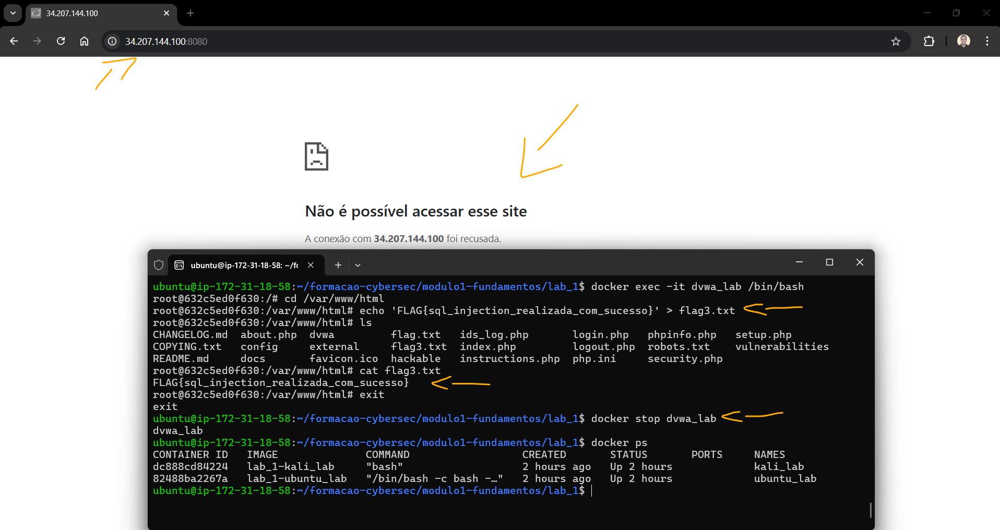

# Formação Cybersec - Labs Módulo 1   

### Repository: [boot](../../../../)   
### Platform: <a href="../../../">vnw   </a>
### Software/Subject: <a href="../../">cybersecurity   </a>
### Bootcamp: <a href="../">boot_035 (Formação Cybersec)   </a>
### Module: 1. Fundamentos de Cibersegurança

#### <a href="./README.md">Teoria</a>

---

Esta pasta refere-se ao módulo 1 **Fundamentos de Cibersegurança** do bootcamp [**Formação Cybersec**](../).

### Theme:
- Cybersecurity

### Used Tools:
- Operating System (OS): 
  - Linux   
  - Windows 11   
- Linux Distribution:
  - Ubuntu   
- Cloud:
  - AWS   
- Cloud Services:
  - Amazon Elastic Compute Cloud (EC2)   
  - Google Drive   
- Containerization: 
  - Docker   
  - Docker Compose   
- Language:
  - HTML   
  - Markdown   
- Integrated Development Environment (IDE) and Text Editor:
  - Visual Studio Code (VS Code)   
- Versioning: 
  - Git   
- Repository:
  - GitHub   
- Command Line Interpreter (CLI):
  - AWS Command Line Interface (CLI)   
  - Bash e Sh   
- Tools:
  - Advanced Package Tool (Apt)   
  - Advanced Package Tool (Apt-Get)   
  - Curl   
- Network:
  - Arp-scan   
  - Domain Information Groper (Dig)   
  - Iproute   
  - Iputils-ping; Iputils   
  - Netdiscover   
  - Net-tools   
  - Nmap   
  - Ping   
  - Rustscan   
- Offensive Security:
  - Damn Vulnerable Web Application (DVWA)   
  - gobuster   
  - Kali Linux   


sha256sum
CyberChef
  - OpenSSL   


---

### Bootcamp Module 1 Structure
1. <a name="item1">Módulo 1: Fundamentos de Cibersegurança<br>
    1.1. <a href="#item1.1">Conceitos básicos de segurança</a><br>
    1.2. <a href="#item1.2">Modelo CIA (Confidencialidade, Integridade, Disponibilidade)</a><br>
    1.3. <a href="#item1.3">Ameaças, ataques e vulnerabilidades</a><br>
    1.4. <a href="#item1.4">Reconhecimento & Footprinting</a><br>
    1.5. <a href="#item1.5">Infraestrutura de Rede - Conceitos e Componentes</a><br>
    1.6. <a href="#item1.6">Ferramentas: Kali Linux, Nmap, Wireshark</a><br>
    1.7. <a href="#item1.7">Endereçamento IP & Subnetting</a><br>
    1.8. <a href="#item1.8">Seu Dojo de Ataque no Kali Linux (CLI & GUI)</a><br>
    1.9. <a href="#item1.9">Ports/Portas</a><br>
    1.10. <a href="#item1.10">Desvendando SMB e SNMP: Os Pilares e as Fraquezas da Rede</a><br>
    1.11. <a href="#item1.11">Introdução a Scanners de Vulnerabilidade com OpenVAS/Greenbone</a><br>
    1.12. <a href="#item1.12">Documentação Técnica Profissional</a><br>
    1.13. <a href="#item1.13">Projeto Final</a><br>

---

### Objective:
Estabelecer uma base técnica sólida em redes, sistemas operacionais e nos princípios da segurança ofensiva e defensiva, com foco na aplicação prática de conceitos fundamentais de segurança, como o modelo CIA, Cyber Kill Chain e MITRE ATT&CK. O módulo também aborda técnicas essenciais de cibersegurança, incluindo análise de tráfego (**Wireshark**), reconhecimento e OSINT, escaneamento (**Nmap**) e enumeração de serviços.

### Folder Structure:
- [README.md](./README.md): Documento escrito em **Markdown**, descrevendo todo conteúdo teórico realizado neste módulo.
- [labs.md](./labs.md): Este documento de README, escrito em **Markdown**, descrevendo todos os laboratórios realizados neste módulo.

### Development:
Em cibersegurança, é prática comum e recomendada realizar laboratórios em ambientes controlados e seguros. Por isso, ferramentas como **Docker** ou máquinas virtuais são utilizadas para simular ambientes reais, protegendo a infraestrutura local, uma vez que o uso de ferramentas de ataque ou alterações em configurações de rede poderia comprometer a integridade do sistema. O ambiente de laboratório é estruturado em duas partes: a primeira envolve a instalação dos softwares que constroem o ambiente, como **WSL2**, **Docker** ou **VM VirtualBox**, além de ferramentas de suporte essenciais, como editores de código (**Visual Studio Code (VS Code)**) e sistemas de versionamento (**Git**).  

Neste curso, a configuração do ambiente foi realizada principalmente com **Docker** em conjunto com **WSL**. No entanto, para a maioria dos labs utilizei instâncias do **Amazon Elastic Compute Cloud (EC2)**, na nuvem da **Amazon Web Services (AWS)**, como alternativa de execução. Em pequenos casos, para realizar testes, a plataforma **Play With Docker (PWD)** também foi utilizada.

A criação da instância EC2 foi automatizada por meio do script [`ec2Instance.ps1`](../environment/ec2Instance.ps1), desenvolvido em **Windows PowerShell** utilizando comandos da **AWS Command Line Interface (CLI)**. O script está localizado na pasta [`environment`](../environment/) deste curso. A instância foi provisionada com a imagem `ami-020cba7c55df1f615`, baseada no sistema operacional **Linux Ubuntu**, associada a um volume **Amazon Elastic Block Store (EBS)** de `8 GB`, do tipo `gp` (General Purpose). O tipo de instância utilizado foi o `t3.medium`, com 2 vCPUs e 4 GB de memória. Para acesso, foi utilizado o par de chaves `keyPairUniversal`, previamente existente na conta da **AWS**, e o grupo de segurança atribuído à instância foi o `default` da zona de disponibilidade `us-east-1a` (Norte da Virgínia). Um script de *user data* foi utilizado para automatizar a instalação do **Git** e do **Docker** durante o processo de inicialização.

O acesso à instância podia ser feito tanto pelo console da **AWS** quanto por meio de conexão SSH utilizando o **OpenSSH** no **Windows PowerShell** da máquina local. Neste último caso, era necessário informar o caminho do arquivo de chave privada, o nome do usuário do sistema e o IP ou DNS público da instância. Um exemplo de comando seria: `ssh -i "G:/Meu Drive/4_PROJ/scripts/aws/.default/secrets/awsKeyPair/universal/keyPairUniversal.pem" ubuntu@54.160.249.118`. Além disso, o Security Group associado à instância precisava conter uma regra de entrada liberando a porta `22` para o IP público da máquina física, a fim de permitir o estabelecimento da conexão SSH. As máquinas virtuais do **Play With Docker (PWD)** também foram acessadas via SSH. Nesse caso, o próprio ambiente fornecia o comando necessário para a conexão, que podia ser executado diretamente no **Windows PowerShell**, sem necessidade de autenticação com chave privada ou senha.

A segunda parte consiste na construção do ambiente simulado propriamente dito. No caso do **Docker**, isso envolve a criação de containers, redes e volumes, realizada por meio de dois tipos principais de arquivos. O primeiro é o `docker-compose.yml`, que define de forma serial toda a estrutura a ser criada: quais e quantos containers, suas configurações, as imagens que irão utilizar e as redes que serão estabelecidas. O segundo tipo de arquivo, que pode existir mais de um por laboratório, são os `Dockerfile`, responsáveis por criar imagens específicas para cada container. Essas imagens podem ser enviadas a repositórios de imagens **Docker**, como o **DockerHub**, ou referenciadas diretamente no arquivo do **Docker Compose**.

Todos esses arquivos eram preparados pelo instrutor do curso e disponibilizados no [repositório](https://github.com/Kensei-CyberSec-Lab/formacao-cybersec/) do curso no perfil da plataforma **Vai na Web** no **GitHub**. O repositório era organizado pelos três módulos do curso, com pastas correspondentes a cada laboratório. Geralmente, o número do laboratório coincidia com o número da aula, embora nem todos os labs seguissem essa sequência e nem todas as aulas tivessem laboratórios. Em cada pasta de laboratório, além dos arquivos `docker-compose.yml` e `Dockerfile`, podiam existir arquivos complementares, como scripts, textos ou documentos **Markdown**, contendo informações relevantes ou conteúdos necessários para a execução do lab. Durante a realização de cada lab, além de executar os exercícios, foi feita uma explicação detalhada sobre a construção dos arquivos de **Docker Compose** e **Docker**, evidenciando como o ambiente foi estruturado.

Para executar os arquivos e iniciar o ambiente de laboratório, a sequência de comandos utilizada era a seguinte:
- `git clone https://github.com/Kensei-CyberSec-Lab/formacao-cybersec.git`: Clonagem do repositório do bootcamp para o ambiente local, seja no **WSL**, em máquinas virtuais ou, como no meu caso, em instâncias **Amazon EC2**.
- `cd formacao-cybersec/modulo2-defesa-monitoramento/lab_1`: Navegação até o diretório do laboratório a ser executado. Para outros labs, bastava alterar as duas últimas pastas do caminho para o módulo e lab correspondentes.
- `docker compose up -d`: Inicialização do ambiente com **Docker Compose**. Este comando deve ser executado na pasta onde o arquivo `docker-compose.yml` está localizado.
- `docker ps` e `docker network ls`: Verificação dos containers ativos e das redes existentes no ambiente.
- `docker exec -it kali /bin/bash`: Acesso a um container em execução. Basta substituir `kali` pelo nome do container que se deseja acessar.
- `docker compose down`: Encerramento do ambiente. Assim como na inicialização, este comando deve ser executado na pasta onde se encontra o arquivo `docker-compose.yml`.

Os laboratórios de cibersegurança são organizados em máquinas de ataque, geralmente uma **Kali Linux**, e máquinas alvo ou de defesa, que são os sistemas onde os ataques são realizados. Pode haver múltiplas máquinas de cada tipo, sendo comum que algumas máquinas de defesa sejam propositalmente vulneráveis, incluindo aplicações web criadas para testes. Como o ambiente é simulado via **Docker**, termos como máquina, container ou host frequentemente se referem aos containers que representam as máquinas simuladas. Além disso, é importante ter em mente que existem outras duas camadas no ambiente: a máquina física, no caso meu computador pessoal **Windows**, e a máquina virtual fornecida pela **AWS** ou pelo **Play With Docker (PWD)**, que hospeda e executa os containers do **Docker**.

Outra parte importante dos laboratórios foram os *Capture The Flag (CTF)*, desafios técnicos amplamente utilizados na área de cibersegurança para desenvolver e validar conhecimento prático. Cada desafio apresenta um cenário específico — como exploração de vulnerabilidades, análise de tráfego, OSINT ou engenharia reversa — e exige que o participante realize uma ação ou resolva um problema para obter a flag. A flag não se limita a uma string ou código a ser encontrado, ela representa a prova de que o objetivo do desafio foi cumprido com sucesso. Ao longo dos laboratórios do curso, diversos CTFs foram incorporados ao ambiente simulado, servindo como etapas práticas de validação do conteúdo e permitindo aplicar, de forma objetiva, os conceitos aprendidos. Dessa forma, os laboratórios não apenas simularam cenários reais de ataque e defesa, como também proporcionaram desafios progressivos que reforçaram o raciocínio lógico, a análise técnica e a consolidação do conhecimento.

<a name="item1.1"><h4>1.1 Conceitos básicos de segurança</h4></a>[Back to summary](#item1)   
[Material do Lab](https://github.com/Kensei-CyberSec-Lab/formacao-cybersec/tree/main/modulo1-fundamentos/lab_1)

<details><summary><strong>Ambiente de Laboratório</strong></summary>
  <ul>
    <li><details><summary><strong>Docker Compose</strong></summary>
        <ul>
          <li><details><summary><strong>ubuntu_lab:</strong></summary>
            <ul>
              <li><strong>build:</strong> Define que a imagem do container será construída a partir do diretório atual (`.`) utilizando o arquivo `Dockerfile.ubuntu` como receita de construção.</li>
              <li><strong>container_name:</strong> Define o nome do container de forma explícita como `ubuntu_lab`.</li>
              <li><code>entrypoint: ["/bin/bash", "-c"]</code>: Sobrescreve o ponto de entrada padrão do container, garantindo que o shell <strong>Bash</strong> seja usado para interpretar os comandos passados pelo <code>command</code>.</li>
              <li><code>command: bash -c "\ ... "</code>: Sobrescreve o comando padrão do container para executar uma sequência de instruções durante a inicialização:
                <ul>
                  <li><code>apt update && apt install -y iputils-ping openssl</code>: atualiza os repositórios e instala ferramentas básicas (<strong>ping</strong> e <strong>OpenSSL</strong>).</li>
                  <li><code>cp /flag/id_rsa.pem /root/id_rsa.pem</code>: copia um arquivo de chave privada para o diretório <code>/root</code>, simulando uma credencial sensível presente na máquina.</li>
                  <li><code>echo '&lt;base64&gt;' | base64 -d &gt; /root/FLAG.txt</code>: decodifica uma string Base64 e grava o conteúdo no arquivo <code>/root/FLAG.txt</code>, que representa a flag a ser encontrada no laboratório.</li>
                  <li><code>bash</code>: mantém o container ativo com um shell interativo após executar os comandos anteriores.</li>
                </ul>
              </li>
              <li><strong>volumes:</strong> <code>.:/flag:ro</code> - monta o diretório local do lab dentro do container como somente leitura, permitindo que arquivos (como a chave privada usada na cópia acima) fiquem disponíveis no container.</li>
              <li><strong>tty:</strong> <code>true</code> - permite alocar um terminal interativo, facilitando o acesso ao container via <code>docker exec -it</code>.</li>
              <li><strong>networks:</strong> conecta o container à rede <code>cyberlab</code> e define o IP estático <code>172.28.1.10</code> dentro dessa rede.</li>
            </ul>
          </details></li>
          <li><details><summary><strong>kali_lab:</strong></summary>
            <ul>
              <li><strong>build:</strong> Define que a imagem do container será construída a partir do diretório atual (`.`) utilizando o arquivo <code>Dockerfile.kali</code> como receita de construção.</li>
              <li><strong>container_name:</strong> Define o nome do container de forma explícita como <code>kali_lab</code>.</li>
              <li><code>tty: true</code>: Permite alocar um terminal interativo, facilitando o acesso ao container via <code>docker exec -it</code> e mantendo-o ativo.</li>
              <li><strong>cap_add:</strong> Adiciona capacidades especiais ao container, ampliando o controle sobre a rede e pacotes:
                <ul>
                  <li><code>NET_ADMIN</code>: Permite executar comandos de administração de rede dentro do container (ex: configuração de interfaces, roteamento, etc.).</li>
                  <li><code>NET_RAW</code>: Permite a criação de pacotes de rede brutos, essencial para testes e ataques de cibersegurança.</li>
                </ul>
              </li>
              <li><strong>security_opt:</strong>
                <ul>
                  <li><code>seccomp:unconfined</code>: Desativa o perfil de segurança padrão <em>seccomp</em>, permitindo que o container execute operações normalmente restritas por segurança.</li>
                </ul>
              </li>
              <li><strong>networks:</strong> Conecta o container à rede <code>cyberlab</code> e define o IP estático <code>172.28.1.20</code> dentro dessa rede.</li>
            </ul>
          </details></li>
          <li><details><summary><strong>dvwa_lab:</strong></summary>
            <ul>
              <li><strong>build:</strong> Define que a imagem do container será construída a partir do diretório atual (`.`) utilizando o arquivo <code>Dockerfile.dvwa</code> como receita de construção.</li>
              <li><strong>container_name:</strong> Define o nome do container de forma explícita como <code>dvwa_lab</code>.</li>
              <li><strong>ports:</strong>
                <ul>
                  <li><code>"8080:80"</code>: Mapeia a porta 80 do container (onde o servidor web DVWA roda) para a porta 8080 da máquina host, permitindo acessar a aplicação via navegador.</li>
                </ul>
              </li>
              <li><strong>environment:</strong>
                <ul>
                  <li><code>MYSQL_PASS=p@ssw0rd</code>: Define a variável de ambiente que configura a senha do banco de dados MySQL utilizado pelo DVWA.</li>
                </ul>
              </li>
              <li><strong>networks:</strong> Conecta o container à rede <code>cyberlab</code> e define o IP estático <code>172.28.1.30</code> dentro dessa rede.</li>
            </ul>
          </details></li>
          <li><details><summary><strong>cyberlab:</strong></summary>
            <ul>
              <li><code>driver: bridge</code>: Define que a rede é do tipo <em>bridge</em>, funcionando como um switch virtual interno que conecta os containers entre si dentro do mesmo host, permitindo comunicação isolada entre eles.</li>
              <li><strong>ipam:</strong>
                <ul>
                  <li><strong>config:</strong>
                    <ul>
                      <li><code>subnet: 172.28.0.0/16</code>: Define o intervalo de endereços IP disponíveis na rede, permitindo atribuição de IPs estáticos ou automáticos aos containers conectados.</li>
                    </ul>
                  </li>
                </ul>
              </li>
            </ul>
          </details></li>
        </ul>
      </details></li>
    <li><details><summary><strong>Dockerfile</strong></summary>
      <ul> 
        <li><details><summary><strong>Dockerfile.ubuntu</strong></summary>
          <ul>
            <li><code>FROM ubuntu:20.04</code>: Define a imagem base do container como Ubuntu 20.04.</li>
            <li><code>RUN apt update && apt install -y iputils-ping net-tools iproute2</code>: Atualiza os repositórios e instala ferramentas essenciais de rede, como <strong>ping</strong>, <strong>net-tools</strong> e <strong>iproute2</strong>.</li>
            <li><code>CMD ["bash"]</code>: Define o comando padrão do container, iniciando um shell interativo <strong>Bash</strong> quando o container é executado.</li>
          </ul>
        </details></li>
        <li><details><summary><strong>Dockerfile.kali</strong></summary>
            <ul>
              <li><code>FROM kalilinux/kali-rolling:latest</code>: Define a imagem base do container como a versão mais recente do Kali Linux Rolling.</li>
              <li><code>RUN echo 'deb http://http.kali.org/kali kali-rolling main contrib non-free non-free-firmware' > /etc/apt/sources.list</code>: Configura os repositórios oficiais do Kali Linux para permitir a instalação de pacotes.</li>
              <li><code>RUN</code>:
                <ul>
                  <li><code>apt update</code>: Atualiza os repositórios do sistema, garantindo que a lista de pacotes disponíveis esteja atualizada.</li>
                  <li><code>apt install -y iputils-ping net-tools curl nmap dnsutils tcpdump wireshark netcat-traditional whois iproute2</code>: Instala os pacotes essenciais para testes de rede e segurança.</li>
                  <li><code>apt clean && rm -rf /var/lib/apt/lists/*</code>: Limpa o cache de pacotes e remove listas temporárias para reduzir o tamanho da imagem.</li>
                </ul>
              </li>
              <li><code>CMD ["bash"]</code>: Define o comando padrão do container, iniciando um shell interativo <strong>Bash</strong> quando o container é executado.</li>
            </ul>
        </details></li>
        <li><details><summary><strong>Dockerfile.dvwa</strong></summary>
          <ul>
            <li><code>FROM vulnerables/web-dvwa:latest</code>: Define a imagem base do container como a versão mais recente do DVWA (Damn Vulnerable Web Application), pronta para testes de segurança.</li>
            <li><code>RUN echo 'FLAG{sql_injection_realizada_com_sucesso}' &gt; /var/www/html/flag.txt</code>: Cria um arquivo de flag dentro do container, simulando um objetivo que o participante precisa encontrar durante o laboratório.</li>
            <li><code>CMD ["bash"]</code>: Define o comando padrão do container, iniciando um shell interativo <strong>Bash</strong> quando o container é executado.</li>
          </ul>
        </details></li>
      </ul>
    </details></li>
  </ul>
</details>

Apesar da primeira aula ter sido voltada à preparação do ambiente de laboratório, este primeiro laboratório já trouxe uma abordagem prática. O objetivo foi fornecer um overview de como os laboratórios de cibersegurança seriam conduzidos ao longo do curso, apresentando os tipos de máquinas normalmente utilizados – neste caso, simuladas por containers. Foram apresentados três tipos distintos:  
(1) uma máquina de ataque, baseada no **Kali Linux**, sistema operacional amplamente utilizado para testes ofensivos e análise de segurança;  
(2) um servidor **Ubuntu**, representando uma máquina comum presente em ambientes corporativos; e  
(3) a aplicação web vulnerável **Damn Vulnerable Web Application (DVWA)**, utilizada para estudos e testes de exploração.

Cada container possuía uma flag que precisava ser capturada. A primeira flag consistia em localizar o arquivo `/root/FLAG.txt` dentro do container **Ubuntu** e descriptografar seu conteúdo através da execução do arquivo de script `verificar_flag.sh` que utilizava o arquivo de chave privada `id_rsa.pem` para descriptografia. A segunda flag exigia o uso da máquina atacante (**Kali Linux**) para identificar a rede interna utilizada pelos containers, realizar uma varredura e descobrir quais hosts estavam ativos, identificando o endereço IP do container que executava o **DVWA**. Por fim, a terceira flag tinha como objetivo acessar a aplicação **DVWA** pelo navegador e executar uma injeção SQL simples, comprovando a exploração com sucesso.

Com o ambiente deste laboratório configurado, o container `ubuntu_lab` foi acessado utilizando o comando `docker exec -it ubuntu_lab /bin/bash`. Dentro do container, no diretório `/root`, foi executado o comando `ls` para listar os arquivos presentes. O primeiro arquivo encontrado foi o `id_rsa.pem`, que havia sido copiado da máquina host, a instância **Amazon EC2**, para o container por meio de um volume montado pelo **Docker Compose** (`.:/flag:ro`). Esse volume mapeava o diretório local do host para o ponto de montagem `/flag` no container, garantindo que todo conteúdo do diretório do host fosse sincronizado com o container e vice-versa. A partir desse ponto de montagem, o arquivo `id_rsa.pem` foi copiado para o diretório `/root` do container usando o comando `cp`.

O outro arquivo presente no diretório `/root` do container era o `FLAG.txt`, criado a partir da decodificação de uma string em **Base64**, resultando em um código binário cifrado, conhecido como ciphertext. Esse ciphertext correspondia à mensagem original (plaintext) — neste caso, a flag do container — que foi criptografada previamente utilizando a chave pública do par de chaves. O par de chaves, composto pela chave pública e pela chave privada, foi gerado antes da criptografia da mensagem, empregando o algoritmo de criptografia **RSA**. Entretanto, isso já tinha sido realizado pelo instrutor do curso.

Para acessar a flag contida no ciphertext e visualizar a mensagem original (plaintext), foi necessário realizar o processo de descriptografia. O instrutor forneceu, na pasta do laboratório, o script `verificar_flag.sh`, que primeiramente verificava se um arquivo de flag foi informado como argumento, depois checava se tanto o arquivo da flag quanto o arquivo da chave privada existiam no diretório corrente, e finalmente executa o comando `openssl rsautl -decrypt -inkey "$KEY_FILE" -in "$FLAG_FILE" 2>/dev/null`. Esse comando utilizava o **OpenSSL** para descriptografar a flag com a chave privada, descartando mensagens de erro para que apenas a saída descriptografada, ou seja, a flag, fosse exibida.

Para que o script funcionasse, foi necessário mover o arquivo `verificar_flag.sh` do ponto de montagem `/flag` no container para o diretório `/root`, utilizando o comando `mv /flag/verificar_flag.sh /root/verificar_flag.sh`. Dessa forma, os três arquivos necessários — a flag, a chave privada e o script — ficaram centralizados na pasta `/root` dentro do container. Além disso, a variável `KEY_FILE` dentro do `verificar_flag.sh` precisou ser alterada de `private_key.pem` para `id_rsa.pem`, correspondendo ao nome real do arquivo de chave privada. Por fim, ao executar `./verificar_flag.sh FLAG.txt`, a mensagem original da flag foi exibida, conforme evidenciada na imagem 01.

<div align="center"><figure>
    <br>
    <figcaption>Imagem 01.</figcaption>
</figure></div><br>

Para efeito didático desta questão de criptografia, o processo de descriptografia foi novamente realizado, agora utilizando o site [CyberChef](https://gchq.github.io/CyberChef/). O **CyberChef** é uma ferramenta online que permite realizar operações de codificação, decodificação, criptografia, descriptografia e transformação de dados de forma visual, arrastando “receitas” de funções. É amplamente utilizada para análise de dados, segurança da informação e manipulação de formatos sem necessidade de programação.

No `Input`, foi inserida a string em **Base64** abaixo, visualizada no **Docker Compose**. Na `Recipe`, primeiro aplicou-se `From Base64` para decodificar o conteúdo de **Base64** para ciphertext (código binário cifrado). Em seguida, foi adicionado o `RSA Decrypt`, já que o algoritmo de criptografia do par de chaves era **RSA**. Configurou-se `RSA Private Key (PEM)` com o conteúdo do arquivo de chave privada `id_rsa.pem`, mantendo o `Key Password` vazio, pois o par de chaves foi construído sem senha, e selecionou-se `RSAES-PKCS1-V1_5` em `Encryption Scheme`. Dessa forma, o output forneceu a mensagem original da flag: `FLAG{acesso_completo}`, conforme ilustrado na imagem 02.

```base64
Xl2SvVlv+e4QkLk5LoG4a2ZiavwJGy43rGDHwnCwZnpYLJ02pZvk+ihTMqFkdD4U9QbwKsqTpesmFxcKUliwWWSYrkLFAgyfMPbiLsstdiwz95O46cw5s8Fl+KNvfxPkwIoSMQJMgZQ5bEh1RIlXys1aGdAOTwy8yECscnjy9Juu21xVcRhUiQH2Gnw2PnCSfJ2S44Zc3Ebj3ZT04durWZ5IdO/nBbFQASHwegzPOnXOkyvOWKjnk6ly0Ef+LfJt60BP2CiJijZoq0S6hzZd957uV2AC5G9FOVwlyXIkMVOchavjpIbJajotVzNnAVUdnGIc2pqqJYvspvXp97zHrg==
```

<div align="center"><figure>
    <br>
    <figcaption>Imagem 02.</figcaption>
</figure></div><br>

Para capturar a segunda flag, foi necessário encerrar o acesso ao container `ubuntu_lab` e, em seguida, executar o comando `docker exec -it kali_lab /bin/bash`, acessando a máquina de ataque. Embora o **Docker Compose** já revelasse os IPs da rede e dos hosts, o procedimento foi conduzido como se essas informações não fossem conhecidas. Assim, utilizou-se o comando `ip a` para listar as interfaces de rede e seus respectivos endereços IP. Caso a ferramenta **IP** não estivesse disponível, o mesmo resultado poderia ser obtido com o comando `ifconfig`. 

Com o IP da interface identificado (`172.28.1.20`), foi possível inferir que o CIDR da rede era `172.28.0.0/16`. A partir disso, executou-se `nmap -sn 172.28.0.0/16` para mapear os hosts ativos. Como os containers estavam na mesma rede, o escaneamento revelou os endereços `172.28.1.10` para o servidor **Ubuntu** e `172.28.1.30` para o container da aplicação vulnerável **DVWA**. A imagem 03 exibe a saída do **Nmap**, confirmando a descoberta do IP associado à aplicação **DVWA**.

<div align="center"><figure>
    <br>
    <figcaption>Imagem 03.</figcaption>
</figure></div><br>

A última flag foi obtida de forma diferente, pois, em vez de acessar diretamente o container da aplicação vulnerável **DVWA**, a interação ocorreu via navegador na máquina física. Isso foi possível porque o container `dvwa_lab` estava configurado com um port forward: o tráfego da porta `80` do container era redirecionado para a porta `8080` do host, no caso, a instância **Amazon EC2**. Assim, a aplicação executava internamente na porta `80`, mas ficava disponível externamente pela porta `8080` da EC2. Para permitir o acesso, foi necessário criar uma regra de entrada no security group associado à instância, liberando a porta `8080` apenas para o IP público da máquina física **Windows**. Dessa forma, apenas minha máquina conseguia acessar a aplicação **DVWA** pelo navegador utilizando o IP ou DNS público da instância EC2 na porta `8080`, como mostrado na imagem 04.

<div align="center"><figure>
    <br>
    <figcaption>Imagem 04.</figcaption>
</figure></div><br>

A primeira tela exibida era de login, onde foi necessário passar o login e senha para acessar a aplicação. O login foi identificado em dos arquivos de instrução do lab, que indicava que o padrão era `admin`. A senha 


<!-- - ubuntu_lab:
  - build: Define que a imagem do container será construída a partir do diretório atual (`.`) utilizando o arquivo `Dockerfile.ubuntu` como receita de construção.
  - container_name: Define o nome do container de forma explícita como `ubuntu_lab`.
  - `entrypoint: ["/bin/bash", "-c"]`: Sobrescreve o ponto de entrada padrão do container, garantindo que o shell **Bash** seja usado para interpretar os comandos passados pelo `command`.
  - `command: bash -c "\ ... "`: Sobrescrevem o comando padrão do container para executar uma sequência de instruções durante a inicialização:  
    - `apt update && apt install -y iputils-ping openssl`: atualiza os repositórios e instala ferramentas básicas (**ping** e **OpenSSL**).  
    - `cp /flag/id_rsa.pem /root/id_rsa.pem`: copia um arquivo de chave privada para o diretório `/root`, simulando uma credencial sensível presente na máquina.  
    - `echo '<base64>' | base64 -d > /root/FLAG.txt`: decodifica uma string Base64 e grava o conteúdo no arquivo `/root/FLAG.txt`, que representa a flag a ser encontrada no laboratório.  
    - `bash`: mantém o container ativo com um shell interativo após executar os comandos anteriores.
  - volumes: 
    - `.:/flag:ro`: Monta o diretório local do lab dentro do container como somente leitura, permitindo que arquivos (como a chave privada usada na cópia acima) fiquem disponíveis no container.
  - `tty: true`: Permite alocar um terminal interativo, facilitando o acesso ao container via `docker exec -it`.
  - networks: Conecta o container à rede `cyberlab` e define o IP estático `172.28.1.10` dentro dessa rede.

- kali_lab:
  - build: Define que a imagem do container será construída a partir do diretório atual (`.`) utilizando o arquivo `Dockerfile.kali` como receita de construção.
  - container_name: Define o nome do container de forma explícita como `kali_lab`.
  - `tty: true`: Permite alocar um terminal interativo, facilitando o acesso ao container via `docker exec -it` e mantendo-o ativo.
  - cap_add: Adiciona capacidades especiais ao container, ampliando o controle sobre a rede e pacotes:
    - `NET_ADMIN`: Permite executar comandos de administração de rede dentro do container (ex: configuração de interfaces, roteamento, etc.).
    - `NET_RAW`: Permite a criação de pacotes de rede brutos, essencial para testes e ataques de cibersegurança.
  - security_opt:
    - `seccomp:unconfined`: Desativa o perfil de segurança padrão *seccomp*, permitindo que o container execute operações normalmente restritas por segurança.
  - networks: Conecta o container à rede `cyberlab` e define o IP estático `172.28.1.20` dentro dessa rede.

- dvwa_lab:
  - build: Define que a imagem do container será construída a partir do diretório atual (`.`) utilizando o arquivo `Dockerfile.dvwa` como receita de construção.
  - container_name: Define o nome do container de forma explícita como `dvwa_lab`.
  - ports:
    - `"8080:80"`: Mapeia a porta 80 do container (onde o servidor web DVWA roda) para a porta 8080 da máquina host, permitindo acessar a aplicação via navegador.
  - environment:
    - `MYSQL_PASS=p@ssw0rd`: Define a variável de ambiente que configura a senha do banco de dados MySQL utilizado pelo DVWA.
  - networks: Conecta o container à rede `cyberlab` e define o IP estático `172.28.1.30` dentro dessa rede.

- cyberlab:
  - `driver: bridge`: Define que a rede é do tipo *bridge*, funcionando como um switch virtual interno que conecta os containers entre si dentro do mesmo host, permitindo comunicação isolada entre eles.
  - ipam:
    - config:
      - `subnet: 172.28.0.0/16`: Define o intervalo de endereços IP disponíveis na rede, permitindo atribuição de IPs estáticos ou automáticos aos containers conectados.
 -->


<a name="item1.2"><h4>1.2 Modelo CIA (Confidencialidade, Integridade, Disponibilidade)</h4></a>[Back to summary](#item1)   
[Material do Lab](https://github.com/Kensei-CyberSec-Lab/formacao-cybersec/tree/main/modulo1-fundamentos/lab_2)

<details><summary><strong>Ambiente de Laboratório</strong></summary>
  <ul>
    <li><details><summary><strong>Docker Compose</strong></summary>
        <ul>
          <li><details><summary><strong>target:</strong></summary>
            <ul>
              <li><strong>build:</strong> Define que a imagem do container será construída a partir do diretório <code>./target</code> utilizando o arquivo <code>Dockerfile</code> presente nesse diretório.</li>
              <li><strong>container_name:</strong> Define o nome do container de forma explícita como <code>lab_target</code>.</li>
              <li><strong>ports:</strong>
                <ul>
                  <li><code>"8000:80"</code>: Mapeia a porta 80 do container (onde a aplicação Python roda) para a porta 8000 da máquina host, permitindo acesso via navegador ou ferramentas externas.</li>
                </ul>
              </li>
              <li><strong>networks:</strong> Conecta o container à rede <code>labnet</code>, permitindo comunicação interna com outros containers conectados à mesma rede.</li>
            </ul>
          </details></li>
          <li><details><summary><strong>kali:</strong></summary>
            <ul>
              <li><strong>build:</strong> Define que a imagem do container será construída a partir do diretório <code>./kali-full</code> utilizando o arquivo <code>Dockerfile</code> presente nesse diretório.</li>
              <li><strong>container_name:</strong> Define o nome do container de forma explícita como <code>lab_kali</code>.</li>
              <li><code>tty: true</code>: Permite alocar um terminal interativo, facilitando o acesso ao container via <code>docker exec -it</code> e mantendo-o ativo.</li>
              <li><strong>networks:</strong> Conecta o container à rede <code>labnet</code>, permitindo comunicação interna com o container alvo.</li>
            </ul>
          </details></li>
          <li><details><summary><strong>labnet:</strong></summary>
            <ul>
              <li><code>driver: bridge</code>: Define que a rede é do tipo <em>bridge</em>, funcionando como um switch virtual interno que conecta os containers entre si dentro do mesmo host, permitindo comunicação isolada entre eles.</li>
            </ul>
          </details></li>
        </ul>
      </details></li>
    <li><details><summary><strong>Dockerfile</strong></summary>
      <ul> 
        <li><details><summary><strong>Dockerfile.kali</strong></summary>
          <ul>
            <li><code>FROM kalilinux/kali-rolling</code>: Define a imagem base como a versão rolling do Kali Linux.</li>
            <li><code>RUN</code>: 
              <ul>
                <li><code>apt update</code>: Atualiza os repositórios do sistema.</li>
                <li><code>apt install -y iputils-ping curl nmap gobuster dirb seclists</code>: Instala ferramentas essenciais de rede e segurança como <strong>ping</strong>, <strong>curl</strong>, <strong>nmap</strong>, <strong>gobuster</strong>, <strong>dirb</strong> e a coleção <strong>SecLists</strong>.</li>
                <li><code>apt clean</code>: Limpa caches e arquivos temporários, reduzindo o tamanho final da imagem.</li>
              </ul>
            </li>
          </ul>
        </details></li>
        <li><details><summary><strong>Dockerfile.target</strong></summary>
          <ul>
            <li><code>FROM python:3.11-slim</code>: Define a imagem base como Python 3.11 em versão minimalista (<em>slim</em>).</li>
            <li><code>WORKDIR /app</code>: Define o diretório de trabalho como <code>/app</code> dentro do container.</li>
            <li><code>COPY requirements.txt .</code>: Copia o arquivo <code>requirements.txt</code> para o diretório de trabalho.</li>
            <li><code>RUN pip install --no-cache-dir -r requirements.txt</code>: Instala as dependências da aplicação listadas no <code>requirements.txt</code>, sem armazenar caches.</li>
            <li><code>COPY app.py .</code>: Copia o arquivo <code>app.py</code> para dentro do diretório de trabalho no container.</li>
            <li><code>EXPOSE 80</code>: Expõe a porta 80 do container, que será usada pela aplicação Python.</li>
            <li><code>CMD ["python", "app.py"]</code>: Define o comando padrão que executa a aplicação Python quando o container é iniciado.</li>
          </ul>
        </details></li>
      </ul>
    </details>
    <li><details><summary><strong>Dependências</strong></summary>
      <ul> 
        <li><strong>requirements.txt</strong>: Lista as bibliotecas Python necessárias para a aplicação, contendo a dependência do framework web Flask na versão 3.0.1.</li>
        <li><strong>app.py</strong>: Implementa a aplicação Flask, expondo rotas para exibir informações do host e retornar um token recebido via parâmetro.</li>
      </ul>
    </details></li>
  </ul>
</details>

Este segundo laboratório contou apenas com dois containers: a máquina de ataque (`lab_kali`) e o container alvo (`lab_target`). O objetivo foi utilizar a máquina atacante para realizar o reconhecimento do alvo por meio de quatro ferramentas: **ping**, **Nmap**, **curl** e **Gobuster**. Para isso, foi realizado o acesso ao container `lab_kali` com o comando `docker exec -it lab_kali /bin/bash`. No shell aberto, executou-se o primeiro comando: `ping -c1 lab_target`, que enviava um único pacote ICMP para verificar se o host `lab_target` estava acessível. O ICMP é um protocolo utilizado para testar a conectividade entre dispositivos. A imagem 08 mostra que o pacote foi recebido, confirmando que o host alvo estava ativo na rede.

<div align="center"><figure>
    <br>
    <figcaption>Imagem 08.</figcaption>
</figure></div><br>

O segundo comando executado foi `nmap -sS -sV -O lab_target`, utilizado para identificar portas abertas, serviços em execução (como HTTP) e o sistema operacional do alvo. O argumento `-O` realizava a detecção do sistema operacional, `-sV` identificava as versões dos serviços, e `-sS` executava uma varredura stealth (SYN scan). Nessa técnica, o **Nmap** envia apenas pacotes SYN, que são o primeiro passo na abertura de uma conexão TCP, e aguarda a resposta do host. Se a porta estiver aberta, o alvo retorna um pacote SYN-ACK, indicando que poderia iniciar a conexão, mas o **Nmap** não completa o handshake, encerrando a comunicação com um pacote RST. Se a porta estiver fechada, o host responde com um RST diretamente. Esse funcionamento torna a varredura mais discreta, pois não estabelece conexões completas que poderiam ser registradas em logs de rede ou disparar alertas de sistemas de detecção de intrusão. A imagem 09 mostra que o container `lab_target` possuía a porta `80` aberta, onde estava rodando uma aplicação web no protocolo HTTP, além de indicar que o sistema operacional era um **Linux**.

<div align="center"><figure>
    <br>
    <figcaption>Imagem 09.</figcaption>
</figure></div><br>

O terceiro comando executado foi `curl -I http://lab_target`, que enviava uma requisição HTTP do tipo HEAD para retornar apenas os cabeçalhos da resposta. Esses cabeçalhos forneciam informações relevantes sobre o servidor e as tecnologias utilizadas na aplicação web. A imagem 10 mostra que a resposta recebeu o código `200`, indicando que a requisição foi bem-sucedida, além de revelar o servidor e as tecnologias em uso, como **Werkzeug** e **Python**.

<div align="center"><figure>
    <br>
    <figcaption>Imagem 10.</figcaption>
</figure></div><br>

O último comando de reconhecimento executado foi `gobuster dir -u http://lab_target/ -w /usr/share/dirb/wordlists/common.txt`, que realizava uma força bruta (*brute-force*) em diretórios e arquivos do site, com o objetivo de descobrir rotas ocultas como: `/admin`, `/secret`, `/login`. No caso deste laboratório, a rota `/secret` foi identificada, conforme evidenciado na imagem 11.

<div align="center"><figure>
    <br>
    <figcaption>Imagem 11.</figcaption>
</figure></div><br>

<a name="item1.3"><h4>1.3 Ameaças, ataques e vulnerabilidades</h4></a>[Back to summary](#item1)   
[Material do Lab](https://github.com/Kensei-CyberSec-Lab/formacao-cybersec/tree/main/modulo1-fundamentos/lab_3) 


<a name="item1.4"><h4>1.4 Reconhecimento & Footprinting</h4></a>[Back to summary](#item1)   
[Material do Lab](https://github.com/Kensei-CyberSec-Lab/formacao-cybersec/tree/main/modulo1-fundamentos/lab_3)

<!-- 3 -->

<details><summary><strong>Ambiente de Laboratório</strong></summary>
  <ul>
    <li><details><summary><strong>Docker Compose</strong></summary>
        <ul>
          <li><details><summary><strong>kali_lab_5:</strong></summary>
            <ul>
              <li><strong>build:</strong> Define que a imagem do container será construída a partir do diretório <code>./kali</code> utilizando o arquivo <code>Dockerfile</code> presente nesse diretório.</li>
              <li><strong>container_name:</strong> Define o nome do container de forma explícita como <code>kali_lab_5</code>.</li>
              <li><code>tty: true</code>: Permite alocar um terminal interativo, facilitando o acesso ao container via <code>docker exec -it</code> e mantendo-o ativo.</li>
              <li><strong>networks:</strong> Conecta o container à rede <code>labnet</code>, permitindo comunicação interna com o container alvo.</li>
            </ul>
          </details></li>
          <li><details><summary><strong>lab_target:</strong></summary>
            <ul>
              <li><strong>build:</strong> Define que a imagem do container será construída a partir do diretório <code>./lab_target</code> utilizando o arquivo <code>Dockerfile</code> presente nesse diretório.</li>
              <li><strong>container_name:</strong> Define o nome do container de forma explícita como <code>lab_target</code>.</li>
              <li><strong>ports:</strong>
                <ul>
                  <li><code>"8080:80"</code>: Mapeia a porta 80 do container (onde o servidor Apache roda) para a porta 8080 da máquina host, permitindo acesso via navegador.</li>
                </ul>
              </li>
              <li><strong>networks:</strong> Conecta o container à rede <code>labnet</code>, permitindo comunicação interna com outros containers conectados à mesma rede.</li>
            </ul>
          </details></li>
          <li><details><summary><strong>labnet:</strong></summary>
            <ul>
              <li><code>driver: bridge</code>: Define que a rede é do tipo <em>bridge</em>, funcionando como um switch virtual interno que conecta os containers entre si dentro do mesmo host, permitindo comunicação isolada entre eles.</li>
            </ul>
          </details></li>
        </ul>
      </details></li>
    <li><details><summary><strong>Dockerfile</strong></summary>
      <ul> 
        <li><details><summary><strong>Dockerfile.kali</strong></summary>
          <ul>
            <li><code>FROM kalilinux/kali-rolling</code>: Define a imagem base como a versão rolling do Kali Linux.</li>
            <li><code>ENV DEBIAN_FRONTEND=noninteractive</code>: Configura o ambiente para instalação automática de pacotes sem interação.</li>
            <li><code>ENV PIP_BREAK_SYSTEM_PACKAGES=1</code>: Permite que o pip seja usado sem alterar pacotes do sistema.</li>
            <li><code>RUN apt update &amp;&amp; apt install -y nmap dnsutils sublist3r theharvester gobuster dirb wordlists curl iputils-ping python3-pip &amp;&amp; pip3 install googlesearch-python shodan</code>: Instala ferramentas de rede, enumeração e coleta de informações essenciais para testes de segurança.</li>
            <li><code>CMD ["/bin/bash"]</code>: Mantém o container ativo com um terminal interativo.</li>
          </ul>
        </details></li>
        <li><details><summary><strong>Dockerfile.lab_target</strong></summary>
          <ul>
            <li><code>FROM httpd:2.4-alpine</code>: Define a imagem base como Apache HTTP Server em versão Alpine leve.</li>
            <li><code>COPY resources /usr/local/apache2/htdocs/</code>: Copia os recursos estáticos do diretório <code>resources</code> para o DocumentRoot do servidor.</li>
            <li><code>EXPOSE 80</code>: Expõe a porta 80 do container, usada pelo servidor Apache.</li>
          </ul>
        </details></li>
      </ul>
    </details>
    <li><details><summary><strong>Dependências</strong></summary>
      <ul> 
        <li><strong>/resources/vault/flag.txt</strong>: Contém a flag do laboratório, no formato <code>FLAG-{RECON-STARTS-WITH-OSINT}</code>.</li>
      </ul>
    </details></li>
  </ul>
</details>

Neste terceiro laboratório, a máquina de ataque `kali_lab_5` foi utilizada para praticar técnicas de enumeração e OSINT no container alvo (`lab_target`), com o objetivo de localizar o arquivo de flag. Para isso, o acesso ao container atacante foi realizado com o comando `docker exec -it kali_lab_5 /bin/bash`. No shell aberto, foram executados comandos como `curl -I http://lab_target` e `ping lab_target` para verificar se o alvo estava respondendo. 

Com a ferramenta **Gobuster**, realizou-se a enumeração de diretórios (*footprinting ativo*) utilizando o comando `gobuster dir -u http://lab_target/ -w /usr/share/wordlists/dirb/common.txt -t 20`. Esse comando utilizava um arquivo padrão de wordlist e permitiu descobrir a pasta `/vault/`. Em seguida, foi enviada uma requisição GET para o arquivo da flag com `curl http://lab_target/vault/flag.txt`, obtendo a flag `FLAG-{RECON-STARTS-WITH-OSINT}`. Por fim, a flag foi criptografada utilizando a ferramenta **sha256sum** com o comando `echo -n "FLAG-{RECON-STARTS-WITH-OSINT}" | sha256sum`. A imagem 12 exibe o resultado desses comandos executados.

<div align="center"><figure>
    <br>
    <figcaption>Imagem 12.</figcaption>
</figure></div><br>

O OSINT e o footprinting correspondem às primeiras fases da Cyber Kill Chain, focadas no reconhecimento do alvo. O OSINT caracteriza-se como reconhecimento passivo, pois envolve a coleta de informações a partir de fontes públicas ou observação do alvo sem gerar tráfego direto, tornando a detecção menos provável. Já o footprinting ativo ocorre quando há interação direta com a máquina, como varreduras de portas, serviços ou diretórios, permitindo obter informações mais detalhadas, mas aumentando o risco de ser detectado. A validação de integridade via hash permite verificar se um arquivo ou dado não foi alterado, garantindo a integridade e contribuindo para a confidencialidade dentro do modelo CIA.

<a name="item1.5"><h4>1.5 Infraestrutura de Rede - Conceitos e Componentes</h4></a>[Back to summary](#item1)   
[Material do Lab](https://github.com/Kensei-CyberSec-Lab/formacao-cybersec/tree/main/modulo1-fundamentos/lab_4)

<details><summary><strong>Ambiente de Laboratório</strong></summary>
  <ul>
    <li><details><summary><strong>Docker Compose</strong></summary>
        <ul>
          <li><details><summary><strong>kali_lab_6:</strong></summary>
            <ul>
              <li><strong>build:</strong> Define que a imagem do container será construída a partir do diretório <code>./kali-custom</code> utilizando o arquivo <code>Dockerfile</code> presente nesse diretório.</li>
              <li><strong>container_name:</strong> Define o nome do container de forma explícita como <code>kali_lab_6</code>.</li>
              <li><code>tty: true</code>: Permite alocar um terminal interativo, facilitando o acesso ao container via <code>docker exec -it</code> e mantendo-o ativo.</li>
              <li><strong>networks:</strong> Conecta o container à rede <code>aula6_network</code>, atribuindo o IP fixo <code>172.18.0.10</code>.</li>
              <li><strong>volumes:</strong> Monta o diretório local <code>./kali-data</code> no container como <code>/root</code>, permitindo persistência de arquivos.</li>
              <li><strong>cap_add:</strong> Adiciona capacidades de rede especiais: <code>NET_ADMIN</code> e <code>NET_RAW</code>, essenciais para testes de segurança.</li>
            </ul>
          </details></li>
          <li><details><summary><strong>web_server_target_lab_6:</strong></summary>
            <ul>
              <li><strong>image:</strong> Usa a imagem oficial <code>nginx:alpine</code> para o container alvo.</li>
              <li><strong>container_name:</strong> Define o nome do container como <code>web_server_target_lab_6</code>.</li>
              <li><strong>ports:</strong>
                <ul>
                  <li><code>"8080:80"</code>: Mapeia a porta 80 do container para a porta 8080 da máquina host, permitindo acesso via navegador.</li>
                </ul>
              </li>
              <li><strong>networks:</strong> Conecta o container à rede <code>aula6_network</code>, atribuindo o IP fixo <code>172.18.0.20</code>.</li>
            </ul>
          </details></li>
          <li><details><summary><strong>dns_server_lab_6:</strong></summary>
            <ul>
              <li><strong>image:</strong> Usa a imagem oficial <code>coredns/coredns:latest</code>.</li>
              <li><strong>container_name:</strong> Define o nome do container como <code>dns_server_lab_6</code>.</li>
              <li><strong>command:</strong> Configura o CoreDNS para usar o arquivo <code>/etc/coredns/Corefile</code>.</li>
              <li><strong>volumes:</strong> Monta o arquivo local <code>./Corefile</code> na pasta <code>/etc/coredns/Corefile</code> do container, permitindo configuração personalizada do DNS.</li>
              <li><strong>networks:</strong> Conecta o container à rede <code>aula6_network</code>, atribuindo o IP fixo <code>172.18.0.30</code>.</li>
            </ul>
          </details></li>
          <li><details><summary><strong>aula6_network:</strong></summary>
            <ul>
              <li><code>driver: bridge</code>: Define que a rede é do tipo <em>bridge</em>, funcionando como um switch virtual interno.</li>
              <li><strong>ipam:</strong>
                <ul>
                  <li><strong>config:</strong>
                    <ul>
                      <li><code>subnet: 172.18.0.0/24</code>: Define a sub-rede disponível para atribuição de IPs fixos aos containers.</li>
                      <li><code>gateway: 172.18.0.1</code>: Define o gateway padrão da rede Docker.</li>
                    </ul>
                  </li>
                </ul>
              </li>
            </ul>
          </details></li>
        </ul>
      </details></li>
    <li><details><summary><strong>Dockerfile</strong></summary>
      <ul> 
        <li><details><summary><strong>Dockerfile.kali-custom</strong></summary>
          <ul>
            <li><code>FROM debian:stable-slim</code>: Define a imagem base como Debian estável minimalista.</li>
            <li><code>RUN apt update &amp;&amp; apt upgrade -y &amp;&amp; apt install -y sudo iputils-ping dnsutils iproute2 whois netbase traceroute net-tools curl &amp;&amp; rm -rf /var/lib/apt/lists/*</code>: Instala ferramentas de rede essenciais e limpa caches para reduzir o tamanho da imagem.</li>
            <li><code>RUN useradd -m -s /bin/bash kali</code>: Cria o usuário não-root <code>kali</code> com diretório home e shell Bash.</li>
            <li><code>RUN echo "kali:kali" | chpasswd</code>: Define a senha do usuário <code>kali</code> como <code>kali</code>.</li>
            <li><code>RUN adduser kali sudo</code>: Adiciona o usuário <code>kali</code> ao grupo <code>sudo</code>, permitindo executar comandos com privilégios de administrador.</li>
            <li><code>USER kali</code>: Define o usuário padrão do container.</li>
            <li><code>WORKDIR /home/kali</code>: Define o diretório de trabalho.</li>
            <li><code>CMD ["/bin/bash"]</code>: Mantém o container ativo com um terminal interativo.</li>
          </ul>
        </details></li>
      </ul>
    </details>
    <li><details><summary><strong>Dependências</strong></summary>
      <ul> 
      </ul>
    </details></li>
  </ul>
</details>

Este laboratório teve como foco demonstrar o funcionamento de um servidor de resolução de nomes de domínio (DNS) na prática, incluindo a construção e configuração de um container para esse propósito. Além disso, foi mostrado como o tráfego da máquina de ataque é roteado até o servidor alvo, passando pelo servidor DNS, que realiza a tradução do nome de domínio para o endereço IP correspondente. O laboratório também abordou como realizar o reconhecimento de informações de domínio relevantes, armazenadas no servidor DNS autoritativo do domínio, evidenciando a importância dessas informações para mapear a infraestrutura de rede.

O container `dns_server_lab_6`, baseado na imagem CoreDNS, foi configurado para atuar como servidor DNS dentro da rede **Docker** `aula6_network`. Durante a execução do arquivo `docker-compose.yml`, foi criado um volume que mapeava o arquivo `Corefile` do diretório corrente no host (instância **Amazon EC2**) para o arquivo `/etc/coredns/Corefile` dentro do container. Dessa forma, qualquer modificação no arquivo do host era refletida no container e vice-versa. A instrução `command: -conf /etc/coredns/Corefile` no **Docker Compose** indicava que o CoreDNS devia ler esse arquivo para definir zonas, registros e regras de resolução de nomes. Antes de acessar qualquer container, o arquivo `Corefile` foi revisado para garantir que as configurações desejadas estavam corretas. Em seguida, o container `dns_server_lab_6` foi reiniciado com o comando `docker restart dns_server_lab_6` para que as alterações fossem aplicadas. A seguir, uma descrição de cada comando presente no Corefile:
- `health`: habilita um endpoint de verificação de saúde, permitindo monitorar se o servidor DNS está ativo.  
- `ready`: define um endpoint para verificar se o servidor está pronto para receber requisições.  
- `log`: habilita o registro de todas as requisições DNS processadas pelo servidor.  
- `errors`: registra mensagens de erro, facilitando a identificação de problemas.  
- `hosts`: permite mapear manualmente nomes para endereços IP.  
  - `172.18.0.20 web_server_target_lab_6`: mapeia o nome `web_server_target_lab_6` para o IP do container alvo.  
  - `fallthrough`: caso um nome consultado não seja encontrado aqui, a consulta é encaminhada para o próximo plugin configurado.  
- `forward . 8.8.8.8`: encaminha todas as consultas DNS não resolvidas para o servidor DNS público do Google (`8.8.8.8`).

Em seguida, o container `kali_lab_6` foi acessado com o comando `docker exec -it kali_lab_6 /bin/bash`, e a partir desse ponto todos os comandos foram executados no terminal do Kali. O primeiro deles foi `sudo bash -c 'echo "nameserver 172.18.0.30" > /etc/resolv.conf'`. Esse comando configurava o DNS do **Kali Linux** para utilizar o container `dns_server_lab_6` como servidor de resolução de nomes. O arquivo `/etc/resolv.conf` define quais servidores DNS o sistema deve usar para resolver domínios, e aqui ele foi sobrescrito com a entrada `nameserver 172.18.0.30`, correspondente ao IP do container `dns_server_lab_6`. Como foi utilizado o `sudo`, foi necessário fornecer a senha de superusuário, que neste caso era `kali`.

Com o servidor DNS configurado para mapear o container `web_server_target_lab_6` ao seu respectivo IP e este sendo utilizado na máquina de ataque Kali, foi testada a conectividade entre o `kali_lab_6` e o container alvo por meio do nome de domínio, em vez do endereço IP. Para isso, o comando `ping -c 4 web_server_target_lab_6` foi executado, enviando 4 pacotes ICMP ao alvo para verificar sua resposta. No output do comando, conforme mostrado na imagem 13, ficou comprovado que a resolução DNS e a conectividade estavam funcionando corretamente. Em seguida, o comando `traceroute web_server_target_lab_6` foi utilizado para rastrear o caminho percorrido pelos pacotes até o servidor alvo. Como o ambiente era simulado via **Docker**, foi possível visualizar os saltos internos da rede.

<div align="center"><figure>
    <br>
    <figcaption>Imagem 13.</figcaption>
</figure></div><br>

Os próximos três comandos foram executados com a ferramenta **Domain Information Groper (dig)**, utilizada para consultar servidores DNS e obter informações detalhadas sobre registros de domínio, como endereços IP, MX, NS e outros. Os comandos estão listados abaixo, e seus outputs são exibidos na imagem 14:  
- `dig google.com A`: consulta o registro **A** (endereço IP) de `google.com`, retornando os endereços IPv4 associados ao domínio.  
- `dig google.com MX`: consulta os registros **MX** (Mail Exchange) de `google.com`, listando os servidores de e-mail responsáveis por receber mensagens do domínio.  
- `dig google.com TXT`: consulta registros **TXT**, que podem conter informações adicionais como políticas de autenticação de e-mail (ex.: SPF e DMARC).  

<div align="center"><figure>
    <br>
    <figcaption>Imagem 14.</figcaption>
</figure></div><br>

Quando esses comandos são executados, é possível obter informações valiosas para o reconhecimento de servidores DNS e do próprio domínio consultado. Esses dados podem revelar endereços IP associados, servidores de e-mail utilizados, além de políticas de autenticação e outras informações de configuração. De modo geral, ao executar o `dig` sem especificar um servidor (`@servidor`), o foco está apenas no domínio; já quando um servidor é definido, é possível analisar também como aquele DNS específico responde à consulta. Em um cenário de segurança, tais informações são frequentemente exploradas na fase de reconhecimento para mapear a infraestrutura de um alvo.

Um domínio é o nome principal de um site utilizado para identificação na internet, formado pelo nome do site mais a extensão, chamada de TLD (Top-Level Domain), como `.com`, `.org` ou `.br`. Além disso, um domínio pode possuir subdomínios, que são prefixos adicionados antes do domínio principal para organizar ou diferenciar serviços, como `mail.google.com` ou `api.openai.com`.

Como desafios, o comando `dig` foi utilizado com outro domínio (`vainaweb.com.br`) e o `traceroute` foi executado com duas opções diferentes. Além disso, o **Nmap**, que não era foco deste laboratório, foi instalado no Kali e utilizado para fazer uma varredura no container `web_server_target_lab_6`. Os comandos executados foram:
- `dig vainaweb.com.br A`: consulta o registro *A* (endereço IP) de `vainaweb.com.br`, retornando os endereços IPv4 associados ao domínio.  
- `dig vainaweb.com.br MX`: consulta os registros *MX* (Mail Exchange) de `vainaweb.com.br`, listando os servidores de e-mail responsáveis por receber mensagens do domínio.  
- `dig vainaweb.com.br TXT`: consulta registros *TXT*, que podem conter informações adicionais como políticas de autenticação de e-mail (ex.: SPF e DMARC).  
- `traceroute -m 5 vainaweb.com.br`: limita o número máximo de saltos a 5 ao rastrear o caminho dos pacotes até o servidor alvo.  
- `traceroute -n vainaweb.com.br`: realiza o traceroute sem resolver nomes de host, exibindo apenas os endereços IP dos saltos.  
- `nmap -sS -sV web_server_target_lab_6`: realiza uma varredura stealth (*SYN scan*) no container alvo, identificando portas abertas e serviços em execução, incluindo suas versões.

<a name="item1.6"><h4>1.6 Ferramentas: Kali Linux, Nmap, Wireshark</h4></a>[Back to summary](#item1)   
[Material do Lab](https://github.com/Kensei-CyberSec-Lab/formacao-cybersec/tree/main/modulo1-fundamentos/lab_5)

<details><summary><strong>Ambiente de Laboratório</strong></summary>
  <ul>
    <li><details><summary><strong>Docker Compose</strong></summary>
        <ul>
          <li><details><summary><strong>kali-aula7:</strong></summary>
            <ul>
              <li><strong>build:</strong> Define que a imagem do container será construída a partir do diretório atual (<code>.</code>) utilizando o arquivo <code>Dockerfile.kali</code> presente nesse diretório.</li>
              <li><strong>container_name:</strong> Define o nome do container de forma explícita como <code>kali-aula7</code>.</li>
              <li><strong>cap_add:</strong>
                <ul>
                  <li><code>NET_ADMIN</code>: Permite execução de ferramentas de rede dentro do Kali.</li>
                </ul>
              </li>
              <li><strong>volumes:</strong> Monta o diretório <code>./shared_volume</code> do host dentro do container em <code>/mnt/shared</code>, possibilitando compartilhamento de arquivos.</li>
              <li><strong>networks:</strong> Conecta o container à rede <code>kensei_network</code>, garantindo comunicação interna com outros containers na mesma rede.</li>
            </ul>
          </details></li>
          <li><details><summary><strong>web-server-aula7:</strong></summary>
            <ul>
              <li><strong>build:</strong> Define que a imagem do container será construída a partir do diretório atual (<code>.</code>) utilizando o arquivo <code>Dockerfile.web</code> presente nesse diretório.</li>
              <li><strong>container_name:</strong> Define o nome do container de forma explícita como <code>web-server-aula7</code>.</li>
              <li><strong>ports:</strong>
                <ul>
                  <li><code>"8080:8080"</code>: Mapeia a porta 8080 do container (onde a aplicação Flask roda) para a mesma porta na máquina host, permitindo acesso via navegador.</li>
                </ul>
              </li>
              <li><strong>networks:</strong> Conecta o container à rede <code>kensei_network</code>, garantindo comunicação interna com o Kali.</li>
            </ul>
          </details></li>
          <li><details><summary><strong>kensei_network:</strong></summary>
            <ul>
              <li><code>driver: bridge</code>: Define que a rede é do tipo <em>bridge</em>, permitindo comunicação isolada entre os containers dentro do host.</li>
            </ul>
          </details></li>
        </ul>
      </details></li>
    <li><details><summary><strong>Dockerfile</strong></summary>
      <ul> 
        <li><details><summary><strong>Dockerfile.kali</strong></summary>
          <ul>
            <li><code>FROM kalilinux/kali-rolling</code>: Define a imagem base como a versão rolling do Kali Linux.</li>
            <li><code>LABEL maintainer="Kensei CyberSec Lab &lt;info@kensei.com&gt;"</code>: Adiciona informações do mantenedor.</li>
            <li><code>RUN apt update &amp;&amp; apt upgrade -y &amp;&amp; apt install -y wireshark curl dnsutils iputils-ping &amp;&amp; rm -rf /var/lib/apt/lists/*</code>: Atualiza pacotes e instala ferramentas essenciais de rede, incluindo <code>Wireshark</code>.</li>
            <li><code>WORKDIR /root</code>: Define o diretório de trabalho padrão dentro do container.</li>
            <li><code>CMD ["tail", "-f", "/dev/null"]</code>: Mantém o container ativo em segundo plano.</li>
          </ul>
        </details></li>
        <li><details><summary><strong>Dockerfile.web</strong></summary>
          <ul>
            <li><code>FROM python:3.9-slim-buster</code>: Define a imagem base como Python 3.9 em versão slim.</li>
            <li><code>LABEL maintainer="Kensei CyberSec Lab &lt;info@kensei.com&gt;"</code>: Adiciona informações do mantenedor.</li>
            <li><code>WORKDIR /app</code>: Define o diretório de trabalho dentro do container.</li>
            <li><code>COPY requirements.txt .</code> e <code>COPY app.py .</code>: Copia os arquivos da aplicação para o container para o diretório de trabalho.</li>
            <li><code>RUN pip install --no-cache-dir -r requirements.txt</code>: Instala as dependências listadas no <code>requirements.txt</code>.</li>
            <li><code>EXPOSE 8080</code>: Expõe a porta 8080 para acesso externo.</li>
            <li><code>CMD ["python", "app.py"]</code>: Executa a aplicação Flask ao iniciar o container.</li>
          </ul>
        </details></li>
      </ul>
    </details>
    <li><details><summary><strong>Dependências</strong></summary>
      <ul> 
        <li><strong>requirements.txt</strong>: Lista a biblioteca Python necessária para a aplicação Flask, versão 3.0.0.</li>
        <li><strong>app.py</strong>: Implementa a aplicação Flask que serve como alvo de testes de captura de tráfego e simulação de interações web. Possui múltiplos endpoints: a página inicial (GET '/') exibe informações do usuário como IP e User-Agent; a página secreta (GET '/secret') mostra conteúdo restrito para testes de acesso; o formulário de login (GET '/login_form') permite simular envio de credenciais; e o endpoint de processamento do login (POST '/do_login') valida as credenciais enviadas, retornando respostas JSON indicando sucesso ou falha. Essa estrutura permite testar diversas técnicas de reconhecimento, exploração de formulários e análise de tráfego HTTP dentro do laboratório.</li>
      </ul>
    </details></li>
  </ul>
</details>

Este laboratório foi bastante interessante por introduzir o **Wireshark**, uma das ferramentas mais importantes para profissionais de cibersegurança. Com ele, foi possível capturar e analisar o tráfego de rede em um ambiente simples, composto por dois containers: a máquina de ataque (**Kali Linux**) e um servidor web básico. O **Wireshark** foi instalado na máquina host, que para usuários do **WSL** corresponde à própria máquina física. No meu caso, como utilizei uma instância do **Amazon EC2**, o processo foi diferente, já que a imagem da instância possuía apenas CLI e não incluía ambiente gráfico. Assim, foi necessário instalar o **tshark**, a versão em linha de comando do **Wireshark**. Ainda assim, também instalei o **Wireshark** em minha máquina física **Windows**, a fim de explorar sua interface gráfica e testá-lo de outra forma, sem recorrer aos containers **Docker**.

O **Wireshark** foi baixado do site oficial e instalado junto com a ferramenta **Npcap**, responsável por permitir a captura de pacotes na rede. Em máquinas **Linux** com interface gráfica, a instalação pode ser feita com os comandos `sudo apt update` e `sudo apt install wireshark`. Já em sistemas apenas com linha de comando, como a instância **EC2**, foi necessário instalar o **tshark** utilizando os mesmos comandos, substituindo apenas o pacote (`sudo apt install tshark`). Durante a instalação, foi solicitado se usuários não-superusuário deveriam ter permissão para capturar pacotes, o que foi confirmado com `Yes`. Para usar o **Wireshark** sem `sudo`, foi preciso adicionar o usuário ao grupo `wireshark` com `sudo usermod -a -G wireshark $USER`. Por fim, foi necessário realizar logout e login novamente, ou reiniciar a instância, para que as alterações tivessem efeito.

<details><summary>Verificação de Autenticidade do Wireshark</summary>
  <p>O processo de verificação da autenticidade de um software é essencial para garantir que o instalador realmente foi disponibilizado pelo desenvolvedor e não sofreu adulterações. Geralmente, essa verificação envolve o uso de <strong>hashes</strong> e/ou <strong>assinaturas digitais com GPG (GNU Privacy Guard)</strong>. No caso do <strong>Wireshark</strong>, o próprio site disponibilizava um campo chamado <code>Verify Downloads</code>, onde estavam reunidas as informações necessárias. Esse campo fornecia um arquivo de assinatura que o <strong>Wireshark</strong> publicou. A primeira parte do arquivo (até antes do <code>-----BEGIN PGP SIGNATURE-----</code>) continha o conteúdo assinado, listando os nomes dos arquivos, seus tamanhos e respectivos hashes (SHA256 e SHA1). Já a parte final (<code>BEGIN/END PGP SIGNATURE</code>) correspondia à assinatura <strong>GPG</strong>, que garantia que o conteúdo foi realmente publicado pela equipe do <strong>Wireshark</strong>. Todo esse material foi copiado e salvo em um arquivo nomeado <code>wireshark-4.4.8-SIGNATURES.asc</code>, utilizado como arquivo de assinatura. Além disso, o campo <code>Verify Downloads</code> também informava o ID da chave mais recente utilizada pelo projeto, <code>0xE6FEAEEA</code>. Assim, com três elementos principais — o arquivo instalador, o arquivo de assinatura e a chave pública — foi possível realizar o processo completo de verificação.</p>

  <p>Este processo podia ser realizado tanto via linha de comando (<strong>CLI</strong>) utilizando o <strong>GPG</strong>, quanto por ambiente gráfico com o <strong>Kleopatra</strong>. No meu caso, utilizei ambos os métodos. Primeiro, criei o arquivo de assinaturas vazio no <strong>Windows PowerShell</strong> aberto no <strong>Windows Terminal</strong> com o comando <code>New-Item -Path . -Name "wireshark-4.4.8-SIGNATURES.asc" -ItemType File</code>. Em seguida, copiei todo o conteúdo do arquivo de assinaturas fornecido pelo site do <strong>Wireshark</strong> e visualizado no navegador para dentro desse arquivo. Depois, no <strong>PowerShell</strong>, executei o comando <code>gpg --list-keys</code> para listar todas as chaves já armazenadas. No <strong>Kleopatra</strong>, acessei <code>Arquivo → Procurar no servidor...</code>, inseri o ID da chave fornecido pelo site (<code>0xE6FEAEEA</code>) e cliquei em <strong>Pesquisar</strong>. A chave localizada estava em nome de <strong>Gerald Combs</strong> e foi importada para meu <strong>GPG</strong> via <strong>Kleopatra</strong>. Por fim, na CLI executei o comando <code>gpg --verify wireshark-4.4.8-SIGNATURES.asc</code> e confirmei que o ID da chave obtida correspondia à chave importada no <strong>Kleopatra</strong> (conforme imagem 15), validando assim a autenticidade do arquivo.</p>

  <div align="center"><figure>
      <br>
      <figcaption>Imagem 15.</figcaption>
  </figure></div><br>

  <p>Esse primeiro passo confirmava que o arquivo de assinaturas foi realmente assinado pela chave informada no site. O próximo passo era verificar se o hash do arquivo instalador correspondia a algum dos hashes listados no arquivo de assinaturas. Para isso, no <strong>PowerShell</strong>, executei o comando <code>Get-FileHash Wireshark-4.4.8-x64.exe -Algorithm SHA256</code> para calcular o hash do instalador utilizando o algoritmo <strong>SHA256</strong>. Em seguida, comparei o valor obtido com os hashes presentes no arquivo de assinaturas, confirmando que correspondiam à mesma versão do instalador. A imagem 16 mostra que o hash calculado do arquivo instalador era o mesmo para este mesmo arquivo no arquivo de assinaturas.</p>

  <div align="center"><figure>
      <br>
      <figcaption>Imagem 16.</figcaption>
  </figure></div><br>
</details>

Após a instalação, iniciou-se o processo de captura de tráfego com o **Wireshark** no host, acessando a interface gráfica da ferramenta. Na tela inicial, foi exibida uma lista de interfaces de rede disponíveis, como `Wi-Fi`, `Ethernet`, `lo` (Loopback), `Docker Desktop`, entre outras. Nesse momento, foi necessário identificar e selecionar a interface de rede que estava sendo utilizada para conexão com a internet. Essa interface geralmente apresentava um gráfico de atividade (ondas) ou um alto número de pacotes sendo transferidos. No caso da máquina física, a interface utilizada foi a `Ethernet`, que foi selecionada para iniciar a captura de pacotes. Imediatamente, o tráfego em tempo real da máquina passou a ser exibido.

No caso da máquina host dos containers **Docker**, tratava-se de uma instância do **Amazon EC2**, onde foi instalado apenas o **tshark**, a versão em linha de comando do **Wireshark**. Nesse ambiente, primeiro foi necessário listar as interfaces disponíveis com o comando `tshark -D`. Para iniciar a captura, utilizava-se o comando `tshark -i eth0`, passando o nome da interface ou seu número na lista (`tshark -i 1`). A interface escolhida precisava ser a responsável pela conexão com a internet, que neste caso era a `eth0`. A imagem 17 mostra que o processo de captura de tráfego nessa interface foi iniciado com sucesso, imprimindo na tela cada pacote que passava por ela.

<div align="center"><figure>
    <br>
    <figcaption>Imagem 17.</figcaption>
</figure></div><br>

No entanto, o tráfego que seria analisado ainda estava sendo gerado, e ao encerrar o comando, todo o tráfego capturado, incluindo o gerado, seria perdido. Para evitar isso e permitir filtragem posterior, a captura foi encerrada com `Ctrl + C`. Em seguida, uma nova captura foi iniciada com o comando `tshark -i eth0 -w captura_completa.pcap`, que salvava o tráfego no arquivo `captura_completa.pcap` em vez de exibi-lo na tela. Apesar disso, a CLI permanecia aguardando a interrupção do comando, que era realizada com `Ctrl + C`. Com o arquivo gerado, seria possível aplicar filtros diretamente nele para análise detalhada posteriormente.

Com a captura em andamento, foi gerado tráfego a partir dos containers. O container do servidor web foi acessado via navegador, uma vez que havia um mapeamento de portas (port forward) entre a porta `8080` do container e a porta `8080` do host, no caso, a instância **Amazon EC2**. Assim, a aplicação pôde ser acessada pelo navegador da máquina física utilizando o IP ou DNS público da instância na porta `8080` (`site`), desde que existisse uma regra de entrada no grupo de segurança permitindo a comunicação a partir do IP público da máquina física. Após acessar a página inicial da aplicação, uma requisição do tipo GET foi enviada para a página secreta `site/secret`. Na página de login (`site/login_form`), foi feita uma requisição GET para carregá-la e uma requisição POST para enviar o formulário de autenticação. A imagem 18 mostra o acesso à página inicial, a imagem 19 exibe o acesso à página secreta e a imagem 20 evidencia o acesso à página de login.

<div align="center"><figure>
    <br>
    <figcaption>Imagem 18.</figcaption>
</figure></div><br>

<div align="center"><figure>
    <br>
    <figcaption>Imagem 19.</figcaption>
</figure></div><br>

<div align="center"><figure>
    <br>
    <figcaption>Imagem 20.</figcaption>
</figure></div><br>

De volta a instância EC2, o container `kali-aula7` foi acessado com o comando `docker exec -it kali-aula7 /bin/bash` para gerar tráfegos a partir dele. Nele, foi realizando um ping para o servidor web acessado por navegador (`ping -c 3 web-server-aula7`). Uma consulta DNS para um site externo também foi realizada através do comando `nslookup google.com`. O **Wireshark** (**tshark**) no host via a consulta saindo e voltando. Por fim, foi executado `curl http://web-server-aula7:8080/` para enviar uma requisição do tipo GET a página inicial do site, mas utilizando agora o software **Curl**. A imagem 21 exibe os outputs desses comandos executados.

<div align="center"><figure>
    <br>
    <figcaption>Imagem 21.</figcaption>
</figure></div><br>

De volta ao **tshark**, a captura de tráfego foi interrompida utilizando o atalho `Ctrl + C`, encerrando a execução do comando `tshark -i eth0 -w captura_completa.pcap`. Todo o tráfego capturado, incluindo o gerado, foi armazenado no arquivo `captura_completa.pcap`. O próximo passo foi a análise dos pacotes contidos nesse arquivo.

No **Wireshark**, ou seja, na versão com interface gráfica, o painel superior correspondia ao `Painel de Lista de Pacotes`, onde todos os pacotes capturados eram exibidos com informações resumidas. O painel inferior esquerdo, chamado `Painel de Detalhes do Pacote`, mostrava a estrutura hierárquica do pacote selecionado, exibindo as camadas: Ethernet, IP, TCP, HTTP, DNS, ICMP, entre outras. Já o painel inferior direito, `Painel de Bytes do Pacote`, apresentava o conteúdo bruto do pacote em formato hexadecimal e ASCII. Na barra de filtros de exibição, localizada logo abaixo da barra de ferramentas do **Wireshark**, era possível aplicar filtros para análise específica dos pacotes.

No host (instância **Amazon EC2**), o tráfego capturado estava armazenado no arquivo `captura_completa.pcap`, sendo necessário apenas consultá-lo aplicando os filtros desejados. Para isso, os seguintes comandos foram executados:
- `tshark -r captura_completa.pcap -Y "tcp and tcp.port == 8080"`: filtrava apenas o tráfego TCP na porta 8080, incluindo o handshake, permitindo analisar todas as conexões da aplicação web.
- `tshark -r captura_completa.pcap -Y "http and tcp.port == 8080"`: filtrava apenas os pacotes HTTP na porta 8080, mostrando requisições e respostas da aplicação web.  
- `tshark -r captura_completa.pcap -Y 'http.request.method == "POST" and tcp.port == 8080'`: filtrava apenas requisições HTTP do tipo POST na porta 8080, úteis para analisar envios de formulários ou login.  
- `tshark -r captura_completa.pcap -Y "icmp"`: filtrava pacotes ICMP, permitindo visualizar tráfego de ping e mensagens de controle de rede.  
- `tshark -r captura_completa.pcap -Y "dns"`: filtrava pacotes DNS, mostrando consultas e respostas de resolução de nomes de domínio.

As imagens 22 e 23 mostram o conteúdo filtrado do tráfego capturado, correspondente às interações geradas pelos dois containers: o servidor web e o **Kali Linux**.

<div align="center"><figure>
    <br>
    <figcaption>Imagem 22.</figcaption>
</figure></div><br>

<div align="center"><figure>
    <br>
    <figcaption>Imagem 23.</figcaption>
</figure></div><br>


Após o primeiro grupo de filtros, foram aplicados filtros mais detalhados para identificar o tráfego gerado anteriormente e analisar pacotes específicos. Abaixo está a explicação dos filtros realizados:
- **Filtro 1 — Handshake TCP (pacote SYN):**
  - **Comando na CLI**:
    - `tshark -r captura_completa.pcap -Y "tcp.flags.syn == 1 and tcp.flags.ack == 0 and tcp.port == 8080" -V`: Esse comando filtrava o primeiro pacote do handshake TCP, correspondente ao *SYN (synchronize)*. O argumento `-V` imprimia toda a árvore de protocolos decodificados, similar ao que é exibido ao expandir pacotes no **Wireshark**.  
    - Caso fosse necessário filtrar apenas campos específicos, o comando poderia ser: `tshark -r captura_completa.pcap -Y "tcp.flags.syn == 1 and tcp.flags.ack == 0 and tcp.port == 8080" -T fields -e frame.number -e ip.src -e ip.dst -e tcp.flags -e tcp.seq`.
    - Para destacar somente as flags TCP, o comando foi: `tshark -r captura_completa.pcap -Y "tcp.flags.syn == 1 and tcp.flags.ack == 0 and tcp.port == 8080" -T fields -e tcp.flags -e tcp.flags.syn -e tcp.flags.ack`.
  - **Análise na GUI**: 
    - No **Wireshark**, ao expandir a seção `Transmission Control Protocol` nos detalhes do pacote, era possível observar que a flag `[SYN]` estava marcada. Além disso, clicando com o botão direito no primeiro pacote e selecionando `Follow > TCP Stream`, era possível acompanhar todos os pacotes desse handshake, bem como a conversa HTTP subsequente, em uma única janela.
- **Filtro 2 — Handshake TCP (pacote SYN-ACK):**  
  - **Comando na CLI**:  
    - `tshark -r captura_completa.pcap -Y "tcp.flags.syn == 1 and tcp.flags.ack == 1 and tcp.port == 8080" -V`: Esse comando filtrava o segundo pacote do handshake TCP, correspondente ao *SYN-ACK (synchronize-acknowledge)*. O argumento `-V` imprimia toda a árvore de protocolos decodificados, similar ao que é exibido ao expandir pacotes no **Wireshark**.  
    - Para retornar apenas os campos específicos, o comando poderia ser: `tshark -r captura_completa.pcap -Y "tcp.flags.syn == 1 and tcp.flags.ack == 1 and tcp.port == 8080" -T fields -e tcp.flags -e tcp.flags.syn -e tcp.flags.ack`.  
  - **Análise na GUI**:  
    - No **Wireshark**, ao expandir a seção `Transmission Control Protocol` nos detalhes do pacote, era possível observar que as flags `[SYN, ACK]` estavam marcadas. Esse pacote representava a resposta do servidor ao cliente, confirmando a solicitação de conexão e preparando o próximo passo do handshake.  
- **Filtro 3 — Handshake TCP (pacote ACK final):**  
  - **Comando na CLI**:  
    - `tshark -r captura_completa.pcap -Y "tcp.flags.syn == 0 and tcp.flags.ack == 1 and tcp.port == 8080" -V`: Esse comando filtrava o terceiro pacote do handshake TCP, correspondente ao *ACK (acknowledge)* final enviado pelo cliente ao servidor. O argumento `-V` imprimia toda a árvore de protocolos decodificados, similar ao que é exibido ao expandir pacotes no **Wireshark**.  
    - Para retornar apenas os campos específicos, o comando poderia ser: `tshark -r captura_completa.pcap -Y "tcp.flags.syn == 0 and tcp.flags.ack == 1 and tcp.port == 8080" -T fields -e tcp.flags -e tcp.flags.syn -e tcp.flags.ack`.  
  - **Análise na GUI**:  
    - No **Wireshark**, ao expandir a seção `Transmission Control Protocol` nos detalhes do pacote, era possível observar que a flag `[ACK]` estava marcada. Esse pacote finalizava o processo de estabelecimento da conexão, confirmando o *three-way handshake* entre cliente e servidor.  
- **Filtro 4 — Requisições HTTP GET:**  
  - **Comando na CLI**:  
    - `tshark -r captura_completa.pcap -Y 'http.request.method == "GET" and tcp.port == 8080' -V`: Esse comando filtrava apenas requisições HTTP do tipo `GET` na porta `8080`. O argumento `-V` imprimia toda a árvore de protocolos decodificados, incluindo Ethernet, IP, TCP e HTTP, similar ao que é exibido ao expandir pacotes no **Wireshark**.  
  - Para retornar apenas campos específicos, o comando foi: `tshark -r captura_completa.pcap -Y 'http.request.method == "GET" and tcp.port == 8080' -T fields -e http.host -e http.user_agent -e http.request.uri -e http.accept_language`, onde `http.host` mostrava o host da requisição, `http.user_agent` indicava o navegador ou cliente, `http.request.uri` trazia o path acessado, e `http.accept_language` exibe o idioma preferencial. Assim, era só procurar um pacote com path `/` ou `/secret`. 
  - **Análise na GUI**:  
    - No **Wireshark**, ao localizar e selecionar um pacote com path `/` ou `/secret`, era expandido o protocolo **Hypertext Transfer Protocol** no painel de detalhes, permitindo observar os cabeçalhos da requisição como `Host`, `User-Agent` e `Accept-Language`.  
- **Filtro 5 — Requisição HTTP POST (envio de formulário):**  
  - **Comando na CLI**:  
    - `tshark -r captura_completa.pcap -Y 'http.request.method == "POST" and tcp.port == 8080' -V`: Esse comando filtrava apenas requisições HTTP do tipo `POST` na porta `8080`. O argumento `-V` imprimia toda a árvore de protocolos decodificados, mostrando detalhadamente cada camada, como Ethernet, IP, TCP e HTTP.  
  - Para retornar apenas campos específicos, o comando foi: `tshark -r captura_completa.pcap -Y 'http.request.method == "POST" and tcp.port == 8080 and http.request.uri == "/do_login"' -T fields -e http.file_data`, que exibia apenas o conteúdo enviado pelo formulário no path `/do_login`, incluindo campos como `username` e `password`.
  - **Análise na GUI**:  
    - No **Wireshark**, ao localizar o pacote com path `/do_login`, era expandida a seção `HTML Form URL Encoded` no painel de detalhes, permitindo visualizar o `username` e o `password` enviados em texto claro. Esse exemplo demonstra por que nunca se deve usar HTTP para enviar informações sensíveis em ambientes reais. Em produção, sempre deve ser utilizado HTTPS (HTTP seguro), que criptografa o tráfego, impedindo que atacantes vejam os dados em texto claro. Para tráfego HTTPS, o **Wireshark** só exibiria os pacotes criptografados.
- **Filtro 6 — Pacotes DNS:**  
  - **Comando na CLI**:  
    - `tshark -r captura_completa.pcap -Y "dns" -T fields -e dns.qry.name -e dns.a`: Esse comando filtrava pacotes DNS, exibindo as consultas de nomes de domínio (`dns.qry.name`) e suas respectivas respostas de endereço IP (`dns.a`).  
  - **Análise na GUI**:  
    - No **Wireshark**, foram localizadas as requisições do **nslookup** do **Kali Linux**. Selecionando um pacote de consulta e expandindo `Domain Name System (query)` no painel de detalhes, era possível visualizar o nome do domínio consultado. Para os pacotes de resposta, expandindo `Domain Name System (response)` encontrava-se o endereço IP resolvido para o domínio. O argumento `-T fields -e dns.qry.name -e dns.a` no **tshark** reproduzia exatamente essa filtragem.


<a name="item1.7"><h4>1.7 Endereçamento IP & Subnetting</h4></a>[Back to summary](#item1)   
[Material do Lab](https://github.com/Kensei-CyberSec-Lab/formacao-cybersec/tree/main/modulo1-fundamentos/lab_7)


<a name="item1.8"><h4>1.8 Seu Dojo de Ataque no Kali Linux (CLI & GUI)</h4></a>[Back to summary](#item1)   
[Material do Lab](https://github.com/Kensei-CyberSec-Lab/formacao-cybersec/tree/main/modulo1-fundamentos/lab_8)


<a name="item1.9"><h4>1.9 Ports/Portas</h4></a>[Back to summary](#item1)   
[Material do Lab](https://github.com/Kensei-CyberSec-Lab/formacao-cybersec/tree/main/modulo1-fundamentos/lab_9)


<a name="item1.10"><h4>1.10 Desvendando SMB e SNMP: Os Pilares e as Fraquezas da Rede</h4></a>[Back to summary](#item1)   
[Material do Lab](https://github.com/Kensei-CyberSec-Lab/formacao-cybersec/tree/main/modulo1-fundamentos/lab_10)


<a name="item1.11"><h4>1.11 Introdução a Scanners de Vulnerabilidade com OpenVAS/Greenbone</h4></a>[Back to summary](#item1)


<a name="item1.12"><h4>1.12 Documentação Técnica Profissional</h4></a>[Back to summary](#item1)


<a name="item1.13"><h4>1.13 Projeto Final</h4></a>[Back to summary](#item1)

O objetivo deste projeto foi consolidar os conhecimentos adquiridos ao longo deste módulo, aplicando na prática os conceitos de reconhecimento, mapeamento de rede e segurança da informação. A proposta visou desenvolver o pensamento estratégico e analítico, estimular a documentação técnica com clareza e profissionalismo, além de entregar soluções com foco em impacto real. Seja por meio da análise de uma rede simulada em ambiente **Docker** ou da criação de uma proposta técnica para um cliente fictício, este projeto representou o primeiro passo concreto na atuação como analista de segurança.

Para a realização deste projeto final, foi possível escolher entre duas abordagens distintas:
- [Opção 1 – Projeto Técnico:](./13-projeto_final_1/) Consistiu na análise prática de uma rede simulada em um ambiente **Docker**. O desafio envolveu identificar ativos e sub-redes, mapear a infraestrutura, detectar exposições e elaborar um relatório técnico completo com recomendações e plano de ação.
- [Opção 2 – Projeto Conceitual:](./13-projeto_final_2/) Envolveu a elaboração de uma proposta técnica para um cliente fictício, focando na criação de uma arquitetura lógica de rede segura e segmentada, com justificativas técnicas e comunicação executiva adequada ao cenário corporativo.

Ambas as opções seguem a mesma estrutura de documentação e podiam ser entregues em formato `.md` ou `.pdf`.