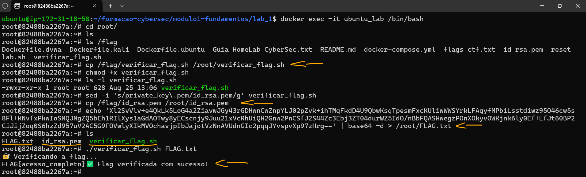
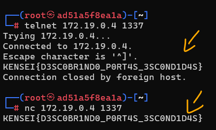

# Formação Cybersec - Labs Módulo 1   

### Repository: [boot](../../../../)   
### Platform: <a href="../../../">vnw   </a>
### Software/Subject: <a href="../../">cybersecurity   </a>
### Bootcamp: <a href="../">boot_035 (Formação Cybersec)   </a>
### Module: 1. Fundamentos de Cibersegurança

#### <a href="./README.md">Teoria</a>

---

Esta pasta refere-se aos laboratórios do módulo 1 **Fundamentos de Cibersegurança** do bootcamp [**Formação Cybersec**](../).

### Theme:
- Cybersecurity

### Used Tools:
- Operating System (OS): 
  - Linux   
  - Windows 11   
- Linux Distribution:
  - Ubuntu   
- Cloud:
  - AWS   
- Cloud Services:
  - Amazon Elastic Compute Cloud (EC2)   
  - Google Drive   
- Containerization: 
  - Docker   
  - Docker Compose   
- Language:
  - HTML   
  - Markdown   
- Integrated Development Environment (IDE) and Text Editor:
  - Visual Studio Code (VS Code)   
- Versioning: 
  - Git   
- Repository:
  - GitHub   
- Command Line Interpreter (CLI):
  - AWS Command Line Interface (CLI)   
  - Bash e Sh   
- Tools:
  - Advanced Package Tool (Apt)   
  - Advanced Package Tool (Apt-Get)   
  - Curl   
- Network:
  - Arp-scan   
  - Domain Information Groper (Dig)   
  - ifconfig   
  - ip address   
  - ipconfig   
  - iproute   
  - iputils-ping; Iputils   
  - Netcat (nc)   
  - Netdiscover   
  - net-tools   
  - Network Mapper (Nmap)   
  - Npcap   
  - nslookup   
  - OpenSSH   
  - OpenSSL   
  - pfSense   
  - ping   
  - Rustscan   
  - snmpwalk   
  - tcpdump   
  - Telnet   
  - traceroute   
  - tshark   
  - Wireshark   
- Remote Desktop:
  - RealVNC Viewer   
  - TightVNC Server   
- Cibersecurity:
  - CyberChef   
  - Damn Vulnerable Web Application (DVWA)   
  - enum4linux   
  - gobuster   
  - Greenbone Community Edition (GCE)   
  - Greenbone Security Assistant (GSA)   
  - Kali Linux   
  - Metasploit   
  - Nikto   
  - OpenSSL   
  - Open Vulnerability Assessment System (OpenVAS)   
  - sha256sum   
- Cryptography:
  - GNU Privacy Guard (GPG)   
  - GNU Privacy Guard (GnuPG)   
  - GPG Suite   
  - HashTab   
  - keys.openpgp   
  - Kleopatra   
  - Online Tools   
  - Pretty Good Privacy (PGP)   
  - PGP Desktop   
  - sha256sum   
  - WinHasher   
- SysAdm:
  - Xfce   

---

### Bootcamp Module 1 Structure
1. <a name="item1">Módulo 1: Fundamentos de Cibersegurança<br>
    1.1. <a href="#item1.1">Setup e Preparação do Ambiente</a><br>
    1.2. <a href="#item1.2">Modelo CIA (Confidencialidade, Integridade, Disponibilidade)</a><br>
    1.3. <a href="#item1.3">Ameaças, ataques e vulnerabilidades</a><br>
    1.4. <a href="#item1.4">Reconhecimento & Footprinting</a><br>
    1.5. <a href="#item1.5">Infraestrutura de Rede - Conceitos e Componentes</a><br>
    1.6. <a href="#item1.6">Ferramentas: Kali Linux, Nmap, Wireshark</a><br>
    1.7. <a href="#item1.7">Endereçamento IP & Subnetting</a><br>
    1.8. <a href="#item1.8">Seu Dojo de Ataque no Kali Linux (CLI & GUI)</a><br>
    1.9. <a href="#item1.9">Ports/Portas</a><br>
    1.10. <a href="#item1.10">Desvendando SMB e SNMP: Os Pilares e as Fraquezas da Rede</a><br>
    1.11. <a href="#item1.11">Introdução a Scanners de Vulnerabilidade com OpenVAS/Greenbone</a><br>
    1.12. <a href="#item1.12">Documentação Técnica Profissional</a><br>

---

### Objective:
Estabelecer uma base técnica sólida em redes, sistemas operacionais e nos princípios da segurança ofensiva e defensiva, com foco na aplicação prática de conceitos fundamentais de segurança, como o modelo CIA, Cyber Kill Chain e MITRE ATT&CK. O módulo também aborda técnicas essenciais de cibersegurança, incluindo análise de tráfego (**Wireshark**), reconhecimento e OSINT, escaneamento (**Nmap**) e enumeração de serviços.

### Folder Structure:
- [README.md](./README.md): Documento escrito em **Markdown** descrevendo todo conteúdo teórico realizado neste módulo.
- [labs.md](./labs.md): Este documento de README, escrito em **Markdown**, descrevendo todos os laboratórios realizados neste módulo.

### Development:
Em cibersegurança, é prática comum e recomendada realizar laboratórios em ambientes controlados e seguros. Por isso, ferramentas como **Docker** ou máquinas virtuais são utilizadas para simular ambientes reais, protegendo a infraestrutura local, uma vez que o uso de ferramentas de ataque ou alterações em configurações de rede podem comprometer a integridade do sistema. O ambiente de laboratório é estruturado em duas partes: a primeira envolve a instalação dos softwares que virtualização um ambiente, como **WSL2**, **Docker** ou **VM VirtualBox**, além de ferramentas de suporte essenciais, como editores de código (**Visual Studio Code (VS Code)**) e sistemas de versionamento (**Git**).  

Neste curso, a virtualização do ambiente foi realizada principalmente com **Docker** em conjunto com **WSL**. No entanto, para a maioria dos labs utilizei o **Docker** em instâncias do **Amazon Elastic Compute Cloud (EC2)**, na nuvem da **Amazon Web Services (AWS)**, como alternativa de execução. Em pequenos casos, para realizar testes, a plataforma **Play With Docker (PWD)** também foi utilizada.

A criação da instância EC2 foi automatizada por meio do script [`ec2Instance.ps1`](../environment/ec2Instance.ps1), desenvolvido em **Windows PowerShell** utilizando comandos da **AWS Command Line Interface (CLI)**. O script está localizado na pasta [`environment`](../environment/) deste curso, pois foi o mesmo para todos os módulos. A instância foi provisionada com a imagem `ami-020cba7c55df1f615`, baseada no sistema operacional **Linux Ubuntu**, associada a um volume do **Amazon Elastic Block Store (EBS)** de `8 GB`, do tipo `gp` (General Purpose). O tipo de instância utilizado foi o `t3.medium`, com 2 vCPUs e 4 GB de memória. Para acesso, foi utilizado o par de chaves `keyPairUniversal`, previamente existente na conta da **AWS**, e o grupo de segurança atribuído à instância foi o `default` da zona de disponibilidade `us-east-1a` (Norte da Virgínia). Um script de *user data* foi utilizado para automatizar a instalação do **Git** e do **Docker** durante o processo de inicialização.

O acesso à instância podia ser feito tanto pelo console da **AWS** quanto por meio de conexão SSH utilizando o **OpenSSH** no **Windows PowerShell** da máquina local. Neste último caso, era necessário informar o caminho do arquivo de chave privada, o nome do usuário do sistema e o IP ou DNS público da instância. Um exemplo de comando seria: `ssh -i "G:/Meu Drive/4_PROJ/scripts/aws/.default/secrets/awsKeyPair/universal/keyPairUniversal.pem" ubuntu@54.160.249.118`. Além disso, o Security Group associado à instância precisava conter uma regra de entrada liberando a porta `22` para o IP público da máquina física, a fim de permitir o estabelecimento da conexão SSH. As máquinas virtuais do **Play With Docker (PWD)** também foram acessadas via SSH. Nesse caso, o próprio ambiente fornecia o comando necessário para a conexão, que podia ser executado diretamente no **Windows PowerShell**, sem necessidade de autenticação com chave privada ou senha.

A segunda parte do ambiente de laboratório consiste na construção do ambiente simulado propriamente dito. No caso do **Docker**, isso envolve a criação de containers, redes e volumes, realizada por meio de dois tipos principais de arquivos. O primeiro é o `docker-compose.yml`, que define de forma serial toda a estrutura a ser criada: quais e quantos containers, suas configurações, as imagens que irão utilizar e os volumes e redes que serão estabelecidos. O segundo tipo de arquivo, que pode existir mais de um por laboratório, são os `Dockerfile`, responsáveis por criar imagens específicas para cada container. Essas imagens podem ser enviadas a repositórios de imagens **Docker**, como o **DockerHub**, ou referenciadas diretamente no arquivo do **Docker Compose**.

Todos esses arquivos eram preparados pelo instrutor do curso e disponibilizados no [repositório](https://github.com/Kensei-CyberSec-Lab/formacao-cybersec/) do curso no perfil da plataforma **Vai na Web** no **GitHub**. O repositório era organizado pelos três módulos do curso, com pastas correspondentes a cada laboratório. Geralmente, o número do laboratório coincidia com o número da aula, embora nem todos os labs seguissem essa sequência e nem todas as aulas tivessem laboratórios. Em cada pasta de laboratório, além dos arquivos `docker-compose.yml` e `Dockerfile`, podiam existir arquivos complementares, como scripts, textos ou documentos **Markdown**, contendo informações relevantes ou conteúdos necessários para a execução do lab. Durante a realização de cada lab, além de executar os exercícios, foi feita uma explicação detalhada sobre a construção dos arquivos de **Docker Compose**,  **Docker** e as dependências utilizadas, evidenciando como o ambiente foi estruturado.

Para executar os arquivos e iniciar o ambiente de laboratório, a sequência de comandos utilizada era a seguinte:
- `git clone https://github.com/Kensei-CyberSec-Lab/formacao-cybersec.git`: Clonagem do repositório do bootcamp para o ambiente local, seja no **WSL**, em máquinas virtuais ou, como no meu caso, em instâncias **Amazon EC2**.
- `cd formacao-cybersec/modulo1-fundamentos/lab_1`: Navegação até o diretório do laboratório a ser executado. Para outros labs, bastava alterar as duas últimas pastas do caminho para o módulo e lab correspondentes.
- `docker compose up -d`: Inicialização do ambiente com **Docker Compose**. Este comando deve ser executado na pasta onde o arquivo `docker-compose.yml` está localizado.
- `docker ps` e `docker network ls`: Verificação dos containers ativos e das redes existentes no ambiente.
- `docker exec -it kali /bin/bash`: Acesso a um container em execução. Basta substituir `kali` pelo nome do container que se deseja acessar.
- `docker compose down`: Encerramento do ambiente. Assim como na inicialização, este comando deve ser executado na pasta onde se encontra o arquivo `docker-compose.yml`.
- `docker system prune -f`: Remoção containers parados, redes não usadas, imagens dangling (imagens sem tags) e caches de build.
- `docker system prune -a`: Remoção containers parados, redes não usadas, imagens dangling (imagens sem tags) e caches de build, além de remoção de todas as imagens não usadas por containers.

Os laboratórios de cibersegurança são organizados com máquinas de ataque, geralmente uma **Kali Linux**, e máquinas alvo ou de defesa, que são os sistemas onde os ataques são realizados. Pode haver múltiplas máquinas de cada tipo, sendo comum que algumas máquinas de defesa sejam propositalmente vulneráveis, incluindo aplicações web criadas para testes. Como o ambiente é simulado via **Docker**, termos como servidor, máquina, container ou host frequentemente se referem aos containers que representam as máquinas simuladas. Além disso, é importante ter em mente que existem outras duas camadas no ambiente: a máquina física, no caso meu computador pessoal **Windows**, e a máquina virtual fornecida pela **AWS** ou pelo **Play With Docker (PWD)**, que hospeda e executa os containers do **Docker**.

Outra parte importante dos laboratórios foram os *Capture The Flag (CTF)*, desafios técnicos amplamente utilizados na área de cibersegurança para desenvolver e validar conhecimento prático. Cada desafio apresenta um cenário específico — como exploração de vulnerabilidades, análise de tráfego, OSINT ou engenharia reversa — e exige que o participante realize uma ação ou resolva um problema para obter a flag. A flag não se limita a uma string ou código a ser encontrado, ela representa a prova de que o objetivo do desafio foi cumprido com sucesso. Ao longo dos laboratórios do curso, diversos CTFs foram incorporados ao ambiente simulado, servindo como etapas práticas de validação do conteúdo e permitindo aplicar, de forma objetiva, os conceitos aprendidos. Dessa forma, os laboratórios não apenas simularam cenários reais de ataque e defesa, como também proporcionaram desafios progressivos que reforçaram o raciocínio lógico, a análise técnica e a consolidação do conhecimento.

<a name="item1.1"><h4>1.1 Setup e Preparação do Ambiente</h4></a>[Back to summary](#item1)   
[Configuração do Ambiente de Laboratório](README.md#item1.1)

Na primeira aula não houve um laboratório prático, pois o foco esteve na explicação de como configurar o ambiente de laboratório. Essa preparação foi apresentada em conjunto com a parte teórica e registrada no arquivo README do módulo 1.

<a name="item1.2"><h4>1.2 Modelo CIA (Confidencialidade, Integridade, Disponibilidade)</h4></a>[Back to summary](#item1)   
[Material do Lab](https://github.com/Kensei-CyberSec-Lab/formacao-cybersec/tree/main/modulo1-fundamentos/lab_1)

Obs.: Laboratório registrado como 1, mas documento como #NãoInformado (3) e referente a aula 2.

<details><summary><strong>Ambiente de Laboratório</strong></summary>
  <ul>
    <li><details><summary><strong>Docker Compose</strong></summary>
        <ul>
          <li><details><summary><strong>ubuntu_lab:</strong></summary>
            <ul>
              <li><strong>build:</strong> Define que a imagem do container será construída a partir do diretório atual (`.`) utilizando o arquivo `Dockerfile.ubuntu` como receita de construção.</li>
              <li><strong>container_name:</strong> Define o nome do container de forma explícita como `ubuntu_lab`.</li>
              <li><code>entrypoint: ["/bin/bash", "-c"]</code>: Sobrescreve o ponto de entrada padrão do container, garantindo que o shell <strong>Bash</strong> seja usado para interpretar os comandos passados pelo <code>command</code>.</li>
              <li><code>command: bash -c "\ ... "</code>: Sobrescreve o comando padrão do container para executar uma sequência de instruções durante a inicialização:
                <ul>
                  <li><code>apt update && apt install -y iputils-ping openssl</code>: atualiza os repositórios e instala ferramentas básicas (<strong>ping</strong> e <strong>OpenSSL</strong>).</li>
                  <li><code>cp /flag/id_rsa.pem /root/id_rsa.pem</code>: copia um arquivo de chave privada para o diretório <code>/root</code>, simulando uma credencial sensível presente na máquina.</li>
                  <li><code>echo '&lt;base64&gt;' | base64 -d &gt; /root/FLAG.txt</code>: decodifica uma string Base64 e grava o conteúdo no arquivo <code>/root/FLAG.txt</code>, que representa a flag a ser encontrada no laboratório.</li>
                  <li><code>bash</code>: mantém o container ativo com um shell interativo após executar os comandos anteriores.</li>
                </ul>
              </li>
              <li><strong>volumes:</strong> <code>.:/flag:ro</code> - monta o diretório local do lab dentro do container como somente leitura, permitindo que arquivos (como a chave privada usada na cópia acima) fiquem disponíveis no container.</li>
              <li><strong>tty:</strong> <code>true</code> - permite alocar um terminal interativo, facilitando o acesso ao container via <code>docker exec -it</code>.</li>
              <li><strong>networks:</strong> conecta o container à rede <code>cyberlab</code> e define o IP estático <code>172.28.1.10</code> dentro dessa rede.</li>
            </ul>
          </details></li>
          <li><details><summary><strong>kali_lab:</strong></summary>
            <ul>
              <li><strong>build:</strong> Define que a imagem do container será construída a partir do diretório atual (`.`) utilizando o arquivo <code>Dockerfile.kali</code> como receita de construção.</li>
              <li><strong>container_name:</strong> Define o nome do container de forma explícita como <code>kali_lab</code>.</li>
              <li><code>tty: true</code>: Permite alocar um terminal interativo, facilitando o acesso ao container via <code>docker exec -it</code> e mantendo-o ativo.</li>
              <li><strong>cap_add:</strong> Adiciona capacidades especiais ao container, ampliando o controle sobre a rede e pacotes:
                <ul>
                  <li><code>NET_ADMIN</code>: Permite executar comandos de administração de rede dentro do container (ex: configuração de interfaces, roteamento, etc.).</li>
                  <li><code>NET_RAW</code>: Permite a criação de pacotes de rede brutos, essencial para testes e ataques de cibersegurança.</li>
                </ul>
              </li>
              <li><strong>security_opt:</strong>
                <ul>
                  <li><code>seccomp:unconfined</code>: Desativa o perfil de segurança padrão <em>seccomp</em>, permitindo que o container execute operações normalmente restritas por segurança.</li>
                </ul>
              </li>
              <li><strong>networks:</strong> Conecta o container à rede <code>cyberlab</code> e define o IP estático <code>172.28.1.20</code> dentro dessa rede.</li>
            </ul>
          </details></li>
          <li><details><summary><strong>dvwa_lab:</strong></summary>
            <ul>
              <li><strong>build:</strong> Define que a imagem do container será construída a partir do diretório atual (`.`) utilizando o arquivo <code>Dockerfile.dvwa</code> como receita de construção.</li>
              <li><strong>container_name:</strong> Define o nome do container de forma explícita como <code>dvwa_lab</code>.</li>
              <li><strong>ports:</strong>
                <ul>
                  <li><code>"8080:80"</code>: Mapeia a porta 80 do container (onde o servidor web DVWA roda) para a porta 8080 da máquina host, permitindo acessar a aplicação via navegador.</li>
                </ul>
              </li>
              <li><strong>environment:</strong>
                <ul>
                  <li><code>MYSQL_PASS=p@ssw0rd</code>: Define a variável de ambiente que configura a senha do banco de dados MySQL utilizado pelo DVWA.</li>
                </ul>
              </li>
              <li><strong>networks:</strong> Conecta o container à rede <code>cyberlab</code> e define o IP estático <code>172.28.1.30</code> dentro dessa rede.</li>
            </ul>
          </details></li>
          <li><details><summary><strong>cyberlab:</strong></summary>
            <ul>
              <li><code>driver: bridge</code>: Define que a rede é do tipo <em>bridge</em>, funcionando como um switch virtual interno que conecta os containers entre si dentro do mesmo host, permitindo comunicação isolada entre eles.</li>
              <li><strong>ipam:</strong>
                <ul>
                  <li><strong>config:</strong>
                    <ul>
                      <li><code>subnet: 172.28.0.0/16</code>: Define o intervalo de endereços IP disponíveis na rede, permitindo atribuição de IPs estáticos ou automáticos aos containers conectados.</li>
                    </ul>
                  </li>
                </ul>
              </li>
            </ul>
          </details></li>
        </ul>
      </details></li>
    <li><details><summary><strong>Dockerfile</strong></summary>
      <ul> 
        <li><details><summary><strong>Dockerfile.ubuntu</strong></summary>
          <ul>
            <li><code>FROM ubuntu:20.04</code>: Define a imagem base do container como Ubuntu 20.04.</li>
            <li><code>RUN apt update && apt install -y iputils-ping net-tools iproute2</code>: Atualiza os repositórios e instala ferramentas essenciais de rede, como <strong>ping</strong>, <strong>net-tools</strong> e <strong>iproute2</strong>.</li>
            <li><code>CMD ["bash"]</code>: Define o comando padrão do container, iniciando um shell interativo <strong>Bash</strong> quando o container é executado.</li>
          </ul>
        </details></li>
        <li><details><summary><strong>Dockerfile.kali</strong></summary>
            <ul>
              <li><code>FROM kalilinux/kali-rolling:latest</code>: Define a imagem base do container como a versão mais recente do Kali Linux Rolling.</li>
              <li><code>RUN echo 'deb http://http.kali.org/kali kali-rolling main contrib non-free non-free-firmware' > /etc/apt/sources.list</code>: Configura os repositórios oficiais do Kali Linux para permitir a instalação de pacotes.</li>
              <li><code>RUN</code>:
                <ul>
                  <li><code>apt update</code>: Atualiza os repositórios do sistema, garantindo que a lista de pacotes disponíveis esteja atualizada.</li>
                  <li><code>apt install -y iputils-ping net-tools curl nmap dnsutils tcpdump wireshark netcat-traditional whois iproute2</code>: Instala os pacotes essenciais para testes de rede e segurança.</li>
                  <li><code>apt clean && rm -rf /var/lib/apt/lists/*</code>: Limpa o cache de pacotes e remove listas temporárias para reduzir o tamanho da imagem.</li>
                </ul>
              </li>
              <li><code>CMD ["bash"]</code>: Define o comando padrão do container, iniciando um shell interativo <strong>Bash</strong> quando o container é executado.</li>
            </ul>
        </details></li>
        <li><details><summary><strong>Dockerfile.dvwa</strong></summary>
          <ul>
            <li><code>FROM vulnerables/web-dvwa:latest</code>: Define a imagem base do container como a versão mais recente do DVWA (Damn Vulnerable Web Application), pronta para testes de segurança.</li>
            <li><code>RUN echo 'FLAG{sql_injection_realizada_com_sucesso}' &gt; /var/www/html/flag.txt</code>: Cria um arquivo de flag dentro do container, simulando um objetivo que o participante precisa encontrar durante o laboratório.</li>
            <li><code>CMD ["bash"]</code>: Define o comando padrão do container, iniciando um shell interativo <strong>Bash</strong> quando o container é executado.</li>
          </ul>
        </details></li>
      </ul>
    </details></li>
  </ul>
</details>

Como a primeira aula foi voltada à preparação do ambiente de laboratório, os laboratórios começaram de fato a partir da aula 2. O primeiro lab teve como objetivo fornecer um overview de como os laboratórios de cibersegurança seriam conduzidos ao longo do curso, apresentando os tipos de máquinas normalmente utilizados – neste caso, simuladas por containers. Foram apresentados três tipos distintos:  
- uma máquina de ataque, baseada no **Kali Linux**, sistema operacional amplamente utilizado para testes ofensivos e análise de segurança;  
- um servidor **Ubuntu**, representando uma máquina comum presente em ambientes corporativos; e  
- a aplicação web vulnerável **Damn Vulnerable Web Application (DVWA)**, utilizada para estudos e testes de exploração.

Cada container possuía uma flag que precisava ser capturada. A primeira flag consistia em localizar o arquivo `/root/FLAG.txt` dentro do container **Ubuntu** e descriptografar seu conteúdo através da execução do arquivo de script `verificar_flag.sh` que utilizava o arquivo de chave privada `id_rsa.pem` para descriptografia. A segunda flag exigia o uso da máquina atacante (**Kali Linux**) para identificar a rede interna utilizada pelos containers, realizar uma varredura e descobrir quais hosts estavam ativos, identificando o endereço IP do container que executava o **DVWA**. Por fim, a terceira flag tinha como objetivo acessar a aplicação **DVWA** pelo navegador e executar uma injeção SQL simples, comprovando a exploração com sucesso.

Com o ambiente deste laboratório configurado, o container `ubuntu_lab` foi acessado utilizando o comando `docker exec -it ubuntu_lab /bin/bash`. Dentro do container, no diretório `/root`, foi executado o comando `ls` para listar os arquivos presentes. O primeiro arquivo encontrado foi o `id_rsa.pem`, que havia sido copiado da máquina host, a instância **Amazon EC2**, para o container por meio de um volume montado pelo **Docker Compose** (`.:/flag:ro`). Esse volume mapeava o diretório local do host para o ponto de montagem `/flag` no container, garantindo que todo conteúdo do diretório do host fosse sincronizado com o container e vice-versa. A partir desse ponto de montagem, o arquivo `id_rsa.pem` foi copiado para o diretório `/root` do container usando o comando `cp`.

O outro arquivo presente no diretório `/root` do container era o `FLAG.txt`, criado a partir da decodificação de uma string em **Base64**, resultando em um código binário cifrado, conhecido como ciphertext. Esse ciphertext correspondia à mensagem original (plaintext) — neste caso, a flag do container — que foi criptografada previamente utilizando a chave pública do par de chaves. O par de chaves, composto pela chave pública e pela chave privada, foi gerado antes da criptografia da mensagem, empregando o algoritmo de criptografia **RSA**. Entretanto, isso já tinha sido realizado pelo instrutor do curso.

Para acessar a flag contida no ciphertext e visualizar a mensagem original (plaintext), foi necessário realizar o processo de descriptografia. O instrutor forneceu, na pasta do laboratório, o script `verificar_flag.sh`, que primeiramente verificava se um arquivo de flag foi informado como argumento, depois checava se tanto o arquivo da flag quanto o arquivo da chave privada existiam no diretório corrente, e finalmente executa o comando `openssl rsautl -decrypt -inkey "$KEY_FILE" -in "$FLAG_FILE" 2>/dev/null`. Esse comando utilizava o **OpenSSL** para descriptografar a flag com a chave privada, descartando mensagens de erro para que apenas a saída descriptografada, ou seja, a flag, fosse exibida.

Para que o script funcionasse, foi necessário realizar algumas ações. Primeiro, copiar o arquivo `verificar_flag.sh` do ponto de montagem `/flag` no container para o diretório `/root` com o comando `cp /flag/verificar_flag.sh /root/verificar_flag.sh`. Em seguida, dar permissão de execução ao arquivo usando `chmod +x verificar_flag.sh` e verificar as permissões com `ls -l verificar_flag.sh`. Também foi necessário alterar a variável `KEY_FILE` dentro do `verificar_flag.sh` de `private_key.pem` para `id_rsa.pem`, correspondente ao nome real do arquivo de chave privada, utilizando o comando `sed -i 's/private_key\.pem/id_rsa.pem/g' verificar_flag.sh`. Por fim, o software **OpenSSL** precisou ser instalado no container, pois o script utilizava, sendo a instalação realizada com `apt update && apt install -y openssl`.

Dessa forma, os três arquivos necessários — a flag, a chave privada e o script — estavam corretos e centralizados na pasta `/root` dentro do container. Caso, por algum erro do **Docker Compose**, os arquivos `id_rsa.pem` e `FLAG.txt` não fossem copiados ou gerados na pasta `/root`, esse processo precisava ser feito manualmente. Primeiro, o arquivo `id_rsa.pem` foi copiado para `/root` com o comando `cp /flag/id_rsa.pem /root/id_rsa.pem`. Em seguida, com o comando em **Bash** abaixo, o conteúdo em **Base64** era decodificado e salvo no arquivo `FLAG.txt` dentro do diretório `/root`. Assim, foi possível executar o script que descriptografava o conteúdo com `./verificar_flag.sh FLAG.txt`. A imagem 01 exibe a mensagem original da flag.

```bash
echo 'Xl2SvVlv+e4QkLk5LoG4a2ZiavwJGy43rGDHwnCwZnpYLJ02pZvk+ihTMqFkdD4U9QbwKsqTpesmFxcKUliwWWSYrkLFAgyfMPbiLsstdiwz95O46cw5s8Fl+KNvfxPkwIoSMQJMgZQ5bEh1RIlXys1aGdAOTwy8yECscnjy9Juu21xVcRhUiQH2Gnw2PnCSfJ2S44Zc3Ebj3ZT04durWZ5IdO/nBbFQASHwegzPOnXOkyvOWKjnk6ly0Ef+LfJt60BP2CiJijZoq0S6hzZd957uV2AC5G9FOVwlyXIkMVOchavjpIbJajotVzNnAVUdnGIc2pqqJYvspvXp97zHrg==' | base64 -d > /root/FLAG.txt
```

<div align="center"><figure>
    <br>
    <figcaption>Imagem 01.</figcaption>
</figure></div><br>

Para efeito didático desta questão de criptografia, o processo de descriptografia foi novamente realizado, agora utilizando o site [CyberChef](https://gchq.github.io/CyberChef/). O **CyberChef** é uma ferramenta online que permite realizar operações de codificação, decodificação, criptografia, descriptografia e transformação de dados de forma visual, arrastando “receitas” de funções. É amplamente utilizada para análise de dados, segurança da informação e manipulação de formatos sem necessidade de programação.

No `Input`, foi inserida a string em **Base64** abaixo, visualizada no **Docker Compose**. Na `Recipe`, primeiro aplicou-se `From Base64` para decodificar o conteúdo de **Base64** para ciphertext (código binário cifrado). Em seguida, foi adicionado o `RSA Decrypt`, já que o algoritmo de criptografia do par de chaves era **RSA**. Configurou-se `RSA Private Key (PEM)` com o conteúdo do arquivo de chave privada `id_rsa.pem`, mantendo o `Key Password` vazio, pois o par de chaves foi construído sem senha, e selecionou-se `RSAES-PKCS1-V1_5` em `Encryption Scheme`. Dessa forma, o output forneceu a mensagem original da flag: `FLAG{acesso_completo}`, conforme ilustrado na imagem 02.

```base64
Xl2SvVlv+e4QkLk5LoG4a2ZiavwJGy43rGDHwnCwZnpYLJ02pZvk+ihTMqFkdD4U9QbwKsqTpesmFxcKUliwWWSYrkLFAgyfMPbiLsstdiwz95O46cw5s8Fl+KNvfxPkwIoSMQJMgZQ5bEh1RIlXys1aGdAOTwy8yECscnjy9Juu21xVcRhUiQH2Gnw2PnCSfJ2S44Zc3Ebj3ZT04durWZ5IdO/nBbFQASHwegzPOnXOkyvOWKjnk6ly0Ef+LfJt60BP2CiJijZoq0S6hzZd957uV2AC5G9FOVwlyXIkMVOchavjpIbJajotVzNnAVUdnGIc2pqqJYvspvXp97zHrg==
```

<div align="center"><figure>
    <br>
    <figcaption>Imagem 02.</figcaption>
</figure></div><br>

Para capturar a segunda flag, foi necessário encerrar o acesso ao container `ubuntu_lab` e, em seguida, executar o comando `docker exec -it kali_lab /bin/bash`, acessando a máquina de ataque. Embora o **Docker Compose** já revelasse os IPs da rede e dos hosts, o procedimento foi conduzido como se essas informações não fossem conhecidas. Assim, utilizou-se o comando `ip a` para listar as interfaces de rede existentes. Caso a ferramenta **IP** não estivesse disponível, o mesmo resultado poderia ser obtido com o comando `ifconfig`. 

Apenas duas interfaces foram identificadas: uma era o loopback (`lo`), que é utilizada internamente pelo sistema, e a outra, `eth0`, possuía o IP `172.28.1.20` e a máscara de rede `255.255.0.0`. Dessa forma, foi possível concluir que o CIDR da rede à qual essa interface estava conectada era `172.28.0.0/16`. Com base nisso, foi executado `nmap -sn 172.28.0.0/16` para mapear os hosts ativos. Como os containers estavam na mesma rede, o escaneamento revelou os endereços `172.28.1.10` para o servidor **Ubuntu** e `172.28.1.30` para o container da aplicação vulnerável **DVWA**. A imagem 03 exibe a saída do **Nmap**, confirmando a descoberta do IP associado à aplicação **DVWA**.

<div align="center"><figure>
    <br>
    <figcaption>Imagem 03.</figcaption>
</figure></div><br>

A última flag foi obtida de forma diferente, pois, em vez de acessar diretamente o container da aplicação vulnerável **DVWA**, a interação ocorreu via navegador na máquina física. Isso foi possível porque o container `dvwa_lab` estava configurado com um port forward: o tráfego da porta `80` do container era redirecionado para a porta `8080` do host, no caso, a instância **Amazon EC2**. Assim, a aplicação executava internamente na porta `80`, mas ficava disponível externamente pela porta `8080` da EC2. Para permitir o acesso, foi necessário criar uma regra de entrada no security group associado à instância, liberando a porta `8080` apenas para o IP público da máquina física **Windows**. Dessa forma, apenas minha máquina conseguia acessar a aplicação **DVWA** pelo navegador utilizando o IP ou DNS público da instância EC2 na porta `8080`, como mostrado na imagem 04.

<div align="center"><figure>
    <br>
    <figcaption>Imagem 04.</figcaption>
</figure></div><br>

A primeira tela exibida era a de login, onde era necessário informar usuário e senha para acessar a aplicação. As credenciais foram encontradas nos arquivos de instrução do laboratório, indicando que para o usuário `admin` a senha era `password`. Após o login, o próprio **DVWA** sugeria configurar o banco de dados clicando na opção `Create / Reset Database`. Independentemente de o banco de dados já existir ou não, ele seria configurado ou redefinido, e seria necessário efetuar o login novamente. O objetivo deste laboratório não é se aprofundar na aplicação **DVWA**, mas, para contextualizar, segue abaixo uma breve explicação sobre a ferramenta fornecida por ela própria:

> Damn Vulnerable Web Application (DVWA) é uma aplicação web PHP/MySQL extremamente vulnerável. Seu principal objetivo é auxiliar profissionais de segurança a testar suas habilidades e ferramentas em um ambiente legal, ajudar desenvolvedores web a entender melhor os processos de proteção de aplicações web e auxiliar alunos e professores a aprender sobre segurança de aplicações web em um ambiente de sala de aula controlado.

> O objetivo do DVWA é praticar algumas das vulnerabilidades web mais comuns, com vários níveis de dificuldade, com uma interface simples e direta. Observe que existem vulnerabilidades documentadas e não documentadas neste software. Isso é intencional. Você é incentivado a tentar descobrir o máximo de problemas possível.

O objetivo desta terceira flag era executar um ataque de injeção SQL simples e, ao obter sucesso, criar um arquivo de flag dentro do container em `/var/www/html/flag3.txt` contendo a mensagem `FLAG{sql_injection_realizada_com_sucesso}`, comprovando a efetividade do ataque. Para isso, o banco de dados foi criado e o login na aplicação **DVWA** foi realizado novamente. No painel à esquerda havia diversas opções de ataques, incluindo SQL Injection. Antes de iniciar o ataque, foi verificado se o nível de segurança estava configurado como `low`; caso contrário, era necessário ajustá-lo na seção `DVWA Security`. Nessa seção, em `Security Level`, estavam disponíveis outros três níveis de segurança além do `low`.

Com essa configuração, o ataque de SQL Injection foi iniciado acessando a seção `SQL Injection`. No campo `User ID`, foi informado o valor `1` e o formulário enviado. A aplicação retornou três informações, conforme mostrado na imagem 05, revelando que o usuário com ID `1` possuía o primeiro nome (`First name`) `admin` e o sobrenome (`Surname`) `admin`. Um ataque de injeção SQL ocorre quando um usuário malicioso insere comandos SQL em campos de entrada de dados, de forma que o sistema execute essas instruções no banco de dados. No contexto deste laboratório, o ataque permitiu acessar informações sensíveis.

<div align="center"><figure>
    <br>
    <figcaption>Imagem 05.</figcaption>
</figure></div><br>

Este ataque testou o pilar da *Confidencialidade* da tríade CIA, mostrando como informações sensíveis podem ser expostas indevidamente. Outro ataque que também impacta esse mesmo pilar é o *Cross-Site Scripting (XSS)*, que permite a execução de scripts maliciosos no navegador da vítima. Neste laboratório, o ataque XSS refletido foi realizado na seção `XSS (Reflected)` da aplicação, inserindo no único campo disponível (`What's your name?`) o código `<script>alert(document.cookie)</script>` e enviando o formulário. Ao injetar esse script, o navegador executou o **JavaScript** e exibiu em um pop-up os cookies da sessão, conforme evidenciado na imagem 06.  

<div align="center"><figure>
    <br>
    <figcaption>Imagem 06.</figcaption>
</figure></div><br>

O comando `document.cookie` em **JavaScript** acessa todos os cookies armazenados pelo navegador para o site que está sendo visitado, neste caso, a aplicação **DVWA**. Cookies são pequenos arquivos de dados que armazenam informações como ID de sessão, preferências do usuário, tokens de autenticação, entre outros. No contexto deste laboratório, os cookies que puderam ser capturados foram:  
- Cookies do **Google Analytics** (se presentes na aplicação DVWA): `_ga, _gid, _ga_LMD5`, entre outros.  
- Cookie de sessão PHP (responsável por manter o usuário autenticado): `PHPSESSID=u1nnhccpl3h015lmk8o6i2mp87`.  
- Cookie que indica o nível de segurança configurado da DVWA (intencionalmente vulnerável, definido como Low): `security=low`.  

Para testar o pilar da *Integridade*, foi executado um ataque de *XSS armazenado (Stored XSS)* na seção `XSS (Stored)`. No campo `Name` foi inserido um nome qualquer (`John`) e no campo `Message` uma mensagem aleatória (`Message`), enviando o formulário com a opção `Sign Guestbook`. Esses dados foram armazenados diretamente no banco de dados sem qualquer autenticação ou validação, conforme mostrado na imagem 07, evidenciando a falta de controle sobre quem poderia inserir informações. Isso significa que qualquer usuário poderia registrar dados arbitrários, inclusive conteúdos maliciosos, comprometendo a integridade das informações armazenadas.

<div align="center"><figure>
    <br>
    <figcaption>Imagem 07.</figcaption>
</figure></div><br>

O último pilar da tríade CIA é a *Disponibilidade*, que neste laboratório foi testada ao encerrar o container da aplicação **DVWA** (`docker stop dvwa_lab`), confirmando que a aplicação não estava mais acessível e, portanto, as informações contidas nela não podiam ser obtidas. Antes desse teste, ainda era necessário criar a flag dentro do container para comprovar que o ataque de SQL Injection havia sido realizado com sucesso. Para isso, o container foi acessado com o comando `docker exec -it dvwa_lab /bin/bash`. Dentro dele, o diretório corrente foi alterado para `/var/www/html` (`cd /var/www/html`) e o arquivo de flag foi criado com o comando `echo 'FLAG{sql_injection_realizada_com_sucesso}' > flag3.txt`. A imagem 08 mostra tanto a flag criada com sucesso como o container interrompido posteriormente.

<div align="center"><figure>
    <br>
    <figcaption>Imagem 08.</figcaption>
</figure></div><br>

<a name="item1.3"><h4>1.3 Ameaças, ataques e vulnerabilidades</h4></a>[Back to summary](#item1)   
[Material do Lab](https://github.com/Kensei-CyberSec-Lab/formacao-cybersec/tree/main/modulo1-fundamentos/lab_2) 

Obs.: Laboratório registrado como 2, mas documento como #NãoInformado (4) e referente a aula 3.

<details><summary><strong>Ambiente de Laboratório</strong></summary>
  <ul>
    <li><details><summary><strong>Docker Compose</strong></summary>
        <ul>
          <li><details><summary><strong>target:</strong></summary>
            <ul>
              <li><strong>build:</strong> Define que a imagem do container será construída a partir do diretório <code>./target</code> utilizando o arquivo <code>Dockerfile</code> presente nesse diretório.</li>
              <li><strong>container_name:</strong> Define o nome do container de forma explícita como <code>lab_target</code>.</li>
              <li><strong>ports:</strong>
                <ul>
                  <li><code>"8000:80"</code>: Mapeia a porta 80 do container (onde a aplicação Python roda) para a porta 8000 da máquina host, permitindo acesso via navegador ou ferramentas externas.</li>
                </ul>
              </li>
              <li><strong>networks:</strong> Conecta o container à rede <code>labnet</code>, permitindo comunicação interna com outros containers conectados à mesma rede.</li>
            </ul>
          </details></li>
          <li><details><summary><strong>kali:</strong></summary>
            <ul>
              <li><strong>build:</strong> Define que a imagem do container será construída a partir do diretório <code>./kali-full</code> utilizando o arquivo <code>Dockerfile</code> presente nesse diretório.</li>
              <li><strong>container_name:</strong> Define o nome do container de forma explícita como <code>lab_kali</code>.</li>
              <li><code>tty: true</code>: Permite alocar um terminal interativo, facilitando o acesso ao container via <code>docker exec -it</code> e mantendo-o ativo.</li>
              <li><strong>networks:</strong> Conecta o container à rede <code>labnet</code>, permitindo comunicação interna com o container alvo.</li>
            </ul>
          </details></li>
          <li><details><summary><strong>labnet:</strong></summary>
            <ul>
              <li><code>driver: bridge</code>: Define que a rede é do tipo <em>bridge</em>, funcionando como um switch virtual interno que conecta os containers entre si dentro do mesmo host, permitindo comunicação isolada entre eles.</li>
            </ul>
          </details></li>
        </ul>
      </details></li>
    <li><details><summary><strong>Dockerfile</strong></summary>
      <ul> 
        <li><details><summary><strong>Dockerfile.kali</strong></summary>
          <ul>
            <li><code>FROM kalilinux/kali-rolling</code>: Define a imagem base como a versão rolling do Kali Linux.</li>
            <li><code>RUN</code>: 
              <ul>
                <li><code>apt update</code>: Atualiza os repositórios do sistema.</li>
                <li><code>apt install -y iputils-ping curl nmap gobuster dirb seclists</code>: Instala ferramentas essenciais de rede e segurança como <strong>ping</strong>, <strong>curl</strong>, <strong>nmap</strong>, <strong>gobuster</strong>, <strong>dirb</strong> e a coleção <strong>SecLists</strong>.</li>
                <li><code>apt clean</code>: Limpa caches e arquivos temporários, reduzindo o tamanho final da imagem.</li>
              </ul>
            </li>
          </ul>
        </details></li>
        <li><details><summary><strong>Dockerfile.target</strong></summary>
          <ul>
            <li><code>FROM python:3.11-slim</code>: Define a imagem base como Python 3.11 em versão minimalista (<em>slim</em>).</li>
            <li><code>WORKDIR /app</code>: Define o diretório de trabalho como <code>/app</code> dentro do container.</li>
            <li><code>COPY requirements.txt .</code>: Copia o arquivo <code>requirements.txt</code> para o diretório de trabalho.</li>
            <li><code>RUN pip install --no-cache-dir -r requirements.txt</code>: Instala as dependências da aplicação listadas no <code>requirements.txt</code>, sem armazenar caches.</li>
            <li><code>COPY app.py .</code>: Copia o arquivo <code>app.py</code> para dentro do diretório de trabalho no container.</li>
            <li><code>EXPOSE 80</code>: Expõe a porta 80 do container, que será usada pela aplicação Python.</li>
            <li><code>CMD ["python", "app.py"]</code>: Define o comando padrão que executa a aplicação Python quando o container é iniciado.</li>
          </ul>
        </details></li>
      </ul>
    </details>
    <li><details><summary><strong>Dependências</strong></summary>
      <ul> 
        <li><strong>requirements.txt</strong>: Lista as bibliotecas Python necessárias para a aplicação, contendo a dependência do framework web Flask na versão 3.0.1.</li>
        <li><strong>app.py</strong>: Implementa a aplicação Flask, expondo rotas para exibir informações do host e retornar um token recebido via parâmetro.</li>
      </ul>
    </details></li>
  </ul>
</details>

Este segundo laboratório contou apenas com dois containers: a máquina de ataque (`lab_kali`) e o container alvo (`lab_target`). O objetivo foi utilizar a máquina atacante para realizar o reconhecimento do alvo por meio de quatro ferramentas: **ping**, **Nmap**, **curl** e **gobuster**. Para isso, foi realizado o acesso ao container `lab_kali` com o comando `docker exec -it lab_kali /bin/bash`. No shell aberto, executou-se o primeiro comando: `ping -c1 lab_target`, que enviava um único pacote ICMP para verificar se o host `lab_target` estava acessível. O ICMP é um protocolo utilizado para testar a conectividade entre dispositivos. A imagem 09 mostra que o pacote foi recebido, confirmando que o host alvo estava ativo na rede.

<div align="center"><figure>
    <br>
    <figcaption>Imagem 09.</figcaption>
</figure></div><br>

O segundo comando executado foi `nmap -sS -sV -O lab_target`, utilizado para identificar portas abertas, serviços em execução (como HTTP) e o sistema operacional do alvo. O argumento `-O` realizava a detecção do sistema operacional, `-sV` identificava as versões dos serviços, e `-sS` executava uma varredura stealth (SYN scan). Nessa técnica, o **Nmap** envia apenas pacotes SYN, que são o primeiro passo na abertura de uma conexão TCP, e aguarda a resposta do host. Se a porta estiver aberta, o alvo retorna um pacote SYN-ACK, indicando que poderia iniciar a conexão, mas o **Nmap** não completa o handshake, encerrando a comunicação com um pacote RST. Se a porta estiver fechada, o host responde com um RST diretamente. Esse funcionamento torna a varredura mais discreta, pois não estabelece conexões completas que poderiam ser registradas em logs de rede ou disparar alertas de sistemas de detecção de intrusão. A imagem 10 mostra que o container `lab_target` possuía a porta `80` aberta, onde estava rodando uma aplicação web no protocolo HTTP, além de indicar que o sistema operacional era um **Linux**.

<div align="center"><figure>
    <br>
    <figcaption>Imagem 10.</figcaption>
</figure></div><br>

O terceiro comando executado foi `curl -I http://lab_target`, que enviava uma requisição HTTP do tipo HEAD para retornar apenas os cabeçalhos da resposta. Esses cabeçalhos forneciam informações relevantes sobre o servidor e as tecnologias utilizadas na aplicação web. A imagem 11 mostra que a resposta recebeu o código `200`, indicando que a requisição foi bem-sucedida, além de revelar o servidor e as tecnologias em uso, como **Werkzeug** e **Python**.

<div align="center"><figure>
    <br>
    <figcaption>Imagem 11.</figcaption>
</figure></div><br>

O último comando de reconhecimento executado foi `gobuster dir -u http://lab_target/ -w /usr/share/dirb/wordlists/common.txt`, que realizava uma força bruta (*brute-force*) em diretórios e arquivos do site, com o objetivo de descobrir rotas ocultas como: `/admin`, `/secret`, `/login`. No caso deste laboratório, a rota `/secret` foi identificada, conforme evidenciado na imagem 12.

<div align="center"><figure>
    <br>
    <figcaption>Imagem 12.</figcaption>
</figure></div><br>

Com a informação obtida, a rota descoberta foi acessada utilizando o IP ou DNS público da instância na porta `8000`, que correspondia ao port forward configurado para a porta `80` do container. Para que a comunicação fosse possível, foi necessário liberar o tráfego proveniente do IP da máquina física, criando uma regra no security group da instância permitindo acesso à porta `8000`. A imagem 13 exibe a flag encontrada e visualizada pelo navegador da máquina física **Windows**.

<div align="center"><figure>
    <br>
    <figcaption>Imagem 13.</figcaption>
</figure></div><br>

<a name="item1.4"><h4>1.4 Reconhecimento & Footprinting</h4></a>[Back to summary](#item1)   
[Material do Lab](https://github.com/Kensei-CyberSec-Lab/formacao-cybersec/tree/main/modulo1-fundamentos/lab_3)

Obs.: Laboratório registrado como 3, mas documento como 5 e referente a aula 4.

<details><summary><strong>Ambiente de Laboratório</strong></summary>
  <ul>
    <li><details><summary><strong>Docker Compose</strong></summary>
        <ul>
          <li><details><summary><strong>kali_lab_5:</strong></summary>
            <ul>
              <li><strong>build:</strong> Define que a imagem do container será construída a partir do diretório <code>./kali</code> utilizando o arquivo <code>Dockerfile</code> presente nesse diretório.</li>
              <li><strong>container_name:</strong> Define o nome do container de forma explícita como <code>kali_lab_5</code>.</li>
              <li><code>tty: true</code>: Permite alocar um terminal interativo, facilitando o acesso ao container via <code>docker exec -it</code> e mantendo-o ativo.</li>
              <li><strong>networks:</strong> Conecta o container à rede <code>labnet</code>, permitindo comunicação interna com o container alvo.</li>
            </ul>
          </details></li>
          <li><details><summary><strong>lab_target:</strong></summary>
            <ul>
              <li><strong>build:</strong> Define que a imagem do container será construída a partir do diretório <code>./lab_target</code> utilizando o arquivo <code>Dockerfile</code> presente nesse diretório.</li>
              <li><strong>container_name:</strong> Define o nome do container de forma explícita como <code>lab_target</code>.</li>
              <li><strong>ports:</strong>
                <ul>
                  <li><code>"8080:80"</code>: Mapeia a porta 80 do container (onde o servidor Apache roda) para a porta 8080 da máquina host, permitindo acesso via navegador.</li>
                </ul>
              </li>
              <li><strong>networks:</strong> Conecta o container à rede <code>labnet</code>, permitindo comunicação interna com outros containers conectados à mesma rede.</li>
            </ul>
          </details></li>
          <li><details><summary><strong>labnet:</strong></summary>
            <ul>
              <li><code>driver: bridge</code>: Define que a rede é do tipo <em>bridge</em>, funcionando como um switch virtual interno que conecta os containers entre si dentro do mesmo host, permitindo comunicação isolada entre eles.</li>
            </ul>
          </details></li>
        </ul>
      </details></li>
    <li><details><summary><strong>Dockerfile</strong></summary>
      <ul> 
        <li><details><summary><strong>Dockerfile.kali</strong></summary>
          <ul>
            <li><code>FROM kalilinux/kali-rolling</code>: Define a imagem base como a versão rolling do Kali Linux.</li>
            <li><code>ENV DEBIAN_FRONTEND=noninteractive</code>: Configura o ambiente para instalação automática de pacotes sem interação.</li>
            <li><code>ENV PIP_BREAK_SYSTEM_PACKAGES=1</code>: Permite que o pip seja usado sem alterar pacotes do sistema.</li>
            <li><code>RUN apt update &amp;&amp; apt install -y nmap dnsutils sublist3r theharvester gobuster dirb wordlists curl iputils-ping python3-pip &amp;&amp; pip3 install googlesearch-python shodan</code>: Instala ferramentas de rede, enumeração e coleta de informações essenciais para testes de segurança.</li>
            <li><code>CMD ["/bin/bash"]</code>: Mantém o container ativo com um terminal interativo.</li>
          </ul>
        </details></li>
        <li><details><summary><strong>Dockerfile.lab_target</strong></summary>
          <ul>
            <li><code>FROM httpd:2.4-alpine</code>: Define a imagem base como Apache HTTP Server em versão Alpine leve.</li>
            <li><code>COPY resources /usr/local/apache2/htdocs/</code>: Copia os recursos estáticos do diretório <code>resources</code> para o DocumentRoot do servidor.</li>
            <li><code>EXPOSE 80</code>: Expõe a porta 80 do container, usada pelo servidor Apache.</li>
          </ul>
        </details></li>
      </ul>
    </details>
    <li><details><summary><strong>Dependências</strong></summary>
      <ul> 
        <li><strong>/resources/vault/flag.txt</strong>: Contém a flag do laboratório, no formato <code>FLAG-{RECON-STARTS-WITH-OSINT}</code>.</li>
      </ul>
    </details></li>
  </ul>
</details>

Neste terceiro laboratório, a máquina de ataque `kali_lab_5` foi utilizada para praticar técnicas de *footprinting ativo* no container alvo (`lab_target`), com o objetivo de localizar o arquivo de flag. Para isso, o acesso ao container atacante foi realizado com o comando `docker exec -it kali_lab_5 /bin/bash`. No shell aberto, foram executados comandos como `curl -I http://lab_target` e `ping lab_target` para verificar se o alvo estava respondendo. Este último, após quatro pacotes enviados, foi encerrado com o atalho `Ctrl + C`. A imagem 14 exibe o resultado desses comandos, evidenciando que o alvo estava respondendo.

<div align="center"><figure>
    <br>
    <figcaption>Imagem 14.</figcaption>
</figure></div><br>

Com a ferramenta **gobuster**, realizou-se a enumeração de diretórios utilizando o comando `gobuster dir -u http://lab_target/ -w /usr/share/wordlists/dirb/common.txt -t 20`. Esse comando utilizava um arquivo padrão de wordlist e permitiu descobrir a pasta `/vault/`. Em seguida, foi enviada uma requisição GET para o arquivo da flag com `curl http://lab_target/vault/flag.txt`, obtendo a flag `FLAG-{RECON-STARTS-WITH-OSINT}`. Por fim, a flag foi criptografada utilizando a ferramenta **sha256sum** com o comando `echo -n "FLAG-{RECON-STARTS-WITH-OSINT}" | sha256sum`. A imagem 15 mostra que a flag foi identificada e criptografada com sucesso.

<div align="center"><figure>
    <br>
    <figcaption>Imagem 15.</figcaption>
</figure></div><br>

O reconhecimento do alvo corresponde às primeiras fases da *Cyber Kill Chain* e pode ser realizado de formas diferentes. O *OSINT (Open Source Intelligence)* caracteriza-se como *reconhecimento passivo*, pois envolve a coleta de informações a partir de fontes públicas, sem gerar tráfego direto no alvo, tornando a detecção menos provável. Já o *footprinting ativo* ocorre quando há interação direta com o sistema, como varreduras de portas, serviços ou enumeração de diretórios, permitindo obter informações mais detalhadas, mas aumentando o risco de ser detectado. Além disso, a validação de integridade via hash permite verificar se um arquivo ou dado não foi alterado, garantindo a integridade e contribuindo para a confidencialidade dentro do modelo *CIA*.

<a name="item1.5"><h4>1.5 Infraestrutura de Rede - Conceitos e Componentes</h4></a>[Back to summary](#item1)   
[Material do Lab](https://github.com/Kensei-CyberSec-Lab/formacao-cybersec/tree/main/modulo1-fundamentos/lab_4)

Obs.: Laboratório registrado como 4, mas documento como 6 e referente a aula 5.

<details><summary><strong>Ambiente de Laboratório</strong></summary>
  <ul>
    <li><details><summary><strong>Docker Compose</strong></summary>
        <ul>
          <li><details><summary><strong>kali_lab_6:</strong></summary>
            <ul>
              <li><strong>build:</strong> Define que a imagem do container será construída a partir do diretório <code>./kali-custom</code> utilizando o arquivo <code>Dockerfile</code> presente nesse diretório.</li>
              <li><strong>container_name:</strong> Define o nome do container de forma explícita como <code>kali_lab_6</code>.</li>
              <li><code>tty: true</code>: Permite alocar um terminal interativo, facilitando o acesso ao container via <code>docker exec -it</code> e mantendo-o ativo.</li>
              <li><strong>networks:</strong> Conecta o container à rede <code>aula6_network</code>, atribuindo o IP fixo <code>172.18.0.10</code>.</li>
              <li><strong>volumes:</strong> Monta o diretório local <code>./kali-data</code> no container como <code>/root</code>, permitindo persistência de arquivos.</li>
              <li><strong>cap_add:</strong> Adiciona capacidades de rede especiais: <code>NET_ADMIN</code> e <code>NET_RAW</code>, essenciais para testes de segurança.</li>
            </ul>
          </details></li>
          <li><details><summary><strong>web_server_target_lab_6:</strong></summary>
            <ul>
              <li><strong>image:</strong> Usa a imagem oficial <code>nginx:alpine</code> para o container alvo.</li>
              <li><strong>container_name:</strong> Define o nome do container como <code>web_server_target_lab_6</code>.</li>
              <li><strong>ports:</strong>
                <ul>
                  <li><code>"8080:80"</code>: Mapeia a porta 80 do container para a porta 8080 da máquina host, permitindo acesso via navegador.</li>
                </ul>
              </li>
              <li><strong>networks:</strong> Conecta o container à rede <code>aula6_network</code>, atribuindo o IP fixo <code>172.18.0.20</code>.</li>
            </ul>
          </details></li>
          <li><details><summary><strong>dns_server_lab_6:</strong></summary>
            <ul>
              <li><strong>image:</strong> Usa a imagem oficial <code>coredns/coredns:latest</code>.</li>
              <li><strong>container_name:</strong> Define o nome do container como <code>dns_server_lab_6</code>.</li>
              <li><strong>command:</strong> Configura o CoreDNS para usar o arquivo <code>/etc/coredns/Corefile</code>.</li>
              <li><strong>volumes:</strong> Monta o arquivo local <code>./Corefile</code> na pasta <code>/etc/coredns/Corefile</code> do container, permitindo configuração personalizada do DNS.</li>
              <li><strong>networks:</strong> Conecta o container à rede <code>aula6_network</code>, atribuindo o IP fixo <code>172.18.0.30</code>.</li>
            </ul>
          </details></li>
          <li><details><summary><strong>aula6_network:</strong></summary>
            <ul>
              <li><code>driver: bridge</code>: Define que a rede é do tipo <em>bridge</em>, funcionando como um switch virtual interno.</li>
              <li><strong>ipam:</strong>
                <ul>
                  <li><strong>config:</strong>
                    <ul>
                      <li><code>subnet: 172.18.0.0/24</code>: Define a sub-rede disponível para atribuição de IPs fixos aos containers.</li>
                      <li><code>gateway: 172.18.0.1</code>: Define o gateway padrão da rede Docker.</li>
                    </ul>
                  </li>
                </ul>
              </li>
            </ul>
          </details></li>
        </ul>
      </details></li>
    <li><details><summary><strong>Dockerfile</strong></summary>
      <ul> 
        <li><details><summary><strong>Dockerfile.kali-custom</strong></summary>
          <ul>
            <li><code>FROM debian:stable-slim</code>: Define a imagem base como Debian estável minimalista.</li>
            <li><code>RUN apt update &amp;&amp; apt upgrade -y &amp;&amp; apt install -y sudo iputils-ping dnsutils iproute2 whois netbase traceroute net-tools curl &amp;&amp; rm -rf /var/lib/apt/lists/*</code>: Instala ferramentas de rede essenciais e limpa caches para reduzir o tamanho da imagem.</li>
            <li><code>RUN useradd -m -s /bin/bash kali</code>: Cria o usuário não-root <code>kali</code> com diretório home e shell Bash.</li>
            <li><code>RUN echo "kali:kali" | chpasswd</code>: Define a senha do usuário <code>kali</code> como <code>kali</code>.</li>
            <li><code>RUN adduser kali sudo</code>: Adiciona o usuário <code>kali</code> ao grupo <code>sudo</code>, permitindo executar comandos com privilégios de administrador.</li>
            <li><code>USER kali</code>: Define o usuário padrão do container.</li>
            <li><code>WORKDIR /home/kali</code>: Define o diretório de trabalho.</li>
            <li><code>CMD ["/bin/bash"]</code>: Mantém o container ativo com um terminal interativo.</li>
          </ul>
        </details></li>
      </ul>
    </details>
    <li><details><summary><strong>Dependências</strong></summary>
      <ul> 
        <li><em>Nenhuma dependência neste laboratório.</em></li>
      </ul>
    </details></li>
  </ul>
</details>

Este laboratório teve como foco demonstrar o funcionamento de um servidor de resolução de nomes de domínio (DNS) na prática, incluindo a construção e configuração de um container para esse propósito. Além disso, foi mostrado como o tráfego da máquina de ataque é roteado até o servidor alvo, passando pelo servidor DNS, que realiza a tradução do nome de domínio para o endereço IP correspondente. O laboratório também abordou como realizar o reconhecimento de informações de domínio relevantes, armazenadas no servidor DNS autoritativo do domínio, evidenciando a importância dessas informações para mapear a infraestrutura de rede.

O container `dns_server_lab_6`, baseado na imagem CoreDNS, foi configurado para atuar como servidor DNS dentro da rede **Docker** `aula6_network`. Durante a execução do arquivo `docker-compose.yml`, foi criado um volume que mapeava o arquivo `Corefile` do diretório corrente no host (instância **Amazon EC2**) para o arquivo `/etc/coredns/Corefile` dentro do container. Dessa forma, qualquer modificação no arquivo do host era refletida no container e vice-versa. A instrução `command: -conf /etc/coredns/Corefile` no **Docker Compose** indicava que o CoreDNS devia ler esse arquivo para definir zonas, registros e regras de resolução de nomes. Antes de acessar qualquer container, o arquivo `Corefile` foi revisado para garantir que as configurações desejadas estavam corretas. Em seguida, o container `dns_server_lab_6` foi reiniciado com o comando `docker restart dns_server_lab_6` para que as alterações fossem aplicadas. A seguir, uma descrição de cada comando presente no Corefile:
- `health`: habilita um endpoint de verificação de saúde, permitindo monitorar se o servidor DNS está ativo.  
- `ready`: define um endpoint para verificar se o servidor está pronto para receber requisições.  
- `log`: habilita o registro de todas as requisições DNS processadas pelo servidor.  
- `errors`: registra mensagens de erro, facilitando a identificação de problemas.  
- `hosts`: permite mapear manualmente nomes para endereços IP.  
  - `172.18.0.20 web_server_target_lab_6`: mapeia o nome `web_server_target_lab_6` para o IP do container alvo.  
  - `fallthrough`: caso um nome consultado não seja encontrado aqui, a consulta é encaminhada para o próximo plugin configurado.  
- `forward . 8.8.8.8`: encaminha todas as consultas DNS não resolvidas para o servidor DNS público do Google (`8.8.8.8`).

Em seguida, o container `kali_lab_6` foi acessado com o comando `docker exec -it kali_lab_6 /bin/bash`, e a partir desse ponto todos os comandos foram executados no terminal do Kali. O primeiro deles foi `sudo bash -c 'echo "nameserver 172.18.0.30" > /etc/resolv.conf'`. Esse comando configurava o DNS do **Kali Linux** para utilizar o container `dns_server_lab_6` como servidor de resolução de nomes. O arquivo `/etc/resolv.conf` define quais servidores DNS o sistema deve usar para resolver domínios, e aqui ele foi sobrescrito com a entrada `nameserver 172.18.0.30`, correspondente ao IP do container `dns_server_lab_6`. Como foi utilizado o `sudo`, foi necessário fornecer a senha de superusuário, que neste caso era `kali`.

Com o servidor DNS configurado para mapear o container `web_server_target_lab_6` ao seu respectivo IP e este sendo utilizado na máquina de ataque Kali, foi testada a conectividade entre o `kali_lab_6` e o container alvo por meio do nome de domínio, em vez do endereço IP. Para isso, o comando `ping -c 4 web_server_target_lab_6` foi executado, enviando 4 pacotes ICMP ao alvo para verificar sua resposta. No output do comando, conforme mostrado na imagem 16, ficou comprovado que a resolução DNS e a conectividade estavam funcionando corretamente. Em seguida, o comando `traceroute web_server_target_lab_6` foi utilizado para rastrear o caminho percorrido pelos pacotes até o servidor alvo. Como o ambiente era simulado via **Docker**, foi possível visualizar os saltos internos da rede.

<div align="center"><figure>
    <br>
    <figcaption>Imagem 16.</figcaption>
</figure></div><br>

Os próximos três comandos foram executados com a ferramenta **Domain Information Groper (dig)**, utilizada para consultar servidores DNS e obter informações detalhadas sobre registros de domínio, como endereços IP, MX, NS e outros. Os comandos estão listados abaixo, e seus outputs são exibidos nas imagens 17 e 18:  
- `dig google.com A`: consulta o registro **A** (endereço IP) de `google.com`, retornando os endereços IPv4 associados ao domínio.  
- `dig google.com MX`: consulta os registros **MX** (Mail Exchange) de `google.com`, listando os servidores de e-mail responsáveis por receber mensagens do domínio.  
- `dig google.com TXT`: consulta registros **TXT**, que podem conter informações adicionais como políticas de autenticação de e-mail (ex.: SPF e DMARC).  

<div align="center"><figure>
    <br>
    <figcaption>Imagem 17.</figcaption>
</figure></div><br>

<div align="center"><figure>
    <br>
    <figcaption>Imagem 18.</figcaption>
</figure></div><br>

Quando esses comandos são executados, é possível obter informações valiosas para o reconhecimento de servidores DNS e do próprio domínio consultado. Esses dados podem revelar endereços IP associados, servidores de e-mail utilizados, além de políticas de autenticação e outras informações de configuração. De modo geral, ao executar o `dig` sem especificar um servidor (`@servidor`), o foco está apenas no domínio; já quando um servidor é definido, é possível analisar também como aquele DNS específico responde à consulta. Em um cenário de segurança, tais informações são frequentemente exploradas na fase de reconhecimento para mapear a infraestrutura de um alvo.

Um domínio é o nome principal de um site utilizado para identificação na internet, formado pelo nome do site mais a extensão, chamada de TLD (Top-Level Domain), como `.com`, `.org` ou `.br`. Além disso, um domínio pode possuir subdomínios, que são prefixos adicionados antes do domínio principal para organizar ou diferenciar serviços, como `mail.google.com` ou `api.openai.com`.

Como desafios, o comando `dig` foi utilizado com outro domínio (`vainaweb.com.br`) e o `traceroute` foi executado com duas opções diferentes. Além disso, o **Nmap**, que não era foco deste laboratório, foi instalado no Kali (`sudo apt update && sudo apt install -y nmap`) e utilizado para fazer uma varredura no container `web_server_target_lab_6`. Os comandos executados foram:
- `dig vainaweb.com.br A`: consulta o registro *A* (endereço IP) de `vainaweb.com.br`, retornando os endereços IPv4 associados ao domínio.  
- `dig vainaweb.com.br MX`: consulta os registros *MX* (Mail Exchange) de `vainaweb.com.br`, listando os servidores de e-mail responsáveis por receber mensagens do domínio.  
- `dig vainaweb.com.br TXT`: consulta registros *TXT*, que podem conter informações adicionais como políticas de autenticação de e-mail (ex.: SPF e DMARC).  
- `traceroute -m 5 vainaweb.com.br`: limita o número máximo de saltos a 5 ao rastrear o caminho dos pacotes até o servidor alvo.  
- `traceroute -n vainaweb.com.br`: realiza o traceroute sem resolver nomes de host, exibindo apenas os endereços IP dos saltos.  
- `sudo nmap -sS -sV web_server_target_lab_6`: realiza uma varredura stealth (*SYN scan*) no container alvo, identificando portas abertas e serviços em execução, incluindo suas versões. Neste scan, foi detectada a porta `80` aberta, executando o servidor HTTP **Nginx**.

<a name="item1.6"><h4>1.6 Ferramentas: Kali Linux, Nmap, Wireshark</h4></a>[Back to summary](#item1)   
[Material do Lab](https://github.com/Kensei-CyberSec-Lab/formacao-cybersec/tree/main/modulo1-fundamentos/lab_5)

Obs.: Laboratório registrado como 5, mas documento como 7 e referente a aula 6.

<details><summary><strong>Ambiente de Laboratório</strong></summary>
  <ul>
    <li><details><summary><strong>Docker Compose</strong></summary>
        <ul>
          <li><details><summary><strong>kali-aula7:</strong></summary>
            <ul>
              <li><strong>build:</strong> Define que a imagem do container será construída a partir do diretório atual (<code>.</code>) utilizando o arquivo <code>Dockerfile.kali</code> presente nesse diretório.</li>
              <li><strong>container_name:</strong> Define o nome do container de forma explícita como <code>kali-aula7</code>.</li>
              <li><strong>cap_add:</strong>
                <ul>
                  <li><code>NET_ADMIN</code>: Permite execução de ferramentas de rede dentro do Kali.</li>
                </ul>
              </li>
              <li><strong>volumes:</strong> Monta o diretório <code>./shared_volume</code> do host dentro do container em <code>/mnt/shared</code>, possibilitando compartilhamento de arquivos.</li>
              <li><strong>networks:</strong> Conecta o container à rede <code>kensei_network</code>, garantindo comunicação interna com outros containers na mesma rede.</li>
            </ul>
          </details></li>
          <li><details><summary><strong>web-server-aula7:</strong></summary>
            <ul>
              <li><strong>build:</strong> Define que a imagem do container será construída a partir do diretório atual (<code>.</code>) utilizando o arquivo <code>Dockerfile.web</code> presente nesse diretório.</li>
              <li><strong>container_name:</strong> Define o nome do container de forma explícita como <code>web-server-aula7</code>.</li>
              <li><strong>ports:</strong>
                <ul>
                  <li><code>"8080:8080"</code>: Mapeia a porta 8080 do container (onde a aplicação Flask roda) para a mesma porta na máquina host, permitindo acesso via navegador.</li>
                </ul>
              </li>
              <li><strong>networks:</strong> Conecta o container à rede <code>kensei_network</code>, garantindo comunicação interna com o Kali.</li>
            </ul>
          </details></li>
          <li><details><summary><strong>kensei_network:</strong></summary>
            <ul>
              <li><code>driver: bridge</code>: Define que a rede é do tipo <em>bridge</em>, permitindo comunicação isolada entre os containers dentro do host.</li>
            </ul>
          </details></li>
        </ul>
      </details></li>
    <li><details><summary><strong>Dockerfile</strong></summary>
      <ul> 
        <li><details><summary><strong>Dockerfile.kali</strong></summary>
          <ul>
            <li><code>FROM kalilinux/kali-rolling</code>: Define a imagem base como a versão rolling do Kali Linux.</li>
            <li><code>LABEL maintainer="Kensei CyberSec Lab &lt;info@kensei.com&gt;"</code>: Adiciona informações do mantenedor.</li>
            <li><code>RUN apt update &amp;&amp; apt upgrade -y &amp;&amp; apt install -y wireshark curl dnsutils iputils-ping &amp;&amp; rm -rf /var/lib/apt/lists/*</code>: Atualiza pacotes e instala ferramentas essenciais de rede, incluindo <code>Wireshark</code>.</li>
            <li><code>WORKDIR /root</code>: Define o diretório de trabalho padrão dentro do container.</li>
            <li><code>CMD ["tail", "-f", "/dev/null"]</code>: Mantém o container ativo em segundo plano.</li>
          </ul>
        </details></li>
        <li><details><summary><strong>Dockerfile.web</strong></summary>
          <ul>
            <li><code>FROM python:3.9-slim-buster</code>: Define a imagem base como Python 3.9 em versão slim.</li>
            <li><code>LABEL maintainer="Kensei CyberSec Lab &lt;info@kensei.com&gt;"</code>: Adiciona informações do mantenedor.</li>
            <li><code>WORKDIR /app</code>: Define o diretório de trabalho dentro do container.</li>
            <li><code>COPY requirements.txt .</code> e <code>COPY app.py .</code>: Copia os arquivos da aplicação para o container para o diretório de trabalho.</li>
            <li><code>RUN pip install --no-cache-dir -r requirements.txt</code>: Instala as dependências listadas no <code>requirements.txt</code>.</li>
            <li><code>EXPOSE 8080</code>: Expõe a porta 8080 para acesso externo.</li>
            <li><code>CMD ["python", "app.py"]</code>: Executa a aplicação Flask ao iniciar o container.</li>
          </ul>
        </details></li>
      </ul>
    </details>
    <li><details><summary><strong>Dependências</strong></summary>
      <ul> 
        <li><strong>requirements.txt</strong>: Lista a biblioteca Python necessária para a aplicação Flask, versão 3.0.0.</li>
        <li><strong>app.py</strong>: Implementa a aplicação Flask que serve como alvo de testes de captura de tráfego e simulação de interações web. Possui múltiplos endpoints: a página inicial (GET '/') exibe informações do usuário como IP e User-Agent; a página secreta (GET '/secret') mostra conteúdo restrito para testes de acesso; o formulário de login (GET '/login_form') permite simular envio de credenciais; e o endpoint de processamento do login (POST '/do_login') valida as credenciais enviadas, retornando respostas JSON indicando sucesso ou falha. Essa estrutura permite testar diversas técnicas de reconhecimento, exploração de formulários e análise de tráfego HTTP dentro do laboratório.</li>
      </ul>
    </details></li>
  </ul>
</details>

Este laboratório foi bastante interessante por introduzir o **Wireshark**, uma das ferramentas mais importantes para profissionais de cibersegurança. Com ele, foi possível capturar e analisar o tráfego de rede em um ambiente simples, composto por dois containers: a máquina de ataque (**Kali Linux**) e um servidor web básico. O **Wireshark** foi instalado na máquina host, que para usuários do **WSL** correspondia à própria máquina física. No meu caso, como utilizei uma instância do **Amazon EC2**, o processo foi diferente, já que a imagem da instância possuía apenas CLI e não incluía ambiente gráfico. Assim, foi necessário instalar o **tshark**, a versão em linha de comando do **Wireshark**. Ainda assim, também instalei o **Wireshark** em minha máquina física **Windows**, a fim de explorar sua interface gráfica e testá-lo de outra forma, sem recorrer aos containers **Docker**.

O **Wireshark** foi baixado do site oficial e instalado junto com a ferramenta **Npcap**, responsável por permitir a captura de pacotes na rede. Em máquinas **Linux** com interface gráfica, a instalação pode ser feita com os comandos `sudo apt update` e `sudo apt install wireshark`. Já em sistemas apenas com linha de comando, como a instância **EC2**, foi necessário instalar o **tshark** utilizando os mesmos comandos, substituindo apenas o pacote (`sudo apt install tshark`). Durante a instalação, foi solicitado se usuários não-superusuário deveriam ter permissão para capturar pacotes, o que foi confirmado com `Yes`. Para usar o **Wireshark** sem `sudo`, foi preciso adicionar o usuário ao grupo `wireshark` com `sudo usermod -a -G wireshark $USER` e verificar se foi adicionado com o comando `cat /etc/group`. Por fim, foi necessário realizar logout e login novamente, ou reiniciar a instância, para que as alterações tivessem efeito.

<details><summary>Verificação de Autenticidade do <strong>Wireshark</strong></summary>
  <br>
  <p>O processo de verificação da autenticidade de um software é essencial para garantir que o instalador realmente foi disponibilizado pelo desenvolvedor e não sofreu adulterações. Geralmente, essa verificação envolve o uso de hashes e/ou assinaturas digitais com <strong>GNU Privacy Guard (GPG)</strong>. No caso do <strong>Wireshark</strong>, o próprio site disponibilizava um campo chamado <code>Verify Downloads</code>, onde estavam reunidas as informações necessárias. Esse campo fornecia um arquivo de assinatura que o <strong>Wireshark</strong> publicou. A primeira parte do arquivo (até antes do <code>-----BEGIN PGP SIGNATURE-----</code>) continha o conteúdo assinado, listando os nomes dos arquivos, seus tamanhos e respectivos hashes (SHA256 e SHA1). Já a parte final (<code>BEGIN/END PGP SIGNATURE</code>) correspondia à assinatura <strong>GPG</strong>, que garantia que o conteúdo foi realmente publicado pela equipe do <strong>Wireshark</strong>. Todo esse material foi copiado e salvo em um arquivo nomeado <code>wireshark-4.4.8-SIGNATURES.asc</code>, utilizado como arquivo de assinatura. Além disso, o campo <code>Verify Downloads</code> também informava o ID da chave mais recente utilizada pelo projeto, <code>0xE6FEAEEA</code>. Assim, com os três elementos fundamentais — o arquivo instalador, o arquivo de assinatura e a chave pública — foi possível realizar o processo completo de verificação.</p>

  <p>Este processo podia ser realizado tanto via linha de comando (CLI) utilizando o <strong>GPG</strong>, quanto por ambiente gráfico com o <strong>Kleopatra</strong>. No meu caso, utilizei ambos os métodos. Primeiro, criei o arquivo de assinaturas vazio no <strong>Windows PowerShell</strong> aberto no <strong>Windows Terminal</strong> com o comando <code>New-Item -Path . -Name "wireshark-4.4.8-SIGNATURES.asc" -ItemType File</code>. Em seguida, copiei todo o conteúdo do arquivo de assinaturas fornecido pelo site do <strong>Wireshark</strong> e visualizado no navegador para dentro desse arquivo. Depois, no <strong>PowerShell</strong>, executei o comando <code>gpg --list-keys</code> para listar todas as chaves já armazenadas. No <strong>Kleopatra</strong>, acessei <code>Arquivo → Procurar no servidor...</code>, inseri o ID da chave fornecido pelo site (<code>0xE6FEAEEA</code>) e cliquei em <strong>Pesquisar</strong>. A chave localizada estava em nome de <strong>Gerald Combs</strong> e foi importada para meu <strong>GPG</strong> via <strong>Kleopatra</strong>. Por fim, na CLI executei o comando <code>gpg --verify wireshark-4.4.8-SIGNATURES.asc</code> e confirmei que o ID da chave obtida correspondia à chave importada no <strong>Kleopatra</strong> (conforme imagem 19), validando assim a autenticidade do arquivo.</p>

  <div align="center"><figure>
      <br>
      <figcaption>Imagem 19.</figcaption>
  </figure></div><br>

  <p>Outra forma de realizar essa primeira parte foi utilizando o <strong>CyberChef</strong>. Nele, adicionei no campo <code>Recipe</code> a chave pública do desenvolvedor fornecida pelo próprio <strong>Wireshark</strong>. No campo de input, inseri todo o conteúdo do arquivo de assinatura, que incluía tanto a mensagem quanto a assinatura. No output, foi exibida a parte da mensagem indicando que ela havia sido assinada por <strong>Gerald Combs</strong>, e o ID da chave conferia com o ID da chave importada no <strong>Kleopatra</strong>. A imagem 20 ilustra essa verificação. Vale destacar que o <strong>CyberChef</strong> utilizou <strong>PGP</strong> em vez de <strong>GPG</strong>, mas ambos têm a mesma finalidade.</p>

  <div align="center"><figure>
      <br>
      <figcaption>Imagem 20.</figcaption>
  </figure></div><br>

  <p>Esse primeiro passo confirmava que o arquivo de assinaturas foi realmente assinado pela chave informada no site. O próximo passo era verificar se o hash do arquivo instalador correspondia a algum dos hashes listados no arquivo de assinaturas. Para isso, no <strong>PowerShell</strong>, executei o comando <code>Get-FileHash Wireshark-4.4.8-x64.exe -Algorithm SHA256</code> para calcular o hash do instalador utilizando o algoritmo <strong>SHA256</strong>. Em seguida, comparei o valor obtido com os hashes presentes no arquivo de assinaturas, confirmando que correspondiam à mesma versão do instalador. A imagem 21 mostra que o hash calculado do arquivo instalador era o mesmo para este mesmo arquivo no arquivo de assinaturas.</p>

  <div align="center"><figure>
      <br>
      <figcaption>Imagem 21.</figcaption>
  </figure></div><br>
</details>

Após a instalação, iniciou-se o processo de captura de tráfego com o **Wireshark** no host, acessando a interface gráfica da ferramenta. Na tela inicial, foi exibida uma lista de interfaces de rede disponíveis, como `Wi-Fi`, `Ethernet`, `lo` (Loopback), `Docker Desktop`, entre outras. Nesse momento, foi necessário identificar e selecionar a interface de rede que estava sendo utilizada para conexão com a internet. Essa interface geralmente apresentava um gráfico de atividade (ondas) ou um alto número de pacotes sendo transferidos. No caso da máquina física, a interface utilizada foi a `Ethernet`, que foi selecionada para iniciar a captura de pacotes. Imediatamente, o tráfego em tempo real da máquina passou a ser exibido.

No caso da máquina host dos containers **Docker**, tratava-se de uma instância do **Amazon EC2**, na qual foi instalado apenas o **tshark**, versão em linha de comando do **Wireshark**. Nesse ambiente, o primeiro passo foi listar as interfaces disponíveis com o comando `tshark -D`. Em seguida, foi necessário identificar qual interface de rede possuía conexão com a internet. Para isso, executou-se o comando `ip a`, que permitiu verificar que a interface `ens5` era a responsável pela conectividade. Essa `ens5` corresponde a uma nomenclatura do sistema operacional **Linux** para a interface de rede elástica (**Elastic Network Interface (ENI)**) associada à instância. A captura de tráfego foi iniciada com o comando `tshark -i ens5`, sendo possível também especificar o número da interface na lista (`tshark -i 1`). A imagem 22 mostra o processo de captura em andamento nessa interface, exibindo em tempo real os pacotes que passavam por ela.

<div align="center"><figure>
    <br>
    <figcaption>Imagem 22.</figcaption>
</figure></div><br>

No entanto, o tráfego que seria analisado ainda seria gerado, e ao encerrar o comando, todo o tráfego capturado, incluindo o gerado, seria perdido. Para evitar isso e permitir filtragem posterior, a captura foi encerrada com `Ctrl + C`. Em seguida, uma nova captura foi iniciada com o comando `tshark -i ens5 -w captura1.pcap`, que salvava o tráfego no arquivo `captura1.pcap` em vez de exibi-lo na tela. Apesar disso, a CLI permanecia aguardando a interrupção do comando, que era realizada com `Ctrl + C`. Com o arquivo gerado, seria possível aplicar filtros diretamente nele para análise detalhada posteriormente.

Com a captura em andamento, foi gerado tráfego a partir dos containers. O container do servidor web foi acessado via navegador, uma vez que havia um mapeamento de portas (port forward) entre a porta `8080` do container e a porta `8080` do host, no caso, a instância **Amazon EC2**. Assim, a aplicação pôde ser acessada pelo navegador da máquina física utilizando o IP ou DNS público da instância na porta `8080`, desde que existisse uma regra de entrada no grupo de segurança permitindo a comunicação a partir do IP público da máquina física. Após acessar a página inicial da aplicação, uma requisição do tipo GET foi enviada para a página secreta `site/secret`. Na página de login (`site/login_form`), foi feita uma requisição GET para carregá-la e uma requisição POST para enviar o formulário de autenticação. A imagem 23 mostra o acesso à página inicial, a imagem 24 exibe o acesso à página secreta e a imagem 25 evidencia o acesso à página de login.

<div align="center"><figure>
    <br>
    <figcaption>Imagem 23.</figcaption>
</figure></div><br>

<div align="center"><figure>
    <br>
    <figcaption>Imagem 24.</figcaption>
</figure></div><br>

<div align="center"><figure>
    <br>
    <figcaption>Imagem 25.</figcaption>
</figure></div><br>

De volta a instância EC2, o container `kali-aula7` foi acessado com o comando `docker exec -it kali-aula7 /bin/bash` para gerar tráfegos a partir dele. Nele, foi realizando um ping para o servidor web acessado por navegador (`ping -c 3 web-server-aula7`). Uma consulta DNS para um site externo também foi realizada através do comando `nslookup google.com`. O **Wireshark** (**tshark**) no host via a consulta saindo e voltando. Por fim, foi executado `curl http://web-server-aula7:8080/` para enviar uma requisição do tipo GET a página inicial do site, mas utilizando agora o software **Curl**. A imagem 26 exibe os outputs desses comandos executados.

<div align="center"><figure>
    <br>
    <figcaption>Imagem 26.</figcaption>
</figure></div><br>

De volta ao **tshark**, a captura de tráfego foi interrompida utilizando o atalho `Ctrl + C`, encerrando a execução do comando `tshark -i ens5 -w captura1.pcap`. Todo o tráfego capturado, incluindo o gerado, foi armazenado no arquivo `captura1.pcap`. O próximo passo foi a análise dos pacotes contidos nesse arquivo.

No **Wireshark**, ou seja, na versão com interface gráfica, o painel superior correspondia ao `Painel de Lista de Pacotes`, onde todos os pacotes capturados eram exibidos com informações resumidas. O painel inferior esquerdo, chamado `Painel de Detalhes do Pacote`, mostrava a estrutura hierárquica do pacote selecionado, exibindo as camadas: Ethernet, IP, TCP, HTTP, DNS, ICMP, entre outras. Já o painel inferior direito, `Painel de Bytes do Pacote`, apresentava o conteúdo bruto do pacote em formato hexadecimal e ASCII. Na barra de filtros de exibição, localizada logo abaixo da barra de ferramentas do **Wireshark**, era possível aplicar filtros para análise específica dos pacotes.

No host (instância **Amazon EC2**), o tráfego capturado estava armazenado no arquivo `captura1.pcap`, sendo necessário apenas consultá-lo aplicando os filtros desejados. Para isso, os seguintes comandos foram executados:
- `tshark -r captura1.pcap -Y "tcp and tcp.port == 8080"`: filtrava apenas o tráfego TCP na porta 8080, incluindo o handshake, permitindo analisar todas as conexões da aplicação web. 
- `tshark -r captura1.pcap -Y "http and tcp.port == 8080"`: filtrava apenas os pacotes HTTP na porta 8080, mostrando requisições e respostas da aplicação web.  
- `tshark -r captura1.pcap -Y 'http.request.method == "POST" and tcp.port == 8080'`: filtrava apenas requisições HTTP do tipo POST na porta 8080, úteis para analisar envios de formulários ou login.  
- `tshark -r captura1.pcap -Y "icmp"`: filtrava pacotes ICMP, permitindo visualizar tráfego de ping e mensagens de controle de rede. Esse não exibiu nada, pois como essa comunicação era entre os dois containers, o tráfego foi interno e utilizou outra interface de rede, provavelmente a `docker0`. 
- `tshark -r captura1.pcap -Y "dns"`: filtrava pacotes DNS, mostrando consultas e respostas de resolução de nomes de domínio.

As imagens 27 e 28 mostram o conteúdo filtrado do tráfego capturado, correspondente às interações geradas pelos dois containers: o servidor web e o **Kali Linux**.

<div align="center"><figure>
    <br>
    <figcaption>Imagem 27.</figcaption>
</figure></div><br>

<div align="center"><figure>
    <br>
    <figcaption>Imagem 28.</figcaption>
</figure></div><br>

Após o primeiro grupo de filtros, foram aplicados filtros mais detalhados para identificar o tráfego gerado anteriormente e analisar pacotes específicos. Abaixo está a explicação dos filtros realizados:
- **Filtro 1 — Handshake TCP (pacote SYN):**
  - **Comando na CLI**:
    - `tshark -r captura1.pcap -Y "tcp.flags.syn == 1 and tcp.flags.ack == 0 and tcp.port == 8080" -V`: Esse comando filtrava o primeiro pacote do handshake TCP, correspondente ao *SYN (synchronize)*. O argumento `-V` imprimia toda a árvore de protocolos decodificados, similar ao que é exibido ao expandir pacotes no **Wireshark**.  
    - Caso fosse necessário filtrar apenas campos específicos, o comando poderia ser: `tshark -r captura1.pcap -Y "tcp.flags.syn == 1 and tcp.flags.ack == 0 and tcp.port == 8080" -T fields -e frame.number -e ip.src -e ip.dst -e tcp.flags -e tcp.seq`.
    - Para destacar somente as flags TCP, o comando foi: `tshark -r captura1.pcap -Y "tcp.flags.syn == 1 and tcp.flags.ack == 0 and tcp.port == 8080" -T fields -e tcp.flags -e tcp.flags.syn -e tcp.flags.ack`.
  - **Análise na GUI**: 
    - No **Wireshark**, ao expandir a seção `Transmission Control Protocol` nos detalhes do pacote, era possível observar que a flag `[SYN]` estava marcada. Além disso, clicando com o botão direito no primeiro pacote e selecionando `Follow > TCP Stream`, era possível acompanhar todos os pacotes desse handshake, bem como a conversa HTTP subsequente, em uma única janela.
- **Filtro 2 — Handshake TCP (pacote SYN-ACK):**  
  - **Comando na CLI**:  
    - `tshark -r captura1.pcap -Y "tcp.flags.syn == 1 and tcp.flags.ack == 1 and tcp.port == 8080" -V`: Esse comando filtrava o segundo pacote do handshake TCP, correspondente ao *SYN-ACK (synchronize-acknowledge)*. O argumento `-V` imprimia toda a árvore de protocolos decodificados, similar ao que é exibido ao expandir pacotes no **Wireshark**.  
    - Para retornar apenas os campos específicos, o comando poderia ser: `tshark -r captura1.pcap -Y "tcp.flags.syn == 1 and tcp.flags.ack == 1 and tcp.port == 8080" -T fields -e tcp.flags -e tcp.flags.syn -e tcp.flags.ack`.  
  - **Análise na GUI**:  
    - No **Wireshark**, ao expandir a seção `Transmission Control Protocol` nos detalhes do pacote, era possível observar que as flags `[SYN, ACK]` estavam marcadas. Esse pacote representava a resposta do servidor ao cliente, confirmando a solicitação de conexão e preparando o próximo passo do handshake.  
- **Filtro 3 — Handshake TCP (pacote ACK final):**  
  - **Comando na CLI**:  
    - `tshark -r captura1.pcap -Y "tcp.flags.syn == 0 and tcp.flags.ack == 1 and tcp.port == 8080" -V`: Esse comando filtrava o terceiro pacote do handshake TCP, correspondente ao *ACK (acknowledge)* final enviado pelo cliente ao servidor. O argumento `-V` imprimia toda a árvore de protocolos decodificados, similar ao que é exibido ao expandir pacotes no **Wireshark**.  
    - Para retornar apenas os campos específicos, o comando poderia ser: `tshark -r captura1.pcap -Y "tcp.flags.syn == 0 and tcp.flags.ack == 1 and tcp.port == 8080" -T fields -e tcp.flags -e tcp.flags.syn -e tcp.flags.ack`.  
  - **Análise na GUI**:  
    - No **Wireshark**, ao expandir a seção `Transmission Control Protocol` nos detalhes do pacote, era possível observar que a flag `[ACK]` estava marcada. Esse pacote finalizava o processo de estabelecimento da conexão, confirmando o *three-way handshake* entre cliente e servidor.  
- **Filtro 4 — Requisições HTTP GET:**  
  - **Comando na CLI**:  
    - `tshark -r captura1.pcap -Y 'http.request.method == "GET" and tcp.port == 8080' -V`: Esse comando filtrava apenas requisições HTTP do tipo `GET` na porta `8080`. O argumento `-V` imprimia toda a árvore de protocolos decodificados, incluindo Ethernet, IP, TCP e HTTP, similar ao que é exibido ao expandir pacotes no **Wireshark**.  
  - Para retornar apenas campos específicos, o comando foi: `tshark -r captura1.pcap -Y 'http.request.method == "GET" and tcp.port == 8080' -T fields -e http.host -e http.user_agent -e http.request.uri -e http.accept_language`, onde `http.host` mostrava o host da requisição, `http.user_agent` indicava o navegador ou cliente, `http.request.uri` trazia o path acessado, e `http.accept_language` exibe o idioma preferencial. Assim, era só procurar um pacote com path `/` ou `/secret`. 
  - **Análise na GUI**:  
    - No **Wireshark**, ao localizar e selecionar um pacote com path `/` ou `/secret`, era expandido o protocolo **Hypertext Transfer Protocol** no painel de detalhes, permitindo observar os cabeçalhos da requisição como `Host`, `User-Agent` e `Accept-Language`.  
- **Filtro 5 — Requisição HTTP POST (envio de formulário):**  
  - **Comando na CLI**:  
    - `tshark -r captura1.pcap -Y 'http.request.method == "POST" and tcp.port == 8080' -V`: Esse comando filtrava apenas requisições HTTP do tipo `POST` na porta `8080`. O argumento `-V` imprimia toda a árvore de protocolos decodificados, mostrando detalhadamente cada camada, como Ethernet, IP, TCP e HTTP.  
  - Para retornar apenas campos específicos, o comando foi: `tshark -r captura1.pcap -Y 'http.request.method == "POST" and tcp.port == 8080 and http.request.uri == "/do_login"' -T fields -e http.file_data`, que exibia apenas o conteúdo enviado pelo formulário no path `/do_login`, incluindo campos como `username` e `password`. O conteúdo retornado estava em hexadecimal e foi convertido para ASCII com o comando `echo 757365726e616d653d74657374757365722670617373776f72643d7465737470617373 | xxd -r -p`
  - **Análise na GUI**:  
    - No **Wireshark**, ao localizar o pacote com path `/do_login`, era expandida a seção `HTML Form URL Encoded` no painel de detalhes, permitindo visualizar o `username` e o `password` enviados em texto claro. Esse exemplo demonstra por que nunca se deve usar HTTP para enviar informações sensíveis em ambientes reais. Em produção, sempre deve ser utilizado HTTPS (HTTP seguro), que criptografa o tráfego, impedindo que atacantes vejam os dados em texto claro. Para tráfego HTTPS, o **Wireshark** só exibiria os pacotes criptografados.
- **Filtro 6 — Pacotes DNS:**  
  - **Comando na CLI**:  
    - `tshark -r captura1.pcap -Y "dns" -T fields -e dns.qry.name -e dns.a`: Esse comando filtrava pacotes DNS, exibindo as consultas de nomes de domínio (`dns.qry.name`) e suas respectivas respostas de endereço IP (`dns.a`).  
  - **Análise na GUI**:  
    - No **Wireshark**, foram localizadas as requisições do **nslookup** do **Kali Linux**. Selecionando um pacote de consulta e expandindo `Domain Name System (query)` no painel de detalhes, era possível visualizar o nome do domínio consultado. Para os pacotes de resposta, expandindo `Domain Name System (response)` encontrava-se o endereço IP resolvido para o domínio. O argumento `-T fields -e dns.qry.name -e dns.a` no **tshark** reproduzia exatamente essa filtragem.

A imagem 29 exibe o output dos três primeiros filtros, enquanto a imagem 30 mostra os três últimos filtros realizados.

<div align="center"><figure>
    <br>
    <figcaption>Imagem 29.</figcaption>
</figure></div><br>

<div align="center"><figure>
    <br>
    <figcaption>Imagem 30.</figcaption>
</figure></div><br>

Para o desafio proposto, foi utilizado o **Wireshark** na máquina física **Windows**, sem o uso de containers **Docker**. Na GUI do **Wireshark**, a captura do tráfego da interface de rede conectada à internet foi iniciada. Em seguida, um site HTTP foi acessado pelo navegador para gerar tráfego. Neste caso, a aplicação web fornecida pelos containers foi utilizada apenas para gerar tráfego entre a máquina física e o host dos containers (instância EC2). Após a captura, o processo foi pausado e aplicado o seguinte filtro: `ip.addr == 192.168.1.3 && http.request.method == GET`. Esse filtro exibia todos os pacotes com requisição HTTP do tipo `GET` originados da máquina física, considerando que esse era seu IP privado. A imagem 31 apresenta a captura e a filtragem realizadas com sucesso.

<div align="center"><figure>
    <br>
    <figcaption>Imagem 31.</figcaption>
</figure></div><br>

Vários pacotes foram exibidos, todos com requisição `GET` para a página principal. Contudo, dependendo do site acessado, requisições subsequentes podiam ser realizadas para carregar todos os recursos da página. Ao selecionar o primeiro pacote e expandir a seção `Hypertext Transfer Protocol` no painel de detalhes, foi possível identificar o campo `User-Agent`. Esse campo do cabeçalho HTTP indica qual cliente está fazendo a requisição, fornecendo informações como navegador ou software utilizado (Chrome, Firefox, curl, Postman, etc.), sistema operacional (Windows, Linux, macOS) e versão do navegador ou do motor de renderização. Essas informações são especialmente úteis nas etapas de reconhecimento e em atividades de OSINT.

A última etapa do desafio solicitou capturar e analisar o tráfego DNS. Apesar de ter sido gerado o tráfego pelo container `kali-aula7`, para facilitar a compreensão da GUI do **Wireshark**, optou-se por gerar o tráfego pela própria máquina física **Windows**. Dessa forma, a captura de tráfego foi novamente iniciada para a mesma interface de rede. No **Windows PowerShell** aberto no **Windows Terminal**, foi executado o comando `nslookup kensei.seg.br` para gerar o tráfego DNS. No **Wireshark**, a captura foi interrompida e aplicado o filtro `dns.qry.name == "kensei.seg.br" || dns.resp.name == "kensei.seg.br"` para visualizar simultaneamente consultas e respostas para o domínio `kensei.seg.br`. Quatro pacotes foram filtrados: dois de consultas e dois de respostas. Um par consulta/resposta foi do tipo *A*, que resolvia o domínio para um endereço IPv4. O terceiro pacote foi do tipo *AAAA*, que resolvia o domínio para um endereço IPv6. Por fim, o quarto pacote foi do tipo *SOA (Start of Authority)*, que fornecia informações sobre o servidor DNS autoritativo do domínio, incluindo o responsável pelo domínio, o número de série da zona e timers de atualização. A imagem 32 exibe os resultados desse filtro.

<div align="center"><figure>
    <br>
    <figcaption>Imagem 32.</figcaption>
</figure></div><br>

<a name="item1.7"><h4>1.7 Endereçamento IP & Subnetting</h4></a>[Back to summary](#item1)   
[Material do Lab](https://github.com/Kensei-CyberSec-Lab/formacao-cybersec/tree/main/modulo1-fundamentos/lab_6)

Obs.: Laboratório registrado como 6, mas documento como 8 e referente a aula 7.

<details><summary><strong>Ambiente de Laboratório</strong></summary>
  <ul>
    <li><details><summary><strong>Docker Compose</strong></summary>
        <ul>
          <li><details><summary><strong>maquina-atacante:</strong></summary>
            <ul>
              <li><strong>image:</strong> Define a imagem base como <code>alpine:latest</code>.</li>
              <li><strong>container_name:</strong> Define o nome do container como <code>maquina-atacante</code>.</li>
              <li><strong>command:</strong> Mantém o container em execução contínua usando <code>sleep infinity</code>.</li>
              <li><strong>entrypoint:</strong> Atualiza pacotes e instala ferramentas de rede essenciais, incluindo <code>iproute2</code>, <code>curl</code>, <code>nmap</code>, <code>net-tools</code> e <code>arp-scan</code>, preparando o ambiente de ataque.</li>
              <li><strong>networks:</strong>
                <ul>
                  <li><code>rh_net</code>: Conecta o container à rede do RH com IP fixo <code>172.20.10.100</code>.</li>
                  <li><code>visitante_net</code>: Conecta o container à rede de visitantes com IP fixo <code>192.168.100.100</code>.</li>
                </ul>
              </li>
            </ul>
          </details></li>
          <li><details><summary><strong>servidor_rh:</strong></summary>
            <ul>
              <li><strong>image:</strong> Usa <code>nginx:alpine</code> como servidor web.</li>
              <li><strong>container_name:</strong> Define o nome do container como <code>servidor-rh</code>.</li>
              <li><strong>volumes:</strong> Monta o diretório <code>./rh</code> no host para <code>/usr/share/nginx/html</code> no container, garantindo que os arquivos HTML sejam servidos.</li>
              <li><strong>networks:</strong> Conecta o container à rede <code>rh_net</code> com IP fixo <code>172.20.10.10</code>.</li>
            </ul>
          </details></li>
          <li><details><summary><strong>servidor_eng:</strong></summary>
            <ul>
              <li><strong>image:</strong> Usa <code>nginx:alpine</code> como servidor web.</li>
              <li><strong>container_name:</strong> Define o nome do container como <code>servidor-engenharia</code>.</li>
              <li><strong>volumes:</strong> Monta o diretório <code>./eng</code> no host para <code>/usr/share/nginx/html</code> no container.</li>
              <li><strong>networks:</strong> Conecta o container à rede <code>eng_net</code> com IP fixo <code>172.20.20.20</code>.</li>
            </ul>
          </details></li>
          <li><details><summary><strong>impressora_visitante:</strong></summary>
            <ul>
              <li><strong>image:</strong> Usa <code>nginx:alpine</code> como servidor web.</li>
              <li><strong>container_name:</strong> Define o nome do container como <code>impressora-visitantes</code>.</li>
              <li><strong>volumes:</strong> Monta o diretório <code>./visitantes</code> no host para <code>/usr/share/nginx/html</code> no container.</li>
              <li><strong>networks:</strong> Conecta o container à rede <code>visitante_net</code> com IP fixo <code>192.168.100.30</code>.</li>
            </ul>
          </details></li>
          <li><details><summary><strong>redes:</strong></summary>
            <ul>
              <li><code>rh_net</code>: Rede do RH, tipo <em>bridge</em>, subnet <code>172.20.10.0/24</code>.</li>
              <li><code>eng_net</code>: Rede de Engenharia, tipo <em>bridge</em>, subnet <code>172.20.20.0/24</code>.</li>
              <li><code>visitante_net</code>: Rede de Visitantes, tipo <em>bridge</em>, subnet <code>192.168.100.0/24</code>.</li>
            </ul>
          </details></li>
        </ul>
      </details></li>
    <li><details><summary><strong>Dockerfile</strong></summary>
      <ul>
        <li><em>Nenhum Dockerfile personalizado neste laboratório.</em></li>
      </ul>
    </details></li>
    <li><details><summary><strong>Dependências</strong></summary>
      <ul>
        <li><strong>eng/index.html</strong>: Página HTML que simula o servidor da rede de Engenharia, exibindo IP e mensagem de acesso restrito.</li>
        <li><strong>rh/index.html</strong>: Página HTML que simula o servidor da rede de RH, exibindo IP e aviso de acesso restrito.</li>
        <li><strong>visitantes/index.html</strong>: Página HTML que simula uma impressora de visitantes, exibindo IP e status OK.</li>
      </ul>
    </details></li>
  </ul>
</details>

O laboratório da aula 7 teve como objetivo demonstrar de forma prática como o endereçamento IP e a divisão de redes (subnetting) funcionam para controlar a comunicação e segmentar ambientes. Ferramentas como **ip address (ip a)**, **Nmap** e **arp-scan** foram utilizadas para mapear a conectividade, além de compreender a diferença de performance e uso entre essas ferramentas de descoberta.

Com o ambiente construído, a máquina de ataque `maquina-atacante` foi acessada utilizando o comando `docker exec -it maquina-atacante /bin/sh`. Nesse caso, em vez do shell **Bash**, foi utilizado o **SH**. Dentro do terminal do container, foram executados os comandos `ip addr` (`ip a` ou `ip address`) e `ifconfig` para listar as interfaces de rede disponíveis. A interface `eth0`, com IP `192.168.100.100`, estava conectada à rede de Visitantes, cujo CIDR era `192.168.100.0/24`. Já a interface `eth1`, com IP `172.20.10.100`, fazia parte da rede de RH, com CIDR `172.20.10.0/24`. A imagem 33 abaixo ilustra as interfaces de rede configuradas nesse container.

<div align="center"><figure>
    <br>
    <figcaption>Imagem 33.</figcaption>
</figure></div><br>

O passo seguinte foi identificar os outros hosts presentes em ambas as redes. Para isso, foram utilizados dois softwares diferentes: o **Nmap** e o **arp-scan**. O **Nmap** é uma ferramenta padrão, versátil e confiável para varredura de redes, enquanto o **arp-scan** é especializado em redes locais e extremamente rápido, pois realiza varredura apenas pelo protocolo ARP. Dessa forma, os seguintes comandos foram executados:  
- `nmap -sn -T4 192.168.100.0/24`: realizava uma varredura de ping (*ping scan*/*ping sweep*) na rede de Visitantes (`192.168.100.0/24`) para identificar hosts ativos, sem tentar portas, utilizando a política de tempo `T4` para acelerar o processo.  
- `nmap -sn -T4 172.20.10.0/24`: realizava uma varredura de ping (*ping scan*/*ping sweep*) na rede de RH (`172.20.10.0/24`) para identificar hosts ativos, sem tentar portas, utilizando a política de tempo `T4` para acelerar o processo.  
- `arp-scan -I eth0 --localnet`: varria a rede de Visitantes conectada à interface `eth0`, enviando pacotes ARP para descobrir todos os dispositivos ativos rapidamente.  
- `arp-scan -I eth1 --localnet`: realizava a varredura ARP na rede conectada à interface `eth1`, identificando rapidamente hosts na rede de RH.

A imagem 34 exibe os resultados obtidos tanto com comandos do **Nmap** quanto do **arp-scan**. É possível observar que ambos os softwares identificaram os hosts `.10` e `.30`, correspondentes, respectivamente, ao servidor de RH e à impressora.

<div align="center"><figure>
    <br>
    <figcaption>Imagem 34.</figcaption>
</figure></div><br>

Durante a execução, foi observado que o **arp-scan** era significativamente mais rápido. Isso ocorre porque o **arp-scan** envia pacotes ARP para todos os IPs da sub-rede. Como o ARP é um protocolo de camada 2, ele se comunica diretamente com as placas de rede na rede local, sem precisar passar por camadas mais complexas do modelo OSI, tornando a resposta extremamente rápida. Por outro lado, o **Nmap** com a opção `-sn` realiza um processo mais complexo: envia múltiplos pacotes para garantir a detecção, incluindo ICMP echo requests (ping), pacotes TCP para as portas 80 e 443, além de ARP requests. Toda essa lógica adicional, somada à espera por timeouts de pacotes que não são ARP, torna o processo do **Nmap** mais demorado em comparação ao **arp-scan**.

<a name="item1.8"><h4>1.8 Seu Dojo de Ataque no Kali Linux (CLI & GUI)</h4></a>[Back to summary](#item1)   
[Material do Lab](https://github.com/Kensei-CyberSec-Lab/formacao-cybersec/tree/main/modulo1-fundamentos/lab_7)

Obs.: Laboratório registrado como 7, mas documento como 9 e referente a aula 8.

<details><summary><strong>Ambiente de Laboratório CLI</strong></summary>
  <ul>
    <li><details><summary><strong>Docker Compose</strong></summary>
        <ul>
          <li><details><summary><strong>kensei-kali-cli:</strong></summary>
            <ul>
              <li><strong>build:</strong> Define que a imagem do container será construída a partir do diretório atual (<code>.</code>) utilizando o <code>Dockerfile</code> presente nesse diretório.</li>
              <li><strong>container_name:</strong> Define o nome do container de forma explícita como <code>kali_cli_kensei</code>.</li>
              <li><code>command: tail -f /dev/null</code>: Mantém o container ativo em segundo plano, permitindo acesso interativo via terminal.</li>
              <li><code>tty: true</code>: Aloca um terminal interativo dentro do container.</li>
              <li><code>stdin_open: true</code>: Permite entrada interativa pelo terminal.</li>
            </ul>
          </details></li>
        </ul>
      </details></li>
    <li><details><summary><strong>Dockerfile</strong></summary>
      <ul> 
        <li><details><summary><strong>Dockerfile.kali-cli</strong></summary>
          <ul>
            <li><code>FROM kalilinux/kali-rolling</code>: Define a imagem base como a versão rolling do Kali Linux.</li>
            <li><code>RUN mkdir -p /root/.diretorio_secreto &amp;&amp; echo "KenseiCyberSec{D3s4f10_CLI_C0nclu1d0!}" &gt; /root/.diretorio_secreto/.segredo_dojo</code>: Cria o diretório secreto e adiciona o arquivo com o desafio CLI dentro da imagem durante a construção.</li>
          </ul>
        </details></li>
      </ul>
    </details>
    <li><details><summary><strong>Dependências</strong></summary>
      <ul>
        <li><em>Nenhuma dependência neste laboratório.</em></li>
      </ul>
    </details></li>
  </ul>
</details>

<details><summary><strong>Ambiente de Laboratório GUI</strong></summary>
  <ul>
    <li><details><summary><strong>Docker Compose</strong></summary>
        <ul>
          <li><details><summary><strong>kali-gui:</strong></summary>
            <ul>
              <li><strong>build:</strong> Define que a imagem do container será construída a partir do diretório atual (<code>.</code>) utilizando o arquivo <code>Dockerfile</code> presente nesse diretório.</li>
              <li><strong>container_name:</strong> Define o nome do container como <code>kali_gui_kensei</code>.</li>
              <li><strong>ports:</strong>
                <ul>
                  <li><code>"5901:5901"</code>: Mapeia a porta 5901 do container (VNC) para a mesma porta no host, permitindo acesso via cliente VNC.</li>
                </ul>
              </li>
              <li><strong>environment:</strong>
                <ul>
                  <li><code>VNC_PASSWORD=kensei</code>: Define a senha do VNC, podendo ser alterada conforme necessidade.</li>
                </ul>
              </li>
            </ul>
          </details></li>
        </ul>
      </details></li>
    <li><details><summary><strong>Dockerfile</strong></summary>
      <ul>
        <li><details><summary><strong>Dockerfile.kali-gui</strong></summary>
          <ul>
            <li><code>FROM kalilinux/kali-rolling</code>: Define a imagem base como Kali Linux rolling.</li>
            <li><code>RUN echo "deb http://http.kali.org/kali kali-rolling main non-free contrib" &gt; /etc/apt/sources.list</code>: Substitui a lista de repositórios do sistema pelo repositório principal do Kali, garantindo que os pacotes instalados venham de uma fonte estável e confiável, evitando problemas com mirrors instáveis.</li>
            <li><code>ARG VNC_PASSWORD=kensei</code> e <code>ENV VNC_PASSWORD=${VNC_PASSWORD}</code>: Configura a senha do VNC como variável de build e ambiente.</li>
            <li><code>ENV USER=root</code>: Define o usuário padrão como root.</li>
            <li><code>RUN apt-get update &amp;&amp; apt-get install -y kali-desktop-xfce kali-linux-default tightvncserver &amp;&amp; apt-get clean</code>: Instala a interface XFCE, pacotes padrão e servidor VNC.</li>
            <li><code>RUN mkdir -p /root/.diretorio_secreto &amp;&amp; echo "KenseiCyberSec{D3s4f10_CLI_C0nclu1d0!}" &gt; /root/.diretorio_secreto/.segredo_dojo</code>: Cria o desafio de laboratório no diretório secreto.</li>
            <li><code>COPY xstartup /root/.vnc/xstartup &amp;&amp; chmod +x /root/.vnc/xstartup</code>: Copia o script de inicialização do XFCE e define permissões de execução.</li>
            <li><code>COPY startup.sh /startup.sh &amp;&amp; chmod +x /startup.sh</code>: Copia e torna executável o script de inicialização do VNC.</li>
            <li><code>EXPOSE 5901</code>: Expõe a porta 5901 para conexão VNC.</li>
            <li><code>CMD ["/startup.sh"]</code>: Executa o script de inicialização do VNC ao iniciar o container.</li>
          </ul>
        </details></li>
      </ul>
    </details></li>
    <li><details><summary><strong>Dependências</strong></summary>
      <ul>
        <li><strong>xstartup</strong>: Script de inicialização do XFCE para o VNC.</li>
        <li><strong>startup.sh</strong>: Script que configura a senha VNC, inicia o servidor VNC e mantém o container ativo.</li>
      </ul>
    </details></li>
  </ul>
</details>

O tema deste laboratório foi a configuração e exploração de uma das ferramentas mais essenciais no arsenal de um profissional de segurança: o **Kali Linux**. O objetivo consistiu em explorar o sistema tanto pela interface de linha de comando (CLI) quanto pela interface gráfica do usuário (GUI). Para isso, foram construídos dois ambientes **Docker** distintos, detalhados acima. O primeiro, o Kali em modo CLI, já vinha sendo utilizado nos laboratórios anteriores como máquina de ataque. O segundo, o Kali com interface gráfica, foi introduzido pela primeira vez neste laboratório, permitindo uma exploração mais completa dos recursos disponíveis.

Antes de partir para a prática, é fundamental compreender a importância dessa ferramenta. O **Kali Linux** é uma distribuição de **Linux** baseada em **Debian**, desenvolvida especificamente para tarefas de segurança e testes de penetração (*pentests*). Ele funciona como um verdadeiro canivete suíço, reunindo centenas de ferramentas voltadas para mapeamento de redes, identificação de vulnerabilidades, exploração de falhas, análise de senhas e muito mais. No uso cotidiano, o **Kali Linux** é amplamente operado pela linha de comando (CLI), já que, no mundo real, o acesso a um sistema comprometido ocorre geralmente por meio de um terminal e não de uma área de trabalho gráfica. Além disso, a CLI proporciona maior leveza e velocidade na execução de comandos, além de facilitar a automação de tarefas, permitindo que scripts de ataque ou defesa sejam facilmente aplicados no terminal.

Após clonar o repositório do curso, conforme descrito anteriormente na seção de desenvolvimento ([development](#Development)), a pasta do laboratório foi acessada com o comando  
`cd formacao-cybersec/modulo1-fundamentos/lab_7`. Dentro dela, havia duas subpastas, cada uma correspondente a um ambiente **Docker**. O primeiro ambiente era responsável por subir o container `kali_cli_kensei`. Para isso, executou-se o comando `docker compose up -d` dentro da pasta correspondente (`cd kali-cli`). Em seguida, o acesso ao container foi feito com: `docker exec -it kali_cli_kensei /bin/bash`. Note que, após a execução desse comando, o prompt mudou para `root@...:/#`.

No container, foram executados alguns comandos básicos de **Linux**, conforme listagem abaixo. A imagem 35 mostra o output desses comandos, confirmando que o container **Kali Linux** com CLI foi acessado com sucesso:
- `pwd`: exibia o diretório atual. 
- `ls -la`: listava os arquivos e diretórios com detalhes e itens ocultos.
- `cd /root`: alterava o diretório para a pasta `/root`. 
- `mkdir espaco_de_treino`: criava um diretório chamado `espaco_de_treino`.  
- `echo "texto" > arquivo.txt`: criava o arquivo `arquivo.txt` com o conteúdo `texto`. 
- `cat arquivo.txt`: mostrava o conteúdo do arquivo `arquivo.txt`.

<div align="center"><figure>
    <br>
    <figcaption>Imagem 35.</figcaption>
</figure></div><br>

O desafio, ou *Capture the Flag (CTF)*, consistia em localizar o arquivo secreto chamado `.segredo_dojo`, armazenado em uma pasta oculta configurada pelo Dockerfile. O ponto no início do nome (`.`) indicava que se tratava de um arquivo oculto, por isso foi necessário utilizar o comando `ls -a`. Esse primeiro comando revelou a existência de um diretório oculto chamado `.diretorio_secreto`, que foi acessado com `cd .diretorio_secreto`. Dentro dele, o comando `ls -a` foi novamente executado, revelando o arquivo secreto. Por fim, para visualizar o conteúdo do arquivo, foi usado o comando `cat .segredo_dojo`, conforme mostrado na imagem 36.  

<div align="center"><figure>
    <br>
    <figcaption>Imagem 36.</figcaption>
</figure></div><br>

Com a primeira etapa concluída, o acesso ao container foi encerrado e o ambiente foi finalizado com o comando `docker compose down`, derrubando o container. Antes de iniciar essa segunda parte, foi necessário aumentar o volume do **Amazon EBS** que a instância **Amazon EC2** utilizava de `8` para `40` gigas, ou simplesmente criar uma nova instância já com esse volume de armazenamento. No segundo caso, foi necessário clonar o repositório novamente e acessar a pasta do lab. 

De dentro da pasta do lab foi acessada a outra sub-pasta do segundo ambiente com o comando `cd kali-gui`. A partir dessa pasta, o ambiente com interface gráfica foi implantado utilizando o comando `docker compose up -d`. Entretanto, por padrão, os containers **Docker** são *headless* (sem interface gráfica). Para possibilitar a execução de uma GUI dentro do container — neste caso, no **Kali** — foi necessário instalar um servidor gráfico virtual, como o **Xfce**, já configurado no Dockerfile da imagem. Além disso, o **tightvncserver** também foi instalado e configurado, pois ele atua como servidor VNC responsável por disponibilizar o ambiente gráfico do container para acesso remoto, permitindo que o usuário interaja com a interface do **Kali Linux** a partir da máquina host.  

Com essas configurações virtuais concluídas, tornou-se possível acessar o container **Kali Linux** por meio de GUI. Todavia, esse acesso não pôde ser realizado diretamente pela máquina host em uso, a instância **Amazon EC2**, já que ela também não possuía interface gráfica. Para contornar essa limitação, foi utilizado o mapeamento de portas definido no **Docker Compose**, que mapeava a porta `5901` do container, utilizada pelo **RealVNC Viewer**, para a mesma porta no host, permitindo o acesso a partir da máquina física **Windows**. Além disso, também foi preciso adicionar uma regra no security group vinculado a instância permitindo tráfego nesta porta `5901` a partir do IP público da máquina física. 

Na máquina física, foi necessário baixar e instalar o **RealVNC Viewer** e criar uma conta na plataforma. Após abrir o software e efetuar login com as credenciais da conta criada, bastava inserir o IP ou DNS público da instância acrescido da porta `5901` para acessar o ambiente (`3.94.198.241:5901`). Contudo, essa comunicação não era criptografada por padrão, o que representava um risco de segurança. O próprio **RealVNC Viewer** alertava que se tratava de uma conexão sem criptografia. Para garantir maior segurança, foi criado um tunelamento SSH no **Windows PowerShell** da máquina física. O tunelamento SSH, ou túnel SSH, consiste em redirecionar uma porta local da máquina do usuário para uma porta remota na instância, encapsulando o tráfego de outra aplicação (neste caso, o VNC) dentro de um canal SSH seguro e criptografado. Dessa forma, todo o tráfego que normalmente trafegaria pela porta `5901` era enviado através da porta `22`, garantindo que a sessão gráfica fique protegida e sem exposição direta à internet. 

O túnel foi criado com o comando `ssh -i "G:/Meu Drive/4_PROJ/aws_skb/study_material/aws_scripts_model/.default/secrets/awsKeyPair/universal\keyPairUniversal.pem" -L 5901:localhost:5901 ubuntu@3.94.198.241` passando o caminho do arquivo de chave privada para autenticação. Com o túnel ativo, o **RealVNC Viewer** conectou-se ao endereço `localhost:5901`, em vez do IP ou DNS público da instância, fazendo com que todo o tráfego da sessão gráfica viajasse protegido pelo SSH. Assim, não foi mais necessário liberar a porta `5901` no security group, mitigando riscos de interceptação e aumentando significativamente a segurança da conexão remota. O alerta do **RealVNC Viewer** ainda aparecia, pois ele não reconhecia que o tráfego estava passando por um túnel SSH, sendo necessário apenas clicar em `Continuar`. A senha do usuário `root` (`kensei`) foi solicitada e, após inseri-la, o acesso foi realizado com sucesso, conforme imagem 37.

<div align="center"><figure>
    <br>
    <figcaption>Imagem 37.</figcaption>
</figure></div><br>

No **Kali Linux** com GUI, ao clicar no menu de aplicações (ícone do dragão do Kali), foi possível observar que as categorias seguiam as táticas do framework *MITRE ATT&CK*, um padrão amplamente utilizado na indústria. Em cada categoria selecionada, eram exibidas ferramentas relacionadas, por exemplo:
- **01 - Reconnaissance (Reconhecimento)**: softwares **Nmap** e **Maltego** (Imagem 38).  
- **03 - Initial Access (Acesso Inicial)** e **04 - Execution (Execução)**: software **metasploit-framework**.  
- **08 - Credential Access (Acesso a Credenciais)**: ferramentas de quebra de senhas, como **hashcat** e **john**.

<div align="center"><figure>
    <br>
    <figcaption>Imagem 38.</figcaption>
</figure></div><br>

O último passo consistiu em realizar o *Capture the Flag* dentro do **Kali Linux** com ambiente gráfico. Para isso, o terminal foi aberto e o comando `ls` foi utilizado para listar todos os diretórios da raiz. Em seguida, com `cd root`, o diretório `root` foi acessado, e `ls -a` foi executado para exibir todos os arquivos, incluindo os ocultos. Nesse processo, foi identificado o diretório `.diretorio_secreto`, que foi acessado com `cd .diretorio_secreto`. Novamente, `ls -a` revelou a presença do arquivo `.segredo_dojo`. Para visualizar seu conteúdo, foi utilizado o comando `cat .segredo_dojo`, exibindo a flag, conforme evidenciado na imagem 39.

<div align="center"><figure>
    <br>
    <figcaption>Imagem 39.</figcaption>
</figure></div><br>

<a name="item1.9"><h4>1.9 Ports/Portas</h4></a>[Back to summary](#item1)   
[Material do Lab](https://github.com/Kensei-CyberSec-Lab/formacao-cybersec/tree/main/modulo1-fundamentos/lab_9)

Obs.: Laboratório registrado como 8, mas documento como 10 e referente a aula 9.

<details><summary><strong>Ambiente de Laboratório</strong></summary>
  <ul>
    <li><details><summary><strong>Docker Compose</strong></summary>
        <ul>
          <li><details><summary><strong>attacker:</strong></summary>
            <ul>
              <li><strong>container_name:</strong> Define o nome do container como <code>attacker-1</code>.</li>
              <li><strong>build:</strong> Constrói a imagem a partir do diretório <code>./attacker</code>.</li>
              <li><strong>platform:</strong> Garante compatibilidade com arquitetura <code>linux/amd64</code>.</li>
              <li><strong>cap_add:</strong> Adiciona <code>NET_ADMIN</code> para permitir execução de ferramentas de rede avançadas.</li>
              <li><code>tty: true</code> Mantém o container ativo com terminal interativo.</li>
              <li><code>stdin_open: true</code> Permite entrada interativa pelo terminal.</li>
              <li><strong>networks:</strong>
                <ul>
                  <li><code>dmz_net</code>: Conecta à rede DMZ com IP fixo <code>172.18.0.100</code>.</li>
                  <li><code>internal_net</code>: Conecta à rede interna com IP fixo <code>172.19.0.100</code>.</li>
                </ul>
              </li>
            </ul>
          </details></li>
          <li><details><summary><strong>web_server:</strong></summary>
            <ul>
              <li><strong>container_name:</strong> Define o nome do container como <code>web_server</code>.</li>
              <li><strong>build:</strong> Constrói a imagem a partir do diretório <code>./services/web_server</code>.</li>
              <li><strong>platform:</strong> Compatível com <code>linux/amd64</code>.</li>
              <li><strong>networks:</strong>
                <ul>
                  <li><code>dmz_net</code>: Conecta à rede DMZ com IP fixo <code>172.18.0.2</code>.</li>
                </ul>
              </li>
            </ul>
          </details></li>
          <li><details><summary><strong>mail_server:</strong></summary>
            <ul>
              <li><strong>container_name:</strong> Define o nome do container como <code>mail_server</code>.</li>
              <li><strong>build:</strong> Constrói a imagem a partir do diretório <code>./services/mail_server</code>.</li>
              <li><strong>platform:</strong> Compatível com <code>linux/amd64</code>.</li>
              <li><strong>environment:</strong>
                <ul>
                  <li><code>SMTP_SERVER=kensei.lab</code>: Define o servidor SMTP.</li>
                  <li><code>SERVER_HOSTNAME=kensei.lab</code>: Define o hostname do container.</li>
                </ul>
              </li>
              <li><strong>networks:</strong>
                <ul>
                  <li><code>dmz_net</code>: Conecta à rede DMZ com IP fixo <code>172.18.0.3</code>.</li>
                </ul>
              </li>
            </ul>
          </details></li>
          <li><details><summary><strong>fileshare_server:</strong></summary>
            <ul>
              <li><strong>container_name:</strong> Define o nome do container como <code>fileshare_server</code>.</li>
              <li><strong>build:</strong> Constrói a imagem a partir do diretório <code>./services/fileshare_server</code>.</li>
              <li><strong>platform:</strong> Compatível com <code>linux/amd64</code>.</li>
              <li><strong>networks:</strong>
                <ul>
                  <li><code>internal_net</code>: Conecta à rede interna com IP fixo <code>172.19.0.2</code>.</li>
                </ul>
              </li>
            </ul>
          </details></li>
          <li><details><summary><strong>database_server:</strong></summary>
            <ul>
              <li><strong>container_name:</strong> Define o nome do container como <code>database_server</code>.</li>
              <li><strong>build:</strong> Constrói a imagem a partir do diretório <code>./services/database_server</code>.</li>
              <li><strong>platform:</strong> Compatível com <code>linux/amd64</code>.</li>
              <li><strong>environment:</strong>
                <ul>
                  <li><code>MARIADB_ALLOW_EMPTY_ROOT_PASSWORD=yes</code>: Permite inicialização sem senha de root.</li>
                </ul>
              </li>
              <li><strong>networks:</strong>
                <ul>
                  <li><code>internal_net</code>: Conecta à rede interna com IP fixo <code>172.19.0.3</code>.</li>
                </ul>
              </li>
            </ul>
          </details></li>
          <li><details><summary><strong>dev_machine:</strong></summary>
            <ul>
              <li><strong>container_name:</strong> Define o nome do container como <code>dev_machine</code>.</li>
              <li><strong>build:</strong> Constrói a imagem a partir do diretório <code>./services/dev_machine</code>.</li>
              <li><strong>networks:</strong>
                <ul>
                  <li><code>internal_net</code>: Conecta à rede interna com IP fixo <code>172.19.0.4</code>.</li>
                </ul>
              </li>
            </ul>
          </details></li>
          <li><details><summary><strong>redes:</strong></summary>
            <ul>
              <li><code>dmz_net</code>: Rede DMZ, tipo <em>bridge</em>, subnet <code>172.18.0.0/24</code>.</li>
              <li><code>internal_net</code>: Rede interna, tipo <em>bridge</em>, subnet <code>172.19.0.0/24</code>.</li>
            </ul>
          </details></li>
        </ul>
      </details></li>
    <li><details><summary><strong>Dockerfile</strong></summary>
      <ul>
        <li><details><summary><strong>attacker/Dockerfile</strong></summary>
          <ul>
            <li><code>FROM kalilinux/kali-rolling</code>: Define a imagem base como Kali Linux rolling.</li>
            <li><code>ARG TARGETARCH=amd64</code>: Define a arquitetura alvo do container.</li>
            <li><code>ENV DEBIAN_FRONTEND=noninteractive</code>: Desativa prompts interativos do apt, permitindo instalação automática de pacotes.</li>
            <li><strong>RUN</strong>: Instala e configura todas as ferramentas necessárias para exploração e captura de flags:
              <ul>
                <li><code>apt-get update</code>: Atualiza a lista de pacotes.</li>
                <li><code>apt-get install -y wget nmap net-tools iproute2 smbclient default-mysql-client curl netcat-traditional telnet</code>: Instala ferramentas essenciais de rede, scanning e exploração.</li>
                <li><code>wget https://github.com/RustScan/RustScan/releases/download/2.0.1/rustscan_2.0.1_amd64.deb -O /tmp/rustscan.deb</code>: Baixa o pacote do RustScan.</li>
                <li><code>dpkg -i /tmp/rustscan.deb</code>: Instala o RustScan a partir do pacote baixado.</li>
                <li><code>apt-get clean</code>: Limpa arquivos temporários do apt.</li>
                <li><code>rm -rf /var/lib/apt/lists/* /tmp/rustscan.deb</code>: Remove arquivos residuais para reduzir o tamanho da imagem.</li>
              </ul>
            </li>
            <li><code>WORKDIR /root</code>: Define o diretório de trabalho dentro do container.</li>
            <li><code>CMD ["/bin/bash"]</code>: Mantém o container ativo com terminal interativo.</li>
          </ul>
        </details></li>
        <li><details><summary><strong>services/database_server/Dockerfile</strong></summary>
          <ul>
            <li><code>FROM mariadb:10.5</code>: Define a imagem base como MariaDB 10.5.</li>
            <li><code>COPY init.sql /docker-entrypoint-initdb.d/</code>: Copia o script SQL de inicialização para o diretório padrão do MariaDB que é executado ao iniciar o container.</li>
            <li><code>RUN chmod 644 /docker-entrypoint-initdb.d/init.sql</code>: Garante que o script tenha permissões adequadas para ser lido e executado pelo MariaDB.</li>
            <li><code>EXPOSE 3306</code>: Expõe a porta padrão do MariaDB, permitindo conexões externas.</li>
          </ul>
        </details></li>
        <li><details><summary><strong>services/dev_machine/Dockerfile</strong></summary>
          <ul>
            <li><code>FROM python:3.9-slim</code>: Define a imagem base como Python 3.9 slim.</li>
            <li><code>WORKDIR /app</code>: Define o diretório de trabalho dentro do container.</li>
            <li><code>COPY . .</code>: Copia todos os arquivos do diretório atual para o container.</li>
            <li><code>RUN pip install Flask==2.0.1 Werkzeug==2.0.3</code>: Instala as dependências Python necessárias para o servidor de aplicação.</li>
            <li><code>EXPOSE 22 5000 8080 1337</code>: Expõe portas para SSH, Flask e outros serviços de teste.</li>
            <li><code>CMD python flag_server.py &amp; flask run --host=0.0.0.0 --port=5000</code>: Inicia o servidor de flags e a aplicação Flask.</li>
          </ul>
        </details></li>
        <li><details><summary><strong>services/fileshare_server/Dockerfile</strong></summary>
          <ul>
            <li><code>FROM dperson/samba</code>: Define a imagem base como Samba.</li>
            <li><code>COPY smb.conf /etc/samba/</code>: Substitui a configuração padrão do Samba pelo arquivo personalizado.</li>
            <li><code>EXPOSE 139 445</code>: Expõe portas SMB para compartilhamento de arquivos.</li>
            <li><code>RUN mkdir -p /share/.secreto &amp;&amp; echo "KENSEI{SMB_EH_UMA_MAE}" &gt; /share/.secreto/FLAG.txt</code>: Cria diretório oculto com uma flag.</li>
            <li><code>CMD ["-p", "-s", "public;/share;yes;no;yes"]</code>: Inicializa o Samba com compartilhamento público configurado.</li>
          </ul>
        </details></li>
        <li><details><summary><strong>services/mail_server/Dockerfile</strong></summary>
          <ul>
            <li><code>FROM juanluisbaptiste/postfix:latest</code>: Define a imagem base como Postfix.</li>
            <li><code>RUN echo 'smtpd_banner = KENSEI{SMTP_BANNER_REVELADOR}' &gt;&gt; /etc/postfix/main.cf</code>: Adiciona uma flag no banner SMTP do servidor.</li>
            <li><code>EXPOSE 25 110 143</code>: Expõe portas padrão de e-mail (SMTP, POP3, IMAP).</li>
          </ul>
        </details></li>
        <li><details><summary><strong>services/web_server/Dockerfile</strong></summary>
          <ul>
            <li><code>FROM nginx:alpine</code>: Define a imagem base como Nginx Alpine.</li>
            <li><code>COPY index.html /usr/share/nginx/html/</code>: Substitui a página padrão do Nginx por uma página personalizada com flag escondida.</li>
            <li><code>EXPOSE 80 443</code>: Expõe as portas HTTP e HTTPS.</li>
          </ul>
        </details></li>
      </ul>
    </details></li>
    <li><details><summary><strong>Dependências</strong></summary>
      <ul>
        <li><strong>services/database_server/init.sql</strong>: Script SQL para criar o banco <code>segredos</code> e a tabela <code>flags</code> com a flag inicial <code>KENSEI{SQL_INJECTION_AVANTE}</code>.</li>
        <li><strong>services/dev_machine/app.py</strong>: Aplicação Flask simples que retorna uma mensagem de alerta ao acessar a página inicial da máquina de desenvolvimento.</li>
        <li><strong>services/dev_machine/flag_server.py</strong>: Servidor TCP que fornece a flag <code>KENSEI{D3SC0BR1ND0_P0RT4S_3SC0ND1D4S}</code> quando conectado na porta 1337.</li>
        <li><strong>services/fileshare_server/smb.conf</strong>: Arquivo de configuração do Samba, definindo compartilhamento público de arquivos com permissões de leitura e escrita, usado na máquina de arquivos.</li>
        <li><strong>services/web_server/index.html</strong>: Página HTML customizada do servidor web, contendo uma flag escondida no código-fonte <code>KENSEI{CODIGO_FONTE_NAO_MENTE}</code>.</li>
      </ul>
    </details></li>
  </ul>
</details>

Este laboratório teve como foco a varredura de portas, aplicando uma metodologia profissional em duas fases para mapear a infraestrutura de uma empresa fictícia, utilizando as ferramentas adequadas para cada etapa. Na primeira fase, foi realizado o reconhecimento inicial, identificando em quais redes o container de ataque estava conectado e, com o uso do **Nmap**, descobrindo rapidamente quais eram os demais hosts ativos em cada segmento de rede. A segunda fase consistiu em utilizar o **Rustscan** para escanear de forma ultra-rápida as portas dos hosts previamente identificados e, em seguida, analisar os resultados para compreender a topologia da rede e os serviços expostos.

Com o ambiente implantado, o comando `docker exec -it attacker-1 /bin/bash` foi utilizado para acessar a máquina de ataque. O primeiro passo de um bom atacante é reconhecer o terreno, ou seja, identificar sua posição e as redes às quais está conectado. Para isso, foi executado o comando `ifconfig`, listando as interfaces de rede e seus respectivos IPs, permitindo deduzir a qual rede cada interface pertencia. Dessa análise, foram identificadas duas redes: a rede interna, com CIDR `172.19.0.0/24`, e a DMZ, com CIDR `172.18.0.0/24`.

A partir das redes descobertas, o **Nmap** foi utilizado para escanear essas redes e identificar rapidamente os hosts ativos em cada segmento. O **Nmap** foi executado no modo *ping scan* (`-sn`), que apenas verifica se os hosts estão ativos sem realizar varredura de portas, tornando o processo mais rápido e eficiente para o mapeamento inicial. Os comandos executados foram:  
- `nmap -sn -T4 172.19.0.0/24 -oG - | grep "Up"`: realizava o *ping scan* na rede interna (`172.19.0.0/24`) com velocidade aumentada (`-T4`), exportando o resultado no formato *grepable* (`-oG -`) e filtrando apenas os hosts que estavam ativos (`grep "Up"`).  
- `nmap -sn -T4 172.18.0.0/24 -oG - | grep "Up"`: realizava o *ping scan* na rede DMZ (`172.18.0.0/24`) com velocidade aumentada (`-T4`), exportando o resultado no formato *grepable* (`-oG -`) e filtrando apenas os hosts que estavam ativos (`grep "Up"`).  

A imagem 40 exibe os IPs dos hosts descobertos em cada uma das redes.

<div align="center"><figure>
    <br>
    <figcaption>Imagem 40.</figcaption>
</figure></div><br>

Com a lista de alvos em mãos (IPs dos hosts identificados), foi utilizada a velocidade do **Rustscan** para realizar uma varredura de portas detalhada, passando os IPs encontrados em cada rede. Os resultados das varreduras foram salvos em dois arquivos distintos, um para cada rede. Os comandos executados foram: 
- `rustscan -a 172.19.0.2,172.19.0.3,172.19.0.4 -- -A -oN scan_interna.nmap --append-output`: escaneava rapidamente os hosts da rede interna (`172.19.0.2`, `172.19.0.3` e `172.19.0.4`), realizando uma detecção completa de serviços (`-A`) e salvando a saída no formato `Nmap` no arquivo `scan_interna.nmap`.
- `rustscan -a 172.18.0.2,172.18.0.3 -- -A -oN scan_dmz.nmap --append-output`: escaneava rapidamente os hosts da DMZ (`172.18.0.2` e `172.18.0.3`), realizando uma detecção completa de serviços (`-A`) e salvando a saída no formato `Nmap` no arquivo `scan_dmz.nmap`.  

Em seguida, a ferramenta **cat** foi utilizada para inspecionar os arquivos de saída e analisar os resultados, permitindo identificar as portas abertas nos hosts, os serviços em execução e suas versões. Contudo, como o conteúdo do arquivo era grande, foram utilizados os comandos `grep -E "^[0-9]+/tcp|^PORT|^Nmap scan report" scan_interna.nmap` e `grep -E "^[0-9]+/tcp|^PORT|^Nmap scan report" scan_dmz.nmap` passando o nome dos arquivos, para filtrar apenas as informações mais relevantes. A imagem 41 apresenta os resultados obtidos nos dois comandos do **Rustscan**.

<div align="center"><figure>
    <br>
    <figcaption>Imagem 41.</figcaption>
</figure></div><br>

Este laboratório também incluiu um desafio final de **Capture the Flag (CTF)**, cujo objetivo era utilizar as habilidades de varredura (*scanning*) e enumeração para localizar cinco flags escondidas na infraestrutura. As informações previamente obtidas com o **Rustscan** serviram como base para a resolução, embora em alguns casos fosse necessário realizar escaneamentos mais detalhados de determinados hosts. O primeiro host analisado foi o `web_server`, que possuía a porta `80` aberta, indicando tratar-se de um servidor web. Para inspecionar o conteúdo servido por essa máquina, foi utilizado o comando `curl http://172.18.0.2`, que enviava uma requisição HTTP do tipo GET para o servidor e exibia a resposta retornada. No código HTML retornado pelo servidor, foi localizada a flag `FLAG: KENSEI{CODIGO_FONTE_NAO_MENTE}`.

O próximo host analisado foi o `mail_server`, que, assim como o `web_server`, também estava na rede `dmz_net`. Este host possuía a porta `25` aberta, utilizada pelo protocolo **Simple Mail Transfer Protocol (SMTP)**, responsável pelo envio de emails. Serviços de texto como o SMTP costumam se identificar através de um *banner* inicial ao estabelecer conexão. Para visualizar esse *banner*, foi utilizada a ferramenta **netcat (nc)**, que permite interagir com portas TCP/UDP. Dessa forma, o comando `nc 172.18.0.3 25` foi executado e, na mensagem retornada pelo servidor, foi identificada a flag `smtpd_banner = KENSEI{SMTP_BANNER_REVELADOR}`. A imagem 42 comprova as duas capturas de flags realizadas.

<div align="center"><figure>
    <br>
    <figcaption>Imagem 42.</figcaption>
</figure></div><br>

O terceiro host analisado foi o `fileshare_server`, que possuía portas de compartilhamento de arquivos **SMB** abertas (`139` e `445`). Para listar os compartilhamentos disponíveis sem autenticação, foi utilizado o **smbclient** com o comando `smbclient -L //172.19.0.2 -N`. Ao identificar o compartilhamento chamado `public`, uma conexão foi estabelecida com ele através do comando `smbclient //172.19.0.2/public -N`. Dentro do compartilhamento, foram executados comandos do SMB para navegação e listagem de arquivos. O comando `ls` permitiu visualizar todos os diretórios, incluindo ocultos, sendo encontrado o diretório `.secreto`. Com `cd .secreto` o diretório foi acessado, e com `ls` os arquivos foram listados, identificando o arquivo `FLAG.txt`. O arquivo foi baixado para o diretório `/root` do container de ataque (**Kali Linux**) com o comando `get FLAG.txt`. Em seguida, a conexão SMB foi encerrada com `exit` e o conteúdo do arquivo foi lido com `cat FLAG.txt`, revelando a flag `KENSEI{SMB_EH_UMA_MAE}`, conforme mostrado na imagem 43.

<div align="center"><figure>
    <br>
    <figcaption>Imagem 43.</figcaption>
</figure></div><br>

O quarto host analisado foi o `database_server`, que, assim como o `fileshare_server`, estava na rede `internal_net`. Este host tinha a porta `3306` aberta, utilizada pelo **MySQL Server**, um banco de dados relacional. Servidores de banco de dados são alvos valiosos, portanto foi realizada uma conexão usando o cliente **mysql**, com o usuário `root` e senha em branco (`mysql -h 172.19.0.3 -u root --ssl=0`). De dentro do banco, foram executados alguns comandos para exploração e consulta de dados. O comando `SHOW DATABASES;` listou todos os bancos existentes, e com `USE segredos;` foi possível selecionar o banco desejado. Em seguida, `SHOW TABLES;` listou as tabelas desse banco, e o comando `SELECT * FROM flags;` exibiu todas as informações da tabela selecionada. Um dos itens dessa tabela continha a flag procurada: `KENSEI{SQL_INJECTION_AVANTE}`, conforme mostrado na imagem 44.

<div align="center"><figure>
    <br>
    <figcaption>Imagem 44.</figcaption>
</figure></div><br>

O quinto e último host verificado foi o `dev_machine`, que no escaneamento padrão não apresentou muitas informações. Para investigação mais detalhada, foi executado o comando `rustscan -a 172.19.0.4 --range 1-65535 -- -A`, identificando que a porta `1337` estava aberta. Em seguida, foi estabelecida uma conexão com essa porta utilizando `telnet 172.19.0.4 1337` ou `nc 172.19.0.4 1337`, resultando no recebimento imediato da flag disponibilizada pelo serviço em execução, conforme evidenciado na imagem 45. Essa flag era enviada pelo arquivo `flag_server.py` que estava rodando no container nessa porta.

<div align="center"><figure>
    <br>
    <figcaption>Imagem 45.</figcaption>
</figure></div><br>

<a name="item1.10"><h4>1.10 Desvendando SMB e SNMP: Os Pilares e as Fraquezas da Rede</h4></a>[Back to summary](#item1)   
[Material do Lab](https://github.com/Kensei-CyberSec-Lab/formacao-cybersec/tree/main/modulo1-fundamentos/lab_10)

Obs.: Laboratório registrado como 9, mas documento como 11 e referente a aula 10.

<details><summary><strong>Ambiente de Laboratório</strong></summary>
  <ul>
    <li><details><summary><strong>Docker Compose</strong></summary>
      <ul>
        <li><details><summary><strong>alvo-enum:</strong></summary>
          <ul>
            <li><strong>build:</strong> Define que a imagem será construída a partir do diretório <code>./alvo</code>, usando o <code>Dockerfile</code> presente nesse diretório.</li>
            <li><strong>container_name:</strong> Nome explícito do container: <code>alvo-enum</code>.</li>
            <li><strong>hostname:</strong> Define o hostname do container como <code>kensei-target</code>.</li>
            <li><strong>networks:</strong> Conecta o container à rede <code>kensei-net</code>, permitindo comunicação com o atacante.</li>
          </ul>
        </details></li>
        <li><details><summary><strong>attacker-enum:</strong></summary>
          <ul>
            <li><strong>build:</strong> Define que a imagem será construída a partir do diretório <code>./attacker</code>, usando o <code>Dockerfile</code> presente nesse diretório.</li>
            <li><strong>container_name:</strong> Nome explícito do container: <code>attacker-enum</code>.</li>
            <li><code>stdin_open: true</code> Mantém o stdin aberto para interação.</li>
            <li><code>tty: true</code> Habilita terminal interativo dentro do container.</li>
            <li><strong>networks:</strong> Conecta o container à rede <code>kensei-net</code>, permitindo comunicação com o alvo.</li>
          </ul>
        </details></li>
        <li><details><summary><strong>kensei-net:</strong></summary>
          <ul>
            <li><code>driver: bridge</code>: Rede isolada tipo bridge para comunicação entre containers.</li>
            <li><strong>ipam:</strong>
              <ul>
                <li><code>subnet: 172.20.0.0/24</code>: Faixa de IPs definida para os containers da rede.</li>
              </ul>
            </li>
          </ul>
        </details></li>
      </ul>
    </details></li>
    <li><details><summary><strong>Dockerfile</strong></summary>
      <ul>
        <li><details><summary><strong>attacker/Dockerfile</strong></summary>
          <ul>
            <li><code>FROM kalilinux/kali-rolling</code>: Define a imagem base como Kali Linux.</li>
            <li><code>WORKDIR /root</code>: Define o diretório de trabalho dentro do container.</li>
            <li><code>ENV PATH="/root/.cargo/bin:${PATH}"</code>: Adiciona o caminho dos binários do Cargo para que o RustScan seja executável.</li>
            <li><strong>RUN</strong>: Instalação e configuração das ferramentas:
              <ul>
                <li><code>apt-get update</code>: Atualiza pacotes.</li>
                <li><code>apt-get install -y nmap enum4linux-ng snmp smbclient ca-certificates cargo</code>: Instala ferramentas de enumeração e Cargo.</li>
                <li><code>cargo install rustscan</code>: Compila e instala o RustScan.</li>
                <li><code>apt-get clean &amp;&amp; rm -rf /var/lib/apt/lists/*</code>: Limpa caches do apt para reduzir o tamanho da imagem.</li>
              </ul>
            </li>
            <li><code>CMD ["/bin/bash"]</code>: Mantém o container em terminal interativo.</li>
          </ul>
        </details></li>
    <li><details><summary><strong>alvo/Dockerfile</strong></summary>
      <ul>
        <li><code>FROM ubuntu:20.04</code>: Define a imagem base como Ubuntu 20.04.</li>
        <li><code>ENV DEBIAN_FRONTEND=noninteractive</code>: Evita prompts interativos durante a instalação de pacotes.</li>
        <li><strong>RUN</strong>: Configuração do ambiente do alvo:
          <ul>
            <li><code>apt-get update</code>: Atualiza a lista de pacotes disponíveis.</li>
            <li><code>apt-get install -y samba</code>: Instala o serviço SMB (Samba) para compartilhamento de arquivos.</li>
            <li><code>apt-get install -y snmpd</code>: Instala o serviço SNMP para monitoramento de rede.</li>
            <li><code>rm -rf /var/lib/apt/lists/*</code>: Limpa caches do apt para reduzir o tamanho da imagem.</li>
            <li><code>mkdir -p /srv/samba/anonymous</code>: Cria o diretório para o compartilhamento SMB anônimo.</li>
            <li><code>chown nobody:nogroup /srv/samba/anonymous</code>: Define permissões do diretório para acesso anônimo seguro.</li>
            <li><code>echo "[global]" &gt;&gt; /etc/samba/smb.conf</code>: Inicia a configuração global do Samba.</li>
            <li><code>echo "    map to guest = bad user" &gt;&gt; /etc/samba/smb.conf</code>: Permite que usuários inválidos sejam tratados como convidados.</li>
            <li><code>echo "[anonymous]" &gt;&gt; /etc/samba/smb.conf</code>: Cria um compartilhamento chamado "anonymous".</li>
            <li><code>echo "    path = /srv/samba/anonymous" &gt;&gt; /etc/samba/smb.conf</code>: Define o caminho do compartilhamento.</li>
            <li><code>echo "    browsable = yes" &gt;&gt; /etc/samba/smb.conf</code>: Permite que o compartilhamento seja visível na rede.</li>
            <li><code>echo "    writable = no" &gt;&gt; /etc/samba/smb.conf</code>: Define que o compartilhamento é somente leitura.</li>
            <li><code>echo "    guest ok = yes" &gt;&gt; /etc/samba/smb.conf</code>: Permite acesso anônimo ao compartilhamento.</li>
            <li><code>echo "rocommunity public" &gt; /etc/snmp/snmpd.conf</code>: Configura a community string padrão do SNMP para leitura.</li>
            <li><code>echo "agentaddress udp:161" &gt;&gt; /etc/snmp/snmpd.conf</code>: Define a porta de escuta do SNMP (UDP 161).</li>
            <li><code>echo "Kensei{a_curiosidade_eh_a_chave_do_hacker}" &gt; /srv/samba/anonymous/flag.txt</code>: Cria a flag do laboratório dentro do compartilhamento SMB anônimo.</li>
          </ul>
        </li>
        <li><code>EXPOSE 139 445 161/udp</code>: Expõe as portas SMB (139 e 445) e SNMP (161/udp) para acesso externo.</li>
        <li><code>CMD service smbd start</code>: Inicia o serviço SMB.</li>
        <li><code>CMD service nmbd start</code>: Inicia o serviço NetBIOS do Samba.</li>
        <li><code>CMD /usr/sbin/snmpd -f</code>: Inicia o serviço SNMP em primeiro plano.</li>
      </ul>
    </details></li>
    </details></li>
    <li><details><summary><strong>Dependências</strong></summary>
      <ul>
        <li><strong>infografico.html</strong>: Página HTML interativa explicando SMB e SNMP, vulnerabilidades, mentalidade do atacante e checklist de mitigação, utilizada como referência educativa para o laboratório.</li>
      </ul>
    </details></li>
  </ul>
</details>

O laboratório da aula 10 foi o mais completo realizado até agora, pois simulou um fluxo de trabalho de *pentest* (teste de penetração) real. O processo iniciou-se desde o reconhecimento da rede, passou pela extração de informações detalhadas e culminou na captura da flag. A missão foi organizada em quatro fases principais:
- **Descoberta**: identificar hosts ativos e suas portas TCP/UDP abertas usando **Nmap** e **Rustscan**.  
- **Detecção**: analisar os serviços em execução, suas versões e o sistema operacional dos alvos.  
- **Enumeração**: explorar serviços específicos, como SMB e SNMP, utilizando **enum4linux-ng** e **snmpwalk** para obter informações detalhadas.  
- **Captura**: utilizar os dados coletados nas fases anteriores para localizar e capturar a flag secreta.

Conforme detalhado no ambiente de laboratório, este laboratório contou com apenas duas máquinas: a `attacker-enum`, um container **Kali Linux** utilizado para realizar os ataques, e a `alvo-enum`, um servidor **Linux** que hospedava serviços SMB e SNMP, além de conter uma flag secreta escondida.

Após implantar o ambiente, o comando `docker exec -it attacker-enum /bin/bash` foi utilizado para acessar a máquina de ataque. O primeiro passo consistiu em identificar a quais redes as interfaces do container estavam conectadas. Ao executar `ip a` (`apt-get install -y iproute2`) ou `ifconfig` (`apt-get install -y net-tools`), foram visualizadas as interfaces, sendo que a interface `eth0` estava conectada à rede com CIDR `172.20.0.0/24`, já que seu IP nessa rede era `172.20.0.2`. Com o IP da rede identificado, o **Nmap** foi utilizado em modo ping scan (`-sn`) para descobrir os demais hosts ativos, executando o comando `nmap -sn -T4 172.20.0.0/24 -oG - | grep "Up"`. Este comando retornou o IP de um host ativo, `172.20.0.3`, que foi então utilizado para varredura de portas com **Rustscan**. O comando `rustscan -a 172.20.0.3` realizou uma varredura TCP (TCP scan), identificando as portas abertas `139` e `445`. Além disso, uma varredura UDP foi executada com **Nmap** utilizando o comando `nmap -sU -p 161 172.20.0.3`, sendo a porta `161/udp` identificada como `open|filtered`. A imagem 46 apresenta os resultados dessas varreduras.

<div align="center"><figure>
    <br>
    <figcaption>Imagem 46.</figcaption>
</figure></div><br>

Com as fases de descoberta e detecção já concluídas, a etapa seguinte foi a enumeração. A enumeração consiste em explorar detalhadamente os serviços de um host para coletar informações adicionais, como usuários, grupos, compartilhamentos e outros dados úteis para exploração. Para isso, foi utilizada a ferramenta **enum4linux-ng** com o comando `enum4linux-ng -A 172.20.0.3`. O **enum4linux-ng** é uma versão "next generation" do **enum4linux**, voltada para a enumeração de sistemas **Windows** via SMB/CIFS. O comando buscava extrair o máximo de informações possíveis do host `172.20.0.3` através do SMB, sem autenticação ou utilizando autenticação anônima quando disponível. O resultado apresentou dados sobre usuários, grupos e compartilhamentos, conforme evidenciado na imagem 47.

<div align="center"><figure>
    <br>
    <figcaption>Imagem 47.</figcaption>
</figure></div><br>

O **snmpwalk** foi outra ferramenta utilizada para consultar informações de dispositivos via SNMP (Simple Network Management Protocol). Essa ferramenta percorre ("walk") toda a árvore de informações disponíveis no dispositivo. O comando executado, `snmpwalk -v2c -c public 172.20.0.3`, coletava informações do sistema e da rede remotamente via SNMP. Com isso, foi obtido um *dump* do sistema, ou seja, uma cópia ou registro do estado do dispositivo em determinado momento, incluindo dados como hostname, rede, uptime, entre outros. A imagem 48 apresenta as informações coletadas.

<div align="center"><figure>
    <br>
    <figcaption>Imagem 48.</figcaption>
</figure></div><br>

O desafio final foi capturar a flag escondida. Para isso a saída dos dois comandos anteriores foram reanalisados, com intuito de identificar serviços com possíveis brechas ou arquivos acessíveis. O compartilhamento de arquivos `anonymous` foi identificado e o **smbclient** foi utilizado para se conectar a ele. Com o comando `smbclient //172.20.0.3/anonymous` o acesso foi realizado, já que o mesmo permitia login anônimo e sem senha. Com o comando `ls` foi listado o arquivo `flag.txt`, no qual o conteúdo foi baixado para o diretório corrente na máquina com o comando `get flag.txt` e foi visualizado com o comando `cat flag.txt`, conforme mostrado na imagem 49.

<div align="center"><figure>
    <br>
    <figcaption>Imagem 49.</figcaption>
</figure></div><br>

<a name="item1.11"><h4>1.11 Introdução a Scanners de Vulnerabilidade com OpenVAS/Greenbone</h4></a>[Back to summary](#item1)

Obs.: Laboratório registrado como 10, mas documento como #NãoInformado (12) e referente a aula 11.

<details><summary><strong>Ambiente de Laboratório: Greenbone Community Edition</strong></summary>
  <ul>
    <li><details><summary><strong>docker-compose.yml</strong></summary>
      <ul>
        <li><strong>version:</strong> Define a versão do Docker Compose utilizada (<code>3.9</code>).</li>
        <li><strong>name:</strong> Nome do projeto Docker (<code>greenbone-community-edition</code>).</li>
        <details><summary><strong>Serviços</strong></summary>
          <ul>
            <li><details><summary><strong>vulnerability-tests</strong></summary>
              <ul>
                <li><code>image: registry.community.greenbone.net/community/vulnerability-tests</code>: container para executar testes de vulnerabilidades do Greenbone</li>
                <li><strong>environment:</strong> FEED_RELEASE=24.10</li>
                <li><strong>volumes:</strong> vt_data_vol montado em /mnt</li>
                <li><strong>networks:</strong> IP fixo 172.18.0.10 na rede padrão</li>
              </ul>
            </details></li>
            <li><details><summary><strong>notus-data</strong></summary>
              <ul>
                <li><code>image: registry.community.greenbone.net/community/notus-data</code>: container que armazena os feeds de vulnerabilidades Notus</li>
                <li><strong>volumes:</strong> notus_data_vol montado em /mnt</li>
                <li><strong>networks:</strong> IP fixo 172.18.0.11 na rede padrão</li>
              </ul>
            </details></li>
            <li><details><summary><strong>scap-data</strong></summary>
              <ul>
                <li><code>image: registry.community.greenbone.net/community/scap-data</code>: container que mantém dados SCAP para auditoria e compliance</li>
                <li><strong>volumes:</strong> scap_data_vol montado em /mnt</li>
                <li><strong>networks:</strong> IP fixo 172.18.0.12 na rede padrão</li>
              </ul>
            </details></li>
            <li><details><summary><strong>cert-bund-data</strong></summary>
              <ul>
                <li><code>image: registry.community.greenbone.net/community/cert-bund-data</code>: container com pacotes de certificados e dados de confiança</li>
                <li><strong>volumes:</strong> cert_data_vol montado em /mnt</li>
                <li><strong>networks:</strong> IP fixo 172.18.0.13 na rede padrão</li>
              </ul>
            </details></li>
            <li><details><summary><strong>dfn-cert-data</strong></summary>
              <ul>
                <li><code>image: registry.community.greenbone.net/community/dfn-cert-data</code>: container que fornece dados de certificados adicionais, dependente do cert-bund-data</li>
                <li><strong>volumes:</strong> cert_data_vol montado em /mnt</li>
                <li><code>depends_on: cert-bund-data</code>: aguarda serviço concluído</li>
                <li><strong>networks:</strong> IP fixo 172.18.0.14 na rede padrão</li>
              </ul>
            </details></li>
            <li><details><summary><strong>data-objects</strong></summary>
              <ul>
                <li><code>image: registry.community.greenbone.net/community/data-objects</code>: container que armazena objetos de dados utilizados pelo GVM</li>
                <li><strong>environment:</strong> FEED_RELEASE=24.10</li>
                <li><strong>volumes:</strong> data_objects_vol montado em /mnt</li>
                <li><strong>networks:</strong> IP fixo 172.18.0.15 na rede padrão</li>
              </ul>
            </details></li>
            <li><details><summary><strong>report-formats</strong></summary>
              <ul>
                <li><code>image: registry.community.greenbone.net/community/report-formats</code>: container responsável por fornecer formatos de relatório do GVM</li>
                <li><strong>environment:</strong> FEED_RELEASE=24.10</li>
                <li><strong>volumes:</strong> data_objects_vol montado em /mnt</li>
                <li><code>depends_on: data-objects</code>: aguarda serviço concluído</li>
                <li><strong>networks:</strong> IP fixo 172.18.0.16 na rede padrão</li>
              </ul>
            </details></li>
            <li><details><summary><strong>gpg-data</strong></summary>
              <ul>
                <li><code>image: registry.community.greenbone.net/community/gpg-data</code>: container que mantém chaves GPG para verificação de feeds</li>
                <li><strong>volumes:</strong> gpg_data_vol montado em /mnt</li>
                <li><strong>networks:</strong> IP fixo 172.18.0.17 na rede padrão</li>
              </ul>
            </details></li>
            <li><details><summary><strong>redis-server</strong></summary>
              <ul>
                <li><code>image: registry.community.greenbone.net/community/redis-server</code>: container de cache Redis utilizado pelo GVM</li>
                <li><code>restart on-failure:</code>reinicia o container automaticamente se houver falha</li>
                <li><strong>volumes:</strong> redis_socket_vol montado em /run/redis/</li>
                <li><strong>networks:</strong> IP fixo 172.18.0.18 na rede padrão</li>
              </ul>
            </details></li>
            <li><details><summary><strong>pg-gvm</strong></summary>
              <ul>
                <li><code>image: registry.community.greenbone.net/community/pg-gvm:stable</code>: container PostgreSQL utilizado pelo GVM para banco de dados</li>
                <li><code>restart on-failure:</code>reinicia o container automaticamente se houver falha</li>
                <li><strong>volumes:</strong> psql_data_vol em /var/lib/postgresql, psql_socket_vol em /var/run/postgresql</li>
                <li><strong>networks:</strong> IP fixo 172.18.0.19 na rede padrão</li>
              </ul>
            </details></li>
            <li><details><summary><strong>gvmd</strong></summary>
              <ul>
                <li><code>image: registry.community.greenbone.net/community/gvmd:stable</code>: container do Greenbone Vulnerability Management daemon, responsável pelo gerenciamento dos scans e banco de dados de vulnerabilidades</li>
                <li><code>restart on-failure:</code>reinicia o container automaticamente se houver falha</li>
                <li><strong>volumes:</strong>
                  <ul>
                    <li>gvmd_data_vol → /var/lib/gvm (dados gerais do GVM)</li>
                    <li>scap_data_vol → /var/lib/gvm/scap-data/ (dados SCAP)</li>
                    <li>cert_data_vol → /var/lib/gvm/cert-data (certificados de confiança)</li>
                    <li>data_objects_vol → /var/lib/gvm/data-objects/gvmd (objetos de dados do GVM)</li>
                    <li>vt_data_vol → /var/lib/openvas/plugins (plugins de vulnerabilidades)</li>
                    <li>psql_data_vol → /var/lib/postgresql (banco de dados PostgreSQL)</li>
                    <li>gvmd_socket_vol → /run/gvmd (socket para comunicação com GSA)</li>
                    <li>ospd_openvas_socket_vol → /run/ospd (socket para comunicação com OSPD)</li>
                    <li>psql_socket_vol → /var/run/postgresql (socket do PostgreSQL)</li>
                  </ul>
                </li>
                <li><strong>depends_on:</strong>
                  <ul>
                    <li>pg-gvm (aguarda serviço iniciado)</li>
                    <li>scap-data (aguarda serviço concluído com sucesso)</li>
                    <li>cert-bund-data (aguarda serviço concluído com sucesso)</li>
                    <li>dfn-cert-data (aguarda serviço concluído com sucesso)</li>
                    <li>data-objects (aguarda serviço concluído com sucesso)</li>
                    <li>report-formats (aguarda serviço concluído com sucesso)</li>
                  </ul>
                </li>
                <li><strong>networks:</strong> IP fixo 172.18.0.20 na rede padrão</li>
              </ul>
            </details></li>
            <li><details><summary><strong>gsa</strong></summary>
              <ul>
                <li><code>image: registry.community.greenbone.net/community/gsa:stable</code>: container do Greenbone Security Assistant, fornece a interface web para gerenciamento do GVM</li>
                <li><code>restart on-failure:</code>reinicia o container automaticamente se houver falha</li>
                <li><strong>ports:</strong> 127.0.0.1:9392 → 80 (interface web acessível localmente)</li>
                <li><strong>volumes:</strong> gvmd_socket_vol → /run/gvmd (socket de comunicação com gvmd)</li>
                <li><strong>depends_on:</strong> gvmd (aguarda serviço gvmd estar pronto)</li>
                <li><strong>networks:</strong> IP fixo 172.18.0.21 na rede padrão</li>
              </ul>
            </details></li>
            <li><details><summary><strong>configure-openvas</strong></summary>
              <ul>
                <li><scode>image: registry.community.greenbone.net/community/openvas-scanner:stable</scode>: container do OpenVAS Scanner, responsável pela configuração inicial e preparação do scanner de vulnerabilidades</li>
                <li><strong>volumes:</strong>
                  <ul>
                    <li>openvas_data_vol → /mnt (armazenamento de configuração do OpenVAS)</li>
                    <li>openvas_log_data_vol → /var/log/openvas (logs do OpenVAS)</li>
                  </ul>
                </li>
                <li><strong>command:</strong>
                  <ul>
                    <li><code>printf 'table_driven_lsc = yes\nopenvasd_server = http://openvasd:80\n' > /mnt/openvas.conf</code>
                      <ul>
                        <li>Cria o arquivo <code>openvas.conf</code> no volume persistente com configuração do servidor OpenVAS.</li>
                      </ul>
                    </li>
                    <li><code>sed 's/127/128/' /etc/openvas/openvas_log.conf | sed 's/gvm/openvas/' > /mnt/openvas_log.conf</code>
                      <ul>
                        <li>Modifica o arquivo de configuração de logs do OpenVAS, ajustando IP e nomes de diretórios, e salva em <code>/mnt</code>.</li>
                      </ul>
                    </li>
                    <li><code>chmod 644 /mnt/openvas.conf</code>
                      <ul>
                        <li>Define permissões de leitura/escrita para o proprietário e leitura para outros usuários no arquivo de configuração.</li>
                      </ul>
                    </li>
                    <li><code>chmod 644 /mnt/openvas_log.conf</code>
                      <ul>
                        <li>Define permissões de leitura/escrita para o proprietário e leitura para outros usuários no arquivo de configuração de logs.</li>
                      </ul>
                    </li>
                    <li><code>touch /var/log/openvas/openvas.log</code>
                      <ul>
                        <li>Cria o arquivo de log <code>openvas.log</code> caso não exista.</li>
                      </ul>
                    </li>
                    <li><code>chmod 666 /var/log/openvas/openvas.log</code>
                      <ul>
                        <li>Permite leitura e escrita para todos os usuários no arquivo de log.</li>
                      </ul>
                    </li>
                  </ul>
                </li>
                <li><strong>networks:</strong> IP fixo 172.18.0.22 na rede padrão</li>
              </ul>
            </details></li>
            <li><details><summary><strong>openvas</strong></summary>
              <ul>
                <li><code>image: registry.community.greenbone.net/community/openvas-scanner:stable</code>: container do OpenVAS Scanner, responsável por executar o scanner de vulnerabilidades e manter logs do serviço</li>
                <li><code>restart on-failure:</code>reinicia o container automaticamente se houver falha</li>
                <li><strong>volumes:</strong>
                  <ul>
                    <li>openvas_data_vol → /etc/openvas (configurações do OpenVAS)</li>
                    <li>openvas_log_data_vol → /var/log/openvas (logs do OpenVAS)</li>
                  </ul>
                </li>
                <li><strong>command:</strong>
                  <ul>
                    <li><code>cat /etc/openvas/openvas.conf</code>
                      <ul>
                        <li>Exibe o conteúdo do arquivo de configuração do OpenVAS para verificação.</li>
                      </ul>
                    </li>
                    <li><code>tail -f /var/log/openvas/openvas.log</code>
                      <ul>
                        <li>Mantém o acompanhamento em tempo real do arquivo de log <code>openvas.log</code> para monitorar o funcionamento do scanner.</li>
                      </ul>
                    </li>
                  </ul>
                </li>
                <li><code>depends_on: configure-openvas</code>: aguarda a configuração inicial ser concluída com sucesso</li>
                <li><strong>networks:</strong> IP fixo 172.18.0.23 na rede padrão</li>
              </ul>
            </details></li>
            <li><details><summary><strong>openvasd</strong></summary>
              <ul>
                <li><code>image: registry.community.greenbone.net/community/openvas-scanner:stable</code>: container do OpenVAS Scanner em modo daemon, responsável por fornecer o serviço de varredura de vulnerabilidades via Notus</li>
                <li><code>restart on-failure:</code>reinicia o container automaticamente se houver falha</li>
                <li><strong>environment:</strong>
                  <ul>
                    <li><code>OPENVASD_MODE: service_notus</code>: define o modo de operação do OpenVASD para serviço Notus</li>
                    <li><code>GNUPGHOME: /etc/openvas/gnupg</code>: caminho do diretório do GPG utilizado para verificação de feeds e assinaturas</li>
                    <li><code>LISTENING: 0.0.0.0:80</code>: define que o serviço irá escutar na porta 80 em todas as interfaces de rede do container</li>
                  </ul>
                </li>
                <li><strong>volumes:</strong>
                  <ul>
                    <li>openvas_data_vol → /etc/openvas (configurações do OpenVAS)</li>
                    <li>openvas_log_data_vol → /var/log/openvas (logs do serviço)</li>
                    <li>gpg_data_vol → /etc/openvas/gnupg (armazenamento de chaves GPG para verificação de feeds)</li>
                    <li>notus_data_vol → /var/lib/notus (base de dados de vulnerabilidades Notus)</li>
                  </ul>
                </li>
                <li><strong>networks:</strong> IP fixo 172.18.0.24 na rede padrão</li>
              </ul>
            </details></li>
            <li><details><summary><strong>ospd-openvas</strong></summary>
              <ul>
                <li><code>image: registry.community.greenbone.net/community/ospd-openvas:stable</code>: container que gerencia a execução do OpenVAS Scanner, integrando o scanner com o gvmd e processando jobs de varredura</li>
                <li><code>restart on-failure:</code>reinicia o container automaticamente se houver falha</li>
                <li><code>hostname: ospd-openvas.local</code>: define o hostname interno do container</li>
                <li><code>cap_add: NET_ADMIN, NET_RAW</code>: adiciona capacidades de rede avançadas necessárias para varreduras</li>
                <li><code>security_opt: seccomp=unconfined, apparmor=unconfined</code>: desabilita restrições de segurança do kernel para permitir operações do scanner</li>
                <li><strong>command:</strong> 
                  <ul>
                    <li><code>ospd-openvas</code>: inicia o daemon OSPD para gerenciar o OpenVAS Scanner</li>
                    <li><code>-f</code>: mantém o processo em primeiro plano, necessário para o Docker</li>
                    <li><code>--config /etc/gvm/ospd-openvas.conf</code>: utiliza o arquivo de configuração personalizado do OSPD</li>
                    <li><code>--notus-feed-dir /var/lib/notus/advisories</code>: define o diretório onde estão armazenados os feeds de vulnerabilidade Notus</li>
                    <li><code>-m 666</code>: define permissões de leitura/escrita para sockets de comunicação entre containers</li>
                  </ul>
                </li>
                <li><strong>volumes:</strong>
                  <ul>
                    <li>gpg_data_vol → /etc/openvas/gnupg (chaves GPG para verificação de feeds)</li>
                    <li>vt_data_vol → /var/lib/openvas/plugins (plugins de vulnerabilidades)</li>
                    <li>notus_data_vol → /var/lib/notus (base de dados de vulnerabilidades)</li>
                    <li>ospd_openvas_socket_vol → /run/ospd (socket de comunicação do OSPD)</li>
                    <li>redis_socket_vol → /run/redis (socket do Redis para cache)</li>
                    <li>openvas_data_vol → /etc/openvas (configurações do OpenVAS)</li>
                    <li>openvas_log_data_vol → /var/log/openvas (logs do scanner)</li>
                  </ul>
                </li>
                <li><strong>depends_on:</strong>
                  <ul>
                    <li>redis-server (aguarda o serviço iniciar)</li>
                    <li>gpg-data (aguarda o serviço ser concluído com sucesso)</li>
                    <li>vulnerability-tests (aguarda o serviço ser concluído com sucesso)</li>
                    <li>configure-openvas (aguarda o serviço ser concluído com sucesso)</li>
                  </ul>
                </li>
                <li><strong>networks:</strong> IP fixo 172.18.0.25 na rede padrão</li>
              </ul>
            </details></li>
          <li><details><summary><strong>gvm-tools</strong></summary>
            <ul>
              <li><code>image: registry.community.greenbone.net/community/gvm-tools</code>: Ferramenta cliente para interagir com o GVM (Greenbone Vulnerability Management).</li>
              <li><strong>volumes:</strong> gvmd_socket_vol → /run/gvmd, ospd_openvas_socket_vol → /run/ospd</li>
              <li><strong>depends_on:</strong> gvmd, ospd-openvas (aguarda os serviços estarem disponíveis)</li>
              <li><strong>networks:</strong> IP fixo 172.18.0.26</li>
            </ul>
          </details></li>
          <li><details><summary><strong>metasploitable</strong></summary>
            <ul>
              <li><container>image: tleemcjr/metasploitable2</container>: Container vulnerável usado para testes de penetração.</li>
              <li><strong>platform:</strong> linux/amd64</li>
              <li><strong>container_name:</strong> metasploitable-alvo</li>
              <li><code>stdin_open: true</code>: Mantém o stdin do container aberto, permitindo que o terminal aceite entrada de comandos.</li>
              <li><code>tty: true</code>: Aloca um terminal virtual (TTY) para o container, garantindo que o terminal interativo funcione corretamente.</li>
              <li><strong>ports:</strong> Expõe múltiplas portas vulneráveis: 21, 22, 23, 25, 80, 139, 445, 3306, 5432, 5900, 8009, 8180</li>
              <li><strong>networks:</strong> IP fixo 172.18.0.27</li>
            </ul>
          </details></li>
          <li><details><summary><strong>kali</strong></summary>
            <ul>
              <li><code>build: Dockerfile.kali</code>: Cria uma imagem personalizada do Kali Linux.</li>
              <li><strong>container_name:</strong> kali-atacante</li>
              <li><strong>depends_on:</strong> metasploitable (aguarda o container alvo estar pronto)</li>
              <li><code>stdin_open: true</code>: Mantém o stdin do container aberto, permitindo que o terminal aceite entrada de comandos.</li>
              <li><code>tty: true</code>: Aloca um terminal virtual (TTY) para o container, garantindo que o terminal interativo funcione corretamente.</li>
              <li><code>command: tail -f /dev/null</code>: Mantém o container ativo sem executar outro comando.</li>
              <li><strong>networks:</strong> IP fixo 172.18.0.28</li>
            </ul>
          </details></li>
          </ul>
        </details>
        </li>
        <li><strong>volumes:</strong> Volumes nomeados para persistência de dados entre serviços (<code>gpg_data_vol, scap_data_vol, cert_data_vol</code>, etc.).</li>
        <li><strong>networks:</strong> Rede padrão do tipo <code>bridge</code> com subnet <code>172.18.0.0/24</code>.</li>
      </ul>
    </details></li>
    <li><details><summary><strong>Dockerfile.kali</strong></summary>
      <ul>
        <li><code>FROM kalilinux/kali-rolling</code>: Imagem base do Kali Linux em versão rolling.</li>
        <li><strong>RUN</strong>: Instala ferramentas de ataque:
          <ul>
            <li><code>apt-get update</code>: Atualiza lista de pacotes.</li>
            <li><code>DEBIAN_FRONTEND=noninteractive apt-get install -y nmap nikto burpsuite lynis curl net-tools inetutils-ping</code>: Instala utilitários de rede, scanners e ferramentas de análise.</li>
            <li><code>apt-get clean</code>: Limpa caches do apt para reduzir tamanho da imagem.</li>
          </ul>
        </li>
        <li><code>CMD ["tail", "-f", "/dev/null"]</code>: Mantém o container ativo para interações manuais.</li>
      </ul>
    </details></li>
    <li><details><summary><strong>Dependências</strong></summary>
      <ul>
        <li><code>setup-and-start-greenbone-community-edition.sh</code>: Inicializa o ambiente Greenbone Community Edition, verificando pré-requisitos, baixando imagens, criando containers e configurando senha do admin.</li>
      </ul>
    </details></li>
  </ul>
</details>

Este laboratório foi o último do módulo 1 e teve como foco a ferramenta **OpenVAS**, uma das soluções de análise de vulnerabilidades mais robustas disponíveis. O objetivo foi utilizá-la para inspecionar um sistema-alvo em busca de falhas de segurança e potenciais riscos.

A construção do ambiente **Docker** deste laboratório foi um pouco diferente, pois utilizou o script de automação `setup-and-start-greenbone-community-edition.sh`. Esse script verificava se os softwares **Docker**, **Docker Compose** e **Curl** estavam instalados na máquina host, fazia o pull das imagens necessárias para o **Docker Compose** e, em seguida, implantava o ambiente **Docker**, incluindo os containers do **Greenbone Community Edition (GCE)**. Durante a implantação, era solicitada a criação de uma senha para o usuário `admin` (`Senha!@3`) do **Greenbone Security Assistant (GSA)**, utilizada posteriormente para acessar a interface web. Após isso, os feeds de vulnerabilidades eram carregados, um processo que poderia levar de 30 minutos a várias horas, dependendo da sincronização, sendo essencial que os feeds estivessem totalmente atualizados para que os scans apresentassem resultados completos. Por fim, o último comando do script (`xdg-open "http://127.0.0.1:9392" 2>/dev/null >/dev/null &`) abria automaticamente o navegador apontando para a interface web do **GSA**.

O **OpenVAS** é um motor de scanner de vulnerabilidades. A distribuição oficial que o inclui é o **Greenbone Community Edition (GCE)**, que vem com diversos componentes: o **gvmd**, que é o gerenciador do **OpenVAS**; o **Greenbone Security Assistant (GSA)**, uma interface web para administrar scans e visualizar relatórios; e os feeds de vulnerabilidade, que são bases de dados utilizadas pelo **OpenVAS** para identificar falhas de segurança.

<!-- Antes de executar o arquivo de script com o comando `./setup-and-start-greenbone-community-edition.sh`, fiz uma alteração no arquivo de `docker_compose.yml` clonado deste lab. No serviço de nome `gsa` que implantaria o container ` -->

Com o ambiente montado, a interface web foi acessada com `http://127.0.0.1:9392`, digitando o usuário `admin` e a senha criada que foi `Senha!@3`. Contudo, a máquina host utilizada era uma instância **Amazon EC2**, logo foi acessada a interface o web com IP ou DNS público dessa instância. Também foi preciso criar uma regra de entrada liberando a porta `9392` para o IP público da máquina física. A imagem 45 exibe o login na interface web do **GCE**.

<div align="center"><figure>
    <br>
    <figcaption>Imagem 45.</figcaption>
</figure></div><br>


<a name="item1.12"><h4>1.12 Documentação Técnica Profissional</h4></a>[Back to summary](#item1)

Esta aula foi sobre documentação técnica profissional e não houve a realização de uma laboratório prático.