# Formação Cybersec - Módulo 2 - Projeto Final 1   

### Repository: [boot](../../../../../)   
### Platform: <a href="../../../../">vnw   </a>
### Software/Subject: <a href="../../../">cybersecurity   </a>
### Bootcamp: <a href="../../">boot_035 (Formação Cybersec)   </a>
### Module: 2. Defesa & Monitoramento (Blue Team)

---

Esta pasta refere-se ao projeto final opção 1 do módulo 2 **Defesa & Monitoramento (Blue Team)** do bootcamp [**Formação Cybersec**](../../). O artefato entregável principal foi o relatório técnico construído no arquivo [relatorio.md](./relatorio.md). Os demais artefatos entregáveis fizeram parte do projeto e estavam disponíveis nesta pasta, assim como anexados ao relatório.

### Theme:
- Cybersecurity

### Used Tools:
- Operating System (OS): 
  - Linux   
  - Windows 11   
- Linux Distribution:
  - Ubuntu   
- Cloud:
  - AWS   
- Cloud Services:
  - Amazon Elastic Compute Cloud (EC2)   
  - Google Drive   
- Containerization: 
  - Docker   
  - Docker Compose   
- Observability:
  - Dozzle   
- Language:
  - HTML   
  - Markdown   
- Integrated Development Environment (IDE) and Text Editor:
  - Visual Studio Code (VS Code)   
- Versioning: 
  - Git   
- Repository:
  - GitHub   
- Command Line Interpreter (CLI):
  - AWS Command Line Interface (CLI)   
  - Bash e Sh   
- Tools:
  - Curl   
- Network:
  - Nmap   
  - OWASP ModSecurity Core Rule Set (OWASP ModSecurity CRS)   
  - Ping   
- Offensive Security:
  - Kali Linux   

---

### Bootcamp Module 1 Final Project 1 Structure
1. <a name="item1">Opção 1 – Projeto Técnico: Lab de Segurança WAF + DVWA 
    1.0 <a href="#item1.0">Introdução</a> 
    1.1 <a href="#item1.1">Configuração do DVWA</a> 
    1.2 <a href="#item1.2">Reconhecimento (Nmap)</a> 
    1.3 <a href="#item1.3">Teste no Modo Detecção</a> 
    1.4 <a href="#item1.4">Teste no Modo Blocking</a> 
    1.5 <a href="#item1.5">Monitoramento com Dozzle</a> 
    1.6 <a href="#item1.6">Coleta de Evidências</a> 
    1.7 <a href="#item1.7">Documentação Técnica</a> 

---

### Objective
O objetivo deste projeto foi elaborar um relatório técnico completo para documentar a execução de um laboratório controlado em ambiente **Docker**. Esse relatório deveria conter: capa, sumário executivo, objetivo, escopo, metodologia, diagrama/arquitetura, execução, evidências, análise/diagnóstico, resposta a incidentes, recomendações, plano de ação, conclusão e anexos. Os anexos incluíram prints das ações executadas, arquivos de texto com outputs de comandos ou outros materiais que comprovassem a execução bem-sucedida do laboratório.  

No laboratório, o objetivo foi construir um ambiente defensivo utilizando a aplicação vulnerável **DVWA** protegida por um Web Application Firewall (WAF) **OWASP ModSecurity CRS**. Foram testados os modos de detecção e de bloqueio frente a ataques de SQL Injection (SQLi), Cross-Site Scripting (XSS), Command Injection e File Inclusion. Para o monitoramento, foi empregado o **Dozzle**, permitindo a visualização e análise dos logs do WAF em tempo real.  

### Folder Structure:
- Este documento de README, escrito em **Markdown**, descreve todo o desenvolvimento do projeto. Embora não seja um artefato entregável, complementa o projeto.
- [relatorio.md](./relatorio.md): Relatório técnico da execução do laboratório. É o principal artefato entregável.
- [logs_waf_bloqueio.txt](./logs_waf_bloqueio.txt): Arquivo de texto com os últimos 50 registros de logs do WAF no modo de bloqueio.
- [img](./img): Pasta com imagens (prints) dos outputs dos comandos executados. É um anexo do relatório técnico e utilizado neste arquivo de README.

### Development:
Em cibersegurança, é prática comum e recomendada realizar laboratórios em ambientes controlados e seguros. Por isso, ferramentas como **Docker** ou máquinas virtuais são utilizadas para simular ambientes reais, protegendo a infraestrutura local, uma vez que o uso de ferramentas de ataque ou alterações em configurações de rede podem comprometer a integridade do sistema. O ambiente de laboratório é estruturado em duas partes: a primeira envolve a instalação dos softwares que virtualização um ambiente, como **WSL2**, **Docker** ou **VM VirtualBox**, além de ferramentas de suporte essenciais, como editores de código (**Visual Studio Code (VS Code)**) e sistemas de versionamento (**Git**).  

Neste curso, a virtualização do ambiente foi realizada principalmente com **Docker** em conjunto com **WSL**. No entanto, para a maioria dos labs utilizei o **Docker** em instâncias do **Amazon Elastic Compute Cloud (EC2)**, na nuvem da **Amazon Web Services (AWS)**, como alternativa de execução. Em pequenos casos, para realizar testes, a plataforma **Play With Docker (PWD)** também foi utilizada.

A criação da instância EC2 foi automatizada por meio do script [`ec2Instance.ps1`](../environment/ec2Instance.ps1), desenvolvido em **Windows PowerShell** utilizando comandos da **AWS Command Line Interface (CLI)**. O script está localizado na pasta [`environment`](../environment/) deste curso, pois foi o mesmo para todos os módulos. A instância foi provisionada com a imagem `ami-020cba7c55df1f615`, baseada no sistema operacional **Linux Ubuntu**, associada a um volume do **Amazon Elastic Block Store (EBS)** de `8 GB`, do tipo `gp` (General Purpose). O tipo de instância utilizado foi o `t3.medium`, com 2 vCPUs e 4 GB de memória. Para acesso, foi utilizado o par de chaves `keyPairUniversal`, previamente existente na conta da **AWS**, e o grupo de segurança atribuído à instância foi o `default` da zona de disponibilidade `us-east-1a` (Norte da Virgínia). Um script de *user data* foi utilizado para automatizar a instalação do **Git** e do **Docker** durante o processo de inicialização.

O acesso à instância podia ser feito tanto pelo console da **AWS** quanto por meio de conexão SSH utilizando o **OpenSSH** no **Windows PowerShell** da máquina local. Neste último caso, era necessário informar o caminho do arquivo de chave privada, o nome do usuário do sistema e o IP ou DNS público da instância. Um exemplo de comando seria: `ssh -i "G:/Meu Drive/4_PROJ/scripts/aws/.default/secrets/awsKeyPair/universal/keyPairUniversal.pem" ubuntu@54.160.249.118`. Além disso, o Security Group associado à instância precisava conter uma regra de entrada liberando a porta `22` para o IP público da máquina física, a fim de permitir o estabelecimento da conexão SSH. As máquinas virtuais do **Play With Docker (PWD)** também foram acessadas via SSH. Nesse caso, o próprio ambiente fornecia o comando necessário para a conexão, que podia ser executado diretamente no **Windows PowerShell**, sem necessidade de autenticação com chave privada ou senha.

A segunda parte do ambiente de laboratório consiste na construção do ambiente simulado propriamente dito. No caso do **Docker**, isso envolve a criação de containers, redes e volumes, realizada por meio de dois tipos principais de arquivos. O primeiro é o `docker-compose.yml`, que define de forma serial toda a estrutura a ser criada: quais e quantos containers, suas configurações, as imagens que irão utilizar e os volumes e redes que serão estabelecidos. O segundo tipo de arquivo, que pode existir mais de um por laboratório, são os `Dockerfile`, responsáveis por criar imagens específicas para cada container. Essas imagens podem ser enviadas a repositórios de imagens **Docker**, como o **DockerHub**, ou referenciadas diretamente no arquivo do **Docker Compose**.

Todos esses arquivos eram preparados pelo instrutor do curso e disponibilizados no [repositório](https://github.com/Kensei-CyberSec-Lab/formacao-cybersec/) do curso no perfil da plataforma **Vai na Web** no **GitHub**. O repositório era organizado pelos três módulos do curso, com pastas correspondentes a cada laboratório. Geralmente, o número do laboratório coincidia com o número da aula, embora nem todos os labs seguissem essa sequência e nem todas as aulas tivessem laboratórios. Em cada pasta de laboratório, além dos arquivos `docker-compose.yml` e `Dockerfile`, podiam existir arquivos complementares, como scripts, textos ou documentos **Markdown**, contendo informações relevantes ou conteúdos necessários para a execução do lab. Durante a realização de cada lab, além de executar os exercícios, foi feita uma explicação detalhada sobre a construção dos arquivos de **Docker Compose**,  **Docker** e as dependências utilizadas, evidenciando como o ambiente foi estruturado.

Para executar os arquivos e iniciar o ambiente de laboratório, a sequência de comandos utilizada era a seguinte:
- `git clone https://github.com/Kensei-CyberSec-Lab/formacao-cybersec.git`: Clonagem do repositório do bootcamp para o ambiente local, seja no **WSL**, em máquinas virtuais ou, como no meu caso, em instâncias **Amazon EC2**.
- `cd formacao-cybersec/modulo2-defesa-monitoramento/lab_1`: Navegação até o diretório do laboratório a ser executado. Para outros labs, bastava alterar as duas últimas pastas do caminho para o módulo e lab correspondentes.
- `docker compose up -d`: Inicialização do ambiente com **Docker Compose**. Este comando deve ser executado na pasta onde o arquivo `docker-compose.yml` está localizado.
- `docker ps` e `docker network ls`: Verificação dos containers ativos e das redes existentes no ambiente.
- `docker exec -it kali /bin/bash`: Acesso a um container em execução. Basta substituir `kali` pelo nome do container que se deseja acessar.
- `docker compose down`: Encerramento do ambiente. Assim como na inicialização, este comando deve ser executado na pasta onde se encontra o arquivo `docker-compose.yml`.
- `docker system prune -f`: Remoção containers parados, redes não usadas, imagens dangling (imagens sem tags) e caches de build.
- `docker system prune -a`: Remoção containers parados, redes não usadas, imagens dangling (imagens sem tags) e caches de build, além de remoção de todas as imagens não usadas por containers.

Os laboratórios de cibersegurança são organizados com máquinas de ataque, geralmente uma **Kali Linux**, e máquinas alvo ou de defesa, que são os sistemas onde os ataques são realizados. Pode haver múltiplas máquinas de cada tipo, sendo comum que algumas máquinas de defesa sejam propositalmente vulneráveis, incluindo aplicações web criadas para testes. Como o ambiente é simulado via **Docker**, termos como servidor, máquina, container ou host frequentemente se referem aos containers que representam as máquinas simuladas. Além disso, é importante ter em mente que existem outras duas camadas no ambiente: a máquina física, no caso meu computador pessoal **Windows**, e a máquina virtual fornecida pela **AWS** ou pelo **Play With Docker (PWD)**, que hospeda e executa os containers do **Docker**.

Outra parte importante dos laboratórios foram os *Capture The Flag (CTF)*, desafios técnicos amplamente utilizados na área de cibersegurança para desenvolver e validar conhecimento prático. Cada desafio apresenta um cenário específico — como exploração de vulnerabilidades, análise de tráfego, OSINT ou engenharia reversa — e exige que o participante realize uma ação ou resolva um problema para obter a flag. A flag não se limita a uma string ou código a ser encontrado, ela representa a prova de que o objetivo do desafio foi cumprido com sucesso. Ao longo dos laboratórios do curso, diversos CTFs foram incorporados ao ambiente simulado, servindo como etapas práticas de validação do conteúdo e permitindo aplicar, de forma objetiva, os conceitos aprendidos. Dessa forma, os laboratórios não apenas simularam cenários reais de ataque e defesa, como também proporcionaram desafios progressivos que reforçaram o raciocínio lógico, a análise técnica e a consolidação do conhecimento.

<a name="item1.0"><h4>1.0 Introdução</h4></a> [Back to summary](#item1)

O desafio do Projeto 1 deste módulo consistiu na execução de um laboratório específico, seguido da elaboração de um relatório técnico que documentou o laboratório com as devidas comprovações. Para facilitar a compreensão, o ambiente do laboratório foi detalhado a seguir. Observa-se que quatro containers foram construídos em uma mesma rede **Docker**, sendo eles: a máquina de ataque (`kali_lab35`), a aplicação web vulnerável **Damn Vulnerable Web Application (DVWA)** (`dvwa`), o Web Application Firewall (WAF) **OWASP ModSecurity Core Rule Set (OWASP ModSecurity CRS)** (`waf_modsec`) e o container do **Dozzle** (`dozzle`).

<strong>Ambiente de Laboratório</strong>

  <ul>
    <li>

<strong>Docker Compose</strong>

      <ul>
        <li>

<strong>kali_lab35</strong>

          <ul>
            <li><strong>build:</strong> Define que a imagem do container será construída a partir do diretório atual (`.`) utilizando o arquivo <code>Dockerfile.kali</code> como receita de construção.</li>
            <li><strong>container_name:</strong> Define o nome do container de forma explícita como <code>kali_lab35</code>.</li>
            <li><code>tty: true</code>: Permite alocar um terminal interativo, facilitando o acesso ao container via <code>docker exec -it</code> e mantendo-o ativo.</li>
            <li><strong>volumes:</strong> <code>./scripts:/scripts</code> — Monta scripts locais dentro do container.</li>
            <li><strong>networks:</strong> Conecta o container à rede <code>labnet35</code> e define o IP estático <code>192.168.35.11</code> dentro dessa rede.</li>
          </ul>
        
</li>
        <li>

<strong>waf_modsec</strong>

          <ul>
            <li><strong>image:</strong> owasp/modsecurity-crs:nginx-alpine — Container WAF com regras do OWASP ModSecurity Core Rule Set.</li>
            <li><strong>container_name:</strong> Define o nome do container de forma explícita como <code>waf_modsec</code>.</li>
            <li><strong>environment:</strong>
              <ul>
                <li><code>BACKEND=http://dvwa:80</code> — Proxy_pass para aplicação DVWA, todas as requisições que chegam ao WAF serão enviadas para o container DVWA na porta 80.</li>
                <li><code>SERVER_NAME=localhost</code> — Define o hostname do WAF.</li>
                <li><code>MODSEC_RULE_ENGINE=On</code> — Habilita bloqueio de ataques.</li>
                <li><code>MODSEC_RULE_ENGINE=DetectionOnly</code> — Habilita apenas a detecção de ataques.</li>
                <li><code>BLOCKING_PARANOIA=1</code> — Define o nível de paranoia para bloqueio de ataques.</li>
                <li><code>DETECTION_PARANOIA=1</code> — Define o nível de paranoia para detecção de ataques.</li>
              </ul>
            </li>
            <li><strong>depends_on:</strong> <code>dvwa</code> — Aguarda a aplicação DVWA estar disponível antes de iniciar o WAF.</li>
            <li><strong>ports:</strong> <code>8080:8080</code> — Mapeia a porta 8080 do host para o container, permitindo acesso externo ao WAF.</li>
            <li><strong>networks:</strong> Conecta o container à rede <code>labnet35</code> com IP estático <code>192.168.35.30</code>.</li>
          </ul>
        
</li>
        <li>

<strong>dvwa</strong>

          <ul>
            <li><strong>image:</strong> vulnerables/web-dvwa — Container da aplicação DVWA para testes de segurança.</li>
            <li><strong>container_name:</strong> Define o nome do container de forma explícita como <code>dvwa</code>.</li>
            <li><strong>networks:</strong> Conecta o container à rede <code>labnet35</code> com IP estático <code>192.168.35.40</code>.</li>
          </ul>
        
</li>
        <li>

<strong>dozzle</strong>

          <ul>
            <li><strong>image:</strong> amir20/dozzle:latest — Visualizador de logs em tempo real para containers Docker via interface web.</li>
            <li><strong>container_name:</strong> Define o nome do container de forma explícita como <code>dozzle</code>.</li>
            <li><strong>ports:</strong> <code>9999:8080</code> — Mapeia a porta 8080 do container para 9999 do host.</li>
            <li><strong>environment:</strong>
              <ul>
                <li><code>DOZZLE_USERNAME=admin</code> — Usuário de login do Dozzle.</li>
                <li><code>DOZZLE_PASSWORD=admin</code> — Senha de login do Dozzle.</li>
              </ul>
            </li>
            <li><strong>volumes:</strong> <code>/var/run/docker.sock:/var/run/docker.sock:ro</code> — Permite leitura dos logs de todos os containers do host.</li>
            <li><strong>networks:</strong> Conecta o container à rede <code>labnet35</code> com IP estático <code>192.168.35.50</code>.</li>
          </ul>
        
</li>
        <li>

<strong>labnet35</strong>

          <ul>
            <li><code>driver: bridge</code> — Rede do tipo bridge, conectando containers isoladamente dentro do host.</li>
            <li><strong>ipam:</strong>
              <ul>
                <li><strong>config:</strong>
                  <ul>
                    <li><code>subnet: 192.168.35.0/24</code> — Define o intervalo de IPs disponíveis na rede, permitindo atribuição de IPs estáticos.</li>
                  </ul>
                </li>
              </ul>
            </li>
          </ul>
        
</li>
      </ul>
    
</li>
    <li>

<strong>Dockerfile</strong>

      <ul>
        <li>

<strong>Dockerfile.kali</strong>

          <ul>
            <li><code>FROM kalilinux/kali-rolling</code> — Imagem base do Kali Linux rolling release.</li>
            <li><code>RUN apt-get update && DEBIAN_FRONTEND=noninteractive apt-get install -y nmap gobuster sqlmap tcpdump iputils-ping curl wget && rm -rf /var/lib/apt/lists/*</code> — Instala ferramentas essenciais de pentest e limpa cache.</li>
            <li><code>CMD ["/bin/bash"]</code> — Mantém o container ativo com shell interativo.</li>
          </ul>
        
</li>
      </ul>
    
</li>
  </ul>

Neste laboratório, quatro tipos de ataques — SQL Injection (SQLi), Cross-Site Scripting (XSS), Command Injection e File Inclusion — foram executados na aplicação web vulnerável **DVWA** para avaliar o comportamento do WAF, que atuava como camada de proteção. O WAF foi testado em dois modos: modo de detecção, que apenas identificava os ataques sem bloqueá-los, e modo de bloqueio, que além de detectar, também impedia a execução do ataque. É importante destacar que o **OWASP ModSecurity Core Rule Set (OWASP ModSecurity CRS)** não é, por si só, um WAF, mas sim um conjunto de regras de segurança pré-configuradas para o **ModSecurity**, que é o verdadeiro firewall de aplicações web (WAF). Esse conjunto de regras auxilia na proteção de aplicações contra ataques comuns, como injeção de SQL, XSS e execução remota de código.

Paralelamente, o software **Dozzle** foi utilizado para monitoramento, já que o container possuía um mapeamento de volume que direcionava todos os logs do **Docker** do host (instância **Amazon EC2**) para o container (`/var/run/docker.sock:/var/run/docker.sock:ro`). O **Dozzle** oferece uma interface web leve para visualização em tempo real dos logs dos containers **Docker**, permitindo o monitoramento de múltiplos containers de maneira simples, sem a necessidade de acessar diretamente o terminal.

Para implantação do ambiente de laboratório, após clonar o repositório do curso com `git clone https://github.com/Kensei-CyberSec-Lab/formacao-cybersec.git`, a pasta do projeto foi acessada com `cd formacao-cybersec/modulo2-defesa-monitoramento/projeto-final/opcao1-hands-on/labs/`. Em seguida, executou-se `docker compose up -d` para iniciar os containers. A **imagem 01** apresenta todos os containers em execução na instância do **Amazon EC2**, conforme verificado com `docker ps`.

<figure>
    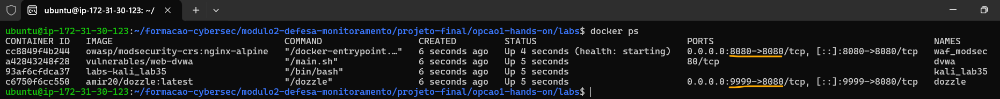 
    <figcaption>Imagem 01.</figcaption>
</figure>
 

<a name="item1.1"><h4>1.1 Configuração do DVWA</h4></a> [Back to summary](#item1)

O primeiro passo deste laboratório foi a configuração da aplicação web **DVWA**. Para acessar a aplicação a partir da máquina física, foi realizado um mapeamento de portas (port forwarding) no container WAF, expondo a porta `8080` no host (instância EC2). Dessa forma, o tráfego externo chegava ao WAF sem acessar diretamente o container da DVWA. Internamente, o WAF estava configurado com a variável `BACKEND=http://dvwa:80`, que direcionava o tráfego recebido para o container da **DVWA**, garantindo que todas as requisições fossem inspecionadas pelo WAF antes de atingir a aplicação vulnerável. Com a criação de uma regra no **Security Group** da instância EC2 liberando a porta `8080` para o IP da máquina física **Windows**, foi possível acessar a aplicação **DVWA** pelo navegador, como ilustrado na imagem 02.

<figure>
    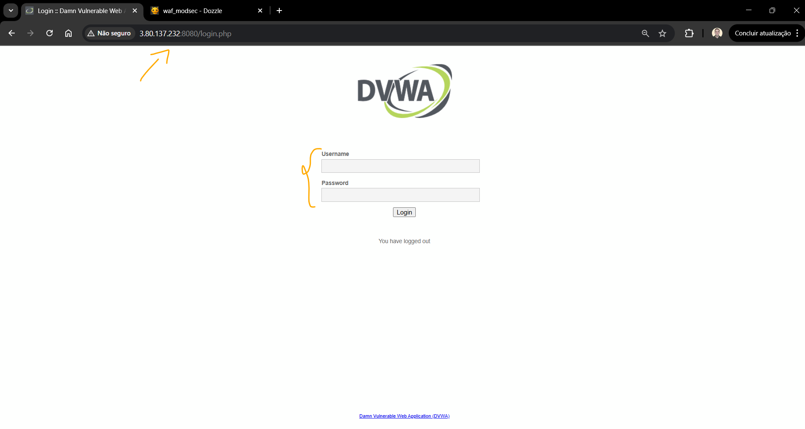 
    <figcaption>Imagem 02.</figcaption>
</figure>
 

Na página inicial da aplicação, era solicitado o login, cujo padrão no **DVWA** era usuário `admin` e senha `password`. Após a autenticação, foi clicado em `Setup` no menu lateral e, em seguida, em `Create / Reset Database` para criar o banco de dados ou recriá-lo caso já existisse. Com a mensagem de sucesso, a página foi alterada para `DVWA Security`, permitindo confirmar se o nível de segurança estava definido como **Low** (Baixo), o qual era necessário para que o WAF pudesse atuar sobre a aplicação. A imagem 03 confirma que o nível de segurança estava configurado como **Low**.

<figure>
    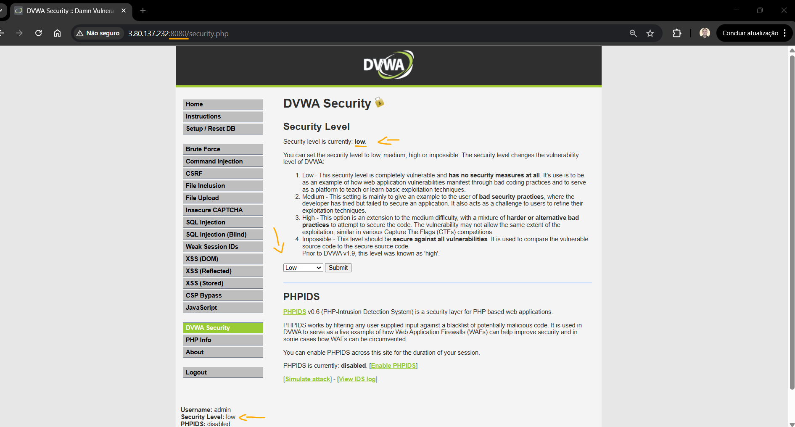 
    <figcaption>Imagem 03.</figcaption>
</figure>
 

<a name="item1.2"><h4>1.2 Reconhecimento (Nmap)</h4></a> [Back to summary](#item1)

O navegador da máquina física permaneceu aberto na aplicação enquanto os próximos passos eram realizados. O container de ataque **Kali Linux** foi acessado com o comando `docker exec -it kali_lab35 /bin/bash` a partir da sessão remota estabelecida com a instância EC2 usando o **Windows PowerShell**. Em seguida, foi realizada uma varredura TCP SYN para descobrir portas abertas e identificar os serviços e suas versões no container `waf_modsec`, utilizando o comando `nmap -sS -sV waf_modsec`. A varredura revelou duas portas abertas: a porta `8080`, que executava o serviço **HTTP** com **Nginx**, e a porta `8443`, que executava **HTTPS** também com **Nginx** (conforme mostrado na imagem 04).

<figure>
    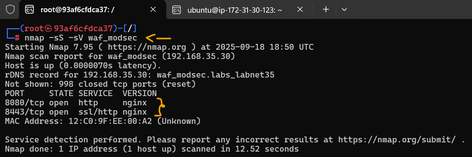 
    <figcaption>Imagem 04.</figcaption>
</figure>
 

<a name="item1.3"><h4>1.3 Teste no Modo Detecção</h4></a>[Back to summary](#item1)

Após reconhecimento, essa sessão com o container foi mantida aberta no **PowerShell** e uma nova sessão remota com a instância **Amazon EC2** foi estabelecida. Na instância **Amazon EC2**, onde os containers estavam em execução, o arquivo `docker-compose.yml` precisou ser modificado. O container do firewall havia sido implantado com a configuração `MODSEC_RULE_ENGINE=On`, correspondente ao modo de bloqueio. Como o objetivo nesta etapa era testar o modo de detecção, essa configuração foi comentada e a configuração `MODSEC_RULE_ENGINE=DetectionOnly` foi descomentada, editando o arquivo pelo **Vim**. Para aplicar as alterações foi executado o comando `docker compose up -d --force-recreate waf_modsec`, que recriou o container de WAF, conforme mostrado na imagem 05.

<figure>
    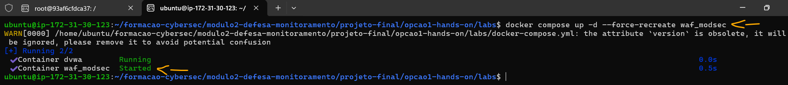 
    <figcaption>Imagem 05.</figcaption>
</figure>
 

A partir deste ponto iniciou-se a execução dos quatro ataques. Como estes foram disparados a partir do container **Kali Linux**, foi retornado ao **Windows PowerShell** com a sessão conectada ao container de ataque. Dentro desse container, o primeiro teste realizado foi a injeção SQL utilizando **Curl** com o comando `curl -s "http://waf_modsec:8080/vulnerabilities/sqli/?id=1'+OR+'1'='1'--+-&Submit=Submit" -H "Host: dvwa" -H "Cookie: PHPSESSID=test; security=low" -w "Status: %{http_code}\n"`, que é detalhado em suas partes a seguir:
- `curl`: Ferramenta de linha de comando para realizar requisições HTTP.  
- `-s`: Modo silencioso (silent), que suprime o progresso da requisição e mensagens de erro, deixando a saída limpa.  
- `"http://waf_modsec:8080/vulnerabilities/sqli/?id=1'+OR+'1'='1'--+-&Submit=Submit"`: URL alvo da requisição, contendo:
  - `waf_modsec:8080`: host e porta do container WAF que encaminha para a aplicação DVWA.  
  - `/vulnerabilities/sqli/`: endpoint da aplicação vulnerável à SQL Injection.  
  - `?id=1'+OR+'1'='1'--+-`: payload de injeção SQL que manipula o parâmetro `id` para sempre retornar verdadeiro. Cada parte do payload funciona da seguinte forma:  
    - `1'` (SQL: `1'`): fecha a aspa que delimita o valor do parâmetro `id` na query original da aplicação, passando como valor `1`.  
    - `+OR+'1'='1'`(SQL: ` OR '1'='1'`): adiciona uma condição lógica que sempre é verdadeira, forçando a query a retornar todos os registros. O caractere `+` representa um espaço na URL.
    - `--+-` (SQL: `-- -`): inicia um comentário que ignora o restante da query original, garantindo que nenhuma outra cláusula interfira no ataque.  
  - `&Submit=Submit`: parâmetro enviado pelo formulário da aplicação simulando o clique no botão de envio.  
- `-H "Host: dvwa"`: Cabeçalho HTTP definindo o host como `dvwa`, necessário para o roteamento correto dentro do Docker.  
- `-H "Cookie: PHPSESSID=test; security=low"`: Cabeçalho HTTP com cookies da sessão, onde:
  - `PHPSESSID=test`: identifica a sessão da aplicação.  
  - `security=low`: define o nível de segurança da DVWA como baixo, permitindo que o ataque seja executado.  
- `-w "Status: %{http_code}\n"`: Formata a saída exibindo o código HTTP retornado pela requisição, permitindo verificar se o ataque foi processado com sucesso.

Basicamente, este comando acessava o endpoint `/vulnerabilities/sqli/` da aplicação web vulnerável **DVWA** através do container do WAF, enviando o payload `?id=1'+OR+'1'='1'--+-` no formulário junto com o parâmetro `&Submit=Submit`, que simulava o envio do formulário na aplicação. O cabeçalho `-H "Host: dvwa"` indicava que o host alvo era o container **DVWA**, enquanto o cabeçalho `-H "Cookie: PHPSESSID=test; security=low"` fornecia a sessão da aplicação e definia o nível de segurança como baixo. O parâmetro `-w "Status: %{http_code}\n"` apenas formatava a saída do comando. O payload manipula o parâmetro `id` adicionando uma condição tautológica (`'1'='1'`), de modo que a cláusula `WHERE` passa a ser satisfeita para todas as linhas e a consulta retorna todos os registros, contornando a filtragem prevista.

O segundo ataque realizado foi um Cross-Site Scripting (XSS) refletido, também executado via **Curl** para testar a detecção do WAF. O comando utilizado foi `curl -s "http://waf_modsec:8080/vulnerabilities/xss_r/?name=%3Cscript%3Ealert%28%22XSS%22%29%3C/script%3E" -H "Host: dvwa" -H "Cookie: security=low" -w "Status: %{http_code}\n"`. A seguir, o detalhamento de cada parte do comando:
- `curl`: Ferramenta de linha de comando para realizar requisições HTTP.  
- `-s`: Modo silencioso (silent), que suprime o progresso da requisição e mensagens de erro, deixando a saída limpa.  
- `"http://waf_modsec:8080/vulnerabilities/xss_r/?name=%3Cscript%3Ealert%28%22XSS%22%29%3C/script%3E"`: URL alvo da requisição, contendo:
  - `waf_modsec:8080`: host e porta do container WAF que encaminha para a aplicação DVWA.  
  - `/vulnerabilities/xss_r/`: endpoint da aplicação vulnerável a Cross-Site Scripting refletido.  
  - `?name=%3Cscript%3Ealert%28%22XSS%22%29%3C/script%3E`: parâmetro `name` com o payload URL-encoded. Ao ser decodificado pelo servidor, esse valor corresponde a ``, ou seja:
    - `%3C` → `<` e `%3E` → `>`: delimitadores de tag HTML.  
    - `alert%28%22XSS%22%29` → `alert("XSS")`: chamada JavaScript.  
    - Se a aplicação reflete esse valor no HTML sem escape, o ``, utilizado apenas para testar se a página refletia o input do usuário sem escape, confirmando a vulnerabilidade e permitindo a execução de comandos. 

O terceiro ataque foi o de Command Injection, que também foi executado com o **Curl** no container de ataque através do comando `curl -s "http://waf_modsec:8080/vulnerabilities/exec/?ip=127.0.0.1;ls" -H "Host: dvwa" -H "Cookie: security=low" -w "Status: %{http_code}\n"`. A explicação detalhada do comando é listada abaixo:
- `curl`: Ferramenta de linha de comando para enviar requisições HTTP.  
- `-s`: Modo silencioso (silent), que suprime o progresso da requisição e mensagens de erro, mantendo a saída limpa.  
- `"http://waf_modsec:8080/vulnerabilities/exec/?ip=127.0.0.1;ls"`: URL alvo da requisição, contendo:  
  - `waf_modsec:8080`: host e porta do container WAF que encaminha para a aplicação DVWA.  
  - `/vulnerabilities/exec/`: endpoint da aplicação vulnerável a Command Injection.  
  - `?ip=127.0.0.1;ls`: payload de injeção de comando que manipula o parâmetro `ip` para executar comandos arbitrários. Cada parte funciona da seguinte forma:  
    - `127.0.0.1`: valor legítimo do parâmetro, representando o host a ser pingado.  
    - `;ls`: comando injetado, separado por `;`, que lista arquivos do servidor.  
- `-H "Host: dvwa"`: Cabeçalho HTTP definindo o host como `dvwa`, necessário para o roteamento correto dentro do Docker.  
- `-H "Cookie: security=low"`: Cabeçalho HTTP definindo o nível de segurança da DVWA como baixo, permitindo que o ataque seja executado.  
- `-w "Status: %{http_code}\n"`: Formata a saída exibindo o código HTTP retornado pela requisição, permitindo verificar se o ataque foi processado com sucesso.

Assim como os dois ataques anteriores, este também foi realizado por meio de uma requisição HTTP, alterando apenas o endpoint para a seção apropriada do site (`/vulnerabilities/exec/`) e o payload para `?ip=127.0.0.1;ls`. Esse payload preenchia o campo de IP com o endereço `127.0.0.1`, que correspondia ao localhost do container `dvwa`, e incluía um comando adicional. O valor do campo era utilizado como alvo em uma execução do comando `ping` no servidor, mas devido ao comando injetado `ls`, após o ping o servidor também listava os arquivos presentes no diretório da aplicação web vulnerável. 

O quarto ataque foi o de File Inclusion, realizado com **Curl** no container de ataque através do comando: `curl -s "http://waf_modsec:8080/vulnerabilities/fi/?page=file3.php" -H "Host: dvwa" -H "Cookie: security=low" -w "Status: %{http_code}\n"`. A explicação detalhada do comando é listada abaixo:
- `curl`: Ferramenta de linha de comando para enviar requisições HTTP.  
- `-s`: Modo silencioso (silent), que suprime o progresso da requisição e mensagens de erro, mantendo a saída limpa.  
- `"http://waf_modsec:8080/vulnerabilities/fi/?page=file3.php"`: URL alvo da requisição, contendo:  
  - `waf_modsec:8080`: host e porta do container WAF que encaminha para a aplicação DVWA.  
  - `/vulnerabilities/fi/`: endpoint da aplicação vulnerável a File Inclusion.  
  - `?page=file3.php`: Parâmetro usado pelo DVWA no módulo File Inclusion. Ao ser acessado, o servidor inclui o arquivo `file3.php` e retorna seu conteúdo, exibindo informações do ambiente como IP interno da aplicação, IP público, user-agent do cliente e endereço de origem (referer).
- `-H "Host: dvwa"`: Cabeçalho HTTP definindo o host como `dvwa`, necessário para o roteamento correto dentro do Docker.  
- `-H "Cookie: security=low"`: Cabeçalho HTTP definindo o nível de segurança da DVWA como baixo, permitindo que o ataque seja executado.  
- `-w "Status: %{http_code}\n"`: Formata a saída exibindo o código HTTP retornado pela requisição, permitindo verificar se o ataque foi processado com sucesso.

Para este ataque, o processo foi o mesmo, alterando apenas o endpoint para `/vulnerabilities/fi/` e o payload para `?page=file3.php`. O objetivo desse passo era demonstrar como o **DVWA** incluía arquivos no servidor e retorna o conteúdo, evidenciando a vulnerabilidade de Local File Inclusion (LFI) de forma segura e controlada.

A imagem 06 mostra que, ao executar os quatro ataques com o WAF no modo de detecção, o servidor retornou o status HTTP 302. Esse código indicava um redirecionamento temporário, mas não confirmava por si só que o ataque foi detectado pelo WAF. O redirecionamento ocorreu porque a requisição via **Curl** era direcionada ao container `waf_modsec`, que por sua vez roteava o tráfego para a aplicação **DVWA**. A confirmação de que o **ModSecurity** realmente registrou os ataques só pôde ser obtida ao analisar os logs monitorados pelo **Dozzle**, processo realizado posteriormente.

<figure>
    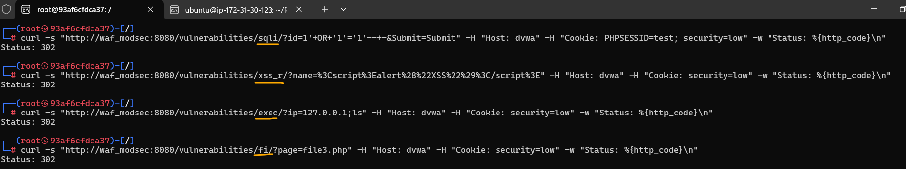 
    <figcaption>Imagem 06.</figcaption>
</figure>
 

Os mesmos quatro ataques foram, então, executados pela interface gráfica do **DVWA**. O navegador da máquina física **Windows** já possuía uma aba aberta na página da aplicação, utilizada anteriormente para configurar o banco de dados do **DVWA**. O acesso era possível porque o container do WAF expunha a porta `8080` para o host (instância EC2) e roteava o tráfego para o container da aplicação. Assim, ao conectar-se ao IP ou DNS público da instância na porta `8080`, a aplicação web era alcançada, uma vez que a regra de liberação da porta já havia sido configurada no security group associado à instância.

Dentro do **DVWA**, cada uma das seções dos quatro ataques foi acessada para executar o ataque respectivo:
- Em `SQL Injection`, o payload `1' OR '1'='1'-- -` foi inserido no campo `User ID` e enviado ao clicar no botão `Submit`. A aplicação então retornou os nomes de todos os usuários do banco de dados, conforme ilustrado na imagem 07.
- Em `XSS (Reflected)`, no único campo do formulário foi inserido o payload `` e, ao clicar no botão `Submit`, o código foi executado no navegador da máquina física, exibindo a mensagem de alerta, conforme evidenciado na imagem 08.
- Em `Command Injection`, no campo disponível, foi inserido o payload `127.0.0.1;ls`. Esse ataque aproveitava a execução de um comando Ping no servidor **DVWA** e, em seguida, executava o comando `ls` no mesmo servidor. A imagem 09 mostra o output do comando, exibindo o retorno do ping e os arquivos listados pelo `ls`. Esses arquivos eram referentes ao diretório raiz da aplicação no container DVWA, incluindo scripts e arquivos de configuração utilizados pela aplicação.
- Em `File Inclusion`, três arquivos (`file1.php`, `file2.php` e `file3.php`) estavam disponíveis como links clicáveis. Ao clicar em cada arquivo, a aplicação incluía e executava o conteúdo do arquivo no servidor, retornando informações do ambiente e da requisição, como IP do servidor, IP público de origem, user-agent e referer. A imagem 10 evidencia a execução desse ataque, mostrando que a aplicação processou o arquivo `file3.php` e exibiu seu conteúdo, confirmando a vulnerabilidade.

<figure>
    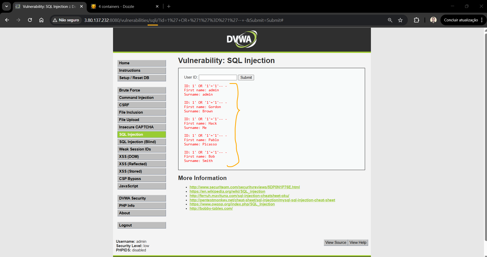 
    <figcaption>Imagem 07.</figcaption>
</figure>
 

<figure>
    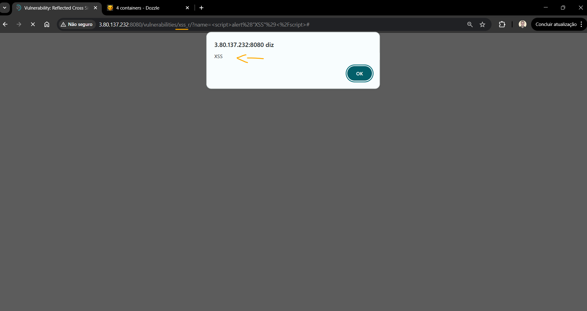 
    <figcaption>Imagem 08.</figcaption>
</figure>
 

<figure>
    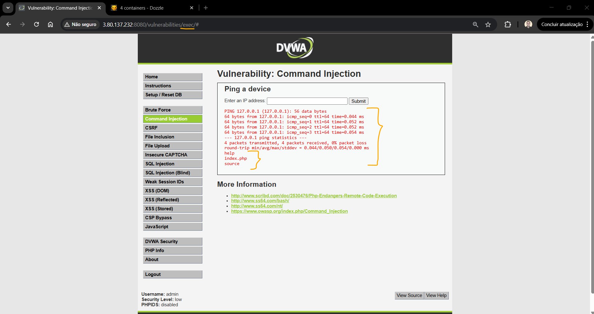 
    <figcaption>Imagem 09.</figcaption>
</figure>
 

<figure>
    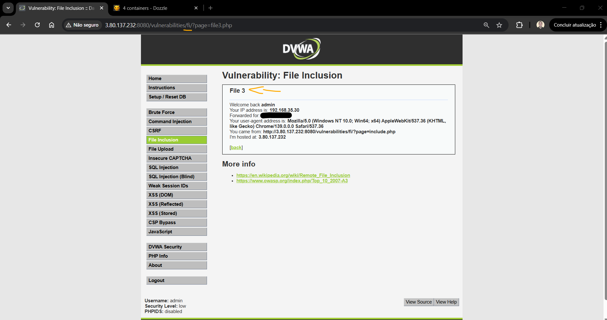 
    <figcaption>Imagem 10.</figcaption>
</figure>
 

<a name="item1.4"><h4>1.4 Teste no Modo Blocking</h4></a>[Back to summary](#item1)

Após testar o modo de detecção no container do **OWASP ModSecurity CRS**, o passo seguinte foi alternar para o modo de bloqueio. Para isso foi necessário acessar o host que executava os containers — a instância **Amazon EC2** — e editar o arquivo `docker-compose.yml` no **Vim**. Na edição, a variável `MODSEC_RULE_ENGINE=DetectionOnly` foi comentada e `MODSEC_RULE_ENGINE=On` foi ativada. Em seguida, para aplicar a alteração apenas ao container do WAF, foi executado o comando `docker compose up -d --force-recreate waf_modsec`, recriando o container `waf_modsec` com as novas configurações.

De volta a máquina de ataque **Kali Linux**, cada um dos quatro ataques foi novamente realizado com o **Curl**. Os comandos foram executados nessa ordem:
- SQLi: `curl -s "http://waf_modsec:8080/vulnerabilities/sqli/?id=1'+OR+'1'='1'--+-&Submit=Submit" -H "Host: dvwa" -H "Cookie: PHPSESSID=test; security=low" -w "Status: %{http_code}\n"`;
- XSS: `curl -s "http://waf_modsec:8080/vulnerabilities/xss_r/?name=%3Cscript%3Ealert%28%22XSS%22%29%3C/script%3E`;
- Command Injection: `curl -s "http://waf_modsec:8080/vulnerabilities/command/?ip=127.0.0.1;ls" -H "Host: dvwa" -H "Cookie: security=low" -w "Status: %{http_code}\n"`;
- File Inclusion: `curl -s "http://waf_modsec:8080/vulnerabilities/fi/?page=../../../../etc/passwd" -H "Host: dvwa" -H "Cookie: security=low" -w "Status: %{http_code}\n"`;

A imagem 11 evidencia que o retorno dos três primeiros comandos foi o código de status **403 (Forbidden)**. Diferente do 302, esse código indicava que o container do **WAF** recebeu a requisição, mas não a encaminhou para o **DVWA**. Embora o status 403 por si só não confirme formalmente um bloqueio, considerando que se tratava de um WAF, é bastante provável que ele estivesse agindo para impedir o ataque. A confirmação definitiva veio posteriormente, ao analisar os logs no **Dozzle**.

<figure>
    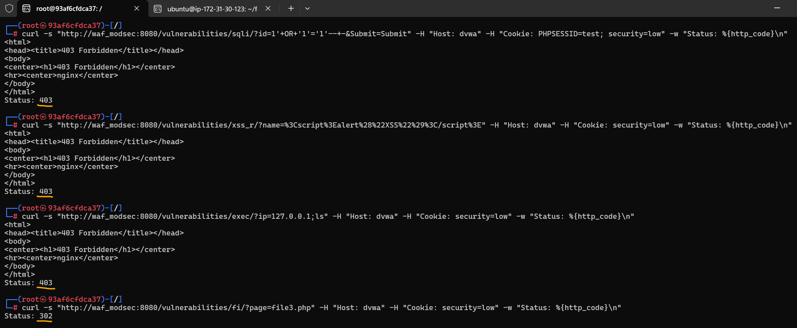 
    <figcaption>Imagem 11.</figcaption>
</figure>
 

No caso do quarto ataque, de File Inclusion, o código retornado continuou sendo **302**, indicando que o WAF recebeu a requisição e a roteou para o container **DVWA**. Como o ataque não foi bloqueado, isso sugeriu que o WAF não conseguiu impedir esse tipo de exploração ou não estava configurado para isso. Além disso, também levantou a possibilidade de que o ataque não tivesse sido detectado quando o WAF estava em modo de detecção. A confirmação definitiva foi obtida apenas ao analisar os logs no **Dozzle**.

Esses ataques também foram executados via interface gráfica do **DVWA**, seguindo o mesmo procedimento utilizado quando o WAF estava em modo de detecção. Caso a GUI não estivesse aberta, bastava acessar o IP ou DNS público da instância EC2 na porta `8080` — que estava mapeada para o container `waf_modsec`, o qual encaminhava o tráfego ao container `dvwa`. O grupo de segurança da instância já permitia o acesso na porta `8080` a partir do IP da máquina física **Windows**. Cada ataque foi realizado na sua respectiva seção do **DVWA**:
- SQLi: `1'+OR+'1'='1'--+-`  
- XSS (Reflected): ``  
- Command Injection: `127.0.0.1;ls`  
- File Inclusion: selecionado um dos três arquivos, no caso foi escolhido o mesmo, `file3.php`.

As três imagens seguintes (12, 13 e 14) evidenciam as tentativas de ataque realizadas pela interface gráfica **DVWA** para os três primeiros ataques foram bloqueadas pelo container WAF. Entretanto, na imagem 15, é possível confirmar que o ataque de File Inclusion não foi bloqueado pelo WAF.

<figure>
    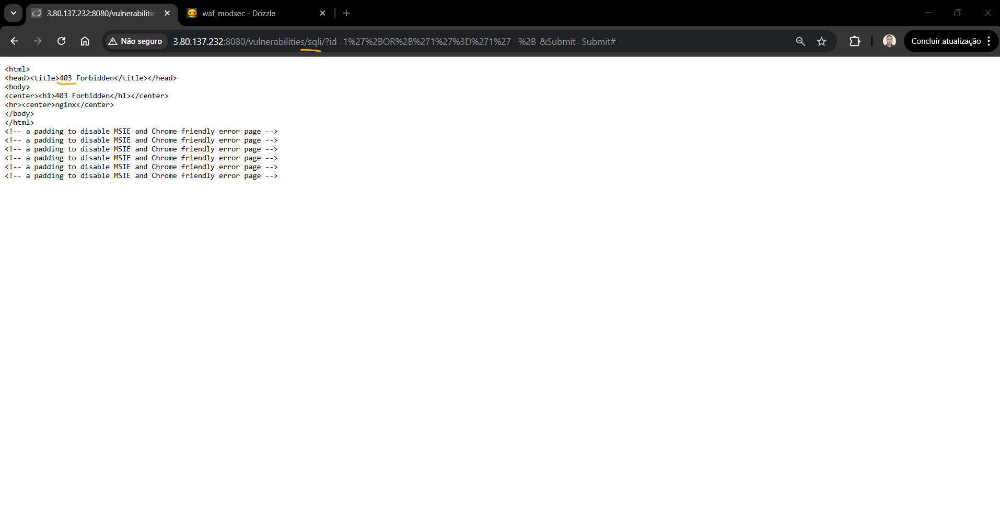 
    <figcaption>Imagem 12.</figcaption>
</figure>
 

<figure>
    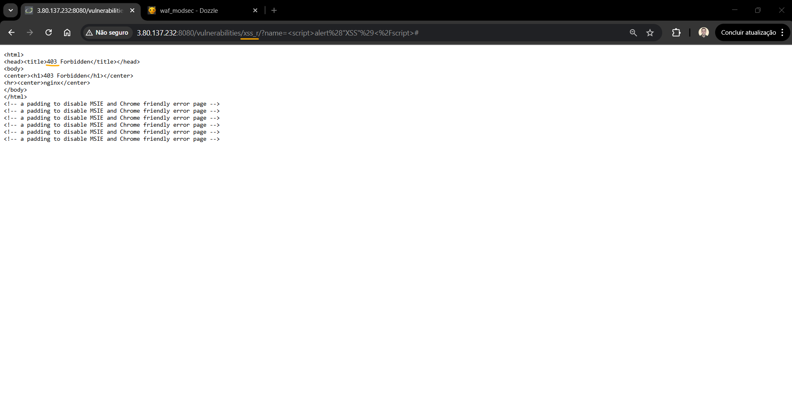 
    <figcaption>Imagem 13.</figcaption>
</figure>
 

<figure>
    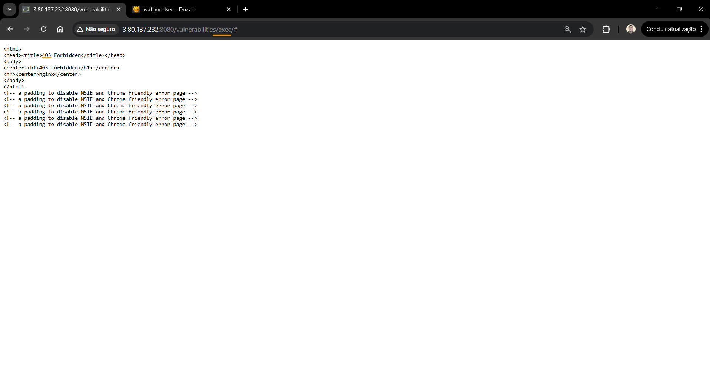 
    <figcaption>Imagem 14.</figcaption>
</figure>
 

<figure>
    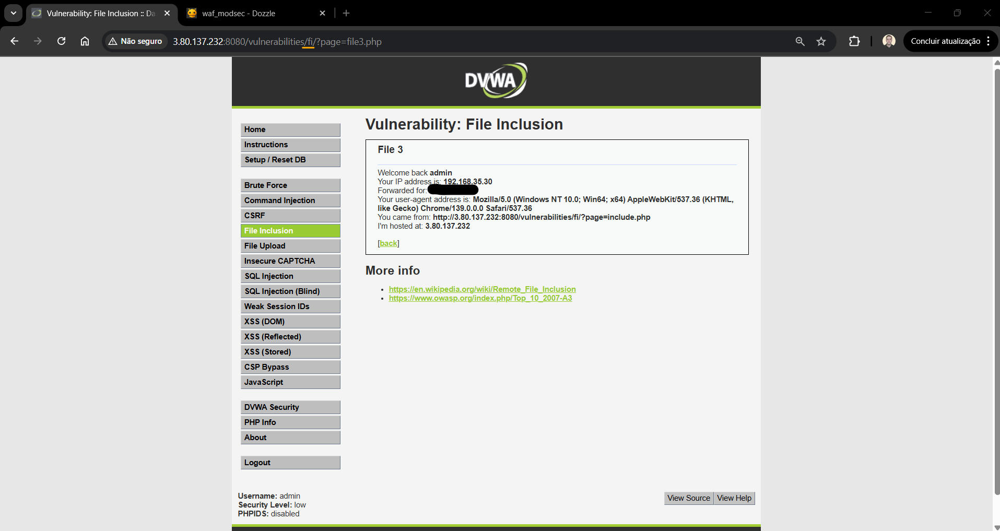 
    <figcaption>Imagem 15.</figcaption>
</figure>
 

<a name="item1.5"><h4>1.5 Monitoramento com Dozzle</h4></a>[Back to summary](#item1)

Com a finalização dos testes do firewall de aplicação web **OWASP ModSecurity CRS** em ambos os modos (detecção e bloqueio), o passo seguinte foi a análise dos logs. Para isso, utilizou-se o **Dozzle**, uma interface web leve que permite visualizar, em tempo real, os logs de contêineres **Docker**. Na configuração do container `dozzle` no **Docker Compose**, foi definido um mapeamento de volume, onde o arquivo de logs de todos os containers do host (instância EC2), localizado em `/var/run/docker.sock`, era compartilhado com o diretório equivalente no container `/var/run/docker.sock`. Dessa forma, o container **Dozzle** tinha acesso centralizado aos logs de todos os containers da instância.

No container `dozzle` também foi configurado um port forwarding, mapeando a porta `9999` do host para a porta `8080` do container, onde o serviço estava em execução. Com isso, era possível acessar a interface gráfica do **Dozzle** externamente pelo navegador da máquina física, utilizando o IP ou DNS público da instância na porta `9999`. As credenciais de autenticação definidas foram `admin` para usuário e `admin` para senha. Entretanto, foi necessário acrescentar uma nova regra ao security group da instância, liberando a porta `9999` para o IP público da máquina física **Windows**. A imagem 16 exibe o acesso autenticado a interface do **Dozzle**.

<figure>
    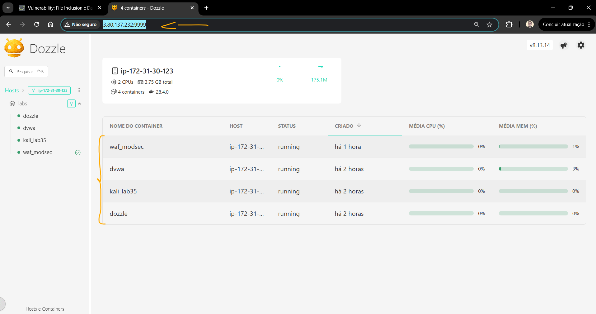 
    <figcaption>Imagem 16.</figcaption>
</figure>
 

Dentro do **Dozzle**, foi selecionado o container `waf_modsec` para análise dos logs, aplicando-se dois filtros principais. Para utilizar os filtros no **Dozzle**, bastava pressionar `Ctrl + F`, que abria o campo de pesquisa da própria interface. O primeiro filtro utilizado foi `secrules_engine="DetectionOnly"` (`DetectionOnly`), que exibiu apenas três dos quatro ataques realizados pelo **Kali Linux** e detectados pelo WAF enquanto este estava no modo de detecção, sem aplicar bloqueio (Imagens 17 a 19). Já na Imagem 20, também no **Dozzle**, foi possível identificar a requisição do ataque de File Inclusion, evidenciando que a requisição foi roteada para o **DVWA**, mas o ataque não foi detectado pelo WAF.

<figure>
    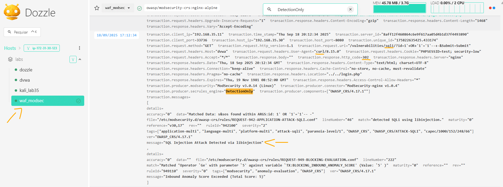 
    <figcaption>Imagem 17.</figcaption>
</figure>
 

<figure>
    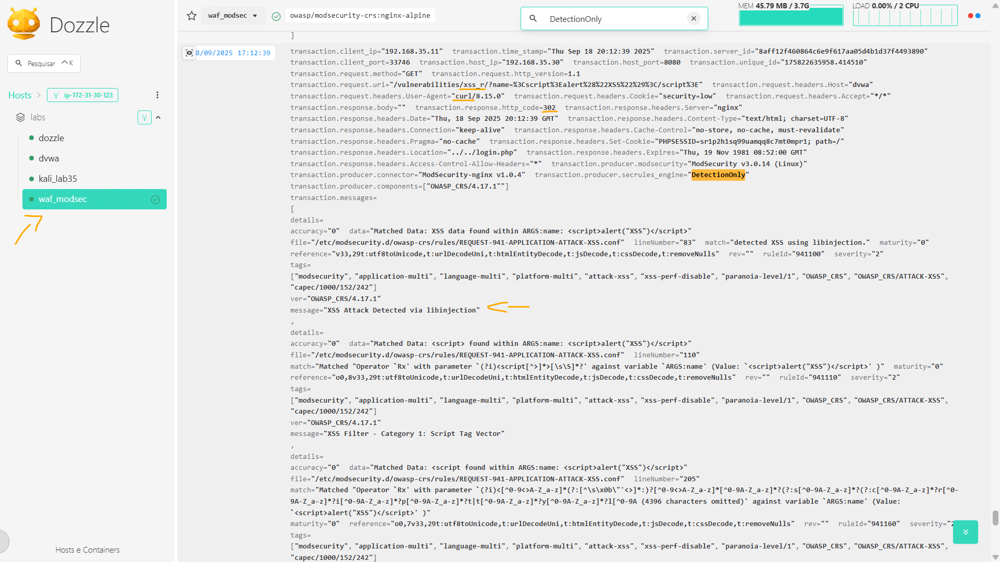 
    <figcaption>Imagem 18.</figcaption>
</figure>
 

<figure>
    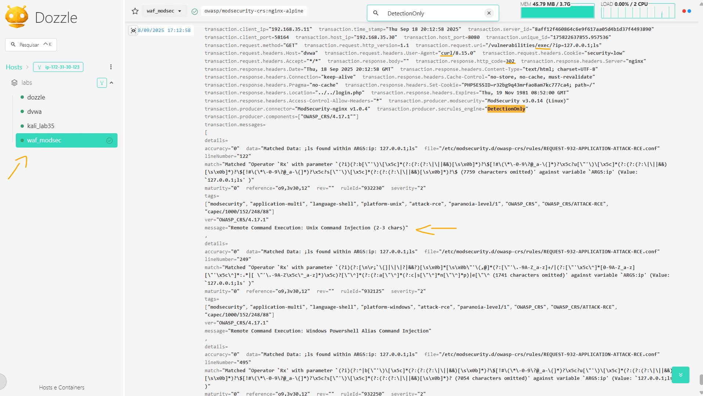 
    <figcaption>Imagem 19.</figcaption>
</figure>
 

<figure>
    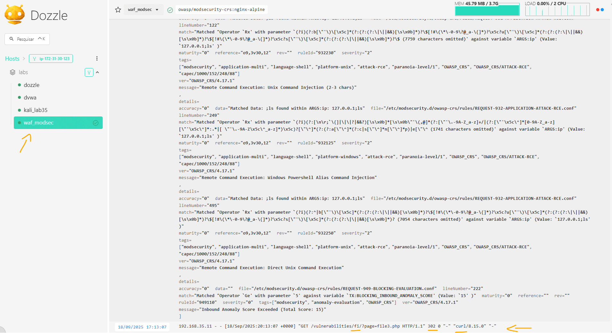 
    <figcaption>Imagem 20.</figcaption>
</figure>
 

O segundo filtro aplicado foi o `secrules_engine:"Enabled"` (`Enabled`), que exibiu três dos quatro ataques executados pela interface gráfica do **DVWA** e bloqueados pelo WAF após ativar o modo de bloqueio (Imagens 21 a 23). Para cada um desses ataques, apareciam dois registros de eventos nos logs: o primeiro indicava a requisição antes de qualquer ação de bloqueio, ou seja, o WAF havia recebido a requisição e processado as regras de detecção. O segundo registro, identificado com um ícone vermelho, correspondia ao mesmo evento após o WAF decidir bloquear a requisição. Na imagem 24, é possível observar apenas um registro para o ataque de File Inclusion, com código de status 200, confirmando que esse ataque não foi nem bloqueado nem detectado pelo **OWASP ModSecurity CRS**.

<figure>
     
    <figcaption>Imagem 21.</figcaption>
</figure>
 

<figure>
    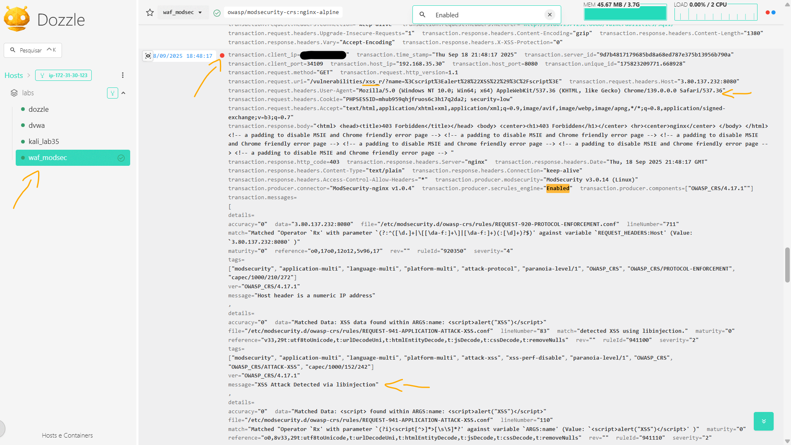 
    <figcaption>Imagem 22.</figcaption>
</figure>
 

<figure>
    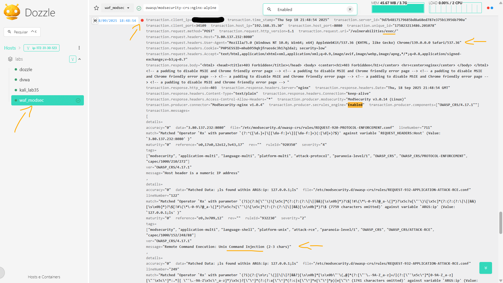 
    <figcaption>Imagem 23.</figcaption>
</figure>
 

<figure>
    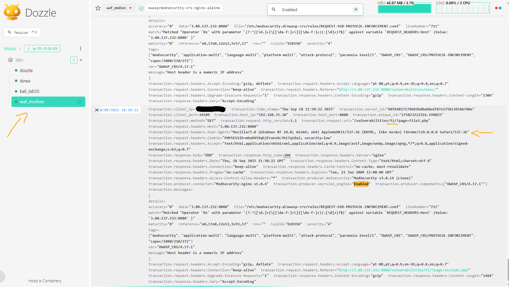 
    <figcaption>Imagem 24.</figcaption>
</figure>
 

<a name="item1.6"><h4>1.6 Coleta de Evidências</h4></a>[Back to summary](#item1)

Na etapa de coleta de evidências, foram utilizadas as imagens capturadas ao longo do laboratório para compor este README. Em cada execução, um print foi registrado para comprovar a realização das atividades, servindo como evidência a ser anexada ao relatório técnico. Todo o processo foi documentado, desde o reconhecimento com **Nmap**, passando pelos testes dos quatro tipos de ataques em modo de detecção e, posteriormente, em modo de bloqueio, executados tanto via **Curl** quanto pela interface gráfica do **DVWA** no navegador, até a análise dos logs desses ataques no **Dozzle**, permitindo confirmar quais ataques eram detectados e bloqueados e quais não eram.

Além das capturas de tela, foi realizada uma coleta adicional de evidências: a geração de um arquivo contendo os últimos 50 logs do container do WAF em modo de bloqueio. Essa ação foi executada diretamente no host com o comando `docker logs waf_modsec --tail 50 > logs_waf_bloqueio.txt`. A imagem 25 mostra o momento dessa coleta.

<figure>
     
    <figcaption>Imagem 25.</figcaption>
</figure>
 

<a name="item1.7"><h4>1.7 Documentação Técnica</h4></a>[Back to summary](#item1)

Após a conclusão do laboratório, iniciou-se a construção da documentação técnica. Este arquivo de README utilizado é o padrão que mantenho em todos os projetos no GitHub, servindo para narrar detalhadamente como cada atividade (bootcamp, curso, aula, laboratório, desafio ou projeto) foi desenvolvida.  

A documentação técnica do projeto, por sua vez, constitui o artefato principal a ser entregue, incluindo seus anexos. Esse artefato foi o relatório técnico de nome [relatorio.md](./relatorio.md), que registrou de forma estruturada e detalhada todo o laboratório realizado, permitindo que outros documentos ou evidências relevantes fossem vinculados como anexos. 

Um relatório técnico de segurança é elaborado para documentar, analisar e comunicar informações sobre a proteção de sistemas, redes ou aplicações. A estrutura recomendada garante clareza, rastreabilidade e utilidade tanto para profissionais técnicos quanto para gestores. A seguir, uma descrição detalhada dos elementos mais comuns:
1. **Capa:** A capa identifica o relatório, contendo o título, autor(es), data e organização responsável. Serve para formalizar o documento e indicar sua autoria.
2. **Sumário Executivo:** O sumário executivo é um resumo conciso do relatório, geralmente limitado a uma página. Destina-se a apresentar os principais achados, impactos e recomendações de forma rápida e acessível para tomadores de decisão, sem necessidade de leitura detalhada do documento.
3. **Objetivo:** Aqui se descreve o propósito do relatório, explicando o que foi analisado, testado ou documentado. Define a intenção do trabalho e ajuda a contextualizar os resultados.
4. **Escopo:** O escopo delimita o que está incluído e excluído do estudo ou teste. Exemplos: sistemas, redes, aplicações, períodos de análise, tipo de ataques simulados ou segmentos de infraestrutura.
5. **Metodologia:** A metodologia detalha os procedimentos, frameworks e ferramentas utilizados. Exemplos: frameworks de resposta a incidentes como NIST IR, técnicas de ataque simuladas, ferramentas de monitoramento, logs analisados. Permite que outros profissionais reproduzam ou verifiquem o trabalho.
6. **Diagrama / Arquitetura:** Diagramas ou representações visuais do ambiente analisado ajudam a compreender a infraestrutura, relações entre sistemas, fluxos de dados e pontos de vulnerabilidade.  
7. **Execução:** A seção de execução descreve as ações realizadas durante o laboratório ou teste, detalhando passo a passo como os procedimentos planejados foram aplicados. Inclui a sequência de operações, o uso de ferramentas, a realização de ataques simulados, a interação com os sistemas-alvo e a aplicação de medidas de defesa. O objetivo é mostrar de forma clara e objetiva o que foi feito na prática, permitindo que outro profissional compreenda e, se necessário, reproduza o experimento.
8. **Evidências:** A seção de evidências apresenta os materiais que suportam as informações do relatório. Inclui arquivos, prints de tela, logs, resultados de testes, outputs de comandos e qualquer documentação que comprove ou registre o trabalho realizado. O objetivo é fornecer base concreta para a análise e permitir verificação independente.
9. **Análise e Diagnóstico:** Esta seção interpreta e avalia as informações coletadas nas evidências. Deve apresentar uma análise crítica, apontando problemas, falhas ou comportamentos observados, relacionando-os com os objetivos do relatório. O diagnóstico permite tirar conclusões fundamentadas e identificar recomendações ou ajustes necessários.
10. **Resposta a Incidente (NIST IR) (Opcional)**: Se aplicável, esta seção descreve como um incidente seria tratado seguindo um framework formal, como o NIST SP 800-61r2. Organiza as ações em etapas: Detecção, Contenção, Erradicação, Recuperação e Lições Aprendidas. O objetivo é demonstrar a aplicação de boas práticas de resposta a incidentes e a forma estruturada de lidar com problemas identificados.
11. **Recomendações:** Sugestões para corrigir vulnerabilidades e melhorar a segurança, priorizando ações críticas ou de maior impacto. Deve ser prática e aplicável.
12. **Plano de Ação (80/20):** Indica como implementar as recomendações, com ações detalhadas, responsáveis, prazos e prioridades, facilitando a execução e acompanhamento das melhorias.
13. **Conclusão:** Síntese dos resultados do relatório, reforçando o estado final do ambiente, os principais aprendizados e eventuais limitações do estudo.
14. **Anexos:** Materiais complementares, como configurações completas, scripts, logs extensos, outputs detalhados ou qualquer arquivo que comprove as atividades executadas. Garantem rastreabilidade e permitem verificação detalhada.