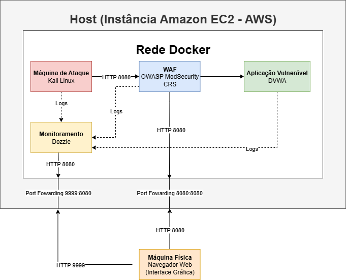

# Relatório Técnico - Lab de Segurança WAF + DVWA

**Laboratório:** Proteção da DVWA com WAF OWASP ModSecurity CRS  
**Autor:** Pedro Heeger Costa  
**Data:** 18/09/2025  
**Ambiente:** Docker  

**Instituição**: Vai na Web  
**Curso**: Formação Cybersec  
**Módulo:** Defesa e Monitoramento  
**Contexto**: Projeto Final do Módulo 2 (Opção 1)

---

## Índice

- [1. Sumário Executivo](#1-sum%C3%A1rio-executivo)
- [2. Objetivo](#2-objetivo)
- [3. Escopo](#3-escopo)
- [4. Diagrama](#4-diagrama)
- [5. Metodologia](#5-metodologia)
- [6. Execução](#6-execucao)
- [7. Evidências](#7-evidencias)
- [8. Análise e Diagnóstico](#8-analise-e-diagnostico)
- [9. Resposta a Incidente (NIST IR)](#9-resposta-a-incidente-nist-ir)
- [10. Recomendações](#10-recomendacoes)
- [11. Plano de Ação](#11-plano-de-acao)
- [12. Conclusão](#12-conclusao)
- [13. Apêndices](#13-apendices)

---

## 1. Sumário Executivo
Este relatório apresenta os resultados de um laboratório de segurança voltado à proteção da aplicação web vulnerável **DVWA** utilizando o **OWASP ModSecurity CRS** como firewall de aplicação web (WAF). O ambiente foi totalmente montado em containers **Docker**, executados em uma instância **EC2 da AWS**, com monitoramento em tempo real realizado pelo **Dozzle**, permitindo visualizar como o WAF reage frente a ataques simulados.

Foram testados quatro tipos de ataques comuns a aplicações web: **SQL Injection (SQLi), Cross-Site Scripting (XSS), Command Injection e File Inclusion**. O WAF detectou e bloqueou com sucesso **SQLi, XSS e Command Injection**, mantendo a aplicação protegida. O ataque de **File Inclusion**, entretanto, não foi identificado, revelando uma vulnerabilidade crítica que exige atenção.

### Principais achados
- **Modo de detecção:** 75% dos ataques identificados sem impactar a operação da aplicação.  
- **Modo de bloqueio:** Ataques detectados foram bloqueados, retornando código **403**.  
- **Vulnerabilidade crítica:** O ataque de **File Inclusion** não foi detectado nem bloqueado.  
- **Monitoramento em tempo real:** O **Dozzle** permitiu acompanhar todas as tentativas de ataque e a resposta do WAF de forma clara e prática.  

### Recomendações
- Ajustar ou criar regras específicas para que ataques de **File Inclusion** sejam detectados e bloqueados.  
- Implementar **monitoramento contínuo** e alertas automáticos para eventos críticos.  
- Revisar e atualizar periodicamente as **regras do WAF** para mantê-las eficazes contra novas ameaças.  
- Realizar **testes de penetração recorrentes** para validar a eficácia das defesas frente a diferentes vetores de ataque.  
- **Segregar os containers** em sub-redes distintas e manter todos os softwares atualizados com os últimos patches de segurança.  

### Conclusão
O laboratório demonstrou que a combinação de um **WAF corretamente configurado** com **monitoramento em tempo real** é eficaz para proteger aplicações web contra ataques comuns. No entanto, a falha na detecção e bloqueio do ataque de **File Inclusion** evidencia a necessidade de ajustes contínuos nas regras do WAF, manutenção proativa e testes regulares para garantir uma postura de segurança robusta.

---

## 2. Objetivo
O objetivo deste relatório é documentar a execução de um laboratório de segurança, focado na proteção da aplicação web vulnerável **DVWA** utilizando o **OWASP ModSecurity CRS** como firewall de aplicação web (WAF) e o **Dozzle** para monitoramento e análise de logs em tempo real.

Busca-se analisar a eficácia do WAF frente a ataques simulados, incluindo:  
- **SQL Injection (SQLi):** tentativas de manipular o banco de dados por meio de comandos maliciosos;  
- **Cross-Site Scripting (XSS):** inserção de códigos maliciosos em páginas web para afetar outros usuários;  
- **Command Injection:** execução não autorizada de comandos no servidor;  
- **File Inclusion:** exploração para acessar ou executar arquivos do sistema indevidamente.  

Durante o laboratório, os logs gerados pelo WAF foram monitorados com o Dozzle, permitindo registrar e analisar se e como cada ataque foi detectado ou bloqueado, servindo como evidência do desempenho do sistema de proteção.

---

## 3. Escopo
O escopo deste laboratório abrange a infraestrutura orquestrada em Docker, executando sobre uma instância EC2, composta pelos seguintes containers:  
- **DVWA:** aplicação web vulnerável utilizada para testes;  
- **Kali Linux:** estação de ataque para execução dos testes;  
- **ModSecurity (WAF OWASP CRS):** firewall de aplicação web operado em modos de detecção e bloqueio;  
- **Dozzle:** visualizador de logs em tempo real.  

Adicionalmente, um navegador na máquina física foi usado como interface gráfica para interação com a DVWA e monitoramento via Dozzle. Os ataques simulados cobertos pelo exercício foram: **SQL Injection (SQLi)**, **Cross‑Site Scripting (XSS)**, **Command Injection** e **File Inclusion**. O experimento foi executado em ambiente controlado durante a sessão de laboratório.

**Fora do escopo:**  
- Sistemas externos aos containers Docker utilizados;  
- Testes de performance, carga ou resiliência do WAF em ambiente de produção;  
- Ataques avançados, persistentes ou operações de threat hunting (APTs).

---

## 4. Metodologia

   A metodologia do laboratório descreve o planejamento e os procedimentos adotados para avaliar a eficácia do WAF frente a ataques simulados, permitindo que outro profissional reproduza ou verifique o trabalho.  

1. **Planejamento do ambiente:**  
   - Seleção de uma infraestrutura baseada em **Docker** sobre uma **instância EC2**.  
   - Definição dos containers necessários: DVWA (aplicação vulnerável), Kali Linux (máquina de ataque), ModSecurity CRS (WAF) e Dozzle (monitoramento de logs).
2. **Configuração de rede e segurança:**  
   - Planejamento das regras do **Security Group** para liberar portas específicas e permitir o acesso da máquina física aos serviços.  
   - Garantia de comunicação entre os containers e acesso externo para monitoramento.
3. **Preparação da aplicação vulnerável:**  
   - Definição da necessidade de inicialização do banco de dados da DVWA via interface gráfica.  
   - Planejamento da criação de usuários e permissões necessárias para testes.
4. **Definição dos modos do WAF:**  
   - Teste em **modo de detecção**: registrar ataques sem bloqueá-los.  
   - Teste em **modo de bloqueio**: impedir a execução de ações maliciosas.
5. **Seleção e definição dos ataques simulados:**  
   - Tipos de ataques escolhidos: **SQL Injection (SQLi), Cross-Site Scripting (XSS), Command Injection e File Inclusion**.  
   - Estratégia de execução por **Curl no Kali Linux** e pela **interface gráfica da DVWA**.
6. **Monitoramento e coleta de evidências:**  
   - Planejamento do uso do **Dozzle** para observar os eventos gerados pelo WAF.  
   - Definição dos tipos de evidências a serem coletadas: prints de tela, logs de container e outputs de comandos, para análise posterior.

   Esta metodologia estabelece os <strong>procedimentos conceituais e critérios de avaliação</strong>, servindo de base para a execução prática do laboratório e posterior análise das evidências.

---

## 5. Diagrama / Arquitetura

   O diagrama abaixo representa a arquitetura lógica do ambiente configurado no laboratório. Ele mostra que todos os containers Docker — <strong>Máquina de Ataque (Kali Linux)</strong>, <strong>WAF ModSecurity CRS</strong>, <strong>Aplicação Vulnerável (DVWA)</strong> e <strong>Monitoramento (Dozzle)</strong> — foram executados dentro de uma instância <strong>Amazon EC2</strong>. Também está representada a <strong>máquina física</strong> utilizada para interação gráfica por meio do navegador, acessando o ambiente através dos mapeamentos de portas. Esse mapeamento visual evidencia como o tráfego era roteado pela rede Docker, a posição do WAF na inspeção e bloqueio das requisições e a forma como os logs eram coletados e visualizados no Dozzle.

    

---

## 6. Execução
A execução do laboratório foi realizada seguindo a sequência detalhada abaixo:

1. **Implantação dos containers (evd_001):**  
   - Todos os quatro serviços foram iniciados como containers Docker na instância EC2 após executar `docker compose up -d` na pasta do laboratório, que foi clonada com `git clone https://github.com/Kensei-CyberSec-Lab/formacao-cybersec.git` e acessada com `cd formacao-cybersec/modulo2-defesa-monitoramento/projeto-final/opcao1-hands-on/labs`.
2. **Configuração de acesso externo (evd_002):**  
   - A porta **8080** do Security Group da EC2 foi liberada para o IP da máquina física, permitindo acesso à DVWA pelo navegador.
3. **Inicialização da DVWA (evd_003):**  
   - Pelo navegador da máquina física foi realizado login na DVWA, criação do banco de dados necessário e definição do nível de segurança da aplicação como **low**.
4. **Reconhecimento inicial com Nmap (evd_004):**  
   - Acesso ao container Kali Linux com `docker exec -it kali_lab35 /bin/bash` e execução de varredura do tipo SYN scan (half-open) com detecção de versão usando `nmap -sS -sV waf_modsec`. Esta varredura envia pacotes SYN para descobrir portas abertas e, ao receber SYN-ACK, evita completar o handshake (envia RST), reduzindo a probabilidade de registro por sistemas que monitoram conexões completas; `-sV` interroga banners para identificar versões dos serviços.
5. **Configuração do WAF em modo de detecção (evd_005):**  
   - O container ModSecurity CRS foi configurado em **modo de detecção** via edição do `docker-compose`/arquivo de configuração e reiniciado com `docker compose up -d --force-recreate waf_modsec`. A partir desse momento, os eventos deveriam ser registrados sem bloqueio.
6. **Execução dos ataques simulados no modo de detecção (evd_006 à evd_010):**  
   - **Via Kali (Curl):**  
     - **SQL Injection (SQLi):** `curl -s "http://waf_modsec:8080/vulnerabilities/sqli/?id=1'+OR+'1'='1'--+-&Submit=Submit" -H "Host: dvwa" -H "Cookie: PHPSESSID=test; security=low" -w "Status: %{http_code}\n"`.  
     - **Cross-Site Scripting (XSS):** `curl -s "http://waf_modsec:8080/vulnerabilities/xss_r/?name=%3Cscript%3Ealert%28%22XSS%22%29%3C/script%3E" -H "Host: dvwa" -H "Cookie: security=low" -w "Status: %{http_code}\n"`.  
     - **Command Injection:** `curl -s "http://waf_modsec:8080/vulnerabilities/exec/?ip=127.0.0.1;ls" -H "Host: dvwa" -H "Cookie: security=low" -w "Status: %{http_code}\n"`.  
     - **File Inclusion:** `curl -s "http://waf_modsec:8080/vulnerabilities/fi/?page=file3.php" -H "Host: dvwa" -H "Cookie: security=low" -w "Status: %{http_code}\n"`.  
   - **Via interface (navegador):** mesmos vetores executados pela DVWA:  
     - SQLi: `1' OR '1'='1'-- -` no campo correspondente;  
     - XSS: ``;  
     - Command Injection: `127.0.0.1;ls`;  
     - File Inclusion: seleção de `file3.php`.
7. **Configuração do WAF em modo de bloqueio (evd_011):**  
   - O container ModSecurity CRS foi configurado em **modo de bloqueio** via edição do `docker-compose`/arquivo de configuração e reiniciado com `docker compose up -d --force-recreate waf_modsec`. A partir desse momento, os eventos deveriam ser bloqueados conforme regras.
8. **Execução dos ataques simulados em modo bloqueio (evd_012 à evd_015):**  
   - Reexecução dos mesmos quatro ataques via **Curl** no Kali e pela interface da DVWA, para validar o comportamento do WAF em modo de bloqueio.
9. **Acesso à interface gráfica do Dozzle pelo navegador (evd_016):**  
   - A porta **9999** do Security Group da EC2 foi liberada para o IP da máquina física, permitindo acesso ao Dozzle para visualização dos logs em tempo real.
10. **Monitoramento de logs no Dozzle para modo detecção (evd_017 à evd_020):**  
    - Logs do container `waf_modsec` filtrados no **modo de detecção** mostraram registros dos ataques (SQLi, XSS, Command Injection) com código de status **302**. O vetor **File Inclusion** não foi detectado pelo WAF durante esta fase.
11. **Monitoramento de logs no Dozzle para modo bloqueio (evd_021 à evd_024):**  
    - Logs do container `waf_modsec` filtrados no **modo de bloqueio** apresentaram os ataques (SQLi, XSS, Command Injection) com código de status **403**. O vetor **File Inclusion** não foi detectado nem bloqueado pelo WAF.
12. **Coleta de evidências (evd_025):**  
    - Durante todo o laboratório as evidências coletadas consistiram em prints/screenshots das execuções e do painel Dozzle, devidamente catalogadas na tabela de evidências deste relatório.
13. **Construção do relatório técnico (evd_026):**  
    - Todo o processo foi registrado e estruturado neste relatório, utilizando as evidências coletadas como suporte às conclusões e recomendações.

---

## 7. Evidências
Nesta seção são apresentadas as evidências coletadas durante o laboratório:

    <table border="1" style="border-collapse: collapse; text-align: center;">
        <thead>
            <tr>
                <th style="padding: 5px; text-align: center;">ID</th>
                <th style="padding: 5px; text-align: center;">Link da Evidência</th>
                <th style="padding: 5px; text-align: center;">Descrição</th>
            </tr>
        </thead>
        <tbody>
            <tr>
                <td>
evd_001
</td>
                <td>
<a href="/img/img01.png">img01</a>
</td>
                <td>
Todos os quatro containers estão em execução no ambiente Docker.
</td>
            </tr>
            <tr>
                <td>
evd_002
</td>
                <td>
<a href="/img/img02.png">img02</a>
</td>
                <td>
Acesso à DVWA pelo navegador através do IP público da instância na porta 8080, mapeada para o container.
</td>
            </tr>
            <tr>
                <td>
evd_003
</td>
                <td>
<a href="/img/img03.png">img03</a>
</td>
                <td>
Confirmação do nível de segurança do DVWA configurado como Low.
</td>
            </tr>
            <tr>
                <td>
evd_004
</td>
                <td>
<a href="/img/img04.png">img04</a>
</td>
                <td>
Varredura Nmap na DVWA identificando portas abertas: 8080 (HTTP) e 8443 (HTTPS).
</td>
            </tr>
            <tr>
                <td>
evd_005
</td>
                <td>
<a href="/img/img05.png">img05</a>
</td>
                <td>
Alteração do modo do WAF ModSecurity CRS para DetectionOnly e recriação do container.
</td>
            </tr>
            <tr>
                <td>
evd_006
</td>
                <td>
<a href="/img/img06.png">img06</a>
</td>
                <td>
Execução dos quatro ataques em modo detecção, todos retornando código 302 (Redirecionamento).
</td>
            </tr>
            <tr>
                <td>
evd_007
</td>
                <td>
<a href="/img/img07.png">img07</a>
</td>
                <td>
SQL Injection executado via interface gráfica da DVWA sendo bem sucedido.
</td>
            </tr>
            <tr>
                <td>
evd_008
</td>
                <td>
<a href="/img/img08.png">img08</a>
</td>
                <td>
XSS executado via interface gráfica da DVWA sendo bem sucedido.
</td>
            </tr>
            <tr>
                <td>
evd_009
</td>
                <td>
<a href="/img/img09.png">img09</a>
</td>
                <td>
Command Injection executado via interface gráfica da DVWA sendo bem sucedido.
</td>
            </tr>
            <tr>
                <td>
evd_010
</td>
                <td>
<a href="/img/img10.png">img10</a>
</td>
                <td>
File Inclusion executado via interface gráfica da DVWA sendo bem sucedido.
</td>
            </tr>
            <tr>
                <td>
evd_011
</td>
                <td>
<a href="/img/img11.png">img11</a>
</td>
                <td>
Execução dos quatro ataques em modo bloqueio: SQLi, XSS e Command Injection retornam código 403; File Inclusion retorna 302.
</td>
            </tr>
            <tr>
                <td>
evd_012
</td>
                <td>
<a href="/img/img12.png">img12</a>
</td>
                <td>
SQL Injection via interface gráfica da DVWA, retornando código 403 (bloqueado).
</td>
            </tr>
            <tr>
                <td>
evd_013
</td>
                <td>
<a href="/img/img13.png">img13</a>
</td>
                <td>
XSS via interface gráfica da DVWA, retornando código 403 (bloqueado).
</td>
            </tr>
            <tr>
                <td>
evd_014
</td>
                <td>
<a href="/img/img14.png">img14</a>
</td>
                <td>
Command Injection via interface gráfica da DVWA, retornando código 403 (bloqueado).
</td>
            </tr>
            <tr>
                <td>
evd_015
</td>
                <td>
<a href="/img/img15.png">img15</a>
</td>
                <td>
File Inclusion via interface gráfica da DVWA executado com sucesso.
</td>
            </tr>
            <tr>
                <td>
evd_016
</td>
                <td>
<a href="/img/img16.png">img16</a>
</td>
                <td>
Acesso a interface gráfica do Dozzle pelo navegador da máquina física através do IP público da instância EC2 na porta 9999 mapeada para o container.
</td>
            </tr>
            <tr>
                <td>
evd_017
</td>
                <td>
<a href="/img/img17.png">img17</a>
</td>
                <td>
Log do WAF no Dozzle: ataque SQLi via Curl detectado pelo firewall.
</td>
            </tr>
            <tr>
                <td>
evd_018
</td>
                <td>
<a href="/img/img18.png">img18</a>
</td>
                <td>
Log do WAF no Dozzle: ataque XSS via Curl detectado pelo firewall.
</td>
            </tr>
            <tr>
                <td>
evd_019
</td>
                <td>
<a href="/img/img19.png">img19</a>
</td>
                <td>
Log do WAF no Dozzle: ataque Command Injection via Curl detectado pelo firewall.
</td>
            </tr>
            <tr>
                <td>
evd_020
</td>
                <td>
<a href="/img/img20.png">img20</a>
</td>
                <td>
Log do WAF no Dozzle: ataque File Inclusion via Curl passou pelo firewall como requisição normal.
</td>
            </tr>
            <tr>
                <td>
evd_021
</td>
                <td>
<a href="/img/img21.png">img21</a>
</td>
                <td>
Log do WAF no Dozzle: ataque SQLi via navegador bloqueado pelo firewall.
</td>
            </tr>
            <tr>
                <td>
evd_022
</td>
                <td>
<a href="/img/img22.png">img22</a>
</td>
                <td>
Log do WAF no Dozzle: ataque XSS via navegador bloqueado pelo firewall.
</td>
            </tr>
            <tr>
                <td>
evd_023
</td>
                <td>
<a href="/img/img23.png">img23</a>
</td>
                <td>
Log do WAF no Dozzle: ataque Command Injection via navegador bloqueado pelo firewall.
</td>
            </tr>
            <tr>
                <td>
evd_022
</td>
                <td>
<a href="/img/img24.png">img24</a>
</td>
                <td>
Log do WAF no Dozzle: ataque File Inclusion via navegador passou pelo firewall como requisição normal.
</td>
            </tr>
        </tbody>
    </table>

---

## 8. Análise e Diagnóstico
A análise das evidências coletadas durante o laboratório permite avaliar o comportamento do **WAF ModSecurity CRS** frente aos ataques simulados, bem como a eficácia do monitoramento realizado com o **Dozzle**.  
1. **Modo de detecção (Detection Mode):**  
   - Os quatro ataques simulados (**SQLi, XSS, Command Injection e File Inclusion**) retornaram **código 302** quando executados via **Curl** no Kali Linux, indicando redirecionamento. Pela interface gráfica, no entanto, os ataques eram bem-sucedidos, não sendo possível confirmar apenas por esse teste se o WAF os havia detectado.  
   - O monitoramento em tempo real com o **Dozzle** confirmou a detecção de três ataques (**SQLi, XSS e Command Injection**), permitindo identificar tanto a origem quanto o tipo de cada tentativa, além de outros detalhes relevantes.  
   - O ataque de **File Inclusion** não foi identificado pelas regras existentes no WAF OWASP ModSecurity CRS.  
2. **Modo de bloqueio (Blocking Mode):**  
   - Apenas três dos quatro ataques simulados (**SQLi, XSS e Command Injection**) foram interceptados e bloqueados pelo WAF, evidenciado pelo retorno de código **HTTP 403** tanto via **Curl** no Kali Linux quanto pela interface gráfica do DVWA, que exibiu a página de erro do servidor **Nginx**.  
   - O **Dozzle** confirmou que esses três ataques foram corretamente identificados e bloqueados pelas regras do WAF.  
   - Assim como no modo de detecção, o ataque de **File Inclusion** não foi identificado e, consequentemente, também não foi bloqueado.  
3. **Eficiência do monitoramento:**  
   - O **Dozzle** permitiu acompanhar os eventos em tempo real, facilitando a correlação entre os ataques realizados e as respostas aplicadas pelo WAF.  
   - O monitoramento contínuo possibilitou a identificação rápida de falhas ou inconsistências, garantindo uma visão clara e imediata das atividades maliciosas.  
4. **Conclusões do diagnóstico:**  
   - O WAF demonstrou eficiência na detecção e bloqueio de três dos quatro ataques simulados.  
   - O monitoramento com **Dozzle** mostrou-se essencial para validar a atuação do WAF e para fornecer visibilidade detalhada sobre as tentativas de exploração.  
   - A ausência de detecção e bloqueio do ataque de **File Inclusion** evidencia a necessidade de ajustes ou complementações nas regras do WAF para ampliar sua cobertura.  

---

## 9. Resposta a Incidente (NIST IR)
Nesta seção, as ações do laboratório são mapeadas de acordo com as etapas do framework de resposta a incidentes do **NIST SP 800-61r2**, mostrando como cada ataque foi detectado, contido e analisado.

1. **Detecção**
   - Ataques simulados (**SQLi, XSS e Command Injection**) foram identificados pelo **WAF ModSecurity CRS** no modo de detecção.  
   - Logs visualizados em tempo real no **Dozzle** confirmaram cada tentativa de ataque, com códigos HTTP **302** indicando que as ações foram registradas sem interrupção da aplicação.  
   - O ataque de **File Inclusion** não foi identificado pelo WAF, evidenciando uma lacuna nas regras existentes.
2. **Contenção**
   - Ao alterar o WAF para o **modo de bloqueio**, apenas os ataques **SQLi, XSS e Command Injection** foram efetivamente interceptados, retornando **HTTP 403**.  
   - O ataque de **File Inclusion** continuou não sendo detectado nem bloqueado, podendo ser explorado se fosse executado em um ambiente real.  
   - A contenção parcial garantiu que a DVWA permanecesse íntegra e funcional para os ataques que foram bloqueados.
3. **Erradicação**
   - Não houve persistência de códigos maliciosos nos ataques detectados e bloqueados.  
   - O bloqueio parcial do WAF reduziu significativamente os riscos de exploração, enquanto a infraestrutura Docker isolada evitou impactos em outros sistemas.
4. **Recuperação**
   - Nenhum sistema precisou de restauração, pois a DVWA e os demais containers permaneceram operacionais durante e após os testes.  
   - A integridade do ambiente foi mantida, permitindo a continuidade das atividades do laboratório mesmo com o ataque de File Inclusion não detectado.
5. **Lições Aprendidas**
   - O monitoramento em tempo real via **Dozzle** é fundamental para visibilidade imediata de incidentes e correlação com ações do WAF.  
   - Testar diferentes modos do WAF (**Detection** e **Blocking**) permite validar o comportamento do sistema frente a ataques variados.  
   - Ataques não cobertos pelas regras, como **File Inclusion**, evidenciam a necessidade de ajustes e complementações no WAF.  
   - O uso de containers Docker em ambiente controlado facilita reproduzir testes de segurança de forma segura.  
   - A análise de logs e evidências fornece base sólida para ajustes nas regras do WAF e adoção de boas práticas em ambientes de produção.

---

## 10. Recomendações
Com base nas evidências coletadas e na análise realizada, recomenda-se:
1. **Reforço das regras do WAF**  
   - Ajustar e complementar as regras do ModSecurity CRS para cobrir ataques não detectados, especialmente **File Inclusion**.  
   - Realizar testes específicos para validar a detecção e bloqueio de todos os tipos de ataques conhecidos na aplicação.  
2. **Monitoramento contínuo**  
   - Continuar utilizando ferramentas de visualização de logs em tempo real, como o **Dozzle**, para observar tentativas de ataque e respostas do WAF.  
   - Configurar alertas automáticos para eventos críticos, permitindo resposta rápida a incidentes.  
3. **Segregação e atualização de containers**  
   - Isolar os serviços críticos (DVWA, WAF, Dozzle) em redes ou sub-redes distintas para reduzir o impacto de possíveis comprometimentos.  
   - Manter os containers atualizados com as últimas versões e patches de segurança.  
4. **Manutenção e ajuste das regras do WAF**  
   - Revisar e ajustar periodicamente as regras do ModSecurity CRS para reduzir falsos positivos e falsos negativos.  
   - Adaptar as regras de acordo com o perfil da aplicação e os tipos de ataque mais comuns.  
5. **Capacitação e boas práticas**  
   - Treinar operadores e administradores para interpretar logs, configurar o WAF corretamente e reagir a incidentes.  
   - Adotar boas práticas de segurança em aplicações web e infraestrutura Docker.  
6. **Testes regulares de segurança**  
   - Realizar simulações de ataques periodicamente para validar a eficácia do WAF e a resposta do ambiente.  
   - Documentar e revisar os resultados para identificar melhorias contínuas.

---

## 11. Plano de Ação (80/20)

    <table border="1" style="border-collapse: collapse; text-align: center;">
        <thead>
            <tr>
                <th style="padding: 5px; text-align: center;">Ação</th>
                <th style="padding: 5px; text-align: center;">Descrição</th>
                <th style="padding: 5px; text-align: center;">Responsável</th>
                <th style="padding: 5px; text-align: center;">Prioridade</th>
                <th style="padding: 5px; text-align: center;">Prazo</th>
            </tr>
        </thead>
        <tbody>
            <tr>
                <td>
Reforço das regras do WAF
</td>
                <td>
Ajustar e complementar as regras do ModSecurity CRS para cobrir ataques não detectados, com prioridade para o ataque <b>File Inclusion</b>.
</td>
                <td>
Administrador de Segurança
</td>
                <td>
Crítica
</td>
                <td>
1 semana
</td>
            </tr>
            <tr>
                <td>
Validação das regras do WAF
</td>
                <td>
Realizar testes específicos para validar a detecção e bloqueio de todos os ataques conhecidos, garantindo que <b>File Inclusion</b> seja detectado e bloqueado corretamente.
</td>
                <td>
Analista de Segurança
</td>
                <td>
Crítica
</td>
                <td>
1 semana
</td>
            </tr>
            <tr>
                <td>
Configuração de alertas críticos
</td>
                <td>
Configurar alertas automáticos para eventos críticos detectados pelo WAF, permitindo resposta rápida a incidentes.
</td>
                <td>
Analista de Segurança
</td>
                <td>
Alta
</td>
                <td>
Contínuo
</td>
            </tr>
            <tr>
                <td>
Monitoramento contínuo
</td>
                <td>
Realizar monitoramento diário dos logs no Dozzle e validar se novos tipos de ataque, incluindo <b>File Inclusion</b>, estão sendo detectados.
</td>
                <td>
Analista de Segurança
</td>
                <td>
Alta
</td>
                <td>
Contínuo
</td>
            </tr>
            <tr>
                <td>
Segregação de rede
</td>
                <td>
Isolar os containers em sub-redes distintas para reduzir impacto de ataques.
</td>
                <td>
Administrador de Infraestrutura
</td>
                <td>
Alta
</td>
                <td>
2 semanas
</td>
            </tr>
            <tr>
                <td>
Treinamento e boas práticas
</td>
                <td>
Capacitar operadores para interpretar logs, configurar o WAF e responder a incidentes, incluindo identificação de ataques como <b>File Inclusion</b>.
</td>
                <td>
Gestor de Segurança
</td>
                <td>
Média
</td>
                <td>
1 mês
</td>
            </tr>
            <tr>
                <td>
Atualização dos containers
</td>
                <td>
Atualizar DVWA, Kali Linux, ModSecurity CRS e Dozzle para versões mais recentes com patches de segurança.
</td>
                <td>
Administrador de Infraestrutura
</td>
                <td>
Média
</td>
                <td>
Mensal
</td>
            </tr>
            <tr>
                <td>
Revisão periódica das regras do WAF
</td>
                <td>
Realizar revisões periódicas das regras do ModSecurity CRS para garantir atualização, adequação às necessidades da aplicação e cobertura de ataques não detectados.
</td>
                <td>
Administrador de Segurança
</td>
                <td>
Média
</td>
                <td>
Contínuo
</td>
            </tr>
            <tr>
                <td>
Testes regulares de segurança
</td>
                <td>
Executar ataques simulados periodicamente, incluindo <b>File Inclusion</b>, para validar a eficácia do WAF.
</td>
                <td>
Analista de Segurança
</td>
                <td>
Média
</td>
                <td>
Trimestral
</td>
            </tr>
        </tbody>
    </table>

---

## 13. Conclusão
O laboratório demonstrou a implementação de um ambiente defensivo para a aplicação web vulnerável **DVWA**, utilizando o **ModSecurity CRS** como WAF e o **Dozzle** para monitoramento em tempo real.  

Os testes de ataques simulados — **SQL Injection (SQLi), Cross-Site Scripting (XSS), Command Injection e File Inclusion** — confirmaram que o WAF foi capaz de detectar e bloquear a maioria das tentativas maliciosas (**SQLi, XSS e Command Injection**), garantindo a integridade da aplicação frente a esses ataques. Entretanto, o ataque de **File Inclusion** não foi detectado nem bloqueado pelas regras existentes, evidenciando uma lacuna na proteção implementada.  

### Principais aprendizados (Lições Aprendidas)  
- A importância de um monitoramento contínuo e visível em tempo real para identificar incidentes rapidamente.  
- A relevância de testar diferentes modos do WAF (**detecção e bloqueio**) para validar seu comportamento frente a ataques variados.  
- A necessidade de revisar e complementar as regras do WAF para cobrir ataques não detectados, como **File Inclusion**.  
- O valor de um ambiente controlado em containers Docker para simular cenários de ataque e defesa, permitindo reproduzir testes de forma segura.  

### Limitações do estudo  
- O laboratório foi conduzido em ambiente controlado, não refletindo totalmente a complexidade e o volume de tráfego de ambientes de produção.  
- Ataques simulados foram limitados aos tipos definidos; ameaças avançadas ou persistentes não foram testadas.  
- O uso de ferramentas gráficas e linha de comando para ataques pode não capturar todos os vetores exploráveis em cenários reais.  

Este relatório fornece uma base sólida para futuras análises de segurança, ajustes das regras do WAF e adoção de boas práticas em ambientes similares, com atenção especial às lacunas identificadas.

---

## 14. Anexos
Nesta seção estão incluídos materiais complementares que comprovam a execução do laboratório e permitem verificação detalhada das atividades:
- [Prints da execução do lab](./img/): pasta com todas as imagens que evidenciam a execução do laboratório.
- [Arquivo de log do WAF](./logs_waf_bloqueio.txt): arquivo exportado contendo os últimos 50 registros de log do container de WAF em modo de bloqueio.
- [Diagrama](./diagrama.png): diagrama da arquitetura em PNG.