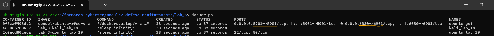

# Formação Cybersec - Labs Módulo 2   

### Repository: [boot](../../../../)   
### Platform: <a href="../../../">vnw   </a>
### Software/Subject: <a href="../../">cybersecurity   </a>
### Bootcamp: <a href="../">boot_035 (Formação Cybersec)   </a>
### Module: 2. Defesa & Monitoramento (Blue Team)

#### <a href="./README.md">Teoria</a>

---

Esta pasta refere-se aos laboratórios do módulo 2 **Defesa & Monitoramento (Blue Team)** do bootcamp [**Formação Cybersec**](../).

### Theme:
- Cybersecurity

### Used Tools:
- Operating System (OS): 
  - Linux   
  - Windows 11   
- Linux Distribution:
  - Ubuntu   
- Cloud:
  - AWS   
- Cloud Services:
  - Amazon Elastic Compute Cloud (EC2)   
  - Google Drive   
- Containerization: 
  - Docker   
  - Docker Compose   
  - Docker Playground; Play With Docker (PWD)   
- Language:
  - HTML   
  - Markdown   
- Integrated Development Environment (IDE) and Text Editor:
  - Visual Studio Code (VS Code)   
- Versioning: 
  - Git   
- Repository:
  - GitHub   
- Command Line Interpreter (CLI):
  - AWS Command Line Interface (CLI)   
  - Bash e Sh   
- Tools:
  - Advanced Package Tool (Apt)   
  - Advanced Package Tool (Apt-Get)   
  - Curl   
- Network:
  - netstat   
  - Nmap   
  - OpenSSH   

- Offensive Security:
  - Kali Linux   

  - Arp-scan   
  - Domain Information Groper (Dig)   
  - Iproute   
  - Iputils-ping; Iputils   
  - Netdiscover   
  - Net-tools   

  - Ping   
  - Rustscan   

---

### Bootcamp Module 2 Structure
1. <a name="item1">Módulo 2: Defesa & Monitoramento (Blue Team) 
    1.1. <a href="#item1.1">Arquitetura em Camadas</a> 
    1.2. <a href="#item1.2">Hardening</a> 
    1.3. <a href="#item1.3">Firewall & ACL</a> 
    1.4. <a href="#item1.4">IDS e IPS</a> 
    1.5. <a href="#item1.5">IDS e IPS</a> 

---

### Objective:
Implementar estratégias de defesa em profundidade e monitoramento contínuo de ambientes computacionais, por meio do fortalecimento de sistemas, configuração de firewalls e ACLs, análise de vulnerabilidades, gestão de logs com ferramentas como **Wazuh** e **ELK**, uso de IDS/IPS e aplicação de boas práticas em segurança em nuvem e resposta a incidentes.

### Folder Structure:
- [README.md](./README.md): Documento escrito em **Markdown**, descrevendo todo conteúdo teórico realizado neste módulo.
- [labs.md](./labs.md): Este documento de README, escrito em **Markdown**, descrevendo todos os laboratórios realizados neste módulo.

### Development:
A configuração do ambiente foi realizada, assim como nos laboratórios do Módulo 1, utilizando o **Docker** em conjunto com o **WSL**. No entanto, foi adotada a plataforma **Play With Docker (PWD)**. Em situações em que os recursos disponíveis foram insuficientes, especialmente em laboratórios mais exigentes, foi utilizada uma instância do **Amazon Elastic Compute Cloud (EC2)**, na nuvem da **Amazon Web Services (AWS)**, como alternativa de execução.

A criação da instância EC2 foi automatizada por meio do script [`ec2Instance.ps1`](../../environment/ec2Instance.ps1), desenvolvido em **PowerShell** utilizando comandos da **AWS Command Line Interface (CLI)**. O script está localizado na pasta [`environment`](../../environment/) deste bootcamp. A instância foi provisionada com a imagem `ami-020cba7c55df1f615`, baseada no sistema operacional **Ubuntu Linux**, associada a um volume **Amazon Elastic Block Store (EBS)** de `8 GB`, do tipo `gp` (General Purpose). O tipo de instância utilizado foi o `t3.medium`, com 2 vCPUs e 4 GB de memória. Para acesso, foi utilizado o par de chaves `keyPairUniversal`, previamente existente na conta da **AWS**, e o grupo de segurança atribuído foi o `default` da zona de disponibilidade `us-east-1a` (Norte da Virgínia). Um script de *user data* também foi utilizado para automatizar a instalação do **Git** e do **Docker** durante o processo de inicialização.

O acesso à instância podia ser feito tanto pelo console da **AWS** quanto por meio de conexão SSH utilizando o **OpenSSH** no **Windows PowerShell** da máquina local. Neste último caso, era necessário informar o caminho do arquivo `.pem`, o nome do usuário do sistema e o IP ou DNS público da instância. Um exemplo de comando seria: `ssh -i "G:/Meu Drive/4_PROJ/scripts/aws/.default/secrets/awsKeyPair/universal/keyPairUniversal.pem" ubuntu@54.160.249.118`. Além disso, o Security Group associado à instância precisava conter uma regra de entrada liberando a porta `22` para o IP público da máquina física, a fim de permitir o estabelecimento da conexão SSH.

As máquinas virtuais do **Play With Docker (PWD)** também foram acessadas via SSH. Nesse caso, o próprio ambiente fornecia o comando necessário para a conexão, que podia ser executado diretamente no **Windows PowerShell**, sem necessidade de autenticação com chave privada ou senha.

Com o ambiente **Docker** em execução, cada laboratório era iniciado separadamente a partir de arquivos `docker-compose.yml` e `Dockerfile`, fornecidos pelo instrutor do curso. O arquivo de **Docker Compose** era responsável por definir os serviços, volumes e redes necessários para o laboratório em questão. Para executar esses arquivos, o processo era basicamente o mesmo, o que mudava era o caminho para o arquivo correto. Dessa forma, a sequência era:
- Clonagem do repositório do bootcamp: `git clone https://github.com/Kensei-CyberSec-Lab/formacao-cybersec.git`.
- Alteração do diretório corrente para o diretório do arquivo: `cd formacao-cybersec/modulo2-defesa-monitoramento/lab_1`. Aqui era só trocar a última pasta do path para a aula correta.
- Execução do ambiente com **Docker Compose**: `docker compose up -d`. Este comando tinha que ser sempre executado na pasta onde o arquivo `docker-compose.yml` estava.
- Verificação dos containers ativos: `docker ps`.
- Comando para acessar os containers existentes: `docker exec -it kali /bin/bash`. Aqui era só trocar o nome do container que desejava-se acessar.
- Encerramento do ambiente: `docker compose down`. Este comando deveria ser sempre executado na pasta onde o arquivo `docker-compose.yml` estava.

<a name="item1.1"><h4>1.1 Arquitetura em Camadas</h4></a>[Back to summary](#item1)   
[Material do Lab](https://github.com/Kensei-CyberSec-Lab/formacao-cybersec/tree/main/modulo2-defesa-monitoramento/lab_1)

O primeiro laboratório executado neste módulo consistiu em um ambiente composto pelos seguintes containers: a aplicação web vulnerável **OWASP Juice Shop**, que simula um site de vendas de sucos (`juice_shop`); uma máquina **Ubuntu**, configurada como servidor **Linux** para aplicação de hardening (`ubuntu_host`); e uma máquina com sistema **Kali Linux**, equipada com ferramentas para ataque (`kali_host`). Neste estágio, os sistemas ainda não contava com nenhuma camada de proteção ou hardening, que foram sendo adicionadas gradualmente nos laboratórios seguintes.

Como a primeira aula abordava o tema de arquitetura em camadas, o propósito deste laboratório foi introduzir o conceito de defesa em profundidade, observando como cada camada poderia contribuir para a segurança do sistema. Assim, o foco foi analisar os sistemas intencionalmente vulneráveis, representado pelo servidor web Juice Shop e pelo servidor **Ubuntu**, antes da aplicação de qualquer mecanismo de defesa — com o objetivo de identificar riscos e compreender a perspectiva de um atacante. 

Para isso, os dois sistemas de defesa — a aplicação web e o servidor **Ubuntu** — foram acessados. O primeiro, por meio do navegador da máquina física, foi utilizado para a exploração das páginas da aplicação. O segundo foi acessado diretamente pelo container, com o objetivo de listar e identificar os serviços ativos. O container de ataque, que correspondia ao **Kali Linux**, foi utilizado posteriormente para realizar varreduras nos dois sistemas de defesa, com o intuito de identificar possíveis vulnerabilidades.

Este laboratório foi executado no **Play With Docker (PWD)**, utilizando apenas um node. Após a conexão via SSH com a instância, realizada por meio do **Windows PowerShell** da máquina física utilizando o **OpenSSH**, o ambiente de containers foi construído, conforme mostrado na imagem 01. Note que o container `juice_shop` apresentava um mapeamento de portas: a porta `3000`, onde a aplicação web estava em execução dentro do container, foi mapeada para a porta `3001` da instância. Assim, ao solicitar ao PWD que abrisse a porta `3001`, a aplicação vulnerável **OWASP Juice Shop** pôde ser acessada, como ilustrado na imagem 02.

<figure>
     
    <figcaption>Imagem 01.</figcaption>
</figure>
 

<figure>
     
    <figcaption>Imagem 02.</figcaption>
</figure>
 

Logo ao acessar a aplicação, uma mensagem de boas-vindas era exibida, informando que o **OWASP Juice Shop** é uma aplicação web com um vasto número de vulnerabilidades de segurança intencionais. Essa aplicação é amplamente utilizada para testes e práticas de identificação de vulnerabilidades. Dentre as funcionalidades disponíveis, havia a opção de login, permitindo que o usuário acesse uma conta existente ou realize um novo cadastro. Para fins de teste, foi criado um cadastro fictício com o e-mail aleatório `teste@gmail.com` e a senha `Testes1@`. Após o login, já era possível adicionar produtos ao carrinho, simulando o funcionamento típico de um site de e-commerce. A imagem 03 ilustra um exemplo de carrinho montado na seção `Your Basket`.

<figure>
     
    <figcaption>Imagem 03.</figcaption>
</figure>
 

Ao acessar a área da conta do usuário (`Account`), diversas funcionalidades adicionais tornaram-se disponíveis. Entre elas, destacou-se a opção `Orders & Payment`, que incluía: `Order History`, `Recycle`, `My saved addresses`, `My Payment Options` e `Digital Wallet`. Outra seção relevante era `Privacy & Security`, que disponibilizava opções como: `Privacy Policy`, `Request Data Export`, `Request Data Erasure`, `Change Password`, `2FA Configuration` e `Last Login IP`. Também era possível realizar o logout por meio da opção `Logout`. Fora da área `Account`, era permitido alterar o idioma do site, além de acessar outras funcionalidades voltadas ao desenvolvimento da aplicação, localizadas no menu lateral esquerdo.

Após a análise do primeiro sistema, foi acessado o segundo, correspondente ao servidor **Ubuntu**, por meio do comando `docker exec -it ubuntu_host /bin/bash`. Dentro do container, foi executado o comando `ps aux` com o objetivo de listar todos os processos em execução. A saída retornou apenas três processos: um relacionado à execução do próprio `ps aux`, outro referente ao processo `/bin/bash`, iniciado pelo comando **Docker** para interação via shell, e o processo `sleep infinity`, responsável por manter o container ativo. Em seguida, foi utilizado o comando `netstat -tulnp` para verificar as conexões de rede em modo de escuta. A saída indicou duas conexões locais: uma utilizando o protocolo TCP na porta `46830` do IP `127.0.0.11`, e outra via protocolo UDP na porta `56529`, também no mesmo IP. Essas conexões estavam associadas ao sistema de DNS interno do **Docker** e não representam serviços de rede típicos, como servidores HTTP ou SSH. Isso indicava que não havia serviços expostos ou em execução em portas padrão. Esse segundo sistema consistia em um servidor **Ubuntu** básico, que seria utilizado nos próximos exercícios para aplicação e teste de técnicas de hardening. A imagem 04 apresenta a saída dos comandos descritos.

<figure>
     
    <figcaption>Imagem 04.</figcaption>
</figure>
 

Com a análise dos sistemas de defesa concluída, o próximo passo foi utilizar o container de ataque, o **Kali Linux**, para realizar varreduras nos dois alvos em busca de vulnerabilidades. Para isso, a conexão com o container anterior foi encerrada, e o acesso ao Kali foi feito com o comando `docker exec -it kali_host /bin/bash`. Já dentro do Kali, foi necessário identificar as interfaces de rede disponíveis. Como o comando `ip` não estava presente por padrão, a ferramenta **iproute2** precisou ser instalada com `apt update && apt install iproute2 -y`. Em seguida, o comando `ip a` revelou uma única interface Ethernet, a `eth0`, com o endereço IP `172.20.0.3/16`. A partir desse CIDR, foi possível deduzir que a rede local seguia o padrão `172.20.0.0/24`. Utilizando o comando `nmap -sn 172.20.0.0/24`, foi realizada uma varredura para identificar os hosts ativos na rede. O resultado indicou quatro dispositivos: o próprio Kali (`172.20.0.3`), o IP `172.20.0.1`, provavelmente o gateway da rede, e os IPs `172.20.0.2` e `172.20.0.4`, correspondentes respectivamente aos containers `juice_shop.lab_1_cyberlab_net` e `ubuntu_host.lab_1_cyberlab_net`. A imagem 05 exibe essa descoberta.

<figure>
     
    <figcaption>Imagem 05.</figcaption>
</figure>
 

Agora que os IPs de cada sistema foram identificados, o próximo passo foi escanear individualmente cada um deles para descobrir quais portas estavam abertas e quais serviços estavam em execução. Para isso, foram utilizados os comandos `nmap -sS -sV 172.20.0.2` e `nmap -sS -sV 172.20.0.4`, evidenciados nas imagens 06 e 07.

<figure>
     
    <figcaption>Imagem 06.</figcaption>
</figure>
 

<figure>
     
    <figcaption>Imagem 07.</figcaption>
</figure>
 

A análise do resultado do primeiro comando indicava que a porta `3000` estava aberta e escutando conexões TCP, embora o serviço não tenha sido corretamente identificado pelo **nmap**. No entanto, a resposta HTTP recebida indicava claramente que se tratava da aplicação **OWASP Juice Shop**, confirmando o funcionamento esperado. Já o escaneamento realizado no IP `172.20.0.4`, correspondente ao servidor **Ubuntu**, não revelou portas abertas, pois todas as 1000 portas TCP padrão escaneadas estavam fechadas. Isso indicava que, naquele momento, o servidor **Ubuntu** não possuía serviços de rede expostos, reforçando que ele estava em uma configuração inicial sem aplicações escutando em portas acessíveis pela rede.

<a name="item1.2"><h4>1.2 Hardening</h4></a>[Back to summary](#item1)   
[Material do Lab](https://github.com/Kensei-CyberSec-Lab/formacao-cybersec/tree/main/modulo2-defesa-monitoramento/lab_2)

No laboratório anterior, foi realizado o acesso e a exploração de sistemas inseguros — o servidor web **OWASP** e o servidor **Ubuntu** — ambos sem qualquer mecanismo de defesa implantado. Neste segundo laboratório, iniciou-se o processo de hardening, com a aplicação de técnicas básicas de segurança. A dinâmica consistia em acessar primeiro o container **Kali Linux**, utilizado para atacar o container de defesa — neste caso, o servidor **Ubuntu** — evidenciando suas vulnerabilidades. Em seguida, realizava-se o acesso ao servidor **Ubuntu** para aplicar as técnicas de hardening correspondentes e, por fim, repetia-se o ataque a partir do **Kali Linux** para verificar se as vulnerabilidades haviam sido mitigadas. As técnicas de hardening aplicadas foram:
- Criação de um usuário com privilégios de `sudo`;
- Ativação do login por chave pública;
- Desativação do login com o usuário `root`;
- Desativação da autenticação por senha;
- Ativação do firewall;
- Remoção de serviços desnecessários;
- Restrição de permissões inadequadas.

O ambiente **Docker** construído neste laboratório, conforme ilustrado na imagem 08, era composto por apenas dois containers: o `kali_lab_2`, atuando como máquina de ataque, e o `ubuntu_lab_2`, atuando como máquina de defesa onde as técnicas de hardening seriam implementadas. Diferentemente do laboratório anterior, o container com a aplicação vulnerável **OWASP Juice Shop** não foi utilizado. Ambos os containers estavam conectados à mesma rede interna, com o endereço de rede `172.20.0.0/24`.

<figure>
     
    <figcaption>Imagem 08.</figcaption>
</figure>
 

Para facilitar a execução das atividades, foram utilizadas duas abas do **Windows PowerShell** na máquina física, ambas conectadas via **OpenSSH** à instância do **Play With Docker (PWD)**. A primeira aba foi destinada ao container de ataque (**Kali Linux**), acessado com o comando `docker exec -it kali_lab_2 /bin/bash`. A segunda aba foi usada para o container de defesa (**Ubuntu**), acessado por meio do comando `docker exec -it ubuntu_lab_2 /bin/bash`.

Antes de aplicar qualquer técnica de hardening no **Ubuntu**, o container **Kali Linux** foi utilizado para tentar uma conexão SSH com o servidor **Ubuntu**, com o comando `ssh root@172.20.0.10`, passando o usuário (`root`) e o endereço IP do container de destino. A senha do `root`, que era `rootlab`, foi solicitada para concluir a conexão. Como nenhuma técnica de hardening havia sido aplicada e o sistema se encontrava desprotegido, a conexão foi estabelecida com sucesso, conforme mostrado na imagem 09.

<figure>
     
    <figcaption>Imagem 09.</figcaption>
</figure>
 

Duas das técnicas de hardening que foram aplicadas eram desativar o login com o usuário `root` e alterar a autenticação de login, ao invés de ser por senha, utilizar a chave pública. A desativação do login com usuário `root` é extremamente importante tendo em vista que ele é o principal o usuário do sistema e portanto, ele possuí todas as permissões, o que pode ser bastante perigoso caso alguém consiga acessá-lo. Sendo assim, antes de desativar o login com o `root`, um novo usuário foi criado com o comando `adduser defensor`, onde foi solicitado a criação de uma senha para ele que foi definida como `Teste!@3`, e adicionado ao grupo de usuários `sudo` através do comando `usermod -aG sudo defensor`. O grupo de usuários `sudo` é .... Após essa primeira configuração, o container Kali foi novamente utilizado para se conectar com o container de defesa, só que agora utilizando o usuário `defensor`, que foi o criado (`ssh defensor@172.20.0.10`). Na imagem 10, é possível visualizar que ao tentar se conectar via SSH foi solicitado a senha deste usuário.

Duas das técnicas aplicadas nesse laboratório foram a desativação do login com o usuário `root` e a troca da autenticação por senha para autenticação por chave pública. A desativação do login com `root` é fundamental, pois esse é o usuário com nível máximo de privilégio no sistema e, em caso de comprometimento, pode ser utilizado para causar danos críticos. Por esse motivo, antes de bloquear o acesso direto, foi criado um novo usuário com o comando `adduser defensor` (a senha utilizada foi `Teste!@3`) e ele foi adicionado ao grupo de usuários `sudo` com o comando `usermod -aG sudo defensor`. O grupo `sudo` permite que usuários autorizados executem comandos administrativos utilizando o mecanismo de elevação de privilégio `sudo`, sem a necessidade de utilização do usuário `root`. Após essa configuração inicial, o container **Kali Linux** foi novamente utilizado para realizar uma conexão SSH, desta vez com o usuário `defensor` (`ssh defensor@172.20.0.10`). Na imagem 10 é possível observar que, ao tentar a nova conexão, a senha do usuário foi solicitada, e ao informá-la, a conexão foi estabelecida com sucesso.

<figure>
     
    <figcaption>Imagem 10.</figcaption>
</figure>
 

A desativação do login por `root` e da autenticação por senha são configurações realizadas no arquivo do serviço SSH (`/etc/ssh/sshd_config`). No entanto, ao desabilitar o login por senha, o usuário criado (`defensor`) também seria impactado. Por esse motivo, antes de modificar o arquivo de configuração, foi necessário gerar um par de chaves para o usuário `defensor`, transferir a chave privada para o container **Kali Linux** e testar o acesso por meio de autenticação baseada em chave. No **Ubuntu**, o comando `sudo -u defensor ssh-keygen -t rsa -b 4096 -f /home/defensor/.ssh/id_rsa -N ""` foi utilizado para gerar, com o software **OpenSSH**, um par de chaves do tipo `RSA` com 4096 bits, sem senha e armazenado no diretório `.ssh`. Em seguida, com o comando `sudo -u defensor bash -c "cat /home/defensor/.ssh/id_rsa.pub >> /home/defensor/.ssh/authorized_keys"`, o conteúdo da chave pública criada foi adicionado ao arquivo `authorized_keys`. Por fim, foram executados três comandos para ajustar permissões e proprietários dos diretórios:
- `chmod 700 /home/defensor/.ssh`: define permissão total somente para o proprietário do diretório `.ssh`;
- `chmod 600 /home/defensor/.ssh/authorized_keys`: restringe o acesso ao arquivo de chaves autorizadas apenas ao proprietário;
- `chown -R defensor:defensor /home/defensor/.ssh`: define o usuário e o grupo `defensor` como proprietários do diretório `.ssh` e de todo o seu conteúdo.

Para transferir o arquivo de chave privada de um container para o outro, foi necessária uma terceira aba do **Windows PowerShell**, conectada via SSH ao nó do **Play With Docker (PWD)**, mas sem acessar nenhum container. Dessa forma, os comandos foram executados diretamente na instância. Primeiro, o comando `docker cp ubuntu_lab_2:/home/defensor/.ssh/id_rsa ./id_rsa_defensor` foi utilizado para copiar o arquivo de chave privada do container `ubuntu_lab_2` para o diretório local da própria instância. Em seguida, o comando `chmod 600 id_rsa_defensor` foi executado para limitar o acesso ao arquivo apenas ao proprietário. Por fim, o comando `docker cp ./id_rsa_defensor kali_lab_2:/root/.ssh/id_rsa_defensor` foi utilizado para copiar o arquivo da instância para o container `kali_lab_2`.

Na aba do **PowerShell** em que o container **Kali Linux** estava acessado, o comando `chmod 600 ~/.ssh/id_rsa_defensor` foi executado para ajustar as permissões da chave importada. Em seguida, o comando `ssh -i ~/.ssh/id_rsa_defensor defensor@172.20.0.10` foi utilizado para estabelecer a conexão com o container **Ubuntu**, especificando o usuário (`defensor`), o endereço IP de destino e o caminho do arquivo de chave privada para autenticação. A imagem 11 mostra a conexão estabelecida com sucesso.

<figure>
     
    <figcaption>Imagem 11.</figcaption>
</figure>
 

A etapa seguinte consistiu na desativação do login com `root` e da autenticação por senha. No container **Ubuntu**, o arquivo de configuração do SSH foi aberto no editor de texto **Nano** pelo comando `nano /etc/ssh/sshd_config`. As opções `PermitRootLogin no` e `PasswordAuthentication no` foram editadas ou adicionadas, caso não existissem. Em seguida, o serviço SSH foi reiniciado com o comando `service ssh restart` para que as alterações entrassem em vigor, garantindo que o acesso direto como `root` fosse bloqueado e que apenas autenticação por chave fosse permitida.

As três técnicas de hardening restantes aplicadas foram: ativar o firewall, remover serviços desnecessários e restringir permissões inadequadas. Para remover serviços desnecessários, o software **Telnet** foi desinstalado com o comando `apt remove telnet -y`. O Telnet é um protocolo de comunicação que transmite dados, incluindo senhas, em texto puro, sendo considerado inseguro. Para restringir permissões inadequadas, a permissão do arquivo `/etc/shadow` foi ajustada com o comando `chmod 640 /etc/shadow`, protegendo as senhas dos usuários contra leitura por usuários não autorizados. O arquivo `/etc/shadow` é onde o **Linux** armazena as senhas dos usuários de forma segura. Ele contém informações sensíveis de cada conta do sistema, como nome de usuário, a senha criptografada, entre outros. Por fim, o firewall **UFW** foi instalado com `apt update && apt install -y ufw`, a permissão para conexões SSH foi liberada com `ufw allow OpenSSH` e o firewall foi ativado de forma forçada com `ufw --force enable`, garantindo que apenas os serviços permitidos fossem acessíveis.

Para finalizar, o **PowerShell** com o container de ataque acessado foi utilizado para executar os testes finais. Primeiramente, foram realizadas duas tentativas de conexão SSH com a máquina **Ubuntu**, utilizando os comandos `ssh root@172.20.0.10` e `ssh defensor@172.20.0.10`. Em cada comando, o usuário que tentava logar era diferente. Em ambos os casos, a conexão falhou corretamente, pois o SSH não permitia mais autenticação por senha, então nenhuma senha era solicitada e a conexão não era estabelecida. Por fim, o comando `ssh -i ~/.ssh/id_rsa_defensor defensor@172.20.0.10` foi utilizado, empregando o usuário criado `defensor` e sua respectiva chave privada, que havia sido previamente gerada e transferida para o container **Kali Linux**. A imagem 12 evidencia o funcionamento correto de todas as técnicas de hardening aplicadas.

<figure>
     
    <figcaption>Imagem 12.</figcaption>
</figure>
 

<a name="item1.3"><h4>1.3 Firewall & ACL</h4></a>[Back to summary](#item1)   
[Material do Lab](https://github.com/Kensei-CyberSec-Lab/formacao-cybersec/tree/main/modulo2-defesa-monitoramento/lab_3)

Neste terceiro laboratório, o objetivo foi aprimorar os conhecimentos de firewall e controle de acesso à rede utilizando o software **iptables** no **Linux**. Foram construídas regras de firewall para proteção dos sistemas, bloqueando ataques maliciosos e permitindo o tráfego legítimo e essencial. Também foram gerados logs para auditoria e diagnóstico, além do teste e validação dessas configurações de segurança.

<a name="item1.4"><h4>1.4 IDS e IPS</h4></a>[Back to summary](#item1)   
[Material do Lab](https://github.com/Kensei-CyberSec-Lab/formacao-cybersec/tree/main/modulo2-defesa-monitoramento/lab_4)

<a name="item1.5"><h4>1.5 </h4></a>[Back to summary](#item1)   
[Material do Lab](https://github.com/Kensei-CyberSec-Lab/formacao-cybersec/tree/main/modulo2-defesa-monitoramento/lab_5)
