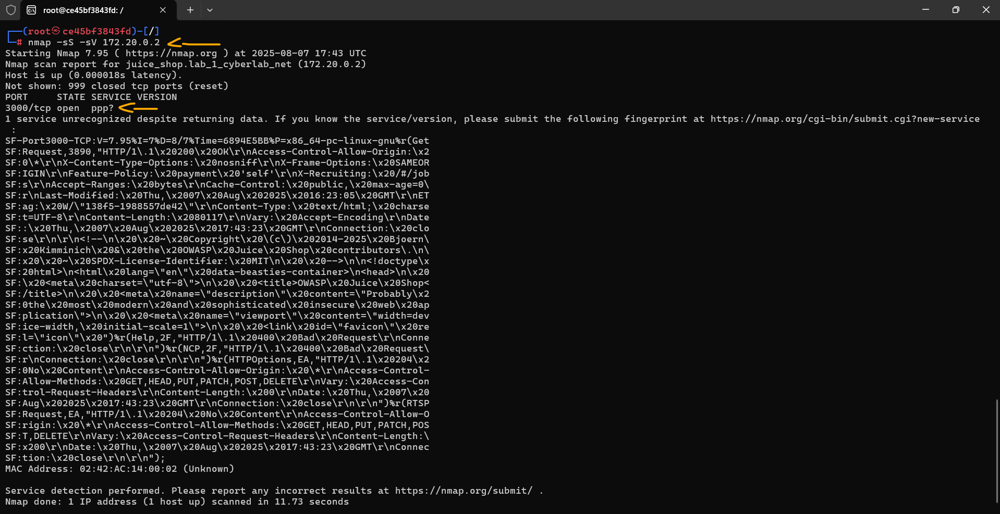

# Formação Cybersec - Labs Módulo 2   

### Repository: [boot](../../../../)   
### Platform: <a href="../../../">vnw   </a>
### Software/Subject: <a href="../../">cybersecurity   </a>
### Bootcamp: <a href="../">boot_035 (Formação Cybersec)   </a>
### Module: 2. Defesa & Monitoramento (Blue Team)

#### <a href="./README.md">Teoria</a>

---

Esta pasta refere-se aos laboratórios do módulo 2 **Defesa & Monitoramento (Blue Team)** do bootcamp [**Formação Cybersec**](../).

### Theme:
- Cybersecurity

### Used Tools:
- Operating System (OS): 
  - Linux   
  - Windows 11   
- Linux Distribution:
  - Ubuntu   
- Cloud:
  - AWS   
- Cloud Services:
  - Amazon Elastic Compute Cloud (EC2)   
  - Google Drive   
- Containerization: 
  - Docker   
  - Docker Compose   
  - Docker Playground; Play With Docker (PWD)   
- Language:
  - HTML   
  - Markdown   
- Integrated Development Environment (IDE) and Text Editor:
  - Nano   
  - Vi   
  - VI iMproved (Vim)   
  - Visual Studio Code (VS Code)   
- Versioning: 
  - Git   
- Repository:
  - GitHub   
- Command Line Interpreter (CLI):
  - AWS Command Line Interface (CLI)   
  - Bash e Sh   
- Tools:
  - Advanced Package Tool (Apt)   
  - Advanced Package Tool (Apt-Get)   
  - Curl   
- Network:
  - netstat   
  - Nmap   
  - OpenSSH   
  - Uncomplicated Firewall (UFW)   
- Remote Desktop:
  - RealVNC Viewer   
- Cibersecurity:
  - Kali Linux   
  - Trivy   
- SysAdm:
  - Xfce   

Makefile
---

### Bootcamp Module 2 Structure:
2. <a name="item2">Módulo 2: Defesa & Monitoramento (Blue Team) 
  2.1 <a href="#item2.1">Arquitetura em Camadas</a> 
  2.2 <a href="#item2.2">Hardening de Servidores Linux</a> 
  2.3 <a href="#item2.3">Firewall & ACL</a> 
  2.4 <a href="#item2.4">IDS e IPS</a> 
  2.5 <a href="#item2.5">Monitoramento de Logs</a> 
  2.6 <a href="#item2.6">Patch Management</a> 
  2.7 <a href="#item2.7">Cloud Security</a> 
  2.8 <a href="#item2.8">IAM e Permissionamento</a> 
  2.9 <a href="#item2.9">Container Security Docker Bench & Trivy</a> 
  2.10 <a href="#item2.10">NIST & Resposta a Incidentes</a> 

---

### Objective:
Implementar estratégias de defesa em profundidade e monitoramento contínuo de ambientes computacionais, por meio do fortalecimento de sistemas, configuração de firewalls e ACLs, análise de vulnerabilidades, gestão de logs com ferramentas como **Wazuh** e **ELK**, uso de IDS/IPS e aplicação de boas práticas em segurança em nuvem e resposta a incidentes.

### Folder Structure:
- [README.md](./README.md): Documento escrito em **Markdown** descrevendo todo conteúdo teórico realizado neste módulo.
- [labs.md](./labs.md): Este documento de README, escrito em **Markdown**, descrevendo todos os laboratórios realizados neste módulo.

### Development:
Em cibersegurança, é prática comum e recomendada realizar laboratórios em ambientes controlados e seguros. Por isso, ferramentas como **Docker** ou máquinas virtuais são utilizadas para simular ambientes reais, protegendo a infraestrutura local, uma vez que o uso de ferramentas de ataque ou alterações em configurações de rede podem comprometer a integridade do sistema. O ambiente de laboratório é estruturado em duas partes: a primeira envolve a instalação dos softwares que virtualização um ambiente, como **WSL2**, **Docker** ou **VM VirtualBox**, além de ferramentas de suporte essenciais, como editores de código (**Visual Studio Code (VS Code)**) e sistemas de versionamento (**Git**).  

Neste curso, a virtualização do ambiente foi realizada principalmente com **Docker** em conjunto com **WSL**. No entanto, para a maioria dos labs utilizei o **Docker** em instâncias do **Amazon Elastic Compute Cloud (EC2)**, na nuvem da **Amazon Web Services (AWS)**, como alternativa de execução. Em pequenos casos, para realizar testes, a plataforma **Play With Docker (PWD)** também foi utilizada.

A criação da instância EC2 foi automatizada por meio do script [`ec2Instance.ps1`](../environment/ec2Instance.ps1), desenvolvido em **Windows PowerShell** utilizando comandos da **AWS Command Line Interface (CLI)**. O script está localizado na pasta [`environment`](../environment/) deste curso, pois foi o mesmo para todos os módulos. A instância foi provisionada com a imagem `ami-020cba7c55df1f615`, baseada no sistema operacional **Linux Ubuntu**, associada a um volume do **Amazon Elastic Block Store (EBS)** de `8 GB`, do tipo `gp` (General Purpose). O tipo de instância utilizado foi o `t3.medium`, com 2 vCPUs e 4 GB de memória. Para acesso, foi utilizado o par de chaves `keyPairUniversal`, previamente existente na conta da **AWS**, e o grupo de segurança atribuído à instância foi o `default` da zona de disponibilidade `us-east-1a` (Norte da Virgínia). Um script de *user data* foi utilizado para automatizar a instalação do **Git** e do **Docker** durante o processo de inicialização.

O acesso à instância podia ser feito tanto pelo console da **AWS** quanto por meio de conexão SSH utilizando o **OpenSSH** no **Windows PowerShell** da máquina local. Neste último caso, era necessário informar o caminho do arquivo de chave privada, o nome do usuário do sistema e o IP ou DNS público da instância. Um exemplo de comando seria: `ssh -i "G:/Meu Drive/4_PROJ/scripts/aws/.default/secrets/awsKeyPair/universal/keyPairUniversal.pem" ubuntu@54.160.249.118`. Além disso, o Security Group associado à instância precisava conter uma regra de entrada liberando a porta `22` para o IP público da máquina física, a fim de permitir o estabelecimento da conexão SSH. As máquinas virtuais do **Play With Docker (PWD)** também foram acessadas via SSH. Nesse caso, o próprio ambiente fornecia o comando necessário para a conexão, que podia ser executado diretamente no **Windows PowerShell**, sem necessidade de autenticação com chave privada ou senha.

A segunda parte do ambiente de laboratório consiste na construção do ambiente simulado propriamente dito. No caso do **Docker**, isso envolve a criação de containers, redes e volumes, realizada por meio de dois tipos principais de arquivos. O primeiro é o `docker-compose.yml`, que define de forma serial toda a estrutura a ser criada: quais e quantos containers, suas configurações, as imagens que irão utilizar e os volumes e redes que serão estabelecidos. O segundo tipo de arquivo, que pode existir mais de um por laboratório, são os `Dockerfile`, responsáveis por criar imagens específicas para cada container. Essas imagens podem ser enviadas a repositórios de imagens **Docker**, como o **DockerHub**, ou referenciadas diretamente no arquivo do **Docker Compose**.

Todos esses arquivos eram preparados pelo instrutor do curso e disponibilizados no [repositório](https://github.com/Kensei-CyberSec-Lab/formacao-cybersec/) do curso no perfil da plataforma **Vai na Web** no **GitHub**. O repositório era organizado pelos três módulos do curso, com pastas correspondentes a cada laboratório. Geralmente, o número do laboratório coincidia com o número da aula, embora nem todos os labs seguissem essa sequência e nem todas as aulas tivessem laboratórios. Em cada pasta de laboratório, além dos arquivos `docker-compose.yml` e `Dockerfile`, podiam existir arquivos complementares, como scripts, textos ou documentos **Markdown**, contendo informações relevantes ou conteúdos necessários para a execução do lab. Durante a realização de cada lab, além de executar os exercícios, foi feita uma explicação detalhada sobre a construção dos arquivos de **Docker Compose**,  **Docker** e as dependências utilizadas, evidenciando como o ambiente foi estruturado.

Para executar os arquivos e iniciar o ambiente de laboratório, a sequência de comandos utilizada era a seguinte:
- `git clone https://github.com/Kensei-CyberSec-Lab/formacao-cybersec.git`: Clonagem do repositório do bootcamp para o ambiente local, seja no **WSL**, em máquinas virtuais ou, como no meu caso, em instâncias **Amazon EC2**.
- `cd formacao-cybersec/modulo2-fundamentos/lab_1`: Navegação até o diretório do laboratório a ser executado. Para outros labs, bastava alterar as duas últimas pastas do caminho para o módulo e lab correspondentes.
- `docker compose up -d`: Inicialização do ambiente com **Docker Compose**. Este comando devia ser executado na pasta onde o arquivo `docker-compose.yml` estava localizado.
- `docker ps` e `docker network ls`: Verificação dos containers ativos e das redes existentes no ambiente.
- `docker exec -it kali /bin/bash`: Acesso a um container em execução. Bastava substituir `kali` pelo nome do container que desejava-se acessar.
- `docker compose down`: Encerramento do ambiente. Assim como na inicialização, este comando devia ser executado na pasta onde se encontrava o arquivo `docker-compose.yml`.
- `docker system prune -f`: Remoção containers parados, redes não usadas, imagens dangling (imagens sem tags) e caches de build.
- `docker system prune -a`: Remoção containers parados, redes não usadas, imagens dangling (imagens sem tags) e caches de build, além de remoção de todas as imagens não usadas por containers.

Os laboratórios de cibersegurança são organizados com máquinas de ataque, geralmente uma **Kali Linux**, e máquinas alvo ou de defesa, que são os sistemas onde os ataques são realizados. Pode haver múltiplas máquinas de cada tipo, sendo comum que algumas máquinas de defesa sejam propositalmente vulneráveis, incluindo aplicações web criadas para testes. Como o ambiente é simulado via **Docker**, termos como servidor, máquina, container ou host frequentemente se referem aos containers que representam as máquinas simuladas. Além disso, é importante ter em mente que existiam outras duas camadas no ambiente: a máquina física, no caso meu computador pessoal **Windows**, e a máquina virtual fornecida pela **AWS** ou pelo **Play With Docker (PWD)**, que hospedava e executava os containers do **Docker**.

Outra parte importante dos laboratórios foram os *Capture The Flag (CTF)*, desafios técnicos amplamente utilizados na área de cibersegurança para desenvolver e validar conhecimento prático. Cada desafio apresenta um cenário específico — como exploração de vulnerabilidades, análise de tráfego, OSINT ou engenharia reversa — e exige que o participante realize uma ação ou resolva um problema para obter a flag. A flag não se limita a uma string ou código a ser encontrado, ela representa a prova de que o objetivo do desafio foi cumprido com sucesso. Ao longo dos laboratórios do curso, diversos CTFs foram incorporados ao ambiente simulado, servindo como etapas práticas de validação do conteúdo e permitindo aplicar, de forma objetiva, os conceitos aprendidos. Dessa forma, os laboratórios não apenas simularam cenários reais de ataque e defesa, como também proporcionaram desafios progressivos que reforçaram o raciocínio lógico, a análise técnica e a consolidação do conhecimento.

<a name="item2.1"><h4>2.1 Arquitetura em Camadas</h4></a>[Back to summary](#item2)   
[Material do Lab](https://github.com/Kensei-CyberSec-Lab/formacao-cybersec/tree/main/modulo2-defesa-monitoramento/lab_1)

Obs.: Laboratório registrado como 1, documento como 1 e referente a aula 1.

<strong>Ambiente de Laboratório</strong>

  <ul>
    <li>

<strong>Docker Compose</strong>

        <ul>
          <li>

<strong>juice_shop:</strong>

            <ul>
              <li><strong>image:</strong> Define a imagem do container como <code>bkimminich/juice-shop</code>.</li>
              <li><strong>plataform:</strong> Define a plataforma como <code>linux/amd64</code>.</li>
              <li><strong>container_name:</strong> Define o nome do container como <code>juice_shop</code>.</li>
              <li><strong>ports:</strong>
                <ul>
                  <li><code>"3001:3000"</code>: Mapeia a porta 3000 do container (onde o Juice Shop roda) para a porta 3001 do host, permitindo acesso em <code>http://localhost:3001</code>.</li>
                </ul>
              </li>
              <li><strong>networks:</strong> Conecta o container à rede <code>cyberlab_net</code>, permitindo comunicação com outros containers do laboratório.</li>
            </ul>
          
</li>
          <li>

<strong>ubuntu_host:</strong>

            <ul>
              <li><strong>build:</strong> Constrói a imagem a partir do diretório <code>./ubuntu_host</code>, utilizando o arquivo de Dockerfile.</li>
              <li><strong>container_name:</strong> Define o nome do container como <code>ubuntu_host</code>.</li>
              <li><code>command: sleep infinity</code>: Mantém o container ativo em execução contínua, permitindo acesso interativo.</li>
              <li><code>tty: true</code>: Permite alocar um terminal interativo para o container.</li>
              <li><strong>networks:</strong> Conecta o container à rede <code>cyberlab_net</code>, permitindo comunicação interna com Kali e Juice Shop.</li>
            </ul>
          
</li>
          <li>

<strong>kali:</strong>

            <ul>
              <li><strong>build:</strong> Constrói a imagem a partir do diretório <code>./kali</code>, utilizando o arquivo Dockerfile.</li>
              <li><strong>container_name:</strong> Define o nome do container como <code>kali_host</code>.</li>
              <li><code>command: sleep infinity</code>: Mantém o container ativo, permitindo uso interativo das ferramentas instaladas.</li>
              <li><code>tty: true</code>: Permite alocar um terminal interativo para sessões com <code>docker exec -it</code>.</li>
              <li><strong>networks:</strong> Conecta o container à rede <code>cyberlab_net</code>, permitindo comunicação interna com os outros containers.</li>
            </ul>
          
</li>
          <li>

<strong>cyberlab_net:</strong>

            <ul>
              <li><code>driver: bridge</code>: Define a rede como <em>bridge</em>, permitindo que os containers se comuniquem de forma isolada dentro do host.</li>
            </ul>
          
</li>
        </ul>
      
</li>
    <li>

<strong>Dockerfile</strong>

      <ul> 
        <li>

<strong>Dockerfile.kali</strong>

          <ul>
            <li><code>FROM kalilinux/kali-rolling</code>: Define a imagem base como Kali Linux (rolling).</li>
            <li><code>ENV DEBIAN_FRONTEND=noninteractive</code>: Configura para instalação de pacotes sem interação do usuário.</li>
            <li><strong>RUN:</strong> Executa a instalação de ferramentas necessárias:
              <ul>
                <li><code>apt update</code>: Atualiza a lista de pacotes.</li>
                <li><code>apt install -y nmap netcat-traditional curl dnsutils vim python3 whois git</code>: Instala ferramentas essenciais de rede e pentest.</li>
                <li><code>apt clean</code>: Remove arquivos temporários e limpa cache.</li>
              </ul>
            </li>
            <li><code>CMD ["/bin/bash"]</code>: Mantém o container ativo com shell Bash interativo.</li>
          </ul>
        
</li>
        <li>

<strong>Dockerfile.ubuntu_host</strong>

          <ul>
            <li><code>FROM ubuntu:20.04</code>: Define a imagem base como Ubuntu 20.04.</li>
            <li><code>ENV DEBIAN_FRONTEND=noninteractive</code>: Impede prompts interativos durante a instalação de pacotes.</li>
            <li><strong>RUN:</strong> Executa a instalação de ferramentas necessárias:
              <ul>
                <li><code>apt update</code>: Atualiza a lista de pacotes.</li>
                <li><code>apt install -y net-tools iputils-ping curl vim openssh-server ufw sudo</code>: Instala utilitários de rede, SSH, firewall e sudo.</li>
                <li><code>apt clean</code>: Limpa cache do apt.</li>
              </ul>
            <li><strong>RUN:</strong> Executa comandos:
              <ul>
                <li><code>useradd -m aluno && echo "aluno:senha123" | chpasswd && adduser aluno sudo</code>: Cria usuário não-root (<code>aluno</code>) com senha e privilégios de sudo.</li>
              </ul>
            <li><strong>RUN:</strong> Executa comandos:
              <ul>
                <li><code>mkdir /var/run/sshd</code>: Cria o diretório necessário para o SSH.</li>
                <li><code>sed -i 's/#PermitRootLogin prohibit-password/PermitRootLogin no/' /etc/ssh/sshd_config</code>: Edita o arquivo de configuração do SSH para desabilitar login com root.</li>
                <li><code>sed -i 's/#PasswordAuthentication yes/PasswordAuthentication yes/' /etc/ssh/sshd_config</code>: Edita o arquivo de configuração do SSH para permitir autenticação por senha.</li>
              </ul>
            </li>
            <li><code>EXPOSE 22</code>: Expõe a porta SSH (22) para conexões internas.</li>
            <li><code>CMD ["/bin/bash"]</code>: Mantém o container ativo com shell Bash.</li>
          </ul>
        
</li>
      </ul>
    
</li>
    <li>

<strong>Dependências</strong>

      <ul>
        <li><strong>package-lock.json</strong>: Arquivo de bloqueio de dependências Node.js. Neste caso, está vazio e serve apenas como placeholder para controle de pacotes.</li>
      </ul>
    
</li>
  </ul>

O primeiro laboratório executado neste módulo consistiu em um ambiente composto pelos seguintes containers: a aplicação web vulnerável **OWASP Juice Shop**, que simula um site de vendas de sucos (`juice_shop`); uma máquina **Ubuntu**, configurada como servidor **Linux** para aplicação de hardening (`ubuntu_host`); e uma máquina com sistema **Kali Linux**, equipada com ferramentas para ataque (`kali_host`). 

Como a primeira aula abordava o tema de arquitetura em camadas, o propósito deste laboratório foi introduzir o conceito de defesa em profundidade, observando como cada camada poderia contribuir para a segurança do sistema. Assim, o foco foi analisar os sistemas intencionalmente vulneráveis, representado pelo servidor web **Juice Shop** e pelo servidor **Ubuntu**, antes da aplicação de qualquer mecanismo de defesa — com o objetivo de identificar riscos e compreender a perspectiva de um atacante. 

Para isso, os dois sistemas alvo — a aplicação web e o servidor **Ubuntu** — foram acessados. O primeiro, por meio do navegador da máquina física, foi utilizado para a exploração das páginas da aplicação. O segundo foi acessado diretamente pelo container, com o objetivo de listar e identificar os serviços ativos. O container de ataque, que correspondia ao **Kali Linux**, foi utilizado posteriormente para realizar varreduras nos dois sistemas de defesa, com o intuito de identificar possíveis vulnerabilidades.

Este laboratório foi executado no **Play With Docker (PWD)**, utilizando apenas um único nó, em substituição à instância **Amazon EC2** da **AWS**. Após a conexão via SSH com a instância, realizada por meio do **OpenSSH** executado no **Windows PowerShell** da máquina física, o ambiente de containers foi construído, conforme mostrado na imagem 01. Note que o container `juice_shop` apresentava um mapeamento de portas: a porta `3000`, onde a aplicação web estava em execução dentro do container, foi mapeada para a porta `3001` da instância. Assim, ao solicitar ao PWD que abrisse a porta `3001`, a aplicação vulnerável **OWASP Juice Shop** pôde ser acessada, como ilustrado na imagem 02.

<figure>
     
    <figcaption>Imagem 01.</figcaption>
</figure>
 

<figure>
     
    <figcaption>Imagem 02.</figcaption>
</figure>
 

Logo ao acessar a aplicação, uma mensagem de boas-vindas era exibida, informando que o **OWASP Juice Shop** é uma aplicação web com um vasto número de vulnerabilidades de segurança intencionais. Essa aplicação é amplamente utilizada para testes e práticas de identificação de vulnerabilidades. Dentre as funcionalidades disponíveis, havia a opção de login, permitindo que o usuário acessasse uma conta existente ou realizasse um novo cadastro. Para fins de teste, foi criado um cadastro fictício com o e-mail aleatório `teste@gmail.com` e a senha `Testes1@`. Após o login, já era possível adicionar produtos ao carrinho, simulando o funcionamento típico de um site de e-commerce. A imagem 03 ilustra um exemplo de carrinho montado na seção `Your Basket`.

<figure>
     
    <figcaption>Imagem 03.</figcaption>
</figure>
 

Ao acessar a área da conta do usuário (`Account`), diversas funcionalidades adicionais tornaram-se disponíveis. Entre elas, destacou-se a opção `Orders & Payment` que incluía: `Order History`, `Recycle`, `My saved addresses`, `My Payment Options` e `Digital Wallet`. Outra seção relevante era `Privacy & Security` que disponibilizava opções como: `Privacy Policy`, `Request Data Export`, `Request Data Erasure`, `Change Password`, `2FA Configuration` e `Last Login IP`. Também era possível realizar o logout por meio da opção `Logout`. Fora da área `Account`, era permitido alterar o idioma do site, além de acessar outras funcionalidades voltadas ao desenvolvimento da aplicação, localizadas no menu lateral esquerdo.

Com a análise do primeiro sistema, foi acessado o segundo, correspondente ao servidor **Ubuntu**, por meio do comando `docker exec -it ubuntu_host /bin/bash`. Dentro do container, foi executado o comando `ps aux` com o objetivo de listar todos os processos em execução. A saída retornou apenas três processos: um relacionado à execução do próprio `ps aux`, outro referente ao processo `/bin/bash`, iniciado pelo comando **Docker** para interação via shell, e o processo `sleep infinity` gerado pelo **Docker Compose** e responsável por manter o container ativo. Em seguida, foi utilizado o comando `netstat -tulnp` para verificar as conexões de rede em modo de escuta. A saída indicou duas conexões locais: uma utilizando o protocolo TCP na porta `46830` do IP `127.0.0.11`, e outra via protocolo UDP na porta `56529`, também no mesmo IP. Essas conexões estavam associadas ao sistema de DNS interno do **Docker** e não representam serviços de rede típicos, como servidores HTTP ou SSH. Isso indicava que não havia serviços expostos ou em execução em portas padrão. A imagem 04 apresenta a saída dos comandos descritos.

<figure>
     
    <figcaption>Imagem 04.</figcaption>
</figure>
 

Após a análise inicial dos sistemas concluída, o passo seguinte foi utilizar o container de ataque **Kali Linux** para realizar varreduras nos dois alvos, identificando possíveis vulnerabilidades. Para isso, a conexão com o container anterior foi encerrada, e o acesso ao Kali foi feito com o comando `docker exec -it kali_host /bin/bash`. Já dentro do Kali, foi necessário identificar as interfaces de rede disponíveis. Como o comando `ip` não estava presente por padrão, a ferramenta **iproute2** precisou ser instalada com `apt update && apt install iproute2 -y`. Em seguida, o comando `ip a` revelou uma única interface Ethernet, a `eth0`, com o endereço IP `172.20.0.3/16`. A partir desse CIDR, foi possível deduzir que a rede local seguia o padrão `172.20.0.0/24`. Utilizando o comando `nmap -sn 172.20.0.0/24`, foi realizada uma varredura para identificar os hosts ativos na rede. O resultado indicou quatro dispositivos: o próprio Kali (`172.20.0.3`), o IP `172.20.0.1`, provavelmente o gateway da rede, e os IPs `172.20.0.2` e `172.20.0.4`, correspondentes respectivamente aos containers `juice_shop` e `ubuntu_host`. A imagem 05 exibe essa descoberta.

<figure>
     
    <figcaption>Imagem 05.</figcaption>
</figure>
 

Agora que os IPs de cada sistema foram identificados, o próximo passo foi escanear individualmente cada um deles para descobrir quais portas estavam abertas e quais serviços estavam em execução. Para isso, foram utilizados os comandos `nmap -sS -sV 172.20.0.2` e `nmap -sS -sV 172.20.0.4`. A imagem 06 evidencia a execução da primeira varredura, pois foi a única que apresentou resultados significativos.

<figure>
     
    <figcaption>Imagem 06.</figcaption>
</figure>
 

A análise do resultado do primeiro comando indicava que a porta `3000` estava aberta e escutando conexões TCP, embora o serviço não tenha sido corretamente identificado pelo **Nmap**. No entanto, a resposta HTTP recebida indicava claramente que se tratava da aplicação **OWASP Juice Shop**, confirmando o funcionamento esperado. Já o escaneamento realizado no IP `172.20.0.4`, correspondente ao servidor **Ubuntu**, não revelou portas abertas, pois todas as 1000 portas TCP padrão escaneadas estavam fechadas. Isso indicava que, naquele momento, o servidor **Ubuntu** não possuía serviços de rede expostos, reforçando que ele estava em uma configuração inicial sem aplicações escutando em portas acessíveis pela rede.

<a name="item2.2"><h4>2.2 Hardening de Servidores Linux</h4></a>[Back to summary](#item2)   
[Material do Lab](https://github.com/Kensei-CyberSec-Lab/formacao-cybersec/tree/main/modulo2-defesa-monitoramento/lab_2)

Obs.: Laboratório registrado como 2, documento como 2 e referente a aula 2.

<strong>Ambiente de Laboratório</strong>

  <ul>
    <li>

<strong>Docker Compose</strong>

        <ul>
          <li>

<strong>ubuntu_lab_2:</strong>

            <ul>
              <li><strong>build:</strong> Constrói a imagem a partir do diretório atual (<code>.</code>) usando o arquivo <code>Dockerfile.ubuntu</code> (a receita de construção está nesse arquivo).</li>
              <li><strong>container_name:</strong> Define o nome do container como <code>ubuntu_lab_2</code>.</li>
              <li><code>tty: true</code>: Aloca um terminal virtual (TTY) para o container, útil para acesso interativo.</li>
              <li><code>stdin_open: true</code>: Mantém o stdin do container aberto para permitir interação via terminal.</li>
              <li><code>privileged: true</code>: Concede privilégios estendidos ao container (útil para operações de baixo nível em laboratório — use com cautela).</li>
              <li><strong>ports:</strong>
                <ul>
                  <li><code>"2222:22"</code>: Mapeia a porta SSH do container (22) para a porta 2222 do host — permite acessar o container via SSH pelo host na porta 2222.</li>
                </ul>
              </li>
              <li><strong>networks:</strong> Conecta o container à rede <code>labnet</code> com IP estático <code>172.20.0.10</code>.</li>
              <li><strong>volumes:</strong> <code>./provision.sh:/root/provision.sh</code> — monta o script de provisionamento dentro do container para execução ou referência.</li>
            </ul>
          
</li>
          <li>

<strong>kali_lab_2:</strong>

            <ul>
              <li><strong>build:</strong> Constrói a imagem a partir do diretório atual (<code>.</code>) usando o arquivo <code>Dockerfile.kali</code>.</li>
              <li><strong>container_name:</strong> Define o nome do container como <code>kali_lab_2</code>.</li>
              <li><code>tty: true</code>: Aloca um terminal virtual (TTY) para o container.</li>
              <li><code>stdin_open: true</code>: Mantém o stdin aberto para interação via terminal.</li>
              <li><code>privileged: true</code>: Concede privilégios estendidos ao container (necessário apenas se o lab exigir operações de baixo nível).</li>
              <li><strong>networks:</strong> Conecta o container à rede <code>labnet</code> com IP estático <code>172.20.0.20</code>.</li>
            </ul>
          
</li>
          <li>

<strong>labnet:</strong>

            <ul>
              <li><strong>ipam:</strong>
                <ul>
                  <li><strong>driver:</strong> <code>default</code> — mecanismo de alocação de IP conforme especificado.</li>
                  <li><strong>config:</strong>
                    <ul>
                      <li><code>subnet: 172.20.0.0/24</code> — define a faixa de endereços IPv4 utilizada pela rede do laboratório.</li>
                    </ul>
                  </li>
                </ul>
              </li>
            </ul>
          
</li>
        </ul>
      
</li>
    <li>

<strong>Dockerfile</strong>

      <ul>
        <li>

<strong>Dockerfile.kali</strong>

          <ul>
            <li><code>FROM kalilinux/kali-rolling</code>: Imagem base — Kali Linux (rolling).</li>
            <li><strong>RUN</strong>: Instalação de pacotes essenciais (explicado por partes):
              <ul>
                <li><code>apt update</code>: Atualiza a lista de pacotes disponíveis.</li>
                <li><code>apt install -y openssh-client</code>: Cliente SSH (útil para conexões externas a partir do Kali).</li>
                <li><code>apt install -y iputils-ping</code>: Ferramenta ping.</li>
                <li><code>apt install -y net-tools</code>: Ferramentas clássicas de rede (<code>ifconfig</code>, etc.).</li>
                <li><code>apt install -y nmap</code>: Varredor de portas/serviços.</li>
                <li><code>apt install -y curl</code>: Cliente HTTP/transferência de dados.</li>
                <li><code>apt install -y git</code>: Controle de versão / baixar repos.</li>
                <li><code>apt install -y vim</code>: Editor de texto.</li>
                <li><code>apt install -y python3</code>: Interprete Python3.</li>
                <li><code>apt install -y whois</code>: Consulta WHOIS.</li>
                <li><code>apt clean</code>: Limpa cache do apt para reduzir tamanho da imagem.</li>
              </ul>
            </li>
            <li><code>CMD ["/bin/bash"]</code>: Define o shell padrão quando o container é executado interativamente.</li>
          </ul>
        
</li>
        <li>

<strong>Dockerfile.ubuntu</strong>

          <ul>
            <li><code>FROM ubuntu:22.04</code>: Imagem base — Ubuntu 22.04.</li>
            <li><code>ENV DEBIAN_FRONTEND=noninteractive</code>: Evita prompts interativos durante a instalação de pacotes.</li>
            <li><strong>RUN</strong>: Instalação e configurações iniciais (descritas por item):
              <ul>
                <li><code>apt update</code> e <code>apt install -y openssh-server sudo ufw auditd telnet vim curl net-tools iproute2</code>: Instala servidor SSH, utilitários, firewall, auditd e ferramentas de rede.</li>
                <li><code>mkdir /var/run/sshd</code>: Cria diretório necessário para o serviço SSH.</li>
                <li><code>echo 'root:rootlab' | chpasswd</code>: Define a senha do usuário root como <code>rootlab</code> (usar apenas em ambiente controlado/lab).</li>
                <li><code>sed -i 's/^#\?PermitRootLogin .*/PermitRootLogin yes/' /etc/ssh/sshd_config</code>: Habilita login direto como root via SSH (apenas para fins de laboratório, não recomendado em produção).</li>
                <li><code>sed -i 's/^#\?PasswordAuthentication .*/PasswordAuthentication yes/' /etc/ssh/sshd_config</code>: Permite autenticação por senha no SSH, facilitando o acesso no ambiente de testes.</li>
                <li>Observação: o Dockerfile contém comentários sobre criação de usuário defensor (comentado) — caso queira habilitar, é possível descomentar e ajustar a criação/permissões.</li>
              </ul>
            </li>
            <li><code>EXPOSE 22</code>: Indica que o container usa a porta SSH (22).</li>
            <li><code>CMD ["/usr/sbin/sshd", "-D"]</code>: Executa o daemon SSH em primeiro plano ao iniciar o container.</li>
          </ul>
        
</li>
      </ul>
    
</li>
    <li>

<strong>Dependências</strong>

      <ul>
        <li><strong>provision.sh</strong>: Script de provisionamento que garante a senha de root (<code>rootlab</code>), ajusta as configurações SSH (habilita <code>PermitRootLogin</code> e <code>PasswordAuthentication</code>) e reinicia/ativa o SSH dentro do container. Usado para preparar a máquina durante a aula.</li>
      </ul>
    
</li>
  </ul>

No laboratório anterior, foi realizado o acesso e a exploração de sistemas inseguros — o servidor web **OWASP** e o servidor **Ubuntu** — ambos sem qualquer mecanismo de defesa implantado. Neste segundo laboratório, iniciou-se o processo de hardening, com a aplicação de técnicas básicas de segurança. A dinâmica consistia em acessar primeiro o container **Kali Linux**, utilizado para atacar o container alvo — neste caso, o servidor **Ubuntu** — evidenciando suas vulnerabilidades. Em seguida, realizava-se o acesso ao servidor **Ubuntu** para aplicar as técnicas de hardening correspondentes e, por fim, repetia-se o ataque a partir do **Kali Linux** para verificar se as vulnerabilidades haviam sido mitigadas. As técnicas de hardening aplicadas foram:
- Criação de um usuário com privilégios de `sudo`;
- Ativação do login por chave pública;
- Desativação do login com o usuário `root`;
- Desativação da autenticação por senha;
- Ativação do firewall;
- Remoção de serviços desnecessários;
- Restrição de permissões inadequadas.

O ambiente **Docker** construído neste laboratório, conforme ilustrado na imagem 07, era composto por apenas dois containers: o `kali_lab_2`, atuando como máquina de ataque, e o `ubuntu_lab_2`, atuando como máquina alvo onde as técnicas de hardening seriam implementadas. Este ambiente foi implantado na instância do **Play With Docker (PWD)**. Ambos os containers estavam conectados à mesma rede interna, com o endereço de rede `172.20.0.0/24`.

<figure>
     
    <figcaption>Imagem 07.</figcaption>
</figure>
 

Para facilitar a execução das atividades, foram utilizadas duas abas do **Windows PowerShell** na máquina física, ambas conectadas via **OpenSSH** à instância do **Play With Docker (PWD)**. A primeira aba foi destinada ao container de ataque (**Kali Linux**), acessado com o comando `docker exec -it kali_lab_2 /bin/bash`. A segunda aba foi usada para o container de defesa (**Ubuntu**), acessado por meio do comando `docker exec -it ubuntu_lab_2 /bin/bash`.

Antes de aplicar qualquer técnica de hardening no **Ubuntu**, o container **Kali Linux** foi utilizado para tentar uma conexão SSH com o servidor **Ubuntu**, com o comando `ssh root@172.20.0.10`, passando o usuário (`root`) e o endereço IP do container de destino. A senha do `root`, que era `rootlab`, foi solicitada para concluir a conexão. Como nenhuma técnica de hardening havia sido aplicada e o sistema se encontrava desprotegido, a conexão foi estabelecida com sucesso, conforme mostrado na imagem 08.

<figure>
     
    <figcaption>Imagem 08.</figcaption>
</figure>
 

Duas das técnicas aplicadas nesse laboratório foram a desativação do login com o usuário `root` e a troca da autenticação por senha para autenticação por chave pública. A desativação do login com `root` é fundamental, pois esse é o usuário com nível máximo de privilégio no sistema e, em caso de comprometimento, pode ser utilizado para causar danos críticos. Por esse motivo, dentro do servidor **Ubuntu**, antes de bloquear o acesso direto, foi criado um novo usuário com o comando `adduser defensor`, definindo a senha como `Teste!@3` e as demais informações mantendo vazias. Este usuário foi adicionado ao grupo de usuários `sudo` com o comando `usermod -aG sudo defensor`. O grupo `sudo` permite que usuários autorizados executem comandos administrativos utilizando o mecanismo de elevação de privilégio `sudo`, sem a necessidade de utilização do usuário `root`. Após essa configuração inicial, o container **Kali Linux** foi novamente utilizado para realizar uma conexão SSH, desta vez com o usuário `defensor` (`ssh defensor@172.20.0.10`). Na imagem 09 é possível observar que, ao tentar a nova conexão, a senha do usuário foi solicitada, e ao informá-la, a conexão foi estabelecida com sucesso.

<figure>
     
    <figcaption>Imagem 09.</figcaption>
</figure>
 

A desativação do login por `root` e da autenticação por senha são configurações realizadas no arquivo do serviço SSH (`/etc/ssh/sshd_config`). No entanto, ao desabilitar o login por senha, o usuário criado (`defensor`) também seria impactado. Por esse motivo, antes de modificar o arquivo de configuração, foi necessário gerar um par de chaves para o usuário `defensor`, transferir a chave privada para o container **Kali Linux** e testar o acesso por meio de autenticação baseada em chave. No **Ubuntu**, o comando `sudo -u defensor ssh-keygen -t rsa -b 4096 -f /home/defensor/.ssh/id_rsa -N ""` foi utilizado para gerar, com o software **OpenSSH**, um par de chaves do tipo `RSA` com 4096 bits, sem senha e armazenado no diretório `.ssh`. Em seguida, com o comando `sudo -u defensor bash -c "cat /home/defensor/.ssh/id_rsa.pub >> /home/defensor/.ssh/authorized_keys"`, o conteúdo da chave pública criada foi adicionado ao arquivo `authorized_keys`. Por fim, foram executados três comandos para ajustar permissões e proprietários dos diretórios:
- `chmod 700 /home/defensor/.ssh`: define permissão total somente para o proprietário do diretório `.ssh`;
- `chmod 600 /home/defensor/.ssh/authorized_keys`: restringe o acesso ao arquivo de chaves autorizadas apenas ao proprietário;
- `chown -R defensor:defensor /home/defensor/.ssh`: define o usuário e o grupo `defensor` como proprietários do diretório `.ssh` e de todo o seu conteúdo.

Para transferir o arquivo de chave privada de um container para o outro, foi necessária uma terceira aba do **Windows PowerShell**, conectada via SSH ao nó do **Play With Docker (PWD)**, ou o próprio navegador com a instância do PWD aberta, mas sem acessar nenhum container. Dessa forma, os comandos foram executados diretamente na instância. Primeiro, o comando `docker cp ubuntu_lab_2:/home/defensor/.ssh/id_rsa ./id_rsa_defensor` foi utilizado para copiar o arquivo de chave privada do container `ubuntu_lab_2` para o diretório local da própria instância. Em seguida, o comando `chmod 600 id_rsa_defensor` foi executado para limitar o acesso ao arquivo apenas ao proprietário. Por fim, o comando `docker cp ./id_rsa_defensor kali_lab_2:/root/.ssh/id_rsa_defensor` foi utilizado para copiar o arquivo da instância para o container `kali_lab_2`.

Na aba do **PowerShell** em que o container **Kali Linux** estava acessado, o comando `chmod 600 ~/.ssh/id_rsa_defensor` foi executado para ajustar as permissões da chave importada. Em seguida, o comando `ssh -i ~/.ssh/id_rsa_defensor defensor@172.20.0.10` foi utilizado para estabelecer a conexão com o container **Ubuntu**, especificando o usuário (`defensor`), o endereço IP de destino e o caminho do arquivo de chave privada para autenticação. A imagem 10 mostra a conexão estabelecida com sucesso, agora com autenticação por par de chaves.

<figure>
     
    <figcaption>Imagem 10.</figcaption>
</figure>
 

A etapa seguinte consistiu na desativação do login com `root` e da autenticação por senha. No container **Ubuntu**, o arquivo de configuração do SSH foi aberto no editor de texto **Nano** pelo comando `nano /etc/ssh/sshd_config`, caso não houvesse o **Nano**, poderia ser utilizado qualquer outro editor de texto como **Vi** ou **Vim**. As opções `PermitRootLogin no` e `PasswordAuthentication no` foram editadas ou adicionadas, caso não existissem, trocando `yes` por `no`. Em seguida, o serviço SSH foi reiniciado com o comando `service ssh restart` para que as alterações entrassem em vigor, garantindo que o acesso direto como `root` fosse bloqueado e que apenas autenticação por chave fosse permitida. Pode ser que ao reiniciar o serviço SSH, o container seja derrubado, neste caso basta iniciá-lo com o comando `docker start ubuntu_lab_2` e acessá-lo novamente.

As três técnicas de hardening restantes aplicadas foram: ativar o firewall, remover serviços desnecessários e restringir permissões inadequadas. Para remover serviços desnecessários, o software **Telnet** foi desinstalado com o comando `apt remove telnet -y`. O Telnet é um protocolo de comunicação que transmite dados, incluindo senhas, em texto puro, sendo considerado inseguro. Para restringir permissões inadequadas, a permissão do arquivo `/etc/shadow` foi ajustada com o comando `chmod 640 /etc/shadow`, protegendo as senhas dos usuários contra leitura por usuários não autorizados. O arquivo `/etc/shadow` é onde o **Linux** armazena as senhas dos usuários de forma segura. Ele contém informações sensíveis de cada conta do sistema, como nome de usuário, a senha criptografada, entre outros. Por fim, o firewall **UFW** foi instalado com `apt update && apt install -y ufw`, a permissão para conexões SSH foi liberada com `ufw allow OpenSSH` e o firewall foi ativado de forma forçada com `ufw --force enable`, garantindo que apenas os serviços permitidos fossem acessíveis. Pode ser que neste último comando apareça uma mensagem de erro que é relativa a aplicação das regras para o IPv6, contudo como o ambiente é executado em containers **Docker**, ele não foi configurado para trabalhar com IPv6. Dessa forma, a mensagem pôde ser ignorada, pois funcionou para o IPv4, que era o que o **Docker** estava usando.

Para finalizar, o **PowerShell** com o container de ataque acessado foi utilizado para executar os testes finais. Primeiramente, foram realizadas duas tentativas de conexão SSH com a máquina **Ubuntu**, utilizando os comandos `ssh root@172.20.0.10` e `ssh defensor@172.20.0.10`. Em cada comando, o usuário que tentava logar era diferente. Em ambos os casos a conexão falhou corretamente, pois o SSH não permitia mais autenticação por senha, então nenhuma senha era solicitada e a conexão não era estabelecida. Por fim, o comando `ssh -i ~/.ssh/id_rsa_defensor defensor@172.20.0.10` foi utilizado, empregando o usuário criado `defensor` e sua respectiva chave privada, que havia sido previamente gerada e transferida para o container **Kali Linux**. A imagem 11 evidencia o funcionamento correto de todas as técnicas de hardening aplicadas.

<figure>
     
    <figcaption>Imagem 11.</figcaption>
</figure>
 

<a name="item2.3"><h4>2.3 Firewall & ACL</h4></a>[Back to summary](#item2)   
[Material do Lab](https://github.com/Kensei-CyberSec-Lab/formacao-cybersec/tree/main/modulo2-defesa-monitoramento/lab_3)

Obs.: Laboratório registrado como 3, documento como 3 e referente a aula 3.

<strong>Ambiente de Laboratório</strong>

  <ul>
    <li>

<strong>Docker Compose</strong>

        <ul>
          <li>

<strong>kali_lab_19:</strong>

            <ul>
              <li><strong>platform:</strong> <code>linux/amd64</code> — força arquitetura para compatibilidade.</li>
              <li><strong>build:</strong> Constrói a imagem a partir do contexto atual (<code>.</code>) usando o arquivo <code>dockerfiles/Dockerfile.kali</code>.</li>
              <li><strong>container_name:</strong> Define o nome do container como <code>kali_lab_19</code>.</li>
              <li><code>command: sleep infinity</code>: Mantém o container em execução contínua para uso interativo.</li>
              <li><code>privileged: true</code>: Concede privilégios estendidos ao container (necessário para operações de baixo nível no laboratório).</li>
              <li><strong>networks:</strong> Conecta o container à rede <code>cybersec_lab_19</code> com IP estático <code>192.168.100.11</code>.</li>
            </ul>
          
</li>
          <li>

<strong>ubuntu_lab_19:</strong>

            <ul>
              <li><strong>platform:</strong> <code>linux/amd64</code> — força arquitetura para compatibilidade.</li>
              <li><strong>build:</strong> Constrói a imagem a partir do contexto atual (<code>.</code>) usando o arquivo <code>dockerfiles/Dockerfile.ubuntu</code>.</li>
              <li><strong>container_name:</strong> Define o nome do container como <code>ubuntu_lab_19</code>.</li>
              <li><code>command: sleep infinity</code>: Mantém o container em execução contínua para uso interativo.</li>
              <li><code>privileged: true</code>: Concede privilégios estendidos ao container.</li>
              <li><strong>networks:</strong> Conecta o container à rede <code>cybersec_lab_19</code> com IP estático <code>192.168.100.10</code>.</li>
            </ul>
          
</li>
          <li>

<strong>ubuntu_gui:</strong>

            <ul>
              <li><strong>image:</strong> <code>consol/ubuntu-xfce-vnc</code> — imagem pronta com ambiente gráfico XFCE + VNC para acesso remoto ao desktop.</li>
              <li><strong>platform:</strong> <code>linux/amd64</code> — força arquitetura para compatibilidade.</li>
              <li><strong>container_name:</strong> Define o nome do container como <code>ubuntu_gui</code>.</li>
              <li><code>privileged: true</code>: Concede privilégios estendidos ao container (para integração gráfica / VNC).</li>
              <li><strong>ports:</strong>
                <ul>
                  <li><code>"5901:5901"</code>: Mapeia VNC para o host (porta 5901).</li>
                  <li><code>"6080:6901"</code>: Mapeia a interface web VNC (no host porta 6080 para o container 6901).</li>
                </ul>
              </li>
              <li><strong>environment:</strong>
                <ul>
                  <li><code>VNC_PW=kenseilab</code> — Define a senha do VNC para acesso remoto.</li>
                </ul>
              </li>
              <li><strong>networks:</strong> Conecta o container à rede <code>cybersec_lab_19</code> com IP estático <code>192.168.100.12</code>.</li>
            </ul>
          
</li>
          <li>

<strong>cybersec_lab_19:</strong>

            <ul>
              <li><code>driver: bridge</code>: Define a rede como <em>bridge</em>, isolando o tráfego entre containers dentro do host.</li>
              <li><strong>ipam:</strong>
                <ul>
                  <li><strong>config:</strong>
                    <ul>
                      <li><code>subnet: 192.168.100.0/24</code> — faixa de IPs usada pela rede do laboratório.</li>
                    </ul>
                  </li>
                </ul>
              </li>
            </ul>
          
</li>
        </ul>
      
</li>
    <li>

<strong>Dockerfile</strong>

      <ul> 
        <li>

<strong>dockerfiles/Dockerfile.kali</strong>

          <ul>
            <li><code>FROM kalilinux/kali-rolling</code>: Imagem base — Kali Linux (rolling).</li>
            <li><code>ENV DEBIAN_FRONTEND=noninteractive</code>: Evita prompts interativos durante instalação de pacotes (útil em builds automatizados).</li>
            <li><strong>RUN — atualização e instalação (explicado por etapas):</strong>
              <ul>
                <li><code>apt-get update</code>: Atualiza lista de pacotes.</li>
                <li><code>apt-get upgrade -y</code>: Atualiza pacotes instalados para versões mais recentes.</li>
                <li><code>apt-get install -y openssh-client</code>: Cliente SSH para conexões remotas.</li>
                <li><code>apt-get install -y nmap</code>: Ferramenta de varredura de portas/serviços.</li>
                <li><code>apt-get install -y curl wget</code>: Ferramentas de transferência HTTP/FTP.</li>
                <li><code>apt-get install -y net-tools iputils-ping telnet netcat-traditional tcpdump</code>: Utilitários de rede clássicos para diagnóstico e captura.</li>
                <li><code>apt-get install -y metasploit-framework sshpass</code>: Metasploit para exploração e sshpass para automação de SSH com senha.</li>
                <li><code>rm -rf /var/lib/apt/lists/*</code>: Limpa cache do apt para reduzir tamanho da imagem.</li>
              </ul>
            </li>
            <li><code>RUN mkdir -p /opt/lab-tools</code>: Cria diretório para armazenar scripts e ferramentas do laboratório.</li>
            <li><strong>RUN:</strong> Cria <code>/opt/lab-tools/test-lab.sh</code> com passos automatizados:
              <ul>
                <li><code>echo "🧪 Testando conectividade..."</code> — mensagem inicial.</li>
                <li><code>ping -c 3 192.168.100.10</code> — testa conectividade ICMP com o Ubuntu alvo.</li>
                <li><code>sshpass -p "root" ssh -o ConnectTimeout=5 -o StrictHostKeyChecking=no root@192.168.100.10 "echo SSH OK"</code> — tenta autenticar via SSH e verifica retorno.</li>
                <li><code>nmap -sS -p- 192.168.100.10</code> — executa varredura SYN em todas as portas do alvo.</li>
                <li><code>chmod +x /opt/lab-tools/test-lab.sh</code> - define permissão executável.</li>
              </ul>
            </li>
            <li><code>CMD ["/bin/bash"]</code>: Comando padrão, abre shell interativo ao iniciar o container.</li>
          </ul>
        
</li>
        <li>

<strong>dockerfiles/Dockerfile.ubuntu</strong>

          <ul>
            <li><code>FROM ubuntu:22.04</code>: Imagem base — Ubuntu 22.04.</li>
            <li><code>ENV DEBIAN_FRONTEND=noninteractive</code>: Evita prompts interativos durante instalação.</li>
            <li><strong>RUN — atualização e instalação de pacotes:</strong>
              <ul>
                <li><code>apt-get update</code> e <code>apt-get upgrade -y</code>: atualiza o sistema.</li>
                <li><code>apt-get install -y iptables iptables-persistent net-tools nmap curl wget openssh-server sudo vim htop iputils-ping telnet netcat-traditional tcpdump apache2 rsyslog</code>: instala firewall, utilitários de rede, SSH, servidor web e logging.</li>
                <li><code>rm -rf /var/lib/apt/lists/*</code>: limpa cache do apt.</li>
              </ul>
            </li>
            <li><strong>RUN — configurar SSH:</strong>
              <ul>
                <li><code>mkdir -p /var/run/sshd</code>: cria diretório necessário para o SSH.</li>
                <li><code>echo 'root:root' | chpasswd</code>: define senha do usuário <code>root</code> como <code>root</code> (apenas em ambiente controlado).</li>
                <li><code>sed -i 's/#PermitRootLogin prohibit-password/PermitRootLogin yes/' /etc/ssh/sshd_config</code>: Habilita login root via SSH (uso restrito a labs).</li>
                <li><code>sed -i 's/#PasswordAuthentication yes/PasswordAuthentication yes/' /etc/ssh/sshd_config</code>: Garante que autenticação por senha esteja habilitada.</li>
              </ul>
            </li>
            <li><strong>RUN — scripts e permissões:</strong>
              <ul>
                <li><code>mkdir -p /opt/lab-scripts</code>: cria diretório para scripts de laboratório.</li>
                <li><code>COPY scripts/iptables-example.sh /opt/lab-scripts/</code>: copia o script <em>iptables-example</em> para o container.</li>
                <li><code>COPY scripts/quick-setup.sh /opt/lab-scripts/</code>: copia o script <em>quick-setup</em> para o container.</li>
                <li><code>COPY scripts/test-firewall.sh /opt/lab-scripts/</code>: copia o script <em>test-firewall</em> para o container.</li>
                <li><code>COPY scripts/troubleshooting.sh /opt/lab-scripts/</code>: copia o script <em>troubleshooting</em> para o container.</li>
                <li><code>chmod +x /opt/lab-scripts/iptables-example.sh</code>: define permissão de execução para o script <em>iptables-example</em>.</li>
                <li><code>chmod +x /opt/lab-scripts/quick-setup.sh</code>: define permissão de execução para o script <em>quick-setup</em>.</li>
                <li><code>chmod +x /opt/lab-scripts/test-firewall.sh</code>: define permissão de execução para o script <em>test-firewall</em>.</li>
                <li><code>chmod +x /opt/lab-scripts/troubleshooting.sh</code>: define permissão de execução para o script <em>troubleshooting</em>.</li>
                <li><code>chmod 755 /opt/lab-scripts</code>: garante permissões de execução e leitura no diretório de scripts.</li>
              </ul>
            </li>
            <li><code>RUN chmod 755 /opt/lab-scripts:</code>: garante permissões de execução/leitura adequadas para a pasta de scripts.</li>
            <li><strong>RUN — página web de teste:</strong>
              <ul>
                <li>Cria <code>/var/www/html/index.html</code> com um HTML simples para testar o Apache.</li>
              </ul>
            </li>
            <li><code>EXPOSE 22 80</code>: Expõe portas SSH (22) e HTTP (80).</li>
            <li><code>CMD ["/bin/bash"]</code>: Comando padrão (abre shell), permitindo execução interativa e testes.</li>
          </ul>
        
</li>
      </ul>
    
</li>
    <li>

<strong>Dependências</strong>

      <ul>
        <li><strong>iptables-example.sh</strong>: Script de exemplo que aplica regras de firewall usando <code>iptables</code>, define políticas padrão, permite conexões estabelecidas e loopback, bloqueia SSH do Kali, adiciona logging e salva as regras em <code>/etc/iptables/rules.v4</code>. Deve ser executado como root.</li>
        <li><strong>quick-setup.sh</strong>: Script de configuração rápida do laboratório. Inicia serviços essenciais (como SSH), verifica e instala <code>iptables</code>, aplica configuração básica de firewall, salva regras e fornece instruções de teste e próximos passos. Executado como root.</li>
        <li><strong>test-firewall.sh</strong>: Script de teste que valida a configuração do firewall. Testa conectividade básica (ping), acesso SSH, regras aplicadas, portas específicas, logs de firewall e scan de portas com <code>nmap</code>. Fornece relatório de teste e recomendações.</li>
        <li><strong>troubleshooting.sh</strong>: Script de diagnóstico e correção de problemas no laboratório. Verifica instalação do Docker e Docker Compose, status dos containers, rede, serviços, ferramentas, permissões de scripts e logs. Aplica correções automáticas quando necessário e fornece comandos úteis para administração.</li>
      </ul>
    
</li>
  </ul>

No laboratório anterior, o tema de firewall foi abordado de forma superficial como uma das técnicas de *hardening*. Neste terceiro laboratório, o objetivo foi aprofundar os conhecimentos sobre controle de acesso à rede utilizando o software **iptables** no sistema **Linux**. A proposta consistiu em configurar um firewall diretamente na máquina alvo para bloquear especificamente conexões SSH provenientes da máquina atacante, ao mesmo tempo em que se mantinha liberado o tráfego legítimo, como requisições HTTP, conexões já estabelecidas e acessos SSH originados de máquinas administrativas.

O ambiente **Docker** criado para este laboratório, conforme ilustrado na imagem 12, foi implantando em uma instância **Amazon EC2** da **AWS**, com volume **Amazon EBS** de no mínimo 15 gigas, e era composto pelos seguintes containers:  
- `kali_lab_19`: máquina de ataque (IP `192.168.100.11`).  
- `ubuntu_lab_19`: servidor alvo (IP `192.168.100.10`).  
- `ubuntu_gui`: estação de trabalho com interface gráfica (IP `192.168.100.12`), utilizada para estabelecer conexões SSH com o servidor alvo, representando tráfego legítimo, uma vez que o IP da máquina **Kali Linux** iria ser bloqueado para acessos SSH durante o lab.

<figure>
     
    <figcaption>Imagem 12.</figcaption>
</figure>
 

Para acesso gráfico à máquina **Ubuntu** com interface gráfica (`ubuntu_gui`), havia duas opções. A primeira era por meio do navegador, acessando o IP ou DNS público da instância **EC2** na porta `6080`. A segunda consistia em instalar o software **RealVNC Viewer** e criar uma conexão com o IP ou DNS público da instância na porta `5901`. Em ambos os casos, foi necessário adicionar regras ao security group da instância **Amazon EC2**, liberando as portas `6080` e `5901` para o IP público da máquina física **Windows**. Para autenticação, era utilizado o usuário `root`, cuja senha era `kenseilab`. A imagem 13 mostra o acesso remoto gráfico realizado por meio do navegador, enquanto a imagem 14 exibe o acesso pelo software **VNC Viewer** instalado na máquina física. 

<figure>
     
    <figcaption>Imagem 13.</figcaption>
</figure>
 

<figure>
     
    <figcaption>Imagem 14.</figcaption>
</figure>
 

O container `ubuntu_gui` foi configurado no **Docker Compose** a partir de uma imagem da distribuição **Ubuntu** com o ambiente de desktop **XFCE**, leve e adequado para máquinas virtuais e containers, além do **VNC Server**, que possibilita a conexão remota à interface gráfica via protocolo VNC.  

No acesso remoto à instância **Amazon EC2**, o container **Ubuntu** em linha de comando foi aberto com `docker exec -it ubuntu_lab_19 bash`. Em seguida, executou-se o comando `sudo iptables -L` para inspecionar as regras do firewall **iptables** dessa máquina, que representava o servidor alvo. A imagem 15 mostra que, naquele momento, não havia nenhuma regra configurada. Também foi verificado o funcionamento dos serviços SSH com `service ssh status` e Apache com `service apache2 status`. Caso não estivessem em execução, eles deveriam ser iniciado manualmente com `service ssh start` e `service apache2 start`.

<figure>
     
    <figcaption>Imagem 15.</figcaption>
</figure>
 

Antes de configurar o firewall na máquina alvo, o container **Kali Linux** foi acessado para testar a conectividade com o servidor **Ubuntu**, utilizando o comando `docker exec -it kali_lab_19 bash` em um outro acesso remoto à instância EC2 pelo **PowerShell**. Inicialmente, o comando `ping -c 3 192.168.100.10` foi utilizado para verificar a comunicação entre as máquinas. Em seguida, `ssh root@192.168.100.10` com a senha `root` estabeleceu uma conexão SSH via **OpenSSH**, que foi concluída com sucesso, sendo finalizada posteriormente com `exit` para prosseguir com os testes. O comando `nmap -sS -p- 192.168.100.10` identificou as portas abertas no servidor alvo, e `curl http://192.168.100.10` testou a conectividade via HTTP. A imagem 16 exibe os resultados desses comandos.

<figure>
     
    <figcaption>Imagem 16.</figcaption>
</figure>
 

No **Dockerfile** do container, algumas instruções criaram um script automatizado localizado em `/opt/lab-tools/test-lab.sh`, que realizava todos os testes de conectividade de forma automática. Para executá-lo, bastava rodar o comando `./opt/lab-tools/test-lab.sh`. 

O container alvo foi novamente acesso, agora para configurar o firewall **iptables**. Para isso, os comandos `iptables -F` e `iptables -L` foram executados, respectivamente, para limpar todas as regras existentes, se hovesse, e listar o estado atual do firewall. Após a limpeza, três comandos definiram a política padrão do firewall, adotando a negação total conforme o princípio do menor privilégio:
- `iptables -P INPUT DROP`: bloqueiava todas as conexões de entrada por padrão, aceitando apenas pacotes explicitamente permitidos por regras adicionais.  
- `iptables -P FORWARD DROP`: descartava todo o tráfego roteado através da máquina, impedindo que pacotes passassem de uma rede para outra.  
- `iptables -P OUTPUT ACCEPT`: permitia todas as conexões de saída iniciadas pela própria máquina, a menos que regras adicionais restritivas fossem aplicadas.

Resumindo, todo tráfego de entrada era bloqueado, o tráfego de saída era permitido e nada era encaminhado/roteado. As conexões já estabelecidas foram autorizadas com o comando `iptables -A INPUT -m state --state ESTABLISHED,RELATED -j ACCEPT`. O tráfego local (loopback) foi liberado pelo comando `iptables -A INPUT -i lo -j ACCEPT`. As quatro regras seguintes definiam permissões específicas para portas ou IPs:
- `iptables -A INPUT -p tcp --dport 80 -j ACCEPT`: permitia o tráfego TCP na porta 80 (HTTP).  
- `iptables -A INPUT -s 192.168.100.11 -p tcp --dport 22 -j DROP`: bloqueiava conexões SSH (porta 22) vindas do IP `192.168.100.11` (máquina atacante).  
- `iptables -A INPUT -p tcp --dport 22 -j ACCEPT`: permitia conexões SSH na porta 22 vindas de qualquer outro IP.  
- `iptables -A INPUT -s 192.168.100.11 -j LOG --log-prefix "BLOCKED_KALI: "`: registrava no log todos os pacotes vindos do IP `192.168.100.11` com o prefixo `BLOCKED_KALI`.

Para verificar as regras configuradas, foram utilizados os comandos:
- `iptables -L -v -n`: exibia todas as regras com estatísticas e IPs numericamente.  
- `iptables -L --line-numbers`: mostrava as regras com numeração de linhas.  
- `iptables -L -v`: exibe estatísticas detalhadas do tráfego processado pelas regras.

As imagem 17 e 18 ilustram a saída desses comandos.

<figure>
     
    <figcaption>Imagem 17.</figcaption>
</figure>
 

<figure>
     
    <figcaption>Imagem 18.</figcaption>
</figure>
 

De volta ao container de ataque `kali_lab_19`, foram realizados testes para verificar o funcionamento das regras do firewall. Inicialmente, tentou-se estabelecer uma conexão SSH com `ssh root@192.168.100.10`, igual ao teste anterior à aplicação das regras, mas a conexão não foi estabelecida, pois o IP dessa máquina estava bloqueado para a porta `22`, padrão do SSH. Em seguida, o comando `ping -c 3 192.168.100.10` foi executado para verificar a conectividade entre as máquinas. Como não havia uma regra no **iptables** liberando pacotes ICMP (utilizados pelo **ping**), essa comunicação também foi bloqueada, devido à política padrão de rejeição de pacotes. Para permitir novamente o **ping**, foi adicionada a regra `iptables -I INPUT 2 -p icmp --icmp-type echo-request -j ACCEPT` no firewall do servidor alvo.

A requisição HTTP foi testada com `curl http://192.168.100.10` e executada com sucesso, pois a porta `80` não havia sido bloqueada. Por fim, um escaneamento de portas foi realizado com `nmap -sS -p- 192.168.100.10`, identificando apenas a porta `80` aberta. A imagem 19 exibe os resultados desses comandos, evidenciando que as regras do firewall estavam corretamente aplicadas.

<figure>
     
    <figcaption>Imagem 19.</figcaption>
</figure>
 

Para finalizar, o container **Ubuntu** com interface gráfica (`ubuntu_gui`) foi novamente acessado para comprovar que uma conexão SSH a partir de outra máquina, ou seja, de um IP diferente, funcionava corretamente no servidor alvo. Entretanto, este container apresentava algumas limitações: a autenticação era feita com um usuário não root, e não havia instalação do **sudo** nem do **OpenSSH**.  

Para contornar essas limitações, a máquina foi acessada via container com o comando `docker exec -it -u 0 ubuntu_gui bash`, definindo o usuário como root (UID 0). Em seguida, foram atualizadas as listas de repositórios em `/etc/apt/sources.list` e instalados os pacotes **sudo** e **OpenSSH**. Após essas configurações, retornou-se à interface gráfica, onde no terminal aberto foi executado o comando `ssh root@192.168.100.10`, utilizando a senha `root`, permitindo o acesso remoto ao servidor alvo, conforme evidenciado na imagem 20.

<figure>
     
    <figcaption>Imagem 20.</figcaption>
</figure>
 

<a name="item2.4"><h4>2.4 IDS e IPS</h4></a>[Back to summary](#item2)   
[Material do Lab](https://github.com/Kensei-CyberSec-Lab/formacao-cybersec/tree/main/modulo2-defesa-monitoramento)

A aula 4 não teve nenhum laboratório ou o laboratório ainda não foi construído pelo professor do curso.

<a name="item2.5"><h4>2.5 Monitoramento de Logs</h4></a>[Back to summary](#item2)   
[Material do Lab](https://github.com/Kensei-CyberSec-Lab/formacao-cybersec/tree/main/modulo2-defesa-monitoramento)

A aula 5 não teve nenhum laboratório ou o laboratório ainda não foi construído pelo professor do curso.

<a name="item2.6"><h4>2.6 Patch Management</h4></a>[Back to summary](#item2)   
[Material do Lab](https://github.com/Kensei-CyberSec-Lab/formacao-cybersec/tree/main/modulo2-defesa-monitoramento/lab_4)

Obs.: Laboratório registrado como 4, documento como 4 e referente a aula 6.

<strong>Ambiente de Laboratório</strong>

  <ul>
    <li>

<strong>Docker Compose</strong>

        <ul>
          <li>

<strong>app:</strong>

            <ul>
              <li><strong>build:</strong> Constrói a imagem a partir do diretório <code>./app</code> usando o arquivo <code>Dockerfile.bullseye</code>.</li>
              <li><strong>image:</strong> Nomeia a imagem construída como <code>lab27_app:local</code>.</li>
              <li><strong>container_name:</strong> Define o nome do container como <code>lab27_app</code>.</li>
              <li><strong>ports:</strong>
                <ul>
                  <li><code>"5001:5000"</code>: Mapeia a porta 5000 do container (onde roda a aplicação Flask) para a porta 5001 do host.</li>
                </ul>
              </li>
              <li><strong>command:</strong> Executa o comando <code>["python", "app.py"]</code> ao iniciar o container para executar o arquivo <code>app.py</code>.</li>
              <li><strong>environment:</strong> Define a variável de ambiente <code>FLASK_ENV=production</code> para execução em modo de produção.</li>
              <li><strong>restart:</strong> Configurado como <code>unless-stopped</code>, reinicia automaticamente o container caso ele falhe ou seja reiniciado o host.</li>
            </ul>
          
</li>
        </ul>
    </li>
    <li>

<strong>Dockerfile</strong>

      <ul>
        <li>

<strong>Dockerfile.bullseye:</strong>

          <ul>
            <li><code>FROM python:3.11-bullseye</code>: Imagem base mais pesada e suscetível a CVEs.</li>
            <li><code>WORKDIR /app</code>: Define diretório <code>/app</code> como diretório de trabalho.</li>
            <li><code>COPY requirements.txt .</code>: Copia o arquivo <code>requirements.txt</code> para o diretório de trabalho dentro do container.</li>
            <li><code>RUN pip install --no-cache-dir -r requirements.txt</code>: Instala as dependências do Python listadas no <code>requirements.txt</code>.</li>
            <li><code>EXPOSE 5000</code>: Expõe porta da aplicação Flask.</li>
            <li><code>CMD ["python", "app.py"]</code>: Executa aplicação.</li>
          </ul>
        
</li>
        <li>

<strong>Dockerfile.patched:</strong>

          <ul>
            <li><code>FROM python:3.11-slim</code>: Usa imagem base enxuta e atualizada do Python 3.11.</li>
            <li><code>ENV DEBIAN_FRONTEND=noninteractive PIP_NO_CACHE_DIR=1 PYTHONDONTWRITEBYTECODE=1 PYTHONUNBUFFERED=1</code>: Define variáveis de ambiente para evitar interações, reduzir cache e otimizar a execução do Python.</li>
            <li><code>RUN apt-get update && apt-get install -y --no-install-recommends ca-certificates && rm -rf /var/lib/apt/lists/*</code>: Instala pacotes mínimos necessários e limpa cache para manter a imagem leve.</li>
            <li><code>WORKDIR /app</code>: Define diretório <code>/app</code> como diretório de trabalho.</li>
            <li><code>COPY requirements.txt .</code>: Copia o arquivo <code>requirements.txt</code> para o diretório de trabalho.</li>
            <li><code>RUN pip install -r requirements.txt</code>: Instala as dependências Python listadas no <code>requirements.txt</code>.</li>
            <li><code>COPY app.py .</code>: Copia a aplicação principal para o container.</li>
            <li><code>EXPOSE 5000</code>: Expõe a porta 5000 para comunicação externa.</li>
            <li><code>CMD ["python", "app.py"]</code>: Define o comando padrão para executar a aplicação.</li>
          </ul>
        
</li>
        <li>

<strong>Dockerfile.zero-cves:</strong>

          <ul>
            <li><code>FROM python:3.11-slim</code>: Usa imagem base enxuta do Python 3.11.</li>
            <li><code>ENV DEBIAN_FRONTEND=noninteractive PIP_NO_CACHE_DIR=1 PYTHONDONTWRITEBYTECODE=1 PYTHONUNBUFFERED=1</code>: Define variáveis de ambiente para evitar prompts interativos, reduzir cache e otimizar execução do Python.</li>
            <li><strong>RUN:</strong>
              <ul>
                <li><code>apt-get update && apt-get install -y --no-install-recommends ca-certificates</code>: Atualiza repositórios e instala apenas os certificados necessários, sem pacotes extras.</li>
                <li><code>pip install --upgrade pip setuptools==78.1.1</code>: Atualiza o <code>pip</code> e fixa <code>setuptools</code> na versão <code>78.1.1</code>, corrigindo as vulnerabilidades CVE-2024-6345 e CVE-2025-47273.</li>
                <li><code>rm -rf /var/lib/apt/lists/*</code>: Remove cache do apt para reduzir o tamanho da imagem.</li>
              </ul>
            </li>
            <li><code>WORKDIR /app</code>: Define diretório <code>/app</code> como diretório de trabalho.</li>
            <li><code>COPY requirements-fixed.txt requirements.txt</code>: Copia o arquivo de dependências corrigido para dentro do container.</li>
            <li><code>RUN pip install -r requirements.txt</code>: Instala as dependências Python já corrigidas.</li>
            <li><code>COPY app.py .</code>: Copia o código da aplicação para o diretório de trabalho.</li>
            <li><code>EXPOSE 5000</code>: Expõe a porta 5000 para acesso externo.</li>
            <li><code>CMD ["python", "app.py"]</code>: Define o comando padrão para iniciar a aplicação.</li>
          </ul>
        
</li>
      </ul>
    </li>
    <li>

<strong>Dependências</strong>

      <ul>
        <li><strong>app.py</strong>: Código da aplicação Flask. Define uma rota raiz (<code>/</code>) que retorna um JSON simples (<code>{status: ok, message: Hello from patched lab!}</code>). A aplicação é inicializada no host <code>0.0.0.0</code> e porta <code>5000</code>.</li>
        <li><strong>requirements.txt</strong>: Lista de dependências do Python para a versão inicial/patched, incluindo <code>flask==3.0.2</code> e <code>gunicorn==21.2.0</code>.</li>
        <li><strong>requirements-fixed.txt</strong>: Versão corrigida das dependências, atualizando o <code>gunicorn</code> para <code>23.0.0</code> (eliminação de CVEs), mantendo <code>flask==3.0.2</code>.</li>
        <li>

<strong>Makefile</strong>: Automatiza comandos do laboratório, incluindo:

          <ul>
            <li><code>build</code>: Recria as imagens Docker sem cache (<code>docker compose build --no-cache</code>).</li>
            <li><code>up</code>: Sobe os containers em background (<code>docker compose up -d</code>).</li>
            <li><code>down</code>: Para e remove os containers (<code>docker compose down</code>).</li>
            <li><code>scan</code>: Executa script <code>scripts/scan.sh</code> para varredura de vulnerabilidades.</li>
            <li><code>patch</code>: Executa script <code>scripts/patch.sh</code> para aplicar correções.</li>
            <li><code>python-fix</code>: Executa script <code>scripts/python-fix.sh</code> para corrigir pacotes Python.</li>
            <li><code>rebuild</code>: Sequência de <code>down</code> → <code>build</code> → <code>up</code>.</li>
            <li><code>logs</code>: Exibe os logs do serviço <code>app</code> em tempo real.</li>
          </ul>
        
</li>
        <li><strong>patch.sh</strong>: Script que troca o <code>Dockerfile.bullseye</code> pelo <code>Dockerfile.patched</code> no <code>docker-compose.yml</code>, aplicando correção de vulnerabilidades.</li>
        <li><strong>policy.trivy.yaml</strong>: Política do Trivy que falha se encontrar vulnerabilidades <code>CRITICAL</code> ou <code>HIGH</code>, ignorando pacotes não corrigidos.</li>
        <li><strong>python-fix.sh</strong>: Script que aplica correções adicionais trocando para <code>Dockerfile.zero-cves</code>, atualizando <code>gunicorn</code> e <code>setuptools</code> para versões livres de CVEs.</li>
        <li><strong>scan.sh</strong>: Script que executa varredura de vulnerabilidades com Trivy (imagem e filesystem), gerando relatórios em <code>./reports</code>.</li>
      </ul>
    
</li>
  </ul>

Este laboratório teve como objetivo demonstrar o processo de identificação e correção de vulnerabilidades em containers de forma automatizada, utilizando o **Trivy** aliado a scripts que simulavam patches de segurança. Para isso, foi empregado um **Makefile**, com a função de centralizar e simplificar a execução dos comandos necessários: desde o build das imagens **Docker** e a criação dos containers até a varredura com o **Trivy** e a aplicação dos patches. O primeiro script executado integrava o **Trivy** ao processo, enquanto os demais eram responsáveis pela aplicação dos patches de segurança. 

A ferramenta **Makefile** é um utilitário tradicional de automação que permite agrupar e padronizar comandos em alvos específicos, facilitando a execução de tarefas repetitivas de forma consistente e organizada. O **Trivy** é uma ferramenta de segurança open source amplamente utilizada para realizar varreduras em imagens de contêiner, sistemas de arquivos e repositórios de código, identificando vulnerabilidades conhecidas e falhas de configuração. Sua aplicação permite detectar problemas antes do deploy em ambientes de produção, fortalecendo a segurança das aplicações containerizadas. Já os **patches** consistem em correções aplicadas a sistemas ou aplicações com o objetivo de mitigar vulnerabilidades, remover falhas ou ajustar configurações inseguras.

Antes de iniciar a implantação do ambiente, assim como no laboratório anterior, foi necessário garantir pelo menos 15 GB de armazenamento no host, correspondendo a um volume do **Amazon EBS** com essa capacidade mínima. Caso a instância tenha sido criada com apenas 8 GB, seria necessário expandir o volume e ajustar a configuração da instância.

O laboratório foi entregue de forma bastante automatizada, sendo necessário apenas executar os comandos definidos no arquivo `Makefile`, incluindo o comando para subir o ambiente **Docker**. Para isso, foi preciso instalar o **Makefile** com `sudo apt install -y make`. O primeiro comando executado foi `make build`, equivalente a `docker compose build --no-cache`. Esse comando construía a imagem especificada no **Docker Compose** — neste caso, apenas do container `lab27_app`. A imagem era gerada a partir do Dockerfile localizado em `./app/Dockerfile.bullseye` e, ao final do build, recebia o nome `lab27_app:local`.

O Dockerfile utilizava como base a imagem `python:3.11-bullseye`, propositalmente mais suscetível a vulnerabilidades conhecidas (CVEs). Além disso, copiava para dentro do container o arquivo `requirements.txt`, contendo as dependências da aplicação **Python**, que eram `flask==3.0.2` e `gunicorn==21.2.0`. A versão do **Gunicorn** também foi escolhida propositalmente antiga para simular um cenário vulnerável, assim como a própria imagem base do container. Os comandos subsequentes do **Makefile** permitiam atualizar tanto a imagem quanto o arquivo de dependências para versões mais recentes e seguras, reduzindo a exposição a vulnerabilidades.

O próximo comando do **Makefile** foi o `make up`, correspondente a `docker compose up -d`, que implantava efetivamente o container. Em seguida, o comando `make scan`, equivalente a `bash scripts/scan.sh`, acionava o script `scan.sh`, responsável por executar o **Trivy** para a análise de vulnerabilidades. O script começava verificando se o **Trivy** estava instalado localmente no host; caso não estivesse, um container oficial `aquasec/trivy:latest` era iniciado para realizar a varredura. A análise era dividida em duas etapas: a primeira verificava vulnerabilidades críticas e altas na imagem do container `lab27_app:local`, interrompendo o processo caso alguma fosse detectada; a segunda inspecionava o sistema de arquivos do projeto, incluindo dependências e o `Dockerfile`, em busca de vulnerabilidades, segredos e falhas de configuração. Os resultados de ambas as análises eram automaticamente salvos em relatórios na pasta `./reports`, com nomes versionados por timestamp. A imagem 21 exibe o final do comando do scan do **Trivy** e a primeira parte do relatório ao visualizá-lo com o comando `cat ./reports/image-20250922-190514.txt`.

<figure>
     
    <figcaption>Imagem 21.</figcaption>
</figure>
 

Analisando essa primeira parte do relatório, foram identificadas 94 vulnerabilidades conhecidas na imagem `lab27_app:local`, criada a partir da base `python:3.11-bullseye`. Dessas, 30 eram críticas e 64 de alto risco. Além disso, foram detectadas 2 vulnerabilidades na versão `21.2.0` do **Gunicorn** e 2 na versão `65.6.1` do **SetupTools**, todas de alto risco. O relatório apresentava detalhadamente cada uma das 94 vulnerabilidades da imagem, assim como as 4 vulnerabilidades presentes nas dependências, conforme evidenciado nas imagens 22 e 23.

<figure>
     
    <figcaption>Imagem 22.</figcaption>
</figure>
 

<figure>
     
    <figcaption>Imagem 23.</figcaption>
</figure>
 

O comando seguinte foi o `make patch`, equivalente a `bash scripts/patch.sh`, que acionava o script responsável pela aplicação do patch. Esse script alterava o Dockerfile utilizado pelo **Docker Compose** de `Dockerfile.bullseye` para `Dockerfile.patched`, ambos localizados na pasta `./app`. A principal diferença entre esses arquivos era a imagem base do container: a anterior utilizava `python:3.11-bullseye`, enquanto o `Dockerfile.patched` utilizava uma versão mais recente da mesma imagem (`python:3.11-slim`). O arquivo de dependências `requirements.txt` permaneceu inalterado, ou seja, apenas a imagem do container foi atualizada. Outras diferenças de configuração existentes no Dockerfile não impactavam o laboratório, servindo apenas como estrutura do container.

O comando `make rebuild` correspondia à execução sequencial de três comandos do **Makefile**: `down`, `build` e `up`. O comando `make down`, equivalente a `docker compose down`, encerrava os containers em execução. Em seguida, `make build` reconstruía as imagens e `make up` implantava os containers novamente. Dessa forma, todo o processo de atualização do container após a aplicação do patch era automatizado. A imagem 24 mostra a execução desses comandos e a aplicação final do patch na imagem do container.

<figure>
     
    <figcaption>Imagem 24.</figcaption>
</figure>
 

Para verificar se as vulnerabilidades haviam sido corrigidas, o comando `make scan` foi executado novamente, acionando o script do **Trivy**. A imagem 25 apresenta os resultados do novo relatório, salvo na pasta `./reports` e visualizado com o comando `cat ./reports/image-20250922-184921.txt`. Observa-se que as 94 vulnerabilidades relacionadas à imagem base do **Docker** foram corrigidas, enquanto as 4 vulnerabilidades provenientes das dependências (**Gunicorn** e **SetupTools**) permaneciam.

<figure>
     
    <figcaption>Imagem 25.</figcaption>
</figure>
 

O comando responsável por aplicar o patch nas dependências **Python** era o `make python-fix`, correspondente a `bash scripts/python-fix.sh`, acionando o arquivo de script `python-fix.sh`. Esse script iniciava realizando um backup do arquivo `docker-compose.yml` e, em seguida, alterava o Dockerfile no Compose para `Dockerfile.zero-cves`, também localizado na pasta `./app`. Esse novo Dockerfile mantinha a imagem base `python:3.11-slim` e substituía o arquivo de dependências por `requirements-fixed.txt`, que incluía `flask==3.0.2` e `gunicorn==23.0.0`, atualizando a versão do **Gunicorn** para corrigir suas duas vulnerabilidades conhecidas. Além disso, era incluído o comando `pip install --upgrade pip setuptools==78.1.1` na instrução `RUN` do Dockerfile, atualizando o **SetupTools** para a versão `78.1.1` e corrigindo as duas vulnerabilidades associadas a essa ferramenta.

Após essas alterações, o comando `make rebuild` era executado para reconstruir a imagem e subir um novo container em substituição ao anterior, conforme imagem 26. Por fim, uma nova varredura com o **Trivy** era realizada ao executar `make scan`. A imagem 27 evidencia que nenhuma vulnerabilidade crítica ou alta foi encontrada, conforme registrado no novo relatório visualizado com `cat ./reports/image-20250922-190514.txt`. Assim, o objetivo do laboratório era atendido com sucesso.

<figure>
     
    <figcaption>Imagem 26.</figcaption>
</figure>
 

<figure>
     
    <figcaption>Imagem 27.</figcaption>
</figure>
 

<a name="item2.7"><h4>2.7 Cloud Security</h4></a>[Back to summary](#item2)   
[Material do Lab](https://github.com/Kensei-CyberSec-Lab/formacao-cybersec/tree/main/modulo2-defesa-monitoramento/lab_7)

A aula 7 não teve nenhum laboratório ou o laboratório ainda não foi construído pelo professor do curso.

<a name="item2.8"><h4>2.8 IAM e Permissionamento</h4></a>[Back to summary](#item2)   
[Material do Lab](https://github.com/Kensei-CyberSec-Lab/formacao-cybersec/tree/main/modulo2-defesa-monitoramento/lab_8)

A aula 8 não teve nenhum laboratório ou o laboratório ainda não foi construído pelo professor do curso.

<a name="item2.9"><h4>2.9 Container Security Docker Bench & Trivy</h4></a>[Back to summary](#item2)   
[Material do Lab](https://github.com/Kensei-CyberSec-Lab/formacao-cybersec/tree/main/modulo2-defesa-monitoramento/lab_5)

<a name="item2.10"><h4>2.10 NIST & Resposta a Incidentes</h4></a>[Back to summary](#item2)   
[Material do Lab](https://github.com/Kensei-CyberSec-Lab/formacao-cybersec/tree/main/modulo2-defesa-monitoramento/lab_10)

